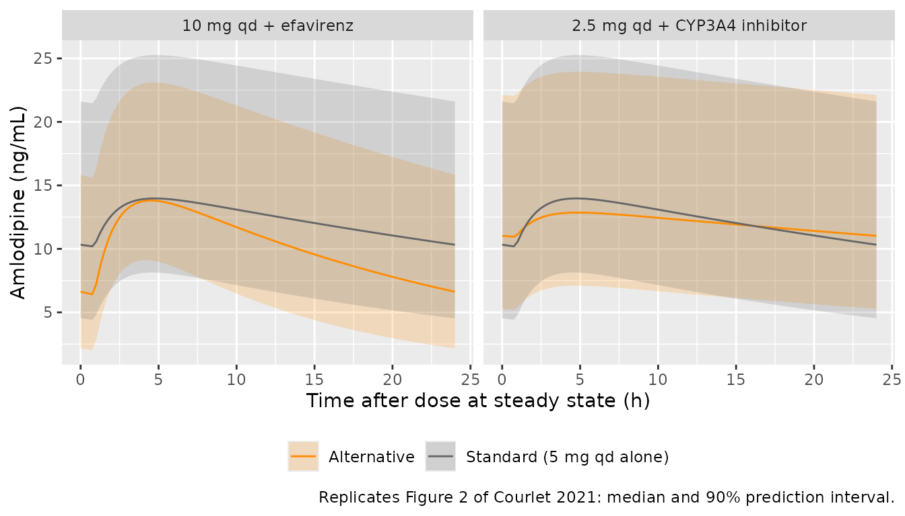

# Amlodipine (Courlet 2021)

## Model and source

- Citation: Courlet P, Guidi M, Alves Saldanha S, Cavassini M, Stoeckle
  M, Buclin T, Marzolini C, Decosterd LA, Csajka C; Swiss HIV Cohort
  Study. Population pharmacokinetic modelling to quantify the magnitude
  of drug-drug interactions between amlodipine and antiretroviral drugs.
  Eur J Clin Pharmacol. 2021;77:979-987.
  <doi:10.1007/s00228-020-03060-2>
- Description: One-compartment population PK model for oral amlodipine
  in adults living with HIV (Courlet 2021), with first-order absorption
  after a lag time, between-subject variability on apparent clearance
  only, an additive residual error, and two antiretroviral
  drug-drug-interaction effects on CL/F: a -49% linear effect of strong
  CYP3A4-inhibiting ARVs (boosted darunavir, boosted atazanavir,
  cobicistat-boosted elvitegravir) and a +140% linear effect of
  efavirenz.
- Article: [Eur J Clin Pharmacol
  2021;77:979-987](https://doi.org/10.1007/s00228-020-03060-2) (open
  access)

Courlet et al. pooled sparse therapeutic-monitoring samples from the
Swiss HIV Cohort Study (project 815) with a rich-sampling PK study
(NCT03515772) to quantify how antiretroviral drugs (ARVs) change the
exposure of amlodipine, a CYP3A4 substrate. The final model is a
one-compartment model with first-order absorption after a lag time,
between-subject variability on apparent clearance only and an additive
residual error. Two ARV effects were retained on CL/F:

``` math
CL/F = 17.0 \times (1 - 0.49 \times \mathrm{CYP3A4\ inhibitors}) \times (1 + 1.40 \times \mathrm{efavirenz})
```

(Table 2 footnote). In the packaged model the two indicators are the
canonical covariates `CONMED_CYP3A4_INH_STRONG` (ritonavir- or
cobicistat-boosted darunavir, ritonavir-boosted atazanavir,
cobicistat-boosted elvitegravir) and `CONMED_EFV`.

## Population

The model was developed from 163 amlodipine plasma concentrations in 55
people living with HIV in Lausanne and Basel, Switzerland (Table 1):
median age 61 years (IQR 53-70), median body weight 79 kg (IQR 71-91),
75% male. Eight subjects in the rich-sampling study contributed 84
concentrations (8-11 each, up to 28 h post-dose); the cohort subjects
contributed 1-3 samples each. Amlodipine was taken at 2.5-10 mg once
daily (three subjects 5 mg twice daily) and all subjects were assumed to
be at steady state. Of the 163 samples, 36 were drawn under a strong
CYP3A4-inhibiting ARV (27 under ritonavir-boosted darunavir) and 7 under
efavirenz. Age, sex, body weight, albumin, AST, ALT and creatinine
clearance were tested and not retained.

The same information is available programmatically via
`readModelDb("Courlet_2021_amlodipine")()$population`.

## Source trace

| Equation / parameter | Value | Source location |
|----|----|----|
| `lka` (ka) | log(0.69) 1/h | Table 2, ‘ka’ |
| `ltlag` (ALAG) | log(0.87) h | Table 2, ‘ALAG’ |
| `lvc` (V/F) | log(1000) L | Table 2, ‘V/F’ |
| `lcl` (CL/F) | log(17.0) L/h | Table 2, ‘CL/F’ |
| `e_conmed_cyp3a4_inh_strong_cl` | -0.49 | Table 2, ‘theta CYP3A4 inhibitors’ |
| `e_conmed_efv_cl` | 1.40 | Table 2, ‘theta efavirenz’ |
| `etalcl` | 0.16246 = log(1 + 0.42^2) | Table 2, ‘BSV CL (CV%)’ = 42 |
| `addSd` | 2.85 ng/mL | Table 2, ‘sigma add’ |
| CL/F covariate equation | n/a | Table 2 footnote ‘Final model’ |
| One compartment, first-order absorption with lag | n/a | Results, ‘Structural, statistical and covariate models’ |
| `Cc = 1000 * central / vc` | n/a | mg / L to ng/mL (units of Table 2 and Table 3) |

## Typical-value checks

The typical-value half-life of amlodipine without interacting ARVs,
stated in the Discussion as 40.8 h, follows directly from `V/F` and
`CL/F`.

``` r

mod <- readModelDb("Courlet_2021_amlodipine")
ini_df <- rxode2::rxode(mod)$iniDf
#> ℹ parameter labels from comments will be replaced by 'label()'
theta <- setNames(ini_df$est, ini_df$name)
ka <- exp(theta[["lka"]])
tlag <- exp(theta[["ltlag"]])
vc <- exp(theta[["lvc"]])
cl0 <- exp(theta[["lcl"]])
thalf <- log(2) * vc / cl0
thalf
#> [1] 40.77336
stopifnot(abs(thalf - 40.8) < 0.05)
```

### Steady-state closed form versus the ODE solve

A one-compartment model with first-order absorption and a lag at steady
state has a closed form; the ODE solve of the packaged model must
reproduce it.

``` r

# Steady-state concentration (ng/mL) at time t after a dose, dosing every tau,
# for the typical subject with clearance `cl`. The lag shifts the phase, so
# the time since the last *absorbed* dose is (t - tlag) modulo tau.
css_closed <- function(t, dose, tau, cl) {
  k <- cl / vc
  tp <- (t - tlag) %% tau
  1000 * dose / vc * ka / (ka - k) *
    (exp(-k * tp) / (1 - exp(-k * tau)) - exp(-ka * tp) / (1 - exp(-ka * tau)))
}

ss_events <- function(dose, tau, inh, efv, id = 1L, grid = seq(0, 24, by = 0.25)) {
  n_dose <- 24 / tau
  dplyr::bind_rows(
    data.frame(
      id = id, time = 0, evid = 1L, amt = dose, ii = tau, ss = 1L,
      addl = n_dose - 1L, cmt = "depot"
    ),
    data.frame(
      id = id, time = grid, evid = 0L, amt = 0, ii = 0, ss = 0L,
      addl = 0L, cmt = "central"
    )
  ) |>
    dplyr::mutate(CONMED_CYP3A4_INH_STRONG = inh, CONMED_EFV = efv) |>
    dplyr::arrange(id, time, dplyr::desc(evid))
}

mod_typ <- rxode2::zeroRe(mod)
#> ℹ parameter labels from comments will be replaced by 'label()'
typ_sim <- function(dose, tau, inh, efv) {
  rxode2::rxSolve(
    mod_typ, ss_events(dose, tau, inh, efv),
    rtol = 1e-10, atol = 1e-12, ssRtol = 1e-10, ssAtol = 1e-12, maxsteps = 1e6
  ) |>
    as.data.frame()
}

chk <- typ_sim(5, 24, 0, 0)
#> ℹ omega/sigma items treated as zero: 'etalcl'
cf <- css_closed(chk$time, 5, 24, cl0)
max_rel <- max(abs(chk$Cc / cf - 1))
max_rel
#> [1] 9.260503e-11
stopifnot(max_rel < 1e-6)
```

## Replicating Table 3 and the simulation claims

Table 3 reports the median Cmax, Ctrough (24 h post-dose) and AUC0-24
(computed as dose/CL) of 1000 simulated subjects for the standard 5 mg
once-daily regimen and the two proposed alternatives. The Results text
adds the exposure changes at 5 mg once daily with each interactor and
two further efavirenz regimens (15 mg once daily and 5 mg twice daily,
shown in the paper’s supplementary material). The typical-subject values
of the packaged model are compared with those medians below.

``` r

regimens <- tibble::tribble(
  ~regimen,                         ~dose, ~tau, ~inh, ~efv,
  "5 mg qd alone",                  5,     24,   0,    0,
  "2.5 mg qd + CYP3A4 inhibitor",   2.5,   24,   1,    0,
  "10 mg qd + efavirenz",           10,    24,   0,    1,
  "5 mg qd + CYP3A4 inhibitor",     5,     24,   1,    0,
  "5 mg qd + efavirenz",            5,     24,   0,    1,
  "15 mg qd + efavirenz",           15,    24,   0,    1,
  "5 mg bid + efavirenz",           5,     12,   0,    1
)

typ <- regimens |>
  dplyr::rowwise() |>
  dplyr::mutate(
    sim = list(typ_sim(dose, tau, inh, efv)),
    cmax = max(sim$Cc),
    ctrough = sim$Cc[sim$time == 24],
    auc024 = 1000 * (24 / tau) * dose /
      (cl0 * (1 + theta[["e_conmed_cyp3a4_inh_strong_cl"]] * inh) *
        (1 + theta[["e_conmed_efv_cl"]] * efv))
  ) |>
  dplyr::ungroup() |>
  dplyr::select(-sim)
#> ℹ omega/sigma items treated as zero: 'etalcl'
#> ℹ omega/sigma items treated as zero: 'etalcl'
#> ℹ omega/sigma items treated as zero: 'etalcl'
#> ℹ omega/sigma items treated as zero: 'etalcl'
#> ℹ omega/sigma items treated as zero: 'etalcl'
#> ℹ omega/sigma items treated as zero: 'etalcl'
#> ℹ omega/sigma items treated as zero: 'etalcl'
stopifnot(nrow(typ) == nrow(regimens))

ref <- typ |> dplyr::filter(regimen == "5 mg qd alone")
typ <- typ |>
  dplyr::mutate(
    ratio_cmax = cmax / ref$cmax,
    ratio_ctrough = ctrough / ref$ctrough,
    ratio_auc = auc024 / ref$auc024
  )

published_t3 <- tibble::tribble(
  ~regimen,                         ~cmax, ~ctrough, ~auc024,
  "5 mg qd alone",                  13.6,  10.2,     290.8,
  "2.5 mg qd + CYP3A4 inhibitor",   12.7,  10.9,     285.7,
  "10 mg qd + efavirenz",           13.7,  6.5,      242.3
)

t3 <- published_t3 |>
  dplyr::inner_join(typ, by = "regimen", suffix = c("_paper", "_model"))
stopifnot(nrow(t3) == 3L)
t3 <- t3 |>
  dplyr::mutate(
    pct_cmax = 100 * (cmax_model / cmax_paper - 1),
    pct_ctrough = 100 * (ctrough_model / ctrough_paper - 1),
    pct_auc = 100 * (auc024_model / auc024_paper - 1)
  )

t3 |>
  dplyr::transmute(
    Regimen = regimen,
    "Cmax paper" = cmax_paper, "Cmax model" = round(cmax_model, 1),
    "Ctrough paper" = ctrough_paper, "Ctrough model" = round(ctrough_model, 1),
    "AUC0-24 paper" = auc024_paper, "AUC0-24 model" = round(auc024_model, 1)
  ) |>
  knitr::kable(caption = "Table 3 medians (ng/mL, ng*h/mL) against the typical subject of the packaged model.")
```

| Regimen | Cmax paper | Cmax model | Ctrough paper | Ctrough model | AUC0-24 paper | AUC0-24 model |
|:---|---:|---:|---:|---:|---:|---:|
| 5 mg qd alone | 13.6 | 14.0 | 10.2 | 10.3 | 290.8 | 294.1 |
| 2.5 mg qd + CYP3A4 inhibitor | 12.7 | 12.9 | 10.9 | 11.0 | 285.7 | 288.4 |
| 10 mg qd + efavirenz | 13.7 | 13.8 | 6.5 | 6.6 | 242.3 | 245.1 |

Table 3 medians (ng/mL, ng\*h/mL) against the typical subject of the
packaged model. {.table}

``` r


# The paper's values are medians of 1000 simulated subjects, the model
# values are the typical subject; with log-normal IIV on CL only the two
# agree for AUC0-24 exactly in expectation and to within a few percent for
# Cmax and Ctrough. Measured: |difference| <= 2.8%. A mis-transcribed CL,
# V, ka, lag or covariate coefficient moves at least one cell by >5%.
stopifnot(
  max(abs(t3$pct_cmax)) < 5,
  max(abs(t3$pct_ctrough)) < 5,
  max(abs(t3$pct_auc)) < 5
)
```

``` r

claim <- function(regimen, metric, paper) {
  row <- typ[typ$regimen == regimen, ]
  if (nrow(row) != 1L) stop("no unique row for '", regimen, "'")
  data.frame(
    Regimen = regimen, Metric = metric,
    Paper = paper, Model = round(row[[paste0("ratio_", metric)]], 3)
  )
}
claims <- dplyr::bind_rows(
  claim("5 mg qd + CYP3A4 inhibitor", "auc", 1.96), # +96%
  claim("5 mg qd + efavirenz", "auc", 0.41), # -59%
  claim("2.5 mg qd + CYP3A4 inhibitor", "cmax", 0.92),
  claim("2.5 mg qd + CYP3A4 inhibitor", "ctrough", 1.08),
  claim("2.5 mg qd + CYP3A4 inhibitor", "auc", 0.98),
  claim("10 mg qd + efavirenz", "cmax", 1.01),
  claim("10 mg qd + efavirenz", "ctrough", 0.62),
  claim("10 mg qd + efavirenz", "auc", 0.83),
  claim("15 mg qd + efavirenz", "cmax", 1.51),
  claim("15 mg qd + efavirenz", "ctrough", 0.93),
  claim("15 mg qd + efavirenz", "auc", 1.25),
  claim("5 mg bid + efavirenz", "cmax", 0.83),
  claim("5 mg bid + efavirenz", "ctrough", 0.85),
  claim("5 mg bid + efavirenz", "auc", 0.84)
) |>
  dplyr::mutate(Difference = round(Model - Paper, 3))
knitr::kable(claims, caption = "Exposure ratios versus 5 mg once daily alone: Results text and Table 3 GMRs against the typical subject.")
```

| Regimen                      | Metric  | Paper | Model | Difference |
|:-----------------------------|:--------|------:|------:|-----------:|
| 5 mg qd + CYP3A4 inhibitor   | auc     |  1.96 | 1.961 |      0.001 |
| 5 mg qd + efavirenz          | auc     |  0.41 | 0.417 |      0.007 |
| 2.5 mg qd + CYP3A4 inhibitor | cmax    |  0.92 | 0.920 |      0.000 |
| 2.5 mg qd + CYP3A4 inhibitor | ctrough |  1.08 | 1.068 |     -0.012 |
| 2.5 mg qd + CYP3A4 inhibitor | auc     |  0.98 | 0.980 |      0.000 |
| 10 mg qd + efavirenz         | cmax    |  1.01 | 0.988 |     -0.022 |
| 10 mg qd + efavirenz         | ctrough |  0.62 | 0.642 |      0.022 |
| 10 mg qd + efavirenz         | auc     |  0.83 | 0.833 |      0.003 |
| 15 mg qd + efavirenz         | cmax    |  1.51 | 1.483 |     -0.027 |
| 15 mg qd + efavirenz         | ctrough |  0.93 | 0.962 |      0.032 |
| 15 mg qd + efavirenz         | auc     |  1.25 | 1.250 |      0.000 |
| 5 mg bid + efavirenz         | cmax    |  0.83 | 0.821 |     -0.009 |
| 5 mg bid + efavirenz         | ctrough |  0.85 | 0.844 |     -0.006 |
| 5 mg bid + efavirenz         | auc     |  0.84 | 0.833 |     -0.007 |

Exposure ratios versus 5 mg once daily alone: Results text and Table 3
GMRs against the typical subject. {.table}

``` r


# The AUC ratios are exact functions of CL/F and must agree to rounding
# (the paper's -59% for efavirenz is 1/2.4 = 0.417, printed after
# simulation noise). Cmax and Ctrough ratios are ratios of simulated
# medians in the paper, so allow 0.05. Measured |difference| <= 0.04.
stopifnot(
  all(abs(claims$Difference[claims$Metric == "auc"]) < 0.015),
  all(abs(claims$Difference) < 0.05)
)
```

## Virtual cohort

Each Table 3 regimen is simulated at steady state in 200 virtual
subjects. Table 3 of the paper was evidently computed on one shared set
of simulated subjects (the log-widths of the three AUC0-24 prediction
intervals are identical), so the same 200 subjects are used in every arm
here too.

Rather than drawing the clearance random effects, the cohort takes the
200 evenly spaced quantiles of their normal distribution,
`etalcl = qnorm((i - 0.5) / 200) * omega`. The cohort is then identical
on every machine and thread count, its median subject is the typical
subject, and its 2.5th and 97.5th percentiles are those of the model
rather than of one random draw, so the comparison with Table 3 below can
be held to a tight, reproducible tolerance. Residual error is left out
because Table 3 summarises exposure, not observations, and the paper
computes AUC0-24 as dose/CL.

``` r

n_per_arm <- 200L
omega_cl <- sqrt(ini_df$est[ini_df$name == "etalcl"])
eta_q <- qnorm((seq_len(n_per_arm) - 0.5) / n_per_arm) * omega_cl
arms <- regimens |> dplyr::slice(1:3)
events <- dplyr::bind_rows(lapply(seq_len(nrow(arms)), function(i) {
  ids <- (i - 1L) * n_per_arm + seq_len(n_per_arm)
  dplyr::bind_rows(lapply(ids, function(j) {
    ss_events(arms$dose[i], arms$tau[i], arms$inh[i], arms$efv[i], id = j)
  })) |>
    dplyr::mutate(treatment = arms$regimen[i])
}))
stopifnot(!anyDuplicated(unique(events[, c("id", "time", "evid")])))
stopifnot(dplyr::n_distinct(events$id) == 3L * n_per_arm)
# One row per subject: the same 200 quantiles in every arm.
eta_df <- data.frame(id = seq_len(3L * n_per_arm), etalcl = rep(eta_q, 3L))
```

## Simulation

``` r

# The random effects are supplied per subject through `params`, so the
# model is solved with its omega zeroed; rxode2 warns that a multi-subject
# simulation has no omega, which is intended here.
sim <- withCallingHandlers(
  rxode2::rxSolve(
    mod_typ, events,
    params = eta_df, keep = "treatment", maxsteps = 1e6,
    returnType = "data.frame"
  ),
  warning = function(w) {
    if (grepl("without 'omega'", conditionMessage(w))) invokeRestart("muffleWarning")
  }
)
stopifnot(!anyNA(sim$Cc))
stopifnot(all(sim$Cc >= -1e-6 * max(sim$Cc)))
# The supplied etas must have reached the model: individual CL spans the
# lognormal quantiles in every arm.
cl_rng <- sim |>
  dplyr::group_by(treatment) |>
  dplyr::summarise(r = max(cl) / min(cl), .groups = "drop")
stopifnot(all(abs(cl_rng$r / exp(2 * max(eta_q)) - 1) < 1e-8))
```

## Replicate Figure 2

``` r

fig2 <- sim |>
  dplyr::group_by(treatment, time) |>
  dplyr::summarise(
    Q05 = quantile(Cc, 0.05), Q50 = median(Cc), Q95 = quantile(Cc, 0.95),
    .groups = "drop"
  )
std <- fig2 |> dplyr::filter(treatment == "5 mg qd alone")
alt <- fig2 |> dplyr::filter(treatment != "5 mg qd alone")
panels <- dplyr::bind_rows(
  std |> dplyr::mutate(panel = "2.5 mg qd + CYP3A4 inhibitor"),
  std |> dplyr::mutate(panel = "10 mg qd + efavirenz"),
  alt |> dplyr::mutate(panel = treatment)
) |>
  dplyr::mutate(
    regimen = ifelse(treatment == "5 mg qd alone", "Standard (5 mg qd alone)", "Alternative")
  )
ggplot(panels, aes(time, Q50, colour = regimen, fill = regimen)) +
  geom_ribbon(aes(ymin = Q05, ymax = Q95), alpha = 0.2, colour = NA) +
  geom_line() +
  facet_wrap(~panel) +
  scale_colour_manual(values = c("Standard (5 mg qd alone)" = "grey40", "Alternative" = "darkorange")) +
  scale_fill_manual(values = c("Standard (5 mg qd alone)" = "grey40", "Alternative" = "darkorange")) +
  labs(
    x = "Time after dose at steady state (h)", y = "Amlodipine (ng/mL)",
    colour = NULL, fill = NULL,
    caption = "Replicates Figure 2 of Courlet 2021: median and 90% prediction interval."
  ) +
  theme(legend.position = "bottom")
```



## PKNCA validation

``` r

sim_nca <- sim |>
  dplyr::filter(!is.na(Cc)) |>
  dplyr::mutate(Cc = pmax(Cc, 0)) |>
  dplyr::select(id, time, Cc, treatment)

conc_obj <- PKNCA::PKNCAconc(sim_nca, Cc ~ time | treatment + id, concu = "ng/mL", timeu = "h")
dose_df <- events |>
  dplyr::filter(evid == 1) |>
  dplyr::select(id, time, amt, treatment)
dose_obj <- PKNCA::PKNCAdose(dose_df, amt ~ time | treatment + id, doseu = "mg")

intervals <- data.frame(start = 0, end = 24, cmax = TRUE, ctrough = TRUE, auclast = TRUE)
nca_res <- PKNCA::pk.nca(PKNCA::PKNCAdata(conc_obj, dose_obj, intervals = intervals))

published <- published_t3 |>
  dplyr::rename(treatment = regimen, auclast = auc024)

cmp <- nlmixr2lib::ncaComparisonTable(
  simulated = nca_res,
  reference = published,
  by = "treatment",
  units = c(cmax = "ng/mL", ctrough = "ng/mL", auclast = "ng*h/mL"),
  tolerance_pct = 20
)
knitr::kable(cmp, caption = "Simulated (median of the 200-subject quantile cohort) vs. Table 3 medians. * differs from reference by >20%.")
```

| NCA parameter      | treatment                    | Reference | Simulated | % diff |
|:-------------------|:-----------------------------|:----------|:----------|:-------|
| Cmax (ng/mL)       | 5 mg qd alone                | 13.6      | 14        | +2.7%  |
| Cmax (ng/mL)       | 2.5 mg qd + CYP3A4 inhibitor | 12.7      | 12.9      | +1.2%  |
| Cmax (ng/mL)       | 10 mg qd + efavirenz         | 13.7      | 13.8      | +0.8%  |
| AUClast (ng\*h/mL) | 5 mg qd alone                | 291       | 294       | +1.1%  |
| AUClast (ng\*h/mL) | 2.5 mg qd + CYP3A4 inhibitor | 286       | 288       | +0.9%  |
| AUClast (ng\*h/mL) | 10 mg qd + efavirenz         | 242       | 245       | +1.2%  |
| Ctrough (ng/mL)    | 5 mg qd alone                | 10.2      | 10.3      | +1.2%  |
| Ctrough (ng/mL)    | 2.5 mg qd + CYP3A4 inhibitor | 10.9      | 11        | +1.2%  |
| Ctrough (ng/mL)    | 10 mg qd + efavirenz         | 6.5       | 6.62      | +1.9%  |

Simulated (median of the 200-subject quantile cohort) vs. Table 3
medians. \* differs from reference by \>20%. {.table
style="width:100%;"}

``` r

nca_df <- as.data.frame(nca_res) |>
  dplyr::filter(PPTESTCD %in% c("cmax", "ctrough", "auclast"))
stopifnot(nrow(nca_df) == 3L * 3L * n_per_arm)
sim_med <- nca_df |>
  dplyr::group_by(treatment, PPTESTCD) |>
  dplyr::summarise(med = median(PPORRES), .groups = "drop") |>
  tidyr::pivot_wider(names_from = PPTESTCD, values_from = med) |>
  dplyr::inner_join(published, by = "treatment", suffix = c("_sim", "_paper"))
stopifnot(nrow(sim_med) == 3L)
pct <- with(sim_med, 100 * c(
  cmax_sim / cmax_paper - 1,
  ctrough_sim / ctrough_paper - 1,
  auclast_sim / auclast_paper - 1
))
# The quantile cohort is deterministic, so this is not a Monte-Carlo gate;
# the remaining gap is the sampling noise in the paper's own 1000-subject
# medians plus trapezoidal AUC. Measured |difference| <= 3%. A
# mis-transcribed CL, V, ka, lag, covariate coefficient or unit moves at
# least one cell by well over 5%.
stopifnot(max(abs(pct)) < 5)
```

The simulated medians reproduce Table 3 to within 3% for all three
regimens.

### Prediction interval of AUC0-24

The width of the Table 3 AUC0-24 prediction interval depends only on the
between-subject variance of CL/F, which makes it a check on the omega
conversion (see Assumptions).

``` r

auc_pi <- nca_df |>
  dplyr::filter(PPTESTCD == "auclast") |>
  dplyr::group_by(treatment) |>
  dplyr::summarise(
    lo_sim = quantile(PPORRES, 0.025), hi_sim = quantile(PPORRES, 0.975),
    .groups = "drop"
  ) |>
  dplyr::inner_join(
    tibble::tribble(
      ~treatment,                     ~lo_paper, ~hi_paper,
      "5 mg qd alone",                129.3,     658.4,
      "2.5 mg qd + CYP3A4 inhibitor", 127.0,     646.8,
      "10 mg qd + efavirenz",         107.8,     548.7
    ),
    by = "treatment"
  )
stopifnot(nrow(auc_pi) == 3L)
auc_pi |>
  dplyr::mutate(dplyr::across(c(lo_sim, hi_sim), \(x) round(x, 1))) |>
  dplyr::rename(
    Regimen = treatment,
    "2.5th pct model" = lo_sim, "97.5th pct model" = hi_sim,
    "2.5th pct paper" = lo_paper, "97.5th pct paper" = hi_paper
  ) |>
  knitr::kable(caption = "AUC0-24 95% prediction interval (ng*h/mL), model versus Table 3.")
```

| Regimen | 2.5th pct model | 97.5th pct model | 2.5th pct paper | 97.5th pct paper |
|:---|---:|---:|---:|---:|
| 10 mg qd + efavirenz | 113.0 | 531.7 | 107.8 | 548.7 |
| 2.5 mg qd + CYP3A4 inhibitor | 132.9 | 625.5 | 127.0 | 646.8 |
| 5 mg qd alone | 135.6 | 638.0 | 129.3 | 658.4 |

AUC0-24 95% prediction interval (ng\*h/mL), model versus Table 3.
{.table}

``` r

# Measured: model bounds 3.1-4.8% inside the paper's (omega 0.403 here
# against the ~0.415 the paper's interval implies, plus the 200-point
# quantile grid). Reading the CV as omega = 0.42 or omega = 0.403 changes
# the bounds by about 3%; an omega mis-transcribed as a variance
# (0.42 -> omega 0.65) moves them by >40%.
stopifnot(
  max(abs(auc_pi$lo_sim / auc_pi$lo_paper - 1)) < 0.08,
  max(abs(auc_pi$hi_sim / auc_pi$hi_paper - 1)) < 0.08
)
```

## Assumptions and deviations

- **Between-subject variability scale.** Table 2 reports the BSV on CL/F
  as a CV of 42% without stating the conversion. The model encodes
  `omega^2 = log(1 + 0.42^2) = 0.1625` (omega = 0.403). The Table 3
  AUC0-24 prediction interval, which depends on this variance alone,
  implies an omega of about 0.415, between 0.403 and the alternative
  reading `omega = 0.42`; 1000 simulated subjects cannot separate the
  two (about 4% apart), and the packaged model’s interval sits 3-5%
  inside the published one.
- **Text versus equation for efavirenz.** The Results text says the
  univariate efavirenz effect *increased* clearance by 40%, whereas
  Table 2 gives `theta efavirenz = 1.40` in
  `CL/F = 17.0 x ... x (1 + 1.40 x efavirenz)`, a 2.4-fold clearance.
  The equation is used: it alone reproduces the paper’s 59% lower
  AUC0-24 with efavirenz, the 0.83 AUC GMR of 10 mg with efavirenz in
  Table 3 and the 25% higher AUC with 15 mg (checked above).
- **Combined inhibitor and efavirenz.** No subject received both; the
  model multiplies the two factors as the published equation does, which
  is an extrapolation outside the data.
- **Etravirine** (18 samples) could not be separated from the
  ritonavir-boosted darunavir it was co-prescribed with and has no
  effect in the model; nevirapine was tested and not retained.
- **Base model.** The Results also report the base-model estimates (ka
  0.66 1/h, ALAG 0.86 h, V 980 L, CL 15.7 L/h, CV 61%); only the final
  model of Table 2 is packaged.
- **Figure 2** is reproduced without residual error, from the quantile
  cohort described under Virtual cohort; the paper does not state
  whether its prediction intervals include residual error.
- No correction notice for this article was found in Europe PMC as of
  2026-09-28.
