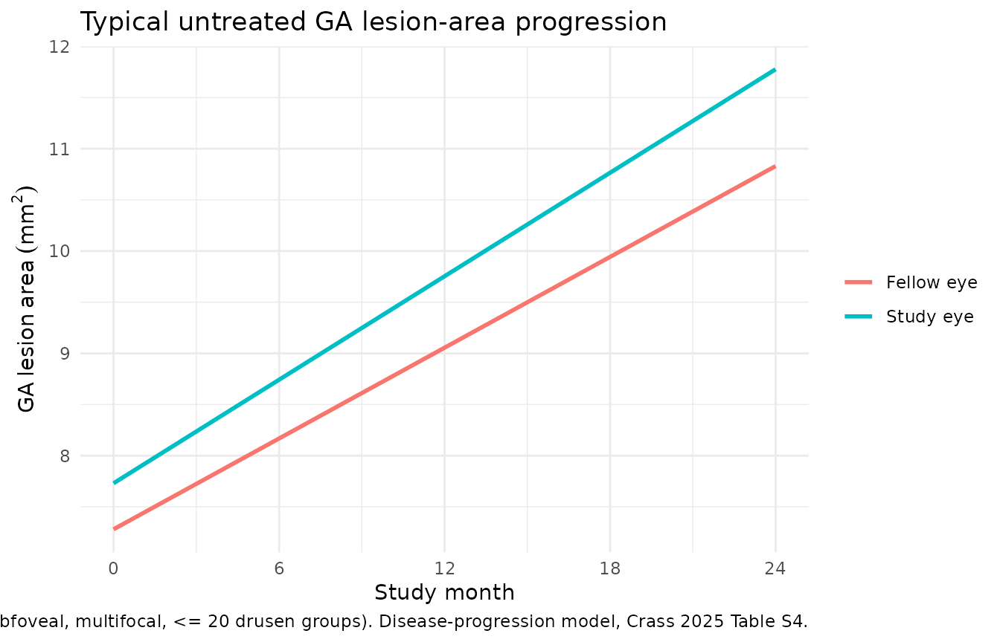
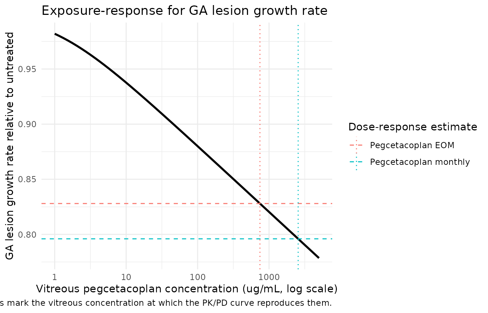
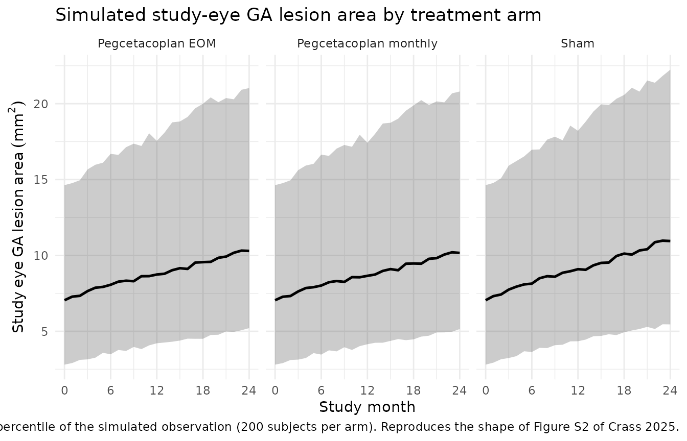
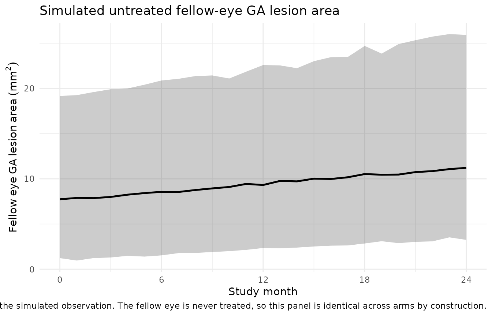

# Pegcetacoplan geographic atrophy lesion area (Crass 2025)

## Model and source

Crass 2025 built three nested-in-purpose models of geographic atrophy
(GA) lesion area, each reported with its own parameter table, so this
paper contributes three model files:

``` r

mods <- c(
  progression       = "Crass_2025_pegcetacoplan_ga_progression",
  dose_response     = "Crass_2025_pegcetacoplan_ga_doseresponse",
  exposure_response = "Crass_2025_pegcetacoplan_ga_exposureresponse"
)
uis <- lapply(mods, function(nm) rxode2::rxode(readModelDb(nm)))
#> Warning: some etas defaulted to non-mu referenced, possible parsing error: etalrbase_study, etalslope_study, etalrbase_fellow, etalslope_fellow
#> as a work-around try putting the mu-referenced expression on a simple line
#> Warning: some etas defaulted to non-mu referenced, possible parsing error: etalrbase_study, etalslope_study, etalrbase_fellow, etalslope_fellow
#> as a work-around try putting the mu-referenced expression on a simple line
#> Warning: some etas defaulted to non-mu referenced, possible parsing error: etalrbase_study, etalslope_study, etalrbase_fellow, etalslope_fellow
#> as a work-around try putting the mu-referenced expression on a simple line
```

| File | Role | Source table |
|----|----|----|
| `Crass_2025_pegcetacoplan_ga_progression` | Untreated natural-history layer, fit to sham-treated study eyes and untreated fellow eyes | Data S1 Table S4 |
| `Crass_2025_pegcetacoplan_ga_doseresponse` | Adds a per-regimen step-function pegcetacoplan effect on the study-eye growth rate | Data S1 Table S5 |
| `Crass_2025_pegcetacoplan_ga_exposureresponse` | Final PK/PD model; the drug effect is linear in log vitreous pegcetacoplan concentration | Data S1 Table S6 |

- Citation: Crass RL, Prem K, Gaudreault F, Lusk E, Ribeiro R, Chapel S,
  Baumal CR. Pharmacokinetic/pharmacodynamic analysis of geographic
  atrophy lesion area in patients receiving pegcetacoplan treatment or
  sham. CPT Pharmacometrics Syst Pharmacol. 2025;14(2):257-267.
  <doi:10.1002/psp4.13264>. Parameter values from Supporting Information
  Data S1, Table S6; model equations from Data S1 ‘The following
  equations describe the exposure-response model’. Vitreous
  concentrations were generated in the source analysis by an external
  population PK model reported only as a conference presentation (Crass
  RL, Smith B, Epling D, Chapel S, Prem K, Gaudreault F. Population
  pharmacokinetics of pegcetacoplan in patients with neovascular
  age-related macular degeneration and geographic atrophy. American
  Conference on Pharmacometrics, November 5-8 2023, National Harbor MD),
  which is not reproduced here; supply the concentration trajectory
  through the CEFFECT covariate column.
- Article: <https://doi.org/10.1002/psp4.13264>
- Supplement (Data S1, Tables S1-S6 and the model equations):
  <https://doi.org/10.1002/psp4.13264> (Supporting Information)

All three share the same structural skeleton. Lesion area in each eye is
**algebraic in study time**, not an integrated ODE:

``` math
A_{i,\text{eye}}(t) = \text{INIT}_{i,\text{eye}} + \text{SLOPE}_{i,\text{eye}}(t) \cdot t
```

Study eye and fellow eye are fit jointly with a 4x4 correlated
between-subject random-effect block over (initial area, slope) x (study
eye, fellow eye); every eta is Box-Cox transformed. Because there are no
`d/dt()` states, simulation event tables tag observation rows with
`dvid` (1 = study eye, 2 = fellow eye) and leave `cmt` missing.

## Population

The analysis pooled 1501 patients with GA secondary to age-related
macular degeneration from three trials: the 12-month phase II FILLY
trial (NCT02503332, n = 246) and the 24-month phase III OAKS
(NCT03525613, n = 636) and DERBY (NCT03525600, n = 620) trials. Patients
were randomised 2:2:1:1 to intravitreal pegcetacoplan 15 mg monthly (n =
505), pegcetacoplan 15 mg every other month (n = 498), sham monthly, or
sham every other month (n = 498 combined sham).

The population was elderly (median age 79 years, range 60-100),
predominantly female (62%) and White (94%). At baseline 81% had
bilateral GA, 63% had subfoveal lesions, 70% had multifocal lesions, and
45% had more than 20 intermediate or large drusen groups in the study
eye. Median baseline lesion area was 8 mm^2 (range 2-18); trial entry
required a total GA lesion area between 2.5 and 17.5 mm^2 with at least
one lesion \>= 1.25 mm^2 if multifocal. These figures are Table 1 of
Crass 2025. Note that Table 1 reports n = 1502 including one patient
without quantifiable PK samples who was excluded from the PK/PD
modelling analyses.

The same information is available programmatically:

``` r

str(uis$exposure_response$population, max.level = 1, give.attr = FALSE)
#> List of 13
#>  $ species       : chr "human"
#>  $ n_subjects    : int 1501
#>  $ n_studies     : int 3
#>  $ age_range     : chr "60-100 years (pooled); FILLY enrolled patients aged >= 50 years, OAKS and DERBY >= 60 years"
#>  $ age_median    : chr "79 years"
#>  $ weight_range  : chr NA
#>  $ weight_median : chr NA
#>  $ sex_female_pct: num 62
#>  $ race_ethnicity: Named num [1:5] 94 0.4 0.5 0.2 5
#>  $ disease_state : chr "Geographic atrophy secondary to age-related macular degeneration. Baseline total GA lesion area 2.5-17.5 mm^2 i"| __truncated__
#>  $ dose_range    : chr "Intravitreal pegcetacoplan 15 mg (0.1 mL of 150 mg/mL) monthly (n = 505) or every other month (n = 498), or sha"| __truncated__
#>  $ regions       : chr "(not reported in Crass 2025)"
#>  $ notes         : chr "Pooled from the 12-month phase II FILLY trial (NCT02503332, n = 246) and the 24-month phase III OAKS (NCT035256"| __truncated__
```

## Source trace

Every `ini()` entry in each model file carries an in-file comment naming
its source location. Collected here for review:

| Parameter | Progression (Table S4) | Dose-response (Table S5) | PK/PD (Table S6) |
|----|----|----|----|
| Study eye initial lesion area, mm^2 | 7.73 | 7.69 | 7.69 |
| Study eye time slope, mm^2/day | 0.00554 | 0.00565 | 0.00559 |
| Fellow eye initial lesion area, mm^2 | 7.28 | 7.25 | 7.25 |
| Fellow eye time slope, mm^2/day | 0.00486 | 0.00491 | 0.00490 |
| Unilateral GA on study eye initial area | -0.169 | -0.124 | -0.123 |
| Unilateral GA on study eye slope | -0.151 | -0.138 | -0.139 |
| No subfoveal involvement on slope | 0.179 | 0.119 | 0.118 |
| Unifocal GA on slope | -0.156 | -0.165 | -0.164 |
| More (\>20) drusen groups on slope | -0.147 | -0.132 | -0.130 |
| Monthly drug effect, proportion | – | -0.204 | – |
| Every-other-month drug effect, proportion | – | -0.172 | – |
| Drug effect slope, proportion/log(ug/mL) | – | – | -0.026 |
| Box-Cox lambda, study initial / study slope | -0.306 / -0.270 | -0.312 / -0.281 | -0.313 / -0.287 |
| Box-Cox lambda, fellow initial / fellow slope | -0.540 / -0.348 | -0.536 / -0.404 | -0.537 / -0.405 |
| Residual, study eye proportional / additive (mm^2) | 0.0244 / 0.192 | 0.0276 / 0.175 | 0.0276 / 0.175 |
| Residual, fellow eye proportional / additive (mm^2) | 0.0310 / 0.207 | 0.0309 / 0.207 | 0.0309 / 0.207 |
| IIV 4x4 block (variances, covariances) | Table S4 | Table S5 | Table S6 |

Model equations are transcribed from the Data S1 block headed “The
following equations describe the exposure-response model”, which defines
`INIT_i,study`, `SLOPE_i,study`, `DSLOPE_i,study(t)`, `INIT_i,fellow`
and `SLOPE_i,fellow` and names each theta.

### Interindividual-variability block

The encoded 4x4 blocks are checked here directly against the
correlations the paper reports in the transformed column of Tables S4-S6
(and, for the study-vs-fellow slope pair, against the value quoted in
the Discussion).

``` r

omega_corr <- function(ui) {
  om <- ui$omega
  cv <- stats::cov2cor(om)
  data.frame(
    pair = c("slope study : init study", "init fellow : init study",
             "init fellow : slope study", "slope fellow : init study",
             "slope fellow : slope study", "slope fellow : init fellow"),
    encoded = c(cv[2, 1], cv[3, 1], cv[3, 2], cv[4, 1], cv[4, 2], cv[4, 3])
  )
}

corr_tab <- omega_corr(uis$progression) |>
  dplyr::rename("Random-effect pair" = pair, "Encoded (Table S4)" = encoded) |>
  dplyr::mutate(
    `Published rho` = c(0.411, 0.676, 0.351, 0.445, 0.705, 0.408),
    `Abs. difference` = abs(`Encoded (Table S4)` - `Published rho`)
  )

knitr::kable(
  corr_tab, digits = 4,
  caption = paste(
    "Correlations implied by the encoded Table S4 covariance block vs the",
    "values printed in the source table. The 0.705 study-vs-fellow slope",
    "correlation is the value quoted in the Crass 2025 Discussion."
  )
)
```

| Random-effect pair         | Encoded (Table S4) | Published rho | Abs. difference |
|:---------------------------|-------------------:|--------------:|----------------:|
| slope study : init study   |             0.4109 |         0.411 |           1e-04 |
| init fellow : init study   |             0.6769 |         0.676 |           9e-04 |
| init fellow : slope study  |             0.3513 |         0.351 |           3e-04 |
| slope fellow : init study  |             0.4440 |         0.445 |           1e-03 |
| slope fellow : slope study |             0.7043 |         0.705 |           7e-04 |
| slope fellow : init fellow |             0.4083 |         0.408 |           3e-04 |

Correlations implied by the encoded Table S4 covariance block vs the
values printed in the source table. The 0.705 study-vs-fellow slope
correlation is the value quoted in the Crass 2025 Discussion. {.table}

``` r


stopifnot(nrow(corr_tab) == 6L, max(corr_tab$`Abs. difference`) < 0.002)
```

Every encoded correlation reproduces the published value to within
0.002, so the covariance block was transcribed correctly (the residual
difference is the source table’s three-significant-figure rounding).

## Virtual cohort

Original patient-level data are not publicly available. The simulations
below use virtual cohorts whose baseline-disease covariate distributions
match the published Table 1 marginals. Cohort size is 200 per arm.

``` r

set.seed(20250213)

VISIT_DAYS <- round(seq(0, 24, by = 1) * 30.4375, 3)  # monthly visits to month 24

# Build one arm as an event table. Both endpoints are algebraic, so
# observation rows carry dvid (1 = study eye, 2 = fellow eye) and a missing
# cmt; there are no dosing records at all -- the pegcetacoplan regimen enters
# through REGI_QM / REGI_Q2M (dose-response) or CEFFECT (exposure-response).
make_arm <- function(n, arm, id_offset = 0L,
                     regi_qm = 0, regi_q2m = 0, ceffect = 0,
                     unilateral = NULL, nonsubfoveal = NULL,
                     unifocal = NULL, drusen = NULL,
                     dvids = c(1L, 2L)) {
  subj <- tibble::tibble(
    id                  = id_offset + seq_len(n),
    arm                 = arm,
    REGI_QM             = regi_qm,
    REGI_Q2M            = regi_q2m,
    CEFFECT             = ceffect,
    DIS_GA_UNILATERAL   = if (is.null(unilateral))   stats::rbinom(n, 1, 0.19) else unilateral,
    DIS_GA_NONSUBFOVEAL = if (is.null(nonsubfoveal)) stats::rbinom(n, 1, 0.37) else nonsubfoveal,
    DIS_GA_UNIFOCAL     = if (is.null(unifocal))     stats::rbinom(n, 1, 0.30) else unifocal,
    DRUSEN_GT20         = if (is.null(drusen))       stats::rbinom(n, 1, 0.45) else drusen
  )
  subj |>
    tidyr::crossing(time = VISIT_DAYS, dvid = dvids) |>
    dplyr::mutate(evid = 0L, amt = NA_real_, cmt = NA_integer_) |>
    dplyr::arrange(id, dvid, time)
}

KEEP_COLS <- c("arm", "REGI_QM", "REGI_Q2M", "CEFFECT", "DIS_GA_UNILATERAL",
               "DIS_GA_NONSUBFOVEAL", "DIS_GA_UNIFOCAL", "DRUSEN_GT20")

# Deterministic (typical-value) solve. `omega = NA` suppresses the random
# effects so the prediction is the typical individual rather than a population
# median; it is used in preference to zeroRe() because zeroRe() mutates the ui
# it is handed, and the same ui objects are reused across chunks here.
solve_typical <- function(ui, events) {
  rxode2::rxSolve(ui, events = events, omega = NA, keep = KEEP_COLS,
                  returnType = "data.frame")
}
```

## Untreated disease progression (paper Results, “Disease progression model”)

Crass 2025 reports that lesion growth in untreated eyes “was estimated
at 2.02 mm^2/year from an estimated baseline lesion area of 7.73 mm^2 in
patients with bilateral GA, subfoveal involvement, multifocal
distribution, and fewer (\<= 20) intermediate or large drusen groups” –
i.e. the reference covariate state in which every indicator is 0.

``` r

ref_arm <- make_arm(
  n = 1L, arm = "reference (all covariates 0)", dvids = 1L,
  unilateral = 0, nonsubfoveal = 0, unifocal = 0, drusen = 0
)

nh <- solve_typical(uis$progression, ref_arm)

nh_summary <- nh |>
  dplyr::summarise(
    `Study eye baseline (mm^2)`        = dplyr::first(rbaseStudy),
    `Study eye growth (mm^2/year)`     = dplyr::first(slopeStudy) * 365.25,
    `Fellow eye baseline (mm^2)`       = dplyr::first(rbaseFellow),
    `Fellow eye growth (mm^2/year)`    = dplyr::first(slopeFellow) * 365.25
  ) |>
  tidyr::pivot_longer(dplyr::everything(), names_to = "Quantity", values_to = "Simulated")

nh_summary$Published <- c(7.73, 2.02, 7.28, NA_real_)

knitr::kable(
  nh_summary, digits = 3,
  caption = paste(
    "Typical untreated GA progression from the disease-progression model",
    "(Table S4) vs the values stated in the Crass 2025 Results. The fellow-eye",
    "annual rate is not quoted numerically in the paper."
  )
)
```

| Quantity                      | Simulated | Published |
|:------------------------------|----------:|----------:|
| Study eye baseline (mm^2)     |     7.730 |      7.73 |
| Study eye growth (mm^2/year)  |     2.023 |      2.02 |
| Fellow eye baseline (mm^2)    |     7.280 |      7.28 |
| Fellow eye growth (mm^2/year) |     1.775 |        NA |

Typical untreated GA progression from the disease-progression model
(Table S4) vs the values stated in the Crass 2025 Results. The
fellow-eye annual rate is not quoted numerically in the paper. {.table}

``` r


stopifnot(
  abs(nh_summary$Simulated[1] - 7.73) < 0.005,
  abs(nh_summary$Simulated[2] - 2.02) < 0.01,
  abs(nh_summary$Simulated[3] - 7.28) < 0.005
)
```

The model reproduces both headline numbers exactly: 2.023 mm^2/year of
study-eye lesion growth from a 7.73 mm^2 baseline.

``` r

nh_long <- nh |>
  dplyr::select(time, lesionStudy, lesionFellow) |>
  dplyr::distinct() |>
  tidyr::pivot_longer(c(lesionStudy, lesionFellow),
                      names_to = "Eye", values_to = "area") |>
  dplyr::mutate(Eye = ifelse(Eye == "lesionStudy", "Study eye", "Fellow eye"),
                month = time / 30.4375)

ggplot(nh_long, aes(month, area, colour = Eye)) +
  geom_line(linewidth = 1) +
  scale_x_continuous(breaks = seq(0, 24, 6)) +
  labs(x = "Study month", y = expression(GA~lesion~area~(mm^2)),
       colour = NULL,
       title = "Typical untreated GA lesion-area progression",
       caption = paste("Reference covariate state (bilateral, subfoveal,",
                       "multifocal, <= 20 drusen groups). Disease-progression",
                       "model, Crass 2025 Table S4.")) +
  theme_minimal()
```



## Baseline-disease covariate effects (replicates Figure 2)

Figure 2 of Crass 2025 is a forest plot of the fold-change in predicted
median lesion-area growth at month 24 for each baseline-disease
covariate. Because every covariate enters the study-eye slope as a
proportional shift `(1 + theta * indicator)` and growth from baseline is
`slope * t`, the fold-effect is exactly `1 + theta`. The check below
computes it by simulation rather than asserting the algebra.

``` r

cov_specs <- tibble::tribble(
  ~label,                              ~covariate,
  "Unilateral vs bilateral GA",        "DIS_GA_UNILATERAL",
  "Nonsubfoveal vs subfoveal",         "DIS_GA_NONSUBFOVEAL",
  "Unifocal vs multifocal",            "DIS_GA_UNIFOCAL",
  "> 20 vs <= 20 drusen groups",       "DRUSEN_GT20"
)

# Growth from baseline at month 24 for a typical individual with one
# covariate switched on, relative to the all-zero reference state.
growth_24mo <- function(ui, covariate, value) {
  args <- list(n = 1L, arm = "x", dvids = 1L,
               unilateral = 0, nonsubfoveal = 0, unifocal = 0, drusen = 0)
  slot <- c(DIS_GA_UNILATERAL = "unilateral", DIS_GA_NONSUBFOVEAL = "nonsubfoveal",
            DIS_GA_UNIFOCAL = "unifocal", DRUSEN_GT20 = "drusen")[[covariate]]
  args[[slot]] <- value
  s <- solve_typical(ui, do.call(make_arm, args))
  end <- s$lesionStudy[which.max(s$time)]
  start <- s$lesionStudy[which.min(s$time)]
  end - start
}

fig2 <- cov_specs |>
  dplyr::rowwise() |>
  dplyr::mutate(
    Simulated = growth_24mo(uis$exposure_response, covariate, 1) /
      growth_24mo(uis$exposure_response, covariate, 0)
  ) |>
  dplyr::ungroup()

fig2$Published <- c(0.860, 1.12, 0.837, 0.869)
fig2$`Published 90% CI` <- c("0.808, 0.913", "1.07, 1.16",
                             "0.800, 0.872", "0.837, 0.904")
fig2$`Abs. difference` <- abs(fig2$Simulated - fig2$Published)

fig2 |>
  dplyr::select(-covariate) |>
  dplyr::rename("Baseline disease factor" = label,
                "Simulated fold-change" = Simulated,
                "Published fold-change" = Published) |>
  knitr::kable(
    digits = 3,
    caption = paste(
      "Fold-change in month-24 study-eye lesion growth per baseline disease",
      "factor. Replicates Figure 2 of Crass 2025; published point estimates",
      "are quoted in the Results section."
    )
  )
```

| Baseline disease factor | Simulated fold-change | Published fold-change | Published 90% CI | Abs. difference |
|:---|---:|---:|:---|---:|
| Unilateral vs bilateral GA | 0.861 | 0.860 | 0.808, 0.913 | 0.001 |
| Nonsubfoveal vs subfoveal | 1.118 | 1.120 | 1.07, 1.16 | 0.002 |
| Unifocal vs multifocal | 0.836 | 0.837 | 0.800, 0.872 | 0.001 |
| \> 20 vs \<= 20 drusen groups | 0.870 | 0.869 | 0.837, 0.904 | 0.001 |

Fold-change in month-24 study-eye lesion growth per baseline disease
factor. Replicates Figure 2 of Crass 2025; published point estimates are
quoted in the Results section. {.table}

``` r


fig2_maxdiff <- max(fig2$`Abs. difference`)
stopifnot(nrow(fig2) == 4L, fig2_maxdiff < 0.005)
```

All four fold-effects reproduce the published values to within 0.0020.
The small residuals are the paper’s rounding of `1 + theta` to three
significant figures.

Note that these are the *final PK/PD model* coefficients (Table S6). The
disease-progression model (Table S4) fits somewhat larger
baseline-disease effects – for instance `1 + 0.179 = 1.179` rather than
1.12 for nonsubfoveal involvement – because it was fit to untreated eyes
only. The paper’s Figure 2 values match Table S6.

## Dose-response treatment effect (replicates Figure 3)

The dose-response model estimates one step-function drug effect per
active regimen. Crass 2025 reports a “0.80-fold lower (95% CI: 0.75,
0.84)” rate of disease progression on pegcetacoplan monthly and
“0.83-fold lower (95% CI: 0.78, 0.87)” on every other month, equivalent
to point estimates of 20.4% and 17.2% reductions in lesion-area change
from baseline.

``` r

dr_arms <- dplyr::bind_rows(
  make_arm(1L, "Sham",                     id_offset =  0L, dvids = 1L,
           unilateral = 0, nonsubfoveal = 0, unifocal = 0, drusen = 0),
  make_arm(1L, "Pegcetacoplan monthly",    id_offset = 10L, regi_qm  = 1, dvids = 1L,
           unilateral = 0, nonsubfoveal = 0, unifocal = 0, drusen = 0),
  make_arm(1L, "Pegcetacoplan EOM",        id_offset = 20L, regi_q2m = 1, dvids = 1L,
           unilateral = 0, nonsubfoveal = 0, unifocal = 0, drusen = 0)
)

dr <- solve_typical(uis$dose_response, dr_arms)
#> Warning: multi-subject simulation without without 'omega'

dr_effect <- dr |>
  dplyr::group_by(arm) |>
  dplyr::summarise(
    growth24 = lesionStudy[which.max(time)] - lesionStudy[which.min(time)],
    .groups = "drop"
  ) |>
  dplyr::mutate(
    ratio_vs_sham = growth24 / growth24[arm == "Sham"],
    pct_reduction = 100 * (1 - ratio_vs_sham)
  ) |>
  dplyr::filter(arm != "Sham")

dr_effect$`Published ratio` <- c(0.83, 0.80)
dr_effect$`Published 95% CI` <- c("0.78, 0.87", "0.75, 0.84")
dr_effect$`Published % reduction` <- c(17.2, 20.4)

dr_effect |>
  dplyr::select(arm, growth24, ratio_vs_sham, `Published ratio`,
                `Published 95% CI`, pct_reduction, `Published % reduction`) |>
  dplyr::rename("Regimen" = arm,
                "Month-24 growth (mm^2)" = growth24,
                "Simulated ratio vs sham" = ratio_vs_sham,
                "Simulated % reduction" = pct_reduction) |>
  knitr::kable(
    digits = 3,
    caption = paste(
      "Pegcetacoplan effect on month-24 GA lesion growth relative to sham.",
      "Replicates Figure 3 of Crass 2025 (dose-response model, Table S5)."
    )
  )
```

| Regimen | Month-24 growth (mm^2) | Simulated ratio vs sham | Published ratio | Published 95% CI | Simulated % reduction | Published % reduction |
|:---|---:|---:|---:|:---|---:|---:|
| Pegcetacoplan EOM | 3.417 | 0.828 | 0.83 | 0.78, 0.87 | 17.2 | 17.2 |
| Pegcetacoplan monthly | 3.285 | 0.796 | 0.80 | 0.75, 0.84 | 20.4 | 20.4 |

Pegcetacoplan effect on month-24 GA lesion growth relative to sham.
Replicates Figure 3 of Crass 2025 (dose-response model, Table S5).
{.table}

``` r


stopifnot(
  nrow(dr_effect) == 2L,
  all(abs(dr_effect$ratio_vs_sham - dr_effect$`Published ratio`) < 0.01),
  all(abs(dr_effect$pct_reduction - dr_effect$`Published % reduction`) < 0.1)
)
```

Both regimens reproduce the published effect sizes: the simulated ratios
agree with the published 0.80 and 0.83 to within 0.01, and the percent
reductions match the published 20.4% and 17.2% to the tenth of a
percent.

## Exposure-response relationship (replicates Figure 4)

The final PK/PD model replaces the step function with a term linear in
the log of the instantaneous individual-predicted vitreous pegcetacoplan
concentration:

``` math
\text{DSLOPE}_{i,\text{study}}(t) = \text{SLOPE}_{i,\text{study}} \cdot
  \bigl(1 + \theta_{23} \cdot \log(C_v(t) + 1)\bigr), \qquad \theta_{23} = -0.026
```

The `+1` inside the logarithm keeps the untreated state well defined: at
`CEFFECT = 0` the term vanishes and the treated slope collapses to the
untreated slope. Figure 4 of Crass 2025 plots this curve with the
dose-response point estimates overlaid as horizontal reference lines.
The chunk below reproduces the curve by simulation and then
**back-solves** the vitreous concentration at which it crosses each
dose-response line – the quantitative form of the paper’s claim that
“this PK/PD curve was consistent with the point estimates for dose
response within the predicted range of exposures”.

``` r

conc_grid <- exp(seq(log(1), log(5000), length.out = 60))

er_arms <- dplyr::bind_rows(lapply(seq_along(conc_grid), function(i) {
  make_arm(1L, arm = sprintf("C%03d", i), id_offset = (i - 1L) * 10L, dvids = 1L,
           ceffect = conc_grid[i],
           unilateral = 0, nonsubfoveal = 0, unifocal = 0, drusen = 0)
}))

er <- solve_typical(uis$exposure_response, er_arms)
#> Warning: multi-subject simulation without without 'omega'

er_curve <- er |>
  dplyr::group_by(arm) |>
  dplyr::summarise(CEFFECT = dplyr::first(CEFFECT),
                   rel_rate = dplyr::first(dslopeStudy) / dplyr::first(slopeStudy),
                   .groups = "drop")

# Back-solve the vitreous concentration reproducing each dose-response point
# estimate: 1 + theta23 * log(C + 1) = ratio  =>  C = exp((ratio - 1)/theta23) - 1
theta23 <- -0.026
implied <- tibble::tibble(
  arm   = c("Pegcetacoplan EOM", "Pegcetacoplan monthly"),
  ratio = c(1 - 0.172, 1 - 0.204)
) |>
  dplyr::mutate(conc_ugmL = exp((ratio - 1) / theta23) - 1)

ggplot(er_curve, aes(CEFFECT, rel_rate)) +
  geom_line(linewidth = 1) +
  geom_hline(data = implied, aes(yintercept = ratio, colour = arm),
             linetype = "dashed") +
  geom_vline(data = implied, aes(xintercept = conc_ugmL, colour = arm),
             linetype = "dotted") +
  scale_x_log10() +
  labs(x = "Vitreous pegcetacoplan concentration (ug/mL, log scale)",
       y = "GA lesion growth rate relative to untreated",
       colour = "Dose-response estimate",
       title = "Exposure-response for GA lesion growth rate",
       caption = paste("Replicates Figure 4 of Crass 2025. Dashed lines are the",
                       "dose-response point estimates; dotted lines mark the",
                       "vitreous concentration at which the PK/PD curve",
                       "reproduces them.")) +
  theme_minimal()
```



``` r

DOSE_MG        <- 15      # Crass 2025 Methods: intravitreal pegcetacoplan 15 mg
VITREOUS_ML    <- 4       # Crass 2025 Methods: "the volume of the vitreous compartment was set to 4 mL"
peak_conc_ugmL <- DOSE_MG * 1000 / VITREOUS_ML

implied_tab <- implied |>
  dplyr::mutate(
    pct_of_immediate_postdose = 100 * conc_ugmL / peak_conc_ugmL,
    `Published PK/PD ratio` = c(0.83, 0.80)
  ) |>
  dplyr::rename("Regimen" = arm,
                "Dose-response ratio" = ratio,
                "Implied vitreous conc. (ug/mL)" = conc_ugmL,
                "% of immediate post-dose conc." = pct_of_immediate_postdose)

knitr::kable(
  implied_tab, digits = c(0, 3, 0, 1, 2),
  caption = paste(
    "Vitreous pegcetacoplan concentration at which the exposure-response curve",
    "reproduces each dose-response point estimate, expressed as a percentage",
    "of the immediate post-dose concentration (15 mg into a 4 mL vitreous",
    "volume =", format(peak_conc_ugmL, big.mark = ","), "ug/mL). The published",
    "PK/PD predictions of treatment effect were 0.80 (90% CI 0.77, 0.84)",
    "monthly and 0.83 (90% CI 0.80, 0.86) every other month."
  )
)
```

| Regimen | Dose-response ratio | Implied vitreous conc. (ug/mL) | % of immediate post-dose conc. | Published PK/PD ratio |
|:---|---:|---:|---:|---:|
| Pegcetacoplan EOM | 0.828 | 745 | 19.9 | 0.83 |
| Pegcetacoplan monthly | 0.796 | 2555 | 68.1 | 0.80 |

Vitreous pegcetacoplan concentration at which the exposure-response
curve reproduces each dose-response point estimate, expressed as a
percentage of the immediate post-dose concentration (15 mg into a 4 mL
vitreous volume = 3,750 ug/mL). The published PK/PD predictions of
treatment effect were 0.80 (90% CI 0.77, 0.84) monthly and 0.83 (90% CI
0.80, 0.86) every other month. {.table}

``` r


stopifnot(
  # The curve must pass through both dose-response point estimates at
  # concentrations that are physically reachable, i.e. below the immediate
  # post-dose concentration of a 15 mg intravitreal injection.
  all(implied_tab$`Implied vitreous conc. (ug/mL)` < peak_conc_ugmL),
  all(implied_tab$`% of immediate post-dose conc.` > 1),
  # Monthly dosing must imply the higher sustained concentration.
  implied_tab$`Implied vitreous conc. (ug/mL)`[2] >
    implied_tab$`Implied vitreous conc. (ug/mL)`[1]
)
```

The two models are mutually consistent and physically coherent:
reproducing the monthly dose-response effect requires a sustained
vitreous concentration of about 2,555 ug/mL (68% of the concentration
reached immediately after a 15 mg injection into a 4 mL vitreous
volume), and the every-other-month effect about 745 ug/mL (20%). The
3.4-fold ratio between them is the expected direction and magnitude for
halving the dosing frequency of a drug eliminated slowly from the
vitreous, and both sit below the immediate post-dose concentration, as
they must. This reproduces the paper’s own reconciliation of the two
models without requiring the upstream population PK model, which is not
on disk (see *Assumptions and deviations*).

Evaluating the same relationship directly at the immediate post-dose
concentration gives 0.786, which brackets the 0.80 monthly dose-response
estimate from below – as expected, since the concentration decays
between injections.

## Population simulation with between-subject variability

A 200-subject-per-arm stochastic simulation of the dose-response model,
sampling baseline-disease covariates from the Table 1 marginals. This
reproduces the shape of the Figure S2 visual predictive checks.

``` r

set.seed(20250213)
N_PER_ARM <- 200L
VPC_SEED  <- 4242L

# One covariate draw, reused across all three arms. Pairing the arms on
# covariates AND on the random-effect draws (same seed before each solve, same
# id numbering within each arm) removes the between-arm imbalance that would
# otherwise swamp the 3-percentage-point difference between the monthly and
# every-other-month treatment effects.
cov_draw <- tibble::tibble(
  unilateral   = stats::rbinom(N_PER_ARM, 1, 0.19),
  nonsubfoveal = stats::rbinom(N_PER_ARM, 1, 0.37),
  unifocal     = stats::rbinom(N_PER_ARM, 1, 0.30),
  drusen       = stats::rbinom(N_PER_ARM, 1, 0.45)
)

solve_arm <- function(arm, regi_qm = 0, regi_q2m = 0) {
  ev <- make_arm(N_PER_ARM, arm, regi_qm = regi_qm, regi_q2m = regi_q2m,
                 unilateral   = cov_draw$unilateral,
                 nonsubfoveal = cov_draw$nonsubfoveal,
                 unifocal     = cov_draw$unifocal,
                 drusen       = cov_draw$drusen)
  stopifnot(!anyDuplicated(ev[, c("id", "time", "dvid")]))
  set.seed(VPC_SEED)   # identical eta draws in every arm -> paired comparison
  rxode2::rxSolve(uis$dose_response, events = ev, keep = KEEP_COLS,
                  returnType = "data.frame")
}

vpc <- dplyr::bind_rows(
  solve_arm("Sham"),
  solve_arm("Pegcetacoplan monthly", regi_qm  = 1),
  solve_arm("Pegcetacoplan EOM",     regi_q2m = 1)
)

stopifnot(
  nrow(vpc) > 0,
  length(unique(vpc$arm)) == 3L,
  !anyDuplicated(unique(vpc[, c("arm", "id", "time", "CMT")]))
)
```

``` r

vpc_bands <- vpc |>
  dplyr::filter(CMT == 1L) |>
  dplyr::mutate(month = time / 30.4375) |>
  dplyr::group_by(arm, month) |>
  dplyr::summarise(
    Q05 = stats::quantile(sim, 0.05),
    Q50 = stats::quantile(sim, 0.50),
    Q95 = stats::quantile(sim, 0.95),
    .groups = "drop"
  )

ggplot(vpc_bands, aes(month, Q50)) +
  geom_ribbon(aes(ymin = Q05, ymax = Q95), alpha = 0.25) +
  geom_line(linewidth = 0.9) +
  facet_wrap(~arm) +
  scale_x_continuous(breaks = seq(0, 24, 6)) +
  labs(x = "Study month", y = expression(Study~eye~GA~lesion~area~(mm^2)),
       title = "Simulated study-eye GA lesion area by treatment arm",
       caption = paste("Median and 5th-95th percentile of the simulated",
                       "observation (200 subjects per arm). Reproduces the",
                       "shape of Figure S2 of Crass 2025.")) +
  theme_minimal()
```



``` r

fellow_bands <- vpc |>
  dplyr::filter(CMT == 2L, arm == "Sham") |>
  dplyr::mutate(month = time / 30.4375) |>
  dplyr::group_by(month) |>
  dplyr::summarise(
    Q05 = stats::quantile(sim, 0.05),
    Q50 = stats::quantile(sim, 0.50),
    Q95 = stats::quantile(sim, 0.95),
    .groups = "drop"
  )

ggplot(fellow_bands, aes(month, Q50)) +
  geom_ribbon(aes(ymin = Q05, ymax = Q95), alpha = 0.25) +
  geom_line(linewidth = 0.9) +
  scale_x_continuous(breaks = seq(0, 24, 6)) +
  labs(x = "Study month", y = expression(Fellow~eye~GA~lesion~area~(mm^2)),
       title = "Simulated untreated fellow-eye GA lesion area",
       caption = paste("Median and 5th-95th percentile of the simulated",
                       "observation. The fellow eye is never treated, so this",
                       "panel is identical across arms by construction.")) +
  theme_minimal()
```



Because the three arms share covariate draws and random-effect draws,
each simulated subject appears once per arm and can be compared with
their own sham trajectory. The drug effect is a pure multiplicative
shift on the study-eye slope, so this paired ratio must recover the
typical-value ratio exactly – an unpaired between-arm comparison at this
cohort size would be dominated by sampling noise, since the
between-subject spread in growth rate is an order of magnitude larger
than the 3-percentage-point difference between the monthly and
every-other-month effects.

``` r

per_subject <- vpc |>
  dplyr::filter(CMT == 1L) |>
  dplyr::group_by(arm, id) |>
  dplyr::summarise(
    growth = lesionStudy[which.max(time)] - lesionStudy[which.min(time)],
    .groups = "drop"
  )

# Paired per-subject ratio vs the same subject's sham trajectory.
sham_growth <- per_subject |>
  dplyr::filter(arm == "Sham") |>
  dplyr::select(id, sham_growth = growth)

vpc_growth <- per_subject |>
  dplyr::left_join(sham_growth, by = "id") |>
  dplyr::group_by(arm) |>
  dplyr::summarise(
    median_growth       = stats::median(growth),
    median_paired_ratio = stats::median(growth / sham_growth),
    .groups = "drop"
  )

vpc_growth$`Typical-value ratio` <- c(0.828, 0.796, 1.000)[
  match(vpc_growth$arm, c("Pegcetacoplan EOM", "Pegcetacoplan monthly", "Sham"))
]

vpc_growth |>
  dplyr::rename("Regimen" = arm,
                "Median month-24 growth (mm^2)" = median_growth,
                "Median paired ratio vs sham" = median_paired_ratio) |>
  knitr::kable(
    digits = 3,
    caption = paste(
      "Population month-24 study-eye lesion growth from the 200-per-arm",
      "stochastic simulation. The arms share covariate draws and random-effect",
      "draws, so each subject can be compared with their own sham trajectory.",
      "Because the drug effect is a pure multiplicative shift on the slope,",
      "the paired ratio must recover the typical-value ratio exactly."
    )
  )
```

| Regimen | Median month-24 growth (mm^2) | Median paired ratio vs sham | Typical-value ratio |
|:---|---:|---:|---:|
| Pegcetacoplan EOM | 3.077 | 0.828 | 0.828 |
| Pegcetacoplan monthly | 2.958 | 0.796 | 0.796 |
| Sham | 3.716 | 1.000 | 1.000 |

Population month-24 study-eye lesion growth from the 200-per-arm
stochastic simulation. The arms share covariate draws and random-effect
draws, so each subject can be compared with their own sham trajectory.
Because the drug effect is a pure multiplicative shift on the slope, the
paired ratio must recover the typical-value ratio exactly. {.table}

``` r


stopifnot(
  nrow(vpc_growth) == 3L,
  !anyNA(vpc_growth$`Typical-value ratio`),
  # The paired ratio is exact, so this is a tight assertion, not a tolerance
  # band absorbing Monte Carlo noise.
  max(abs(vpc_growth$median_paired_ratio - vpc_growth$`Typical-value ratio`)) < 1e-6
)
```

## Dimensional and residual-error checks

``` r

ui_er <- uis$exposure_response
ini_er <- ui_er$iniDf
getval <- function(nm) {
  v <- ini_er$est[!is.na(ini_er$name) & ini_er$name == nm]
  if (length(v) != 1L) stop("no unique ini() entry named '", nm, "'")
  v
}

slope_day  <- exp(getval("lslope_study"))
rbase_mm2  <- exp(getval("lrbase_study"))
prop_study <- getval("propSd_lesionStudy")
add_study  <- getval("addSd_lesionStudy")

checks <- tibble::tribble(
  ~Check, ~Value, ~Expectation,
  "Study-eye slope (mm^2/day) x 365.25",
  slope_day * 365.25,
  "About 2 mm^2/year, the published untreated growth rate",

  "Month-24 growth as % of baseline area",
  100 * slope_day * 730.5 / rbase_mm2,
  "About 50% -- a 7.7 mm^2 lesion grows by about 4 mm^2 over 2 years",

  "Combined residual SD at a 10 mm^2 lesion (mm^2)",
  sqrt((prop_study * 10)^2 + add_study^2),
  "Under 0.5 mm^2, i.e. a few percent CV, consistent with planimetry on FAF",

  "Relative growth rate at CEFFECT = 0",
  1 + theta23 * log(0 + 1),
  "Exactly 1 -- the untreated state must be recovered"
)

knitr::kable(checks, digits = 3,
             caption = "Dimensional and magnitude sanity checks.")
```

| Check | Value | Expectation |
|:---|---:|:---|
| Study-eye slope (mm^2/day) x 365.25 | 2.042 | About 2 mm^2/year, the published untreated growth rate |
| Month-24 growth as % of baseline area | 53.101 | About 50% – a 7.7 mm^2 lesion grows by about 4 mm^2 over 2 years |
| Combined residual SD at a 10 mm^2 lesion (mm^2) | 0.327 | Under 0.5 mm^2, i.e. a few percent CV, consistent with planimetry on FAF |
| Relative growth rate at CEFFECT = 0 | 1.000 | Exactly 1 – the untreated state must be recovered |

Dimensional and magnitude sanity checks. {.table}

``` r


stopifnot(
  abs(checks$Value[1] - 2.02) < 0.05,
  checks$Value[2] > 40, checks$Value[2] < 60,
  checks$Value[3] < 0.5,
  isTRUE(all.equal(checks$Value[4], 1))
)
```

## Assumptions and deviations

- **The upstream population PK model is not reproduced.** The vitreous
  pegcetacoplan concentration that drives the exposure-response model
  was generated in the source analysis by a separate population PK model
  reported only as a conference presentation (Crass et al., American
  Conference on Pharmacometrics, November 2023), which is not available
  on disk. That model is therefore *not* encoded here:
  `Crass_2025_pegcetacoplan_ga_exposureresponse` consumes the vitreous
  concentration as the `CEFFECT` time-varying covariate, exactly as the
  source NONMEM run consumed it as a data item. Users must supply the
  trajectory. The paper states the concentration was computed from each
  patient’s actual dosing history and the empirical Bayes estimate of
  the vitreous-to-serum absorption rate constant, with the vitreous
  volume assumed to be 4 mL; the elimination rate constant itself is not
  reported anywhere in the paper or its supplement, so no PK layer could
  be reconstructed without inventing it. The Figure 4 section above
  works around this by back-solving the concentration implied by each
  dose-response point estimate rather than forward-simulating a PK
  profile.
- **Three model files, one per source parameter table.** The paper
  reports the disease-progression model (Table S4), the dose-response
  model (Table S5) and the PK/PD model (Table S6) as three separate fits
  with three separate parameter tables. The disease-progression model
  was fit to untreated eyes only; the dose-response and
  exposure-response models are alternative drug-effect parameterisations
  evaluated against a common null-drug-effect reference (Table S3) and
  both are reported as final results, with the paper explicitly
  cross-validating them against each other in Figure 4. All three are
  therefore packaged separately rather than collapsed to a single
  “final” model.
- **The model is algebraic, not an integrated ODE.** The Data S1
  equation is `A(t) = INIT + DSLOPE(t) * t`, i.e. the slope evaluated at
  the current time multiplied by the current time – not the integral of
  a time-varying slope. For the exposure-response model, where `DSLOPE`
  depends on the instantaneous vitreous concentration, these differ. The
  published algebraic form is reproduced verbatim. Lesion area was
  assessed at dosing visits in the source trials, so each observation is
  paired with a near-trough vitreous concentration.
- **Separate study-eye and fellow-eye fixed effects.** The Data S1
  equations reuse the symbols `theta_init` and `theta_slope` for both
  eyes, but Tables S4-S6 report four distinct fixed effects (study-eye
  and fellow-eye initial area and slope). The tables are authoritative
  and are what is encoded; the shared symbols in the printed equations
  are notational shorthand.
- **Residual-error precision.** Tables S4-S6 print the proportional
  residual term rounded to two significant figures in the Estimate
  column (e.g. 0.024) and to three in the transformed column
  (e.g. 2.44%). Since the footnote defines the transformed value as the
  estimate times 100%, the transformed column is the more precise
  rendering of the same number, and the three-significant-figure value
  is what is encoded.
- **Box-Cox eta transformation.** Data S1 prints the transformation as
  `(exp(eta)^lambda - 1) / lambda`. The model files use the
  algebraically identical `(exp(lambda * eta) - 1) / lambda`, which
  avoids raising a value to a non-integer power.
- **Virtual cohort covariate distributions.** The baseline-disease
  indicators are drawn independently from the Table 1 marginals (19%
  unilateral, 37% nonsubfoveal, 30% unifocal, 45% with more than 20
  drusen groups). The paper does not report the joint distribution, so
  any correlation among these baseline characteristics is not
  reproduced. This affects the width of the simulated percentile bands
  but not the typical-value replications above, which fix every
  indicator at its reference level.
- **Covariates screened but not retained.** Low-luminance deficit was
  tested on both initial lesion area and time slope and eliminated in
  backward elimination (Table S2 steps 2 and 5). Concomitant
  anti-vascular endothelial growth factor medication and
  anti-polyethylene-glycol antidrug antibodies were tested in
  prespecified post hoc analyses on the final PK/PD model and neither
  was predicted to have a clinically meaningful effect (Figures 5 and
  6). None of these appear in the packaged models; they are recorded in
  the `population$notes` metadata of the disease-progression file.
- **Sham arms are pooled.** The trials randomised to sham monthly and
  sham every other month separately, but the models estimate a single
  untreated reference state (`REGI_QM = REGI_Q2M = 0`), matching the
  source analysis.
- **All parameter values come from the paper or its Supporting
  Information.** Nothing was digitised from a figure, obtained by
  correspondence, or carried from another publication.
