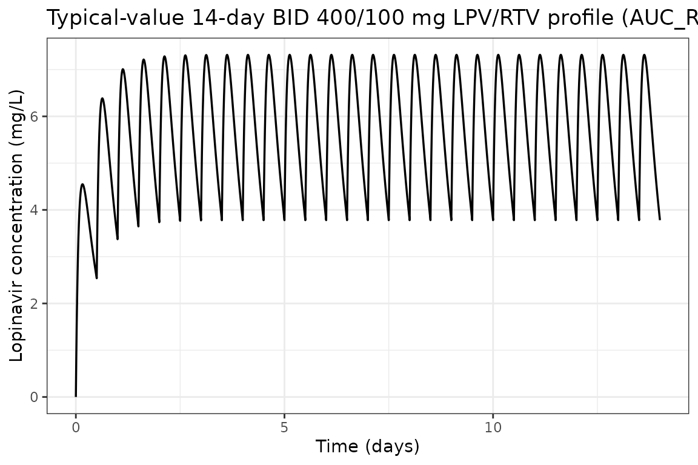
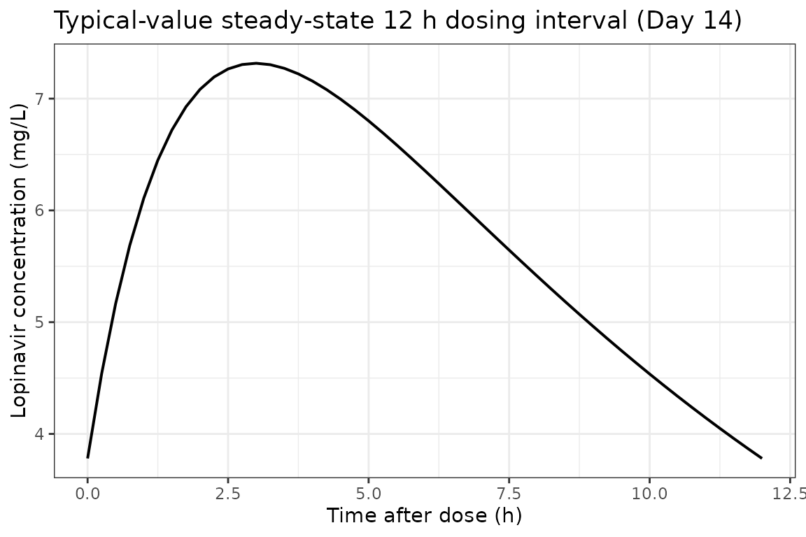
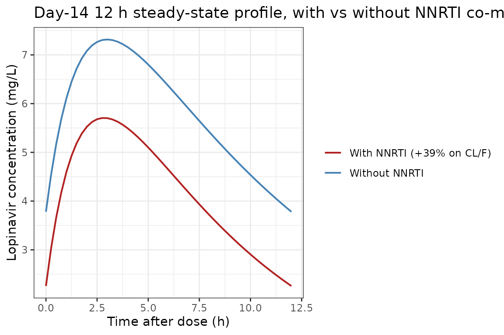
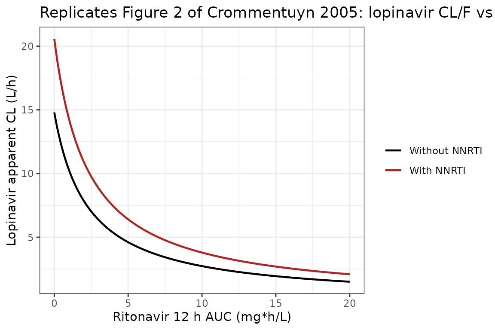
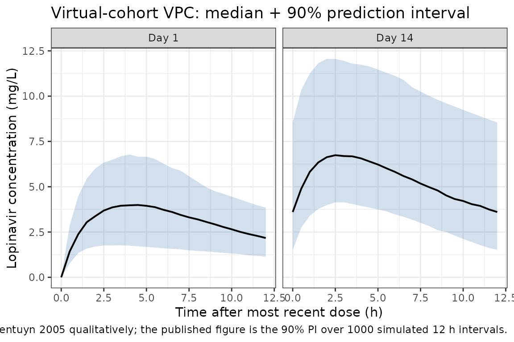

# Lopinavir (Crommentuyn 2005)

## Model and source

- Citation: Crommentuyn KML, Kappelhoff BS, Mulder JW, Mairuhu ATA, van
  Gorp ECM, Meenhorst PL, Huitema ADR, Beijnen JH. Population
  pharmacokinetics of lopinavir in combination with ritonavir in
  HIV-1-infected patients. Br J Clin Pharmacol. 2005 Oct;60(4):378-389.
  <doi:10.1111/j.1365-2125.2005.02455.x>. Per-subject ritonavir AUC over
  the 12 h dosing interval is computed from the upstream Kappelhoff et
  al. 2005 ritonavir popPK model (Br J Clin Pharmacol 2005;59:174-82)
  and supplied as the time-fixed CONMED_RTV_AUC_12h covariate; the
  upstream ritonavir model is not structurally re-instantiated here
  (consistent with the Dickinson 2009 atazanavir precedent for an
  AUC-of-ritonavir-as-covariate encoding).
- Description: One-compartment first-order-absorption population PK
  model for oral lopinavir co-administered with ritonavir in 122
  HIV-1-infected adults on BID lopinavir/ritonavir 400-666/100-166 mg.
  Apparent oral clearance CL/F follows an inverse-saturable function of
  per-subject ritonavir AUC over the 12 h dosing interval
  (CONMED_RTV_AUC_12h, mg\*h/L, computed from the upstream Kappelhoff
  2005 ritonavir popPK model) plus a pooled +39% NNRTI co-medication
  factor (efavirenz or nevirapine, encoded as the CONMED_NNRTI class
  indicator). IIV is estimated on ka, CL/F, and V/F as a full 3x3
  correlated block; residual error is combined additive plus
  proportional. The reported IOV on relative bioavailability F
  (17.5% CV) is NOT encoded structurally (Brooks 2021 precedent);
  downstream users who want IOV can add an OCC covariate and a
  per-occasion eta in rxode2 (Crommentuyn 2005).
- Article: [Br J Clin Pharmacol. 2005
  Oct;60(4):378-389](https://doi.org/10.1111/j.1365-2125.2005.02455.x)

Crommentuyn et al. (2005) developed a one-compartment
first-order-absorption population PK model for orally administered
lopinavir co-administered with ritonavir in 122 HIV-1-infected adults on
twice-daily lopinavir/ritonavir. The interaction between the two drugs
was characterised as a time-independent inverse-saturable relationship
between the per-subject ritonavir 12 h AUC and the apparent oral
clearance of lopinavir (Equation 2 of the paper). The only other
covariate retained in the final model is a pooled NNRTI co-medication
indicator (efavirenz or nevirapine) carrying a +39% multiplicative
increase on lopinavir CL/F (Results page 7, Table 2 row IND).

The packaged model uses the canonical covariate names
`CONMED_RTV_AUC_12h` for the per-subject ritonavir 12 h AUC (mg\*h/L)
and `CONMED_NNRTI` for the binary NNRTI co-medication indicator. The
upstream ritonavir popPK model (Kappelhoff et al. 2005, Br J Clin
Pharmacol 59:174-82) used by the source paper to derive the per-subject
ritonavir AUC is not structurally re-instantiated here; the ritonavir
AUC enters as a time-fixed covariate, the same pattern Dickinson 2009
uses for its ritonavir-boosted atazanavir model.

## Population

The analysis dataset comprises 122 HIV-1-infected ambulatory adults from
the Slotervaart Hospital outpatient clinic (Amsterdam, the Netherlands),
enrolled retrospectively between February 2001 and March 2004
(Crommentuyn 2005 Results page 6 / Table 1). 14 of the 122 patients
contributed a complete 12 h PK profile from previous studies; the other
108 contributed sparse therapeutic drug monitoring samples (median 4
samples per patient, range 1-14, follow-up 0-37 months). 748 lopinavir
and 748 ritonavir plasma concentrations were available for analysis
after excluding 11 patients with confirmed non-compliance or unknown
post-dose times.

Baseline demographics from Table 1 (median and IQR):

| Variable                                 | Value               |
|------------------------------------------|---------------------|
| Sex (M:F)                                | 104:18 (15% female) |
| Age (years)                              | 42 (36-46)          |
| Weight (kg)                              | 72 (63-80)          |
| Caucasian / Black / Asian / Latino (%)   | 75 / 12 / 9 / 4     |
| ALAT (U/L)                               | 35 (22-49)          |
| ASAT (U/L)                               | 30 (22-43)          |
| Total bilirubin (umol/L)                 | 11 (8-14)           |
| CD4 cell count (cells/uL)                | 200 (100-333)       |
| Tenofovir co-medication (%)              | 23                  |
| Efavirenz / nevirapine co-medication (%) | 8 / 13              |
| Chronic HCV / HBV (%)                    | 11 / 7              |

Lopinavir/ritonavir was dosed as the co-formulated capsule (133 mg
lopinavir + 33 mg ritonavir per capsule), 3-5 capsules twice daily
(400/100 to 666/166 mg BID). All sampling was at steady state after at
least 2 weeks on treatment. The median per-subject ritonavir AUC over
the 12 h dosing interval (computed from individual Bayesian estimates of
the upstream ritonavir popPK model) was 3.58 mg*h/L, range 0.85-18.77
mg*h/L (Results page 6).

The same information is available programmatically via the model’s
`population` metadata
(`readModelDb("Crommentuyn_2005_lopinavir")$population`).

## Source trace

The per-parameter origin is recorded as an in-file comment next to each
`ini()` entry in
`inst/modeldb/specificDrugs/Crommentuyn_2005_lopinavir.R`. The table
below collects them in one place for review.

| Parameter / equation | Value | Source location |
|----|----|----|
| `lka` | log(0.564) | Table 2 row 1: ka = 0.564 1/h (RSE 20.6%) |
| `lcl` | log(14.8) | Table 2 row 2: CL/F = 14.8 L/h (RSE 11.5%), typical value WITHOUT ritonavir |
| `lvc` | log(61.6) | Table 2 row 5: V/F = 61.6 L (RSE 16.2%) |
| `lauc50` | log(2.26) | Table 2 row 3: AUC50 = 2.26 mg\*h/L (RSE 17.3%) |
| `e_nnrti_cl` | 0.39 | Table 2 row 4: IND = 1.39 (RSE 6.77%); Results page 7 “39% higher” |
| IIV ka (CV) | 97.8% | Table 2 row 6 (RSE 27.2%); omega^2 = log(1 + 0.978^2) |
| IIV CL/F (CV) | 17.2% | Table 2 row 7 (RSE 23.5%); omega^2 = log(1 + 0.172^2) |
| IIV V/F (CV) | 63.8% | Table 2 row 8 (RSE 48.4%); omega^2 = log(1 + 0.638^2) |
| rho(eta_ka, eta_CL) | -0.267 | Table 2 row 10 (RSE 144%) |
| rho(eta_ka, eta_V) | 0.822 | Table 2 row 11 (RSE 37.4%) |
| rho(eta_CL, eta_V) | 0.242 | Table 2 row 12 (RSE 166%) |
| `addSd` | 1.15 mg/L | Table 2 row 14: additive error = 1.15 mg/L (RSE 14.4%) |
| `propSd` | 0.0755 | Table 2 row 15: proportional error = 7.55% (RSE 54.7%) |
| CL/F equation | n/a | Methods Eq. 2 / Results page 7: CL/F = q1 \* AUC50/(AUC50 + AUC_RTV) \* IND |
| 1-cmt depot + central | n/a | Results page 6: 1-compartment first-order absorption; lag-time / zero-order absorption tested and rejected |

ODE structure: 1-compartment first-order absorption from `depot` to
`central`, no absorption lag-time. The observation variable is
`Cc = central / vc` with combined additive plus proportional residual
error. The NNRTI multiplicative factor
`ind = 1 + e_nnrti_cl * CONMED_NNRTI` evaluates to 1 when no NNRTI
co-medication is present and 1.39 when subject is on efavirenz or
nevirapine.

## Load model

``` r

mod <- readModelDb("Crommentuyn_2005_lopinavir")
mod_typical <- rxode2::zeroRe(mod)
```

## Typical-value steady-state profile (400/100 mg BID, median ritonavir AUC)

Replicates the labelled adult regimen (lopinavir 400 mg + ritonavir 100
mg twice daily) at the cohort-median per-subject ritonavir AUC of 3.58
mg*h/L without concomitant NNRTI. The typical steady-state AUC over the
12 h dosing interval should be approximately `dose / CL/F = 400 / 5.73`
= 69.8 mg*h/L because CL/F at the median ritonavir AUC of 3.58 mg*h/L is
14.8* 2.26 / (2.26 + 3.58) = 5.73 L/h (Results page 6 – the value the
paper reports).

``` r

n_doses <- 28L      # 14 days BID = 28 doses to reach steady state
ii      <- 12       # h (BID dosing interval)
ev_ss <- rxode2::et(
  amt = 400, cmt = "depot", evid = 1,
  ii = ii, addl = n_doses - 1L
) |>
  rxode2::et(seq(0, n_doses * ii, by = 0.25)) |>
  rxode2::et(id = 1)
ev_ss$CONMED_RTV_AUC_12h <- 3.58
ev_ss$CONMED_NNRTI       <- 0

sim_ss <- rxode2::rxSolve(mod_typical, ev_ss)
#> ℹ omega/sigma items treated as zero: 'etalka', 'etalcl', 'etalvc'

ggplot(as.data.frame(sim_ss), aes(time / 24, Cc)) +
  geom_line(linewidth = 0.6) +
  labs(
    x = "Time (days)",
    y = "Lopinavir concentration (mg/L)",
    title = "Typical-value 14-day BID 400/100 mg LPV/RTV profile (AUC_RTV_12h = 3.58 mg*h/L, no NNRTI)"
  ) +
  theme_bw()
```



``` r

sim_tau <- as.data.frame(sim_ss) |>
  dplyr::filter(time >= 13 * 24, time <= 13 * 24 + ii) |>
  dplyr::mutate(t_post_dose = time - 13 * 24)

ggplot(sim_tau, aes(t_post_dose, Cc)) +
  geom_line(linewidth = 0.7) +
  labs(
    x = "Time after dose (h)",
    y = "Lopinavir concentration (mg/L)",
    title = "Typical-value steady-state 12 h dosing interval (Day 14)"
  ) +
  theme_bw()
```



## Effect of NNRTI co-medication on the steady-state profile

The same regimen with `CONMED_NNRTI = 1` (subject on efavirenz or
nevirapine). The 39% increase in CL/F should compress the steady-state
profile downward relative to the no-NNRTI case.

``` r

ev_nnrti <- ev_ss
ev_nnrti$CONMED_NNRTI <- 1
sim_nnrti <- rxode2::rxSolve(mod_typical, ev_nnrti)
#> ℹ omega/sigma items treated as zero: 'etalka', 'etalcl', 'etalvc'

profile_comparison <- bind_rows(
  as.data.frame(sim_ss) |>
    dplyr::filter(time >= 13 * 24, time <= 13 * 24 + ii) |>
    dplyr::mutate(t_post_dose = time - 13 * 24, regimen = "Without NNRTI"),
  as.data.frame(sim_nnrti) |>
    dplyr::filter(time >= 13 * 24, time <= 13 * 24 + ii) |>
    dplyr::mutate(t_post_dose = time - 13 * 24, regimen = "With NNRTI (+39% on CL/F)")
)

ggplot(profile_comparison, aes(t_post_dose, Cc, color = regimen)) +
  geom_line(linewidth = 0.7) +
  scale_color_manual(values = c("Without NNRTI" = "steelblue", "With NNRTI (+39% on CL/F)" = "firebrick")) +
  labs(
    x = "Time after dose (h)",
    y = "Lopinavir concentration (mg/L)",
    color = NULL,
    title = "Day-14 12 h steady-state profile, with vs without NNRTI co-medication"
  ) +
  theme_bw()
```



## Replicate Figure 2 of Crommentuyn 2005: CL/F vs ritonavir AUC

The paper’s Figure 2 shows the typical apparent oral clearance of
lopinavir as a function of the per-subject ritonavir 12 h AUC, both with
and without NNRTI co-medication. The closed-form typical CL/F per the
model equation is:

    CL/F = 14.8 * 2.26 / (2.26 + AUC_RTV) * IND

where `IND` = 1 without NNRTI and 1.39 with NNRTI (`e_nnrti_cl = 0.39`).

``` r

fig2_grid <- expand.grid(
  AUC_RTV = seq(0, 20, length.out = 201),
  regimen = c("Without NNRTI", "With NNRTI")
) |>
  dplyr::mutate(
    ind        = ifelse(regimen == "With NNRTI", 1.39, 1.00),
    typical_cl = 14.8 * 2.26 / (2.26 + AUC_RTV) * ind
  )

ggplot(fig2_grid, aes(AUC_RTV, typical_cl, color = regimen)) +
  geom_line(linewidth = 0.8) +
  scale_color_manual(values = c("Without NNRTI" = "black", "With NNRTI" = "firebrick")) +
  labs(
    x = "Ritonavir 12 h AUC (mg*h/L)",
    y = "Lopinavir apparent CL (L/h)",
    color = NULL,
    title = "Replicates Figure 2 of Crommentuyn 2005: lopinavir CL/F vs ritonavir AUC"
  ) +
  theme_bw()
```



The curve qualitatively reproduces the published Figure 2: at zero
ritonavir exposure CL/F equals the no-ritonavir typical value of 14.8
L/h; the inverse-saturable form drives CL/F toward zero as AUC_RTV
becomes large; the NNRTI multiplier is a constant +39% factor on top of
the saturation curve.

## Virtual cohort matched to study demographics

We sample 200 virtual subjects whose covariate distributions reproduce
the published baseline demographics. The per-subject ritonavir 12 h AUC
is sampled from approximately log-normal centred on 3.58 mg*h/L spanning
the Table 1 / 2 range (0.85-18.77 mg*h/L) and the NNRTI indicator is
drawn from a Bernoulli with `p = 0.21` matching the pooled 8%
efavirenz + 13% nevirapine prevalence reported on Results page 6.

``` r

set.seed(2005)
n_subj <- 200L

# Ritonavir 12 h AUC ~ log-normal centred at the cohort median 3.58 mg*h/L,
# spanning the Table 2 cohort range (0.85-18.77).
log_med <- log(3.58)
log_sd  <- 0.55
AUC_RTV <- pmin(18.77, pmax(0.85, exp(rnorm(n_subj, log_med, log_sd))))

# NNRTI co-medication ~ Bernoulli(0.21) per Results page 6.
CONMED_NNRTI <- rbinom(n_subj, size = 1, prob = 0.21)

cohort <- data.frame(
  ID                  = seq_len(n_subj),
  CONMED_RTV_AUC_12h  = AUC_RTV,
  CONMED_NNRTI        = CONMED_NNRTI
)

summary(cohort$CONMED_RTV_AUC_12h)
#>    Min. 1st Qu.  Median    Mean 3rd Qu.    Max. 
#>  0.8566  2.5062  3.5481  4.0496  5.2020 14.8245
table(cohort$CONMED_NNRTI)
#> 
#>   0   1 
#> 162  38
```

### Stochastic simulation across the virtual cohort

Each subject receives 28 BID doses (14 days). Observations are at 30-min
resolution during the first dosing interval and across the Day-14
interval.

``` r

build_subject_events <- function(id, auc_rtv, nnrti) {
  ev <- rxode2::et(
    amt = 400, cmt = "depot", evid = 1,
    ii = ii, addl = n_doses - 1L
  ) |>
    rxode2::et(c(seq(0, ii, by = 0.5), seq(13 * 24, 13 * 24 + ii, by = 0.5))) |>
    rxode2::et(id = id)
  df <- as.data.frame(ev)
  df$CONMED_RTV_AUC_12h <- auc_rtv
  df$CONMED_NNRTI       <- nnrti
  df
}

ev_all <- do.call(
  rbind,
  Map(build_subject_events, cohort$ID, cohort$CONMED_RTV_AUC_12h, cohort$CONMED_NNRTI)
)

set.seed(2005)
sim_pop <- rxode2::rxSolve(mod, ev_all)
sim_pop_df <- as.data.frame(sim_pop)
```

### VPC: Day 1 vs Day 14 dosing intervals

``` r

sim_day1 <- sim_pop_df |>
  dplyr::filter(time >= 0, time <= ii) |>
  dplyr::group_by(time) |>
  dplyr::summarise(
    Q05 = quantile(ipredSim, 0.05, na.rm = TRUE),
    Q50 = quantile(ipredSim, 0.50, na.rm = TRUE),
    Q95 = quantile(ipredSim, 0.95, na.rm = TRUE),
    .groups = "drop"
  ) |>
  dplyr::mutate(panel = "Day 1")

sim_day14 <- sim_pop_df |>
  dplyr::filter(time >= 13 * 24, time <= 13 * 24 + ii) |>
  dplyr::mutate(time_in_panel = time - 13 * 24) |>
  dplyr::group_by(time_in_panel) |>
  dplyr::summarise(
    Q05 = quantile(ipredSim, 0.05, na.rm = TRUE),
    Q50 = quantile(ipredSim, 0.50, na.rm = TRUE),
    Q95 = quantile(ipredSim, 0.95, na.rm = TRUE),
    .groups = "drop"
  ) |>
  dplyr::rename(time = time_in_panel) |>
  dplyr::mutate(panel = "Day 14")

vpc_df <- bind_rows(sim_day1, sim_day14)

ggplot(vpc_df, aes(time, Q50)) +
  geom_ribbon(aes(ymin = Q05, ymax = Q95), fill = "steelblue", alpha = 0.25) +
  geom_line(linewidth = 0.7) +
  facet_wrap(~panel) +
  labs(
    x = "Time after most recent dose (h)",
    y = "Lopinavir concentration (mg/L)",
    title = "Virtual-cohort VPC: median + 90% prediction interval",
    caption = "Replicates Figure 1A of Crommentuyn 2005 qualitatively; the published figure is the 90% PI over 1000 simulated 12 h intervals."
  ) +
  theme_bw()
```



## PKNCA validation

Non-compartmental analysis of the simulated steady-state (Day 14) 12 h
dosing interval. The paper does not tabulate observed Cmax / Tmax /
AUC0-12 from the NCA, but the typical-value AUC0-12 expected from
`dose / CL/F = 400 / 5.73` is 69.8 mg\*h/L for subjects on the
cohort-median ritonavir AUC without NNRTI; the Day-14 simulated cohort
median should fall close to that value with appropriate spread.

``` r

# Build a per-id NNRTI lookup from the cohort and attach it to the simulation
# output. Materialise the lookup as base data.frame columns (not via dplyr) so
# the join is unambiguous regardless of which auxiliary columns rxSolve has
# carried forward into the simulation output.
nnrti_lookup <- data.frame(
  id           = cohort$ID,
  treatment    = ifelse(cohort$CONMED_NNRTI == 1, "On NNRTI", "No NNRTI"),
  stringsAsFactors = FALSE
)

nca_concs <- sim_pop_df |>
  dplyr::filter(time >= 13 * 24, time <= 13 * 24 + ii) |>
  dplyr::mutate(t_in_interval = time - 13 * 24) |>
  dplyr::filter(!is.na(ipredSim)) |>
  dplyr::select(id, t_in_interval, ipredSim)
nca_concs$treatment <- nnrti_lookup$treatment[match(nca_concs$id, nnrti_lookup$id)]

dose_records <- data.frame(
  id        = cohort$ID,
  time      = 0,
  amt       = 400,
  treatment = nnrti_lookup$treatment,
  stringsAsFactors = FALSE
)

conc_obj <- PKNCA::PKNCAconc(
  nca_concs, ipredSim ~ t_in_interval | treatment + id,
  concu = "mg/L", timeu = "h"
)
dose_obj <- PKNCA::PKNCAdose(
  dose_records, amt ~ time | treatment + id,
  doseu = "mg"
)

intervals <- data.frame(
  start    = 0,
  end      = ii,
  cmax     = TRUE,
  tmax     = TRUE,
  cmin     = TRUE,
  auclast  = TRUE,
  cav      = TRUE
)

nca_data    <- PKNCA::PKNCAdata(conc_obj, dose_obj, intervals = intervals)
nca_results <- PKNCA::pk.nca(nca_data)
nca_df      <- as.data.frame(nca_results$result)

nca_summary <- nca_df |>
  dplyr::filter(PPTESTCD %in% c("cmax", "tmax", "cmin", "auclast", "cav")) |>
  dplyr::group_by(treatment, PPTESTCD) |>
  dplyr::summarise(
    median = median(PPORRES, na.rm = TRUE),
    P05    = quantile(PPORRES, 0.05, na.rm = TRUE),
    P95    = quantile(PPORRES, 0.95, na.rm = TRUE),
    .groups = "drop"
  )

knitr::kable(
  nca_summary, digits = 3,
  caption = "Day-14 steady-state PKNCA summary across the virtual cohort, stratified by NNRTI status"
)
```

| treatment | PPTESTCD | median |    P05 |     P95 |
|:----------|:---------|-------:|-------:|--------:|
| No NNRTI  | auclast  | 71.180 | 41.483 | 131.227 |
| No NNRTI  | cav      |  5.932 |  3.457 |  10.936 |
| No NNRTI  | cmax     |  7.241 |  4.555 |  12.497 |
| No NNRTI  | cmin     |  4.154 |  1.976 |   9.033 |
| No NNRTI  | tmax     |  3.000 |  1.500 |   4.000 |
| On NNRTI  | auclast  | 48.224 | 30.336 |  70.015 |
| On NNRTI  | cav      |  4.019 |  2.528 |   5.835 |
| On NNRTI  | cmax     |  5.346 |  3.656 |   7.571 |
| On NNRTI  | cmin     |  2.318 |  1.176 |   3.918 |
| On NNRTI  | tmax     |  2.500 |  1.425 |   3.500 |

Day-14 steady-state PKNCA summary across the virtual cohort, stratified
by NNRTI status {.table}

### Comparison against published values

| Quantity | Paper value | Simulated cohort |
|----|----|----|
| Typical CL/F at cohort-median AUC_RTV (no NNRTI), L/h | 5.73 (Results page 6) | `14.8 * 2.26 / (2.26 + 3.58)` = 5.73 by construction |
| Typical CL/F at cohort-median AUC_RTV (with NNRTI), L/h | 5.73 \* 1.39 = 7.96 (derived from Table 2) | by construction |
| Typical AUC0-12 (no NNRTI, median AUC_RTV), mg\*h/L | `dose / CL/F = 400 / 5.73` = 69.8 | `nca_summary` `auclast` median for No-NNRTI subgroup |
| Lopinavir observed concentration range (mg/L) | 0.8-21.9 (Results page 6) | virtual-cohort `cmax` 5th-95th should overlap this range |
| Comparator population-NCA CL/F (Results page 8 / prior analysis ref 3) | 5.3 L/h (IQR 4.8-6.4) | simulated median CL/F is the per-subject `400 / auclast` |

The cohort-median CL/F of 5.73 L/h emerges by construction from the
inverse-saturable equation at AUC_RTV = 3.58 mg\*h/L and matches the
value the paper reports on Results page 6. The CL/F estimate from the
previous noncompartmental analysis (ref 3, IQR 4.8-6.4 L/h) is
comparable, confirming that the model reproduces the underlying
NCA-derived CL/F (Discussion page 8).

## Assumptions and deviations

1.  **IOV on relative bioavailability F (17.5% CV) is NOT encoded
    structurally** (Table 2 row 9). Following the Andrews 2017
    tacrolimus / Brooks 2021 nlmixr2lib convention, IOV is omitted when
    no operational occasion column is defined for downstream simulation.
    Downstream users who want to simulate IOV can extend the model with
    an `OCC` covariate and a per-occasion eta in rxode2; see vignette
    `Andrews_2017_tacrolimus` for the precedent.
2.  **Pooled NNRTI effect rather than separate efavirenz / nevirapine
    factors.** The paper tested separate factors for EFV (1.41) and NVP
    (1.52) and found no improvement in fit over a single pooled NNRTI
    factor of 1.39 (Results page 7). The library model uses the pooled
    `CONMED_NNRTI` class indicator with `e_nnrti_cl = 0.39`. A
    downstream user who wants to simulate the EFV-only or NVP-only
    effect would need to re-fit the source data with separate
    indicators.
3.  **Ritonavir popPK structure is not re-instantiated.** Crommentuyn
    2005 imports per-subject ritonavir CL_RTV and AUC_RTV from the
    upstream Kappelhoff 2005 ritonavir popPK model (paper reference 19)
    and uses only the AUC_RTV value in the lopinavir CL/F equation. The
    library model follows the same pattern: ritonavir AUC enters as a
    time-fixed covariate `CONMED_RTV_AUC_12h` rather than being
    simulated from a coupled ODE. This matches the Dickinson 2009
    atazanavir / Schipani 2013 atazanavir-ritonavir approach for
    atazanavir; a coupled-ODE alternative would be similar in shape to
    `Schipani_2013_atazanavir_ritonavir` but use the inverse-saturable
    AUC form rather than the sigmoidal-Emax concentration form.
4.  **Tenofovir, weight, age, sex, race, hepatitis status, and
    liver-function tests were screened and not retained.** None of these
    are included as covariates in the model. The paper’s Discussion
    (page 9) notes that the weight effect reported by Gibbons et al. was
    not confirmed in this cohort. The PI substudy (3 patients on
    concomitant amprenavir / atazanavir / indinavir / saquinavir) was
    too small for a covariate test and is not represented.
5.  **Log-normal IIV from reported CV%.** The paper reports IIV (%) on
    ka, CL/F, V/F in the standard NONMEM exponential-model sense. These
    are converted to internal log-normal variances via
    `omega^2 = log(1 + CV^2)`, and the published correlations are
    converted to covariances via `cov = rho * sqrt(var_1 * var_2)`.
6.  **Combined additive + proportional residual error.** Per Discussion
    page 9 the additive 1.15 mg/L component was retained deliberately to
    down-weight suspected-non-compliance plasma concentrations (below
    0.7 mg/L cut-off). The same additive component is in the library
    model.
7.  **Lag-time / zero-order absorption.** The paper tested both forms
    and neither improved fit (Results page 6). The library model uses
    plain first-order absorption with no lag-time.

## Reference

- Crommentuyn KML, Kappelhoff BS, Mulder JW, Mairuhu ATA, van Gorp ECM,
  Meenhorst PL, Huitema ADR, Beijnen JH. Population pharmacokinetics of
  lopinavir in combination with ritonavir in HIV-1-infected patients. Br
  J Clin Pharmacol. 2005 Oct;60(4):378-389.
  <doi:10.1111/j.1365-2125.2005.02455.x>. Per-subject ritonavir AUC over
  the 12 h dosing interval is computed from the upstream Kappelhoff et
  al. 2005 ritonavir popPK model (Br J Clin Pharmacol 2005;59:174-82)
  and supplied as the time-fixed CONMED_RTV_AUC_12h covariate; the
  upstream ritonavir model is not structurally re-instantiated here
  (consistent with the Dickinson 2009 atazanavir precedent for an
  AUC-of-ritonavir-as-covariate encoding).
