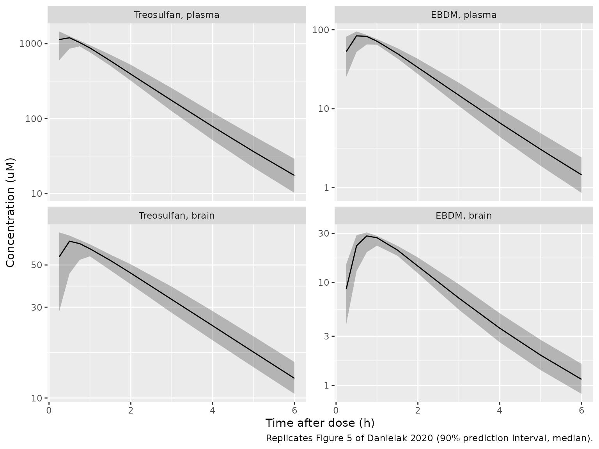
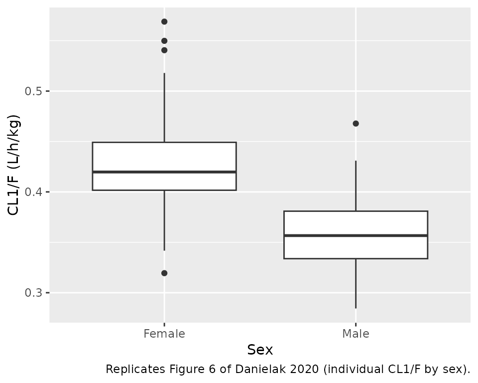

# Treosulfan and EBDM in rat plasma and brain (Danielak 2020)

## Model and source

- Citation: Danielak D, Romanski M, Kasprzyk A, Tezyk A, Glowka F.
  Population pharmacokinetic approach for evaluation of treosulfan and
  its active monoepoxide disposition in plasma and brain on the basis of
  a rat model. Pharmacol Rep. 2020;72(5):1297-1309.
  <doi:10.1007/s43440-020-00115-0>. Correction: Pharmacol
  Rep. 2020;72:1443. <doi:10.1007/s43440-020-00144-9> (units of the
  first-order rate constants corrected from L/h to 1/h; no values
  changed)
- Description: Preclinical (rat). Joint parent-metabolite population PK
  model for treosulfan (TREO) and its active monoepoxide
  (S,S)-1,2-epoxybutane-3,4-diol-4-methanesulfonate (EBDM) in plasma and
  brain of Wistar rats after a single 500 mg/kg intraperitoneal dose
  (Danielak 2020). First-order absorption into a one-compartment TREO
  plasma model; irreversible first-order conversion of TREO to EBDM
  (fixed rate constants in plasma and in brain); one-compartment EBDM
  plasma model; bidirectional blood-brain barrier transport of TREO and
  EBDM parameterised by an influx clearance and the influx/efflux
  clearance ratio; a second (deep) brain compartment for TREO. All
  clearances and volumes are apparent (divided by F) and per kg body
  weight. Male sex lowers TREO plasma clearance by 14.6%. IIV on ka and
  TREO CL; proportional residual error fixed to 15% (plasma) and 20%
  (brain).
- Article: <https://doi.org/10.1007/s43440-020-00115-0> (open access)
- Correction: <https://doi.org/10.1007/s43440-020-00144-9>

Treosulfan is a prodrug: it converts non-enzymatically (pH- and
temperature-dependent) to the active monoepoxide EBDM, and then to the
diepoxide DEB. Danielak et al. fitted a joint parent-metabolite model to
plasma and brain concentrations of treosulfan (TREO) and EBDM in Wistar
rats to quantify blood-brain barrier (BBB) penetration.

## Population

96 ten-week-old Wistar rats (48 male, 48 female; mean body weight 306
+/- 25 g for males and 188 +/- 15 g for females) received a single
intraperitoneal dose of 500 mg/kg treosulfan (1797 umol/kg). The design
was destructive (one animal per sampling time): plasma and brain were
collected predose and at 0.25, 0.5, 1, 2, 4, 6 and 24 h. One female with
an outlying 0.25 h plasma concentration was excluded, and the 24 h
samples (all below the limit of quantitation) were dropped (Methods
“Animals” and “Sample collection”, Fig. 2; Results first paragraph).

The same information is available programmatically via
`readModelDb("Danielak_2020_treosulfan_rat")()$population`.

## Source trace

The per-parameter origin is recorded as an in-file comment next to each
`ini()` entry in
`inst/modeldb/specificDrugs/Danielak_2020_treosulfan_rat.R`. All
clearances and volumes are apparent (divided by the unknown
intraperitoneal bioavailability F) and per kg body weight.

| Equation / parameter | Value | Source location |
|----|----|----|
| `lka` (k12) | log(5.12) 1/h | Table 1 |
| `lcl` (CL1/F, females) | log(0.419) L/h/kg | Table 1 |
| `lvc` (V2/F) | fixed log(1.03) L/kg | Table 1 |
| `lkmet` (k23, TREO to EBDM in plasma) | fixed log(0.451) 1/h | Table 1; Methods assumption (4) |
| `lkmet_brain` (k45, TREO to EBDM in brain) | fixed log(0.271) 1/h | Table 1; Methods assumption (5), log10(kf) = -7.479 + 0.960 pH at pH 7.2 |
| `lcl_ebdm` (CL2/F) | log(6.24) L/h/kg | Table 1 |
| `lvc_ebdm` (V3/F) | fixed log(0.914) L/kg | Table 1 |
| `lclin` (Q1/F, TREO BBB influx clearance) | log(0.0233) L/h/kg | Table 1; Methods assumption (7) |
| `lkp_brain` (BBB1 = CLin/CLout, TREO) | log(0.120) | Table 1 |
| `lv_brain_extravascular` (V4/F) | fixed log(6.56e-3) L/kg | Table 1; Results “Prediction of treosulfan concentrations in brain” |
| `lq_brain_deep` (Q2/F) | log(0.304) L/h/kg | Table 1 |
| `lv_brain_deep` (V6/F) | fixed log(0.364) L/kg | Table 1 |
| `lclin_ebdm` (Q3/F, EBDM BBB influx clearance) | log(0.0122) L/h/kg | Table 1 |
| `lkp_brain_ebdm` (BBB2 = CLin/CLout, EBDM) | log(0.317) | Table 1 |
| `lv_brain_extravascular_ebdm` (V5/F) | fixed log(6.56e-3) L/kg | Table 1 |
| `e_sex_cl` (COV CL-MALE) | -0.146 | Table 1 and footnote a |
| `etalka` | 0.38941 (69% CV) | Table 1, footnote b |
| `etalcl` | 0.00995 (10% CV) | Table 1, footnote b |
| `propSd`, `propSd_ebdm` | fixed 0.15 | Table 1; Methods “Population pharmacokinetic analysis” |
| `propSd_Cbrain`, `propSd_Cbrain_ebdm` | fixed 0.20 | Table 1; Methods |
| Structure (six compartments, arrows) | n/a | Figure 3 |
| `clef = clin / kp_brain` | n/a | Methods assumption (7): BBB = CLin / CLout |
| `cl = tvcl * (1 + e_sex_cl * (1 - SEXF))` | n/a | Table 1 footnote a |

## Deterministic checks on the typical animal

The typical male and female are solved without random effects on a
log-spaced early grid (absorption is fast, k12 = 5.12 1/h) out to 72 h
so that the AUCs are essentially complete.

``` r

mod <- readModelDb("Danielak_2020_treosulfan_rat")
mod_typ <- rxode2::zeroRe(mod)
#> ℹ parameter labels from comments will be replaced by 'label()'
dose <- 1797 # umol/kg; 500 mg/kg / 278.29 g/mol (Methods)

grid <- sort(unique(c(0, 10^seq(-3, log10(72), length.out = 600))))
ev_typ <- dplyr::bind_rows(
  data.frame(id = 1L, time = 0, amt = dose, evid = 1L, cmt = "depot",
             dvid = NA_integer_, SEXF = 1),
  data.frame(id = 1L, time = grid, amt = 0, evid = 0L, cmt = "central",
             dvid = 1L, SEXF = 1),
  data.frame(id = 2L, time = 0, amt = dose, evid = 1L, cmt = "depot",
             dvid = NA_integer_, SEXF = 0),
  data.frame(id = 2L, time = grid, amt = 0, evid = 0L, cmt = "central",
             dvid = 1L, SEXF = 0)
)
sim_typ <- rxode2::rxSolve(mod_typ, events = ev_typ, rtol = 1e-10, atol = 1e-12,
                           maxsteps = 1e6, returnType = "data.frame")
#> ℹ omega/sigma items treated as zero: 'etalka', 'etalcl'
#> Warning: multi-subject simulation without without 'omega'
sim_typ$sex <- ifelse(sim_typ$id == 1, "Female", "Male")

trap <- function(t, y) sum(diff(t) * (head(y, -1) + tail(y, -1)) / 2)
auc_typ <- sim_typ |>
  dplyr::group_by(sex) |>
  dplyr::summarise(
    cl = cl[1], cl_ebdm = cl_ebdm[1],
    auc_treo = trap(time, Cc),
    auc_ebdm = trap(time, Cc_ebdm),
    auc_brain = trap(time, Cbrain),
    auc_brain_ebdm = trap(time, Cbrain_ebdm),
    c025 = Cc[which.min(abs(time - 0.25))],
    .groups = "drop"
  ) |>
  dplyr::mutate(
    recovered_pct = 100 * (cl * auc_treo + cl_ebdm * auc_ebdm) / dose,
    ratio_treo = auc_brain / auc_treo,
    ratio_ebdm = auc_brain_ebdm / auc_ebdm
  )
knitr::kable(auc_typ, digits = 4,
             caption = "Typical-animal exposures (AUC in umol*h/L, CL in L/h/kg).")
```

| sex | cl | cl_ebdm | auc_treo | auc_ebdm | auc_brain | auc_brain_ebdm | c025 | recovered_pct | ratio_treo | ratio_ebdm |
|:---|---:|---:|---:|---:|---:|---:|---:|---:|---:|---:|
| Female | 0.4190 | 6.24 | 2033.518 | 151.4520 | 241.8083 | 59.1800 | 1108.299 | 100.0058 | 0.1189 | 0.3908 |
| Male | 0.3578 | 6.24 | 2184.750 | 162.7154 | 259.7914 | 63.5812 | 1118.068 | 100.0058 | 0.1189 | 0.3908 |

Typical-animal exposures (AUC in umol\*h/L, CL in L/h/kg). {.table}

Three checks follow, all on deterministic quantities.

1.  **Mass balance.** Every molecule of treosulfan leaves the body
    either unchanged through CL1/F or, after conversion, as EBDM through
    CL2/F (the brain compartments have no elimination of their own).
    Therefore
    `CL1 * AUC(TREO, plasma) + CL2 * AUC(EBDM, plasma) = Dose`. A wrong
    conversion or transfer term breaks this identity.
2.  **Sex effect.** The typical male CL1/F must be 0.419 \* (1 - 0.146)
    = 0.358 L/h/kg, the male median shown in Figure 6 of the paper.
3.  **Brain penetration of treosulfan.** Integrating the brain mass
    balance to infinity gives
    `AUC(brain) / AUC(plasma) = CLin / (CLout + k45 * V4)` = 0.1189; the
    value is independent of sex and is close to BBB1 = 0.120 because
    conversion in the small brain volume is slow compared with efflux.

``` r

kin_ratio <- 0.0233 / (0.0233 / 0.120 + 0.271 * 6.56e-3)
stopifnot(
  nrow(auc_typ) == 2,
  all(abs(auc_typ$recovered_pct - 100) < 0.5),
  abs(auc_typ$cl[auc_typ$sex == "Male"] - 0.419 * (1 - 0.146)) < 1e-6,
  abs(auc_typ$cl[auc_typ$sex == "Female"] - 0.419) < 1e-6,
  all(abs(auc_typ$ratio_treo / kin_ratio - 1) < 0.01)
)
```

The paper that first analysed these same animals by naive pooling
reported a brain-to-plasma AUC ratio of about 0.1 for treosulfan
(Danielak 2020 Discussion, citing Romanski et al.); the model gives
0.119. EBDM penetrates better (typical AUC ratio 0.391), consistent with
BBB2 = 0.317 plus local formation of EBDM from treosulfan inside the
brain.

The mean plasma treosulfan concentration observed 0.25 h after dosing
was 1147 uM (Results first paragraph, excluding the outlier); the
typical-animal prediction at 0.25 h is 1108 uM (female) and 1118 uM
(male).

``` r

# The observed mean is one sample per animal at a single time; the gate only
# catches a dose, unit or volume error, which would move it by >2-fold.
stopifnot(all(abs(auc_typ$c025 / 1147 - 1) < 0.25))
```

## Virtual cohort and simulation

Original data are not available. The cohort below is 100 males and 100
females dosed with 1797 umol/kg into the peritoneal depot, observed on
the paper’s sampling grid (0.25-6 h) plus a dense grid for the NCA. The
model has four error endpoints (`Cc`, `Cc_ebdm`, `Cbrain`,
`Cbrain_ebdm`), so observation rows carry `dvid = 1`; every
concentration is still returned as a column.

``` r

set.seed(2020)
n_per_sex <- 100
obs_times <- sort(unique(c(0, 0.05, 0.1, 0.25, 0.5, 0.75, 1, 1.5, 2, 3, 4, 5, 6,
                           8, 10, 12, 16, 20, 24)))
make_cohort <- function(n, sexf, id_offset) {
  ids <- id_offset + seq_len(n)
  dplyr::bind_rows(
    data.frame(id = ids, time = 0, amt = dose, evid = 1L, cmt = "depot",
               dvid = NA_integer_),
    tidyr::expand_grid(id = ids, time = obs_times) |>
      dplyr::mutate(amt = 0, evid = 0L, cmt = "central", dvid = 1L)
  ) |>
    dplyr::mutate(SEXF = sexf, sex = ifelse(sexf == 1, "Female", "Male")) |>
    dplyr::arrange(id, time, dplyr::desc(evid))
}
events <- dplyr::bind_rows(
  make_cohort(n_per_sex, 1, 0L),
  make_cohort(n_per_sex, 0, n_per_sex)
)
stopifnot(!anyDuplicated(events[, c("id", "time", "evid")]))

rxode2::rxSetSeed(2020)
sim <- rxode2::rxSolve(mod, events = events, keep = "sex",
                       returnType = "data.frame")
#> ℹ parameter labels from comments will be replaced by 'label()'
```

## Replicate Figure 5 (VPC)

``` r

# Replicates Figure 5 of Danielak 2020: 5th, 50th and 95th percentiles of the
# four measured analytes over the 0.25-6 h sampling window.
sim |>
  dplyr::filter(time >= 0.25, time <= 6) |>
  dplyr::select(id, time, sex, Cc, Cc_ebdm, Cbrain, Cbrain_ebdm) |>
  tidyr::pivot_longer(c(Cc, Cc_ebdm, Cbrain, Cbrain_ebdm),
                      names_to = "analyte", values_to = "conc") |>
  dplyr::mutate(analyte = factor(
    analyte,
    levels = c("Cc", "Cc_ebdm", "Cbrain", "Cbrain_ebdm"),
    labels = c("Treosulfan, plasma", "EBDM, plasma",
               "Treosulfan, brain", "EBDM, brain")
  )) |>
  dplyr::group_by(analyte, time) |>
  dplyr::summarise(
    Q05 = quantile(conc, 0.05), Q50 = median(conc), Q95 = quantile(conc, 0.95),
    .groups = "drop"
  ) |>
  ggplot(aes(time, Q50)) +
  geom_ribbon(aes(ymin = Q05, ymax = Q95), alpha = 0.3) +
  geom_line() +
  facet_wrap(~analyte, scales = "free_y") +
  scale_y_log10() +
  labs(x = "Time after dose (h)", y = "Concentration (uM)",
       caption = "Replicates Figure 5 of Danielak 2020 (90% prediction interval, median).")
```



## Replicate Figure 6 (clearance by sex)

``` r

cl_ind <- sim |>
  dplyr::distinct(id, sex, cl)
ggplot(cl_ind, aes(sex, cl)) +
  geom_boxplot() +
  labs(x = "Sex", y = "CL1/F (L/h/kg)",
       caption = "Replicates Figure 6 of Danielak 2020 (individual CL1/F by sex).")
```



``` r

cl_med <- cl_ind |>
  dplyr::group_by(sex) |>
  dplyr::summarise(median_cl = median(cl), .groups = "drop")
knitr::kable(cl_med, digits = 3)
```

| sex    | median_cl |
|:-------|----------:|
| Female |     0.420 |
| Male   |     0.357 |

``` r

# Figure 6 medians: about 0.358 (male) and 0.419 (female). With a 10% CV the
# median of 100 draws is within ~3% of the typical value; 8% still catches
# a sign error on e_sex_cl (0.48 vs 0.36 L/h/kg).
stopifnot(
  abs(cl_med$median_cl[cl_med$sex == "Male"] / 0.358 - 1) < 0.08,
  abs(cl_med$median_cl[cl_med$sex == "Female"] / 0.419 - 1) < 0.08
)
```

## PKNCA validation

Plasma treosulfan NCA by sex. The paper does not report NCA values, so
there is no published table to compare against; the checks above serve
as the quantitative validation.

``` r

sim_nca <- sim |>
  dplyr::filter(!is.na(Cc)) |>
  dplyr::select(id, time, Cc, sex)
sim_nca <- dplyr::bind_rows(
  sim_nca,
  sim_nca |> dplyr::distinct(id, sex) |> dplyr::mutate(time = 0, Cc = 0)
) |>
  dplyr::distinct(id, sex, time, .keep_all = TRUE) |>
  dplyr::arrange(id, time)

conc_obj <- PKNCA::PKNCAconc(sim_nca, Cc ~ time | sex + id)
dose_df <- events |>
  dplyr::filter(evid == 1) |>
  dplyr::select(id, time, amt, sex)
dose_obj <- PKNCA::PKNCAdose(dose_df, amt ~ time | sex + id)
intervals <- data.frame(start = 0, end = Inf, cmax = TRUE, tmax = TRUE,
                        aucinf.obs = TRUE, half.life = TRUE)
nca_res <- PKNCA::pk.nca(PKNCA::PKNCAdata(conc_obj, dose_obj,
                                          intervals = intervals))
nca_sum <- as.data.frame(nca_res$result) |>
  dplyr::filter(PPTESTCD %in% c("cmax", "tmax", "aucinf.obs", "half.life")) |>
  dplyr::group_by(sex, PPTESTCD) |>
  dplyr::summarise(median = median(PPORRES, na.rm = TRUE), .groups = "drop") |>
  tidyr::pivot_wider(names_from = PPTESTCD, values_from = median)
nca_sum |>
  dplyr::rename(
    "Sex" = sex,
    "Cmax (uM)" = cmax,
    "Tmax (h)" = tmax,
    "AUC0-inf (uM*h)" = aucinf.obs,
    "t1/2 (h)" = half.life
  ) |>
  knitr::kable(digits = 2, caption = "Median simulated plasma treosulfan NCA by sex.")
```

| Sex    | AUC0-inf (uM\*h) | Cmax (uM) | t1/2 (h) | Tmax (h) |
|:-------|-----------------:|----------:|---------:|---------:|
| Female |          2012.83 |   1188.40 |     2.18 |      0.5 |
| Male   |          2169.22 |   1225.87 |     2.18 |      0.5 |

Median simulated plasma treosulfan NCA by sex. {.table}

``` r


# AUC0-inf does not depend on ka, and IIV on CL1/F is only 10% CV, so the
# cohort median must sit close to the typical-animal AUC computed above. A
# dose, unit or clearance error moves it by far more than 10%.
auc_m <- nca_sum$aucinf.obs[nca_sum$sex == "Male"]
auc_f <- nca_sum$aucinf.obs[nca_sum$sex == "Female"]
stopifnot(
  length(auc_m) == 1, length(auc_f) == 1,
  abs(auc_f / auc_typ$auc_treo[auc_typ$sex == "Female"] - 1) < 0.1,
  abs(auc_m / auc_typ$auc_treo[auc_typ$sex == "Male"] - 1) < 0.1
)
```

## Assumptions and deviations

- **Abstract vs. Table 1 for male clearance.** The abstract gives the
  male CL1/F as 0.273 L/h/kg, which is 0.419 - 0.146 (the coefficient
  subtracted as an absolute value). Table 1 footnote a defines the
  effect as fractional, `CL1-MALE/F = CL1/F + CL1/F * COV`, giving 0.358
  L/h/kg, and the male median in Figure 6 is 0.358. The model follows
  the footnote and Figure 6.
- **Units of the rate constants.** The original online version printed
  the first-order rate constants in L/h; the Correction
  (<doi:10.1007/s43440-020-00144-9>) changes the units to 1/h without
  changing any value. The open-access article carries the corrected
  units.
- **Q1/F and Q3/F are the BBB influx clearances.** Methods
  assumption (7) parameterises BBB transport by the influx clearance
  CLin and the ratio BBB = CLin / CLout; Figure 3 labels the
  plasma-brain arrows Q1/F, BBB1 and Q3/F, BBB2. The model therefore
  uses `clin = Q/F` and `clef = clin / BBB`.
- **Brain treosulfan converts to EBDM only in the central brain
  compartment (k45), and there is no other brain elimination** (Figure
  3; Results “Blood- brain transport of treosulfan and EBDM”).
- **Brain observations** are the central brain compartments (V4/F for
  treosulfan, V5/F for EBDM), per Results “Prediction of treosulfan
  concentrations in brain”. The deep brain compartment (V6/F) is exposed
  as `Cbrain_deep` but was not observed.
- **Per-kg dosing.** The paper specified the dose as 1797 umol/kg for
  every animal, so all volumes and clearances are per kg and no
  body-weight covariate is needed. Supply doses in umol/kg.
- **Bioavailability.** All parameters are apparent (/F); F was not
  identifiable and is implicitly 1.
- **Residual error** was fixed to the assay precision (15% plasma, 20%
  brain) because a one-animal-per-sample design cannot identify it.
