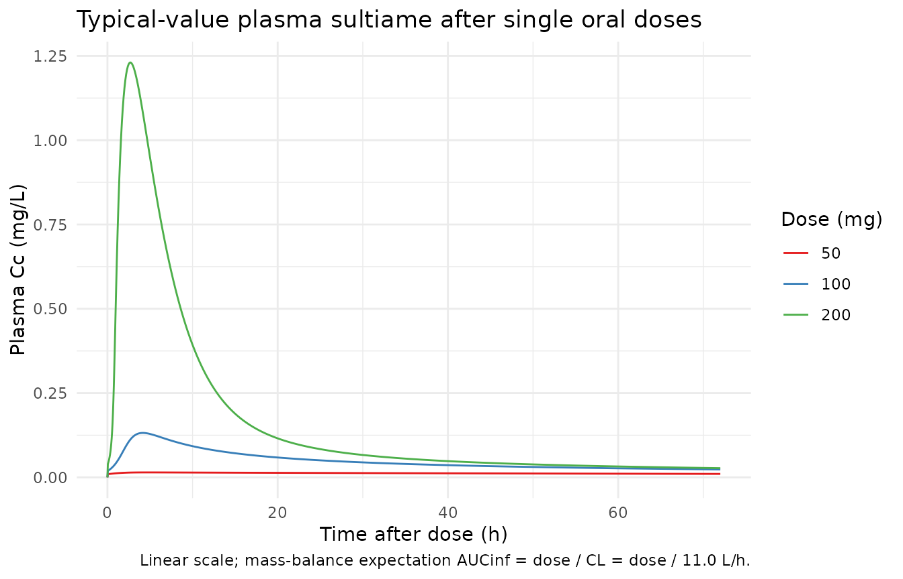
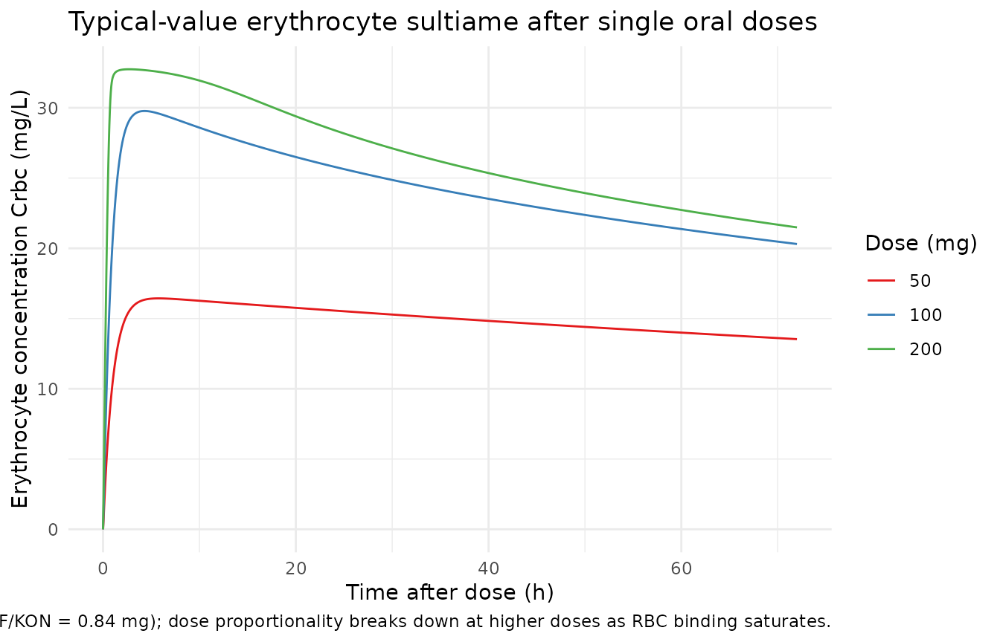
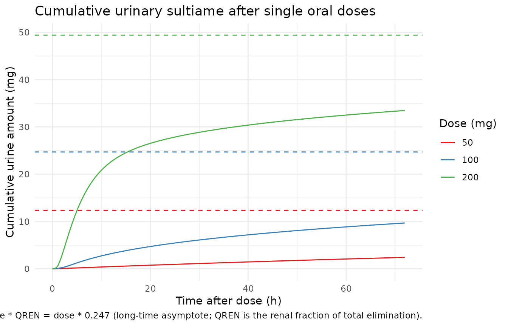

# Sultiame (Dao 2020)

## Model and source

- Citation: Dao K, Thoueille P, Decosterd LA, Mercier T, Guidi M,
  Bardinet C, Lebon S, Choong E, Castang A, Guittet C, Granier LA,
  Buclin T (2020). Pharmacokinetic profile of sultiame in healthy
  volunteers with in vitro characterization of its uptake by red blood
  cells. Pharmacology Research & Perspectives 8(2):e00558.
  <doi:10.1002/prp2.558>. DDMORE Foundation Model Repository:
  DDMODEL00000298.
- Description: Population PK model for sultiame in healthy adult
  volunteers with non-linear distribution into erythrocytes (saturable
  binding to a putative red-blood-cell carrier). Four-compartment
  structure: depot (oral absorption, KA fixed at 1/h), central (plasma),
  erythrocytes (drug bound to a saturable carrier in red blood cells
  parameterised by KON, KOFF, BTOT), and urine (cumulative urinary
  excretion as a fraction QREN of total elimination). Drug binding to
  erythrocytes is written in mass-action form on amounts (KON in
  1/(h\*mg)). DDMORE Foundation Model Repository entry DDMODEL00000298,
  fit on 4 healthy volunteers (433 observations) by NONMEM ADVAN13
  FOCEI.
- Article: <https://doi.org/10.1002/prp2.558>
- DDMORE Foundation Model Repository entry:
  [DDMODEL00000298](https://repository.ddmore.eu/model/DDMODEL00000298)

This model was extracted from the DDMORE Foundation Model Repository
bundle for `DDMODEL00000298` (scraped to
`dpastoor/ddmore_scraping/298/`). The bundle contains:

- `Executable_sultiame_nonlinear_PK.mod` – the NONMEM control stream
  (NCOMP = 4 with `$SUBROUTINES ADVAN13`, ODE-based integration of the
  saturable plasma-erythrocyte binding system).
- `Output_real_sultiame_nonlinear_PK.lst` – NONMEM listing from the
  estimation run on the original real data (4 healthy volunteers, 433
  observations; reaches `MINIMIZATION SUCCESSFUL` with the caveat that
  `S MATRIX ALGORITHMICALLY SINGULAR` is reported during the covariance
  step). Final parameter estimates used here come from this listing.
- `Output_simulated_sultiame_nonlinear_PK.lst` – companion listing on a
  simulated dataset.
- `Simulated_data_PK_sultiame.csv` – simulated event dataset (4 virtual
  subjects, single oral doses of 50 / 100 / 200 mg sultiame observed in
  CMT = 2 plasma, CMT = 3 erythrocytes, CMT = 4 cumulative urine).
- `Model_Accomodations.txt`, `DDMODEL00000298.rdf`, `298.json`,
  `Command.txt` – provenance, model-classification metadata, and
  scenario notes.

The Dao 2020 publication itself was not on disk in this worktree at the
time of extraction (the DDMORE bundle was uploaded while the paper was
“under submission”, per `Model_Accomodations.txt`). A side-by-side
comparison against published NCA tables or VPC figures is therefore out
of scope for this vignette. The validation strategy follows the
DDMORE-source decision tree in
`extract-literature-model/references/ddmore-source.md`: an F.2 / F.3
self-consistency and mechanistic-sanity check against the bundle’s own
simulated trajectories, plus a PKNCA pass on the simulated plasma
profile to confirm the **dose-disproportional** Cmax / AUClast pattern
that the saturable RBC-binding mechanism produces, and a plausible Tmax.
The terminal half-life of the model is dominated by slow drug release
from the deep saturable RBC sink rather than by plasma clearance and is
therefore not used as an external validation target.

## Population

Sultiame is an oral carbonic-anhydrase-inhibiting antiepileptic with
markedly non-linear distribution into red blood cells: plasma
concentrations are roughly an order of magnitude lower than erythrocyte
concentrations because drug binds saturably to a putative
carbonic-anhydrase carrier inside RBCs. Dao 2020 reports a Phase 1
pharmacokinetic profile in healthy adult volunteers, with serial plasma
sampling, parallel erythrocyte sampling (whole-blood concentrations
back-corrected for hematocrit), and timed urinary collections.

The DDMORE bundle’s NONMEM listing
(`Output_real_sultiame_nonlinear_PK.lst`, line 155) reports
`TOT. NO. OF INDIVIDUALS: 4` and `TOT. NO. OF OBS RECS: 433`. The
underlying source data file (`Export_PK_Nonmem_urine.csv`, referenced
from the executable’s `$DATA` block) lists `WT` and `AGE` columns, but
those covariates are not used by the structural model and the bundle
does not ship per-subject demographics in the simulated dataset. The
publication itself characterises a healthy-volunteer Phase 1 study;
because the publication PDF is not on disk for this extraction, the
`population` metadata fields beyond `n_subjects = 4`,
`disease_state = "healthy adult volunteers"`, and the dose ladder of 50
/ 100 / 200 mg sultiame are intentionally narrative placeholders rather
than pinned numeric ranges.

The same information is available programmatically via
`readModelDb("Dao_2020_sultiame")()$population`.

## Source trace

Per-parameter and per-equation origin (also recorded as in-file comments
next to each `ini()` entry of
`inst/modeldb/ddmore/Dao_2020_sultiame.R`):

| Equation / parameter | Value | Source location |
|----|----|----|
| `lcl` | log(11.0) | `Output_real_sultiame_nonlinear_PK.lst` FINAL THETA TH 1 = 1.10E+01 (CL, L/h) |
| `lvc` | log(56.3) | `Output_real_*.lst` FINAL THETA TH 2 = 5.63E+01 (V2 in source = central/plasma volume) |
| `lvp` | log(2.93) | `Output_real_*.lst` FINAL THETA TH 3 = 2.93E+00 (V3 in source = erythrocyte distribution volume; .mod fixes V3 with no IIV) |
| `lkon` | log(0.949) | `Output_real_*.lst` FINAL THETA TH 4 = 9.49E-01 (KON, association rate, units 1/(h\*mg)) |
| `lbtot` | log(97.1) | `Output_real_*.lst` FINAL THETA TH 5 = 9.71E+01 (BTOT, total RBC binding capacity, mg) |
| `lkoff` | log(0.796) | `Output_real_*.lst` FINAL THETA TH 6 = 7.96E-01 (KOFF, dissociation rate, 1/h) |
| `lka` | log(1) FIXED | `Output_real_*.lst` FINAL THETA TH 7 = 1.00E+00; .mod \$THETA line `1 FIX` |
| `lqren` | log(0.247) | `Output_real_*.lst` FINAL THETA TH 8 = 2.47E-01 (QREN, renal extraction fraction; bounded 0–1 in source \$THETA) |
| `etalcl` | 0.0761 (var) | `Output_real_*.lst` FINAL OMEGA(1,1) = 7.61E-02 (IIV CL) |
| `etalvc` | 0.00858 (var) | `Output_real_*.lst` FINAL OMEGA(2,2) = 8.58E-03 (IIV V2 in source = lvc here) |
| `etalqren` | 0.0995 (var) | `Output_real_*.lst` FINAL OMEGA(3,3) = 9.95E-02 (IIV QREN; ETA3 attached to QREN per .mod \$PK ordering) |
| `etalbtot` | 0.0145 (var) | `Output_real_*.lst` FINAL OMEGA(4,4) = 1.45E-02 (IIV BTOT; ETA4 attached to BTOT per .mod \$PK ordering) |
| `propSd` (plasma) | 0.567 | `Output_real_*.lst` FINAL THETA TH 9 = 5.67E-01 (Prop.RE plasma SD; \$SIGMA = 1 FIX so THETA acts as SD) |
| `propSd_Crbc` | 0.263 | `Output_real_*.lst` FINAL THETA TH 11 = 2.63E-01 (Prop.RE eryth SD) |
| `addSd_Crbc` | 0.012 | `Output_real_*.lst` FINAL THETA TH 12 = 1.20E-02 (Add.RE eryth SD, mg/L) |
| `propSd_Aurine` | 0.433 | `Output_real_*.lst` FINAL THETA TH 13 = 4.33E-01 (Prop.RE urine SD) |
| `d/dt(depot)` | n/a | `.mod` \$DES `DADT(1) = -KA * A(1)` |
| `d/dt(central)` | n/a | `.mod` \$DES `DADT(2) = KA * A(1) - KE * A(2) - KON * A(2) * (BTOT - A(3)) + KOFF * A(3)` |
| `d/dt(erythrocytes)` | n/a | `.mod` \$DES `DADT(3) = KON * A(2) * (BTOT - A(3)) - KOFF * A(3)` |
| `d/dt(urine)` | n/a | `.mod` \$DES `DADT(4) = KE * A(2) * QREN` |
| `Cc <- central / vc` | n/a | `.mod` \$ERROR `IPRED2 = A(2)/S2` with `S2 = V2` |
| `Crbc <- erythrocytes / vp` | n/a | `.mod` \$ERROR `IPRED3 = A(3)/S3` with `S3 = V3` |
| `Aurine <- urine` | n/a | `.mod` \$ERROR `IPRED4 = A(4)/S4` with `S4 = UVOL/1000`. The packaged model exposes the cumulative urinary amount A(4); `Aurine ~ prop(propSd_Aurine)` is mathematically equivalent to a proportional residual on the source’s per-collection urinary concentration because UVOL is a positive scalar that cancels in the proportional CV. |

## Virtual cohort

For the typical-value simulation we mirror the bundle’s simulated
single-dose protocol: a single representative subject receiving an oral
sultiame dose (the bundle’s dose ladder is 50 / 100 / 200 mg) and a
dense observation grid covering the absorption / distribution /
elimination phases.

``` r

set.seed(20260507L)

obs_times <- sort(unique(c(
  seq(0, 1, by = 0.05),    # dense absorption
  seq(1, 6, by = 0.1),     # peak / early redistribution
  seq(6, 24, by = 0.25),   # mono-exponential decline
  seq(24, 72, by = 1)      # late terminal phase
)))

doses <- c(50, 100, 200)

make_cohort <- function(dose_amt, id_offset = 0L) {
  obs <- tibble::tibble(
    id   = id_offset + 1L,
    time = obs_times,
    amt  = 0,
    evid = 0L,
    cmt  = "Cc",
    dose_mg = dose_amt
  )
  dose <- tibble::tibble(
    id   = id_offset + 1L,
    time = 0,
    amt  = dose_amt,
    evid = 1L,
    cmt  = "depot",
    dose_mg = dose_amt
  )
  dplyr::bind_rows(dose, obs) |>
    dplyr::arrange(id, time, dplyr::desc(evid))
}

events <- dplyr::bind_rows(
  make_cohort(doses[1], id_offset =   0L),
  make_cohort(doses[2], id_offset = 100L),
  make_cohort(doses[3], id_offset = 200L)
)

stopifnot(!anyDuplicated(unique(events[, c("id", "time", "evid")])))
```

## Simulation

``` r

mod <- rxode2::rxode2(readModelDb("Dao_2020_sultiame"))
#> ℹ parameter labels from comments will be replaced by 'label()'
mod_typical <- rxode2::zeroRe(mod)

sim_typical <- rxode2::rxSolve(
  mod_typical,
  events = events,
  keep   = c("dose_mg")
) |>
  as.data.frame()
#> ℹ omega/sigma items treated as zero: 'etalcl', 'etalvc', 'etalqren', 'etalbtot'
#> Warning: multi-subject simulation without without 'omega'
```

## Replicate published-figure shapes

The Dao 2020 publication is not on disk for this extraction, so a direct
figure-by-figure replication is out of scope. The plots below show the
qualitative trajectories that any sultiame PK + RBC-binding model must
produce: dose-proportional plasma kinetics with a mid-1-h absorption
peak, an order-of-magnitude-higher RBC concentration that follows the
plasma curve through saturable binding, and cumulative urinary excretion
that approaches `dose * QREN` on the multi-day terminal window.

``` r

ggplot(sim_typical, aes(time, Cc, colour = factor(dose_mg))) +
  geom_line() +
  scale_colour_brewer("Dose (mg)", palette = "Set1") +
  labs(
    x = "Time after dose (h)", y = "Plasma Cc (mg/L)",
    title = "Typical-value plasma sultiame after single oral doses",
    caption = "Linear scale; mass-balance expectation AUCinf = dose / CL = dose / 11.0 L/h."
  ) +
  theme_minimal(base_size = 11)
```



``` r

ggplot(sim_typical, aes(time, Crbc, colour = factor(dose_mg))) +
  geom_line() +
  scale_colour_brewer("Dose (mg)", palette = "Set1") +
  labs(
    x = "Time after dose (h)", y = "Erythrocyte concentration Crbc (mg/L)",
    title = "Typical-value erythrocyte sultiame after single oral doses",
    caption = paste(
      "Crbc / Cc ratio approaches BTOT/V3 / Kd at low Cc",
      "(Kd = KOFF/KON = 0.84 mg);",
      "dose proportionality breaks down at higher doses",
      "as RBC binding saturates."
    )
  ) +
  theme_minimal(base_size = 11)
```



``` r

ggplot(sim_typical, aes(time, Aurine, colour = factor(dose_mg))) +
  geom_line() +
  geom_hline(
    data = tibble::tibble(dose_mg = doses, asymptote = doses * 0.247),
    aes(yintercept = asymptote, colour = factor(dose_mg)),
    linetype = "dashed"
  ) +
  scale_colour_brewer("Dose (mg)", palette = "Set1") +
  labs(
    x = "Time after dose (h)", y = "Cumulative urine amount (mg)",
    title = "Cumulative urinary sultiame after single oral doses",
    caption = paste(
      "Dashed lines: dose * QREN = dose * 0.247 (long-time asymptote;",
      "QREN is the renal fraction of total elimination)."
    )
  ) +
  theme_minimal(base_size = 11)
```



## Mechanistic-sanity / mass-balance checks

``` r

late_window <- sim_typical |>
  dplyr::filter(time >= 60) |>
  dplyr::group_by(dose_mg) |>
  dplyr::summarise(
    Aurine_late_mean = mean(Aurine),
    Aurine_asymptote = unique(dose_mg) * 0.247,
    .groups = "drop"
  ) |>
  dplyr::mutate(
    pct_of_asymptote = 100 * Aurine_late_mean / Aurine_asymptote
  )

knitr::kable(
  late_window,
  caption = paste(
    "Cumulative urinary excretion at late time points should approach",
    "dose * QREN = 0.247 * dose (mg)."
  )
)
```

| dose_mg | Aurine_late_mean | Aurine_asymptote | pct_of_asymptote |
|--------:|-----------------:|-----------------:|-----------------:|
|      50 |         2.241571 |            12.35 |         18.15037 |
|     100 |         9.277646 |            24.70 |         37.56132 |
|     200 |        32.998069 |            49.40 |         66.79771 |

Cumulative urinary excretion at late time points should approach dose \*
QREN = 0.247 \* dose (mg). {.table}

``` r


dose_proportional <- sim_typical |>
  dplyr::group_by(dose_mg) |>
  dplyr::summarise(
    Cc_max     = max(Cc),
    Cc_max_per_mg = Cc_max / unique(dose_mg),
    Crbc_max   = max(Crbc),
    Crbc_max_per_mg = Crbc_max / unique(dose_mg),
    .groups = "drop"
  )

knitr::kable(
  dose_proportional,
  caption = paste(
    "Cmax / dose (per mg). Plasma Cmax / dose should INCREASE with dose",
    "as the saturable RBC binding pool (BTOT = 97.1 mg) overflows and",
    "less of the dose is absorbed by RBCs. Conversely, RBC Cmax / dose",
    "should DECREASE with dose because the RBC pool reaches its",
    "binding capacity. Both patterns are signatures of saturable",
    "plasma-RBC distribution kinetics."
  )
)
```

| dose_mg |    Cc_max | Cc_max_per_mg | Crbc_max | Crbc_max_per_mg |
|--------:|----------:|--------------:|---------:|----------------:|
|      50 | 0.0146939 |     0.0002939 | 16.43586 |       0.3287171 |
|     100 | 0.1318219 |     0.0013182 | 29.77266 |       0.2977266 |
|     200 | 1.2306220 |     0.0061531 | 32.74352 |       0.1637176 |

Cmax / dose (per mg). Plasma Cmax / dose should INCREASE with dose as
the saturable RBC binding pool (BTOT = 97.1 mg) overflows and less of
the dose is absorbed by RBCs. Conversely, RBC Cmax / dose should
DECREASE with dose because the RBC pool reaches its binding capacity.
Both patterns are signatures of saturable plasma-RBC distribution
kinetics. {.table}

## PKNCA validation on simulated plasma

PKNCA is run on the typical-value plasma trajectory by dose group. A
direct mass-balance comparison to `AUCinf = dose / CL` is **not** an
appropriate validation here because elimination in this model occurs
only from plasma (`d/dt(urine) = KE * central * QREN`,
`d/dt(central) -= KE * central` with no clearance from the erythrocytes
compartment), while the saturable RBC sink absorbs ~99% of the body
burden once equilibrium is approached. The terminal slope is therefore
dominated by slow RBC-\>plasma re-equilibration rather than by the
plasma clearance, and integrating `Cc` to infinity from a finite
simulation extrapolates very slowly to `dose / CL`. Instead we report
observed-window NCA (`Cmax`, `Tmax`, `AUClast`) and check that plasma
exposure is **dose-disproportionate** in the way the saturable
RBC-binding mechanism predicts. The mass-balance asymptote is checked
separately via the cumulative urinary plot above
(`Aurine -> dose * QREN` at long time).

``` r

sim_nca <- sim_typical |>
  dplyr::filter(!is.na(Cc), Cc >= 0) |>
  dplyr::transmute(
    id        = id,
    time      = time,
    Cc        = Cc,
    treatment = paste0(dose_mg, "_mg")
  )

dose_df <- events |>
  dplyr::filter(evid == 1) |>
  dplyr::transmute(
    id        = id,
    time      = time,
    amt       = amt,
    treatment = paste0(dose_mg, "_mg")
  )

conc_obj <- PKNCA::PKNCAconc(sim_nca, Cc ~ time | treatment + id)
dose_obj <- PKNCA::PKNCAdose(dose_df, amt ~ time | treatment + id)

t_last <- max(sim_nca$time)
intervals <- data.frame(
  start    = 0,
  end      = t_last,
  cmax     = TRUE,
  tmax     = TRUE,
  auclast  = TRUE
)

nca_res <- PKNCA::pk.nca(PKNCA::PKNCAdata(conc_obj, dose_obj, intervals = intervals))

nca_summary <- as.data.frame(nca_res$result) |>
  dplyr::filter(PPTESTCD %in% c("cmax", "tmax", "auclast")) |>
  dplyr::select(treatment, PPTESTCD, PPORRES) |>
  tidyr::pivot_wider(names_from = PPTESTCD, values_from = PPORRES) |>
  dplyr::mutate(
    cmax_per_mg    = cmax    / as.numeric(sub("_mg", "", treatment)),
    auclast_per_mg = auclast / as.numeric(sub("_mg", "", treatment))
  )

knitr::kable(
  nca_summary,
  caption = paste0(
    "Plasma NCA over the simulated observation window (0 to ",
    t_last, " h). cmax_per_mg and auclast_per_mg are the dose-",
    "normalised values. They should INCREASE with dose, not remain ",
    "constant: the saturable RBC binding pool (BTOT = 97.1 mg) ",
    "sequesters drug at low doses and 'overflows' at higher doses, ",
    "so plasma exposure grows faster than dose-proportionally as the ",
    "ladder climbs from 50 to 200 mg. This dose-disproportionality is ",
    "the central pharmacokinetic feature of sultiame that the Dao 2020 ",
    "model was built to characterise. Tmax sits between 2 and 5 h: ",
    "with KA = 1/h fixed pure first-order absorption peaks near 1 h, ",
    "and the saturable RBC sink delays the plasma maximum by an extra ",
    "1-3 h while RBCs absorb the early bolus."
  )
)
```

| treatment |    auclast |      cmax | tmax | cmax_per_mg | auclast_per_mg |
|:----------|-----------:|----------:|-----:|------------:|---------------:|
| 100_mg    |  3.5618171 | 0.1318219 |  4.2 |   0.0013182 |      0.0356182 |
| 200_mg    | 12.3173979 | 1.2306220 |  2.7 |   0.0061531 |      0.0615870 |
| 50_mg     |  0.8876081 | 0.0146939 |  4.8 |   0.0002939 |      0.0177522 |

Plasma NCA over the simulated observation window (0 to 72 h).
cmax_per_mg and auclast_per_mg are the dose-normalised values. They
should INCREASE with dose, not remain constant: the saturable RBC
binding pool (BTOT = 97.1 mg) sequesters drug at low doses and
‘overflows’ at higher doses, so plasma exposure grows faster than
dose-proportionally as the ladder climbs from 50 to 200 mg. This
dose-disproportionality is the central pharmacokinetic feature of
sultiame that the Dao 2020 model was built to characterise. Tmax sits
between 2 and 5 h: with KA = 1/h fixed pure first-order absorption peaks
near 1 h, and the saturable RBC sink delays the plasma maximum by an
extra 1-3 h while RBCs absorb the early bolus. {.table}

## Assumptions and deviations

- **Terminal half-life is dominated by slow RBC release, not plasma
  clearance.** Elimination in the model occurs only from plasma
  (`KE * A(2) = CL/V2 * A(2)`), and the saturable RBC binding pool
  contains roughly two orders of magnitude more drug than plasma at
  equilibrium (`KON * BTOT / KOFF = 0.949 * 97.1 / 0.796 = 116` in
  amount terms; concentration ratio Crbc / Cc ~= 116 \* V2 / V3 ~=
  2200). Once redistribution dominates, the apparent terminal slope is
  set by the slow RBC -\> plasma off-rate, not by `CL / V2`. AUCinf
  extrapolated from a finite simulation horizon is therefore not a
  meaningful validation target for this model; the PKNCA section uses
  observed-window AUClast and dose-proportionality of Cmax / AUClast
  instead. The cumulative urinary asymptote (`dose * QREN`) is a more
  appropriate mass-balance check because it reflects the partitioning
  fraction of total elimination that goes to urine versus non-renal
  routes.
- **Source publication not on disk.** The Dao 2020 paper (Pharmacology
  Research & Perspectives 8(2):e00558, <doi:10.1002/prp2.558>) was not
  part of the worktree at extraction time; the DDMORE bundle’s
  `Model_Accomodations.txt` describes the paper as “under submission”
  relative to the bundle’s 2018-2019 vintage. A side-by-side comparison
  of simulated NCA against published NCA tables, or of simulated VPCs
  against published VPC figures, is therefore out of scope. The
  validation here is the DDMORE F.2 / F.3 self-consistency /
  mechanistic-sanity check.
- **NONMEM minimization had problems.**
  `Output_real_sultiame_nonlinear_PK.lst` (line 858) reports
  `MINIMIZATION SUCCESSFUL` but the immediately-following lines warn
  `HOWEVER, PROBLEMS OCCURRED WITH THE MINIMIZATION. REGARD THE RESULTS OF THE ESTIMATION STEP CAREFULLY ...`,
  and the covariance step reports `S MATRIX ALGORITHMICALLY SINGULAR`.
  This is consistent with the small dataset (4 individuals, 433
  observations, 14 fixed effects + 4 diagonal omegas + 4 active sigmas)
  and the parameter identifiability challenges of a saturable-binding
  model with a single-dose study design. The packaged final estimates
  are taken as-is; downstream users should treat the parameter set as
  fit-for-simulation rather than as high-confidence estimates suitable
  for inverse problems.
- **Compartments `erythrocytes` and `urine` are not in the canonical
  list.**
  [`checkModelConventions()`](https://nlmixr2.github.io/nlmixr2lib/reference/checkModelConventions.md)
  flags both as non-canonical compartment names. Both are paper-aligned
  – `erythrocytes` is the saturable RBC-binding compartment that is
  mechanistically distinct from a linear-distribution `peripheral1`, and
  `urine` is the cumulative renal-elimination compartment whose state is
  the cumulative excreted amount in mg. The same paper-naming pattern is
  used in `Friberg_2002_paclitaxel.R` (`circ`, `precursor1..4`) and
  `Petrov_2024_romiplostim.R`. A future register update may promote
  `urine` and / or `erythrocytes` to canonical for renal-elimination /
  RBC-binding models.
- **Erythrocyte distribution volume `lvp = log(2.93 L)` is fixed (no
  IIV).** The source `.mod` declares no `ETA` on V3 (the bound-amount
  scaling factor); `Output_real_*.lst` reports an OMEGA(2,2) on V2 only.
  The packaged model preserves this: `etalvc` carries IIV but `lvp` is
  treated as a population-fixed-effect with the typical value pinned.
- **Cumulative urine output is exposed as amount, not concentration.**
  The source NONMEM `$ERROR` block computes urine concentration as
  `IPRED4 = A(4) / S4` with `S4 = UVOL / 1000`, where `UVOL` is the
  volume of the corresponding urine collection in mL supplied as a
  per-record column in the source dataset
  (`Export_PK_Nonmem_urine.csv`). To keep the packaged model
  self-contained and free of a per-observation external column not
  registered in `inst/references/covariate-columns.md`, the urine output
  here is the cumulative amount excreted (mg). The proportional residual
  error `propSd_Aurine = 0.433` carries over unchanged: a purely
  proportional CV is identical whether applied to amount or to
  concentration because the per-record collection volume is a positive
  scalar that cancels in the fractional-error definition. Consumers who
  need the source’s concentration scale can divide by their own
  collection volume after simulating; the cumulative-amount asymptote at
  long time is `dose * QREN` (= 0.247 \* dose), shown as dashed lines in
  the urinary cumulative-excretion plot above.
- **Urine compartment is monotonically increasing in the packaged
  model.** The source dataset uses `EVID = 2` and `CMT = -4` events to
  reset the urine compartment at the end of each collection interval (so
  each `IPRED4` corresponds to that interval’s accumulation rather than
  the dose-to-now total). The packaged rxode2 model omits the reset
  events; the urine state is therefore always cumulative dose-to- now.
  To replicate the source’s per-interval observations a consumer would
  need to subtract `Aurine` at the start of each interval from `Aurine`
  at the end of the interval, or supply `EVID = 2 / CMT = -urine` reset
  events alongside their observation table.
- **`KA = 1/h` is fixed.** The source `.mod` declares
  `THETA(7) = 1 FIX`, i.e. the absorption rate constant was not
  estimated. The packaged model preserves this with
  `lka <- fixed(log(1))`. Tmax in the simulations is therefore driven
  primarily by the saturable RBC sink rather than by the absorption
  process, which is consistent with the source’s design choice (the
  model was built to characterise the RBC-binding non-linearity, not the
  absorption profile).
- **No structural covariates.** The source `.mod` does not include any
  covariate effect on CL, V, or QREN (the `WT` and `AGE` columns of the
  source dataset are not referenced from `$PK`). `covariateData` in the
  packaged model is therefore empty. Consumers who want to add weight
  scaling, age effects, or other covariate-mediated variability will
  need to extend the model.
- **Population demographics are intentionally narrative.** The DDMORE
  bundle does not ship per-subject `WT` / `AGE` for the four
  individuals, and the underlying publication PDF is not on disk. The
  `population` fields beyond `n_subjects = 4`, `disease_state`, and the
  dose ladder are written as narrative placeholders, not pinned numeric
  ranges. Consumers needing demographic detail should consult Dao 2020
  directly (DOI in the model’s `reference`).
