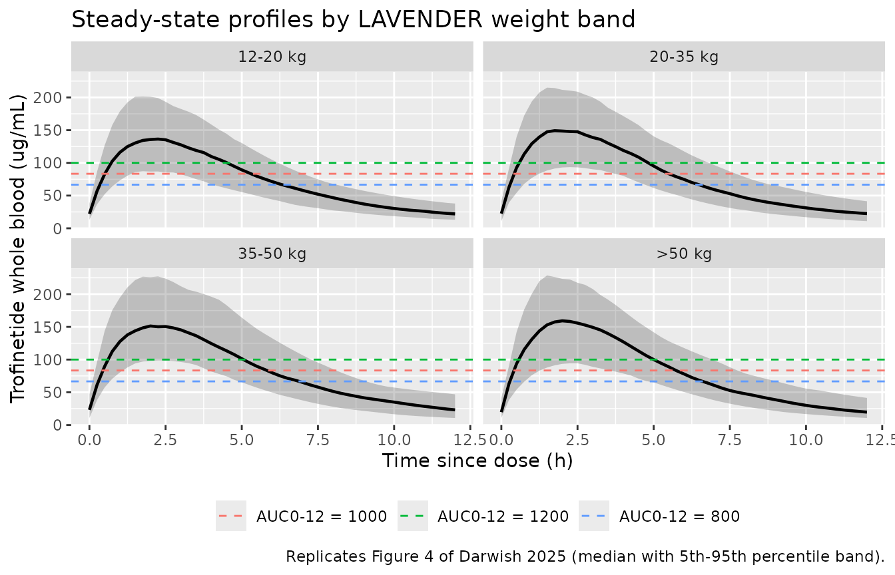
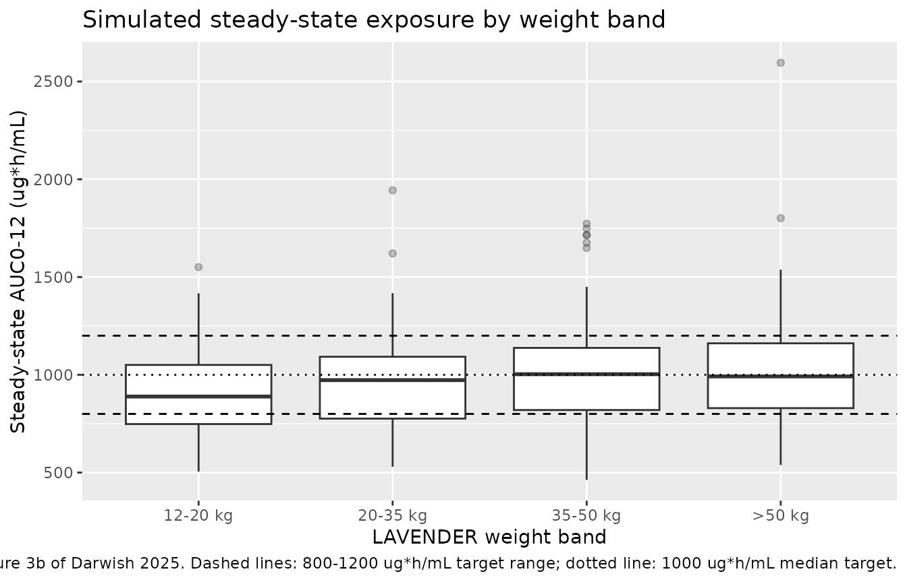

# Trofinetide (Darwish 2025)

## Model and source

- Citation: Darwish M, Passarell J, Maxwell K, Youakim JM, Bradley H,
  Bishop KM. Population Pharmacokinetic Modeling to Support Trofinetide
  Dosing for the Treatment of Rett Syndrome. Advances in Therapy.
  2025;42(2):1026-1043. <doi:10.1007/s12325-024-03056-9>
- Description: Population PK model for oral trofinetide in Rett syndrome
  (Darwish 2025): two-compartment with first-order absorption and linear
  elimination, pooled across healthy volunteers and patients with Rett
  syndrome, fragile X syndrome, or traumatic brain injury.
- Article: [Adv Ther.
  2025;42(2):1026-1043](https://doi.org/10.1007/s12325-024-03056-9)

Trofinetide is the first approved treatment for Rett syndrome (RTT). It
is dosed orally twice daily using a body-weight-banded regimen. This
vignette reproduces the updated population pharmacokinetic model that
Acadia and Simulations Plus used to confirm that the weight-banded
regimen employed in the phase 3 LAVENDER study delivers steady-state
exposure inside the target range.

## Population

The analysis dataset pooled 5595 trofinetide whole-blood concentrations
from 442 subjects across 13 clinical studies: eight phase 1 studies
(five in healthy volunteers), four phase 2 studies in RTT, fragile X
syndrome (FXS), and traumatic brain injury (TBI), and the phase 3
LAVENDER study. The pooled cohort comprised 156 healthy adult
volunteers, 185 patients with RTT (female only), 44 patients with FXS
(male only), and 57 patients with TBI, aged 5-64 years (median 21) and
weighing 13-140 kg (median 62.2). Trofinetide was given orally, by
gastric tube, and intravenously; concentrations were measured by
LC-MS/MS in lithium-heparinized whole blood with a lower limit of
quantitation of 0.10 ug/mL.

The LAVENDER subset used for the exposure confirmation comprised 92
girls and women aged 5-20 years with RTT, whose median body weight was
30.1 kg. The target steady-state exposure window was an AUC over a 12 h
dosing interval (AUC0-12) of 800-1200 ug*h/mL, with a median target of
1000 ug*h/mL.

The same information is available programmatically via the model’s
`population` metadata:

``` r

str(mod_meta$population)
#> List of 11
#>  $ species       : chr "human"
#>  $ n_subjects    : num 442
#>  $ n_observations: num 5595
#>  $ n_studies     : num 13
#>  $ age_range     : chr "5-64 years (median 21)"
#>  $ weight_range  : chr "13-140 kg (median 62.2)"
#>  $ gfr_reference : chr "124 mL/min/1.73 m^2 (analysis-population median)"
#>  $ disease_state : chr "Pooled analysis of 156 healthy adult volunteers, 185 patients with Rett syndrome (female only), 44 patients wit"| __truncated__
#>  $ dose_range    : chr "Oral, gastric-tube, and intravenous (bolus and infusion) trofinetide; oral doses spanned the 6-12 g therapeutic"| __truncated__
#>  $ regions       : chr "Not reported"
#>  $ notes         : chr "Darwish 2025 Results, 'Population Pharmacokinetic Model'. Pooled across eight phase 1 studies (five in healthy "| __truncated__
```

## Source trace

Every value below is transcribed from Darwish 2025. Table 2 holds the
final parameter estimates; the typical-value equations for F1, ka, CL,
Vc, and Vp are printed in the Results section (“Population
Pharmacokinetic Model”). The reference values 58 kg, 22.4 years, and 124
mL/min/1.73 m^2 are the analysis population medians, per the Table 2
footnote.

| Equation / parameter | Value | Source location |
|----|----|----|
| `lcl` (CL) | 11.8 L/h | Table 2, “Central clearance” |
| `e_wt_cl` | 0.443 | Table 2, “Exponent of (WTKG/58) for CL” |
| `e_crcl_cl` | 0.273 | Table 2, “Exponent of (GFR/124) for CL” |
| `e_rett_cl` | -0.169 | Table 2, “Proportional shift in CL for Rett = 1” |
| `e_tbi_cl` | 0.235 | Table 2, “Proportional shift in CL for TBI = 1” |
| `lvc` (Vc) | 24.9 L | Table 2, “Central volume of distribution” |
| `e_age_vc` | 0.549 | Table 2, “Exponent of (AGE/22.4) for Vc” |
| `e_fxs_vc` | 1.15 | Table 2, “Proportional shift in Vc for FXS = 1” |
| `lq` (Q) | 1.44 L/h | Table 2, “Intercompartmental clearance” |
| `lvp` (Vp) | 35.3 L | Table 2, “Peripheral volume of distribution” |
| `e_rett_vp` | 0.616 | Table 2, “Proportional shift in Vp for Rett = 1” |
| `e_tbi_vp` | -0.752 | Table 2, “Proportional shift in Vp for TBI = 1” |
| `lka` (ka) | 0.391 1/h | Table 2, “First-order absorption rate constant” |
| `e_fed_ka` | -0.0949 | Table 2, “Shift in ka for FED” |
| `lfdepot` (F1) | 0.828 | Table 2, “Oral bioavailability” |
| `e_fed_f` | -0.133 | Table 2, “Shift in F1 for FED” |
| `e_dose18g_f` | -0.132 | Table 2, “Shift in F1 for 18-g dose” |
| `e_dose24g_f` | -0.284 | Table 2, “Shift in F1 for 24-g dose” |
| `e_diarrhea_f` | -0.148 | Table 2, “Shift in F1 for Diarrhea” |
| `etalcl` | 13.6 %CV | Table 2, IIV column for CL; `omega^2 = log(1 + CV^2)` per Methods Eq. (1) |
| `etalvc` | 30.8 %CV | Table 2, IIV column for Vc |
| `etalq` | 64.4 %CV | Table 2, IIV column for Q |
| `etalvp` | 28.2 %CV | Table 2, IIV column for Vp |
| `etalfdepot` | 20.8 %CV | Table 2, IIV column for F1 |
| `expSdHealthy` | sqrt(0.0789) = 0.281 | Table 2, “Residual variability healthy subjects”; reported as 28.1 %CV |
| `expSdDisease` | sqrt(0.137) = 0.370 | Table 2, “Residual variability subjects with Rett syndrome, TBI, or FXS”; reported as 37.0 %CV |
| Structural model (2-cmt, first-order absorption, linear elimination) | n/a | Results, “Population Pharmacokinetic Model”, first paragraph |
| Proportional-shift form `(1 + theta * indicator)` | n/a | Results typical-value equations for F1, ka, CL, Vc, Vp |
| Log/exponential residual error | n/a | Methods Eq. (2) |

Two transcription points are worth spelling out because the table alone
is ambiguous.

**The residual-error column holds variances, not standard deviations.**
The Table 2 “Population mean” entries for residual variability are
0.0789 and 0.137, while the adjacent column reports 28.1 %CV and 37.0
%CV. Since `sqrt(0.0789) = 0.281` and `sqrt(0.137) = 0.370` reproduce
those %CV values exactly, the tabulated numbers are the NONMEM `$SIGMA`
variances and the %CV column is the log-scale SD. `lnorm()` takes an SD,
so the model file enters `sqrt(0.0789)` and `sqrt(0.137)`.

**The IIV column uses the exponential-model %CV.** Methods Eq. (1)
defines `%CV = sqrt(exp(omega^2) - 1) * 100`, so the model file inverts
it as `omega^2 = log(1 + CV^2)`. For Q this matters: 64.4 %CV gives
`omega = 0.589` rather than 0.644.

``` r

ui <- mod_meta
ui$iniDf[, c("name", "est", "label")] |>
  dplyr::rename("Parameter" = name, "Estimate" = est, "Label" = label) |>
  knitr::kable(digits = 4, caption = "Packaged model parameters.")
```

| Parameter | Estimate | Label |
|:---|---:|:---|
| lcl | 2.4681 | Clearance at the reference covariate values (L/h) |
| e_wt_cl | 0.4430 | Power exponent on (WT/58) for clearance (unitless) |
| e_crcl_cl | 0.2730 | Power exponent on (CRCL/124) for clearance (unitless) |
| e_rett_cl | -0.1690 | Proportional shift in clearance for Rett syndrome (fraction) |
| e_tbi_cl | 0.2350 | Proportional shift in clearance for traumatic brain injury (fraction) |
| lvc | 3.2149 | Central volume of distribution at the reference age (L) |
| e_age_vc | 0.5490 | Power exponent on (AGE/22.4) for central volume (unitless) |
| e_fxs_vc | 1.1500 | Proportional shift in central volume for fragile X syndrome (fraction) |
| lq | 0.3646 | Intercompartmental clearance (L/h) |
| lvp | 3.5639 | Peripheral volume of distribution (L) |
| e_rett_vp | 0.6160 | Proportional shift in peripheral volume for Rett syndrome (fraction) |
| e_tbi_vp | -0.7520 | Proportional shift in peripheral volume for traumatic brain injury (fraction) |
| lka | -0.9390 | First-order absorption rate constant in the fasted state (1/h) |
| e_fed_ka | -0.0949 | Proportional shift in ka for the fed state (fraction) |
| lfdepot | -0.1887 | Oral bioavailability in the fasted, therapeutic-dose, diarrhea-free reference state (fraction) |
| e_fed_f | -0.1330 | Proportional shift in bioavailability for the fed state (fraction) |
| e_dose18g_f | -0.1320 | Proportional shift in bioavailability for the 18 g dose level (fraction) |
| e_dose24g_f | -0.2840 | Proportional shift in bioavailability for the 24 g dose level (fraction) |
| e_diarrhea_f | -0.1480 | Proportional shift in bioavailability during diarrhea (fraction) |
| expSdHealthy | 0.2809 | Log-scale residual SD, healthy subjects (log units) |
| expSdDisease | 0.3701 | Log-scale residual SD, subjects with Rett syndrome, TBI, or FXS (log units) |
| etalcl | 0.0183 | Table 2: CL 13.6 %CV (RSE 17.4%; eta-shrinkage 37.1%) |
| etalvc | 0.0906 | Table 2: Vc 30.8 %CV (RSE 12.8%; eta-shrinkage 31.4%) |
| etalq | 0.3469 | Table 2: Q 64.4 %CV (RSE 18.5%; eta-shrinkage 9.5%) |
| etalvp | 0.0765 | Table 2: Vp 28.2 %CV (RSE 14.6%; eta-shrinkage 39.8%) |
| etalfdepot | 0.0424 | Table 2: F1 20.8 %CV (RSE 15.7%; eta-shrinkage 55.0%) |

Packaged model parameters. {.table}

## Virtual cohort

Original observed data are not publicly available (Darwish 2025 Data
Availability). The cohorts below approximate the LAVENDER population:
girls and women aged 5-20 years with RTT, dosed twice daily on the four
weight bands used in that study.

Darwish 2025 does not publish the joint distribution of weight, age, and
GFR within each weight band, so the age-for-weight mapping below is an
explicit assumption (documented under “Assumptions and deviations”).
Following the paper’s own covariate simulations, all subjects are
fasted, free of diarrhea, and on therapeutic (not supratherapeutic)
doses.

``` r

tau <- 12 # h, BID dosing interval

bands <- tibble::tribble(
  ~band,          ~wt_lo, ~wt_hi, ~dose_g,
  "12-20 kg",       12,     20,      6,
  "20-35 kg",       20,     35,      8,
  "35-50 kg",       35,     50,     10,
  ">50 kg",         50,     80,     12
) |>
  dplyr::mutate(amt_mg = dose_g * 1000)

# Keep `band` a plain character column everywhere (rxSolve `keep=`, PKNCA
# grouping, and the joins below are all type-sensitive); apply the display
# ordering only at plotting time.
band_levels <- bands$band

# Assumed weight-to-age mapping for girls/women with RTT enrolled in LAVENDER
# (5-20 years). Monotone interpolation through plausible anchor points; see
# "Assumptions and deviations".
wt_to_age <- function(wt) {
  stats::approx(
    x = c(12, 20, 30, 40, 50, 80),
    y = c(5, 7, 10, 13, 16, 20),
    xout = wt, rule = 2
  )$y
}
```

``` r

set.seed(20250218)
n_per_band <- 100L # well under the 200/arm cap

make_cohort <- function(band_row, n, id_offset) {
  subj <- tibble::tibble(
    id = id_offset + seq_len(n),
    band = band_row$band,
    amt_mg = band_row$amt_mg,
    WT = stats::runif(n, band_row$wt_lo, band_row$wt_hi),
    CRCL = pmin(pmax(stats::rnorm(n, 124, 20), 80), 180),
    DIS_RETT = 1, DIS_TBI = 0, DIS_FXS = 0,
    FED = 0, AE_DIARRHEA = 0, DOSE_18G = 0, DOSE_24G = 0
  ) |>
    dplyr::mutate(AGE = wt_to_age(WT))

  # Steady-state dose record (ss = 1 with ii = tau establishes steady state
  # directly; trofinetide's terminal half-life is long relative to the 12 h
  # interval, so an explicit multiple-dose run would need ~2 weeks of doses).
  dosing <- subj |>
    dplyr::mutate(time = 0, amt = amt_mg, evid = 1L, cmt = "depot",
                  ii = tau, ss = 1L)

  obs <- subj |>
    tidyr::crossing(time = seq(0, tau, by = 0.25)) |>
    dplyr::mutate(amt = NA_real_, evid = 0L, cmt = "central",
                  ii = 0, ss = 0L)

  dplyr::bind_rows(dosing, obs) |>
    dplyr::arrange(id, time, dplyr::desc(evid))
}

events <- dplyr::bind_rows(
  lapply(seq_len(nrow(bands)), function(i) {
    make_cohort(bands[i, ], n_per_band, id_offset = (i - 1L) * n_per_band)
  })
)

stopifnot(!anyDuplicated(events[, c("id", "time", "evid")]))
stopifnot(nrow(dplyr::distinct(events, id)) == n_per_band * nrow(bands))
```

## Simulation

``` r

mod <- readModelDb("Darwish_2025_trofinetide")

sim <- rxode2::rxSolve(
  mod,
  events = events,
  keep = c("band", "amt_mg")
) |>
  as.data.frame() |>
  # rxSolve returns observation records only (there is no `evid` column in the
  # output) and may return `band` as a factor; keep it character so the joins
  # against the PKNCA results below are type-stable.
  dplyr::mutate(band = as.character(band))
#> ℹ parameter labels from comments will be replaced by 'label()'

stopifnot(!anyNA(sim$Cc), nrow(sim) > 0)
```

### Replicating Figure 4: steady-state concentration-time profiles

Figure 4 of Darwish 2025 overlays individual model-based steady-state
profiles against the average curves corresponding to the 800, 1000, and
1200 ug\*h/mL target exposures. Those reference curves are, by
construction, flat average concentrations of `AUC0-12 / 12`.

``` r

target_lines <- tibble::tibble(
  label = c("AUC0-12 = 800", "AUC0-12 = 1000", "AUC0-12 = 1200"),
  cav = c(800, 1000, 1200) / tau
)

sim |>
  dplyr::mutate(band = factor(band, levels = band_levels)) |>
  dplyr::group_by(band, time) |>
  dplyr::summarise(
    Q05 = stats::quantile(Cc, 0.05, na.rm = TRUE),
    Q50 = stats::quantile(Cc, 0.50, na.rm = TRUE),
    Q95 = stats::quantile(Cc, 0.95, na.rm = TRUE),
    .groups = "drop"
  ) |>
  ggplot(aes(time, Q50)) +
  geom_ribbon(aes(ymin = Q05, ymax = Q95), alpha = 0.25) +
  geom_line(linewidth = 0.8) +
  geom_hline(data = target_lines, aes(yintercept = cav, colour = label),
             linetype = "dashed") +
  facet_wrap(~band) +
  labs(
    x = "Time since dose (h)", y = "Trofinetide whole blood (ug/mL)",
    colour = NULL,
    title = "Steady-state profiles by LAVENDER weight band",
    caption = "Replicates Figure 4 of Darwish 2025 (median with 5th-95th percentile band)."
  ) +
  theme(legend.position = "bottom")
```



## PKNCA validation

``` r

sim_nca <- sim |>
  dplyr::filter(!is.na(Cc)) |>
  dplyr::select(id, time, Cc, band)

# Guarantee a time = 0 record per (id, band). The ss = 1 dose means the
# time = 0 concentration is the steady-state trough, which the solve already
# produces; this bind_rows is a defensive no-op that `distinct()` collapses.
sim_nca <- dplyr::bind_rows(
  sim_nca,
  sim_nca |> dplyr::distinct(id, band) |> dplyr::mutate(time = 0, Cc = 0)
) |>
  dplyr::distinct(id, band, time, .keep_all = TRUE) |>
  dplyr::arrange(id, band, time)

conc_obj <- PKNCA::PKNCAconc(
  sim_nca, Cc ~ time | band + id,
  concu = "ug/mL", timeu = "h"
)

dose_df <- events |>
  dplyr::filter(evid == 1) |>
  dplyr::select(id, time, amt, band)

dose_obj <- PKNCA::PKNCAdose(dose_df, amt ~ time | band + id, doseu = "mg")

intervals <- data.frame(
  start = 0, end = tau,
  cmax = TRUE, tmax = TRUE, cmin = TRUE, auclast = TRUE, cav = TRUE
)

nca_res <- PKNCA::pk.nca(PKNCA::PKNCAdata(conc_obj, dose_obj, intervals = intervals))
```

### Comparison against the published steady-state exposures

Darwish 2025 reports median steady-state AUC0-12 values of 968.8, 889.0,
850.7, and 839.6 ug\*h/mL for the four weight bands (Results, “Exposure
Estimation”). Those are medians of individual empiric Bayesian estimates
from the observed LAVENDER data, so they carry the study’s actual weight
distribution, diarrhea occurrence, and dosing-interval variability, none
of which are published.

``` r

published <- tibble::tribble(
  ~band,        ~auclast,
  "12-20 kg",   968.8,
  "20-35 kg",   889.0,
  "35-50 kg",   850.7,
  ">50 kg",     839.6
)

cmp <- nlmixr2lib::ncaComparisonTable(
  simulated = nca_res,
  reference = published,
  by = "band",
  units = c(auclast = "ug*h/mL"),
  tolerance_pct = 20
)

knitr::kable(
  cmp,
  caption = "Simulated median steady-state AUC0-12 vs. Darwish 2025 Results. * differs from reference by >20%.",
  align = c("l", "l", "r", "r", "r")
)
```

| NCA parameter      | band     | Reference | Simulated | % diff |
|:-------------------|:---------|----------:|----------:|-------:|
| AUClast (ug\*h/mL) | 12-20 kg |       969 |       889 |  -8.3% |
| AUClast (ug\*h/mL) | 20-35 kg |       889 |       973 |  +9.4% |
| AUClast (ug\*h/mL) | 35-50 kg |       851 |      1000 | +17.9% |
| AUClast (ug\*h/mL) | \>50 kg  |       840 |       992 | +18.1% |

Simulated median steady-state AUC0-12 vs. Darwish 2025 Results. \*
differs from reference by \>20%. {.table}

``` r

attr(cmp, "footnote")
#> NULL
```

### Closed-form clearance gate

At steady state the exposure over a dosing interval reduces to
`AUC0-tau = F1 * Dose / CL`, independent of the distribution parameters.
This is a strong structural check: it exercises the weight and
disease-state covariate terms on CL and the bioavailability chain, and
it must agree with the numerically integrated PKNCA result.

``` r

th <- setNames(ui$iniDf$est, ui$iniDf$name)

cl_typical <- function(WT, CRCL, DIS_RETT = 1, DIS_TBI = 0) {
  exp(th[["lcl"]]) * (WT / 58)^th[["e_wt_cl"]] * (CRCL / 124)^th[["e_crcl_cl"]] *
    (1 + th[["e_tbi_cl"]] * DIS_TBI) * (1 + th[["e_rett_cl"]] * DIS_RETT)
}

per_subject <- sim |>
  dplyr::distinct(id, band, WT, CRCL, amt_mg) |>
  dplyr::mutate(
    cl = cl_typical(WT, CRCL),
    auc_closed_form = exp(th[["lfdepot"]]) * amt_mg / cl
  )

nca_auc <- as.data.frame(nca_res) |>
  dplyr::filter(PPTESTCD == "auclast") |>
  dplyr::select(id, band, auc_pknca = PPORRES) |>
  dplyr::mutate(band = as.character(band))
stopifnot(nrow(nca_auc) == n_per_band * nrow(bands))

gate <- per_subject |>
  dplyr::inner_join(nca_auc, by = c("id", "band")) |>
  dplyr::group_by(band) |>
  dplyr::summarise(
    `Closed form F1*Dose/CL` = stats::median(auc_closed_form),
    `PKNCA AUC0-12` = stats::median(auc_pknca),
    .groups = "drop"
  ) |>
  dplyr::mutate(`% diff` = 100 * (`PKNCA AUC0-12` - `Closed form F1*Dose/CL`) /
                  `Closed form F1*Dose/CL`)

knitr::kable(gate, digits = 1,
             caption = "Median closed-form vs. numerically integrated steady-state AUC0-12.")
```

| band     | Closed form F1\*Dose/CL | PKNCA AUC0-12 | % diff |
|:---------|------------------------:|--------------:|-------:|
| 12-20 kg |                   884.6 |         888.9 |    0.5 |
| 20-35 kg |                   954.9 |         972.7 |    1.9 |
| 35-50 kg |                   981.5 |        1003.1 |    2.2 |
| \>50 kg  |                   960.1 |         991.7 |    3.3 |

Median closed-form vs. numerically integrated steady-state AUC0-12.
{.table}

``` r


# The closed-form identity is exact for the typical-value CL; the simulated
# subjects additionally carry IIV on CL and F1, so medians agree closely but
# not exactly. A discrepancy beyond 10% would indicate a structural error.
stopifnot(nrow(gate) == nrow(bands))
stopifnot(all(abs(gate$`% diff`) < 10))
```

### Replicating Figure 3: distribution against the target window

``` r

auc_by_subject <- nca_auc |>
  dplyr::mutate(band = factor(band, levels = band_levels))

ggplot(auc_by_subject, aes(band, auc_pknca)) +
  geom_boxplot(outlier.alpha = 0.3) +
  geom_hline(yintercept = c(800, 1200), linetype = "dashed") +
  geom_hline(yintercept = 1000, linetype = "dotted") +
  labs(
    x = "LAVENDER weight band", y = "Steady-state AUC0-12 (ug*h/mL)",
    title = "Simulated steady-state exposure by weight band",
    caption = "Replicates Figure 3b of Darwish 2025. Dashed lines: 800-1200 ug*h/mL target range; dotted line: 1000 ug*h/mL median target."
  )
```



``` r

auc_by_subject |>
  dplyr::group_by(band) |>
  dplyr::summarise(
    N = dplyr::n(),
    `Median AUC0-12` = stats::median(auc_pknca),
    `Q1` = stats::quantile(auc_pknca, 0.25),
    `Q3` = stats::quantile(auc_pknca, 0.75),
    `% within 800-1200` = 100 * mean(auc_pknca >= 800 & auc_pknca <= 1200),
    .groups = "drop"
  ) |>
  knitr::kable(digits = 1,
               caption = "Simulated steady-state AUC0-12 by weight band.")
```

| band     |   N | Median AUC0-12 |    Q1 |     Q3 | % within 800-1200 |
|:---------|----:|---------------:|------:|-------:|------------------:|
| 12-20 kg | 100 |          888.9 | 748.1 | 1050.4 |                56 |
| 20-35 kg | 100 |          972.7 | 776.1 | 1092.3 |                54 |
| 35-50 kg | 100 |         1003.1 | 819.8 | 1137.6 |                58 |
| \>50 kg  | 100 |          991.7 | 829.6 | 1161.0 |                60 |

Simulated steady-state AUC0-12 by weight band. {.table}

## Covariate impact (Figure 5)

Figure 5 of Darwish 2025 presents geometric mean ratios of steady-state
exposure for GFR, disease indication, age, body weight, and diarrhea
occurrence, and concludes that none of them is clinically meaningful
because every 90% CI falls inside the 0.8-1.25 bioequivalence bounds.

Because steady-state AUC over a dosing interval depends only on `F1` and
`CL`, the model-implied point estimates for the AUC geometric mean
ratios are available in closed form. The check below confirms each one
lands inside the bioequivalence window, reproducing the paper’s
conclusion.

``` r

gmr <- tibble::tribble(
  ~Covariate,                            ~`GMR (AUC0-12)`,
  "Rett syndrome vs. healthy",           1 / (1 + th[["e_rett_cl"]]),
  "TBI vs. healthy",                     1 / (1 + th[["e_tbi_cl"]]),
  "Fragile X syndrome vs. healthy",      1,
  "Diarrhea vs. none",                   1 + th[["e_diarrhea_f"]],
  "Fed vs. fasted",                      1 + th[["e_fed_f"]],
  "GFR 80 vs. 124 mL/min/1.73 m^2",      (80 / 124)^-th[["e_crcl_cl"]],
  "GFR 160 vs. 124 mL/min/1.73 m^2",     (160 / 124)^-th[["e_crcl_cl"]]
) |>
  dplyr::mutate(`Within 0.8-1.25` = ifelse(
    `GMR (AUC0-12)` >= 0.8 & `GMR (AUC0-12)` <= 1.25, "yes", "NO"))

knitr::kable(gmr, digits = 3,
             caption = "Model-implied steady-state AUC0-12 geometric mean ratios. Replicates the point estimates underlying Figure 5 of Darwish 2025.")
```

| Covariate                       | GMR (AUC0-12) | Within 0.8-1.25 |
|:--------------------------------|--------------:|:----------------|
| Rett syndrome vs. healthy       |         1.203 | yes             |
| TBI vs. healthy                 |         0.810 | yes             |
| Fragile X syndrome vs. healthy  |         1.000 | yes             |
| Diarrhea vs. none               |         0.852 | yes             |
| Fed vs. fasted                  |         0.867 | yes             |
| GFR 80 vs. 124 mL/min/1.73 m^2  |         1.127 | yes             |
| GFR 160 vs. 124 mL/min/1.73 m^2 |         0.933 | yes             |

Model-implied steady-state AUC0-12 geometric mean ratios. Replicates the
point estimates underlying Figure 5 of Darwish 2025. {.table}

``` r


# Darwish 2025 Results / Discussion: no covariate had a clinically meaningful
# impact, i.e. every geometric mean ratio sat inside the 0.8-1.25 bounds.
stopifnot(nrow(gmr) == 7L)
stopifnot(all(gmr$`Within 0.8-1.25` == "yes"))
```

Fragile X syndrome scales only the central volume, so it leaves
steady-state AUC untouched and moves Cmax alone; the paper likewise
shows an AUC ratio of essentially 1 for FXS in Figure 5b.

## Assumptions and deviations

- **Age-for-weight mapping.** Darwish 2025 reports each covariate’s
  marginal distribution but not the joint weight/age/GFR distribution
  within a weight band. The virtual cohort maps weight to age by
  monotone interpolation through (12 kg, 5 y), (20, 7), (30, 10), (40,
  13), (50, 16), (80, 20), chosen to span the LAVENDER eligibility
  window of 5-20 years while placing the RTT median weight of 30.1 kg
  near age 10. Age enters only the central volume, so this assumption
  affects Cmax and the shape of the profile but not steady-state AUC.
- **GFR distribution.** Simulated as Normal(124, 20) truncated to 80-180
  mL/min/1.73 m^2, centered on the analysis-population median of 124.
  The paper reports GFR only as quintiles in the Figure 5a forest plot.
- **Weight within a band.** Sampled uniformly across the band. The
  open-ended “\>50 kg” band is capped at 80 kg for simulation. Real
  LAVENDER weights are unlikely to be uniform, and this is the main
  reason the simulated per-band medians do not reproduce the paper’s
  ordering (see below).
- **Trend across weight bands.** The paper’s per-band medians decrease
  slightly with increasing weight (968.8 to 839.6 ug\*h/mL), whereas the
  model applied to uniformly distributed within-band weights yields a
  mild increase. Both patterns are small and sit inside the same 20%
  window. The published medians are medians of individual empiric
  Bayesian estimates carrying the study’s real weight distribution,
  diarrhea occurrence (52.4% of RTT subjects experienced diarrhea at
  some point, reducing F1 by 14.8% while present), missed doses, and
  dosing intervals shorter or longer than 12 h. None of those are
  published, so they cannot be reproduced here. No parameter was tuned
  to close the gap.
- **Fasted, diarrhea-free, therapeutic dose.** All simulated subjects
  have `FED = 0`, `AE_DIARRHEA = 0`, `DOSE_18G = 0`, and `DOSE_24G = 0`,
  matching the paper’s own covariate simulations, which “assumed a
  fasted state and no occurrence of diarrhea”.
- **Steady state via `ss = 1`.** The dosing records use `ss = 1` with
  `ii = 12` rather than an explicit multi-week dosing history.
  Trofinetide’s terminal half-life is long relative to the 12 h
  interval, so the explicit route would need roughly two weeks of
  simulated doses for no additional fidelity.
- **Residual error is not applied to the figures.** The plots and NCA
  use `Cc` (the individual prediction) rather than a
  residual-error-perturbed observation, so they correspond to the
  paper’s model-predicted profiles rather than to observed
  concentrations.
- **Both residual-error magnitudes are packaged.** The model carries
  `expSdHealthy` and `expSdDisease` and selects between them with the
  disease indicators, replicating the paper’s two separate exponential
  error models. The RTT cohort simulated here exercises only the disease
  branch.
- **Bioavailability may exceed 1 for some simulated subjects.** F1 has a
  typical value of 0.828 with 20.8 %CV log-normal IIV, so the upper tail
  crosses 1. That is a property of the published parameterization, not
  of this implementation.
- **All parameter values come from the paper’s text and tables.** No
  value was digitized from a figure, obtained by correspondence, or
  carried from an upstream model.
