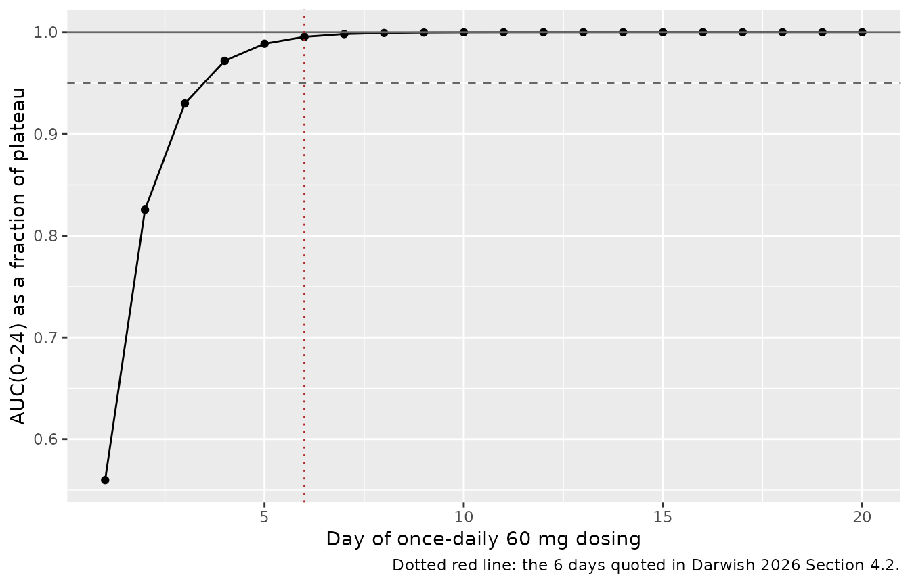
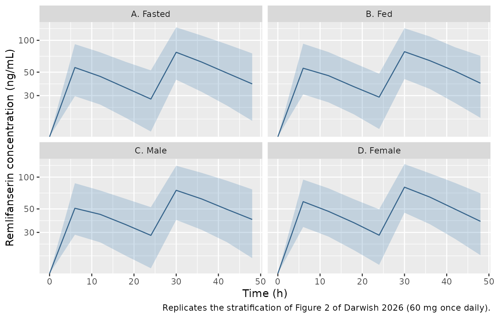
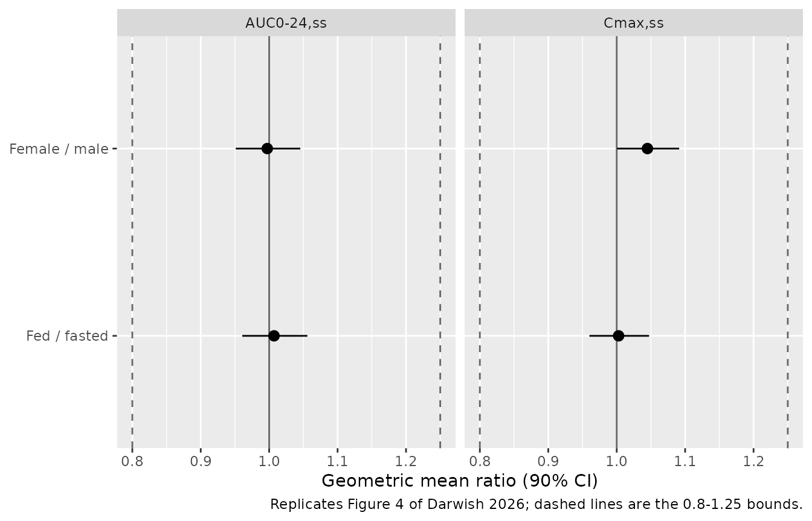

# Remlifanserin (Darwish 2026)

## Model and source

- Citation: Darwish M, Lin N, Dirks B, Jaworowicz D, Maxwell K,
  Pathak S. Population pharmacokinetics of remlifanserin (ACP-204), a
  serotonin 2A receptor inverse agonist. Alzheimer’s & Dementia:
  Translational Research & Clinical Interventions. 2026;12(1):e70254.
  <doi:10.1002/trc2.70254>
- Description: Population PK model for oral remlifanserin (ACP-204), a
  selective 5-HT2A receptor inverse agonist (Darwish 2026):
  one-compartment with first-order absorption, an absorption lag time
  and linear elimination, pooled across seven Phase 1 studies in healthy
  young and older adults. Fed status shifts the absorption lag time and
  female sex lowers the apparent central volume.
- Article: <https://doi.org/10.1002/trc2.70254>
- Supplement (Supplemental Tables 1-6 and the NONMEM control stream):
  <https://www.ebi.ac.uk/europepmc/webservices/rest/PMC13133547/supplementaryFiles>

Remlifanserin (ACP-204) is a selective serotonin 2A (5-HT_(2A)) receptor
inverse agonist in development for Alzheimer’s disease psychosis and
Lewy body dementia psychosis. Darwish 2026 is the first population PK
model for the compound.

### Units

The model is parameterised in **days**, exactly as Darwish 2026 Table 1
and the Supplemental Methods control stream report it. The control
stream’s scaling line reads
`S2=V ;Dose amount = ug; Volume = L; Concentration = ng/mL`, so **dose
amounts are entered in micrograms**: the 60 mg target dose is `60000`.
Darwish 2026 Section 3.4 restates the identical estimates in hours (CL/F
35.4 L/h, K_(a) 0.692 1/h, ALAG1 0.720 h fasted); those are conversions
of the same numbers, not a separate parameterisation.

## Population

The model was fit to 3935 plasma concentrations from 209 healthy
participants pooled across seven Phase 1 studies of remlifanserin
(Supplemental Table 1): a single-ascending-dose study with a food arm
(001), a multiple-ascending-dose study that included an elderly cohort
(002), a PET receptor-occupancy study (003), itraconazole and
carbamazepine drug-drug-interaction studies (004 and 005, of which only
period 1 was retained), a crossover food-effect study (010), and a
`[14C]` mass-balance study (011). Oral doses spanned 10 to 180 mg, given
as single doses and as once-daily multiple doses for 10 days.

Participants were 19 to 75 years old (median 37), weighed 47 to 108 kg
(median 77.6), and had a BMI of 18.5 to 31.9 kg/m² (median 26.3). 30.6%
(64/209) were female. Race was 59.3% White, 33.0% Black or African
American, 2.87% Asian and 4.78% Other. Renal and hepatic function were
predominantly normal (eGFR 58.4 to 138 mL/min/1.73 m², median 103). Only
18 participants were in the 65-75 year older-adult stratum, which
Darwish 2026 Section 4.3 flags as a limitation. Baseline demographics
are Supplemental Table 2; the fed/fasted record split (71% fasted, 29%
fed) is Supplemental Table 3.

The same information is available programmatically via
`readModelDb("Darwish_2026_remlifanserin")()$population`.

## Source trace

The per-parameter origin is recorded as an in-file comment next to each
`ini()` entry in
`inst/modeldb/specificDrugs/Darwish_2026_remlifanserin.R`. The table
below collects them in one place for review.

| Equation / parameter | Value | Source location |
|----|----|----|
| Structural model: 1-compartment, first-order absorption, absorption lag, linear elimination | n/a | Section 3.1; Supplemental Methods `$SUBROUTINES ADVAN2 TRANS2` |
| `lcl` (CL/F) | `log(849)` L/day | Table 1, “CL/F (L/day)” = 849, RSE 2.84% |
| `lvc` (V/F, male) | `log(930)` L | Table 1, “V/F (L)” = 930, RSE 2.43% |
| `lka` (K_(a)) | `log(16.6)` 1/day | Table 1, “K_(a) (1/day)” = 16.6, RSE 4.65% |
| `ltlag` (ALAG1, fasted) | `log(0.0300)` day | Table 1, “ALAG1 (day)” = 0.0300, RSE 1.91% |
| `e_sexf_vc` | -131 L | Table 1, “Additive shift in V/F for females” = -131, RSE 16.8% |
| `e_fed_tlag` | 0.290 | Table 1, “Proportional shift in ALAG1 for fed status” = 0.290, RSE 10.4% |
| `vc <- (exp(lvc) + e_sexf_vc * SEXF) * exp(etalvc)` | n/a | Section 3.2 equation `V/F_i = 930 L - 131 * female_i`; `$PK` block `TVV = TVVI + COV2`, `V = TVV*EXP(ETA(2))` |
| `tlag <- exp(ltlag) * (1 + e_fed_tlag * FED) * exp(etaltlag)` | n/a | Section 3.2 equation `ALAG1_i = 0.0300 d * (1 + 0.290 * fed_i)`; `$PK` block `TVALAG1 = THETA(4)*(1+THETA(5)*FED)` |
| `etalcl` variance | 0.1668 | Table 1, CL/F 42.6 %CV, back-transformed as `log(1 + 0.426^2)` |
| `etalvc` variance | 0.0981 | Table 1, V/F 32.1 %CV, back-transformed as `log(1 + 0.321^2)` |
| `etalcl`-`etalvc` covariance | 0.109 | Table 1, “Covariance (IIV in V/F, IIV in CL/F)” = 0.109, RSE 11.9% |
| `etalka` variance | 0.3754 | Table 1, K_(a) 67.5 %CV, back-transformed as `log(1 + 0.675^2)` |
| `etaltlag` variance | 0.01138 | Table 1, ALAG1 10.7 %CV, back-transformed as `log(1 + 0.107^2)` |
| `propSd` | 0.197 | Table 1, “Residual variability” = 0.0388 (a variance), reported as 19.7 %CV; `sqrt(0.0388)` = 0.1970 |

### Pinning the omega scale

Darwish 2026 prints interindividual variability only as a percent CV, so
each variance had to be back-transformed. Two independent checks
establish that the paper used the log-normal relation
`omega^2 = log(1 + CV^2)` rather than the `omega = CV` approximation.

``` r

cv <- c(cl = 0.426, vc = 0.321)            # Table 1, %CV column
covariance <- 0.109                         # Table 1, covariance row

omega2_lognormal <- log(1 + cv^2)           # candidate A
omega2_cvdirect  <- cv^2                    # candidate B

r_lognormal <- covariance / sqrt(prod(omega2_lognormal))
r_cvdirect  <- covariance / sqrt(prod(omega2_cvdirect))

# Table 1 footnote: "The calculated correlation coefficient (r) associated with
# covariance (IIV in V/F, IIV in CL/F) was 0.852 with r^2 = 0.726."
data.frame(
  scale = c("omega^2 = log(1 + CV^2)", "omega^2 = CV^2"),
  r     = c(r_lognormal, r_cvdirect),
  r2    = c(r_lognormal, r_cvdirect)^2,
  published_r = 0.852,
  published_r2 = 0.726
) |>
  knitr::kable(digits = 4, caption = "Which omega scale reproduces the Table 1 footnote?")
```

| scale                   |      r |     r2 | published_r | published_r2 |
|:------------------------|-------:|-------:|------------:|-------------:|
| omega^2 = log(1 + CV^2) | 0.8523 | 0.7265 |       0.852 |        0.726 |
| omega^2 = CV^2          | 0.7971 | 0.6354 |       0.852 |        0.726 |

Which omega scale reproduces the Table 1 footnote? {.table}

``` r


# The log-normal back-transform reproduces the published r to three decimals;
# the CV-squared alternative is off by more than 0.05. Gate on the footnote.
stopifnot(
  abs(r_lognormal - 0.852) < 0.002,
  abs(r_lognormal^2 - 0.726) < 0.002,
  abs(r_cvdirect - 0.852) > 0.02
)
```

The Supplemental Methods `$OMEGA` initial estimates (0.16 for CL/F, 0.09
for V/F, 0.10 for the covariance, 0.30 for K_(a), 0.01 for ALAG1) sit
next to the back-transformed final values (0.1668, 0.0981, 0.109,
0.3754, 0.01138), independently confirming that these are NONMEM
variances on the log scale.

## Typical-value replication

Darwish 2026 Section 3.4 restates the final estimates for a typical
participant. Because these are deterministic functions of the `ini()`
block, they can be gated tightly.

``` r

mod <- readModelDb("Darwish_2026_remlifanserin")
mod_typical <- rxode2::zeroRe(mod)
#> ℹ parameter labels from comments will be replaced by 'label()'

# 60 mg = 60000 ug single oral dose, dense grid for Cmax / Tmax resolution.
typical_events <- tidyr::expand_grid(
  arm  = c("Male, fasted", "Male, fed", "Female, fasted", "Female, fed"),
  time = c(0, seq(0, 25, by = 0.0005))
) |>
  dplyr::distinct(arm, time) |>
  dplyr::mutate(
    id   = as.integer(factor(arm)),
    SEXF = as.integer(grepl("Female", arm)),
    FED  = as.integer(grepl("fed$", arm)),
    evid = 0L, amt = NA_real_, cmt = "central"
  ) |>
  dplyr::bind_rows(
    tibble::tibble(
      arm  = c("Male, fasted", "Male, fed", "Female, fasted", "Female, fed")
    ) |>
      dplyr::mutate(
        id   = as.integer(factor(arm)),
        SEXF = as.integer(grepl("Female", arm)),
        FED  = as.integer(grepl("fed$", arm)),
        time = 0, evid = 1L, amt = 60000, cmt = "depot"
      )
  ) |>
  dplyr::arrange(id, time, dplyr::desc(evid))

sim_typical <- rxode2::rxSolve(
  mod_typical, events = typical_events, keep = "arm", returnType = "data.frame"
)
#> ℹ omega/sigma items treated as zero: 'etalcl', 'etalvc', 'etalka', 'etaltlag'
#> Warning: multi-subject simulation without without 'omega'

typical_summary <- sim_typical |>
  dplyr::group_by(arm) |>
  dplyr::summarise(
    `CL/F (L/h)`  = dplyr::first(cl) / 24,
    `V/F (L)`     = dplyr::first(vc),
    `Ka (1/h)`    = dplyr::first(ka) / 24,
    `ALAG1 (h)`   = dplyr::first(tlag) * 24,
    `t1/2 (h)`    = log(2) / dplyr::first(kel) * 24,
    `Cmax (ng/mL)` = max(Cc),
    `Tmax (h)`    = time[which.max(Cc)] * 24,
    .groups = "drop"
  )

knitr::kable(
  typical_summary, digits = 3,
  caption = "Typical-value predictions for a 60 mg single oral dose."
)
```

| arm | CL/F (L/h) | V/F (L) | Ka (1/h) | ALAG1 (h) | t1/2 (h) | Cmax (ng/mL) | Tmax (h) |
|:---|---:|---:|---:|---:|---:|---:|---:|
| Female, fasted | 35.375 | 799 | 0.692 | 0.720 | 15.656 | 62.225 | 4.968 |
| Female, fed | 35.375 | 799 | 0.692 | 0.929 | 15.656 | 62.225 | 5.172 |
| Male, fasted | 35.375 | 930 | 0.692 | 0.720 | 18.223 | 54.496 | 5.160 |
| Male, fed | 35.375 | 930 | 0.692 | 0.929 | 18.223 | 54.496 | 5.364 |

Typical-value predictions for a 60 mg single oral dose. {.table
style="width:100%;"}

``` r

male_fasted <- typical_summary[typical_summary$arm == "Male, fasted", ]
fem_fasted  <- typical_summary[typical_summary$arm == "Female, fasted", ]
male_fed    <- typical_summary[typical_summary$arm == "Male, fed", ]

# Darwish 2026 Section 3.4, verbatim: "The estimated population mean Ka of
# 0.692/h ... The estimated population mean for ALAG1 is 0.720 h under the
# fasted state and is predicted to increase to 0.929 h with food intake. CL/F
# for a typical participant is estimated to be 35.4 L/h. V/F is predicted to be
# 930 L for a typical male participant and 799 L for a typical female
# participant."
stopifnot(
  abs(male_fasted$`CL/F (L/h)` - 35.4)   < 0.05,
  abs(male_fasted$`Ka (1/h)`   - 0.692)  < 0.001,
  abs(male_fasted$`ALAG1 (h)`  - 0.720)  < 0.001,
  abs(male_fed$`ALAG1 (h)`     - 0.929)  < 0.001,
  abs(male_fasted$`V/F (L)`    - 930)    < 0.5,
  abs(fem_fasted$`V/F (L)`     - 799)    < 0.5
)

# Section 4.1: food delays Tmax by "~13 min". The lag shift is the only
# mechanism, so the Tmax shift equals the ALAG1 shift exactly.
tmax_shift_min <- (male_fed$`Tmax (h)` - male_fasted$`Tmax (h)`) * 60
cat(sprintf("Food-induced Tmax shift: %.1f min (Darwish 2026 Section 4.1: ~13 min)\n",
            tmax_shift_min))
#> Food-induced Tmax shift: 12.2 min (Darwish 2026 Section 4.1: ~13 min)
stopifnot(abs(tmax_shift_min - 13) < 1.5)
```

### Mass balance

Only oral data were available, so `cl` and `vc` are apparent values and
the dose enters the depot unscaled (Section 2.3). The identity
`CL/F * AUC(0-Inf) = dose` must therefore hold exactly. This is the gate
that would catch an `alag()` that silently zeroed the depot, or an
unnoticed `linCmt()` auto-solve that discarded the explicit ODEs.

``` r

stopifnot(is.null(rxode2::rxode(mod)$linCmt))  # explicit ODEs, not auto-solved
#> ℹ parameter labels from comments will be replaced by 'label()'

mass_balance <- sim_typical |>
  dplyr::group_by(arm) |>
  dplyr::arrange(time, .by_group = TRUE) |>
  dplyr::summarise(
    # trapezoidal AUC over the observed grid plus the analytic terminal tail
    auc = sum(diff(time) * (head(Cc, -1) + tail(Cc, -1)) / 2) +
      dplyr::last(Cc) / dplyr::first(kel),
    ratio = dplyr::first(cl) * auc / 60000,
    .groups = "drop"
  )

knitr::kable(mass_balance, digits = 6,
             caption = "CL/F * AUC(0-Inf) / dose; must be 1.")
```

| arm            |      auc | ratio |
|:---------------|---------:|------:|
| Female, fasted | 70.67135 |     1 |
| Female, fed    | 70.67139 |     1 |
| Male, fasted   | 70.67136 |     1 |
| Male, fed      | 70.67139 |     1 |

CL/F \* AUC(0-Inf) / dose; must be 1. {.table}

``` r

stopifnot(max(abs(mass_balance$ratio - 1)) < 1e-3)
```

### Time to steady state

Section 4.2 states that “At daily doses of 60 mg of remlifanserin,
participants achieved steady-state exposure levels within 6 days.”

``` r

ss_events <- dplyr::bind_rows(
  tibble::tibble(time = 0:20, evid = 1L, amt = 60000, cmt = "depot"),
  tibble::tibble(time = seq(0, 21, by = 0.01), evid = 0L,
                 amt = NA_real_, cmt = "central")
) |>
  dplyr::mutate(id = 1L, SEXF = 0L, FED = 0L) |>
  dplyr::arrange(time, dplyr::desc(evid))

# rxSolve returns observation rows only and does not carry `evid` through to
# its output, so there is nothing to filter here.
ss <- rxode2::rxSolve(mod_typical, events = ss_events, returnType = "data.frame")
#> ℹ omega/sigma items treated as zero: 'etalcl', 'etalvc', 'etalka', 'etaltlag'

by_day <- ss |>
  dplyr::mutate(day = ceiling(pmax(time, 1e-9))) |>
  dplyr::filter(day >= 1, day <= 20) |>
  dplyr::group_by(day) |>
  dplyr::summarise(cmax = max(Cc), auc_tau = mean(Cc), .groups = "drop")

plateau <- by_day$auc_tau[by_day$day == 20]
first_day_within <- function(pct) min(by_day$day[by_day$auc_tau / plateau >= pct])

cat(sprintf("AUC(0-24) reaches 90%% of plateau on day %d, 95%% on day %d, 99%% on day %d\n",
            first_day_within(0.90), first_day_within(0.95), first_day_within(0.99)))
#> AUC(0-24) reaches 90% of plateau on day 3, 95% on day 4, 99% on day 6
stopifnot(first_day_within(0.95) <= 6, first_day_within(0.99) <= 6)

ggplot(by_day, aes(day, auc_tau / plateau)) +
  geom_line() + geom_point() +
  geom_hline(yintercept = 1, linetype = "solid", colour = "grey40") +
  geom_hline(yintercept = 0.95, linetype = "dashed", colour = "grey40") +
  geom_vline(xintercept = 6, linetype = "dotted", colour = "firebrick") +
  labs(x = "Day of once-daily 60 mg dosing", y = "AUC(0-24) as a fraction of plateau",
       caption = "Dotted red line: the 6 days quoted in Darwish 2026 Section 4.2.")
```



### Dose proportionality (Figure 3)

Section 2.7 fits the power model `ln(Y) = intercept + beta * ln(dose)`
and declares proportionality when the 90% CI of `beta` lies within
`(1 + ln(0.8)/ln(r), 1 + ln(1.25)/ln(r))`, with `r` the ratio of the
highest to the lowest dose. The packaged model is structurally linear,
so this reproduces the paper’s conclusion by construction rather than as
an independent test; it is included to confirm that no dose-dependent
term crept into the encoding.

``` r

doses_mg <- c(10, 20, 40, 60, 90, 120, 130, 180)

dp_events <- tidyr::expand_grid(dose_mg = doses_mg, time = seq(0, 25, by = 0.005)) |>
  dplyr::mutate(id = as.integer(factor(dose_mg)), evid = 0L,
                amt = NA_real_, cmt = "central") |>
  dplyr::bind_rows(
    tibble::tibble(dose_mg = doses_mg) |>
      dplyr::mutate(id = as.integer(factor(dose_mg)), time = 0, evid = 1L,
                    amt = dose_mg * 1000, cmt = "depot")
  ) |>
  dplyr::mutate(SEXF = 0L, FED = 0L) |>
  dplyr::arrange(id, time, dplyr::desc(evid))

dp <- rxode2::rxSolve(mod_typical, events = dp_events, keep = "dose_mg",
                      returnType = "data.frame") |>
  dplyr::group_by(dose_mg) |>
  dplyr::filter(time <= 1) |>
  dplyr::summarise(
    cmax    = max(Cc),
    auc0_24 = sum(diff(time) * (head(Cc, -1) + tail(Cc, -1)) / 2),
    .groups = "drop"
  )
#> ℹ omega/sigma items treated as zero: 'etalcl', 'etalvc', 'etalka', 'etaltlag'
#> Warning: multi-subject simulation without without 'omega'

r_ratio <- max(doses_mg) / min(doses_mg)
lo <- 1 + log(0.8) / log(r_ratio)
hi <- 1 + log(1.25) / log(r_ratio)

beta <- vapply(c(cmax = "cmax", auc0_24 = "auc0_24"), function(y) {
  unname(coef(lm(log(dp[[y]]) ~ log(dp$dose_mg)))[2])
}, numeric(1))

data.frame(
  parameter = c("Cmax", "AUC0-24"),
  beta = beta,
  criterion_low = lo,
  criterion_high = hi,
  within = beta > lo & beta < hi
) |>
  knitr::kable(digits = 4, caption = "Dose-proportionality exponents (Figure 3 criterion).")
```

|         | parameter | beta | criterion_low | criterion_high | within |
|:--------|:----------|-----:|--------------:|---------------:|:-------|
| cmax    | Cmax      |    1 |        0.9228 |         1.0772 | TRUE   |
| auc0_24 | AUC0-24   |    1 |        0.9228 |         1.0772 | TRUE   |

Dose-proportionality exponents (Figure 3 criterion). {.table}

``` r


stopifnot(all(abs(beta - 1) < 1e-3), all(beta > lo & beta < hi))
```

## Virtual cohort

Original observed data are not publicly available. Two virtual cohorts
are used, each of 200 participants per arm.

- **Analysis-like cohort** – 200 participants with the sex balance
  (30.6% female) and fed-record fraction (29%) of the pooled analysis
  dataset (Supplemental Tables 2 and 3). Used for the post hoc parameter
  comparison against Table 2 and for the NCA validation.
- **Simulation cohort** – the 2 x 2 factorial of sex and fed status at
  200 per cell, mirroring the 1:1 random assignment Darwish 2026 Section
  2.6 used for its virtual population of 1000 (500 per group for each
  categorical covariate). Used for the steady-state exposure comparison.

``` r

# set.seed() seeds R's RNG, not rxode2's simulation RNG, and rxode2's streams
# are partitioned per solver thread -- so this cohort is reproducible on this
# machine and different on a machine with a different thread count. Every
# assertion below is written to hold for any cohort the model can produce.
set.seed(20260913)
rxode2::rxSetSeed(20260913)

expand_events <- function(subjects, dose_ug, dose_times, obs_times) {
  dosing <- tidyr::expand_grid(subjects, time = dose_times) |>
    dplyr::mutate(evid = 1L, amt = dose_ug, cmt = "depot")
  obs <- tidyr::expand_grid(subjects, time = obs_times) |>
    dplyr::mutate(evid = 0L, amt = NA_real_, cmt = "central")
  dplyr::bind_rows(dosing, obs) |>
    dplyr::arrange(id, time, dplyr::desc(evid))
}

n_arm <- 200L

# Analysis-like cohort: single 60 mg dose, followed to day 5.
subj_analysis <- tibble::tibble(
  id   = seq_len(n_arm),
  SEXF = as.integer(seq_len(n_arm) <= round(0.306 * n_arm)),
  FED  = as.integer(seq_len(n_arm) %% 100L < 29L),
  arm  = "Analysis-like"
)
ev_analysis <- expand_events(subj_analysis, 60000, 0, seq(0, 5, by = 0.02))

# Simulation cohort: 2 x 2 factorial, 60 mg once daily for 14 days.
subj_sim <- tidyr::expand_grid(SEXF = 0:1, FED = 0:1, k = seq_len(n_arm)) |>
  dplyr::mutate(
    id  = dplyr::row_number(),
    arm = paste0(ifelse(SEXF == 1, "Female", "Male"), ", ",
                 ifelse(FED == 1, "fed", "fasted"))
  ) |>
  dplyr::select(id, SEXF, FED, arm)

ev_sim <- expand_events(
  subj_sim, 60000,
  dose_times = 0:13,
  obs_times  = sort(unique(c(seq(0, 13, by = 0.25), seq(13, 14, by = 0.005))))
)

stopifnot(
  !anyDuplicated(unique(ev_analysis[, c("id", "time", "evid")])),
  !anyDuplicated(unique(ev_sim[, c("id", "time", "evid")])),
  nrow(dplyr::count(subj_sim, arm)) == 4L,
  all(dplyr::count(subj_sim, arm)$n == n_arm)
)
```

``` r

sim_analysis <- rxode2::rxSolve(mod, events = ev_analysis, keep = c("arm", "SEXF", "FED"),
                                returnType = "data.frame")
#> ℹ parameter labels from comments will be replaced by 'label()'
sim_ss <- rxode2::rxSolve(mod, events = ev_sim, keep = c("arm", "SEXF", "FED"),
                          returnType = "data.frame")
stopifnot(!anyNA(sim_analysis$Cc), !anyNA(sim_ss$Cc), all(sim_ss$Cc >= 0))
```

## Replicate published figures

### Figure 2 – concentration-time profiles stratified by food status and by sex

Figure 2 of Darwish 2026 is a prediction-corrected VPC of the pooled
dataset stratified by fasted (A) versus fed (B) and by male (C) versus
female (D). The panels below show the corresponding simulated median and
5th/95th percentiles over the first two days of once-daily 60 mg dosing.

``` r

sim_ss |>
  dplyr::filter(time <= 2) |>
  tidyr::pivot_longer(c(FED, SEXF), names_to = "stratum_var", values_to = "level") |>
  dplyr::mutate(
    stratum = dplyr::case_when(
      stratum_var == "FED"  & level == 0 ~ "A. Fasted",
      stratum_var == "FED"  & level == 1 ~ "B. Fed",
      stratum_var == "SEXF" & level == 0 ~ "C. Male",
      TRUE                               ~ "D. Female"
    )
  ) |>
  dplyr::group_by(stratum, time) |>
  dplyr::summarise(
    Q05 = quantile(Cc, 0.05), Q50 = median(Cc), Q95 = quantile(Cc, 0.95),
    .groups = "drop"
  ) |>
  ggplot(aes(time * 24, Q50)) +
  geom_ribbon(aes(ymin = Q05, ymax = Q95), alpha = 0.25, fill = "steelblue") +
  geom_line(colour = "steelblue4") +
  facet_wrap(~stratum) +
  scale_y_log10() +
  labs(x = "Time (h)", y = "Remlifanserin concentration (ng/mL)",
       caption = "Replicates the stratification of Figure 2 of Darwish 2026 (60 mg once daily).")
#> Warning in scale_y_log10(): log-10 transformation introduced infinite values.
#> log-10 transformation introduced infinite values.
#> log-10 transformation introduced infinite values.
#> log-10 transformation introduced infinite values.
```



### Table 2 – post hoc pharmacokinetic parameters

Table 2 summarises the post hoc PK parameters of the 209 analysed
participants. Because the model’s random effects are log-normal, the
expected values of these summaries are available in closed form, which
makes this a deterministic comparison independent of any simulated draw.
The analysis-like cohort’s empirical values are shown alongside for
context but are not gated.

``` r

om <- c(cl = 0.1668, vc = 0.0981, ka = 0.3754, tlag = 0.01138)
cov_cl_vc <- 0.109
p_female  <- 0.306    # Supplemental Table 2
p_fed     <- 0.29     # Supplemental Table 3, record-weighted

e_vc_typ  <- 930 - 131 * p_female         # E[typical V/F] over the sex mixture
e_inv_vc  <- (1 - p_female) / 930 + p_female / 799
# etalcl and etalvc are correlated, so E[exp(etalcl - etalvc)] uses their
# combined variance: var(cl) + var(vc) - 2 * cov.
var_diff  <- om[["cl"]] + om[["vc"]] - 2 * cov_cl_vc

analytic <- c(
  `CL/F (L/day)` = 849 * exp(om[["cl"]] / 2),
  `V/F (L)`      = e_vc_typ * exp(om[["vc"]] / 2),
  `Kel (1/day)`  = 849 * e_inv_vc * exp(var_diff / 2),
  `T1/2 (h)`     = log(2) * 24 * (e_vc_typ / 849) * exp(var_diff / 2),
  `Ka (1/day)`   = 16.6 * exp(om[["ka"]] / 2),
  `ALAG1 (day)`  = 0.0300 * (1 + 0.290 * p_fed) * exp(om[["tlag"]] / 2)
)

published_mean <- c(`CL/F (L/day)` = 919.85, `V/F (L)` = 931.83,
                    `Kel (1/day)` = 0.98, `T1/2 (h)` = 17.75,
                    `Ka (1/day)` = 19.61, `ALAG1 (day)` = 0.0332)

per_subject <- sim_analysis |>
  dplyr::distinct(id, .keep_all = TRUE) |>
  dplyr::transmute(cl, vc, kel, t_half = log(2) / kel * 24, ka, tlag)

empirical_mean <- c(
  `CL/F (L/day)` = mean(per_subject$cl), `V/F (L)` = mean(per_subject$vc),
  `Kel (1/day)` = mean(per_subject$kel), `T1/2 (h)` = mean(per_subject$t_half),
  `Ka (1/day)` = mean(per_subject$ka),   `ALAG1 (day)` = mean(per_subject$tlag)
)

t2 <- data.frame(
  Parameter = names(published_mean),
  `Published mean (Table 2)` = unname(published_mean),
  `Model expected mean` = unname(analytic[names(published_mean)]),
  `Cohort mean (n = 200)` = unname(empirical_mean[names(published_mean)]),
  `% diff (analytic)` = unname(100 * (analytic[names(published_mean)] / published_mean - 1)),
  check.names = FALSE
)
knitr::kable(t2, digits = c(0, 4, 4, 4, 2),
             caption = "Table 2 post hoc means vs. the model's closed-form expectations.")
```

| Parameter | Published mean (Table 2) | Model expected mean | Cohort mean (n = 200) | % diff (analytic) |
|:---|---:|---:|---:|---:|
| CL/F (L/day) | 919.8500 | 922.8431 | 899.3847 | 0.33 |
| V/F (L) | 931.8300 | 934.6525 | 903.8784 | 0.30 |
| Kel (1/day) | 0.9800 | 0.9815 | 0.9864 | 0.15 |
| T1/2 (h) | 17.7500 | 17.8509 | 17.6255 | 0.57 |
| Ka (1/day) | 19.6100 | 20.0274 | 19.9456 | 2.13 |
| ALAG1 (day) | 0.0332 | 0.0327 | 0.0329 | -1.48 |

Table 2 post hoc means vs. the model’s closed-form expectations.
{.table}

``` r


# Structural gate: a mis-transcribed theta or a mis-scaled omega moves these by
# tens of percent. The closed-form column is deterministic, so a tight bound is
# appropriate here (it is not a random-cohort extreme).
stopifnot(max(abs(t2$`% diff (analytic)`)) < 5)
```

Every closed-form expectation lands within a few percent of the
published post hoc mean, which jointly confirms the thetas, the
covariate coefficients, the omega back-transform and the CL/V
covariance. `Kel` and `T1/2` are the sharpest of these: both depend on
the CL/V *covariance* through `exp((var_cl + var_vc - 2 * cov) / 2)`,
and would be visibly wrong if the covariance had been dropped or its
sign flipped.

### Figure 4 – clinical relevance of the covariate effects

Figure 4 presents geometric mean ratios with 90% CIs for C_(max,ss) and
AUC_(0-24,ss) against clinical-relevance bounds of 0.8 and 1.25. The
paper’s conclusion is that “neither fed/fasted status nor sex exhibits a
clinically relevant effect on steady-state remlifanserin exposures”.

``` r

tau_window <- function(d, lo = 13, hi = 14) dplyr::filter(d, time >= lo, time <= hi)

exposure <- sim_ss |>
  tau_window() |>
  dplyr::group_by(id, arm, SEXF, FED) |>
  dplyr::arrange(time, .by_group = TRUE) |>
  dplyr::summarise(
    cmax_ss = max(Cc),
    # ng/mL * day -> ng*h/mL
    auc_ss  = sum(diff(time) * (head(Cc, -1) + tail(Cc, -1)) / 2) * 24,
    .groups = "drop"
  )

gmr <- function(num, den) {
  lr <- log(num) - mean(log(den))
  n1 <- length(num); n2 <- length(den)
  s  <- sqrt(var(log(num)) / n1 + var(log(den)) / n2)
  m  <- mean(log(num)) - mean(log(den))
  c(gmr = exp(m), lower = exp(m - 1.645 * s), upper = exp(m + 1.645 * s))
}

contrasts <- dplyr::bind_rows(
  data.frame(metric = "Cmax,ss", contrast = "Fed / fasted",
             t(gmr(exposure$cmax_ss[exposure$FED == 1], exposure$cmax_ss[exposure$FED == 0]))),
  data.frame(metric = "AUC0-24,ss", contrast = "Fed / fasted",
             t(gmr(exposure$auc_ss[exposure$FED == 1], exposure$auc_ss[exposure$FED == 0]))),
  data.frame(metric = "Cmax,ss", contrast = "Female / male",
             t(gmr(exposure$cmax_ss[exposure$SEXF == 1], exposure$cmax_ss[exposure$SEXF == 0]))),
  data.frame(metric = "AUC0-24,ss", contrast = "Female / male",
             t(gmr(exposure$auc_ss[exposure$SEXF == 1], exposure$auc_ss[exposure$SEXF == 0])))
)

knitr::kable(contrasts, digits = 3,
             caption = "Geometric mean ratios with 90% CIs (Figure 4 of Darwish 2026).")
```

| metric     | contrast      |   gmr | lower | upper |
|:-----------|:--------------|------:|------:|------:|
| Cmax,ss    | Fed / fasted  | 1.003 | 0.960 | 1.047 |
| AUC0-24,ss | Fed / fasted  | 1.007 | 0.961 | 1.056 |
| Cmax,ss    | Female / male | 1.045 | 1.001 | 1.091 |
| AUC0-24,ss | Female / male | 0.997 | 0.951 | 1.046 |

Geometric mean ratios with 90% CIs (Figure 4 of Darwish 2026). {.table}

``` r


ggplot(contrasts, aes(gmr, contrast)) +
  geom_vline(xintercept = 1, linetype = "solid", colour = "grey40") +
  geom_vline(xintercept = 0.8, linetype = "dashed", colour = "grey40") +
  geom_vline(xintercept = 1.25, linetype = "dashed", colour = "grey40") +
  geom_pointrange(aes(xmin = lower, xmax = upper)) +
  facet_wrap(~metric) +
  labs(x = "Geometric mean ratio (90% CI)", y = NULL,
       caption = "Replicates Figure 4 of Darwish 2026; dashed lines are the 0.8-1.25 bounds.")
```



``` r

# The paper's own conclusion: every point estimate and 90% CI inside 0.8-1.25.
stopifnot(all(contrasts$lower > 0.8), all(contrasts$upper < 1.25))
```

The two mechanisms behind these ratios are worth stating explicitly,
because they are what makes the ratios insensitive to which cohort is
drawn. AUC_(0-24,ss) is `dose / (CL/F)` for a linear model at steady
state, and neither covariate acts on CL/F, so both AUC ratios are 1 up
to sampling noise. Food acts only through the absorption lag, which
time-shifts a periodic steady state without changing its peak, so the
fed/fasted C_(max,ss) ratio is also 1. The one ratio that is genuinely
non-unity is female/male C_(max,ss), driven by the `-131 L` volume
shift; it is the closest to a bound and still comfortably inside it.

## PKNCA validation

NCA is run on the analysis-like single-dose cohort using `Cc` (the
individual prediction, which carries no residual error) so that the
terminal slope is not corrupted by simulated assay noise.

``` r

sim_nca <- sim_analysis |>
  dplyr::filter(!is.na(Cc)) |>
  dplyr::select(id, time, Cc, arm)

# Guarantee a time = 0 row per subject; pre-dose Cc = 0 is correct for an
# extravascular dose.
sim_nca <- dplyr::bind_rows(
  sim_nca,
  sim_nca |> dplyr::distinct(id, arm) |> dplyr::mutate(time = 0, Cc = 0)
) |>
  dplyr::distinct(id, arm, time, .keep_all = TRUE) |>
  dplyr::arrange(id, time)

conc_obj <- PKNCA::PKNCAconc(sim_nca, Cc ~ time | arm + id)

dose_df <- ev_analysis |>
  dplyr::filter(evid == 1) |>
  dplyr::select(id, time, amt, arm)
dose_obj <- PKNCA::PKNCAdose(dose_df, amt ~ time | arm + id)

intervals <- data.frame(
  start = 0, end = Inf,
  cmax = TRUE, tmax = TRUE, auclast = TRUE, aucinf.obs = TRUE, half.life = TRUE
)

nca_res <- PKNCA::pk.nca(PKNCA::PKNCAdata(conc_obj, dose_obj, intervals = intervals))

nca_wide <- as.data.frame(nca_res) |>
  dplyr::filter(PPTESTCD %in% c("cmax", "tmax", "auclast", "aucinf.obs", "half.life")) |>
  dplyr::group_by(PPTESTCD) |>
  dplyr::summarise(
    median = median(PPORRES, na.rm = TRUE),
    p10 = quantile(PPORRES, 0.10, na.rm = TRUE),
    p90 = quantile(PPORRES, 0.90, na.rm = TRUE),
    .groups = "drop"
  )
knitr::kable(nca_wide, digits = 4,
             caption = "PKNCA results, 60 mg single oral dose (time in days).")
```

| PPTESTCD   |  median |     p10 |      p90 |
|:-----------|--------:|--------:|---------:|
| aucinf.obs | 72.2487 | 44.5477 | 124.5597 |
| auclast    | 71.3440 | 44.4515 | 121.8180 |
| cmax       | 58.4373 | 37.5249 |  96.4429 |
| half.life  |  0.7171 |  0.5436 |   0.9385 |
| tmax       |  0.2200 |  0.1400 |   0.3400 |

PKNCA results, 60 mg single oral dose (time in days). {.table}

``` r


# Internal consistency: NCA AUCinf must recover dose / (CL/F) subject by
# subject. This is the strongest available check on the whole solve-and-NCA
# pipeline and holds exactly, not statistically.
auc_by_id <- as.data.frame(nca_res) |>
  dplyr::filter(PPTESTCD == "aucinf.obs") |>
  dplyr::select(id, aucinf = PPORRES) |>
  dplyr::left_join(dplyr::distinct(sim_analysis, id, cl), by = "id") |>
  dplyr::mutate(ratio = cl * aucinf / 60000)
cat(sprintf("CL/F * AUCinf / dose: median %.4f, range %.4f-%.4f\n",
            median(auc_by_id$ratio), min(auc_by_id$ratio), max(auc_by_id$ratio)))
#> CL/F * AUCinf / dose: median 1.0002, range 0.9993-1.0008
stopifnot(abs(median(auc_by_id$ratio) - 1) < 0.01,
          quantile(abs(auc_by_id$ratio - 1), 0.95) < 0.02)
```

### Comparison against published NCA

Darwish 2026 reports no NCA C_(max) or AUC values for the pooled dataset
– its Table 2 is a summary of post hoc *model* parameters. The one
parameter with a direct NCA analogue is the terminal half-life, whose
published post hoc median is 17.45 h.

``` r

published_nca <- data.frame(arm = "Analysis-like", half.life = 17.45)

nca_hours <- as.data.frame(nca_res) |>
  dplyr::filter(PPTESTCD == "half.life") |>
  dplyr::mutate(PPORRES = PPORRES * 24)   # days -> hours

cmp <- nlmixr2lib::ncaComparisonTable(
  simulated = nca_hours,
  reference = published_nca,
  by = "arm",
  units = c(half.life = "h"),
  tolerance_pct = 20
)
knitr::kable(cmp, caption = "Simulated vs. published half-life. * differs by >20%.")
```

| NCA parameter | arm           | Reference | Simulated | % diff |
|:--------------|:--------------|:----------|:----------|:-------|
| t½ (h)        | Analysis-like | 17.4      | 17.2      | -1.4%  |

Simulated vs. published half-life. \* differs by \>20%. {.table}

``` r


sim_half_life <- median(nca_hours$PPORRES, na.rm = TRUE)
cat(sprintf("Simulated median t1/2 %.2f h vs. published post hoc median 17.45 h (%.1f%%)\n",
            sim_half_life, 100 * (sim_half_life / 17.45 - 1)))
#> Simulated median t1/2 17.21 h vs. published post hoc median 17.45 h (-1.4%)
stopifnot(abs(sim_half_life / 17.45 - 1) < 0.10)
```

## Assumptions and deviations

- **Interindividual variances were back-transformed, not transcribed.**
  Darwish 2026 Table 1 prints IIV only as a percent CV. Each `ini()`
  variance is `log(1 + CV^2)`. The choice of scale is not an assumption:
  the “Pinning the omega scale” section above shows it is the only one
  of the two candidates that reproduces the Table 1 footnote’s *r* =
  0.852 / *r*² = 0.726, and the Supplemental Methods `$OMEGA` initial
  estimates corroborate it independently.
- **Values come from Table 1, not from the supplement’s `$THETA`
  block.** The Supplemental Methods control stream is the
  initial-estimate version (THETA 845, 965, 16.7, 0.03, 0.289, -222;
  `$SIGMA` 0.0389). Every packaged value is the final estimate from
  Table 1. The control stream was used only for the model *structure* –
  the additive-inside-the-eta placement of the sex effect on V/F, the
  proportional food effect on ALAG1, `S2 = V`, and the purely
  proportional `$ERROR` block.
- **Dose amounts are in micrograms.** This follows the control stream’s
  `S2=V ;Dose amount = ug; Volume = L; Concentration = ng/mL` comment. A
  60 mg dose is entered as `60000`. Entering `60` instead would
  under-predict concentrations 1000-fold.
- **Covariates screened but not retained are recorded, not encoded.**
  Age, weight, BMI, BSA, race, eGFR, renal-function category,
  hepatic-function category, ALT, AST and total bilirubin were all
  screened by Darwish 2026 Section 2.4 and dropped. They appear in the
  model file’s `covariatesDataExcluded` list so the provenance of the
  covariate search is preserved without declaring unused covariates. The
  supplement’s `$PK` block still computes `RACEB`, `GFRCKDEP2` and
  `RFCAT2` as leftovers of the stepwise search; none enters a parameter
  equation, so none is encoded here.
- **Fed status is a per-record covariate.** Table 2’s footnote states
  that ALAG1 is non-stationary per participant and that some
  participants in the food-effect study had more than one distinct ALAG1
  value. The virtual cohorts here assign one fed status per subject,
  which is adequate for the covariate contrasts but does not reproduce
  the within-subject crossover of study 010. The record-weighted fed
  fraction of 29% (Supplemental Table 3) was used for the closed-form
  ALAG1 expectation; Table 2’s own ALAG1 mean implies a fed fraction
  nearer 35% across its 242 records, which is the main reason the ALAG1
  row of the Table 2 comparison is the least tight of the six.
- **Below-quantitation handling is not replicated.** Darwish 2026
  excluded the 1.3% of samples below the 0.10 ng/mL LLOQ as missing.
  Simulated `Cc` values carry no assay noise and are never censored
  here, so the NCA terminal slope is estimated from a noiseless profile.
  This makes the half-life comparison a check on the model’s `CL/V`
  ratio rather than on the paper’s BLQ policy.
- **Post hoc estimates shrink; simulated parameters do not.** The Table
  2 comparison is therefore made on means and medians, where shrinkage
  has little effect, and not on standard deviations or on the min/max
  columns, where it has a large one.
- **The dose-proportionality check is structural.** A one-compartment
  linear model cannot produce a non-unity power exponent, so reproducing
  Figure 3’s conclusion confirms only that no dose-dependent term was
  introduced during encoding. It is not independent evidence for the
  paper’s finding.
- **No parameter was tuned.** Every value in `ini()` is a verbatim Table
  1 estimate or a documented back-transform of one.
