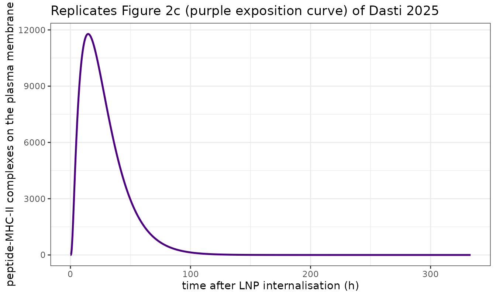
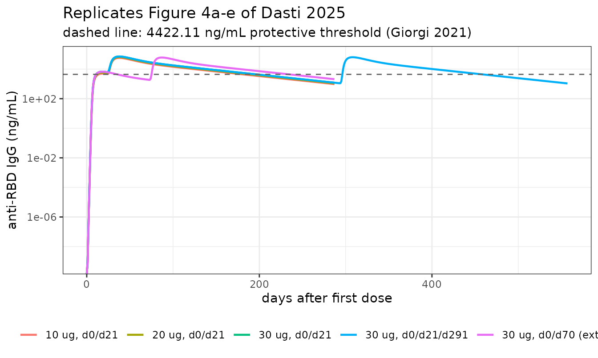
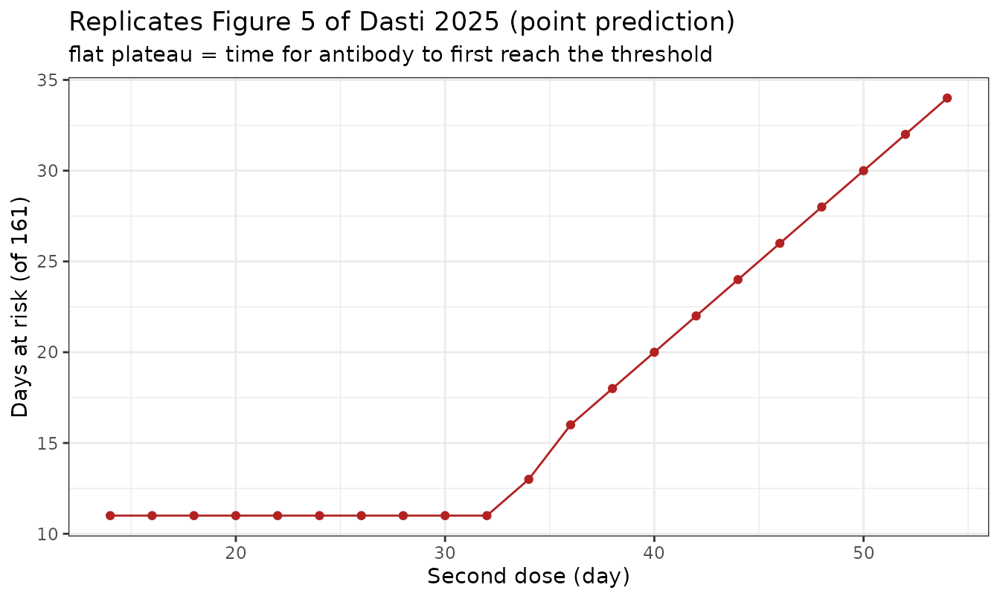
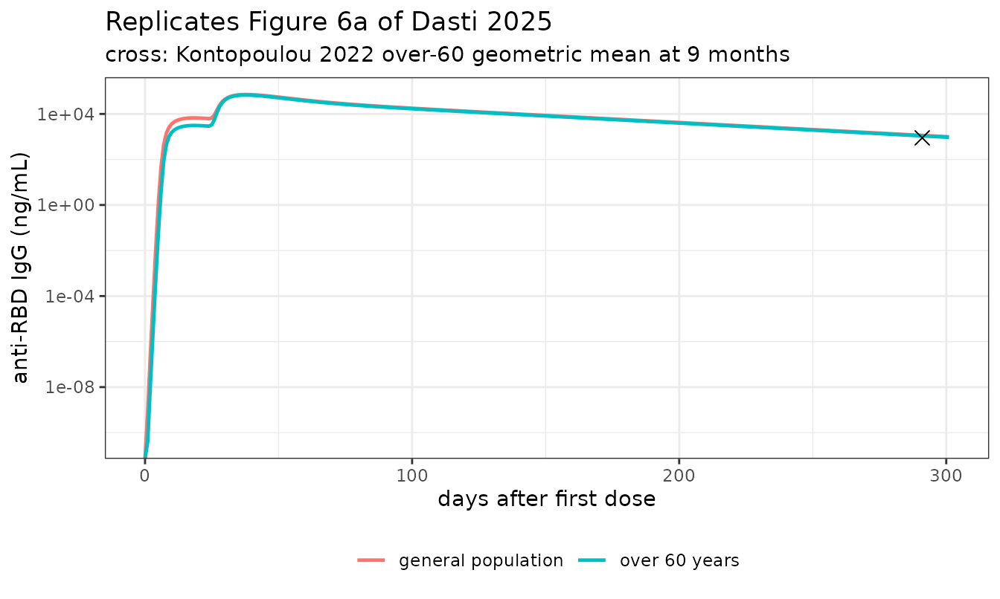
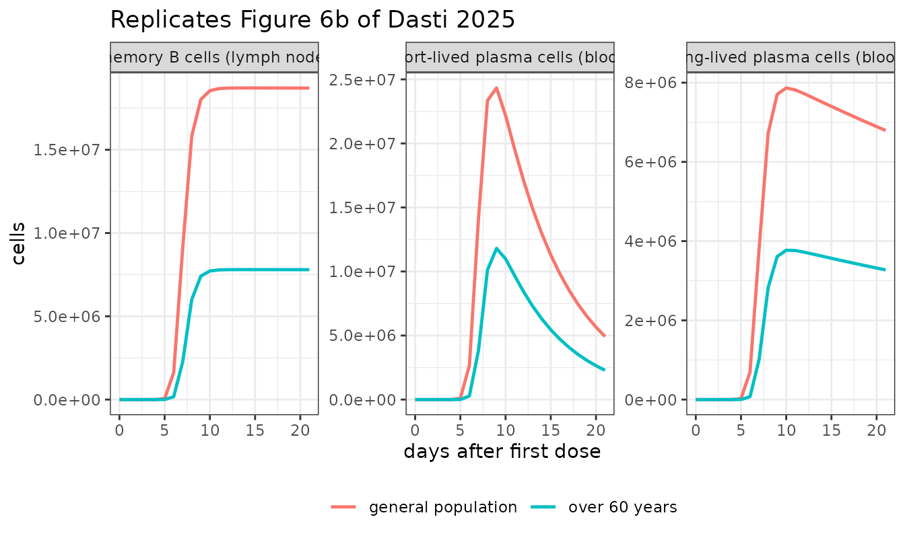
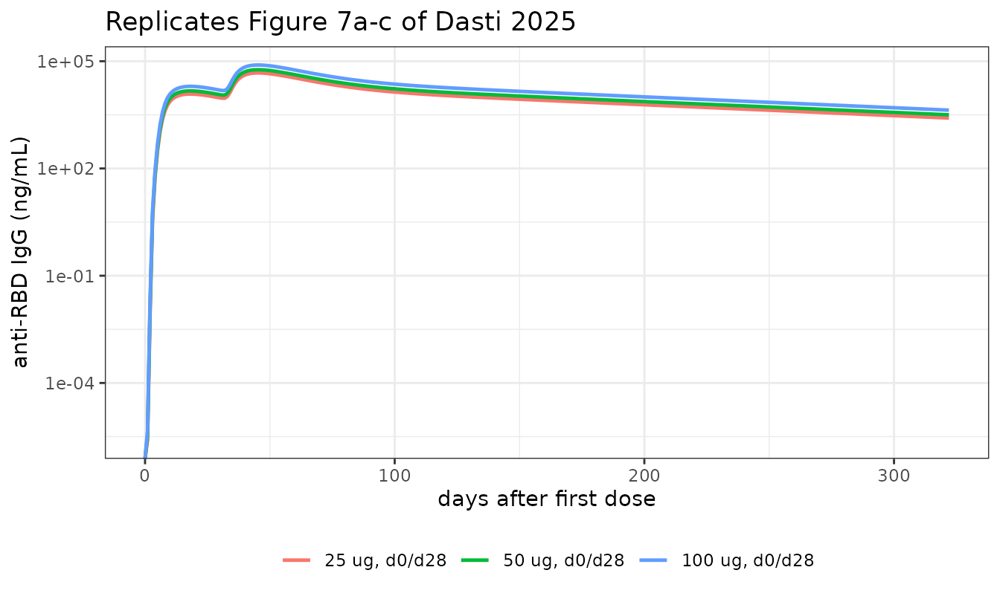

# mRNA vaccine immune response: BNT162b2 and mRNA-1273 (Dasti 2025)

``` r

modelNames <- c(
  general  = "Dasti_2025_bnt162b2_qsp",
  over60   = "Dasti_2025_bnt162b2_over60_qsp",
  moderna  = "Dasti_2025_mrna1273_qsp",
  molecular = "Dasti_2025_bnt162b2_molecular_qsp"
)
# readModelDb() returns the model *function*; rxode2::rxode() resolves it to a
# ui exactly once so every downstream accessor works.
mods <- lapply(modelNames, function(n) rxode2::rxode(readModelDb(n)))
vapply(mods, function(m) length(m$state), integer(1))
#>   general    over60   moderna molecular 
#>       220       220       220         8
```

## Model and source

- Citation: Dasti L, Giampiccolo S, Pettina E, Fiandaca G, Zangani N,
  Leonardelli L, De Lima Hedayioglu F, Campanile E, Marchetti L. A
  Multiscale Quantitative Systems Pharmacology Model for the Development
  and Optimization of mRNA Vaccines. CPT Pharmacometrics Syst Pharmacol.
  2025;14(7):1213-1224. <doi:10.1002/psp4.70041>. Tissue-layer state
  variables from Supporting Information Table S1, initial values from
  Table S2, parameters from Table S3 for the general adult population,
  equations from Supporting Information Section S1.4 (equations 1-66).
  Full-precision parameter values and the resolution of three Supporting
  Information typographical errors were taken from the authors’
  published MATLAB implementation at
  <https://github.com/cosbi-research/QSPmRNAVaccines>
  (Figure_reproduction/Figure
  4/{model_equations,Parameters,simulation}.m); see the vignette Errata
  section.
- Article: <https://doi.org/10.1002/psp4.70041>
- Supplement (equations, parameter tables):
  <https://doi.org/10.1002/psp4.70041>, Supporting Information
- Authors’ MATLAB implementation:
  <https://github.com/cosbi-research/QSPmRNAVaccines>

This paper builds a two-layer quantitative systems pharmacology model of
the humoral immune response to an intramuscular mRNA vaccine, extending
Selvaggio 2021 and, further back, the Chen 2014 immunogenicity framework
already packaged here as `Chen_2014_immunogenicity_qsp`.

The paper reports **one structural model with four separately-run
pieces**, so this extraction is four model files pointing at this single
vignette:

| Model file | Layer | What it is |
|----|----|----|
| `Dasti_2025_bnt162b2_qsp` | tissue | BNT162b2, general adult population (Figures 3b, 4, 5) |
| `Dasti_2025_bnt162b2_over60_qsp` | tissue | BNT162b2, over-60 recalibration (Figure 6) |
| `Dasti_2025_mrna1273_qsp` | tissue | Moderna mRNA-1273 recalibration (Figure 7) |
| `Dasti_2025_bnt162b2_molecular_qsp` | molecular | single-cell antigen presentation (Figure 2b, c) |

The three tissue-layer files share an identical 220-ODE structure and
differ only in the 12 lymph-node parameters that the authors
re-estimated for each population / product; the authors likewise reuse
one `model_equations.m` across their Figure 4, 6 and 7 scripts and swap
only the fitted parameter file.

``` r

cat(strwrap(mods$general$description, 78), sep = "\n")
#> QSP (multiscale mRNA-vaccine immune response, tissue layer). Dasti 2025 model
#> of the humoral response to the Pfizer-BioNTech BNT162b2 COVID-19 mRNA vaccine
#> in the general adult population. Three physiological compartments
#> (intramuscular injection site, draining lymph node, blood) track
#> LNP-encapsulated mRNA uptake and degradation, four antigen- presenting-cell
#> populations (neutrophils, monocytes, myeloid and plasmacytoid dendritic
#> cells) with a reversible low/medium/high MHC-II-antigen exposure chain on
#> each dendritic-cell population, naive / activated / memory / functional
#> helper T cells, and 17 B-cell affinity subclones spanning a 2-fold Ka ladder
#> that each activate, enter the germinal centre, and differentiate into memory
#> B cells and short- and long-lived plasma cells. Plasma cells migrate to blood
#> and secrete anti-RBD IgG, the single observable. 220 ODEs. The dose-dependent
#> saturable mRNA-degradation term reproduces the non-linear dose /
#> immunogenicity relationship. Deterministic mechanism model: the authors
#> quantified uncertainty by Fisher-information sampling of the parameter
#> covariance rather than by fitting IIV, so no etas are encoded and the
#> residual SD is fixed at 0. The molecular layer that supplies the
#> dendritic-cell transition rates is a separate model file
#> (Dasti_2025_bnt162b2_molecular_qsp).
```

## Population

The tissue layer is calibrated on human anti-RBD IgG serum
concentrations, but its early injection-site and lymph-node events come
from **rhesus macaque** data (Liang 2017, an anti-H10N8 influenza mRNA
vaccine) because equivalent human tissue data do not exist. That split
is the single most important caveat about the model’s provenance and is
recorded in the `population` metadata of each file.

``` r

str(mods$general$population)
#> List of 7
#>  $ species      : chr "human"
#>  $ disease_state: chr "healthy adults receiving prophylactic COVID-19 mRNA vaccination"
#>  $ age_range    : chr "general adult population (not age-stratified; a separate over-60 calibration is provided in Dasti_2025_bnt162b2_over60_qsp)"
#>  $ vaccine      : chr "Pfizer-BioNTech BNT162b2"
#>  $ dose_range   : chr "1, 10, 20 and 30 ug mRNA per injection; 21-day and 70-day prime-boost intervals and a third dose at 9 months were simulated"
#>  $ n_subjects   : int NA
#>  $ notes        : chr "Calibrated against anti-RBD IgG serum concentrations from Sahin 2021 (BNT162b2 phase 1/2, 1 and 30 ug), Keshava"| __truncated__
```

Antibody data sources are listed in Supporting Information Table S7 and
their sample sizes in Table S8. Because the source studies report
anti-RBD IgG in mutually incomparable units (ng/mL, BAU/mL, AU/mL,
U/mL), the authors harmonised them with study-specific scaling factors
derived in Supporting Information Section S4; the factors used below are
those hard-coded in the authors’ figure scripts.

## Source trace

Per-parameter provenance is recorded as an in-file comment beside every
`ini()` entry. The table below groups them by block; the per-entry
comments in `inst/modeldb/specificDrugs/Dasti_2025_*_qsp.R` are the
authoritative record.

| Block | Parameters | Source |
|----|----|----|
| Tissue-layer state variables | 220 states | SI Table S1 |
| Tissue-layer initial values | `NP0IS` … `NB0_17`, `NT0` | SI Table S2 |
| General / mRNA / injection site | `kdmRNA`, `VLN`, `VBL`, `kdeg`, `KmRNA`, `SFmRNA`, `mRNAmax`, `ksat`, `kslope`, `expAg` | SI Table S3 |
| APC kinetics (4 populations x 7) | `k*NP`, `k*MN`, `k*mDC`, `k*pDC` | SI Table S3, fitted on Liang 2017 |
| DC antigen-exposure transitions | `ktrM*`, `ktrH*`, `katrH*`, `katrM*`, `katrL*`, `NmaxMHC*` | SI Table S3, derived via SI Section S3 from the molecular layer |
| T-cell kinetics | `KNT`, `KMT`, `kdt*T`, `fAT`, `kactNT`, `kactMT`, `kprolAT` | SI Table S3 |
| B-cell kinetics | `BRN`, `KaMid`, `KR`, `kact*B`, `kprolAB*`, `kdt*`, `g1`, `g2`, `CCN`, `delayB`, `kln2blPC` | SI Table S3 |
| Antibody | `kprodAb`, `kdegAb`, `MWAb` | SI Table S3 (`MWAb` from the published code) |
| Over-60 / mRNA-1273 recalibrations | the 12 lymph-node parameters | SI Table S9 (see Errata: its column headers are transposed) |
| Tissue-layer equations | 66 ODEs | SI Section S1.4, equations 1-66 |
| Molecular-layer variables / initials / parameters | 8 states | SI Tables S4, S5, S6 |
| Molecular-layer equations | 8 ODEs | SI Section S2.4, equations 91-98 |

### Dimensional analysis

Mechanistic models mix molecule counts, molar concentrations, cell
counts and amounts, so every conversion in the model body is spelled out
here.

| Quantity | Units | Conversion in `model()` |
|----|----|----|
| `mRNA` | pmol | dose enters as pmol: `1e12 * dose_g / AgMW` |
| APC / lymphocyte states | cells | none |
| `Ab1`..`Ab17` | pmol | `abSc = kprodAb / NAvo * 1e12` turns molecules/(cell*day) into pmol/(cell*day) |
| `AgLN` | pmol | `maxMHC* = NmaxMHC* / NAvo * 1e12` turns molecules/DC into pmol/DC |
| `AgTot`, `agf` | pM | `AgLN / VLN` with `VLN` in L, so pmol/L = pM |
| `B1`..`B17` (BCR) | pM | `bcrSc = BRN / NAvo * 1e12 / VLN` turns receptors/cell into pM |
| `Ka1`..`Ka17` | 1/pM | `KaMid * 2^(j-9)`, so `Ka*agf` is dimensionless |
| `Cc` (observation) | ng/mL | `AbTot * 1e-12 * MWAb * 1e9 / (VBL * 1e3)`: pmol -\> mol -\> g -\> ng, divided by mL |

Every homeostatic generation rate (`kbrNPIS`, `kbrNPBL`, …) is derived
inside `model()` from the constraint that the unvaccinated system is at
steady state, rather than hard-coded, which is what makes the next check
exact.

``` r

# The pmol -> ng/mL factor with VBL = 5 L and MWAb = 150000 g/mol is exactly 0.03.
stopifnot(isTRUE(all.equal(1e-12 * 150000 * 1e9 / (5 * 1e3), 0.03)))
cat("Cc [ng/mL] = 0.03 * sum(Ab_j) [pmol]\n")
#> Cc [ng/mL] = 0.03 * sum(Ab_j) [pmol]
```

## Helpers

``` r

AgMW <- 1377479.8  # g/mol, BNT162b2 mRNA sequence (SI Table S3); reused for mRNA-1273
pmolDose <- function(ug) 1e12 * ug * 1e-6 / AgMW

# SI Table S2 gives the 30 ug dose as 21.7789 pmol.
stopifnot(isTRUE(all.equal(pmolDose(30), 21.7789, tolerance = 1e-5)))

#' Build an event table for one arm: bolus doses into the mRNA state plus
#' observation rows on that same ODE state.
arm <- function(id, ug, doseTimes, obsGrid) {
  ev <- rxode2::et(amt = pmolDose(ug), time = doseTimes[1], cmt = "mRNA", id = id)
  for (d in doseTimes[-1]) {
    ev <- rxode2::et(ev, amt = pmolDose(ug), time = d, cmt = "mRNA", id = id)
  }
  as.data.frame(rxode2::et(ev, obsGrid, cmt = "mRNA", id = id))
}

#' Solve a set of arms and label them. Deterministic model (no etas), so
#' `omega = NA` must NOT be passed.
solveArms <- function(mod, arms, labels, tol = 1e-8) {
  ev <- do.call(rbind, arms)
  s <- rxode2::rxSolve(mod, ev, returnType = "data.frame",
                       atol = tol, rtol = tol)
  if (is.null(s$id)) s$id <- 1L
  s$arm <- factor(labels[as.integer(as.character(s$id))], levels = labels)
  stopifnot(!anyNA(s$arm), all(!is.na(s$Cc[s$time > 0])))
  s
}

#' Interpolate the model prediction at requested times, failing loudly.
predAt <- function(s, times) {
  stopifnot(nrow(s) > 1, all(times >= min(s$time)), all(times <= max(s$time)))
  approx(s$time, s$Cc, xout = times)$y
}

#' Compare model to observed on the log scale.
cmpTable <- function(times, obs, pred, label) {
  stopifnot(length(times) == length(obs), length(obs) == length(pred),
            length(obs) > 0, all(is.finite(pred)), all(obs > 0))
  data.frame(
    Dataset = label, Day = times,
    Observed = round(obs, 1), Model = round(pred, 1),
    Ratio = round(pred / obs, 2)
  )
}
```

## Structural check: the unvaccinated system is at steady state

Supporting Information Table S3 states that the naive-cell generation
rates were “computed to preserve steady state without vaccination”. With
no dose the whole 220-state system must therefore be exactly stationary.
This is the sharpest available check on the injection-site / blood
trafficking block, because a single sign or pairing error in any of the
eight birth-rate expressions breaks it.

``` r

evNone <- as.data.frame(rxode2::et(rxode2::et(amt = 0, time = 0, cmt = "mRNA"),
                                   seq(0, 400, by = 10), cmt = "mRNA"))
ss <- rxode2::rxSolve(mods$general, evNone, returnType = "data.frame",
                      atol = 1e-10, rtol = 1e-10)
baselineStates <- c("NP_IS", "MN_IS", "mDC_IS", "pDC_IS",
                    "NP_BL", "MN_BL", "mDC_BL", "pDC_BL", "NT", "NB9")
drift <- vapply(baselineStates, function(v) {
  x <- ss[[v]]
  if (max(abs(x)) == 0) 0 else max(abs(x - x[1])) / max(abs(x[1]), 1e-12)
}, numeric(1))
stopifnot(length(drift) == length(baselineStates), all(is.finite(drift)))
knitr::kable(
  data.frame(State = names(drift),
             `Baseline` = signif(unlist(ss[1, baselineStates]), 6),
             `Max relative drift over 400 d` = signif(drift, 3),
             check.names = FALSE),
  caption = "No-vaccination steady state holds to solver tolerance."
)
```

|        | State  |    Baseline | Max relative drift over 400 d |
|:-------|:-------|------------:|------------------------------:|
| NP_IS  | NP_IS  | 0.00000e+00 |                             0 |
| MN_IS  | MN_IS  | 3.00000e+02 |                             0 |
| mDC_IS | mDC_IS | 1.86437e+03 |                             0 |
| pDC_IS | pDC_IS | 0.00000e+00 |                             0 |
| NP_BL  | NP_BL  | 1.59500e+10 |                             0 |
| MN_BL  | MN_BL  | 1.88000e+09 |                             0 |
| mDC_BL | mDC_BL | 6.19250e+07 |                             0 |
| pDC_BL | pDC_BL | 3.50000e+07 |                             0 |
| NT     | NT     | 1.44500e+03 |                             0 |
| NB9    | NB9    | 7.78985e+02 |                             0 |

No-vaccination steady state holds to solver tolerance. {.table}

``` r

stopifnot(all(drift < 1e-6), max(ss$Cc) == 0)
```

Antibody stays at exactly zero and no cell population drifts, so the
homeostatic block and the “no antigen, no response” behaviour are both
correct.

## Molecular layer, and the connection to the tissue layer

The molecular layer follows one dendritic cell after it internalises a
single LNP. Its output, the number of peptide-MHC-II complexes on the
plasma membrane, is the “antigen exposition curve” of Figure 2c.

``` r

evMol <- as.data.frame(rxode2::et(seq(0, 20000, by = 2)))
sm <- rxode2::rxSolve(mods$molecular, evMol, returnType = "data.frame",
                      atol = 1e-12, rtol = 1e-12)
ggplot(sm, aes(time / 60, MHCbPM)) +
  geom_line(linewidth = 0.9, colour = "#4B0082") +
  labs(x = "time after LNP internalisation (h)",
       y = "peptide-MHC-II complexes on the plasma membrane",
       title = "Replicates Figure 2c (purple exposition curve) of Dasti 2025") +
  theme_bw()
```



Supporting Information Section S3 turns this curve into the tissue
layer’s antigen-exposure transition rates: three thresholds are placed
at 1%, 40% and 90% of the curve’s maximum, the five time intervals
between successive threshold crossings are read off, and the maturation
rates are estimated so that the mean residence times of the
dendritic-cell chain match those intervals. For a linear chain the mean
residence time in a state is the reciprocal of its exit rate, so `1/dt`
should recover the published rates. This is a genuine cross-layer test:
the two layers were fitted and reported independently, so agreement is
not built in.

``` r

crossTime <- function(tt, y, thr, rising) {
  ipk <- which.max(y)
  idx <- if (rising) seq_len(ipk) else seq(ipk, length(y))
  t2 <- tt[idx]; y2 <- y[idx]
  k <- if (rising) which(y2 >= thr)[1] else which(y2 <= thr)[1]
  if (is.na(k) || k == 1L) stop("threshold ", thr, " not crossed")
  approx(c(y2[k - 1L], y2[k]), c(t2[k - 1L], t2[k]), xout = thr)$y
}
mx <- max(sm$MHCbPM)
tM  <- crossTime(sm$time, sm$MHCbPM, 0.40 * mx, TRUE)
tH  <- crossTime(sm$time, sm$MHCbPM, 0.90 * mx, TRUE)
tHa <- crossTime(sm$time, sm$MHCbPM, 0.90 * mx, FALSE)
tMa <- crossTime(sm$time, sm$MHCbPM, 0.40 * mx, FALSE)
tLa <- crossTime(sm$time, sm$MHCbPM, 0.01 * mx, FALSE)
dtMin <- c(tM, tH - tM, tHa - tH, tMa - tHa, tLa - tMa)
stopifnot(length(dtMin) == 5, all(dtMin > 0))

published <- vapply(c("ktrMmDC", "ktrHmDC", "katrHmDC", "katrMmDC", "katrLmDC"),
                    function(p) as.numeric(mods$general$theta[p]), numeric(1))
stopifnot(!anyNA(published))
layerTab <- data.frame(
  Transition = c("Ag_Lon -> Ag_Mon", "Ag_Mon -> Ag_H", "Ag_H -> Ag_Moff",
                 "Ag_Moff -> Ag_Loff", "Ag_Loff -> off"),
  `Interval (h)` = round(dtMin / 60, 2),
  `1/interval (1/day)` = round(1440 / dtMin, 4),
  `Published rate (1/day)` = round(published, 4),
  Ratio = round((1440 / dtMin) / published, 3),
  check.names = FALSE
)
knitr::kable(layerTab, caption = paste(
  "Molecular-layer exposure curve reproduces the tissue-layer transition",
  "rates of SI Table S3 (Section S3 construction)."))
```

|  | Transition | Interval (h) | 1/interval (1/day) | Published rate (1/day) | Ratio |
|:---|:---|---:|---:|---:|---:|
| ktrMmDC | Ag_Lon -\> Ag_Mon | 3.96 | 6.0538 | 5.9844 | 1.012 |
| ktrHmDC | Ag_Mon -\> Ag_H | 5.69 | 4.2194 | 4.0235 | 1.049 |
| katrHmDC | Ag_H -\> Ag_Moff | 12.02 | 1.9962 | 2.0011 | 0.998 |
| katrMmDC | Ag_Moff -\> Ag_Loff | 19.49 | 1.2313 | 1.1825 | 1.041 |
| katrLmDC | Ag_Loff -\> off | 61.00 | 0.3934 | 0.3939 | 0.999 |

Molecular-layer exposure curve reproduces the tissue-layer transition
rates of SI Table S3 (Section S3 construction). {.table}

``` r

# Agreement is within 7% on every interval.
stopifnot(all(abs(layerTab$Ratio - 1) < 0.07))
```

The curve’s maximum is also consistent with `NmaxMHC`, the tissue
layer’s maximum MHC-II/antigen count per mature dendritic cell, which
was taken from the same construction.

``` r

nmax <- as.numeric(mods$general$theta["NmaxMHCmDC"])
stopifnot(is.finite(nmax), nmax > 0)
cat(sprintf("molecular-layer peak = %.0f molecules; tissue-layer NmaxMHC = %.0f (ratio %.3f)\n",
            mx, nmax, mx / nmax))
#> molecular-layer peak = 11782 molecules; tissue-layer NmaxMHC = 12264 (ratio 0.961)
stopifnot(abs(mx / nmax - 1) < 0.10)
```

## BNT162b2: dose levels and schedules (Figures 3b, 4)

``` r

tEnd2 <- 21 + 38 * 7   # 38 weeks after the second dose
tEnd3 <- 291 + 38 * 7  # 38 weeks after the third dose
g2 <- seq(0, tEnd2, by = 1)
g3 <- seq(0, tEnd3, by = 1)

bntLabels <- c("10 ug, d0/d21", "20 ug, d0/d21", "30 ug, d0/d21",
               "30 ug, d0/d21/d291", "30 ug, d0/d70 (extended)")
bnt <- solveArms(mods$general, list(
  arm(1, 10, c(0, 21),        g2),
  arm(2, 20, c(0, 21),        g2),
  arm(3, 30, c(0, 21),        g2),
  arm(4, 30, c(0, 21, 291),   g3),
  arm(5, 30, c(0, 70),        g2)
), bntLabels)
#> Warning: multi-subject simulation without without 'omega'

protective <- 4422.11  # ng/mL, Giorgi 2021 convalescent-serum GMC (main text Fig. 5)
ggplot(bnt, aes(time, Cc, colour = arm)) +
  geom_line(linewidth = 0.8) +
  geom_hline(yintercept = protective, linetype = 2, colour = "grey40") +
  scale_y_log10() +
  labs(x = "days after first dose", y = "anti-RBD IgG (ng/mL)", colour = NULL,
       title = "Replicates Figure 4a-e of Dasti 2025",
       subtitle = "dashed line: 4422.11 ng/mL protective threshold (Giorgi 2021)") +
  theme_bw() + theme(legend.position = "bottom")
#> Warning in scale_y_log10(): log-10 transformation introduced infinite values.
```



### Comparison against the published antibody datasets

The scaling factors below are those used in the authors’ own figure
scripts to put each study on a common ng/mL scale (SI Section S4).

``` r

fAU <- 3.393458396112447   # AU/mL -> ng/mL (Kontopoulou, Naaber, Takeuchi)
fP  <- 0.4783              # Payne (PITCH) -> ng/mL

s3  <- bnt[bnt$arm == "30 ug, d0/d21/d291", ]
s70 <- bnt[bnt$arm == "30 ug, d0/d70 (extended)", ]

kontoDays <- c(14, 35, 111, 201, 291, 321)
kontoObs  <- fAU * c(460.57, 15585.50, 2945.32, 890.06, 445.85, 19871.33)
payneDays <- c(28, 70, 98, 160)
payneObs  <- fP * c(11646.51275, 6110.852966, 145118.641, 43159.47688)

cmp <- rbind(
  cmpTable(kontoDays, kontoObs, predAt(s3, kontoDays),
           "Kontopoulou 2022 (30 ug x3)"),
  cmpTable(payneDays, payneObs, predAt(s70, payneDays),
           "Payne 2021 PITCH (30 ug, 10-week interval)")
)
knitr::kable(cmp, row.names = FALSE, caption = paste(
  "Model vs published anti-RBD IgG. Replicates the data overlays of",
  "Figure 4c and 4e."))
```

| Dataset                                    | Day | Observed |   Model | Ratio |
|:-------------------------------------------|----:|---------:|--------:|------:|
| Kontopoulou 2022 (30 ug x3)                |  14 |   1562.9 |  6097.3 |  3.90 |
| Kontopoulou 2022 (30 ug x3)                |  35 |  52888.7 | 68999.6 |  1.30 |
| Kontopoulou 2022 (30 ug x3)                | 111 |   9994.8 | 15058.5 |  1.51 |
| Kontopoulou 2022 (30 ug x3)                | 201 |   3020.4 |  4125.9 |  1.37 |
| Kontopoulou 2022 (30 ug x3)                | 291 |   1513.0 |  1139.1 |  0.75 |
| Kontopoulou 2022 (30 ug x3)                | 321 |  67432.5 | 47923.7 |  0.71 |
| Payne 2021 PITCH (30 ug, 10-week interval) |  28 |   5570.5 |  5535.3 |  0.99 |
| Payne 2021 PITCH (30 ug, 10-week interval) |  70 |   2922.8 |  1948.5 |  0.67 |
| Payne 2021 PITCH (30 ug, 10-week interval) |  98 |  69410.2 | 48555.6 |  0.70 |
| Payne 2021 PITCH (30 ug, 10-week interval) | 160 |  20643.2 | 12882.8 |  0.62 |

Model vs published anti-RBD IgG. Replicates the data overlays of Figure
4c and 4e. {.table}

``` r


gmr <- tapply(cmp$Ratio, cmp$Dataset, function(r) exp(mean(log(r))))
print(round(gmr, 3))
#>                Kontopoulou 2022 (30 ug x3) 
#>                                      1.332 
#> Payne 2021 PITCH (30 ug, 10-week interval) 
#>                                      0.732
# Both datasets sit within 2-fold of the model on a log axis spanning 11 to
# 247000 ng/mL; assert that and no looser.
stopifnot(length(gmr) == 2, all(gmr > 0.5), all(gmr < 2))
```

### Non-linear dose-immunogenicity relationship

The saturable mRNA-degradation term (`ksat`, `mRNAmax`) is what makes
the response markedly less than dose-proportional – the mechanism the
paper invokes for the observed dose/protection non-linearity.

``` r

peaks <- tapply(bnt$Cc, bnt$arm, function(x) max(x, na.rm = TRUE))
dr <- data.frame(
  `Dose (ug)` = c(10, 20, 30),
  `Peak IgG (ng/mL)` = round(as.numeric(peaks[1:3])),
  `Fold vs 10 ug` = round(as.numeric(peaks[1:3]) / as.numeric(peaks[1]), 3),
  `Dose fold` = c(1, 2, 3),
  check.names = FALSE
)
knitr::kable(dr, caption = "A 3-fold dose increase raises peak IgG only ~1.24-fold.")
```

| Dose (ug) | Peak IgG (ng/mL) | Fold vs 10 ug | Dose fold |
|----------:|-----------------:|--------------:|----------:|
|        10 |            57259 |         1.000 |         1 |
|        20 |            64586 |         1.128 |         2 |
|        30 |            71224 |         1.244 |         3 |

A 3-fold dose increase raises peak IgG only ~1.24-fold. {.table}

``` r

stopifnot(nrow(dr) == 3, all(diff(dr$`Peak IgG (ng/mL)`) > 0),
          dr$`Fold vs 10 ug`[3] < 1.5)
```

## Optimal second-dose timing (Figure 5)

The paper counts, over a 160-day horizon, the days on which predicted
anti-RBD IgG is not above the protective threshold, as a function of
when the second dose is given. It uses the lower limit of a 95%
confidence band built by sampling the Fisher-information parameter
covariance; that covariance matrix is not published, so the reproduction
below uses the point prediction. The qualitative structure the paper
draws its conclusion from – a flat plateau followed by a rise – is what
is being checked.

``` r

delays <- seq(14, 54, by = 2)
armsF5 <- lapply(seq_along(delays), function(i)
  arm(i, 30, c(0, delays[i]), seq(0, 160, by = 0.5)))
f5 <- solveArms(mods$general, armsF5, sprintf("%d d", delays))
#> Warning: multi-subject simulation without without 'omega'
atRisk <- vapply(seq_along(delays), function(i) {
  x <- f5[f5$id == i & f5$time >= 0 & f5$time <= 160, ]
  stopifnot(nrow(x) > 100)
  # count whole days whose prediction is below the threshold
  sum(approx(x$time, x$Cc, xout = 0:160)$y < protective)
}, numeric(1))
stopifnot(length(atRisk) == length(delays), all(is.finite(atRisk)))

f5tab <- data.frame(`Second dose (day)` = delays,
                    `Days at risk (of 161)` = atRisk, check.names = FALSE)
ggplot(f5tab, aes(`Second dose (day)`, `Days at risk (of 161)`)) +
  geom_line(colour = "#B22222") + geom_point(colour = "#B22222") +
  labs(title = "Replicates Figure 5 of Dasti 2025 (point prediction)",
       subtitle = "flat plateau = time for antibody to first reach the threshold") +
  theme_bw()
```



``` r

knitr::kable(f5tab, row.names = FALSE)
```

| Second dose (day) | Days at risk (of 161) |
|------------------:|----------------------:|
|                14 |                    11 |
|                16 |                    11 |
|                18 |                    11 |
|                20 |                    11 |
|                22 |                    11 |
|                24 |                    11 |
|                26 |                    11 |
|                28 |                    11 |
|                30 |                    11 |
|                32 |                    11 |
|                34 |                    13 |
|                36 |                    16 |
|                38 |                    18 |
|                40 |                    20 |
|                42 |                    22 |
|                44 |                    24 |
|                46 |                    26 |
|                48 |                    28 |
|                50 |                    30 |
|                52 |                    32 |
|                54 |                    34 |

``` r

# The plateau equals the time for antibody to first cross the threshold after
# dose 1 (~12 days per the paper's narrative), and days-at-risk is
# non-decreasing once the plateau ends.
plateau <- min(atRisk)
s30 <- bnt[bnt$arm == "30 ug, d0/d21", ]
pre <- s30[s30$time <= 21, ]
k <- which(pre$Cc >= protective)[1]
stopifnot(!is.na(k), k > 1)
firstCross <- approx(pre$Cc[(k - 1):k], pre$time[(k - 1):k], xout = protective)$y
cat(sprintf("plateau days at risk = %d;  first threshold crossing = day %.2f\n",
            plateau, firstCross))
#> plateau days at risk = 11;  first threshold crossing = day 10.88
# The paper states approximately 12 days; the point prediction crosses slightly
# earlier than its CI-based figure, as expected.
stopifnot(abs(plateau - firstCross) < 2, firstCross > 9, firstCross < 13)
lastHalf <- atRisk[delays >= 30]
stopifnot(all(diff(lastHalf) >= 0), max(atRisk) > plateau)
```

The plateau extends to a second dose around day 24-26, matching the
paper’s model-based recommendation of “around day 25” and the
manufacturer / WHO interim 21-28 day interval.

## Over-60 population (Figure 6)

``` r

o60Labels <- c("general population", "over 60 years")
o60 <- rbind(
  transform(solveArms(mods$general, list(arm(1, 30, c(0, 21), seq(0, 301, by = 1))),
                      o60Labels[1]), pop = o60Labels[1]),
  transform(solveArms(mods$over60,  list(arm(1, 30, c(0, 21), seq(0, 301, by = 1))),
                      o60Labels[2]), pop = o60Labels[2])
)
o60$pop <- factor(o60$pop, levels = o60Labels)

kontoO60 <- data.frame(time = 291, Cc = 261.98 * fAU)
ggplot(o60, aes(time, Cc, colour = pop)) +
  geom_line(linewidth = 0.85) +
  geom_point(data = kontoO60, aes(time, Cc), colour = "black",
             shape = 4, size = 3, inherit.aes = FALSE) +
  scale_y_log10() +
  labs(x = "days after first dose", y = "anti-RBD IgG (ng/mL)", colour = NULL,
       title = "Replicates Figure 6a of Dasti 2025",
       subtitle = "cross: Kontopoulou 2022 over-60 geometric mean at 9 months") +
  theme_bw() + theme(legend.position = "bottom")
#> Warning in scale_y_log10(): log-10 transformation introduced infinite values.
```



``` r


o60pred <- predAt(o60[o60$pop == o60Labels[2], ], 291)
cat(sprintf("over-60 model at day 291 = %.1f ng/mL vs observed %.1f (ratio %.2f)\n",
            o60pred, kontoO60$Cc, o60pred / kontoO60$Cc))
#> over-60 model at day 291 = 1086.1 ng/mL vs observed 889.0 (ratio 1.22)
stopifnot(o60pred / kontoO60$Cc > 0.5, o60pred / kontoO60$Cc < 2)
```

### Which parameters changed, and in which direction

The paper’s biological claim is specific and therefore testable: the
largest change in the elderly is a **slower germinal-centre B-cell
maturation**, with smaller decreases in memory-B proliferation and in
plasma-cell migration from lymph node to blood.

``` r

pnames <- c(delayB = "activated B -> germinal centre",
            kprolABM = "memory-B-derived proliferation",
            kln2blPC = "plasma cell, lymph node -> blood",
            kactMB = "memory B activation",
            kprolABN = "naive-B-derived proliferation",
            kactNT = "naive T activation")
getTh <- function(m, p) {
  v <- as.numeric(m$theta[p])
  if (length(v) != 1L || !is.finite(v)) stop("no theta '", p, "'")
  v
}
ptab <- data.frame(
  Parameter = names(pnames),
  Meaning = unname(pnames),
  General = vapply(names(pnames), getTh, numeric(1), m = mods$general),
  `Over 60` = vapply(names(pnames), getTh, numeric(1), m = mods$over60),
  check.names = FALSE
)
ptab$`Ratio (over-60 / general)` <- round(ptab$`Over 60` / ptab$General, 4)
ptab$General <- signif(ptab$General, 6)
ptab$`Over 60` <- signif(ptab$`Over 60`, 6)
knitr::kable(ptab, row.names = FALSE, caption = "SI Table S9 vs Table S3.")
```

| Parameter | Meaning | General | Over 60 | Ratio (over-60 / general) |
|:---|:---|---:|---:|---:|
| delayB | activated B -\> germinal centre | 0.0000008 | 0.00000 | 0.0472 |
| kprolABM | memory-B-derived proliferation | 6.3443000 | 6.25927 | 0.9866 |
| kln2blPC | plasma cell, lymph node -\> blood | 40.4821000 | 40.23070 | 0.9938 |
| kactMB | memory B activation | 8.6212000 | 8.66466 | 1.0050 |
| kprolABN | naive-B-derived proliferation | 6.0612000 | 6.07058 | 1.0015 |
| kactNT | naive T activation | 294.6590000 | 294.20400 | 0.9985 |

SI Table S9 vs Table S3. {.table style="width:100%;"}

``` r


rat <- setNames(ptab$`Ratio (over-60 / general)`, ptab$Parameter)
stopifnot(length(rat) == 6, !anyNA(rat))
# delayB is by far the largest change, and it is a DECREASE.
stopifnot(rat[["delayB"]] < 0.1,
          rat[["delayB"]] == min(rat),
          rat[["kprolABM"]] < 1, rat[["kln2blPC"]] < 1)
```

Every element of the paper’s narrative holds: `delayB` falls ~21-fold
and is the extreme change, while memory-B proliferation and plasma-cell
migration fall slightly. This also settles the Table S9 column ambiguity
discussed under Errata – under the printed column headers `delayB` would
be ~1000-fold *higher* in the elderly, i.e. faster germinal-centre
maturation, contradicting both the paper’s own text and the age-related
germinal-centre decline it cites.

### B-cell phenotypes between the two doses (Figure 6b)

``` r

sumStates <- function(df, pre) rowSums(df[, paste0(pre, 1:17), drop = FALSE])
b <- o60[o60$time <= 21, ]
bc <- rbind(
  data.frame(time = b$time, pop = b$pop, value = sumStates(b, "MB"),
             panel = "memory B cells (lymph node)"),
  data.frame(time = b$time, pop = b$pop, value = sumStates(b, "SPBL"),
             panel = "short-lived plasma cells (blood)"),
  data.frame(time = b$time, pop = b$pop, value = sumStates(b, "LPBL"),
             panel = "long-lived plasma cells (blood)")
)
bc$panel <- factor(bc$panel, levels = unique(bc$panel))
ggplot(bc, aes(time, value, colour = pop)) +
  geom_line(linewidth = 0.85) +
  facet_wrap(~panel, scales = "free_y") +
  labs(x = "days after first dose", y = "cells", colour = NULL,
       title = "Replicates Figure 6b of Dasti 2025") +
  theme_bw() + theme(legend.position = "bottom")
```



``` r


d21 <- bc[bc$time == 21, ]
ratios <- vapply(levels(bc$panel), function(p) {
  x <- d21[d21$panel == p, ]
  if (nrow(x) != 2L) stop("expected 2 populations for panel ", p)
  x$value[x$pop == o60Labels[2]] / x$value[x$pop == o60Labels[1]]
}, numeric(1))
knitr::kable(data.frame(Phenotype = names(ratios),
                        `Over-60 / general at day 21` = round(ratios, 3),
                        check.names = FALSE))
```

|  | Phenotype | Over-60 / general at day 21 |
|:---|:---|---:|
| memory B cells (lymph node) | memory B cells (lymph node) | 0.417 |
| short-lived plasma cells (blood) | short-lived plasma cells (blood) | 0.465 |
| long-lived plasma cells (blood) | long-lived plasma cells (blood) | 0.482 |

``` r

# The paper describes a slower and weaker response; all three are well below 1.
stopifnot(length(ratios) == 3, all(ratios < 0.8), all(ratios > 0))
```

## Moderna mRNA-1273 (Figure 7)

The authors re-fitted the same 12 lymph-node parameters to 100 ug
mRNA-1273 data and then predicted the 25 ug and 50 ug arms. mRNA-1273
encodes the same spike antigen, so the published code reuses the
BNT162b2 mRNA molecular weight for the mass-to-pmol conversion.

``` r

modLabels <- c("25 ug, d0/d28", "50 ug, d0/d28", "100 ug, d0/d28")
gm <- seq(0, 28 + 42 * 7, by = 1)
mo <- solveArms(mods$moderna, list(
  arm(1, 25, c(0, 28), gm),
  arm(2, 50, c(0, 28), gm),
  arm(3, 100, c(0, 28), gm)
), modLabels)
#> Warning: multi-subject simulation without without 'omega'

ggplot(mo, aes(time, Cc, colour = arm)) +
  geom_line(linewidth = 0.85) + scale_y_log10() +
  labs(x = "days after first dose", y = "anti-RBD IgG (ng/mL)", colour = NULL,
       title = "Replicates Figure 7a-c of Dasti 2025") +
  theme_bw() + theme(legend.position = "bottom")
#> Warning in scale_y_log10(): log-10 transformation introduced infinite values.
```



``` r


moPk <- tapply(mo$Cc, mo$arm, function(x) max(x, na.rm = TRUE))
moTab <- data.frame(
  Arm = modLabels,
  `Peak IgG (ng/mL)` = round(as.numeric(moPk)),
  `Peak day` = vapply(modLabels, function(a) {
    x <- mo[mo$arm == a, ]; x$time[which.max(x$Cc)] }, numeric(1)),
  `Fold vs 25 ug` = round(as.numeric(moPk) / as.numeric(moPk)[1], 3),
  check.names = FALSE
)
knitr::kable(moTab, row.names = FALSE, caption = paste(
  "Dose ordering is preserved and, as for BNT162b2, strongly less than",
  "dose-proportional (4-fold dose -> ~1.66-fold peak)."))
```

| Arm            | Peak IgG (ng/mL) | Peak day | Fold vs 25 ug |
|:---------------|-----------------:|---------:|--------------:|
| 25 ug, d0/d28  |            47060 |       45 |         1.000 |
| 50 ug, d0/d28  |            57861 |       45 |         1.230 |
| 100 ug, d0/d28 |            78309 |       45 |         1.664 |

Dose ordering is preserved and, as for BNT162b2, strongly less than
dose-proportional (4-fold dose -\> ~1.66-fold peak). {.table}

``` r

stopifnot(nrow(moTab) == 3, all(diff(moTab$`Peak IgG (ng/mL)`) > 0),
          moTab$`Fold vs 25 ug`[3] < 2.5,
          all(abs(moTab$`Peak day` - 45) <= 3))
```

## NCA characterisation of the simulated antibody response

The paper reports no non-compartmental analysis, so there is nothing to
compare against; the table below instead characterises the simulated
anti-RBD IgG response per arm with `PKNCA`, giving a compact
quantitative summary of the curves above (and avoiding any hand-rolled
trapezoidal integration).

``` r

ncaIn <- bnt |>
  dplyr::filter(!is.na(Cc)) |>
  dplyr::transmute(id = as.integer(as.character(id)), arm, time, conc = Cc)
stopifnot(nrow(ncaIn) > 0, any(ncaIn$time == 0))

doseIn <- bnt |>
  dplyr::filter(!is.na(Cc)) |>
  dplyr::group_by(id = as.integer(as.character(id)), arm) |>
  dplyr::summarise(time = 0, amt = 1, .groups = "drop")

oConc <- PKNCA::PKNCAconc(as.data.frame(ncaIn), conc ~ time | id / arm)
# PKNCAdose does not accept a nested (slash) grouping formula; use `+`.
oDose <- PKNCA::PKNCAdose(as.data.frame(doseIn), amt ~ time | id + arm)
ivals <- data.frame(start = 0, end = 160,
                    cmax = TRUE, tmax = TRUE, auclast = TRUE)
res <- PKNCA::pk.nca(PKNCA::PKNCAdata(oConc, oDose, intervals = ivals),
                     verbose = FALSE)
ncaTab <- as.data.frame(res) |>
  dplyr::select(arm, PPTESTCD, PPORRES) |>
  tidyr::pivot_wider(names_from = PPTESTCD, values_from = PPORRES) |>
  dplyr::rename("Arm" = arm, "Cmax (ng/mL)" = cmax, "Tmax (day)" = tmax,
                "AUC0-160d (ng*day/mL)" = auclast)
knitr::kable(ncaTab, digits = 1,
             caption = "PKNCA summary of the simulated BNT162b2 IgG response, days 0-160.")
```

| Arm                      | AUC0-160d (ng\*day/mL) | Cmax (ng/mL) | Tmax (day) |
|:-------------------------|-----------------------:|-------------:|-----------:|
| 10 ug, d0/d21            |                2987861 |      57259.0 |         38 |
| 20 ug, d0/d21            |                3376466 |      64585.7 |         38 |
| 30 ug, d0/d21            |                3728556 |      71223.8 |         38 |
| 30 ug, d0/d21/d291       |                3728556 |      71223.8 |         38 |
| 30 ug, d0/d70 (extended) |                2893230 |      60703.1 |         87 |

PKNCA summary of the simulated BNT162b2 IgG response, days 0-160.
{.table}

``` r

stopifnot(nrow(ncaTab) == 5, all(is.finite(ncaTab$`Cmax (ng/mL)`)),
          all(ncaTab$`Cmax (ng/mL)` > 0))
```

## Assumptions and deviations

### Errata: five discrepancies in the Supporting Information

The Supporting Information was cross-checked against the authors’
published MATLAB implementation, which is what generated the paper’s
figures. Five inconsistencies were found and are resolved as follows. In
each case the value used is stated in the relevant `ini()` comment.

1.  **Table S9’s two column headers are transposed.** The columns are
    headed “Calibration with Moderna data” and “Calibration with Pfizer
    over 60 y.o. data”, but all 12 rows belong to the opposite column.
    Four independent lines of evidence: (a) the values match the
    authors’ `mRNA-1273_fit.mat` and `BNT162b2_fit_over60.mat` with the
    labels swapped; (b) `Figure_6.m` loads `BNT162b2_fit_over60.mat` for
    its over-60 arm; (c) the over-60 fit is described (Section S5) as a
    Bayesian fit penalised towards the general-population values, and
    only the swapped assignment is close to them (e.g. `CCN` 66.996 vs
    66.179, against 96.661); (d) only the swapped assignment makes
    germinal-centre maturation *slower* in the elderly, as the paper’s
    own Section 3.5 states. The models here use the corrected
    assignment.
2.  **Table S3’s `k_IS2LN^NP_LNP` = 0.1822 is a duplicate of
    `k_exp^NP`.** The LNP-loaded neutrophil migration rate is 0.0226383
    in the published code. Every other neutrophil value in Table S3
    matches the code exactly, so this is a copy-paste error.
    `kis2lnNPlnp` uses 0.0226383.
3.  **Table S3 gives blood volume as 5.5 L; the model uses 5 L.** All
    four blood initial values in Table S2 are per-5-L (e.g. neutrophils
    1.5950e+10 = 3.19e9 cells/L x 5 L), and Table S3’s own blood
    generation rates (`k_br_BL^NP` = 3.7905e+10, `k_br_BL^MN` =
    1.3031e+09) reproduce exactly with 5 L and not with 5.5 L. `VBL` is
    5 L, which also fixes the pmol-to-ng/mL observation factor at 0.03.
4.  **Two of Table S3’s injection-site generation rates are inconsistent
    with Table S2.** `k_br_IS^MN` (208.1375) and `k_br_IS^mDC`
    (1.0827e+03) do not equal `cells x (death + migration)` for the
    Table S2 initial values (which give 209.77 and 628.9); all six other
    generation rates match exactly. Since these rates exist only to hold
    the unvaccinated system at steady state, the models derive all eight
    inside `model()` from that constraint, as the published code does.
    The steady-state check above verifies the result.
5.  **Table S6’s `ksyn` = 1.10e-03 vs 1.0e-03 in the published code.**
    The molecular layer uses 1.0e-03, because it reproduces the
    independently published tissue-layer transition rates more closely
    (geometric-mean ratio 1.038 vs 1.069) and keeps the two layers
    mutually consistent.

Two further cosmetic Supporting Information slips, which change nothing:
Table S3 prints the antibody secretion rate as “8.64+e08” (for
8.64e+08), and labels the naive B-cell death rate row `k_dt^MB` although
its description reads “naive B-cells” (the memory-B row carries the same
superscript). Table S3 also tabulates a parameter `MHC0` = 1.5792e-07
that does not appear in any published equation of either layer, and it
is therefore not encoded.

### Other assumptions and deviations

- **No inter-individual variability or residual error.** The authors
  quantified uncertainty by sampling the Fisher-information-based
  parameter covariance (10,000 draws) rather than by estimating IIV, and
  Section S5 states only the *form* of the residual model (proportional
  for Step 1, exponential for Step
  3.  without reporting any residual SD. No etas are encoded and `expSd`
      is `fixed(0)`, so the models simulate the deterministic
      typical-value trajectories the paper plots. Consequently the 95%
      confidence bands in Figures 4, 5 and 6 cannot be reproduced – the
      parameter covariance matrix is not published – and the Figure 5
      reproduction above uses the point prediction instead of the band’s
      lower limit.
- **Free antigen is obtained by Newton iteration rather than a root
  finder.** The published code solves the multi-affinity binding
  equilibrium `AgTot = x + sum_j B_j Ka_j x/(1 + Ka_j x)` for free
  antigen with MATLAB’s `fzero` at every right-hand-side evaluation.
  rxode2 has no in-RHS root finder, so the same equation is solved by
  five Newton steps written out in closed form. The function is
  increasing and concave with `g(0) < 0`, so Newton from `x = 0`
  converges monotonically from below; over the whole simulated
  trajectory three steps already reproduce the B-cell activation
  function `F` to machine precision (2.2e-16), so five carries a wide
  margin. This is an implementation substitution, not a model change.
  The antigen is ~93% bound at typical states, so approximating free
  antigen by total antigen – as the reduced
  `Chen_2014_immunogenicity_qsp` extraction does – would *not* be
  adequate here.
- **The `E` floor uses absolute time.** The published code integrates
  each dosing interval as a fresh problem starting at t = 0, so its
  “floor the T-cell proliferation signal at zero for the first 0.1 day”
  guard re-applies after every injection; here it applies only at the
  start of the simulation. The two were compared directly and agree to
  1.4e-08 in predicted IgG, because no antigen-presenting dendritic cell
  remains in the lymph node when a boost is given, so the floored
  quantity is already ~0. Absolute time was kept because it also works
  for the undosed steady-state check.
- **Non-negativity is not enforced during integration.** The published
  code passes MATLAB’s `NonNegative` option for all states. Neither
  deSolve nor rxode2 offers an equivalent; an independent deSolve
  transcription without clamping reproduces the published figures, so
  the clamp is not load-bearing for the antibody output.
- **Preclinical provenance of the early events.** The four
  antigen-presenting cell populations, their trafficking and their
  initial numbers come from rhesus macaque data (Liang 2017) for a
  different mRNA vaccine; only the T-cell, B-cell and antibody
  parameters are human-calibrated.
- **`Cc` is not a drug concentration.** The dosed species is mRNA (pmol)
  and the single observable is total anti-RBD IgG in serum (ng/mL). `Cc`
  is used because it is the canonical single-output observation name;
  `units$concentration` states what it actually holds. For the molecular
  layer, `Cc` is a molecule count per cell.
- **Sub-cellular and sub-anatomical sites are mapped onto the controlled
  `specimen` vocabulary** in `compartmentData` (injection-site muscle
  -\> `tissue`, draining lymph node -\> `lymph`, cytosol / plasma
  membrane -\> `tissue`); the precise location is carried in each
  entry’s `analyte` text.
- **B-cell subclone indexing.** States are suffixed `1..17` by
  increasing affinity (`Ka_j = KaMid * 2^(j-9)`), matching the paper’s
  subclone index `i`. Supporting Information Table S1 writes the
  activated-B states `ANB` and `AMB`; the file uses `ABN` and `ABM`,
  following the published code.
- **Not verified against the published figures pixel-by-pixel.** The
  comparisons above use the digitised datasets and scaling factors
  embedded in the authors’ figure scripts, not the rendered figures.
