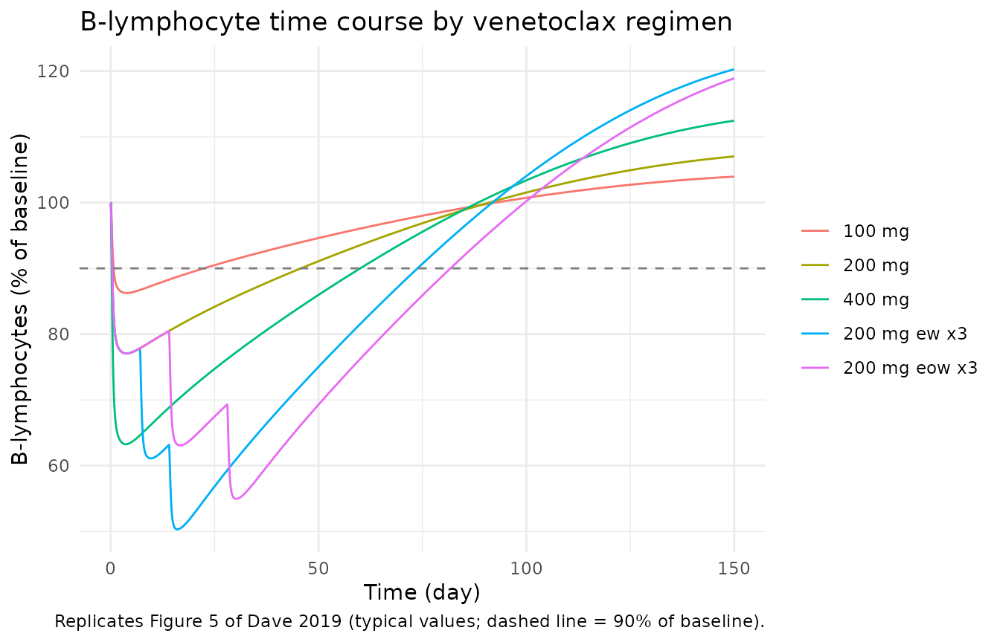

# Venetoclax and B-lymphocytes in healthy subjects (Dave 2019)

## Model and source

- Citation: Dave N, Gopalakrishnan S, Mensing S, Salem AH.
  Model-Informed Dosing of Venetoclax in Healthy Subjects: An
  Exposure-Response Analysis. Clin Transl Sci. 2019;12(6):625-632.
  <doi:10.1111/cts.12665>. Parameter estimates from Table 2; model code
  from the Supporting Information ‘PK Model code’ (CTS-12-625-s003.pdf)
  and ‘PD Model code’ (CTS-12-625-s002.pdf) NONMEM control streams.
  Lymphocyte model backbone: Friberg LE et al. J Clin Oncol
  2002;20(24):4713-4721, <doi:10.1200/JCO.2002.02.140>.
- Description: Integrated population PK / semimechanistic PD model for
  venetoclax and circulating B-lymphocytes in healthy female subjects.
  PK: two-compartment model with first-order absorption, an absorption
  lag time under fed conditions only, and first-order elimination;
  relative bioavailability depends on food (fasting / low-fat reference
  / moderate-or-high-fat), azithromycin coadministration, Chinese
  ethnicity, rifampin coadministration and a fixed power function of
  dose, and rifampin also raises apparent clearance. PD: Friberg-type
  lymphocyte model (proliferating pool, three transit compartments,
  circulating B-lymphocytes) with a (baseline / circulating)^gamma
  feedback on proliferation and a linear venetoclax effect increasing
  the first-order loss of circulating B-lymphocytes. The individual
  observed pre-dose B-lymphocyte count is the PD baseline. Final IIV and
  residual-error magnitudes are not reported by the source, so every
  random effect and residual SD is fixed(0): the model reproduces
  typical-value predictions only.
- Article: <https://doi.org/10.1111/cts.12665> (open access; PMC6853148)
- Supplement: NONMEM control streams “PK Model code” and “PD Model code”
  (Supporting Information, CTS-12-625-s003.pdf and CTS-12-625-s002.pdf)

Dave et al. pooled 10 healthy-volunteer clinical pharmacology studies to
relate venetoclax exposure to the on-target decrease in circulating
B-lymphocytes. A two-compartment population PK model was fit first. Its
individual post hoc parameters then drove a semimechanistic Friberg-type
lymphocyte model. In that model venetoclax concentration increases the
first-order loss of circulating B-lymphocytes linearly. The paper uses
the model to choose safe single and repeated doses for future studies in
healthy volunteers.

The packaged model joins the two stages into one ODE system. The PK
layer uses the population PK equations and Table 2 estimates, and the PD
layer uses the PD control stream and Table 2 estimates.

## Population

The analysis included 203 healthy **female** subjects (males were
excluded because of a testicular-toxicity finding in 4-week dog
studies), aged 21-65 years (median 40), with body mass index 18.6-30.1
kg/m^2. Twelve subjects were Chinese (Study I). Single oral venetoclax
doses of 10-400 mg were given 1-4 times per subject, separated by
washouts of at least 7 days. Doses were given either fasting or after a
low-, moderate- or high-fat breakfast. The pooled studies included
drug-drug interaction arms with ritonavir, digoxin, azithromycin,
rifampin and warfarin (Table 1). B-lymphocytes were measured in 7 of the
10 studies, and only those studies entered the PD fit.

The same information is available programmatically via
`readModelDb("Dave_2019_venetoclax")()$population`.

## Source trace

Every `ini()` value carries an in-file comment in
`inst/modeldb/specificDrugs/Dave_2019_venetoclax.R`. The table collects
them.

| Equation / parameter | Value | Source location |
|----|----|----|
| `lcl` (CL/F) | log(449) L/day | Table 2 ‘CL/F (L/day)’ |
| `lvc` (V2/F) | log(99) L | Table 2 ‘V2 (L)’ |
| `lq` (Q/F) | log(130) L/day | Table 2 ‘Q (L/day)’ |
| `lvp` (V3/F) | log(147) L | Table 2 ‘V3 (L)’ |
| `lka` (KA) | log(3.83) 1/day | Table 2 ‘KA (1/day)’ |
| `ltlag` (ALAG, fed only) | log(0.04) day | Table 2 ‘ALAG (day)’; PK code `IF(FOOD.GE.1) ALAG1 = THETA(8)` |
| `e_conmed_rifampicin_cl` | 2.67 | Table 2 ‘Rifampin on CL’; PK code `CL = THETA(1)*THETA(15)` |
| `lfdepot` | fixed(log(1)) | Table 2 ‘Low fat on F1’ = 1; PK code `TVF1=1`, `TVFA=1` |
| `e_fasted_fdepot` | 0.29 | Table 2 ‘Fasting on F1’ |
| `e_modhighfat_fdepot` | 1.47 | Table 2 ‘Moderate/high-fat on F1’ |
| `e_conmed_azithromycin_fdepot` | 0.65 | Table 2 ‘Azithromycin on F1’ |
| `e_race_chinese_fdepot` | 1.53 | Table 2 ‘Chinese on F1’ |
| `e_conmed_rifampicin_fdepot` | 4.91 | Table 2 ‘Rifampin on F1’ |
| `e_dose_fdepot` | fixed(-0.178) | Table 2 ‘Dose nonlinearity on F1’ (Fixed); PK code `(DOSE/400)**(THETA(14))` |
| `lthalf` | log(37.5) day | Table 2 ‘t 1/2 (days)’; PD code `DELTA = LOG(2)/THETA(1)` |
| `lktr` (kin = ktr) | log(0.1) 1/day | Table 2 ‘k in, proliferation (and transit maturation) rate’; PD code `KTR = KIN` |
| `lgamma` | log(0.1) | Table 2 ‘Feedback exponent’ |
| `lslope` | log(20.9) L/mg | Table 2 ‘Slope of drug effect’; PD code `EFFB = 1 + SLB*CP` |
| `etalcl`, `etalvc`, `etalfdepot`, `etalcirc0` | fixed(0) | Declared in the control streams; final omegas not reported |
| `propSd`, `addSd`, `expSd_circ` | fixed(0) | Declared in the control streams; final sigmas not reported |
| PK ODEs (2-cmt, first-order absorption, lag) | n/a | PK code `ADVAN4 TRANS4`, `ALAG1`; Results ‘PK model’ |
| Relative bioavailability F1 | n/a | PK code `F1=TVF1*TVFA*(DOSE/400)**(THETA(14))*EXP(ETA(4))` |
| Lymphocyte ODEs (prol, 3 transits, circ) | n/a | PD code `$DES` `DADT(4)`-`DADT(8)`; Figure 1b |
| Feedback `(circ0/circ + 1e-6)^gamma` | n/a | PD code `(BASEB/A(8) + 1E-6)**GAM` |
| Drug effect on circulating loss `kout*(1 + slope*Cc)` | n/a | PD code `DADT(8) = KTR*A(7) - DELTA*EFFB*A(8)` |
| Initial conditions | n/a | PD code `A_0(4..7) = DELTA*BASEB/KTR`, `A_0(8) = BASEB` |
| Baseline `circ0 = BLBCELL*exp(eta)` | n/a | PD code `BASEB = EXP(LOG(Lymbase) + ETA(1))`, `Lymbase = MIBTCD19`; Methods ‘PD model’ |

## Typical-value simulations

The paper does not report the final IIV or residual-error estimates (see
Assumptions and deviations), so every simulation here is typical-value.
The model has two declared endpoints (`Cc` and `circ`). Three rxode2
details follow from that. Observation rows use `cmt = "circ"`: `circ` is
both an ODE state and a declared endpoint, whereas `cmt = "central"` or
a missing `cmt` is rejected by the endpoint map. rxode2 still returns
`Cc` at every observation row. `useLinCmt = FALSE` is set. And typical
values come from `omega = NA, sigma = NA`, because `zeroRe()` segfaults
on a two-endpoint model. The state-order guard below checks that no ODE
state was renumbered.

``` r

mod <- readModelDb("Dave_2019_venetoclax")
ui <- rxode2::rxode2(mod)
#> ℹ parameter labels from comments will be replaced by 'label()'
stopifnot(identical(
  ui$state,
  c("depot", "central", "peripheral1", "prol", "transit1", "transit2", "transit3", "circ")
))
```

``` r

# One typical subject. `food` is "fasted", "low" (low-fat, the reference) or
# "modhigh" (moderate/high fat). Covariates are constant over the simulation;
# `rif` sets CONMED_RIFAMPICIN on every record (dose AND observation) so the
# clearance effect applies throughout.
make_events <- function(dose, dose_times = 0, food = "modhigh", azi = 0L,
                        chinese = 0L, rif = 0L, blbcell = 200,
                        obs_times = seq(0, 150, by = 0.05), id = 1L) {
  doses <- data.frame(
    id = id, time = dose_times, amt = dose, evid = 1L, cmt = "depot"
  )
  obs <- data.frame(
    id = id, time = obs_times, amt = NA_real_, evid = 0L, cmt = "circ"
  )
  ev <- rbind(doses, obs)
  ev <- ev[order(ev$time, -ev$evid), ]
  ev$FED <- as.integer(food != "fasted")
  ev$FED_LOWFAT <- as.integer(food == "low")
  ev$CONMED_AZITHROMYCIN <- azi
  ev$RACE_CHINESE <- chinese
  ev$CONMED_RIFAMPICIN <- rif
  ev$DOSE <- dose
  ev$BLBCELL <- blbcell
  ev
}

solve_typical <- function(ev) {
  as.data.frame(rxode2::rxSolve(
    mod, ev,
    omega = NA, sigma = NA, useLinCmt = FALSE, returnType = "data.frame"
  ))
}
```

### Figures 3-5: B-lymphocyte decrease and recovery by regimen

Dave 2019 simulated single 100, 200 and 400 mg doses and three 200 mg
doses given every week (ew) or every other week (eow). All regimens were
under moderate/high-fat meal conditions (Discussion: “under
moderate/high-fat meal conditions”). The percentage decrease is
scale-free in this model. The lymphocyte system is linear in `circ`
apart from the ratio-form feedback, so the baseline count
(`BLBCELL = 200` cells/uL here) does not change it.

``` r

regimens <- tibble::tibble(
  regimen = c("100 mg", "200 mg", "400 mg", "200 mg ew x3", "200 mg eow x3"),
  dose = c(100, 200, 400, 200, 200),
  dose_times = list(0, 0, 0, c(0, 7, 14), c(0, 14, 28))
)

sim_reg <- lapply(seq_len(nrow(regimens)), function(i) {
  ev <- make_events(
    dose = regimens$dose[i], dose_times = regimens$dose_times[[i]], id = i
  )
  solve_typical(ev) |> mutate(regimen = regimens$regimen[i])
}) |>
  bind_rows() |>
  mutate(regimen = factor(regimen, levels = regimens$regimen))
#> ℹ parameter labels from comments will be replaced by 'label()'

summary_reg <- sim_reg |>
  group_by(regimen) |>
  summarise(
    pct_decrease = 100 * (1 - min(circ) / 200),
    t_nadir = time[which.min(circ)],
    t_rec90 = time[time > t_nadir & circ >= 0.9 * 200][1],
    .groups = "drop"
  ) |>
  mutate(
    last_dose = vapply(regimens$dose_times, max, numeric(1)),
    days_to_90pct_after_last_dose = t_rec90 - last_dose
  )

published_reg <- tibble::tribble(
  ~regimen, ~pub_pct_decrease, ~pub_ci, ~pub_days_to_90pct,
  "100 mg", 14, "9-23", NA,
  "200 mg", 24, "15-35", 48,
  "400 mg", 38, "25-54", 59,
  "200 mg ew x3", 51, "36-67", NA,
  "200 mg eow x3", 46, "33-61", NA
)

cmp_reg <- summary_reg |>
  mutate(regimen = as.character(regimen)) |>
  left_join(published_reg, by = "regimen")

cmp_reg |>
  transmute(
    Regimen = regimen,
    "Simulated decrease (%)" = round(pct_decrease, 1),
    "Published decrease, median (range) (%)" = paste0(pub_pct_decrease, " (", pub_ci, ")"),
    "Simulated days to 90% of baseline" = round(days_to_90pct_after_last_dose, 1),
    "Published days to 90% of baseline" = pub_days_to_90pct
  ) |>
  knitr::kable(caption = "Typical-value B-lymphocyte decrease and recovery vs. Dave 2019 Results / Figures 3-4.")
```

| Regimen | Simulated decrease (%) | Published decrease, median (range) (%) | Simulated days to 90% of baseline | Published days to 90% of baseline |
|:---|---:|:---|---:|---:|
| 100 mg | 13.8 | 14 (9-23) | 22.5 | NA |
| 200 mg | 22.9 | 24 (15-35) | 45.8 | 48 |
| 400 mg | 36.7 | 38 (25-54) | 60.1 | 59 |
| 200 mg ew x3 | 49.7 | 51 (36-67) | 59.9 | NA |
| 200 mg eow x3 | 45.0 | 46 (33-61) | 53.8 | NA |

Typical-value B-lymphocyte decrease and recovery vs. Dave 2019 Results /
Figures 3-4. {.table}

``` r

# Deterministic typical-value solve (no random draws), compared against the
# paper's medians over stochastic simulations with IIV. The typical subject is
# not the population median of a nonlinear response, so a few percentage
# points of difference are expected. A mis-transcribed slope, half-life or
# bioavailability factor moves these values by tens of percent.
stopifnot(
  all(abs(cmp_reg$pct_decrease - cmp_reg$pub_pct_decrease) < 3),
  all(
    abs(cmp_reg$days_to_90pct_after_last_dose - cmp_reg$pub_days_to_90pct) < 5,
    na.rm = TRUE
  ),
  # Results: repeated 200 mg regimens recover to 90% within 2 months.
  all(cmp_reg$days_to_90pct_after_last_dose[4:5] < 61)
)
```

``` r

# Replicates Figure 5 of Dave 2019: median time course of B-lymphocytes for
# the simulated regimens (here, typical values expressed as % of baseline).
sim_reg |>
  ggplot(aes(time, 100 * circ / 200, colour = regimen)) +
  geom_line() +
  geom_hline(yintercept = 90, linetype = "dashed", colour = "grey50") +
  labs(
    x = "Time (day)", y = "B-lymphocytes (% of baseline)", colour = NULL,
    title = "B-lymphocyte time course by venetoclax regimen",
    caption = "Replicates Figure 5 of Dave 2019 (typical values; dashed line = 90% of baseline)."
  ) +
  theme_minimal()
```



### Covariate effects on exposure: exact gates

The bioavailability and clearance factors can be checked exactly. For a
linear PK model the AUC to infinity is `F * Dose / CL`, so ratios of
simulated AUCs must equal ratios of the Table 2 factors. The AUCs below
come from trapezoidal integration of a dense solved profile out to 60
days, so the only error is numerical.

``` r

auc_of <- function(ev) {
  s <- solve_typical(ev)
  sum(diff(s$time) * (head(s$Cc, -1) + tail(s$Cc, -1)) / 2)
}
obs_dense <- seq(0, 60, by = 0.01)
auc_ref <- auc_of(make_events(400, food = "low", obs_times = obs_dense))
ratios <- tibble::tribble(
  ~condition, ~ev, ~expected,
  "Fasting vs low-fat", make_events(400, food = "fasted", obs_times = obs_dense), 0.29,
  "Moderate/high-fat vs low-fat", make_events(400, food = "modhigh", obs_times = obs_dense), 1.47,
  "Azithromycin", make_events(400, food = "low", azi = 1L, obs_times = obs_dense), 0.65,
  "Chinese", make_events(400, food = "low", chinese = 1L, obs_times = obs_dense), 1.53,
  "Rifampin (F x 4.91, CL x 2.67)", make_events(400, food = "low", rif = 1L, obs_times = obs_dense), 4.91 / 2.67,
  "100 mg vs 400 mg (dose-normalised)", make_events(100, food = "low", obs_times = obs_dense), (100 / 400)^-0.178 / 4
) |>
  mutate(simulated = vapply(ev, auc_of, numeric(1)) / auc_ref) |>
  select(-ev)

ratios |>
  mutate(across(c(expected, simulated), \(x) signif(x, 4))) |>
  rename(
    "Condition" = condition,
    "Expected AUC ratio" = expected,
    "Simulated AUC ratio" = simulated
  ) |>
  knitr::kable(caption = "AUC ratios vs. the reference (400 mg, low-fat meal). The last row is the 100 mg AUC over the 400 mg AUC, i.e. the dose ratio 1/4 times the F ratio.")
```

| Condition                          | Expected AUC ratio | Simulated AUC ratio |
|:-----------------------------------|-------------------:|--------------------:|
| Fasting vs low-fat                 |              0.290 |               0.290 |
| Moderate/high-fat vs low-fat       |              1.470 |               1.470 |
| Azithromycin                       |              0.650 |               0.650 |
| Chinese                            |              1.530 |               1.530 |
| Rifampin (F x 4.91, CL x 2.67)     |              1.839 |               1.839 |
| 100 mg vs 400 mg (dose-normalised) |              0.320 |               0.320 |

AUC ratios vs. the reference (400 mg, low-fat meal). The last row is the
100 mg AUC over the 400 mg AUC, i.e. the dose ratio 1/4 times the F
ratio. {.table}

``` r


# Both sides use the same parameters, so the only difference is quadrature
# error; a tight bound is correct here.
stopifnot(all(abs(ratios$simulated / ratios$expected - 1) < 0.005))
```

## PKNCA validation

Venetoclax concentrations were sampled up to 96 h after each dose in the
pooled studies. Typical-value profiles are simulated on that window for
single 100, 200 and 400 mg doses under each food condition. Time is
converted to hours for reporting.

``` r

nca_grid <- expand.grid(
  dose = c(100, 200, 400), food = c("fasted", "low", "modhigh"),
  stringsAsFactors = FALSE
)
nca_grid$treatment <- paste(nca_grid$dose, "mg", nca_grid$food)
nca_grid$id <- seq_len(nrow(nca_grid))

obs_h <- sort(unique(c(seq(0, 12, by = 0.25), seq(12, 96, by = 2)))) / 24
sim_pk <- lapply(seq_len(nrow(nca_grid)), function(i) {
  ev <- make_events(
    nca_grid$dose[i], food = nca_grid$food[i], obs_times = obs_h,
    id = nca_grid$id[i]
  )
  # A single-subject solve returns no `id` column; add it back for PKNCA.
  solve_typical(ev) |> mutate(id = nca_grid$id[i], treatment = nca_grid$treatment[i])
}) |>
  bind_rows()

sim_nca <- sim_pk |>
  filter(!is.na(Cc)) |>
  transmute(id, treatment, time = time * 24, Cc)
sim_nca <- bind_rows(
  sim_nca,
  sim_nca |> distinct(id, treatment) |> mutate(time = 0, Cc = 0)
) |>
  distinct(id, treatment, time, .keep_all = TRUE) |>
  arrange(id, treatment, time)

dose_df <- nca_grid |> transmute(id, treatment, time = 0, amt = dose)

conc_obj <- PKNCA::PKNCAconc(sim_nca, Cc ~ time | treatment + id)
dose_obj <- PKNCA::PKNCAdose(dose_df, amt ~ time | treatment + id)
intervals <- data.frame(
  start = 0, end = Inf,
  cmax = TRUE, tmax = TRUE, aucinf.obs = TRUE, half.life = TRUE
)
nca_res <- PKNCA::pk.nca(PKNCA::PKNCAdata(conc_obj, dose_obj, intervals = intervals))

nca_tbl <- as.data.frame(nca_res$result) |>
  filter(PPTESTCD %in% c("cmax", "tmax", "aucinf.obs", "half.life")) |>
  select(treatment, PPTESTCD, PPORRES) |>
  pivot_wider(names_from = PPTESTCD, values_from = PPORRES)

nca_tbl |>
  mutate(across(-treatment, \(x) signif(x, 3))) |>
  rename(
    "Treatment" = treatment,
    "Cmax (mg/L)" = cmax,
    "Tmax (h)" = tmax,
    "AUC0-inf (mg*h/L)" = aucinf.obs,
    "t1/2 (h)" = half.life
  ) |>
  knitr::kable(caption = "PKNCA on typical-value venetoclax profiles (0-96 h).")
```

| Treatment      | Cmax (mg/L) | Tmax (h) | t1/2 (h) | AUC0-inf (mg\*h/L) |
|:---------------|------------:|---------:|---------:|-------------------:|
| 100 mg fasted  |       0.111 |     5.25 |     24.9 |               1.98 |
| 100 mg low     |       0.383 |     6.00 |     24.8 |               6.84 |
| 100 mg modhigh |       0.563 |     6.00 |     24.8 |              10.10 |
| 200 mg fasted  |       0.196 |     5.25 |     24.9 |               3.51 |
| 200 mg low     |       0.677 |     6.00 |     24.8 |              12.10 |
| 200 mg modhigh |       0.995 |     6.00 |     24.8 |              17.80 |
| 400 mg fasted  |       0.347 |     5.25 |     24.9 |               6.20 |
| 400 mg low     |       1.200 |     6.00 |     24.8 |              21.40 |
| 400 mg modhigh |       1.760 |     6.00 |     24.8 |              31.40 |

PKNCA on typical-value venetoclax profiles (0-96 h). {.table}

### Comparison against published NCA

Dave 2019 reports no NCA of its own. Its Introduction summarises
venetoclax PK from the literature: Cmax is reached 5-8 h post-dose, and
the mean terminal half-life is 17 h in healthy subjects (citing Salem
2019, Clin Pharmacokinet 58:1091). These are external reference values,
so they are compared here as a check on plausibility, not as a fit
target.

``` r

published_nca <- tibble::tibble(
  treatment = "400 mg low",
  tmax = 6.5, # midpoint of the quoted 5-8 h range
  half.life = 17
)
cmp <- nlmixr2lib::ncaComparisonTable(
  simulated = nca_res,
  reference = published_nca,
  by = "treatment",
  params = c("tmax", "half.life"),
  units = c(tmax = "h", half.life = "h"),
  tolerance_pct = 20
)
knitr::kable(cmp, caption = "Simulated (400 mg, low-fat) vs. literature values quoted in the Dave 2019 Introduction. * differs from reference by >20%.")
```

| NCA parameter | treatment  | Reference | Simulated | % diff   |
|:--------------|:-----------|:----------|:----------|:---------|
| Tmax (h)      | 400 mg low | 6.5       | 6         | -7.7%    |
| t½ (h)        | 400 mg low | 17        | 24.8      | +46.0%\* |

Simulated (400 mg, low-fat) vs. literature values quoted in the Dave
2019 Introduction. \* differs from reference by \>20%. {.table}

``` r


tmax_all <- nca_tbl$tmax
stopifnot(all(tmax_all >= 4.5 & tmax_all <= 8))
```

The simulated Tmax (about 5-6 h across doses and food conditions) falls
in the quoted 5-8 h range. The half-life estimated from the 96-h window
is longer than the quoted 17 h. The 17 h figure comes from a separate
NCA study, not from this model. The model’s own terminal eigenvalue is
25.2 h (from CL/F, V2/F, Q/F and V3/F in Table 2), and the NCA half-life
of the simulated profile agrees with it. So the difference from 17 h
lies between this population model and the separate NCA study it is
being compared with, not in the simulation. The row is flagged for
transparency and was not tuned.

## Assumptions and deviations

- **IIV and residual error are not reported.** Table 2 lists fixed
  effects only. The supplement’s `$OMEGA` / `$SIGMA` blocks hold initial
  values, not final estimates. PK: `$OMEGA BLOCK(2)` 0.1, 0.01, 0.1 (CL,
  V2), 0.1 (F1); `$SIGMA` 0.2 (proportional), 3E-7 (additive). PD:
  `$OMEGA` 0.1 (baseline); `$SIGMA` 0.02. Under the standing policy for
  unreported variances, the declared random effects (`etalcl`, `etalvc`,
  `etalfdepot`, `etalcirc0`) and the residual SDs (`propSd`, `addSd`,
  `expSd_circ`) are `fixed(0)`, and no value is invented. The CL-V2
  covariance of the `$OMEGA BLOCK(2)` is not encoded either. Etas that
  the control streams fix to zero (on KA; and the PD ETA(2) shared by
  the half-life and KIN) are omitted. The model therefore gives
  typical-value predictions only. The paper’s reported ranges (e.g. 24%
  (15-35%) at 200 mg) cannot be reproduced.
- **`etalcirc0` has no `lcirc0` partner.** The PD baseline is the
  subject’s observed median pre-dose B-lymphocyte count (`BLBCELL`,
  source `MIBTCD19`) rather than an estimated theta.
  [`checkModelConventions()`](https://nlmixr2.github.io/nlmixr2lib/reference/checkModelConventions.md)
  therefore warns that `etalcirc0` has no matching fixed effect. This is
  deliberate and faithful to `BASEB = EXP(LOG(Lymbase) + ETA(1))`.
- **One joint model instead of the paper’s sequential fit.** The paper
  fixed individual post hoc PK parameters (CLI, V2I, QI, V3I, KAI, F1I)
  before fitting the PD model. Here the PK layer drives the PD layer
  directly. With typical values this is the same system.
- **Lag time in the PD stage.** The PD control stream passes KAI and F1I
  but no `ALAG1`, so its PK sub-model has no absorption lag. The
  packaged model keeps the PK model’s fed-state lag of 0.04 day (about
  1 h) in both layers. Over a B-lymphocyte time course of weeks this
  difference is negligible.
- **Food-effect encoding.** The source `FOOD` column (0 fasting, 1 low
  fat, 2 or more moderate / high fat / any meal) is mapped to the
  canonical `FED` (FOOD \>= 1) and `FED_LOWFAT` (FOOD == 1) indicators.
  The food effects on KA (`THETA(6)`, `THETA(7)`) are `1 FIX` in the
  control stream and therefore omitted.
- **Override order of the non-food F factors.** The control stream
  overwrites `TVFA` in the order azithromycin, Chinese, rifampin instead
  of multiplying. The packaged model keeps that order. The three groups
  come from different studies, so they never co-occur in the source
  data.
- **Rifampin encoding.** The source flags rifampin by study and time
  (`STDY.EQ.14497.AND.TIME.GE.8`). That pools the single-dose
  (transporter inhibition) and multiple-dose (induction) phases of Study
  X into one indicator with effects on both CL/F and F. It is mapped to
  `CONMED_RIFAMPICIN`, not the split `CONMED_RIFAMPICIN_SD` / `_MD`
  pair, because the source does not separate the phases.
- **Chinese ethnicity** is study-coded in the source (Study I) and
  mapped to `RACE_CHINESE`.
- **The `1E-6` inside the feedback term** is kept from the control
  stream. It shifts the baseline steady state by a relative amount below
  1e-7.
- **Units.** Dose is in mg and volumes in L, so `Cc` is in mg/L and the
  drug-effect slope is in L/mg. The paper’s 38% decrease at 400 mg under
  moderate/high fat confirms this reading: the simulated typical value
  is 36.7%. The B-lymphocyte counts are in 10^6 cells/L, which equals
  cells/uL.
