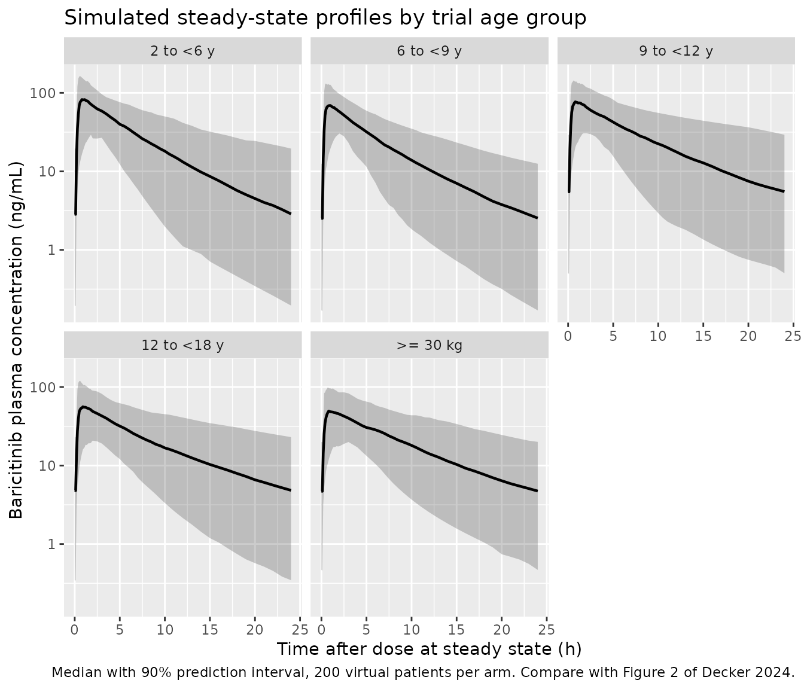
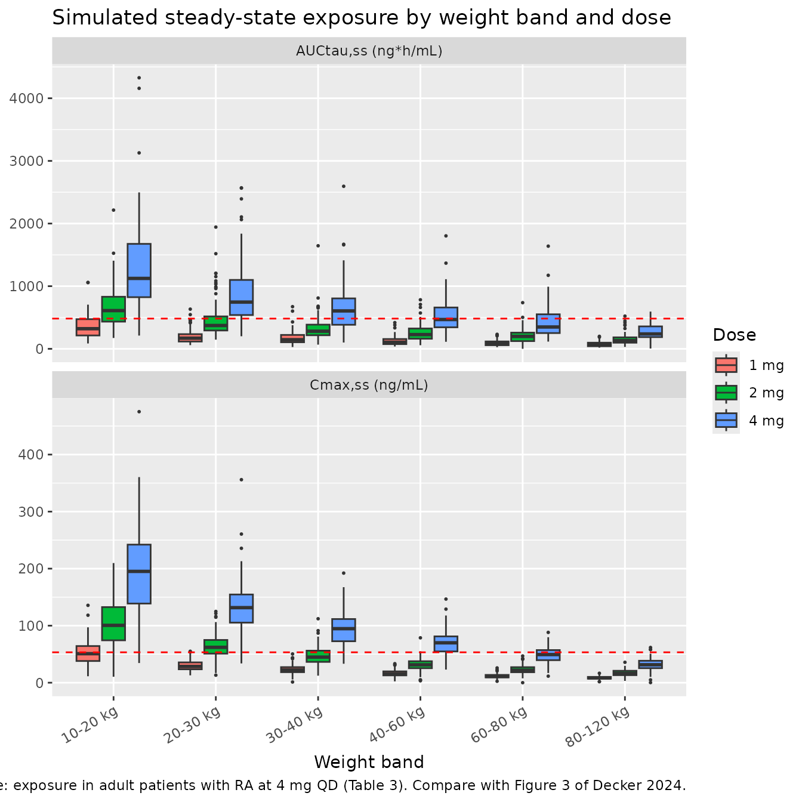

# Baricitinib (Decker 2024)

## Model and source

- Citation: Decker RL, Steven Ernest C II, Radtke DB, Wang R, Araujo J,
  Keller SY, Zhang X. A population pharmacokinetic model using
  allometric scaling for baricitinib in patients with juvenile
  idiopathic arthritis. CPT Pharmacometrics Syst Pharmacol
  2024;13(6):970-981. <doi:10.1002/psp4.13131>.
- Description: Two-compartment population PK model with zero-order
  absorption, an absorption lag, and fixed allometric scaling for oral
  baricitinib in 217 pediatric patients aged 2 to \<18 years with
  polyarticular-course juvenile idiopathic arthritis (JUVE-BASIS,
  NCT03773978). Apparent total clearance is partitioned
  semi-mechanistically into an eGFR-dependent apparent renal arm (CLr/F)
  and an eGFR-independent apparent non-renal arm (CLnr/F). Baseline body
  weight enters through allometric exponents fixed at 0.75 on all
  clearance terms (CLr/F, CLnr/F, Q) and at 1 on both volumes (V1/F,
  V2/F), referenced to 74 kg. The structure was carried unchanged from
  the adult rheumatoid-arthritis baricitinib population PK model; no
  further covariate met the stepwise-covariate-modeling inclusion
  criteria, so the base model is the final model.
- Article: <https://doi.org/10.1002/psp4.13131>

Baricitinib is an oral Janus-kinase inhibitor. Decker and colleagues
took the population PK model previously developed in adult patients with
rheumatoid arthritis (RA), added allometric scaling on body weight with
the exponents fixed at the canonical 0.75 and 1, and re-estimated it
against data from the phase 3 JUVE-BASIS trial in pediatric patients
with polyarticular-course juvenile idiopathic arthritis (JIA). The
purpose of the analysis was to convert the trial’s *age*-based dosing
into a *weight*-based posology reproducing the adult 4 mg once-daily
exposure. The resulting recommendation - 2 mg once daily for 10 to \<30
kg and 4 mg once daily for at least 30 kg - is the approved JIA posology
in the European Union.

The structural model is a two-compartment model with zero-order
absorption over a duration `D1` after a lag `LAG`, dosed directly into
the central compartment. Apparent total clearance is partitioned
semi-mechanistically:

- `CLr/F`, an apparent renal arm scaled by the patient’s baseline
  estimated glomerular filtration rate (eGFR, bedside Schwartz),
  representing renal filtration and secretion - the primary elimination
  route for baricitinib;
- `CLnr/F`, an apparent eGFR-independent arm, largely hepatic
  metabolism.

Body weight enters both arms and `Q` with an exponent fixed at 0.75, and
both volumes with an exponent fixed at 1, referenced to 74 kg. No
further covariate met the stepwise-covariate-modeling inclusion
criteria, so the base model is the final model.

## Population

The analysis dataset contained 1261 baricitinib plasma concentrations
from 217 patients aged 2 to \<18 years with polyarticular-course JIA
(polyarticular RF-positive or RF-negative, extended oligoarticular,
enthesitis-related arthritis, or juvenile psoriatic arthritis), all with
an inadequate response or intolerance to at least one prior conventional
synthetic or biologic DMARD (Table 1). Mean age was 13.3 years (range
2-17) and 79% of patients were in the 12 to \<18 year band. Mean body
weight was 50.2 kg (range 11.0-111 kg), with 87% of patients weighing at
least 30 kg. 150 of 217 patients (69%) were female and 149 (69%) were
White; 48 (22%) were Asian. Mean baseline eGFR, computed with the
bedside Schwartz equation, was 119 mL/min/1.73 m^2 (range 66.5-201).

Dosing during the trial was **age-based**: 4 mg once daily for ages 9 to
\<18 years and 2 mg once daily for ages 2 to \<9 years. Of the 1377
concentrations collected, 116 (8%) were excluded, chiefly 106 samples
below the 0.200 ng/mL limit of quantification. Safety/PK-period samples
were collected as dried whole blood on a Mitra VAMS microsampling device
and converted to plasma equivalents using a study-specific blood/plasma
ratio of 1.29 (Figure S2), then pooled with the open-label lead-in
plasma samples.

The same information is available programmatically via
`readModelDb("Decker_2024_baricitinib")()$population`.

## Source trace

Every `ini()` entry in
`inst/modeldb/specificDrugs/Decker_2024_baricitinib.R` carries an
in-file comment naming its origin. They are collected here for review.
All values come from **Table 2** (“Pharmacokinetic and covariate
parameters in final population PK model”), *Population mean (%SEE)*
column, unless noted.

| Equation / parameter | Value | Source location |
|----|----|----|
| `ld1` (D1) | 0.457 h | Table 2, D1 (%SEE 2.76) |
| `boxcox_d1` | 0.501 | Table 2, “Box-Cox transformation parameter for D1” (%SEE 1.40) |
| `ltlag` (LAG) | 0.147 h | Table 2, LAG (%SEE 2.64) |
| `lcl_nonren` (CLnr/F) | 3.36 L/h | Table 2, CLnr/F (%SEE 4.76) |
| `lcl_renal` (CLr/F) | 6.34 L/h | Table 2, CLr/F (%SEE 2.49) |
| `lvc` (V1/F) | 92.6 L | Table 2, V1/F (%SEE 1.89) |
| `lq` (Q) | 2.67 L/h | Table 2, Q (%SEE 7.64) |
| `lvp` (V2/F) | 25.6 L | Table 2, V2/F (%SEE 12.1) |
| `e_wt_cl_q` | 0.75 (fixed) | Table 2, “Allometric Scaling CL” = 0.75 (FIX); footnotes b, d |
| `e_wt_vc_vp` | 1 (fixed) | Table 2, “Allometric Scaling V” = 1 (FIX); footnotes c, e |
| `e_dcrcl_cl_renal` | 0.00586 | Table 2, “Covariate for change in eGFR on CLr/F” (%SEE 29.0) |
| `etalcl_nonren` variance | 0.539830 | Table 2 BSV 84.6% CV, via footnote a |
| `etalcl_renal` variance | 0.144987 | Table 2 BSV 39.5% CV, via footnote a |
| `etalvc` variance | 0.108176 | Table 2 BSV 33.8% CV, via footnote a |
| `etalvp` variance | 0.277044 | Table 2 BSV 56.5% CV, via footnote a |
| `etald1` variance | 1.070026 | Table 2 BSV 138.4% CV, via footnote a |
| `etalq` variance | 0.022545 (fixed) | Table 2 BSV 15.1% CV (FIX), via footnote a |
| cov(CLnr/F, CLr/F) | 0.272 | Table 2, “Covariance for CLnr/F and CLr/F”; footnote g |
| cov(CLr/F, V1/F) | -0.00706 | Table 2, “Covariance for CLr and V1/F”; footnote g |
| cov(CLnr/F, V1/F) | 0 (fixed) | Not reported in Table 2; fixed to zero |
| `propSd` | 0.361 | Table 2, “Proportional error”; footnote h: standard deviation |
| Total clearance `cl <- cl_renal + cl_nonren` | n/a | Table 2 footnote b |
| Allometric scaling `(WT/74)^0.75` on CLr/F, CLnr/F, Q | n/a | Table 2 footnotes b, d |
| Allometric scaling `(WT/74)^1.00` on V1/F, V2/F | n/a | Table 2 footnotes c, e |
| Renal-arm eGFR scaling `(CRCL_BASE/93) + 0.00586*(CRCL - CRCL_BASE)` | n/a | Table 2 footnote f |
| Two-compartment structure; zero-order input into `central` with duration D1 and lag LAG; no depot state | n/a | Methods, “Pharmacokinetic model development”; Figure S1 legend (compartments C and Cp only) |

Two conversions are applied when transcribing Table 2.

- **BSV.** Footnote a defines the tabulated quantity as
  `%CV = (sqrt(exp(OMEGA)-1))*100`, so the internal variance is
  `OMEGA = log((%CV/100)^2 + 1)`. Footnote g states that the two
  *covariance* entries are already on the `omega^2` scale, so they are
  transcribed as-is.
- **Concentration units.** Doses are in mg and volumes in L, so
  `central/vc` is in mg/L; the model multiplies by 1000 to report `Cc`
  in ng/mL, matching the paper’s exposure units.

Two anchors confirm the transcription independently of any simulation.
At the reference weight of 74 kg and the reference eGFR of 93
mL/min/1.73 m^2 the model gives
`CLr/F + CLnr/F = 6.34 + 3.36 = 9.70 L/h`, matching the paper’s
statement that “the total clearance estimate (for a weight of 74 kg) is
9.7 L/h”. The reference eGFR of 93 is therefore load-bearing: it is the
median eGFR of the *upstream adult* analysis, not a statistic of this
pediatric cohort (whose mean baseline eGFR is 119).

``` r

# The reported 3x3 block must be positive definite or rxode2's Cholesky
# sampler cannot draw from it. Verify explicitly rather than assume.
om_block <- matrix(
  c(0.539830,  0.272,     0,
    0.272,     0.144987, -0.00706,
    0,        -0.00706,   0.108176),
  nrow = 3, byrow = TRUE,
  dimnames = list(c("CLnr", "CLr", "V1"), c("CLnr", "CLr", "V1"))
)
round(eigen(om_block)$values, 6)
#> [1] 0.678521 0.108545 0.005927
stopifnot(all(eigen(om_block)$values > 0))

# Implied correlations. The CLnr/F - CLr/F pair is very strong but below 1.
round(stats::cov2cor(om_block), 3)
#>       CLnr    CLr     V1
#> CLnr 1.000  0.972  0.000
#> CLr  0.972  1.000 -0.056
#> V1   0.000 -0.056  1.000
```

## Choosing valid validation targets from Table 3

Table 3 reports post-hoc parameter and exposure estimates by age group
and by weight group. Before comparing simulations against it, it is
worth checking which columns are internally consistent: at steady state
under linear PK, `AUC(tau,ss)` must equal `Dose / (CL/F)`.

``` r

t3 <- tibble::tribble(
  ~group,                  ~dose_mg, ~cl,   ~auc, ~cmax, ~n,
  "2 to <6 y",                    2,  4.87,  410,  87.4,   6,
  "6 to <9 y",                    2,  6.53,  254,  56.8,  10,
  "9 to <12 y",                   4,  8.11,  500,  79.0,  29,
  "12 to <18 y",                  4, 10.30,  386,  57.7, 172,
  "< 30 kg",                      2,  6.30,  464,  85.7,  29,
  ">= 30 kg",                     4, 10.20,  388,  58.1, 188,
  "Adult RA (reference)",         4,  9.42,  483,  53.3, 2393
) |>
  mutate(
    `AUC implied by Dose/CL` = dose_mg / cl * 1000,
    `% difference`           = 100 * (auc - `AUC implied by Dose/CL`) /
                                 `AUC implied by Dose/CL`
  )

t3 |>
  dplyr::rename(
    "Group"                   = group,
    "N"                       = n,
    "Dose (mg)"               = dose_mg,
    "CL/F (L/h)"              = cl,
    "AUCtau,ss reported"      = auc,
    "Cmax,ss reported"        = cmax
  ) |>
  knitr::kable(
    digits  = 1,
    caption = paste(
      "Internal consistency of Decker 2024 Table 3. Under linear steady-state",
      "PK, AUC(tau,ss) must equal Dose/(CL/F)."
    )
  )
```

| Group | Dose (mg) | CL/F (L/h) | AUCtau,ss reported | Cmax,ss reported | N | AUC implied by Dose/CL | % difference |
|:---|---:|---:|---:|---:|---:|---:|---:|
| 2 to \<6 y | 2 | 4.9 | 410 | 87.4 | 6 | 410.7 | -0.2 |
| 6 to \<9 y | 2 | 6.5 | 254 | 56.8 | 10 | 306.3 | -17.1 |
| 9 to \<12 y | 4 | 8.1 | 500 | 79.0 | 29 | 493.2 | 1.4 |
| 12 to \<18 y | 4 | 10.3 | 386 | 57.7 | 172 | 388.3 | -0.6 |
| \< 30 kg | 2 | 6.3 | 464 | 85.7 | 29 | 317.5 | 46.2 |
| \>= 30 kg | 4 | 10.2 | 388 | 58.1 | 188 | 392.2 | -1.1 |
| Adult RA (reference) | 4 | 9.4 | 483 | 53.3 | 2393 | 424.6 | 13.7 |

Internal consistency of Decker 2024 Table 3. Under linear steady-state
PK, AUC(tau,ss) must equal Dose/(CL/F). {.table style="width:100%;"}

Four columns reconcile to within about 1.5% (2 to \<6 y, 9 to \<12 y, 12
to \<18 y, and \>= 30 kg). Three do not, and each has an identifiable
reason:

- **`< 30 kg` is off by +46%.** Its own CL/F of 6.30 L/h with the
  printed 2 mg dose implies an AUC of 317 ng\*h/mL, not the
  reported 464. The trial dosed by **age**, not weight, so patients aged
  9 years and older who happened to weigh under 30 kg received **4 mg**.
  Back-solving, `464 * 6.30 / 1000 = 2.92 mg` is the effective mean dose
  in that column - consistent with roughly 45% of the 29 patients
  receiving 4 mg. **This column is therefore not a valid target for a 2
  mg simulation**, even though the “Dose (mg)” row prints 2. It is
  excluded from the comparison below.
- **`6 to <9 y` is off by -17%.** Table 3 footnote d records that 2 of
  the 10 patients received incorrect dosing and were excluded from the
  dose-dependent parameters, so its AUC and Cmax come from N = 8 while
  its CL/F comes from N = 10.
- **Adult RA is off by +14%.** Table 3 footnote f states those values
  are based on all patients in the adult dataset with the dose
  normalised to 4 mg QD, a different aggregation from the pediatric
  columns.

The simulations below therefore target the four age groups as actually
dosed in the trial, plus the `>= 30 kg` weight group, and flag the two
small age groups (N = 6 and N = 8) as low-precision references rather
than firm targets.

## Virtual cohort

Original individual data are not publicly available. Each arm below
reproduces one Table 3 column, with body weight and baseline eGFR drawn
to match the mean and range reported for that group in Table 1, and the
dose that group actually received in the trial.

| Arm | Table 1 N | Dose | Weight, mean (range) | Baseline eGFR, mean (range) |
|----|----|----|----|----|
| 2 to \<6 y | 6 | 2 mg QD | 14.5 kg (11.0-19.2) | 122 (108-144) |
| 6 to \<9 y | 9 | 2 mg QD | 19.7 kg (13.3-26.1) | 141 (102-175) |
| 9 to \<12 y | 30 | 4 mg QD | 35.3 kg (21.9-63.5) | 129 (82-179) |
| 12 to \<18 y | 172 | 4 mg QD | 55.6 kg (26.1-111) | 116 (66.5-201) |
| \>= 30 kg | 188 | 4 mg QD | 54.5 kg (30.3-111) | ~117 (66.5-201) |

The `>= 30 kg` mean baseline eGFR is not printed in Table 1 (the cell is
blank in the published table); it is recovered from the paper’s own
numbers by mass balance, `(119*217 - 134*29)/188 = 116.7`, rounded to
117. The eGFR *range* for that stratum is taken as the all-patients
range.

``` r

set.seed(20240604)

# Rejection-sample a truncated normal matched to a reported mean and range.
rtrunc_norm <- function(n, mean, lo, hi) {
  if (isTRUE(all.equal(lo, hi))) return(rep(mean, n))
  sd  <- (hi - lo) / 4
  out <- numeric(0)
  while (length(out) < n) {
    x   <- stats::rnorm(4 * n, mean = mean, sd = sd)
    out <- c(out, x[x >= lo & x <= hi])
  }
  out[seq_len(n)]
}

# Steady-state design: QD dosing for 7 days, then a densely sampled final
# dosing interval (144-168 h). Terminal t1/2 is ~8 h, so 7 days is > 20
# half-lives and accumulation is complete.
tau      <- 24
n_doses  <- 7L
ss_start <- (n_doses - 1L) * tau          # 144 h -- time of the final dose
obs_grid <- sort(unique(c(
  seq(ss_start,       ss_start + 2,   by = 0.10),   # capture the sharp peak
  seq(ss_start + 2.5, ss_start + 12,  by = 0.50),
  seq(ss_start + 13,  ss_start + tau, by = 1.00)
)))

# Build one arm. `id_offset` keeps IDs disjoint across bind_rows()-ed arms;
# duplicate IDs are silently merged by rxSolve into a single wrong subject.
make_arm <- function(n, amt_mg, wt_mean, wt_lo, wt_hi,
                     egfr_mean, egfr_lo, egfr_hi, treatment, id_offset = 0L) {
  subj <- tibble(
    id        = id_offset + seq_len(n),
    WT        = rtrunc_norm(n, wt_mean, wt_lo, wt_hi),
    CRCL_BASE = rtrunc_norm(n, egfr_mean, egfr_lo, egfr_hi),
    treatment = treatment
  ) |>
    # The paper reports no on-treatment eGFR trajectory, so the time-varying
    # arm is switched off by setting CRCL == CRCL_BASE (delta-eGFR = 0).
    mutate(CRCL = CRCL_BASE)

  doses <- subj |>
    tidyr::crossing(time = seq(0, by = tau, length.out = n_doses)) |>
    mutate(
      amt  = amt_mg,
      evid = 1L,
      cmt  = "central",
      # rate = -2 tells rxode2 the infusion DURATION is modeled -- here by
      # dur(central) <- d1 in the model file. Without it the zero-order
      # absorption duration D1 is ignored and the dose becomes a bolus.
      rate = -2
    )

  obs <- subj |>
    tidyr::crossing(time = obs_grid) |>
    mutate(
      amt  = NA_real_,
      evid = 0L,
      # The ODE state name, never the observable name "Cc" -- referencing an
      # algebraic observable as a compartment renumbers the ODE slots.
      cmt  = "central",
      rate = NA_real_
    )

  bind_rows(doses, obs) |> arrange(id, time, desc(evid))
}

arms <- tibble::tribble(
  ~treatment,     ~amt_mg, ~wt_mean, ~wt_lo, ~wt_hi, ~egfr_mean, ~egfr_lo, ~egfr_hi,
  "2 to <6 y",          2,     14.5,   11.0,   19.2,        122,    108.0,      144,
  "6 to <9 y",          2,     19.7,   13.3,   26.1,        141,    102.0,      175,
  "9 to <12 y",         4,     35.3,   21.9,   63.5,        129,     82.0,      179,
  "12 to <18 y",        4,     55.6,   26.1,  111.0,        116,     66.5,      201,
  ">= 30 kg",           4,     54.5,   30.3,  111.0,        117,     66.5,      201
) |>
  mutate(id_offset = 1000L * seq_len(dplyr::n()))

n_per_arm <- 200L

events <- do.call(bind_rows, lapply(seq_len(nrow(arms)), function(i) {
  a <- arms[i, ]
  make_arm(n_per_arm, a$amt_mg, a$wt_mean, a$wt_lo, a$wt_hi,
           a$egfr_mean, a$egfr_lo, a$egfr_hi, a$treatment, a$id_offset)
}))

stopifnot(!anyDuplicated(unique(events[, c("id", "time", "evid")])))
c(arms = nrow(arms), subjects = dplyr::n_distinct(events$id), rows = nrow(events))
#>     arms subjects     rows 
#>        5     1000    60000
```

## Simulation

``` r

mod <- readModelDb("Decker_2024_baricitinib")

sim <- rxode2::rxSolve(
  mod,
  events = events,
  keep   = c("treatment", "WT", "CRCL_BASE")
) |>
  as.data.frame()
#> ℹ parameter labels from comments will be replaced by 'label()'

# rxSolve can silently drop subjects; assert the count survived.
stopifnot(dplyr::n_distinct(sim$id) == dplyr::n_distinct(events$id))
c(subjects_out = dplyr::n_distinct(sim$id), rows_out = nrow(sim))
#> subjects_out     rows_out 
#>         1000        53000
```

## Structural check against Table 3

Because the model’s only structural covariates are body weight and
baseline eGFR, the typical-value parameters evaluated at each group’s
mean weight and mean eGFR can be compared directly against the post-hoc
geometric means in Table 3. This is deterministic, so between-subject
variability is zeroed.

``` r

# zeroRe() removes the random effects. omega = NA is passed explicitly because
# rxSolve() otherwise reuses the omega from the previous solve in the session.
mod_typical <- rxode2::zeroRe(mod)
#> ℹ parameter labels from comments will be replaced by 'label()'

typ_events <- do.call(bind_rows, lapply(seq_len(nrow(arms)), function(i) {
  a <- arms[i, ]
  make_arm(1L, a$amt_mg, a$wt_mean, a$wt_mean, a$wt_mean,
           a$egfr_mean, a$egfr_mean, a$egfr_mean, a$treatment, a$id_offset)
}))

sim_typ <- rxode2::rxSolve(
  mod_typical, events = typ_events, omega = NA,
  keep = c("treatment", "WT", "CRCL_BASE")
) |>
  as.data.frame()
#> Warning: multi-subject simulation without without 'omega'

# Terminal (beta) half-life of a two-compartment model from the micro-constants.
terminal_half_life <- function(cl, vc, q, vp) {
  k10  <- cl / vc
  k12  <- q / vc
  k21  <- q / vp
  a    <- k10 + k12 + k21
  beta <- (a - sqrt(a^2 - 4 * k10 * k21)) / 2
  log(2) / beta
}

typ_tbl <- sim_typ |>
  group_by(treatment) |>
  summarise(
    cl_model   = mean(cl),
    v1_model   = mean(vc),
    v2_model   = mean(vp),
    thalf_model = terminal_half_life(mean(cl), mean(vc), mean(q), mean(vp)),
    .groups = "drop"
  )

published_t3 <- tibble::tribble(
  ~treatment,    ~cl_pub, ~v1_pub, ~v2_pub, ~thalf_pub,
  "2 to <6 y",      4.87,    21.7,    4.85,       6.39,
  "6 to <9 y",      6.53,    32.2,    7.92,       8.10,
  "9 to <12 y",     8.11,    49.3,    12.1,       8.47,
  "12 to <18 y",   10.30,    70.8,    16.9,       8.73,
  ">= 30 kg",      10.20,    69.3,    16.8,       8.75
)

typ_tbl |>
  left_join(published_t3, by = "treatment") |>
  mutate(`CL/F % diff` = 100 * (cl_model - cl_pub) / cl_pub,
         `V1/F % diff` = 100 * (v1_model - v1_pub) / v1_pub) |>
  dplyr::rename(
    "Group"               = treatment,
    "CL/F model (L/h)"    = cl_model,
    "CL/F Table 3 (L/h)"  = cl_pub,
    "V1/F model (L)"      = v1_model,
    "V1/F Table 3 (L)"    = v1_pub,
    "V2/F model (L)"      = v2_model,
    "V2/F Table 3 (L)"    = v2_pub,
    "t1/2 model (h)"      = thalf_model,
    "t1/2 Table 3 (h)"    = thalf_pub
  ) |>
  dplyr::relocate(`CL/F % diff`, .after = `CL/F Table 3 (L/h)`) |>
  dplyr::relocate(`V1/F % diff`, .after = `V1/F Table 3 (L)`) |>
  knitr::kable(
    digits  = 1,
    caption = paste(
      "Typical-value structural parameters versus the post-hoc geometric means",
      "of Decker 2024 Table 3."
    )
  )
```

| Group | CL/F model (L/h) | V1/F model (L) | V2/F model (L) | t1/2 model (h) | CL/F Table 3 (L/h) | CL/F % diff | V1/F Table 3 (L) | V1/F % diff | V2/F Table 3 (L) | t1/2 Table 3 (h) |
|:---|---:|---:|---:|---:|---:|---:|---:|---:|---:|---:|
| 12 to \<18 y | 9.1 | 69.6 | 19.2 | 9.5 | 10.3 | -11.7 | 70.8 | -1.7 | 16.9 | 8.7 |
| 2 to \<6 y | 3.4 | 18.1 | 5.0 | 6.7 | 4.9 | -29.4 | 21.7 | -16.4 | 4.8 | 6.4 |
| 6 to \<9 y | 4.8 | 24.7 | 6.8 | 6.8 | 6.5 | -26.4 | 32.2 | -23.4 | 7.9 | 8.1 |
| 9 to \<12 y | 7.0 | 44.2 | 12.2 | 8.2 | 8.1 | -14.0 | 49.3 | -10.4 | 12.1 | 8.5 |
| \>= 30 kg | 9.0 | 68.2 | 18.9 | 9.4 | 10.2 | -11.6 | 69.3 | -1.6 | 16.8 | 8.8 |

Typical-value structural parameters versus the post-hoc geometric means
of Decker 2024 Table 3. {.table style="width:100%;"}

The volume terms reproduce Table 3 closely, which is expected: `V1/F`
scales linearly with weight (exponent fixed at 1), so the typical value
at the group mean weight and the geometric mean of the individual
estimates should nearly coincide, and they agree to within a few percent
in the two largest groups.

Clearance shows a systematic pattern: the typical value sits **below**
the post-hoc geometric mean, and the gap widens as body weight falls
(roughly -12% at 55 kg, growing to about -29% at 14.5 kg). The paper
itself supplies the explanation. Its Discussion reports a sensitivity
analysis in which the allometric exponents were **estimated instead of
fixed**, returning 0.48 for clearance-related and 0.70 for
volume-related parameters. An exponent shallower than 0.75 means
clearance falls less steeply as weight decreases, so the fixed-0.75
model necessarily under-predicts clearance in the smallest patients
relative to their individual fits. Substituting the paper’s own
estimated exponent closes the gap without changing anything else:

``` r

# Diagnostic ONLY -- the packaged model keeps the published fixed exponent of
# 0.75 (Table 2, FIX). This recomputes the typical CL/F under the exponent the
# paper's own sensitivity analysis estimated (0.48, Discussion) to show that the
# exponent choice, not a transcription error, drives the residual pattern.
cl_typical <- function(wt, egfr, exponent) {
  (6.34 * (egfr / 93) + 3.36) * (wt / 74)^exponent
}

arms |>
  transmute(
    Group                      = treatment,
    `Weight (kg)`              = wt_mean,
    `CL/F Table 3 (L/h)`       = published_t3$cl_pub[match(treatment, published_t3$treatment)],
    `CL/F at exponent 0.75`    = cl_typical(wt_mean, egfr_mean, 0.75),
    `CL/F at exponent 0.48`    = cl_typical(wt_mean, egfr_mean, 0.48)
  ) |>
  knitr::kable(
    digits  = 2,
    caption = paste(
      "Diagnostic: the fixed 0.75 exponent (the published final model) versus",
      "the 0.48 exponent from the paper's own estimated-exponent sensitivity",
      "analysis. The packaged model uses 0.75."
    )
  )
```

| Group | Weight (kg) | CL/F Table 3 (L/h) | CL/F at exponent 0.75 | CL/F at exponent 0.48 |
|:---|---:|---:|---:|---:|
| 2 to \<6 y | 14.5 | 4.87 | 3.44 | 5.34 |
| 6 to \<9 y | 19.7 | 6.53 | 4.81 | 6.87 |
| 9 to \<12 y | 35.3 | 8.11 | 6.98 | 8.52 |
| 12 to \<18 y | 55.6 | 10.30 | 9.09 | 9.82 |
| \>= 30 kg | 54.5 | 10.20 | 9.01 | 9.79 |

Diagnostic: the fixed 0.75 exponent (the published final model) versus
the 0.48 exponent from the paper’s own estimated-exponent sensitivity
analysis. The packaged model uses 0.75. {.table}

## Replicate published figures

### Figure 2 - steady-state concentration-time profiles

Figure 2 of Decker 2024 overlays observed pediatric concentrations on
the model-predicted median and 90% prediction interval for adults
receiving 4 mg once daily. Observed data are not available, so the
panels below show the simulated pediatric prediction interval for each
age group at the dose it actually received in the trial.

``` r

sim |>
  mutate(time_after_dose = time - ss_start,
         treatment = factor(treatment, levels = arms$treatment)) |>
  group_by(treatment, time_after_dose) |>
  summarise(
    Q05 = quantile(Cc, 0.05, na.rm = TRUE),
    Q50 = quantile(Cc, 0.50, na.rm = TRUE),
    Q95 = quantile(Cc, 0.95, na.rm = TRUE),
    .groups = "drop"
  ) |>
  ggplot(aes(time_after_dose, Q50)) +
  geom_ribbon(aes(ymin = Q05, ymax = Q95), alpha = 0.25) +
  geom_line(linewidth = 0.8) +
  facet_wrap(~treatment) +
  scale_y_log10() +
  labs(
    x = "Time after dose at steady state (h)",
    y = "Baricitinib plasma concentration (ng/mL)",
    title = "Simulated steady-state profiles by trial age group",
    caption = paste(
      "Median with 90% prediction interval,", n_per_arm,
      "virtual patients per arm. Compare with Figure 2 of Decker 2024."
    )
  )
```



### Figure 3 - exposure versus weight band at 1, 2 and 4 mg QD

Figure 3 plots simulated steady-state Cmax and AUC by weight range at 1,
2 and 4 mg once daily against the adult 4 mg reference, and is the
analysis that selected the 30 kg cut-off. The paper varied weight in 10
kg steps between 10 and 60 kg and in 20 kg steps between 60 and 120 kg,
with eGFR fixed to the study range. The reproduction below uses six
weight bands and 100 virtual patients per band-dose arm.

``` r

bands <- tibble::tribble(
  ~band,        ~lo,  ~hi,
  "10-20 kg",    10,   20,
  "20-30 kg",    20,   30,
  "30-40 kg",    30,   40,
  "40-60 kg",    40,   60,
  "60-80 kg",    60,   80,
  "80-120 kg",   80,  120
)

grid <- tidyr::crossing(bands, amt_mg = c(1, 2, 4)) |>
  mutate(arm = paste0(band, " | ", amt_mg, " mg"),
         id_offset = 100000L + 1000L * seq_len(dplyr::n()))

events_fig3 <- do.call(bind_rows, lapply(seq_len(nrow(grid)), function(i) {
  g <- grid[i, ]
  make_arm(
    n = 100L, amt_mg = g$amt_mg,
    wt_mean = (g$lo + g$hi) / 2, wt_lo = g$lo, wt_hi = g$hi,
    # eGFR fixed to the study range across all bands, per the paper's Methods.
    egfr_mean = 119, egfr_lo = 66.5, egfr_hi = 201,
    treatment = g$arm, id_offset = g$id_offset
  )
}))

stopifnot(!anyDuplicated(unique(events_fig3[, c("id", "time", "evid")])))
c(arms = nrow(grid), subjects = dplyr::n_distinct(events_fig3$id))
#>     arms subjects 
#>       18     1800
```

``` r

sim_fig3 <- rxode2::rxSolve(
  mod, events = events_fig3, keep = c("treatment", "WT")
) |>
  as.data.frame()

stopifnot(dplyr::n_distinct(sim_fig3$id) == dplyr::n_distinct(events_fig3$id))

exposure_fig3 <- sim_fig3 |>
  group_by(treatment, id) |>
  summarise(
    cmax_ss = max(Cc, na.rm = TRUE),
    # Linear-trapezoid AUC over the final dosing interval, for plotting only;
    # the validated NCA comparison below uses PKNCA.
    auc_ss  = sum(diff(time) * (head(Cc, -1) + tail(Cc, -1)) / 2, na.rm = TRUE),
    .groups = "drop"
  ) |>
  tidyr::separate(treatment, into = c("band", "dose_label"), sep = " \\| ",
                  remove = FALSE) |>
  mutate(band = factor(band, levels = bands$band))

# Adult RA reference at 4 mg QD (Decker 2024 Table 3, RA column).
adult_ref <- tibble(metric = c("Cmax,ss (ng/mL)", "AUCtau,ss (ng*h/mL)"),
                    value  = c(53.3, 483))

exposure_fig3 |>
  tidyr::pivot_longer(c(cmax_ss, auc_ss), names_to = "metric") |>
  mutate(metric = ifelse(metric == "cmax_ss",
                         "Cmax,ss (ng/mL)", "AUCtau,ss (ng*h/mL)")) |>
  ggplot(aes(band, value, fill = dose_label)) +
  geom_boxplot(outlier.size = 0.4) +
  geom_hline(data = adult_ref, aes(yintercept = value),
             linetype = "dashed", colour = "red") +
  facet_wrap(~metric, scales = "free_y", ncol = 1) +
  labs(
    x = "Weight band", y = NULL, fill = "Dose",
    title = "Simulated steady-state exposure by weight band and dose",
    caption = paste(
      "Red dashed line: exposure in adult patients with RA at 4 mg QD",
      "(Table 3). Compare with Figure 3 of Decker 2024."
    )
  ) +
  theme(axis.text.x = element_text(angle = 30, hjust = 1))
```



The reproduction supports the paper’s reasoning. At 2 mg QD the 10-20 kg
and 20-30 kg bands bracket the adult AUC reference, while 4 mg QD is
needed from 30 kg upward; 1 mg QD leaves every band well below the adult
AUC, which is why the paper rejected a 1 mg step for the 10-20 kg group
despite its closer Cmax match. The paper’s stated reason for preferring
AUC matching is that the adult exposure-response analysis found Cmax not
to be a relevant driver of efficacy or safety.

## PKNCA validation

``` r

sim_nca <- sim |>
  filter(!is.na(Cc)) |>
  select(id, time, Cc, treatment)

# Guarantee a record at the interval start (the pre-dose trough at 144 h) so
# PKNCA does not warn about an AUC range starting before the first measurement.
sim_nca <- bind_rows(
  sim_nca,
  sim_nca |> distinct(id, treatment) |> mutate(time = ss_start, Cc = 0)
) |>
  distinct(id, treatment, time, .keep_all = TRUE) |>
  arrange(id, treatment, time)

dose_df <- events |>
  filter(evid == 1) |>
  select(id, time, amt, treatment)

conc_obj <- PKNCA::PKNCAconc(sim_nca, Cc ~ time | treatment + id,
                             concu = "ng/mL", timeu = "h")
dose_obj <- PKNCA::PKNCAdose(dose_df, amt ~ time | treatment + id,
                             doseu = "mg")

# Steady-state interval: the final dosing interval, 144-168 h.
intervals <- data.frame(
  start   = ss_start,
  end     = ss_start + tau,
  cmax    = TRUE,
  tmax    = TRUE,
  cmin    = TRUE,
  auclast = TRUE,
  cav     = TRUE
)

nca_res <- PKNCA::pk.nca(
  PKNCA::PKNCAdata(conc_obj, dose_obj, intervals = intervals)
)
```

### Comparison against published NCA

`auclast` over the 144-168 h interval is the model’s AUC(tau,ss) and
`cmax` is Cmax,ss. The `< 30 kg` column is excluded for the reason
established above (its reported exposure reflects age-based dosing at an
effective 2.92 mg, not the 2 mg printed in its Dose row).

``` r

published <- tibble::tribble(
  ~treatment,     ~cmax, ~auclast,
  "2 to <6 y",     87.4,      410,
  "6 to <9 y",     56.8,      254,
  "9 to <12 y",    79.0,      500,
  "12 to <18 y",   57.7,      386,
  ">= 30 kg",      58.1,      388
)

cmp <- nlmixr2lib::ncaComparisonTable(
  simulated     = nca_res,
  reference     = published,
  by            = "treatment",
  units         = c(cmax = "ng/mL", auclast = "ng*h/mL"),
  tolerance_pct = 20
)

knitr::kable(
  cmp,
  caption = paste(
    "Simulated versus published steady-state exposure (Decker 2024 Table 3).",
    "* differs from the reference by more than 20%."
  ),
  align = c("l", "l", "r", "r", "r")
)
```

| NCA parameter      | treatment    | Reference | Simulated |   % diff |
|:-------------------|:-------------|----------:|----------:|---------:|
| Cmax (ng/mL)       | 2 to \<6 y   |      87.4 |      94.9 |    +8.6% |
| Cmax (ng/mL)       | 6 to \<9 y   |      56.8 |      76.6 | +34.9%\* |
| Cmax (ng/mL)       | 9 to \<12 y  |        79 |      86.8 |    +9.9% |
| Cmax (ng/mL)       | 12 to \<18 y |      57.7 |      63.3 |    +9.7% |
| Cmax (ng/mL)       | \>= 30 kg    |      58.1 |      57.3 |    -1.4% |
| AUClast (ng\*h/mL) | 2 to \<6 y   |       410 |       569 | +38.8%\* |
| AUClast (ng\*h/mL) | 6 to \<9 y   |       254 |       432 | +70.1%\* |
| AUClast (ng\*h/mL) | 9 to \<12 y  |       500 |       614 | +22.7%\* |
| AUClast (ng\*h/mL) | 12 to \<18 y |       386 |       465 | +20.4%\* |
| AUClast (ng\*h/mL) | \>= 30 kg    |       388 |       455 |   +17.3% |

Simulated versus published steady-state exposure (Decker 2024 Table 3).
\* differs from the reference by more than 20%. {.table}

- differs from reference by more than ±20%.

**Cmax** reproduces within about 10% in four of the five arms (+8.6%,
+9.9%, +9.7% and -1.4%), and is closest of all in the largest arm,
`>= 30 kg` (N = 188, -1.4%). That is the expected consequence of the
volume terms matching: Cmax at steady state is governed chiefly by
`V1/F`, whose allometric exponent is fixed at 1 and whose typical values
agree with Table 3 to within a few percent. The one starred Cmax row, 6
to \<9 y at +34.9%, is the arm whose published Cmax comes from only 8
patients after two were excluded for incorrect dosing (Table 3 footnote
d).

**AUC** is over-predicted throughout: +17.3% for `>= 30 kg` and +20.4%
for 12 to \<18 y - the two large, well-determined arms - rising to
+38.8% and +70.1% in the two smallest age groups (N = 6 and N = 8).
Three effects compound here, none of them a transcription choice:

1.  `AUC = Dose / (CL/F)`, so the clearance under-prediction diagnosed
    in the structural check reappears as an AUC over-prediction of the
    same relative size. The driver is the published model’s **fixed 0.75
    allometric exponent**; the paper’s own estimated-exponent analysis
    returned 0.48, and substituting it closes the gap (see the
    diagnostic table above).
2.  The simulated summaries are geometric means over a weight
    *distribution*, while the typical-value calculation uses the mean
    weight. Because `WT^0.75` is concave, the geometric-mean clearance
    over a spread of weights falls below the clearance at the mean
    weight, adding a few percent more AUC. The effect is largest in the
    widest arms.
3.  The two smallest age groups rest on N = 6 and N = 8 post-hoc
    geometric means drawn from a population with a between-subject CV of
    84.6% on `CLnr/F`. Their sampling precision is very low, so they are
    context rather than targets.

No parameter was adjusted to improve any of these comparisons.

## Assumptions and deviations

- **Weight and eGFR distributions are reconstructed, not observed.**
  Individual covariates are not published. Each arm’s weight and
  baseline eGFR are drawn from truncated normals matched to the mean and
  min/max reported in Table 1. The true distributions are skewed within
  groups, so the simulated exposure spread will not match the published
  CV% exactly.
- **The `>= 30 kg` mean baseline eGFR is derived, not printed.** Table 1
  leaves that cell blank in the published table; it is recovered by mass
  balance from the all-patient mean (119), the `< 30 kg` mean (134) and
  the two group sizes (188 and 29), giving 116.7, rounded to 117.
- **The `< 30 kg` exposure column is not used as a validation target.**
  Its reported AUC and Cmax reflect the trial’s age-based dosing, under
  which patients aged 9 years and older weighing under 30 kg received 4
  mg. Its AUC is inconsistent with its own CL/F at the printed 2 mg dose
  by +46%, implying an effective dose of 2.92 mg.
- **The time-varying eGFR arm is switched off.** The model carries the
  Wahlby 2004 baseline/difference decomposition of eGFR, but the paper
  reports no on-treatment eGFR trajectory and no distribution for the
  change from baseline. All simulations here set `CRCL = CRCL_BASE`, so
  the delta term contributes nothing and renal clearance scales only
  with baseline eGFR. Users with longitudinal eGFR data should populate
  both columns.
- **cov(CLnr/F, V1/F) is fixed to zero.** Table 2 reports covariances
  for the CLnr/F-CLr/F and CLr/F-V1/F pairs but not for CLnr/F-V1/F. The
  unreported element is encoded as `fixed(0)` rather than estimated. The
  resulting 3x3 block is positive definite (verified in the Source trace
  section; minimum eigenvalue 0.0059).
- **Simulated AUC runs 17-20% above Table 3 in the well-determined
  arms.** This is a property of the published fixed-exponent model as
  encoded, not an unresolved transcription question: the structural
  check localises it to clearance, and the paper’s own
  estimated-exponent sensitivity analysis (0.48 rather than the fixed
  0.75) accounts for it. Nothing was tuned to reduce it.
- **Allometric exponents are the fixed values, not the estimated ones.**
  The Discussion reports a sensitivity analysis in which the exponents
  were estimated rather than fixed, returning 0.48 for clearance-related
  and 0.70 for volume-related parameters. Those are explicitly not the
  final model - Table 2 reports 0.75 and 1 with `FIX` - so only the
  fixed values are encoded. The 0.48 exponent appears in this vignette
  solely as a diagnostic explaining the clearance residual, and the
  paper notes the weight-based dose recommendation is unchanged either
  way.
- **Half-life is computed analytically, not by NCA.** The Table 3 `t1/2`
  values derive from post-hoc individual parameters. Estimating a
  terminal half-life by regression within a single 24 h steady-state
  interval is biased when the half-life is ~8 h, so the structural
  comparison uses the analytic two-compartment terminal (beta) half-life
  and `half.life` is omitted from the PKNCA interval specification.
- **Adult RA values are context, not model content.** The adult
  exposures quoted (AUC(tau,ss) 483 ng\*h/mL, Cmax,ss 53.3 ng/mL) come
  from Table 3 and are used only as a reference line. The adult RA model
  itself is a separate publication and is not encoded here.
- **No covariate beyond weight and renal function is in the model.**
  Age, sex, race, ethnicity, Japanese versus non-Japanese, and JIA
  subtype were all screened by stepwise covariate modeling and none met
  the forward-inclusion criteria (p \<= 0.01 and a \>= 5% reduction in
  the relevant BSV), so backward exclusion was never run and the base
  model became the final model. The screened-but-excluded covariates are
  recorded in the model file’s `covariatesDataExcluded` metadata.
- **The blood-to-plasma conversion is upstream of the model.**
  Safety/PK-period whole-blood microsamples were multiplied by 1.29
  before modeling; the model operates on plasma-equivalent
  concentrations only.
