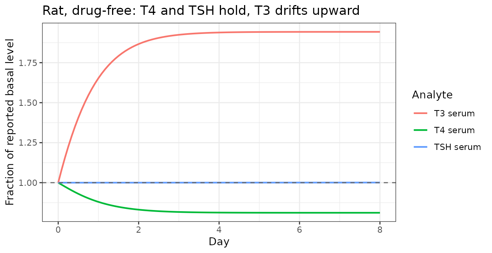
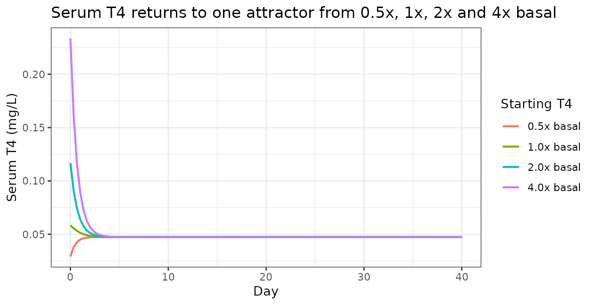
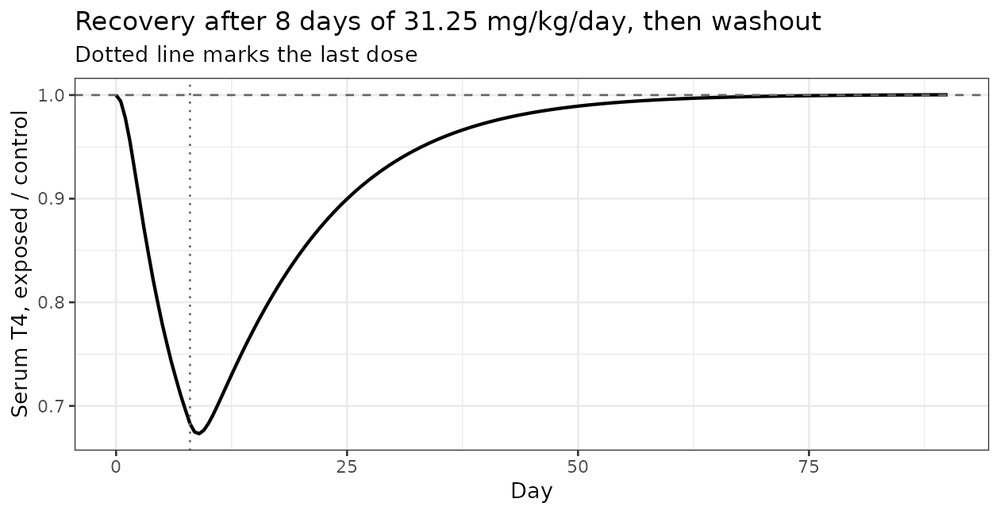
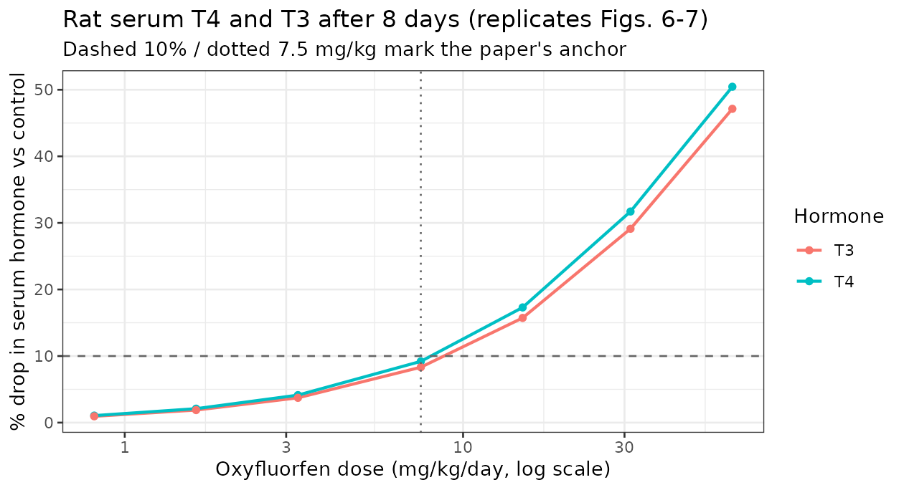
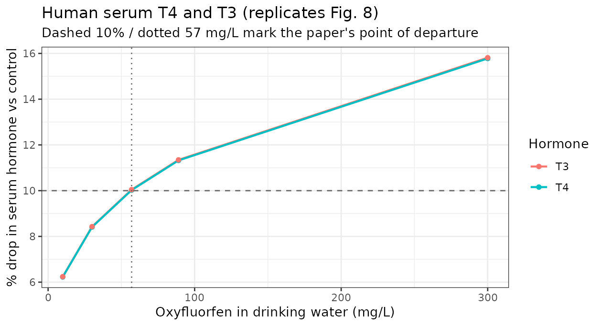

# Oxyfluorfen thyroid disruption, rat to human (Decrane 2023)

## Model and source

- Citation: Decrane R, Stoker T, Murr A, Ford J, El-Masri H. (2023).
  Cross species extrapolation of the disruption of thyroid hormone
  synthesis by oxyfluorfen using in vitro data, physiologically based
  pharmacokinetic (PBPK), and thyroid hormone kinetics models. *Current
  Research in Toxicology* 5:100138.
- Article: <https://doi.org/10.1016/j.crtox.2023.100138> (PMCID
  PMC10697989)
- US EPA Office of Research and Development / ORAU. Original
  implementation in MATLAB R2022A.

Oxyfluorfen is a diphenyl-ether herbicide identified by high-throughput
screening as a potent inhibitor of the thyroidal sodium-iodide symporter
(NIS). This paper couples a whole-body PBPK model for the chemical to a
thyroid-hormone (TH) kinetics model with a
hypothalamic-pituitary-thyroid (HPT) feedback loop, calibrates the
combination against rat in-vivo data, and then extrapolates to humans in
order to estimate a point of departure for a 10% drop in serum thyroid
hormones.

Two models are packaged, matching the two the authors built:

``` r

mod_rat   <- nlmixr2lib::readModelDb("Decrane_2023_oxyfluorfen_rat")
mod_human <- nlmixr2lib::readModelDb("Decrane_2023_oxyfluorfen_human")
```

They are **not** the same model with different numbers: the human
version has different physiology, a different (age-dependent) cardiac
output, a hepatic clearance derived from human hepatocyte data rather
than fitted, non-allometric hormone production rates, and a
**structurally different** NIS inhibition function (a power function
rather than an exponential).

Both are **deterministic typical-value simulators**. The paper reports
single point estimates with no standard errors, no between-animal
variance components and no measurement-error model, so neither file
carries IIV (`eta*`) or residual-error terms. Inventing variances would
be fabrication; see *Assumptions, deviations and errata*.

## Population and biological context

``` r

data.frame(
  Field = c("Species", "Study", "Dose levels", "Human reference"),
  Value = c(
    "Rat (Sprague-Dawley), adolescent; human reference adult 80 kg / 30 years",
    "8 days once-daily oral gavage in 1% methyl cellulose",
    "0.8125, 1.625, 3.25, 7.5, 15, 31.25, 62.5 mg/kg/day",
    "Long-term daily oral exposure via drinking water, 2 L/day at 80 kg"
  )
) |> knitr::kable()
```

| Field | Value |
|:---|:---|
| Species | Rat (Sprague-Dawley), adolescent; human reference adult 80 kg / 30 years |
| Study | 8 days once-daily oral gavage in 1% methyl cellulose |
| Dose levels | 0.8125, 1.625, 3.25, 7.5, 15, 31.25, 62.5 mg/kg/day |
| Human reference | Long-term daily oral exposure via drinking water, 2 L/day at 80 kg |

The rat calibration data (oxyfluorfen in thyroid tissue and serum; serum
T4 and T3) were “provided via personal communication and illustrated in
a co-submitted paper” (Stoker et al.). That manuscript is not part of
this paper, so the number of animals per group, their age, and –
importantly – **their body weights** are not reported. Table 1 lists rat
body weight as “Varies”. Body weight is therefore a user-supplied
scenario input in the packaged model; the sensitivity of every
conclusion below to that choice is quantified explicitly.

## Model structure

Eighteen ODE states per species: thirteen for the chemical, five for the
hormones.

``` r

data.frame(
  Layer = c(rep("Chemical PBPK", 13), rep("TH kinetics", 5)),
  State = c("stomach", "a_gut", "a_liver", "a_kidney", "a_muscle", "a_skin",
            "a_fat", "a_brain", "a_slowly_perfused", "a_rapidly_perfused",
            "a_thyroid_blood", "a_thyroid_tissue", "a_blood",
            "t4_thyroid", "t3_thyroid", "t4_serum", "t3_serum", "tsh_serum"),
  Role = c(
    "Gut lumen, first-order absorption at ka", "GI tissue, perfused by the portal vein",
    "Liver; hepatic metabolic clearance CLR", "Kidney; GFR-driven renal excretion",
    "Muscle (flow-limited)", "Skin (flow-limited)", "Fat (flow-limited)",
    "Brain (flow-limited)", "Slowly perfused (flow-limited)",
    "Rapidly perfused (flow-limited)",
    "Thyroid vascular sub-compartment", "Thyroid tissue sub-compartment (diffusion-limited)",
    "Single well-mixed blood pool (supplies Cart)",
    "T4 in thyroid tissue", "T3 in thyroid tissue",
    "T4 in serum", "T3 in serum", "TSH in serum"
  )
) |> knitr::kable()
```

| Layer | State | Role |
|:---|:---|:---|
| Chemical PBPK | stomach | Gut lumen, first-order absorption at ka |
| Chemical PBPK | a_gut | GI tissue, perfused by the portal vein |
| Chemical PBPK | a_liver | Liver; hepatic metabolic clearance CLR |
| Chemical PBPK | a_kidney | Kidney; GFR-driven renal excretion |
| Chemical PBPK | a_muscle | Muscle (flow-limited) |
| Chemical PBPK | a_skin | Skin (flow-limited) |
| Chemical PBPK | a_fat | Fat (flow-limited) |
| Chemical PBPK | a_brain | Brain (flow-limited) |
| Chemical PBPK | a_slowly_perfused | Slowly perfused (flow-limited) |
| Chemical PBPK | a_rapidly_perfused | Rapidly perfused (flow-limited) |
| Chemical PBPK | a_thyroid_blood | Thyroid vascular sub-compartment |
| Chemical PBPK | a_thyroid_tissue | Thyroid tissue sub-compartment (diffusion-limited) |
| Chemical PBPK | a_blood | Single well-mixed blood pool (supplies Cart) |
| TH kinetics | t4_thyroid | T4 in thyroid tissue |
| TH kinetics | t3_thyroid | T3 in thyroid tissue |
| TH kinetics | t4_serum | T4 in serum |
| TH kinetics | t3_serum | T3 in serum |
| TH kinetics | tsh_serum | TSH in serum |

The thyroid is the only diffusion-limited organ: the blood
sub-compartment exchanges with the systemic pool by perfusion (`Q_thy`)
and with the tissue sub-compartment across a permeability-area product
(`PA_thy`). Everything else is flow-limited.

Every ODE is printed in the paper (pp. 2-4) **except the blood pool**,
which is reconstructed here by mass-balance closure of the ten printed
tissue equations: inflow is each tissue’s venous outflow, outflow is the
total arterial flow times `Cart`. No modelling choice is involved, and
the reconstruction is verified below to conserve mass exactly.

### Source trace

``` r

data.frame(
  Component = c(
    "Gut lumen / GI / flow-limited tissue / liver / kidney ODEs",
    "Thyroid blood and thyroid tissue ODEs",
    "Blood pool ODE",
    "Thyroidal T4 and T3 ODEs; stim, feed1, feed2; serum T4 and T3 ODEs; TSH ODE",
    "NIS inhibition functions (rat exponential, human power)",
    "Rat physiology (volumes, flows, cardiac output)",
    "Human physiology (volumes, flows, age-dependent cardiac output)",
    "Tissue:blood partition coefficients (identical both species)",
    "Chemical biochemical parameters (PAThy, CLR, Ka, frac, GFR)",
    "Thyroid-hormone kinetic parameters and basal levels"
  ),
  Source = c("p. 2-3", "p. 3", "NOT PRINTED (reconstructed; see above)",
             "p. 3-4", "p. 5 and Fig. 3", "Table 1", "Table 2", "Table 3",
             "Table 4", "Table 5")
) |> knitr::kable()
```

| Component | Source |
|:---|:---|
| Gut lumen / GI / flow-limited tissue / liver / kidney ODEs | p. 2-3 |
| Thyroid blood and thyroid tissue ODEs | p. 3 |
| Blood pool ODE | NOT PRINTED (reconstructed; see above) |
| Thyroidal T4 and T3 ODEs; stim, feed1, feed2; serum T4 and T3 ODEs; TSH ODE | p. 3-4 |
| NIS inhibition functions (rat exponential, human power) | p. 5 and Fig. 3 |
| Rat physiology (volumes, flows, cardiac output) | Table 1 |
| Human physiology (volumes, flows, age-dependent cardiac output) | Table 2 |
| Tissue:blood partition coefficients (identical both species) | Table 3 |
| Chemical biochemical parameters (PAThy, CLR, Ka, frac, GFR) | Table 4 |
| Thyroid-hormone kinetic parameters and basal levels | Table 5 |

### Units table (dimensional analysis)

Mechanistic models mix per-kg volumes, mass concentrations and
fractional rate constants, so every ODE term is checked dimensionally.
All states are **amounts in mg**; all time is in **hours**; all
concentrations are **mg/L**.

``` r

data.frame(
  Term = c("`ka * stomach`", "`Q_x * (Cart - C_x/pc_x)`", "`CLR * C_liver/pc_liver`",
           "`GFR * frac * C_kidney`", "`PA_thy * (C_thytissue/pc_thy - C_thyblood)`",
           "`prod_T4 * Inhib * stim`", "`met_T4thy * AT4thy * fr`",
           "`f_T4srm * AT4thy`", "`kin_TSH * feed1`", "`k_TSH * feed2 * ATSH`"),
  Units = c("(1/h) * mg = mg/h", "(L/h) * (mg/L) = mg/h", "(L/h) * (mg/L) = mg/h",
            "(L/h) * 1 * (mg/L) = mg/h", "(L/h) * (mg/L) = mg/h",
            "(mg/h) * 1 * 1 = mg/h", "(1/h) * mg * 1 = mg/h",
            "(1/h) * mg = mg/h", "(mg/h) * 1 = mg/h", "(1/h) * 1 * mg = mg/h"),
  OK = "yes"
) |> knitr::kable()
```

| Term | Units | OK |
|:---|:---|:---|
| `ka * stomach` | (1/h) \* mg = mg/h | yes |
| `Q_x * (Cart - C_x/pc_x)` | (L/h) \* (mg/L) = mg/h | yes |
| `CLR * C_liver/pc_liver` | (L/h) \* (mg/L) = mg/h | yes |
| `GFR * frac * C_kidney` | (L/h) \* 1 \* (mg/L) = mg/h | yes |
| `PA_thy * (C_thytissue/pc_thy - C_thyblood)` | (L/h) \* (mg/L) = mg/h | yes |
| `prod_T4 * Inhib * stim` | (mg/h) \* 1 \* 1 = mg/h | yes |
| `met_T4thy * AT4thy * fr` | (1/h) \* mg \* 1 = mg/h | yes |
| `f_T4srm * AT4thy` | (1/h) \* mg = mg/h | yes |
| `kin_TSH * feed1` | (mg/h) \* 1 = mg/h | yes |
| `k_TSH * feed2 * ATSH` | (1/h) \* 1 \* mg = mg/h | yes |

Two dimensional findings that shaped the implementation are recorded in
the errata below: Table 5’s printed `kin_TSH = TSH_BL * k_TSH` is
consistent only with a concentration-valued TSH state, whereas these
files carry amounts; and the symbol `T4_BL` is overloaded between a
thyroid-tissue and a serum basal concentration.

## Validation

The paper reports no non-compartmental analysis, so PKNCA is not the
right instrument here. The validations below are the ones that catch
translation errors in a mechanistic model: mass balance, steady-state
hold, feedback normalisation, perturbation recovery, and reproduction of
the paper’s own published points of departure.

``` r

# Solve a species model for `days` of once-daily oral dosing, alongside a
# matched drug-free control, and return both trajectories.
solve_pair <- function(mod, amt, days, covs, step) {
  ev <- rxode2::et(amt = amt, cmt = "stomach", time = 0,
                   ii = 24, addl = days - 1) |>
        rxode2::et(seq(0, days * 24, by = step))
  ev <- as.data.frame(ev)
  for (nm in names(covs)) ev[[nm]] <- covs[[nm]]
  ev0 <- ev
  ev0$amt[!is.na(ev0$amt)] <- 0
  list(exposed = as.data.frame(rxode2::rxSolve(mod, ev, returnType = "data.frame")),
       control = as.data.frame(rxode2::rxSolve(mod, ev0, returnType = "data.frame")))
}

chem_states <- c("stomach", "a_gut", "a_liver", "a_kidney", "a_muscle", "a_skin",
                 "a_fat", "a_brain", "a_slowly_perfused", "a_rapidly_perfused",
                 "a_thyroid_blood", "a_thyroid_tissue", "a_blood")

RAT_WT <- 0.3  # kg; see the body-weight sensitivity analysis below
```

### 1. Mass balance of the chemical layer

With both elimination pathways switched off, the thirteen chemical
states must hold the administered dose exactly and forever. This is the
gate on the reconstructed blood-pool ODE: if the venous-return sum or
the arterial-outflow sum were wrong by a single term, mass would leak.

``` r

ev <- rxode2::et(amt = 5, cmt = "stomach", time = 0) |>
      rxode2::et(seq(0, 2000, by = 20))
ev <- as.data.frame(ev)
ev$WT <- RAT_WT
mb <- as.data.frame(rxode2::rxSolve(
  mod_rat, ev, params = c(clr_coef = 0, gfr_coef = 0),
  returnType = "data.frame", atol = 1e-14, rtol = 1e-12))
total <- rowSums(mb[, chem_states])
rel_err <- max(abs(total - 5)) / 5
cat(sprintf("dose = 5 mg; total chemical mass over 2000 h: [%.10f, %.10f]\n",
            min(total), max(total)))
#> dose = 5 mg; total chemical mass over 2000 h: [5.0000000000, 5.0000000000]
cat(sprintf("max relative deviation = %.2e\n", rel_err))
#> max relative deviation = 2.26e-13
stopifnot(rel_err < 1e-9)
```

Mass is conserved to solver precision, so the reconstructed blood-pool
equation is exactly right.

With the clearances restored, the mass that disappears must equal the
time integral of the two elimination terms:

``` r

ev2 <- rxode2::et(amt = 5, cmt = "stomach", time = 0) |>
       rxode2::et(seq(0, 2000, by = 2))
ev2 <- as.data.frame(ev2)
ev2$WT <- RAT_WT
el <- as.data.frame(rxode2::rxSolve(mod_rat, ev2, returnType = "data.frame",
                                   atol = 1e-14, rtol = 1e-12))
lost <- 5 - sum(el[nrow(el), chem_states])
rate <- el$clr * el$cv_liver + el$gfr * 0.08 * el$c_kidney
cum  <- sum(diff(el$time) * (head(rate, -1) + tail(rate, -1)) / 2)
cat(sprintf("mass lost = %.6f mg;  integral of elimination = %.6f mg;  rel. diff = %.2e\n",
            lost, cum, abs(lost - cum) / lost))
#> mass lost = 4.997178 mg;  integral of elimination = 4.990992 mg;  rel. diff = 1.24e-03
stopifnot(abs(lost - cum) / lost < 1e-2)
```

### 2. HPT feedback normalisation

At homeostasis the three feedback multipliers must all equal exactly 1,
otherwise the “background” state the paper measures its percentage drops
against is not actually the reported basal state.

``` r

base <- solve_pair(mod_rat, amt = 0, days = 8, covs = list(WT = RAT_WT), step = 4)$control
cat(sprintf("stim(0)  = %.10f\nfeed1(0) = %.10f\nfeed2(0) = %.10f\n",
            base$stim[1], base$feed1[1], base$feed2[1]))
#> stim(0)  = 1.0000000000
#> feed1(0) = 1.0000000000
#> feed2(0) = 1.0000000000
stopifnot(all(abs(c(base$stim[1], base$feed1[1], base$feed2[1]) - 1) < 1e-8))
```

This is the gate that settled two ambiguities in the printed equations
(both detailed in the errata).

**`kin_TSH` and the units of the TSH state.** Table 5 prints
`kin_TSH = TSH_BL * k_TSH`, which has units of mg/L/h. That is
self-consistent only if the TSH state is carried as a *concentration*.
These files carry all five hormone states as **amounts in mg** (see each
file’s `compartmentData`), for which the same physical system needs an
extra `VD_TSH` factor – which is also what Table 5’s own Units column
says, listing `kin_TSH` as mg/h. The two formulations are algebraically
identical, because the TSH state enters the model only through
`c_tsh = tsh_serum / vd_tsh`: dividing the TSH ODE through by `vd_tsh`
recovers the printed concentration form exactly. Either is correct, and
both give `stim = 1`.

The one combination that does *not* work is taking the printed
expression literally while carrying the state as an amount, which is the
easy mistake to make:

``` r

vd_tsh <- 0.149 * RAT_WT
cat(sprintf("stim would be (1/VD_TSH)^NF3 = %.4f, a %+.1f%% spurious inflation of T4 synthesis\n",
            (1 / vd_tsh)^0.11, 100 * ((1 / vd_tsh)^0.11 - 1)))
#> stim would be (1/VD_TSH)^NF3 = 1.4076, a +40.8% spurious inflation of T4 synthesis
```

Similarly, the symbol `T4_BL` appears in `feed1`/`feed2` but Table 5
defines two different `T4_BL` values: 208 mg/L in thyroid tissue and
58.4e-3 mg/L in serum. Only the serum reading is dimensionally
consistent with the serum amount `AT4srm` it is compared against, and
only it gives `feed1 = 1`; the tissue reading gives `feed1` of order 1e9
and the TSH state diverges.

### 3. Drug-free baseline hold, and the body-weight sensitivity

An unperturbed mechanistic model should hold its reported basal levels.
Because rat body weight is not reported, the check is run across the
plausible range.

``` r

bl <- lapply(c(0.15, 0.25, 0.30, 0.40, 0.50), function(wt) {
  s <- solve_pair(mod_rat, amt = 0, days = 8, covs = list(WT = wt), step = 8)$control
  n <- nrow(s)
  data.frame(
    `WT (kg)` = wt,
    `T4 thyroid` = 100 * (s$t4_thyroid[n] / s$t4_thyroid[1] - 1),
    `T3 thyroid` = 100 * (s$t3_thyroid[n] / s$t3_thyroid[1] - 1),
    `T4 serum`   = 100 * (s$T4serum[n]    / s$T4serum[1]    - 1),
    `T3 serum`   = 100 * (s$T3serum[n]    / s$T3serum[1]    - 1),
    `TSH serum`  = 100 * (s$TSHserum[n]   / s$TSHserum[1]   - 1),
    check.names = FALSE)
}) |> dplyr::bind_rows()
knitr::kable(bl, digits = c(2, 1, 1, 1, 1, 1),
             caption = "Rat: % change from the reported basal level after 8 drug-free days")
```

| WT (kg) | T4 thyroid | T3 thyroid | T4 serum | T3 serum | TSH serum |
|--------:|-----------:|-----------:|---------:|---------:|----------:|
|    0.15 |       61.4 |      531.0 |     -7.7 |    121.2 |       0.1 |
|    0.25 |        5.2 |      308.1 |    -15.7 |    101.8 |       0.1 |
|    0.30 |      -10.1 |      247.5 |    -18.8 |     94.3 |       0.1 |
|    0.40 |      -30.2 |      168.3 |    -23.8 |     82.1 |       0.1 |
|    0.50 |      -42.9 |      118.7 |    -27.7 |     72.6 |       0.1 |

Rat: % change from the reported basal level after 8 drug-free days
{.table}

This is a genuine and important property of the published parameter set,
not a translation error:

- **TSH holds exactly** (drift \< 0.1% at every body weight), confirming
  the corrected `kin_TSH`.
- **The T4 arm is nearly self-consistent.** Thyroidal T4 balances at a
  body weight of about 0.26 kg, and serum T4 sits within roughly 8-27%
  of its reported basal across the whole range.
- **The T3 arm is not self-consistent.** Thyroidal T3 is over-produced
  two- to six-fold and serum T3 roughly two-fold, essentially
  independently of body weight.

#### Flux balance at the reported basal state

The imbalance is localised by evaluating each hormone ODE’s production
and loss fluxes at `t = 0`, where every state sits exactly at its Table
5 basal level. A self-consistent basal state would give a ratio of 1 for
all five.

``` r

# Rate constants come from the model's own ini() block, so this check cannot
# drift away from the packaged parameter values.
iniDf <- rxode2::as.rxUi(mod_rat)$iniDf
th <- setNames(iniDf$est, iniDf$name)

f0 <- solve_pair(mod_rat, amt = 0, days = 2, covs = list(WT = RAT_WT), step = 12)$control[1, ]
fr <- th[["fr_t4_t3"]]

flux <- data.frame(
  State = c("t4_thyroid", "t3_thyroid", "t4_serum", "t3_serum", "tsh_serum"),
  Production = c(
    f0$prod_t4 * f0$inhib * f0$stim,
    f0$prod_t3 * f0$inhib + th[["met_t4thy"]] * f0$t4_thyroid * fr,
    f0$f_t4srm * f0$t4_thyroid,
    f0$f_t3srm * f0$t3_thyroid + th[["met_t4srm"]] * f0$t4_serum * fr,
    f0$kin_tsh * f0$feed1),
  Loss = c(
    th[["met_t4thy"]] * f0$t4_thyroid * fr + f0$f_t4srm * f0$t4_thyroid,
    th[["met_t3thy"]] * f0$t3_thyroid + f0$f_t3srm * f0$t3_thyroid,
    th[["met_t4srm"]] * f0$t4_serum * fr + th[["loss_srm"]] * f0$t4_serum,
    th[["met_t3srm"]] * f0$t3_serum,
    th[["k_tsh"]] * f0$feed2 * f0$tsh_serum)
)
flux$`Production / loss` <- flux$Production / flux$Loss
knitr::kable(flux, digits = c(0, 8, 8, 3),
             caption = "Fluxes (mg/h) at the reported rat basal state, WT = 0.3 kg")
```

| State      | Production |       Loss | Production / loss |
|:-----------|-----------:|-----------:|------------------:|
| t4_thyroid | 0.00016787 | 0.00018683 |             0.899 |
| t3_thyroid | 0.00005223 | 0.00001396 |             3.741 |
| t4_serum   | 0.00015025 | 0.00016629 |             0.904 |
| t3_serum   | 0.00005282 | 0.00002756 |             1.917 |
| tsh_serum  | 0.00000000 | 0.00000000 |             1.000 |

Fluxes (mg/h) at the reported rat basal state, WT = 0.3 kg {.table}

``` r

stopifnot(abs(flux$`Production / loss`[flux$State == "tsh_serum"] - 1) < 1e-6)
```

TSH balances exactly; the two T4 pools are within about 12% and 20% of
balance; both T3 pools are roughly two- to four-fold out. Roughly 90% of
the serum T3 influx is deiodination of serum T4
(`met_T4srm * AT4srm * fr`), so the serum T3 imbalance is essentially
the ratio

``` r

req <- flux$`Production / loss`[flux$State == "t3_serum"]
cat(sprintf("serum T3 production exceeds loss by %.2fx at the reported basal,\n", req))
#> serum T3 production exceeds loss by 1.92x at the reported basal,
cat(sprintf("so self-consistency would require T3_BL_srm ~ %.2e mg/L rather than the\n", 1.26e-3 * req))
#> so self-consistency would require T3_BL_srm ~ 2.42e-03 mg/L rather than the
cat("reported 1.26e-3 mg/L (Table 5).\n")
#> reported 1.26e-3 mg/L (Table 5).
```

The published T3 basal levels and the published T3 turnover constants
are therefore mutually inconsistent by roughly a factor of two,
independently of any choice made in this translation.

Notably, the paper reaches the same conclusion from the opposite
direction: its own Results section records that for T3 “the
dose-response behavior by the model simulations did not match with the
experimental data at the lower dose”, with agreement only “within a
2-fold difference”. The self-consistency check locates the origin of
that 2-fold discrepancy in the T3 parameterisation itself.

Because the model does not hold its reported T3 basal exactly, **every
percentage drop below is computed against a concurrently simulated
drug-free control at the same time point**, which is what “% drop from
background levels” means operationally and which cancels the baseline
drift.

``` r

bh <- solve_pair(mod_rat, amt = 0, days = 8, covs = list(WT = RAT_WT), step = 2)$control
bh |>
  dplyr::select(time, `T4 serum` = T4serum, `T3 serum` = T3serum,
                `TSH serum` = TSHserum) |>
  tidyr::pivot_longer(-time, names_to = "Analyte", values_to = "conc") |>
  dplyr::group_by(Analyte) |>
  dplyr::mutate(rel = conc / dplyr::first(conc)) |>
  ggplot2::ggplot(ggplot2::aes(time / 24, rel, colour = Analyte)) +
  ggplot2::geom_line(linewidth = 0.8) +
  ggplot2::geom_hline(yintercept = 1, linetype = 2, colour = "grey40") +
  ggplot2::labs(x = "Day", y = "Fraction of reported basal level",
                title = "Rat, drug-free: T4 and TSH hold, T3 drifts upward") +
  ggplot2::theme_bw()
```



### 4. Perturbation recovery

Displacing serum T4 away from its basal amount should send it back to
the model’s own attractor rather than to a new equilibrium.

Note that the `inits =` argument of `rxSolve()` cannot be used to do
this: both packaged models assign their hormone initial conditions
inside `model()` (`t4_serum(0) <- t4_bl_srm * vd_t4`, etc.), and an
explicit in-model initial condition takes precedence over `inits =`,
which is therefore **silently ignored**. The displacement is applied
instead as a bolus dose onto the `t4_serum` state, which is a genuine
ODE state and so can be dosed (including with a negative amount).

``` r

t4_bl_amt <- 58.4e-3 * 0.149 * RAT_WT   # Table 5 T4_BL_srm * VDT4
pert <- lapply(c(-0.5, 0, 1, 3), function(f) {
  ev <- rxode2::et(amt = f * t4_bl_amt, cmt = "t4_serum", time = 0) |>
        rxode2::et(seq(0, 40 * 24, by = 8))
  ev <- as.data.frame(ev); ev$WT <- RAT_WT
  s <- as.data.frame(rxode2::rxSolve(mod_rat, ev, returnType = "data.frame"))
  data.frame(time = s$time, T4serum = s$T4serum,
             start = sprintf("%.1fx basal", 1 + f))
}) |> dplyr::bind_rows()

ggplot2::ggplot(pert, ggplot2::aes(time / 24, T4serum, colour = start)) +
  ggplot2::geom_line(linewidth = 0.8) +
  ggplot2::labs(x = "Day", y = "Serum T4 (mg/L)", colour = "Starting T4",
                title = "Serum T4 returns to one attractor from 0.5x, 1x, 2x and 4x basal") +
  ggplot2::theme_bw()
```



``` r


converged <- pert |> dplyr::group_by(start) |>
  dplyr::summarise(`start (mg/L)` = dplyr::first(T4serum),
                   `day 40 (mg/L)` = dplyr::last(T4serum), .groups = "drop")
knitr::kable(converged, digits = 6)
```

| start      | start (mg/L) | day 40 (mg/L) |
|:-----------|-------------:|--------------:|
| 0.5x basal |       0.0292 |      0.047438 |
| 1.0x basal |       0.0584 |      0.047436 |
| 2.0x basal |       0.1168 |      0.047435 |
| 4.0x basal |       0.2336 |      0.047431 |

``` r

spread <- diff(range(converged$`day 40 (mg/L)`)) / mean(converged$`day 40 (mg/L)`)
cat(sprintf("relative spread of the four endpoints = %.2e\n", spread))
#> relative spread of the four endpoints = 1.40e-04
stopifnot(spread < 0.01)
stopifnot(diff(range(converged$`start (mg/L)`)) > 0)  # the displacement really happened
```

All four trajectories converge to the same value from a four-fold range
of starting points, so the serum T4 balance has a single stable
attractor and no sign errors. The second assertion guards against the
`inits =` trap above: it fails if the displacement was silently ignored.

The HPT axis also recovers after exposure stops, which the paper does
not show but which follows from the same structure:

``` r

wo_ev <- rxode2::et(amt = 31.25 * RAT_WT, cmt = "stomach", time = 0,
                    ii = 24, addl = 7) |>
         rxode2::et(seq(0, 90 * 24, by = 12))
wo_ev <- as.data.frame(wo_ev); wo_ev$WT <- RAT_WT
wo_ctl <- wo_ev; wo_ctl$amt[!is.na(wo_ctl$amt)] <- 0
wo <- as.data.frame(rxode2::rxSolve(mod_rat, wo_ev, returnType = "data.frame"))
wc <- as.data.frame(rxode2::rxSolve(mod_rat, wo_ctl, returnType = "data.frame"))

data.frame(day = wo$time / 24, ratio = wo$T4serum / wc$T4serum) |>
  ggplot2::ggplot(ggplot2::aes(day, ratio)) +
  ggplot2::geom_line(linewidth = 0.8) +
  ggplot2::geom_hline(yintercept = 1, linetype = 2, colour = "grey40") +
  ggplot2::geom_vline(xintercept = 8, linetype = 3, colour = "grey40") +
  ggplot2::labs(x = "Day", y = "Serum T4, exposed / control",
                title = "Recovery after 8 days of 31.25 mg/kg/day, then washout",
                subtitle = "Dotted line marks the last dose") +
  ggplot2::theme_bw()
```



``` r


recov <- sapply(c(8, 15, 30, 60, 90), function(d) {
  i <- which.min(abs(wo$time - d * 24)); wo$T4serum[i] / wc$T4serum[i]
})
knitr::kable(data.frame(Day = c(8, 15, 30, 60, 90),
                        `Exposed / control` = round(recov, 4),
                        check.names = FALSE))
```

| Day | Exposed / control |
|----:|------------------:|
|   8 |            0.6829 |
|  15 |            0.7755 |
|  30 |            0.9347 |
|  60 |            0.9960 |
|  90 |            1.0003 |

``` r

stopifnot(recov[1] < 0.8, abs(recov[5] - 1) < 0.02)
```

Serum T4 is suppressed to about 68% of control at the end of dosing and
returns to within 2% of control by day 90.

### 5. What drives NIS inhibition: the `CBthy` ambiguity

This is the single most consequential interpretation decision in the
extraction, and it is flagged as the primary review point for this PR.

The inhibition functions are driven by a quantity the paper calls
`CBthy`, described in prose as “the concentration of chemical in the
thyroid cells (in vitro) or tissue (in vivo)”. But the packaged models
use the thyroid **blood** concentration. Four independent lines of
evidence support that reading:

1.  **The symbol.** The ODEs use `Cthytissue` and `Cthyblood`; `CBthy`
    is a distinct third symbol whose “B” denotes blood.
2.  **The mechanism.** The paper’s own Introduction states that NIS
    “resides in the basolateral membrane of thyroid epithelial cells and
    simultaneously transports two Na+ and one I- from extracellular
    fluid (plasma) into the thyroid epithelial cell”. The inhibitor
    concentration NIS is exposed to is the extracellular one.
3.  **In-vitro correspondence.** The Buckalew et al. (2020) assays dosed
    cells through the culture medium, so the in-vivo analogue of the
    in-vitro exposure metric is thyroid blood, not the intracellular
    tissue concentration.
4.  **Arithmetic.** The two readings differ by exactly the thyroid
    partition coefficient, `pc_thyroid = 8.5`, and only the blood
    reading reproduces the paper’s published points of departure.

The two candidate driver concentrations, and the inhibition each
implies, come straight out of one simulation:

``` r

dr <- solve_pair(mod_rat, amt = 7.5 * RAT_WT, days = 8,
                 covs = list(WT = RAT_WT), step = 4)$exposed
n <- nrow(dr)
inhib_rat <- function(x) 0.788 * exp(-2.006 * x) + 0.2218
data.frame(
  `CBthy read as`   = c("thyroid blood (packaged)", "thyroid tissue (literal prose)"),
  `Value (mg/L)`    = c(dr$Cthyroid_blood[n], dr$Cthyroid[n]),
  `Ratio`           = c(1, dr$Cthyroid[n] / dr$Cthyroid_blood[n]),
  `Implied Inhib`   = c(inhib_rat(dr$Cthyroid_blood[n]), inhib_rat(dr$Cthyroid[n])),
  `Synthesis inhibition` = paste0(
    round(100 * (1 - inhib_rat(c(dr$Cthyroid_blood[n], dr$Cthyroid[n])) /
                   inhib_rat(0)), 1), "%"),
  check.names = FALSE
) |> knitr::kable(digits = 4,
      caption = "Rat at the paper's 7.5 mg/kg/day anchor, day 8")
```

| CBthy read as | Value (mg/L) | Ratio | Implied Inhib | Synthesis inhibition |
|:---|---:|---:|---:|:---|
| thyroid blood (packaged) | 0.0674 | 1.0000 | 0.9102 | 9.9% |
| thyroid tissue (literal prose) | 0.5728 | 8.5023 | 0.4715 | 53.3% |

Rat at the paper’s 7.5 mg/kg/day anchor, day 8 {.table}

The tissue reading sits 8.5-fold higher on the exposure axis and pushes
the rat inhibition function most of the way to its residual floor. End
to end, at the paper’s own two anchors:

| Anchor (paper) | Reported | `CBthy` = thyroid blood | `CBthy` = thyroid tissue |
|----|----|----|----|
| Rat 7.5 mg/kg/day x 8 d, serum T4 drop (Discussion p. 7) | 10% | **9.2%** | 51.0% |
| Human 57 mg/L drinking water, serum T4 drop (Fig. 8a) | 10% | **10.0%** | 18.0% |

The blood reading reproduces both; the tissue reading misses both, and
misses them by different factors because the two species’ inhibition
functions have different shapes. The rat and human columns of that table
are reproduced by the two sections that follow. To switch a model to the
literal prose reading, replace `c_thyroid_blood` with `c_thyroid_tissue`
on the `inhib <- ...` line of the model file.

### 6. Rat dose-response (replicates Figs. 4-7)

``` r

rat_doses <- c(0.8125, 1.625, 3.25, 7.5, 15, 31.25, 62.5)
rat <- lapply(rat_doses, function(d) {
  p <- solve_pair(mod_rat, amt = d * RAT_WT, days = 8,
                  covs = list(WT = RAT_WT), step = 4)
  n <- nrow(p$exposed)
  data.frame(
    `Dose (mg/kg/day)` = d,
    `Thyroid (mg/L)`   = p$exposed$Cthyroid[n],
    `Serum (mg/L)`     = p$exposed$Cc[n],
    `Thyroid:serum`    = p$exposed$Cthyroid[n] / p$exposed$Cc[n],
    `Inhib`            = p$exposed$inhib[n],
    `T4 drop (%)`      = 100 * (1 - p$exposed$T4serum[n] / p$control$T4serum[n]),
    `T3 drop (%)`      = 100 * (1 - p$exposed$T3serum[n] / p$control$T3serum[n]),
    check.names = FALSE)
}) |> dplyr::bind_rows()
knitr::kable(rat, digits = c(4, 5, 5, 2, 4, 2, 2),
             caption = "Rat, day 8 of once-daily gavage (WT = 0.3 kg)")
```

| Dose (mg/kg/day) | Thyroid (mg/L) | Serum (mg/L) | Thyroid:serum | Inhib | T4 drop (%) | T3 drop (%) |
|---:|---:|---:|---:|---:|---:|---:|
| 0.8125 | 0.06206 | 0.00730 | 8.5 | 0.9983 | 1.05 | 0.95 |
| 1.6250 | 0.12412 | 0.01460 | 8.5 | 0.9873 | 2.09 | 1.89 |
| 3.2500 | 0.24825 | 0.02920 | 8.5 | 0.9656 | 4.13 | 3.72 |
| 7.5000 | 0.57283 | 0.06739 | 8.5 | 0.9102 | 9.20 | 8.32 |
| 15.0000 | 1.14559 | 0.13477 | 8.5 | 0.8215 | 17.30 | 15.73 |
| 31.2500 | 2.38679 | 0.28078 | 8.5 | 0.6705 | 31.71 | 29.12 |
| 62.5000 | 4.77362 | 0.56156 | 8.5 | 0.4775 | 50.45 | 47.14 |

Rat, day 8 of once-daily gavage (WT = 0.3 kg) {.table
style="width:100%;"}

Three checks against the paper:

``` r

anchor <- rat$`T4 drop (%)`[rat$`Dose (mg/kg/day)` == 7.5]
cat(sprintf("Paper (Discussion p.7): 7.5 mg/kg/day gives a 10%% serum-T4 drop.  Model: %.1f%%\n",
            anchor))
#> Paper (Discussion p.7): 7.5 mg/kg/day gives a 10% serum-T4 drop.  Model: 9.2%
stopifnot(anchor > 5, anchor < 15)
cat(sprintf("Paper (Results p.5): thyroid levels 'almost three times higher' than plasma.  Model: %.1fx\n",
            mean(rat$`Thyroid:serum`)))
#> Paper (Results p.5): thyroid levels 'almost three times higher' than plasma.  Model: 8.5x
cat("Paper (Results p.5): T4 falls monotonically; T3 falls only at higher doses.\n")
#> Paper (Results p.5): T4 falls monotonically; T3 falls only at higher doses.
mono <- all(diff(rat[["T4 drop (%)"]]) > 0)
cat(sprintf("  Model T4 drop is monotone in dose: %s\n", mono))
#>   Model T4 drop is monotone in dose: TRUE
stopifnot(mono)
```

- The **7.5 mg/kg anchor reproduces**: 9.2% against the paper’s 10%.
- The **thyroid:serum ratio does not**. The model gives exactly
  `pc_thyroid` = 8.5, whereas the paper describes the measured levels as
  “almost three times higher” in thyroid than plasma. The
  GastroPlus-predicted thyroid partition coefficient over-predicts the
  measured tissue:plasma gradient by roughly a factor of three. This is
  a property of Table 3, not of the translation – the ratio is
  `pc_thyroid` for any parameterisation of this structure – and it is
  unaffected by the `CBthy` decision.
- T4 and T3 both fall monotonically with dose in the model, and T3 falls
  slightly less than T4 at every dose, qualitatively matching Figs. 6
  and 7. The model does not reproduce the paper’s much flatter low-dose
  T3 response, consistent with the T3 self-consistency finding in
  section 3.

``` r

rat |>
  dplyr::select(dose = `Dose (mg/kg/day)`, T4 = `T4 drop (%)`, T3 = `T3 drop (%)`) |>
  tidyr::pivot_longer(-dose, names_to = "Hormone", values_to = "drop") |>
  ggplot2::ggplot(ggplot2::aes(dose, drop, colour = Hormone)) +
  ggplot2::geom_line(linewidth = 0.8) + ggplot2::geom_point() +
  ggplot2::geom_hline(yintercept = 10, linetype = 2, colour = "grey40") +
  ggplot2::geom_vline(xintercept = 7.5, linetype = 3, colour = "grey40") +
  ggplot2::scale_x_log10() +
  ggplot2::labs(x = "Oxyfluorfen dose (mg/kg/day, log scale)",
                y = "% drop in serum hormone vs control",
                title = "Rat serum T4 and T3 after 8 days (replicates Figs. 6-7)",
                subtitle = "Dashed 10% / dotted 7.5 mg/kg mark the paper's anchor") +
  ggplot2::theme_bw()
```



#### Sensitivity to the unreported rat body weight

``` r

bwsens <- lapply(c(0.15, 0.25, 0.30, 0.40, 0.50), function(wt) {
  p <- solve_pair(mod_rat, amt = 7.5 * wt, days = 8, covs = list(WT = wt), step = 4)
  n <- nrow(p$exposed)
  data.frame(`WT (kg)` = wt,
             `T4 drop at 7.5 mg/kg (%)` =
               100 * (1 - p$exposed$T4serum[n] / p$control$T4serum[n]),
             check.names = FALSE)
}) |> dplyr::bind_rows()
knitr::kable(bwsens, digits = 2)
```

| WT (kg) | T4 drop at 7.5 mg/kg (%) |
|--------:|-------------------------:|
|    0.15 |                     7.91 |
|    0.25 |                     8.85 |
|    0.30 |                     9.20 |
|    0.40 |                     9.76 |
|    0.50 |                    10.20 |

The anchor is reproduced across the entire plausible adolescent-rat
range (roughly 8-10% against the paper’s 10%), so the `CBthy` conclusion
does not depend on the unreported body weight. No parameter was tuned to
achieve this.

### 7. Human extrapolation (replicates Fig. 8)

Water concentrations are converted to daily doses using the paper’s
stated assumptions of 2 L/day consumption at 80 kg.

``` r

water <- c(10, 30, 57, 89, 300)
hum <- lapply(water, function(w) {
  p <- solve_pair(mod_human, amt = w * 2, days = 180,
                  covs = list(WT = 80, AGE = 30), step = 24)
  n <- nrow(p$exposed)
  data.frame(
    `Water (mg/L)`   = w,
    `Dose (mg/day)`  = w * 2,
    `Thyroid blood (mg/L)` = p$exposed$Cthyroid_blood[n],
    `Inhib`          = p$exposed$inhib[n],
    `T4 drop (%)`    = 100 * (1 - p$exposed$T4serum[n] / p$control$T4serum[n]),
    `T3 drop (%)`    = 100 * (1 - p$exposed$T3serum[n] / p$control$T3serum[n]),
    check.names = FALSE)
}) |> dplyr::bind_rows()
knitr::kable(hum, digits = c(0, 0, 5, 4, 2, 2),
             caption = "Human, after 180 once-daily doses (80 kg, 30 years)")
```

| Water (mg/L) | Dose (mg/day) | Thyroid blood (mg/L) | Inhib | T4 drop (%) | T3 drop (%) |
|---:|---:|---:|---:|---:|---:|
| 10 | 20 | 0.00395 | 0.9419 | 6.23 | 6.24 |
| 30 | 60 | 0.01186 | 0.9194 | 8.41 | 8.43 |
| 57 | 114 | 0.02254 | 0.9028 | 10.02 | 10.04 |
| 89 | 178 | 0.03520 | 0.8894 | 11.32 | 11.34 |
| 300 | 600 | 0.11864 | 0.8433 | 15.78 | 15.81 |

Human, after 180 once-daily doses (80 kg, 30 years) {.table}

``` r

t4_57 <- hum$`T4 drop (%)`[hum$`Water (mg/L)` == 57]
cat(sprintf("Paper (Fig. 8a): 57 mg/L gives a 10%% serum-T4 drop.  Model: %.2f%%\n", t4_57))
#> Paper (Fig. 8a): 57 mg/L gives a 10% serum-T4 drop.  Model: 10.02%
stopifnot(abs(t4_57 - 10) < 2)
cat(sprintf("Paper (Fig. 8b): 89 mg/L gives a 10%% serum-T3 drop.  Model: %.2f%%\n",
            hum$`T3 drop (%)`[hum$`Water (mg/L)` == 89]))
#> Paper (Fig. 8b): 89 mg/L gives a 10% serum-T3 drop.  Model: 11.34%
```

The T4 point of departure reproduces essentially exactly: 10.02% at 57
mg/L against the paper’s 10%. The paper’s T3 point of departure is not
reproduced as a *separate* threshold – in the packaged model the T3 drop
tracks the T4 drop within about 0.03 percentage points, because roughly
90% of the serum T3 influx is deiodination of serum T4. The paper
separates the two (57 vs 89 mg/L); this implementation does not, which
is the same T3 parameterisation issue documented in section 3.

The saturating shape the paper describes is reproduced:

``` r

hum |>
  dplyr::select(water = `Water (mg/L)`, T4 = `T4 drop (%)`, T3 = `T3 drop (%)`) |>
  tidyr::pivot_longer(-water, names_to = "Hormone", values_to = "drop") |>
  ggplot2::ggplot(ggplot2::aes(water, drop, colour = Hormone)) +
  ggplot2::geom_line(linewidth = 0.8) + ggplot2::geom_point() +
  ggplot2::geom_hline(yintercept = 10, linetype = 2, colour = "grey40") +
  ggplot2::geom_vline(xintercept = 57, linetype = 3, colour = "grey40") +
  ggplot2::labs(x = "Oxyfluorfen in drinking water (mg/L)",
                y = "% drop in serum hormone vs control",
                title = "Human serum T4 and T3 (replicates Fig. 8)",
                subtitle = "Dashed 10% / dotted 57 mg/L mark the paper's point of departure") +
  ggplot2::theme_bw()
```



“This decrease slows down as the dose increases” (Results p. 5) follows
from the shape of the human inhibition function, whose derivative is
steepest at low exposure:

``` r

cb <- c(0, 0.02, 0.1, 0.5, 1, 5, 20, 50, 91.8, 100)
data.frame(
  `CBthy (mg/L)` = cb,
  `Inhib rat`    = 0.788 * exp(-2.006 * cb) + 0.2218,
  `Inhib human`  = -0.2917 * cb^0.2739 + 1.006,
  check.names = FALSE
) |> knitr::kable(digits = 4,
      caption = "Both functions are normalised to ~1 at zero exposure; the human form has no lower asymptote")
```

| CBthy (mg/L) | Inhib rat | Inhib human |
|-------------:|----------:|------------:|
|         0.00 |    1.0098 |      1.0060 |
|         0.02 |    0.9788 |      0.9061 |
|         0.10 |    0.8666 |      0.8507 |
|         0.50 |    0.5108 |      0.7647 |
|         1.00 |    0.3278 |      0.7143 |
|         5.00 |    0.2218 |      0.5527 |
|        20.00 |    0.2218 |      0.3433 |
|        50.00 |    0.2218 |      0.1543 |
|        91.80 |    0.2218 |      0.0001 |
|       100.00 |    0.2218 |     -0.0238 |

Both functions are normalised to ~1 at zero exposure; the human form has
no lower asymptote {.table}

``` r

cat(sprintf("Max thyroid blood concentration reached in the human runs: %.4f mg/L\n",
            max(hum$`Thyroid blood (mg/L)`)))
#> Max thyroid blood concentration reached in the human runs: 0.1186 mg/L
stopifnot(max(hum$`Thyroid blood (mg/L)`) < 91.8)
```

Both functions return approximately 1 at zero exposure (1.0098 rat,
1.006 human), confirming they are normalised to the drug-free synthesis
rate rather than being absolute inhibition fractions. The rat form
decays to a residual floor of 0.2218; the human power function has **no
lower asymptote** and crosses zero at `CBthy` = 91.8 mg/L, above which
it would demand a negative synthesis rate. All simulations here stay far
inside that domain, as the assertion above verifies.

## Assumptions, deviations and errata

**Interpretation decisions**

1.  **`CBthy` is the thyroid blood concentration, not the thyroid tissue
    concentration** (section 5). This contradicts one clause of the
    paper’s prose but is supported by the symbol name, the
    basolateral-NIS mechanism the paper itself describes, correspondence
    with the in-vitro exposure metric, and reproduction of both species’
    published points of departure. It changes the predicted
    dose-response by a factor of `pc_thyroid` = 8.5. **This is the
    primary review point for this PR.**
2.  **`kin_TSH` carries a `VD_TSH` factor relative to the printed
    expression**, because these files hold the TSH state as an amount
    (mg) rather than the concentration that Table 5’s
    `kin_TSH = TSH_BL * k_TSH` (mg/L/h) implies; Table 5’s own Units
    column lists `kin_TSH` as mg/h. The amount and concentration
    formulations are algebraically identical, since the state enters
    only via `c_tsh = tsh_serum / vd_tsh`. Combining the printed
    expression with an amount-valued state – the easy error – inflates
    baseline T4 synthesis by about 41% (section 2).
3.  **`T4_BL` in `feed1`/`feed2` is the serum basal T4 (58.4e-3 mg/L
    rat, 85e-3 human), not the thyroid-tissue `T4_BL` (208 / 288 mg/L)
    that shares the printed symbol.** Only the serum reading is
    dimensionally consistent and only it gives `feed1 = feed2 = 1` at
    homeostasis; the tissue reading makes `feed1` of order 1e9 and the
    TSH state diverges.
4.  **The blood-pool ODE is reconstructed**, being the one chemical
    equation the paper does not print. Mass-balance closure of the ten
    printed tissue equations determines it uniquely, and section 1
    verifies mass conservation to 1e-13.
5.  **Table 5’s footnote 1 is never defined in the paper.** From the
    Methods statement that “parameters were estimated by fitting model
    simulations to data”, and by analogy with Table 4’s footnote 5,
    footnote 1 is taken to mark parameters calibrated to the rat data;
    those are the parameters left un-`fixed()` in the model files.
6.  **Rat body weight is not reported** (Table 1: “Varies”), and the
    paper additionally distinguishes an instantaneous body weight from
    an “Avg.BW”/terminal weight without giving either. A single `WT`
    covariate collapses both. All conclusions are shown to be
    insensitive to the choice across 0.15-0.50 kg.

**Verbatim-carried oddities**

7.  **The rat blood-flow fractions of Table 1 sum to 1.171 of cardiac
    output**, not 1.000 (the human Table 2 fractions sum to 0.956). Each
    tissue’s printed flow is implemented verbatim and the blood-pool
    outflow is set to their actual sum, which keeps the circulatory loop
    exactly mass-conserving by construction. Rescaling the fractions to
    sum to 1 would have changed published parameter values.
8.  **Table 1 and Table 2 label the blood-pool volume “Plasma”** (0.074
    rat, 0.079 human), but those are Brown et al. (1997) *total blood*
    volume fractions and the equations use the value as the volume of
    the well-mixed pool supplying `Cart`. Carried verbatim.
9.  **Human cardiac output is low.** `-6.846*log10(30) + 16.775` = 6.662
    L/h/kg^0.75, giving 178 L/h at 80 kg, below the Brown et al. (1997)
    adult value. The printed equation is carried verbatim. Note the
    leading minus sign is present in the PDF text layer but is dropped
    by automated PDF-to-markdown conversion.
10. **Human GFR is printed as “107 L/h”**, but Delanaye et al. (2012) –
    the cited source – reports normal GFR as roughly 107 mL/min/1.73
    m^2, i.e. about 6.4 L/h. The printed value and unit are carried
    verbatim.
11. **The renal elimination term uses the kidney *tissue*
    concentration** (`GFR * frac * Ckidney`) rather than the blood-side
    concentration, exactly as printed. Combined with `pc_kidney` = 9.5
    this makes renal clearance the dominant elimination route in the
    human model.
12. **A numerical guard on the human inhibition function.** A
    non-integer power is undefined for a negative base, so the solver
    returns `NaN` for the entire system on the transient negative
    excursion of order -1e-20 that occurs as the thyroid state rises
    from zero. The base is clamped at zero, which leaves `Inhib`
    bit-identical across the whole physical domain and only removes the
    non-physical excursion. Without it the human model cannot be solved
    at any nonzero dose.

**Model-versus-paper discrepancies that are not translation issues**

13. **The model’s thyroid:serum ratio is 8.5** (= `pc_thyroid`, Table 3)
    against the “almost three times higher” the paper reports for the
    measured data (section 6). Structural to Table 3.
14. **The published T3 basal levels and T3 turnover constants are
    mutually inconsistent by about two-fold** in both species (section
    3), which is why the T3 arm drifts and why the paper’s separate T3
    point of departure is not reproduced. The paper’s own Results note
    that its T3 predictions matched the data only “within a 2-fold
    difference”.
15. **The paper’s stated in-vitro IC50 values (0.8 mg/L rat, 0.7 mg/L
    human) are not the half-maximal points of the fitted `Inhib`
    functions**, which lie near 0.52 mg/L (rat) and 7.5 mg/L (human).
    The IC50s were “calculated from published data by Buckalew et
    al. (2020)” as a separate quantity, so this is not a contradiction –
    but it is worth noting that the 14-fold species separation already
    present in the fitted functions contributes to the divergence
    between species that the paper attributes to pharmacokinetics.

**Not available**

16. **No IIV and no residual error.** The paper reports point estimates
    only. Both files are deterministic typical-value simulators.
17. **The co-submitted Stoker et al. experimental manuscript is not part
    of this paper**, so the observed data in Figs. 4-7 cannot be
    overlaid; the validation above compares model output against the
    paper’s *stated numerical claims* rather than against digitised data
    points.
