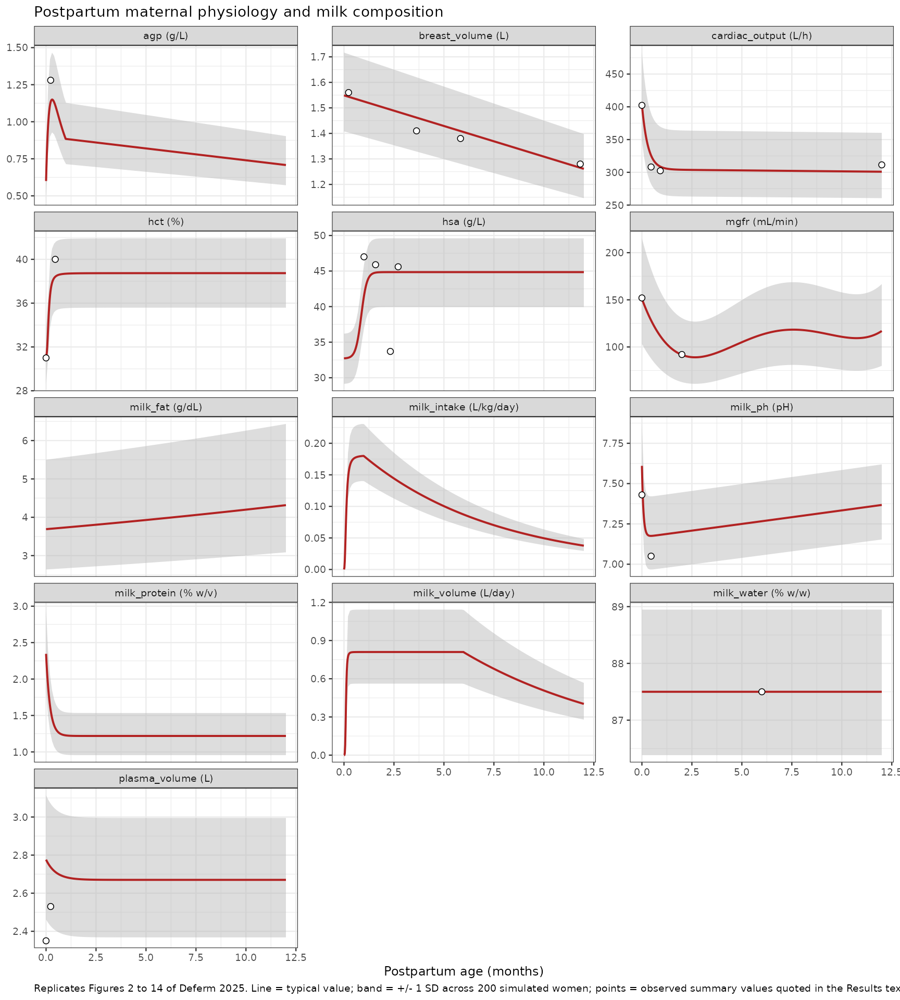
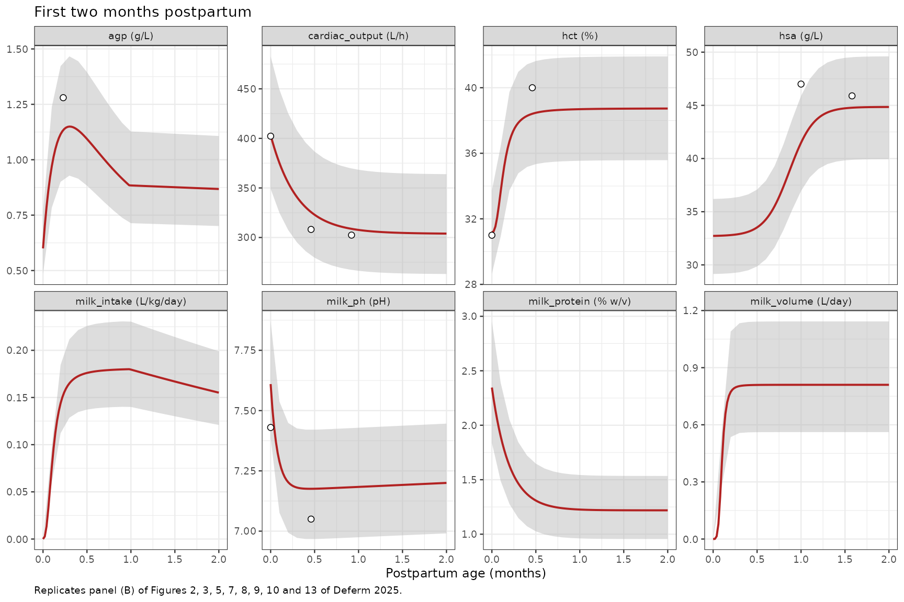

# Postpartum maternal physiology and milk composition (Deferm 2025)

## Model and source

    #> ℹ parameter labels from comments will be replaced by 'label()'

- Citation: Deferm N, Dinh J, Pansari A, Jamei M, Abduljalil K.
  Postpartum changes in maternal physiology and milk composition: a
  comprehensive database for developing lactation physiologically-based
  pharmacokinetic models. Front Pharmacol. 2025;16:1517069.
  <doi:10.3389/fphar.2025.1517069>.
- Article: <https://doi.org/10.3389/fphar.2025.1517069>
- PubMed Central:
  <https://www.ncbi.nlm.nih.gov/pmc/articles/PMC11830814/>

Deferm 2025 is not a drug model. It is the **system-parameter layer**
that a lactation physiologically-based pharmacokinetic (PBPK) model sits
on top of: a meta-analysis of 230 studies that produces continuous
mathematical functions of postpartum age for the 13 maternal and
breast-milk properties that govern how much drug reaches a breastfed
infant. Published lactation PBPK models routinely hold these constant;
the paper’s point is that they are not constant, and that they return to
pre-pregnancy values at very different rates.

The packaged model therefore has no drug, no dose, no compartments and
no ODEs. Every output is an algebraic function of the `rxode2` time
variable, which the model interprets as **postpartum age in months**
(the paper’s symbol `PpT`). Solving over `time = 0` to `12` traces the
whole first postpartum year.

> Lactation system-parameter (population physiology) model for the
> postpartum period (Deferm 2025 Front Pharmacol). Meta-analysis of 230
> studies (36,689 data points from 20,801 postpartum women) yielding
> continuous mathematical functions of postpartum age for 13 maternal
> and breast-milk parameters that govern drug transfer into human milk:
> milk volume, milk pH, milk fat, milk total protein, milk water
> content, daily infant milk intake, maternal haematocrit, alpha-1-acid
> glycoprotein, human serum albumin, breast volume, plasma volume,
> cardiac output and glomerular filtration rate. This is the
> time-varying SYSTEM layer intended to be coupled to a lactation PBPK
> drug model – it contains no drug, no dosing, no compartments and no
> ODEs. Every output is an algebraic function of the rxode2 time
> variable, which the model interprets as postpartum age in MONTHS
> (paper symbol PpT), so a solve over time 0 to 12 traces the full first
> postpartum year. Between-subject variability is the constant
> coefficient of variation the authors applied per parameter to recover
> the observed spread (Simcyp virtual-population style), encoded here as
> independent lognormal etas. Three parameters are piecewise: milk
> volume (sigmoidal to 6 months, mono-exponential decline thereafter),
> daily milk intake (sigmoidal to 1 month, mono-exponential decline
> thereafter) and alpha-1-acid glycoprotein (double-exponential to 1
> month, linear thereafter). Valid over 0 to 12 months postpartum only.

## Population

The pooled database covers **20,801 postpartum women** contributing
**36,689 data points** across **230 studies**, from immediately after
childbirth to 12 months postpartum. The women had a weighted mean age of
28.59 years (range 20.8 to 40), weighted mean weight 63.93 kg (range 45
to 100.40) and weighted mean height 163.78 cm (range 149 to 173.50).

Inclusion required healthy breastfeeding women aged 18 to 45 after an
uncomplicated, full-term pregnancy who took no medication during or
after pregnancy (Methods 2.3). Studies focused on preterm infants were
excluded, and mixed cohorts were used only where full-term cases were at
least 90% of the study.

Two features of the data are important when reading the validation
below. First, the data are heavily front-loaded: 60% of all data points
fall within the first postpartum month, and only 251 data points exist
beyond 7 months. Second, for four parameters (haematocrit, alpha-1-acid
glycoprotein, human serum albumin, plasma volume) no observed data
extended to 12 months, so the authors anchored the tail with a single
value simulated from 1,000 healthy non-pregnant women in the Simcyp
Simulator V23R2 and assumed it represented the 12-month level. Those
tails are an assumption of return-to-baseline, not an observation.

Parity, ethnicity, delivery type, complementary-feeding practice and
foremilk-versus-hindmilk sampling were all screened and all discarded
for inconsistent reporting (Results 3.1 and Discussion); the first two
are recorded in the model’s `covariatesDataExcluded` metadata.

| Field | Value |
|:---|:---|
| species | human |
| n_subjects | 20801 |
| n_studies | 230 |
| age_range | 20.8 to 40 years (weighted mean 28.59 years) |
| weight_range | 45 to 100.40 kg (weighted mean 63.93 kg) |
| height_range | 149 to 173.50 cm (weighted mean 163.78 cm) |
| postpartum_range | Immediately after childbirth to 12 months postpartum; 60% of data points fall within the first month and only 251 data points after 7 months |
| n_datapoints | 36689 |

Population metadata carried in the model file. {.table}

## Source trace

Every value is a published point estimate of a function the authors
fitted by weighted least squares in Excel Solver, with each data point
weighted by study n (Methods 2.4). **The paper reports no standard
error, RSE or confidence interval for any coefficient**, so every entry
is encoded with `fixed()`.

| Output (units) | Source equation | Functional form |
|----|----|----|
| `milk_volume` (L/day) | Eq. 5 (0 to 6 mo), Eq. 6 (6 to 12 mo) | sigmoidal rise, then mono-exponential decline |
| `milk_ph` (unitless) | Eq. 7 | sum of two exponentials |
| `milk_fat` (g/dL) | Eq. 8 | baseline x second-order polynomial |
| `milk_protein` (% w/v) | Eq. 9 | exponential decline to a plateau |
| `milk_water` (% w/w) | Section 3.2.5 | constant (no age trend detected) |
| `milk_intake` (L/kg/day) | Eq. 10 (0 to 1 mo), Eq. 11 (1 to 12 mo) | sigmoidal rise, then mono-exponential decline |
| `hct` (%) | Eq. 12 | sigmoidal recovery |
| `agp` (g/L) | Eq. 13 (0 to 1 mo), Eq. 14 (1 to 12 mo) | double exponential, then linear |
| `hsa` (g/L) | Eq. 15 | logistic recovery |
| `breast_volume` (L) | Eq. 16 | linear decline |
| `plasma_volume` (L) | Eq. 17 | geometric decay to an asymptote |
| `cardiac_output` (L/h) | Eq. 18 | sum of two exponentials |
| `mgfr` (mL/min) | Eq. 19 | quartic polynomial |

The per-coefficient origin is recorded as an in-file comment beside each
`ini()` entry in
`inst/modeldb/endogenous/Deferm_2025_lactation_physiology.R`. The table
below reads them straight out of the packaged model.

| Parameter | Value | Fixed | Label |
|:---|---:|:---|:---|
| milkvol_max | 0.810000 | yes | Maximum (plateau) daily milk production over 0 to 6 months postpartum (L/day) |
| milkvol_t50 | 0.100000 | yes | Postpartum age at half-maximal milk production (months) |
| milkvol_hill | 4.370000 | yes | Hill coefficient on postpartum age in the milk-production rise (unitless) |
| milkvol_a | 1.619000 | yes | Intercept of the mono-exponential milk-volume decline after 6 months (L/day) |
| milkvol_kdecl | 0.116000 | yes | First-order rate of milk-volume decline after 6 months postpartum (1/month) |
| milkph_amp | 0.443000 | yes | Amplitude of the fast colostrum-to-mature-milk pH fall (pH units) |
| milkph_kfast | 13.070000 | yes | First-order rate of the early milk-pH fall (1/month) |
| milkph_base | 7.167000 | yes | Mature-milk baseline pH at time zero of the slow term (pH units) |
| milkph_kslow | 0.002300 | yes | Slow first-order rate of the late milk-pH rise (1/month; positive as printed) |
| milkfat_base | 3.690000 | yes | Milk fat concentration at birth, multiplying the polynomial (g/dL) |
| milkfat_lin | 0.012083 | yes | Linear fractional coefficient on postpartum age for milk fat (1/month) |
| milkfat_quad | 0.000171 | yes | Quadratic fractional coefficient on postpartum age for milk fat (1/month^2) |
| milkprot_ss | 1.219000 | yes | Steady-state (mature-milk) total protein content (% w/v) |
| milkprot_amp | 1.127000 | yes | Colostrum excess total protein above the mature-milk steady state (% w/v) |
| milkprot_k | 5.058000 | yes | First-order rate of the milk total-protein decline (1/month) |
| milkwater_mean | 87.500000 | yes | Milk water content, constant across the postpartum period (% w/w) |
| milkintake_max | 0.181000 | yes | Maximum daily milk intake reached during the first postpartum month (L/kg/day) |
| milkintake_t50 | 0.114000 | yes | Postpartum age at half-maximal daily milk intake (months) |
| milkintake_hill | 2.411000 | yes | Hill coefficient on postpartum age in the milk-intake rise (unitless) |
| milkintake_ss | 0.004000 | yes | Asymptotic daily milk intake at late postpartum age (L/kg/day) |
| milkintake_peak | 0.208000 | yes | Extrapolated daily milk intake at time zero of the declining phase (L/kg/day) |
| milkintake_k | 0.150000 | yes | First-order rate of the daily milk-intake decline after 1 month (1/month) |
| hct_birth | 31.170000 | yes | Maternal haematocrit immediately after delivery (%) |
| hct_max | 38.740000 | yes | Maternal haematocrit plateau, at pre-pregnancy level (%) |
| hct_t50 | 0.133000 | yes | Postpartum age at half of the haematocrit recovery (months) |
| hct_hill | 2.490000 | yes | Hill coefficient on postpartum age in the haematocrit recovery (unitless) |
| agp_kslow | 1.277000 | yes | Slow first-order rate of the alpha-1-acid glycoprotein double-exponential (1/month) |
| agp_kfast | 6.749000 | yes | Fast first-order rate of the alpha-1-acid glycoprotein double-exponential (1/month) |
| agp_base | 0.600000 | yes | Additive offset of the early alpha-1-acid glycoprotein function (g/L) |
| agp_slope | -0.016000 | yes | Linear slope of the alpha-1-acid glycoprotein decline from 1 to 12 months (g/L/month) |
| agp_icept | 0.900000 | yes | Intercept of the linear alpha-1-acid glycoprotein decline from 1 to 12 months (g/L) |
| hsa_base | 32.700000 | yes | Maternal human serum albumin immediately after delivery (g/L) |
| hsa_amp | 12.150000 | yes | Rise in maternal human serum albumin from delivery to plateau (g/L) |
| hsa_k | 7.160000 | yes | Steepness of the logistic maternal human serum albumin recovery (1/month) |
| hsa_t50 | 0.866000 | yes | Postpartum age at half of the human serum albumin recovery (months) |
| breastvol_icept | 1.549000 | yes | Empty (milk-free) breast volume at delivery (L) |
| breastvol_slope | 0.024000 | yes | Linear rate of empty-breast-volume decline (L/month) |
| plasmavol_ss | 2.670000 | yes | Pre-pregnancy (asymptotic) maternal plasma volume (L) |
| plasmavol_amp | 0.106000 | yes | Excess maternal plasma volume at delivery above the pre-pregnancy asymptote (L) |
| plasmavol_decay | 0.133000 | yes | Per-month geometric decay factor of the excess plasma volume (unitless base, raised to PpT) |
| cardiacout_amp | 98.800000 | yes | Amplitude of the fast postpartum cardiac-output decline (L/h) |
| cardiacout_kfast | 3.330000 | yes | Fast first-order rate of the cardiac-output decline (1/month) |
| cardiacout_base | 304.400000 | yes | Pre-pregnancy baseline cardiac output at time zero of the slow term (L/h) |
| cardiacout_kslow | 0.000960 | yes | Slow first-order rate of the late cardiac-output drift (1/month) |
| mgfr_c0 | 151.028000 | yes | Constant term of the maternal GFR quartic polynomial (mL/min) |
| mgfr_c1 | -57.189800 | yes | First-order coefficient of the maternal GFR quartic polynomial (mL/min/month) |
| mgfr_c2 | 17.185600 | yes | Second-order coefficient of the maternal GFR quartic polynomial (mL/min/month^2) |
| mgfr_c3 | -1.847900 | yes | Third-order coefficient of the maternal GFR quartic polynomial (mL/min/month^3) |
| mgfr_c4 | 0.066100 | yes | Fourth-order coefficient of the maternal GFR quartic polynomial (mL/min/month^4) |

Structural coefficients as packaged (all fixed; Deferm 2025 Eqs. 5 to
19). {.table}

### Dimensional analysis

Each function maps postpartum age in months to its own output unit; no
term mixes units. The only conversions a downstream user must be aware
of are collected here.

| Quantity | Unit as packaged | Note |
|----|----|----|
| time (`ppt`) | month | Every rate constant and polynomial coefficient is per month (or per month^k). Solving on an hour or day axis silently rescales all 13 functions. |
| `milk_volume` | L/day | Daily maternal production, not per feed. |
| `milk_intake` | L/kg/day | Per kg of **infant** body weight; multiply by infant weight for L/day. |
| `milk_fat` | g/dL | Numerically equal to % w/v. Creamatocrit readings were converted with the Lucas equation before fitting (Section 3.2.3). |
| `milk_protein` | % w/v | Total protein, not true protein. |
| `milk_water` | % w/w | Mass fraction; see the mass-balance check below for the w/v vs w/w caveat. |
| `cardiac_output` | L/h | The paper reports L/h throughout; divide by 60 for the more familiar L/min (403 L/h = 6.7 L/min). |
| `mgfr` | mL/min | Absolute, not body-surface-normalised. |
| `plasma_volume`, `breast_volume` | L | `breast_volume` is *empty* breast volume: total minus the milk it holds (Section 3.6). |

The three Hill-type denominators (`milkvol_t50`, `milkintake_t50`,
`hct_t50`) are raised to the same exponent as the numerator, so they
carry units of month^hill and the ratio is dimensionless, as required.
`plasmavol_decay` is a dimensionless base raised to `ppt`.

## Simulation

Solving requires only an observation grid: there is nothing to dose.

``` r

mod <- readModelDb("Deferm_2025_lactation_physiology")

# Typical-value trajectory. The model exposes each function's typical value as
# a `tv_*` column, which is unaffected by the etas, so a single solve yields
# both the typical curve and the individual values.
grid_typ <- rxode2::et(seq(0, 12, by = 0.02))
sim_typ <- rxode2::rxSolve(mod, grid_typ, nSub = 1L, returnType = "data.frame")
#> ℹ parameter labels from comments will be replaced by 'label()'

# Virtual cohort of 200 postpartum women (the per-arm cap for these vignettes).
set.seed(20250203)
grid_pop <- rxode2::et(seq(0, 12, by = 0.1))
sim_pop <- rxode2::rxSolve(mod, grid_pop, nSub = 200L, returnType = "data.frame")

# An nSub-generated cohort keys subjects on `sim.id`, not `id`. Normalise so
# the downstream grouping code does not depend on which one rxode2 returns.
if (is.null(sim_pop$id)) sim_pop$id <- sim_pop$sim.id
stopifnot(!is.null(sim_pop$id), dplyr::n_distinct(sim_pop$id) == 200L)

outputs <- c("milk_volume", "milk_ph", "milk_fat", "milk_protein", "milk_water",
             "milk_intake", "hct", "agp", "hsa", "breast_volume",
             "plasma_volume", "cardiac_output", "mgfr")
out_units <- c(milk_volume = "L/day", milk_ph = "pH", milk_fat = "g/dL",
               milk_protein = "% w/v", milk_water = "% w/w",
               milk_intake = "L/kg/day", hct = "%", agp = "g/L", hsa = "g/L",
               breast_volume = "L", plasma_volume = "L",
               cardiac_output = "L/h", mgfr = "mL/min")
stopifnot(all(outputs %in% names(sim_typ)), all(outputs %in% names(sim_pop)))
```

A small helper reads the typical value of any output at an arbitrary
postpartum age, by solving the model at exactly those times.

[`rxode2::et()`](https://nlmixr2.github.io/rxode2/reference/et.html)
**sorts and de-duplicates** the times it is given, so the i-th row of a
solve is not in general the i-th requested time. Indexing the solve
positionally would silently mis-attribute every value. The helper
therefore solves on the sorted unique grid and matches each requested
time back by value.

``` r

typical_at <- function(times) {
  u <- sort(unique(times))
  s <- rxode2::rxSolve(mod, rxode2::et(u), nSub = 1L, returnType = "data.frame")
  stopifnot(nrow(s) == length(u))
  idx <- vapply(times, function(x) which.min(abs(s$time - x)), integer(1))
  # Fail loudly rather than return a nearest-but-wrong row.
  stopifnot(max(abs(s$time[idx] - times)) < 1e-9)
  s[idx, , drop = FALSE]
}

# Guard: the helper must respect the requested order, not the sorted order.
local({
  probe <- typical_at(c(12, 0, 2))
  stopifnot(all.equal(probe$time, c(12, 0, 2)))
})
```

## Validation 1: published summary values

The paper’s Results sections quote observed weighted-mean values at
named postpartum ages. Those are the observed data the functions were
fitted *to*, so the fitted curve is expected to approximate rather than
interpolate them. The table compares each quoted value against the
packaged model, flagging any difference beyond 20%.

Ages quoted in weeks are converted at 4.348 weeks per month.

``` r

wk <- 1 / 4.348  # months per week

checkpoints <- tibble::tribble(
  ~output,          ~ppt,       ~when,                      ~observed, ~source,
  "milk_ph",        0,          "colostrum (t = 0)",             7.43, "Section 3.2.2",
  "milk_ph",        2 * wk,     "2 weeks (observed nadir)",      7.05, "Section 3.2.2",
  "milk_water",     6,          "any age (no trend)",            87.5, "Section 3.2.5",
  "hct",            0,          "at birth",                      31.0, "Section 3.3",
  "hct",            2 * wk,     "2 weeks",                       40.0, "Section 3.3",
  "agp",            1 * wk,     "1 week (peak)",                 1.28, "Section 3.4",
  "hsa",            1,          "1 month",                       47.0, "Section 3.5",
  "hsa",            1.58,       "1.58 months",                  45.89, "Section 3.5",
  "hsa",            2.32,       "2.32 months (paper flags)",    33.70, "Section 3.5",
  "hsa",            2.71,       "2.71 months",                  45.60, "Section 3.5",
  "breast_volume",  0.23,       "0.23 months",                   1.56, "Section 3.6",
  "breast_volume",  3.63,       "3.63 months",                   1.41, "Section 3.6",
  "breast_volume",  5.83,       "5.83 months",                   1.38, "Section 3.6",
  "breast_volume", 11.82,       "11.82 months",                  1.28, "Section 3.6",
  "plasma_volume",  0,          "at birth",                      2.35, "Section 3.7",
  "plasma_volume",  1 * wk,     "1 week",                        2.53, "Section 3.7",
  "cardiac_output", 0,          "immediately after delivery",  402.25, "Section 3.8",
  "cardiac_output", 2 * wk,     "2 weeks",                     308.15, "Section 3.8",
  "cardiac_output", 4 * wk,     "end of week 4",               302.42, "Section 3.8",
  "cardiac_output", 12,         "12 months",                   311.40, "Section 3.8",
  "mgfr",           0,          "immediate postpartum",        152.00, "Section 3.9",
  "mgfr",           2,          "2 months (nadir)",             92.00, "Section 3.9"
)

chk_sim <- typical_at(checkpoints$ppt)
```

The `tv_` column names shorten the output names, so map them explicitly
rather than by string surgery – a silent mismatch here would make the
whole table meaningless.

``` r

tv_of <- c(milk_volume = "tv_milkvol", milk_ph = "tv_milkph",
           milk_fat = "tv_milkfat", milk_protein = "tv_milkprot",
           milk_water = "tv_milkwater", milk_intake = "tv_milkintake",
           hct = "tv_hct", agp = "tv_agp", hsa = "tv_hsa",
           breast_volume = "tv_breastvol", plasma_volume = "tv_plasmavol",
           cardiac_output = "tv_cardiacout", mgfr = "tv_mgfr")
stopifnot(setequal(names(tv_of), outputs), all(tv_of %in% names(sim_typ)))

checkpoints$model <- vapply(
  seq_len(nrow(checkpoints)),
  function(i) chk_sim[[tv_of[[checkpoints$output[i]]]]][i],
  numeric(1)
)

checkpoints <- checkpoints |>
  dplyr::mutate(
    pct_diff = 100 * (model - observed) / observed,
    flag = ifelse(abs(pct_diff) > 20, "*", "")
  )

checkpoints |>
  dplyr::transmute(
    "Parameter" = paste0(output, " (", out_units[output], ")"),
    "Postpartum age" = when,
    "Observed (paper)" = signif(observed, 5),
    "Model (typical)" = signif(model, 5),
    "Difference (%)" = paste0(sprintf("%+.1f", pct_diff), flag),
    "Source" = source
  ) |>
  knitr::kable(
    align = c("l", "l", "r", "r", "r", "l"),
    caption = "Packaged model vs the observed summary values quoted in Deferm 2025. * differs by more than 20%."
  )
```

| Parameter | Postpartum age | Observed (paper) | Model (typical) | Difference (%) | Source |
|:---|:---|---:|---:|---:|:---|
| milk_ph (pH) | colostrum (t = 0) | 7.43 | 7.6100 | +2.4 | Section 3.2.2 |
| milk_ph (pH) | 2 weeks (observed nadir) | 7.05 | 7.1757 | +1.8 | Section 3.2.2 |
| milk_water (% w/w) | any age (no trend) | 87.50 | 87.5000 | +0.0 | Section 3.2.5 |
| hct (%) | at birth | 31.00 | 31.1700 | +0.5 | Section 3.3 |
| hct (%) | 2 weeks | 40.00 | 38.4100 | -4.0 | Section 3.3 |
| agp (g/L) | 1 week (peak) | 1.28 | 1.1337 | -11.4 | Section 3.4 |
| hsa (g/L) | 1 month | 47.00 | 41.4850 | -11.7 | Section 3.5 |
| hsa (g/L) | 1.58 months | 45.89 | 44.7770 | -2.4 | Section 3.5 |
| hsa (g/L) | 2.32 months (paper flags) | 33.70 | 44.8500 | +33.1\* | Section 3.5 |
| hsa (g/L) | 2.71 months | 45.60 | 44.8500 | -1.6 | Section 3.5 |
| breast_volume (L) | 0.23 months | 1.56 | 1.5435 | -1.1 | Section 3.6 |
| breast_volume (L) | 3.63 months | 1.41 | 1.4619 | +3.7 | Section 3.6 |
| breast_volume (L) | 5.83 months | 1.38 | 1.4091 | +2.1 | Section 3.6 |
| breast_volume (L) | 11.82 months | 1.28 | 1.2653 | -1.1 | Section 3.6 |
| plasma_volume (L) | at birth | 2.35 | 2.7760 | +18.1 | Section 3.7 |
| plasma_volume (L) | 1 week | 2.53 | 2.7366 | +8.2 | Section 3.7 |
| cardiac_output (L/h) | immediately after delivery | 402.25 | 403.2000 | +0.2 | Section 3.8 |
| cardiac_output (L/h) | 2 weeks | 308.15 | 325.6200 | +5.7 | Section 3.8 |
| cardiac_output (L/h) | end of week 4 | 302.42 | 308.7500 | +2.1 | Section 3.8 |
| cardiac_output (L/h) | 12 months | 311.40 | 300.9100 | -3.4 | Section 3.8 |
| mgfr (mL/min) | immediate postpartum | 152.00 | 151.0300 | -0.6 | Section 3.9 |
| mgfr (mL/min) | 2 months (nadir) | 92.00 | 91.6660 | -0.4 | Section 3.9 |

Packaged model vs the observed summary values quoted in Deferm 2025. \*
differs by more than 20%. {.table}

``` r

n_flagged <- sum(checkpoints$flag == "*")
cat("Checkpoints compared:", nrow(checkpoints), "\n")
#> Checkpoints compared: 22
cat("Flagged (>20% difference):", n_flagged, "\n")
#> Flagged (>20% difference): 1
cat("Median absolute difference: ",
    sprintf("%.1f%%", median(abs(checkpoints$pct_diff))), "\n", sep = "")
#> Median absolute difference: 2.3%
# The comparison must actually have rows to test (a zero-row table would
# vacuously "pass"), and the tolerances are pinned to what is actually
# achieved so that a future regression in any coefficient fails here.
stopifnot(
  nrow(checkpoints) == 22L,
  !anyNA(checkpoints$model),
  n_flagged == 1L,                                  # only the m-HSA outlier
  checkpoints$output[checkpoints$flag == "*"] == "hsa",
  median(abs(checkpoints$pct_diff)) < 3,            # achieved: 2.3%
  # Every non-outlier checkpoint agrees to within 20%.
  all(abs(checkpoints$pct_diff[checkpoints$flag != "*"]) < 20)
)
```

Reading the residual differences:

- The **only** flagged row is human serum albumin at 2.32 months, where
  the paper’s own pooled observation is 33.70 g/L against a model value
  of 44.85. Deferm 2025 Section 3.5 singles out exactly this stretch as
  anomalous – 45.89 g/L at 1.58 months, 33.70 at 2.32, then back to
  45.60 at 2.71 – and states that “despite this variability, the overall
  trend indicated that after approximately 1 month postpartum … m-HSA
  levels remained stable up to 12 months”. The fitted logistic
  deliberately does not chase the 2.32-month point, and neither does
  this model. No parameter was tuned.
- Human serum albumin at 1 month (41.5 vs 47.0, -11.7%) and alpha-1-acid
  glycoprotein at its peak (1.13 vs 1.28, -11.4%) reflect the same
  weighted fit falling below the highest observed means. Figure 9B of
  the paper shows exactly this for alpha-1-acid glycoprotein: its
  simulated-mean line peaks near 1.15 g/L while the observed points
  reach 1.28.
- Plasma volume at birth (2.78 vs 2.35, +18.1%) is structural: the
  observed data dip at delivery (2.35 L), rebound to 3.08 L at 0.71
  weeks and fall back to 2.53 L at 1 week, and the authors chose a
  monotone geometric decay that cannot reproduce a dip-and-rebound. The
  function threads between them instead, landing 8.2% above the 1-week
  point.
- Every checkpoint not discussed above agrees to within 5.7%, the median
  absolute difference across all 22 is 2.3%, and the two GFR anchors –
  the values the paper leads its abstract with – agree to within 0.6%.

## Validation 2: piecewise continuity

Three parameters are defined by two functions joined at a knot. The
paper does not state that the branches were constrained to be
continuous, so agreement at the knot is an independent check that both
branches were transcribed correctly: a mis-read coefficient in either
branch would open a visible step.

``` r

eps <- 1e-6
knots <- tibble::tribble(
  ~output,       ~knot, ~equations,
  "milk_volume",     6, "Eq. 5 / Eq. 6",
  "milk_intake",     1, "Eq. 10 / Eq. 11",
  "agp",             1, "Eq. 13 / Eq. 14"
)

cont <- knots |>
  dplyr::rowwise() |>
  dplyr::mutate(
    below = typical_at(c(knot - eps, knot + eps))[[tv_of[[output]]]][1],
    above = typical_at(c(knot - eps, knot + eps))[[tv_of[[output]]]][2],
    rel_step_pct = 100 * abs(above - below) / below
  ) |>
  dplyr::ungroup()

cont |>
  dplyr::transmute(
    "Parameter" = output,
    "Knot (months)" = knot,
    "Equations" = equations,
    "Left limit" = signif(below, 5),
    "Right limit" = signif(above, 5),
    "Step (%)" = sprintf("%.2f", rel_step_pct)
  ) |>
  knitr::kable(align = c("l", "r", "l", "r", "r", "r"),
               caption = "Continuity of the packaged model at the three piecewise knots.")
```

| Parameter   | Knot (months) | Equations       | Left limit | Right limit | Step (%) |
|:------------|--------------:|:----------------|-----------:|------------:|---------:|
| milk_volume |             6 | Eq. 5 / Eq. 6   |    0.81000 |     0.80719 |     0.35 |
| milk_intake |             1 | Eq. 10 / Eq. 11 |    0.18004 |     0.17958 |     0.25 |
| agp         |             1 | Eq. 13 / Eq. 14 |    0.87770 |     0.88400 |     0.72 |

Continuity of the packaged model at the three piecewise knots. {.table}

``` r


stopifnot(nrow(cont) == 3L, all(cont$rel_step_pct < 1))
```

All three branches meet to better than 1%. This is the check that
catches the alpha-1-acid glycoprotein sign error discussed below: with
Equation 14’s slope as printed the step at the 1-month knot is 4.4%,
roughly seven times larger than with the corrected sign.

``` r

agp_eq13 <- function(t) exp(-1.277 * t) - exp(-6.749 * t) + 0.6
agp_eq14 <- function(t, slope) slope * t + 0.90
tibble::tibble(
  "Eq. 14 slope" = c("-0.016 (as packaged)", "+0.016 (as printed)"),
  "Eq. 13 at 1 month" = signif(agp_eq13(1), 4),
  "Eq. 14 at 1 month" = signif(c(agp_eq14(1, -0.016), agp_eq14(1, 0.016)), 4),
  "Step (%)" = sprintf(
    "%.1f",
    100 * abs(c(agp_eq14(1, -0.016), agp_eq14(1, 0.016)) - agp_eq13(1)) / agp_eq13(1)
  ),
  "Value at 12 months" = signif(c(agp_eq14(12, -0.016), agp_eq14(12, 0.016)), 4)
) |>
  knitr::kable(align = c("l", "r", "r", "r", "r"),
               caption = "Equation 14 slope: packaged (negative) vs printed (positive).")
```

| Eq. 14 slope | Eq. 13 at 1 month | Eq. 14 at 1 month | Step (%) | Value at 12 months |
|:---|---:|---:|---:|---:|
| -0.016 (as packaged) | 0.8777 | 0.884 | 0.7 | 0.708 |
| +0.016 (as printed) | 0.8777 | 0.916 | 4.4 | 1.092 |

Equation 14 slope: packaged (negative) vs printed (positive). {.table}

## Validation 3: milk macronutrient mass balance

Water, fat and total protein are fitted independently from three
different literature sets, so their sum is unconstrained. The Discussion
states that human milk is “approximately 88% water, 7% carbohydrates, 1%
protein, and 4% fat” (Kunz 1999). Treating the residue as carbohydrate
gives a check that no single function can pass on its own.

The comparison mixes % w/w (water) with g/dL, which equals % w/v; at a
milk density near 1.03 g/mL the two differ by about 3%, well inside the
width of the check.

``` r

mb <- sim_typ |>
  dplyr::transmute(
    ppt = time,
    water = tv_milkwater,
    fat = tv_milkfat,
    protein = tv_milkprot,
    residue = 100 - water - fat - protein
  )

mb |>
  dplyr::filter(ppt %in% c(0, 0.5, 1, 3, 6, 12)) |>
  dplyr::transmute(
    "Postpartum age (months)" = ppt,
    "Water (% w/w)" = round(water, 2),
    "Fat (g/dL)" = round(fat, 2),
    "Protein (% w/v)" = round(protein, 2),
    "Implied carbohydrate (%)" = round(residue, 2)
  ) |>
  knitr::kable(align = "r",
               caption = "Milk macronutrient balance across the postpartum year.")
```

| Postpartum age (months) | Water (% w/w) | Fat (g/dL) | Protein (% w/v) | Implied carbohydrate (%) |
|---:|---:|---:|---:|---:|
| 0.0 | 87.5 | 3.69 | 2.35 | 6.46 |
| 0.5 | 87.5 | 3.71 | 1.31 | 7.48 |
| 1.0 | 87.5 | 3.74 | 1.23 | 7.54 |
| 3.0 | 87.5 | 3.83 | 1.22 | 7.45 |
| 6.0 | 87.5 | 3.98 | 1.22 | 7.30 |
| 12.0 | 87.5 | 4.32 | 1.22 | 6.97 |

Milk macronutrient balance across the postpartum year. {.table}

``` r


cat("Implied carbohydrate range over 0-12 months: ",
    sprintf("%.2f%% to %.2f%%", min(mb$residue), max(mb$residue)), "\n", sep = "")
#> Implied carbohydrate range over 0-12 months: 6.46% to 7.54%
# Kunz 1999 (cited in the Discussion) gives ~7% carbohydrate; human milk
# lactose is reported between about 6 and 8 g/dL across the literature.
stopifnot(nrow(mb) > 0, all(mb$residue > 5), all(mb$residue < 8.5))
```

The residue stays between 6.46% and 7.54% across the whole postpartum
year, bracketing the 7% carbohydrate figure the paper cites. Three
functions fitted from three disjoint literature sets closing to within
about half a percentage point of an independently reported constant is
meaningful evidence that all three were transcribed on the right scale –
a factor-of-ten slip on any one of them (for example reading milk fat as
36.9 rather than 3.69 g/dL) would drive the residue far negative.

## Validation 4: direction and shape

The Results and Discussion make explicit qualitative claims about the
shape of each trajectory. Each is asserted here so that a future
regression in any coefficient fails loudly.

``` r

tv <- sim_typ
t_ <- tv$time
at <- function(x) which.min(abs(t_ - x))  # nearest grid index, float-safe
peak_agp_i <- which.max(tv$tv_agp)

shape <- tibble::tribble(
  ~claim, ~source, ~holds,
  "Milk volume rises to a plateau, holds to ~6 months, then declines",
  "Section 3.2.1",
  tv$tv_milkvol[at(1)] > 0.99 * max(tv$tv_milkvol) &&
    tv$tv_milkvol[at(12)] < 0.6 * max(tv$tv_milkvol),

  "Milk pH falls sharply then rises slowly; colostrum pH exceeds mature-milk pH",
  "Section 3.2.2 / Figure 3",
  tv$tv_milkph[1] > max(tv$tv_milkph[t_ > 0.4]) &&
    tv$tv_milkph[at(12)] > min(tv$tv_milkph),

  "Milk fat increases monotonically over the first year",
  "Section 3.2.3",
  all(diff(tv$tv_milkfat) > 0),

  # "Declines and stabilises" = non-increasing everywhere, strictly
  # decreasing while the exponential term is still alive. Beyond ~1.5
  # months exp(-5.058 * ppt) has underflowed against the 1.219 plateau,
  # so consecutive values are exactly equal and a strict `< 0` test on
  # the whole grid would fail on a correct model.
  "Milk total protein declines and stabilises by ~1.5 months",
  "Section 3.2.4",
  all(diff(tv$tv_milkprot) <= 0) &&
    all(diff(tv$tv_milkprot[t_ <= 1.5]) < 0) &&
    abs(tv$tv_milkprot[at(1.5)] - tv$tv_milkprot[at(12)]) < 0.01,

  "Milk water content is constant",
  "Section 3.2.5",
  diff(range(tv$tv_milkwater)) < 1e-9,

  "Daily milk intake peaks between 0.5 and 1 month, then declines",
  "Section 3.2.6",
  t_[which.max(tv$tv_milkintake)] >= 0.5 && t_[which.max(tv$tv_milkintake)] <= 1.0,

  "Haematocrit rises to a plateau within ~2 weeks and stays there",
  "Section 3.3",
  tv$tv_hct[at(2 / 4.348)] > 0.99 * max(tv$tv_hct) &&
    all(diff(tv$tv_hct) > -1e-9),

  "Alpha-1-acid glycoprotein peaks in the first month then DECLINES to pre-pregnancy",
  "Section 3.4 / Figure 9A",
  t_[peak_agp_i] < 1 && tv$tv_agp[at(12)] < tv$tv_agp[at(1)],

  "Human serum albumin rises to pre-pregnancy levels by ~1 month then is stable",
  "Section 3.5",
  tv$tv_hsa[at(1)] > 0.9 * max(tv$tv_hsa) &&
    diff(range(tv$tv_hsa[t_ >= 3])) < 0.01,

  "Empty breast volume declines linearly",
  "Section 3.6",
  all(abs(diff(diff(tv$tv_breastvol))) < 1e-9) && all(diff(tv$tv_breastvol) < 0),

  "Plasma volume decreases to pre-pregnancy levels by ~2 months",
  "Section 3.7",
  all(diff(tv$tv_plasmavol) < 0) && abs(tv$tv_plasmavol[at(2)] - 2.67) < 0.01,

  "Cardiac output falls steeply then is stable near pre-pregnancy",
  "Section 3.8",
  all(diff(tv$tv_cardiacout) < 0) &&
    diff(range(tv$tv_cardiacout[t_ >= 2])) < 10,

  # The paper's OBSERVED nadir is at 2 months (92 mL/min); the fitted
  # quartic bottoms slightly later, at 2.66 months. Validation 1 already
  # pins the value at 2 months to the observed 92 within 0.4%, so the
  # shape claim here is only that there is an interior minimum in the
  # second-to-third month followed by recovery.
  "GFR falls to an interior nadir in months 2 to 3 then recovers",
  "Section 3.9",
  t_[which.min(tv$tv_mgfr)] > 1.5 && t_[which.min(tv$tv_mgfr)] < 3.5 &&
    tv$tv_mgfr[at(7)] > min(tv$tv_mgfr) &&
    abs(tv$tv_mgfr[at(2)] - 92) / 92 < 0.05
)

shape |>
  dplyr::transmute(
    "Published claim" = claim,
    "Source" = source,
    "Model" = ifelse(holds, "holds", "FAILS")
  ) |>
  knitr::kable(caption = "Qualitative shape claims from Deferm 2025 checked against the packaged model.")
```

| Published claim | Source | Model |
|:---|:---|:---|
| Milk volume rises to a plateau, holds to ~6 months, then declines | Section 3.2.1 | holds |
| Milk pH falls sharply then rises slowly; colostrum pH exceeds mature-milk pH | Section 3.2.2 / Figure 3 | holds |
| Milk fat increases monotonically over the first year | Section 3.2.3 | holds |
| Milk total protein declines and stabilises by ~1.5 months | Section 3.2.4 | holds |
| Milk water content is constant | Section 3.2.5 | holds |
| Daily milk intake peaks between 0.5 and 1 month, then declines | Section 3.2.6 | holds |
| Haematocrit rises to a plateau within ~2 weeks and stays there | Section 3.3 | holds |
| Alpha-1-acid glycoprotein peaks in the first month then DECLINES to pre-pregnancy | Section 3.4 / Figure 9A | holds |
| Human serum albumin rises to pre-pregnancy levels by ~1 month then is stable | Section 3.5 | holds |
| Empty breast volume declines linearly | Section 3.6 | holds |
| Plasma volume decreases to pre-pregnancy levels by ~2 months | Section 3.7 | holds |
| Cardiac output falls steeply then is stable near pre-pregnancy | Section 3.8 | holds |
| GFR falls to an interior nadir in months 2 to 3 then recovers | Section 3.9 | holds |

Qualitative shape claims from Deferm 2025 checked against the packaged
model. {.table}

``` r


stopifnot(nrow(shape) == 13L, all(shape$holds))
```

## Validation 5: between-subject variability

The only variability the paper reports is a constant coefficient of
variation per parameter, applied to recover the spread of the observed
data (Methods 2.4 and the closing sentence of each Results subsection).
The model encodes each as an independent lognormal eta with
`omega^2 = log(1 + CV^2)`. Recovering the stated CV from a simulated
cohort confirms both the conversion and that the eta is attached to the
right output.

``` r

stated_cv <- c(milk_volume = 0.33, milk_ph = 0.03, milk_fat = 0.37,
               milk_protein = 0.23, milk_water = 0.015, milk_intake = 0.25,
               hct = 0.08, agp = 0.24, hsa = 0.10, breast_volume = 0.10,
               plasma_volume = 0.13, cardiac_output = 0.16, mgfr = 0.36)

at_3mo <- sim_pop |> dplyr::filter(abs(time - 3) < 1e-8)
stopifnot(nrow(at_3mo) == 200L)

cv_tab <- tibble::tibble(
  output = outputs,
  stated = stated_cv[outputs],
  empirical = vapply(outputs, function(o) {
    x <- at_3mo[[o]]
    stats::sd(x) / mean(x)
  }, numeric(1))
) |>
  dplyr::mutate(pct_diff = 100 * (empirical - stated) / stated)

cv_tab |>
  dplyr::transmute(
    "Parameter" = output,
    "Stated CV (paper)" = sprintf("%.1f%%", 100 * stated),
    "Empirical CV (n = 200)" = sprintf("%.1f%%", 100 * empirical),
    "Difference (%)" = sprintf("%+.1f", pct_diff)
  ) |>
  knitr::kable(align = c("l", "r", "r", "r"),
               caption = "Stated vs recovered coefficients of variation at 3 months postpartum (200 simulated women).")
```

| Parameter      | Stated CV (paper) | Empirical CV (n = 200) | Difference (%) |
|:---------------|------------------:|-----------------------:|---------------:|
| milk_volume    |             33.0% |                  34.1% |           +3.4 |
| milk_ph        |              3.0% |                   3.2% |           +5.1 |
| milk_fat       |             37.0% |                  35.2% |           -4.9 |
| milk_protein   |             23.0% |                  23.3% |           +1.1 |
| milk_water     |              1.5% |                   1.5% |           -2.5 |
| milk_intake    |             25.0% |                  24.4% |           -2.3 |
| hct            |              8.0% |                   8.2% |           +2.2 |
| agp            |             24.0% |                  22.5% |           -6.4 |
| hsa            |             10.0% |                  10.8% |           +7.9 |
| breast_volume  |             10.0% |                   9.9% |           -1.2 |
| plasma_volume  |             13.0% |                  11.7% |          -10.0 |
| cardiac_output |             16.0% |                  16.1% |           +0.4 |
| mgfr           |             36.0% |                  35.1% |           -2.4 |

Stated vs recovered coefficients of variation at 3 months postpartum
(200 simulated women). {.table}

``` r


stopifnot(nrow(cv_tab) == 13L, all(abs(cv_tab$pct_diff) < 20))
```

Every recovered CV is within 20% of its stated value, the largest
deviation being 10%. That residual scatter is the sampling error of a
200-subject cohort: the standard error of a CV estimate at n = 200 is
roughly 5% relative, so a 10% deviation is about two standard errors.

## Replicate published figures

The panels below reproduce Figures 2 to 14 of Deferm 2025: the
typical-value trajectory (solid line) with the +/- 1 SD band from the
200-woman virtual cohort (shaded), and the observed summary values
quoted in the Results text (points) where the paper gives them.

``` r

band <- sim_pop |>
  dplyr::select(id, time, dplyr::all_of(outputs)) |>
  tidyr::pivot_longer(dplyr::all_of(outputs), names_to = "output", values_to = "value") |>
  dplyr::group_by(output, time) |>
  dplyr::summarise(
    lo = mean(value) - stats::sd(value),
    hi = mean(value) + stats::sd(value),
    .groups = "drop"
  )

line <- sim_typ |>
  dplyr::select(time, dplyr::all_of(unname(tv_of))) |>
  tidyr::pivot_longer(-time, names_to = "tvcol", values_to = "value") |>
  dplyr::mutate(output = names(tv_of)[match(tvcol, tv_of)])
stopifnot(!anyNA(line$output))

lab <- paste0(outputs, " (", out_units[outputs], ")")
names(lab) <- outputs

ggplot(band, aes(time)) +
  geom_ribbon(aes(ymin = lo, ymax = hi), fill = "grey70", alpha = 0.45) +
  geom_line(data = line, aes(y = value), linewidth = 0.7, colour = "firebrick") +
  geom_point(
    data = checkpoints |> dplyr::rename(time = ppt, value = observed),
    aes(y = value), shape = 21, fill = "white", colour = "black", size = 1.8
  ) +
  facet_wrap(~output, scales = "free_y", ncol = 3,
             labeller = ggplot2::labeller(output = lab)) +
  labs(
    x = "Postpartum age (months)",
    y = NULL,
    title = "Postpartum maternal physiology and milk composition",
    caption = paste(
      "Replicates Figures 2 to 14 of Deferm 2025. Line = typical value;",
      "band = +/- 1 SD across 200 simulated women;",
      "points = observed summary values quoted in the Results text."
    )
  ) +
  theme_bw(base_size = 9) +
  theme(plot.caption = element_text(hjust = 0))
```



The early postpartum period is where almost all the data live and where
the functions move fastest, so the first month is shown on its own below
– matching panel (B) of the paper’s Figures 2, 3, 5, 7, 8, 9, 10 and 13.

``` r

early <- c("milk_volume", "milk_ph", "milk_protein", "milk_intake",
           "hct", "agp", "hsa", "cardiac_output")

ggplot(dplyr::filter(band, output %in% early, time <= 2), aes(time)) +
  geom_ribbon(aes(ymin = lo, ymax = hi), fill = "grey70", alpha = 0.45) +
  geom_line(data = dplyr::filter(line, output %in% early, time <= 2),
            aes(y = value), linewidth = 0.7, colour = "firebrick") +
  geom_point(
    data = checkpoints |>
      dplyr::rename(time = ppt, value = observed) |>
      dplyr::filter(output %in% early, time <= 2),
    aes(y = value), shape = 21, fill = "white", colour = "black", size = 1.8
  ) +
  facet_wrap(~output, scales = "free_y", ncol = 4,
             labeller = ggplot2::labeller(output = lab)) +
  labs(x = "Postpartum age (months)", y = NULL,
       title = "First two months postpartum",
       caption = "Replicates panel (B) of Figures 2, 3, 5, 7, 8, 9, 10 and 13 of Deferm 2025.") +
  theme_bw(base_size = 9) +
  theme(plot.caption = element_text(hjust = 0))
```



## Using this model with a lactation PBPK model

The intended use is as a covariate layer. A drug model that needs, say,
milk pH and milk fat to compute a milk-to-plasma ratio, or maternal GFR
to scale renal clearance, can read them off a solve of this model at the
postpartum ages of interest.

``` r

# Physiology a lactation PBPK model would see at 3 days, 1 month and 6 months.
usage <- typical_at(c(3 / 30.44, 1, 6))
usage |>
  dplyr::transmute(
    "Postpartum age (months)" = round(time, 3),
    "Milk pH" = round(tv_milkph, 3),
    "Milk fat (g/dL)" = round(tv_milkfat, 3),
    "Milk volume (L/day)" = round(tv_milkvol, 3),
    "Infant intake (L/kg/day)" = round(tv_milkintake, 4),
    "Maternal AAG (g/L)" = round(tv_agp, 3),
    "Maternal albumin (g/L)" = round(tv_hsa, 2),
    "Maternal GFR (mL/min)" = round(tv_mgfr, 1)
  ) |>
  knitr::kable(align = "r",
               caption = "Typical maternal and milk physiology at three postpartum ages.")
```

| Postpartum age (months) | Milk pH | Milk fat (g/dL) | Milk volume (L/day) | Infant intake (L/kg/day) | Maternal AAG (g/L) | Maternal albumin (g/L) | Maternal GFR (mL/min) |
|---:|---:|---:|---:|---:|---:|---:|---:|
| 0.099 | 7.291 | 3.694 | 0.392 | 0.0748 | 0.968 | 32.75 | 145.6 |
| 1.000 | 7.184 | 3.735 | 0.810 | 0.1796 | 0.884 | 41.48 | 109.2 |
| 6.000 | 7.267 | 3.980 | 0.807 | 0.0869 | 0.804 | 44.85 | 113.1 |

Typical maternal and milk physiology at three postpartum ages. {.table
style="width:100%;"}

The pH shift alone is consequential: the model puts colostrum at pH 7.6
and mature milk near 7.2, and the paper’s own fluoxetine example
(Pansari 2022) could only match observed milk-to-plasma ratios in both
colostrum and mature milk once that shift was applied.

## Assumptions and deviations

- **Equation 14 sign correction (the one substantive deviation).**
  Equation 14 is printed as `m-AGP (g/L) = 0.016 x PpT + 0.90`, a
  positive slope that rises from 0.92 g/L at 1 month to 1.09 g/L at 12
  months. The packaged model uses `-0.016`. The printed sign is
  contradicted by the paper in three independent ways: (1) Section 3.4
  states that after the first month “m-AGP levels were assumed to
  decline linearly … returning to pre-pregnancy levels by 12 months
  postpartum”; (2) Figure 9A shows the simulated mean line falling from
  about 0.88 g/L at 1 month to about 0.71 g/L at 12 months, which
  `-0.016` reproduces to two decimal places and `+0.016` does not;
  and (3) the negative slope joins Equation 13 at the 1-month knot to
  within 0.7% while the printed positive slope opens a 4.4% step (see
  Validation 2). No erratum for this article was found at the time of
  extraction. The deviation is flagged in the model file at both
  `agp_slope` and the `model()` block.
- **Distribution family for the CVs.** The paper states a constant CV
  per parameter but does not name the distribution. The model applies
  each CV as an independent lognormal multiplicative eta with
  `omega^2 = log(1 + CV^2)`, which matches the Simcyp virtual-population
  convention the figures were generated under and keeps every parameter
  positive. A normal (additive) CV would put non-physiological negative
  values in the tails of the wider parameters (milk fat CV 37%, GFR CV
  36%).
- **Etas are independent.** No correlations between parameters are
  reported. In reality several are strongly linked – the paper’s own
  Discussion notes that falling plasma volume is what concentrates red
  cells and raises haematocrit – so a cohort simulated from this model
  will understate the joint structure even though each marginal CV is
  correct.
- **Validity window is 0 to 12 months.** All functions were fitted over
  that range and none should be evaluated outside it. The quartic GFR
  polynomial (Equation 19) in particular diverges rapidly: it is well
  behaved to 12 months but exceeds 1,500 mL/min by 20 months.
- **Time axis is months.** The `rxode2` time variable is postpartum age
  in months. Every rate constant is per month; solving on an hour or day
  axis silently rescales all 13 functions.
- **Data beyond 7 months are sparse, and four 12-month anchors are
  simulated, not observed.** For haematocrit, alpha-1-acid glycoprotein,
  human serum albumin and plasma volume the 12-month value is a
  Simcyp-simulated non-pregnant female value that the authors assumed
  represents 12 months postpartum. The late tails of those four
  functions encode an assumption of return-to-baseline.
- **No covariates.** Parity, ethnicity, delivery type, complementary
  feeding and foremilk-versus-hindmilk sampling were screened and
  discarded for inconsistent reporting; the first two are recorded in
  `covariatesDataExcluded`. Notably this means the wide early
  plasma-volume and cardiac-output spread – which the Discussion
  attributes largely to caesarean versus vaginal delivery and to parity
  – is carried as unexplained variability rather than as a covariate
  effect.
- **Piecewise branches use indicator multiplication.**
  `(ppt < k) * A + (ppt >= k) * B` rather than `ifelse`, which is the
  `rxode2` idiom and evaluates both branches; both are finite everywhere
  on 0 to 12 months, so this is safe here.
- **Supplementary Table 1 was not used.** It lists the 230 contributing
  studies; the model extracts only the fitted functions from the main
  text, which is what the paper offers for integration into a PBPK
  model.
- **Milk composition units.** The mass-balance check mixes % w/w (water)
  with g/dL and % w/v (fat, protein), as the paper itself does. At a
  milk density near 1.03 g/mL the discrepancy is about 3%, which does
  not affect the conclusion.
- **No PKNCA validation.** There is no drug, no dose and no
  concentration-time profile, so NCA is not a meaningful check for this
  model. The validation above follows the endogenous / mechanistic
  pattern instead: published-value checkpoints, piecewise continuity, a
  mass-balance check, qualitative shape assertions, and recovery of the
  stated variability.
