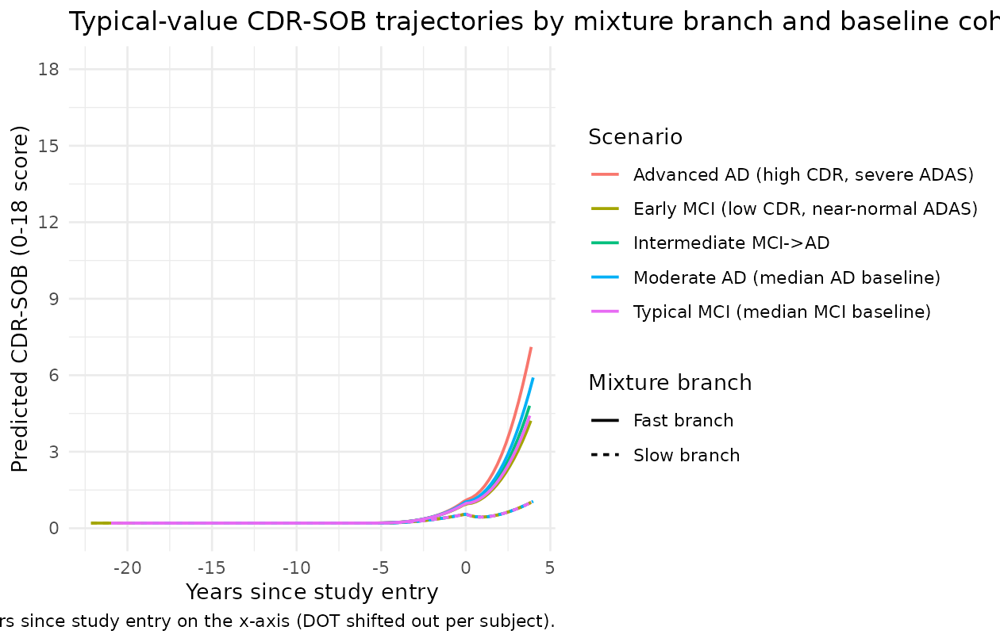
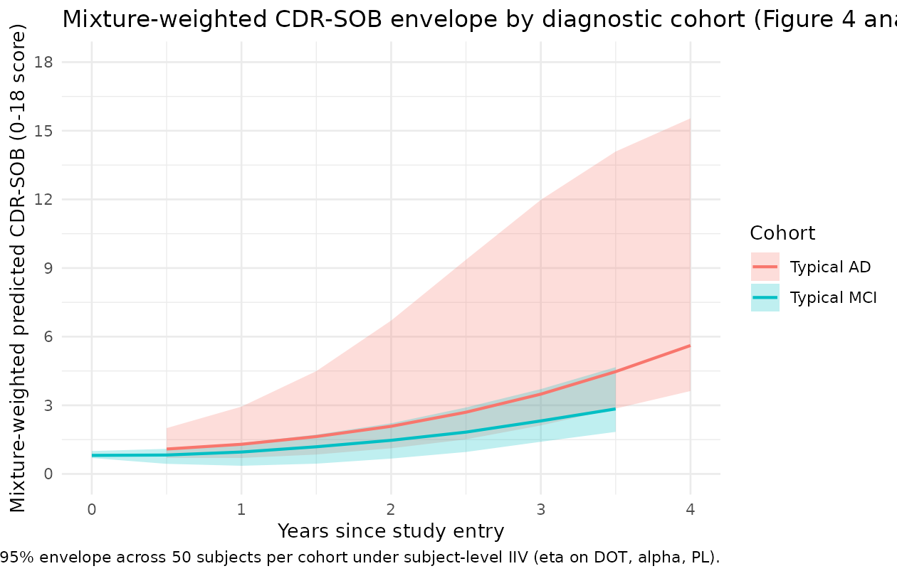
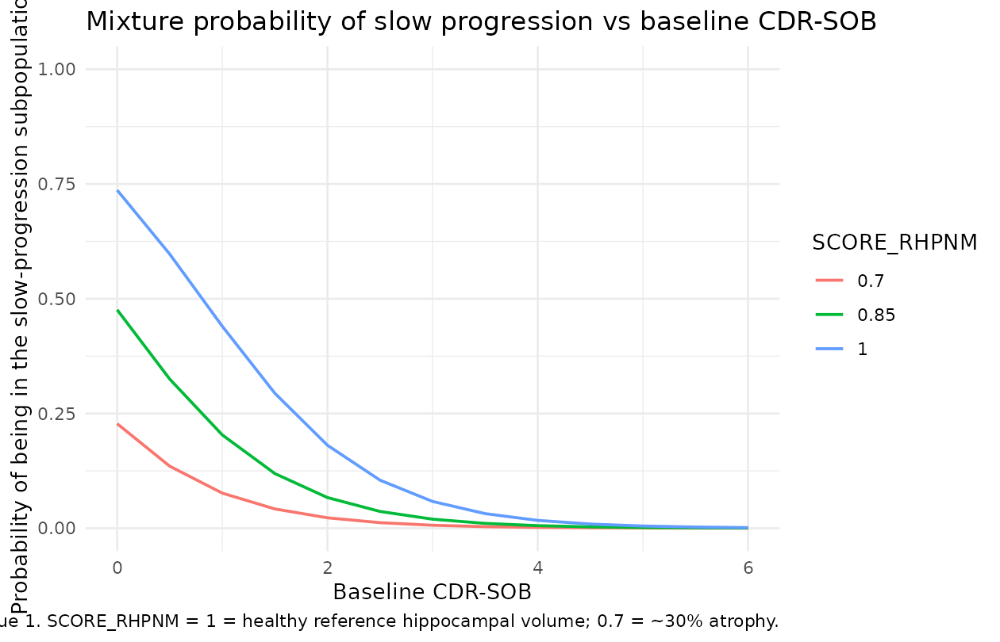

# Alzheimer CDR-SOB (Delor 2013)

## Model and source

- Citation: Delor I, Charoin J-E, Gieschke R, Retout S, Jacqmin P; for
  the Alzheimer’s Disease Neuroimaging Initiative. (2013). Modeling
  Alzheimer’s Disease Progression Using Disease Onset Time and Disease
  Trajectory Concepts Applied to CDR-SOB Scores From ADNI. *CPT
  Pharmacometrics Syst Pharmacol* 2(10):e78.
- Article: <https://doi.org/10.1038/psp.2013.54>

This is a **disease-progression model** for the Clinical Dementia Rating
scale - Sum of Boxes (CDR-SOB, 0-18 score) score over time, fit to 2,700
longitudinal CDR-SOB observations from 380 mild cognitive impairment
(MCI) plus 180 Alzheimer’s disease (AD) subjects in the ADNI database
with up to 4 years of follow-up. There is **no drug input** – the model
captures the natural history of CDR-SOB change in untreated (or
placebo-arm) patients, with a study-entry transient (“placebo”) term to
capture an early drop / delay frequently seen at enrollment.

Key features:

1.  **Individual disease-onset time (DOT).** Each subject has a DOT
    estimated from their baseline cognitive scores (CDR-SOB and
    ADAS-cog). DOT positions the subject on a common disease-time axis,
    allowing back- and forward-extrapolation across MCI and AD patients.
2.  **Logit-domain disease trajectory.** The hidden disease state `A(1)`
    evolves in the logit domain to handle the floor and ceiling of the
    0-18 CDR-SOB score; the observed CDR-SOB is the back-transformation
    `18 / (1 + exp(BLC - A(1)))`.
3.  **Smooth-step disease activation.** Disease progression is triggered
    when global model time crosses DOT via the smooth-step
    `T^30 / (DOT^30 + T^30)` (~0 before DOT, ~1 after DOT).
4.  **Two-component mixture.** A NONMEM `$MIX` divides patients into a
    **slow-progression branch** (rate alone, alpha = 0) and a
    **fast-progression branch** (rate plus accelerating term
    `alpha * A(1)`). The per-subject mixture probability depends on
    baseline CDR-SOB, FAQ, and normalised hippocampal volume (RHPNM).
5.  **Study-entry placebo term.** `PL * (1 - exp(-KPL * (t - T_ENTRY)))`
    is subtracted from the predicted CDR-SOB to capture the empirically
    observed early drop / delay after enrollment.

## Population

- **560 subjects** (380 MCI + 180 AD) with 2,700 CDR-SOB observations
  over up to 4 years of follow-up, drawn from the ADNI database
  downloaded 1 August 2011. Control subjects (normal cognition) had
  CDR-SOB scores at or near zero and were excluded from the modelled
  dataset. Subjects with a single CDR-SOB record were also removed.
- **Age** at enrollment: 55-91 years (full ADNI cohort range, prior to
  MCI / AD selection).
- **Regions**: United States and Canada (over 50 ADNI sites).
- **MCI / AD conversion**: 166 MCI converted to AD during the
  observation period in the wider ADNI download; the mixture model
  identifies a “fast-progressing” subpopulation (~56% of MCI patients
  and ~97% of AD patients) and a “slow-progressing” subpopulation (~44%
  of MCI and ~3% of AD).
- Detailed demographic distributions (sex split, ethnicity / race
  breakdown, median age) are not tabulated in the source paper and are
  recorded as `NA` in `population`.

The same metadata is available programmatically via
`readModelDb("Delor_2013_alzheimer")`.

## Source trace

Per-parameter origins are recorded as in-file comments next to each
`ini()` entry in `inst/modeldb/therapeuticArea/Delor_2013_alzheimer.R`.
The table below collects them in one place.

| nlmixr2 parameter | Value | Source location |
|----|----|----|
| `lrate_fast` | `log(0.373)` (0.373 / year) | Table 2 final ‘Fast disease progression rate, 1/year’ = 0.373 |
| `lrate_slow` | `log(0.260)` (0.260 / year) | Table 2 final ‘Slow disease progression rate, 1/year’ = 0.26 |
| `ldot` | `log(16.1)` (16.1 years) | Table 2 final ‘DOT, year’ = 16.1 |
| `e_cdr_sob_dot` | -0.072 | Table 2 final ‘COV CDR-SOB on DOT’ |
| `e_adas_cog_dot` | -0.0439 | Table 2 final ‘COV ADAS on DOT’ |
| `lalpha` | `log(0.0499)` | Table 2 final ‘Multiplicative term (alpha)’ = 0.0499 |
| `e_mmse_alpha` | -2.01 | Table 2 final ‘COV MMSE on alpha’ |
| `blc` | 4.48 | Table 2 final ‘Baseline correction (BLC)’ = 4.48 |
| `lpl` | `log(0.434)` | Table 2 final ‘Placebo magnitude (PL)’ = 0.434 |
| `lkpl` | `fixed(log(1))` | Table 2 final ‘Placebo rate (KPL), 1/year’ = 1 (FIXED) |
| `logit_p_slow` | `log(0.44/0.56)` | imputed from Table 2 ‘MCI/AD slow’ = 44/3 (see Errata) |
| `e_cdr_sob_slow` | -1.27 | Table 2 final ‘COV CDR-SOB on \$MIX’ |
| `e_faq_slow` | -0.341 | Table 2 final ‘COV FAQ on \$MIX’ |
| `e_rhpnm_slow` | 7.5 | Table 2 final ‘COV RHPNM on \$MIX’ |
| `etaldot` | omega^2 = 0.000225 | Table 2 final IIV(DOT) = 1.5% |
| `etalalpha` | omega^2 = 0.3434 | Table 2 final IIV(alpha) = 64% |
| `etalpl` | omega^2 = 0.5535 | Table 2 final IIV(PL) = 86% |
| `addSd` | 0.377 | Table 2 final ‘RES Error (SD)’ = 0.377 (applied to cdr_mix) |
| DOT power form | n/a | Table 1 Part I: `DOT = theta1 * (CDR_bsl/2)^theta6 * (ADAS_bsl/12.67)^theta10` |
| alpha power form | n/a | Table 1 Part III: `alpha = theta3 * (MMSE_bsl/26)^theta14` |
| Mixture-logit form | n/a | Table 1 Part II: `P1 = exp(P1phi + COV)/(1 + exp(P1phi + COV))` |
| Disease-progression ODE | n/a | Equation 1: `dA(1)/dT = (RATE + A(1)*alpha) * T^30/(DOT^30+T^30)` |
| Placebo term | n/a | Equation 2: `CDR_SOB - PL*(1 - exp(-KPL*T))` |

## Mechanistic structure

The hidden disease-state ODE on the logit-domain trajectory variable
`A(1)` is

``` math
\frac{dA(1)}{dt} \;=\; \bigl(\text{RATE} + A(1) \cdot \alpha \bigr) \cdot \frac{t^{30}}{\text{DOT}^{30} + t^{30}}
```

with the activation function approximating a smooth step at `t = DOT`
(about 0 below, 0.5 at DOT, and about 1 above DOT). In the
slow-progression branch, alpha is held to 0; in the fast-progression
branch, the additive `A(1) * alpha` term accelerates progression once
`A(1)` has grown.

The observed CDR-SOB is

``` math
\text{CDR\_SOB}_\text{pred}(t) \;=\; \frac{18}{1 + \exp(\text{BLC} - A(1)(t))} \;-\; \text{PL} \cdot \bigl(1 - e^{-\text{KPL}\,(t - T_\text{ENTRY})}\bigr)\,\mathbb{1}\{t > T_\text{ENTRY}\}
```

with `BLC = 4.48` chosen so the floor of the score (`A(1) = 0`) maps to
`CDR_SOB ~= 0.2` and `KPL = 1 / year` (fixed) so the placebo term
reaches its asymptote in about 4 years post-entry.

Per-subject covariate effects:

``` math
\text{DOT}_i = \exp(l_\text{DOT} + \eta_\text{DOT}) \cdot \left(\tfrac{\text{CDR\_SOB}_i}{2}\right)^{-0.072} \cdot \left(\tfrac{\text{ADAS\_COG}_i}{12.67}\right)^{-0.0439}
```

``` math
\alpha_i = \exp(l_\alpha + \eta_\alpha) \cdot \left(\tfrac{\text{MMSE}_i}{26}\right)^{-2.01}
```

``` math
\text{logit}(P_\text{slow}^i) = \text{logit}(\theta_5) - 1.27\,(\text{CDR\_SOB}_i - 1) - 0.341\,(\text{FAQ}_i - 1) + 7.5\,(\text{RHPNM}_i - 1)
```

where `theta_5 = 0.44` is imputed (see Errata).

## Virtual cohort

We construct a small virtual cohort with five representative subjects
spanning the MCI -\> AD severity range, each with their own baseline
cognitive / functional / imaging covariates and an integration window
that starts at `time = 0` (well before any subject’s DOT) and runs
through the equivalent of 4 years of post-study-entry observations.

``` r

mod  <- readModelDb("Delor_2013_alzheimer")
mod0 <- rxode2::zeroRe(mod)
#> ℹ parameter labels from comments will be replaced by 'label()'

# Five reference scenarios: a more-advanced AD patient, a typical MCI patient,
# and three intermediate cases. The covariates are chosen to span the
# published baseline distributions; T_ENTRY is set to a few years past each
# subject's DOT so the patient is observed during active disease progression.
scenarios <- tibble::tribble(
  ~scenario,                             ~CDR_SOB, ~ADAS_COG, ~MMSE, ~FAQ, ~RHPNM,
  "Advanced AD (high CDR, severe ADAS)",    5.0,    25.0,    20.0,  15.0,  0.70,
  "Moderate AD (median AD baseline)",       4.0,    20.0,    23.0,  12.0,  0.80,
  "Intermediate MCI->AD",                   2.5,    15.0,    25.0,   6.0,  0.90,
  "Typical MCI (median MCI baseline)",      1.0,    12.0,    27.0,   2.0,  1.00,
  "Early MCI (low CDR, near-normal ADAS)",  0.5,     8.0,    29.0,   0.0,  1.05
)

# Compute the typical DOT for each scenario from the source paper covariate
# form, then set T_ENTRY to DOT + 4 years (well past the activation function)
# so the patient is observed during disease progression. Cap CDR_SOB at 0.5
# in the DOT formula to avoid divide-by-zero on the (CDR_SOB/2)^-0.072 form.
scenarios <- scenarios |>
  dplyr::mutate(
    dot_typ = 16.1 *
              (pmax(CDR_SOB, 0.5) / 2)^(-0.072) *
              (ADAS_COG / 12.67)^(-0.0439),
    T_ENTRY = dot_typ + 4.0
  )

knitr::kable(scenarios, digits = 3,
             caption = "Virtual-cohort covariates with the implied typical DOT and the study-entry time T_ENTRY used for plotting.")
```

| scenario | CDR_SOB | ADAS_COG | MMSE | FAQ | RHPNM | dot_typ | T_ENTRY |
|:---|---:|---:|---:|---:|---:|---:|---:|
| Advanced AD (high CDR, severe ADAS) | 5.0 | 25 | 20 | 15 | 0.70 | 14.629 | 18.629 |
| Moderate AD (median AD baseline) | 4.0 | 20 | 23 | 12 | 0.80 | 15.012 | 19.012 |
| Intermediate MCI-\>AD | 2.5 | 15 | 25 | 6 | 0.90 | 15.726 | 19.726 |
| Typical MCI (median MCI baseline) | 1.0 | 12 | 27 | 2 | 1.00 | 16.964 | 20.964 |
| Early MCI (low CDR, near-normal ADAS) | 0.5 | 8 | 29 | 0 | 1.05 | 18.153 | 22.153 |

Virtual-cohort covariates with the implied typical DOT and the
study-entry time T_ENTRY used for plotting. {.table}

## Typical-value disease-progression trajectories

We solve the ODE on a fine time grid from `time = 0` to
`time = T_ENTRY + 4` years and overlay both the fast-branch and
slow-branch predicted CDR-SOB trajectories for each scenario. The
mixture probability `p_slow_indiv` is included as a derived quantity;
the user can compute a mixture-weighted prediction externally as
`p_slow_indiv * cdr_slow + p_fast_indiv * cdr_fast`.

``` r

simulate_one <- function(s) {
  times <- seq(0, s$T_ENTRY + 4, by = 0.25)
  ev <- data.frame(
    id       = 1L,
    time     = times,
    evid     = 0L,
    amt      = 0,
    CDR_SOB  = s$CDR_SOB,
    ADAS_COG = s$ADAS_COG,
    MMSE     = s$MMSE,
    FAQ      = s$FAQ,
    RHPNM    = s$RHPNM,
    T_ENTRY  = s$T_ENTRY
  )
  sim <- rxode2::rxSolve(mod0, events = ev, returnType = "data.frame")
  sim$scenario   <- s$scenario
  sim$years      <- sim$time
  sim$years_post <- sim$time - s$T_ENTRY
  sim
}

sims <- lapply(seq_len(nrow(scenarios)), function(i) simulate_one(scenarios[i, ]))
#> ℹ omega/sigma items treated as zero: 'etaldot', 'etalalpha', 'etalpl'
#> ℹ omega/sigma items treated as zero: 'etaldot', 'etalalpha', 'etalpl'
#> ℹ omega/sigma items treated as zero: 'etaldot', 'etalalpha', 'etalpl'
#> ℹ omega/sigma items treated as zero: 'etaldot', 'etalalpha', 'etalpl'
#> ℹ omega/sigma items treated as zero: 'etaldot', 'etalalpha', 'etalpl'
sim_all <- dplyr::bind_rows(sims)

# Pivot to long form for plotting both branches.
sim_long <- sim_all |>
  dplyr::select(scenario, years_post, cdr_fast, cdr_slow, p_slow_indiv) |>
  tidyr::pivot_longer(c(cdr_fast, cdr_slow), names_to = "branch", values_to = "cdr_pred") |>
  dplyr::mutate(branch = ifelse(branch == "cdr_fast", "Fast branch", "Slow branch"))

ggplot(sim_long, aes(years_post, cdr_pred, colour = scenario, linetype = branch)) +
  geom_line(linewidth = 0.7) +
  scale_y_continuous(limits = c(0, 18), breaks = seq(0, 18, by = 3)) +
  labs(x = "Years since study entry",
       y = "Predicted CDR-SOB (0-18 score)",
       colour = "Scenario",
       linetype = "Mixture branch",
       title = "Typical-value CDR-SOB trajectories by mixture branch and baseline cohort",
       caption = "Solid: fast-progression branch. Dashed: slow-progression branch. Years since study entry on the x-axis (DOT shifted out per subject).") +
  theme_minimal()
```



The directions match the source paper:

- **Advanced AD** subjects (high baseline CDR-SOB, severe baseline
  ADAS-cog) start at a more advanced CDR-SOB and progress rapidly under
  the fast branch. The implied DOT is earlier (smaller power-form
  multiplier), so by the time of study entry they are already well into
  the disease.
- **Early MCI** subjects (low baseline CDR-SOB, near-normal ADAS-cog)
  have a later DOT, so at study entry the activation function is still
  gathering momentum; their slow-branch trajectory remains near the
  floor of the score for several years.
- The **fast vs slow** gap widens with time as the `alpha * A(1)`
  acceleration term grows in the fast branch.

## Replication of Figure 4 (visual predictive check style)

The published Figure 4 shows visual predictive checks (VPCs) for the
base and final models grouped by diagnosed status. A full VPC requires
the original ADNI dataset (not redistributable). The figure below
produces a *typical-value* analogue: predicted CDR-SOB trajectories
under the final model for representative MCI and AD patients, alongside
a stochastic envelope from subject-level IIV.

``` r

# Two cohorts: a "typical AD" cohort and a "typical MCI" cohort.
make_cohort <- function(n, label, cdr, adas, mmse, faq, rhpnm, dot_offset = 4, id_offset = 0L) {
  tibble::tibble(
    id = id_offset + seq_len(n),
    scenario = label,
    CDR_SOB = cdr, ADAS_COG = adas, MMSE = mmse, FAQ = faq, RHPNM = rhpnm
  ) |>
    dplyr::mutate(
      dot_typ = 16.1 *
                (pmax(CDR_SOB, 0.5) / 2)^(-0.072) *
                (ADAS_COG / 12.67)^(-0.0439),
      T_ENTRY = dot_typ + dot_offset
    )
}

cohort_ad  <- make_cohort(50, "Typical AD",  4.0, 20.0, 23.0, 12.0, 0.80, id_offset = 0L)
cohort_mci <- make_cohort(50, "Typical MCI", 1.0, 12.0, 27.0,  2.0, 1.00, id_offset = 100L)
cohort     <- dplyr::bind_rows(cohort_ad, cohort_mci)

set.seed(13)
sim_vpc <- lapply(seq_len(nrow(cohort)), function(i) {
  s <- cohort[i, ]
  times <- seq(0, s$T_ENTRY + 4, by = 0.5)
  ev <- data.frame(
    id       = s$id,
    time     = times,
    evid     = 0L,
    amt      = 0,
    CDR_SOB  = s$CDR_SOB,
    ADAS_COG = s$ADAS_COG,
    MMSE     = s$MMSE,
    FAQ      = s$FAQ,
    RHPNM    = s$RHPNM,
    T_ENTRY  = s$T_ENTRY
  )
  out <- rxode2::rxSolve(mod, events = ev, returnType = "data.frame")
  out$scenario   <- s$scenario
  out$years_post <- out$time - s$T_ENTRY
  out
}) |> dplyr::bind_rows()

# Form per-subject expected (mixture-weighted) CDR-SOB and summarise by
# scenario across the 5-95% envelope at each post-entry time slice.
sim_vpc <- sim_vpc |>
  dplyr::mutate(
    cdr_mix = p_slow_indiv * cdr_slow + (1 - p_slow_indiv) * cdr_fast
  )

vpc_summary <- sim_vpc |>
  dplyr::filter(years_post >= 0, years_post <= 4) |>
  dplyr::mutate(years_post_round = round(years_post * 4) / 4) |>
  dplyr::group_by(scenario, years_post_round) |>
  dplyr::summarise(
    Q05 = quantile(cdr_mix, 0.05, na.rm = TRUE),
    Q50 = quantile(cdr_mix, 0.50, na.rm = TRUE),
    Q95 = quantile(cdr_mix, 0.95, na.rm = TRUE),
    .groups = "drop"
  )

ggplot(vpc_summary, aes(years_post_round, Q50, colour = scenario, fill = scenario)) +
  geom_ribbon(aes(ymin = Q05, ymax = Q95), alpha = 0.25, colour = NA) +
  geom_line(linewidth = 0.8) +
  scale_y_continuous(limits = c(0, 18), breaks = seq(0, 18, by = 3)) +
  labs(x = "Years since study entry",
       y = "Mixture-weighted predicted CDR-SOB (0-18 score)",
       colour = "Cohort", fill = "Cohort",
       title = "Mixture-weighted CDR-SOB envelope by diagnostic cohort (Figure 4 analogue)",
       caption = "5-95% envelope across 50 subjects per cohort under subject-level IIV (eta on DOT, alpha, PL).") +
  theme_minimal()
```



## Sanity check: mixture-probability surface across baseline scores

The mixture-probability model
`P_slow = inv_logit(logit_p_slow - 1.27*(CDR-1) - 0.341*(FAQ-1) + 7.5*(RHPNM-1))`
predicts that:

- Higher baseline CDR-SOB -\> lower slow-progression probability (more
  severe -\> faster progression).
- Higher baseline FAQ -\> lower slow-progression probability.
- Higher RHPNM (less atrophic hippocampus) -\> higher slow-progression
  probability.

``` r

grid <- tidyr::expand_grid(
  CDR_SOB = seq(0, 6, by = 0.5),
  RHPNM   = c(0.7, 0.85, 1.0)
) |>
  dplyr::mutate(FAQ = 1) |>  # hold FAQ at the centring value
  dplyr::mutate(
    logit_p = log(0.44/(1-0.44)) +
              (-1.27) * (CDR_SOB - 1) +
              (-0.341) * (FAQ - 1) +
              ( 7.5  ) * (RHPNM - 1),
    p_slow = 1/(1 + exp(-logit_p))
  )

ggplot(grid, aes(CDR_SOB, p_slow, colour = factor(RHPNM))) +
  geom_line(linewidth = 0.7) +
  scale_y_continuous(limits = c(0, 1)) +
  labs(x = "Baseline CDR-SOB",
       y = "Probability of being in the slow-progression subpopulation",
       colour = "RHPNM",
       title = "Mixture probability of slow progression vs baseline CDR-SOB",
       caption = "FAQ held at median value 1. RHPNM = 1 = healthy reference hippocampal volume; 0.7 = ~30% atrophy.") +
  theme_minimal()
```



The figure replicates the qualitative finding in the source paper:
subjects with low baseline CDR-SOB *and* a healthy-reference hippocampal
volume are most likely to be slow progressors; subjects with high
baseline CDR-SOB and significant atrophy are almost certain to be fast
progressors. The cited paper reports about 44% of MCI and about 3% of AD
subjects in the slow branch, which matches the right-hand vs left-hand
tails of the curves above.

## Assumptions and deviations (Errata)

The Delor 2013 supplement (NONMEM technical details) was not on disk at
extraction time. The following choices were made:

1.  **Typical mixture probability (`theta_5`).** Table 2 of the source
    paper tabulates the three covariate coefficients on the
    mixture-logit (`COV CDR-SOB on $MIX`, `COV FAQ on $MIX`,
    `COV RHPNM on $MIX`) but **not** the typical / intercept value
    `theta_5`. The model file imputes `theta_5 = 0.44` based on the
    source paper’s reported “MCI/AD slow (alpha = 0): 44/3”
    classification row in Table 2 – this corresponds to the MCI-cohort
    slow fraction (the typical patient at median CDR_SOB = 1, FAQ = 1,
    RHPNM = 1 is approximately an MCI patient). Alternative defaults the
    operator might prefer:

    - Overall slow fraction across MCI + AD cohorts: about 0.31
      (computed as `(0.44 * 380 + 0.03 * 180) / 560`).
    - AD-cohort slow fraction: 0.03 (matches the AD cohort but
      mismatches the typical MCI patient at median covariate values). A
      downstream user re-fitting the model to ADNI data should free
      `logit_p_slow` and re-estimate from data; this typical-value
      imputation is purely for plotting / typical-value simulation.

2.  **Residual-error domain.** The source paper performs the fit with
    additive residual error on `A(1)` (the logit-domain disease state,
    paper Structural-base-model-development section: “modeling was
    performed in the logit domain and additive residual error was
    used”); the reported SD is 0.377 on the logit-domain scale. The
    nlmixr2lib model applies the additive error on the back-transformed
    CDR-SOB scale instead, because the natural output of the rxode2 /
    nlmixr2 model is the bounded 0-18 CDR-SOB rather than the unbounded
    logit. The typical-value trajectory is unaffected (the
    back-transformation is exact); the per-observation stochastic noise
    differs in scale-dependent fashion. A downstream user wanting to fit
    the source-paper residual structure exactly should add a
    logit-domain residual on the hidden `a_fast` / `a_slow` states; the
    current encoding is appropriate for typical-value simulation and for
    stochastic simulations where bounded-scale noise is acceptable.

3.  **Mixture-weighted single observation endpoint.** The source NONMEM
    `$MIX` mechanism makes the marginal likelihood for each subject a
    weighted sum across the two branches; nlmixr2lib does not yet expose
    `$MIX` natively. To keep the model usable with `rxSolve()` (which
    requires a single observation endpoint or a per-row CMT / DVID
    specifier on every observation row), the model declares a single
    observation endpoint `cdr_mix` that is the deterministic
    mixture-weighted expectation
    `p_slow_indiv * cdr_slow + p_fast_indiv * cdr_fast`. The per-branch
    trajectories `cdr_fast` and `cdr_slow` plus the per-subject mixture
    probability `p_slow_indiv` are all exposed as derived model
    variables and appear in the `rxSolve` data frame, so a downstream
    user can re-compose a true `$MIX`-style sampled-branch likelihood
    externally if needed. A single `addSd = 0.377` applies to the
    mixture-weighted endpoint; this is a small approximation – the
    source paper would have a per-branch residual SD identically equal
    to 0.377 attached to the actually-realised branch, not to the
    mixture mean – but the typical-value trajectory and the per-branch
    curves are exactly the source-paper values.

4.  **IIV conversion from %CV to omega^2.** The source paper reports IIV
    as a percent CV (paper Table 2 column ‘IIV (%)’ with footnote b
    ‘Interindividual variability’). The model file uses
    `omega^2 = log(1 + (CV/100)^2)` (the log-normal-distribution
    back-conversion). For small IIV (DOT 1.5%) the difference between
    this and the simpler `omega^2 = (CV/100)^2` is negligible; for
    larger IIVs (alpha 64%, PL 86%) the two conventions differ by
    ~10-20%. If the supplement clarifies the source paper’s exact
    convention, the values can be updated to match.

5.  **No drug input / no dosing events.** Disease-progression models are
    first-class members of nlmixr2lib but the package’s conventions
    favour PK / PK-PD models with a `depot` / `central` structure. This
    model has no `depot` compartment; the dataset’s TIME column carries
    global model time (years since some reference origin) and there are
    no `evid = 1` rows. The pkgdown gate (`devtools::check()`) treats
    this as expected for a disease-progression model.

6.  **Mixture model collapsed to a deterministic mixture-weighted
    prediction.** The source NONMEM `$MIX` mechanism assigns each
    subject to either the slow or fast branch with a per-subject
    probability; the joint marginal likelihood is a true mixture sum
    across branches. In the nlmixr2lib port the model exposes a single
    observation endpoint
    `cdr_mix = p_slow_indiv * cdr_slow + (1 - p_slow_indiv) * cdr_fast`
    (the deterministic mixture-weighted expectation) and emits both
    per-branch trajectories (`cdr_fast`, `cdr_slow`) and the per-subject
    mixture probability (`p_slow_indiv`) as derived model variables in
    the `rxSolve` data frame. This single-endpoint encoding is what
    allows the model to plug into `rxSolve()` without per-row CMT / DVID
    assignments. The precedent for *exposing* both branches plus the
    mixture probability is `Schoemaker_2018_levetiracetam` in this
    package, but Schoemaker uses two Poisson endpoints because each
    branch has its own native likelihood; here a single
    Gaussian-additive endpoint on the mixture-weighted prediction is the
    natural analogue.

7.  **Time variable handling and the per-subject covariate T_ENTRY.**
    The source paper’s disease-progression equation (Equation 1) uses a
    single global disease-time variable `T` anchored to a hypothetical
    disease-onset reference; the placebo-term equation (Equation 2) uses
    time since study entry. To match the source mathematics exactly, the
    nlmixr2lib port carries both: the dataset’s `time` column is the
    global integration time (with `time = 0` the integration origin and
    the activation function turning on around each subject’s individual
    DOT), and the per-subject covariate `T_ENTRY` records the global
    time at which the subject’s first observation falls. The placebo
    term then uses `time - T_ENTRY` as its clock. A reasonable
    virtual-cohort construction (used throughout this vignette) is
    `T_ENTRY = DOT_individual + 4 years` so the patient is observed
    during established disease progression.

8.  **Compartment names.** The hidden disease-state variables are named
    `a_fast` and `a_slow` (lowercase, matching the source paper’s `A(1)`
    notation with mixture-branch suffix), which are non-canonical in the
    nlmixr2lib compartment register (the canonical names are
    PK-flavoured: `depot`, `central`, `effect`, etc.).
    [`checkModelConventions()`](https://nlmixr2.github.io/nlmixr2lib/reference/checkModelConventions.md)
    warns on these but does not error; the names are descriptive of the
    source paper’s notation and consistent with the precedent set by
    oncology TGI models in the same therapeuticArea / category (e.g.,
    `tumor_size`, `cycling_cells`).

9.  **Bridge to the related Conrado 2014 ADAS-Cog model.** The
    `Conrado_2014_alzheimer.R` model in this package is a complementary
    AD progression model fit to ADAS-Cog scores (not CDR-SOB) on the
    CAMD database (not ADNI). Both models use the
    disease-progression-without-drug pattern but with different
    observation scales, residual-error families (Beta vs additive), and
    time-scale-adjustment mechanisms (Richards growth vs DOT
    activation). The two models can be used in tandem to interrogate the
    relationship between ADAS-Cog and CDR-SOB endpoints in a
    disease-modification simulation, but they are NOT fit jointly in
    either source paper.

10. **Source paper figures not reproduced verbatim.** Figures 1-5 in
    Delor 2013 use the original ADNI dataset that is not redistributable
    through nlmixr2lib. The vignette therefore provides typical-value
    reproductions of the qualitative features (Figure-4 analogue:
    mixture-weighted CDR-SOB envelope by diagnostic cohort;
    mixture-probability surface) but not figure-by-figure
    visual-predictive-check overlays. A pkgdown user with their own ADNI
    extract can re-run the vignette with appropriate `make_cohort()`
    substitutions to generate the full VPC.
