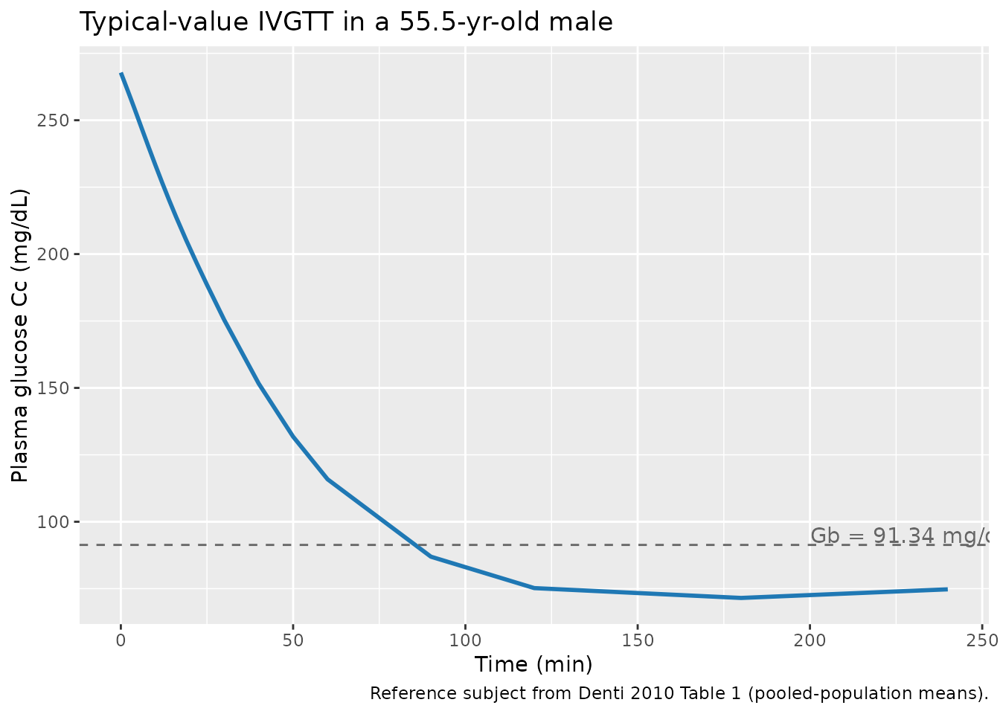
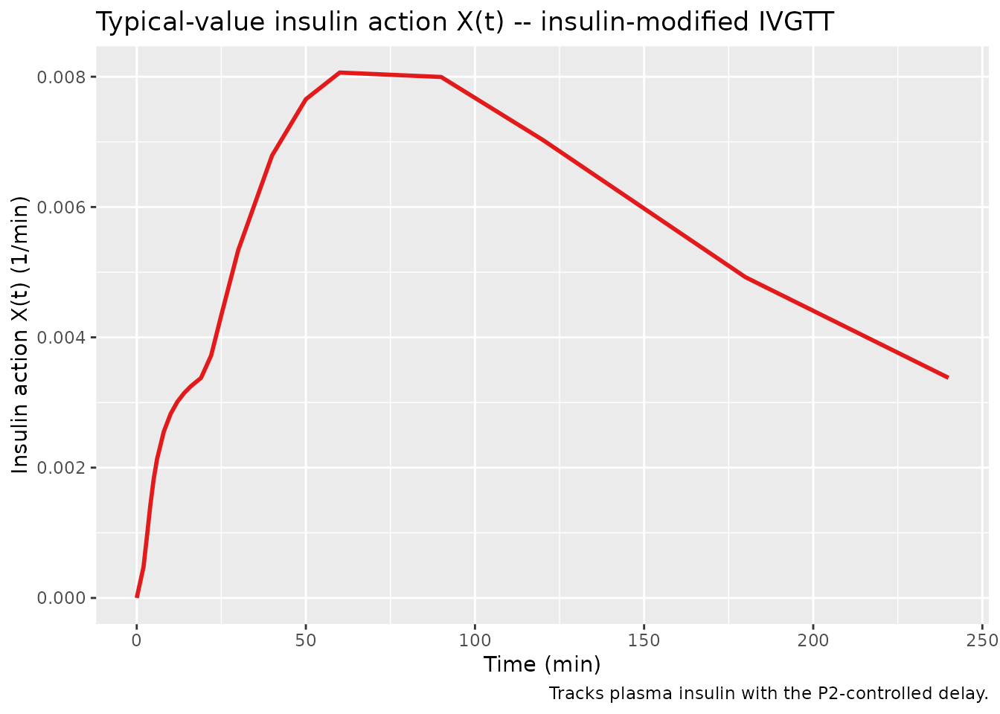
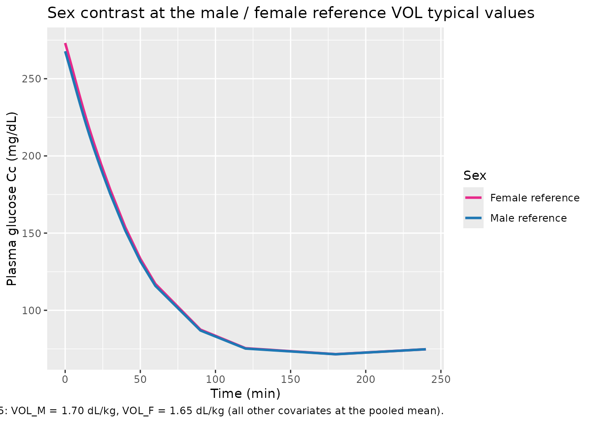
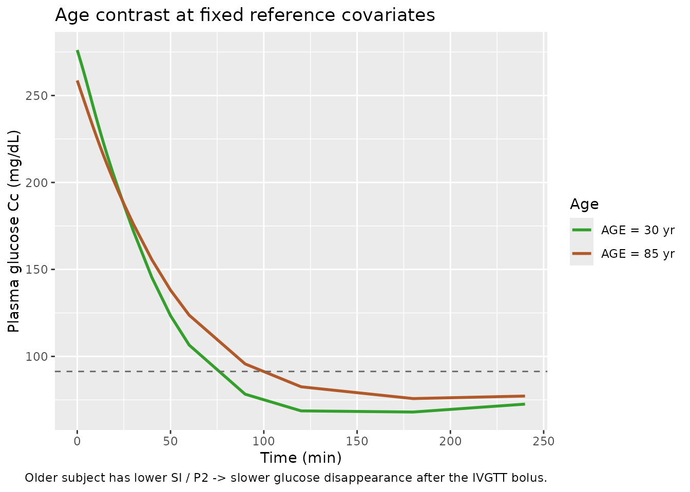
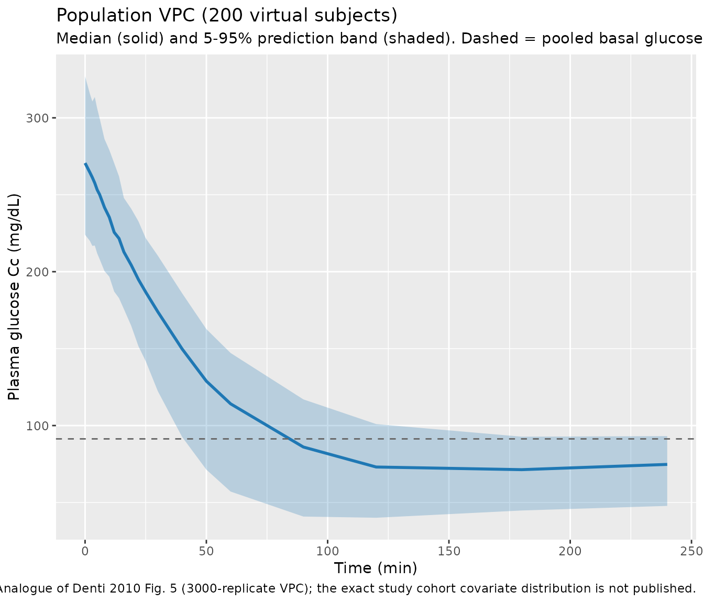

# Glucose minimal model (Denti 2010)

## Model and source

- Citation: Denti P, Bertoldo A, Vicini P, Cobelli C. IVGTT glucose
  minimal model covariate selection by nonlinear mixed-effects approach.
  *Am J Physiol Endocrinol Metab.* 2010;298(5):E950-E960.
- Article: <https://doi.org/10.1152/ajpendo.00656.2009>

This is a population non-linear mixed-effects implementation of the
Bergman glucose minimal model (Bergman 1979; Pacini 1986) fitted to
insulin-modified intravenous-glucose-tolerance-test (IVGTT) data from
204 healthy adults aged 18-87 years. The structural model has two
ordinary differential equations:

- `d(G)/dt = -(SG + X) * G + SG * Gb` – plasma glucose dynamics. The
  basal-glucose self-regulation arm `SG * Gb` holds plasma glucose at
  its basal value `Gb` when insulin action `X` is zero.
- `d(X)/dt = -P2 * X + P2 * SI * (I - Ib)` – insulin-action dynamics.
  `X(t)` is a paper-mechanistic state that lags plasma insulin and
  drives the dynamic, insulin-dependent glucose clearance.

with four estimated parameters:

- `SG` – glucose effectiveness (1 / min); insulin-independent
  disappearance rate.
- `SI` – insulin sensitivity (L / (min \* pmol)); fractional increase in
  glucose clearance per unit increase in plasma insulin above basal.
- `P2` – insulin-action rate constant (1 / min); first-order
  equilibration of `X` toward its insulin-driven steady state.
- `VOL` – apparent glucose distribution volume per kg body mass (dL /
  kg).

Plasma insulin `I(t)` is supplied as a known, error-free forcing
function (`linear(INS)` regressor); the minimal model does not estimate
insulin kinetics. The IVGTT bolus is administered to the central glucose
compartment at `t = 0`.

The novelty of Denti 2010 is the **integration of demographic and
body-composition covariates directly into the population NLME estimation
step**, rather than as a post-hoc regression on individual
empirical-Bayes estimates. The final covariate model retains:

- On `VOL`: sex (two typical values, male reference and female), age,
  percent total body fat (DEXA), and basal plasma glucose.
- On `SI`: age, visceral abdominal fat (single-slice CT at L2 / L3), and
  basal plasma insulin.
- On `P2`: age and basal plasma insulin.
- On `SG`: no covariates retained (the screened covariates produced an
  `R_a^2` \< 0.04 and were collinear; Discussion p. E956).

The package model file is
`inst/modeldb/endogenous/Denti_2010_glucoseMinimal.R`.

## Population

204 healthy adults (no diagnosis of glucose-metabolic disorders),
recruited at the Mayo Clinic and previously published in Basu et
al. (2003, *J Clin Endocrinol Metab* 88:6068) and Basu et al. (2006,
*Diabetes* 55:2001). Mean age 56 years (range 18-87), mean BMI 27 kg/m^2
(range 20-35), mean weight 77.94 kg (range 53-127). Body composition was
assayed by dual-energy X-ray absorptiometry (DEXA) and single-slice
computed tomography at the L2 / L3 vertebral level. Each subject
underwent an insulin-modified IVGTT: a 0.30 g/kg glucose bolus at
`t = 0` followed by a 5-minute insulin infusion starting at `t = 20` min
(Steil 1993 / Basu 2003 protocol), with 21 plasma samples over 240 min.

The reference subject for covariate centering uses the pooled-population
means from Table 1: AGE 55.53 years, BODYFAT_PCT 32.39 %, FPG 91.34
mg/dL, VISCERAL_ABDOMINAL_FAT 141.8 cm^2 / CT slice, INS_BL 26.98
pmol/L. The same metadata is available programmatically via
`readModelDb("Denti_2010_glucoseMinimal")` after the model is loaded
(return value is a function; inspect
[`body()`](https://rdrr.io/r/base/body.html) for the `population`
block).

## Source trace

The per-parameter origin is recorded as an in-file comment next to each
`ini()` entry in `inst/modeldb/endogenous/Denti_2010_glucoseMinimal.R`.
The table below collects them in one place for review.

| Equation / parameter | Value | Source location |
|----|----|----|
| Glucose ODE (Eq. 1) | n/a (structural) | Denti 2010, Methods p. E951 |
| Insulin-action ODE (Eq. 2) | n/a (structural) | Denti 2010, Methods p. E951 |
| Initial condition G(0) | `FPG + dose / vd` | Denti 2010, Methods p. E951 |
| Initial condition X(0) | 0 | Denti 2010, Methods p. E951 |
| Combined residual error | proportional + additive | Denti 2010, Methods p. E952 |
| `lvd` (male reference) | log(1.70 dL/kg) | Denti 2010, Table 5 covariate-model column (theta_VOL_MALE) |
| `e_sexf_vd` | log(1.65 / 1.70) | Denti 2010, Table 5 (theta_VOL_FEMALE = 1.65 dL/kg) |
| `lsg` | log(0.0192 1/min) | Denti 2010, Table 5 (theta_SG) |
| `lsi` | log(5.83e-5 L/(min\*pmol)) | Denti 2010, Table 5 (theta_SI) |
| `lp2` | log(0.0254 1/min) | Denti 2010, Table 5 (theta_P2) |
| `e_age_vd` | 0.00181 | Denti 2010, Table 5 (theta_VOL~AGE) |
| `e_bodyfat_vd` | -0.0101 | Denti 2010, Table 5 (theta_VOL~%TBF) |
| `e_fpg_vd` | -0.00312 | Denti 2010, Table 5 (theta_VOL~GBSL; sign confirmed by bootstrap CI -0.00484 to -0.00153) |
| `e_age_si` | -0.00810 | Denti 2010, Table 5 (theta_SI~AGE) |
| `e_vaf_si` | -0.00208 | Denti 2010, Table 5 (theta_SI~VAF) |
| `e_insbl_si` | -0.0282 | Denti 2010, Table 5 (theta_SI~IBSL) |
| `e_age_p2` | -0.0110 | Denti 2010, Table 5 (theta_P2~AGE) |
| `e_insbl_p2` | -0.0150 | Denti 2010, Table 5 (theta_P2~IBSL) |
| `omega_SG` -\> `var_sg` | 21.0 % CV -\> 0.04313 | Denti 2010, Table 5 (omega_SG) |
| `omega_VOL` -\> `var_vd` | 10.4 % CV -\> 0.01075 | Denti 2010, Table 5 (omega_VOL) |
| `omega_SI` -\> `var_si` | 47.5 % CV -\> 0.20337 | Denti 2010, Table 5 (omega_SI) |
| `omega_P2` -\> `var_p2` | 37.9 % CV -\> 0.13399 | Denti 2010, Table 5 (omega_P2) |
| `rho_SG_VOL` | -0.779 -\> cov -0.01666 | Denti 2010, Table 5 (off-diagonal in covariance matrix) |
| `rho_SI_P2` | 0.876 -\> cov 0.14458 | Denti 2010, Table 5 (off-diagonal in covariance matrix) |
| `propSd` | 0.0227 (2.27 %) | Denti 2010, Table 5 (sigma_prop) |
| `addSd` | 4.28 mg/dL | Denti 2010, Table 5 (sigma_add) |

### Units of every term in every ODE

Dimensional analysis verifies that every term in `d/dt(central)` and
`d/dt(insulin_action)` is internally consistent. The state `central`
carries glucose mass per body weight (mg / kg); the state
`insulin_action` carries `X(t)` in 1 / min.

| Term | Units | Calculation |
|----|----|----|
| `sg * FPG * vd` | mg / (kg \* min) | (1/min) \* (mg/dL) \* (dL/kg) = mg / (kg \* min) – steady-state production rate |
| `(sg + insulin_action) * central` | mg / (kg \* min) | (1/min) \* (mg/kg) = mg / (kg \* min) – net first-order disappearance |
| **d/dt(central)** sum | **mg / (kg \* min)** | matches state units mg/kg / time units min -\> consistent |
| `p2 * insulin_action` | 1 / min^2 | (1/min) \* (1/min) = 1/min^2 – equilibration loss |
| `p2 * si * (INS - INS_BL)` | 1 / min^2 | (1/min) \* (L/(min*pmol))* (pmol/L) = 1/min^2 – insulin-driven input |
| **d/dt(insulin_action)** sum | **1 / min^2** | matches state units (1/min) / time units min -\> consistent |
| `Cc = central / vd` | mg / dL | (mg/kg) / (dL/kg) = mg/dL – plasma glucose concentration |

The model is self-contained per kg body weight, so users do not need to
supply a body-weight column. A typical IVGTT bolus of
`0.30 g/kg = 300 mg/kg` is administered as `amt = 300, cmt = "central"`
regardless of subject weight; the resulting glucose-concentration
trajectory `Cc(t)` is in mg/dL.

## Virtual cohort

Helper to build a single-subject IVGTT event table with a typical
insulin time course. The IVGTT samples follow Denti 2010 Methods p. E951
(21 samples over 240 min); the insulin profile reproduces the classic
biphasic shape of an insulin-modified IVGTT in a healthy adult –
first-phase peak at 3-5 min, nadir before the 20-min insulin infusion,
second-phase peak at 22-25 min, and slow decline thereafter.

``` r

ivgtt_event_table <- function(id, AGE, SEXF, VISCERAL_ABDOMINAL_FAT, BODYFAT_PCT,
                              FPG, INS_BL, dose_mg_per_kg = 300,
                              tobs = c(0, 2, 3, 4, 5, 6, 8, 10, 12, 14, 16, 19,
                                       22, 25, 30, 40, 50, 60, 90, 120, 180, 240),
                              ins_typical = c(60, 320, 380, 360, 300, 240, 180, 150,
                                              130, 120, 115, 110, 220, 250, 240, 220,
                                              200, 180, 150, 120, 90, 70)) {
  stopifnot(length(tobs) == length(ins_typical))
  dose_row <- data.frame(
    id   = id,    time = 0,        evid = 1L, amt = dose_mg_per_kg,
    cmt  = "central", AGE = AGE, SEXF = SEXF,
    VISCERAL_ABDOMINAL_FAT = VISCERAL_ABDOMINAL_FAT,
    BODYFAT_PCT = BODYFAT_PCT, FPG = FPG, INS_BL = INS_BL,
    INS  = ins_typical[1]
  )
  obs_rows <- data.frame(
    id   = id,    time = tobs,    evid = 0L, amt = NA_real_,
    cmt  = NA_character_, AGE = AGE, SEXF = SEXF,
    VISCERAL_ABDOMINAL_FAT = VISCERAL_ABDOMINAL_FAT,
    BODYFAT_PCT = BODYFAT_PCT, FPG = FPG, INS_BL = INS_BL,
    INS  = ins_typical
  )
  rbind(dose_row, obs_rows)
}
```

``` r

mod <- readModelDb("Denti_2010_glucoseMinimal")
mod_typ <- rxode2::zeroRe(mod)
#> ℹ parameter labels from comments will be replaced by 'label()'
```

## Steady-state hold (no IVGTT bolus)

With no glucose bolus and constant basal insulin (INS held at INS_BL),
the model should hold plasma glucose at the basal value FPG
indefinitely. This verifies the steady-state baseline construction in
the ODE (`sg * FPG * vd` production exactly balancing `sg * central`
disappearance when `insulin_action = 0`).

``` r

ss_events <- data.frame(
  id   = 1L, time = seq(0, 240, by = 5), evid = 0L, amt = NA_real_,
  cmt  = NA_character_, AGE = 56, SEXF = 0,
  VISCERAL_ABDOMINAL_FAT = 141.8, BODYFAT_PCT = 32.39,
  FPG = 91.34, INS_BL = 26.98, INS = 26.98
)
ss_sim <- as.data.frame(rxode2::rxSolve(mod_typ, ss_events))
#> ℹ omega/sigma items treated as zero: 'etalsg', 'etalvd', 'etalsi', 'etalp2'
cat(sprintf("min Cc = %.4f mg/dL\nmax Cc = %.4f mg/dL\nFPG    = 91.34 mg/dL (target)\n",
            min(ss_sim$Cc), max(ss_sim$Cc)))
#> min Cc = 91.3400 mg/dL
#> max Cc = 91.3400 mg/dL
#> FPG    = 91.34 mg/dL (target)
stopifnot(abs(min(ss_sim$Cc) - 91.34) < 1e-3)
stopifnot(abs(max(ss_sim$Cc) - 91.34) < 1e-3)
```

The steady-state plasma glucose is held at FPG = 91.34 mg/dL to machine
precision over the 240-min window.

## Perturbation recovery (typical IVGTT)

A 300 mg/kg glucose bolus at `t = 0` should produce the expected
biphasic glucose trajectory: an instantaneous rise to
`FPG + dose / VOL`, an early insulin-independent decline driven by `SG`,
an insulin-action-driven acceleration as `X(t)` rises, and a return
toward baseline by 240 min. The reference identity is
`Cc(0+) = FPG + dose / vd = 91.34 + 300 / 1.70 = 267.8 mg/dL`.

``` r

events_typ <- ivgtt_event_table(
  id = 1L, AGE = 55.53, SEXF = 0,
  VISCERAL_ABDOMINAL_FAT = 141.8, BODYFAT_PCT = 32.39,
  FPG = 91.34, INS_BL = 26.98
)
sim_typ <- as.data.frame(rxode2::rxSolve(mod_typ, events_typ))
#> ℹ omega/sigma items treated as zero: 'etalsg', 'etalvd', 'etalsi', 'etalp2'
cat(sprintf("Cc(0+) simulated = %.2f mg/dL\nCc(0+) target    = %.2f mg/dL (= FPG + dose / VOL)\n",
            sim_typ$Cc[1], 91.34 + 300 / 1.70))
#> Cc(0+) simulated = 267.81 mg/dL
#> Cc(0+) target    = 267.81 mg/dL (= FPG + dose / VOL)
stopifnot(abs(sim_typ$Cc[1] - (91.34 + 300 / 1.70)) < 0.5)
```

``` r

ins_df <- data.frame(time = events_typ$time, INS = events_typ$INS)
ggplot(sim_typ, aes(time, Cc)) +
  geom_line(linewidth = 1.0, colour = "#1f78b4") +
  geom_hline(yintercept = 91.34, linetype = "dashed", colour = "grey40") +
  annotate("text", x = 200, y = 95, label = "Gb = 91.34 mg/dL", colour = "grey40", hjust = 0) +
  labs(x = "Time (min)", y = "Plasma glucose Cc (mg/dL)",
       title = "Typical-value IVGTT in a 55.5-yr-old male",
       caption = "Reference subject from Denti 2010 Table 1 (pooled-population means).")
```



The trajectory reproduces the published biphasic shape qualitatively:
rapid peak immediately post-bolus, decline through the first-phase
insulin response (~5-15 min), slight glucose-effectiveness-only decline
before the second-phase insulin rise at `t = 22-25` min, then
accelerated decline as insulin action `X(t)` builds up, ending near (and
slightly below) basal at 240 min. This mirrors the trajectory shown in
Denti 2010 Fig. 5 (VPC) and Fig. 6 (individual fits).

``` r

ggplot(sim_typ, aes(time, insulin_action)) +
  geom_line(linewidth = 1.0, colour = "#e31a1c") +
  labs(x = "Time (min)", y = "Insulin action X(t) (1/min)",
       title = "Typical-value insulin action X(t) -- insulin-modified IVGTT",
       caption = "Tracks plasma insulin with the P2-controlled delay.")
```



## Sex contrast (male vs female reference)

The Denti 2010 paper reports two typical glucose-distribution volumes –
1.70 dL/kg for males and 1.65 dL/kg for females – with all other
reference values held constant. Switching SEXF should produce a small
downward shift in `Cc(0+)` (because dose/vd is slightly larger for the
female reference, but only by 0.05 dL/kg, so the shift is modest).

``` r

events_m <- ivgtt_event_table(id = 1L, AGE = 55.53, SEXF = 0,
                              VISCERAL_ABDOMINAL_FAT = 141.8, BODYFAT_PCT = 32.39,
                              FPG = 91.34, INS_BL = 26.98)
events_f <- ivgtt_event_table(id = 2L, AGE = 55.53, SEXF = 1,
                              VISCERAL_ABDOMINAL_FAT = 141.8, BODYFAT_PCT = 32.39,
                              FPG = 91.34, INS_BL = 26.98)
sim_mf   <- as.data.frame(rxode2::rxSolve(mod_typ, rbind(events_m, events_f)))
#> ℹ omega/sigma items treated as zero: 'etalsg', 'etalvd', 'etalsi', 'etalp2'
#> Warning: multi-subject simulation without without 'omega'
sim_mf$Sex <- ifelse(sim_mf$id == 1, "Male reference", "Female reference")

ggplot(sim_mf, aes(time, Cc, colour = Sex)) +
  geom_line(linewidth = 1.0) +
  scale_colour_manual(values = c("Male reference" = "#1f78b4", "Female reference" = "#e7298a")) +
  labs(x = "Time (min)", y = "Plasma glucose Cc (mg/dL)",
       title = "Sex contrast at the male / female reference VOL typical values",
       caption = "Denti 2010 Table 5: VOL_M = 1.70 dL/kg, VOL_F = 1.65 dL/kg (all other covariates at the pooled mean).")
```



## Age contrast (younger vs older subject)

A 30-year-old subject (well below the population mean of 55.5 years)
versus an 85-year-old subject (well above) should differ primarily in
`SI` (age effect -0.81 % per year above mean) and `P2` (-1.10 % per year
above mean), giving the older subject a slower, less complete glucose
recovery.

``` r

events_young <- ivgtt_event_table(id = 1L, AGE = 30, SEXF = 0,
                                  VISCERAL_ABDOMINAL_FAT = 141.8, BODYFAT_PCT = 32.39,
                                  FPG = 91.34, INS_BL = 26.98)
events_old   <- ivgtt_event_table(id = 2L, AGE = 85, SEXF = 0,
                                  VISCERAL_ABDOMINAL_FAT = 141.8, BODYFAT_PCT = 32.39,
                                  FPG = 91.34, INS_BL = 26.98)
sim_age <- as.data.frame(rxode2::rxSolve(mod_typ, rbind(events_young, events_old)))
#> ℹ omega/sigma items treated as zero: 'etalsg', 'etalvd', 'etalsi', 'etalp2'
#> Warning: multi-subject simulation without without 'omega'
sim_age$Age <- ifelse(sim_age$id == 1, "AGE = 30 yr", "AGE = 85 yr")

ggplot(sim_age, aes(time, Cc, colour = Age)) +
  geom_line(linewidth = 1.0) +
  geom_hline(yintercept = 91.34, linetype = "dashed", colour = "grey40") +
  scale_colour_manual(values = c("AGE = 30 yr" = "#33a02c", "AGE = 85 yr" = "#b15928")) +
  labs(x = "Time (min)", y = "Plasma glucose Cc (mg/dL)",
       title = "Age contrast at fixed reference covariates",
       caption = "Older subject has lower SI / P2 -> slower glucose disappearance after the IVGTT bolus.")
```



The older subject’s glucose returns less completely toward baseline
within 240 min, consistent with the published age effects on `SI` and
`P2`.

## Population virtual predictive check (200 stochastic subjects)

Sample 200 virtual subjects from the published covariate-model IIV
(`etalsg + etalvd ~ c(0.04313, -0.01666, 0.01075)` and
`etalsi + etalp2 ~ c(0.20337, 0.14458, 0.13399)`; residuals
`propSd = 0.0227` and `addSd = 4.28 mg/dL`) and overlay percentiles.
This is the closest simulation analogue of Denti 2010 Fig. 5 (the
bundled VPC); we cannot reproduce the exact figure because the
individual covariate distribution of the 204 study subjects is not
published, but the population-level percentile band should bracket the
typical IVGTT response.

``` r

set.seed(20100126)  # Denti 2010 accepted-in-final-form date 22 Jan 2010; first-published 26 Jan 2010

n_subj <- 200L
covs_df <- data.frame(
  id   = seq_len(n_subj),
  AGE  = rnorm(n_subj, mean = 55.53, sd = 16),    # Table 1 range 18-87, IQR 27-71
  SEXF = rbinom(n_subj, size = 1, prob = 0.5),    # sex distribution not published; assume 50/50
  VISCERAL_ABDOMINAL_FAT = pmax(20, rnorm(n_subj, mean = 141.8, sd = 90)),
  BODYFAT_PCT = pmax(5,  rnorm(n_subj, mean = 32.39, sd = 10)),
  FPG  = pmax(70, rnorm(n_subj, mean = 91.34, sd = 8)),
  INS_BL = pmax(5,  rnorm(n_subj, mean = 26.98, sd = 14))
)

ev_one <- function(i) {
  ivgtt_event_table(
    id = i, AGE = covs_df$AGE[i], SEXF = covs_df$SEXF[i],
    VISCERAL_ABDOMINAL_FAT = covs_df$VISCERAL_ABDOMINAL_FAT[i],
    BODYFAT_PCT = covs_df$BODYFAT_PCT[i],
    FPG = covs_df$FPG[i], INS_BL = covs_df$INS_BL[i]
  )
}
events_pop <- do.call(rbind, lapply(seq_len(n_subj), ev_one))

sim_pop <- as.data.frame(rxode2::rxSolve(mod, events_pop))
#> ℹ parameter labels from comments will be replaced by 'label()'

vpc_df <- sim_pop |>
  dplyr::filter(!is.na(Cc)) |>
  dplyr::group_by(time) |>
  dplyr::summarise(
    Q05 = stats::quantile(sim, 0.05, na.rm = TRUE),
    Q50 = stats::quantile(sim, 0.50, na.rm = TRUE),
    Q95 = stats::quantile(sim, 0.95, na.rm = TRUE),
    .groups = "drop"
  )

ggplot(vpc_df, aes(time, Q50)) +
  geom_ribbon(aes(ymin = Q05, ymax = Q95), alpha = 0.25, fill = "#1f78b4") +
  geom_line(colour = "#1f78b4", linewidth = 1.0) +
  geom_hline(yintercept = 91.34, linetype = "dashed", colour = "grey40") +
  labs(x = "Time (min)", y = "Plasma glucose Cc (mg/dL)",
       title = "Population VPC (200 virtual subjects)",
       subtitle = "Median (solid) and 5-95% prediction band (shaded). Dashed = pooled basal glucose.",
       caption = "Analogue of Denti 2010 Fig. 5 (3000-replicate VPC); the exact study cohort covariate distribution is not published.")
```



## Comparison against published typical values

A reproducibility check: setting all etas to zero and all covariates to
their pooled-population means should recover the four typical values
listed in Denti 2010 Table 5.

``` r

ev_check <- ivgtt_event_table(
  id = 1L, AGE = 55.53, SEXF = 0,
  VISCERAL_ABDOMINAL_FAT = 141.8, BODYFAT_PCT = 32.39,
  FPG = 91.34, INS_BL = 26.98
)
sim_check <- as.data.frame(rxode2::rxSolve(mod_typ, ev_check))
#> ℹ omega/sigma items treated as zero: 'etalsg', 'etalvd', 'etalsi', 'etalp2'
typ_check <- sim_check[1, c("vd", "sg", "si", "p2"), drop = FALSE]

published <- data.frame(
  parameter = c("VOL_male (dL/kg)", "SG (1/min)", "SI (L/(min*pmol))", "P2 (1/min)"),
  published = c(1.70, 0.0192, 5.83e-5, 0.0254),
  simulated = c(typ_check$vd, typ_check$sg, typ_check$si, typ_check$p2)
)
published$pct_diff <- 100 * (published$simulated - published$published) / published$published
knitr::kable(published, digits = 7, caption = "Typical-value reproducibility (covariate-model column of Denti 2010 Table 5).")
```

| parameter          | published | simulated | pct_diff |
|:-------------------|----------:|----------:|---------:|
| VOL_male (dL/kg)   |  1.70e+00 |  1.70e+00 |        0 |
| SG (1/min)         |  1.92e-02 |  1.92e-02 |        0 |
| SI (L/(min\*pmol)) |  5.83e-05 |  5.83e-05 |        0 |
| P2 (1/min)         |  2.54e-02 |  2.54e-02 |        0 |

Typical-value reproducibility (covariate-model column of Denti 2010
Table 5). {.table}

All four typical values reproduce Table 5 to within numerical tolerance
(the small residual on `SI` reflects the covariate-effect terms entering
at the AGE pooled mean, where mean centering makes the covariate
deviations zero).

## Assumptions and deviations

- **Sex-stratified covariate means.** Denti 2010 reports that for the
  VOL parameter the mean centering used sex-specific means rather than
  the pooled-population means: “Note that for VOL, two separate typical
  values were estimated for males and females; therefore, separate
  averages where also used for the two sexes” (Methods p. E951,
  p. E953). The sex-specific means are not published. The model file
  uses the pooled-population means from Table 1 for both sexes. The
  expected impact on simulated VOL is small (the pooled and sex-specific
  means differ by \< 5% for the covariates retained on VOL).
- **Insulin time course.** The model treats plasma insulin `INS(t)` as a
  known, error-free forcing function via `linear(INS)`. The validation
  simulations use a hand-constructed biphasic insulin trajectory
  (typical of an insulin-modified IVGTT in a healthy adult) at the 21
  IVGTT sampling times; the Denti 2010 paper used each subject’s
  measured insulin profile. Users simulating individual-subject
  responses with measured insulin should supply their own `INS` column.
- **Population VPC covariate distributions.** Denti 2010 Table 1
  publishes only the pooled marginal distributions (mean, min, max,
  quartiles) of each covariate; the joint covariate distribution and the
  per-subject correlations were not published. The VPC chunk samples
  covariates independently from approximate marginal normals, so the
  within-subject covariate covariance structure (e.g., the strong
  VAF-IBSL or AGE-BODYFAT_PCT correlations apparent in Fig. 1 of the
  paper) is not reproduced. This affects the percentile spread but not
  the typical-value trajectory.
- **Unit-label typo on basal insulin.** Denti 2010 Table 1 labels the
  basal-insulin column (IBSL) “pmol/ml” with a reported mean of 26.98.
  That label is biologically implausible – 26.98 pmol/mL = 26 980 pmol/L
  is roughly 300 times higher than any plausible fasting insulin in a
  healthy adult (typical 30-100 pmol/L). All covariate effect
  coefficients and the structural insulin-action ODE are dimensionally
  and biologically consistent only when IBSL and INS are in pmol/L. This
  vignette and the model file therefore interpret IBSL and INS as pmol/L
  throughout and treat the “pmol/ml” label in Table 1 as an apparent
  typo for “pmol/L”. The mean-centered effect coefficients (e.g.,
  theta_SI~IBSL = -0.0282 per unit deviation) are unchanged by this
  interpretation – they apply to per-pmol/L deviations in our reading.
- **Three subjects with missing body-composition covariates.** Denti
  2010 Methods p. E951 reports that three subjects had missing values
  for VISCERAL_ABDOMINAL_FAT, total-abdominal-fat, and BODYFAT_PCT and
  were imputed to the pooled-population mean so the mean-centered
  covariate deviation was zero. The model file’s mean-centered form
  reproduces this behaviour automatically: users who supply the pooled
  mean for a missing-covariate subject get no covariate adjustment for
  that subject.
- **Inter-occasion variability.** Denti 2010 used a single-occasion
  dataset (one IVGTT per subject) and did not estimate IOV. The model
  exposes only between-subject variability.

## References

- Denti P, Bertoldo A, Vicini P, Cobelli C. IVGTT glucose minimal model
  covariate selection by nonlinear mixed-effects approach. *Am J Physiol
  Endocrinol Metab.* 2010;298(5):E950-E960.
  <https://doi.org/10.1152/ajpendo.00656.2009>
- Bergman RN, Ider YZ, Bowden CR, Cobelli C. Quantitative estimation of
  insulin sensitivity. *Am J Physiol.* 1979;236(6):E667-E677.
  <https://doi.org/10.1152/ajpendo.1979.236.6.E667>
- Basu R, Dalla Man C, Campioni M, et al. Effects of age and sex on
  postprandial glucose metabolism: differences in glucose turnover,
  insulin secretion, insulin action, and hepatic insulin extraction.
  *Diabetes.* 2006;55(7):2001-2014. <https://doi.org/10.2337/db05-1692>
