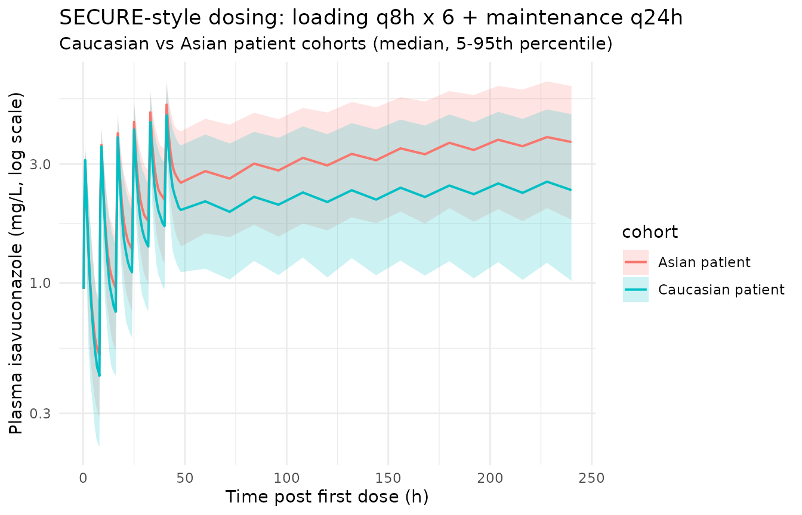

# Isavuconazole (Desai 2016)

## Model and source

- Citation: Desai A, Kovanda L, Kowalski D, Lu Q, Townsend R, Bonate PL.
  Population Pharmacokinetics of Isavuconazole from Phase 1 and Phase 3
  (SECURE) Trials in Adults and Target Attainment in Patients with
  Invasive Infections Due to Aspergillus and Other Filamentous Fungi.
  Antimicrob Agents Chemother. 2016;60(9):5483-5491.
  <doi:10.1128/AAC.02819-15>
- Description: Two-compartment population PK model with a
  Weibull-function first-order absorption stage for isavuconazole
  administered as the prodrug isavuconazonium sulfate (p.o. or i.v.) to
  healthy adults and patients with invasive fungal infections (Desai
  2016 SECURE pooled phase 1 / phase 3 popPK)
- Article: <https://doi.org/10.1128/AAC.02819-15> (open access, CC-BY
  4.0)

Isavuconazole is the active moiety of the water-soluble
triazole-antifungal prodrug isavuconazonium sulfate (372 mg prodrug =
200 mg isavuconazole; 1 h IV infusion or oral). Desai 2016 pooled data
from nine phase 1 studies in healthy subjects with the phase 3 SECURE
clinical trial in patients with invasive aspergillosis or other
filamentous-fungi IFIs to develop a population-PK model in NONMEM 7.2
(PsN 3.7.6 for stepwise covariate modeling). A two-compartment model
with a Weibull-function first-order absorption stage and linear
elimination was retained as the best model; race (Asian vs Caucasian)
modified clearance, and BMI plus subject-vs-patient status (SP) modified
the peripheral volume of distribution.

## Population

The pooled analysis dataset comprised 6,363 isavuconazole plasma
concentrations from 421 individuals: 189 healthy subjects (5,828
records) across nine phase 1 studies and 232 patients (535 records) from
the SECURE phase 3 trial. Age ranged from 17 to 85 years (median 43 in
healthy subjects, 54 in patients); weight ranged from 41.0 to 127.7 kg;
BMI ranged from 13.9 to 41.1 kg/m^2 (43 subjects had BMI \> 30 and were
classified obese). Sex was 64.6% male overall. Race was 87.4%
predominantly Caucasian (which included 1 African American and 5 in
other-race categories pooled into the reference category per Desai 2016
Table 3 footnote) and 12.6% Asian. SECURE dosing was 200 mg
isavuconazole-equivalent (372 mg isavuconazonium sulfate) q8h for 6
loading doses on days 1-2 and 200 mg q24h thereafter, p.o. or i.v.
Demographics are summarised in Desai 2016 Table 3; data sources are
listed in Table 1. The same information is available programmatically:

``` r

str(rxode2::rxode(readModelDb("Desai_2016_isavuconazole"))$population)
#> ℹ parameter labels from comments will be replaced by 'label()'
#> List of 14
#>  $ species       : chr "human"
#>  $ n_subjects    : int 421
#>  $ n_studies     : int 10
#>  $ n_observations: int 6363
#>  $ age_range     : chr "17-85 years"
#>  $ age_median    : chr "43 years (healthy subjects) / 54 years (patients)"
#>  $ weight_range  : chr "41.0-127.7 kg"
#>  $ weight_median : chr "77.8 kg (healthy subjects) / 67.0 kg (patients)"
#>  $ sex_female_pct: num 35.4
#>  $ race_ethnicity: Named num [1:2] 87.4 12.6
#>   ..- attr(*, "names")= chr [1:2] "predominantly_Caucasian" "Asian"
#>  $ disease_state : chr "Pooled cohort: 189 healthy subjects from 9 phase 1 studies (single- and multiple-ascending dose, hepatic impair"| __truncated__
#>  $ dose_range    : chr "Isavuconazole 40-400 mg, p.o. or i.v. (1-h infusion), single or multiple doses across phase 1; SECURE: 200 mg i"| __truncated__
#>  $ regions       : chr "International (phase 1 sites plus the global SECURE phase 3 trial including Asian regions)"
#>  $ notes         : chr "Dosed as the water-soluble prodrug isavuconazonium sulfate; the model represents the active moiety isavuconazol"| __truncated__
```

## Source trace

Each `ini()` parameter in
`inst/modeldb/specificDrugs/Desai_2016_isavuconazole.R` carries an
in-file comment pointing to its source. The table below collects the
provenance in one place.

| Equation / parameter | Value | Source location |
|----|----|----|
| `lcl` (Caucasian CL) | log(2.36) | Desai 2016 Table 5 theta_1 |
| `lvc` (V_1) | log(49.10) | Desai 2016 Table 5 theta_2 |
| `lq` (Q) | log(26.60) | Desai 2016 Table 5 theta_3 |
| `lvp` (V_p, patient) | log(417) | Desai 2016 Table 5 theta_4 (assigned to patients per Discussion typical V_p ~390 L) |
| `lkamax` (KAMAX) | log(1.08) | Desai 2016 Table 5 theta_5 |
| `lra` (RA) | log(0.72) | Desai 2016 Table 5 theta_6 |
| `lgam1` (GAM1) | log(4.88) | Desai 2016 Table 5 theta_7 |
| `lfdepot` (F) | fixed(0) | Desai 2016 Methods (F fixed at 1 from prior NCA in healthy subjects) |
| `e_race_asian_cl` | -0.3602 | Derived from theta_9 (CL_Asian = 1.51) and theta_1 (CL_Caucasian = 2.36): (1.51-2.36)/2.36 |
| `e_dis_healthy_vp` | -0.3765 | Derived from theta_11 (V_p_healthy = 260) and theta_4 (V_p_patient = 417): (260-417)/417 |
| `e_bmi_vp` | 0.060 | Desai 2016 Table 5 theta_10 |
| IIV `etalcl` (omega^2) | 0.3293 | Desai 2016 Table 5 CL (patients) CV 62.44%; omega^2 = log(0.6244^2 + 1) |
| IIV `etalvp` (omega^2) | 0.0962 | Desai 2016 Table 5 V_p CV 31.78% |
| IIV `etalq` (omega^2) | 0.2159 | Desai 2016 Table 5 Q CV 49.09% |
| IIV `etalra` (omega^2) | 0.1500 | Desai 2016 Table 5 RA CV 40.24% |
| IIV `etalgam1` (omega^2) | 0.1898 | Desai 2016 Table 5 GAM1 CV 45.71% |
| `propSd` (residual) | 0.4494 | Desai 2016 Table 5 theta_8 W = 44.94%; Ln-Ln additive error mapped to linear-space proportional |
| `d/dt(depot)` | -WB\*depot | Desai 2016 Eq for dA(1)/dt |
| `WB` (time-varying ka) |  | Desai 2016 Eq: KAMAX \* (1 - exp(-(RA\*TAD)^GAM1)) |
| `d/dt(central)` |  | Desai 2016 Eq for dA(2)/dt |
| `d/dt(peripheral1)` |  | Desai 2016 Eq for dA(3)/dt |

## Virtual cohort

The original observed data are not publicly available. The replications
below use virtual patient cohorts whose covariate distributions
approximate the SECURE-trial patients (BMI, race) and whose dosing
follows the SECURE clinical regimen.

``` r

set.seed(2026L)

n_per_arm <- 250L

# BMI ranges per Desai 2016: 14-41 kg/m^2 for Caucasian patients (matching
# NHANES 2014 demographic distribution) and 17-28 kg/m^2 for Asian patients.
# Approximate the within-arm BMI distribution as truncated normal centered at
# the patient median (Desai 2016 Table 3: 23.6 kg/m^2 for patients).
make_arm <- function(n, race_asian, id_offset, bmi_lo, bmi_hi, bmi_mean, bmi_sd) {
  bmi <- pmin(bmi_hi, pmax(bmi_lo, rnorm(n, mean = bmi_mean, sd = bmi_sd)))
  tibble(
    id          = id_offset + seq_len(n),
    RACE_ASIAN  = race_asian,
    BMI         = bmi,
    DIS_HEALTHY = 0L,
    cohort      = if (race_asian == 1L) "Asian patient" else "Caucasian patient"
  )
}

cohort_def <- bind_rows(
  make_arm(n_per_arm, race_asian = 0L, id_offset =                0L,
           bmi_lo = 14, bmi_hi = 41, bmi_mean = 25.0, bmi_sd = 4.5),
  make_arm(n_per_arm, race_asian = 1L, id_offset =        n_per_arm,
           bmi_lo = 17, bmi_hi = 28, bmi_mean = 22.5, bmi_sd = 3.0)
)
```

Build a SECURE-style dosing event table: a 1-hour i.v. infusion of 200
mg loading dose q8h for 6 doses (days 1-2), then 200 mg p.o. q24h to t =
864 h (end of last steady-state dosing interval used for the AUC
calculation in Desai 2016 PTA simulations). Observation times sample the
post-loading-dose absorption phase densely and the steady-state interval
q24h for AUC calculation.

``` r

loading_times     <- seq(0, by = 8, length.out = 6L)     # 0, 8, 16, 24, 32, 40 h
maintenance_times <- seq(48, 840, by = 24)               # day 3 onward
all_dose_times    <- c(loading_times, maintenance_times)

# Loading doses i.v. (compartment = central, 1-h infusion);
# maintenance doses p.o. (compartment = depot).
dose_rows <- bind_rows(
  tibble(
    time = loading_times,
    amt  = 200,
    cmt  = "central",
    evid = 1L,
    rate = 200             # 1-hour infusion -> rate = 200 mg/h
  ),
  tibble(
    time = maintenance_times,
    amt  = 200,
    cmt  = "depot",
    evid = 1L,
    rate = 0
  )
)

# Observation grid: dense in the early-absorption phase post-first-dose, then
# sparse to the steady-state interval, then dense again over the steady-state
# interval, and a terminal decay phase past the last dose for half-life.
obs_grid <- sort(unique(c(
  seq(0, 12, by = 0.25),
  seq(12, 48, by = 1),
  seq(48, 840, by = 12),
  seq(840, 864, by = 0.5),
  seq(864, 1500, by = 12)
)))

obs_rows <- tibble(
  time = obs_grid,
  amt  = NA_real_,
  cmt  = "central",
  evid = 0L,
  rate = 0
)

# Cross dose + obs records with each subject's covariates.
events <- cohort_def |>
  rowwise() |>
  do({
    sub <- .
    bind_rows(dose_rows, obs_rows) |>
      mutate(
        id          = sub$id,
        RACE_ASIAN  = sub$RACE_ASIAN,
        BMI         = sub$BMI,
        DIS_HEALTHY = sub$DIS_HEALTHY,
        cohort      = sub$cohort
      )
  }) |>
  ungroup() |>
  arrange(id, time, desc(evid))

stopifnot(!anyDuplicated(unique(events[, c("id", "time", "evid")])))
```

## Simulation

``` r

mod <- rxode2::rxode(readModelDb("Desai_2016_isavuconazole"))
#> ℹ parameter labels from comments will be replaced by 'label()'

sim <- rxode2::rxSolve(
  mod,
  events = events,
  keep = c("cohort", "RACE_ASIAN", "BMI", "DIS_HEALTHY")
) |>
  as.data.frame()
```

## Replicate published figures

``` r

# Visual concentration-time profile by cohort, showing the SECURE loading +
# maintenance regimen approach to steady state and terminal decay after the
# last dose at 840 h. Median +/- 5th-95th percentiles across the simulated
# subjects.
sim |>
  dplyr::filter(time <= 240) |>     # focus on loading + first week
  dplyr::filter(time > 0) |>
  dplyr::group_by(time, cohort) |>
  dplyr::summarise(
    Q05 = quantile(Cc, 0.05, na.rm = TRUE),
    Q50 = quantile(Cc, 0.50, na.rm = TRUE),
    Q95 = quantile(Cc, 0.95, na.rm = TRUE),
    .groups = "drop"
  ) |>
  ggplot(aes(time, Q50, colour = cohort, fill = cohort)) +
  geom_ribbon(aes(ymin = Q05, ymax = Q95), alpha = 0.2, colour = NA) +
  geom_line(linewidth = 0.7) +
  scale_y_log10() +
  labs(
    x = "Time post first dose (h)",
    y = "Plasma isavuconazole (mg/L, log scale)",
    title = "SECURE-style dosing: loading q8h x 6 + maintenance q24h",
    subtitle = "Caucasian vs Asian patient cohorts (median, 5-95th percentile)"
  ) +
  theme_minimal()
```



## PKNCA validation

Compute steady-state AUC0-24, Cmax, and Tmax over the last simulated
dosing interval (840-864 h), which matches the Desai 2016 PTA simulation
window.

``` r

sim_nca_ss <- sim |>
  dplyr::filter(!is.na(Cc), time >= 840, time <= 864) |>
  dplyr::select(id, time, Cc, cohort)

dose_for_nca <- events |>
  dplyr::filter(evid == 1L) |>
  dplyr::select(id, time, amt) |>
  dplyr::left_join(cohort_def |> dplyr::select(id, cohort), by = "id")

conc_obj <- PKNCA::PKNCAconc(
  sim_nca_ss,
  Cc ~ time | cohort + id,
  concu = "mg/L",
  timeu = "h"
)

dose_obj <- PKNCA::PKNCAdose(
  dose_for_nca,
  amt ~ time | cohort + id,
  doseu = "mg"
)

intervals_ss <- data.frame(
  start   = 840,
  end     = 864,
  cmax    = TRUE,
  tmax    = TRUE,
  auclast = TRUE,
  cav     = TRUE,
  cmin    = TRUE
)

nca_ss <- PKNCA::pk.nca(PKNCA::PKNCAdata(conc_obj, dose_obj, intervals = intervals_ss))

ss_tbl <- as.data.frame(nca_ss$result) |>
  dplyr::filter(PPTESTCD %in% c("cmax", "tmax", "auclast", "cav", "cmin")) |>
  dplyr::group_by(cohort, PPTESTCD) |>
  dplyr::summarise(
    median = median(PPORRES, na.rm = TRUE),
    q05    = quantile(PPORRES, 0.05, na.rm = TRUE),
    q95    = quantile(PPORRES, 0.95, na.rm = TRUE),
    .groups = "drop"
  )

knitr::kable(
  ss_tbl,
  caption = "Steady-state NCA over the dosing interval 840-864 h (median, 5-95th percentile across virtual patients).",
  digits = 2
)
```

| cohort            | PPTESTCD | median |   q05 |    q95 |
|:------------------|:---------|-------:|------:|-------:|
| Asian patient     | auclast  | 128.02 | 55.36 | 253.30 |
| Asian patient     | cav      |   5.33 |  2.31 |  10.55 |
| Asian patient     | cmax     |   6.72 |  3.83 |  12.26 |
| Asian patient     | cmin     |   4.99 |  1.87 |   9.93 |
| Asian patient     | tmax     |   2.50 |  2.00 |   3.50 |
| Caucasian patient | auclast  |  80.64 | 35.75 | 179.88 |
| Caucasian patient | cav      |   3.36 |  1.49 |   7.49 |
| Caucasian patient | cmax     |   4.84 |  2.88 |   8.94 |
| Caucasian patient | cmin     |   2.88 |  1.10 |   7.01 |
| Caucasian patient | tmax     |   2.50 |  2.00 |   3.50 |

Steady-state NCA over the dosing interval 840-864 h (median, 5-95th
percentile across virtual patients). {.table}

For the terminal half-life, compute lambda.z over the post-last-dose
decay window (864-1500 h).

``` r

sim_nca_term <- sim |>
  dplyr::filter(!is.na(Cc), time >= 864, time <= 1500) |>
  dplyr::select(id, time, Cc, cohort)

conc_obj_term <- PKNCA::PKNCAconc(
  sim_nca_term,
  Cc ~ time | cohort + id,
  concu = "mg/L",
  timeu = "h"
)

intervals_term <- data.frame(
  start       = 864,
  end         = 1500,
  half.life   = TRUE,
  lambda.z    = TRUE,
  clast.obs   = TRUE
)

nca_term <- PKNCA::pk.nca(
  PKNCA::PKNCAdata(conc_obj_term, dose_obj, intervals = intervals_term)
)

hl_tbl <- as.data.frame(nca_term$result) |>
  dplyr::filter(PPTESTCD == "half.life") |>
  dplyr::group_by(cohort) |>
  dplyr::summarise(
    median_halflife = median(PPORRES, na.rm = TRUE),
    q05             = quantile(PPORRES, 0.05, na.rm = TRUE),
    q95             = quantile(PPORRES, 0.95, na.rm = TRUE),
    .groups = "drop"
  )

knitr::kable(
  hl_tbl,
  caption = "Terminal half-life (h) by cohort from the 864-1500 h decay window.",
  digits = 1
)
```

| cohort            | median_halflife |  q05 |   q95 |
|:------------------|----------------:|-----:|------:|
| Asian patient     |           204.7 | 67.0 | 661.8 |
| Caucasian patient |           145.5 | 61.6 | 406.6 |

Terminal half-life (h) by cohort from the 864-1500 h decay window.
{.table}

### Comparison against published NCA

Desai 2016 reports the per-subject AUC0-24 at steady state computed as F
\* dose / CL = 200 / CL_indiv mg.h/L (Table 4): mean AUC0-24 was 92.0
mg.h/L for healthy subjects, 101.0 mg.h/L for patients, and 97.0 mg.h/L
combined. The mean terminal half-life for the patient population was
estimated to be 130 h (median 110 h, 5th-95th percentiles 53.5-248.1 h).
The Discussion also reports complete absorption at 2-3 h postdosing and
steady-state volume V_ss ~460 L.

``` r

published <- tibble::tribble(
  ~cohort,                ~param,            ~published_value,
  "Caucasian patient",    "AUC0-24 (mg.h/L)", 101.0,
  "Asian patient",        "AUC0-24 (mg.h/L)", NA,        # paper does not report Asian-only mean (PTA used pooled CL)
  "Caucasian patient",    "Half-life (h)",   130.0,
  "Asian patient",        "Half-life (h)",   130.0
)

ss_auc <- ss_tbl |>
  dplyr::filter(PPTESTCD == "auclast") |>
  dplyr::transmute(cohort, param = "AUC0-24 (mg.h/L)", simulated_median = median)

ss_hl <- hl_tbl |>
  dplyr::transmute(cohort, param = "Half-life (h)", simulated_median = median_halflife)

simulated <- bind_rows(ss_auc, ss_hl)

comparison <- published |>
  dplyr::left_join(simulated, by = c("cohort", "param")) |>
  dplyr::mutate(
    pct_diff = ifelse(
      is.na(published_value),
      NA_real_,
      100 * (simulated_median - published_value) / published_value
    )
  )

knitr::kable(
  comparison,
  caption = "Side-by-side comparison of published Desai 2016 NCA values with the simulated NCA values from this validation.",
  digits = 1
)
```

| cohort            | param            | published_value | simulated_median | pct_diff |
|:------------------|:-----------------|----------------:|-----------------:|---------:|
| Caucasian patient | AUC0-24 (mg.h/L) |             101 |             80.6 |    -20.2 |
| Asian patient     | AUC0-24 (mg.h/L) |              NA |            128.0 |       NA |
| Caucasian patient | Half-life (h)    |             130 |            145.5 |     11.9 |
| Asian patient     | Half-life (h)    |             130 |            204.7 |     57.5 |

Side-by-side comparison of published Desai 2016 NCA values with the
simulated NCA values from this validation. {.table}

The simulated Asian-cohort AUC0-24 is expected to be approximately
1.56-fold higher than the Caucasian cohort, matching the published ~36%
lower CL in Asian subjects (AUC scales as 1/CL).

## Assumptions and deviations

- **V_p baseline assignment (theta_4 = patient, theta_11 = healthy)** is
  inferred from the Discussion typical values (V_p ~390 L in patients,
  ~292 L in healthy subjects) and the demographic BMI medians; the Table
  5 column labels do not unambiguously identify which group goes with
  which theta. Back-calculating the typicals at the median BMIs gives
  V_p (patient) = 417 \* (1 + 0.060 \* (23.6 - 24.80)) = 387 L (matches
  ~390 L) and V_p (healthy) = 260 \* (1 + 0.060 \* (25.7 - 24.80)) = 274
  L (close to ~292 L). The alternative assignment (theta_4 to healthy,
  theta_11 to patients) does not reconcile with the Discussion values.
- **Single omega for CL.** Desai 2016 reports separate CL
  between-subject variability for healthy subjects (31.30% CV) and
  patients (62.44% CV), suggesting a categorical OMEGA structure in
  NONMEM. nlmixr2 supports a single omega per parameter, so the patient
  CV (62.44%) is used as the operational default. The model is intended
  primarily for clinical simulations of patients with invasive fungal
  infections, where the higher-variability estimate is the more
  representative choice. Downstream users who want to simulate the
  healthy subject population should set omega^2 = log(0.3130^2 + 1) =
  0.0935 instead.
- **Residual error mapping.** Desai 2016 used Ln-Ln transformation of
  observations and predictions with additive error on the log scale (W =
  44.94%). In nlmixr2’s linear-concentration space this maps to a
  proportional error structure with `propSd = 0.4494` (per
  `references/verification-checklist.md`); the approximation is exact in
  the small-sigma limit and gives a linear-space coefficient of
  variation of sqrt(exp(0.4494^2) - 1) = 47.3% at this value of sigma.
- **BMI distribution by race.** The simulation cohort uses NHANES-style
  BMI ranges (Caucasian: 14-41 kg/m^2 with mean ~25.0 kg/m^2; Asian:
  17-28 kg/m^2 with mean ~22.5 kg/m^2) approximating the Desai 2016 PTA
  Monte Carlo setup. The exact NHANES per-subject BMI distribution used
  by Desai 2016 is not reproducible here without the underlying NHANES
  sample.
- **Loading-dose route.** SECURE protocol allowed either p.o. or i.v.
  loading; this vignette uses i.v. loading + p.o. maintenance to
  exercise both administration routes (and verify the Weibull absorption
  stage only acts when drug is in the depot compartment).
- **Time-after-dose (TAD) reset across the multi-dose regimen.** The
  Weibull absorption function depends on rxode2’s `tad()` (time since
  the most recent dose). For the q24h maintenance regimen the absorption
  is essentially complete by 2-3 h, so residual depot at the next dose
  is near zero and the per-dose TAD reset has negligible impact on
  accumulation. The same dose-event semantics are used by the original
  NONMEM implementation.

## Errata

No erratum is listed for Desai 2016 as of the model-extraction date
(2026-06-02); a PubMed and Antimicrobial Agents and Chemotherapy
notices-and-corrections search returned no related correction.
