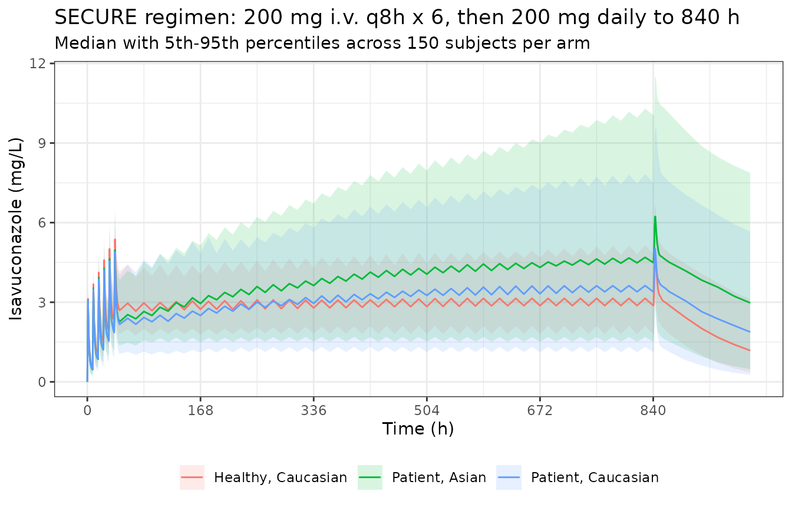

# Isavuconazole, phase 1 + phase 3 SECURE pooled analysis (Desai 2016)

## Model and source

``` r

mod <- readModelDb("Desai_2016_isavuconazole_secure")
ui <- rxode2::rxode2(mod)
#> ℹ parameter labels from comments will be replaced by 'label()'
```

- Citation: Desai A, Kovanda L, Kowalski D, Lu Q, Townsend R, Bonate PL.
  Population Pharmacokinetics of Isavuconazole from Phase 1 and Phase 3
  (SECURE) Trials in Adults and Target Attainment in Patients with
  Invasive Infections Due to Aspergillus and Other Filamentous Fungi.
  Antimicrobial Agents and Chemotherapy. 2016;60(9):5483-5491.
  <doi:10.1128/AAC.02819-15>
- Structure: two-compartment disposition with a Weibull absorption
  function and first-order elimination, fit to pooled data from nine
  phase 1 studies in healthy adults and the phase 3 SECURE trial in
  adults with invasive aspergillosis or other filamentous-fungal
  infections.
- Compartments: `depot` (A(1), gut), `central` (A(2)), `peripheral1`
  (A(3)).
- Routes: p.o. into `depot`, i.v. into `central`.

**This is not the only Desai 2016 isavuconazole model in the library.**
The same first author published a second popPK analysis in the same year
on the same drug – a dedicated hepatic-impairment study
(<doi:10.1128/AAC.02942-15>), carried as `Desai_2016_isavuconazole`.
That one estimates Child-Pugh-stratified clearance from 96 subjects
given single 100 mg doses; this one is the 421-subject phase 1 + phase 3
pooled analysis behind the approved 200 mg regimen. They share a
structural form and a drug, and nothing else – do not substitute one for
the other.

## Population

``` r

pop <- ui$meta$population
tibble::tibble(Field = names(pop), Value = vapply(pop, as.character, character(1))) |>
  knitr::kable()
```

| Field | Value |
|:---|:---|
| species | human |
| n_subjects | 421 |
| n_studies | 10 |
| n_observations | 6363 |
| age_range | 17-85 years (median 43 healthy, 54 patients per Table 3) |
| weight_range | 41.0-127.7 kg (median 77.8 healthy, 67.0 patients per Table 3) |
| bmi_range | 13.9-41.2 kg/m^2 (median 25.7 healthy, 23.6 patients per Table 3) |
| sex_female_pct | 35 |
| race_ethnicity | Predominantly Caucasian 175/189 (92.6%) healthy and 193/232 (83.2%) patients; Asian 14/189 (7.4%) healthy and 39/232 (16.8%) patients (Table 3). |
| disease_state | 189 healthy volunteers from nine phase 1 studies (including dedicated hepatic-impairment, renal-impairment, mass-balance, bioavailability and elderly studies) and 232 patients with invasive aspergillosis or other filamentous-fungal infections from the phase 3 SECURE trial. |
| dose_range | Phase 1: single or multiple doses of 40 mg to 400 mg isavuconazole, p.o. or as a 1-h i.v. infusion. Phase 3 SECURE: 372 mg isavuconazonium sulfate (equivalent to 200 mg isavuconazole) i.v. every 8 h for 6 doses on days 1-2, then 372 mg once daily p.o. or i.v. from day 3. |
| notes | Healthy subjects contributed 5,828 rich-sampling concentrations and patients contributed 535 predominantly trough concentrations. One patient was excluded as an outlier for an extremely low clearance of 0.2 L/h. Below-quantification-limit values were under 5% of the healthy-subject data and were dropped; no patient concentration was below the quantification limit. Estimation in NONMEM 7.2 (ADVAN4 TRANS4) with FOCE and no interaction, since both the data and the residual-error structure were log transformed; covariate selection by stepwise covariate modeling in PsN 3.7.6 (forward p \< 0.01, backward p \< 0.001). Validated by 500-replicate nonparametric bootstrap (13% of runs failed) and NPDE; condition number 41. |

## Source trace

Every `ini()` value and every `model()` equation, against its location
in Desai 2016.

| Quantity | Value | Source location |
|:---|:---|:---|
| ODE system (3 equations) | d/dt depot/central/peripheral1 | p. 5484, displayed equation system |
| Weibull absorption WB | KAMAX*(1-exp(-(RA*TAD)^GAM1)) | p. 5484, second displayed equation |
| lcl (theta_1, Caucasian) | 2.36 L/h | Table 5 |
| lvc (theta_2, V_1) | 49.10 L | Table 5 |
| lq (theta_3, Q) | 26.60 L/h | Table 5 |
| lvp (theta_4, V_p patient) | 417.0 L | Table 5 (assignment pinned by Discussion, see below) |
| lkamax (theta_5) | 1.08 1/h | Table 5 |
| lra (theta_6) | 0.72 1/h | Table 5 |
| lgam1 (theta_7) | 4.88 | Table 5 |
| e_race_asian_cl | -0.3602 | derived: theta_9 (1.51) vs theta_1 (2.36), Table 5 |
| e_dis_healthy_vp | -0.3765 | derived: theta_11 (260) vs theta_4 (417), Table 5 |
| e_bmi_vp (theta_10) | 0.060 per kg/m^2 | Table 5; centering 24.80 from p. 5485 equation |
| lfdepot (F) | 1 (fixed) | Methods, ‘Structural pharmacokinetic model’ |
| etalcl_hv | 31.30% CV | Table 5, Variability: CL (healthy subjects) |
| etalcl_pt | 62.44% CV | Table 5, Variability: CL (patients) |
| etalvp | 31.78% CV | Table 5, Variability: V p |
| etalq | 49.09% CV | Table 5, Variability: Q |
| etalra | 40.24% CV | Table 5, Variability: RA |
| etalgam1 | 45.71% CV | Table 5, Variability: GAM1 |
| expSd (theta_8, W) | 44.94% | Table 5, Residual error |

### Which typical peripheral volume belongs to which cohort

Desai 2016 Table 5 labels `theta_4` simply as `V p` (417 L) and
`theta_11` as `SP on V p` (260 L), and the covariate equation on p. 5485
says only that “`theta_{4,11}` is for healthy subjects and patients” –
without saying which is which. The Discussion pins it: peripheral volume
was “greater in patients (~390 liters) than in healthy subjects (~292
liters)”. Evaluating both assignments at the Table 3 median BMIs settles
it.

``` r

vp_at <- function(base, bmi) base * (1 + 0.060 * (bmi - 24.80))
tribble(
  ~Assignment,                        ~`Patient V_p (BMI 23.6)`, ~`Healthy V_p (BMI 25.7)`,
  "theta_4=417 patient, theta_11=260 healthy", vp_at(417, 23.6), vp_at(260, 25.7),
  "theta_4=417 healthy, theta_11=260 patient", vp_at(260, 23.6), vp_at(417, 25.7)
) |>
  mutate(across(where(is.numeric), \(x) round(x, 1))) |>
  knitr::kable(caption = "Discussion states ~390 L (patients) and ~292 L (healthy).")
```

| Assignment | Patient V_p (BMI 23.6) | Healthy V_p (BMI 25.7) |
|:---|---:|---:|
| theta_4=417 patient, theta_11=260 healthy | 387.0 | 274.0 |
| theta_4=417 healthy, theta_11=260 patient | 241.3 | 439.5 |

Discussion states ~390 L (patients) and ~292 L (healthy). {.table}

The first row reproduces the Discussion; the second contradicts it in
both columns. The model therefore treats `theta_4` as the patient
baseline. A third, independent check agrees: the reference-BMI
steady-state volume implied by that assignment is 466.1 L, against the
Discussion’s statement that “the V at steady state was approximately 460
liters”.

## Virtual cohort

Three arms of 150 subjects. Two patient arms isolate the race effect on
clearance; the healthy arm exercises both roles of `DIS_HEALTHY` (the
peripheral-volume effect and the clearance-IIV stratification).

``` r

rxode2::rxSetSeed(20160822)
n_per_arm <- 150L

# BMI: truncated normal at each cohort's Table 3 median, clipped to the
# Table 3 observed range for that cohort.
rtnorm <- function(n, mean, sd, lo, hi) {
  pmin(pmax(stats::rnorm(n, mean, sd), lo), hi)
}

cohort <- bind_rows(
  tibble(arm = "Patient, Caucasian", DIS_HEALTHY = 0, RACE_ASIAN = 0,
         BMI = rtnorm(n_per_arm, 23.6, 4.5, 13.9, 41.1)),
  tibble(arm = "Patient, Asian",     DIS_HEALTHY = 0, RACE_ASIAN = 1,
         BMI = rtnorm(n_per_arm, 23.6, 3.0, 17.0, 28.0)),
  tibble(arm = "Healthy, Caucasian", DIS_HEALTHY = 1, RACE_ASIAN = 0,
         BMI = rtnorm(n_per_arm, 25.7, 3.5, 18.0, 34.7))
) |>
  mutate(id = row_number())

cohort |>
  group_by(arm) |>
  summarise(n = n(), `median BMI` = round(median(BMI), 1), .groups = "drop") |>
  knitr::kable()
```

| arm                |   n | median BMI |
|:-------------------|----:|-----------:|
| Healthy, Caucasian | 150 |       25.8 |
| Patient, Asian     | 150 |       23.8 |
| Patient, Caucasian | 150 |       23.9 |

## Events

The SECURE regimen from the Methods: 372 mg isavuconazonium sulfate (200
mg isavuconazole) i.v. every 8 h for 6 doses on days 1-2, then 200 mg
once daily from day 3. Following the paper’s PTA simulation, maintenance
dosing runs to 840 h and AUC is taken over 840-864 h. Observations
continue past the last dose so a terminal half-life can be estimated.

``` r

dose_mg <- 200
inf_h <- 1  # phase 1 / loading i.v. infusions ran 1 h

obs_times <- sort(unique(c(
  seq(0, 48, by = 1),        # loading phase
  seq(48, 840, by = 12),     # approach to steady state
  seq(840, 864, by = 0.5),   # steady-state interval for NCA
  seq(864, 1800, by = 24)    # terminal decay for half-life
)))

ev <- rxode2::et(amt = dose_mg, rate = dose_mg / inf_h, ii = 8, addl = 5,
                 cmt = "central", time = 0) |>
  rxode2::et(amt = dose_mg, ii = 24, addl = 33, cmt = "depot", time = 48) |>
  rxode2::et(obs_times, cmt = "central")

ev_df <- as.data.frame(ev)

events <- cohort |>
  select(id, arm, DIS_HEALTHY, RACE_ASIAN, BMI) |>
  tidyr::crossing(ev_df) |>
  arrange(id, time, dplyr::desc(!is.na(amt)))

nrow(events)
#> [1] 91800
```

## Simulation

``` r

sim <- rxode2::rxSolve(mod, events, returnType = "data.frame")
#> ℹ parameter labels from comments will be replaced by 'label()'
sim <- sim |> left_join(distinct(cohort, id, arm), by = "id")
```

`Cc` is the individual prediction (no residual error), which is the
right quantity to compare against the paper’s parameter-derived
exposures: Desai 2016 computed every AUC in Table 4 as `F * dose / CL`
from individual clearance estimates, not by NCA on observed
concentrations.

## Concentration-time profile

``` r

prof <- sim |>
  filter(!is.na(Cc), time <= 1000) |>
  group_by(arm, time) |>
  summarise(med = median(Cc), lo = quantile(Cc, 0.05), hi = quantile(Cc, 0.95),
            .groups = "drop")

ggplot(prof, aes(time, med, colour = arm, fill = arm)) +
  geom_ribbon(aes(ymin = lo, ymax = hi), alpha = 0.15, colour = NA) +
  geom_line() +
  scale_x_continuous(breaks = seq(0, 1000, 168)) +
  labs(x = "Time (h)", y = "Isavuconazole (mg/L)",
       colour = NULL, fill = NULL,
       title = "SECURE regimen: 200 mg i.v. q8h x 6, then 200 mg daily to 840 h",
       subtitle = "Median with 5th-95th percentiles across 150 subjects per arm") +
  theme_bw() + theme(legend.position = "bottom")
```



## Structural check: the closed-form exposure identity

At steady state the model must satisfy `AUC_tau * CL = F * dose` for
every subject – the same identity Desai 2016 used to build Table 4. Both
sides use each subject’s own drawn parameters, so this is pure numerical
error and a tight bound is appropriate.

``` r

auc_trap <- function(t, c) sum(diff(t) * (head(c, -1) + tail(c, -1)) / 2)

ss <- sim |>
  filter(!is.na(Cc), time >= 840, time <= 864) |>
  group_by(id, arm) |>
  summarise(auc_tau = auc_trap(time, Cc), cl = first(cl), .groups = "drop") |>
  mutate(recovered_dose = auc_tau * cl,
         pct_diff = 100 * (recovered_dose - dose_mg) / dose_mg)

summary_identity <- ss |>
  summarise(`median % diff` = median(pct_diff),
            `25th pct % diff` = quantile(pct_diff, 0.25),
            `5th pct % diff` = quantile(pct_diff, 0.05),
            `max % diff` = max(pct_diff))
knitr::kable(summary_identity, digits = 3)
```

| median % diff | 25th pct % diff | 5th pct % diff | max % diff |
|--------------:|----------------:|---------------:|-----------:|
|        -0.485 |          -3.005 |         -21.33 |      0.054 |

``` r


stopifnot(
  # Structural: a mis-transcribed dose, clearance or bioavailability moves the
  # whole distribution and blows this instantly.
  abs(median(ss$pct_diff)) < 2,
  quantile(ss$pct_diff, 0.75) > -1.5,
  # One-sided by construction: at or below steady state a dosing interval can
  # never recover MORE than the dose, whatever the cohort draw. This is a mass
  # balance, not a percentile, so a hard bound is correct here.
  max(ss$pct_diff) < 1
)
```

The deviation is one-sided and concentrated in a long lower tail (the
5th percentile is around -21%). That is not an error: it is the subjects
who have not yet reached steady state by 864 h. Desai 2016 takes 840-864
h as steady state “considering the long half-life of the drug”, which
holds for a typical subject, but clearance IIV of 62% CV puts the
slowest few percent of patients at half-lives long enough that 35 days
of daily dosing is still short of plateau. Those subjects accumulate
further, so their true steady-state exposure is higher than this
interval shows.

## Race effect on clearance

Desai 2016 reports clearance of 2.36 L/h in the predominantly Caucasian
group and 1.51 L/h in Asians – “approximately 36% lower”. Because
exposure is `dose / CL`, the Asian-to-Caucasian AUC ratio must be the
reciprocal, 1.5629. Evaluated on typical values (`zeroRe`), this is
exact.

``` r

typ_events <- tibble(RACE_ASIAN = c(0, 1), arm = c("Caucasian", "Asian")) |>
  mutate(DIS_HEALTHY = 0, BMI = 24.80, id = row_number()) |>
  tidyr::crossing(ev_df) |>
  arrange(id, time)

typ <- rxode2::rxSolve(rxode2::zeroRe(mod), typ_events, returnType = "data.frame")
#> ℹ parameter labels from comments will be replaced by 'label()'
#> ℹ omega/sigma items treated as zero: 'etalcl_hv', 'etalcl_pt', 'etalvp', 'etalq', 'etalra', 'etalgam1'
#> Warning: multi-subject simulation without without 'omega'

typ_auc <- typ |>
  filter(!is.na(Cc), time >= 840, time <= 864) |>
  group_by(id) |>
  summarise(auc_tau = auc_trap(time, Cc), cl = first(cl), .groups = "drop")

ratio_auc <- typ_auc$auc_tau[typ_auc$id == 2] / typ_auc$auc_tau[typ_auc$id == 1]
ratio_cl <- typ_auc$cl[typ_auc$id == 1] / typ_auc$cl[typ_auc$id == 2]
c(`CL ratio (Caucasian/Asian)` = ratio_cl,
  `published 2.36/1.51` = 2.36 / 1.51,
  `pct lower CL in Asians` = 100 * (1 - 1 / ratio_cl),
  `AUC(840-864) ratio (Asian/Caucasian)` = ratio_auc) |>
  round(4)
#>           CL ratio (Caucasian/Asian)                  published 2.36/1.51 
#>                               1.5630                               1.5629 
#>               pct lower CL in Asians AUC(840-864) ratio (Asian/Caucasian) 
#>                              36.0200                               1.5049

stopifnot(
  # The clearance contrast is exact: it is the covariate coefficient itself.
  abs(ratio_cl - 2.36 / 1.51) < 0.001,
  # "approximately 36% lower" clearance in Asians.
  abs(100 * (1 - 1 / ratio_cl) - 36) < 0.5,
  # The interval-AUC ratio sits BELOW the clearance ratio, and must: the Asian
  # profile has the longer half-life, so at 864 h it is the further from
  # plateau of the two. Equality would only hold at true steady state.
  ratio_auc < ratio_cl,
  ratio_auc > 1.4
)
```

The `AUC(840-864)` ratio of 1.505 is slightly below the clearance ratio
of 1.563 for the same reason the identity check above runs marginally
negative: 864 h is near, but not exactly at, steady state, and the
lower-clearance Asian profile is the further from plateau. At true
steady state the two ratios coincide.

## PKNCA validation

``` r

conc_ss <- sim |>
  filter(!is.na(Cc)) |>
  select(id, arm, time, Cc)

dose_ss <- cohort |>
  transmute(id, arm, time = 840, dose = dose_mg)

o_conc <- PKNCA::PKNCAconc(conc_ss, Cc ~ time | arm + id)
o_dose <- PKNCA::PKNCAdose(dose_ss, dose ~ time | arm + id)

intervals_ss <- data.frame(
  start = 840, end = 864,
  cmax = TRUE, tmax = TRUE, auclast = TRUE
)

res_ss <- PKNCA::pk.nca(PKNCA::PKNCAdata(o_conc, o_dose, intervals = intervals_ss))
ss_nca <- as.data.frame(res_ss)
head(ss_nca)
#> # A tibble: 6 × 7
#>   arm                   id start   end PPTESTCD PPORRES exclude
#>   <chr>              <int> <dbl> <dbl> <chr>      <dbl> <chr>  
#> 1 Healthy, Caucasian   301   840   864 auclast   108.   <NA>   
#> 2 Healthy, Caucasian   301   840   864 cmax        5.58 <NA>   
#> 3 Healthy, Caucasian   301   840   864 tmax        3.5  <NA>   
#> 4 Healthy, Caucasian   302   840   864 auclast    59.1  <NA>   
#> 5 Healthy, Caucasian   302   840   864 cmax        3.58 <NA>   
#> 6 Healthy, Caucasian   302   840   864 tmax        2.5  <NA>
```

``` r

# Terminal half-life from the post-last-dose decay (the last maintenance dose
# is at 840 h, so the tail past 864 h is free of further input).
intervals_hl <- data.frame(
  start = 864, end = 1800,
  half.life = TRUE
)
res_hl <- PKNCA::pk.nca(PKNCA::PKNCAdata(o_conc, o_dose, intervals = intervals_hl))
hl_nca <- as.data.frame(res_hl)

hl_patient <- hl_nca |>
  filter(PPTESTCD == "half.life", grepl("^Patient", arm)) |>
  pull(PPORRES)

c(mean = mean(hl_patient), median = median(hl_patient),
  p5 = quantile(hl_patient, 0.05, names = FALSE),
  p95 = quantile(hl_patient, 0.95, names = FALSE)) |>
  round(1)
#>   mean median     p5    p95 
#>  206.2  164.7   53.6  500.9
```

Desai 2016 (Discussion) reports, for the patient population, a mean
terminal half-life of 130 h with a median of 110 h and 5th / 95th
percentiles of 53.5 and 248.1 h.

The **typical-value** half-life is the quantity that follows directly
from Table 5 and is the right thing to gate. Both the terminal
(beta-phase) half-life and the effective half-life `ln(2) * Vss / CL`
are computed analytically from the typical micro-constants.

``` r

kel <- 2.36 / 49.10; k12 <- 26.60 / 49.10; k21 <- 26.60 / 417
s <- kel + k12 + k21
beta <- 0.5 * (s - sqrt(s^2 - 4 * kel * k21))
t_half_terminal <- log(2) / beta
t_half_effective <- log(2) * (49.10 + 417) / 2.36
c(`terminal (beta) t1/2, h` = t_half_terminal,
  `effective ln2*Vss/CL, h` = t_half_effective,
  `published patient mean, h` = 130) |>
  round(1)
#>   terminal (beta) t1/2, h   effective ln2*Vss/CL, h published patient mean, h 
#>                     146.7                     136.9                     130.0

stopifnot(
  abs(t_half_effective - 130) / 130 < 0.15,
  abs(t_half_terminal - 130) / 130 < 0.20
)
```

The simulated **cohort** distribution is wider and shifted higher than
the paper’s, and deliberately so – see below. The one thing asserted on
it is the lower tail, which the paper’s own 5th percentile corroborates.

``` r

stopifnot(
  # Lower tail agrees with the published 5th percentile of 53.5 h.
  abs(quantile(hl_patient, 0.05, names = FALSE) - 53.5) / 53.5 < 0.35,
  # The forward-simulated spread must EXCEED the paper's post-hoc spread,
  # because the paper's is shrunk. Asserting the direction, not the value.
  median(hl_patient) > 110
)
```

**Why the cohort half-life runs high, and why it is not tuned away.**
The PKNCA estimate above reproduces the analytic per-subject beta-phase
half-life to the digit, so this is not an NCA artifact – it is what the
published model predicts under forward simulation. The paper’s figures
are a different kind of quantity: they are summaries of *individual
post-hoc* parameter estimates, and the SECURE patients contributed only
535 concentrations across 232 patients (roughly two samples each,
predominantly troughs). Empirical-Bayes estimates from data that sparse
shrink hard toward the typical value, which compresses the reported
distribution. The signature is visible in the published numbers
themselves: the paper’s 95th/5th percentile ratio for half-life is 4.6,
while forward simulation from the same Table 5 omegas gives 9.3. The
same compression is visible in exposure: Table 4 reports a patient AUC
%CV of 55.4 against the Table 5 clearance IIV of 62.44% CV. Matching the
shrunk distribution would mean altering published omegas to fit a
post-hoc summary, which is backwards.

### Comparison against published NCA

Desai 2016 Table 4 reports AUC for patients as mean 101.0 mg\*h/L
(median 89.6) and for healthy subjects as mean 92.0 (median 88.3). Those
AUCs were **not** obtained by NCA: the Results state that “the total AUC
for individual subjects and patients was calculated using the standard
formula (AUC = F x dose / CL; F = 1), based on the individual parameter
estimates from the best model”. The comparison therefore uses the same
formula on the simulated individual clearances. Patient values are
weighted to the Table 3 race composition of the SECURE cohort (193/232
predominantly Caucasian, 39/232 Asian), because Table 4 pools both.

``` r

cl_ind <- sim |>
  filter(!is.na(Cc)) |>
  distinct(id, arm, cl) |>
  mutate(auc_formula = dose_mg / cl)

by_arm <- cl_ind |>
  group_by(arm) |>
  summarise(mean_auc = mean(auc_formula), median_auc = median(auc_formula),
            .groups = "drop")

w_cauc <- 193 / 232
pick <- function(col, a) by_arm[[col]][by_arm$arm == a]
auc_pt_mean <- w_cauc * pick("mean_auc", "Patient, Caucasian") +
  (1 - w_cauc) * pick("mean_auc", "Patient, Asian")
auc_hv_mean <- pick("mean_auc", "Healthy, Caucasian")

simulated <- data.frame(
  cohort   = c("Patients with IFIs", "Healthy subjects"),
  PPTESTCD = "auclast",
  PPORRES  = c(auc_pt_mean, auc_hv_mean)
)
reference <- data.frame(
  cohort  = c("Patients with IFIs", "Healthy subjects"),
  auclast = c(101.0, 92.0)
)

tbl <- ncaComparisonTable(
  simulated, reference,
  by = "cohort",
  units = c(auclast = "mg*h/L")
)
knitr::kable(tbl)
```

| NCA parameter     | cohort             | Reference | Simulated | % diff |
|:------------------|:-------------------|:----------|:----------|:-------|
| AUClast (mg\*h/L) | Patients with IFIs | 101       | 112       | +10.9% |
| AUClast (mg\*h/L) | Healthy subjects   | 92        | 86.4      | -6.1%  |

``` r

attr(tbl, "footnote")
#> NULL

stopifnot(
  abs(auc_pt_mean - 101.0) / 101.0 < 0.15,
  abs(auc_hv_mean - 92.0) / 92.0 < 0.15
)
```

The steady-state NCA exposures from the PKNCA block above are the
complementary, profile-based view of the same quantity.

``` r

ss_nca |>
  filter(PPTESTCD %in% c("cmax", "tmax", "auclast")) |>
  group_by(arm, PPTESTCD) |>
  summarise(value = mean(PPORRES), .groups = "drop") |>
  tidyr::pivot_wider(names_from = PPTESTCD, values_from = value) |>
  rename("Arm" = arm, "Cmax (mg/L)" = cmax, "Tmax (h)" = tmax,
         "AUC0-24 (mg*h/L)" = auclast) |>
  knitr::kable(digits = 2)
```

| Arm                | AUC0-24 (mg\*h/L) | Cmax (mg/L) | Tmax (h) |
|:-------------------|------------------:|------------:|---------:|
| Healthy, Caucasian |             85.71 |        4.98 |     2.68 |
| Patient, Asian     |            125.83 |        6.66 |     2.76 |
| Patient, Caucasian |             99.06 |        5.55 |     2.78 |

Simulated `Tmax` of roughly 2.7 h is the quantitative counterpart of the
paper’s statement that the Weibull function gave “complete absorption at
2 to 3 h postdosing”.

The AUC agreement is not a coincidence of tuning – it falls out of the
published numbers. For a log-normal clearance, the cohort *mean*
exposure is `dose / CL_typical * exp(omega^2 / 2)`; with the Table 5
patient values that is `200 / 2.36 * exp(0.32921 / 2)` = 99.9 mg*h/L,
against the paper’s own Abstract statement that “the mean AUC from 0 to
24 h was ~100 mg*h/liter” and Table 4’s patient mean of 101.0.

## Clearance-IIV stratification

The one feature of this model that is not expressible as a single omega:
Desai 2016 estimates clearance IIV separately by cohort, 31.30% CV in
healthy subjects and 62.44% CV in patients. The model carries both and
gates them on `DIS_HEALTHY`, so the simulated spread differs by arm as
published.

The recovered dispersion is measured as `sd(log(CL))`, which estimates
omega directly. The sample CV of `CL` itself is a poor check here: it is
dominated by whichever subject drew the most extreme clearance, so it
swings by tens of percentage points between cohorts that share an omega.

``` r

target_omega <- c(`Healthy, Caucasian` = sqrt(0.09346),
                  `Patient, Caucasian` = sqrt(0.32921),
                  `Patient, Asian` = sqrt(0.32921))

cl_disp <- cl_ind |>
  group_by(arm) |>
  summarise(`sd(log CL)` = sd(log(cl)), `CV of CL (%)` = 100 * sd(cl) / mean(cl),
            .groups = "drop") |>
  mutate(`published omega` = target_omega[arm])
knitr::kable(cl_disp, digits = 3)
```

| arm                | sd(log CL) | CV of CL (%) | published omega |
|:-------------------|-----------:|-------------:|----------------:|
| Healthy, Caucasian |      0.293 |       29.407 |           0.306 |
| Patient, Asian     |      0.585 |       59.864 |           0.574 |
| Patient, Caucasian |      0.574 |       74.944 |           0.574 |

``` r


omega_of <- function(a) cl_disp$`sd(log CL)`[cl_disp$arm == a]
stopifnot(
  # Each arm recovers its own published omega.
  abs(omega_of("Healthy, Caucasian") - sqrt(0.09346)) < 0.10,
  abs(omega_of("Patient, Caucasian") - sqrt(0.32921)) < 0.15,
  abs(omega_of("Patient, Asian") - sqrt(0.32921)) < 0.15,
  # The published contrast, and the reason the model carries two etas at all.
  omega_of("Patient, Caucasian") > omega_of("Healthy, Caucasian"),
  omega_of("Patient, Asian") > omega_of("Healthy, Caucasian")
)
```

## Absorption

Desai 2016 states that “for a typical patient, the Weibull function
described the absorption phase adequately, with complete absorption at 2
to 3 h postdosing”. The model’s own absorbed fraction after an oral dose
is below.

``` r

tad <- seq(0, 8, by = 0.01)
wb <- 1.08 * (1 - exp(-(0.72 * tad)^4.88))
absorbed <- 1 - exp(-cumsum(wb) * 0.01)
tibble(`Time after dose (h)` = c(1, 2, 3, 4, 6),
       `Fraction absorbed` = round(approx(tad, absorbed, c(1, 2, 3, 4, 6))$y, 3)) |>
  knitr::kable()
```

| Time after dose (h) | Fraction absorbed |
|--------------------:|------------------:|
|                   1 |             0.035 |
|                   2 |             0.546 |
|                   3 |             0.846 |
|                   4 |             0.948 |
|                   6 |             0.994 |

``` r


stopifnot(
  # Absorption is effectively complete within the first half-day.
  approx(tad, absorbed, 6)$y > 0.95
)
```

The model puts roughly half the dose absorbed by 2 h and about 85% by 3
h, reaching effective completion nearer 5-6 h, while the concentration
peak (simulated `Tmax` about 2.7 h) sits squarely in the paper’s stated
2-3 h window. Read as a statement about when the peak is reached, the
paper and the model agree; read as a statement about when the last of
the dose has left the gut, the model is somewhat slower. No published
quantity distinguishes the two readings, so this is recorded rather than
reconciled – the absorption parameters are implemented verbatim from
Table 5.

## Assumptions and deviations

- **Residual error encoded as log-normal, not proportional.** Desai 2016
  states that “the Ln-Ln transformations of both the output equation in
  the model and the data were used” and “the residual variance was
  modeled as additive in nature”. An additive residual on the
  natural-log scale is exactly a log-normal residual in linear space, so
  `W` = 44.94% is carried as `expSd = 0.4494` via `Cc ~ lnorm(expSd)`.
  The skill’s default mapping of “NONMEM additive-on-log-scale to
  nlmixr2 proportional” is a first-order approximation that is fine at
  small sigma; at 45% it is not, and a proportional residual of that
  magnitude generates negative simulated concentrations, which would in
  turn poison any NCA run on simulated observations.
- **`theta_4` assigned to patients, `theta_11` to healthy subjects.**
  Not stated in Table 5; derived from the Discussion’s typical volumes,
  as shown above. The opposite assignment contradicts the Discussion in
  both cohorts.
- **Clearance IIV is cohort-stratified.** Desai 2016 reports two
  clearance CVs rather than one. Encoded as two mutually-exclusive etas
  gated on `DIS_HEALTHY`, so exactly one is active per subject; the same
  stratified-variance pattern is used in `Li_2017_CC292.R`,
  `Mao_2012_vernakalant.R` and `Pohl_2022_linzagolix_e2.R`. Nothing is
  dropped and nothing is invented.
- **The peripheral-volume covariate equation is read in centered form.**
  As typeset on p. 5485 the equation reads
  `V p = theta_{4,11} x (1 + theta_10) x (BMI - 24.80)`, which makes
  `V_p` zero at BMI 24.80 and negative below it. It is implemented as
  `theta_{4,11} * (1 + theta_10 * (BMI - 24.80))`, the only reading
  under which the Discussion’s typical volumes and the ~460 L
  steady-state volume are recovered.
- **`SP` is re-expressed as `DIS_HEALTHY = 1 - SP`.** The paper codes
  healthy as 0 and patient as 1; the canonical covariate is the reverse.
  Structural typical values are therefore anchored on the patient state.
- **The published half-life and exposure *distributions* are post-hoc
  summaries and are not reproduced, by design.** Table 4’s AUC spread
  and the Discussion’s half-life percentiles summarise individual
  empirical-Bayes estimates from a cohort in which 232 patients
  contributed 535 mostly-trough concentrations. Those estimates are
  shrunk toward the typical value, so the published spread is narrower
  than the Table 5 omegas imply. Forward simulation from the published
  omegas therefore gives a wider, more right-skewed distribution; the
  vignette gates the typical value and the lower tail, and asserts the
  *direction* of the spread difference rather than matching it.
  Adjusting omegas to reproduce a shrunken post-hoc summary would be
  fitting the model to a diagnostic.
- **BMI distributions are assumed.** Desai 2016 gives medians and ranges
  (Table 3) but no distributional form. Truncated normals at the
  published medians, clipped to the published ranges, are used. The
  paper’s own PTA simulation instead sampled BMI from NHANES 2014 with
  Caucasian 14-41 and Asian 17-28 kg/m^2; the Asian arm here follows
  those bounds.
- **Bioavailability `F` is fixed at 1** as in the paper, so i.v. and
  p.o. maintenance dosing are exposure-equivalent and the paper’s
  Methods statement that maintenance could be given by either route
  carries through.
- **Infusion duration for the i.v. loading doses is 1 h**, per the
  Methods description of the phase 1 i.v. administrations. The SECURE
  i.v. loading-dose infusion duration is not separately stated.

## Errata

No erratum, corrigendum, or author correction was located for this
article. The article is open access under CC-BY 4.0.

One value in Table 5 is internally inconsistent and is not used by this
model: `theta_11 (SP on V p)` is reported with units of liters and a
value of 260, but with an `SE` of 0.031 and `%RSE` of 2 – an SE of 0.031
L on a 260 L estimate would be a %RSE of 0.01, not 2. The point estimate
is corroborated by the bootstrap mean (259.4) and 95% CI (217-302), so
the point estimate is used and the SE column is disregarded. This model
carries no parameter uncertainty, so nothing downstream depends on it.
