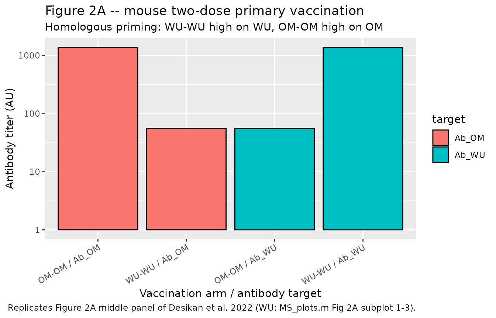
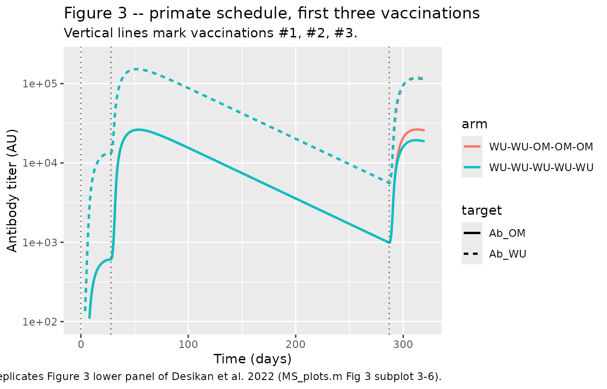
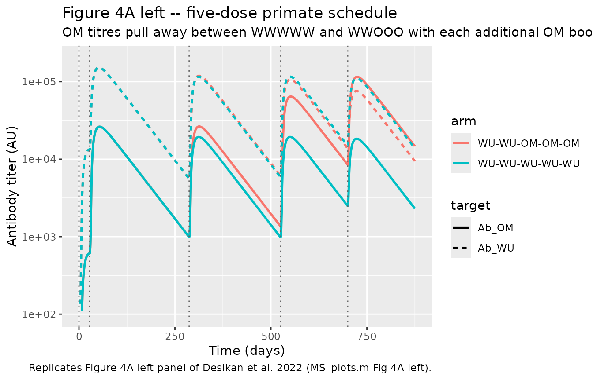
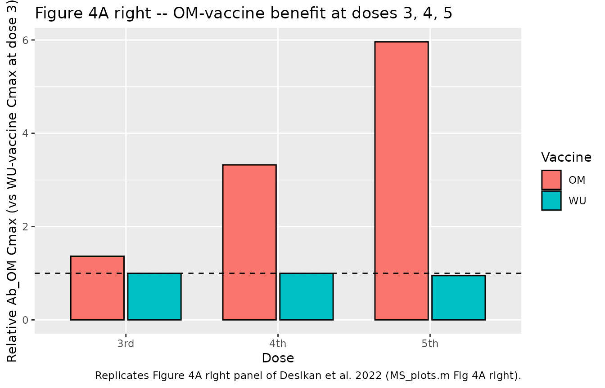
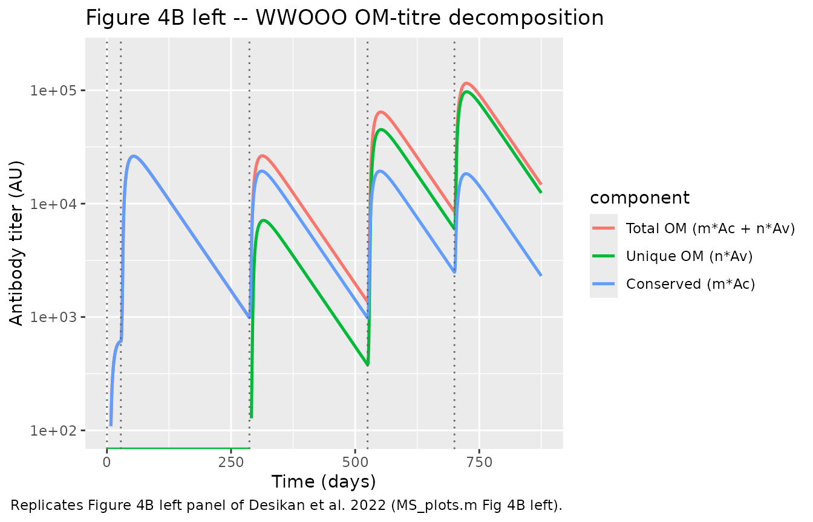
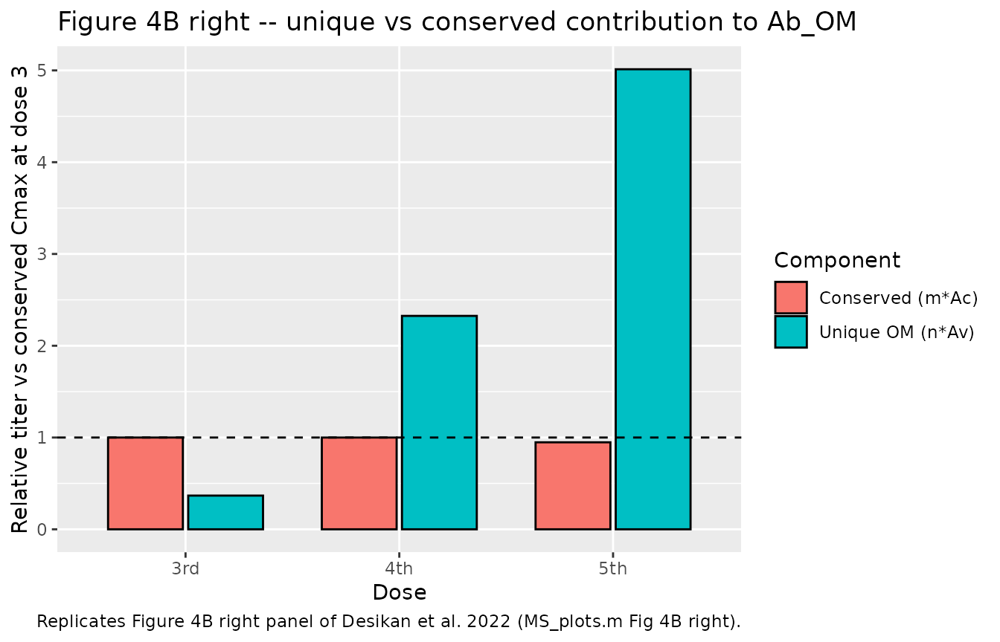
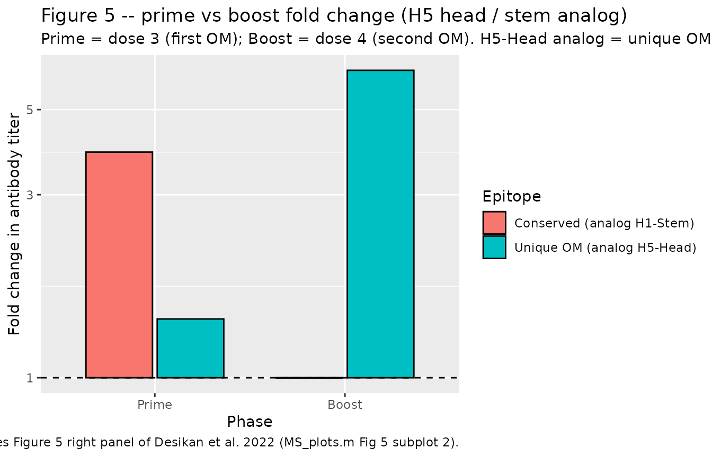

# SARS-CoV-2 / influenza vaccine immunodynamics (Desikan 2022)

## Model and source

- Citation: Desikan R, Linderman SL, Davis C, Zarnitsyna VI, Ahmed H,
  Antia R (2022). Vaccine models predict rules for updating vaccines
  against evolving pathogens such as SARS-CoV-2 and influenza in the
  context of pre-existing immunity. *Frontiers in Immunology* 13:985478.
- Article: <https://doi.org/10.3389/fimmu.2022.985478>
- Supplementary MATLAB code (used as the authoritative source for the
  ODE system and dose events): Frontiers Data Sheet 1 archive attached
  to the article; the driver `MS_plots.m` renders Figures 2A / 3 / 4A /
  4B / 5 and SI Figure 1, calling `model.m` (ODE right-hand side) and
  one function per vaccination sequence (`WW.m`, `OO.m`, `WWO.m`,
  `WWWWW.m`, `WWOOO.m`, `WWOW.m`, `WWWO.m`).

## Population and biological context

The model is a species-agnostic mechanistic description of the humoral
recall response to a two-strain vaccine sequence. The two vaccine
antigens (WU = ancestral SARS-CoV-2 Wuhan strain and OM = the Omicron
BA.1 variant in the paper’s applications) share a conserved epitope
class C and each carries a variant-unique epitope class (W on WU, O on
OM). The paper calibrates the model qualitatively against three sources:

- **Mouse two-dose primary vaccination** (Ying et al. 2022, cited in
  Desikan et al. 2022 as ref 19). BALB/c mice receive either WU-WU or
  OM-OM at 21-day intervals; neutralising titres against both WU and OM
  are reported. The paper reproduces this pattern in Figure 2A with a
  two-dose simulation at `Ag_dose = 1e3` and interval 21 days.
- **Rhesus macaque three-dose Moderna mRNA-1273 vs mRNA-Omicron booster
  study** (Gagne et al. 2022, ref 28). Primates first receive two doses
  of the WU vaccine, followed by a third boost (WU or OM). Figure 3 of
  Desikan et al. reproduces the observed anti-S IgG dynamics using the
  WWWWW and WWOOO simulations at `Ag_dose = 1e5`, vaccinations at days
  `(0, 4, 41, 75, 100) * 7 = (0, 28, 287, 525, 700)`.
- **Human clinical datasets** (Khan et al. 2022, ref 30; Ellebedy et
  al. 2014, ref 32; Goel et al. 2021, ref 8; Regev-Yochay et al. 2022,
  ref 31). Figure 2B reproduces the modest saturation of anti-Spike
  antibody titres across successive mRNA boosters. Figure 2C reproduces
  the OAS pattern in a WU- vaccinated Omicron-infected cohort. Figure 5
  reproduces the observation from the Ellebedy et al. 2014 H5N1 vaccine
  trial (H5 head vs H1 stem fold-change after prime vs boost) using the
  same WWOOO CoV-2 simulation, exploiting the structural analogy between
  H5-Head / H1-Stem and OM-unique / conserved epitope classes.

Programmatic access to the population metadata is available via
`readModelDb("Desikan_2022_covidVaccine")()$population`.

## Source trace

Model equations and parameter values were transcribed from the paper’s
Materials and Methods (Table 1 and unnumbered equations for the WU
response, with the OM response derived by symmetry) and from the
authors’ supplementary MATLAB code (Data Sheet 1). The table below
collects the per-parameter and per-equation origin in one place.

| Element | Value | Source location |
|----|----|----|
| `k_bind` | 5e-4 s^-1 day^-1 | Table 1 row `k` (antibody-antigen binding rate constant); `model.m` line 5 `k = param(1)` |
| `d_ag` | 1 day^-1 | Table 1 row `d_Ag` (decay rate of free and bound antigen); `model.m` line 6 `d = param(2)` |
| `d_ab` | 0.1 day^-1 | Table 1 row `d_Ab` (decay rate of antibody); `model.m` line 7 `da = param(3)` |
| `lambda_b` | 1 day^-1 | Table 1 row for max B-cell proliferation (`l` in the docling-parsed table; symbol lambda in the equations); `model.m` line 8 `s = param(4)` |
| `phi` | 100 (scaled units s) | Table 1 row for antigen amount that half-maximally stimulates B-cell proliferation; `model.m` line 9 `phi = param(5)` |
| `p_ab` | 0.1 day^-1 | Table 1 row `p` (antibody production rate per unit B cell); `model.m` line 10 `p = param(6)` |
| `d_b` | ln(2)/47 day^-1 approx 0.01475 | Table 1 row `d_B` (B-cell decay rate; 47-day half-life anchored to Cromer et al. 2021); `model.m` line 11 `db = param(7)`; `MS_plots.m` line 14 `db = log(2)/47` |
| `f_b` | 0.075 | Table 1 row for fractional stimulation of B cells in secondary responses by non-homotypic antigen (paper symbol `f`); `model.m` line 12 `fb = param(8)` |
| `m_conserved` | 1 | Table 1 row `m:n = 1:5` (number of conserved-epitope classes per antigen); `MS_plots.m` line 16 `Shared = 1` |
| `n_unique` | 5 | Table 1 row `m:n = 1:5` (number of unique-epitope classes per antigen); `MS_plots.m` line 17 `Unique = 5` |
| Ag_dose vaccinations \#1, \#2 | 1e5 (scaled units s) | Table 1 row for antigen dose vaccinations \#1 and \#2; `MS_plots.m` line 23 `Ag_dose = 10^5`; `WW.m` / `WWWWW.m` first dose |
| Ag_dose vaccinations \#3-#5 | 0.5e5 (scaled units s) | Table 1 row for antigen dose vaccinations \#3, \#4 and \#5; `WWWWW.m` line 36 `+0.5*Ag_dose` |
| Vaccination times (Gagne) | days (0, 28, 287, 525, 700) | Table 1 row for time of vaccinations \#1 - \#5 = (0, 4, 41, 75, 100) \* 7; `MS_plots.m` line 21 `TT = [0 4 41 75 100 125].*7` |
| Naive Bc(0) = Ac(0) | m_conserved = 1 | `WW.m` lines 17, 20 `Bc_0 = Shared*10^0`, `Ac_0 = Shared*10^0` |
| Naive Bw(0), Aw(0) at first WU dose | n_unique = 5 (seed) | `WW.m` lines 18, 21 `Bw_0 = Unique*10^0`, `Aw_0 = Unique*10^0`; encoded in this file via one-shot dose events at the first WU vaccination time |
| Naive Bv(0), Av(0) at first OM dose | n_unique = 5 (seed) | `OO.m` lines 19, 22 and the reset in `WWOOO.m` line 36 `... Unique*10^0 yB(end,12:13) Unique*10^0`; encoded via one-shot dose events at the first OM vaccination time |
| Detection floor (H5N1 comparison) | 5000 AU | Materials and Methods paragraph after Table 1: “antibody detection threshold as 5 x 10^3 AU”; `MS_plots.m` line 433 `detection_limit = 5*10^3` |
| ODE: `d/dt(agW)` | see model | `model.m` line 33 |
| ODE: `d/dt(agV)` | see model | `model.m` line 34 |
| ODE: `d/dt(agWw)` | see model | `model.m` line 35 |
| ODE: `d/dt(agWc)` | see model | `model.m` line 36 |
| ODE: `d/dt(agWwc)` | see model | `model.m` line 37 |
| ODE: `d/dt(agVv)` | see model | `model.m` line 38 |
| ODE: `d/dt(agVc)` | see model | `model.m` line 39 |
| ODE: `d/dt(agVvc)` | see model | `model.m` line 40 |
| ODE: `d/dt(Bc)` | see model | `model.m` line 41 |
| ODE: `d/dt(Bw)` | see model | `model.m` line 42 |
| ODE: `d/dt(Bv)` | see model | `model.m` line 43 |
| ODE: `d/dt(Ac)` | see model | `model.m` line 44 |
| ODE: `d/dt(Aw)` | see model | `model.m` line 45 |
| ODE: `d/dt(Av)` | see model | `model.m` line 46 |
| Observable Ab_WU = m_conserved \* Ac + n_unique \* Aw | n/a | `MS_plots.m` line 63 `Shared*YY5(end,12) + Unique*YY5(end,13)`; identical form appears in every Ab_WU plot call |
| Observable Ab_OM = m_conserved \* Ac + n_unique \* Av | n/a | `MS_plots.m` line 65 `Shared*YY5(end,12) + Unique*YY5(end,14)`; identical form appears in every Ab_OM plot call |
| Observable Ab_uniqueOM = n_unique \* Av | n/a | `MS_plots.m` line 360 `Unique.*YY2(:,14)` (Figure 4B) |
| Observable Ab_conserved = m_conserved \* Ac | n/a | `MS_plots.m` line 361 `Shared.*YY2(:,12)` (Figure 4B) |

## Dimensional analysis

The model uses dimensionless “scaled concentration” units (s in Table
1); the initial concentration of B cells is rescaled to 1 and the paper
states that at steady state antibody = B cell (so d_ab / p_ab = 0.1 /
0.1 = 1 forces Ac(steady) = Bc(steady) = m_conserved when there is no
antigen). Time is in days throughout.

| ODE term | Right-hand-side units |
|----|----|
| `-k_bind * agW * (Aw + Ac)` | `(s^-1 day^-1) * s * s = s / day` – matches `d/dt(agW)` if agW carries s. Actually all state variables carry s, and k_bind absorbs the extra s^-1 to make the bimolecular collision rate `(s * s)/day / s = s/day`. |
| `-d_ag * agW` | `(1/day) * s = s / day`. |
| `+k_bind * agW * Aw` | Same as first row. |
| `-d_ab * Aw` | `(1/day) * s = s / day`. |
| `+p_ab * Bw` | `(1/day) * s = s / day`. |
| `-d_b * Bc` | `(1/day) * s = s / day`. |
| `lambda_b * Bc * (Ag_sum)/(phi + Ag_sum)` | `(1/day) * s * dimensionless = s / day`. `phi` carries the same s units as the antigen sum inside the saturating dose-response. |

The observables `Ab_WU`, `Ab_OM`, `Ab_uniqueWU`, `Ab_uniqueOM` and
`Ab_conserved` are all dimensionless multiplicity-weighted linear
combinations of `Ac`, `Aw` and `Av` (each in s units). All figures in
the paper display these on log-linear axes in “arbitrary units (AU)”.

## Simulation helpers

The model exposes 14 dosable compartments. Each vaccination consists of
(a) a bolus dose event on the appropriate free-antigen compartment
(`agW` for WU vaccinations, `agV` for OM vaccinations) plus, at the
first respective vaccination time, a one-shot seed dose of
`n_unique = 5` on each of `Bw` / `Aw` (for WU) or `Bv` / `Av` (for OM).
This exactly reproduces the naive-precursor initial conditions in `WW.m`
/ `OO.m` and the state resets at the first OM exposure in `WWO.m` /
`WWOOO.m` in the paper’s supplementary code.

``` r

mod <- readModelDb("Desikan_2022_covidVaccine")

n_unique_val <- 5     # multiplicity of unique epitopes (from Table 1 m:n = 1:5)

# Build the event table for a vaccination schedule.
#   schedule    : character vector of "W" or "O" (WU or OM vaccine per dose)
#   dose_times  : numeric vector of dose times (days), same length as schedule
#   dose_amts   : numeric vector of dose amounts (scaled units s)
#   obs_grid    : numeric vector of observation times (days)
build_schedule <- function(schedule, dose_times, dose_amts, obs_grid) {
  stopifnot(length(schedule) == length(dose_times),
            length(schedule) == length(dose_amts))
  ev <- rxode2::et()
  seededWU <- FALSE
  seededOM <- FALSE
  for (i in seq_along(schedule)) {
    tv  <- dose_times[i]
    amt <- dose_amts[i]
    if (schedule[i] == "W") {
      ev <- ev |>
        rxode2::et(amt = amt, time = tv, cmt = "agW", evid = 1L)
      if (!seededWU) {
        ev <- ev |>
          rxode2::et(amt = n_unique_val, time = tv, cmt = "Bw", evid = 1L) |>
          rxode2::et(amt = n_unique_val, time = tv, cmt = "Aw", evid = 1L)
        seededWU <- TRUE
      }
    } else if (schedule[i] == "O") {
      ev <- ev |>
        rxode2::et(amt = amt, time = tv, cmt = "agV", evid = 1L)
      if (!seededOM) {
        ev <- ev |>
          rxode2::et(amt = n_unique_val, time = tv, cmt = "Bv", evid = 1L) |>
          rxode2::et(amt = n_unique_val, time = tv, cmt = "Av", evid = 1L)
        seededOM <- TRUE
      }
    } else {
      stop("schedule entries must be 'W' or 'O'")
    }
  }
  ev |> rxode2::et(obs_grid)
}
```

## Steady-state and pre-vaccination baseline check

Before any vaccination, only the conserved-epitope-specific B cells and
antibodies (Bc, Ac) are present, at their naive levels (m_conserved =
1). With no antigen the B-cell dose-response term is zero, so Bc decays
first-order at `d_b = ln(2)/47` (47-day half-life). Ac is fed by
`p_ab * Bc` and lost at rate `d_ab = 0.1 /day`; because
`d_ab / p_ab = 1`, the paper’s “antibody = B cell at steady state” holds
at any true steady state where Bc is constant, but during free decay Ac
slightly leads Bc because Ac equilibrates ~7x faster than Bc decays
(`d_ab / d_b = 0.1 / 0.01475 = 6.8`). Confirm the 47-day Bc half-life
and the absence of any W- or V-specific pool by running the model with
no vaccination events.

``` r

ev_null <- rxode2::et() |>
  rxode2::et(seq(0, 200, by = 1))
sim_null <- rxode2::rxSolve(mod, ev_null, cores = 1L) |> as.data.frame()

baseline_summary <- sim_null |>
  dplyr::filter(time %in% c(0, 47, 94, 141, 200)) |>
  dplyr::select(time, Bc, Ac, Bw, Aw, Bv, Av, Ab_WU, Ab_OM)
baseline_summary
#>   time         Bc         Ac Bw Aw Bv Av      Ab_WU      Ab_OM
#> 1    0 1.00000000 1.00000000  0  0  0  0 1.00000000 1.00000000
#> 2   47 0.50000000 0.58492181  0  0  0  0 0.58492181 0.58492181
#> 3   94 0.25000000 0.29323330  0  0  0  0 0.29323330 0.29323330
#> 4  141 0.12500000 0.14662368  0  0  0  0 0.14662368 0.14662368
#> 5  200 0.05236261 0.06142084  0  0  0  0 0.06142084 0.06142084
```

Assertions:

- `Bc(0) = Ac(0) = 1` exactly (naive levels).
- `Bc(47) approx 0.5` (47-day half-life).
- `Bw`, `Aw`, `Bv`, `Av` are exactly zero throughout (no seeding dose).
- `Ac(t)` stays within
  `[Bc(t), (d_ab / (d_ab - d_b)) * Bc(t)] approx [Bc, 1.173 * Bc]` (the
  analytic transient bound).

``` r

stopifnot(baseline_summary$Bc[baseline_summary$time == 0] == 1)
stopifnot(baseline_summary$Ac[baseline_summary$time == 0] == 1)
Bc_47   <- baseline_summary$Bc[baseline_summary$time == 47]
stopifnot(abs(Bc_47 - 0.5) < 5e-3)                                # 47-day half-life
stopifnot(all(baseline_summary$Bw == 0, baseline_summary$Aw == 0,
              baseline_summary$Bv == 0, baseline_summary$Av == 0)) # no W or V seeding
d_ab_over_diff <- 0.1 / (0.1 - log(2) / 47)                        # ~1.173
Ac_over_Bc <- baseline_summary$Ac / baseline_summary$Bc
stopifnot(all(Ac_over_Bc >= 1 - 1e-3))                              # Ac >= Bc during decay
stopifnot(all(Ac_over_Bc <= d_ab_over_diff * (1 + 1e-3)))           # bounded above by analytic limit
```

## Figure 2A – mouse two-dose homologous priming (Ying et al. 2022)

Figure 2A of Desikan et al. compares the simulated WU-WU (two-dose WU
vaccine) and OM-OM (two-dose OM vaccine) end-of-experiment antibody
titres, reproducing the observation from Ying et al. 2022 that WU-WU
elicits high anti-WU / low anti-OM titres and OM-OM elicits the
opposite. The paper uses the “mouse schedule” from `MS_plots.m` line 33:
`Ag_dose2 = 1e3`, doses at t = 0 and 21 days, sampled at t = 36 days.

``` r

mouse_grid  <- seq(0, 36, by = 0.1)
mouse_amts  <- c(1e3, 1e3)
mouse_times <- c(0, 21)

ev_WW <- build_schedule(c("W", "W"), mouse_times, mouse_amts, mouse_grid)
ev_OO <- build_schedule(c("O", "O"), mouse_times, mouse_amts, mouse_grid)

sim_WW <- rxode2::rxSolve(mod, ev_WW, cores = 1L) |> as.data.frame() |>
  dplyr::mutate(arm = "WU-WU")
sim_OO <- rxode2::rxSolve(mod, ev_OO, cores = 1L) |> as.data.frame() |>
  dplyr::mutate(arm = "OM-OM")

fig2A_bars <- dplyr::bind_rows(
  tibble::tibble(arm = "WU-WU", target = "Ab_WU",
                 titer = sim_WW$Ab_WU[which.max(sim_WW$time)]),
  tibble::tibble(arm = "WU-WU", target = "Ab_OM",
                 titer = sim_WW$Ab_OM[which.max(sim_WW$time)]),
  tibble::tibble(arm = "OM-OM", target = "Ab_WU",
                 titer = sim_OO$Ab_WU[which.max(sim_OO$time)]),
  tibble::tibble(arm = "OM-OM", target = "Ab_OM",
                 titer = sim_OO$Ab_OM[which.max(sim_OO$time)])
)

ggplot(fig2A_bars, aes(interaction(arm, target, sep = " / "), titer,
                       fill = target)) +
  geom_col(colour = "black") +
  scale_y_log10() +
  labs(x = "Vaccination arm / antibody target", y = "Antibody titer (AU)",
       title = "Figure 2A -- mouse two-dose primary vaccination",
       subtitle = "Homologous priming: WU-WU high on WU, OM-OM high on OM",
       caption = "Replicates Figure 2A middle panel of Desikan et al. 2022 (WU: MS_plots.m Fig 2A subplot 1-3).") +
  theme(axis.text.x = element_text(angle = 30, hjust = 1))
```



Quantitative check: model outputs at t = 36 should be mirror-symmetric
between the WU-WU and OM-OM arms (the model is structurally symmetric
between W and V sides).

``` r

tail_WW <- dplyr::filter(sim_WW, time == 36)
tail_OO <- dplyr::filter(sim_OO, time == 36)
stopifnot(abs(tail_WW$Ab_WU - tail_OO$Ab_OM) < 1e-6)
stopifnot(abs(tail_WW$Ab_OM - tail_OO$Ab_WU) < 1e-6)
# Homologous / heterologous titer ratio should be at least an order of
# magnitude at the end of the second dose (paper Fig 2A LHS: ratio ~55).
stopifnot(tail_WW$Ab_WU / tail_WW$Ab_OM > 10)
```

## Figures 3, 4A, 4B – primate WWWWW vs WWOOO (Gagne et al. 2022)

Figure 3 of Desikan et al. reproduces the observed pattern in Gagne et
al. that WU-WU-WU and WU-WU-OM give similar anti-OM titres at the third
dose. Figure 4A extends this with two additional boosts (doses \#4 and
\#5) and shows that OM titres progressively pull away between the WWWWW
and WWOOO simulations as additional OM vaccinations are added. Figure 4B
shows that the additional OM titre comes almost entirely from the
unique-epitope Av response, not from the conserved-epitope Ac response.

The reference schedule is defined in Table 1 and `MS_plots.m` line 21:
vaccinations at days (0, 28, 287, 525, 700), with doses (1e5, 1e5,
0.5e5, 0.5e5, 0.5e5). The simulation runs to day 875.

``` r

gagne_grid  <- seq(0, 875, by = 0.5)
gagne_amts  <- c(1e5, 1e5, 0.5e5, 0.5e5, 0.5e5)
gagne_times <- c(0, 28, 287, 525, 700)

ev_WWWWW <- build_schedule(c("W","W","W","W","W"), gagne_times, gagne_amts,
                           gagne_grid)
ev_WWOOO <- build_schedule(c("W","W","O","O","O"), gagne_times, gagne_amts,
                           gagne_grid)

sim_WWWWW <- rxode2::rxSolve(mod, ev_WWWWW, cores = 1L) |>
  as.data.frame() |>
  dplyr::mutate(arm = "WU-WU-WU-WU-WU")
sim_WWOOO <- rxode2::rxSolve(mod, ev_WWOOO, cores = 1L) |>
  as.data.frame() |>
  dplyr::mutate(arm = "WU-WU-OM-OM-OM")

sim_all <- dplyr::bind_rows(sim_WWWWW, sim_WWOOO) |>
  dplyr::select(arm, time, Ab_WU, Ab_OM, Ab_uniqueOM, Ab_conserved) |>
  tidyr::pivot_longer(Ab_WU:Ab_conserved, names_to = "target",
                      values_to = "titer")
```

### Figure 3 – WU-WU-WU vs WU-WU-OM (day 0 - day ~300)

``` r

sim_all |>
  dplyr::filter(time <= 320, target %in% c("Ab_WU", "Ab_OM")) |>
  ggplot(aes(time, titer, colour = arm, linetype = target)) +
  geom_line(linewidth = 0.9) +
  scale_y_log10(limits = c(1e2, 10 ^ 5.3)) +
  geom_vline(xintercept = gagne_times[1:3], linetype = "dotted",
             colour = "grey40") +
  labs(x = "Time (days)", y = "Antibody titer (AU)",
       title = "Figure 3 -- primate schedule, first three vaccinations",
       subtitle = "Vertical lines mark vaccinations #1, #2, #3.",
       caption = "Replicates Figure 3 lower panel of Desikan et al. 2022 (MS_plots.m Fig 3 subplot 3-6).")
#> Warning: Removed 48 rows containing missing values or values outside the scale range
#> (`geom_line()`).
```



Quantitative check: at day 300 (just after vaccination \#3), the WWWWW
arm and the WWOOO arm should have very similar Ab_OM Cmax (paper
conclusion: “vaccination \#3 with the OM-vaccine does not elicit higher
antibody titres to OM than vaccination \#3 with the WU-vaccine”).

``` r

peak_after_dose3 <- function(sim) {
  s <- sim[sim$time > 287 & sim$time < 525, ]
  data.frame(Ab_OM_max = max(s$Ab_OM), Ab_WU_max = max(s$Ab_WU))
}
p3_WWWWW <- peak_after_dose3(sim_WWWWW)
p3_WWOOO <- peak_after_dose3(sim_WWOOO)
p3_ratio <- p3_WWOOO$Ab_OM_max / p3_WWWWW$Ab_OM_max
cat(sprintf("Dose-3 Ab_OM Cmax ratio (OM-vac / WU-vac) = %.2f\n", p3_ratio))
#> Dose-3 Ab_OM Cmax ratio (OM-vac / WU-vac) = 1.36
stopifnot(p3_ratio > 1)        # OM vaccine gives at least a slight boost
stopifnot(p3_ratio < 3)        # but not a large one (paper: ~1.3x)
```

### Figure 4A – five-dose simulation with fold-boost bar plot

``` r

sim_all |>
  dplyr::filter(target %in% c("Ab_WU", "Ab_OM")) |>
  ggplot(aes(time, titer, colour = arm, linetype = target)) +
  geom_line(linewidth = 0.9) +
  scale_y_log10(limits = c(1e2, 10 ^ 5.3)) +
  geom_vline(xintercept = gagne_times, linetype = "dotted", colour = "grey40") +
  labs(x = "Time (days)", y = "Antibody titer (AU)",
       title = "Figure 4A left -- five-dose primate schedule",
       subtitle = "OM titres pull away between WWWWW and WWOOO with each additional OM boost.",
       caption = "Replicates Figure 4A left panel of Desikan et al. 2022 (MS_plots.m Fig 4A left).")
#> Warning: Removed 48 rows containing missing values or values outside the scale range
#> (`geom_line()`).
```



Figure 4A right (fold-boost bar plot). Each bar is the Cmax of Ab_OM in
the inter-dose interval, normalised by the WWWWW Cmax after dose 3.

``` r

peak_in_interval <- function(sim, target, t_lo, t_hi) {
  s <- sim[sim$time > t_lo & sim$time < t_hi, ]
  max(s[[target]])
}

yy3_WW <- peak_in_interval(sim_WWWWW, "Ab_OM", gagne_times[3], gagne_times[4])
yy3_OO <- peak_in_interval(sim_WWOOO, "Ab_OM", gagne_times[3], gagne_times[4])
yy4_WW <- peak_in_interval(sim_WWWWW, "Ab_OM", gagne_times[4], gagne_times[5])
yy4_OO <- peak_in_interval(sim_WWOOO, "Ab_OM", gagne_times[4], gagne_times[5])
yy5_WW <- peak_in_interval(sim_WWWWW, "Ab_OM", gagne_times[5], 875)
yy5_OO <- peak_in_interval(sim_WWOOO, "Ab_OM", gagne_times[5], 875)

fig4A_right <- tibble::tibble(
  Dose = factor(rep(c("3rd", "4th", "5th"), each = 2),
                levels = c("3rd", "4th", "5th")),
  Vaccine = rep(c("WU", "OM"), 3),
  Relative_titer_vs_OM = c(yy3_WW / yy3_WW, yy3_OO / yy3_WW,
                           yy4_WW / yy3_WW, yy4_OO / yy3_WW,
                           yy5_WW / yy3_WW, yy5_OO / yy3_WW)
)

ggplot(fig4A_right, aes(Dose, Relative_titer_vs_OM, fill = Vaccine)) +
  geom_col(position = position_dodge(width = 0.75), colour = "black",
           width = 0.7) +
  geom_hline(yintercept = 1, linetype = "dashed") +
  labs(y = "Relative Ab_OM Cmax (vs WU-vaccine Cmax at dose 3)",
       title = "Figure 4A right -- OM-vaccine benefit at doses 3, 4, 5",
       caption = "Replicates Figure 4A right panel of Desikan et al. 2022 (MS_plots.m Fig 4A right).")
```



``` r


fig4A_right
#> # A tibble: 6 × 3
#>   Dose  Vaccine Relative_titer_vs_OM
#>   <fct> <chr>                  <dbl>
#> 1 3rd   WU                     1    
#> 2 3rd   OM                     1.36 
#> 3 4th   WU                     1.000
#> 4 4th   OM                     3.32 
#> 5 5th   WU                     0.948
#> 6 5th   OM                     5.96
```

### Figure 4B – unique vs conserved epitope contributions (WWOOO)

Figure 4B decomposes the total Ab_OM titre into contributions from the
OM- unique epitope class (Av) and the conserved epitope class (Ac). The
paper’s key claim is that the fold-boost at doses \#4 and \#5 is driven
almost entirely by the OM-unique arm (the conserved arm has saturated).

``` r

sim_WWOOO |>
  dplyr::select(time, Ab_OM, Ab_uniqueOM, Ab_conserved) |>
  tidyr::pivot_longer(Ab_OM:Ab_conserved, names_to = "component",
                      values_to = "titer") |>
  dplyr::mutate(component = factor(component,
                                    levels = c("Ab_OM", "Ab_uniqueOM", "Ab_conserved"),
                                    labels = c("Total OM (m*Ac + n*Av)",
                                               "Unique OM (n*Av)",
                                               "Conserved (m*Ac)"))) |>
  ggplot(aes(time, titer, colour = component)) +
  geom_line(linewidth = 0.9) +
  scale_y_log10(limits = c(1e2, 10 ^ 5.3)) +
  geom_vline(xintercept = gagne_times, linetype = "dotted", colour = "grey40") +
  labs(x = "Time (days)", y = "Antibody titer (AU)",
       title = "Figure 4B left -- WWOOO OM-titre decomposition",
       caption = "Replicates Figure 4B left panel of Desikan et al. 2022 (MS_plots.m Fig 4B left).")
#> Warning in scale_y_log10(limits = c(100, 10^5.3)): log-10 transformation
#> introduced infinite values.
#> Warning: Removed 32 rows containing missing values or values outside the scale range
#> (`geom_line()`).
```



Figure 4B right (fold-boost bar plot of unique vs conserved
contributions, normalised by conserved Cmax at dose 3):

``` r

uy3 <- peak_in_interval(sim_WWOOO, "Ab_uniqueOM", gagne_times[3], gagne_times[4])
cy3 <- peak_in_interval(sim_WWOOO, "Ab_conserved", gagne_times[3], gagne_times[4])
uy4 <- peak_in_interval(sim_WWOOO, "Ab_uniqueOM", gagne_times[4], gagne_times[5])
cy4 <- peak_in_interval(sim_WWOOO, "Ab_conserved", gagne_times[4], gagne_times[5])
uy5 <- peak_in_interval(sim_WWOOO, "Ab_uniqueOM", gagne_times[5], 875)
cy5 <- peak_in_interval(sim_WWOOO, "Ab_conserved", gagne_times[5], 875)

fig4B_right <- tibble::tibble(
  Dose      = factor(rep(c("3rd", "4th", "5th"), each = 2),
                     levels = c("3rd", "4th", "5th")),
  Component = rep(c("Unique OM (n*Av)", "Conserved (m*Ac)"), 3),
  Relative_titer_vs_conserved_dose3 = c(uy3 / cy3, cy3 / cy3,
                                        uy4 / cy3, cy4 / cy3,
                                        uy5 / cy3, cy5 / cy3)
)

ggplot(fig4B_right, aes(Dose, Relative_titer_vs_conserved_dose3, fill = Component)) +
  geom_col(position = position_dodge(width = 0.75), colour = "black",
           width = 0.7) +
  geom_hline(yintercept = 1, linetype = "dashed") +
  labs(y = "Relative titer vs conserved Cmax at dose 3",
       title = "Figure 4B right -- unique vs conserved contribution to Ab_OM",
       caption = "Replicates Figure 4B right panel of Desikan et al. 2022 (MS_plots.m Fig 4B right).")
```



``` r


fig4B_right
#> # A tibble: 6 × 3
#>   Dose  Component        Relative_titer_vs_conserved_dose3
#>   <fct> <chr>                                        <dbl>
#> 1 3rd   Unique OM (n*Av)                             0.367
#> 2 3rd   Conserved (m*Ac)                             1    
#> 3 4th   Unique OM (n*Av)                             2.33 
#> 4 4th   Conserved (m*Ac)                             1.000
#> 5 5th   Unique OM (n*Av)                             5.01 
#> 6 5th   Conserved (m*Ac)                             0.948
```

Quantitative check: at dose 3, the unique-epitope contribution should be
much smaller than the conserved-epitope contribution; by dose 5 the
unique contribution should have overtaken it by roughly 5-fold.

``` r

u_over_c_dose3 <- uy3 / cy3
u_over_c_dose5 <- uy5 / cy5
cat(sprintf("Dose 3 unique/conserved ratio = %.2f (small)\n", u_over_c_dose3))
#> Dose 3 unique/conserved ratio = 0.37 (small)
cat(sprintf("Dose 5 unique/conserved ratio = %.2f (large)\n", u_over_c_dose5))
#> Dose 5 unique/conserved ratio = 5.29 (large)
stopifnot(u_over_c_dose3 < 1)     # dose 3: conserved dominates
stopifnot(u_over_c_dose5 > 4)     # dose 5: unique overwhelmingly dominates
```

## Figure 5 – H5N1 prime vs boost (Ellebedy et al. 2014)

Figure 5 of Desikan et al. maps the CoV-2 WWOOO simulation onto the
Ellebedy 2014 H5N1 vaccine study by identifying the H5-head with the
OM-unique epitope class and the H1-stem with the conserved epitope
class. Under this mapping: prime = first OM exposure (dose 3 in the
CoV-2 simulation) and boost = second OM exposure (dose 4). The paper
reports the observed fold-change in each compartment relative to a
5000-AU detection floor.

``` r

detection_floor <- 5000

# Pre-dose-3 conserved Ac titer (yy2(2) in MS_plots.m):
Ac_pre_dose3 <- sim_WWOOO$Ab_conserved[which.min(abs(sim_WWOOO$time -
                                                       (gagne_times[3] - 0.01)))]
yy2_1 <- detection_floor
yy2_2 <- max(detection_floor, Ac_pre_dose3)

# Cmax values in each inter-dose interval:
yy3 <- c(uniqueOM  = peak_in_interval(sim_WWOOO, "Ab_uniqueOM",
                                       gagne_times[3], gagne_times[4]),
         conserved = peak_in_interval(sim_WWOOO, "Ab_conserved",
                                       gagne_times[3], gagne_times[4]))
yy4 <- c(uniqueOM  = peak_in_interval(sim_WWOOO, "Ab_uniqueOM",
                                       gagne_times[4], gagne_times[5]),
         conserved = peak_in_interval(sim_WWOOO, "Ab_conserved",
                                       gagne_times[4], gagne_times[5]))

fig5 <- tibble::tibble(
  Phase = factor(rep(c("Prime", "Boost"), each = 2),
                 levels = c("Prime", "Boost")),
  Epitope = rep(c("Unique OM (analog H5-Head)",
                  "Conserved (analog H1-Stem)"), 2),
  Fold_change = c(yy3["uniqueOM"] / yy2_1, yy3["conserved"] / yy2_2,
                  yy4["uniqueOM"] / yy3["uniqueOM"],
                  yy4["conserved"] / yy3["conserved"])
)

ggplot(fig5, aes(Phase, Fold_change, fill = Epitope)) +
  geom_col(position = position_dodge(width = 0.75), colour = "black",
           width = 0.7) +
  geom_hline(yintercept = 1, linetype = "dashed") +
  scale_y_log10() +
  labs(y = "Fold change in antibody titer",
       title = "Figure 5 -- prime vs boost fold change (H5 head / stem analog)",
       subtitle = "Prime = dose 3 (first OM); Boost = dose 4 (second OM). H5-Head analog = unique OM; H1-Stem analog = conserved.",
       caption = "Replicates Figure 5 right panel of Desikan et al. 2022 (MS_plots.m Fig 5 subplot 2).")
```



``` r


fig5
#> # A tibble: 4 × 3
#>   Phase Epitope                    Fold_change
#>   <fct> <chr>                            <dbl>
#> 1 Prime Unique OM (analog H5-Head)       1.42 
#> 2 Prime Conserved (analog H1-Stem)       3.87 
#> 3 Boost Unique OM (analog H5-Head)       6.33 
#> 4 Boost Conserved (analog H1-Stem)       1.000
```

Quantitative check: at prime (first OM), the unique-epitope fold-change
should be small (paper: H5 head prime fold change ~1-3), and the
conserved-epitope fold-change should be moderate (paper: H1 stem prime
fold change ~5-20); at boost (second OM) the unique-epitope fold-change
should be larger than at prime, and the conserved-epitope fold-change
should be near 1.

``` r

# Boost unique OM fold-change should be larger than prime unique OM fold-change
stopifnot(fig5$Fold_change[fig5$Phase == "Boost" &
                            fig5$Epitope == "Unique OM (analog H5-Head)"] >
          fig5$Fold_change[fig5$Phase == "Prime" &
                            fig5$Epitope == "Unique OM (analog H5-Head)"])
# Boost conserved fold-change should be modest (saturated response)
stopifnot(fig5$Fold_change[fig5$Phase == "Boost" &
                            fig5$Epitope == "Conserved (analog H1-Stem)"] < 5)
```

## Assumptions and deviations

- **All model constants are FIXED**, and there is no IIV or residual
  error. The model is presented and used as a deterministic mechanistic
  framework; the paper does not fit any parameters to per-subject
  longitudinal data. If a downstream user wishes to add IIV (e.g., to
  explore parameter sensitivity), the natural targets are `k_bind`,
  `lambda_b`, `phi` and `f_b`, with all other values held at
  literature-anchored biology (antigen and antibody half-lives; B-cell
  half-life from Cromer et al. 2021).
- **Seeding of naive precursors via one-shot dose events.** In the
  MATLAB supplement, WU-unique-specific B cells and antibodies are
  initialised at `Unique = 5` at t = 0 when the first vaccination is WU
  (files `WW.m`, `WWWWW.m`, `WWOOO.m`, `WWO.m`, `WWOW.m`, `WWWO.m`) and
  OM-unique-specific B cells and antibodies are initialised at 5 at t =
  0 when the first vaccination is OM (`OO.m`, `O.m`), or reset to 5 at
  the first OM exposure when it comes after WU-priming (WWO / WWOOO /
  WWOW). This state manipulation is encoded here as one-shot bolus dose
  events on the `Bw` / `Aw` / `Bv` / `Av` compartments at the
  appropriate vaccination times (the `build_schedule()` helper takes
  care of this). The Bc / Ac naive m_conserved level is set as an
  initial condition in the model file (Bc(0) = Ac(0) = m_conserved)
  because it is common to every scenario.
- **`Ag_dose` unit is dimensionless.** Table 1 defines the antigen dose
  in “scaled concentration units (s)”; the paper does not tie this to a
  specific clinical dose in mg or ug of mRNA / spike protein. Users
  wishing to compare simulations across mouse / primate / human cohorts
  should treat Ag_dose as a species-scaled amount rather than a
  universal quantity.
- **Multi-species applicability.** The model is species-agnostic; the
  same parameter set is used for mouse (Ying 2022 - Figure 2A), primate
  (Gagne 2022
  - Figures 3, 4A, 4B) and human (Khan 2022 - Figure 2C; Ellebedy 2014 -
    Figure 5) cohorts. The paper motivates this by qualitative pattern
    matching (paper Discussion: “at this stage, the experimental data
    does not include precise measurements … the results of simpler
    models can typically be more robust than those of complex models”).
    The vignette here reproduces Figures 2A (mouse), 3, 4A, 4B (primate)
    and 5 (H5N1 human analog); Figure 2C (Khan 2022 human OAS) uses the
    same model with a different schedule and is not separately
    reproduced.
- **Figures not reproduced.** Figure 1 (schematic), Figure 2B (Goel /
  Regev- Yochay saturation plot), Figure 2C (Khan 2022
  vaccinated-vs-unvaccinated Omicron infection), and SI Figure 1 (WWOW /
  WWWO alternate schedules) are used in the paper for context or
  additional scenarios; they are supported by the same model with
  different `build_schedule()` inputs but are omitted here to keep the
  render time bounded.
