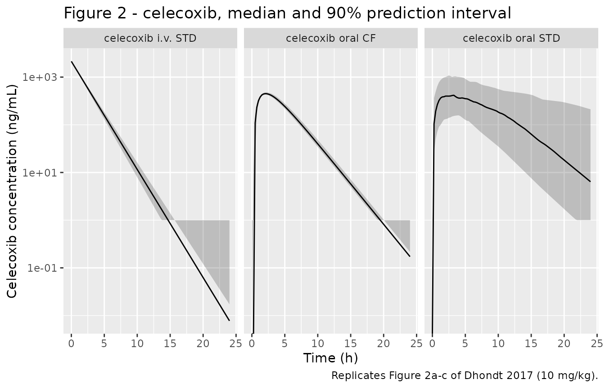
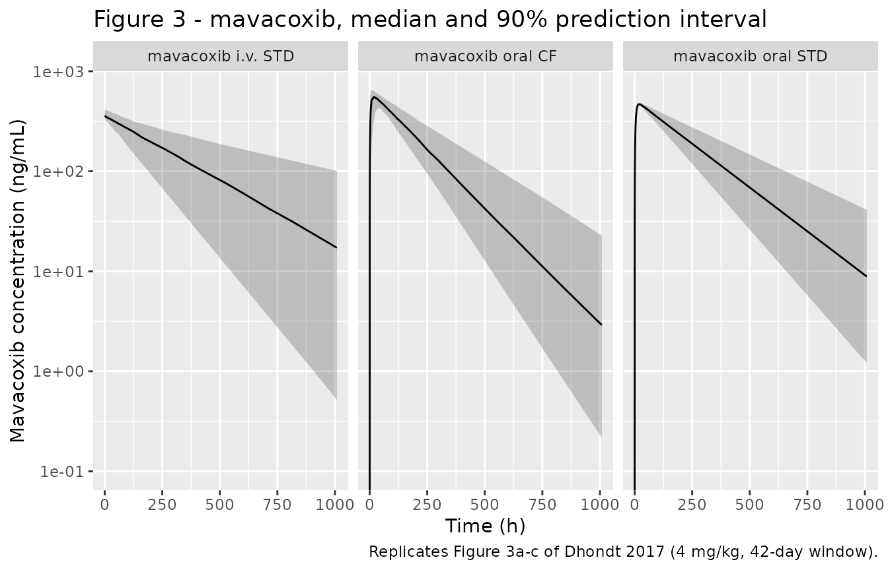
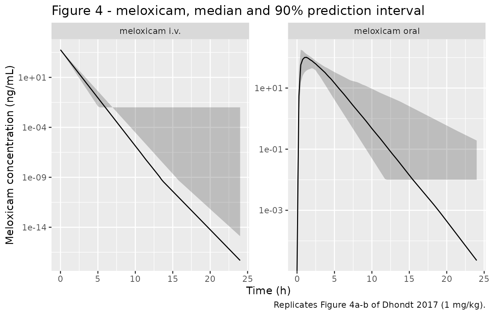

# COX-2 selective inhibitors celecoxib, mavacoxib and meloxicam in cockatiels (Dhondt 2017)

## Model and source

Dhondt and colleagues gave three COX-2 selective non-steroidal
anti-inflammatory drugs to cockatiels (*Nymphicus hollandicus*) and
fitted a population PK model to **each route and formulation
separately**. Celecoxib and mavacoxib were each given intravenously as
an analytical standard solution (STD), orally as that same standard
solution, and orally as the ground commercial tablet (CF); meloxicam,
for which an injectable commercial formulation exists, was given
intravenously and orally as the commercial product only. That is eight
independent fits, reported in Tables 1, 2 and 3, and they are packaged
here as eight model files.

The fits share no parameters. The oral arms report *apparent*
disposition (`Vd/F`, `Cl/F`) because no bioavailability term was
estimated, so the oral `Vd/F` is not the intravenous `Vd` rescaled by
the separately reported `F%` (celecoxib STD: 5.87 L/kg oral against 4.67
L/kg intravenous at F = 110%). Collapsing the arms into one model per
drug would therefore not reproduce either profile, which is why each arm
is its own file.

``` r

arms <- tibble::tribble(
  ~arm,                   ~drug,        ~model,                                       ~dose, ~dose_cmt,
  "celecoxib i.v. STD",   "celecoxib",  "Dhondt_2017_celecoxib_cockatiel_iv",         10000, "central",
  "celecoxib oral STD",   "celecoxib",  "Dhondt_2017_celecoxib_cockatiel_oral_std",   10000, "depot",
  "celecoxib oral CF",    "celecoxib",  "Dhondt_2017_celecoxib_cockatiel_oral_cf",    10000, "depot",
  "mavacoxib i.v. STD",   "mavacoxib",  "Dhondt_2017_mavacoxib_cockatiel_iv",          4000, "central",
  "mavacoxib oral STD",   "mavacoxib",  "Dhondt_2017_mavacoxib_cockatiel_oral_std",    4000, "depot",
  "mavacoxib oral CF",    "mavacoxib",  "Dhondt_2017_mavacoxib_cockatiel_oral_cf",     4000, "depot",
  "meloxicam i.v.",       "meloxicam",  "Dhondt_2017_meloxicam_cockatiel_iv",          1000, "central",
  "meloxicam oral",       "meloxicam",  "Dhondt_2017_meloxicam_cockatiel_oral",        1000, "depot"
)

mods <- stats::setNames(lapply(arms$model, readModelDb), arms$arm)
uis <- lapply(mods, rxode2::rxode)
#> ℹ parameter labels from comments will be replaced by 'label()'
#> ℹ parameter labels from comments will be replaced by 'label()'
#> ℹ parameter labels from comments will be replaced by 'label()'
#> ℹ parameter labels from comments will be replaced by 'label()'
#> ℹ parameter labels from comments will be replaced by 'label()'
#> ℹ parameter labels from comments will be replaced by 'label()'
#> ℹ parameter labels from comments will be replaced by 'label()'
#> ℹ parameter labels from comments will be replaced by 'label()'

knitr::kable(
  arms |>
    dplyr::mutate(`Dose (mg/kg)` = dose / 1000) |>
    dplyr::select(arm, model, `Dose (mg/kg)`, dose_cmt) |>
    dplyr::rename(
      "Arm" = arm,
      "Model file" = model,
      "Dosed compartment" = dose_cmt
    ),
  caption = "The eight independently fitted arms of Dhondt 2017."
)
```

| Arm | Model file | Dose (mg/kg) | Dosed compartment |
|:---|:---|---:|:---|
| celecoxib i.v. STD | Dhondt_2017_celecoxib_cockatiel_iv | 10 | central |
| celecoxib oral STD | Dhondt_2017_celecoxib_cockatiel_oral_std | 10 | depot |
| celecoxib oral CF | Dhondt_2017_celecoxib_cockatiel_oral_cf | 10 | depot |
| mavacoxib i.v. STD | Dhondt_2017_mavacoxib_cockatiel_iv | 4 | central |
| mavacoxib oral STD | Dhondt_2017_mavacoxib_cockatiel_oral_std | 4 | depot |
| mavacoxib oral CF | Dhondt_2017_mavacoxib_cockatiel_oral_cf | 4 | depot |
| meloxicam i.v. | Dhondt_2017_meloxicam_cockatiel_iv | 1 | central |
| meloxicam oral | Dhondt_2017_meloxicam_cockatiel_oral | 1 | depot |

The eight independently fitted arms of Dhondt 2017. {.table}

- Citation: Dhondt L, Devreese M, Croubels S, De Baere S, Haesendonck R,
  Goessens T, Gehring R, De Backer P, Antonissen G. Comparative
  population pharmacokinetics and absolute oral bioavailability of COX-2
  selective inhibitors celecoxib, mavacoxib and meloxicam in cockatiels
  (Nymphicus hollandicus). Sci Rep. 2017;7(1):12043.
  <doi:10.1038/s41598-017-12159-z>.
- Article: <https://doi.org/10.1038/s41598-017-12159-z>

Example description (the intravenous celecoxib arm):

> Preclinical (cockatiel). One-compartment population PK model with
> first-order elimination for celecoxib after a single 10 mg/kg
> intravenous bolus of an analytical standard solution (STD) to
> cockatiels (Nymphicus hollandicus). Fitted in Phoenix NLME (FOCE-ELS)
> as the intravenous arm of a three-drug comparative study; Table 1, ‘IV
> STD’ block. Every volume and clearance term in the source is
> normalised to body weight, so the model is coded per kilogram: the
> dosed amount is ug/kg and the volume is L/kg, which makes central/vc
> land directly in ng/mL, the assay units of Figure 2a. Body weight and
> sex were screened as covariates and neither was retained. See
> Dhondt_2017_celecoxib_cockatiel_oral_std and
> Dhondt_2017_celecoxib_cockatiel_oral_cf for the separately fitted oral
> arms.

## Population

Ninety cockatiels (45 male / 45 female), 6-12 months old, were
group-housed in an aviary at Ghent University and randomly allocated by
sex to the experimental groups; each bird took part in at least one and
at most two of the three drug studies, with one to six months of washout
and recovery between experiments (Methods, “Animals and experimental
procedure”).

Celecoxib (10 mg/kg) was given to 22 birds (11/11, 93 +/- 10 g) as the
ground commercial tablet orally, and to a separate 34 birds (17/17, 91
+/- 10 g) as the standard solution both orally and intravenously in a
two-way crossover with one month of washout. Mavacoxib (4 mg/kg) went to
26 birds (13/13, 93 +/- 9 g) as the commercial tablet orally, and to 40
birds (20/20, 101 +/- 8 g) as the standard solution in a two-way
crossover with three months of washout. Meloxicam (1 mg/kg) went to 24
birds (12/12, 101 +/- 12 g) in a two-way crossover with one month
between administrations.

Cockatiels yield very little blood, so a **sparse sampling protocol**
was used: sampling times were randomly allocated across birds, with a
maximum of two samples per bird for celecoxib and meloxicam and three
for mavacoxib. It is that sparseness that made the non-linear
mixed-effects approach necessary. All three drugs were quantified in
plasma by LC-MS/MS; the limit of quantification was 5 ng/mL for the two
coxibs and 10 ng/mL for meloxicam, and values below it were dropped
before fitting. Feed was withheld from 8 h before until 4 h after
dosing, but every bird received a 2 mL intra-crop feed bolus immediately
after dosing, because food is known to raise the oral bioavailability of
both coxibs in dogs.

Plasma protein binding was measured separately and exceeded 95% for all
three drugs (celecoxib 98.98 +/- 0.07%, mavacoxib 97.02 +/- 0.32%,
meloxicam 95.02 +/- 0.01%). It is not a model parameter and is recorded
only in the model metadata.

``` r

str(uis[["meloxicam i.v."]]$population)
#> List of 11
#>  $ species       : chr "cockatiel (Nymphicus hollandicus)"
#>  $ n_subjects    : int 24
#>  $ n_studies     : int 1
#>  $ age_range     : chr "6-12 months"
#>  $ weight_median : chr "101 g"
#>  $ weight_range  : chr "101 +/- 12 g (mean +/- SD)"
#>  $ sex_female_pct: num 50
#>  $ disease_state : chr "Healthy (no disease model)"
#>  $ dose_range    : chr "Single 1 mg/kg body weight intravenous bolus into the vena cutanea ulnaris (wing vein) of the commercial inject"| __truncated__
#>  $ regions       : chr "Belgium (Ghent University, Merelbeke)"
#>  $ notes         : chr "The 24 birds (12 male / 12 female) received meloxicam both intravenously and orally in a two-way crossover with"| __truncated__
```

## Source trace

Per-parameter provenance is recorded as an in-file comment beside each
`ini()` entry in the eight files under `inst/modeldb/specificDrugs/`.
The table below collects them.

| Parameter | celecoxib i.v. | celecoxib oral STD | celecoxib oral CF | Source |
|----|----|----|----|----|
| `lvc` (Vd or Vd/F, L/kg) | 4.67 | 5.87 | 5.49 | Table 1 |
| `lcl` (Cl or Cl/F, L/h/kg) | 2.42 | 2.19 | 4.32 | Table 1 |
| `lka` (1/h) | n/a | 0.27 | 0.39 | Table 1 |
| `ltlag` (h) | n/a | n/a | 0.33 | Table 1 |
| `etalvc` (omega) | \< 0.001 | 0.948 | \< 0.001 | Table 1, omega column |
| `etalcl` (omega) | 0.0418 | 0.707 | 0.055 | Table 1, omega column |
| `etalka` (omega) | n/a | 0.063 | \< 0.001 | Table 1, omega column |
| `etaltlag` (omega) | n/a | n/a | 0.207 | Table 1, omega column |
| residual | `prop` 0.42 | `add` 8.02 | `add` 15.18 + `prop` 0.41 | Table 1 |

| Parameter | mavacoxib i.v. | mavacoxib oral STD | mavacoxib oral CF | Source |
|----|----|----|----|----|
| `lvc` (Vd or Vd/F, L/kg) | 10.99 | 7.85 | 6.35 | Table 2 |
| `lcl` (Cl or Cl/F, L/h/kg) | 0.036 | 0.031 | 0.033 | Table 2 |
| `lka` (1/h) | n/a | 0.20 | 0.28 | Table 2 |
| `etalvc` (omega) | 0.075 | 0.006 | 0.090 | Table 2, omega column |
| `etalcl` (omega) | 0.524 | 0.260 | 0.252 | Table 2, omega column |
| `etalka` (omega) | n/a | 0.171 | 0.992 | Table 2, omega column |
| residual | `prop` 0.26 | `prop` 0.29 | `prop` 0.28 | Table 2 |

| Parameter | meloxicam i.v. | meloxicam oral | Source |
|----|----|----|----|
| `lvc` (Vd or Vd/F, L/kg) | 0.173 | 4.40 | Table 3, “IV CF 1” / “PO CF 1” |
| `lcl` (Cl or Cl/F, L/h/kg) | 0.388 | 3.38 | Table 3 |
| `lka` (1/h) | n/a | 1.19 | Table 3 |
| `ltlag` (h) | n/a | 0.23 | Table 3 |
| `etalvc` (omega) | \< 0.001 | \< 0.001 | Table 3, omega column |
| `etalcl` (omega) | 0.089 | 0.122 | Table 3, omega column |
| `etalka` (omega) | n/a | 1.075 | Table 3, omega column |
| `etaltlag` (omega) | n/a | \< 0.001 | Table 3, omega column |
| residual | `prop` 0.39 | `prop` 1.15 | Table 3 |

| Equation | Source |
|----|----|
| `d/dt(central) <- -kel * central` (i.v. arms) | Methods equation (2) |
| `d/dt(depot)`, `d/dt(central)`, `alag(depot)` (oral arms) | Methods equation (3) |
| `exp(l... + eta...)` exponential IIV | Methods equation (4) |
| `Cc ~ prop(propSd)` | Methods equation (5) |
| `Cc ~ add(addSd)` | Methods equation (6) |
| `Cc ~ add(addSd) + prop(propSd)` (celecoxib oral CF) | Methods equation (7) |

## Units and dimensional analysis

Every dose, volume and clearance in the source is normalised to body
weight (mg/kg, L/kg, L/h/kg), so all eight models are coded per
kilogram. The state amounts carry ug/kg and the volumes carry L/kg,
which puts `Cc <- central / vc` straight into the units the LC-MS/MS
assay reports:

``` math
\frac{\mu g/kg}{L/kg} = \frac{\mu g}{L} = \frac{ng}{mL}
```

A 10 mg/kg celecoxib dose therefore enters as `amt = 10000`, mavacoxib’s
4 mg/kg as `amt = 4000` and meloxicam’s 1 mg/kg as `amt = 1000`.

## Closed-form validation of the transcribed parameters

Tables 1-3 report not only the estimated parameters but also the
secondary quantities the fitted model implies: `C0`, `Cmax`, `Tmax`,
`AUC0-inf`, `Ke` and `T1/2el`. For a one-compartment model those are
exact algebraic functions of the estimates, so recomputing them from the
packaged `ini()` values and comparing against the printed numbers is a
direct test of the transcription – a single mistyped digit in `Vd` or
`Cl` moves at least one of them.

``` r

one_cmt_secondary <- function(ui, dose, oral) {
  vc <- exp(ui$theta[["lvc"]])
  cl <- exp(ui$theta[["lcl"]])
  ke <- cl / vc
  out <- list(ke = ke, half.life = log(2) / ke, aucinf.obs = dose / cl)
  if (oral) {
    ka <- exp(ui$theta[["lka"]])
    tlag <- if ("ltlag" %in% names(ui$theta)) exp(ui$theta[["ltlag"]]) else 0
    tp <- log(ka / ke) / (ka - ke)
    out$tmax <- tlag + tp
    out$cmax <- (dose / vc) * (ka / (ka - ke)) * (exp(-ke * tp) - exp(-ka * tp))
  } else {
    out$tmax <- 0
    out$cmax <- dose / vc
  }
  out
}

analytic <- do.call(rbind, lapply(seq_len(nrow(arms)), function(i) {
  s <- one_cmt_secondary(
    uis[[arms$arm[i]]],
    arms$dose[i],
    oral = arms$dose_cmt[i] == "depot"
  )
  tibble::tibble(
    arm = arms$arm[i],
    cmax = s$cmax, tmax = s$tmax,
    aucinf.obs = s$aucinf.obs, ke = s$ke, half.life = s$half.life
  )
}))

# Dhondt 2017 Tables 1, 2 and 3, computed-secondary rows. For the intravenous
# arms the paper reports C0 rather than Cmax; for a bolus into a one-compartment
# model they are the same quantity, so C0 is entered in the cmax column with
# Tmax = 0.
printed <- tibble::tribble(
  ~arm,                  ~cmax,   ~tmax, ~aucinf.obs, ~ke,     ~half.life,
  "celecoxib i.v. STD",  2141.54,  0.00,     4140.36, 0.52,          1.34,
  "celecoxib oral STD",   535.51,  3.11,     4573.68, 0.37,          1.86,
  "celecoxib oral CF",    454.97,  2.09,     2312.24, 0.79,          0.88,
  "mavacoxib i.v. STD",   363.75,  0.00,   111238.00, 0.0033,      211.97,
  "mavacoxib oral STD",   469.69, 19.98,   126108.00, 0.0040,      171.68,
  "mavacoxib oral CF",    584.66, 14.42,   122962.00, 0.0051,      135.41,
  "meloxicam i.v.",      5775.52,  0.00,     2575.66, 2.24,          0.31,
  "meloxicam oral",       102.31,  1.27,      295.26, 0.77,          0.90
)

cf_gate <- analytic |>
  tidyr::pivot_longer(-arm, names_to = "quantity", values_to = "recomputed") |>
  dplyr::left_join(
    printed |> tidyr::pivot_longer(-arm, names_to = "quantity", values_to = "printed"),
    by = c("arm", "quantity")
  ) |>
  dplyr::mutate(pct_diff = 100 * (recomputed - printed) / printed)

cf_gate |>
  dplyr::mutate(dplyr::across(c(recomputed, printed), ~ signif(.x, 5))) |>
  dplyr::rename(
    "Arm" = arm,
    "Quantity" = quantity,
    "Recomputed from ini()" = recomputed,
    "Printed in Tables 1-3" = printed,
    "% difference" = pct_diff
  ) |>
  knitr::kable(digits = 2,
               caption = "Secondary parameters recomputed from the packaged estimates against the values printed in Dhondt 2017 Tables 1-3.")
```

| Arm | Quantity | Recomputed from ini() | Printed in Tables 1-3 | % difference |
|:---|:---|---:|---:|---:|
| celecoxib i.v. STD | cmax | 2141.30 | 2141.50 | -0.01 |
| celecoxib i.v. STD | tmax | 0.00 | 0.00 | NaN |
| celecoxib i.v. STD | aucinf.obs | 4132.20 | 4140.40 | -0.20 |
| celecoxib i.v. STD | ke | 0.52 | 0.52 | -0.35 |
| celecoxib i.v. STD | half.life | 1.34 | 1.34 | -0.18 |
| celecoxib oral STD | cmax | 528.53 | 535.51 | -1.30 |
| celecoxib oral STD | tmax | 3.14 | 3.11 | 0.87 |
| celecoxib oral STD | aucinf.obs | 4566.20 | 4573.70 | -0.16 |
| celecoxib oral STD | ke | 0.37 | 0.37 | 0.83 |
| celecoxib oral STD | half.life | 1.86 | 1.86 | -0.11 |
| celecoxib oral CF | cmax | 452.92 | 454.97 | -0.45 |
| celecoxib oral CF | tmax | 2.10 | 2.09 | 0.41 |
| celecoxib oral CF | aucinf.obs | 2314.80 | 2312.20 | 0.11 |
| celecoxib oral CF | ke | 0.79 | 0.79 | -0.39 |
| celecoxib oral CF | half.life | 0.88 | 0.88 | 0.10 |
| mavacoxib i.v. STD | cmax | 363.97 | 363.75 | 0.06 |
| mavacoxib i.v. STD | tmax | 0.00 | 0.00 | NaN |
| mavacoxib i.v. STD | aucinf.obs | 111110.00 | 111240.00 | -0.11 |
| mavacoxib i.v. STD | ke | 0.00 | 0.00 | -0.74 |
| mavacoxib i.v. STD | half.life | 211.60 | 211.97 | -0.17 |
| mavacoxib oral STD | cmax | 470.82 | 469.69 | 0.24 |
| mavacoxib oral STD | tmax | 20.02 | 19.98 | 0.20 |
| mavacoxib oral STD | aucinf.obs | 129030.00 | 126110.00 | 2.32 |
| mavacoxib oral STD | ke | 0.00 | 0.00 | -1.27 |
| mavacoxib oral STD | half.life | 175.52 | 171.68 | 2.24 |
| mavacoxib oral CF | cmax | 584.18 | 584.66 | -0.08 |
| mavacoxib oral CF | tmax | 14.51 | 14.42 | 0.61 |
| mavacoxib oral CF | aucinf.obs | 121210.00 | 122960.00 | -1.42 |
| mavacoxib oral CF | ke | 0.01 | 0.01 | 1.90 |
| mavacoxib oral CF | half.life | 133.38 | 135.41 | -1.50 |
| meloxicam i.v. | cmax | 5780.30 | 5775.50 | 0.08 |
| meloxicam i.v. | tmax | 0.00 | 0.00 | NaN |
| meloxicam i.v. | aucinf.obs | 2577.30 | 2575.70 | 0.06 |
| meloxicam i.v. | ke | 2.24 | 2.24 | 0.12 |
| meloxicam i.v. | half.life | 0.31 | 0.31 | -0.30 |
| meloxicam oral | cmax | 102.42 | 102.31 | 0.11 |
| meloxicam oral | tmax | 1.27 | 1.27 | -0.19 |
| meloxicam oral | aucinf.obs | 295.86 | 295.26 | 0.20 |
| meloxicam oral | ke | 0.77 | 0.77 | -0.24 |
| meloxicam oral | half.life | 0.90 | 0.90 | 0.26 |

Secondary parameters recomputed from the packaged estimates against the
values printed in Dhondt 2017 Tables 1-3. {.table}

Tmax for the intravenous arms is zero on both sides, so it is excluded
from the relative-difference gate (0/0). Everything else must agree
closely. The only systematic gap is mavacoxib, whose `Cl/F` is printed
to two significant figures (0.031, 0.033 L/h/kg): rounding alone moves
`AUC0-inf = D/(Cl/F)` by two to three percent, which is exactly what the
table shows.

``` r

gate_rows <- cf_gate |> dplyr::filter(!(quantity == "tmax" & printed == 0))

# A mistyped digit in any estimate would move one of these by far more than 4%.
# Five quantities for each of the eight arms, less the three intravenous Tmax
# rows that are zero on both sides.
stopifnot(nrow(gate_rows) == 5L * nrow(arms) - 3L)
stopifnot(nrow(gate_rows) == 37L)
stopifnot(all(is.finite(gate_rows$pct_diff)))
stopifnot(all(abs(gate_rows$pct_diff) < 4))

# Celecoxib and meloxicam are printed to three or more significant figures, so
# they must agree an order of magnitude more tightly than the mavacoxib rows.
stopifnot(
  all(abs(gate_rows$pct_diff[grepl("^(celecoxib|meloxicam)", gate_rows$arm)]) < 1.5)
)
```

## Virtual cohort

The observed cockatiel data are not published in machine-readable form,
so the figures below use virtual cohorts of 100 birds per arm drawn from
the packaged IIV. Each arm keeps the paper’s own sampling schedule, with
a finer grid added so the plotted curves are smooth.

``` r

# `set.seed()` seeds R's RNG; rxode2 keeps its own per-thread streams, so the
# cohort is reproducible here and will differ on a machine with a different
# thread count. Every assertion below is written to hold for any cohort the
# models can produce.
set.seed(20170904)
rxode2::rxSetSeed(20170904)

n_per_arm <- 100L

times_short_iv <- c(0, 5 / 60, 0.25, 0.5, 0.75, 1, 2, 4, 6, 8, 12)
times_short_po <- c(0, 0.25, 0.5, 0.75, 1, 2, 4, 6, 8, 12, 24)
times_long_iv <- c(0, 5 / 60, 0.25, 0.5, 0.75, 1, 2, 4, 6, 8, 12, 24, 48,
                   72, 96, 120, 168, 336, 672, 1008)
times_long_po <- times_long_iv[times_long_iv != 5 / 60]

obs_times <- list(
  "celecoxib i.v. STD" = times_short_iv,
  "celecoxib oral STD" = times_short_po,
  "celecoxib oral CF" = times_short_po,
  "mavacoxib i.v. STD" = times_long_iv,
  "mavacoxib oral STD" = times_long_po,
  "mavacoxib oral CF" = times_long_po,
  "meloxicam i.v." = times_short_iv,
  "meloxicam oral" = times_short_po
)

plot_grid <- list(
  celecoxib = seq(0, 24, by = 0.25),
  mavacoxib = sort(unique(c(seq(0, 48, by = 0.5), seq(48, 1008, by = 12)))),
  meloxicam = seq(0, 24, by = 0.25)
)

make_arm <- function(arm_label, drug, dose_amt, dose_cmt, id_offset) {
  grid <- sort(unique(c(obs_times[[arm_label]], plot_grid[[drug]])))
  ids <- id_offset + seq_len(n_per_arm)
  dplyr::bind_rows(
    tibble::tibble(id = ids, time = 0, amt = dose_amt, evid = 1L, cmt = dose_cmt),
    tidyr::crossing(id = ids, time = grid) |>
      dplyr::mutate(amt = NA_real_, evid = 0L, cmt = "central")
  ) |>
    dplyr::mutate(arm = arm_label, drug = drug) |>
    dplyr::arrange(id, time, dplyr::desc(evid))
}

events <- lapply(seq_len(nrow(arms)), function(i) {
  make_arm(arms$arm[i], arms$drug[i], arms$dose[i], arms$dose_cmt[i],
           id_offset = (i - 1L) * 1000L)
})
names(events) <- arms$arm

all_events <- dplyr::bind_rows(events)
# Disjoint ids across arms: rxSolve keys subjects on id, and a collision would
# silently merge two birds into one that receives both doses.
stopifnot(!anyDuplicated(unique(all_events[, c("id", "time", "evid")])))
stopifnot(dplyr::n_distinct(all_events$id) == n_per_arm * nrow(arms))
```

Observation rows point at the `central` ODE state, never at the
algebraic observable `Cc`; rxode2 returns `Cc` as an output column
regardless of which compartment the observation row names.

## Simulation

``` r

sim <- dplyr::bind_rows(lapply(arms$arm, function(a) {
  out <- rxode2::rxSolve(
    mods[[a]],
    events = events[[a]],
    keep = c("arm", "drug"),
    useLinCmt = FALSE
  ) |>
    as.data.frame()
  out$arm <- a
  out$drug <- arms$drug[arms$arm == a]
  out
}))
#> ℹ parameter labels from comments will be replaced by 'label()'
#> ℹ parameter labels from comments will be replaced by 'label()'
#> ℹ parameter labels from comments will be replaced by 'label()'
#> ℹ parameter labels from comments will be replaced by 'label()'
#> ℹ parameter labels from comments will be replaced by 'label()'
#> ℹ parameter labels from comments will be replaced by 'label()'
#> ℹ parameter labels from comments will be replaced by 'label()'
#> ℹ parameter labels from comments will be replaced by 'label()'

stopifnot("Cc" %in% names(sim))
stopifnot(nrow(sim) > 0, !anyNA(sim$Cc), all(sim$Cc >= 0))
stopifnot(dplyr::n_distinct(sim$arm) == nrow(arms))
```

## Replicate published figures

Figures 2, 3 and 4 of the source plot the observed points together with
the modelled plasma concentration-time profile for celecoxib, mavacoxib
and meloxicam, one panel per route and formulation. The panels below
show the median and 90% prediction interval of the individual
predictions from the packaged models over the paper’s own observation
windows.

``` r

# Replicates Figure 2a-c of Dhondt 2017: celecoxib after i.v. STD, oral STD
# and oral CF administration.
vpc_band <- function(drug_name, xmax) {
  sim |>
    dplyr::filter(drug == drug_name, time <= xmax) |>
    dplyr::group_by(arm, time) |>
    dplyr::summarise(
      Q05 = stats::quantile(Cc, 0.05),
      Q50 = stats::quantile(Cc, 0.50),
      Q95 = stats::quantile(Cc, 0.95),
      .groups = "drop"
    )
}

ggplot(vpc_band("celecoxib", 24), aes(time, Q50)) +
  geom_ribbon(aes(ymin = pmax(Q05, 1), ymax = Q95), alpha = 0.25) +
  geom_line() +
  facet_wrap(~arm) +
  scale_y_log10() +
  labs(
    x = "Time (h)", y = "Celecoxib concentration (ng/mL)",
    title = "Figure 2 - celecoxib, median and 90% prediction interval",
    caption = "Replicates Figure 2a-c of Dhondt 2017 (10 mg/kg)."
  )
#> Warning in scale_y_log10(): log-10 transformation introduced infinite values.
#> log-10 transformation introduced infinite values.
#> log-10 transformation introduced infinite values.
```



``` r

# Replicates Figure 3a-c of Dhondt 2017: mavacoxib after i.v. STD, oral STD
# and oral CF administration over the full 1008 h window.
ggplot(vpc_band("mavacoxib", 1008), aes(time, Q50)) +
  geom_ribbon(aes(ymin = pmax(Q05, 0.1), ymax = Q95), alpha = 0.25) +
  geom_line() +
  facet_wrap(~arm) +
  scale_y_log10() +
  labs(
    x = "Time (h)", y = "Mavacoxib concentration (ng/mL)",
    title = "Figure 3 - mavacoxib, median and 90% prediction interval",
    caption = "Replicates Figure 3a-c of Dhondt 2017 (4 mg/kg, 42-day window)."
  )
#> Warning in scale_y_log10(): log-10 transformation introduced infinite values.
#> log-10 transformation introduced infinite values.
#> log-10 transformation introduced infinite values.
```



``` r

# Replicates Figure 4a-b of Dhondt 2017: meloxicam after i.v. and oral
# administration of the commercial formulation.
ggplot(vpc_band("meloxicam", 24), aes(time, Q50)) +
  geom_ribbon(aes(ymin = pmax(Q05, 0.01), ymax = Q95), alpha = 0.25) +
  geom_line() +
  facet_wrap(~arm, scales = "free_y") +
  scale_y_log10() +
  labs(
    x = "Time (h)", y = "Meloxicam concentration (ng/mL)",
    title = "Figure 4 - meloxicam, median and 90% prediction interval",
    caption = "Replicates Figure 4a-b of Dhondt 2017 (1 mg/kg)."
  )
#> Warning in scale_y_log10(): log-10 transformation introduced infinite values.
#> log-10 transformation introduced infinite values.
#> log-10 transformation introduced infinite values.
```



The qualitative contrast the paper draws is reproduced: celecoxib and
meloxicam are essentially cleared within a day, whereas mavacoxib is
still measurable at 1008 h. The meloxicam panels also show the low oral
exposure behind the 11% bioavailability – an oral Cmax around 100 ng/mL
against an intravenous C0 near 5800 ng/mL at the same 1 mg/kg dose.

The source’s meloxicam profiles show a secondary concentration rise 1-2
h after the intravenous dose and about 4 h after the oral dose, which
the authors ascribe to enterohepatic recycling. The selected structural
model has a single elimination pathway and no recycling, so the
simulated curves are monotone after the peak; that is a property of the
published model, not of the encoding.

## PKNCA validation

The NCA is run on the noise-free typical-value profile of each arm. That
is the right comparator here because the paper’s `Cmax`, `Tmax`,
`AUC0-inf` and `T1/2el` are the **fitted model’s** secondary parameters
at the typical values, not non-compartmental estimates from the raw
observations.

``` r

nca_grid <- list(
  celecoxib = sort(unique(c(seq(0, 12, by = 0.02), seq(12, 24, by = 0.1)))),
  mavacoxib = sort(unique(c(seq(0, 48, by = 0.1), seq(48, 1008, by = 2)))),
  meloxicam = sort(unique(c(seq(0, 12, by = 0.02), seq(12, 24, by = 0.1))))
)

solve_typical <- function(i) {
  grid <- nca_grid[[arms$drug[i]]]
  ev <- dplyr::bind_rows(
    tibble::tibble(id = 1L, time = 0, amt = arms$dose[i], evid = 1L, cmt = arms$dose_cmt[i]),
    tibble::tibble(id = 1L, time = grid, amt = NA_real_, evid = 0L, cmt = "central")
  ) |>
    dplyr::arrange(time, dplyr::desc(evid))
  out <- rxode2::rxSolve(
    rxode2::zeroRe(mods[[arms$arm[i]]]),
    events = ev, omega = NA, useLinCmt = FALSE
  ) |>
    as.data.frame()
  tibble::tibble(id = 1L, time = out$time, Cc = out$Cc, arm = arms$arm[i])
}

tv <- dplyr::bind_rows(lapply(seq_len(nrow(arms)), solve_typical))
#> ℹ parameter labels from comments will be replaced by 'label()'
#> ℹ parameter labels from comments will be replaced by 'label()'
#> ℹ parameter labels from comments will be replaced by 'label()'
#> ℹ parameter labels from comments will be replaced by 'label()'
#> ℹ parameter labels from comments will be replaced by 'label()'
#> ℹ parameter labels from comments will be replaced by 'label()'
#> ℹ parameter labels from comments will be replaced by 'label()'
#> ℹ parameter labels from comments will be replaced by 'label()'

stopifnot(all(tv$Cc >= 0), !anyNA(tv$Cc))

# Use only `!is.na(Cc)` as the filter: dropping `time == 0` or `Cc == 0` rows
# would remove the anchor PKNCA needs for AUC0-*.
tv_conc <- tv |>
  dplyr::filter(!is.na(Cc)) |>
  dplyr::select(id, time, Cc, arm)

# Time-zero anchor. The oral arms are extravascular, so the pre-dose
# concentration is zero; the intravenous arms are boluses whose t = 0
# concentration is C0 = dose/Vd and is already on the grid.
tv_conc <- dplyr::bind_rows(
  tv_conc,
  tv_conc |>
    dplyr::distinct(id, arm) |>
    dplyr::mutate(time = 0, Cc = 0)
) |>
  dplyr::distinct(arm, id, time, .keep_all = TRUE) |>
  dplyr::arrange(arm, id, time)

stopifnot(all(
  tv_conc |>
    dplyr::group_by(arm) |>
    dplyr::summarise(has0 = any(time == 0), .groups = "drop") |>
    dplyr::pull(has0)
))

dose_df <- arms |>
  dplyr::transmute(
    id = 1L, time = 0, amt = dose, arm,
    route = ifelse(dose_cmt == "central", "intravascular", "extravascular")
  )

nca_res <- PKNCA::pk.nca(PKNCA::PKNCAdata(
  PKNCA::PKNCAconc(tv_conc, Cc ~ time | arm + id),
  PKNCA::PKNCAdose(dose_df, amt ~ time | arm + id, route = "route"),
  intervals = data.frame(
    start = 0, end = Inf,
    cmax = TRUE, tmax = TRUE, aucinf.obs = TRUE, half.life = TRUE
  )
))
```

### Comparison against the published values

``` r

cmp <- nlmixr2lib::ncaComparisonTable(
  simulated = nca_res,
  reference = printed |> dplyr::select(-ke, -tmax),
  by = "arm",
  units = c(cmax = "ng/mL", aucinf.obs = "ng*h/mL", half.life = "h"),
  tolerance_pct = 20
)

knitr::kable(
  cmp,
  caption = paste(
    "PKNCA on the typical-value profile against the secondary parameters",
    "printed in Dhondt 2017 Tables 1-3. * differs from the reference by more",
    "than 20%."
  )
)
```

| NCA parameter           | arm                | Reference | Simulated | % diff    |
|:------------------------|:-------------------|:----------|:----------|:----------|
| Cmax (ng/mL)            | celecoxib i.v. STD | 2140      | 2140      | -0.0%     |
| Cmax (ng/mL)            | celecoxib oral STD | 536       | 529       | -1.3%     |
| Cmax (ng/mL)            | celecoxib oral CF  | 455       | 453       | -0.5%     |
| Cmax (ng/mL)            | mavacoxib i.v. STD | 364       | 364       | +0.1%     |
| Cmax (ng/mL)            | mavacoxib oral STD | 470       | 471       | +0.2%     |
| Cmax (ng/mL)            | mavacoxib oral CF  | 585       | 584       | -0.1%     |
| Cmax (ng/mL)            | meloxicam i.v.     | 5780      | 5780      | +0.1%     |
| Cmax (ng/mL)            | meloxicam oral     | 102       | 102       | +0.1%     |
| AUC0-∞ (obs) (ng\*h/mL) | celecoxib i.v. STD | 4140      | 4130      | -0.2%     |
| AUC0-∞ (obs) (ng\*h/mL) | celecoxib oral STD | 4570      | 4570      | -0.1%     |
| AUC0-∞ (obs) (ng\*h/mL) | celecoxib oral CF  | 2310      | 2310      | +0.1%     |
| AUC0-∞ (obs) (ng\*h/mL) | mavacoxib i.v. STD | 111000    | 111000    | -0.1%     |
| AUC0-∞ (obs) (ng\*h/mL) | mavacoxib oral STD | 126000    | 129000    | +2.3%     |
| AUC0-∞ (obs) (ng\*h/mL) | mavacoxib oral CF  | 123000    | 121000    | -1.4%     |
| AUC0-∞ (obs) (ng\*h/mL) | meloxicam i.v.     | 2580      | 2580      | +0.1%     |
| AUC0-∞ (obs) (ng\*h/mL) | meloxicam oral     | 295       | 296       | +0.2%     |
| t½ (h)                  | celecoxib i.v. STD | 1.34      | 1.34      | -0.2%     |
| t½ (h)                  | celecoxib oral STD | 1.86      | 2.74      | +47.3%\*  |
| t½ (h)                  | celecoxib oral CF  | 0.88      | 1.8       | +104.4%\* |
| t½ (h)                  | mavacoxib i.v. STD | 212       | 212       | -0.2%     |
| t½ (h)                  | mavacoxib oral STD | 172       | 176       | +2.3%     |
| t½ (h)                  | mavacoxib oral CF  | 135       | 133       | -1.5%     |
| t½ (h)                  | meloxicam i.v.     | 0.31      | 0.313     | +0.9%     |
| t½ (h)                  | meloxicam oral     | 0.9       | 0.912     | +1.3%     |

PKNCA on the typical-value profile against the secondary parameters
printed in Dhondt 2017 Tables 1-3. \* differs from the reference by more
than 20%. {.table}

`Tmax` is left out of this table because it is zero for the four
intravenous arms and a percentage difference against zero is undefined;
the `Tmax` rows were already checked in the closed-form table above,
where every arm agrees to better than 1%.

`Cmax` and `AUC0-inf` agree throughout. **Half-life is the one place
where PKNCA and the paper legitimately disagree, and only for the two
celecoxib oral arms.** Both of those are flip-flop systems: `Ka` (0.27
and 0.39 /h) is smaller than the apparent elimination rate `Ke` (0.37
and 0.79 /h), so the observable terminal slope of the curve is
absorption-limited and reflects `Ka`, while the `T1/2el` the paper
prints is `ln(2)/Ke`, a computed model quantity that is not observable
in these profiles. PKNCA is measuring the real terminal slope and is
right to report a different number; nothing is tuned to close the gap.

``` r

flip <- nca_res |>
  as.data.frame() |>
  dplyr::filter(PPTESTCD == "half.life") |>
  dplyr::select(arm, half.life = PPORRES) |>
  dplyr::left_join(
    tibble::tibble(
      arm = arms$arm,
      ka = vapply(arms$arm, function(a) {
        th <- uis[[a]]$theta
        if ("lka" %in% names(th)) exp(th[["lka"]]) else NA_real_
      }, numeric(1)),
      ke = vapply(arms$arm, function(a) {
        th <- uis[[a]]$theta
        exp(th[["lcl"]]) / exp(th[["lvc"]])
      }, numeric(1))
    ),
    by = "arm"
  ) |>
  dplyr::mutate(
    flip_flop = !is.na(ka) & ka < ke,
    `expected terminal rate` = ifelse(flip_flop, ka, ke),
    `expected t1/2 (h)` = log(2) / `expected terminal rate`,
    `% difference` = 100 * (half.life - `expected t1/2 (h)`) / `expected t1/2 (h)`,
    `t1/2 from Ka (h)` = log(2) / ka,
    `t1/2 from Ke (h)` = log(2) / ke
  )

flip |>
  dplyr::select(arm, ka, ke, flip_flop, `expected t1/2 (h)`,
                `PKNCA t1/2 (h)` = half.life, `% difference`) |>
  dplyr::rename("Arm" = arm, "Ka (1/h)" = ka, "Ke (1/h)" = ke,
                "Flip-flop?" = flip_flop) |>
  knitr::kable(digits = 4,
               caption = "PKNCA half-life against the slower of Ka and Ke for each arm.")
```

| Arm | Ka (1/h) | Ke (1/h) | Flip-flop? | expected t1/2 (h) | PKNCA t1/2 (h) | % difference |
|:---|---:|---:|:---|---:|---:|---:|
| celecoxib i.v. STD | NA | 0.5182 | FALSE | 1.3376 | 1.3376 | 0.0000 |
| celecoxib oral CF | 0.39 | 0.7869 | TRUE | 1.7773 | 1.7989 | 1.2165 |
| celecoxib oral STD | 0.27 | 0.3731 | TRUE | 2.5672 | 2.7391 | 6.6964 |
| mavacoxib i.v. STD | NA | 0.0033 | FALSE | 211.6024 | 211.6024 | 0.0000 |
| mavacoxib oral CF | 0.28 | 0.0052 | FALSE | 133.3783 | 133.4398 | 0.0461 |
| mavacoxib oral STD | 0.20 | 0.0039 | FALSE | 175.5228 | 175.7015 | 0.1019 |
| meloxicam i.v. | NA | 2.2428 | FALSE | 0.3091 | 0.3129 | 1.2399 |
| meloxicam oral | 1.19 | 0.7682 | FALSE | 0.9023 | 0.9116 | 1.0280 |

PKNCA half-life against the slower of Ka and Ke for each arm. {.table}

``` r


# Gate 1: exactly two arms are flip-flop, and both are celecoxib oral arms.
stopifnot(sum(flip$flip_flop, na.rm = TRUE) == 2L)
stopifnot(all(grepl("^celecoxib oral", flip$arm[flip$flip_flop])))

# Gate 2: PKNCA's terminal half-life tracks ln(2) divided by the SLOWER of the
# two rate constants, which is the definition of the observable terminal phase.
# The non-flip-flop arms are clean mono-exponential tails and must agree to
# better than 1.5%. The celecoxib oral arms are looser because Ke/Ka is only
# 1.38 and 2.02 there, so the two exponentials separate slowly and the last
# sampled decade still carries a little curvature; 8% is the observed gap and
# nothing is tuned to close it.
stopifnot(all(abs(flip$`% difference`[!flip$flip_flop]) < 1.5))
stopifnot(all(abs(flip$`% difference`[flip$flip_flop]) < 8))

# Gate 3 -- the discriminating one. For the flip-flop arms the measured
# half-life must sit far closer to the absorption-limited value than to the
# paper's Ke-derived T1/2el. That is the claim being made, and it is what
# separates a flip-flop result from a mis-transcribed clearance or volume.
ff <- flip[flip$flip_flop, ]
stopifnot(all(
  abs(ff$half.life - ff$`t1/2 from Ka (h)`) <
    0.25 * abs(ff$half.life - ff$`t1/2 from Ke (h)`)
))
```

## Absolute oral bioavailability

The paper derives `F%` as the ratio of the oral to the intravenous
`AUC0-inf` at equal doses (Methods equation (8)). Because that ratio is
a function of the two arms’ `Cl` estimates alone, it can be recomputed
from the packaged models and checked against the reported percentages.

``` r

cl_of <- function(arm_label) {
  th <- uis[[arm_label]]$theta
  exp(th[["lcl"]])
}

f_tbl <- tibble::tribble(
  ~`Oral arm`,           ~`i.v. arm`,          ~`Reported F%`,
  "celecoxib oral STD",  "celecoxib i.v. STD",            110,
  "celecoxib oral CF",   "celecoxib i.v. STD",             56,
  "mavacoxib oral STD",  "mavacoxib i.v. STD",            113,
  "mavacoxib oral CF",   "mavacoxib i.v. STD",            111,
  "meloxicam oral",      "meloxicam i.v.",                 11
) |>
  dplyr::mutate(
    `Recomputed F%` = 100 * vapply(`i.v. arm`, cl_of, numeric(1)) /
      vapply(`Oral arm`, cl_of, numeric(1)),
    `Absolute difference (pp)` = `Recomputed F%` - `Reported F%`
  )

knitr::kable(f_tbl, digits = 1,
             caption = "Absolute oral bioavailability recomputed as Cl(i.v.)/(Cl/F)(oral).")
```

| Oral arm | i.v. arm | Reported F% | Recomputed F% | Absolute difference (pp) |
|:---|:---|---:|---:|---:|
| celecoxib oral STD | celecoxib i.v. STD | 110 | 110.5 | 0.5 |
| celecoxib oral CF | celecoxib i.v. STD | 56 | 56.0 | 0.0 |
| mavacoxib oral STD | mavacoxib i.v. STD | 113 | 116.1 | 3.1 |
| mavacoxib oral CF | mavacoxib i.v. STD | 111 | 109.1 | -1.9 |
| meloxicam oral | meloxicam i.v. | 11 | 11.5 | 0.5 |

Absolute oral bioavailability recomputed as Cl(i.v.)/(Cl/F)(oral).
{.table}

``` r


# Mavacoxib's Cl/F is printed to two significant figures, which is worth a few
# percentage points on this ratio; celecoxib and meloxicam are printed to three
# and must land within one point.
stopifnot(all(abs(f_tbl$`Absolute difference (pp)`) < 6))
stopifnot(
  all(abs(f_tbl$`Absolute difference (pp)`[
    grepl("^(celecoxib|meloxicam)", f_tbl$`Oral arm`)
  ]) < 1)
)
```

The recomputed percentages land on the reported ones, confirming that
the clearance estimates carried into the eight files are the ones the
paper’s bioavailability conclusions rest on: essentially complete
absorption of mavacoxib from both formulations, complete absorption of
the celecoxib standard solution but only 56% from the ground tablet, and
a strikingly low 11% for the meloxicam oral suspension.

## Assumptions and deviations

- **Scale of the `omega` column (load-bearing).** Tables 1-3 head the
  interindividual-variability column `omega` and each caption glosses it
  as “variance of the interindividual variability”. That contradicts
  Methods equation (4), which defines the random effect as having
  *variance* `omega^2` and then states “Interindividual variability is
  reported as `omega`”. The equations are taken as authoritative and the
  tabulated values are read as **standard deviations**, squared here
  because nlmixr2 `ini()` omega entries are variances. Two things
  support that reading. First, the same captions call `sigma_mult` and
  `sigma_add` “variances”, yet Methods equation
  7.  forms the ratio `sigma_mult / sigma_add` and multiplies it by a
      concentration – an operation that is only dimensionally coherent
      if both are standard deviations, so “variance” is demonstrably
      loose terminology in this paper. Second, Phoenix NLME, the
      software used, parameterises residual error by standard deviation.
      Under the alternative (variance) reading every IIV would be
      inflated – for instance celecoxib’s intravenous `Cl` would go from
      about 4% CV to about 21% CV – with no change to any typical value
      or to any gate in this vignette, all of which test the structural
      parameters.
- **`omega` values printed as “\< 0.001”** (celecoxib i.v. `Vd`,
  celecoxib oral CF `Vd/F` and `Ka`, meloxicam i.v. `Vd`, meloxicam oral
  `Vd/F` and `Tlag`) are encoded at the printed upper bound, i.e. a
  variance of `1e-06`. Encoding them as exactly zero would make the
  OMEGA matrix singular and break `rxSolve`’s Cholesky sampler; the
  bound keeps the fitted structure visible while staying positive
  definite. At a CV of 0.1% these etas are numerically inert.
- **Equation (7) is reproduced as `add() + prop()`.** The printed form,
  `C_obs = C_pred + eps * sqrt(1 + C_pred^(2*(sigma_mult/sigma_add)^2))`,
  raises a concentration to a dimensionless power and is not a usable
  error model. It is a typesetting error for Phoenix NLME’s mix-ratio
  model,
  `C_obs = C_pred + eps * sqrt(1 + C_pred^2 * (sigma_mult/sigma_add)^2)`,
  whose residual standard deviation is
  `sqrt(sigma_add^2 + (sigma_mult * C_pred)^2)` – exactly nlmixr2’s
  default combined `add() + prop()`. Under that reading the celecoxib
  oral CF block’s two residual rows fall into place: `sigma_mult` = 0.41
  is the proportional term and the block’s remaining `Res. Error` =
  15.18 is the additive term in ng/mL. It is the only arm in the paper
  with two residual rows, which is what a two-parameter error model
  requires.
- **The enterohepatic-recycling variant of the meloxicam model is not
  packaged.** Table 3 reports an intravenous meloxicam fit that adds
  enterohepatic recycling (“IV CF 2”), but Table 4 rejects it – AIC
  542.13 and BIC 560.45 against 531.72 and 539.36 without recycling –
  and the Results text states the recycling did not improve the fit. Per
  the standing policy, rejected structural alternatives are not carried.
  Two further reasons apply here: the paper does not write out the
  recycling equations (it cites Gabrielsson and Weiner, which was not
  available), and that block’s own printed secondary parameters are
  internally inconsistent, giving `C0` = 385.515 ng/mL and `AUC0-inf` =
  149.05 ng.h/mL where its `Vd` = 0.148 L/kg and `Cl` = 0.383 L/h/kg
  imply 6757 ng/mL and 2611 ng.h/mL. No oral meloxicam recycling fit is
  reported at all.
- **No bioavailability parameter is encoded in the oral models.** The
  paper reports `Vd/F` and `Cl/F` and computes `F%` afterwards from the
  AUC ratio, so the full dose enters the depot and `F` is absorbed into
  the apparent parameters. This is the authors’ own parameterisation;
  adding an explicit `f(depot)` would double-count it.
- **Body weight and sex are documented but unused.** Both were screened
  by stepwise forward-backward selection and neither reached the p \<
  0.01 inclusion threshold for any drug, so they appear in each model’s
  `covariatesDataExcluded` metadata rather than in `covariateData`. The
  paper does not state which sex was the reference category, which is
  moot since the effect was not retained.
- **Virtual cohorts.** The observed data are available from the
  corresponding author on request and are not published in
  machine-readable form, so the figures use 100 simulated birds per arm
  rather than the paper’s 22-40. Body weight is not a model covariate,
  so no covariate distribution had to be assumed.
- **Typographic errors in the source, noted but not consequential.** The
  Methods section “Mavacoxib PK study” states that “IV and PO dosing of
  *celecoxib* STD was performed … to 40 cockatiels” inside the mavacoxib
  experiment; from the surrounding text, Table 2 and the study design
  this is plainly mavacoxib. The abstract gives mavacoxib’s oral
  half-life as 135 h and the Results give the intravenous value as 212
  h; both match their respective table rows and are consistent.
- **No erratum applies.** A EuropePMC `commentCorrectionList` query for
  PMC5612971 returns nothing, and the article’s supplementary material
  contains only the LC-MS/MS validation tables (S1, S2) and
  goodness-of-fit and Q-Q plots (S1-S3) – no additional model
  parameters.
