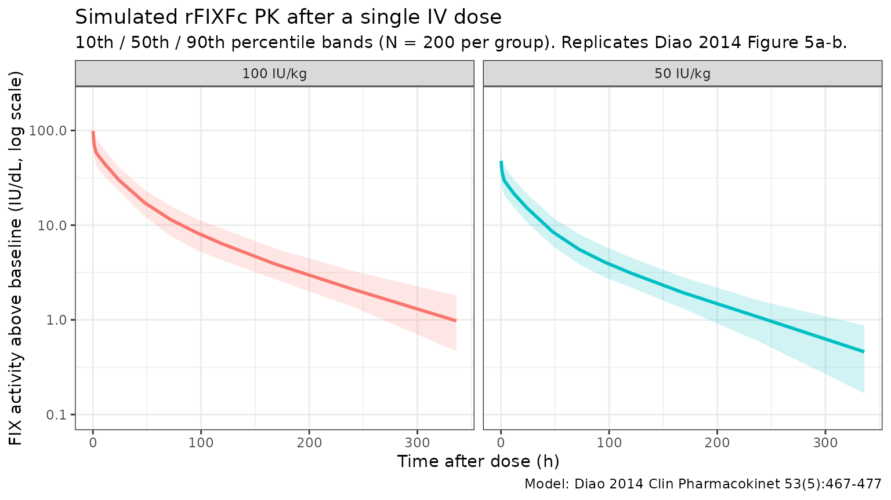

# Diao_2014_rFIXFc

## Model and source

- Citation: Diao L, Li S, Ludden T, Gobburu J, Nestorov I, Jiang H.
  Population pharmacokinetic modelling of recombinant factor IX Fc
  fusion protein (rFIXFc) in patients with haemophilia B. *Clin
  Pharmacokinet.* 2014;53(5):467-477.
  <doi:%5B10.1007/s40262-013-0129-7>\](<https://doi.org/10.1007/s40262-013-0129-7>)
- Description: Three-compartment population PK model for recombinant
  factor IX Fc fusion protein (rFIXFc, eftrenonacog alfa, Alprolix) in
  adolescents and adults with severe to moderate haemophilia B.
- Article: <https://doi.org/10.1007/s40262-013-0129-7> (Open Access)
- Modality: Fc-fusion factor concentrate, IV infusion.

rFIXFc is an extended half-life FIX concentrate consisting of a single
recombinant factor IX molecule covalently fused (with no intervening
sequence) to the dimeric Fc domain of human IgG1. The Fc domain binds
the neonatal Fc receptor (FcRn), recycling rFIXFc away from lysosomal
degradation and prolonging its plasma circulation relative to standard
recombinant factor IX. The packaged model is the published Diao 2014
final-model column of Table 3, fit to baseline- and residual-corrected
FIX activity from a single-ascending- dose phase 1/2a study and the
registrational B-LONG phase 3 study, all in previously treated patients
with severe to moderate haemophilia B.

## Population

The development cohort comprised **135 patients with haemophilia B**
(Diao 2014 Table 1; modelling dataset summary in Table 2):

- 12 patients from a single-ascending-dose phase 1/2a study
  (NCT00716716) at doses 12.5, 25, 50, or 100 IU/kg rFIXFc.
- 123 patients from the registrational B-LONG phase 3 study
  (NCT01027364): weekly Arm 1 (20-100 IU/kg), individualised-interval
  Arm 2 (starting at 100 IU/kg), on-demand Arm 3 (20-100 IU/kg), and
  perisurgical Arm 4 (40-100 IU/kg). PK doses were 50 or 100 IU/kg by
  ~10-min IV infusion.
- Age 12.1 - 76.8 years (median 31.3 years).
- Body weight 45.0 - 186.7 kg (median 73.3 kg).
- Race: 60.7% White, 22.2% Asian, 8.9% Black, 7.4% Other, 0.74% American
  Indian or Alaska Native.
- HIV-positive: 3.7%; HCV-positive: 38.5%.
- All severe to moderate haemophilia B with endogenous FIX activity \<=
  2 IU/dL; FIX genotype: 55.5% missense, 17.8% nonsense, 13.3%
  frameshift, 3.0% splice, 10.4% other.
- Sex: haemophilia B is X-linked recessive, so the cohort is essentially
  all male.
- Modelling dataset: 1,400 FIX activity records from 135 baseline PK
  profiles plus 21 repeat profiles at week 26 (Arm 1 sequential PK
  subgroup); a separate 1,027-record trough/peak dataset was reserved
  for external validation.

The same metadata is available programmatically via
`readModelDb("Diao_2014_rFIXFc")$population`.

## Source trace

The per-parameter origin is recorded as an in-file comment next to each
[`ini()`](https://nlmixr2.github.io/rxode2/reference/ini.html) entry in
`inst/modeldb/specificDrugs/Diao_2014_rFIXFc.R`. The table below
collects them in one place for review.

| Parameter (model name) | Value | Source |
|----|----|----|
| `lcl` (typical CL, dL/h) | log(2.39) | Diao 2014 Table 3: CL = 2.39 dL/h |
| `lvc` (typical V1, dL) | log(71.4) | Diao 2014 Table 3: V1 = 71.4 dL |
| `lq` (typical Q2, dL/h) | log(1.67) | Diao 2014 Table 3: Q2 = 1.67 dL/h |
| `lvp` (typical V2, dL) | log(87.0) | Diao 2014 Table 3: V2 = 87.0 dL |
| `lq2` (typical Q3, dL/h) | log(39.3) | Diao 2014 Table 3: Q3 = 39.3 dL/h |
| `lvp2` (typical V3, dL) | log(39.9) | Diao 2014 Table 3: V3 = 39.9 dL |
| `e_wt_cl` (BW power on CL) | 0.436 | Diao 2014 Table 3: BW exponent on CL = 0.436 |
| `e_wt_vc` (BW power on V1) | 0.396 | Diao 2014 Table 3: BW exponent on V1 = 0.396 |
| Reference body weight | 73 kg | Diao 2014 Table 3 typical-patient definition |
| IIV block `etalcl + etalvc` | c(0.031329, 0.029042, 0.047089) | Diao 2014 Table 3: IIV CL = 17.7%, IIV V1 = 21.7%, corr(CL,V1) = 75.6% |
| `etalq` (IIV on Q2) | 0.128164 | Diao 2014 Table 3: IIV Q2 = 35.8% |
| `etalvp` (IIV on V2) | 0.213444 | Diao 2014 Table 3: IIV V2 = 46.2% |
| `etalvp2` (IIV on V3) | 0.142129 | Diao 2014 Table 3: IIV V3 = 37.7% |
| `propSd` (proportional residual) | 0.106 | Diao 2014 Table 3: proportional residual error = 10.6% |
| `addSd` (additive residual, IU/dL) | 0.24 | Diao 2014 Table 3: additive residual error = 0.24 IU/dL |
| Equation: `d/dt(central)` | n/a | Diao 2014 Fig. 2 (three-compartment IV model schematic) |
| Equation: `d/dt(peripheral1)` | n/a | Diao 2014 Fig. 2 |
| Equation: `d/dt(peripheral2)` | n/a | Diao 2014 Fig. 2 |
| Baseline-correction equations | n/a | Diao 2014 Eqs. 1-2 (residual decay correction and DV definition) |

The footnote of Diao 2014 Table 3 states “IIV calculated as
sqrt(variance) \* 100”, i.e., the reported percentage equals
`sqrt(omega^2) * 100`, so `omega^2 = (CV/100)^2`. The IIV variances
above were computed by squaring 0.177, 0.217, 0.358, 0.462, and 0.377.
The CL:V1 covariance was computed as `0.756 * 0.177 * 0.217 = 0.029042`.

Inter-occasion variability on CL (15.1% CV) and V1 (17.4% CV) was
estimated in the paper from 21 repeat PK profiles at week 26. IOV is not
implemented in this static model file; see *Assumptions and deviations*.
IIV on Q3 was evaluated but dropped from the final model (high standard
error 87%; Diao 2014 Sec. 3.1).

## Virtual cohort

Original observed FIX activity data are not publicly available. The
simulations below use a virtual cohort whose demographics approximate
the Diao 2014 development population. A single IV dose of either 50
IU/kg or 100 IU/kg rFIXFc is administered at time 0 and FIX activity
above baseline is observed over a 14-day window (the longest follow-up
sampling time in the phase 1/2a study).

``` r

set.seed(2014)

n_per_group <- 200L
make_cohort <- function(n, dose_iu_per_kg, label, id_offset = 0L) {
  tibble(
    ID        = id_offset + seq_len(n),
    WT        = pmin(pmax(rlnorm(n, log(73), 0.27), 45), 187),
    treatment = label,
    dose_iukg = dose_iu_per_kg
  )
}

cohort <- bind_rows(
  make_cohort(n_per_group,  50, "50 IU/kg",  id_offset =   0L),
  make_cohort(n_per_group, 100, "100 IU/kg", id_offset = n_per_group)
)

stopifnot(!anyDuplicated(cohort$ID))
summary(cohort)
#>        ID              WT             treatment     dose_iukg  
#>  Min.   :  1.0   Min.   : 45.00   Length   :400   Min.   : 50  
#>  1st Qu.:100.8   1st Qu.: 62.70   N.unique :  2   1st Qu.: 50  
#>  Median :200.5   Median : 75.84   N.blank  :  0   Median : 75  
#>  Mean   :200.5   Mean   : 78.04   Min.nchar:  8   Mean   : 75  
#>  3rd Qu.:300.2   3rd Qu.: 90.31   Max.nchar:  9   3rd Qu.:100  
#>  Max.   :400.0   Max.   :148.82                   Max.   :100
```

``` r

obs_grid <- c(0, 1 / 6, 0.25, 0.5, 1, 3, 6, 12, 24,
              48, 72, 96, 120, 168, 240, 336)

build_events <- function(pop) {
  dose <- pop |>
    mutate(AMT = WT * dose_iukg) |>
    tidyr::crossing(TIME = 0) |>
    mutate(EVID = 1, CMT = "central", DV = NA_real_)
  obs <- pop |>
    tidyr::crossing(TIME = obs_grid) |>
    mutate(AMT = NA_real_, EVID = 0, CMT = "central", DV = NA_real_)
  bind_rows(dose, obs) |>
    arrange(ID, TIME, desc(EVID)) |>
    as.data.frame()
}

events <- build_events(cohort)
```

## Simulation

Run a stochastic VPC-style simulation (between-subject variability on
CL, V1, Q2, V2, V3 included with the correlated CL:V1 block) and a
typical-value simulation with the etas zeroed for direct parameter
back-checks.

``` r

mod <- readModelDb("Diao_2014_rFIXFc")

sim <- rxode2::rxSolve(mod, events = events,
                       keep = c("treatment", "WT", "dose_iukg"),
                       returnType = "data.frame")
#> ℹ parameter labels from comments will be replaced by 'label()'
sim <- sim[sim$time >= 0, ]

mod_typ <- rxode2::zeroRe(mod)
#> ℹ parameter labels from comments will be replaced by 'label()'
sim_typ <- rxode2::rxSolve(mod_typ, events = events,
                           keep = c("treatment", "WT", "dose_iukg"),
                           returnType = "data.frame")
#> ℹ omega/sigma items treated as zero: 'etalcl', 'etalvc', 'etalq', 'etalvp', 'etalvp2'
#> Warning: multi-subject simulation without without 'omega'
sim_typ <- sim_typ[sim_typ$time >= 0, ]
```

## Replicate Figure 5: VPC by dose group

Diao 2014 Figure 5 shows the visual predictive check of the final model
stratified by IV PK dose (50 IU/kg in panel a, 100 IU/kg in panel b),
plotting the 10th, 50th, and 90th percentile of observed FIX activity
against the same percentiles from 1,000 simulated profiles, on a log
y-axis from 0.1 to 100 IU/dL over 0 - ~270 h. The figure below
reproduces the percentile bands from the packaged model.

``` r

sim_summary <- sim |>
  filter(time > 0) |>
  group_by(time, treatment) |>
  summarise(
    p10 = stats::quantile(Cc, 0.10, na.rm = TRUE),
    p50 = stats::quantile(Cc, 0.50, na.rm = TRUE),
    p90 = stats::quantile(Cc, 0.90, na.rm = TRUE),
    .groups = "drop"
  )

ggplot(sim_summary, aes(time, p50, colour = treatment, fill = treatment)) +
  geom_ribbon(aes(ymin = p10, ymax = p90), alpha = 0.18, colour = NA) +
  geom_line(linewidth = 1) +
  facet_wrap(~treatment) +
  scale_y_log10(limits = c(0.1, 200)) +
  labs(
    x        = "Time after dose (h)",
    y        = "FIX activity above baseline (IU/dL, log scale)",
    colour   = "Dose",
    fill     = "Dose",
    title    = "Simulated rFIXFc PK after a single IV dose",
    subtitle = paste0("10th / 50th / 90th percentile bands (N = ", n_per_group,
                      " per group). Replicates Diao 2014 Figure 5a-b."),
    caption  = "Model: Diao 2014 Clin Pharmacokinet 53(5):467-477"
  ) +
  theme_bw() +
  theme(legend.position = "none")
```



## Typical CL and Vss back-check

Diao 2014 reports that for a typical 73 kg patient (the reference
subject of the final model), CL = 2.39 dL/h, V1 = 71.4 dL, and
steady-state volume of distribution Vss = V1 + V2 + V3 = 71.4 + 87.0 +
39.9 = 198.3 dL. Reproducing those numbers from the typical-value
simulation is the simplest possible self-consistency check.

``` r

ev_ref <- rxode2::et(amt = 50 * 73, time = 0, cmt = "central") |>
  rxode2::et(0)
sim_ref <- rxode2::rxSolve(
  mod_typ, events = ev_ref,
  params = data.frame(WT = 73),
  returnType = "data.frame"
)
#> ℹ omega/sigma items treated as zero: 'etalcl', 'etalvc', 'etalq', 'etalvp', 'etalvp2'

ref_pars <- sim_ref[1, c("cl", "vc", "q", "vp", "q2", "vp2"), drop = FALSE]
ref_pars$Vss <- ref_pars$vc + ref_pars$vp + ref_pars$vp2

knitr::kable(
  ref_pars,
  caption = "Typical-value PK parameters for the reference 73 kg patient",
  digits  = c(3, 2, 3, 2, 3, 2, 2)
)
```

|   cl |   vc |    q |  vp |   q2 |  vp2 |   Vss |
|-----:|-----:|-----:|----:|-----:|-----:|------:|
| 2.39 | 71.4 | 1.67 |  87 | 39.3 | 39.9 | 198.3 |

Typical-value PK parameters for the reference 73 kg patient {.table}

The model returns CL = 2.39 dL/h, V1 = 71.4 dL, Q2 = 1.67 dL/h, V2 = 87
dL, Q3 = 39.3 dL/h, V3 = 39.9 dL, and Vss = V1 + V2 + V3 = 198.3 dL —
matching the values reported in Diao 2014 Table 3 (CL = 2.39 dL/h, V1 =
71.4 dL, Q2 = 1.67 dL/h, V2 = 87.0 dL, Q3 = 39.3 dL/h, V3 = 39.9 dL, Vss
= 198 dL).

## PKNCA validation

Use PKNCA to compute Cmax, AUC0-inf, and terminal half-life by dose
group, and compare the simulated terminal half-life against the value
reported in Diao 2014. The paper reports a geometric-mean terminal
half-life of 81.1 h from the population PK post-hoc estimates (Diao 2014
Discussion, p. 476).

``` r

sim_nca <- sim |>
  filter(!is.na(Cc), Cc > 0) |>
  select(id, time, Cc, treatment)

dose_df <- events |>
  filter(EVID == 1) |>
  transmute(id = ID, time = TIME, amt = AMT, treatment)

conc_obj <- PKNCA::PKNCAconc(sim_nca, Cc ~ time | treatment + id,
                             concu = "IU/dL",
                             timeu = "h")
dose_obj <- PKNCA::PKNCAdose(dose_df, amt ~ time | treatment + id,
                             doseu = "IU")

intervals <- data.frame(
  start      = 0,
  end        = Inf,
  cmax       = TRUE,
  tmax       = TRUE,
  aucinf.obs = TRUE,
  half.life  = TRUE,
  clast.obs  = TRUE,
  lambda.z   = TRUE
)

nca_res <- PKNCA::pk.nca(PKNCA::PKNCAdata(conc_obj, dose_obj,
                                          intervals = intervals))
#>  ■■■■■                             14% |  ETA:  8s
#>  ■■■■■■■■■■■■■■■■■                 53% |  ETA:  4s
#>  ■■■■■■■■■■■■■■■■■■■■■■■■■■■■■     92% |  ETA:  1s
nca_tbl <- as.data.frame(nca_res$result)

summary_by_param <- function(param) {
  nca_tbl |>
    filter(PPTESTCD == param) |>
    group_by(treatment) |>
    summarise(
      n        = sum(!is.na(PPORRES)),
      median   = stats::median(PPORRES, na.rm = TRUE),
      q05      = stats::quantile(PPORRES, 0.05, na.rm = TRUE),
      q95      = stats::quantile(PPORRES, 0.95, na.rm = TRUE),
      .groups  = "drop"
    )
}

half_life_summary <- summary_by_param("half.life")
cmax_summary      <- summary_by_param("cmax")
auc_summary       <- summary_by_param("aucinf.obs")

knitr::kable(
  half_life_summary,
  caption = "Simulated rFIXFc terminal half-life (h) by dose group, single IV dose.",
  digits  = c(0, 0, 1, 1, 1)
)
```

| treatment |   n | median |  q05 |   q95 |
|:----------|----:|-------:|-----:|------:|
| 100 IU/kg | 200 |   79.3 | 49.6 | 140.7 |
| 50 IU/kg  | 200 |   76.3 | 49.0 | 152.0 |

Simulated rFIXFc terminal half-life (h) by dose group, single IV dose.
{.table}

``` r


knitr::kable(
  cmax_summary,
  caption = "Simulated rFIXFc Cmax (IU/dL) by dose group, single IV dose.",
  digits  = c(0, 0, 1, 1, 1)
)
```

| treatment |   n | median |  q05 |   q95 |
|:----------|----:|-------:|-----:|------:|
| 100 IU/kg | 200 |  104.2 | 69.2 | 155.2 |
| 50 IU/kg  | 200 |   52.3 | 32.4 |  81.1 |

Simulated rFIXFc Cmax (IU/dL) by dose group, single IV dose. {.table}

``` r


knitr::kable(
  auc_summary,
  caption = "Simulated rFIXFc AUC0-inf (IU*h/dL) by dose group, single IV dose.",
  digits  = c(0, 0, 1, 1, 1)
)
```

| treatment |   n | median |    q05 |    q95 |
|:----------|----:|-------:|-------:|-------:|
| 100 IU/kg | 200 | 3153.1 | 2135.8 | 4598.1 |
| 50 IU/kg  | 200 | 1578.2 | 1029.1 | 2241.1 |

Simulated rFIXFc AUC0-inf (IU\*h/dL) by dose group, single IV dose.
{.table}

### Comparison against published values

Diao 2014 reports a geometric-mean terminal half-life of 81.1 h from the
population PK post-hoc estimates (Discussion, p. 476). The simulated
median half-life should be close to this value; differences \> 20% would
indicate a coding problem.

``` r

geo_mean <- function(x) exp(mean(log(x), na.rm = TRUE))

half_life_50 <- nca_tbl |>
  filter(PPTESTCD == "half.life", treatment == "50 IU/kg")
half_life_100 <- nca_tbl |>
  filter(PPTESTCD == "half.life", treatment == "100 IU/kg")

comparison <- tibble::tribble(
  ~quantity,                                ~simulated,                              ~published,
  "Geo mean half-life, 50 IU/kg (h)",       geo_mean(half_life_50$PPORRES),          81.1,
  "Geo mean half-life, 100 IU/kg (h)",      geo_mean(half_life_100$PPORRES),         81.1
) |>
  mutate(
    pct_diff = round(100 * (simulated - published) / published, 1)
  )

knitr::kable(
  comparison,
  caption = "Simulated vs. Diao 2014 Discussion (p. 476) terminal half-life.",
  digits  = c(0, 1, 1, 1)
)
```

| quantity                          | simulated | published | pct_diff |
|:----------------------------------|----------:|----------:|---------:|
| Geo mean half-life, 50 IU/kg (h)  |      80.8 |      81.1 |     -0.3 |
| Geo mean half-life, 100 IU/kg (h) |      81.6 |      81.1 |      0.7 |

Simulated vs. Diao 2014 Discussion (p. 476) terminal half-life. {.table}

## Errata

No published erratum was located for Diao 2014 (Clin Pharmacokinet 2014;
53(5):467-477; Open Access via Springer). The packaged parameter values
are taken from Diao 2014 Table 3 (final-model column), which is
internally consistent: typical CL = 2.39 dL/h, V1 = 71.4 dL, and Vss =
V1 + V2 + V3 = 198.3 dL match the values quoted in the Abstract and
Discussion.

## Assumptions and deviations

- **Inter-occasion variability omitted.** Diao 2014 estimated IOV on CL
  (15.1% CV) and V1 (17.4% CV) from 21 repeat PK profiles at week 26 in
  the Arm 1 sequential PK subgroup. The static library model has no
  occasion variable, so IOV is not implemented as a separate eta. For
  Bayesian forecasting use cases that explicitly model occasions, the
  IOV variances (`omega^2_IOV_CL = 0.151^2 = 0.022801` and
  `omega^2_IOV_V1 = 0.174^2 = 0.030276`) can be added on top of the
  packaged IIV.
- **Inter-individual variability convention.** Diao 2014 footnotes Table
  3 with “IIV calculated as sqrt(variance) \* 100”, i.e., the reported
  CV% values are `sqrt(omega^2) * 100`, not the log-normal
  `sqrt(exp(omega^2) - 1)`. The packaged variances were computed with
  the simpler `omega^2 = (CV/100)^2` formula to match the paper’s
  convention.
- **No IIV on Q3.** Diao 2014 evaluated IIV on Q3 but dropped it from
  the final model because of a high standard error (87%; Diao 2014 Sec.
  3.1). The packaged model carries no `etalq2`.
- **FIX activity is baseline-corrected.** The one-stage aPTT clotting
  assay used in the trials does not distinguish endogenous baseline FIX
  activity from the input rFIXFc or residual activity of a pre-study FIX
  product, so Diao 2014 corrects each observation (their Eqs. 1-2)
  before fitting: individualised baseline (lowest activity per subject,
  set to 0 if \<1 IU/dL or to the observed lowest if 1-2 IU/dL) and
  exponentially-decayed residual from any prior BeneFIX dose are
  subtracted. The packaged model output `Cc` therefore represents the
  rFIXFc-attributable FIX activity above baseline, in IU/dL.
- **Body weight exponents are estimated, not fixed at the allometric
  values.** Diao 2014 reports estimated BW exponents of 0.436 on CL and
  0.396 on V1, markedly lower than the canonical 0.75 / 1 (Discussion,
  p. 475). The packaged model uses these estimated exponents, not the
  theoretical values. Inclusion of BW reduced IIV on CL by only 3.4
  percentage points and IIV on V1 by only 2.5 percentage points,
  indicating that BW explains only a small fraction of the
  between-patient variability.
- **No covariate effect on Q2, V2, Q3, or V3.** BW was tested on all six
  structural parameters but retained only on CL and V1 after forward
  addition / backward elimination (P \< 0.005 / P \< 0.001 thresholds;
  Diao 2014 Sec. 3.3). Race, albumin, and study were also screened and
  dropped.
- **Virtual cohort.** Body weight was sampled from a log-normal
  distribution with median 73 kg and SD 0.27 on the log scale, truncated
  to the observed range of the development cohort (45 - 187 kg; Diao
  2014 Table 1). Joint covariate structure (age x weight, race x weight)
  is not simulated. The validation here is by dose group (50 vs 100
  IU/kg), matching the stratification in Diao 2014 Figure 5.
- **Hemophilia B is X-linked recessive**, so the development cohort and
  the virtual cohort here are all male (`sex_female_pct = 0` in the
  population metadata). The model has no sex covariate.
- **Lower age bound.** Diao 2014 enrolled patients aged 12.1 years and
  older. The packaged model has no maturation term, so applying it to
  children younger than ~12 years extrapolates the body-weight scaling
  without empirical support. The Koopman 2023 model
  (`modellib("Koopman_2023_factorix")`) was developed specifically to
  extend rFIX-Fc PK predictions down to age 2 years.
