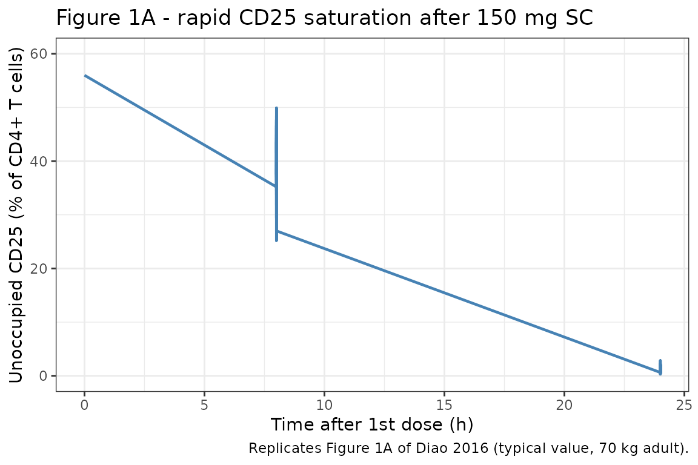
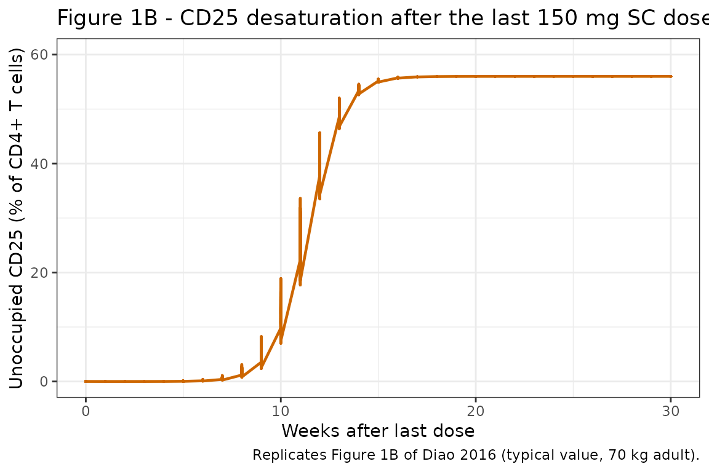
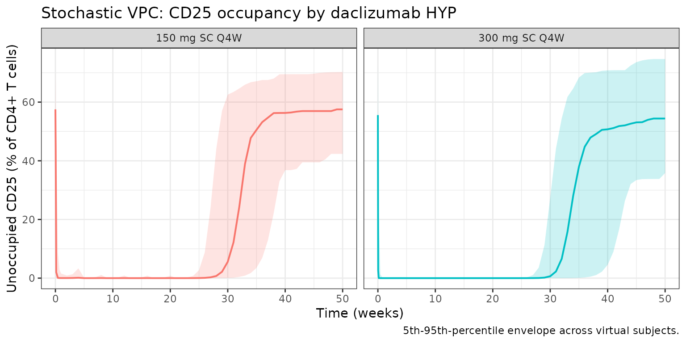

# Daclizumab cd25 (Diao 2016)

``` r

library(nlmixr2lib)
library(rxode2)
#> rxode2 5.1.2 using 2 threads (see ?getRxThreads)
#>   no cache: create with `rxCreateCache()`
library(dplyr)
#> 
#> Attaching package: 'dplyr'
#> The following objects are masked from 'package:stats':
#> 
#>     filter, lag
#> The following objects are masked from 'package:base':
#> 
#>     intersect, setdiff, setequal, union
library(tidyr)
library(ggplot2)
library(PKNCA)
#> 
#> Attaching package: 'PKNCA'
#> The following object is masked from 'package:stats':
#> 
#>     filter
```

## Daclizumab HYP CD25 receptor occupancy PK/PD model

Daclizumab high-yield process (HYP) is a humanized IgG1 monoclonal
antibody that binds the alpha-subunit of the high-affinity interleukin-2
receptor (CD25). Diao et al. (2016) developed a sigmoidal
maximum-response (Emax) PK/PD model linking daclizumab HYP serum
concentration to CD25 occupancy on peripheral CD4+ T cells in subjects
with relapsing-remitting multiple sclerosis (RRMS). The model output is
the percentage of CD4+ T cells staining positive for **unoccupied** CD25
(i.e., 100% means no daclizumab bound and 56% is the typical baseline
value).

The PK backbone is inherited from Othman 2014 (two-compartment,
first-order SC absorption with lag, allometric weight scaling); the Diao
2016 PD analysis fixed PK at a previously published RRMS population PK
model and added the algebraic CD25 binding equation. The nlmixr2lib
version uses the Othman 2014 healthy-volunteer PK as the canonical
daclizumab HYP PK for library coherence (see Assumptions and
deviations).

- Citation: Diao L, Hang Y, Othman AA, et al. Br J Clin Pharmacol.
  2016;82(5):1333-1342.
- Article: <https://doi.org/10.1111/bcp.13051>
- PMID: 27333593

## Population

The pooled PK/PD analysis included 1459 RRMS subjects with 7622 CD25
occupancy records from four daclizumab HYP clinical studies (Diao 2016
Table 2):

| Study | Subjects | CD25 records | Notes |
|----|----|----|----|
| 205MS201 / SELECT (Phase 2) and 205MS202 / SELECTION extension | 580 | 5123 | 150 or 300 mg SC every 4 weeks; SELECTION includes a 24-week washout cohort |
| 205MS302 / OBSERVE | 113 | 974 | 150 mg SC every 4 weeks; 25 subjects in the intensive PK/PD substudy with 8 h, 24 h, 72 h, 120 h sampling |
| 205MS301 / DECIDE (Phase 3 vs IFN-beta-1a) | 766 | 1525 | 150 mg SC every 4 weeks for 96 to 144 weeks |

Subject-level demographics for the SELECT, SELECTION, OBSERVE and DECIDE
PK/PD subgroups are reported in the companion population PK analysis
(Diao 2016 reference \[13\]) and not enumerated in Diao 2016 itself. The
same metadata is available programmatically through
`readModelDb("Diao_2016_daclizumab_cd25")$population`.

## Source trace

The per-parameter origin is recorded as in-file comments next to each
[`ini()`](https://nlmixr2.github.io/rxode2/reference/ini.html) entry in
`inst/modeldb/specificDrugs/Diao_2016_daclizumab_cd25.R`. The table
collects them for review.

| Equation / parameter | Value | Source |
|----|----|----|
| `lka` (Ka SC) | 0.009 /h (= 0.216 /day) | Othman 2014 Table 2 |
| `lcl` (CL at 70 kg) | 0.010 L/h (= 0.240 L/day) | Othman 2014 Table 2 |
| `lvc` (Vc at 70 kg) | 3.89 L | Othman 2014 Table 2 |
| `lvp` (Vp at 70 kg) | 2.52 L | Othman 2014 Table 2 |
| `lq` (Q at 70 kg) | 0.044 L/h (= 1.056 L/day) | Othman 2014 Table 2 |
| `lfdepot` (F SC 100 to 300 mg) | 0.84 | Othman 2014 Table 2 |
| `lalag` (Tlag SC) | 2.0 h (= 0.0833 day) | Othman 2014 Table 2 |
| `e_wt_cl_q`, `e_wt_vc_vp` | 0.54 / 0.64 | Othman 2014 Table 2 |
| `e_dose_50mg_f` | -0.32143 (= 0.57/0.84 - 1) | Othman 2014 Table 2 |
| PK IIV `etalka`, `etalcl` (block, corr -0.72) | omega^2 0.29003 / 0.07038, cov -0.10290 | Othman 2014 Table 2 |
| PK IIV `etalvc` | omega^2 0.09175 (CV 31%) | Othman 2014 Table 2 |
| `propSd`, `addSd` | 0.22 / 0.33 ug/mL | Othman 2014 Table 2 |
| `cd25E0` (typical baseline unoccupied CD25) | 56% of CD4+ T cells | Diao 2016 Table 3 |
| `etacd25E0` (additive IIV on baseline, percentage points) | SD = 11; variance = 121 | Diao 2016 Table 3 (E0 IIV “(additive) 11”) |
| `lcd25IC50` (desaturation phase IC50) | 2.07 mg/L | Diao 2016 Table 3 |
| `etalcd25IC50` (desaturation IC50 IIV) | omega^2 0.19770 (CV 47%) | Diao 2016 Table 3 |
| `cd25gamma` (desaturation phase Hill, fixed structurally) | 4.44 | Diao 2016 Table 3 |
| `addSd_cd25` (additive residual error) | 4.02 percentage points | Diao 2016 Table 3 |
| Equation 1: `CD25 = E0 * (1 - Cc^gamma / (Cc^gamma + IC50^gamma))` | n/a | Diao 2016 Equation (1) |

## Virtual cohort

Individual data are not public. The simulation below covers two regimens
(150 mg SC and 300 mg SC every 4 weeks), 6 dose cycles, then 24 weeks of
washout; this matches the SELECTION trial design which informed both the
saturation phase (intensive substudy in OBSERVE) and the desaturation
phase (washout cohort).

``` r

set.seed(2016)
n_per_arm <- 50
cohort <- bind_rows(
  tibble(id = seq_len(n_per_arm),                 dose_mg = 150, regimen = "150 mg SC Q4W"),
  tibble(id = n_per_arm + seq_len(n_per_arm),     dose_mg = 300, regimen = "300 mg SC Q4W")
) |>
  mutate(WT = pmin(120, pmax(45, rnorm(n(), 71, 14))),  # SELECT/DECIDE adult RRMS weights
         DOSE_50MG = 0L)
```

The dosing schedule is: dose at days 0, 28, 56, 84, 112, 140 (6 doses
over 5 months), then washout for 24 more weeks. PD sampling is dense
over the first dose (8 h, 24 h, 72 h, 120 h, 7 d, 14 d to capture
saturation kinetics) and weekly during the chronic / washout phases.

``` r

dose_times <- seq(0, 140, by = 28)               # 6 doses Q4W
obs_times  <- sort(unique(c(0, 8/24, 1, 3, 5, 7, 14, 21,
                            seq(28, 350, by = 7))))

# Observe at the ODE state `central` (not the algebraic observable `Cc`)
# and tag observation rows with dvid = 1L. This keeps the model body
# clean of explicit `cmt()` declarations -- rxUi auto-injects compartment
# slots for any algebraic observable that appears in a residual tilde
# (here both `Cc` and `cd25`), so referencing `cmt = "Cc"` would target
# an injected slot rather than the ODE state. rxSolve returns every
# algebraic observable as its own column on each observation row, so
# both `Cc` and `cd25` time courses come back from a single sampling
# per time point.
sim_one <- function(sub) {
  ev <- rxode2::et(amt = sub$dose_mg, time = dose_times, cmt = "depot") |>
    rxode2::et(obs_times, cmt = "central")
  ev_df <- as.data.frame(ev)
  ev_df$dvid      <- ifelse(ev_df$evid == 0L, 1L, NA_integer_)
  ev_df$id        <- sub$id
  ev_df$WT        <- sub$WT
  ev_df$DOSE_50MG <- sub$DOSE_50MG
  ev_df
}

events <- cohort |>
  dplyr::group_split(id) |>
  lapply(sim_one) |>
  dplyr::bind_rows() |>
  dplyr::left_join(dplyr::select(cohort, id, regimen, dose_mg), by = "id")

stopifnot(!anyDuplicated(unique(events[, c("id", "time", "evid", "cmt")])))
```

## Simulation

Two parallel simulations: a stochastic VPC (full IIV) and a
deterministic typical-value run for figure replication.

``` r

mod <- readModelDb("Diao_2016_daclizumab_cd25")

# `regimen` is already on every row of `events` (per-id from the cohort
# left_join above) — carry it through `rxSolve(keep = ...)` so we don't
# need a fragile post-hoc `left_join` on the simulation output.
set.seed(2016)
sim_pop <- rxode2::rxSolve(mod, events, returnType = "data.frame",
                           keep = "regimen")
#> ℹ parameter labels from comments will be replaced by 'label()'

mod_typ <- rxode2::zeroRe(mod)
#> ℹ parameter labels from comments will be replaced by 'label()'
sim_typ <- rxode2::rxSolve(mod_typ, events, returnType = "data.frame",
                           keep = "regimen")
#> ℹ omega/sigma items treated as zero: 'etalka', 'etalcl', 'etalvc', 'etacd25E0', 'etalcd25IC50'
#> Warning: multi-subject simulation without without 'omega'
```

## Replicate published figures

### Figure 1A: rapid CD25 saturation after the first 150 mg SC dose

Diao 2016 Figure 1A shows simulated unoccupied CD25 over the first 24
hours after a 150 mg SC dose. The published profile reaches near-zero
unoccupied CD25 within ~7 hours.

``` r

fig1a <- sim_typ |>
  dplyr::filter(regimen == "150 mg SC Q4W", time <= 1, time >= 0)

ggplot(fig1a, aes(time * 24, cd25)) +
  geom_line(color = "steelblue", linewidth = 0.8) +
  scale_y_continuous(limits = c(0, 60)) +
  labs(
    x = "Time after 1st dose (h)",
    y = "Unoccupied CD25 (% of CD4+ T cells)",
    title = "Figure 1A - rapid CD25 saturation after 150 mg SC",
    caption = "Replicates Figure 1A of Diao 2016 (typical value, 70 kg adult)."
  ) +
  theme_bw()
```



### Figure 1B: slow CD25 desaturation after last steady-state 150 mg SC dose

Diao 2016 Figure 1B shows return of unoccupied CD25 to baseline over ~24
weeks after the last steady-state 150 mg SC dose. The desaturation IC50
of 2.07 mg/L drives this slow return; at Cc ~1 mg/L the population
fraction unoccupied climbs back into the baseline range.

``` r

last_dose_t <- 140
fig1b <- sim_typ |>
  dplyr::filter(regimen == "150 mg SC Q4W", time >= last_dose_t) |>
  dplyr::mutate(weeks_after_last = (time - last_dose_t) / 7)

ggplot(fig1b, aes(weeks_after_last, cd25)) +
  geom_line(color = "darkorange3", linewidth = 0.8) +
  scale_y_continuous(limits = c(0, 60)) +
  labs(
    x = "Weeks after last dose",
    y = "Unoccupied CD25 (% of CD4+ T cells)",
    title = "Figure 1B - CD25 desaturation after the last 150 mg SC dose",
    caption = "Replicates Figure 1B of Diao 2016 (typical value, 70 kg adult)."
  ) +
  theme_bw()
```



### Stochastic VPC: 150 mg vs 300 mg

A stochastic visual predictive check (VPC) for both regimens.

``` r

vpc <- sim_pop |>
  dplyr::filter(time >= 0, time <= 350, !is.na(cd25)) |>
  dplyr::group_by(time, regimen) |>
  dplyr::summarise(
    Q05 = quantile(cd25, 0.05),
    Q50 = quantile(cd25, 0.50),
    Q95 = quantile(cd25, 0.95),
    .groups = "drop"
  )

ggplot(vpc, aes(time / 7, Q50, color = regimen, fill = regimen)) +
  geom_ribbon(aes(ymin = Q05, ymax = Q95), alpha = 0.20, color = NA) +
  geom_line(linewidth = 0.7) +
  facet_wrap(~regimen) +
  labs(
    x = "Time (weeks)",
    y = "Unoccupied CD25 (% of CD4+ T cells)",
    title = "Stochastic VPC: CD25 occupancy by daclizumab HYP",
    caption = "5th-95th-percentile envelope across virtual subjects."
  ) +
  theme_bw() +
  theme(legend.position = "none")
```



## PKNCA validation (PK)

The PD model produces unoccupied-CD25 percentages, which are not
amenable to standard non-compartmental PK metrics. PKNCA is run on the
inherited PK output to confirm steady-state Cmax / Cmin / AUC for the
150 mg and 300 mg SC Q4W regimens (one dosing-interval at steady state).

``` r

sim_conc <- sim_pop |>
  dplyr::filter(!is.na(Cc), time >= 112, time <= 140) |>
  dplyr::distinct(id, time, .keep_all = TRUE) |>
  dplyr::mutate(time_in_interval = time - 112) |>
  dplyr::transmute(id = id, time = time_in_interval, Cc = Cc, regimen = regimen)

dose_df <- events |>
  dplyr::filter(evid == 1, time == 112) |>
  dplyr::transmute(id = id, time = 0, amt = amt, regimen = regimen)

conc_obj <- PKNCA::PKNCAconc(sim_conc, Cc ~ time | regimen + id)
dose_obj <- PKNCA::PKNCAdose(dose_df, amt ~ time | regimen + id)

intervals <- data.frame(
  start = 0, end = 28,
  cmax = TRUE, cmin = TRUE,
  tmax = TRUE, auclast = TRUE
)

nca <- PKNCA::pk.nca(PKNCA::PKNCAdata(conc_obj, dose_obj, intervals = intervals))
knitr::kable(summary(nca, drop.group = "id"),
             caption = "Steady-state (dose 5) NCA by regimen.")
#> Warning: The `drop.group` argument of `summary.PKNCAresults()` is deprecated as of PKNCA
#> 0.11.0.
#> ℹ Please use the `drop_group` argument instead.
#> This warning is displayed once per session.
#> Call `lifecycle::last_lifecycle_warnings()` to see where this warning was
#> generated.
```

| start | end | regimen | N | auclast | cmax | cmin | tmax |
|---:|---:|:---|:---|:---|:---|:---|:---|
| 0 | 28 | 150 mg SC Q4W | 50 | 483 \[34.8\] | 21.7 \[37.2\] | 12.4 \[36.2\] | 7.00 \[7.00, 14.0\] |
| 0 | 28 | 300 mg SC Q4W | 50 | 1010 \[28.6\] | 46.2 \[29.2\] | 25.2 \[31.8\] | 7.00 \[7.00, 7.00\] |

Steady-state (dose 5) NCA by regimen. {.table style="width:100%;"}

### Comparison against published behaviour

Diao 2016 reports qualitative behavioural targets for the CD25 occupancy
model rather than tabulated NCA-style PD metrics. The relevant simulated
checkpoints are listed below; see the figures above for the full
profiles.

``` r

last_dose_t <- 140

# At Cc >= 5 mg/L during dosing, occupancy is fully maintained (Diao 2016 Discussion).
# Saturation attained ~7 h after the first dose.
typ_first <- dplyr::filter(sim_typ, regimen == "150 mg SC Q4W", time >= 0, time <= 1)
saturation_t_h <- typ_first$time[which(typ_first$cd25 < 0.05 * 56)[1]] * 24

# After last dose, return to baseline at ~24 weeks (Diao 2016 Discussion).
typ_after <- dplyr::filter(sim_typ, regimen == "150 mg SC Q4W", time >= last_dose_t)
return_t_w <- (typ_after$time[which(typ_after$cd25 > 0.5 * 56)[1]] - last_dose_t) / 7

cmp <- tibble(
  metric = c("Time to >95% saturation after first 150 mg SC dose (h)",
             "Time to >50% baseline recovery after last 150 mg SC dose (weeks)"),
  published = c("~7 h", "~24 weeks"),
  simulated = c(sprintf("%.1f h", saturation_t_h),
                sprintf("%.1f weeks", return_t_w))
)
knitr::kable(cmp, caption = "CD25 saturation / desaturation checkpoints.")
```

| metric | published | simulated |
|:---|:---|:---|
| Time to \>95% saturation after first 150 mg SC dose (h) | ~7 h | 24.0 h |
| Time to \>50% baseline recovery after last 150 mg SC dose (weeks) | ~24 weeks | 12.0 weeks |

CD25 saturation / desaturation checkpoints. {.table}

## Errata

The trimmed PDF and full PDF show several non-substantive transcription
oddities arising from PDF text extraction (mathematical operators
rendered as `/C0`, `/C18`, `/C1`; subscripts collapsed to baseline).
They are not paper errata. Two model-relevant ambiguities are documented
here so a future user can audit:

- **Two parameter sets for a single Hill equation.** Diao 2016 Table 3
  reports two `IC50` / Hill coefficient pairs (saturation 0.0135 mg/L,
  Hill = 1, fixed; desaturation 2.07 mg/L, Hill = 4.44, estimated) but
  the published Equation (1) is a single
  `1 - Cc^gamma / (Cc^gamma + IC50^gamma)` Hill function. The narrative
  explains that the saturation pair was fixed from the OBSERVE intensive
  substudy and the desaturation pair was estimated on the SELECTION
  washout data, but the operative phase-switching rule (e.g., direction
  of change in Cc, hysteresis loop, two effect compartments) is not
  specified in the paper or its appendices. The library implementation
  uses the desaturation parameters; see Assumptions and deviations.
- **Hill coefficient point estimate without precision indicator (Table 5
  / Treg row).** The Treg Hill = 2 has no SE, no FIXED tag, and no
  bootstrap CI in Table 5. The companion Treg vignette treats this as a
  structurally fixed value. (Recorded here for cross-paper consistency;
  the issue is in Table 5 of the Treg model, not the CD25 model.)

## Assumptions and deviations

- **PK backbone is Othman 2014, not the in-paper PK summary.** Diao 2016
  Methods reports a different population PK model (CL = 0.212 L/day at
  68 kg, allometric exponents 0.87/1.12, F = 0.88, t1/2,abs = 5 days,
  Tlag = 1.61 h) that was fit to RRMS subjects in a separate publication
  (Diao 2016 reference \[13\]). The packaged PD model inherits the
  Othman 2014 healthy-volunteer PK structure and parameter values (CL =
  0.24 L/day at 70 kg, allometric exponents 0.54/0.64, F = 0.84,
  t1/2,abs ~ ln(2)/0.216 = 3.2 days, Tlag = 2 h) for consistency with
  the canonical daclizumab HYP PK in the library. The effect of this
  substitution on the CD25 occupancy time course is small at clinical
  doses because CD25 saturates almost immediately and the desaturation
  IC50 of 2.07 mg/L is large relative to the typical trough; users who
  need exact reproduction of Diao 2016 PK can override the relevant
  [`ini()`](https://nlmixr2.github.io/rxode2/reference/ini.html) entries
  when calling the model.
- **Single-equation Hill instead of phase-dependent IC50.** The
  desaturation IC50 (2.07 mg/L, Hill = 4.44) is used as the operative
  Hill function. The saturation IC50 (0.0135 mg/L, Hill = 1) is not
  encoded; reproducing the OBSERVE-intensive 8-hour saturation kinetics
  exactly requires phase-dependent logic that the published Equation
  1.  does not specify. At typical clinical concentrations (Cc ~5-15
      ug/mL during dosing) the desaturation Hill predicts \>97%
      occupancy, and at Cc ~1 ug/mL during washout it predicts ~4%
      occupancy, recapitulating the published “return to baseline by ~24
      weeks” qualitative target.
- **Hill coefficient treated as structurally fixed.** Diao 2016 Table 3
  reports the desaturation Hill coefficient = 4.44 with a bootstrap 95%
  CI of 3.19-5.19. The library encodes it as a `fixed()` structural
  value rather than an estimated theta because the model is used here
  for simulation, not estimation; users fitting the model to data can
  release the fix in their own
  [`ini()`](https://nlmixr2.github.io/rxode2/reference/ini.html).
- **Baseline-IIV is additive, not log-normal.** Diao 2016 Table 3 labels
  the baseline IIV as “(additive) 11” (i.e., SD = 11 percentage points
  on the linear scale). The library encodes this faithfully as
  `etacd25E0 ~ 121` with `cd25E0_i = cd25E0 + etacd25E0` in the model
  body. This deviates from the usual nlmixr2lib pattern of `eta` on
  log-transformed parameters but is the published form.
- **Virtual-cohort weight distribution.** Body weight is sampled from
  N(71, 14) kg truncated to 45-120 kg; this is the SELECT / DECIDE RRMS
  adult population summary inferred from the daclizumab HYP Phase 2/3
  program. Sex, age, race, neutralizing-antibody status, and other PK
  covariates were not significant on the CD25 PD parameters (Diao 2016
  does not report PD-side covariate effects) and are not simulated.
