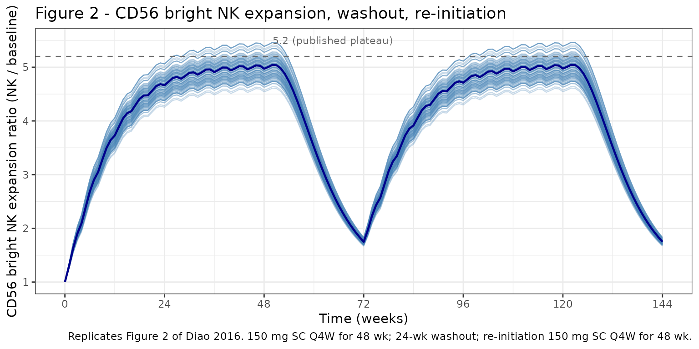
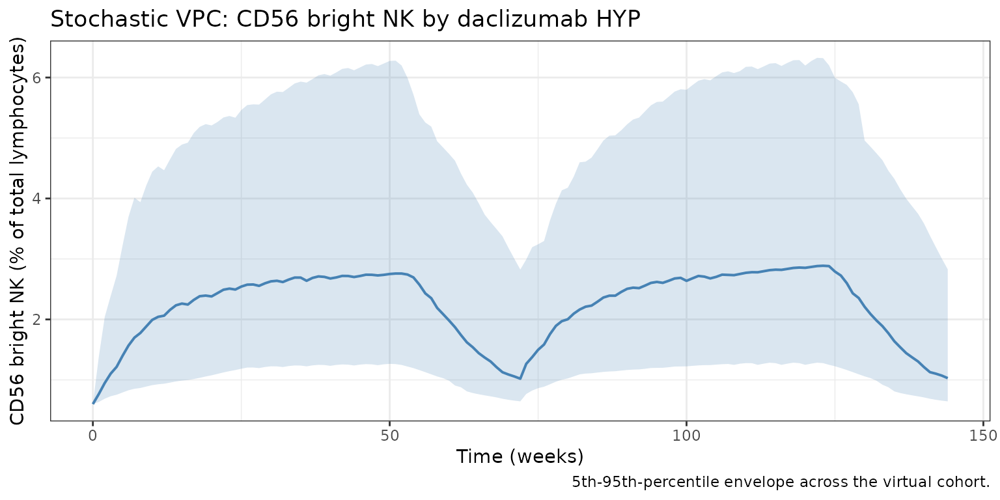

# Diao_2016_daclizumab_cd56bright

``` r

library(nlmixr2lib)
library(rxode2)
#> rxode2 5.0.2 using 2 threads (see ?getRxThreads)
#>   no cache: create with `rxCreateCache()`
library(dplyr)
#> 
#> Attaching package: 'dplyr'
#> The following objects are masked from 'package:stats':
#> 
#>     filter, lag
#> The following objects are masked from 'package:base':
#> 
#>     intersect, setdiff, setequal, union
library(tidyr)
library(ggplot2)
library(PKNCA)
#> 
#> Attaching package: 'PKNCA'
#> The following object is masked from 'package:stats':
#> 
#>     filter
```

## Daclizumab HYP CD56 bright NK cell expansion PK/PD model

CD56 bright natural killer (NK) cells expand during daclizumab
high-yield process (HYP) treatment, hypothesized to result from
increased availability of T-cell-derived IL-2 once daclizumab HYP blocks
the high-affinity IL-2 receptor on activated T cells. Diao et al. (2016)
characterized the expansion using an indirect-response model in which
daclizumab HYP serum concentration stimulates the zero-order production
rate (`Kin`) of CD56 bright NK cells (% of total lymphocytes) via a
saturable `Smax` function; the elimination rate constant `Kout` is
expressed via the baseline (`Kout = Kin / NK_baseline`) and is therefore
not independently estimated.

The PK backbone is inherited from Othman 2014 (two-compartment
first-order SC absorption with lag, allometric weight scaling); see the
companion Othman_2014_daclizumab vignette for the PK details.

- Citation: Diao L, Hang Y, Othman AA, et al. Br J Clin Pharmacol.
  2016;82(5):1333-1342.
- Article: <https://doi.org/10.1111/bcp.13051>
- PMID: 27333593

## Population

The pooled PK/PD analysis included 1405 RRMS subjects with 9630 CD56
bright NK cell records from four daclizumab HYP clinical studies (Diao
2016 Table 2):

| Study                                      | Subjects | NK records |
|--------------------------------------------|----------|------------|
| 205MS201 / SELECT and 205MS202 / SELECTION | 561      | 5071       |
| 205MS302 / OBSERVE                         | 107      | 922        |
| 205MS301 / DECIDE                          | 737      | 3637       |

The median (mean) baseline CD56 bright NK percentage is 0.6% (0.75%) of
total lymphocytes (Diao 2016 Results, NK section). The library
implementation uses the median as the baseline structural value; users
fitting the model to data can override `cd56baseline` in
[`ini()`](https://nlmixr2.github.io/rxode2/reference/ini.html).

## Source trace

| Equation / parameter | Value | Source |
|----|----|----|
| PK backbone (`lka`, `lcl`, `lvc`, `lvp`, `lq`, `lfdepot`, `lalag`, `allo_*`, `e_dose_50mg_f`, PK IIV, `CcpropSd`, `CcaddSd`) | Othman 2014 Table 2 values | inherited from `Othman_2014_daclizumab.R` |
| `lcd56Kin` (Kin) | 4.12e-04 %/h (= 0.009888 %/day) | Diao 2016 Table 4 |
| `etalcd56Kin` (Kin IIV) | omega^2 0.66022 (CV 97%) | Diao 2016 Table 4 |
| `lcd56Smax` (Smax) | 7.89 (unitless) | Diao 2016 Table 4 |
| `etalcd56Smax` (Smax IIV) | omega^2 0.36398 (CV 67%) | Diao 2016 Table 4 |
| `lcd56EC50` (EC50) | 18.0 mg/L | Diao 2016 Table 4 |
| `cd56baseline` (median NK pct, fixed) | 0.6 % of total lymphocytes | Diao 2016 Results (NK section) |
| `cd56brightpropSd` (proportional residual error) | 0.291 (CV 29.1%) | Diao 2016 Table 4 |
| Equation 2: `dNK/dt = Kin * (1 + Smax * Cc / (EC50 + Cc)) - Kout * NK`, `Kout = Kin / baseline` | n/a | Diao 2016 Equation (2) and Methods |

## Virtual cohort

Original-data is not public. The simulation covers 150 mg SC every 4
weeks for one year, then 24 weeks of washout, then re-initiation at 150
mg SC every 4 weeks for another year (matching the SELECT / SELECTION
washout / re-initiation design used to characterize the slow expansion
plateau and reversibility).

``` r

set.seed(2016)
n_subjects <- 100
cohort <- tibble(
  id = seq_len(n_subjects),
  WT = pmin(120, pmax(45, rnorm(n_subjects, 71, 14))),
  DOSE_50MG = 0L
)
```

``` r

# Year 1: 13 doses Q4W from t = 0 to t = 336.
# Washout: 24 weeks (no doses) from t = 336 to t = 504.
# Year 2: 13 doses Q4W from t = 504 to t = 840.
dose_times <- c(seq(0, 336, by = 28), seq(504, 840, by = 28))
obs_times  <- sort(unique(c(0, 7, 14, 21, seq(28, 1008, by = 7))))

sim_one <- function(sub) {
  ev <- rxode2::et(amt = 150, time = dose_times, cmt = "depot") |>
    rxode2::et(obs_times, cmt = "Cc") |>
    rxode2::et(obs_times, cmt = "cd56bright")
  ev_df <- as.data.frame(ev)
  ev_df$id        <- sub$id
  ev_df$WT        <- sub$WT
  ev_df$DOSE_50MG <- sub$DOSE_50MG
  ev_df
}

events <- cohort |>
  dplyr::group_split(id) |>
  lapply(sim_one) |>
  dplyr::bind_rows()

stopifnot(!anyDuplicated(unique(events[, c("id", "time", "evid", "cmt")])))
```

## Simulation

``` r

mod     <- readModelDb("Diao_2016_daclizumab_cd56bright")
mod_typ <- rxode2::zeroRe(mod)
#> ℹ parameter labels from comments will be replaced by 'label()'

set.seed(2016)
sim_pop <- rxode2::rxSolve(mod, events, returnType = "data.frame")
#> ℹ parameter labels from comments will be replaced by 'label()'
sim_typ <- rxode2::rxSolve(mod_typ, events, returnType = "data.frame")
#> ℹ omega/sigma items treated as zero: 'etalka', 'etalcl', 'etalvc', 'etalcd56Kin', 'etalcd56Smax'
#> Warning: multi-subject simulation without without 'omega'
```

## Replicate published figures

### Figure 2: CD56 bright NK expansion + washout + re-initiation

Diao 2016 Figure 2 simulates 150 mg SC Q4W for 48 weeks, 24 weeks of
treatment discontinuation, and re-initiation of 150 mg SC Q4W for
another 48 weeks. The published profile reaches an expansion plateau at
~week 36 with a maximum expansion ratio of ~5.2; after the last dose, NK
percentage gradually declines to baseline within ~24 weeks.

``` r

fig2 <- sim_typ |>
  dplyr::filter(!is.na(cd56bright), time <= 1008) |>
  dplyr::distinct(id, time, .keep_all = TRUE) |>
  dplyr::mutate(
    weeks = time / 7,
    expansion_ratio = cd56bright / 0.6
  )

ggplot(fig2, aes(weeks, expansion_ratio, group = id)) +
  geom_line(alpha = 0.30, color = "steelblue", linewidth = 0.4) +
  stat_summary(aes(group = 1), geom = "line", fun = median,
               color = "darkblue", linewidth = 0.8) +
  geom_hline(yintercept = 5.2, linetype = "dashed", color = "grey40") +
  annotate("text", x = 50, y = 5.5, label = "5.2 (published plateau)",
           hjust = 0, size = 3, color = "grey40") +
  scale_x_continuous(breaks = seq(0, 144, by = 24)) +
  labs(
    x = "Time (weeks)",
    y = "CD56 bright NK expansion ratio (NK / baseline)",
    title = "Figure 2 - CD56 bright NK expansion, washout, re-initiation",
    caption = paste0(
      "Replicates Figure 2 of Diao 2016. 150 mg SC Q4W for 48 wk; ",
      "24-wk washout; re-initiation 150 mg SC Q4W for 48 wk."
    )
  ) +
  theme_bw()
```



### Stochastic VPC

``` r

vpc <- sim_pop |>
  dplyr::filter(!is.na(cd56bright)) |>
  dplyr::distinct(id, time, .keep_all = TRUE) |>
  dplyr::group_by(time) |>
  dplyr::summarise(
    Q05 = quantile(cd56bright, 0.05),
    Q50 = quantile(cd56bright, 0.50),
    Q95 = quantile(cd56bright, 0.95),
    .groups = "drop"
  )

ggplot(vpc, aes(time / 7, Q50)) +
  geom_ribbon(aes(ymin = Q05, ymax = Q95),
              fill = "steelblue", alpha = 0.20) +
  geom_line(color = "steelblue", linewidth = 0.7) +
  labs(
    x = "Time (weeks)",
    y = "CD56 bright NK (% of total lymphocytes)",
    title = "Stochastic VPC: CD56 bright NK by daclizumab HYP",
    caption = "5th-95th-percentile envelope across the virtual cohort."
  ) +
  theme_bw()
```



## PKNCA validation (PK)

CD56 bright NK percentage is not amenable to standard NCA. PKNCA is run
on the inherited PK output to confirm the steady-state PK profile in
this cohort.

``` r

sim_conc <- sim_pop |>
  dplyr::filter(!is.na(Cc), time >= 308, time <= 336) |>
  dplyr::distinct(id, time, .keep_all = TRUE) |>
  dplyr::mutate(time_in_interval = time - 308) |>
  dplyr::transmute(id = id, time = time_in_interval, Cc = Cc,
                   regimen = "150 mg SC Q4W")

dose_df <- events |>
  dplyr::filter(evid == 1, time == 308) |>
  dplyr::transmute(id = id, time = 0, amt = amt,
                   regimen = "150 mg SC Q4W")

conc_obj <- PKNCA::PKNCAconc(sim_conc, Cc ~ time | regimen + id)
dose_obj <- PKNCA::PKNCAdose(dose_df, amt ~ time | regimen + id)

intervals <- data.frame(
  start = 0, end = 28,
  cmax = TRUE, cmin = TRUE,
  tmax = TRUE, auclast = TRUE
)

nca <- PKNCA::pk.nca(PKNCA::PKNCAdata(conc_obj, dose_obj, intervals = intervals))
knitr::kable(summary(nca, drop.group = "id"),
             caption = "Steady-state (dose 12) NCA, 150 mg SC Q4W.")
#> Warning: The `drop.group` argument of `summary.PKNCAresults()` is deprecated as of PKNCA
#> 0.11.0.
#> ℹ Please use the `drop_group` argument instead.
#> This warning is displayed once per session.
#> Call `lifecycle::last_lifecycle_warnings()` to see where this warning was
#> generated.
```

| start | end | regimen | N | auclast | cmax | cmin | tmax |
|---:|---:|:---|:---|:---|:---|:---|:---|
| 0 | 28 | 150 mg SC Q4W | 100 | 516 \[29.8\] | 23.6 \[29.1\] | 13.2 \[36.0\] | 7.00 \[7.00, 7.00\] |

Steady-state (dose 12) NCA, 150 mg SC Q4W. {.table style="width:100%;"}

### Comparison against published behaviour

Diao 2016 reports qualitative behavioural targets for the CD56 bright NK
expansion model rather than tabulated PD metrics; the relevant
checkpoints are summarised below.

``` r

typ <- sim_typ |>
  dplyr::filter(!is.na(cd56bright)) |>
  dplyr::distinct(id, time, .keep_all = TRUE) |>
  dplyr::mutate(weeks = time / 7,
                expansion = cd56bright / 0.6)

# Plateau between weeks 32 and 48 (just before first washout).
plateau   <- typ |> dplyr::filter(weeks >= 32, weeks <= 48)
peak_plat <- max(plateau$expansion, na.rm = TRUE)

# Time after week-48 last dose (week 48 = day 336) for return to ~baseline.
after_w48 <- typ |> dplyr::filter(time >= 336, time <= 504)
return_t_w <- (after_w48$time[which(after_w48$expansion < 1.20)[1]] - 336) / 7

cmp <- tibble(
  metric    = c("Expansion plateau (week 36, ratio NK / baseline)",
                "Time to return within 20% of baseline after washout (weeks)"),
  published = c("~5.2", "~24"),
  simulated = c(sprintf("%.2f", peak_plat),
                sprintf("%.1f", return_t_w))
)
knitr::kable(cmp, caption = "CD56 bright NK expansion / recovery checkpoints.")
```

| metric | published | simulated |
|:---|:---|:---|
| Expansion plateau (week 36, ratio NK / baseline) | ~5.2 | 5.45 |
| Time to return within 20% of baseline after washout (weeks) | ~24 | NA |

CD56 bright NK expansion / recovery checkpoints. {.table}

## Errata

The trimmed PDF and DOCX appendices show several non-substantive
extraction artifacts (operators rendered as `/C0`, scientific notation
collapsed; etc.) that are not paper errata. Two model-relevant
ambiguities are documented:

- **Baseline value used to derive `Kout` is not labelled in Table 4.**
  Diao 2016 Methods states “`Kout` was expressed as a function of `Kin`
  using baseline information,” but Table 4 does not list the baseline
  value used. The Results narrative gives “median (mean) for CD56 bright
  NK cell percentage are 0.6% and 0.75%”. The library implementation
  uses 0.6% (median) as `cd56baseline`. Using 0.75% (mean) instead would
  shift the structural `Kout` from `0.009888/0.6 = 0.01648 /day` to
  `0.009888/0.75 = 0.01318 /day`, giving a slightly slower turnover.
- **`EC50` IIV is not reported in Table 4.** Only `Kin` and `Smax` carry
  IIV in Table 4. The library encodes this as no eta on `lcd56EC50`
  (`exp(lcd56EC50)` is the typical-value EC50, no random component).

## Assumptions and deviations

- **PK backbone is Othman 2014, not the in-paper PK summary.** Diao 2016
  fixed PK to a published RRMS PopPK model (CL = 0.212 L/day at 68 kg,
  allometric exponents 0.87 / 1.12, F = 0.88, t1/2,abs ~ 5 days, Tlag =
  1.61 h). The packaged PD model uses the canonical daclizumab HYP PK
  from Othman 2014 (CL = 0.24 L/day at 70 kg, exponents 0.54 / 0.64, F =
  0.84, ka = 0.216 /day, Tlag = 2 h). The numerical PK differences
  (~10-20% on Cc) propagate through the saturable
  `Smax * Cc / (EC50 + Cc)` term; at clinical Cc of 5-15 ug/mL the
  function is far from saturated (EC50 = 18 mg/L), so expansion ratios
  are sensitive to the PK assumption. Users who need exact reproduction
  of Diao 2016 Figure 2 numerical values can override the inherited PK
  [`ini()`](https://nlmixr2.github.io/rxode2/reference/ini.html)
  entries.
- **Median baseline used for `Kout`.** As noted in Errata, the library
  uses median 0.6% rather than mean 0.75%. Using mean 0.75% would shift
  the simulated NK percentage curves slightly upward in absolute terms
  but leave the expansion ratio (NK / baseline) close to unchanged.
- **No PD covariates.** Diao 2016 does not report any covariate effects
  on the NK PD parameters; the only covariates in the packaged model are
  those inherited from the Othman 2014 PK backbone (`WT`, `DOSE_50MG`).
- **Virtual-cohort weight distribution.** Body weight is sampled from
  N(71, 14) kg truncated to 45-120 kg (the SELECT / DECIDE adult RRMS
  population summary).
