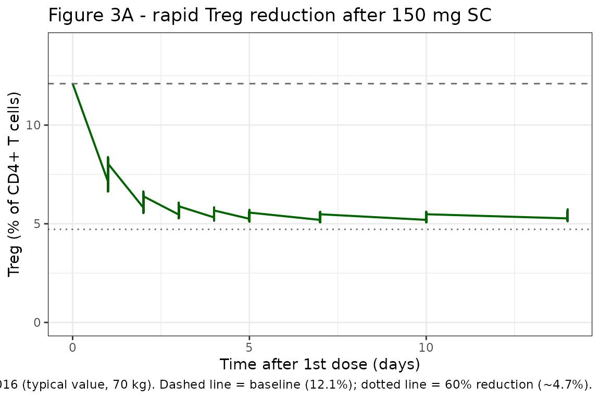
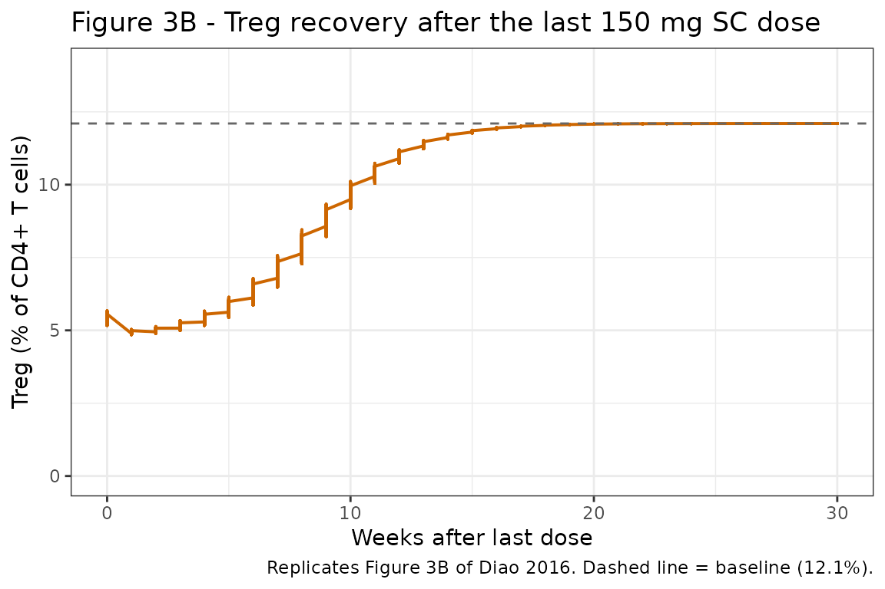
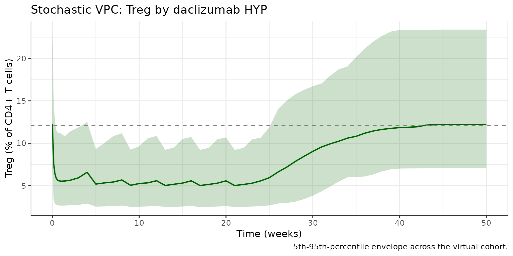

# Daclizumab treg (Diao 2016)

``` r

library(nlmixr2lib)
library(rxode2)
#> rxode2 5.1.2 using 2 threads (see ?getRxThreads)
#>   no cache: create with `rxCreateCache()`
library(dplyr)
#> 
#> Attaching package: 'dplyr'
#> The following objects are masked from 'package:stats':
#> 
#>     filter, lag
#> The following objects are masked from 'package:base':
#> 
#>     intersect, setdiff, setequal, union
library(tidyr)
library(ggplot2)
library(PKNCA)
#> 
#> Attaching package: 'PKNCA'
#> The following object is masked from 'package:stats':
#> 
#>     filter
```

## Daclizumab HYP regulatory T cell (Treg) reduction PK/PD model

CD25 is constitutively expressed at high levels on regulatory T cells
(Treg, defined here as CD4+ CD127low/- Foxp3+). Daclizumab high-yield
process (HYP) reduces circulating Treg counts during treatment despite
maintaining clinical efficacy in RRMS. Diao et al. (2016) characterized
the reduction with an algebraic sigmoidal `Emax` model linking
daclizumab HYP serum concentration directly to Treg percentage of CD4+ T
cells; adding a delay / effect compartment did not improve fit (Diao
2016 Discussion).

The PK backbone is inherited from Othman 2014 (two-compartment
first-order SC absorption with lag, allometric weight scaling); see the
companion Othman_2014_daclizumab vignette for the PK details.

- Citation: Diao L, Hang Y, Othman AA, et al. Br J Clin Pharmacol.
  2016;82(5):1333-1342.
- Article: <https://doi.org/10.1111/bcp.13051>
- PMID: 27333593

## Population

The pooled PK/PD analysis included 1353 RRMS subjects with 8742 Treg
records from four daclizumab HYP clinical studies (Diao 2016 Table 2):

| Study                                      | Subjects | Treg records |
|--------------------------------------------|----------|--------------|
| 205MS201 / SELECT and 205MS202 / SELECTION | 545      | 4835         |
| 205MS302 / OBSERVE                         | 106      | 891          |
| 205MS301 / DECIDE                          | 702      | 3016         |

The typical baseline Treg percentage among CD4+ T cells is 12.1% (Diao
2016 Table 5).

## Source trace

| Equation / parameter | Value | Source |
|----|----|----|
| PK backbone (`lka`, `lcl`, `lvc`, `lvp`, `lq`, `lfdepot`, `lalag`, `e_wt_cl_q`, `e_wt_vc_vp`, `e_dose_50mg_f`, PK IIV, `propSd`, `addSd`) | Othman 2014 Table 2 values | inherited from `Othman_2014_daclizumab.R` |
| `ltregE0` (typical baseline Treg) | 12.1 % of CD4+ T cells | Diao 2016 Table 5 |
| `etaltregE0` (E0 IIV) | omega^2 0.16127 (CV 42%) | Diao 2016 Table 5 |
| `ltregIC50` (IC50) | 3.97 mg/L | Diao 2016 Table 5 |
| `etaltregIC50` (IC50 IIV) | omega^2 0.34744 (CV 65%) | Diao 2016 Table 5 |
| `treggamma` (Hill coefficient, fixed structurally) | 2 (unitless) | Diao 2016 Table 5 (no SE / CI labelled) |
| `ltregEmax` (max fractional reduction) | 0.610 | Diao 2016 Table 5 |
| `etaltregEmax` (Emax IIV) | omega^2 0.01431 (CV 12%) | Diao 2016 Table 5 |
| `propSd_treg` (proportional residual error) | 0.501 (CV 50.1%) | Diao 2016 Table 5 |
| `addSd_treg` (additive residual error) | 0.416 percentage points | Diao 2016 Table 5 |
| Equation 3: `Treg = E0 * (1 - Emax * Cc^gamma / (Cc^gamma + IC50^gamma))` | n/a | Diao 2016 Equation (3) |

## Virtual cohort

The simulation covers 150 mg SC every 4 weeks for 6 cycles, then 24
weeks of washout, mirroring the schedule used to characterise the rapid
Treg reduction (~4 days post-dose) and the ~20-week return to baseline
after the last dose.

``` r

set.seed(2016)
n_subjects <- 100
cohort <- tibble(
  id = seq_len(n_subjects),
  WT = pmin(120, pmax(45, rnorm(n_subjects, 71, 14))),
  DOSE_50MG = 0L
)
```

``` r

dose_times <- seq(0, 140, by = 28)             # 6 doses Q4W
obs_times  <- sort(unique(c(0, 1, 2, 3, 4, 5, 7, 10, 14, 21,
                            seq(28, 350, by = 7))))

# Observe at the ODE state `central` with dvid = 1L. The model body has
# two algebraic observables (Cc and treg) in residual tildes; rxUi
# auto-injects compartment slots for them after the ODE-state slots, so
# `cmt = "Cc"` / `cmt = "treg"` would target injected slots rather than
# the ODE state. rxSolve still returns Cc and treg as columns on every
# observation row, so a single sample per time covers both endpoints.
sim_one <- function(sub) {
  ev <- rxode2::et(amt = 150, time = dose_times, cmt = "depot") |>
    rxode2::et(obs_times, cmt = "central")
  ev_df <- as.data.frame(ev)
  ev_df$dvid      <- ifelse(ev_df$evid == 0L, 1L, NA_integer_)
  ev_df$id        <- sub$id
  ev_df$WT        <- sub$WT
  ev_df$DOSE_50MG <- sub$DOSE_50MG
  ev_df
}

events <- cohort |>
  dplyr::group_split(id) |>
  lapply(sim_one) |>
  dplyr::bind_rows()

stopifnot(!anyDuplicated(unique(events[, c("id", "time", "evid", "cmt")])))
```

## Simulation

``` r

mod     <- readModelDb("Diao_2016_daclizumab_treg")
mod_typ <- rxode2::zeroRe(mod)
#> ℹ parameter labels from comments will be replaced by 'label()'

set.seed(2016)
sim_pop <- rxode2::rxSolve(mod, events, returnType = "data.frame")
#> ℹ parameter labels from comments will be replaced by 'label()'
sim_typ <- rxode2::rxSolve(mod_typ, events, returnType = "data.frame")
#> ℹ omega/sigma items treated as zero: 'etalka', 'etalcl', 'etalvc', 'etaltregE0', 'etaltregIC50', 'etaltregEmax'
#> Warning: multi-subject simulation without without 'omega'
```

## Replicate published figures

### Figure 3A: rapid Treg reduction after a 150 mg SC dose

Diao 2016 Figure 3A simulates the Treg time course over the first ~14
days following a 150 mg SC daclizumab HYP dose. The published profile
reaches a maximum reduction of ~60% (i.e., Treg falls from ~12.1% to
~4.7%) approximately 4 days post-dose.

``` r

fig3a <- sim_typ |>
  dplyr::filter(!is.na(treg), time <= 14) |>
  dplyr::distinct(id, time, .keep_all = TRUE)

ggplot(fig3a, aes(time, treg)) +
  geom_line(color = "darkgreen", linewidth = 0.7) +
  geom_hline(yintercept = 12.1, linetype = "dashed", color = "grey40") +
  geom_hline(yintercept = 12.1 * (1 - 0.61), linetype = "dotted", color = "grey40") +
  scale_y_continuous(limits = c(0, 14)) +
  labs(
    x = "Time after 1st dose (days)",
    y = "Treg (% of CD4+ T cells)",
    title = "Figure 3A - rapid Treg reduction after 150 mg SC",
    caption = paste0(
      "Replicates Figure 3A of Diao 2016 (typical value, 70 kg). ",
      "Dashed line = baseline (12.1%); dotted line = 60% reduction (~4.7%)."
    )
  ) +
  theme_bw()
```



### Figure 3B: Treg recovery after the last steady-state 150 mg SC dose

Diao 2016 Figure 3B shows return of Treg to baseline over ~20 weeks
after the last steady-state 150 mg SC dose.

``` r

last_dose_t <- 140
fig3b <- sim_typ |>
  dplyr::filter(!is.na(treg), time >= last_dose_t) |>
  dplyr::distinct(id, time, .keep_all = TRUE) |>
  dplyr::mutate(weeks_after_last = (time - last_dose_t) / 7)

ggplot(fig3b, aes(weeks_after_last, treg)) +
  geom_line(color = "darkorange3", linewidth = 0.7) +
  geom_hline(yintercept = 12.1, linetype = "dashed", color = "grey40") +
  scale_y_continuous(limits = c(0, 14)) +
  labs(
    x = "Weeks after last dose",
    y = "Treg (% of CD4+ T cells)",
    title = "Figure 3B - Treg recovery after the last 150 mg SC dose",
    caption = "Replicates Figure 3B of Diao 2016. Dashed line = baseline (12.1%)."
  ) +
  theme_bw()
```



### Stochastic VPC

``` r

vpc <- sim_pop |>
  dplyr::filter(!is.na(treg)) |>
  dplyr::distinct(id, time, .keep_all = TRUE) |>
  dplyr::group_by(time) |>
  dplyr::summarise(
    Q05 = quantile(treg, 0.05),
    Q50 = quantile(treg, 0.50),
    Q95 = quantile(treg, 0.95),
    .groups = "drop"
  )

ggplot(vpc, aes(time / 7, Q50)) +
  geom_ribbon(aes(ymin = Q05, ymax = Q95),
              fill = "darkgreen", alpha = 0.20) +
  geom_line(color = "darkgreen", linewidth = 0.7) +
  geom_hline(yintercept = 12.1, linetype = "dashed", color = "grey50") +
  labs(
    x = "Time (weeks)",
    y = "Treg (% of CD4+ T cells)",
    title = "Stochastic VPC: Treg by daclizumab HYP",
    caption = "5th-95th-percentile envelope across the virtual cohort."
  ) +
  theme_bw()
```



## PKNCA validation (PK)

Treg percentage is not amenable to standard NCA. PKNCA is run on the
inherited PK output to confirm steady-state (dose 5) Cmax / Cmin / AUC
across one dosing interval.

``` r

sim_conc <- sim_pop |>
  dplyr::filter(!is.na(Cc), time >= 112, time <= 140) |>
  dplyr::distinct(id, time, .keep_all = TRUE) |>
  dplyr::mutate(time_in_interval = time - 112) |>
  dplyr::transmute(id = id, time = time_in_interval, Cc = Cc,
                   regimen = "150 mg SC Q4W")

dose_df <- events |>
  dplyr::filter(evid == 1, time == 112) |>
  dplyr::transmute(id = id, time = 0, amt = amt,
                   regimen = "150 mg SC Q4W")

conc_obj <- PKNCA::PKNCAconc(sim_conc, Cc ~ time | regimen + id)
dose_obj <- PKNCA::PKNCAdose(dose_df, amt ~ time | regimen + id)

intervals <- data.frame(
  start = 0, end = 28,
  cmax = TRUE, cmin = TRUE,
  tmax = TRUE, auclast = TRUE
)

nca <- PKNCA::pk.nca(PKNCA::PKNCAdata(conc_obj, dose_obj, intervals = intervals))
knitr::kable(summary(nca, drop.group = "id"),
             caption = "Steady-state (dose 5) NCA, 150 mg SC Q4W.")
#> Warning: The `drop.group` argument of `summary.PKNCAresults()` is deprecated as of PKNCA
#> 0.11.0.
#> ℹ Please use the `drop_group` argument instead.
#> This warning is displayed once per session.
#> Call `lifecycle::last_lifecycle_warnings()` to see where this warning was
#> generated.
```

| start | end | regimen | N | auclast | cmax | cmin | tmax |
|---:|---:|:---|:---|:---|:---|:---|:---|
| 0 | 28 | 150 mg SC Q4W | 100 | 493 \[31.7\] | 22.4 \[33.4\] | 12.5 \[33.9\] | 7.00 \[7.00, 14.0\] |

Steady-state (dose 5) NCA, 150 mg SC Q4W. {.table style="width:100%;"}

### Comparison against published behaviour

Diao 2016 reports two narrative checkpoints for the Treg reduction
model:

``` r

typ <- sim_typ |>
  dplyr::filter(!is.na(treg)) |>
  dplyr::distinct(id, time, .keep_all = TRUE)

# Maximum reduction within first 14 days post first dose.
first_window <- typ |> dplyr::filter(time >= 0, time <= 14)
min_treg <- min(first_window$treg, na.rm = TRUE)
t_min   <- first_window$time[which.min(first_window$treg)]
max_red <- (12.1 - min_treg) / 12.1

# Time to return within 20% of baseline (10% absolute) after last dose.
after_last <- typ |> dplyr::filter(time >= 140)
recover_t_w <- (after_last$time[which(after_last$treg > 0.95 * 12.1)[1]] - 140) / 7

cmp <- tibble(
  metric    = c("Time to maximum reduction post 150 mg SC (days)",
                "Maximum fractional Treg reduction post 150 mg SC",
                "Time to >95% baseline recovery after last dose (weeks)"),
  published = c("~4 days", "~60%", "~20 weeks"),
  simulated = c(sprintf("%.1f", t_min),
                sprintf("%.1f%%", 100 * max_red),
                sprintf("%.1f", recover_t_w))
)
knitr::kable(cmp, caption = "Treg reduction / recovery checkpoints.")
```

| metric | published | simulated |
|:---|:---|:---|
| Time to maximum reduction post 150 mg SC (days) | ~4 days | 7.0 |
| Maximum fractional Treg reduction post 150 mg SC | ~60% | 58.1% |
| Time to \>95% baseline recovery after last dose (weeks) | ~20 weeks | 14.0 |

Treg reduction / recovery checkpoints. {.table style="width:100%;"}

## Errata

Several non-substantive PDF text-extraction artifacts (operators
rendered as `/C0`, etc.) appear in the trimmed source; they are not
paper errata. Two model-relevant ambiguities are documented:

- **Hill coefficient point estimate without precision indicator.** Diao
  2016 Table 5 lists `gamma = 2` for the Treg model with no standard
  error, no `(FIXED)` tag, and a bootstrap 95% CI of 1.39 to 2.91. The
  bootstrap CI is wide enough to encompass `gamma = 1` (a hyperbolic
  Emax), but the Table 5 row format (no SE column populated alongside
  the value) is consistent with the value being treated as a fixed
  structural parameter during fitting. The library encodes
  `treggamma <- fixed(2)` to match.
- **Residual additive error units.** Diao 2016 Table 5 reports “Residual
  error (additive): 0.416” with no explicit unit string. The Treg
  measurement scale is “% of CD4+ T cells” (per Table 5 baseline row),
  so the additive residual error is interpreted here as 0.416 percentage
  points; the proportional component (50.1%) is taken as a CV on the
  same scale (`propSd_treg <- 0.501`).

## Assumptions and deviations

- **PK backbone is Othman 2014, not the in-paper PK summary.** Same as
  the companion CD25 and CD56 bright vignettes: Diao 2016 fixed PK to a
  published RRMS PopPK model (CL = 0.212 L/day at 68 kg, allometric
  exponents 0.87 / 1.12, F = 0.88, t1/2,abs ~ 5 days, Tlag = 1.61 h)
  whereas the packaged PD model uses Othman 2014 healthy-volunteer PK
  (CL = 0.24 L/day at 70 kg, exponents 0.54 / 0.64, F = 0.84, ka = 0.216
  /day, Tlag = 2 h). The IC50 of 3.97 mg/L is comparable to the typical
  clinical Cc range, so simulated Treg curves are sensitive to the PK
  assumption. Users who need exact reproduction of Diao 2016 Figure 3
  numerical values can override the inherited PK
  [`ini()`](https://nlmixr2.github.io/rxode2/reference/ini.html)
  entries.
- **No PD covariates.** Diao 2016 does not report covariate effects on
  the Treg PD parameters; only the inherited PK covariates (`WT`,
  `DOSE_50MG`) are present.
- **Hill coefficient treated as structurally fixed.** See Errata.
- **Virtual-cohort weight distribution.** Body weight is sampled from
  N(71, 14) kg truncated to 45-120 kg.
