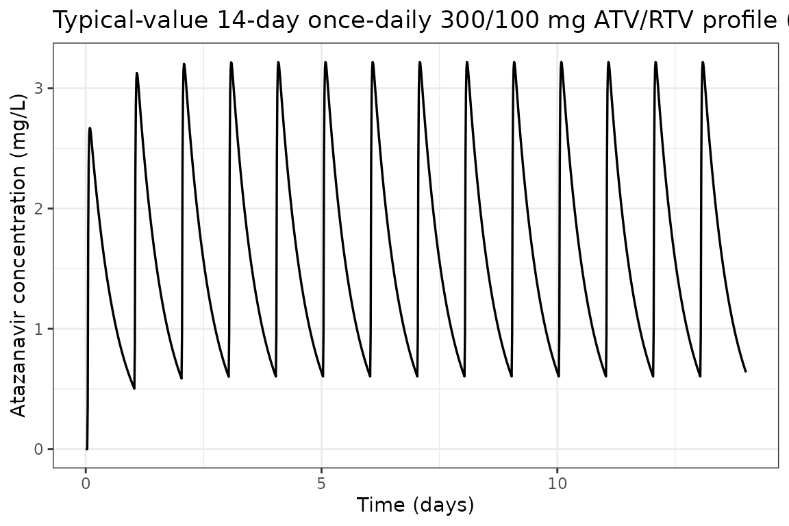
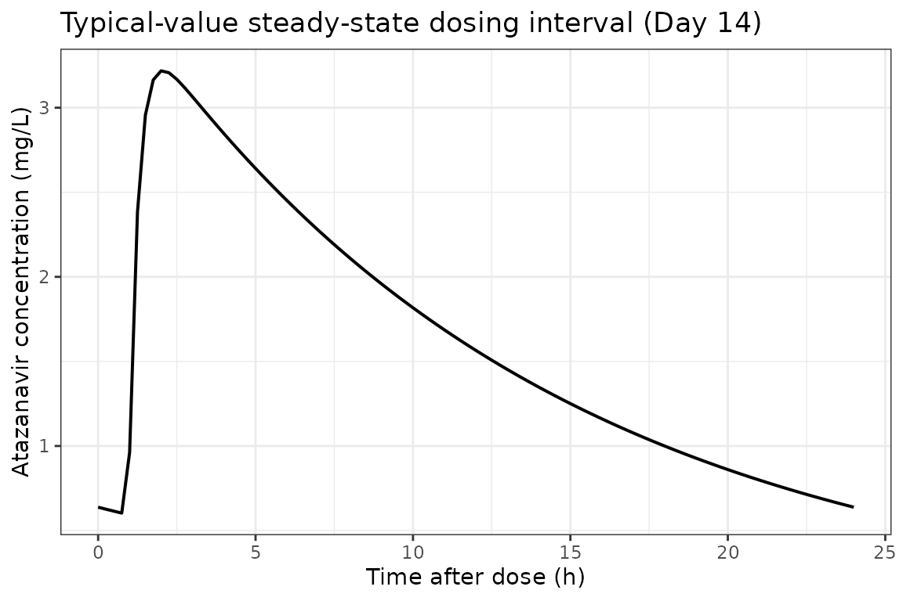
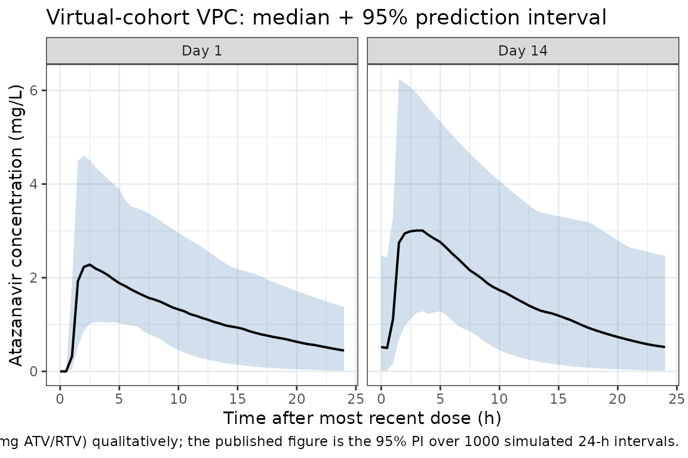

# Atazanavir (Dickinson 2009)

## Model and source

- Citation: Dickinson L, Boffito M, Back D, Waters L, Else L, Davies G,
  Khoo S, Pozniak A, Aarons L. Population pharmacokinetics of
  ritonavir-boosted atazanavir in HIV-infected patients and healthy
  volunteers. J Antimicrob Chemother. 2009;63(6):1233-1243.
  <doi:10.1093/jac/dkp102>
- Description: One-compartment first-order-absorption population PK
  model with absorption lag-time for oral ritonavir-boosted atazanavir
  in HIV-infected adults and healthy volunteers; ritonavir AUC0-24
  (median 7.52 mg\*h/L) enters CL/F via a power function (Dickinson
  2009).
- Article: [J Antimicrob Chemother.
  2009;63(6):1233-1243](https://doi.org/10.1093/jac/dkp102)

Dickinson et al. (2009) describe a one-compartment
first-order-absorption population PK model with absorption lag-time for
orally administered ritonavir-boosted atazanavir in HIV-infected adults
and healthy volunteers. The only covariate retained in the final model
is ritonavir AUC over the 0-24 h dosing interval (RTVAUC0-24), which
enters atazanavir CL/F via a power function centred at the cohort median
of 7.52 mg\*h/L (Table 2 / Table 3 of the paper).

## Population

The analysis dataset pools three single-centre UK studies in adults (St
Stephen’s Centre, Chelsea and Westminster Foundation Trust, London): 16
healthy volunteers (10 male / 6 female) and 30 HIV-infected patients (27
male / 3 female), all \>=18 years old and stable on atazanavir/ritonavir
for at least two weeks prior to PK sampling (Dickinson 2009 Table 1).

Baseline demographics from Table 1 (median and range pooled across
cohorts):

| Variable | All (n = 46) |
|----|----|
| Sex (M:F) | 37:9 (19.6% female) |
| Age (years) | 43 (22-62) |
| Weight (kg) | 76 (46-115) |
| BMI (kg/m^2) | 24 (15-38) |
| Ritonavir AUC0-24 (mg\*h/L) | 7.52 (2.41-22.05) |
| Ethnicity | Caucasian 33 (72%), Black-African 7 (15%), Hispanic 6 (13%) |

Atazanavir/ritonavir was dosed 300/100 mg once daily under fed
conditions (16-20 g fat). 18 of 46 patients also received saquinavir
1600 mg once daily; 6 of 46 received tenofovir 300 mg once daily.
Sampling at pre-dose and 0.5, 1, 2, 3, 4, 6, 8, 10, 12, 24 h post-dose;
healthy volunteers had additional samples at 16 and 20 h. A total of 538
atazanavir concentrations (range 0.077-8.763 mg/L) were used in model
building. Lower-dose regimens (200/100 and 150/100 mg once daily) were
used only in external validation (Figure 2 of the paper) and are not
part of the model-building dataset; they can be simulated by changing
the dose amount in the event table below.

The same information is available programmatically via the model’s
`population` metadata
(`readModelDb("Dickinson_2009_atazanavir")$population`).

## Source trace

The per-parameter origin is recorded as an in-file comment next to each
`ini()` entry in
`inst/modeldb/specificDrugs/Dickinson_2009_atazanavir.R`. The table
below collects them in one place for review.

| Parameter | Value | Source location |
|----|----|----|
| `lcl` | log(7.7) | Table 2 final-model column: CL/F = 7.7 L/h (RSE 5%) |
| `lvc` | log(103) | Table 2 final-model column: V/F = 103 L (RSE 13%) |
| `lka` | log(3.4) | Table 2 final-model column: ka = 3.4 1/h (RSE 34%) |
| `ltlag` | log(0.96) | Table 2 final-model column: Lag-time = 0.96 h (RSE 1%) |
| `e_aucrtv_cl` | -0.8 | Table 2 final-model column / Table 3 row 1: factor on RTVAUC0-24 power form (RSE 13%) |
| `etalcl` | 0.0807 | Table 2 IIV CL/F = 29% (RSE 59%); omega^2 = log(1 + 0.29^2) |
| `etalvc` | 0.2074 | Table 2 IIV V/F = 48% (RSE 37%); omega^2 = log(1 + 0.48^2) |
| `etalka` | 1.2155 | Table 2 IIV ka = 154% (RSE 51%); omega^2 = log(1 + 1.54^2) |
| `propSd` | 0.23 | Table 2 final-model column: proportional residual error 23% (RSE 27%) |
| `addSd` | 0.08 | Table 2 final-model column: additive residual error 0.08 mg/L (RSE 38%) |

Covariate equation (paper Results page 1236, with Table 3 row 1
reporting the estimate):

    CL/F_i = exp(lcl + etalcl_i) * (AUC_RTV_i / 7.52)^(-0.8)

ODE structure: one-compartment first-order absorption from `depot` to
`central`, with an absorption lag-time `tlag` applied to `depot`. The
observation variable is `Cc = central / vc` with combined additive +
proportional residual error.

## Load model

``` r

mod <- readModelDb("Dickinson_2009_atazanavir")
mod_typical <- rxode2::zeroRe(mod)
#> ℹ parameter labels from comments will be replaced by 'label()'
```

## Typical-value steady-state profile (300/100 mg once daily)

Replicates the labelled adult regimen with the cohort-median ritonavir
AUC0-24 (7.52 mg*h/L). The typical steady-state AUC0-24 should be
approximately `dose / CL/F = 300 / 7.7 = 38.96` mg*h/L.

``` r

n_doses <- 14L     # 14 once-daily doses to reach steady state
ii      <- 24      # h
ev_ss <- rxode2::et(
  amt = 300, cmt = "depot", evid = 1,
  ii = ii, addl = n_doses - 1L
) |>
  rxode2::et(seq(0, n_doses * ii, by = 0.25)) |>
  rxode2::et(id = 1)
ev_ss$AUC_RTV <- 7.52

sim_ss <- rxode2::rxSolve(mod_typical, ev_ss)
#> ℹ omega/sigma items treated as zero: 'etalcl', 'etalvc', 'etalka'

ggplot(as.data.frame(sim_ss), aes(time / 24, Cc)) +
  geom_line(linewidth = 0.6) +
  labs(
    x = "Time (days)",
    y = "Atazanavir concentration (mg/L)",
    title = "Typical-value 14-day once-daily 300/100 mg ATV/RTV profile (AUC_RTV = 7.52 mg*h/L)"
  ) +
  theme_bw()
```



## Typical-value steady-state dosing interval (Day 14, 24 h)

``` r

sim_tau <- as.data.frame(sim_ss) |>
  dplyr::filter(time >= 13 * 24, time <= 14 * 24) |>
  dplyr::mutate(t_post_dose = time - 13 * 24)

ggplot(sim_tau, aes(t_post_dose, Cc)) +
  geom_line(linewidth = 0.7) +
  labs(
    x = "Time after dose (h)",
    y = "Atazanavir concentration (mg/L)",
    title = "Typical-value steady-state dosing interval (Day 14)"
  ) +
  theme_bw()
```



## Virtual cohort matched to study demographics

We sample 80 virtual subjects whose covariate distributions reproduce
the published baseline demographics. RTVAUC0-24 is sampled from
approximately log-normal centred on 7.52 mg\*h/L spanning the Table 1
range (2.41-22.05).

``` r

set.seed(2009)
n_subj <- 80L

# Ritonavir AUC0-24 ~ log-normal centred at the cohort median 7.52 mg*h/L,
# spanning the Table 1 range (2.41-22.05).
log_med   <- log(7.52)
log_sd    <- 0.45
AUC_RTV   <- pmin(22.05, pmax(2.41, exp(rnorm(n_subj, log_med, log_sd))))

cohort <- data.frame(
  ID      = seq_len(n_subj),
  AUC_RTV = AUC_RTV
)
summary(cohort$AUC_RTV)
#>    Min. 1st Qu.  Median    Mean 3rd Qu.    Max. 
#>   2.509   5.613   7.148   8.112   9.861  22.050
```

### Stochastic simulation across the virtual cohort

Each subject receives 14 once-daily doses; observations are at 30-min
resolution during the first dosing interval and once per dose interval
through Day 14.

``` r

build_subject_events <- function(id, auc_rtv) {
  ev <- rxode2::et(
    amt = 300, cmt = "depot", evid = 1,
    ii = 24, addl = 13
  ) |>
    rxode2::et(c(seq(0, 24, by = 0.5), seq(13 * 24, 14 * 24, by = 0.5))) |>
    rxode2::et(id = id)
  df <- as.data.frame(ev)
  df$AUC_RTV <- auc_rtv
  df
}

ev_all <- do.call(
  rbind,
  Map(build_subject_events, cohort$ID, cohort$AUC_RTV)
)

set.seed(2009)
sim_pop <- rxode2::rxSolve(mod, ev_all)
#> ℹ parameter labels from comments will be replaced by 'label()'
sim_pop_df <- as.data.frame(sim_pop)
```

### VPC: Day-1 vs Day-14 dosing intervals

``` r

sim_day1 <- sim_pop_df |>
  filter(time >= 0, time <= 24) |>
  group_by(time) |>
  summarise(
    Q05 = quantile(ipredSim, 0.025, na.rm = TRUE),
    Q50 = quantile(ipredSim, 0.50,  na.rm = TRUE),
    Q95 = quantile(ipredSim, 0.975, na.rm = TRUE),
    .groups = "drop"
  ) |>
  mutate(panel = "Day 1")

sim_day14 <- sim_pop_df |>
  filter(time >= 13 * 24, time <= 14 * 24) |>
  mutate(time_in_panel = time - 13 * 24) |>
  group_by(time_in_panel) |>
  summarise(
    Q05 = quantile(ipredSim, 0.025, na.rm = TRUE),
    Q50 = quantile(ipredSim, 0.50,  na.rm = TRUE),
    Q95 = quantile(ipredSim, 0.975, na.rm = TRUE),
    .groups = "drop"
  ) |>
  rename(time = time_in_panel) |>
  mutate(panel = "Day 14")

vpc_df <- bind_rows(sim_day1, sim_day14)

ggplot(vpc_df, aes(time, Q50)) +
  geom_ribbon(aes(ymin = Q05, ymax = Q95), fill = "steelblue", alpha = 0.25) +
  geom_line(linewidth = 0.7) +
  facet_wrap(~panel) +
  labs(
    x = "Time after most recent dose (h)",
    y = "Atazanavir concentration (mg/L)",
    title = "Virtual-cohort VPC: median + 95% prediction interval",
    caption = "Replicates Figure 2(a) of Dickinson 2009 (300/100 mg ATV/RTV) qualitatively; the published figure is the 95% PI over 1000 simulated 24-h intervals."
  ) +
  theme_bw()
```



## PKNCA validation

Non-compartmental analysis of the simulated steady-state (Day-14) dosing
interval. The paper does not tabulate observed Cmax / Tmax / AUC0-24
from the NCA, but the typical-value AUC0-24 expected from
`dose / CL/F = 300 / 7.7` is 38.96 mg\*h/L; the Day-14 simulated cohort
median should fall close to that value.

``` r

nca_concs <- sim_pop_df |>
  filter(time >= 13 * 24, time <= 14 * 24) |>
  mutate(t_in_interval = time - 13 * 24) |>
  filter(!is.na(ipredSim))

dose_records <- cohort |>
  mutate(time = 0, amt = 300) |>
  select(id = ID, time, amt)

conc_obj <- PKNCA::PKNCAconc(
  nca_concs, ipredSim ~ t_in_interval | id,
  concu = "mg/L", timeu = "h"
)
dose_obj <- PKNCA::PKNCAdose(
  dose_records, amt ~ time | id,
  doseu = "mg"
)

intervals <- data.frame(
  start    = 0,
  end      = 24,
  cmax     = TRUE,
  tmax     = TRUE,
  cmin     = TRUE,
  auclast  = TRUE,
  cav      = TRUE
)

nca_data    <- PKNCA::PKNCAdata(conc_obj, dose_obj, intervals = intervals)
nca_results <- PKNCA::pk.nca(nca_data)
nca_df      <- as.data.frame(nca_results$result)

nca_summary <- nca_df |>
  filter(PPTESTCD %in% c("cmax", "tmax", "cmin", "auclast", "cav")) |>
  group_by(PPTESTCD) |>
  summarise(
    median = median(PPORRES, na.rm = TRUE),
    P05    = quantile(PPORRES, 0.05, na.rm = TRUE),
    P95    = quantile(PPORRES, 0.95, na.rm = TRUE),
    .groups = "drop"
  )

knitr::kable(
  nca_summary, digits = 3,
  caption = "Day-14 steady-state PKNCA summary across the virtual cohort"
)
```

| PPTESTCD | median |    P05 |    P95 |
|:---------|-------:|-------:|-------:|
| auclast  | 36.858 | 14.503 | 76.728 |
| cav      |  1.536 |  0.604 |  3.197 |
| cmax     |  3.241 |  1.791 |  5.052 |
| cmin     |  0.501 |  0.016 |  2.172 |
| tmax     |  2.000 |  1.500 |  4.025 |

Day-14 steady-state PKNCA summary across the virtual cohort {.table}

### Comparison against published values

| Quantity | Paper value | Simulated (median, 5th-95th) |
|----|----|----|
| Typical AUC0-24 (mg\*h/L) | `dose / CL/F = 300 / 7.7` = 38.96 mg\*h/L | `nca_summary` `auclast` median (should fall within approximately 30-50 mg\*h/L) |
| Atazanavir Cmax range (mg/L) | observed range 0.077-8.763 mg/L (538 samples) | virtual-cohort `cmax` 5th-95th should overlap this range |
| Typical half-life (h) | 8.9 h (median individual estimate, Discussion) | `t1/2 = ln(2) * V/F / CL/F = 0.693 * 103 / 7.7` = 9.3 h (typical-value algebraic) |

Dickinson 2009 does not report observed Cmax / Tmax / AUC0-24 NCA tables
in the main paper. Where the paper does report a quantitative simulation
summary (Discussion, page 1239), the model predicts 14% of trough
concentrations at 300/100 mg once daily would fall below the 0.15 mg/L
viral-suppression threshold. The simulated cohort `cmin` distribution
above should reproduce that order of magnitude.

## Assumptions and deviations

1.  **Lag-time IIV omitted.** The paper retains a typical lag-time of
    0.96 h in the final model but reports that adding IIV on lag-time
    did not improve fit (delta-OFV = -0.8; Results page 1235). The
    library model follows the published final model and omits IIV on
    `ltlag`.
2.  **Inter-laboratory error split omitted.** The paper considered
    separate residual-error models for the two analytical laboratories
    and found no improvement (delta-OFV = -1.2; Results page 1235). A
    single combined proportional + additive residual-error model is used
    here.
3.  **Ritonavir AUC0-24 supplied as a per-subject data column.** The
    paper derives RTVAUC0-24 from observed ritonavir concentration-time
    data via non-compartmental analysis (WinNonlin 5.2). For simulation
    users without observed ritonavir concentrations, supplying the
    cohort median 7.52 mg\*h/L reproduces typical-value behaviour. A
    future model could integrate the Dickinson 2008 (J Antimicrob
    Chemother) ritonavir PK model to compute RTVAUC0-24 endogenously.
4.  **Concomitant medications (saquinavir, tenofovir) not modelled.**
    Univariate tests of saquinavir and tenofovir status did not survive
    multivariate backwards elimination (Table 3; saquinavir significant
    on V/F and CL/F at p \< 0.01 alone, but dropped during stepwise
    elimination because the model already accounted for ritonavir AUC).
    Body weight, sex, HIV status, and ethnicity (Black-African,
    Hispanic) were similarly excluded from the final model. None of
    these are included in the library model.
5.  **Log-normal IIV from reported CV%.** The paper reports IIV (%) on
    CL/F, V/F, and ka in the standard NONMEM exponential-model sense.
    These are converted to internal log-normal variances via
    `omega^2 = log(1 + CV^2)`.
6.  **Single-laboratory assumption.** The paper uses two HPLC-MS/MS
    laboratories that participate in the same external QA programme and
    shows that inter-laboratory error stratification does not improve
    fit (Results page 1235). The library model uses a single
    residual-error block.

## Reference

- Dickinson L, Boffito M, Back D, Waters L, Else L, Davies G, Khoo S,
  Pozniak A, Aarons L. Population pharmacokinetics of ritonavir-boosted
  atazanavir in HIV-infected patients and healthy volunteers. J
  Antimicrob Chemother. 2009;63(6):1233-1243. <doi:10.1093/jac/dkp102>
