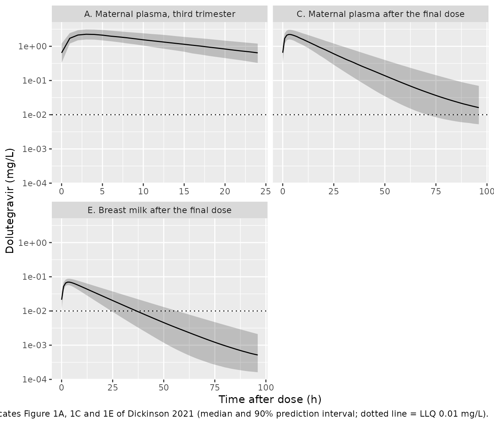
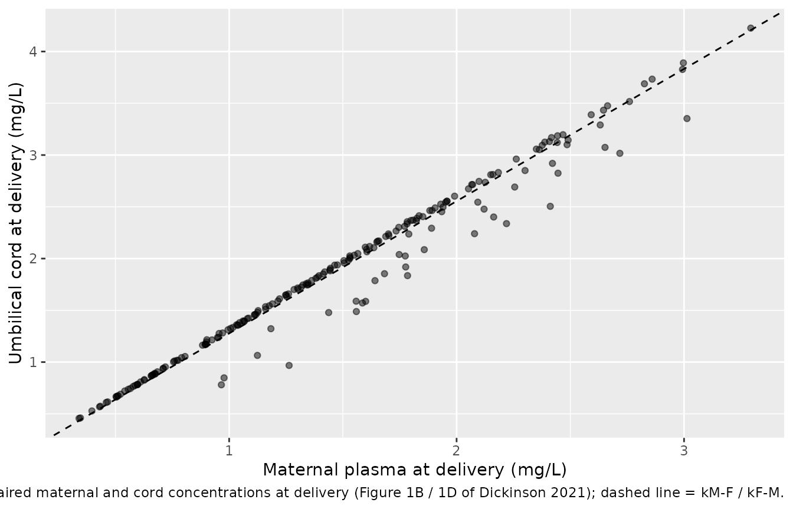
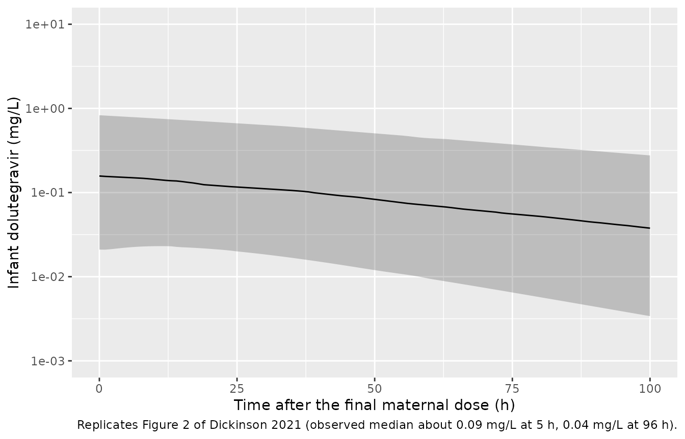

# Dolutegravir placental and breast-milk transfer (Dickinson 2021)

## Model and source

Dickinson et al. (2021) describe dolutegravir in four matrices from the
DolPHIN-1 trial, in which women diagnosed with HIV late in pregnancy
were randomized to dolutegravir-based therapy: maternal plasma (third
trimester, delivery and postpartum), umbilical cord, breast milk, and
the plasma of their breastfed infants. The paper builds two models, and
the library ships both:

- `Dickinson_2021_dolutegravir` – the **maternal model**, fitted
  simultaneously to maternal plasma, cord and breast-milk
  concentrations.

- `Dickinson_2021_dolutegravir_motherinfant` – the **infant model**,
  fitted sequentially with the maternal parameters fixed. It carries the
  complete maternal model plus a one-compartment infant.

- Citation: Dickinson L, Walimbwa S, Singh Y, Kaboggoza J, Kintu K,
  Sihlangu M, Coombs JA, Malaba TR, Byamugisha J, Pertinez H, Amara A,
  Gini J, Else L, Heiberg C, Hodel EM, Reynolds H, Myer L, Waitt C, Khoo
  S, Lamorde M, Orrell C; DolPHIN-1 Study Group. Infant exposure to
  dolutegravir through placental and breast milk transfer: a population
  pharmacokinetic analysis of DolPHIN-1. Clin Infect Dis.
  2021;73(5):e1200-e1207. <doi:10.1093/cid/ciaa1861>. Structure from the
  Results text and Figure 3; parameter values from Table 2 and its
  footnote b; estimation and BLQ methods from the Supplementary
  Material.

- Maternal model: Maternal population PK model for oral dolutegravir in
  women living with HIV who started treatment late in pregnancy
  (DolPHIN-1), fitted simultaneously to maternal plasma (third
  trimester, delivery and postpartum), umbilical cord and breast-milk
  concentrations. Two-compartment disposition with first-order
  absorption; the maternal central compartment is linked by first-order
  rate constants to a fetal (umbilical cord) compartment of negligible
  volume that does not deplete the mother, and to a breast-milk
  compartment of fixed 0.125 L volume. No covariates were retained. The
  breastfed-infant extension is
  modellib(‘Dickinson_2021_dolutegravir_motherinfant’).

- Mother-infant model: Mother-to-infant population PK model for
  dolutegravir (DolPHIN-1), extending the maternal model of
  modellib(‘Dickinson_2021_dolutegravir’) with a one-compartment
  breastfed-infant model fitted sequentially with the maternal
  parameters fixed. At delivery the infant is born with the
  transplacental amount on board, equal to the predicted umbilical-cord
  concentration times the mother’s apparent central volume; thereafter
  the infant receives dolutegravir by first-order input from the
  mother’s breast-milk compartment and eliminates it by a first-order
  infant elimination rate constant. The time-varying PREG indicator
  marks delivery: while PREG = 1 the infant state tracks the
  transplacental amount, and from the first PREG = 0 record the infant
  ODE runs.

- Article: <https://doi.org/10.1093/cid/ciaa1861> (open access; the
  Supplementary Material gives the estimation, BLQ and covariate
  methods).

## Population

The maternal model was fitted to 28 women (14 in Kampala, Uganda and 14
in Cape Town, South Africa) aged 19-42 years (median 27) weighing 44-160
kg (median 67). They started dolutegravir 50 mg once daily at 28-36
weeks’ gestation and were sampled intensively over 24 h on day 14 of
treatment (third trimester), at delivery (with a paired cord sample) and
within 1-3 weeks after delivery, after which they were switched to
efavirenz-based therapy and mother and infant were sampled up to 96 h
after the final dolutegravir dose. The postpartum sampling interval was
a median of 7 days (range 2-18). The data comprised 533 maternal plasma,
16 cord and 80 breast-milk concentrations.

The infant model was fitted to 65 plasma concentrations from 22
breastfed infants with a recorded delivery time: 17 boys and 5 girls,
birth weight 3.3 kg (2.5-4.3), gestational age 39 weeks (35-43),
postnatal age 7 days (3-18) (Table 1). The same information is available
programmatically via
`readModelDb("Dickinson_2021_dolutegravir")()$population` and
`readModelDb("Dickinson_2021_dolutegravir_motherinfant")()$population`.

## Source trace

| Equation / parameter | Value | Source location |
|----|----|----|
| Two-compartment maternal model, first-order absorption | n/a | Results, ‘Population Pharmacokinetic Modeling’; Figure 3 |
| `lcl` (CL/F) | 1.50 L/h | Table 2 |
| `lvc` (Vc/F) | 24.6 L | Table 2 |
| `lq` (Q/F) | 0.0138 L/h | Table 2 |
| `lvp` (Vp/F) | 2.01 L | Table 2 |
| `lka` | 0.75 1/h | Table 2 |
| Fetal compartment of negligible volume, not altering the mother | n/a | Results text; Figure 3 |
| `lk_central_fetal` (kM-F) | 2.81 1/h | Table 2 |
| `lk_fetal_central` (kF-M) | 2.20 1/h | Table 2 |
| Breast-milk compartment linked to maternal central | n/a | Results text; Figure 3 |
| `lk_central_milk` (kM-BM) | 0.0027 1/h | Table 2 |
| `lk_milk_central` (kBM-M) | 16.3 1/h | Table 2 |
| `lvmilk` (VBM) | 0.125 L, fixed | Table 2; Results (refs 16 and 18) |
| Infant: one compartment, transplacental initial amount + breast-milk input | n/a | Results text; Figure 3; Supplementary Material |
| Transplacental amount = cord concentration at delivery x maternal Vc/F | n/a | Results, ‘Patients and Pharmacokinetic Sampling’; Supplementary Material |
| `lkmilkinf` (kBM-INF) | 3.22 1/h | Table 2 |
| `lkel_infant` (kINF) | 0.0162 1/h | Table 2 |
| `lvc_infant` (VINF/F) | 30.1 L | Table 2 |
| `etalcl`, `etalvc` | 14.3%, 20.7% CV; correlation 0.88 | Table 2 footnote b; Table 2 correlation row |
| `etaiov_cl_*` | 21.0% CV | Table 2 footnote b |
| `etalkel_infant` | 43.6% CV | Table 2 footnote b |
| `propSd`, `propSd_Cfetal`, `propSd_Cmilk`, `propSd_Cinfant` | 36.5%, 33.0%, 58.4%, 34.4% | Table 2, ‘Residual error, %’ |

## Structural checks on the typical values

Three quantities follow from the typical parameters alone, with no
simulation noise, so they are checked tightly. At steady state the
maternal AUC over a dosing interval is `dose / CL/F`; because the fetal
compartment is a non-depleting link, the cord:maternal concentration
ratio settles to `kM-F / kF-M`; and the milk:maternal ratio is
`(kM-BM / kBM-M) x (Vc/F / VBM)`. The paper reports the last two as
model ratios of 1.279 and 0.033.

``` r

mod_mat <- readModelDb("Dickinson_2021_dolutegravir")
mod_mi <- readModelDb("Dickinson_2021_dolutegravir_motherinfant")

dose_times <- seq(0, 24 * 27, by = 24)
ev_typ <- dplyr::bind_rows(
  data.frame(id = 1L, time = dose_times, amt = 50, evid = 1L, cmt = "depot", dvid = NA_integer_),
  data.frame(id = 1L, time = seq(0, 24 * 28, by = 0.25), amt = 0, evid = 0L, cmt = "central", dvid = 1L)
) |>
  dplyr::arrange(time, dplyr::desc(evid)) |>
  dplyr::mutate(OCC = 1L, PREG = 1L)

sim_typ <- rxode2::rxSolve(
  rxode2::zeroRe(mod_mat), ev_typ,
  rtol = 1e-10, atol = 1e-12, returnType = "data.frame"
)
#> ℹ parameter labels from comments will be replaced by 'label()'
#> Warning: some etas defaulted to non-mu referenced, possible parsing error: etaiov_cl_1, etaiov_cl_2, etaiov_cl_3
#> as a work-around try putting the mu-referenced expression on a simple line
#> Warning: some etas defaulted to non-mu referenced, possible parsing error: etaiov_cl_1, etaiov_cl_2, etaiov_cl_3
#> as a work-around try putting the mu-referenced expression on a simple line
#> ℹ omega/sigma items treated as zero: 'etalcl', 'etalvc', 'etaiov_cl_1', 'etaiov_cl_2', 'etaiov_cl_3'
ss_day <- dplyr::filter(sim_typ, time >= 24 * 27, time <= 24 * 28)
trap <- function(x, y) sum(diff(x) * (head(y, -1) + tail(y, -1)) / 2)
auc_ss <- trap(ss_day$time, ss_day$Cc)
ratio_cord <- trap(ss_day$time, ss_day$Cfetal) / auc_ss
ratio_milk <- trap(ss_day$time, ss_day$Cmilk) / auc_ss

typ <- data.frame(
  Quantity = c("Maternal AUC0-24 at steady state (mg*h/L)", "Cord:maternal AUC ratio", "Breast milk:maternal AUC ratio"),
  Expected = c(50 / 1.50, 2.81 / 2.20, (0.0027 / 16.3) * (24.6 / 0.125)),
  Published = c(NA, 1.279, 0.033),
  Simulated = c(auc_ss, ratio_cord, ratio_milk)
)
knitr::kable(typ, digits = 4, caption = "Typical-value structural checks after 28 days of 50 mg once daily.")
```

| Quantity                                   | Expected | Published | Simulated |
|:-------------------------------------------|---------:|----------:|----------:|
| Maternal AUC0-24 at steady state (mg\*h/L) |  33.3333 |        NA |   33.3214 |
| Cord:maternal AUC ratio                    |   1.2773 |     1.279 |    1.2776 |
| Breast milk:maternal AUC ratio             |   0.0326 |     0.033 |    0.0326 |

Typical-value structural checks after 28 days of 50 mg once daily.
{.table}

``` r


# The milk compartment exchanges mass with the maternal central compartment,
# which adds (kM-BM / kBM-M) x Vc = 0.004 L to the steady-state volume and
# nothing to the dosing-interval AUC; the 0.25-h trapezoid on the absorption
# peak is the only other error term (measured ~5e-5 relative).
stopifnot(
  abs(auc_ss / (50 / 1.50) - 1) < 1e-3,
  abs(ratio_cord / (2.81 / 2.20) - 1) < 1e-3,
  abs(ratio_milk / ((0.0027 / 16.3) * (24.6 / 0.125)) - 1) < 1e-3,
  # and the model reproduces the published ratios to their printed precision
  abs(ratio_cord - 1.279) < 0.005,
  abs(ratio_milk - 0.033) < 0.001
)

# The mother-infant model carries the identical maternal layer.
sim_typ_mi <- rxode2::rxSolve(
  rxode2::zeroRe(mod_mi), ev_typ,
  rtol = 1e-10, atol = 1e-12, returnType = "data.frame"
)
#> ℹ parameter labels from comments will be replaced by 'label()'
#> Warning: some etas defaulted to non-mu referenced, possible parsing error: etaiov_cl_1, etaiov_cl_2, etaiov_cl_3
#> as a work-around try putting the mu-referenced expression on a simple line
#> Warning: some etas defaulted to non-mu referenced, possible parsing error: etaiov_cl_1, etaiov_cl_2, etaiov_cl_3
#> as a work-around try putting the mu-referenced expression on a simple line
#> ℹ omega/sigma items treated as zero: 'etalcl', 'etalvc', 'etaiov_cl_1', 'etaiov_cl_2', 'etaiov_cl_3', 'etalkel_infant'
stopifnot(
  max(abs(sim_typ_mi$Cc - sim_typ$Cc)) < 1e-8,
  max(abs(sim_typ_mi$Cmilk - sim_typ$Cmilk)) < 1e-8,
  max(abs(sim_typ_mi$Cfetal - sim_typ$Cfetal)) < 1e-8
)
```

## Virtual cohort

Observed data are not public. The cohort below reproduces the DolPHIN-1
timeline: dolutegravir 50 mg every morning for 28 days before delivery
(so the day-14 third-trimester profile and delivery are both well past
steady state), delivery at a uniformly distributed time within a dosing
interval, and a final maternal dose on postpartum day 2-18 drawn from
the Table 1 distribution of postpartum sampling intervals (56% within 1
week, 33% within 2 weeks, 11% within 3 weeks). Mothers and infants are
followed for 240 h after the final maternal dose.

``` r

# `set.seed()` seeds R's RNG (used for the delivery and stopping times).
# rxode2's own simulation RNG is set by rxSetSeed(), and its streams are
# partitioned per solver thread, so the cohort differs between machines with
# different thread counts. Every assertion below is written on the centre of
# the distribution for that reason.
set.seed(2021)
rxode2::rxSetSeed(2021)

n_sub <- 200L
# Postpartum day of the final maternal dose: Table 1 bins (within 1, 2 and
# 3 weeks), uniform within each bin, range 2-18 days as reported.
pp_bins <- list(2:7, 8:14, 15:18)
pp_bin <- sample(1:3, n_sub, replace = TRUE, prob = c(0.56, 0.33, 0.11))
pp_days <- vapply(pp_bins[pp_bin], function(b) sample(b, 1), integer(1))

subj <- tibble::tibble(
  id = seq_len(n_sub),
  t_del = 24 * 28 + runif(n_sub, 0, 24),
  pp_day = pp_days
) |>
  dplyr::mutate(t_last = 24 * (28 + pp_day))

make_events <- function(s) {
  doses <- seq(0, s$t_last, by = 24)
  obs <- sort(unique(c(
    24 * 14 + seq(0, 24, by = 1), # third-trimester intensive profile
    s$t_del, # delivery (paired maternal and cord sample)
    seq(ceiling(s$t_del), s$t_last, by = 6), # postpartum
    s$t_last + c(seq(0, 96, by = 1), seq(98, 240, by = 2)) # after the final dose
  )))
  dplyr::bind_rows(
    data.frame(time = doses, amt = 50, evid = 1L, cmt = "depot", dvid = NA_integer_),
    data.frame(time = obs, amt = 0, evid = 0L, cmt = "central", dvid = 1L)
  ) |>
    dplyr::mutate(
      id = s$id, t_del = s$t_del, t_last = s$t_last, pp_day = s$pp_day,
      PREG = as.integer(time < s$t_del),
      # occasion 1 = antepartum, occasion 3 = postpartum (see Assumptions)
      OCC = ifelse(time < s$t_del, 1L, 3L)
    )
}

events <- dplyr::bind_rows(lapply(split(subj, subj$id), make_events)) |>
  dplyr::arrange(id, time, dplyr::desc(evid))
stopifnot(!anyDuplicated(events[, c("id", "time", "evid")]))
```

## Simulation

``` r

sim <- rxode2::rxSolve(
  mod_mi, events,
  keep = c("t_del", "t_last", "pp_day"),
  returnType = "data.frame"
)
#> ℹ parameter labels from comments will be replaced by 'label()'
#> Warning: some etas defaulted to non-mu referenced, possible parsing error: etaiov_cl_1, etaiov_cl_2, etaiov_cl_3
#> as a work-around try putting the mu-referenced expression on a simple line
stopifnot(!anyNA(sim$Cc), !anyNA(sim$Cinfant))

# Individual infant elimination rate constants, for the half-life summary.
indiv <- sim |>
  dplyr::group_by(id) |>
  dplyr::slice(1) |>
  dplyr::ungroup() |>
  dplyr::transmute(id, vc, kel_infant, t_half_infant = log(2) / kel_infant)
```

### The transplacental dose

Before delivery the infant state tracks the cord concentration times the
mother’s apparent central volume; at delivery that amount is the
infant’s initial condition. The check below confirms the identity on
every simulated subject, then compares the resulting doses with the
paper’s median of 39.9 mg (range 15.5-59.0 mg).

``` r

at_del <- sim |>
  dplyr::filter(abs(time - t_del) < 1e-9) |>
  dplyr::left_join(indiv |> dplyr::select(id, vc_i = vc), by = "id") |>
  dplyr::mutate(dose_tp = Cfetal * vc_i, ratio_cord_mat = Cfetal / Cc)
stopifnot(
  nrow(at_del) == n_sub,
  max(abs(at_del$infant_central / at_del$dose_tp - 1)) < 1e-4
)
summary_tp <- data.frame(
  Quantity = c("Transplacental infant dose (mg)", "Cord:maternal concentration ratio at delivery"),
  Published = c("39.9 (15.5-59.0)", "1.279 (1.209-1.281), as a 0-24 h AUC ratio"),
  Simulated = c(
    sprintf("%.1f (%.1f-%.1f)", median(at_del$dose_tp), min(at_del$dose_tp), max(at_del$dose_tp)),
    sprintf("%.3f (%.3f-%.3f)", median(at_del$ratio_cord_mat), min(at_del$ratio_cord_mat), max(at_del$ratio_cord_mat))
  )
)
knitr::kable(summary_tp, caption = "Median (range) at delivery.")
```

| Quantity | Published | Simulated |
|:---|:---|:---|
| Transplacental infant dose (mg) | 39.9 (15.5-59.0) | 44.0 (11.4-88.3) |
| Cord:maternal concentration ratio at delivery | 1.279 (1.209-1.281), as a 0-24 h AUC ratio | 1.309 (0.766-1.348) |

Median (range) at delivery. {.table}

``` r


# Transplacental dose: a mis-transcribed kM-F, kF-M or Vc/F moves the median
# by tens of percent; the random delivery time within the dosing interval and
# Vc/F IIV set the spread.
stopifnot(abs(median(at_del$dose_tp) / 39.9 - 1) < 0.25)
```

The cord:maternal *concentration* ratio at a single time is not
constant: it lags behind the maternal profile by the fetal equilibration
half-life of `log(2) / 2.20 = 0.3` h, so it is below the steady-state
value of 1.277 while maternal concentrations rise after a dose and above
it while they fall. The AUC ratio above is the quantity the paper
summarises.

## Replicate published figures

### Figure 1 – maternal plasma, cord and breast milk

``` r

pct <- function(d, x, y) {
  d |>
    dplyr::group_by(.data[[x]]) |>
    dplyr::summarise(
      Q05 = quantile(.data[[y]], 0.05),
      Q50 = quantile(.data[[y]], 0.50),
      Q95 = quantile(.data[[y]], 0.95),
      .groups = "drop"
    ) |>
    dplyr::rename(tad = !!x)
}

third <- sim |>
  dplyr::filter(time >= 24 * 14, time <= 24 * 15) |>
  dplyr::mutate(tad = time - 24 * 14)
post <- sim |>
  dplyr::filter(time >= t_last, time <= t_last + 96) |>
  dplyr::mutate(tad = round(time - t_last, 6))

fig1 <- dplyr::bind_rows(
  pct(third, "tad", "Cc") |> dplyr::mutate(panel = "A. Maternal plasma, third trimester"),
  pct(post, "tad", "Cc") |> dplyr::mutate(panel = "C. Maternal plasma after the final dose"),
  pct(post, "tad", "Cmilk") |> dplyr::mutate(panel = "E. Breast milk after the final dose")
)
ggplot(fig1, aes(tad, Q50)) +
  geom_ribbon(aes(ymin = Q05, ymax = Q95), alpha = 0.25) +
  geom_line() +
  geom_hline(yintercept = 0.01, linetype = "dotted") +
  facet_wrap(~panel, scales = "free_x", ncol = 2) +
  scale_y_log10() +
  labs(
    x = "Time after dose (h)", y = "Dolutegravir (mg/L)",
    caption = "Replicates Figure 1A, 1C and 1E of Dickinson 2021 (median and 90% prediction interval; dotted line = LLQ 0.01 mg/L)."
  )
```



``` r

ggplot(at_del, aes(Cc, Cfetal)) +
  geom_point(alpha = 0.5) +
  geom_abline(slope = 2.81 / 2.20, linetype = "dashed") +
  labs(
    x = "Maternal plasma at delivery (mg/L)", y = "Umbilical cord at delivery (mg/L)",
    caption = "Paired maternal and cord concentrations at delivery (Figure 1B / 1D of Dickinson 2021); dashed line = kM-F / kF-M."
  )
```



Breast-milk concentrations fall below the 0.01 mg/L LLQ within about two
days of the final dose, in line with the paper’s report that milk
dolutegravir was undetectable in 88.9% of samples 46-50 h and all
samples from 71 h after the switch.

### Figure 2 – infant plasma after the final maternal dose

``` r

inf_post <- sim |>
  dplyr::filter(time >= t_last, time <= t_last + 100) |>
  dplyr::mutate(tad = round(time - t_last, 6))
pct(inf_post, "tad", "Cinfant") |>
  ggplot(aes(tad, Q50)) +
  geom_ribbon(aes(ymin = Q05, ymax = Q95), alpha = 0.25) +
  geom_line() +
  scale_y_log10(limits = c(0.001, 10)) +
  labs(
    x = "Time after the final maternal dose (h)", y = "Infant dolutegravir (mg/L)",
    caption = "Replicates Figure 2 of Dickinson 2021 (observed median about 0.09 mg/L at 5 h, 0.04 mg/L at 96 h)."
  )
```



``` r


inf_med <- inf_post |>
  dplyr::filter(tad %in% c(4, 96)) |>
  dplyr::group_by(tad) |>
  dplyr::summarise(median_Cinfant = median(Cinfant), .groups = "drop")
knitr::kable(inf_med, digits = 3, caption = "Simulated median infant concentration after the final maternal dose.")
```

| tad | median_Cinfant |
|----:|---------------:|
|   4 |          0.152 |
|  96 |          0.040 |

Simulated median infant concentration after the final maternal dose.
{.table}

## PKNCA validation

Table 3 of the paper gives individual-prediction AUCs over 24, 48, 72
and 96 h after the final maternal dose, in maternal plasma, breast milk
and infant plasma; the Discussion adds the geometric-mean predicted
maternal AUC0-24 in the third trimester (33.0 mg\*h/L). Time is re-based
to the dose that starts each window.

``` r

nca_long <- dplyr::bind_rows(
  third |> dplyr::transmute(id, tad, conc = Cc, matrix = "Maternal plasma, third trimester"),
  post |> dplyr::transmute(id, tad, conc = Cc, matrix = "Maternal plasma"),
  post |> dplyr::transmute(id, tad, conc = Cmilk, matrix = "Breast milk"),
  inf_post |> dplyr::filter(tad <= 96) |> dplyr::transmute(id, tad, conc = Cinfant, matrix = "Infant plasma")
) |>
  dplyr::filter(!is.na(conc)) |>
  dplyr::distinct(id, matrix, tad, .keep_all = TRUE) |>
  dplyr::arrange(matrix, id, tad)
stopifnot(all(dplyr::summarise(dplyr::group_by(nca_long, matrix, id), t0 = min(tad))$t0 == 0))
#> `summarise()` has regrouped the output.
#> ℹ Summaries were computed grouped by matrix and id.
#> ℹ Output is grouped by matrix.
#> ℹ Use `summarise(.groups = "drop_last")` to silence this message.
#> ℹ Use `summarise(.by = c(matrix, id))` for per-operation grouping
#>   (`?dplyr::dplyr_by`) instead.

run_nca <- function(mx, ends) {
  d <- dplyr::filter(nca_long, matrix == mx)
  dose <- dplyr::distinct(d, id, matrix) |> dplyr::mutate(tad = 0, amt = 50)
  intervals <- data.frame(start = 0, end = ends, auclast = TRUE)
  res <- PKNCA::pk.nca(PKNCA::PKNCAdata(
    PKNCA::PKNCAconc(d, conc ~ tad | matrix + id),
    PKNCA::PKNCAdose(dose, amt ~ tad | matrix + id),
    intervals = intervals
  ))
  as.data.frame(res) |>
    dplyr::mutate(window = paste0("AUC0-", end)) |>
    dplyr::select(id, matrix, window, PPTESTCD, PPORRES)
}

nca_sim <- dplyr::bind_rows(
  run_nca("Maternal plasma, third trimester", 24),
  run_nca("Maternal plasma", c(24, 48, 72, 96)),
  run_nca("Breast milk", c(24, 48, 72, 96)),
  run_nca("Infant plasma", c(24, 48, 72, 96))
)
```

### Comparison against published values

``` r

published <- tibble::tribble(
  ~matrix, ~window, ~auclast,
  "Maternal plasma, third trimester", "AUC0-24", 33.0,
  "Maternal plasma", "AUC0-24", 38.0,
  "Maternal plasma", "AUC0-48", 49.8,
  "Maternal plasma", "AUC0-72", 52.0,
  "Maternal plasma", "AUC0-96", 52.7,
  "Breast milk", "AUC0-24", 1.20,
  "Breast milk", "AUC0-48", 1.56,
  "Breast milk", "AUC0-72", 1.66,
  "Breast milk", "AUC0-96", 1.68,
  "Infant plasma", "AUC0-24", 1.87,
  "Infant plasma", "AUC0-48", 3.48,
  "Infant plasma", "AUC0-72", 4.76,
  "Infant plasma", "AUC0-96", 5.45
)

cmp <- nlmixr2lib::ncaComparisonTable(
  simulated = dplyr::select(nca_sim, -id),
  reference = published,
  by = c("matrix", "window"),
  units = c(auclast = "mg*h/L"),
  tolerance_pct = 20
)
knitr::kable(
  cmp,
  caption = "Simulated median vs published (Table 3 medians; third-trimester value is the Discussion's geometric mean). * differs by >20%."
)
```

| NCA parameter | matrix | window | Reference | Simulated | % diff |
|:---|:---|:---|:---|:---|:---|
| AUClast (mg\*h/L) | Maternal plasma, third trimester | AUC0-24 | 33 | 33 | -0.1% |
| AUClast (mg\*h/L) | Maternal plasma | AUC0-24 | 38 | 33.7 | -11.2% |
| AUClast (mg\*h/L) | Maternal plasma | AUC0-48 | 49.8 | 41.7 | -16.3% |
| AUClast (mg\*h/L) | Maternal plasma | AUC0-72 | 52 | 43.4 | -16.4% |
| AUClast (mg\*h/L) | Maternal plasma | AUC0-96 | 52.7 | 44.2 | -16.1% |
| AUClast (mg\*h/L) | Breast milk | AUC0-24 | 1.2 | 1.07 | -10.6% |
| AUClast (mg\*h/L) | Breast milk | AUC0-48 | 1.56 | 1.35 | -13.8% |
| AUClast (mg\*h/L) | Breast milk | AUC0-72 | 1.66 | 1.41 | -14.9% |
| AUClast (mg\*h/L) | Breast milk | AUC0-96 | 1.68 | 1.43 | -14.6% |
| AUClast (mg\*h/L) | Infant plasma | AUC0-24 | 1.87 | 3.36 | +79.5%\* |
| AUClast (mg\*h/L) | Infant plasma | AUC0-48 | 3.48 | 5.63 | +61.9%\* |
| AUClast (mg\*h/L) | Infant plasma | AUC0-72 | 4.76 | 7.6 | +59.7%\* |
| AUClast (mg\*h/L) | Infant plasma | AUC0-96 | 5.45 | 9.06 | +66.3%\* |

Simulated median vs published (Table 3 medians; third-trimester value is
the Discussion’s geometric mean). \* differs by \>20%. {.table}

``` r


sim_med <- nca_sim |>
  dplyr::group_by(matrix, window) |>
  dplyr::summarise(sim = median(PPORRES), .groups = "drop") |>
  dplyr::inner_join(published, by = c("matrix", "window")) |>
  dplyr::mutate(pct = 100 * (sim / auclast - 1))
stopifnot(nrow(sim_med) == nrow(published))

# Maternal plasma and milk are gated on what the typical parameters imply
# (dose / CL/F = 33.3 mg*h/L at steady state, and the typical milk:maternal
# ratio), not on the published postpartum medians: those are individual
# predictions for the 27 DolPHIN-1 mothers, whose CL/F ran below the typical
# value (their postpartum AUC0-24 of 38.0 exceeds dose / CL/F), so any
# typical-parameter cohort sits 10-17% below them. A mis-transcribed CL/F,
# Vc/F, kM-BM, kBM-M or VBM moves these medians by tens of percent; the
# cohort median itself moves by about 2% between draws (CV about 25% on
# AUC0-24, n = 200).
auc_typ <- 50 / 1.50
med_of <- function(mx, w) sim_med$sim[sim_med$matrix == mx & sim_med$window == w]
stopifnot(
  abs(med_of("Maternal plasma, third trimester", "AUC0-24") / auc_typ - 1) < 0.1,
  abs(med_of("Maternal plasma", "AUC0-24") / auc_typ - 1) < 0.1,
  abs(med_of("Breast milk", "AUC0-24") / (ratio_milk * auc_typ) - 1) < 0.1
)
```

The maternal and breast-milk rows reproduce Table 3 to within 17%, with
the simulated values uniformly 10-17% low for the reason given in the
code comment.

**The infant rows are not reproduced: the simulated medians are 60-80%
above Table 3.** Transcription of the four infant quantities (kBM-INF,
kINF, VINF/F and the transplacental-dose rule) was re-checked against
Table 2 and the Supplementary Material. The typical-value sensitivity
below, for an infant whose mother stops dolutegravir on postpartum day 7
after a delivery 12 h after a dose, shows where the difference can and
cannot come from.

``` r

# The parser note about non-mu-referenced IOV etas is cosmetic; the etas are
# zeroed here anyway.
mod_mi_typ <- rxode2::zeroRe(mod_mi)
sens_run <- function(label, pars) {
  t_del <- 24 * 28 + 12
  t_last <- 24 * (28 + 7)
  obs <- sort(unique(c(t_del, t_last + seq(0, 96, by = 0.5))))
  ev <- dplyr::bind_rows(
    data.frame(time = seq(0, t_last, by = 24), amt = 50, evid = 1L, cmt = "depot", dvid = NA_integer_),
    data.frame(time = obs, amt = 0, evid = 0L, cmt = "central", dvid = 1L)
  ) |>
    dplyr::arrange(time, dplyr::desc(evid)) |>
    dplyr::mutate(id = 1L, PREG = as.integer(time < t_del), OCC = ifelse(time < t_del, 1L, 3L))
  s <- rxode2::rxSolve(mod_mi_typ, ev, params = pars, returnType = "data.frame")
  p <- dplyr::filter(s, time >= t_last) |> dplyr::mutate(t = time - t_last)
  auc_to <- function(e) with(dplyr::filter(p, t <= e), trap(t, Cinfant))
  data.frame(
    Scenario = label,
    `C at 4 h (mg/L)` = p$Cinfant[p$t == 4],
    `C at 96 h (mg/L)` = p$Cinfant[p$t == 96],
    `AUC0-24` = auc_to(24), `AUC0-48` = auc_to(48), `AUC0-72` = auc_to(72), `AUC0-96` = auc_to(96),
    check.names = FALSE
  )
}
sens <- dplyr::bind_rows(
  sens_run("Model as published", c()),
  sens_run("No breast-milk input (transplacental only)", c(lkmilkinf = log(1e-8))),
  sens_run("Milk amount reduced by 16.3 / (16.3 + 3.22), as a draining input would", c(lkmilkinf = log(3.22 * 16.3 / (16.3 + 3.22)))),
  sens_run("kINF at the paper's median individual half-life (37.9 h)", c(lkel_infant = log(log(2) / 37.9))),
  data.frame(
    Scenario = "Published (Table 3 medians; Figure 2 observed medians read by the maintainers)",
    `C at 4 h (mg/L)` = 0.09, `C at 96 h (mg/L)` = 0.037,
    `AUC0-24` = 1.87, `AUC0-48` = 3.48, `AUC0-72` = 4.76, `AUC0-96` = 5.45,
    check.names = FALSE
  )
)
knitr::kable(sens, digits = 3, caption = "Typical-value infant exposure after the final maternal dose on postpartum day 7.")
```

| Scenario | C at 4 h (mg/L) | C at 96 h (mg/L) | AUC0-24 | AUC0-48 | AUC0-72 | AUC0-96 |
|:---|---:|---:|---:|---:|---:|---:|
| Model as published | 0.145 | 0.038 | 3.195 | 5.519 | 7.132 | 8.236 |
| No breast-milk input (transplacental only) | 0.111 | 0.025 | 2.359 | 3.958 | 5.042 | 5.777 |
| Milk amount reduced by 16.3 / (16.3 + 3.22), as a draining input would | 0.140 | 0.036 | 3.057 | 5.261 | 6.787 | 7.830 |
| kINF at the paper’s median individual half-life (37.9 h) | 0.110 | 0.025 | 2.420 | 4.134 | 5.275 | 6.021 |
| Published (Table 3 medians; Figure 2 observed medians read by the maintainers) | 0.090 | 0.037 | 1.870 | 3.480 | 4.760 | 5.450 |

Typical-value infant exposure after the final maternal dose on
postpartum day 7. {.table}

The transplacental amount alone already gives an AUC0-24 above the
published median, so no reading of the breast-milk transfer can close
the gap; the drain-versus-no-drain question moves infant exposure by
about 4%. Exposure a week after birth is exponentially sensitive to
kINF: at the paper’s median individual half-life of 37.9 h rather than
the typical 42.8 h, infant AUC0-24 falls by a quarter. The published
values are individual predictions for 21 infants whose delivery times,
postpartum stopping days and individual elimination rates are not
reported, so the maintainers treat the infant AUC rows as a documented
deviation and do not gate on them. The late infant concentration, which
by 96 h after the final dose reflects mainly transplacental drug cleared
at kINF, is reproduced:

``` r

c96 <- inf_post |>
  dplyr::filter(tad == 96) |>
  dplyr::pull(Cinfant)
# Figure 2 observed median about 0.037 mg/L at 96 h (read off the figure by
# the maintainers). With 43.6% IIV on kINF applied over roughly 264 h of
# decline, log(Cinfant) has an SD near 1.9, so the cohort median moves by
# about +/-16% (one SE) between draws; the bound of log(1.65) is 3 SE. A
# ten-fold error in VINF/F or a transposed kINF breaks it.
stopifnot(abs(log(median(c96) / 0.037)) < log(1.65))
```

## Infant half-life and time to the protein-adjusted IC90

The paper reports a median infant half-life of 37.9 h (range 22.1-63.5
h, n = 21 individual estimates) and, for the 13 of 22 infants whose
predicted concentration was above the protein-adjusted IC90 of 0.064
mg/L at the final maternal dose, a median time to fall below it of 108.9
h (18.6-129.6 h).

``` r

ic90 <- 0.064
t_ic <- inf_post |>
  dplyr::bind_rows(
    sim |> dplyr::filter(time > t_last + 100) |> dplyr::mutate(tad = time - t_last)
  ) |>
  dplyr::arrange(id, tad) |>
  dplyr::group_by(id, pp_day) |>
  dplyr::summarise(
    above0 = Cinfant[tad == 0] > ic90,
    t_below = if (any(Cinfant <= ic90)) min(tad[Cinfant <= ic90]) else NA_real_,
    .groups = "drop"
  )
# Infants still above the threshold 240 h after the final dose (possible for
# a long-half-life draw) are counted but have no crossing time.
n_still_above <- sum(is.na(t_ic$t_below))

ic_tab <- data.frame(
  Quantity = c(
    "Infant half-life, median (range), h",
    "Infants above IC90 at the final maternal dose",
    "Time to fall below IC90 among those, median (range), h",
    "Postpartum day of final dose, above vs below IC90"
  ),
  Published = c("37.9 (22.1-63.5)", "13 of 22 (59%)", "108.9 (18.6-129.6)", "7 (3-15) vs 11 (7-18)"),
  Simulated = c(
    sprintf("%.1f (%.1f-%.1f)", median(indiv$t_half_infant), min(indiv$t_half_infant), max(indiv$t_half_infant)),
    sprintf("%d of %d (%.0f%%)", sum(t_ic$above0), nrow(t_ic), 100 * mean(t_ic$above0)),
    with(
      dplyr::filter(t_ic, above0, !is.na(t_below)),
      sprintf("%.1f (%.1f-%.1f)", median(t_below), min(t_below), max(t_below))
    ),
    sprintf(
      "%.0f vs %.0f",
      median(t_ic$pp_day[t_ic$above0]), median(t_ic$pp_day[!t_ic$above0])
    )
  )
)
knitr::kable(ic_tab, caption = "Infant exposure summaries.")
```

| Quantity | Published | Simulated |
|:---|:---|:---|
| Infant half-life, median (range), h | 37.9 (22.1-63.5) | 43.0 (10.9-147.1) |
| Infants above IC90 at the final maternal dose | 13 of 22 (59%) | 143 of 200 (72%) |
| Time to fall below IC90 among those, median (range), h | 108.9 (18.6-129.6) | 93.0 (1.0-234.0) |
| Postpartum day of final dose, above vs below IC90 | 7 (3-15) vs 11 (7-18) | 5 vs 12 |

Infant exposure summaries. {.table}

``` r

n_still_above
#> [1] 10

# The typical infant half-life is log(2) / 0.0162 = 42.8 h, and a lognormal
# kINF has that as its median; the paper's 37.9 h is the median of 21
# empirical Bayes estimates.
# Median SE about 1.25 x 0.42 / sqrt(200) = 4%, so 15% is more than 3 SE.
stopifnot(abs(median(indiv$t_half_infant) / (log(2) / 0.0162) - 1) < 0.15)
```

The simulated infants above the threshold are, as in the paper, those
whose mothers stopped dolutegravir earliest after delivery: the
transplacental amount dominates infant exposure in the first week of
life and is cleared with the infant half-life, while the breast-milk
input adds an infant concentration of roughly 0.03-0.04 mg/L at maternal
steady state.

## Breast milk and the relative infant dose

``` r

milk_avg <- nca_sim |>
  dplyr::filter(matrix == "Breast milk", window == "AUC0-24") |>
  dplyr::mutate(cavg = PPORRES / 24)
knitr::kable(
  data.frame(
    Quantity = "Average breast-milk concentration over 24 h after the final dose, median (range), mg/L",
    Published = "0.050 (0.030-0.081)",
    Simulated = sprintf("%.3f (%.3f-%.3f)", median(milk_avg$cavg), min(milk_avg$cavg), max(milk_avg$cavg))
  )
)
```

| Quantity | Published | Simulated |
|:---|:---|:---|
| Average breast-milk concentration over 24 h after the final dose, median (range), mg/L | 0.050 (0.030-0.081) | 0.045 (0.026-0.088) |

``` r

stopifnot(abs(median(milk_avg$cavg) / 0.050 - 1) < 0.2)
```

## Assumptions and deviations

- **Breast milk is not drained by the infant.** Figure 3 draws an arrow
  from the breast-milk compartment to the infant labelled kBM-INF, but
  does not say whether that transfer removes drug from the milk
  compartment. The maintainers encoded it as an input to the infant that
  leaves the milk compartment unchanged, for three reasons: the maternal
  model, including its milk compartment, was fixed to its individual
  estimates when the infant model was fitted (Figure 3 caption and
  Supplementary Material); emptying of the milk compartment at feeds was
  tested and not retained (Supplementary Material); and a literal
  first-order drain at 3.22 1/h from a 0.125 L compartment would
  correspond to about 9.7 L of milk a day, which is not physiological,
  so the rate constant is an empirical input rate rather than milk
  removal. Had the input drained the compartment, milk content would
  fall by 16.3 / (16.3 + 3.22) = 0.84, and the breast-milk contribution
  to infant exposure with it.
- **The infant input is proportional to the milk amount**, not
  concentration: `kBM-INF x A_milk` in mg/h. This is the reading
  consistent with the observed infant concentrations (Figure 2);
  proportionality to concentration would give infant concentrations
  several-fold higher than observed.
- **The fetal compartment is a non-depleting concentration link.** The
  paper states the fetal compartment has negligible volume and does not
  alter the mother, which fixes the cord:maternal ratio at kM-F / kF-M =
  1.277 – the published 1.279. The breast-milk compartment exchanges
  mass with maternal central as drawn in Figure 3; at the fitted rates
  this adds 0.004 L to the maternal steady-state volume, so either
  reading gives the same maternal and milk concentrations.
- **Delivery switch.** The paper computed each infant’s initial amount
  as the predicted cord concentration at delivery times the maternal
  Vc/F. The mother-infant model reproduces that inside one solve with
  the time-varying `PREG` indicator (1 before delivery, 0 from
  delivery). To start an infant from a known transplacental amount
  instead, pass `PREG = 0` throughout and dose that amount into
  `infant_central` at delivery.
- **Occasions.** The paper reports one interoccasion variability on CL/F
  without defining the occasions. Three occasion slots are encoded
  (third trimester, delivery, postpartum). The simulation uses occasion
  1 until delivery and occasion 3 afterwards.
- **IIV scale.** The IIV and IOV percentages were converted with omega^2
  = log(1 + CV^2), the convention of the same group’s earlier atazanavir
  model (`Dickinson_2009_atazanavir`). The difference from omega^2 =
  CV^2 is below 10% for every term except kINF (0.174 vs 0.190).
- **Cohort timeline.** Delivery time within the dosing interval, the
  length of antepartum treatment (28 days, well past steady state) and
  the postpartum day of the final dose (sampled from the Table 1 bins)
  are assumptions; the paper does not report the per-infant values that
  drive the infant AUCs and times to IC90. The simulated infant-exposure
  summaries are therefore of the right order but not a reproduction of
  the 22 DolPHIN-1 infants.
- **Infant AUCs are a known deviation.** The simulated infant AUC
  medians over 24-96 h after the final maternal dose are 60-80% above
  the Table 3 medians, and the simulated infant concentration 4 h after
  that dose is about 1.6 times the Figure 2 observed median, while the
  96-h concentration matches. The sensitivity table in the PKNCA section
  shows the transplacental amount alone exceeds the published AUC0-24,
  so the gap is not a breast-milk encoding choice. It is consistent with
  the 21 modelled infants eliminating faster than the typical kINF
  (median individual half-life 37.9 h vs the typical 42.8 h) together
  with their unreported delivery and stopping times. The model
  parameters were not adjusted.
- **Infant dose from milk.** The paper’s absolute infant dose of 2.2
  ug/kg/day and relative infant dose of 0.27% are not reproduced here:
  0.050 mg/L x 0.15 L/kg/day is 7.5 ug/kg/day, so the published figure
  cannot have been computed from the 24-h average milk concentration the
  same sentence reports. The average concentration itself is reproduced.
- **Residual error and BLQ.** Proportional residual errors are encoded
  for all four matrices as reported. The M3 likelihood used for
  breast-milk samples below the LLQ is an estimation method and is not
  part of the model.
- No erratum or correction notice for this article was found in Europe
  PMC (article record and correction links) as of 2026-09-29.
