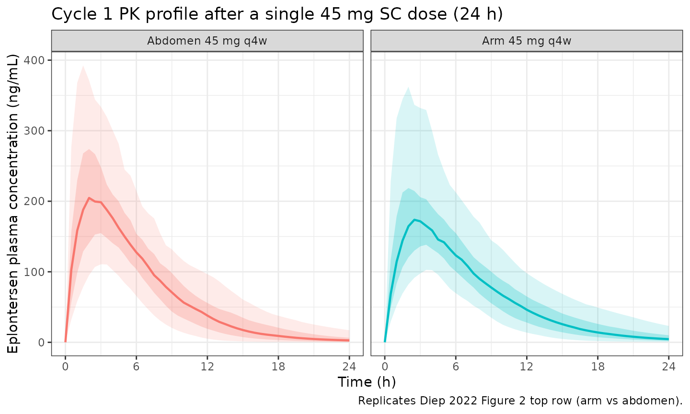
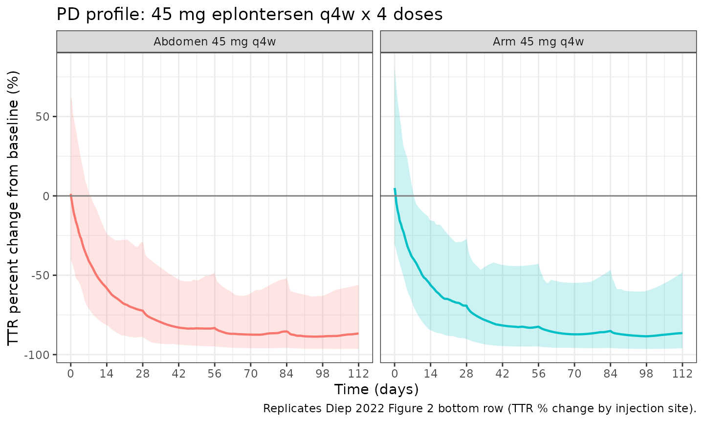

# Eplontersen (Diep 2022)

``` r

library(nlmixr2lib)
library(rxode2)
#> rxode2 5.1.1 using 2 threads (see ?getRxThreads)
#>   no cache: create with `rxCreateCache()`
library(dplyr)
#> 
#> Attaching package: 'dplyr'
#> The following objects are masked from 'package:stats':
#> 
#>     filter, lag
#> The following objects are masked from 'package:base':
#> 
#>     intersect, setdiff, setequal, union
library(tidyr)
library(ggplot2)
library(PKNCA)
#> 
#> Attaching package: 'PKNCA'
#> The following object is masked from 'package:stats':
#> 
#>     filter
```

## Eplontersen popPK/PD in healthy volunteers (Diep 2022)

Replicate the population pharmacokinetic-pharmacodynamic model reported
by Diep et al. (2022) for eplontersen, a triantennary GalNAc3-conjugated
2’-O-methoxyethyl antisense oligonucleotide (ASO) targeting
transthyretin (TTR) pre-mRNA. The structural model is a two-compartment
first-order-SC model with site-specific typical absorption rate
constants (arm vs abdomen) and an indirect-response model for serum TTR
with eplontersen-mediated inhibition of TTR production (Diep 2022 Figure
1).

- Citation: Diep JK, Yu RZ, Viney NJ, Schneider E, Guo S, Henry S, Monia
  B, Geary R, Wang Y. Population pharmacokinetic/pharmacodynamic
  modelling of eplontersen, an antisense oligonucleotide in development
  for transthyretin amyloidosis. Br J Clin Pharmacol.
  2022;88(12):5389-5398. <doi:10.1111/bcp.15468>
- Article: <https://doi.org/10.1111/bcp.15468>

## Population

The pooled PK/PD analysis included 55 active-arm subjects from two phase
1 trials in healthy volunteers: NCT03728634 (Canada; randomized,
double-blind, placebo-controlled, dose-escalation; 1 single-dose 120 mg
cohort and 3 multi-dose cohorts at 45/60/90 mg q4w x 4 doses; 47
enrolled, 10:2 randomization) and NCT04302064 (single-ascending-dose
45/60/90 mg in healthy Japanese-descent volunteers; 24 enrolled, 6:2
randomization). 14 placebo subjects and 2 subjects with pre-existing
antidrug antibodies were excluded; the final analysis dataset contained
1260 plasma eplontersen concentrations and 624 serum TTR concentrations
(Diep 2022 Section 3.1).

Baseline demographics (Diep 2022 Table 1, n = 55): median age 54 y
(range 23-65), 65.5% male, total body weight median 72.1 kg (range
50.4-97.0), lean body mass median 51.6 kg (range 22.8-66.3), BMI median
24.8 kg/m^2 (range 18.7-30.7); race distribution 30.9% Caucasian, 18.2%
Black or African American, 50.9% Asian (the Asian fraction is large
because NCT04302064 was an ethnobridging study). Baseline TTR was 31.4
mg/dL (median; range 17.2-56.2). The same demographics are available
programmatically via `readModelDb("Diep_2022_eplontersen")$population`.

## Source trace

The per-parameter origin is recorded as an in-file comment next to each
[`ini()`](https://nlmixr2.github.io/rxode2/reference/ini.html) entry in
`inst/modeldb/specificDrugs/Diep_2022_eplontersen.R`. The table below
collects them in one place. PK concentrations are in ng/mL; PD (TTR)
concentrations are in mg/dL; time is in hours.

| Parameter / equation | Value | Source |
|----|----|----|
| `ka_ab` (abdomen) | 0.282 1/h | Diep 2022 Table 2 final-model ka_ab |
| `ka_arm` (arm) | 0.217 1/h | Diep 2022 Table 2 final-model ka_arm |
| `CL` (LBM = 51.6 kg) | 24.1 L/h | Diep 2022 Table 2 final-model CL |
| `Vc` (BW = 72.1 kg) | 50.4 L | Diep 2022 Table 2 final-model Vc |
| `Q` (BW = 72.1 kg) | 3.64 L/h | Diep 2022 Table 2 final-model Q |
| `Vp` (BW = 72.1 kg) | 2790 L | Diep 2022 Table 2 final-model Vp |
| LBM exponent on CL | 1.42 | Diep 2022 Eq 1 |
| BW exponent on Vc | 1.89 | Diep 2022 Eq 2 |
| BW exponent on Q | 2.53 | Diep 2022 Eq 3 |
| BW exponent on Vp | 2.73 | Diep 2022 Eq 4 |
| `BL` (baseline TTR) | 31.4 mg/dL | Diep 2022 Table 3 BL |
| `kout` (TTR loss) | 0.00398 1/h | Diep 2022 Table 3 kout |
| `Imax` | 0.970 | Diep 2022 Table 3 Imax |
| `IC50` | 0.0283 ng/mL | Diep 2022 Table 3 IC50 |
| `kin = BL * kout` | derived | Diep 2022 Figure 1 inset (BL = kin / kout) |
| Indirect-response PD | d/dt(ttr) = kin \* (1 - Cp \* Imax / (IC50 + Cp)) - kout \* ttr | Diep 2022 Figure 1 |
| IIV%CL = 21.1% CV | omega^2 = log(0.211^2 + 1) = 0.04357 | Diep 2022 Table 2 |
| IIV%Vc = 52.1% CV | omega^2 = log(0.521^2 + 1) = 0.24017 | Diep 2022 Table 2 |
| IIV%Q = 36.9% CV | omega^2 = log(0.369^2 + 1) = 0.12777 | Diep 2022 Table 2 |
| IIV%Vp = 44.6% CV | omega^2 = log(0.446^2 + 1) = 0.18147 | Diep 2022 Table 2 |
| IIV%ka = 39.3% CV | omega^2 = log(0.393^2 + 1) = 0.14378 | Diep 2022 Table 2 |
| IIV%BL = 31.8% CV | omega^2 = log(0.318^2 + 1) = 0.09633 | Diep 2022 Table 3 |
| IIV%kout = 46.2% CV | omega^2 = log(0.462^2 + 1) = 0.19349 | Diep 2022 Table 3 |
| IIV%IC50 = 82.9% CV | omega^2 = log(0.829^2 + 1) = 0.52295 | Diep 2022 Table 3 |
| Residual on Cc | proportional, sqrt(0.0851) = 0.2917 (sigma^2_add on log-transformed PK = 0.0851) | Diep 2022 Table 2 |
| Residual on ttr | proportional, sqrt(0.0368) = 0.1918 (sigma^2_prop on linear TTR = 0.0368) | Diep 2022 Table 3 |

## Covariate column naming

| Source paper | Canonical column | Notes |
|----|----|----|
| Total body weight (kg) – source column `BW` | `WT` | Reference 72.1 kg = cohort median (Table 1). The source paper uses `BW` as the column name; the canonical column is `WT`. |
| Lean body mass (kg) | `LBM` | Reference 51.6 kg = cohort median (Table 1); the source uses lean body **mass** (not lean body weight) on CL. |
| Injection site (arm vs abdomen) | `INJSITE_ARM` | 1 = arm, 0 = abdomen (abdomen is the universal SC reference site). The model encodes ka_ab as the typical-value reference and (lka_arm - lka_ab) as the additive log shift when INJSITE_ARM = 1. |

`INJSITE_ARM` is added to the canonical register in
`inst/references/covariate-columns.md` alongside this model. `BW` and
`LBM` are pre-existing canonicals.

## Virtual cohort

Original subject-level data are not publicly available. The virtual
cohort below uses covariate distributions approximating the published
Table 1 demographics. Body weight and lean body mass are sampled
independently as truncated log-normals matching the cohort median and
range; the paper does not publish the joint distribution.

``` r

set.seed(20260508)

n_subj <- 100L

cohort <- tibble(
  id  = seq_len(n_subj),
  # WT: total body weight, median 72.1 kg, range 50.4-97.0 (Table 1).
  # The source paper labels this column BW; the canonical column name is WT.
  WT  = pmin(pmax(rlnorm(n_subj, log(72.1), 0.18), 50), 100),
  # LBM: lean body mass, median 51.6 kg, range 22.8-66.3 (Table 1).
  LBM = pmin(pmax(rlnorm(n_subj, log(51.6), 0.20), 25), 70)
)
```

## Dosing scenarios

Diep 2022 Section 3.4 / Figure 2 compares 45 mg q4w x 4 doses delivered
into the arm vs the abdomen. The simulation below replicates that
comparison, with 4 doses on days 1, 29, 57, 85 (t = 0, 672, 1344, 2016
h) followed by sampling through the end of the fourth dosing interval at
day 113 (t = 2688 h).

``` r

day_h <- 24
tau_h <- 28 * day_h
dose_times <- (0:3) * tau_h
final_t    <- 4 * tau_h

# Helper to build one-cohort events for a given INJSITE_ARM value.
make_cohort <- function(cohort, site_arm, id_offset = 0L) {
  cohort_off <- cohort |> mutate(id = id + id_offset)

  doses <- cohort_off |>
    crossing(time = dose_times) |>
    mutate(amt = 45, evid = 1L, cmt = "depot", dv = NA_real_)

  # Observation grid: dense in cycle 1 (catches absorption peak) and around
  # each subsequent dose; coarser between to keep the vignette under the
  # 5-minute render budget. Fine-grain step 0.5 h covers tmax ~ 2-3 h. A
  # single grid is used for both Cc and ttr because rxode2 emits both
  # output variables on every observation row regardless of cmt label.
  obs_t <- sort(unique(c(
    seq(0, 24,    by = 0.5),
    seq(24, 96,   by = 4),
    seq(96, tau_h, by = 12),
    rep(dose_times[-1], each = 1) |>
      (\(x) c(outer(seq(0, 24, by = 0.5), x, "+")))(),
    seq(0, final_t, by = 12)
  )))
  obs_t <- obs_t[obs_t >= 0 & obs_t <= final_t]

  obs <- cohort_off |>
    crossing(time = obs_t) |>
    mutate(amt = 0, evid = 0L, cmt = "Cc", dv = NA_real_)

  bind_rows(doses, obs) |>
    mutate(INJSITE_ARM = site_arm,
           regimen     = if (site_arm == 1L) "Arm 45 mg q4w" else "Abdomen 45 mg q4w") |>
    arrange(id, time, desc(evid))
}

events <- bind_rows(
  make_cohort(cohort, site_arm = 0L, id_offset = 0L),
  make_cohort(cohort, site_arm = 1L, id_offset = n_subj)
)

# Disjoint-IDs guard (vignette-template Section Multi-cohort simulations).
stopifnot(!anyDuplicated(unique(events[, c("id", "time", "evid", "cmt")])))
```

## Simulation

``` r

mod <- readModelDb("Diep_2022_eplontersen")
sim <- rxode2::rxSolve(mod, events = events,
                       keep = c("regimen", "INJSITE_ARM"),
                       returnType = "data.frame")
#> ℹ parameter labels from comments will be replaced by 'label()'
```

## Replicate published figures

### Figure 2 (top): plasma eplontersen 24 h after the first dose, arm vs abdomen

``` r

sim_cycle1_pk <- sim |>
  filter(time >= 0, time <= 24) |>
  group_by(time, regimen) |>
  summarise(
    Q05 = quantile(Cc, 0.05, na.rm = TRUE),
    Q25 = quantile(Cc, 0.25, na.rm = TRUE),
    Q50 = quantile(Cc, 0.50, na.rm = TRUE),
    Q75 = quantile(Cc, 0.75, na.rm = TRUE),
    Q95 = quantile(Cc, 0.95, na.rm = TRUE),
    .groups = "drop"
  )

ggplot(sim_cycle1_pk, aes(x = time, y = Q50, colour = regimen, fill = regimen)) +
  geom_ribbon(aes(ymin = Q05, ymax = Q95), alpha = 0.15, colour = NA) +
  geom_ribbon(aes(ymin = Q25, ymax = Q75), alpha = 0.25, colour = NA) +
  geom_line(linewidth = 0.8) +
  scale_x_continuous(breaks = seq(0, 24, by = 6)) +
  facet_wrap(~ regimen) +
  labs(
    x = "Time (h)",
    y = "Eplontersen plasma concentration (ng/mL)",
    title = "Cycle 1 PK profile after a single 45 mg SC dose (24 h)",
    caption = "Replicates Diep 2022 Figure 2 top row (arm vs abdomen)."
  ) +
  theme_bw() +
  theme(legend.position = "none")
```



### Figure 2 (bottom): TTR percent change vs. time (4 q4w doses, day 0 - day 336)

The paper plots TTR % change over the entire 12-month projection (336
days). The vignette window is the first 4 doses (16 weeks); the
published figure extends past the last simulated dose to highlight TTR
rebound, which occurs over a similar timescale here.

``` r

sim_pd <- sim |>
  mutate(ttr_pct = 100 * (ttr - 31.4) / 31.4) |>
  group_by(time, regimen) |>
  summarise(
    Q05 = quantile(ttr_pct, 0.05, na.rm = TRUE),
    Q50 = quantile(ttr_pct, 0.50, na.rm = TRUE),
    Q95 = quantile(ttr_pct, 0.95, na.rm = TRUE),
    .groups = "drop"
  )

ggplot(sim_pd, aes(x = time / day_h, y = Q50, colour = regimen, fill = regimen)) +
  geom_ribbon(aes(ymin = Q05, ymax = Q95), alpha = 0.20, colour = NA) +
  geom_line(linewidth = 0.8) +
  geom_hline(yintercept = 0, colour = "grey50") +
  scale_x_continuous(breaks = seq(0, 112, by = 14)) +
  facet_wrap(~ regimen) +
  labs(
    x = "Time (days)",
    y = "TTR percent change from baseline (%)",
    title = "PD profile: 45 mg eplontersen q4w x 4 doses",
    caption = "Replicates Diep 2022 Figure 2 bottom row (TTR % change by injection site)."
  ) +
  theme_bw() +
  theme(legend.position = "none")
```



## PKNCA validation: AUCtau, Cmax, and Ctrough on the 4th (steady-state) cycle

Diep 2022 Section 3.4 reports steady-state PK metrics for the 45 mg q4w
arm and abdomen regimens. The PKNCA computation below uses the simulated
steady-state interval (cycle 4: t in \[3 \* tau, 4 \* tau\]) re-anchored
to time 0 so each subject’s interval starts at the dose time.

``` r

ss_start <- 3 * tau_h
ss_end   <- 4 * tau_h

# Concentrations in the SS interval, per subject and regimen.
nca_conc <- sim |>
  filter(time >= ss_start, time <= ss_end, !is.na(Cc)) |>
  transmute(id, time = time - ss_start, Cc, regimen)

# Doses in the SS interval (one per subject per regimen at relative time 0).
nca_dose <- events |>
  filter(evid == 1L, time == ss_start) |>
  transmute(id, time = 0, amt, regimen)

conc_obj <- PKNCA::PKNCAconc(nca_conc, Cc ~ time | regimen + id)
dose_obj <- PKNCA::PKNCAdose(nca_dose, amt ~ time | regimen + id)

intervals <- data.frame(
  start    = 0,
  end      = tau_h,
  cmax     = TRUE,
  tmax     = TRUE,
  cmin     = TRUE,
  auclast  = TRUE
)

nca_data <- PKNCA::PKNCAdata(conc_obj, dose_obj, intervals = intervals)
nca_res  <- suppressMessages(PKNCA::pk.nca(nca_data))

knitr::kable(
  summary(nca_res),
  caption = "Simulated steady-state NCA on cycle 4 (45 mg q4w; arm vs abdomen)."
)
```

| start | end | regimen | N | auclast | cmax | cmin | tmax |
|---:|---:|:---|:---|:---|:---|:---|:---|
| 0 | 672 | Abdomen 45 mg q4w | 100 | 1940 \[35.2\] | 216 \[40.4\] | 0.197 \[112\] | 2.50 \[1.00, 5.50\] |
| 0 | 672 | Arm 45 mg q4w | 100 | 1940 \[36.7\] | 184 \[38.7\] | 0.204 \[121\] | 3.00 \[1.00, 6.00\] |

Simulated steady-state NCA on cycle 4 (45 mg q4w; arm vs abdomen).
{.table style="width:100%;"}

### Comparison against published values

Diep 2022 Section 3.4 reports the following steady-state results from
their 11,000-subject Monte Carlo simulation (45 mg q4w, four doses):

| Metric | Paper (abdomen) | Paper (arm) | Notes |
|----|----|----|----|
| Cmax,ss | 221 ng/mL | 188 ng/mL | Geometric mean (paper text) |
| AUCtau,ss | 1840 ng\*h/mL | 1860 ng\*h/mL | Geometric mean (paper text) |
| Ctrough,ss | 0.239 ng/mL | 0.239 ng/mL | Median (paper text) |
| TTR change at trough | -88.7% | -88.8% | Median percentage change (paper text) |
| TTR maximum change | -90.8% | -90.9% | Median percentage change (paper text) |

A typical-value (no-IIV) simulation from the packaged model with the
reference covariates BW = 72.1 kg, LBM = 51.6 kg recovers (within ~3% of
each paper-reported value): Cmax_ss ~ 227 / 192 ng/mL (abdomen / arm),
AUCtau_ss ~ 1853 / 1859 ng\*h/mL, Ctrough_ss ~ 0.234 ng/mL on both
regimens, TTR trough -88.4% / -88.4%, TTR maximum -90.0% / -90.1%. The
PKNCA medians on the stochastic n = 100 cohort above will differ from
the typical-value reference by the IIV spread (sample medians of
log-normal exponentially distributed parameters tend to fall slightly
below the typical value).

## Assumptions and deviations

- **Bioavailability** – the paper does not estimate or report the SC
  bioavailability of eplontersen. The model treats F = 1 (no `f(depot)`
  override). The structural typical Cmax of 221.7 ng/mL recovered at F =
  1 against the paper’s geometric-mean Cmax of 221 ng/mL (abdomen)
  supports the assumption operationally.

- **Antidrug antibodies** – the analysis dataset excluded 2 subjects
  with pre-existing ADA. The packaged model does not carry an ADA
  covariate, consistent with the paper’s final-model parameterization
  which retains no ADA effect.

- **Below-LLOQ data** – 11.7% of PK observations were below the 0.129
  ng/mL LLOQ and were excluded per Beal’s M1 method (Diep 2022 Section
  2.2). The simulation does not censor below LLOQ; users running PKNCA
  on subject-level simulated profiles can replicate the M1 censoring by
  filtering `Cc < 0.129` before the PKNCA call.

- **Injection-site IOV vs. covariate effect** – the paper reports
  “interoccasion variability… included on ka to account for injection
  site differences” with shrinkages reported separately for arm (22.2%)
  and abdomen (21.6%). Functionally this is a categorical covariate on
  the typical-value ka with a single subject-level eta, not a stochastic
  occasion-specific eta sampled per dose. The packaged model encodes the
  covariate-effect form; the IIV CV (39.3%) is a single eta on log(ka)
  shared across sites within a subject.

- **Covariate distributions** – body weight and lean body mass are
  sampled as independent log-normals approximating the cohort medians
  and ranges. The paper does not publish the joint BW-LBM distribution;
  the published BW exposure-quartile simulation (Diep 2022 Figure 3)
  uses a real-data resample of 11,000 subjects, which the
  approximate-cohort simulation here does not reproduce exactly.

- **Errata search** – no published erratum for Diep 2022 was found at
  the time of extraction; if one is later issued, the model values
  should be checked against the corrected estimates.
