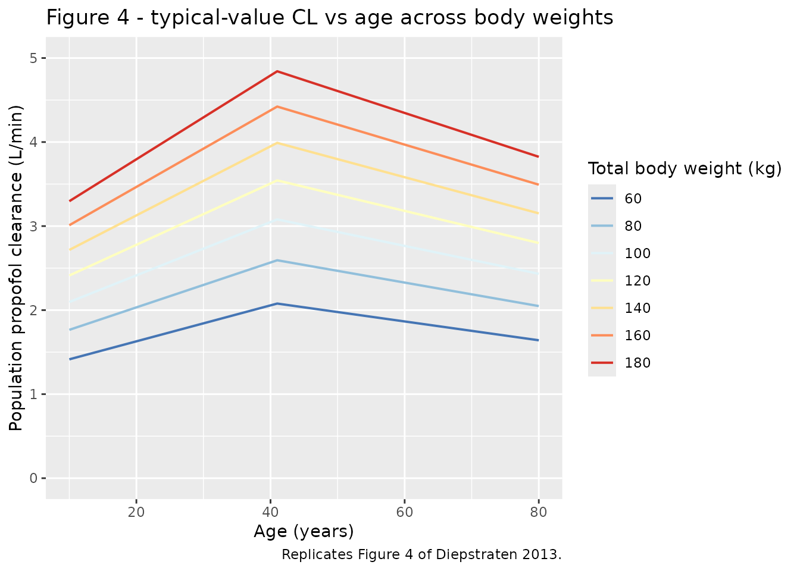
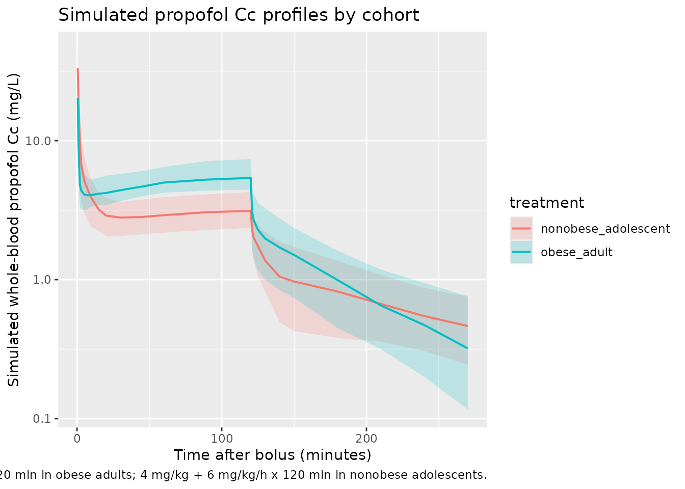
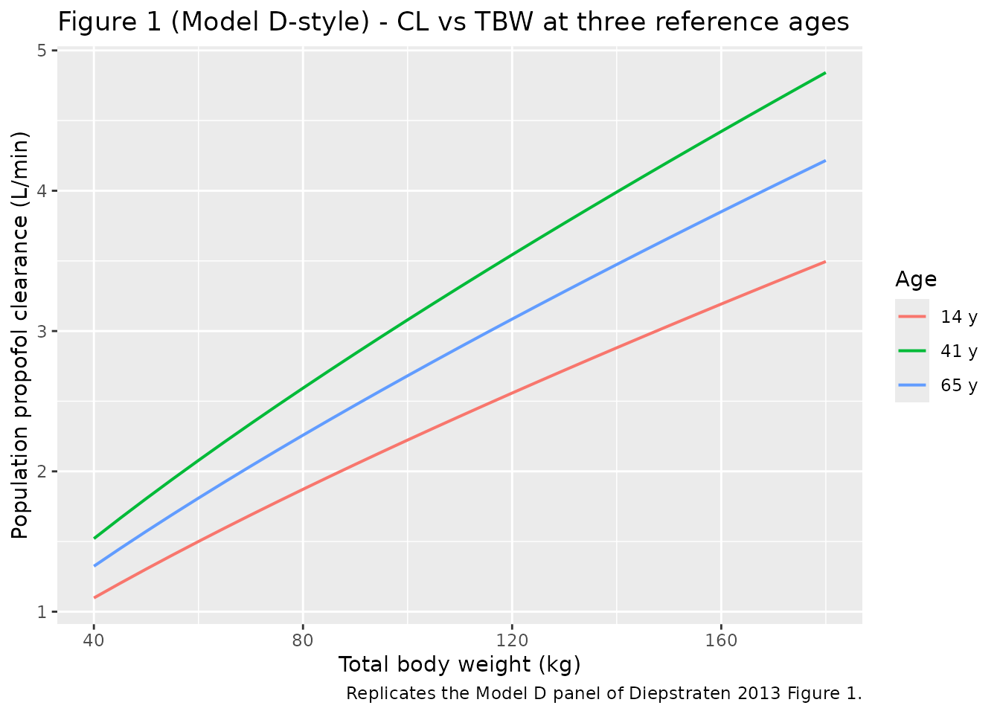

# Propofol (Diepstraten 2013)

## Model and source

- Citation: Diepstraten J, Chidambaran V, Sadhasivam S, Blusse van
  Oud-Alblas HJ, Inge T, van Ramshorst B, van Dongen EPA, Vinks AA,
  Knibbe CAJ. (2013). An integrated population pharmacokinetic
  meta-analysis of propofol in morbidly obese and nonobese adults,
  adolescents, and children. CPT: Pharmacometrics & Systems Pharmacology
  2:e73. <doi:10.1038/psp.2013.47>.
- Description: Three-compartment intravenous population PK model for
  propofol in morbidly obese and nonobese adults, adolescents, and
  children (Diepstraten 2013 meta-analysis of five previously published
  studies; N = 94 patients, TBW 37-184 kg, age 9-79 years). Final model
  E in Table 3: total body weight scales clearance allometrically with
  an estimated exponent and scales the slow inter-compartmental
  clearance Q3 linearly; age modifies clearance via a bilinear function
  centered at 41 years with separate slopes below and above the
  breakpoint. Inter-individual variability on CL, V1, V3, and Q3
  (log-normal) and proportional intra-individual error on
  log-transformed concentrations.
- Article: [CPT: Pharmacometrics & Systems Pharmacology
  2013;2:e73](https://doi.org/10.1038/psp.2013.47)

Diepstraten et al. (2013) pooled five previously published propofol
pharmacokinetic studies in morbidly obese and nonobese adults,
adolescents, and children, and fit a three-compartment intravenous PK
model in NONMEM VI (ADVAN11 / TRANS4) on log-transformed whole-blood
propofol concentrations. The published “Final model E” (Table 3) is the
structural model packaged here.

## Population

The pooled cohort comprised 94 patients contributing 1,652 whole-blood
propofol concentration measurements. Cohorts (Diepstraten 2013 Table 1):

- 20 morbidly obese adults scheduled for bariatric surgery (mean TBW 124
  kg, range 98-167 kg; mean age 45 years).
- 40 nonobese adults (mean TBW 74 kg, range 55-98 kg; mean age 55
  years): 24 elective general-surgery patients receiving a bolus
  induction dose plus isoflurane maintenance, and 20 ICU patients
  receiving 2-5 days of continuous propofol sedation.
- 20 morbidly obese adolescents and children scheduled for bariatric
  surgery (mean TBW 125 kg, range 70-184 kg; mean age 16 years).
- 14 nonobese adolescents undergoing scoliosis surgery (mean TBW 54 kg,
  range 37-82 kg; mean age 14 years).

Overall total body weight ranged 37-184 kg and age 9-79 years (sex split
30 M / 64 F = 32% / 68% female). The same demographic block is available
programmatically via
`readModelDb("Diepstraten_2013_propofol")$population`.

## Source trace

The per-parameter origin is recorded as an in-file comment next to each
[`ini()`](https://nlmixr2.github.io/rxode2/reference/ini.html) entry in
`inst/modeldb/specificDrugs/Diepstraten_2013_propofol.R`. This table
collects them in one place.

| Equation / parameter | Value | Source location |
|----|----|----|
| `lcl` = log(2.34) | CL,70 kg,41 y = 2.34 L/min | Diepstraten 2013 Table 3 final model |
| `lvc` = log(3.17) | V1 = 3.17 L | Diepstraten 2013 Table 3 final model |
| `lq` = log(1.60) | Q2 = 1.60 L/min | Diepstraten 2013 Table 3 final model |
| `lvp` = log(5.89) | V2 = 5.89 L | Diepstraten 2013 Table 3 final model |
| `lq2` = log(1.50) | Q3,70 kg = 1.50 L/min | Diepstraten 2013 Table 3 final model |
| `lvp2` = log(116) | V3 = 116 L | Diepstraten 2013 Table 3 final model |
| `e_wt_cl` = 0.77 | TBW allometric exponent on CL (estimated, not fixed) | Diepstraten 2013 Table 3 final model |
| `e_age_le41` = 0.0103 | Bilinear age slope on CL for AGE \<= 41 y | Diepstraten 2013 Table 3 final model |
| `e_age_gt41` = -0.00539 | Bilinear age slope on CL for AGE \> 41 y | Diepstraten 2013 Table 3 final model |
| `etalcl` = 0.030171 | IIV CL = 17.5 % CV (log-normal variance) | Diepstraten 2013 Table 3 final model |
| `etalvc` = 0.228065 | IIV V1 = 50.6 % CV | Diepstraten 2013 Table 3 final model |
| `etalvp2` = 0.123131 | IIV V3 = 36.2 % CV | Diepstraten 2013 Table 3 final model |
| `etalq2` = 0.151250 | IIV Q3 = 40.4 % CV | Diepstraten 2013 Table 3 final model |
| `propSd` = 0.243 | Proportional intra-individual error 24.3 % | Diepstraten 2013 Table 3 final model |
| CL covariate equation | `CL_i = CL_70,41 * (TBW/70)^0.77 * Fage` | Diepstraten 2013 Eq. 1 |
| Q3 covariate equation | `Q3_i = Q3_70 * (TBW/70)` | Diepstraten 2013 Table 2 footnote c |
| Bilinear age factor | `Fage = 1 + b*(AGE-41)` for AGE \<= 41; `1 + c*(AGE-41)` for AGE \> 41 | Diepstraten 2013 Eq. 1 / Methods Eq. 5 |
| Three-compartment ODE | NONMEM ADVAN11 / TRANS4 mass-balance | Diepstraten 2013 Methods, “Pharmacokinetic model” |

## Virtual cohort

The original observed data are not publicly available. Two virtual
cohorts are constructed below to exercise the model across the published
TBW / age ranges: a “morbidly obese adult” cohort dosed with a 200 mg
bolus followed by a 10 mg/kg/h maintenance infusion (Diepstraten 2013
Methods, “Morbidly obese adults”), and a “nonobese adolescent” cohort
dosed with a 4 mg/kg bolus followed by a 6 mg/kg/h maintenance infusion
(Diepstraten 2013 Methods, “Nonobese children and adolescents”). All
times are in minutes.

``` r

set.seed(20260511)

make_cohort <- function(n, wt_mean, wt_sd, age_mean, age_sd,
                        bolus_mg_per_kg, bolus_mg_fixed = NA_real_,
                        infusion_mg_per_kg_per_h,
                        infusion_duration_min,
                        obs_end_min = 360,
                        treatment_label,
                        id_offset = 0L) {
  per_subject <- tibble::tibble(
    id        = id_offset + seq_len(n),
    WT        = pmax(20, rnorm(n, wt_mean, wt_sd)),
    AGE       = pmax(9,  rnorm(n, age_mean, age_sd)),
    treatment = treatment_label
  ) |>
    dplyr::mutate(
      bolus_amt    = ifelse(is.na(bolus_mg_fixed),
                            bolus_mg_per_kg * WT,
                            bolus_mg_fixed),
      infusion_rate_mg_per_min = infusion_mg_per_kg_per_h * WT / 60
    )

  # Three rows per subject:
  #   evid 1 amt = bolus_amt  at time 0   (instantaneous bolus into central)
  #   evid 1 amt = infusion_amt rate = infusion_rate at time 0 (continuous infusion)
  #   evid 0 sampling grid
  bolus_rows <- per_subject |>
    dplyr::transmute(id, time = 0, evid = 1L, cmt = "central",
                     amt = bolus_amt, rate = 0, WT, AGE, treatment)

  infusion_rows <- per_subject |>
    dplyr::transmute(
      id, time = 0, evid = 1L, cmt = "central",
      amt  = infusion_rate_mg_per_min * infusion_duration_min,
      rate = infusion_rate_mg_per_min,
      WT, AGE, treatment
    )

  obs_grid <- c(0.5, 1, 2, 3, 5, 7.5, 10, 15, 20, 30, 45, 60, 90, 120,
                infusion_duration_min,
                infusion_duration_min + c(1, 2, 5, 10, 20, 30, 60, 90, 120, 150))
  obs_grid <- sort(unique(obs_grid[obs_grid <= obs_end_min]))

  obs_rows <- per_subject |>
    tidyr::expand_grid(time = obs_grid) |>
    dplyr::transmute(id, time, evid = 0L, cmt = "central",
                     amt = 0, rate = 0, WT, AGE, treatment)

  dplyr::bind_rows(bolus_rows, infusion_rows, obs_rows) |>
    dplyr::arrange(id, time, dplyr::desc(evid))
}

events <- dplyr::bind_rows(
  make_cohort(
    n = 40,
    wt_mean = 124, wt_sd = 20,
    age_mean = 45, age_sd = 12,
    bolus_mg_fixed = 200,
    bolus_mg_per_kg = NA_real_,
    infusion_mg_per_kg_per_h = 10,
    infusion_duration_min = 120,
    obs_end_min = 360,
    treatment_label = "obese_adult",
    id_offset = 0L
  ),
  make_cohort(
    n = 40,
    wt_mean = 54, wt_sd = 13,
    age_mean = 14, age_sd = 3,
    bolus_mg_per_kg = 4,
    infusion_mg_per_kg_per_h = 6,
    infusion_duration_min = 120,
    obs_end_min = 360,
    treatment_label = "nonobese_adolescent",
    id_offset = 1000L
  )
)

stopifnot(!anyDuplicated(unique(events[, c("id", "time", "evid")])))
```

## Simulation

``` r

mod <- readModelDb("Diepstraten_2013_propofol")
sim <- rxode2::rxSolve(
  mod,
  events = events,
  keep   = c("treatment", "WT", "AGE")
) |>
  as.data.frame() |>
  tibble::as_tibble()
#> ℹ parameter labels from comments will be replaced by 'label()'
```

## Replicate published figures

### Figure 4 - typical-value propofol clearance vs age across body weights

Diepstraten 2013 Figure 4 plots population (typical-value) propofol
clearance versus age for several total body weights using the final
model. Because Figure 4 is a deterministic prediction from the
structural model with no inter-individual variability, it is recovered
exactly by evaluating Equation 1 of the paper at the relevant
`(WT, AGE)` grid. The model file’s parameter values reproduce that
prediction.

``` r

cl_pop  <- 2.34   # L/min; Diepstraten 2013 Table 3
z_pop   <- 0.77   # Table 3
b_pop   <-  0.0103
c_pop   <- -0.00539

wt_grid  <- c(60, 80, 100, 120, 140, 160, 180)
age_grid <- seq(10, 80, by = 1)

fig4_df <- tidyr::expand_grid(WT = wt_grid, AGE = age_grid) |>
  dplyr::mutate(
    fage = ifelse(AGE <= 41,
                  1 + b_pop * (AGE - 41),
                  1 + c_pop * (AGE - 41)),
    CL_pop_Lmin = cl_pop * (WT / 70)^z_pop * fage
  )

ggplot(fig4_df, aes(AGE, CL_pop_Lmin, colour = factor(WT))) +
  geom_line(linewidth = 0.7) +
  scale_colour_brewer(palette = "RdYlBu", direction = -1,
                      name = "Total body weight (kg)") +
  labs(x = "Age (years)",
       y = "Population propofol clearance (L/min)",
       title = "Figure 4 - typical-value CL vs age across body weights",
       caption = "Replicates Figure 4 of Diepstraten 2013.") +
  coord_cartesian(ylim = c(0, 5))
```



### Whole-blood concentration-time profiles by cohort

``` r

sim |>
  dplyr::filter(time > 0) |>
  dplyr::group_by(time, treatment) |>
  dplyr::summarise(
    Q05 = quantile(Cc, 0.05, na.rm = TRUE),
    Q50 = quantile(Cc, 0.50, na.rm = TRUE),
    Q95 = quantile(Cc, 0.95, na.rm = TRUE),
    .groups = "drop"
  ) |>
  ggplot(aes(time, Q50, colour = treatment, fill = treatment)) +
  geom_ribbon(aes(ymin = Q05, ymax = Q95), alpha = 0.20, colour = NA) +
  geom_line(linewidth = 0.7) +
  scale_y_log10() +
  labs(x = "Time after bolus (minutes)",
       y = "Simulated whole-blood propofol Cc (mg/L)",
       title = "Simulated propofol Cc profiles by cohort",
       caption = "200 mg bolus + 10 mg/kg/h x 120 min in obese adults; 4 mg/kg + 6 mg/kg/h x 120 min in nonobese adolescents.")
```



### Typical-value clearance comparison: obese adults vs nonobese adolescents at the same TBW

Diepstraten 2013 Figure 1 (Model C panel) highlights that morbidly obese
adolescents at the same TBW have lower typical clearance than morbidly
obese adults. The model reproduces this difference through the bilinear
age factor.

``` r

fig1_df <- tidyr::expand_grid(
  WT  = seq(40, 180, by = 5),
  AGE = c(14, 41, 65)
) |>
  dplyr::mutate(
    fage = ifelse(AGE <= 41,
                  1 + b_pop * (AGE - 41),
                  1 + c_pop * (AGE - 41)),
    CL_pop_Lmin = cl_pop * (WT / 70)^z_pop * fage,
    Age_label   = factor(paste0(AGE, " y"), levels = paste0(c(14, 41, 65), " y"))
  )

ggplot(fig1_df, aes(WT, CL_pop_Lmin, colour = Age_label)) +
  geom_line(linewidth = 0.7) +
  labs(x = "Total body weight (kg)",
       y = "Population propofol clearance (L/min)",
       colour = "Age",
       title = "Figure 1 (Model D-style) - CL vs TBW at three reference ages",
       caption = "Replicates the Model D panel of Diepstraten 2013 Figure 1.")
```



## PKNCA validation

Diepstraten 2013 does not report NCA parameters (Cmax / AUC / half-life)
by study cohort, so this section only computes simulated NCA values per
cohort as a sanity check on the implementation. The values should fall
within the range expected for IV propofol whole-blood concentrations
(~1-10 mg/L during maintenance infusion; AUC scales with infusion
duration and dose).

``` r

sim_nca <- sim |>
  dplyr::filter(!is.na(Cc), time > 0) |>
  dplyr::select(id, time, Cc, treatment)

dose_df <- events |>
  dplyr::filter(evid == 1) |>
  dplyr::group_by(id, treatment) |>
  dplyr::summarise(time = min(time), amt = sum(amt), .groups = "drop")

conc_obj <- PKNCA::PKNCAconc(
  sim_nca,
  Cc ~ time | treatment + id,
  concu = "mg/L",
  timeu = "min"
)
dose_obj <- PKNCA::PKNCAdose(
  dose_df,
  amt ~ time | treatment + id,
  doseu = "mg"
)

intervals <- data.frame(
  start       = 0,
  end         = Inf,
  cmax        = TRUE,
  tmax        = TRUE,
  aucinf.obs  = TRUE,
  half.life   = TRUE
)

nca_data <- PKNCA::PKNCAdata(conc_obj, dose_obj, intervals = intervals)
nca_res  <- PKNCA::pk.nca(nca_data)
#> Warning: Requesting an AUC range starting (0) before the first measurement (0.5) is not allowed
#> Requesting an AUC range starting (0) before the first measurement (0.5) is not allowed
#> Requesting an AUC range starting (0) before the first measurement (0.5) is not allowed
#> Requesting an AUC range starting (0) before the first measurement (0.5) is not allowed
#> Requesting an AUC range starting (0) before the first measurement (0.5) is not allowed
#> Requesting an AUC range starting (0) before the first measurement (0.5) is not allowed
#> Requesting an AUC range starting (0) before the first measurement (0.5) is not allowed
#> Requesting an AUC range starting (0) before the first measurement (0.5) is not allowed
#> Requesting an AUC range starting (0) before the first measurement (0.5) is not allowed
#> Requesting an AUC range starting (0) before the first measurement (0.5) is not allowed
#> Requesting an AUC range starting (0) before the first measurement (0.5) is not allowed
#> Requesting an AUC range starting (0) before the first measurement (0.5) is not allowed
#> Requesting an AUC range starting (0) before the first measurement (0.5) is not allowed
#> Requesting an AUC range starting (0) before the first measurement (0.5) is not allowed
#> Requesting an AUC range starting (0) before the first measurement (0.5) is not allowed
#> Requesting an AUC range starting (0) before the first measurement (0.5) is not allowed
#> Requesting an AUC range starting (0) before the first measurement (0.5) is not allowed
#> Requesting an AUC range starting (0) before the first measurement (0.5) is not allowed
#> Requesting an AUC range starting (0) before the first measurement (0.5) is not allowed
#> Requesting an AUC range starting (0) before the first measurement (0.5) is not allowed
#> Requesting an AUC range starting (0) before the first measurement (0.5) is not allowed
#> Requesting an AUC range starting (0) before the first measurement (0.5) is not allowed
#> Requesting an AUC range starting (0) before the first measurement (0.5) is not allowed
#> Requesting an AUC range starting (0) before the first measurement (0.5) is not allowed
#> Requesting an AUC range starting (0) before the first measurement (0.5) is not allowed
#> Requesting an AUC range starting (0) before the first measurement (0.5) is not allowed
#> Requesting an AUC range starting (0) before the first measurement (0.5) is not allowed
#> Requesting an AUC range starting (0) before the first measurement (0.5) is not allowed
#> Requesting an AUC range starting (0) before the first measurement (0.5) is not allowed
#> Requesting an AUC range starting (0) before the first measurement (0.5) is not allowed
#> Requesting an AUC range starting (0) before the first measurement (0.5) is not allowed
#> Requesting an AUC range starting (0) before the first measurement (0.5) is not allowed
#> Requesting an AUC range starting (0) before the first measurement (0.5) is not allowed
#> Requesting an AUC range starting (0) before the first measurement (0.5) is not allowed
#> Requesting an AUC range starting (0) before the first measurement (0.5) is not allowed
#> Requesting an AUC range starting (0) before the first measurement (0.5) is not allowed
#> Requesting an AUC range starting (0) before the first measurement (0.5) is not allowed
#> Requesting an AUC range starting (0) before the first measurement (0.5) is not allowed
#> Requesting an AUC range starting (0) before the first measurement (0.5) is not allowed
#> Requesting an AUC range starting (0) before the first measurement (0.5) is not allowed
#> Requesting an AUC range starting (0) before the first measurement (0.5) is not allowed
#> Requesting an AUC range starting (0) before the first measurement (0.5) is not allowed
#> Requesting an AUC range starting (0) before the first measurement (0.5) is not allowed
#> Requesting an AUC range starting (0) before the first measurement (0.5) is not allowed
#> Requesting an AUC range starting (0) before the first measurement (0.5) is not allowed
#> Requesting an AUC range starting (0) before the first measurement (0.5) is not allowed
#> Requesting an AUC range starting (0) before the first measurement (0.5) is not allowed
#> Requesting an AUC range starting (0) before the first measurement (0.5) is not allowed
#> Requesting an AUC range starting (0) before the first measurement (0.5) is not allowed
#> Requesting an AUC range starting (0) before the first measurement (0.5) is not allowed
#> Requesting an AUC range starting (0) before the first measurement (0.5) is not allowed
#> Requesting an AUC range starting (0) before the first measurement (0.5) is not allowed
#> Requesting an AUC range starting (0) before the first measurement (0.5) is not allowed
#> Requesting an AUC range starting (0) before the first measurement (0.5) is not allowed
#> Requesting an AUC range starting (0) before the first measurement (0.5) is not allowed
#> Requesting an AUC range starting (0) before the first measurement (0.5) is not allowed
#> Requesting an AUC range starting (0) before the first measurement (0.5) is not allowed
#> Requesting an AUC range starting (0) before the first measurement (0.5) is not allowed
#> Requesting an AUC range starting (0) before the first measurement (0.5) is not allowed
#> Requesting an AUC range starting (0) before the first measurement (0.5) is not allowed
#> Requesting an AUC range starting (0) before the first measurement (0.5) is not allowed
#> Requesting an AUC range starting (0) before the first measurement (0.5) is not allowed
#> Requesting an AUC range starting (0) before the first measurement (0.5) is not allowed
#> Requesting an AUC range starting (0) before the first measurement (0.5) is not allowed
#> Requesting an AUC range starting (0) before the first measurement (0.5) is not allowed
#> Requesting an AUC range starting (0) before the first measurement (0.5) is not allowed
#> Requesting an AUC range starting (0) before the first measurement (0.5) is not allowed
#> Requesting an AUC range starting (0) before the first measurement (0.5) is not allowed
#> Requesting an AUC range starting (0) before the first measurement (0.5) is not allowed
#> Requesting an AUC range starting (0) before the first measurement (0.5) is not allowed
#> Requesting an AUC range starting (0) before the first measurement (0.5) is not allowed
#> Requesting an AUC range starting (0) before the first measurement (0.5) is not allowed
#> Requesting an AUC range starting (0) before the first measurement (0.5) is not allowed
#> Requesting an AUC range starting (0) before the first measurement (0.5) is not allowed
#> Requesting an AUC range starting (0) before the first measurement (0.5) is not allowed
#> Requesting an AUC range starting (0) before the first measurement (0.5) is not allowed
#> Requesting an AUC range starting (0) before the first measurement (0.5) is not allowed
#> Requesting an AUC range starting (0) before the first measurement (0.5) is not allowed
#> Requesting an AUC range starting (0) before the first measurement (0.5) is not allowed
#> Requesting an AUC range starting (0) before the first measurement (0.5) is not allowed
nca_summary <- summary(nca_res)
knitr::kable(
  nca_summary,
  caption = "Simulated propofol NCA parameters by cohort (no per-cohort published reference)."
)
```

| Interval Start | Interval End | treatment | N | Cmax (mg/L) | Tmax (min) | Half-life (min) | AUCinf,obs (min\*mg/L) |
|---:|---:|:---|:---|:---|:---|:---|:---|
| 0 | Inf | nonobese_adolescent | 40 | 33.2 \[25.5\] | 0.500 \[0.500, 0.500\] | 143 \[70.5\] | NC |
| 0 | Inf | obese_adult | 40 | 19.4 \[29.7\] | 0.500 \[0.500, 120\] | 61.6 \[23.0\] | NC |

Simulated propofol NCA parameters by cohort (no per-cohort published
reference). {.table}

## Assumptions and deviations

- IIV variances were back-calculated from the reported CV% via the exact
  log-normal mapping `omega^2 = log(CV^2 + 1)`. The paper does not state
  whether its IIV(%) entries are the `sqrt(omega^2) * 100` approximation
  or the exact log-normal CV; this assumption follows the convention
  used by sibling models in nlmixr2lib (e.g.,
  `Aregbe_2012_alvespimycin`, `Hennig_2013_tobra`).
- Diepstraten 2013 fits the residual error as additive on
  log-transformed concentrations: `Y = log(c_pred) + epsilon`,
  `epsilon ~ N(0, sigma^2)`, with sigma = 0.243. This is carried over
  here as a proportional residual error on the linear concentration
  scale (`propSd = 0.243`); the two parameterizations are equivalent for
  small errors and identical to first order in epsilon.
- Inter-individual variability was reported only on CL, V1, V3, and Q3
  (the four parameters whose `IIV (%)` rows are populated in Table 3);
  no IIV on V2 or Q2 is reported, so the corresponding etas are omitted
  from the model file.
- Race / ethnicity, sex, and other demographic descriptors were not
  retained as covariates in Diepstraten 2013 final model E (only TBW and
  age survived covariate selection). The virtual cohorts here therefore
  vary only TBW and AGE.
- The simulated regimens follow the source paper’s Methods narrative but
  are generic representatives chosen to exercise the published TBW / age
  ranges; the original individual-patient dosing records are not public.
- Whole-blood propofol concentrations were the response variable in
  Diepstraten 2013 (Methods, “Pharmacokinetic model”), so simulated `Cc`
  values are whole-blood concentrations, not plasma. The blood-to-plasma
  ratio of propofol is approximately 1 in adult human, so the
  distinction is small in practice but worth flagging when comparing
  against external plasma-PK studies.
