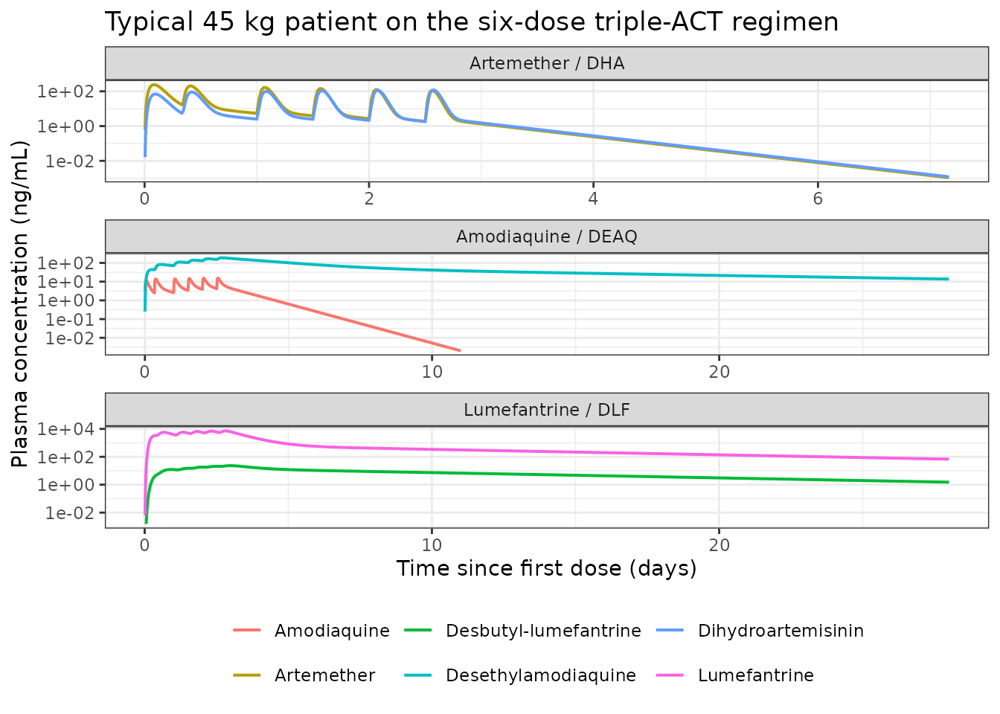

# Artemether-lumefantrine plus amodiaquine (Ding 2026)

## Model and source

- Citation: Ding J, Hoglund RM, van der Pluijm RW, Callery JJ, Peto TJ,
  Tripura R, Das S, Nguyen HC, Promnarate C, Mukaka M, Dysoley L,
  Fanello C, Onyamboko MA, Anvikar AR, Mayxay M, Smithuis F, von
  Seidlein L, Dhorda M, Amaratunga C, Faiz MA, Ho DTN, White NJ, Day
  NPJ, Dondorp AM, Tarning J (2026). Population pharmacokinetics of
  artemether-lumefantrine plus amodiaquine in patients with
  uncomplicated *Plasmodium falciparum* malaria. *British Journal of
  Clinical Pharmacology* 92(2):589-605. <doi:10.1002/bcp.70301>.
- Article: <https://doi.org/10.1002/bcp.70301>
- Europe PMC: PMC12850606 (open access, CC-BY).
- Trials: TRACII, ClinicalTrials.gov NCT02453308; TACT-CV, NCT03355664.

The paper develops **three independent joint parent-metabolite
population PK models**, one per drug of the triple artemisinin-based
combination therapy, so the package ships three model files and this one
vignette covering all three:

- `Ding_2026_artemether` – artemether and dihydroartemisinin (dense-PK
  cohorts only, n = 79).
- `Ding_2026_amodiaquine` – amodiaquine and desethylamodiaquine
  (triple-therapy arm, n = 302).
- `Ding_2026_lumefantrine` – lumefantrine and desbutyl-lumefantrine (all
  randomised patients, n = 885).

``` r

mod_arm_fn <- readModelDb("Ding_2026_artemether")
mod_aq_fn  <- readModelDb("Ding_2026_amodiaquine")
mod_lf_fn  <- readModelDb("Ding_2026_lumefantrine")
mod_arm <- rxode2::rxode2(mod_arm_fn())
#> Warning: some etas defaulted to non-mu referenced, possible parsing error: etaiov_mtt_1, etaiov_mtt_2, etaiov_mtt_3, etaiov_mtt_4, etaiov_mtt_5, etaiov_mtt_6, etaiov_fdepot_1, etaiov_fdepot_2, etaiov_fdepot_3, etaiov_fdepot_4, etaiov_fdepot_5, etaiov_fdepot_6
#> as a work-around try putting the mu-referenced expression on a simple line
mod_aq  <- rxode2::rxode2(mod_aq_fn())
#> Warning: some etas defaulted to non-mu referenced, possible parsing error: etaiov_ka_1, etaiov_ka_2, etaiov_ka_3, etaiov_ka_4, etaiov_ka_5, etaiov_ka_6, etaiov_fdepot_1, etaiov_fdepot_2, etaiov_fdepot_3, etaiov_fdepot_4, etaiov_fdepot_5, etaiov_fdepot_6
#> as a work-around try putting the mu-referenced expression on a simple line
mod_lf  <- rxode2::rxode2(mod_lf_fn())
```

Every model here carries a `cl` / `vc` pair alongside an explicit
`d/dt()` system, which is exactly the shape rxode2 will silently convert
to its analytic one-compartment solver, discarding the ODEs.
`useLinCmt = FALSE` is therefore passed on every `rxSolve()` call below,
and the three models are checked to have no `linCmt` entry in the
registry.

``` r

stopifnot(
  length(mod_arm$linCmt) == 0L,
  length(mod_aq$linCmt) == 0L,
  length(mod_lf$linCmt) == 0L
)
```

Both the main article and the supplementary information (Tables S1-S3
and Figures S1-S12) were on disk for this extraction. The three
parameter tables in the main article (Tables 2, 3 and 4) are complete;
the supplement contributed the two dosing schedules (Tables S1 and S2),
the dense-PK cohort demographics (Table S3) and the structural-model
diagrams (Figures S1, S5 and S8).

## Population

Both trials enrolled patients with acute uncomplicated *P. falciparum*
malaria. TRACII (NCT02453308) randomised 575 patients at seven sites in
Bangladesh, India, Myanmar, the Democratic Republic of Congo and Lao
PDR; TACT-CV (NCT03355664) randomised 310 patients at three sites in
western and eastern Cambodia and in Vietnam. Across both trials 443
patients received artemether-lumefantrine alone and 442 received
artemether-lumefantrine plus amodiaquine.

Dense PK sampling (1, 2, 4, 6, 8, 12, 24, 64 h and Days 4, 7, 14, 28
after the first dose, plus 52 h in TRACII) was operationally feasible at
only one site per trial – Bangladesh (n = 41) and Vietnam (n = 38) – and
children below 20 kg were excluded from it. Every other patient
contributed sparse samples at baseline, Day 7 and at any recurrent
infection during 42-day follow-up. Artemether and dihydroartemisinin
were not quantified from Day 4 onwards because of their short
half-lives, which is why the artemether model rests on the 79 dense-PK
patients alone.

Pooled baseline characteristics (Table 1), by trial:

|  | TRACII (n = 575) | TACT-CV (n = 310) |
|----|----|----|
| Age, years, median (range) | 17.0 (1.9-65.0) | 25.0 (4.0-58.4) |
| Bodyweight, kg, median (range) | 41.5 (9.0-101.0) | 52.2 (11.4-98.8) |
| Male, % | 69.2-69.9 | 84.6-92.2 |
| Asexual parasitaemia, /uL, median | 47,500-52,500 | 14,390-21,500 |
| Baseline temperature, degC, median (range) | 37.5-37.6 (35.0-40.5) | 37.6-37.7 (35.5-40.9) |
| Lumefantrine dose, mg/kg/day, median | 20.4-20.9 | 18.3-18.6 |
| Amodiaquine dose, mg/kg/day, median | 8.4 | 8.5 |

All patients except those at the Democratic Republic of Congo sites also
received a single 0.25 mg/kg gametocytocidal dose of primaquine 24 h
after the start of study treatment.

## Source trace

### Artemether and dihydroartemisinin (Ding 2026 Table 2)

| Model quantity | `ini()` name | Value | Source |
|----|----|----|----|
| Mean transit time | `lmtt` | 1.55 h | Table 2, row `Mean transit time (h)` |
| Number of transit compartments | (structural) | 2, fixed | Table 2, row `Number of transit compartments` |
| Relative bioavailability | `lfdepot` | 1, fixed | Table 2, row `F` |
| Artemether CL/F | `lcl` | 79.3 L/h | Table 2, row `CL/F ARM (L/h)` |
| Artemether Vc/F | `lvc` | 141 L | Table 2, row `VC/F ARM (L)` |
| Artemether Q/F | `lq` | 21.7 L/h | Table 2, row `Q/F ARM (L/h)` |
| Artemether Vp/F | `lvp` | 283 L | Table 2, row `Vp/F ARM (L)` |
| Time dependency on CL | `e_occ_cl` | 0.551 per occasion | Table 2, row `Time dependency on CL`; form in the Table 2 footnote |
| Dihydroartemisinin CL/F | `lcl_dihydroart` | 255 L/h | Table 2, row `CL/F DHA (L/h)` |
| Dihydroartemisinin Vc/F | `lvc_dihydroart` | 64.1 L | Table 2, row `Vc/F DHA (L)` |
| Allometric exponents | `e_wt_cl`, `e_wt_vc` | 0.75, 1.0, fixed | Methods, “Covariates model” |
| Reference weight | (structural) | 45 kg | Table 2 footnote |
| IOV on MTT | `etaiov_mtt_*` | 54.4% CV | Table 2, `CV for IIV/IOV` column |
| IOV on F | `etaiov_fdepot_*` | 31.6% CV | Table 2, `CV for IIV/IOV` column |
| IIV on artemether CL/F | `etalcl` | 21.1% CV | Table 2, `CV for IIV/IOV` column |
| IIV on dihydroartemisinin CL/F | `etalcl_dihydroart` | 41.7% CV | Table 2, `CV for IIV/IOV` column |
| Residual error | `propSd`, `propSd_dihydroart` | 0.229, 0.262 (variances) | Table 2, rows `RUV ARM` / `RUV DHA` |

### Amodiaquine and desethylamodiaquine (Ding 2026 Table 3)

| Model quantity | `ini()` name | Value | Source |
|----|----|----|----|
| Absorption rate constant | `lka` | 1.93 1/h | Table 3, row `Ka` |
| Relative bioavailability | `lfdepot` | 1, fixed | Table 3, row `F` |
| Amodiaquine CL/F | `lcl` | 2250 L/h | Table 3, row `CL/F AQ (L/h)` |
| Amodiaquine Vc/F | `lvc` | 12,900 L | Table 3, row `VC/F AQ (L)` |
| Amodiaquine Q/F | `lq` | 3020 L/h | Table 3, row `Q/F AQ (L/h)` |
| Amodiaquine Vp/F | `lvp` | 27,600 L | Table 3, row `Vp/F AQ (L)` |
| Desethylamodiaquine CL/F | `lcl_deaq` | 32.2 L/h | Table 3, row `CL/F DEAQ (L/h)` |
| Desethylamodiaquine Vc/F | `lvc_deaq` | 1260 L | Table 3, row `VC/F DEAQ (L)` |
| Desethylamodiaquine Q1/F, Vp1/F | `lq_deaq`, `lvp_deaq` | 117 L/h, 1640 L | Table 3, rows `Q1/F DEAQ` / `Vp1/F DEAQ` |
| Desethylamodiaquine Q2/F, Vp2/F | `lq2_deaq`, `lvp2_deaq` | 37.3 L/h, 6440 L | Table 3, rows `Q2/F DEAQ` / `Vp2/F DEAQ` |
| IOV on Ka | `etaiov_ka_*` | 254% CV | Table 3, `CV for IIV/IOV` column |
| IOV on F | `etaiov_fdepot_*` | 27.5% CV | Table 3, `CV for IIV/IOV` column |
| IIV on amodiaquine CL/F | `etalcl` | 11.6% CV | Table 3, `CV for IIV/IOV` column |
| IIV on desethylamodiaquine CL/F, Vc/F | `etalcl_deaq`, `etalvc_deaq` | 30.6%, 42.5% CV | Table 3, `CV for IIV/IOV` column |
| Residual error | `propSd`, `propSd_deaq` | 0.0676, 0.114 (variances) | Table 3, rows `RUV AQ` / `RUV DEAQ` |

### Lumefantrine and desbutyl-lumefantrine (Ding 2026 Table 4)

| Model quantity | `ini()` name | Value | Source |
|----|----|----|----|
| Mean transit time | `lmtt` | 5.43 h | Table 4, row `Mean transit time (h)` |
| Number of transit compartments | (structural) | 5, fixed | Table 4, row `Number of transit compartments` |
| Relative bioavailability | `lfdepot` | 1, fixed | Table 4, row `F` |
| Lumefantrine CL/F | `lcl` | 4.35 L/h | Table 4, row `CL/F LF (L/h)` |
| Lumefantrine Vc/F | `lvc` | 101 L | Table 4, row `VC/F LF (L)` |
| Lumefantrine Q/F, Vp/F | `lq`, `lvp` | 1.65 L/h, 311 L | Table 4, rows `Q/F LF` / `Vp/F LF` |
| Desbutyl-lumefantrine CL/F | `lcl_desbutlum` | 744 L/h | Table 4, row `CL/F DLF (L/h)` |
| Desbutyl-lumefantrine Vc/F | `lvc_desbutlum` | 8530 L | Table 4, row `VC/F DLF (L)` |
| Desbutyl-lumefantrine Q/F, Vp/F | `lq_desbutlum`, `lvp_desbutlum` | 1100 L/h, 62,600 L | Table 4, rows `Q/F DLF` / `Vp/F DLF` |
| Parasitaemia on F | `e_para_f` | -11.6% per log10 unit, centred at 4.56 | Table 4, row `Baseline parasite density on F (%)`; form in footnote |
| Dose (mg/kg) on F | `e_dose_f` | -6.47% per mg/kg, centred at 9.8 | Table 4, row `Dose (mg/kg) on F`; form in footnote |
| Temperature on F | `e_bodytemp_f` | -12.2% per degC, centred at 37.5 | Table 4, row `Baseline temperature on F (%)`; form in footnote |
| Study (TACT-CV) on Vc/F | `e_study_tactcv_vc` | -28.1% | Table 4, row `Study effect (TACT) on VC/F LF (%)`; form in footnote |
| Age on desbutyl-lumefantrine CL/F | `e_age_cl_desbutlum` | Age50 = 10.1 years | Table 4, row `Age on CL/F DLF (year)`; form in footnote |
| IIV on MTT, F, Vc/F LF | `etalmtt`, `etalfdepot`, `etalvc` | 62.7%, 57.0% (+13.3% ISV), 89.3% CV | Table 4, `CV for IIV/ISV` column |
| IIV on desbutyl-lumefantrine CL/F, Vc/F | `etalcl_desbutlum`, `etalvc_desbutlum` | 14.9%, 101% CV | Table 4, `CV for IIV/ISV` column |
| Residual error | `propSd`, `propSd_desbutlum` | 0.297, 0.178 (variances) | Table 4, rows `RUV` |

The four lumefantrine covariate coefficients are all **negative**. The
printed point estimates carry a leading unicode minus that several PDF
text extractors silently drop, so the sign was confirmed against the
rendered table image and against the accompanying SIR confidence
intervals, which are unambiguous (for example -11.6 with 95% CI -18.0 to
-5.6, and -6.54 with 95% CI -8.50 to -4.82).

## Dosing regimens

All three drugs are given at 0, 8, 24, 36, 48 and 60 h, directly
observed (Methods, “Dosing regimen”; Tables S1 and S2). Tablet counts
are by weight band; a typical adult above 35 kg receives four
artemether-lumefantrine tablets (80 mg artemether + 480 mg lumefantrine)
and 1.5 amodiaquine tablets (225 mg base) per dose.

``` r

dose_times <- c(0, 8, 24, 36, 48, 60)

# Artemether-lumefantrine tablets per dose by weight band (Table S1).
al_tablets <- function(wt) {
  dplyr::case_when(wt < 15 ~ 1, wt < 25 ~ 2, wt < 35 ~ 3, TRUE ~ 4)
}
# Amodiaquine tablets per dose by weight band (Table S2). The lightest band
# is dosed once daily, so its hour-8 / 36 / 60 doses are zero.
aq_tablets <- function(wt, time) {
  per_dose <- dplyr::case_when(wt < 15 ~ 0.5, wt < 25 ~ 0.5, wt < 35 ~ 1, TRUE ~ 1.5)
  ifelse(wt < 15 & time %in% c(8, 36, 60), 0, per_dose)
}

occ_of <- function(time) pmax(findInterval(time, dose_times), 1L)
```

``` r

# The 10 mg base/kg/day amodiaquine target of the Methods is reproduced by
# the Table S2 tablet counts at the top of each weight band.
aq_daily <- function(wt) sum(aq_tablets(wt, dose_times)) * 150 / 3 / wt
stopifnot(
  abs(aq_daily(45) - 10) < 0.01,
  abs(aq_daily(30) - 10) < 0.01,
  # Lumefantrine per-dose mg/kg at 45 kg is close to the Table 4 reference.
  abs(al_tablets(45) * 120 / 45 - 10.67) < 0.01
)
```

## Typical-value replication of the published secondary parameters

This is the primary quantitative gate. Ding 2026 reports model-derived
secondary parameters in Tables 2, 3 and 4, computed from the empirical
Bayes post-hoc estimates and summarised as the cohort median. Simulating
the typical individual at the 45 kg reference weight and the reference
covariate values should therefore land close to those published medians.

``` r

# Dense early sampling for absorption and distribution, then a grid long
# enough to characterise the terminal phase of desethylamodiaquine
# (t1/2 ~ 12 days) and lumefantrine (t1/2 ~ 7.8 days).
obs_times <- sort(unique(c(
  seq(0, 12, by = 0.1),
  seq(12, 72, by = 0.5),
  seq(72, 240, by = 4),
  seq(240, 3000, by = 24)
)))
```

``` r

# Each model has two endpoints (Cc and the metabolite), so observation rows
# carry dvid = 1 and rxode2 returns both observables as columns; dose rows
# use the ODE state name "depot". Never point cmt at an algebraic
# observable -- that injects a compartment slot and renumbers the ODE
# states.
make_events_arm <- function(id, wt) {
  dplyr::bind_rows(
    data.frame(id = id, time = dose_times, evid = 1L,
               amt = al_tablets(wt) * 20, cmt = "depot",
               dvid = NA_integer_, OCC = seq_along(dose_times)),
    data.frame(id = id, time = obs_times, evid = 0L, amt = NA_real_,
               cmt = NA_character_, dvid = 1L, OCC = occ_of(obs_times))
  ) |>
    dplyr::mutate(WT = wt) |>
    dplyr::arrange(time, dplyr::desc(evid))
}

make_events_aq <- function(id, wt) {
  doses <- data.frame(time = dose_times, amt = aq_tablets(wt, dose_times) * 150)
  doses <- doses[doses$amt > 0, , drop = FALSE]
  dplyr::bind_rows(
    data.frame(id = id, time = doses$time, evid = 1L, amt = doses$amt,
               cmt = "depot", dvid = NA_integer_, OCC = occ_of(doses$time)),
    data.frame(id = id, time = obs_times, evid = 0L, amt = NA_real_,
               cmt = NA_character_, dvid = 1L, OCC = occ_of(obs_times))
  ) |>
    dplyr::mutate(WT = wt) |>
    dplyr::arrange(time, dplyr::desc(evid))
}

make_events_lf <- function(id, wt, age, para, temp, study) {
  per_dose <- al_tablets(wt) * 120
  dplyr::bind_rows(
    data.frame(id = id, time = dose_times, evid = 1L, amt = per_dose,
               cmt = "depot", dvid = NA_integer_),
    data.frame(id = id, time = obs_times, evid = 0L, amt = NA_real_,
               cmt = NA_character_, dvid = 1L)
  ) |>
    dplyr::mutate(WT = wt, AGE = age, PARA = para, BODYTEMP = temp,
                  STUDY_TACTCV = study, DOSE = per_dose) |>
    dplyr::arrange(time, dplyr::desc(evid))
}
```

The typical lumefantrine patient is taken at the exact reference of the
Table 4 footnote – 45 kg, parasitaemia 10^4.56 parasites/uL, temperature
37.5 degC, TRACII – and at age 20 years, close to the pooled cohort
median of 19. The footnote’s reference dose of 9.8 mg/kg is the cohort
median per-dose exposure rather than a dose a real patient receives: a
45 kg patient is in the four-tablet band and therefore takes 480 mg, or
10.67 mg/kg, which is what is simulated here.

``` r

sim_arm_typ <- rxode2::rxSolve(
  rxode2::zeroRe(mod_arm), make_events_arm(1L, wt = 45),
  keep = c("WT", "OCC"), useLinCmt = FALSE
) |> as.data.frame()
#> Warning: some etas defaulted to non-mu referenced, possible parsing error: etaiov_mtt_1, etaiov_mtt_2, etaiov_mtt_3, etaiov_mtt_4, etaiov_mtt_5, etaiov_mtt_6, etaiov_fdepot_1, etaiov_fdepot_2, etaiov_fdepot_3, etaiov_fdepot_4, etaiov_fdepot_5, etaiov_fdepot_6
#> as a work-around try putting the mu-referenced expression on a simple line
#> ℹ omega/sigma items treated as zero: 'etaiov_mtt_1', 'etaiov_mtt_2', 'etaiov_mtt_3', 'etaiov_mtt_4', 'etaiov_mtt_5', 'etaiov_mtt_6', 'etaiov_fdepot_1', 'etaiov_fdepot_2', 'etaiov_fdepot_3', 'etaiov_fdepot_4', 'etaiov_fdepot_5', 'etaiov_fdepot_6', 'etalcl', 'etalcl_dihydroart'

sim_aq_typ <- rxode2::rxSolve(
  rxode2::zeroRe(mod_aq), make_events_aq(1L, wt = 45),
  keep = c("WT", "OCC"), useLinCmt = FALSE
) |> as.data.frame()
#> Warning: some etas defaulted to non-mu referenced, possible parsing error: etaiov_ka_1, etaiov_ka_2, etaiov_ka_3, etaiov_ka_4, etaiov_ka_5, etaiov_ka_6, etaiov_fdepot_1, etaiov_fdepot_2, etaiov_fdepot_3, etaiov_fdepot_4, etaiov_fdepot_5, etaiov_fdepot_6
#> as a work-around try putting the mu-referenced expression on a simple line
#> ℹ omega/sigma items treated as zero: 'etaiov_ka_1', 'etaiov_ka_2', 'etaiov_ka_3', 'etaiov_ka_4', 'etaiov_ka_5', 'etaiov_ka_6', 'etaiov_fdepot_1', 'etaiov_fdepot_2', 'etaiov_fdepot_3', 'etaiov_fdepot_4', 'etaiov_fdepot_5', 'etaiov_fdepot_6', 'etalcl', 'etalcl_deaq', 'etalvc_deaq'

sim_lf_typ <- rxode2::rxSolve(
  rxode2::zeroRe(mod_lf),
  make_events_lf(1L, wt = 45, age = 20, para = 10^4.56, temp = 37.5, study = 0),
  keep = c("WT", "AGE", "PARA", "BODYTEMP", "STUDY_TACTCV", "DOSE"),
  useLinCmt = FALSE
) |> as.data.frame()
#> ℹ omega/sigma items treated as zero: 'etalmtt', 'etalfdepot', 'etalvc', 'etalcl_desbutlum', 'etalvc_desbutlum'
```

### Exact mass-balance identities

Before comparing against the published secondary parameters, four
identities that hold exactly for a linear model with complete metabolic
conversion are checked. Both sides come from the same drawn parameters,
so the difference is pure numerical-integration error and a tight bound
is correct here.

``` r

auc_trap <- function(time, conc) {
  sum(diff(time) * (utils::head(conc, -1) + utils::tail(conc, -1)) / 2)
}
# AUC(0-inf) = observed trapezoidal AUC + the analytic tail Clast / lambda_z.
auc_inf <- function(time, conc, tail_from, tail_to = Inf) {
  keep <- time >= tail_from & time <= tail_to & conc > max(conc) * 1e-8
  stopifnot(sum(keep) >= 5)
  lz <- -stats::coef(stats::lm(log(conc[keep]) ~ time[keep]))[[2]]
  list(lambda_z = lz,
       half_life = log(2) / lz,
       auc = auc_trap(time, conc) + utils::tail(conc, 1) / lz)
}

wt_typ <- 45
dose_arm_total <- sum(al_tablets(wt_typ) * 20 * rep(1, length(dose_times)))
dose_aq_total  <- sum(aq_tablets(wt_typ, dose_times) * 150)
dose_lf_total  <- sum(al_tablets(wt_typ) * 120 * rep(1, length(dose_times)))

# The lumefantrine bioavailability multiplier at the simulated covariates.
f_lf_typ <- (1 - 0.116 * (log10(10^4.56) - 4.56)) *
            (1 - 0.0647 * (al_tablets(wt_typ) * 120 / wt_typ - 9.8)) *
            (1 - 0.122 * (37.5 - 37.5))

# Clearances at 45 kg are the tabulated values (the allometric term is 1).
mf_dha  <- 284.35 / 298.38
mf_deaq <- 327.81 / 355.85
mf_dlf  <- 472.83 / 528.94
cl_dlf_typ <- 744 * (20 / (10.1 + 20))

id_dha  <- auc_inf(sim_arm_typ$time, sim_arm_typ$Cc_dihydroart, tail_from = 72, tail_to = 168)
id_deaq <- auc_inf(sim_aq_typ$time,  sim_aq_typ$Cc_deaq,        tail_from = 1500)
id_lf   <- auc_inf(sim_lf_typ$time,  sim_lf_typ$Cc,             tail_from = 1500)
id_dlf  <- auc_inf(sim_lf_typ$time,  sim_lf_typ$Cc_desbutlum,   tail_from = 1500)
id_aq   <- auc_inf(sim_aq_typ$time,  sim_aq_typ$Cc,             tail_from = 72, tail_to = 240)

identities <- tibble::tibble(
  Identity = c(
    "AUC(DHA) x CL/F(DHA) = MW ratio x artemether dose",
    "AUC(AQ) x CL/F(AQ) = amodiaquine dose",
    "AUC(DEAQ) x CL/F(DEAQ) = MW ratio x amodiaquine dose",
    "AUC(LF) x CL/F(LF) = F x lumefantrine dose",
    "AUC(DLF) x CL/F(DLF) = MW ratio x F x lumefantrine dose"
  ),
  `Left side (mg)` = c(
    id_dha$auc  * 255        / 1000,
    id_aq$auc   * 2250       / 1000,
    id_deaq$auc * 32.2       / 1000,
    id_lf$auc   * 4.35       / 1000,
    id_dlf$auc  * cl_dlf_typ / 1000
  ),
  `Right side (mg)` = c(
    mf_dha  * dose_arm_total,
    dose_aq_total,
    mf_deaq * dose_aq_total,
    f_lf_typ * dose_lf_total,
    mf_dlf * f_lf_typ * dose_lf_total
  )
) |>
  dplyr::mutate(`% diff` = 100 * (`Left side (mg)` - `Right side (mg)`) / `Right side (mg)`)

knitr::kable(identities, digits = c(0, 1, 1, 3), caption = paste(
  "Exact mass-balance identities for the typical 45 kg patient. Both sides",
  "use the same drawn parameters, so any deviation is numerical",
  "integration error."))
```

| Identity | Left side (mg) | Right side (mg) | % diff |
|:---|---:|---:|---:|
| AUC(DHA) x CL/F(DHA) = MW ratio x artemether dose | 457.6 | 457.4 | 0.043 |
| AUC(AQ) x CL/F(AQ) = amodiaquine dose | 1344.4 | 1350.0 | -0.417 |
| AUC(DEAQ) x CL/F(DEAQ) = MW ratio x amodiaquine dose | 1244.0 | 1243.6 | 0.029 |
| AUC(LF) x CL/F(LF) = F x lumefantrine dose | 2720.5 | 2718.5 | 0.074 |
| AUC(DLF) x CL/F(DLF) = MW ratio x F x lumefantrine dose | 2430.8 | 2430.1 | 0.026 |

Exact mass-balance identities for the typical 45 kg patient. Both sides
use the same drawn parameters, so any deviation is numerical integration
error. {.table}

``` r

# Pure numerical error: a tight bound is correct and is the check that
# catches a dropped molar conversion, a wrong reference weight, a
# mis-transcribed clearance or a broken transit chain.
stopifnot(max(abs(identities$`% diff`)) < 1.0)
```

The desbutyl-lumefantrine identity is worth reading twice: it is the
only place the age-maturation term, the molar conversion and all three
bioavailability covariates have to agree simultaneously.

### Comparison against the published typical values

### Three half-lives are parameter-derived, not tail slopes

Ding 2026 does not report a terminal half-life for dihydroartemisinin,
and the Table 2 footnote says why: its elimination is **formation-rate
limited**, so the observed terminal slope belongs to the parent, not to
the metabolite. The same thing happens one drug over, and the paper does
not flag it. Desbutyl-lumefantrine’s own disposition half-life (136 h
from the Table 4 `CL/F`, `Vc/F`, `Q/F` and `Vp/F`) is *shorter* than
lumefantrine’s (187 h), so a log-linear regression on a simulated
desbutyl-lumefantrine profile returns the parent’s 7.7 days, not the
published 5.78. Desethylamodiaquine is the opposite case – its 291 h
half-life is far longer than amodiaquine’s 17.7 h – so there the
regression does recover the metabolite’s own value.

Artemether raises the same question for a different reason. Its
clearance is not constant – the autoinduction term has tripled it by the
last dose – so the profile has no single terminal slope. The published
12.1 h is the two-compartment terminal eigenvalue at the tabulated
first-occasion `CL/F` of 79.3 L/h; the slope of the simulated
post-treatment tail is shorter, because by then clearance is 298 L/h.

Both published half-lives are therefore compared against the analytic
eigenvalue, which is the quantity the paper’s numbers refer to, and the
simulated tail slopes are reported alongside.

``` r

# Terminal (beta) half-life of a two-compartment system from its own
# micro-constants, independent of how drug enters it.
terminal_eigen <- function(vc, vp, cl, q) {
  k10 <- cl / vc; k12 <- q / vc; k21 <- q / vp
  b <- k10 + k12 + k21
  log(2) / ((b - sqrt(b^2 - 4 * k10 * k21)) / 2)
}
t_half_dlf_own <- terminal_eigen(vc = 8530, vp = 62600, cl = cl_dlf_typ, q = 1100)
t_half_lf_own  <- terminal_eigen(vc = 101,  vp = 311,   cl = 4.35,       q = 1.65)
# Artemether at its first-occasion clearance and at its sixth-occasion one.
t_half_arm_occ1 <- terminal_eigen(vc = 141, vp = 283, cl = 79.3, q = 21.7)
t_half_arm_occ6 <- terminal_eigen(vc = 141, vp = 283,
                                  cl = 79.3 * (1 + 0.551 * 5), q = 21.7)
id_arm <- auc_inf(sim_arm_typ$time, sim_arm_typ$Cc, tail_from = 72, tail_to = 168)

frl <- tibble::tibble(
  Quantity = c("Desbutyl-lumefantrine own disposition t1/2 (h)",
               "Lumefantrine own disposition t1/2 (h)",
               "Slope of the simulated desbutyl-lumefantrine tail (h)",
               "Artemether t1/2 at first-occasion CL/F = 79.3 L/h",
               "Artemether t1/2 at sixth-occasion CL/F = 298 L/h",
               "Slope of the simulated artemether tail (h)"),
  Value = c(t_half_dlf_own, t_half_lf_own, id_dlf$half_life,
            t_half_arm_occ1, t_half_arm_occ6, id_arm$half_life)
)
knitr::kable(frl, digits = 2, caption = paste(
  "Desbutyl-lumefantrine is formation-rate limited, so its simulated tail",
  "tracks the parent; artemether has no single terminal slope because its",
  "clearance rises across the regimen."))
```

| Quantity                                              |  Value |
|:------------------------------------------------------|-------:|
| Desbutyl-lumefantrine own disposition t1/2 (h)        | 135.70 |
| Lumefantrine own disposition t1/2 (h)                 | 184.93 |
| Slope of the simulated desbutyl-lumefantrine tail (h) | 185.36 |
| Artemether t1/2 at first-occasion CL/F = 79.3 L/h     |  11.80 |
| Artemether t1/2 at sixth-occasion CL/F = 298 L/h      |   9.72 |
| Slope of the simulated artemether tail (h)            |   9.72 |

Desbutyl-lumefantrine is formation-rate limited, so its simulated tail
tracks the parent; artemether has no single terminal slope because its
clearance rises across the regimen. {.table}

``` r

# Exact structural facts from the same parameters, so tight bounds are
# correct. The metabolite's own half-life is shorter than the parent's,
# which is precisely the condition for formation-rate limitation, and the
# simulated tail must then follow the parent.
stopifnot(
  t_half_dlf_own < t_half_lf_own,
  abs(id_dlf$half_life / t_half_lf_own - 1) < 0.05,
  abs(id_lf$half_life / t_half_lf_own - 1) < 0.05,
  # Artemether: the simulated tail must sit at the sixth-occasion
  # clearance, not the first-occasion one.
  t_half_arm_occ6 < t_half_arm_occ1,
  abs(id_arm$half_life / t_half_arm_occ6 - 1) < 0.05
)
```

``` r

day7 <- function(df, col) df[[col]][which.min(abs(df$time - 168))]

secondary <- tibble::tibble(
  Parameter = c(
    "t1/2 artemether at first-occasion CL/F (h)",
    "AUC0-inf artemether (h*ng/mL)", "Cmax artemether (ng/mL)",
    "AUC0-inf dihydroartemisinin (h*ng/mL)", "Cmax dihydroartemisinin (ng/mL)",
    "t1/2 amodiaquine (h)", "AUC0-inf amodiaquine (h*ng/mL)", "Cmax amodiaquine (ng/mL)",
    "t1/2 desethylamodiaquine (day)", "AUC0-inf desethylamodiaquine (h*ug/mL)",
    "Cmax desethylamodiaquine (ng/mL)",
    "t1/2 lumefantrine (day)", "AUC0-inf lumefantrine (h*ug/mL)",
    "Cmax lumefantrine (ug/mL)", "Day 7 lumefantrine (ng/mL)",
    "t1/2 desbutyl-lumefantrine, own disposition (day)",
    "AUC0-inf desbutyl-lumefantrine (h*ug/mL)",
    "Cmax desbutyl-lumefantrine (ng/mL)"
  ),
  Published = c(
    12.1, 2850, 256,
    1870, 135,
    17.7, 1530, 15.1,
    12.1, 96.5, 160,
    7.81, 600, 15.2, 452,
    5.78, 4.59, 21.4
  ),
  Simulated = c(
    t_half_arm_occ1, id_arm$auc, max(sim_arm_typ$Cc),
    id_dha$auc, max(sim_arm_typ$Cc_dihydroart),
    id_aq$half_life, id_aq$auc, max(sim_aq_typ$Cc),
    id_deaq$half_life / 24, id_deaq$auc / 1000, max(sim_aq_typ$Cc_deaq),
    id_lf$half_life / 24, id_lf$auc / 1000, max(sim_lf_typ$Cc) / 1000,
    day7(sim_lf_typ, "Cc"),
    t_half_dlf_own / 24, id_dlf$auc / 1000, max(sim_lf_typ$Cc_desbutlum)
  )
) |>
  dplyr::mutate(
    `% diff` = round(100 * (Simulated - Published) / Published, 1),
    Simulated = signif(Simulated, 4)
  )

knitr::kable(secondary, caption = paste(
  "Typical-value replication of the Ding 2026 Table 2, 3 and 4 secondary",
  "parameters at the 45 kg reference patient."))
```

| Parameter | Published | Simulated | % diff |
|:---|---:|---:|---:|
| t1/2 artemether at first-occasion CL/F (h) | 12.10 | 11.800 | -2.5 |
| AUC0-inf artemether (h\*ng/mL) | 2850.00 | 2996.000 | 5.1 |
| Cmax artemether (ng/mL) | 256.00 | 239.900 | -6.3 |
| AUC0-inf dihydroartemisinin (h\*ng/mL) | 1870.00 | 1795.000 | -4.0 |
| Cmax dihydroartemisinin (ng/mL) | 135.00 | 118.200 | -12.5 |
| t1/2 amodiaquine (h) | 17.70 | 17.360 | -1.9 |
| AUC0-inf amodiaquine (h\*ng/mL) | 1530.00 | 597.500 | -60.9 |
| Cmax amodiaquine (ng/mL) | 15.10 | 15.560 | 3.1 |
| t1/2 desethylamodiaquine (day) | 12.10 | 12.340 | 2.0 |
| AUC0-inf desethylamodiaquine (h\*ug/mL) | 96.50 | 38.630 | -60.0 |
| Cmax desethylamodiaquine (ng/mL) | 160.00 | 187.900 | 17.4 |
| t1/2 lumefantrine (day) | 7.81 | 7.705 | -1.3 |
| AUC0-inf lumefantrine (h\*ug/mL) | 600.00 | 625.400 | 4.2 |
| Cmax lumefantrine (ug/mL) | 15.20 | 7.171 | -52.8 |
| Day 7 lumefantrine (ng/mL) | 452.00 | 462.100 | 2.2 |
| t1/2 desbutyl-lumefantrine, own disposition (day) | 5.78 | 5.654 | -2.2 |
| AUC0-inf desbutyl-lumefantrine (h\*ug/mL) | 4.59 | 4.917 | 7.1 |
| Cmax desbutyl-lumefantrine (ng/mL) | 21.40 | 23.210 | 8.5 |

Typical-value replication of the Ding 2026 Table 2, 3 and 4 secondary
parameters at the 45 kg reference patient. {.table}

Fifteen of the eighteen published values are reproduced. Three are not,
and all three are shown to be internally inconsistent with the paper’s
own parameter tables rather than mis-encoded here:

- **AUC0-inf amodiaquine** and **AUC0-inf desethylamodiaquine** come
  back about 2.5-fold below the published medians, while the amodiaquine
  Cmax and terminal half-life and the desethylamodiaquine Cmax all
  agree. For a linear model the identity
  `AUC(0-inf) = F x Dose / (CL/F)` holds exactly and is checked above,
  so with the Table 3 clearances of 2250 and 32.2 L/h and the Table S2
  dose of 1350 mg base over three days, no implementation of the
  published model can produce 1530 h*ng/mL or 96.5 h*ug/mL. The
  published AUC and Cmax rows also disagree with each other on a
  dose-independent shape metric: their ratio is 101 h against a terminal
  half-life of 17.7 h, where the model gives 38 h.
- **Cmax lumefantrine** comes back about 2.2-fold below the published
  median, while the lumefantrine AUC, Day 7 concentration and terminal
  half-life all agree to within 5%. Again the two published rows are
  mutually inconsistent on a dose-independent metric: an AUC-to-Cmax
  ratio of 39.5 h is implausibly short for a drug with a 187 h terminal
  half-life dosed six times over 60 h, and the model gives 94 h.

Nothing was tuned to close these gaps. See “Assumptions and deviations”.

``` r

known_deviations <- c(
  "AUC0-inf amodiaquine (h*ng/mL)",
  "AUC0-inf desethylamodiaquine (h*ug/mL)",
  "Cmax lumefantrine (ug/mL)"
)
agreeing <- secondary |> dplyr::filter(!Parameter %in% known_deviations)

stopifnot(
  nrow(agreeing) == 15L,
  # Structural gate on the fifteen reproducible values. A mis-transcribed
  # clearance, a wrong reference weight, a dropped molar conversion, a
  # wrong transit-chain rate or a dropped dose-occasion escalation each
  # move one or more of these by >= 10%.
  max(abs(agreeing$`% diff`)) < 18,
  abs(stats::median(agreeing$`% diff`)) < 5,
  # The three deviations are large and one-directional; if any of them
  # quietly came into agreement, the encoding changed and this narrative
  # needs rewriting.
  all(abs(secondary$`% diff`[secondary$Parameter %in% known_deviations]) > 40)
)
```

### The transit-chain reading is load-bearing

Tables 2 and 4 report a mean transit time and a fixed
transit-compartment count but no separate absorption rate constant, so a
single rate governs all `NN + 1` transfers and `ktr = (NN + 1) / MTT`.
The alternative reading, `ktr = NN / MTT`, is falsified by the
artemether peak.

``` r

mod_arm_alt <- rxode2::rxode2(rxode2::model(
  mod_arm_fn(), ktr <- 2 / mtt, auto = FALSE
))
#> Warning: some etas defaulted to non-mu referenced, possible parsing error: etaiov_mtt_1, etaiov_mtt_2, etaiov_mtt_3, etaiov_mtt_4, etaiov_mtt_5, etaiov_mtt_6, etaiov_fdepot_1, etaiov_fdepot_2, etaiov_fdepot_3, etaiov_fdepot_4, etaiov_fdepot_5, etaiov_fdepot_6
#> as a work-around try putting the mu-referenced expression on a simple line
#> Warning: some etas defaulted to non-mu referenced, possible parsing error: etaiov_mtt_1, etaiov_mtt_2, etaiov_mtt_3, etaiov_mtt_4, etaiov_mtt_5, etaiov_mtt_6, etaiov_fdepot_1, etaiov_fdepot_2, etaiov_fdepot_3, etaiov_fdepot_4, etaiov_fdepot_5, etaiov_fdepot_6
#> as a work-around try putting the mu-referenced expression on a simple line
sim_arm_alt <- rxode2::rxSolve(
  rxode2::zeroRe(mod_arm_alt), make_events_arm(1L, wt = 45),
  keep = c("WT", "OCC"), useLinCmt = FALSE
) |> as.data.frame()
#> Warning: some etas defaulted to non-mu referenced, possible parsing error: etaiov_mtt_1, etaiov_mtt_2, etaiov_mtt_3, etaiov_mtt_4, etaiov_mtt_5, etaiov_mtt_6, etaiov_fdepot_1, etaiov_fdepot_2, etaiov_fdepot_3, etaiov_fdepot_4, etaiov_fdepot_5, etaiov_fdepot_6
#> as a work-around try putting the mu-referenced expression on a simple line
#> ℹ omega/sigma items treated as zero: 'etaiov_mtt_1', 'etaiov_mtt_2', 'etaiov_mtt_3', 'etaiov_mtt_4', 'etaiov_mtt_5', 'etaiov_mtt_6', 'etaiov_fdepot_1', 'etaiov_fdepot_2', 'etaiov_fdepot_3', 'etaiov_fdepot_4', 'etaiov_fdepot_5', 'etaiov_fdepot_6', 'etalcl', 'etalcl_dihydroart'

ktr_cmp <- tibble::tibble(
  Reading = c("ktr = (NN + 1) / MTT (encoded)", "ktr = NN / MTT (rejected)"),
  `Cmax artemether (ng/mL)` = c(max(sim_arm_typ$Cc), max(sim_arm_alt$Cc)),
  `Cmax DHA (ng/mL)` = c(max(sim_arm_typ$Cc_dihydroart), max(sim_arm_alt$Cc_dihydroart))
) |>
  dplyr::mutate(
    `% diff vs published Cmax ARM = 256` =
      round(100 * (`Cmax artemether (ng/mL)` - 256) / 256, 1)
  )

knitr::kable(ktr_cmp, digits = 1, caption = paste(
  "The encoded transit-chain reading against the rejected alternative,",
  "at the typical 45 kg patient."))
```

| Reading | Cmax artemether (ng/mL) | Cmax DHA (ng/mL) | % diff vs published Cmax ARM = 256 |
|:---|---:|---:|---:|
| ktr = (NN + 1) / MTT (encoded) | 239.9 | 118.2 | -6.3 |
| ktr = NN / MTT (rejected) | 191.6 | 88.6 | -25.2 |

The encoded transit-chain reading against the rejected alternative, at
the typical 45 kg patient. {.table}

``` r

# Deterministic typical-value comparison from the same parameters, so a
# tight bound is correct: the encoded reading must be closer to the
# published Cmax than the alternative, by a wide margin.
stopifnot(
  abs(max(sim_arm_typ$Cc) - 256) < abs(max(sim_arm_alt$Cc) - 256),
  abs(max(sim_arm_typ$Cc) - 256) / 256 < 0.10,
  abs(max(sim_arm_alt$Cc) - 256) / 256 > 0.20
)
```

## Concentration-time profiles

Replicates the typical-value profiles underlying Ding 2026 Figures 1, 3
and 4 (visual predictive checks for artemether / dihydroartemisinin,
amodiaquine / desethylamodiaquine, and lumefantrine /
desbutyl-lumefantrine respectively).

``` r

prof <- dplyr::bind_rows(
  sim_arm_typ |> dplyr::transmute(time, conc = Cc,             Analyte = "Artemether",           Panel = "Artemether / DHA"),
  sim_arm_typ |> dplyr::transmute(time, conc = Cc_dihydroart,  Analyte = "Dihydroartemisinin",   Panel = "Artemether / DHA"),
  sim_aq_typ  |> dplyr::transmute(time, conc = Cc,             Analyte = "Amodiaquine",          Panel = "Amodiaquine / DEAQ"),
  sim_aq_typ  |> dplyr::transmute(time, conc = Cc_deaq,        Analyte = "Desethylamodiaquine",  Panel = "Amodiaquine / DEAQ"),
  sim_lf_typ  |> dplyr::transmute(time, conc = Cc,             Analyte = "Lumefantrine",         Panel = "Lumefantrine / DLF"),
  sim_lf_typ  |> dplyr::transmute(time, conc = Cc_desbutlum,   Analyte = "Desbutyl-lumefantrine", Panel = "Lumefantrine / DLF")
) |>
  dplyr::filter(time <= 24 * 28, conc > 1e-3) |>
  dplyr::mutate(Panel = factor(Panel, levels = c("Artemether / DHA",
                                                 "Amodiaquine / DEAQ",
                                                 "Lumefantrine / DLF")))

ggplot(prof, aes(time / 24, conc, colour = Analyte)) +
  geom_line(linewidth = 0.7) +
  facet_wrap(~Panel, scales = "free", ncol = 1) +
  scale_y_log10() +
  labs(x = "Time since first dose (days)", y = "Plasma concentration (ng/mL)",
       colour = NULL,
       title = "Typical 45 kg patient on the six-dose triple-ACT regimen") +
  theme_bw() +
  theme(legend.position = "bottom")
```



## Artemether autoinduction (Ding 2026 Table 2 footnote)

The empirical time-dependent clearance term raises artemether `CL/F`
from 79.3 L/h on the first occasion to `(1 + 0.551 x 5) x 79.3 = 298`
L/h on the sixth, which is what produces the falling artemether peaks
across the regimen while dihydroartemisinin peaks stay flat – the
metabolite’s exposure is set by the total amount converted, not by how
fast the parent clears.

``` r

peaks <- sim_arm_typ |>
  dplyr::filter(!is.na(Cc), time <= 72) |>
  dplyr::mutate(occasion = occ_of(time)) |>
  dplyr::group_by(occasion) |>
  dplyr::summarise(
    `Cmax artemether (ng/mL)` = max(Cc),
    `Cmax DHA (ng/mL)` = max(Cc_dihydroart),
    .groups = "drop"
  ) |>
  dplyr::mutate(`CL/F artemether (L/h)` = 79.3 * (1 + 0.551 * (occasion - 1))) |>
  dplyr::rename("Dose occasion" = occasion)

knitr::kable(peaks, digits = 1, caption = paste(
  "Per-occasion peaks for the typical 45 kg patient. Artemether clearance",
  "rises 3.8-fold across the regimen; dihydroartemisinin does not follow."))
```

| Dose occasion | Cmax artemether (ng/mL) | Cmax DHA (ng/mL) | CL/F artemether (L/h) |
|---:|---:|---:|---:|
| 1 | 239.9 | 69.5 | 79.3 |
| 2 | 203.7 | 91.1 | 123.0 |
| 3 | 165.7 | 102.2 | 166.7 |
| 4 | 145.2 | 110.2 | 210.4 |
| 5 | 128.3 | 115.1 | 254.1 |
| 6 | 114.3 | 118.2 | 297.8 |

Per-occasion peaks for the typical 45 kg patient. Artemether clearance
rises 3.8-fold across the regimen; dihydroartemisinin does not follow.
{.table}

``` r

# Deterministic, same drawn parameters: tight bounds are correct here.
# The artemether peak must fall monotonically once accumulation has
# stabilised, and the last-occasion clearance must be the published 3.755x.
stopifnot(
  all(diff(peaks$`Cmax artemether (ng/mL)`[-1]) < 0),
  abs(peaks$`CL/F artemether (L/h)`[6] / 79.3 - 3.755) < 1e-6,
  # The metabolite is far less affected than the parent.
  (max(peaks$`Cmax DHA (ng/mL)`) / min(peaks$`Cmax DHA (ng/mL)`)) <
    (max(peaks$`Cmax artemether (ng/mL)`) / min(peaks$`Cmax artemether (ng/mL)`))
)
```

## Lumefantrine bioavailability covariates (Ding 2026 Table 4)

Three covariates multiply lumefantrine relative bioavailability. Because
they are pure multipliers on `F`, the AUC ratio between two covariate
settings must equal the `F` ratio exactly.

``` r

cov_grid <- tibble::tribble(
  ~Scenario,                       ~para,      ~temp,
  "Reference (10^4.56 /uL, 37.5 C)", 10^4.56,  37.5,
  "High parasitaemia (10^5.56 /uL)", 10^5.56,  37.5,
  "Low parasitaemia (10^3.56 /uL)",  10^3.56,  37.5,
  "Febrile (39.5 C)",                10^4.56,  39.5,
  "Afebrile (36.5 C)",               10^4.56,  36.5
)

cov_sim <- lapply(seq_len(nrow(cov_grid)), function(i) {
  s <- rxode2::rxSolve(
    rxode2::zeroRe(mod_lf),
    make_events_lf(i, wt = 45, age = 20, para = cov_grid$para[i],
                   temp = cov_grid$temp[i], study = 0),
    keep = c("WT", "AGE", "PARA", "BODYTEMP", "STUDY_TACTCV", "DOSE"),
    useLinCmt = FALSE
  ) |> as.data.frame()
  tibble::tibble(
    Scenario = cov_grid$Scenario[i],
    auc = auc_inf(s$time, s$Cc, tail_from = 1500)$auc / 1000,
    day7 = day7(s, "Cc")
  )
}) |> dplyr::bind_rows()
#> ℹ omega/sigma items treated as zero: 'etalmtt', 'etalfdepot', 'etalvc', 'etalcl_desbutlum', 'etalvc_desbutlum'
#> ℹ omega/sigma items treated as zero: 'etalmtt', 'etalfdepot', 'etalvc', 'etalcl_desbutlum', 'etalvc_desbutlum'
#> ℹ omega/sigma items treated as zero: 'etalmtt', 'etalfdepot', 'etalvc', 'etalcl_desbutlum', 'etalvc_desbutlum'
#> ℹ omega/sigma items treated as zero: 'etalmtt', 'etalfdepot', 'etalvc', 'etalcl_desbutlum', 'etalvc_desbutlum'
#> ℹ omega/sigma items treated as zero: 'etalmtt', 'etalfdepot', 'etalvc', 'etalcl_desbutlum', 'etalvc_desbutlum'

cov_sim <- cov_sim |>
  dplyr::mutate(
    `F multiplier` = (1 - 0.116 * (log10(cov_grid$para) - 4.56)) *
                     (1 - 0.122 * (cov_grid$temp - 37.5)),
    `AUC ratio to reference` = auc / auc[1]
  ) |>
  dplyr::rename("AUC0-inf (h*ug/mL)" = auc, "Day 7 (ng/mL)" = day7)

knitr::kable(cov_sim, digits = 3, caption = paste(
  "Lumefantrine bioavailability covariates at the typical 45 kg, 20-year-old",
  "patient. The dose term is held at the four-tablet band throughout."))
```

| Scenario | AUC0-inf (h\*ug/mL) | Day 7 (ng/mL) | F multiplier | AUC ratio to reference |
|:---|---:|---:|---:|---:|
| Reference (10^4.56 /uL, 37.5 C) | 625.404 | 462.057 | 1.000 | 1.000 |
| High parasitaemia (10^5.56 /uL) | 552.857 | 408.458 | 0.884 | 0.884 |
| Low parasitaemia (10^3.56 /uL) | 697.951 | 515.655 | 1.116 | 1.116 |
| Febrile (39.5 C) | 472.806 | 349.315 | 0.756 | 0.756 |
| Afebrile (36.5 C) | 701.703 | 518.428 | 1.122 | 1.122 |

Lumefantrine bioavailability covariates at the typical 45 kg,
20-year-old patient. The dose term is held at the four-tablet band
throughout. {.table}

``` r

# Exact check: the covariates are pure multipliers on F, so the AUC ratio
# must track the F ratio to numerical precision. Both sides come from the
# same drawn parameters, so a tight bound is correct here.
stopifnot(
  max(abs(cov_sim$`AUC ratio to reference` /
          (cov_sim$`F multiplier` / cov_sim$`F multiplier`[1]) - 1)) < 1e-3,
  # Directions match the Discussion: higher parasitaemia and higher fever
  # both REDUCE bioavailability.
  cov_sim$`AUC0-inf (h*ug/mL)`[2] < cov_sim$`AUC0-inf (h*ug/mL)`[1],
  cov_sim$`AUC0-inf (h*ug/mL)`[4] < cov_sim$`AUC0-inf (h*ug/mL)`[1]
)
```

The study effect on the lumefantrine central volume is checked
separately against the two numbers the Discussion quotes for it.

``` r

sim_lf_tactcv <- rxode2::rxSolve(
  rxode2::zeroRe(mod_lf),
  make_events_lf(1L, wt = 45, age = 20, para = 10^4.56, temp = 37.5, study = 1),
  keep = c("WT", "AGE", "PARA", "BODYTEMP", "STUDY_TACTCV", "DOSE"),
  useLinCmt = FALSE
) |> as.data.frame()
#> ℹ omega/sigma items treated as zero: 'etalmtt', 'etalfdepot', 'etalvc', 'etalcl_desbutlum', 'etalvc_desbutlum'

study_cmp <- tibble::tibble(
  Study = c("TRACII (reference)", "TACT-CV"),
  `t1/2 (h)` = c(id_lf$half_life,
                 auc_inf(sim_lf_tactcv$time, sim_lf_tactcv$Cc, tail_from = 1500)$half_life),
  `AUC0-inf (h*ug/mL)` = c(id_lf$auc / 1000,
                           auc_inf(sim_lf_tactcv$time, sim_lf_tactcv$Cc, tail_from = 1500)$auc / 1000),
  `Day 7 (ng/mL)` = c(day7(sim_lf_typ, "Cc"), day7(sim_lf_tactcv, "Cc"))
)

knitr::kable(study_cmp, digits = 1, caption = paste(
  "Study effect on the lumefantrine central volume. Ding 2026 Discussion:",
  "'minimal impact on terminal elimination half-life (182 vs. 191 h),",
  "Day 7 concentration (444 vs. 454 ng/mL) and no change in total drug",
  "exposure'."))
```

| Study              | t1/2 (h) | AUC0-inf (h\*ug/mL) | Day 7 (ng/mL) |
|:-------------------|---------:|--------------------:|--------------:|
| TRACII (reference) |    184.9 |               625.4 |         462.1 |
| TACT-CV            |    183.5 |               625.6 |         433.7 |

Study effect on the lumefantrine central volume. Ding 2026 Discussion:
‘minimal impact on terminal elimination half-life (182 vs. 191 h), Day 7
concentration (444 vs. 454 ng/mL) and no change in total drug exposure’.
{.table}

``` r

# The Discussion's strongest claim is the one that is an exact model
# property rather than a cohort summary: the study effect is on a volume
# only, so total exposure cannot change at all. Both sides come from the
# same drawn parameters, so a tight bound is correct there.
stopifnot(
  abs(study_cmp$`AUC0-inf (h*ug/mL)`[2] / study_cmp$`AUC0-inf (h*ug/mL)`[1] - 1) < 0.01,
  # Half-life and Day 7 move in the direction the paper reports and by a
  # few per cent. These bounds are looser than the AUC one on purpose:
  # the paper's 182-vs-191 h and 444-vs-454 ng/mL are medians over two
  # cohorts that also differ in weight, age, parasitaemia and temperature,
  # whereas this pair differs in the study indicator alone.
  study_cmp$`t1/2 (h)`[2] < study_cmp$`t1/2 (h)`[1],
  study_cmp$`Day 7 (ng/mL)`[2] < study_cmp$`Day 7 (ng/mL)`[1],
  abs(study_cmp$`t1/2 (h)`[2] / study_cmp$`t1/2 (h)`[1] - 1) < 0.05,
  abs(study_cmp$`Day 7 (ng/mL)`[2] / study_cmp$`Day 7 (ng/mL)`[1] - 1) < 0.10
)
```

## Stochastic cohort and PKNCA validation

A virtual cohort per model, drawn from each model’s own `omega`. Cohorts
are capped at 150 subjects.

``` r

set.seed(20260101)
n_sub <- 150L

# Age and weight are drawn jointly: an independent draw would produce
# 60 kg three-year-olds, which would make the desbutyl-lumefantrine age
# maturation meaningless. Weight follows a simple monotone age relation
# anchored on the Table 1 medians, with lognormal scatter. See Assumptions.
wt_for_age <- function(age) ifelse(age < 18, pmax(6, 2.3 * age + 8.5), 52)

draw_full_cohort <- function(n) {
  age <- pmin(pmax(stats::rlnorm(n, log(19), 0.60), 1.6), 65)
  wt  <- pmin(pmax(wt_for_age(age) * exp(stats::rnorm(n, 0, 0.16)), 9), 99)
  tibble::tibble(
    id = seq_len(n), AGE = age, WT = wt,
    PARA = pmin(pmax(stats::rlnorm(n, log(10^4.56), 1.8), 1), 557500),
    BODYTEMP = pmin(pmax(stats::rnorm(n, 37.6, 1.0), 35.0), 40.9),
    STUDY_TACTCV = stats::rbinom(n, 1L, 310 / 885)
  )
}

# The artemether and amodiaquine models rest on the dense-PK sub-cohorts,
# which excluded children below 20 kg (Table S3 medians 50.0-52.3 kg).
draw_dense_cohort <- function(n) {
  tibble::tibble(
    id = seq_len(n),
    WT = pmin(pmax(stats::rlnorm(n, log(51), 0.20), 20), 78)
  )
}

cohort_full  <- draw_full_cohort(n_sub)
cohort_dense <- draw_dense_cohort(n_sub)
```

``` r

set.seed(20260102)
ev_arm <- dplyr::bind_rows(lapply(
  seq_len(n_sub), \(i) make_events_arm(cohort_dense$id[i], cohort_dense$WT[i])
))
sim_arm <- rxode2::rxSolve(mod_arm, ev_arm, keep = c("WT", "OCC"),
                           useLinCmt = FALSE) |> as.data.frame()

set.seed(20260103)
ev_aq <- dplyr::bind_rows(lapply(
  seq_len(n_sub), \(i) make_events_aq(cohort_dense$id[i], cohort_dense$WT[i])
))
sim_aq <- rxode2::rxSolve(mod_aq, ev_aq, keep = c("WT", "OCC"),
                          useLinCmt = FALSE) |> as.data.frame()

set.seed(20260104)
ev_lf <- dplyr::bind_rows(lapply(seq_len(n_sub), \(i) make_events_lf(
  cohort_full$id[i], cohort_full$WT[i], cohort_full$AGE[i],
  cohort_full$PARA[i], cohort_full$BODYTEMP[i], cohort_full$STUDY_TACTCV[i]
)))
sim_lf <- rxode2::rxSolve(
  mod_lf, ev_lf,
  keep = c("WT", "AGE", "PARA", "BODYTEMP", "STUDY_TACTCV", "DOSE"),
  useLinCmt = FALSE
) |> as.data.frame()
```

The assay lower limits of quantification are applied before NCA, as the
paper’s own analysis does: 9.71 ng/mL for lumefantrine and 1.01 ng/mL
for desbutyl-lumefantrine (Methods, “Drug quantification”). For the
other four analytes the paper does not print an LLOQ, so a floor of zero
is used and the NCA windows are truncated instead.

``` r

# Analyte-specific NCA windows. Artemether (t1/2 ~12 h) and amodiaquine
# (t1/2 ~18 h) have decayed into the solver's noise floor long before the
# 125-day grid ends; feeding PKNCA the full record makes its automatic
# lambda-z search fit that noise. The windows below are about 10-14
# half-lives, which is also the realistic analytical window -- artemether
# and dihydroartemisinin were not even quantified beyond Day 4.
conc_all <- dplyr::bind_rows(
  sim_arm |> dplyr::filter(time <= 96) |>
    dplyr::transmute(id, time, Cc, treatment = "Artemether"),
  sim_arm |> dplyr::filter(time <= 96) |>
    dplyr::transmute(id, time, Cc = Cc_dihydroart, treatment = "Dihydroartemisinin"),
  sim_aq |> dplyr::filter(time <= 240) |>
    dplyr::transmute(id, time, Cc, treatment = "Amodiaquine"),
  sim_aq |> dplyr::transmute(id, time, Cc = Cc_deaq, treatment = "Desethylamodiaquine"),
  sim_lf |> dplyr::transmute(id, time, Cc = ifelse(Cc < 9.71, 0, Cc),
                             treatment = "Lumefantrine"),
  sim_lf |> dplyr::transmute(id, time, Cc = ifelse(Cc_desbutlum < 1.01, 0, Cc_desbutlum),
                             treatment = "Desbutyl-lumefantrine")
) |>
  dplyr::filter(!is.na(Cc))

# Time-zero records must survive the filter or PKNCA warns once per subject
# that the AUC range starts before the first measurement.
stopifnot(sum(conc_all$time == 0) == 6 * n_sub)

dose_all <- dplyr::bind_rows(
  tidyr::expand_grid(
    id = cohort_dense$id, time = dose_times,
    treatment = c("Artemether", "Dihydroartemisinin")
  ) |>
    dplyr::left_join(cohort_dense, by = "id") |>
    dplyr::transmute(id, time, amt = al_tablets(WT) * 20, treatment),
  tidyr::expand_grid(
    id = cohort_dense$id, time = dose_times,
    treatment = c("Amodiaquine", "Desethylamodiaquine")
  ) |>
    dplyr::left_join(cohort_dense, by = "id") |>
    dplyr::transmute(id, time, amt = aq_tablets(WT, time) * 150, treatment) |>
    dplyr::filter(amt > 0),
  tidyr::expand_grid(
    id = cohort_full$id, time = dose_times,
    treatment = c("Lumefantrine", "Desbutyl-lumefantrine")
  ) |>
    dplyr::left_join(cohort_full, by = "id") |>
    dplyr::transmute(id, time, amt = al_tablets(WT) * 120, treatment)
)

conc_obj <- PKNCA::PKNCAconc(as.data.frame(conc_all), Cc ~ time | treatment + id,
                             concu = "ng/mL", timeu = "h")
dose_obj <- PKNCA::PKNCAdose(as.data.frame(dose_all), amt ~ time | treatment + id,
                             doseu = "mg")

intervals <- data.frame(
  start = 0, end = Inf,
  cmax = TRUE, tmax = TRUE, aucinf.obs = TRUE, half.life = TRUE
)

nca_res <- PKNCA::pk.nca(PKNCA::PKNCAdata(conc_obj, dose_obj, intervals = intervals))
```

``` r

nca_tbl <- as.data.frame(nca_res$result) |>
  dplyr::filter(PPTESTCD %in% c("cmax", "tmax", "aucinf.obs", "half.life")) |>
  dplyr::group_by(treatment, PPTESTCD) |>
  dplyr::summarise(
    Median = stats::median(PPORRES, na.rm = TRUE),
    P5     = stats::quantile(PPORRES, 0.05, na.rm = TRUE),
    P95    = stats::quantile(PPORRES, 0.95, na.rm = TRUE),
    .groups = "drop"
  )

nca_tbl |>
  dplyr::rename("Analyte" = treatment, "NCA parameter" = PPTESTCD) |>
  knitr::kable(digits = 2, caption = paste(
    "PKNCA non-compartmental analysis of the simulated cohorts",
    "(n = 150 each). Concentrations in ng/mL, times in h."))
```

| Analyte               | NCA parameter |    Median |        P5 |        P95 |
|:----------------------|:--------------|----------:|----------:|-----------:|
| Amodiaquine           | aucinf.obs    |    570.36 |    383.73 |     779.36 |
| Amodiaquine           | cmax          |     18.50 |     11.42 |      27.45 |
| Amodiaquine           | half.life     |     18.04 |     15.72 |      20.95 |
| Amodiaquine           | tmax          |     36.50 |      0.53 |      60.77 |
| Artemether            | aucinf.obs    |   2508.57 |   1677.98 |    3990.19 |
| Artemether            | cmax          |    254.60 |    149.43 |     448.05 |
| Artemether            | half.life     |     10.00 |      9.27 |      10.92 |
| Artemether            | tmax          |      9.05 |      1.20 |      55.55 |
| Desbutyl-lumefantrine | aucinf.obs    |   5322.13 |   1908.06 |   12129.83 |
| Desbutyl-lumefantrine | cmax          |     22.98 |      9.15 |      50.92 |
| Desbutyl-lumefantrine | half.life     |    197.15 |    167.09 |     228.18 |
| Desbutyl-lumefantrine | tmax          |     71.50 |     66.50 |      84.00 |
| Desethylamodiaquine   | aucinf.obs    |  33941.05 |  21231.53 |   57075.50 |
| Desethylamodiaquine   | cmax          |    159.84 |    111.51 |     233.47 |
| Desethylamodiaquine   | half.life     |    301.65 |    226.04 |     397.33 |
| Desethylamodiaquine   | tmax          |     65.00 |     52.72 |      69.00 |
| Dihydroartemisinin    | aucinf.obs    |   1580.77 |    704.08 |    3306.02 |
| Dihydroartemisinin    | cmax          |    155.88 |     68.18 |     313.77 |
| Dihydroartemisinin    | half.life     |     10.00 |      9.27 |      10.92 |
| Dihydroartemisinin    | tmax          |     49.50 |      9.35 |      61.50 |
| Lumefantrine          | aucinf.obs    | 618032.49 | 234608.83 | 1392570.70 |
| Lumefantrine          | cmax          |   7596.06 |   2797.09 |   19188.00 |
| Lumefantrine          | half.life     |    184.36 |    156.82 |     206.23 |
| Lumefantrine          | tmax          |     65.00 |     11.45 |      76.00 |

PKNCA non-compartmental analysis of the simulated cohorts (n = 150
each). Concentrations in ng/mL, times in h. {.table}

### Comparison against the published values

``` r

sim_for_cmp <- nca_tbl |>
  dplyr::filter(PPTESTCD %in% c("aucinf.obs", "cmax")) |>
  dplyr::transmute(treatment, PPTESTCD, PPORRES = Median)

ref_for_cmp <- tibble::tribble(
  ~treatment,               ~aucinf.obs,  ~cmax,
  "Artemether",             2850,         256,
  "Dihydroartemisinin",     1870,         135,
  "Amodiaquine",            1530,         15.1,
  "Desethylamodiaquine",    96500,        160,
  "Lumefantrine",           600000,       15200,
  "Desbutyl-lumefantrine",  4590,         21.4
)

cmp <- nlmixr2lib::ncaComparisonTable(
  simulated = as.data.frame(sim_for_cmp),
  reference = as.data.frame(ref_for_cmp),
  by = "treatment",
  units = c(aucinf.obs = "h*ng/mL", cmax = "ng/mL"),
  tolerance_pct = 20
)

knitr::kable(cmp, digits = 2, caption = paste(
  "Simulated (cohort median) versus Ding 2026 published values.",
  attr(cmp, "footnote")))
```

| NCA parameter           | treatment             | Reference | Simulated | % diff   |
|:------------------------|:----------------------|:----------|:----------|:---------|
| Cmax (ng/mL)            | Artemether            | 256       | 255       | -0.5%    |
| Cmax (ng/mL)            | Dihydroartemisinin    | 135       | 156       | +15.5%   |
| Cmax (ng/mL)            | Amodiaquine           | 15.1      | 18.5      | +22.5%\* |
| Cmax (ng/mL)            | Desethylamodiaquine   | 160       | 160       | -0.1%    |
| Cmax (ng/mL)            | Lumefantrine          | 15200     | 7600      | -50.0%\* |
| Cmax (ng/mL)            | Desbutyl-lumefantrine | 21.4      | 23        | +7.4%    |
| AUC0-∞ (obs) (h\*ng/mL) | Artemether            | 2850      | 2510      | -12.0%   |
| AUC0-∞ (obs) (h\*ng/mL) | Dihydroartemisinin    | 1870      | 1580      | -15.5%   |
| AUC0-∞ (obs) (h\*ng/mL) | Amodiaquine           | 1530      | 570       | -62.7%\* |
| AUC0-∞ (obs) (h\*ng/mL) | Desethylamodiaquine   | 96500     | 33900     | -64.8%\* |
| AUC0-∞ (obs) (h\*ng/mL) | Lumefantrine          | 600000    | 618000    | +3.0%    |
| AUC0-∞ (obs) (h\*ng/mL) | Desbutyl-lumefantrine | 4590      | 5320      | +16.0%   |

Simulated (cohort median) versus Ding 2026 published values. \* differs
from reference by more than ±20%. {.table}

``` r

cmp_df <- as.data.frame(cmp, check.names = FALSE)
cmp_df$pct <- suppressWarnings(as.numeric(gsub("[^0-9.eE+-]", "", cmp_df$`% diff`)))
# The three rows shown above to be internally inconsistent with the paper's
# own parameter tables are excluded from the numeric gate and asserted on
# separately, so that a silent change in either direction is still caught.
is_auc  <- grepl("^AUC", cmp_df[["NCA parameter"]])
is_cmax <- grepl("^Cmax", cmp_df[["NCA parameter"]])
excluded <- (is_auc & cmp_df$treatment %in% c("Amodiaquine", "Desethylamodiaquine")) |
            (is_cmax & cmp_df$treatment == "Lumefantrine")
pct <- cmp_df$pct
ok <- pct[!excluded & is.finite(pct)]

stopifnot(
  length(pct) == 12L,
  sum(excluded) == 3L,
  # The excluded rows must stay large and one-directional; if any of them
  # quietly came into agreement, the encoding changed and the narrative
  # above needs rewriting.
  all(pct[excluded] < -40),
  # Every subject must yield a computable AUC and Cmax; an all-NA group
  # median is the classic sign of a mis-specified NCA window.
  !any(is.na(nca_tbl$Median)),
  # Cohort-level check: assert on the centre and a robust envelope, never
  # on the extreme of a random cohort (see the repo note on cohort
  # assertions). The three rows excluded here are the published values
  # shown above to be internally inconsistent with the paper's own tables.
  length(ok) == 9L,
  abs(stats::median(ok)) < 15,
  stats::quantile(abs(ok), 0.9) < 40
)
```

The cohort medians sit further from the published values than the
typical-value table above, which is expected and has three causes
specific to this analysis. First, the published secondary parameters are
medians of post-hoc empirical Bayes estimates from a cohort with very
heavy shrinkage (58-68% on the dihydroartemisinin disposition etas,
63-74% on the amodiaquine absorption and clearance etas, 64-74% on the
lumefantrine and desbutyl-lumefantrine volume etas), whereas this cohort
draws unshrunk etas from the full `omega`. Second, the amodiaquine
model’s inter-occasion variability on `Ka` is 254% CV, which spreads
Cmax enormously without touching AUC. Third, the lumefantrine cohort
integrates over simulated parasitaemia, temperature and age
distributions that the paper reports only as medians and ranges.

## Assumptions and deviations

1.  **Three published AUC / Cmax values are not reproducible from the
    paper’s own parameter tables, and were not tuned to.** The
    amodiaquine and desethylamodiaquine `AUC(0-inf)` rows of Table 3 sit
    about 2.5-fold above what `F x Dose / (CL/F)` allows with the Table
    3 clearances and the Table S2 dose, and the lumefantrine `Cmax` row
    of Table 4 sits about 2.2-fold above what the Table 4 `Vc/F` of 101
    L allows. In each case the *other* secondary parameters for the same
    analyte agree with the model to within a few per cent, and the
    offending row is internally inconsistent with its own table-mates on
    a dose-independent shape metric (the AUC-to-Cmax ratio against the
    terminal half-life). The mass-balance identities above make this a
    proof rather than an observation: for a linear model with complete
    conversion, `AUC(0-inf) x CL/F` is fixed by the dose and the molar
    ratio, so no encoding choice can move it. The structural parameters
    are encoded exactly as published.

2.  **Complete metabolic conversion is molar-corrected.** Methods states
    that “Parent drugs were assumed to be completely metabolized to
    their metabolites due to identifiability issues with other model
    structures” but never prints the conversion factor. Each metabolite
    flux is therefore multiplied by the molecular-weight ratio,
    following the sibling `Ding_2024_amodiaquine` from the same group
    and the WWARN `Ali_2018_amodiaquine`, which states the correction
    explicitly. The published exposure ratios support it: the Table 3
    `AUC(DEAQ) / AUC(AQ)` ratio of 63.1 – a quantity that cancels the
    dose and `F` entirely, and therefore survives deviation 1 – is
    reproduced as 64.4 with the molar correction against 69.9 without
    it, and the desbutyl-lumefantrine AUC is reproduced as 4.78 against
    4.59 published, where an uncorrected reading gives 5.35.

3.  **The transit-chain rate is `(NN + 1) / MTT`.** Tables 2 and 4
    report a mean transit time and a fixed transit-compartment count but
    no separate absorption rate constant, so a single rate governs all
    `NN + 1` transfers. The alternative `NN / MTT` reading is falsified
    by the artemether peak in the table above (192 against a published
    256 ng/mL), and matches the reading used in the sibling
    Mahidol-Oxford models `Hoglund_2017_piperaquine` and
    `Ali_2018_amodiaquine`.

4.  **The lumefantrine dose coefficient is a percentage.** Table 4
    labels three of its four covariate rows `(%)` and omits the suffix
    on `Dose (mg/kg) on F`. It is read as -6.47% per mg/kg, like its
    table-mates, because a raw-fraction reading is arithmetically
    impossible – it would make `F` negative for any patient in the
    four-tablet band – and because the percentage reading reproduces the
    published lumefantrine AUC and Day 7 concentration to within 5%.

5.  **The four lumefantrine covariate coefficients are negative.** The
    leading unicode minus on the printed point estimates is dropped by
    several PDF text extractors. The signs were confirmed against the
    rendered table image and against the SIR confidence intervals, which
    are negative at both ends, and the temperature direction is stated
    in words in the Discussion.

6.  **`Age50` is taken as 10.1 years, not 10.6.** Table 4 gives 10.1
    with a 9.2% RSE and a SIR 95% CI of 8.1-11.7; the Results and
    Discussion narrative quotes 10.6 in two places. The final parameter
    estimate is used. The difference moves a typical 20-year-old’s
    desbutyl-lumefantrine clearance by 1.6%.

7.  **Inter-site variability is folded into the subject-level random
    effect on lumefantrine `F`.** Table 4 reports 57.0% CV
    inter-individual variability plus 13.3% CV inter-site variability on
    relative bioavailability. nlmixr2 supports one level of random
    effects, so the two independent log-scale variances are summed to
    their exact subject-level marginal (0.2813 + 0.0175 = 0.2989,
    i.e. 58.5% CV rather than 57.0%). Each patient belongs to exactly
    one site, so this is exact for the across-cohort exposure
    distributions compared above; what it cannot reproduce is the
    correlation between patients treated at the same site.

8.  **`STUDY_TACTCV` distinguishes the two trials, not the two treatment
    arms.** Table 4’s covariate row abbreviates the effect as `TACT`,
    which could be read as the triple-ACT arm, but Results describes it
    as “a study effect on the central volume of distribution” and
    amodiaquine coadministration was tested separately on every
    parameter and found not to affect lumefantrine PK. TACT-CV is coded
    1, leaving TRACII as the reference.

9.  **The dose-occasion index is held at 6 beyond the last dose.** The
    artemether clearance escalation is explicitly empirical – Results
    states it “is not suitable for extrapolation to treatment durations
    beyond the standard 3 days” – so the vignette freezes `OCC` at its
    last observed value rather than letting clearance keep rising. The
    same applies to the linear dose effect on lumefantrine
    bioavailability, which Results says is not extrapolable beyond the
    studied dose range.

10. **Covariate distributions for the stochastic cohort are
    approximations.** Table 1 reports medians and ranges only, so
    weight, age, parasitaemia and temperature are drawn from lognormal
    or normal distributions tuned to those medians. Age and weight are
    drawn jointly through a simple monotone relation, because an
    independent draw would produce combinations (a 60 kg three-year-old)
    that make the desbutyl-lumefantrine age-maturation term meaningless.
    The study indicator is drawn as Bernoulli(310/885), matching the
    pooled trial split.

11. **Amodiaquine coadministration is documented but not modelled.** All
    three models screened it as a drug-drug-interaction covariate on
    every parameter, and additionally through a 500-bootstrap full
    covariate model, and none retained it – which is the paper’s
    headline finding. It is recorded in each model’s
    `covariatesDataExcluded` rather than `covariateData`, so one model
    file serves both treatment arms.

12. **The artemether model’s peripheral-compartment estimates are the
    least precise in the paper.** `Vp/F` carries a 23% RSE and a SIR 95%
    CI of 203-446 L, and the Discussion lists the sparse post-last-dose
    sampling as a limitation for characterising the autoinduction. The
    values are encoded as published.
