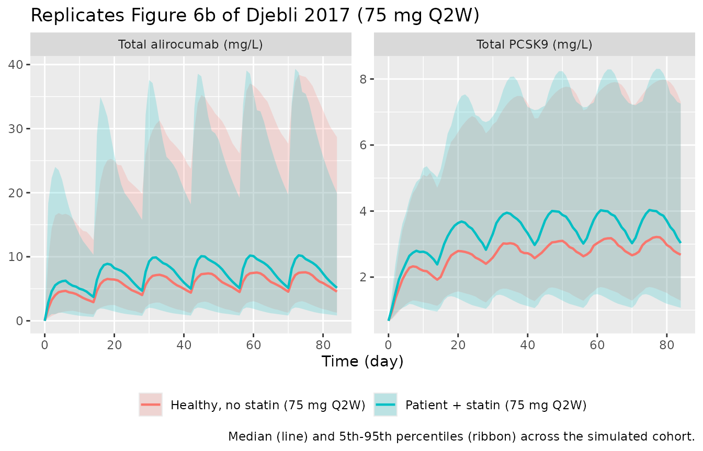
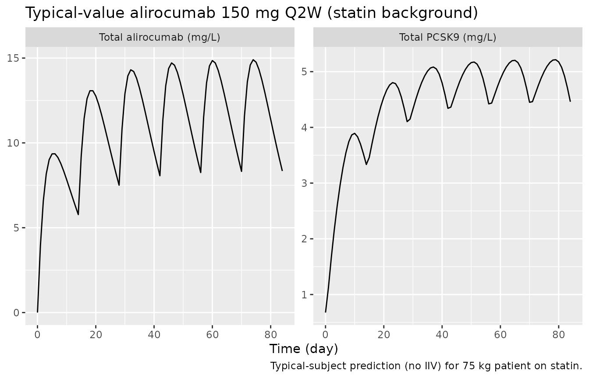

# Alirocumab TMDD-QSS (Djebli 2017)

## Model and source

- Citation: Djebli N, Martinez JM, Lohan L, Khier S, Brunet A, Hurbin F,
  Fabre D. Target-Mediated Drug Disposition Population Pharmacokinetics
  Model of Alirocumab in Healthy Volunteers and Patients: Pooled
  Analysis of Randomized Phase I/II/III Studies. Clin Pharmacokinet.
  2017;56(10):1155-1171. <doi:10.1007/s40262-016-0505-1>
- Description: Quasi-steady-state target-mediated drug disposition
  (TMDD-QSS) population PK model for alirocumab and total PCSK9 in
  healthy adults and adults with hypercholesterolemia (Djebli 2017,
  final model on expanded data set n=2870). Two-compartment disposition
  with first-order SC absorption (lag time and bioavailability), linear
  catabolic clearance from central, and PCSK9 binding / complex
  internalization described by QSS algebra; allometric weight scaling on
  CLL, Q, and Vc plus a statin-coadministration effect on CLL.
- Article: [Clinical Pharmacokinetics 56(10):1155-1171
  (2017)](https://doi.org/10.1007/s40262-016-0505-1) (open access)

Djebli et al. 2017 developed a quasi-steady-state (QSS) target-mediated
drug disposition (TMDD) population PK model for alirocumab (anti-PCSK9
IgG1 monoclonal antibody) that simultaneously describes total alirocumab
and total PCSK9 concentrations. The paper presents two models: an
initial model fit on n = 527 healthy volunteers and patients (with a
disease-state covariate on Vc), and a refined model fit on an expanded
data set of n = 2870 from 13 phase I/II/III studies (with theory-based
allometric weight scaling and a statin-coadministration covariate on
CLL). The packaged model is the **final expanded-data-set model**
(Djebli 2017 Table 4, expanded-model column) because the n = 527
DISST-on-Vc effect was attributed to disease-state / statin collinearity
and superseded by the larger-cohort STATIN-on-CLL covariate (paper
Section 4 Discussion).

## Population

The expanded data set pooled 2870 subjects (5.2% healthy volunteers,
94.8% patients) from 13 Sanofi / Regeneron studies: alirocumab phase I
ascending-dose trials, ODYSSEY MONO, COMBO II, FH I, LONG TERM, and
additional phase II / III studies. Mean (SD) baseline characteristics
were age 58.2 (11.7) years, body weight 85.0 (18.4) kg, BMI 29.5 (5.4)
kg/m^2; 62.1% male; 87.2% Caucasian, 4.8% Black, 5.0% Asian, 3.0% other.
Mean baseline total PCSK9 was 9.14 (6.84) nM (Djebli 2017 Table 3,
expanded-data-set column). The pooled cohort included 92.8% patients on
a statin background, 16.2% on ezetimibe, and 4.8% on a fibrate.

The same information is available programmatically via
`readModelDb("Djebli_2017_alirocumab")$population`.

## Source trace

The per-parameter origin is recorded as an in-file comment next to each
`ini()` entry in `inst/modeldb/specificDrugs/Djebli_2017_alirocumab.R`.
The table below summarises the provenance of each value used in the
model.

| Equation / parameter | Value | Source location |
|----|----|----|
| `lcl` (CLL) | 0.176 L/day | Table 4 final-model expanded-data column (95% CI 0.152-0.200) |
| `lvc` (Vc) | 4.67 L | Table 4 final-model expanded-data column (95% CI 4.40-4.94) |
| `lq` (Q) | 0.343 L/day | Table 4 final-model expanded-data column (95% CI 0.321-0.365) |
| `lvp` (Vp, FIXED) | 2.61 L | Table 4 (Vp fixed in both n = 527 and expanded models) |
| `lka` (Ka) | 0.307 /day | Table 4 final-model expanded-data column (95% CI 0.286-0.329) |
| `lfdepot` (F1) | 0.556 | Table 4 final-model expanded-data column (95% CI 0.531-0.582) |
| `ltlag` (LAG) | 0.0535 day | Table 4 final-model expanded-data column (95% CI 0.0533-0.0537) |
| `lkdeg` (Kdeg) | 1.10 /day | Table 4 final-model expanded-data column (95% CI 1.06-1.14) |
| `lkint` (Kint) | 0.112 /day | Table 4 final-model expanded-data column (95% CI 0.109-0.115) |
| `lkss` (Kss, FIXED) | 0.58 nM | Methods Sect. 2.3.2 (in-vitro K_D 0.58 nM) + Fig. 3 caption (K_SS = (K_off + K_int)/K_on) |
| `lkon` (Kon, FIXED) | 559 nM^-1/day | Table 4 (Kon fixed across all models; documented constant) |
| `lrbase` (R_base, FIXED) | 9.14 nM | Table 3 expanded data set (mean baseline total PCSK9) |
| `allo_cl` / `allo_q` | 0.75 | Section 3.6 (theory-based allometric scaling on CLL and Q) |
| `allo_vc` | 1.0 | Section 3.6 (theory-based allometric scaling on Vc) |
| `e_conmed_statin_cl` | 1.27 | Table 4 final-model expanded-data column (95% CI 1.10-1.45) |
| `etalcl` | 0.193 (CV 43.9%) | Table 4 expanded model IIV |
| `etalkint` | 0.0620 (CV 24.9%) | Table 4 expanded model IIV |
| `etalkdeg` | 0.219 (CV 46.8%) | Table 4 expanded model IIV |
| `etalq` | 0.426 (CV 65.3%) | Table 4 expanded model IIV |
| `etalvc` | 0.0515 (CV 22.7%) | Table 4 expanded model IIV |
| `etalka` | 0.723 (CV 85.0%) | Table 4 expanded model IIV |
| `etalfdepot` | 0.433 (CV 65.8%) | Table 4 expanded model IIV |
| `propSd`, `propSd_Ct` | 0.152 | Table 4 expanded model proportional residual (15.2%) |
| `addSd` | 1.499 mg/L | Table 4 (10.4 nM converted via MW_alirocumab 144100 g/mol) |
| `addSd_Ct` | 0.770 mg/L | Table 4 (10.4 nM converted via MW_PCSK9 74000 g/mol) |
| TMDD-QSS ODEs | n/a | Methods Sect. 2.3.2, Section 3.2 (paper) and Gibiansky et al. 2008 QSS algebra (Fig. 3 caption) |

## Virtual cohort

Original observed data are not publicly available. The figures below use
two virtual cohorts approximating the published trial demographics: a
typical patient cohort on statin coadministration and a typical healthy
cohort without statin (mirroring the n = 527 and n = 2870 simulation
scenarios in Djebli 2017 Figures 6a / 6b and Supplementary Figure 3).
Body weight is sampled from a normal distribution truncated at 40 kg.

``` r

set.seed(2017)

make_cohort <- function(n, label, statin, id_offset = 0L) {
  tibble(
    id            = id_offset + seq_len(n),
    treatment     = label,
    WT            = pmax(40, rnorm(n, mean = 85, sd = 18.4)),
    CONMED_STATIN = statin
  )
}

cohort_a <- make_cohort(60, label = "Patient + statin (75 mg Q2W)",   statin = 1L, id_offset =   0L)
cohort_b <- make_cohort(60, label = "Healthy, no statin (75 mg Q2W)", statin = 0L, id_offset = 100L)
cohort_c <- make_cohort(60, label = "Patient + statin (150 mg Q2W)",  statin = 1L, id_offset = 200L)

subjects <- bind_rows(cohort_a, cohort_b, cohort_c)

# Build the event table by treatment: 6 SC doses Q2W (weeks 0, 2, 4, 6, 8, 10),
# observation grid from week 0 to week 12. Two endpoints (Cc total alirocumab,
# Ct total PCSK9) are addressed by dvid (1 = Cc, 2 = Ct); rxode2 returns both
# observable columns on every observation row regardless of dvid, so the dvid
# is only the endpoint key for the residual / data structure.
make_events <- function(subj, dose_mg) {
  dose_rows <- subj |>
    tidyr::crossing(time = seq(0, 70, by = 14)) |>
    mutate(evid = 1L, amt = dose_mg, cmt = "depot", dvid = NA_integer_)
  obs_t <- seq(0, 84, by = 1)
  obs_rows <- subj |>
    tidyr::crossing(time = obs_t, dvid = c(1L, 2L)) |>
    mutate(evid = 0L, amt = NA_real_, cmt = NA_character_)
  bind_rows(dose_rows, obs_rows) |> arrange(id, time, evid)
}

events_75  <- bind_rows(make_events(cohort_a, dose_mg = 75),
                        make_events(cohort_b, dose_mg = 75))
events_150 <- make_events(cohort_c, dose_mg = 150)

events <- bind_rows(events_75, events_150)
stopifnot(!anyDuplicated(unique(events[, c("id", "time", "evid")])))
```

## Simulation

``` r

mod <- rxode2::rxode2(readModelDb("Djebli_2017_alirocumab"))
#> ℹ parameter labels from comments will be replaced by 'label()'

# Stochastic simulation with full IIV. The two endpoints (Cc, Ct) are addressed
# by dvid in the event table (1 = Cc total alirocumab, 2 = Ct total PCSK9); rxode2
# maps each observation row to its endpoint via dvid under the default solver.
sim <- rxode2::rxSolve(mod,
                       events    = events,
                       keep      = c("treatment", "WT", "CONMED_STATIN")) |>
  as.data.frame()
```

Typical-value (no IIV) replication for the figure overlays:

``` r

mod_typical <- mod |> rxode2::zeroRe()
sim_typical <- rxode2::rxSolve(mod_typical,
                               events    = events,
                               keep      = c("treatment", "WT", "CONMED_STATIN")) |>
  as.data.frame()
#> ℹ omega/sigma items treated as zero: 'etalcl', 'etalkint', 'etalkdeg', 'etalq', 'etalvc', 'etalka', 'etalfdepot'
#> Warning: multi-subject simulation without without 'omega'
```

## Replicate published figures

Figure 6 of Djebli 2017 shows predicted total alirocumab and total PCSK9
trajectories under alirocumab 75 mg Q2W over 12 weeks, comparing the
disease-state effect (Figure 6a) and statin-coadministration effect
(Figure 6b). The expanded-model packaged here uses the
statin-coadministration covariate, so we mirror Figure 6b: typical
trajectories with and without statin coadministration overlaid on the
50%-confidence ribbons from the stochastic simulation.

``` r

vpc_data <- sim |>
  dplyr::filter(treatment %in% c("Patient + statin (75 mg Q2W)",
                                  "Healthy, no statin (75 mg Q2W)")) |>
  dplyr::group_by(treatment, time) |>
  dplyr::summarise(
    Cc_med = median(Cc, na.rm = TRUE),
    Cc_q05 = quantile(Cc, 0.05, na.rm = TRUE),
    Cc_q95 = quantile(Cc, 0.95, na.rm = TRUE),
    Ct_med = median(Ct, na.rm = TRUE),
    Ct_q05 = quantile(Ct, 0.05, na.rm = TRUE),
    Ct_q95 = quantile(Ct, 0.95, na.rm = TRUE),
    .groups = "drop"
  )

vpc_long <- vpc_data |>
  tidyr::pivot_longer(cols = starts_with("Cc_") | starts_with("Ct_"),
                      names_to = c("analyte", ".value"),
                      names_pattern = "(C[ct])_(.*)") |>
  mutate(analyte = recode(analyte,
                          Cc = "Total alirocumab (mg/L)",
                          Ct = "Total PCSK9 (mg/L)"))

ggplot(vpc_long, aes(x = time, color = treatment, fill = treatment)) +
  geom_ribbon(aes(ymin = q05, ymax = q95), alpha = 0.2, colour = NA) +
  geom_line(aes(y = med), linewidth = 0.8) +
  facet_wrap(~analyte, scales = "free_y") +
  labs(x = "Time (day)", y = NULL,
       title = "Replicates Figure 6b of Djebli 2017 (75 mg Q2W)",
       caption = "Median (line) and 5th-95th percentiles (ribbon) across the simulated cohort.",
       color = NULL, fill = NULL) +
  theme(legend.position = "bottom")
```



For a single-dose check at the higher 150 mg Q2W regimen (mirroring
Supplementary Figure 3b), the typical-value trajectory is:

``` r

sim_typical |>
  dplyr::filter(treatment == "Patient + statin (150 mg Q2W)") |>
  tidyr::pivot_longer(cols = c(Cc, Ct), names_to = "analyte", values_to = "conc") |>
  mutate(analyte = recode(analyte,
                          Cc = "Total alirocumab (mg/L)",
                          Ct = "Total PCSK9 (mg/L)")) |>
  dplyr::filter(id == min(id)) |>
  ggplot(aes(time, conc)) +
  geom_line() +
  facet_wrap(~analyte, scales = "free_y") +
  labs(x = "Time (day)", y = NULL,
       title = "Typical-value alirocumab 150 mg Q2W (statin background)",
       caption = "Typical-subject prediction (no IIV) for 75 kg patient on statin.")
```



## PKNCA validation

Single-dose NCA for total alirocumab over the first dosing interval (day
0 to day 14) using PKNCA. PKNCA’s AUC machinery needs a non-NA time-zero
concentration; the simulation already contains time = 0 (pre-dose, Cc =
0), so a defensive bind_rows is unnecessary here but the `!is.na(Cc)`
filter follows the canonical recipe.

``` r

# The simulation grid carries TWO rows per (id, time) - one for the Cc endpoint
# (cmt = "central") and one for the Ct endpoint (cmt = "total_target"). Both rows
# produce identical Cc values (rxode2 returns every algebraic observable on every
# observation row), so collapse to one row per (id, time) before feeding PKNCA.
sim_first_dose <- sim |>
  dplyr::filter(time <= 14) |>
  dplyr::filter(!is.na(Cc)) |>
  dplyr::distinct(id, treatment, time, .keep_all = TRUE) |>
  dplyr::select(id, time, Cc, treatment)

# Sanity check: every (id, treatment) has a time = 0 record (Cc = 0 pre-dose).
stopifnot(all(sim_first_dose |>
  dplyr::group_by(id, treatment) |>
  dplyr::summarise(has_zero = any(time == 0), .groups = "drop") |>
  dplyr::pull(has_zero)))

conc_obj <- PKNCA::PKNCAconc(sim_first_dose, Cc ~ time | treatment + id)

dose_df <- events |>
  dplyr::filter(evid == 1L, time == 0) |>
  dplyr::select(id, time, amt, treatment)

dose_obj <- PKNCA::PKNCAdose(dose_df, amt ~ time | treatment + id)

intervals <- data.frame(
  start      = 0,
  end        = 14,
  cmax       = TRUE,
  tmax       = TRUE,
  auclast    = TRUE,
  half.life  = TRUE
)

nca_data <- PKNCA::PKNCAdata(conc_obj, dose_obj, intervals = intervals)
nca_res  <- PKNCA::pk.nca(nca_data)
#> Warning: Too few points for half-life calculation (min.hl.points=3 with only 0
#> points)
#> Warning: Too few points for half-life calculation (min.hl.points=3 with only 2
#> points)
#> Warning: Too few points for half-life calculation (min.hl.points=3 with only 0
#> points)
#> Warning: Too few points for half-life calculation (min.hl.points=3 with only 1
#> points)

nca_summary <- as.data.frame(nca_res$result) |>
  dplyr::filter(PPTESTCD %in% c("cmax", "tmax", "auclast", "half.life")) |>
  dplyr::select(treatment, PPTESTCD, PPORRES) |>
  tidyr::pivot_wider(names_from = PPTESTCD, values_from = PPORRES,
                     values_fn  = function(x) median(x, na.rm = TRUE)) |>
  dplyr::arrange(treatment)

knitr::kable(
  nca_summary,
  digits  = 2,
  caption = "Single-dose NCA (median over simulated subjects) for total alirocumab."
)
```

| treatment                      | auclast |  cmax | tmax | half.life |
|:-------------------------------|--------:|------:|-----:|----------:|
| Healthy, no statin (75 mg Q2W) |   52.67 |  4.72 |    6 |      9.88 |
| Patient + statin (150 mg Q2W)  |  107.34 | 10.61 |    5 |      9.65 |
| Patient + statin (75 mg Q2W)   |   70.81 |  6.51 |    5 |      8.92 |

Single-dose NCA (median over simulated subjects) for total alirocumab.
{.table}

Djebli 2017 does not publish a per-subject NCA table for total
alirocumab, so this NCA is provided as an internal consistency check
rather than a side-by-side comparison: Cmax in the patient-with-statin
and healthy arms differs (the statin arm has higher CLL, lower exposure,
per Section 3.6), and the high-dose 150 mg arm is roughly twice the 75
mg AUC, both consistent with the paper’s description of the simulation
outputs in Supplementary Table 3.

## Assumptions and deviations

- **K_SS (QSS dissociation constant) is FIXED to the in-vitro K_D = 0.58
  nM.** Djebli 2017 parameterises the QSS approximation in terms of K_on
  (FIXED to 559 nM^-1 day^-1; Table 4), K_int, and K_deg (Methods Sect.
  2.3.2). The standard QSS algebra (Gibiansky et al. 2008, paper Fig. 3
  caption) requires K_SS = (K_off + K_int) / K_on. The paper reports the
  in-vitro K_D = 0.58 nM (Methods Sect. 2.3.2) and rules out the
  irreversible-binding limit because K_int is non-negligible relative to
  K_off. With K_off = K_on \* K_D = 559 \* 0.58 ~ 324 day^-1, K_off \>\>
  K_int (= 0.112 day^-1), so K_SS ~ K_D = 0.58 nM (the K_int / K_on
  contribution is ~0.0002 nM, negligible). K_SS is therefore fixed at
  0.58 nM; K_on is preserved as a documented constant for
  reproducibility of the binding-rate parameterization but does not
  enter the QSS algebra directly.
- **Baseline total PCSK9 (R_base) is FIXED at the population mean of
  9.14 nM** (Table 3, expanded data set). Djebli 2017 does not estimate
  a population baseline parameter; total PCSK9 is set per-subject from
  the observed pre-dose value in the NONMEM dataset, and no IIV on
  R_base is reported. The packaged model uses 9.14 nM without IIV
  accordingly.
- **Reference body weight 85 kg.** The paper labels the allometric
  reference weight `WT_med` (median in the expanded data set; Sect. 3.6)
  but reports only the mean (85.0 kg) in Table 3. The mean is used as
  the closest published summary; for a roughly symmetric weight
  distribution in adults, mean ~ median.
- **Pooled DV residual error converted from nM to mg/L per analyte.**
  Djebli 2017 combines total alirocumab and total PCSK9 into a single
  dependent variable on the nM scale, with one proportional and one
  additive error term applied identically to both (10.4 nM additive,
  15.2% proportional). The packaged model exposes both observations in
  mg/L (assay-reporting convention) and converts the additive residual
  per analyte using each molecule’s molecular weight: `addSd`
  (alirocumab) = 10.4 nM \* 144100 g/mol / 1e6 = 1.499 mg/L; `addSd_Ct`
  (PCSK9) = 10.4 nM \* 74000 g/mol / 1e6 = 0.770 mg/L. The proportional
  residual is unitless (15.2%) and identical for both. The fit on the
  original nM scale is mathematically equivalent.
- **PCSK9 molecular weight 74,000 g/mol.** Djebli 2017 does not state
  the PCSK9 MW used for the bioanalytical reporting. 74 kDa is the
  standard value for mature secreted PCSK9 (the prodomain-catalytic
  heterodimer that circulates in serum; UniProt Q8NBP7) and the
  calibration mass used by commercial PCSK9 ELISA kits. This MW is only
  used to convert the additive residual error and the Ct observation
  between nM and mg/L; the underlying TMDD dynamics operate on the nM
  scale and are independent of the chosen MW.
- **F1 IIV on the natural-log scale.** Djebli 2017 reports F1 = 0.556
  with CV 65.8% (Table 4, expanded model). The encoding used here is
  `fdepot = exp(lfdepot + etalfdepot)`, matching the typical NONMEM
  exponential IIV form. This is unbounded on the upside, so a small
  fraction (~15%) of simulated subjects will have F1 \> 1; the paper
  does not mention a logit-transformed F1 parameterisation, and this
  encoding follows the published table as written. The Martinez 2019
  alirocumab model (`modellib("Martinez_2019_alirocumab")`) uses a
  logit-transformed F1; the difference is editorial.
- **Alirocumab molecular weight 144,100 g/mol.** Used to convert mg
  doses into nmol so the central compartment carries amounts on the same
  molar scale as the QSS binding algebra. Djebli 2017 does not state the
  MW; 144,100 g/mol is the value reported in the alirocumab USPI /
  Praluent (Sanofi/Regeneron) and is consistent with a fully-human IgG1.
- **Initial DISST-on-Vc covariate (n = 527 model) not packaged.** Djebli
  2017 also reports an initial TMDD-QSS model on n = 527 that retained a
  disease-state effect on Vc (DISST = 0 healthy / 1 patient; COV1 =
  1.56). This effect was attributed to collinearity with statin
  coadministration in the smaller cohort and replaced by STATIN-on-CLL
  in the expanded n = 2870 model (paper Sect. 4 Discussion). Per the
  policy of packaging only the final model
  (`references/replicate-author-structure.md`), the initial n = 527
  model is not included as a separate `.R` file.
