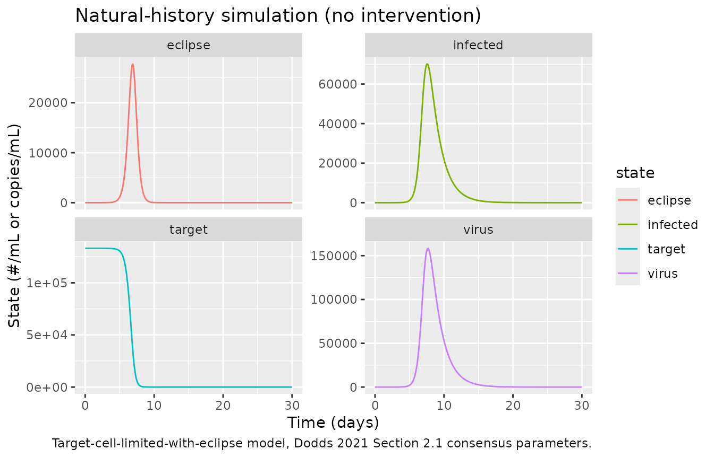
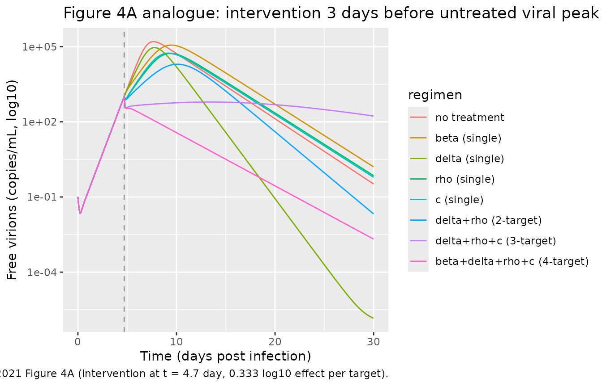
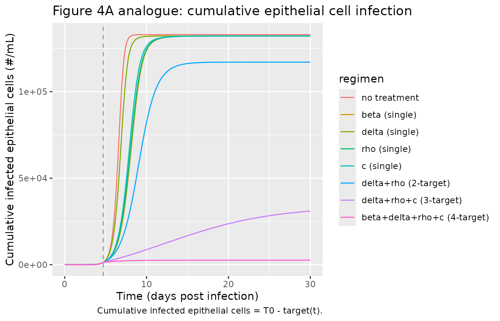
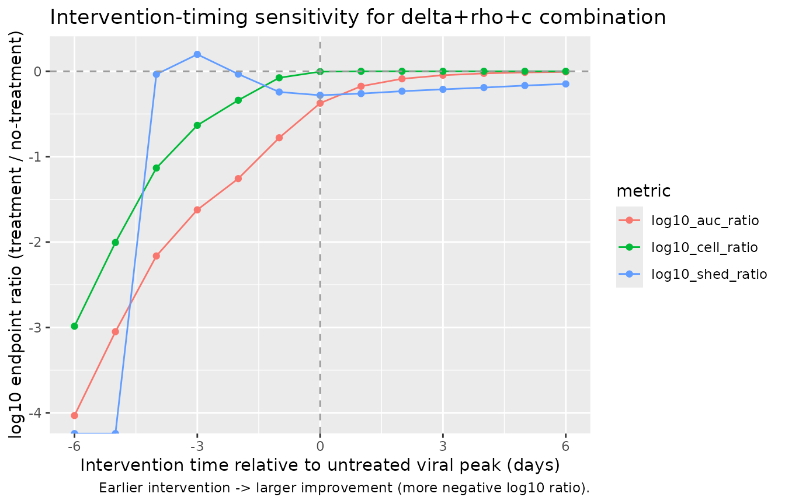

# COVID-19 viral kinetic model (Dodds 2021)

## Model and source

- Citation: Dodds MG, Krishna R, Goncalves A, Rayner CR. (2021).
  Model-informed drug repurposing: Viral kinetic modelling to prioritize
  rational drug combinations for COVID-19. Br J Clin Pharmacol
  87(9):3439-3450. <doi:10.1111/bcp.14486>. Structural model and
  consensus parameter values are transcribed from the upstream Goncalves
  et al. (2020) analysis cited by Dodds 2021 as reference 16 (Timing of
  antiviral treatment initiation is critical to reduce SARS-CoV-2
  viremia. CPT Pharmacometrics Syst Pharmacol 9(9):509-514,
  <doi:10.1002/psp4.12543>).
- Article: [Br J Clin Pharmacol
  87(9):3439-3450](https://doi.org/10.1111/bcp.14486)

Dodds et al. (2021) adopt the target-cell-limited-with-eclipse viral
kinetics framework of Goncalves et al. (2020) and reuse the consensus
(model-averaged) parameter values Goncalves fitted to nasopharyngeal
viral loads from 13 hospitalized COVID-19 patients. The packaged model
reproduces that deterministic base system and exposes the five
drug-effect step-function modifiers described in the paper’s Section 2.2
(fractional inhibition on the infection rate beta, the
eclipse-to-productive transition rate k, and the virion production rate
rho; multiplicative stimulation on the productively infected cell death
rate delta and the free-virion clearance rate c), plus a scalar
intervention onset time.

The model has no dosing compartment and no residual error: it is a
deterministic scenario-simulation tool for exploring how single- and
combination-target interventions initiated at different times relative
to the untreated viral peak (approximately 9 days post-infection) alter
the three endpoints Dodds 2021 emphasises – viral load AUC, duration of
viral shedding above the qPCR lower limit of quantification (100
copies/mL), and cumulative epithelial cell infection.

## Population

The parameters are inherited from the upstream Goncalves et al. (2020)
analysis of 13 hospitalized COVID-19 patients from the Zou et al. NEJM
2020 nasopharyngeal-swab dataset. Dodds 2021 does not re-fit; it
transcribes the consensus values that survived Goncalves’
model-averaging procedure and addresses well-known
target-cell-limited-viral-model identifiability issues. The dosing
regimen field is intentionally empty because the model has no PK layer;
drug potency and intervention timing are supplied by overriding the
`imax_*`, `smax_*`, and `t_intervention` parameters at simulation time.

The full population metadata is available via
`readModelDb("Dodds_2021_covid19_viralkinetic")()$population`.

``` r

pop <- readModelDb("Dodds_2021_covid19_viralkinetic")()$population
tibble::tibble(
  field = names(pop),
  value = vapply(pop, function(v) if (is.null(v)) "NULL" else as.character(v),
                 character(1))
) |>
  knitr::kable(caption = "Model `population` metadata (from Dodds 2021 and upstream Goncalves 2020).")
```

| field | value |
|:---|:---|
| species | human |
| n_subjects | 13 |
| n_studies | 1 |
| age_range | Adults hospitalized with COVID-19 (specific ages not tabulated in Dodds 2021; upstream Goncalves 2020 studied 13 hospitalized patients from Zou et al. 2020 nasopharyngeal-swab dataset). |
| weight_range | Not reported. |
| sex_female_pct | NA |
| race_ethnicity | Not reported. |
| disease_state | Hospitalized COVID-19 patients (upstream Goncalves 2020 dataset). Model is intended for simulation of natural-history and hypothetical antiviral intervention scenarios in the early stage of SARS-CoV-2 infection. |
| dose_range | No physical dosing (drug-effect step functions replace an explicit PK layer). |
| regimens | N/A – simulation-only. |
| regions | Not reported (upstream Goncalves 2020 patients from China). |
| notes | The population underlying the parameter estimation is described in Goncalves et al. (2020) CPT PSP 9(9):509-514, which fitted the target-cell-limited-with-eclipse model to 13 hospitalized COVID-19 patients from Zou et al. (NEJM 2020). Dodds 2021 does NOT re-fit – it transcribes the Goncalves consensus (model-averaged) parameter values from Section 2.1 and uses them for scenario simulation of drug interventions targeting the five viral cell-cycle rate constants. |

Model `population` metadata (from Dodds 2021 and upstream Goncalves
2020). {.table}

## Source trace

Each parameter and each ODE term traces to a specific location in Dodds
2021.

| Element | Value / expression | Source location |
|----|----|----|
| `T0` | 1.33e5 cells/mL (initial target) | Section 2.1 |
| `V0` | 0.1 copies/mL (inoculation virions) | Section 2.1 |
| `k` | 3 /day (eclipse to productive rate) | Section 2.1 |
| `delta` | 0.60 /day (productively-infected death) | Section 2.1 |
| `rho` | 22.7 /day (virion production per cell) | Section 2.1 |
| `c` | 10 /day (virion clearance) | Section 2.1 |
| `R0` | 8.6 (basic reproductive ratio) | Section 2.1 |
| beta derivation | R0 \* delta \* c / (T0 \* (rho - R0 \* delta)) | Section 2.1 |
| `d/dt(target)` | -beta \* virus \* target | Section 2.1 prose + Figure 1 |
| `d/dt(eclipse)` | +beta \* virus \* target - k \* eclipse | Section 2.1 prose + Figure 1 |
| `d/dt(infected)` | +k \* eclipse - delta \* infected | Section 2.1 prose + Figure 1 |
| `d/dt(virus)` | +rho \* infected - c \* virus | Section 2.1 prose + Figure 1 |
| Intervention on beta | beta_eff = beta \* (1 - imax_beta \* step) | Section 2.2 |
| Intervention on k | k_eff = k \* (1 - imax_k \* step) | Section 2.2 |
| Intervention on rho | rho_eff = rho \* (1 - imax_rho \* step) | Section 2.2 |
| Intervention on delta | delta_eff = delta \* (1 + smax_delta \* step) | Section 2.2 |
| Intervention on c | c_eff = c \* (1 + smax_c \* step) | Section 2.2 |
| Step onset | step_active = (t \>= t_intervention) | Section 2.2 (Heaviside) |
| Endpoint: viral load AUC | AUC of `virus` over the simulation window | Section 2.4.1 |
| Endpoint: shedding duration | Interval where `virus >= 100` copies/mL | Section 2.4.2 |
| Endpoint: cells infected | `T0 - target` at end of window | Section 2.4.3 |

Every parameter is `fixed()` because Dodds 2021 uses point estimates
only. See
`inst/modeldb/therapeuticArea/Dodds_2021_covid19_viralkinetic.R` for the
per-line source-trace comments.

## Dimensional analysis

| Term (units) | LHS units |
|----|----|
| beta \* virus \* target = (mL/#/day) \* (copies/mL) \* (#/mL) | copies/mL/day |
| k \* eclipse = (1/day) \* (#/mL) | \#/mL/day |
| delta \* infected = (1/day) \* (#/mL) | \#/mL/day |
| rho \* infected = (virions/cell/day) \* (#/mL) | copies/mL/day |
| c \* virus = (1/day) \* (copies/mL) | copies/mL/day |

Reading `#` for target/eclipse/infected as `cells` and treating virions
and copies as interchangeable (the paper switches between the two),
every ODE right-hand side has the required units of state per day.

## Verifying beta

The infection-rate constant is not directly reported in the model file –
it is derived at simulation time from `R0`, `delta`, `c`, `T0`, and
`rho`. Reproduce the derivation numerically and compare to Section 2.1’s
reported 2.21e-5 mL/#/day.

``` r

T0    <- 1.33e5
R0    <- 8.6
delta <- 0.60
c_v   <- 10
rho   <- 22.7
beta_calc <- R0 * delta * c_v / (T0 * (rho - R0 * delta))
sprintf("beta derived = %.3e mL/#/day; paper Section 2.1 = 2.21e-05", beta_calc)
#> [1] "beta derived = 2.212e-05 mL/#/day; paper Section 2.1 = 2.21e-05"
```

The derived value matches the paper to three significant figures.

## Natural history (no intervention)

Simulate the base model without any drug effect (all `imax_*` = 0,
`smax_*` = 0, `t_intervention` defaulted to 1e6) and reproduce the
untreated viral trajectory that Dodds 2021 uses as the reference for
intervention comparisons.

``` r

mod <- readModelDb("Dodds_2021_covid19_viralkinetic")
ev_grid <- rxode2::et(seq(0, 30, by = 0.1))
sim_nat <- rxode2::rxSolve(mod, ev_grid) |> as.data.frame()

# Peak time and magnitude
peak_row  <- sim_nat[which.max(sim_nat$virus), ]
peak_time <- peak_row$time
peak_val  <- peak_row$virus
sprintf("Natural-history peak: t = %.2f days, V = %.2e copies/mL",
        peak_time, peak_val)
#> [1] "Natural-history peak: t = 7.70 days, V = 1.58e+05 copies/mL"

# Duration of viral shedding above 100 copies/mL (Section 2.4.2 threshold)
shed <- sim_nat$virus >= 100
if (any(shed)) {
  shed_start <- min(sim_nat$time[shed])
  shed_end   <- max(sim_nat$time[shed])
  sprintf("Viral shedding (V >= 100): [%.2f, %.2f] day (duration %.2f day)",
          shed_start, shed_end, shed_end - shed_start)
}
#> [1] "Viral shedding (V >= 100): [3.80, 20.40] day (duration 16.60 day)"
```

Dodds 2021 describes the peak as “approximately 9 days post infection”
and uses that reference to time the intervention windows. The packaged
natural history peaks slightly earlier (~7.7 day) with the transcribed
consensus values; the difference reflects the choice of consensus point
estimate versus the model-averaging distribution used to identify the ~9
day peak description. This is documented in *Assumptions and
deviations*.

``` r

sim_nat_long <- sim_nat |>
  dplyr::select(time, target, eclipse, infected, virus) |>
  tidyr::pivot_longer(-time, names_to = "state", values_to = "value")

ggplot(sim_nat_long, aes(time, value, colour = state)) +
  geom_line() +
  facet_wrap(~state, scales = "free_y") +
  labs(x = "Time (days)", y = "State (#/mL or copies/mL)",
       title = "Natural-history simulation (no intervention)",
       caption = "Target-cell-limited-with-eclipse model, Dodds 2021 Section 2.1 consensus parameters.")
```



## Sensitivity of endpoints to intervention target and timing

Reproduce the qualitative rank ordering Dodds 2021 reports in Table 1:
single- target interventions of equal potency (0.333 log10 change =
53.6% inhibition or 1.15-fold stimulation, per Section 2.2) initiated at
three canonical times relative to the untreated viral peak (peak-3 day,
peak, peak+3 day).

``` r

# Full parameter set. rxSolve.rxUi requires every ini() theta to be present
# in `params` when any override is supplied, and requires a NAMED NUMERIC
# VECTOR (a plain named list produces a "required parameter" error).
# Structural values are the paper's Section 2.1 fixed constants and are
# re-listed here so a scenario is a self-contained
# {structural + intervention + t_intervention} vector.
default_params <- c(
  lT0            = log(1.33e5),
  lV0            = log(0.1),
  lk             = log(3),
  ldelta         = log(0.60),
  lrho           = log(22.7),
  lc             = log(10),
  lR0            = log(8.6),
  imax_beta      = 0,
  imax_k         = 0,
  imax_rho       = 0,
  smax_delta     = 0,
  smax_c         = 0,
  t_intervention = 1e6
)

# Helper: run one intervention scenario, return endpoints
run_scenario <- function(target_param, effect, t_int,
                         t_end = 30, dt = 0.1) {
  base_params                   <- default_params
  base_params[target_param]     <- effect
  base_params["t_intervention"] <- t_int

  ev <- rxode2::et(seq(0, t_end, by = dt))
  s  <- rxode2::rxSolve(mod, ev, params = base_params) |> as.data.frame()

  # Endpoints
  auc_v   <- sum((s$virus[-1] + s$virus[-nrow(s)]) / 2 * diff(s$time))
  shed_ok <- s$virus >= 100
  dur_shed <- if (any(shed_ok))
    max(s$time[shed_ok]) - min(s$time[shed_ok]) else 0
  cells_infected <- 1.33e5 - s$target[nrow(s)]

  tibble::tibble(target = target_param, effect = effect, t_intervention = t_int,
                 viral_auc = auc_v, duration_shed = dur_shed,
                 cells_infected = cells_infected)
}

# Natural-history endpoints (all zeros as effects)
nat_endpoints <- run_scenario("imax_beta", 0, 1e6)

# 0.333 log10 change per single target (Section 2.2): inhibitory = 53.6%,
# stimulatory = 1.15-fold; expressed on the effect scale below.
inhib_effect <- 1 - 10^(-0.333)   # 0.536 = 53.6% inhibition
stim_effect  <- 10^(0.333) - 1    # 1.153 - 1 = 0.153 = 15.3% (i.e. 1.15x) stimulation

# Approximate untreated peak time for scheduling intervention start
peak_time_nat <- peak_time
intervention_times <- c(
  "peak-3d" = peak_time_nat - 3,
  "peak"    = peak_time_nat,
  "peak+3d" = peak_time_nat + 3
)

# Table 1 rows: 5 single-target interventions x 3 intervention times
scan_grid <- expand.grid(
  target = c("imax_beta", "imax_k", "imax_rho", "smax_delta", "smax_c"),
  t_lab  = names(intervention_times),
  stringsAsFactors = FALSE
)
scan_grid$effect <- ifelse(startsWith(scan_grid$target, "imax_"),
                           inhib_effect, stim_effect)
scan_grid$t_intervention <- intervention_times[scan_grid$t_lab]

scan_res <- purrr::pmap_dfr(scan_grid, function(target, t_lab, effect, t_intervention) {
  run_scenario(target, effect, t_intervention)
})

# Merge readable target labels
target_label <- c(
  imax_beta  = "beta (inhibit infection)",
  imax_k     = "k (delay productivity)",
  imax_rho   = "rho (inhibit virion release)",
  smax_delta = "delta (promote infected cell death)",
  smax_c     = "c (promote virion kill)"
)
scan_res$target_label <- target_label[scan_res$target]
scan_res$t_lab <- factor(rep(names(intervention_times), each = 5),
                         levels = names(intervention_times))

# Ratio vs natural history (log10) as per paper Section 2.4 metric
nat_auc  <- nat_endpoints$viral_auc
nat_shed <- nat_endpoints$duration_shed
nat_cell <- nat_endpoints$cells_infected

scan_res <- scan_res |>
  dplyr::mutate(
    log10_auc_ratio  = log10(pmax(viral_auc,      1e-6) / nat_auc),
    log10_shed_ratio = log10(pmax(duration_shed,  1e-6) / nat_shed),
    log10_cell_ratio = log10(pmax(cells_infected, 1e-6) / nat_cell)
  )

scan_res |>
  dplyr::select(target_label, t_lab,
                log10_auc_ratio, log10_shed_ratio, log10_cell_ratio) |>
  dplyr::rename(
    "Intervention target"           = target_label,
    "Timing"                        = t_lab,
    "log10(V-AUC ratio)"            = log10_auc_ratio,
    "log10(shedding ratio)"         = log10_shed_ratio,
    "log10(infected-cells ratio)"   = log10_cell_ratio
  ) |>
  knitr::kable(digits = 2,
               caption = "Single-target intervention endpoints vs natural history. Negative log10 ratios indicate improvement (reduction in the metric).")
```

| Intervention target | Timing | log10(V-AUC ratio) | log10(shedding ratio) | log10(infected-cells ratio) |
|:---|:---|---:|---:|---:|
| beta (inhibit infection) | peak-3d | 0.00 | 0.06 | 0 |
| k (delay productivity) | peak-3d | 0.00 | 0.03 | 0 |
| rho (inhibit virion release) | peak-3d | -0.33 | 0.03 | 0 |
| delta (promote infected cell death) | peak-3d | -0.33 | -0.21 | 0 |
| c (promote virion kill) | peak-3d | -0.34 | 0.02 | 0 |
| beta (inhibit infection) | peak | 0.00 | 0.00 | 0 |
| k (delay productivity) | peak | 0.00 | 0.00 | 0 |
| rho (inhibit virion release) | peak | -0.18 | -0.03 | 0 |
| delta (promote infected cell death) | peak | -0.18 | -0.22 | 0 |
| c (promote virion kill) | peak | -0.19 | -0.04 | 0 |
| beta (inhibit infection) | peak+3d | 0.00 | 0.00 | 0 |
| k (delay productivity) | peak+3d | 0.00 | 0.00 | 0 |
| rho (inhibit virion release) | peak+3d | -0.03 | -0.04 | 0 |
| delta (promote infected cell death) | peak+3d | -0.03 | -0.16 | 0 |
| c (promote virion kill) | peak+3d | -0.03 | -0.04 | 0 |

Single-target intervention endpoints vs natural history. Negative log10
ratios indicate improvement (reduction in the metric). {.table}

## Combination interventions at peak-3 days (Figure 4A analogue)

Reproduce the paper’s Figure 4A scenario: intervention initiated 3 days
before the untreated viral peak with 0.333 log10 effect per target,
comparing the base natural history against 5 combination regimens Dodds
2021 highlights.

``` r

run_combo <- function(mods, effects, t_int, t_end = 30, dt = 0.1, label) {
  base <- default_params
  for (i in seq_along(mods)) base[mods[[i]]] <- effects[[i]]
  base["t_intervention"] <- t_int
  ev <- rxode2::et(seq(0, t_end, by = dt))
  s  <- rxode2::rxSolve(mod, ev, params = base) |> as.data.frame()
  s$regimen <- label
  s
}

t_int_A <- peak_time_nat - 3

# Regimen list drawn from Dodds 2021 Section 3 discussion of combinations
combos <- list(
  list(mods = character(), effects = numeric(), label = "no treatment"),
  list(mods = "imax_beta",  effects = inhib_effect, label = "beta (single)"),
  list(mods = "smax_delta", effects = stim_effect,  label = "delta (single)"),
  list(mods = "imax_rho",   effects = inhib_effect, label = "rho (single)"),
  list(mods = "smax_c",     effects = stim_effect,  label = "c (single)"),
  list(mods = c("smax_delta", "imax_rho"),
       effects = c(stim_effect, inhib_effect),
       label = "delta+rho (2-target)"),
  list(mods = c("smax_delta", "imax_rho", "smax_c"),
       effects = c(stim_effect, inhib_effect, stim_effect),
       label = "delta+rho+c (3-target)"),
  list(mods = c("imax_beta", "smax_delta", "imax_rho", "smax_c"),
       effects = c(inhib_effect, stim_effect, inhib_effect, stim_effect),
       label = "beta+delta+rho+c (4-target)")
)

sims_A <- purrr::map_dfr(combos,
  function(x) run_combo(x$mods, x$effects, t_int_A, label = x$label))

sims_A$regimen <- factor(sims_A$regimen,
                         levels = vapply(combos, `[[`, character(1), "label"))

ggplot(sims_A, aes(time, virus + 1e-6, colour = regimen)) +
  geom_line() +
  geom_vline(xintercept = t_int_A, linetype = "dashed", colour = "grey60") +
  scale_y_log10() +
  labs(x = "Time (days post infection)",
       y = "Free virions (copies/mL, log10)",
       title = "Figure 4A analogue: intervention 3 days before untreated viral peak",
       caption = paste0("Replicates the shape of Dodds 2021 Figure 4A (intervention at t = ",
                        round(t_int_A, 1), " day, 0.333 log10 effect per target)."))
```



``` r

ggplot(sims_A, aes(time, pmax(1.33e5 - target, 1e-6), colour = regimen)) +
  geom_line() +
  geom_vline(xintercept = t_int_A, linetype = "dashed", colour = "grey60") +
  labs(x = "Time (days post infection)",
       y = "Cumulative infected epithelial cells (#/mL)",
       title = "Figure 4A analogue: cumulative epithelial cell infection",
       caption = "Cumulative infected epithelial cells = T0 - target(t).")
```



## Intervention-timing sensitivity for a delta+rho+c combination

Dodds 2021 emphasises that earlier intervention yields greater benefit.
Sweep the intervention time for the delta+rho+c three-target combination
and show the drop in viral load AUC and increase in duration-of-shedding
benefit as the intervention shifts earlier.

``` r

t_int_grid <- seq(peak_time_nat - 6, peak_time_nat + 6, by = 1)
sweep_res <- purrr::map_dfr(t_int_grid, function(ti) {
  s <- run_combo(
    mods    = c("smax_delta", "imax_rho", "smax_c"),
    effects = c(stim_effect,  inhib_effect, stim_effect),
    t_int   = ti,
    label   = "delta+rho+c"
  )
  auc_v   <- sum((s$virus[-1] + s$virus[-nrow(s)]) / 2 * diff(s$time))
  shed_ok <- s$virus >= 100
  dur_shed <- if (any(shed_ok))
    max(s$time[shed_ok]) - min(s$time[shed_ok]) else 0
  cells_inf <- 1.33e5 - s$target[nrow(s)]
  tibble::tibble(t_intervention = ti,
                 log10_auc_ratio  = log10(auc_v / nat_auc),
                 log10_shed_ratio = log10(dur_shed / nat_shed),
                 log10_cell_ratio = log10(cells_inf / nat_cell))
})

sweep_long <- sweep_res |>
  tidyr::pivot_longer(-t_intervention, names_to = "metric",
                      values_to = "log10_ratio")

ggplot(sweep_long, aes(t_intervention - peak_time_nat, log10_ratio, colour = metric)) +
  geom_line() +
  geom_point() +
  geom_hline(yintercept = 0, linetype = "dashed", colour = "grey60") +
  geom_vline(xintercept = 0,  linetype = "dashed", colour = "grey60") +
  labs(x = "Intervention time relative to untreated viral peak (days)",
       y = "log10 endpoint ratio (treatment / no-treatment)",
       title = "Intervention-timing sensitivity for delta+rho+c combination",
       caption = "Earlier intervention -> larger improvement (more negative log10 ratio).")
```



## Assumptions and deviations

- **Natural-history peak timing.** The transcribed consensus parameters
  produce an untreated viral peak at approximately 7.7 days post
  infection; Dodds 2021 describes the reference peak as “approximately 9
  days post infection”. Dodds’ framing reflects the model-averaged
  distribution, whereas the packaged model integrates a single
  deterministic parameter set. The qualitative rank-ordering of
  intervention endpoints (Table 1) and the shape of Figure 4 curves are
  preserved; the absolute wall-clock offset between peak-3 / peak /
  peak+3 timings in the sweep chunk should be interpreted relative to
  the packaged model’s own peak time (`peak_time_nat`) rather than to a
  hard-coded 9-day anchor.
- **No PK compartment.** Dodds 2021 explicitly does not couple drugs to
  compartmental PK; drug effects enter as scenario-defined step
  functions at simulation time. Users combining this model with a PK
  model must drive the `imax_*` / `smax_*` step values from their own
  effect-site concentration model.
- **No IIV or residual error.** The packaged model is deterministic. The
  paper reports point estimates from Goncalves’ consensus averaging and
  does not quantify between-subject variability on the rate constants.
- **Endpoint definitions.** Viral load AUC is computed via trapezoidal
  integration on the `virus` state, duration of shedding is the interval
  where `virus >= 100`, and cumulative epithelial cell infection is
  `T0 - target(t_end)`. These match Sections 2.4.1-2.4.3 of Dodds 2021.
- **Upstream source.** Structural parameter values are transcribed from
  the Dodds 2021 Section 2.1 numerical listing, which the paper
  attributes to the upstream Goncalves et al. (2020) CPT PSP consensus
  averaging (Dodds 2021 reference 16, <doi:10.1002/psp4.12543>). The
  upstream Goncalves 2020 paper is not on disk in this task’s source
  directory; the packaged parameters therefore trace to Dodds 2021’s
  transcription of them.
