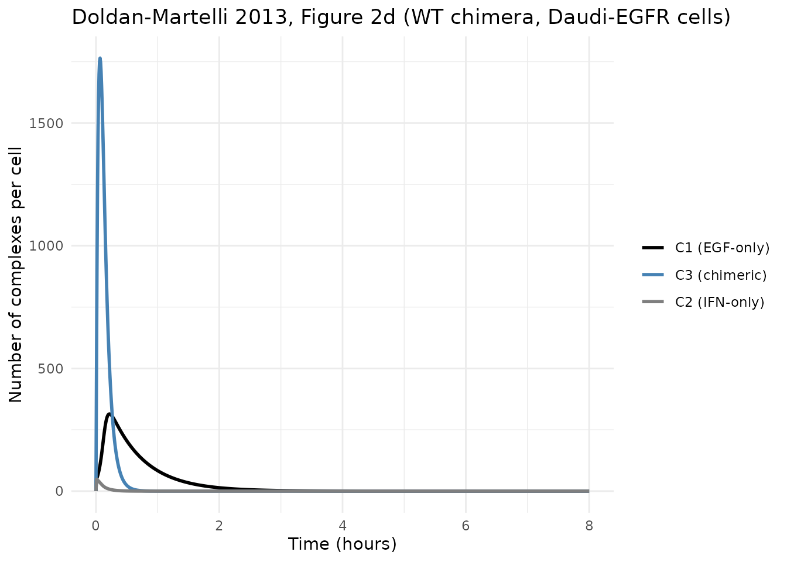
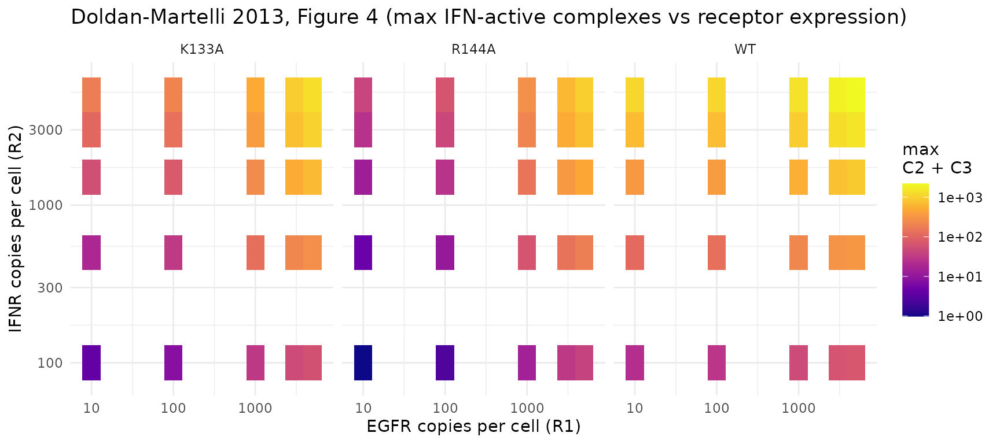

# EGF-IFN chimeric ligand (Doldan-Martelli 2013)

## Model and source

- Citation: Doldan-Martelli V, Guantes R, Miguez DG. A mathematical
  model for the rational design of chimeric ligands in selective drug
  therapies. *CPT Pharmacometrics Syst Pharmacol.* 2013;2(2):e26.
- DOI: <https://doi.org/10.1038/psp.2013.2>
- Open access (CC BY).

This is a deterministic mechanistic in-vitro receptor-binding model of
an EGF-IFNalpha-2a chimeric ligand engaging two distinct surface
receptors (EGFR and IFNR) on cells. The chimera is composed of an EGF
“targeting” subunit linked to an IFNalpha-2a “activity” subunit; the
case-study cells are parental Daudi (a human Burkitt-lymphoma line with
low endogenous EGFR) and a Daudi-EGFR variant engineered to overexpress
EGFR ~300-fold.

Each subunit can bind its corresponding receptor independently. Once one
subunit is engaged, the free subunit is confined to a small effective
reaction volume near the cell membrane (a “spherical gasket” of
thickness `h + a`), so the local concentration available to the second
receptor is greatly increased. The second binding event therefore
proceeds at an effective on-rate set by the slower of (a)
two-dimensional receptor diffusion to the partner complex and (b) the
intrinsic 3D affinity scaled into the local reaction volume.
Internalization removes engaged complexes from the surface.

The paper develops the model for three IFN affinity variants (wild-type
IFNalpha-2a, K133A mutant, R144A mutant – progressively lower IFNR
affinity) and compares dynamics in parental Daudi vs Daudi-EGFR cells.
The headline finding is that lower-affinity IFN variants give *higher
selectivity* (greater fold-difference in IFN activation between cells
overexpressing EGFR and parental cells) because they rely on the EGFR
targeting subunit to be retained near the membrane.

## Population

This is an *in-vitro* model. There are no clinical subjects, no IIV, no
residual error. The “covariates” of the system are:

- **Cell line** – chooses the initial counts of EGFR (`R1_0`) and IFNR
  (`R2_0`) per cell. Paper Table 1 (ref. 14) reports 22 EGFR + 2800 IFNR
  per parental Daudi cell, and 5640 EGFR + 3600 IFNR per Daudi-EGFR
  cell.
- **IFN variant** – chooses the IFN-IFNR association rate `k2on` and
  dissociation rate `k2off`. EGF-EGFR rates are fixed at the wild-type
  EGF values (paper Table 1, ref. 30 and 31).
- **Extracellular ligand concentration `L`** – held constant during the
  8-hour assay window per the paper’s Methods (paper p. 6, Supplementary
  Text S1; internalized ligand is small compared with bulk supply).

The file defaults to wild-type IFN chimera in Daudi-EGFR cells, with
`L = 1 nmol/L`. Override parameter values via
[`rxode2::ini()`](https://nlmixr2.github.io/rxode2/reference/ini.html)
to switch scenarios (see “Replicating Figure 2 across variants” below).

## Source trace

Per-parameter origin is recorded as an in-file comment next to each
`ini()` entry in
`inst/modeldb/specificDrugs/DoldanMartelli_2013_EGF_IFN_chimera.R`. The
table below consolidates the references.

| Equation / parameter | Value (default) | Source location |
|----|----|----|
| Eq. 6 (`k_c_i`) | derived in `model()` | Doldan-Martelli 2013, p. 6, Eq. 6 |
| Eq. 7 (`k_diff_i`) | derived | Doldan-Martelli 2013, p. 6, Eq. 7 |
| Eq. 8 (`b_i`) | derived | Doldan-Martelli 2013, p. 6, Eq. 8 |
| Eq. 9 (`k'_on_i`) | derived | Doldan-Martelli 2013, p. 6, Eq. 9 |
| Eq. 10 (`k_u_i`) | derived | Doldan-Martelli 2013, p. 6, Eq. 10 |
| Eqs. 11-15 (ODEs) | structural | Doldan-Martelli 2013, p. 6, Eqs. 11-15 |
| `k1on` | 0.09 (nmol/L)^-1 min^-1 | Doldan-Martelli 2013, Table 1, ref. 30 |
| `k1off` | 0.24 min^-1 | Doldan-Martelli 2013, Table 1, ref. 30 |
| `ke1` | 0.15 min^-1 | Doldan-Martelli 2013, Table 1, ref. 31 |
| `h1` | 90 Angstrom | Doldan-Martelli 2013, Table 1, ref. 32-33 |
| `D1` | 2.2e-10 cm^2/s | Doldan-Martelli 2013, Table 1, ref. 32-33; midpoint of stated range 2 - 2.4e-10 |
| `k2on` (WT) | 0.22 (nmol/L)^-1 min^-1 | Doldan-Martelli 2013, Table 1, ref. 29 |
| `k2off` (WT) | 0.66 min^-1 | Doldan-Martelli 2013, Table 1, ref. 29 |
| `k2on` (K133A) | 0.041 (nmol/L)^-1 min^-1 | Doldan-Martelli 2013, Table 1, ref. 29 |
| `k2off` (K133A) | 1.08 min^-1 | Doldan-Martelli 2013, Table 1, ref. 29 |
| `k2on` (R144A) | 0.021 (nmol/L)^-1 min^-1 | Doldan-Martelli 2013, Table 1, ref. 29 |
| `k2off` (R144A) | 2.58 min^-1 | Doldan-Martelli 2013, Table 1, ref. 29 |
| `ke2` | 0.046 min^-1 | Doldan-Martelli 2013, Table 1, ref. 28 |
| `h2` | 50 Angstrom | Doldan-Martelli 2013, Table 1, ref. 34 |
| `D2` | 1e-10 cm^2/s | Doldan-Martelli 2013, Table 1, ref. 21 |
| `A` | 900 um^2 | Doldan-Martelli 2013, Table 1, ref. 23 |
| `a` | 48.5 Angstrom | Doldan-Martelli 2013, Table 1, ref. 14; computed from Eq. 1 (worm-like chain) |
| `R1_0` Daudi | 22 molecules | Doldan-Martelli 2013, Table 1, ref. 14 |
| `R2_0` Daudi | 2800 molecules | Doldan-Martelli 2013, Table 1, ref. 14 |
| `R1_0` Daudi-EGFR | 5640 molecules | Doldan-Martelli 2013, Table 1, ref. 14 |
| `R2_0` Daudi-EGFR | 3600 molecules | Doldan-Martelli 2013, Table 1, ref. 14 |

### Units of every term in every ODE

Dimensional analysis is mandatory for mechanistic models. Time is in
minutes throughout. State variables (`egfr`, `ifnr`, `c_egf`, `c_ifn`,
`c_full`) are in molecules per cell. The derived 2D rate constants
(`kdiff_i`, `k'_on_i`, `kc_i`) follow the paper’s “molecule^-1 min^-1”
normalization-by-A convention (Methods, p. 6, paragraph after Eq. 7).

| Term | Units | Notes |
|----|----|----|
| `k1on * egfr * L` | (nmol/L)^-1 min^-1 x mol x nmol/L | molecule/min, dimensionally consistent with R1 |
| `k1off * c_egf` | min^-1 x mol | molecule/min |
| `ku1 * c_full` | min^-1 x mol | molecule/min; `ku1 = (1 - gamma1) * k1off` |
| `kc1 * egfr * c_ifn` | (per-molecule per-min) x mol x mol | molecule/min via paper’s 2D normalization |
| `kc2 * ifnr * c_egf` | (per-molecule per-min) x mol x mol | molecule/min |
| `ke1 * c_egf` | min^-1 x mol | internalization flux of EGF-only complex |
| `(ku1 + ku2 + ke3) * c_full` | min^-1 x mol | dissociation back to C1/C2 + internalization |

Unit conversion steps inside `model()`:

- `V1_L = A * (h1 + a) * 1e-19` converts (um^2) x (Angstrom) -\> liters
  (1 um^2 x 1 Angstrom = 1e-22 m^3 = 1e-19 L).
- `D_total = (D1 + D2) * 6e9` converts cm^2/s -\> um^2/min (1 cm^2/s =
  1e8 um^2/s = 6e9 um^2/min).
- `a_um = a * 1e-4` converts Angstrom -\> micrometer for the `b_i / a`
  ratio.
- `k'_on_i = k_on * 1e9 / (N_av * V_i)` converts the table’s (nmol/L)^-1
  min^-1 to (mol/L)^-1 min^-1 (factor of 1e9) before dividing by N_av
  and the reaction volume.

## Load the model

``` r

mod <- readModelDb("DoldanMartelli_2013_EGF_IFN_chimera")
mod_typ <- rxode2::zeroRe(mod)
#> Warning: No omega parameters in the model
#> Warning: No sigma parameters in the model
```

The model has no etas and no residual error, so `zeroRe()` is a no-op
beyond silencing the “no omega/sigma parameters” warnings.

## Baseline check (no ligand)

With no extracellular ligand (`L = 0`), no complex formation occurs and
both receptor pools should stay at the initial counts indefinitely. This
verifies the initial conditions `egfr(0) <- R1_0`, `ifnr(0) <- R2_0` and
`c_egf(0) = c_ifn(0) = c_full(0) = 0` match the paper’s text after Eq.
15.

``` r

mod_off <- suppressMessages(rxode2::ini(mod_typ, L = 0))
ev <- et(amt = 0, time = 0) |> et(seq(0, 480, by = 30))  # 8 hours
s_off <- rxSolve(mod_off, ev)
stopifnot(all.equal(range(s_off$egfr), c(5640, 5640)))
stopifnot(all.equal(range(s_off$ifnr), c(3600, 3600)))
stopifnot(all(s_off$c_egf == 0))
stopifnot(all(s_off$c_ifn == 0))
stopifnot(all(s_off$c_full == 0))
cat("Baseline (L=0): egfr stays at 5640, ifnr stays at 3600, complexes stay at 0. OK.\n")
#> Baseline (L=0): egfr stays at 5640, ifnr stays at 3600, complexes stay at 0. OK.
```

## Mass balance

Without de-novo receptor synthesis (the paper does not model
production), internalized molecules leave the surface and are lost from
the system. A useful sanity check is that the total EGFR-containing
species (`egfr + c_egf + c_full`) decreases monotonically and that the
*difference* between initial and current totals equals the cumulative
flux through `ke1 * c_egf + ke3 * c_full`. Likewise for IFNR.

``` r

ev_fine <- et(amt = 0, time = 0) |> et(seq(0, 480, by = 0.5))
s <- rxSolve(mod_typ, ev_fine)

total_egfr_side <- s$egfr + s$c_egf + s$c_full
total_ifnr_side <- s$ifnr + s$c_ifn + s$c_full

# Monotonic non-increasing within solver tolerance
stopifnot(all(diff(total_egfr_side) <= 1e-6))
stopifnot(all(diff(total_ifnr_side) <= 1e-6))

cat(sprintf("EGFR-side total: %.1f at t=0  -> %.3f at t=480 (internalized = %.1f)\n",
            total_egfr_side[1], tail(total_egfr_side, 1),
            total_egfr_side[1] - tail(total_egfr_side, 1)))
#> EGFR-side total: 5640.0 at t=0  -> 0.001 at t=480 (internalized = 5640.0)
cat(sprintf("IFNR-side total: %.1f at t=0  -> %.3f at t=480 (internalized = %.1f)\n",
            total_ifnr_side[1], tail(total_ifnr_side, 1),
            total_ifnr_side[1] - tail(total_ifnr_side, 1)))
#> IFNR-side total: 3600.0 at t=0  -> 0.000 at t=480 (internalized = 3600.0)
```

## Replicating Figure 2 – WT chimera in Daudi-EGFR

The paper’s Figure 2d shows the dynamics of `C1` (black, EGF-only), `C2`
(gray, IFN-only) and `C3` (blue, fully-bound chimera) for the WT chimera
in Daudi-EGFR cells over 0-8 hours. The figure is on an hours scale, but
the rapid internalization (`ke1 = 0.15 /min` -\> EGF-complex half-life
~4.6 min; `ke3 = ke1 + ke2 = 0.196 /min` -\> chimera-complex half-life
~3.5 min) means the rise-and-fall happens within the first 30-60 minutes
of the 8-hour window.

``` r

s_d <- rxSolve(mod_typ, ev_fine)
s_d_long <- s_d |>
  as.data.frame() |>
  select(time, c_egf, c_ifn, c_full) |>
  pivot_longer(-time, names_to = "species", values_to = "molecules")

ggplot(s_d_long, aes(x = time / 60, y = molecules, colour = species)) +
  geom_line(linewidth = 1) +
  scale_colour_manual(
    values = c(c_egf = "black", c_ifn = "grey50", c_full = "steelblue"),
    labels = c(c_egf = "C1 (EGF-only)", c_ifn = "C2 (IFN-only)", c_full = "C3 (chimeric)")
  ) +
  labs(
    x = "Time (hours)", y = "Number of complexes per cell",
    colour = NULL,
    title = "Doldan-Martelli 2013, Figure 2d (WT chimera, Daudi-EGFR cells)"
  ) +
  theme_minimal()
```



## Replicating Figure 2g-j – maxima across mutants and cell lines

The bar diagrams of Figure 2g-j report the maximum number of active IFN
complexes (`C2 + C3`, i.e. all complexes whose IFN subunit is engaged)
for each mutant in each cell line. The chimera amplifies the signal in
EGFR-overexpressing cells, especially for low-affinity IFN mutants.

``` r

run_scenario <- function(label, k2on_v, k2off_v, R1_v, R2_v) {
  m <- suppressMessages(
    rxode2::ini(mod_typ, k2on = k2on_v) |>
      rxode2::ini(k2off = k2off_v) |>
      rxode2::ini(R1_0 = R1_v) |>
      rxode2::ini(R2_0 = R2_v)
  )
  s <- rxSolve(m, ev_fine)
  data.frame(
    scenario = label,
    max_ifn_active = max(s$ifn_active),
    t_peak_min = s$time[which.max(s$ifn_active)]
  )
}

scenarios <- bind_rows(
  run_scenario("WT, Daudi",            0.22,  0.66, 22,    2800),
  run_scenario("K133A, Daudi",         0.041, 1.08, 22,    2800),
  run_scenario("R144A, Daudi",         0.021, 2.58, 22,    2800),
  run_scenario("WT, Daudi-EGFR",       0.22,  0.66, 5640,  3600),
  run_scenario("K133A, Daudi-EGFR",    0.041, 1.08, 5640,  3600),
  run_scenario("R144A, Daudi-EGFR",    0.021, 2.58, 5640,  3600)
)
knitr::kable(scenarios, digits = 1,
             caption = "Maximum active IFN complexes (C2 + C3) per cell across paper Figure 2g-j scenarios.")
```

| scenario          | max_ifn_active | t_peak_min |
|:------------------|---------------:|-----------:|
| WT, Daudi         |          643.0 |        4.5 |
| K133A, Daudi      |          104.2 |        5.5 |
| R144A, Daudi      |           26.5 |        6.0 |
| WT, Daudi-EGFR    |         1799.2 |        4.0 |
| K133A, Daudi-EGFR |         1236.0 |        5.5 |
| R144A, Daudi-EGFR |          914.0 |        5.5 |

Maximum active IFN complexes (C2 + C3) per cell across paper Figure 2g-j
scenarios. {.table}

The selectivity ratio (Daudi-EGFR maximum / Daudi maximum) increases as
IFN affinity decreases, reproducing the paper’s central qualitative
finding (paper Results section “Selectivity is enhanced in chimeras with
reduced IFN affinity”, p. 4):

``` r

sel <- scenarios |>
  mutate(variant = sub(",.*", "", scenario),
         cell    = trimws(sub(".*,", "", scenario))) |>
  select(variant, cell, max_ifn_active) |>
  pivot_wider(names_from = cell, values_from = max_ifn_active) |>
  mutate(selectivity_ratio = `Daudi-EGFR` / Daudi)
knitr::kable(sel, digits = c(0, 1, 1, 2),
             caption = "Selectivity = Daudi-EGFR / Daudi maximum IFN active complexes.")
```

| variant | Daudi | Daudi-EGFR | selectivity_ratio |
|:--------|------:|-----------:|------------------:|
| WT      | 643.0 |     1799.2 |              2.80 |
| K133A   | 104.2 |     1236.0 |             11.87 |
| R144A   |  26.5 |      914.0 |             34.52 |

Selectivity = Daudi-EGFR / Daudi maximum IFN active complexes. {.table}

## Replicating Figure 4 – dependence on receptor expression

Figure 4 of the paper sweeps `R1(0)` and `R2(0)` from 1 to 6000
molecules per cell at fixed ligand concentration `L = 1 nmol/L` and
reports the maximum number of IFN-active complexes as a color map. Below
we sweep a coarser grid for each of the three IFN variants and reproduce
the qualitative shape: WT amplifies broadly across EGFR levels, K133A
shows the cleanest threshold, and R144A is the most selective (low
activity at low EGFR, high activity only when EGFR is plentiful).

``` r

grid <- expand.grid(R1 = c(10, 100, 1000, 3000, 5000),
                    R2 = c(100, 500, 1500, 3000, 5000))
variants <- list(
  WT    = list(k2on = 0.22,  k2off = 0.66),
  K133A = list(k2on = 0.041, k2off = 1.08),
  R144A = list(k2on = 0.021, k2off = 2.58)
)
sweep <- bind_rows(lapply(names(variants), function(v) {
  pars <- variants[[v]]
  rows <- lapply(seq_len(nrow(grid)), function(i) {
    R1 <- grid$R1[i]; R2 <- grid$R2[i]
    m <- suppressMessages(
      rxode2::ini(mod_typ, k2on = pars$k2on) |>
        rxode2::ini(k2off = pars$k2off) |>
        rxode2::ini(R1_0 = R1) |>
        rxode2::ini(R2_0 = R2)
    )
    s <- rxSolve(m, ev_fine)
    data.frame(variant = v, R1 = R1, R2 = R2, max_ifn = max(s$ifn_active))
  })
  bind_rows(rows)
}))

ggplot(sweep, aes(x = R1, y = R2, fill = max_ifn)) +
  geom_tile() +
  scale_fill_viridis_c(option = "plasma", trans = "log10",
                       name = "max\nC2 + C3") +
  scale_x_log10() + scale_y_log10() +
  facet_wrap(~ variant, nrow = 1) +
  labs(x = "EGFR copies per cell (R1)", y = "IFNR copies per cell (R2)",
       title = "Doldan-Martelli 2013, Figure 4 (max IFN-active complexes vs receptor expression)") +
  theme_minimal()
```



## Assumptions and deviations

- **Compartment names are non-canonical.** This model uses `egfr`,
  `ifnr`, `c_egf`, `c_ifn`, and `c_full` because the paper’s species are
  surface receptors and binding complexes, not PK compartments.
  [`checkModelConventions()`](https://nlmixr2.github.io/nlmixr2lib/reference/checkModelConventions.md)
  flags these because they do not match the registered PK compartment
  names (`depot`, `central`, `peripheral1`, …, or `target` / `complex` /
  `total_target` for TMDD). The mechanistic semantics here are
  receptor-binding, not drug disposition; canonical PK names would
  obscure the biology. Documented as a deviation rather than renamed.
- **Concentration unit `molecules per cell` triggers a convention
  warning** because it lacks a `/` (the convention expects mass/volume).
  Again this is a faithful representation of the paper: the state and
  output are counts of molecular species on one cell’s surface, not a
  bulk-fluid concentration.
- **Mu-reference aliasing.** Each `ini()` THETA is aliased to a
  model-local variable (`k1on -> kk1on`, `A -> AA`, …) at the top of
  `model()`. nlmixr2est’s parser forbids more than one bare THETA in a
  single expression, and the ODE right-hand sides reference many THETAs
  each. The aliases carry the same values; this is a syntax workaround,
  not a numerical change.
- **`b_i` uses initial receptor counts `R1_0`, `R2_0`** rather than the
  dynamic states `egfr(t)`, `ifnr(t)`. The 2D rate constants `k_diff_i`
  and `k'_on_i` are structural properties of the cell membrane, derived
  from the *initial* receptor surface density. This is consistent with
  the paper’s text (the b_i / k_diff_i / k’\_on_i values in Table 1 and
  the Methods are pre-computed once, not recalculated at every time
  step).
- **`D1` uses 2.2e-10 cm^2/s** (the midpoint of the stated range 2 -
  2.4e-10 in Table 1). The paper does not say which point value was used
  for its quantitative results; the midpoint is the most defensible
  single value.
- **Constant extracellular `L`.** Per the paper’s Methods (p. 6,
  paragraph after Eq. 15 referring to Supplementary Text S1), the
  extracellular ligand concentration is treated as constant during the
  simulated assay window. This is parameter `L` in `ini()`, not a state.
  A user who wants to model ligand depletion should add a state and
  adjust the `k1on * egfr * L` / `k2on * ifnr * L` terms accordingly.
- **Three IFN variants share one model file.** The file defaults to
  wild-type IFN; the K133A and R144A mutants are parameter swaps on
  `k2on` and `k2off` (and `ke2` if the user has a more recent source
  with mutant-specific internalization rates – the paper Table 1 reports
  the same `ke2 = 0.046 /min` for all three). The cell-line choice is a
  parameter swap on `R1_0` and `R2_0`. The vignette scenarios above
  demonstrate each combination.
- **Dose-response calibration to cytotoxicity (paper Figure 3 and
  Figure 6) is not in this model.** The paper fits a sigmoidal
  calibration curve mapping `max(C2 + C3)` to % viable cells in each
  cell line, with separate sigmoidal parameters for Daudi and Daudi-EGFR
  (paper Figure 6 caption: `Emax = 100, E0 = 0`, plus cell-line-specific
  `IP` and `S`). This calibration is downstream of the structural ODE
  model and is not part of the canonical model file; a user who wants to
  reproduce Figure 3 dose-response can layer the sigmoidal on top of the
  simulated `max(ifn_active)` per `L`.
- **No IIV, no residual error.** The paper presents a deterministic
  mechanism; no subject-level variability or measurement-error model is
  estimated.

## References

- Doldan-Martelli V, Guantes R, Miguez DG. A mathematical model for the
  rational design of chimeric ligands in selective drug therapies. *CPT
  Pharmacometrics Syst Pharmacol.* 2013;2(2):e26.
  <doi:10.1038/psp.2013.2>.
- Cited within the paper for parameter sources: refs. 14 (case-study
  chimera and receptor counts), 21 (Berg-Purcell-style 2D diffusion
  rate), 23 (typical mammalian-cell surface area), 28-35 (binding,
  dissociation, internalization, and diffusion rate constants for EGFR
  and IFNR).
