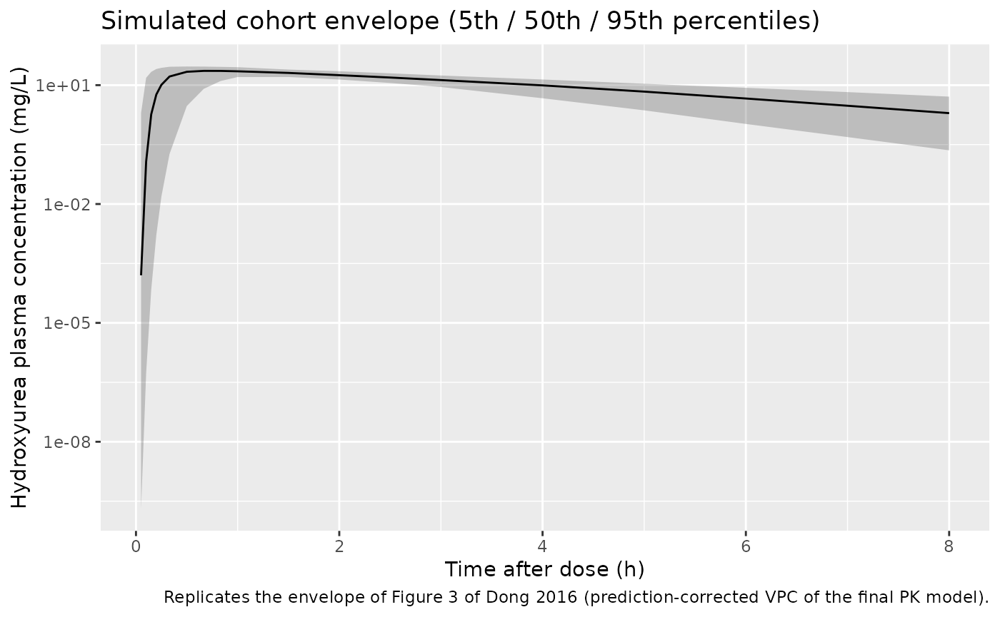
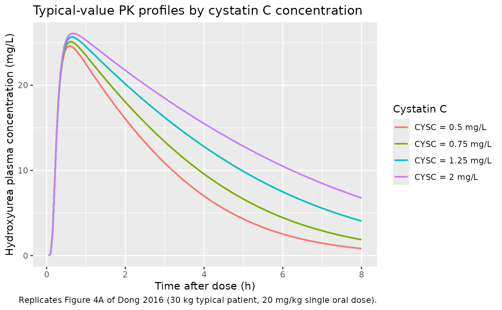

# Hydroxyurea (Dong 2016)

## Model and source

- Citation: Dong M, McGann PT, Mizuno T, Ware RE, Vinks AA (2016).
  Development of a pharmacokinetic-guided dose individualization
  strategy for hydroxyurea treatment in children with sickle cell
  anaemia. Br J Clin Pharmacol 81(4):742-752. <doi:10.1111/bcp.12851>.
- Description: One-compartment population PK model for oral hydroxyurea
  in pediatric patients with sickle cell anaemia (Dong 2016, HUSTLE
  trial NCT00305175; n = 96 children aged 1.2-16.6 years on a 20 mg/kg
  starting dose, all African-American). Saturable Michaelis-Menten
  elimination from the central compartment (Vmax 490 mg/h per 70 kg, Km
  fixed at 25 mg/L based on a prior report) with allometric scaling of
  Vmax (exponent 0.75 fixed) and apparent central volume V/F (exponent
  1.0 fixed) on total body weight (reference 70 kg). Cystatin C is a
  power-model covariate on Vmax (exponent -0.509, reference 0.74 mg/L),
  and was the only covariate retained over serum creatinine, eGFR, and
  direct 99mTc-DTPA-measured GFR. Oral absorption is described by a
  Savic 2007 transit-compartment chain (NN = 12.4 transit compartments
  fitted, MTT = 0.158 h) feeding a depot with first-order absorption Ka
  = 8.19 /h. Residual error is combined additive (0.117 mg/L) and
  proportional (39.7% CV).
- Article: [Br J Clin Pharmacol 81(4):742-752
  (2016)](https://doi.org/10.1111/bcp.12851)

## Population

Hydroxyurea pharmacokinetics were characterised in 96 children with
sickle cell anaemia enrolled in the HUSTLE trial (NCT00305175) at
St. Jude Children’s Research Hospital. Patients ranged from 1.2 to 16.6
years old (median 8.8 years) and 8.8 to 88.3 kg (median 26.6 kg). The
cohort was 63.5% male (61 of 96) and 100% African American by
self-report (96 of 96; Dong 2016 Table 1).

All subjects received a single oral 20 mg/kg hydroxyurea dose on study
day 1 (most as a liquid; 10 received capsules); 63 of the 96 patients
later contributed paired profiles at their individual maximum tolerated
dose (MTD, median 23.4 mg/kg/day, range 14.2-35.5). Renal function was
characterised by direct 99mTc-DTPA-measured GFR (median 153 mL/min,
range 77-308), serum creatinine, Schwartz-formula estimated creatinine
clearance, and serum cystatin C (median 0.74 mg/L, range 0.57-1.25);
only cystatin C was retained as a clearance covariate after backward
elimination.

The same information is available programmatically via the model’s
`population` metadata
(`readModelDb("Dong_2016_hydroxyurea")$population`).

## Source trace

The per-parameter origin is recorded as an in-file comment next to each
`ini()` entry in `inst/modeldb/specificDrugs/Dong_2016_hydroxyurea.R`.
The table below collects them in one place for review.

| Equation / parameter | Value | Source location |
|----|----|----|
| `lvmax` (typical Vmax at WT 70 kg, CYSC 0.74 mg/L) | log(490) | Dong 2016 Table 2, theta1 row (RSE 2%) |
| `lkm` (Michaelis-Menten constant Km, fixed) | log(25) | Dong 2016 Table 2 ‘Km, mg/L = 25, Fixed’; Results paragraph 3 |
| `lvc` (typical V/F at WT 70 kg) | log(49.6) | Dong 2016 Table 2, theta3 row (RSE 2%) |
| `lka` (typical absorption rate constant) | log(8.19) | Dong 2016 Table 2, Ka row (RSE 21%) |
| `lmtt` (typical mean transit time) | log(0.158) | Dong 2016 Table 2, MTT row (RSE 15%) |
| `lnn` (typical number of transit compartments) | log(12.4) | Dong 2016 Table 2, N row (RSE 15%) |
| `lfdepot` (oral bioavailability F, fixed at 1) | log(1) | Apparent CL/F + V/F parameterisation; absolute F not estimable from oral-only data |
| `allo_vmax` (allometric exponent on Vmax, fixed) | 0.75 | Dong 2016 Table 2 ‘Vmax = theta1 \* (WT/70)^0.75’; Results paragraph 4 |
| `allo_vc` (allometric exponent on V/F, fixed) | 1.00 | Dong 2016 Table 2 ‘V/F = theta3 \* (WT/70)’; Results paragraph 4 |
| `e_cysc_vmax` (power exponent of CYSC on Vmax) | -0.509 | Dong 2016 Table 2, theta2 row (RSE 20%) |
| `etalvmax` variance, log scale | 0.020807 | Dong 2016 Table 2 ‘omega(Vmax) = 14.5 %CV’; omega^2 = log(1 + 0.145^2) |
| `etalvc` variance, log scale | 0.018061 | Dong 2016 Table 2 ‘omega(V/F) = 13.5 %CV’ |
| `etalka` variance, log scale | 0.764975 | Dong 2016 Table 2 ‘omega(Ka) = 107.2 %CV’ |
| `etalmtt` variance, log scale | 0.528000 | Dong 2016 Table 2 ‘omega(MTT) = 83.4 %CV’ |
| `addSd` (additive residual SD) | 0.117 mg/L | Dong 2016 Table 2 ‘sigma_add = 0.117 (RSE 5.4%)’ |
| `propSd` (proportional residual SD as fraction) | 0.397 | Dong 2016 Table 2 ‘sigma_prop = 39.7 %CV (RSE 5.7%)’ |
| Equation: `d/dt(depot) = transit(nn, mtt, fdepot) - ka * depot` | n/a | Dong 2016 Results paragraph 3 (‘a transit absorption model’); Savic 2007 form |
| Equation: `d/dt(central) = ka * depot - vmax * Cc / (km + Cc)` | n/a | Dong 2016 Results paragraph 3 / Equation 8 |

## Virtual cohort

Original observed data are not publicly available. The simulations below
use a virtual cohort whose body-weight and cystatin C distributions
approximate the Dong 2016 day-1 baseline demographics (Table 1).

``` r

set.seed(20160416)  # arbitrary fixed seed for reproducibility

n_subj <- 200L

# Body weight: lognormal centred on the cohort median 26.6 kg, scale matching
# the Table 1 range 8.8 to 88.3 kg under a log-normal sigma of about 0.55.
# Cystatin C: lognormal centred on the cohort median 0.74 mg/L, scale matching
# the Table 1 range 0.57 to 1.25 mg/L under a log-normal sigma of about 0.18.
cohort <- tibble(
  id   = seq_len(n_subj),
  WT   = pmin(pmax(stats::rlnorm(n_subj, meanlog = log(26.6), sdlog = 0.55), 8.8), 88.3),
  CYSC = pmin(pmax(stats::rlnorm(n_subj, meanlog = log(0.74), sdlog = 0.18), 0.57), 1.25)
) |>
  mutate(treatment = "20 mg/kg single dose")

# Dose rows: one 20 mg/kg dose into central via the depot, at t = 0. The model
# routes dose-event amount through transit() into depot, so cmt = "depot" is
# the correct ODE state name.
dose_rows <- cohort |>
  transmute(id,
            time = 0,
            evid = 1L,
            cmt  = "depot",
            amt  = 20 * WT,
            WT, CYSC, treatment)

# Observation rows: a rich sampling grid matching the Dong 2016 day-1 schedule
# (predose, 20 min, 40 min, 1, 2, 4, 6, 8 h) plus interpolation for plotting.
# cmt = "central" is the ODE state; rxode2 reports Cc (algebraic observable)
# automatically.
obs_grid <- c(0, 0.05, 0.1, 0.15, 0.2, 0.25, 0.33, 0.5, 0.667, 0.833, 1, 1.5,
              2, 2.5, 3, 4, 5, 6, 7, 8)

obs_rows <- cohort |>
  tidyr::crossing(time = obs_grid) |>
  mutate(evid = 0L,
         cmt  = "central",
         amt  = NA_real_) |>
  select(id, time, evid, cmt, amt, WT, CYSC, treatment)

events <- bind_rows(dose_rows, obs_rows) |>
  arrange(id, time, desc(evid))

stopifnot(!anyDuplicated(unique(events[, c("id", "time", "evid")])))
```

## Simulation

``` r

mod <- readModelDb("Dong_2016_hydroxyurea")
sim <- rxode2::rxSolve(mod, events = events,
                       keep = c("WT", "CYSC", "treatment")) |>
  as.data.frame()
#> ℹ parameter labels from comments will be replaced by 'label()'
```

## Replicate published figures

### Cohort concentration-time profiles after 20 mg/kg (Figure 3 envelope)

Dong 2016 Figure 3 shows a prediction-corrected VPC for the final PK
model. We reproduce the envelope here by plotting the simulated 5th,
50th, and 95th percentiles of the 200-subject cohort across the 8-hour
post-dose window.

``` r

sim |>
  filter(time > 0) |>
  group_by(time) |>
  summarise(Q05 = quantile(Cc, 0.05, na.rm = TRUE),
            Q50 = quantile(Cc, 0.50, na.rm = TRUE),
            Q95 = quantile(Cc, 0.95, na.rm = TRUE),
            .groups = "drop") |>
  ggplot(aes(time, Q50)) +
  geom_ribbon(aes(ymin = Q05, ymax = Q95), alpha = 0.25) +
  geom_line() +
  scale_y_log10() +
  labs(x = "Time after dose (h)",
       y = "Hydroxyurea plasma concentration (mg/L)",
       title = "Simulated cohort envelope (5th / 50th / 95th percentiles)",
       caption = paste(
         "Replicates the envelope of Figure 3 of Dong 2016",
         "(prediction-corrected VPC of the final PK model)."))
```



### Effect of cystatin C on concentration-time profiles (Figure 4A)

Dong 2016 Figure 4A shows simulated typical-value concentration-time
profiles for a 30 kg patient given 20 mg/kg, at four cystatin C
concentrations: 0.5, 0.75, 1.25, and 2.0 mg/L. We reproduce the figure
here by simulating the typical-value model (between-subject variability
suppressed via `zeroRe()`) across the same four CYSC levels.

``` r

typ_mod <- mod |> rxode2::zeroRe()
#> ℹ parameter labels from comments will be replaced by 'label()'

typ_cohort <- tibble(
  id    = seq_along(c(0.5, 0.75, 1.25, 2.0)),
  WT    = 30,
  CYSC  = c(0.5, 0.75, 1.25, 2.0),
  treatment = paste0("CYSC = ", CYSC, " mg/L")
)

typ_obs <- typ_cohort |>
  tidyr::crossing(time = seq(0, 8, by = 0.05)) |>
  mutate(evid = 0L, cmt = "central", amt = NA_real_)

typ_dose <- typ_cohort |>
  transmute(id, time = 0, evid = 1L, cmt = "depot", amt = 20 * WT,
            WT, CYSC, treatment)

typ_events <- bind_rows(typ_dose, typ_obs) |>
  arrange(id, time, desc(evid))

typ_sim <- rxode2::rxSolve(typ_mod, events = typ_events,
                           keep = c("WT", "CYSC", "treatment")) |>
  as.data.frame()
#> ℹ omega/sigma items treated as zero: 'etalvmax', 'etalvc', 'etalka', 'etalmtt'
#> Warning: multi-subject simulation without without 'omega'

typ_sim |>
  filter(time > 0) |>
  ggplot(aes(time, Cc, colour = treatment)) +
  geom_line(size = 0.8) +
  labs(x = "Time after dose (h)",
       y = "Hydroxyurea plasma concentration (mg/L)",
       colour = "Cystatin C",
       title = "Typical-value PK profiles by cystatin C concentration",
       caption = paste(
         "Replicates Figure 4A of Dong 2016 (30 kg typical patient,",
         "20 mg/kg single oral dose)."))
#> Warning: Using `size` aesthetic for lines was deprecated in ggplot2 3.4.0.
#> ℹ Please use `linewidth` instead.
#> This warning is displayed once per session.
#> Call `lifecycle::last_lifecycle_warnings()` to see where this warning was
#> generated.
```



## PKNCA validation

We use PKNCA (Recipe 1, single-dose dense sampling) to compute
AUC(0-inf), Cmax, Tmax, and terminal half-life for the simulated
200-subject cohort and compare against the published day-1 mean
AUC(0-inf) of 91.1 mg/L\*h reported by Dong 2016 Results paragraph 1
(‘the AUC(0,inf) distribution at MTD was shifted from a mean value of
91.1 to 115.7 mg l-1 h-1 compared with day 1’).

``` r

sim_nca <- sim |>
  dplyr::filter(!is.na(Cc)) |>
  dplyr::select(id, time, Cc, treatment)

# Defensive time-zero rows: extravascular pre-dose concentration is 0.
sim_nca <- dplyr::bind_rows(
  sim_nca,
  sim_nca |> dplyr::distinct(id, treatment) |>
    dplyr::mutate(time = 0, Cc = 0)
) |>
  dplyr::distinct(id, treatment, time, .keep_all = TRUE) |>
  dplyr::arrange(id, treatment, time)

conc_obj <- PKNCA::PKNCAconc(sim_nca, Cc ~ time | treatment + id,
                             concu = "mg/L", timeu = "h")
#> Warning in assert_conc(conc, any_missing_conc = any_missing_conc): Negative
#> concentrations found

dose_df <- dose_rows |>
  dplyr::select(id, time, amt, treatment)

dose_obj <- PKNCA::PKNCAdose(dose_df, amt ~ time | treatment + id,
                             doseu = "mg")

intervals <- data.frame(
  start       = 0,
  end         = Inf,
  cmax        = TRUE,
  tmax        = TRUE,
  aucinf.obs  = TRUE,
  half.life   = TRUE
)

nca_res <- PKNCA::pk.nca(PKNCA::PKNCAdata(conc_obj, dose_obj,
                                          intervals = intervals))
#> Warning in assert_conc(conc = conc): Negative concentrations found
#> Warning in assert_conc(conc = conc): Negative concentrations found
#> Warning in assert_conc(conc = conc): Negative concentrations found
#> Warning in assert_conc(conc = conc): Negative concentrations found
#> Warning in assert_conc(conc = conc): Negative concentrations found
#> Warning in assert_conc(conc = conc): Negative concentrations found
#> Warning in log(data$conc): NaNs produced
#> Warning in assert_conc(conc, any_missing_conc = any_missing_conc): Negative
#> concentrations found
#> Warning in log(conc.2/conc.1): NaNs produced
```

### Comparison against published NCA

Dong 2016 Results paragraph 1 reports cohort-mean AUC(0-inf) of 91.1
mg/L\*h on day 1 (n = 96 children given a single 20 mg/kg dose). The
paper does not publish a cohort-mean Cmax, Tmax, or terminal half-life
for the day-1 dose, so the comparison table includes only AUC(0-inf).
Apparent terminal half-life under saturable Michaelis-Menten elimination
is concentration-dependent and is reported here as the simulated value,
not a paper-derived reference.

``` r

published <- tibble::tribble(
  ~treatment,                 ~aucinf.obs,
  "20 mg/kg single dose",     91.1
)

cmp <- nlmixr2lib::ncaComparisonTable(
  simulated     = nca_res,
  reference     = published,
  by            = "treatment",
  units         = c(aucinf.obs = "mg*h/L"),
  tolerance_pct = 20
)

knitr::kable(
  cmp,
  caption = paste(
    "Simulated vs. published NCA after a single 20 mg/kg oral dose.",
    "* differs from reference by >20%."),
  align   = c("l", "l", "r", "r", "r")
)
```

| NCA parameter          | treatment            | Reference | Simulated | % diff |
|:-----------------------|:---------------------|----------:|----------:|-------:|
| AUC0-∞ (obs) (mg\*h/L) | 20 mg/kg single dose |      91.1 |      89.8 |  -1.4% |

Simulated vs. published NCA after a single 20 mg/kg oral dose. \*
differs from reference by \>20%. {.table style="width:100%;"}

## Assumptions and deviations

- **Race distribution.** The HUSTLE cohort is 100% African American
  (Dong 2016 Table 1). The model does not include race as a covariate
  (only WT and CYSC survived backward elimination), so the virtual
  cohort does not assign a race column. Users simulating in other
  populations should reconsider whether the reference cystatin C of 0.74
  mg/L and the Vmax estimate of 490 mg/h per 70 kg generalise to
  non-African-American or adult cohorts.
- **Body weight and cystatin C distribution.** The virtual cohort draws
  WT and CYSC from independent log-normal distributions clamped to the
  Table 1 observed ranges. The Dong 2016 paper does not publish the
  joint distribution or the WT-CYSC correlation, so the simulated
  covariate joint distribution is an approximation.
- **Apparent terminal half-life.** Under Michaelis-Menten elimination
  the apparent terminal half-life is concentration-dependent (longer at
  high Cc, shorter as Cc falls well below Km = 25 mg/L). The PKNCA
  half-life column reports the simulated terminal regression-line
  estimate at the day-1 dose level and is not compared against a
  paper-reported reference.
- **Reference subject for Vmax.** Vmax in the model file is reported at
  the cohort medians WT = 70 kg AND CYSC = 0.74 mg/L. The reference
  cystatin C value (0.74 mg/L) is the cohort median per Dong 2016 Table
  1; users simulating in adult populations or in patients with renal
  impairment should recompute the per-subject Vmax with the (CYSC /
  0.74)^(-0.509) power-model scaling using their own measured cystatin
  C.
- **Apparent CL/F vs apparent CL.** Hydroxyurea PK data in Dong 2016 are
  oral-only, so all reported parameters are apparent (CL/F, V/F).
  Bioavailability F is anchored at 1 (`lfdepot <- fixed(log(1))`) and is
  not separately estimable.
