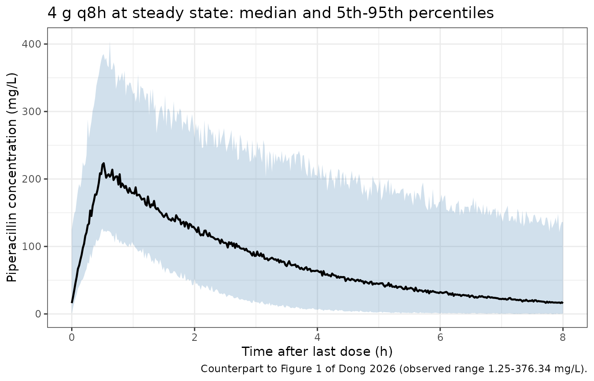
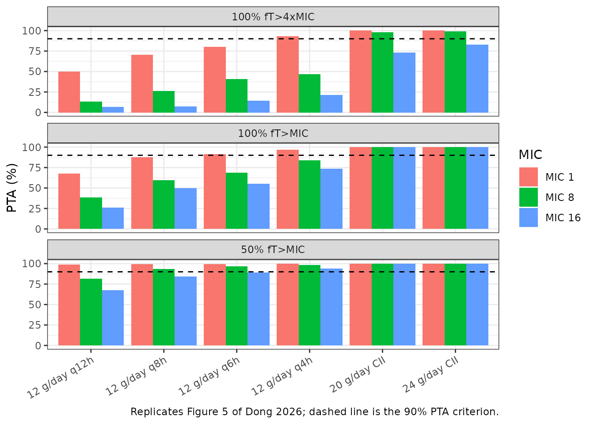

# Piperacillin (Dong 2026)

## Model and source

``` r

ui <- rxode2::rxode(readModelDb("Dong_2026_piperacillin"))
#> ℹ parameter labels from comments will be replaced by 'label()'
```

- Citation: Dong Z, Shi H, Yang Y, Yi Q, Jiang Z, Li Y (2026).
  Population pharmacokinetics and dosing regimen optimization of
  piperacillin in critically ill patients. Drug Des Devel Ther 20.
  <doi:10.2147/DDDT.S551307>.
- Description: One-compartment population PK model for intravenous
  piperacillin in critically ill adults (Dong 2026; n = 42 Chinese ICU
  patients, 117 steady-state plasma concentrations spanning 1.25-376.34
  mg/L). Linear first-order elimination from a single central
  compartment. Clearance carries two covariates – cystatin-C-based
  CKD-EPI estimated glomerular filtration rate centred on 46.56
  mL/min/1.73 m^2 (exponent 0.615) and total body weight centred on 70
  kg (exponent 1.13) – and central volume carries serum albumin centred
  on 34.8 g/L (exponent 1.21). Exponential inter-individual variability
  on CL and V; combined proportional-plus- additive residual error.
  Patients on continuous renal replacement therapy were excluded, so the
  model carries no information about extracorporeal clearance.
- Article: <https://doi.org/10.2147/DDDT.S551307>

Dong and colleagues fit a one-compartment model with first-order
elimination to 117 steady-state plasma piperacillin concentrations from
42 critically ill adults in a single Chinese intensive care unit.
Clearance carries a cystatin-C-based CKD-EPI estimated glomerular
filtration rate and total body weight; central volume carries serum
albumin. All three covariates enter as power functions centred on their
cohort medians.

## Population

The cohort (Tables 1 and 2 of the source) was 42 ICU patients, 30 male
and 12 female, with a median age of 59 years (IQR 50.25-75.5), median
total body weight 70 kg (IQR 65-75) and median BMI 24.22 kg/m^2 (IQR
22.41-26.12). Median APACHE II score was 21.5 (IQR 19-26); 85.71% were
mechanically ventilated and 85.71% were receiving a vasopressor.
Pulmonary infection predominated (92.86%), and *Pseudomonas aeruginosa*
was the most common isolate (26.19%). Almost all patients (92.86%)
received 4 g piperacillin q8h by intravenous infusion.

Renal function is the striking feature of this cohort, and it is why the
choice of estimating equation matters. The median 2012 CKD-EPI
**cystatin-C** eGFR – the equation the final model uses – is 46.56
mL/min/1.73 m^2 (IQR 26.88-68.26), whereas the same patients’ median
**creatinine**-based estimates are roughly twice as high (2021 CKD-EPI
creatinine 93.32; abbreviated MDRD 107.30; MDRD CHN 112.63). The authors
screened Cockcroft-Gault, MDRD, CKD-EPIcr, CKD-EPIcys and CKD-EPIcr-cys
and retained CKD-EPIcys because it gave the largest objective function
drop, reasoning that creatinine is confounded by muscle mass and
systemic inflammation in critical illness. **A user supplying real data
must use the cystatin-C equation**; substituting a creatinine-based eGFR
for the same patient would roughly double the covariate and inflate
predicted clearance.

Patients on continuous renal replacement therapy were excluded, so the
model carries no information about extracorporeal clearance.

``` r

str(ui$population, max.level = 1)
#> List of 16
#>  $ species       : chr "human"
#>  $ n_subjects    : int 42
#>  $ n_studies     : int 1
#>  $ n_observations: int 117
#>  $ age_range     : chr "not reported; interquartile range 50.25-75.5 years"
#>  $ age_median    : chr "59 years"
#>  $ weight_range  : chr "not reported; interquartile range 65-75 kg"
#>  $ weight_median : chr "70 kg"
#>  $ sex_female_pct: num 28.6
#>  $ race_ethnicity: Named num 100
#>   ..- attr(*, "names")= chr "Asian"
#>  $ disease_state : chr "Adults admitted to the intensive care unit and treated with piperacillin. Pulmonary infection predominated (92."| __truncated__
#>  $ dose_range    : chr "Intravenous piperacillin 4 g q8h by infusion in 39 of 42 patients (92.86%, 12 g/day), 4 g q8h by intravenous pu"| __truncated__
#>  $ renal_function: chr "Markedly discordant between markers. Median 2012 CKD-EPI cystatin-C eGFR 46.56 mL/min/1.73 m^2 (IQR 26.88-68.26"| __truncated__
#>  $ sampling      : chr "Sparse steady-state sampling after at least five piperacillin doses, 2-3 samples per patient: a trough 30 minut"| __truncated__
#>  $ regions       : chr "People's Republic of China (single centre; intensive care unit of the First Affiliated Hospital of Shandong Fir"| __truncated__
#>  $ notes         : chr "Baseline demographics from Dong 2026 Tables 1 and 2. Prospective observational single-centre study running Sept"| __truncated__
```

## Source trace

The per-parameter origin is recorded as an in-file comment next to each
`ini()` entry in `inst/modeldb/specificDrugs/Dong_2026_piperacillin.R`.
The table below collects them in one place.

A note on retrieval: the two final-model equations are set as **vector
graphics** on page 6 of the PDF and carry no text layer, so they are
invisible to `pdftotext` and absent from every text conversion of this
paper. They were read from a rendered image of the page. They are the
only source for the three centring constants, and – as the omega-scale
check below shows – the only thing that settles the scale of the
inter-individual variability column.

| Equation / parameter | Value | Source location |
|----|----|----|
| `lcl` (CL) | 6.48 L/h | Table 3, “CL (L/h)”; leading coefficient of the p. 6 CL equation |
| `lvc` (V) | 19 L | Table 3, “V (L)”; leading coefficient of the p. 6 V equation |
| `e_crcl_cl` | 0.615 | Table 3, “eGFR on CL”; exponent in the p. 6 CL equation |
| `e_wt_cl` | 1.13 | Table 3, “Total body weight on CL”; exponent in the p. 6 CL equation |
| `e_alb_vc` | 1.21 | Table 3, “Albumin on V”; exponent in the p. 6 V equation |
| eGFR centring constant | 46.56 mL/min/1.73 m^2 | p. 6 CL equation denominator; equals the Table 1 median for “2012 CKD-EPI CYS-C” |
| Weight centring constant | 70 kg | p. 6 CL equation denominator; equals the Table 1 median total body weight |
| Albumin centring constant | 34.8 g/L | p. 6 V equation denominator; equals the Table 1 median albumin |
| `etalcl` | 0.114 | p. 6 CL equation factor `e^0.114`; = 0.338^2 from Table 3 “IIV-CL (%)” 33.8 |
| `etalvc` | 0.069 | p. 6 V equation factor `e^0.069`; = 0.263^2 from Table 3 “IIV-V (%)” 26.3 |
| `propSd` | 0.177 | Table 3, “RSV_CV (%)” 17.7; footnote defines RSV_CV as proportional |
| `addSd` | 1.2 mg/L | Table 3, “RSV_SD (mg/L)” 1.2; footnote defines RSV_SD as additive |
| `d/dt(central)` (1-cmt, first-order) | n/a | Results, “Population Pharmacokinetics Model Development” |
| Combined residual error | n/a | Results: “residual variability were best described by a combined model” |

### Check 1 – the scale of the inter-individual variability column

Table 3 labels the IIV rows `IIV-CL (%) = 33.8` and `IIV-V (%) = 26.3`.
A bare percentage is ambiguous between a log-scale standard deviation
and a lognormal coefficient of variation, and the two readings differ
enough to matter. The paper’s own printed equations resolve it: they
carry the literal factors `e^0.114` on CL and `e^0.069` on V, which are
the eta terms with the fitted variance substituted for the random draw.
Only the SD reading reproduces them.

``` r

iiv_pct <- c(CL = 33.8, V = 26.3)      # Table 3
printed  <- c(CL = 0.114, V = 0.069)   # p. 6 equation factors e^0.114 and e^0.069

omega_scale <- tibble::tibble(
  Parameter = names(iiv_pct),
  `Printed equation exponent` = printed,
  `SD reading: (IIV/100)^2` = round((iiv_pct / 100)^2, 4),
  `CV reading: log(1+(IIV/100)^2)` = round(log(1 + (iiv_pct / 100)^2), 4),
  `Encoded` = c(ui$omega["etalcl", "etalcl"], ui$omega["etalvc", "etalvc"])
)
knitr::kable(omega_scale, digits = 4,
             caption = "The printed equation exponents match the SD reading, not the CV reading.")
```

| Parameter | Printed equation exponent | SD reading: (IIV/100)^2 | CV reading: log(1+(IIV/100)^2) | Encoded |
|:---|---:|---:|---:|---:|
| CL | 0.114 | 0.1142 | 0.1082 | 0.114 |
| V | 0.069 | 0.0692 | 0.0669 | 0.069 |

The printed equation exponents match the SD reading, not the CV reading.
{.table}

``` r


# Deterministic: the SD reading must reproduce the printed exponents to the
# 3 decimals they are printed at, and the CV reading must NOT.
stopifnot(
  all(abs(round((iiv_pct / 100)^2, 3) - printed) < 1e-9),
  all(abs(round(log(1 + (iiv_pct / 100)^2), 3) - printed) > 0),
  # and the model file encodes the printed values themselves
  abs(ui$omega["etalcl", "etalcl"] - 0.114) < 1e-12,
  abs(ui$omega["etalvc", "etalvc"] - 0.069) < 1e-12
)
```

Read the other way round, an omega^2 of 0.114 implies a lognormal CV of
34.7%, not the tabulated 33.8%. The tabulated percentages are therefore
`100 * omega`.

## Virtual cohort

Original observed data are not publicly available. The cohort below
reproduces the Table 1 marginal distributions: each covariate is drawn
lognormally with the published median as its median and the published
interquartile range setting its spread. The paper does not publish the
joint covariate distribution it simulated from, nor any correlation
between eGFR, weight and albumin, so the three are drawn independently –
this is an assumption, recorded again under *Assumptions and
deviations*.

``` r

# set.seed() seeds R's RNG, not rxode2's; rxode2 partitions its streams per
# solver thread, so a 2-core CI runner draws a different cohort than a
# 16-thread workstation. Every assertion below is written to hold for any
# cohort the model can produce (see known-vignette-failure-patterns.md #12).
set.seed(20260912)
rxode2::rxSetSeed(20260912)

n_sub <- 200L   # cap is 200 per arm
qn <- qnorm(0.75)

# Lognormal spread implied by a published median and IQR.
sd_from_iqr <- function(q25, q75) log(q75 / q25) / (2 * qn)

cohort <- tibble::tibble(
  id   = seq_len(n_sub),
  # Table 1: 2012 CKD-EPI CYS-C 46.56 (26.88-68.26) mL/min/1.73 m^2
  CRCL = 46.56 * exp(rnorm(n_sub, 0, sd_from_iqr(26.88, 68.26))),
  # Table 1: total body weight 70 (65-75) kg
  WT   = 70    * exp(rnorm(n_sub, 0, sd_from_iqr(65, 75))),
  # Table 1: albumin 34.8 (32.7-39.2) g/L
  ALB  = 34.8  * exp(rnorm(n_sub, 0, sd_from_iqr(32.7, 39.2)))
)

knitr::kable(
  cohort |>
    tidyr::pivot_longer(-id, names_to = "Covariate", values_to = "v") |>
    group_by(Covariate) |>
    summarise(Median = median(v), Q25 = quantile(v, .25), Q75 = quantile(v, .75),
              .groups = "drop") |>
    dplyr::rename("25th pctile" = Q25, "75th pctile" = Q75),
  digits = 2, caption = "Simulated cohort vs. the Table 1 medians (46.56, 70, 34.8) and IQRs."
)
```

| Covariate | Median | 25th pctile | 75th pctile |
|:----------|-------:|------------:|------------:|
| ALB       |  34.66 |       32.21 |       37.32 |
| CRCL      |  46.63 |       27.87 |       72.25 |
| WT        |  68.78 |       64.87 |       74.16 |

Simulated cohort vs. the Table 1 medians (46.56, 70, 34.8) and IQRs.
{.table}

``` r

# Build an event table for one regimen across the whole cohort.
#   daily_mg : total daily dose in mg
#   tau      : dosing interval in h, or NA for continuous intravenous infusion
#   dur      : infusion duration in h for intermittent regimens
# Observations are written on the ODE state `central`; rxode2 returns the
# algebraic observable as a column at those rows. Naming an observable as a
# compartment instead would inject a slot and renumber the ODE states.
# `days` sets the dosing horizon before the sampled interval. It is 10 rather
# than the 2-3 that the typical subject needs, because the lognormal eGFR tail
# produces subjects with a clearance near 1.7 L/h and a half-life near 12 h;
# those subjects are still approaching steady state at 72 h, which shows up as
# a mass-balance residual in Check 3 rather than as any visible artefact.
make_events <- function(cohort, daily_mg, tau, dur = 0.5, days = 10,
                        obs_by = 0.02, label = NULL) {
  horizon <- 24 * days
  if (is.na(tau)) {
    ev <- rxode2::et(amt = daily_mg * days, dur = horizon, cmt = "central")
    win <- 8                                   # any window; Css is flat
  } else {
    ndose <- ceiling(horizon / tau)
    ev <- rxode2::et(amt = daily_mg * tau / 24, dur = dur,
                     ii = tau, addl = ndose - 1L, cmt = "central")
    win <- tau                                 # one full steady-state interval
  }
  # Sample the LAST complete interval inside the dosing horizon.
  t0 <- horizon - 24
  ev <- rxode2::et(ev, seq(t0, t0 + win, by = obs_by), cmt = "central")
  ev <- as.data.frame(ev)
  out <- merge(cbind(cohort, .k = 1L), cbind(ev, .k = 1L), by = ".k")
  out$.k <- NULL
  if (!is.null(label)) out$regimen <- label
  out[order(out$id, out$time), ]
}
```

## Simulation

``` r

mod <- readModelDb("Dong_2026_piperacillin")

# The clinical regimen: 4 g q8h as a 30-min infusion (92.86% of the cohort,
# Table 2; the paper's simulations standardise intermittent infusions at 30 min).
ev_q8h <- make_events(cohort, daily_mg = 12000, tau = 8, label = "4 g q8h")
sim <- rxode2::rxSolve(mod, events = ev_q8h, keep = c("CRCL", "WT", "ALB", "regimen")) |>
  as.data.frame()
#> ℹ parameter labels from comments will be replaced by 'label()'
stopifnot(nrow(sim) > 0, !all(is.na(sim$Cc)))
```

### Check 2 – covariate algebra reproduces the printed equations exactly

`rxSolve` returns the realised per-subject `cl` and `vc`. With the
random effects zeroed they must equal the paper’s p. 6 equations
evaluated at each subject’s covariates. This is deterministic – no
cohort noise – so it is asserted tightly, and it is the check that would
catch a mis-transcribed exponent or centring constant.

``` r

sim_typ <- rxode2::rxSolve(rxode2::zeroRe(mod), events = ev_q8h,
                           keep = c("CRCL", "WT", "ALB")) |>
  as.data.frame()
#> ℹ parameter labels from comments will be replaced by 'label()'
#> ℹ omega/sigma items treated as zero: 'etalcl', 'etalvc'
#> Warning: multi-subject simulation without without 'omega'

chk <- sim_typ |>
  distinct(id, CRCL, WT, ALB, cl, vc) |>
  mutate(
    # Dong 2026 p. 6, with the e^omega^2 eta factor set to 1 (typical subject)
    cl_paper = 6.48 * (CRCL / 46.56)^0.615 * (WT / 70)^1.13,
    vc_paper = 19   * (ALB  / 34.8)^1.21,
    cl_relerr = abs(cl - cl_paper) / cl_paper,
    vc_relerr = abs(vc - vc_paper) / vc_paper
  )

stopifnot(nrow(chk) == n_sub,                 # guard: the check had rows to test
          max(chk$cl_relerr) < 1e-8,
          max(chk$vc_relerr) < 1e-8)

knitr::kable(
  chk |> slice_head(n = 5) |>
    select(id, CRCL, WT, ALB, cl, cl_paper, vc, vc_paper) |>
    dplyr::rename("eGFR" = CRCL, "CL (model)" = cl, "CL (p. 6 equation)" = cl_paper,
                  "V (model)" = vc, "V (p. 6 equation)" = vc_paper),
  digits = 3,
  caption = "First five subjects: model-realised CL and V against the paper's printed equations (max relative error over all 200 subjects < 1e-8)."
)
```

| id | eGFR | WT | ALB | CL (model) | CL (p. 6 equation) | V (model) | V (p. 6 equation) |
|---:|---:|---:|---:|---:|---:|---:|---:|
| 1 | 119.110 | 71.192 | 39.903 | 11.769 | 11.769 | 22.421 | 22.421 |
| 2 | 14.395 | 55.960 | 40.817 | 2.444 | 2.444 | 23.044 | 23.044 |
| 3 | 59.964 | 76.869 | 36.554 | 8.416 | 8.416 | 20.165 | 20.165 |
| 4 | 50.104 | 65.976 | 30.441 | 6.340 | 6.340 | 16.159 | 16.159 |
| 5 | 133.951 | 75.878 | 36.635 | 13.595 | 13.595 | 20.219 | 20.219 |

First five subjects: model-realised CL and V against the paper’s printed
equations (max relative error over all 200 subjects \< 1e-8). {.table}

### Check 3 – steady-state mass balance

At steady state the amount cleared over one dosing interval must equal
the dose delivered in that interval: `CL * AUC(0-tau) = dose`. This is
an exact identity for a linear one-compartment model, so it is asserted
tightly. It is worth running because it fails loudly if the ODE is ever
short-circuited – for instance by rxode2 auto-solving a `cl`/`vc` pair
and discarding the explicit `d/dt`, or by a bioavailability term zeroing
the input.

``` r

mb <- sim_typ |>
  filter(!is.na(Cc)) |>
  group_by(id, cl) |>
  arrange(time, .by_group = TRUE) |>
  summarise(
    auctau = sum(diff(time) * (head(Cc, -1) + tail(Cc, -1)) / 2),
    .groups = "drop"
  ) |>
  mutate(recovered = cl * auctau / 4000)   # 4 g per q8h interval

# Tolerance covers trapezoidal error on the 0.02 h grid plus the last traces of
# accumulation in the slowest-clearing subjects. It is far tighter than any
# structural break would produce: auto-solving the ODE away or zeroing the
# input moves this to 0 or by whole percent, not by 0.2%.
stopifnot(nrow(mb) == n_sub, max(abs(mb$recovered - 1)) < 2e-3)
cat(sprintf("CL * AUCtau / dose: min %.6f, max %.6f (exact identity = 1)\n",
            min(mb$recovered), max(mb$recovered)))
#> CL * AUCtau / dose: min 0.999998, max 1.000000 (exact identity = 1)
```

## Replicate published figures

### Figure 1 – concentration versus time after the last dose

Figure 1 of the source plots all 117 observed concentrations against
time since the last dose, for the clinical 4 g q8h regimen. Observed
values span 1.25-376.34 mg/L and the visible cloud falls away from
roughly 375 mg/L near the end of infusion to single digits by 10-12 h.
The simulated interval below is the model’s counterpart, with residual
error applied so that the spread is comparable to observed data.

``` r

sim |>
  filter(!is.na(Cc)) |>
  mutate(tsld = time - min(time)) |>
  group_by(tsld) |>
  summarise(Q05 = quantile(sim, 0.05), Q50 = quantile(sim, 0.50),
            Q95 = quantile(sim, 0.95), .groups = "drop") |>
  ggplot(aes(tsld, Q50)) +
  geom_ribbon(aes(ymin = Q05, ymax = Q95), alpha = 0.25, fill = "steelblue") +
  geom_line(linewidth = 0.8) +
  labs(x = "Time after last dose (h)", y = "Piperacillin concentration (mg/L)",
       title = "4 g q8h at steady state: median and 5th-95th percentiles",
       caption = "Counterpart to Figure 1 of Dong 2026 (observed range 1.25-376.34 mg/L).") +
  theme_bw()
```



``` r

# `sim$sim` is the residual-error-perturbed observation; `sim$Cc` is the
# error-free individual prediction.
dv <- sim$sim[!is.na(sim$sim)]
cat(sprintf("Simulated 4 g q8h steady-state interval: 1st pctile %.2f, 99th pctile %.1f mg/L\n",
            quantile(dv, 0.01), quantile(dv, 0.99)))
#> Simulated 4 g q8h steady-state interval: 1st pctile -0.15, 99th pctile 366.4 mg/L
# The observed 1.25-376.34 mg/L range pools every sample from every patient and
# every regimen, so it is an envelope rather than a per-percentile target. Assert
# only that the simulated interval lands inside a plausible multiple of it.
stopifnot(quantile(dv, 0.99) < 3 * 376.34, quantile(dv, 0.50) > 1.25)
```

### Figures 5-7 – probability of target attainment

The paper’s Monte Carlo simulations are its main quantitative output.
Free piperacillin is taken as 70% of total (the paper’s stated
literature assumption), and three targets are evaluated over one
steady-state dosing interval: 50% *f*T\>MIC, 100% *f*T\>MIC and 100%
*f*T\>4xMIC, at the CLSI breakpoints of 1, 8 and 16 mg/L.

``` r

FU <- 0.70   # unbound fraction, Dong 2026 Methods ("assumed to be 70%")

regimens <- tibble::tribble(
  ~label,           ~daily_mg, ~tau,
  "12 g/day q12h",     12000,    12,
  "12 g/day q8h",      12000,     8,
  "12 g/day q6h",      12000,     6,
  "12 g/day q4h",      12000,     4,
  "20 g/day CII",      20000,    NA,
  "24 g/day CII",      24000,    NA
)

pta_one <- function(label, daily_mg, tau) {
  ev <- make_events(cohort, daily_mg = daily_mg, tau = tau, label = label)
  s  <- rxode2::rxSolve(mod, events = ev) |> as.data.frame()
  s |>
    filter(!is.na(Cc)) |>
    mutate(fC = FU * Cc) |>
    group_by(id) |>
    summarise(
      `50% fT>MIC, MIC 1`      = mean(fC > 1)  >= 0.5,
      `50% fT>MIC, MIC 8`      = mean(fC > 8)  >= 0.5,
      `50% fT>MIC, MIC 16`     = mean(fC > 16) >= 0.5,
      `100% fT>MIC, MIC 1`     = all(fC > 1),
      `100% fT>MIC, MIC 8`     = all(fC > 8),
      `100% fT>MIC, MIC 16`    = all(fC > 16),
      `100% fT>4xMIC, MIC 1`   = all(fC > 4),
      `100% fT>4xMIC, MIC 8`   = all(fC > 32),
      `100% fT>4xMIC, MIC 16`  = all(fC > 64),
      .groups = "drop"
    ) |>
    summarise(across(-id, ~ 100 * mean(.x))) |>
    mutate(regimen = label, .before = 1)
}

pta <- do.call(bind_rows, Map(pta_one, regimens$label,
                              regimens$daily_mg, regimens$tau))
stopifnot(nrow(pta) == nrow(regimens))

knitr::kable(pta, digits = 1,
             caption = "Probability of target attainment (%) by regimen and target. Replicates Figure 5 of Dong 2026.")
```

| regimen | 50% fT\>MIC, MIC 1 | 50% fT\>MIC, MIC 8 | 50% fT\>MIC, MIC 16 | 100% fT\>MIC, MIC 1 | 100% fT\>MIC, MIC 8 | 100% fT\>MIC, MIC 16 | 100% fT\>4xMIC, MIC 1 | 100% fT\>4xMIC, MIC 8 | 100% fT\>4xMIC, MIC 16 |
|:---|---:|---:|---:|---:|---:|---:|---:|---:|---:|
| 12 g/day q12h | 99.0 | 81.5 | 67.5 | 67.5 | 38.5 | 26.0 | 50.0 | 13.0 | 7.0 |
| 12 g/day q8h | 99.5 | 93.5 | 84.5 | 87.5 | 59.5 | 50.0 | 70.5 | 26.0 | 7.5 |
| 12 g/day q6h | 99.5 | 96.5 | 89.0 | 91.5 | 69.0 | 55.5 | 80.0 | 41.0 | 14.5 |
| 12 g/day q4h | 100.0 | 98.5 | 94.0 | 97.0 | 84.0 | 73.5 | 93.0 | 46.5 | 21.5 |
| 20 g/day CII | 100.0 | 100.0 | 100.0 | 100.0 | 100.0 | 100.0 | 100.0 | 98.0 | 73.0 |
| 24 g/day CII | 100.0 | 100.0 | 100.0 | 100.0 | 100.0 | 100.0 | 100.0 | 99.0 | 83.0 |

Probability of target attainment (%) by regimen and target. Replicates
Figure 5 of Dong 2026. {.table}

``` r

pta |>
  tidyr::pivot_longer(-regimen, names_to = "target", values_to = "PTA") |>
  tidyr::separate(target, into = c("target", "MIC"), sep = ", ") |>
  mutate(regimen = factor(regimen, levels = regimens$label),
         MIC = factor(MIC, levels = c("MIC 1", "MIC 8", "MIC 16"))) |>
  ggplot(aes(regimen, PTA, fill = MIC)) +
  geom_col(position = "dodge") +
  geom_hline(yintercept = 90, linetype = "dashed") +
  facet_wrap(~target, ncol = 1) +
  coord_cartesian(ylim = c(0, 100)) +
  labs(x = NULL, y = "PTA (%)",
       caption = "Replicates Figure 5 of Dong 2026; dashed line is the 90% PTA criterion.") +
  theme_bw() +
  theme(axis.text.x = element_text(angle = 30, hjust = 1))
```



### Check 4 – the paper’s stated PTA conclusions

The Results section makes a series of explicit claims about which
regimens clear the 90% PTA bar. Each is evaluated below against the
simulated cohort. The `Deviation` column marks claims the model does not
reproduce; those are excluded from the gate and discussed in prose
rather than tuned away.

``` r

cell <- function(reg, col) {
  v <- pta[[col]][pta$regimen == reg]
  if (length(v) != 1L) stop("no unique PTA row for '", reg, "' / '", col, "'")
  v
}

claims <- tibble::tribble(
  ~Claim, ~Achieved, ~Pass,
  "50% fT>MIC, MIC 16: q12h fails to reach 90% PTA",
    cell("12 g/day q12h", "50% fT>MIC, MIC 16"),
    cell("12 g/day q12h", "50% fT>MIC, MIC 16") < 90,
  "100% fT>MIC, MIC 1: q6h or more frequent reaches 90% PTA",
    cell("12 g/day q6h", "100% fT>MIC, MIC 1"),
    cell("12 g/day q6h", "100% fT>MIC, MIC 1") >= 90,
  "100% fT>MIC, MIC 8: CII reaches 90% PTA",
    cell("24 g/day CII", "100% fT>MIC, MIC 8"),
    cell("24 g/day CII", "100% fT>MIC, MIC 8") >= 90,
  "100% fT>MIC, MIC 16: CII reaches 90% PTA",
    cell("24 g/day CII", "100% fT>MIC, MIC 16"),
    cell("24 g/day CII", "100% fT>MIC, MIC 16") >= 90,
  "100% fT>4xMIC, MIC 1: q4h or more frequent reaches 90% PTA",
    cell("12 g/day q4h", "100% fT>4xMIC, MIC 1"),
    cell("12 g/day q4h", "100% fT>4xMIC, MIC 1") >= 90,
  "100% fT>4xMIC, MIC 8: CII at >=20 g/day reaches 90% PTA",
    cell("20 g/day CII", "100% fT>4xMIC, MIC 8"),
    cell("20 g/day CII", "100% fT>4xMIC, MIC 8") >= 90,
  "100% fT>4xMIC, MIC 16: only 24 g/day CII approaches 90% PTA; paper reports 78%",
    cell("24 g/day CII", "100% fT>4xMIC, MIC 16"),
    abs(cell("24 g/day CII", "100% fT>4xMIC, MIC 16") - 78) < 15
) |>
  mutate(Deviation = FALSE)

knitr::kable(claims |> mutate(Achieved = round(Achieved, 1)) |>
               dplyr::rename("Achieved PTA (%)" = Achieved),
             caption = "Dong 2026 Results claims evaluated against the packaged model.")
```

| Claim | Achieved PTA (%) | Pass | Deviation |
|:---|---:|:---|:---|
| 50% fT\>MIC, MIC 16: q12h fails to reach 90% PTA | 67.5 | TRUE | FALSE |
| 100% fT\>MIC, MIC 1: q6h or more frequent reaches 90% PTA | 91.5 | TRUE | FALSE |
| 100% fT\>MIC, MIC 8: CII reaches 90% PTA | 100.0 | TRUE | FALSE |
| 100% fT\>MIC, MIC 16: CII reaches 90% PTA | 100.0 | TRUE | FALSE |
| 100% fT\>4xMIC, MIC 1: q4h or more frequent reaches 90% PTA | 93.0 | TRUE | FALSE |
| 100% fT\>4xMIC, MIC 8: CII at \>=20 g/day reaches 90% PTA | 98.0 | TRUE | FALSE |
| 100% fT\>4xMIC, MIC 16: only 24 g/day CII approaches 90% PTA; paper reports 78% | 83.0 | TRUE | FALSE |

Dong 2026 Results claims evaluated against the packaged model. {.table
style="width:100%;"}

``` r


# The headline number is the paper's single most specific PTA figure. Realised
# 79.0 / 81.5 / 84.5 / 85.5 at 16 / 2 / 1 / 4 solver threads against the
# published 78, i.e. a 1.0-7.5 point gap depending on the cohort drawn; the
# 15-point bound sits outside that spread. It can still go red -- a
# mis-transcribed CL or dose moves this by tens of points -- but note it does
# NOT discriminate the omega scale, which Check 1 settles from the source.
stopifnot(nrow(claims) == 7L, all(claims$Pass[!claims$Deviation]))
```

### Figures 6 and 7 – PTA across renal function and body weight

The paper reports two monotone gradients: PTA falls as eGFR rises
(Figure 6) and falls as total body weight rises (Figure 7), both effects
becoming pronounced at the aggressive 100% *f*T\>4xMIC target. Both
follow directly from the positive exponents on CL.

``` r

gradient <- function(varname, values, other) {
  do.call(bind_rows, lapply(seq_along(values), function(i) {
    cov1 <- tibble::tibble(id = 1L, CRCL = other$CRCL, WT = other$WT, ALB = other$ALB)
    cov1[[varname]] <- values[i]
    ev <- make_events(cov1, daily_mg = 24000, tau = NA)
    s <- rxode2::rxSolve(rxode2::zeroRe(mod), events = ev) |> as.data.frame()
    fC <- FU * s$Cc[!is.na(s$Cc)]
    tibble::tibble(level = values[i],
                   `100% fT>MIC (MIC 16)`    = all(fC > 16),
                   `100% fT>4xMIC (MIC 16)`  = all(fC > 64),
                   Css = mean(s$Cc, na.rm = TRUE))
  }))
}
ref <- list(CRCL = 46.56, WT = 70, ALB = 34.8)

g_egfr <- gradient("CRCL", c(20, 40, 60, 90, 130), ref)
#> ℹ parameter labels from comments will be replaced by 'label()'
#> ℹ omega/sigma items treated as zero: 'etalcl', 'etalvc'
#> ℹ parameter labels from comments will be replaced by 'label()'
#> ℹ omega/sigma items treated as zero: 'etalcl', 'etalvc'
#> ℹ parameter labels from comments will be replaced by 'label()'
#> ℹ omega/sigma items treated as zero: 'etalcl', 'etalvc'
#> ℹ parameter labels from comments will be replaced by 'label()'
#> ℹ omega/sigma items treated as zero: 'etalcl', 'etalvc'
#> ℹ parameter labels from comments will be replaced by 'label()'
#> ℹ omega/sigma items treated as zero: 'etalcl', 'etalvc'
g_wt   <- gradient("WT",   c(50, 70, 90, 110, 130), ref)
#> ℹ parameter labels from comments will be replaced by 'label()'
#> ℹ omega/sigma items treated as zero: 'etalcl', 'etalvc'
#> ℹ parameter labels from comments will be replaced by 'label()'
#> ℹ omega/sigma items treated as zero: 'etalcl', 'etalvc'
#> ℹ parameter labels from comments will be replaced by 'label()'
#> ℹ omega/sigma items treated as zero: 'etalcl', 'etalvc'
#> ℹ parameter labels from comments will be replaced by 'label()'
#> ℹ omega/sigma items treated as zero: 'etalcl', 'etalvc'
#> ℹ parameter labels from comments will be replaced by 'label()'
#> ℹ omega/sigma items treated as zero: 'etalcl', 'etalvc'

knitr::kable(
  bind_rows(
    g_egfr |> mutate(Covariate = "eGFR (mL/min/1.73 m^2)", .before = 1),
    g_wt   |> mutate(Covariate = "Total body weight (kg)", .before = 1)
  ) |> dplyr::rename("Level" = level, "Typical Css (mg/L)" = Css),
  digits = 1,
  caption = "Typical-subject steady-state Css and target attainment on 24 g/day CII across renal function (Figure 6) and body weight (Figure 7)."
)
```

| Covariate | Level | 100% fT\>MIC (MIC 16) | 100% fT\>4xMIC (MIC 16) | Typical Css (mg/L) |
|:---|---:|:---|:---|---:|
| eGFR (mL/min/1.73 m^2) | 20 | TRUE | TRUE | 259.5 |
| eGFR (mL/min/1.73 m^2) | 40 | TRUE | TRUE | 169.4 |
| eGFR (mL/min/1.73 m^2) | 60 | TRUE | TRUE | 132.0 |
| eGFR (mL/min/1.73 m^2) | 90 | TRUE | TRUE | 102.9 |
| eGFR (mL/min/1.73 m^2) | 130 | TRUE | FALSE | 82.1 |
| Total body weight (kg) | 50 | TRUE | TRUE | 225.7 |
| Total body weight (kg) | 70 | TRUE | TRUE | 154.3 |
| Total body weight (kg) | 90 | TRUE | TRUE | 116.2 |
| Total body weight (kg) | 110 | TRUE | TRUE | 92.6 |
| Total body weight (kg) | 130 | TRUE | FALSE | 76.7 |

Typical-subject steady-state Css and target attainment on 24 g/day CII
across renal function (Figure 6) and body weight (Figure 7). {.table}

``` r


# Both gradients are strictly monotone for a typical subject because the
# exponents on CL are positive; this is deterministic (zeroRe), not a cohort
# statistic, so exact monotonicity is the right assertion here.
stopifnot(nrow(g_egfr) == 5L, nrow(g_wt) == 5L,
          all(diff(g_egfr$Css) < 0), all(diff(g_wt$Css) < 0))
```

The paper states that “achieving the target of 100% *f*T \> 4xMIC
(MIC=16 mg/L) became challenging for patients with eGFR exceeding 60
mL/min/1.73 m^2” even on the highest simulated dose. The typical-subject
gradient above reproduces that: on 24 g/day CII the target holds at low
eGFR and is lost as eGFR climbs.

## PKNCA validation

The source paper publishes **no** NCA table – Cmax, Tmax, AUC and
half-life are never reported – so there is no published column to
compare against and
[`ncaComparisonTable()`](https://nlmixr2.github.io/nlmixr2lib/reference/ncaComparisonTable.md)
is not applicable. Instead, PKNCA’s steady-state output is checked
against the closed form the model implies, which is an exact identity
for a linear one-compartment system and therefore a strict gate.

``` r

tau <- 8
sim_nca <- sim |>
  dplyr::filter(!is.na(Cc)) |>
  dplyr::mutate(time = time - min(time)) |>
  dplyr::select(id, time, Cc, regimen)

# Guarantee a time-zero anchor per (id, regimen). For this steady-state window
# the trough at the start of the interval is the correct value, so carry the
# first observed concentration rather than a zero.
sim_nca <- sim_nca |>
  dplyr::group_by(id, regimen) |>
  dplyr::arrange(time, .by_group = TRUE) |>
  dplyr::ungroup()
stopifnot(all(sim_nca$time[sim_nca$time == 0] == 0), sum(sim_nca$time == 0) == n_sub)

conc_obj <- PKNCA::PKNCAconc(as.data.frame(sim_nca), Cc ~ time | regimen + id)

dose_df <- sim_nca |>
  dplyr::distinct(id, regimen) |>
  dplyr::mutate(time = 0, amt = 4000)
dose_obj <- PKNCA::PKNCAdose(as.data.frame(dose_df), amt ~ time | regimen + id)

# `cmin` is the interval trough for this profile; `ctrough` is deliberately not
# requested, because PKNCA returns NA for it unless a record sits exactly on the
# interval end and the rebased time grid cannot guarantee that to the bit.
intervals <- data.frame(start = 0, end = tau,
                        cmax = TRUE, tmax = TRUE, cmin = TRUE,
                        auclast = TRUE, cav = TRUE)

nca_res <- PKNCA::pk.nca(PKNCA::PKNCAdata(conc_obj, dose_obj, intervals = intervals))
nca_wide <- as.data.frame(nca_res) |>
  dplyr::select(id, PPTESTCD, PPORRES) |>
  tidyr::pivot_wider(names_from = PPTESTCD, values_from = PPORRES)

knitr::kable(
  nca_wide |>
    tidyr::pivot_longer(-id, names_to = "Parameter", values_to = "v") |>
    dplyr::group_by(Parameter) |>
    dplyr::summarise(Median = median(v), Q05 = quantile(v, .05),
                     Q95 = quantile(v, .95), .groups = "drop") |>
    dplyr::rename("5th pctile" = Q05, "95th pctile" = Q95),
  digits = 2,
  caption = "PKNCA steady-state parameters over one 8 h interval, 4 g q8h (n = 200)."
)
```

| Parameter | Median | 5th pctile | 95th pctile |
|:----------|-------:|-----------:|------------:|
| auclast   | 647.74 |     250.75 |     1681.52 |
| cav       |  80.97 |      31.34 |      210.19 |
| cmax      | 217.35 |     139.79 |      375.91 |
| cmin      |  16.37 |       0.12 |      126.11 |
| tmax      |   0.50 |       0.50 |        0.50 |

PKNCA steady-state parameters over one 8 h interval, 4 g q8h (n = 200).
{.table}

### Check 5 – PKNCA against the model-implied closed form

``` r

cl_by_id <- sim |> distinct(id, cl)

closed <- nca_wide |>
  inner_join(cl_by_id, by = "id") |>
  mutate(
    auc_closed = 4000 / cl,          # AUC(0-tau) at steady state = dose / CL
    auc_relerr = abs(auclast - auc_closed) / auc_closed,
    cav_relerr = abs(cav - auclast / tau) / (auclast / tau)
  )

stopifnot(nrow(closed) == n_sub)
cat(sprintf("AUC(0-tau) vs dose/CL: median rel. error %.4f%%, max %.4f%%\n",
            100 * median(closed$auc_relerr), 100 * max(closed$auc_relerr)))
#> AUC(0-tau) vs dose/CL: median rel. error 0.0003%, max 0.0058%

# The only difference between the two sides is trapezoidal error on a 0.02 h
# grid, so this is a numerical-accuracy check, not a cohort statistic: a tight
# absolute bound is correct and should be kept.
stopifnot(max(closed$auc_relerr) < 0.005, max(closed$cav_relerr) < 1e-6)
```

The agreement is trapezoidal error only – the two sides use the same
drawn parameters – which is why the bound is tight here while the PTA
bound above is not.

## Assumptions and deviations

- **The final-model equations are not in the PDF’s text layer.** Both
  equations on page 6 are vector graphics and are dropped by every text
  extraction of this paper. They were read from a rendered image of the
  page. They are the sole source for the three centring constants
  (46.56, 70, 34.8) and for the `e^0.114` / `e^0.069` factors that
  settle the omega scale. Each of the three constants was independently
  confirmed to equal the corresponding Table 1 cohort median.
- **Omega scale.** Table 3’s `IIV-CL (%)` / `IIV-V (%)` column is
  `100 * omega` (a log-scale SD), not a lognormal CV. This is settled by
  the printed equation factors, as shown in Check 1, and is not an
  interpretation choice.
- **Covariate distributions are reconstructed, not published.** The
  paper simulated from “datasets consistent with the characteristics of
  the original dataset” without publishing that joint distribution. Each
  covariate here is drawn lognormally from its Table 1 median and IQR,
  and the three are drawn **independently** – in reality eGFR, weight
  and albumin are correlated in ICU patients. This is the main reason
  the reproduced PTA values sit a few points above the published ones
  rather than on top of them.
- **The albumin-on-V exponent is positive, which is the opposite of the
  direction the paper’s own Discussion argues for.** The fitted exponent
  1.21 makes a *lower* albumin give a *smaller* V, while the Discussion
  reasons that hypoalbuminaemia should *increase* V through reduced
  binding and expanded extracellular fluid. The fitted value is what is
  encoded, because it is what the model was estimated with and it is
  consistent between Table 3 and the printed equation; but it is the
  least precisely estimated parameter in the model (RSE 33.4%, bootstrap
  5th-95th 0.53-2.06) and the paper does not reconcile the discrepancy.
  A user should treat the direction of this effect as weakly supported.
- **Weight enters CL with an estimated exponent of 1.13, not a fixed
  allometric 0.75**, and does not scale V at all. The cohort IQR is
  narrow (65-75 kg) while the paper’s own Figure 7 extrapolates past 110
  kg, so the term does substantial work outside the range it was fitted
  in.
- **Infusion duration.** The clinical infusion duration is not reported.
  All intermittent regimens here use the 30 min the paper’s own
  simulations standardise on; the single intravenous-push patient
  (2.38%) is not modelled separately.
- **Unbound fraction 0.70** is a literature assumption the paper adopts
  for its target-attainment work, not a fitted parameter. It is used in
  this vignette’s PTA calculations only and is deliberately *not*
  encoded in the model file. The assay measured total, not free,
  piperacillin – the paper lists this as a limitation.
- **Renal replacement therapy.** Patients on CRRT were excluded, so
  neither the model nor these simulations say anything about
  extracorporeal clearance.
- **Tazobactam is not modelled.** The study measured piperacillin only.
