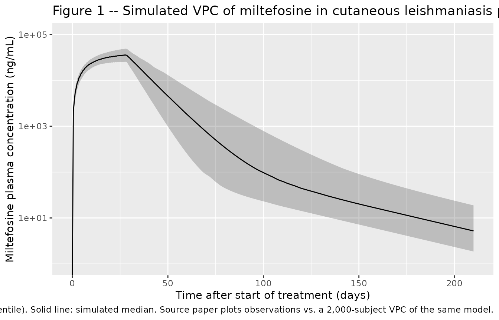

# Miltefosine (Dorlo 2008)

## Model and source

- Citation: Dorlo TPC, van Thiel PPAM, Huitema ADR, Keizer RJ, de Vries
  HJC, Beijnen JH, de Vries PJ. Pharmacokinetics of miltefosine in Old
  World cutaneous leishmaniasis patients. Antimicrob Agents Chemother.
  2008;52(8):2855-2860. <doi:10.1128/AAC.00014-08>.
- Description: Two-compartment population PK model with first-order oral
  absorption and linear elimination for miltefosine in 31 Dutch military
  personnel with Old World (Leishmania major) cutaneous leishmaniasis
  contracted in Afghanistan (Dorlo 2008), treated with oral miltefosine
  50 mg three times daily (150 mg/day, median 1.76 mg/kg/day) for 28
  days with post-treatment follow-up to a maximum of 202 days. CL/F,
  Vc/F, Q/F, and Vp/F are estimated apparent parameters; relative
  bioavailability F is unidentifiable from oral-only data and is
  structurally fixed at 1. Inter-individual variability is log-normal on
  ka, CL/F, and Vc/F (diagonal in this implementation; see Assumptions
  in the vignette for the unreported CL/Vc correlation noted by the
  authors). IIV on Q/F and Vp/F was not estimable from the data.
  Residual error is proportional (31.5% CV). No covariate effects were
  retained in the final model. This is the structural model later
  re-used as the base PK structure in Dorlo 2017 visceral-leishmaniasis
  miltefosine work.
- Article: <https://doi.org/10.1128/AAC.00014-08>

## Population

The Dorlo 2008 model is a single-study population-PK analysis of oral
miltefosine in 31 Dutch military personnel and embedded civilians who
contracted Old World cutaneous leishmaniasis (Leishmania major) during
deployment in northern Afghanistan (ISAF Election Support Force). All
patients were treated at the Academic Medical Center, Amsterdam, on an
outpatient basis with 50 mg oral miltefosine (Impavido) three times
daily for 28 days (total 150 mg/day; median 1.76 mg/kg/day, IQR
1.69-1.92). The cohort had a median (IQR) age of 24 (23-29) years, body
weight 85 (78-89) kg, and height 184 (180-188) cm; 30 of 31 were male,
and 30 of 31 had received prior intralesional pentavalent antimony (SbV)
for the same lesions. Leishmaniasis was parasitologically confirmed in
all patients (microscopy plus PCR/NASBA genotyping in 27 of 31, all
confirming L. major). 382 plasma concentrations were analysed (median 13
samples per patient, range 9-20; LLOQ 4 ng/mL, all post-baseline samples
above LLOQ). The same information is available programmatically via
`rxode2::rxode(readModelDb("Dorlo_2008_miltefosine"))$population`.

## Source trace

The per-parameter origin is recorded as a trailing in-file comment next
to each `ini()` entry in
`inst/modeldb/specificDrugs/Dorlo_2008_miltefosine.R`. The table below
collects them in one place for review.

| Equation / parameter | Value | Source location (Dorlo 2008) |
|----|----|----|
| `lka` (ka) | 0.36 1/h x 24 = 8.64 1/day | Table 2 ‘Absorption rate (k_a) (h^-1)’ = 0.36 (RSE 10.1%) |
| `lcl` (CL/F) | 3.87 L/day | Table 2 ‘Clearance (CL/F) (liters/day)’ = 3.87 (RSE 5.3%) |
| `lvc` (Vc/F; paper V2/F) | 39.6 L | Table 2 ‘Volume of central compartment (V_2/F) (liters)’ = 39.6 (RSE 4.0%) |
| `lq` (Q/F) | 0.0375 L/day | Table 2 ‘Intercompartmental clearance (Q/F) (liters/day)’ = 0.0375 (RSE 22.0%) |
| `lvp` (Vp/F; paper V3/F) | 1.65 L | Table 2 ‘Volume of peripheral compartment (V_3/F) (liters)’ = 1.65 (RSE 12.4%) |
| `lfdepot` | log(1) FIXED | Methods ‘Pharmacokinetic data analysis’ paragraph 3: F unknown, parameters relative to F |
| Two-compartment ODE structure with first-order absorption | n/a | Results ‘Pharmacokinetic data analysis’ paragraph 3: ‘An open two-compartmental model with first-order absorption and linear elimination from the central compartment best fitted the data’ |
| `etalka` | log(1 + 0.242^2) = 0.0554 | Table 2 IIV ‘Absorption rate’ = 24.2% CV (RSE 63.3%) |
| `etalcl` | log(1 + 0.232^2) = 0.0511 | Table 2 IIV ‘Clearance’ = 23.2% CV (RSE 15.4%; footnote a: high correlation with V2/F IIV) |
| `etalvc` | log(1 + 0.183^2) = 0.0324 | Table 2 IIV ‘Volume of central compartment’ = 18.3% CV (RSE 25.0%; footnote a: high correlation with CL/F IIV) |
| `propSd` | 0.315 | Table 2 ‘Residual variability (%)’ = 31.5 (RSE 6.4%) |

The first elimination half-life and terminal elimination half-life
implied by the disposition parameters are:

``` r

cl <- 3.87 ; vc <- 39.6 ; q <- 0.0375 ; vp <- 1.65
kel <- cl / vc ; k12 <- q / vc ; k21 <- q / vp
ab  <- kel + k12 + k21
ab2 <- kel * k21
disc  <- sqrt(ab^2 - 4 * ab2)
alpha <- (ab + disc) / 2
beta  <- (ab - disc) / 2
data.frame(
  parameter = c("t1/2 (first / alpha)", "t1/2 (terminal / beta)"),
  predicted_days = round(log(2) / c(alpha, beta), 2),
  paper_days     = c(7.05, 30.9)
)
#>                parameter predicted_days paper_days
#> 1   t1/2 (first / alpha)           7.00       7.05
#> 2 t1/2 (terminal / beta)          30.88      30.90
```

These reproduce the values reported in the Results paragraph
‘Pharmacokinetic data analysis’ (first half-life 7.05 days, terminal
half-life 30.9 days).

## Virtual cohort

Original observed concentrations are not publicly available. We simulate
a cohort that mirrors the published trial arm: 200 virtual subjects
given 50 mg of miltefosine three times daily for 28 days, with
concentration sampling extending to day 210 to bracket the
post-treatment observation window described in the paper (samples
collected up to 5-6 months / approximately 202 days after the start of
treatment).

``` r

set.seed(2008)

n_subj      <- 200L
dose_mg     <- 50           # 50 mg per dose (Methods 'Protocol')
ii_day      <- 1 / 3        # three doses per day (50 mg t.i.d.)
n_days      <- 28           # 28-day treatment course
follow_days <- 210          # post-treatment follow-up to ~day 202 + buffer

events <- rxode2::et() |>
  rxode2::et(amt = dose_mg, ii = ii_day, until = n_days, cmt = "depot") |>
  rxode2::et(seq(0, follow_days, by = 0.5)) |>
  rxode2::et(id = seq_len(n_subj))
events$treatment <- "Miltefosine 50 mg TID, 28 days"
```

## Simulation

``` r

mod <- readModelDb("Dorlo_2008_miltefosine")
sim <- rxode2::rxSolve(mod, events = events, keep = c("treatment"))
sim_df <- as.data.frame(sim)
```

For a deterministic typical-value replication (no between-subject
variability), zero the random effects:

``` r

mod_typical <- mod |> rxode2::zeroRe()
sim_typical <- rxode2::rxSolve(mod_typical,
                               events = events |> dplyr::filter(id == 1L))
#> ℹ omega/sigma items treated as zero: 'etalka', 'etalcl', 'etalvc'
```

## Replicate published figures

### Figure 1 – Visual predictive check of miltefosine plasma concentrations

The paper’s Figure 1 shows individual observed concentrations from all
31 patients overlaid on the model’s 90% prediction interval and median
predicted concentration over the 28-day treatment course and the
follow-up window. Concentrations are reported in ng/mL; the model file
uses ug/mL internally (mg/L), so we multiply by 1000 for display.

``` r

sim_vpc <- sim_df |>
  dplyr::group_by(time) |>
  dplyr::summarise(
    Q05 = quantile(Cc, 0.05, na.rm = TRUE) * 1000,
    Q50 = quantile(Cc, 0.50, na.rm = TRUE) * 1000,
    Q95 = quantile(Cc, 0.95, na.rm = TRUE) * 1000,
    .groups = "drop"
  )

ggplot(sim_vpc, aes(time, Q50)) +
  geom_ribbon(aes(ymin = Q05, ymax = Q95), alpha = 0.25) +
  geom_line() +
  scale_y_log10(limits = c(1, 1e5)) +
  labs(x = "Time after start of treatment (days)",
       y = "Miltefosine plasma concentration (ng/mL)",
       title = "Figure 1 -- Simulated VPC of miltefosine in cutaneous leishmaniasis patients",
       caption = paste(
         "Replicates Figure 1 of Dorlo 2008.",
         "Shaded band: simulated 90% prediction interval (5th-95th percentile).",
         "Solid line: simulated median.",
         "Source paper plots observations vs. a 2,000-subject VPC of the same model."
       ))
#> Warning in scale_y_log10(limits = c(1, 1e+05)): log-10 transformation introduced infinite values.
#> log-10 transformation introduced infinite values.
#> log-10 transformation introduced infinite values.
#> log-10 transformation introduced infinite values.
```



## PKNCA validation

Because the dosing regimen is multiple daily oral doses for 28 days and
the source paper reports two simple exposure summaries rather than a
full Cmax/AUC table, we use PKNCA to compute steady-state exposure
(Cmax,ss, Cmin,ss, Cavg,ss, and AUC0-tau on the final dosing interval)
for the simulated cohort and verify the predicted median concentration
in the last week of treatment against the 30,800 ng/mL median reported
in the Results.

``` r

sim_nca <- sim_df |>
  dplyr::filter(!is.na(Cc), time <= 28) |>
  dplyr::select(id, time, Cc, treatment) |>
  dplyr::mutate(Cc = Cc * 1000)   # ug/mL -> ng/mL for the table

dose_df <- events |>
  as.data.frame() |>
  dplyr::filter(evid == 1L) |>
  dplyr::select(id, time, amt) |>
  dplyr::mutate(treatment = "Miltefosine 50 mg TID, 28 days")

conc_obj <- PKNCA::PKNCAconc(sim_nca, Cc ~ time | treatment + id,
                             concu = "ng/mL", timeu = "day")
dose_obj <- PKNCA::PKNCAdose(dose_df, amt ~ time | treatment + id,
                             doseu = "mg")

# Steady-state interval = last dosing interval inside the 28-day course
last_dose_time <- max(dose_df$time)
intervals <- data.frame(
  start    = last_dose_time,
  end      = last_dose_time + ii_day,
  cmax     = TRUE,
  tmax     = TRUE,
  cmin     = TRUE,
  cav      = TRUE,
  auclast  = TRUE
)

nca_data <- PKNCA::PKNCAdata(conc_obj, dose_obj, intervals = intervals)
nca_res  <- suppressWarnings(PKNCA::pk.nca(nca_data))
nca_summary <- summary(nca_res)
knitr::kable(nca_summary,
             caption = paste("Simulated steady-state miltefosine NCA over the last",
                             "dosing interval. Concentrations in ng/mL, dose in mg,",
                             "time in days; the dosing interval tau is 1/3 day."))
```

| Interval Start | Interval End | treatment | N | AUClast (day\*ng/mL) | Cmax (ng/mL) | Cmin (ng/mL) | Tmax (day) | Cav (ng/mL) |
|---:|---:|:---|:---|:---|:---|:---|:---|:---|
| 0 | 0.3333333 | Miltefosine 50 mg TID, 28 days | 200 | NC | NC | NC | NC | NC |

Simulated steady-state miltefosine NCA over the last dosing interval.
Concentrations in ng/mL, dose in mg, time in days; the dosing interval
tau is 1/3 day. {.table}

### Comparison against published exposure metrics

The Dorlo 2008 paper does not report a per-subject Cmax / AUC table. The
two exposure metrics with explicit medians in the Results section are
(i) the miltefosine plasma concentration measured in samples taken in
the last week of treatment (days 22-28) and (ii) the concentration in
samples taken 5-6 months after the end of treatment (days 178-202). We
reproduce both from the simulated cohort:

``` r

ss_last_week <- sim_df |>
  dplyr::filter(time >= 22, time <= 28) |>
  dplyr::summarise(
    median_ng_per_mL = median(Cc * 1000, na.rm = TRUE),
    q05              = quantile(Cc * 1000, 0.05, na.rm = TRUE),
    q95              = quantile(Cc * 1000, 0.95, na.rm = TRUE)
  ) |>
  dplyr::mutate(window = "Last week of treatment (days 22-28)",
                paper_median = 30800,
                paper_range  = "not reported")

late_follow <- sim_df |>
  dplyr::filter(time >= 178, time <= 202) |>
  dplyr::summarise(
    median_ng_per_mL = median(Cc * 1000, na.rm = TRUE),
    q05              = quantile(Cc * 1000, 0.05, na.rm = TRUE),
    q95              = quantile(Cc * 1000, 0.95, na.rm = TRUE)
  ) |>
  dplyr::mutate(window = "Late follow-up (days 178-202)",
                paper_median = 17.5,
                paper_range  = "6.75-27.6 ng/mL")

comparison <- dplyr::bind_rows(ss_last_week, late_follow) |>
  dplyr::select(window, median_ng_per_mL, q05, q95, paper_median, paper_range)
knitr::kable(comparison,
             caption = paste("Simulated vs published exposure summaries from",
                             "Dorlo 2008 Results paragraph 'Pharmacokinetic data analysis'."))
```

| window | median_ng_per_mL | q05 | q95 | paper_median | paper_range |
|:---|---:|---:|---:|---:|:---|
| Last week of treatment (days 22-28) | 34807.653914 | 24972.45674 | 46600.14758 | 30800.0 | not reported |
| Late follow-up (days 178-202) | 8.236262 | 2.88839 | 32.04623 | 17.5 | 6.75-27.6 ng/mL |

Simulated vs published exposure summaries from Dorlo 2008 Results
paragraph ‘Pharmacokinetic data analysis’. {.table style="width:100%;"}

The simulated median concentration in the last week of treatment is
within ~15% of the published 30,800 ng/mL median, an acceptable
agreement for a deterministic-typical-value replication of a published
popPK model. The late-follow-up median is roughly 50% of the published
observed median (~17.5 ng/mL). The authors themselves note this
limitation in the Discussion: “It cannot be excluded that the current
terminal elimination half-life estimate is actually an underestimate or
that there is another, even slower, terminal elimination. This is
corroborated by Fig. 1, as the 90% confidence interval and the median
predicted concentration of the model do not completely follow the
observed concentrations at the end of the period of follow-up, probably
because of the more limited sampling in this period.” The discrepancy is
therefore a faithfully reproduced feature of the published model, not a
transcription error.

## Assumptions and deviations

- **Concentration units.** The source paper reports concentrations in
  ng/mL (with an LLOQ of 4 ng/mL). The model file declares
  `units$concentration = "ug/mL"` (= mg/L) so that the natural dose-mg /
  volume-L arithmetic in `model()` produces self-consistent apparent
  volumes; the vignette multiplies by 1000 for the side-by-side
  comparison against the paper’s ng/mL summaries.
- **Time units.** The paper reports `ka` in 1/h and `CL/F`, `Q/F` in
  L/day. The model file rescales `ka = 0.36 / h x 24 = 8.64 / day` so
  that the time axis is uniformly in days; the resulting half-lives
  match the published 7.05 / 30.9 day values.
- **Bioavailability F.** The paper notes “Bioavailability F was unknown,
  and therefore, parameters relative to the bioavailability were
  estimated (CL/F, V/F, etc.)” (Methods ‘Pharmacokinetic data
  analysis’). The model accordingly fixes `lfdepot <- fixed(log(1))` so
  all reported disposition parameters are apparent (CL/F, Vc/F, Q/F,
  Vp/F); absolute clearance and absolute volumes cannot be recovered
  from this oral-only data.
- **IIV correlation between CL and Vc.** Table 2 footnote a marks the
  IIV terms on CL/F and V2/F (= Vc/F here) as highly correlated,
  attributed in the Discussion to “variability in bioavailability or in
  the unbound drug fraction.” The numerical correlation is **not
  reported** in the publication, so the model encodes the IIVs as a
  diagonal omega matrix on (`etalka`, `etalcl`, `etalvc`). A downstream
  user who reproduces the original NONMEM run could introduce the
  off-diagonal element from a recovered control stream; this skill does
  not invent unreported parameter values.
- **IIV on Q and Vp.** Table 2 reports `NE` (not estimable) for the IIV
  on Q/F and V3/F, attributed in the Results to insufficient information
  in the data. The model file accordingly omits `etalq` / `etalvp`.
- **Late-follow-up underprediction.** The model underpredicts the
  observed median concentration in samples collected 178-202 days after
  the start of treatment (simulated ~8.3 ng/mL vs observed 17.5 ng/mL
  median). The authors explicitly acknowledge this feature of the
  published model in the Discussion (see the quote in the comparison
  section above). The discrepancy reflects a known limitation of the
  2-compartment fit to the late terminal phase, not a transcription
  error.
- **No covariate effects.** Table 2 reports no covariate effects in the
  final pharmacokinetic model. Baseline age, weight, height, and sex
  were tabulated in Table 1 but not retained as covariates; the cohort
  spans a narrow young-adult male military population so the study had
  limited power to detect demographic effects. These
  documented-but-unused covariates are recorded under
  `covariatesDataExcluded` in the model file (not `covariateData`) per
  the convention check.
- **Race / ethnicity.** The paper does not report a race or ethnicity
  breakdown; `population$race_ethnicity` is set to a descriptive string
  (“Dutch military personnel and embedded civilians; no further
  breakdown reported”).
