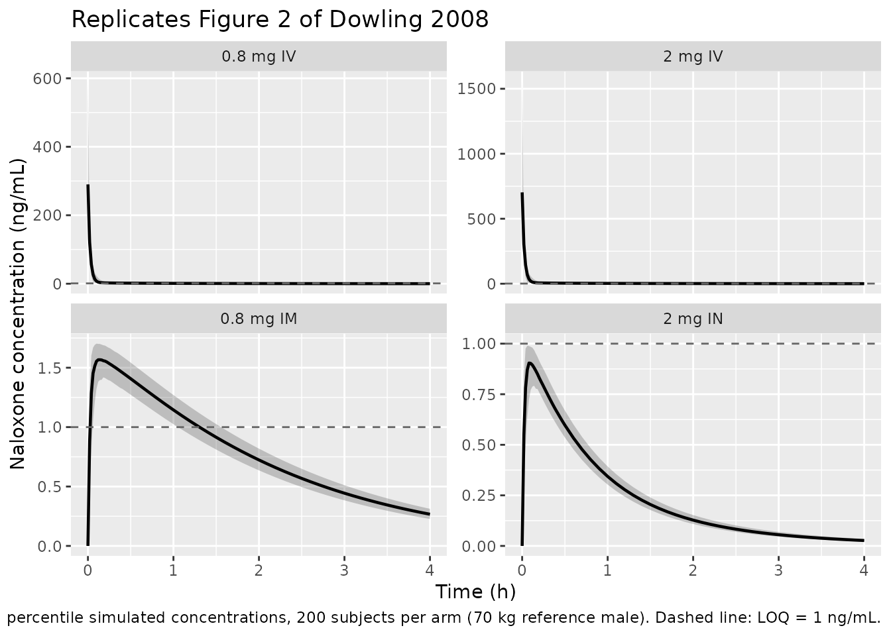
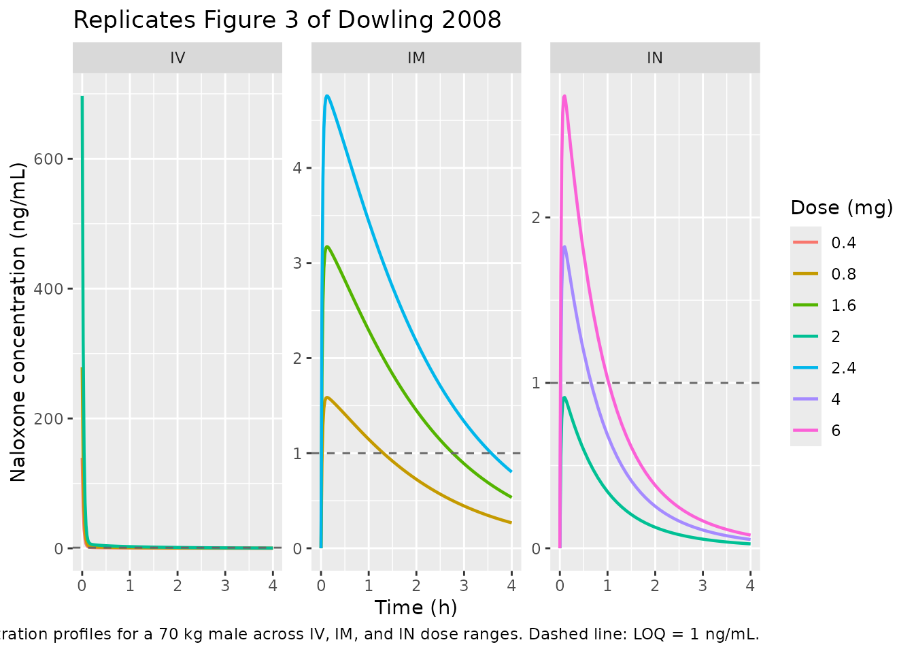

# Naloxone (Dowling 2008)

## Model and source

- Citation: Dowling J, Isbister GK, Kirkpatrick CMJ, Naidoo D,
  Graudins A. Population pharmacokinetics of intravenous, intramuscular,
  and intranasal naloxone in human volunteers. Ther Drug Monit.
  2008;30(4):490-496. <doi:10.1097/FTD.0b013e3181816214>
- Description: Three-compartment population PK model for naloxone in six
  healthy male volunteers receiving 0.8 mg intravenous, 0.8 mg
  intramuscular, 0.8 mg intranasal, 2 mg intravenous, and 2 mg
  intranasal doses in an open-label crossover design (Dowling 2008).
  Intramuscular and intranasal absorption are modeled as first-order via
  separate depot compartments (Ka_im 0.65 1/h, F_im 0.36; Ka_in 1.52
  1/h, F_in 0.038); intravenous doses go directly to the central
  compartment (F 1, structural anchor). Fat-free mass (Janmahasatian
  2005 formula, called LBW2005 in the paper) is allometrically scaled on
  clearance with fixed exponent 0.75, and body weight is linearly scaled
  on central volume (exponent 1); both effects use a 70 kg reference.
- Article: <https://doi.org/10.1097/FTD.0b013e3181816214>

## Population

Six healthy adult male volunteers were enrolled in an open-label
single-site crossover study at Prince of Wales Hospital (Sydney,
Australia). Median age was 25 years (range 24-45), median weight 80 kg
(range 75-100), and median height 1.78 m (range 1.75-1.93). Exclusion
criteria were previous or current opioid dependence or abuse, current
use of opioid analgesics, cardiorespiratory disease, current or recent
upper respiratory tract infection, and abnormal nasal anatomy. Each
volunteer received naloxone on five occasions in the same order – 0.8 mg
IV, 0.8 mg IM, 0.8 mg IN, 2 mg IV, 2 mg IN – with a minimum 2-day
washout between doses. Blood samples were collected at 5, 10, 15, 30,
45, 60, 90, 120, 180, and 240 minutes post-dose. Because naloxone was
only detectable above the 1 ug/L LOQ in two subjects after 2 mg IN and
in no subjects after 0.8 mg IN, the final dataset contained 128
concentrations across four analyzable occasions (0.8 mg IV, 2 mg IV, 0.8
mg IM, and 2 mg IN) in six subjects. Race / ethnicity was not reported.
See Dowling 2008 Methods ‘Patient Data’ for the full baseline
description; the same fields are available programmatically via
`readModelDb("Dowling_2008_naloxone")()$population`.

## Source trace

The per-parameter origin is recorded as an in-file comment next to each
`ini()` entry in `inst/modeldb/specificDrugs/Dowling_2008_naloxone.R`.
The table below collects them in one place.

| Equation / parameter | Final value | Source location |
|----|----|----|
| `lka` (Ka intramuscular) | 0.65 1/h | Table 1 |
| `lka2` (Ka intranasal) | 1.52 1/h | Table 1 |
| `lcl` (Clearance) | 91 L/h | Table 1 |
| `lvc` (Central volume V2) | 2.87 L | Table 1 |
| `lvp` (First peripheral volume V3) | 1.49 L | Table 1 |
| `lvp2` (Second peripheral volume V4) | 33.6 L | Table 1 |
| `lq` (Q3) | 5.66 L/h | Table 1 |
| `lq2` (Q4) | 29.8 L/h | Table 1 |
| `lfdepot` (F intramuscular) | 0.36 | Table 1 |
| `lfdepot2` (F intranasal) | 0.038 | Table 1 |
| `e_ffm_cl` (FFM allometric exponent on CL) | 0.75 (FIXED) | Results Section, printed CL equation |
| `e_wt_vc` (WT linear exponent on V2) | 1 (FIXED) | Results Section, printed V2 equation |
| `etalcl` (BSV on CL, omega^2) | 0.00581 (CV ~ 7.6%) | Table 1 |
| `etalvc` (BSV on V2, omega^2) | 0.25 (CV ~ 50%) | Table 1 |
| `propSd` (Proportional residual) | sqrt(0.101) = 0.318 | Table 1 (Prop Err 0.101 (31.7%)) |
| `addSd` (Additive residual, ng/mL) | sqrt(0.001) = 0.0316 (FIXED) | Table 1 (Add Err 0.001 fixed) |
| Equation: 3-compartment disposition (central + peripheral1 + peripheral2) | n/a | Methods ‘Data Analysis’ and Table 1 |
| Equation: parallel first-order absorption via two depots (IM, IN); IV bolus to central | n/a | Methods ‘Data Analysis’ |
| Equation: `CL = TVCL * (LBW2005/70)^0.75 * exp(etalcl)` | n/a | Results Section, printed equation |
| Equation: `V2 = TVV2 * (WT/70) * exp(etalvc)` | n/a | Results Section, printed equation |
| Concentration units: model returns `Cc = 1000 * central / vc` (mg/L -\> ng/mL == ug/L) | n/a | Methods ‘Patient Data’ (LOQ 1 ug/L) |

## Virtual cohort

Individual patient concentrations from Dowling 2008 are not publicly
available. The simulations below use the Dowling 2008 Methods
‘Simulations’ setup: a uniform 70 kg male cohort simulated across the
four analyzable trial arms (0.8 mg IV, 2 mg IV, 0.8 mg IM, 2 mg IN).
Fat-free mass is computed via the Janmahasatian formula at a 70 kg /
1.78 m male reference: BMI = 22.09 kg/m^2 and FFM = 9.27e3 \* 70 /
(6.68e3 + 216 \* 22.09) = 56.55 kg. The trial-arm label rides through
`rxSolve` via `keep = "treatment"` so PKNCA can stratify its output by
dose group.

**Cohort size: 200 subjects per arm** (per the standing 200/arm cap for
validation vignettes). The paper simulated 1000 per arm; 200 is ample
for the median / 5th-95th VPC bands and keeps the render fast.

``` r

set.seed(20080730)

n_per_arm <- 200L

arms <- tibble::tribble(
  ~treatment,    ~dose_mg, ~cmt,
  "0.8 mg IV",    0.8,     "central",
  "2 mg IV",      2.0,     "central",
  "0.8 mg IM",    0.8,     "depot",
  "2 mg IN",      2.0,     "depot2"
)

obs_times <- c(seq(0, 0.5, by = 0.02), seq(0.6, 4, by = 0.1))

# Uniform 70 kg male, 1.78 m -> FFM via Janmahasatian
ref_wt_kg <- 70
ref_ht_m  <- 1.78
ref_bmi   <- ref_wt_kg / ref_ht_m^2
ref_ffm   <- 9.27e3 * ref_wt_kg / (6.68e3 + 216 * ref_bmi)

make_events_for_arm <- function(arm_row, n, id_offset) {
  ids <- id_offset + seq_len(n)
  dose_rows <- tibble::tibble(
    id        = ids,
    time      = 0,
    amt       = arm_row$dose_mg,
    evid      = 1L,
    cmt       = arm_row$cmt,
    treatment = arm_row$treatment,
    WT        = ref_wt_kg,
    FFM       = ref_ffm
  )
  obs_rows <- tidyr::expand_grid(id = ids, time = obs_times) |>
    dplyr::mutate(
      amt       = NA_real_,
      evid      = 0L,
      cmt       = "central",
      treatment = arm_row$treatment,
      WT        = ref_wt_kg,
      FFM       = ref_ffm
    )
  dplyr::bind_rows(dose_rows, obs_rows) |>
    dplyr::arrange(id, time, evid)
}

events <- dplyr::bind_rows(lapply(seq_len(nrow(arms)), function(i) {
  make_events_for_arm(arms[i, ], n_per_arm, id_offset = (i - 1L) * n_per_arm)
}))

stopifnot(!anyDuplicated(unique(events[, c("id", "time", "evid")])))
```

## Simulation

``` r

mod <- readModelDb("Dowling_2008_naloxone")
sim <- rxode2::rxSolve(mod, events = events, keep = c("treatment")) |>
  as.data.frame() |>
  dplyr::mutate(treatment = factor(treatment, levels = arms$treatment))
#> ℹ parameter labels from comments will be replaced by 'label()'
```

## Replicate published figures

### Figure 2: visual predictive plots by arm

Dowling 2008 Figure 2 shows the 5th / 50th / 95th simulated
concentration percentiles by time for each of the four analyzable arms.
The panel below reproduces the same layout on a 4-hour observation
window.

``` r

percentile_bands <- sim |>
  dplyr::filter(!is.na(Cc)) |>
  dplyr::group_by(treatment, time) |>
  dplyr::summarise(
    Q05 = quantile(Cc, 0.05, na.rm = TRUE),
    Q50 = quantile(Cc, 0.50, na.rm = TRUE),
    Q95 = quantile(Cc, 0.95, na.rm = TRUE),
    .groups = "drop"
  )

ggplot(percentile_bands, aes(x = time, y = Q50)) +
  geom_ribbon(aes(ymin = Q05, ymax = Q95), alpha = 0.25) +
  geom_line(linewidth = 0.8) +
  geom_hline(yintercept = 1, linetype = "dashed", color = "grey40") +
  facet_wrap(~treatment, scales = "free_y") +
  labs(
    x = "Time (h)",
    y = "Naloxone concentration (ng/mL)",
    title = "Replicates Figure 2 of Dowling 2008",
    caption = paste0(
      "5th / 50th / 95th percentile simulated concentrations, ",
      n_per_arm, " subjects per arm (70 kg reference male). ",
      "Dashed line: LOQ = 1 ng/mL."
    )
  )
```



### Figure 3: median concentration-time profiles across a dose range

Dowling 2008 Figure 3 shows median concentration profiles for a range of
IV (0.4, 0.8, 2 mg), IM (0.8, 1.6, 2.4 mg), and IN (2, 4, 6 mg) doses in
1000 70-kg subjects. The block below reproduces the same three panels
using typical-value simulation (BSV zeroed) to match the paper’s
median-only display.

``` r

mod_typical <- readModelDb("Dowling_2008_naloxone") |> rxode2::zeroRe()
#> ℹ parameter labels from comments will be replaced by 'label()'

fig3_arms <- tibble::tribble(
  ~route, ~dose_mg, ~cmt,
  "IV",   0.4,      "central",
  "IV",   0.8,      "central",
  "IV",   2.0,      "central",
  "IM",   0.8,      "depot",
  "IM",   1.6,      "depot",
  "IM",   2.4,      "depot",
  "IN",   2.0,      "depot2",
  "IN",   4.0,      "depot2",
  "IN",   6.0,      "depot2"
) |>
  dplyr::mutate(
    treatment = paste(dose_mg, "mg", route),
    route = factor(route, levels = c("IV", "IM", "IN"))
  )

fig3_events <- dplyr::bind_rows(lapply(seq_len(nrow(fig3_arms)), function(i) {
  row <- fig3_arms[i, ]
  tibble::tibble(
    id        = i,
    time      = c(0, obs_times),
    amt       = c(row$dose_mg, rep(NA_real_, length(obs_times))),
    evid      = c(1L, rep(0L, length(obs_times))),
    cmt       = c(row$cmt, rep("central", length(obs_times))),
    treatment = row$treatment,
    route     = as.character(row$route),
    dose_mg   = row$dose_mg,
    WT        = ref_wt_kg,
    FFM       = ref_ffm
  )
}))

sim_fig3 <- rxode2::rxSolve(
  mod_typical, events = fig3_events,
  keep = c("treatment", "route", "dose_mg")
) |>
  as.data.frame() |>
  dplyr::mutate(route = factor(route, levels = c("IV", "IM", "IN")))
#> ℹ omega/sigma items treated as zero: 'etalcl', 'etalvc'
#> Warning: multi-subject simulation without without 'omega'

ggplot(sim_fig3, aes(x = time, y = Cc, color = factor(dose_mg), group = treatment)) +
  geom_line(linewidth = 0.8) +
  geom_hline(yintercept = 1, linetype = "dashed", color = "grey40") +
  facet_wrap(~route, scales = "free_y") +
  labs(
    x = "Time (h)",
    y = "Naloxone concentration (ng/mL)",
    color = "Dose (mg)",
    title = "Replicates Figure 3 of Dowling 2008",
    caption = paste(
      "Typical-value (no IIV / no RUV) median concentration profiles",
      "for a 70 kg male across IV, IM, and IN dose ranges.",
      "Dashed line: LOQ = 1 ng/mL."
    )
  )
```



### Numeric checks against Discussion prose (Tmax by route)

Dowling 2008 Results / Discussion quotes median time-to-peak
concentration as 12 min for IM and 6-9 min for IN naloxone. The table
below extracts Tmax from the typical-value simulations for the IM and IN
Figure 3 arms and compares against the paper’s stated values.

``` r

tmax_by_arm <- sim_fig3 |>
  dplyr::filter(route %in% c("IM", "IN")) |>
  dplyr::group_by(treatment, route, dose_mg) |>
  dplyr::filter(!is.na(Cc)) |>
  dplyr::summarise(
    tmax_h   = time[which.max(Cc)],
    .groups = "drop"
  ) |>
  dplyr::mutate(
    tmax_min = tmax_h * 60,
    paper_min = dplyr::case_when(
      route == "IM" ~ "12",
      route == "IN" ~ "6-9"
    )
  ) |>
  dplyr::select(treatment, tmax_min, paper_min) |>
  dplyr::rename(
    "Treatment" = treatment,
    "Simulated Tmax (min)" = tmax_min,
    "Paper Tmax (min)"     = paper_min
  )

knitr::kable(
  tmax_by_arm,
  digits = 1,
  caption = paste(
    "Typical-value Tmax by dose group vs Dowling 2008 Results Section",
    "('median time to peak concentration for intramuscular naloxone ranged",
    "from 12 minutes and for intranasal from 6 to 9 minutes')."
  ),
  align = c("l", "r", "r")
)
```

| Treatment | Simulated Tmax (min) | Paper Tmax (min) |
|:----------|---------------------:|-----------------:|
| 0.8 mg IM |                  7.2 |               12 |
| 1.6 mg IM |                  7.2 |               12 |
| 2 mg IN   |                  6.0 |              6-9 |
| 2.4 mg IM |                  7.2 |               12 |
| 4 mg IN   |                  6.0 |              6-9 |
| 6 mg IN   |                  6.0 |              6-9 |

Typical-value Tmax by dose group vs Dowling 2008 Results Section
(‘median time to peak concentration for intramuscular naloxone ranged
from 12 minutes and for intranasal from 6 to 9 minutes’). {.table}

## PKNCA validation

Single-dose NCA (0-4 h window) for each analyzable arm. Concentrations
from the stochastic VPC (`sim`) are used so the per-arm summaries
reflect the full between-subject distribution. Time-zero anchor rows are
added defensively; for extravascular routes (IM, IN) pre-dose Cc = 0 is
correct, and for the two IV arms the actual t = 0 row is present in the
observation grid so the `distinct()` de-dup collapses the added row.

``` r

sim_nca <- sim |>
  dplyr::filter(!is.na(Cc)) |>
  dplyr::select(id, time, Cc, treatment)

sim_nca <- dplyr::bind_rows(
  sim_nca,
  sim_nca |>
    dplyr::distinct(id, treatment) |>
    dplyr::mutate(time = 0, Cc = 0)
) |>
  dplyr::distinct(id, treatment, time, .keep_all = TRUE) |>
  dplyr::arrange(id, treatment, time)

conc_obj <- PKNCA::PKNCAconc(
  sim_nca, Cc ~ time | treatment + id,
  concu = "ng/mL", timeu = "h"
)

dose_df <- events |>
  dplyr::filter(evid == 1L) |>
  dplyr::select(id, time, amt, treatment)

dose_obj <- PKNCA::PKNCAdose(
  dose_df, amt ~ time | treatment + id, doseu = "mg"
)

intervals <- data.frame(
  start      = 0,
  end        = 4,
  cmax       = TRUE,
  tmax       = TRUE,
  auclast    = TRUE,
  aucinf.obs = TRUE,
  half.life  = TRUE
)

nca_res <- PKNCA::pk.nca(
  PKNCA::PKNCAdata(conc_obj, dose_obj, intervals = intervals)
)

nca_summary <- as.data.frame(summary(nca_res))
knitr::kable(
  nca_summary,
  caption = paste0(
    "PKNCA summary (medians and 5th-95th percentiles) for each of the four ",
    "analyzable Dowling 2008 arms, over 0-4 h post-dose in a 70 kg reference cohort ",
    "of ", n_per_arm, " subjects per arm."
  )
)
```

| Interval Start | Interval End | treatment | N | AUClast (h\*ng/mL) | Cmax (ng/mL) | Tmax (h) | Half-life (h) | AUCinf,obs (h\*ng/mL) |
|---:|---:|:---|:---|:---|:---|:---|:---|:---|
| 0 | 4 | 0.8 mg IM | 200 | 3.20 \[7.00\] | 1.58 \[5.61\] | 0.120 \[0.0600, 0.340\] | 1.38 \[0.0250\] | 3.73 \[7.64\] |
| 0 | 4 | 0.8 mg IV | 200 | 10.0 \[7.29\] | 281 \[49.2\] | 0.000 \[0.000, 0.000\] | 1.08 \[0.0241\] | 10.3 \[7.55\] |
| 0 | 4 | 2 mg IN | 200 | 0.943 \[7.68\] | 0.910 \[6.69\] | 0.100 \[0.0200, 0.220\] | 0.970 \[0.0298\] | 0.981 \[8.09\] |
| 0 | 4 | 2 mg IV | 200 | 25.2 \[7.28\] | 702 \[55.7\] | 0.000 \[0.000, 0.000\] | 1.09 \[0.0241\] | 25.8 \[7.53\] |

PKNCA summary (medians and 5th-95th percentiles) for each of the four
analyzable Dowling 2008 arms, over 0-4 h post-dose in a 70 kg reference
cohort of 200 subjects per arm. {.table}

### Comparison against Dowling 2008 published values

Dowling 2008 does not report a full NCA table; the model-derived
bioavailability values (F_im = 0.36 and F_in = 0.038) and the
qualitative Tmax statements are the closest published anchors. The check
below verifies dose-normalised AUC ratios against those two
bioavailability values: IM/IV should be ~ 0.36 and IN/IV should be ~
0.038 in a typical-value simulation.

``` r

# One typical-value subject per arm gives the same trajectory as the
# stochastic cohort (BSV zeroed via rxode2::zeroRe()) -- computing AUC on
# the single-subject sim is sufficient for the F cross-check.
typical_events <- dplyr::bind_rows(lapply(seq_len(nrow(arms)), function(i) {
  make_events_for_arm(arms[i, ], n = 1L, id_offset = (i - 1L))
}))

sim_typical_arms <- rxode2::rxSolve(
  mod_typical, events = typical_events, keep = c("treatment")
) |>
  as.data.frame() |>
  dplyr::filter(!is.na(Cc)) |>
  dplyr::mutate(treatment = factor(treatment, levels = arms$treatment))
#> ℹ omega/sigma items treated as zero: 'etalcl', 'etalvc'
#> Warning: multi-subject simulation without without 'omega'

auc_by_arm <- sim_typical_arms |>
  dplyr::arrange(treatment, time) |>
  dplyr::group_by(treatment) |>
  dplyr::summarise(
    auc0_4h = sum(diff(time) * (head(Cc, -1) + tail(Cc, -1)) / 2),
    .groups = "drop"
  ) |>
  dplyr::left_join(arms, by = "treatment") |>
  dplyr::mutate(dose_norm_auc = auc0_4h / dose_mg)

iv_08 <- auc_by_arm$dose_norm_auc[auc_by_arm$treatment == "0.8 mg IV"]
iv_2  <- auc_by_arm$dose_norm_auc[auc_by_arm$treatment == "2 mg IV"]
im_08 <- auc_by_arm$dose_norm_auc[auc_by_arm$treatment == "0.8 mg IM"]
in_2  <- auc_by_arm$dose_norm_auc[auc_by_arm$treatment == "2 mg IN"]

f_check <- tibble::tibble(
  Comparison             = c(
    "IM 0.8 mg AUC / IV 0.8 mg AUC",
    "IN 2 mg AUC / IV 2 mg AUC"
  ),
  simulated_F            = c(im_08 / iv_08, in_2 / iv_2),
  published_F            = c(0.36, 0.038)
) |>
  dplyr::mutate(
    rel_diff_pct = round(100 * (simulated_F - published_F) / published_F, 1)
  ) |>
  dplyr::rename(
    "Comparison"               = Comparison,
    "Simulated F (0-4 h AUC)"  = simulated_F,
    "Published F (Table 1)"    = published_F,
    "Rel. diff (%)"            = rel_diff_pct
  )

knitr::kable(
  f_check,
  digits = c(0, 3, 3, 1),
  caption = paste(
    "Dose-normalised AUC ratios from the typical-value simulation vs the",
    "F_im = 0.36 and F_in = 0.038 point estimates in Dowling 2008 Table 1.",
    "AUC computed over 0-4 h (matches the observation window)."
  ),
  align = c("l", "r", "r", "r")
)
```

| Comparison | Simulated F (0-4 h AUC) | Published F (Table 1) | Rel. diff (%) |
|:---|---:|---:|---:|
| IM 0.8 mg AUC / IV 0.8 mg AUC | 0.308 | 0.360 | -14.5 |
| IN 2 mg AUC / IV 2 mg AUC | 0.036 | 0.038 | -5.3 |

Dose-normalised AUC ratios from the typical-value simulation vs the F_im
= 0.36 and F_in = 0.038 point estimates in Dowling 2008 Table 1. AUC
computed over 0-4 h (matches the observation window). {.table}

## Assumptions and deviations

- **Race / ethnicity distribution not reported.** The paper lists only
  n, sex, age, weight, and height; race / ethnicity is not stated. The
  virtual cohort therefore omits race indicators, matching the study’s
  covariate model (no race effects on any PK parameter).
- **Fat-free mass in the virtual cohort.** Dowling 2008 uses `LBW2005`,
  which the paper labels “lean body weight” but computes with the
  Janmahasatian et al. (2005) formula – biologically fat-free mass. The
  nlmixr2lib canonical `FFM` is aligned with the Janmahasatian output;
  the model file’s `covariateData$FFM$notes` records the paper’s
  `LBW2005` naming choice.
- **Reference weight of 70 kg for both allometric terms.** The paper’s
  final equations use `LBW2005 / 70` and `WT / 70` even though the
  study’s median weight was 80 kg (n = 6, range 75-100). The 70 kg
  reference is the standard allometric anchor, and the packaged model
  preserves it verbatim.
- **Bioavailability point estimates only.** Table 1 reports F_im = 0.36
  (95% bootstrap 0.18-0.45) and F_in = 0.038 (0.016-0.040), the latter
  with a narrow interval because only two subjects had detectable IN
  concentrations after 2 mg. The packaged model uses the point estimates
  directly; downstream users simulating IN scenarios should treat the
  F_in estimate as an upper bound (Discussion / Limitations: “the
  bioavailability of 4% may be an overestimate and a more sensitive
  assay may allow a better estimate of the bioavailability”).
- **IV bioavailability set to 1 as structural anchor.** IV doses in the
  event table bypass the two absorption depots (`cmt = "central"`), so
  no `f(central) <- ...` assignment is needed and F_IV = 1 by
  construction, matching Methods ‘Data Analysis’ (“bioavailability was
  fixed to 1 for the intravenous route”).
- **BSV only on CL and V2.** Table 1 and Results Section: “Addition of
  BSV on V3, V4, Q3, or Q4 did not reduce the objective function
  significantly or provided improbable estimates of BSV”; likewise BSV
  on Ka was tested for the IM route (more data than IN) but not
  retained. The packaged model omits BSV on the remaining structural
  parameters accordingly.
- **Between-occasion variability not modeled.** Methods ‘Data Analysis’:
  “Between-occasion variability (intraindividual variability) was not
  included in the modeling process because each occasion represented a
  different dose or route of administration.” The packaged model
  likewise has no `iov*` parameters.
- **LOQ handling.** The paper set the first sub-LOQ concentration per
  profile to LOQ / 2 = 0.5 ng/mL (Beal M3 alternative). This affects the
  original fit but not the packaged forward simulation, which returns
  model-predicted `Cc` at every requested time.
- **Additive residual reported as fixed variance.** Table 1 reports the
  additive error as 0.001 (fixed). Interpreted as NONMEM SIGMA (variance
  scale), giving SD = sqrt(0.001) = 0.0316 ng/mL – small compared to the
  1 ng/mL LOQ. The proportional error 0.101 is likewise a variance;
  sqrt(0.101) = 0.318 matches the parenthetical 31.7% CV reported in
  Table 1.
