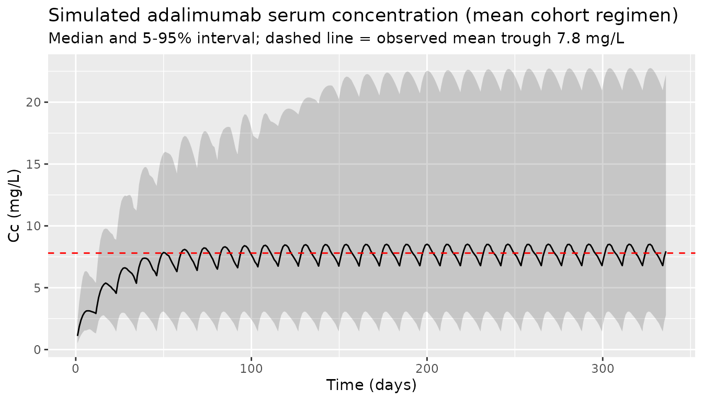

# Adalimumab (Drweesh 2026)

## Model and source

- Citation: Drweesh H, Alotaibi A, Alqassim HA, et al. Comparing the
  pharmacokinetics of adalimumab originator and biosimilar product in
  patients with Inflammatory bowel disease or autoimmune disease. *Saudi
  Pharm J* 2026;34:14.
- Article: <https://doi.org/10.1007/s44446-026-00063-5>
- PubMed: <https://pubmed.ncbi.nlm.nih.gov/41843306/>

Drweesh 2026 is a multicenter retrospective therapeutic-drug-monitoring
study that compares the apparent clearance (CL/F) of adalimumab
originator (Humira) and biosimilars (Amgevita, Hyrimoz) across seven
hospitals in Saudi Arabia and Qatar. The authors fit a one-compartment
model with first-order subcutaneous absorption and linear elimination in
Monolix, holding `ka` fixed at 0.01 1/h based on Marquez-Megias 2021 and
Kang 2020. Only the typical CL/F (mean of individual Bayes estimates,
0.018 +/- 0.012 L/h) and the residual error form (proportional) are
reported in the publication. The remaining structural parameters of the
popPK model – V/F, IIV variances, and the proportional residual error
magnitude – are not reported in the paper or supplement; they are
inherited here from the Marquez-Megias 2023 IBD adalimumab popPK model
that Drweesh 2026 explicitly cites as the structural precedent.

Covariate effects on clearance were assessed in Drweesh 2026 by stepwise
multivariable linear regression on the individual Bayes clearance
estimates (Section 3.2 and Table 2), not as terms inside the NLME model.
Only age and the presence/absence of anti-adalimumab antibodies remained
significant (R = 0.45, P = 0.001); slope coefficients were not reported.
The packaged model therefore has no within-model covariates. The
post-hoc associations remain visible in the population metadata.

## Population

The estimation dataset comprised 99 adult patients (51.5% female, mean
age 36.8 +/- 10.9 years, mean weight 69.11 +/- 18.7 kg) with
inflammatory bowel disease (Crohn’s disease 59.6%, ulcerative colitis
21.2%) or other autoimmune disease (rheumatoid arthritis 13.1%,
psoriasis 2.0%) on chronic subcutaneous adalimumab. Mean dose was 41.6
+/- 12.7 mg with a mean dosing interval of 276.6 +/- 80.7 h
(approximately 11.5 days). 121 trough concentrations were available
(mean 7.8 +/- 5.9 ug/mL = mg/L). Anti-adalimumab antibody status was
positive in 40.4% of patients, negative in 37.4%, and unknown in 22.2%.
Products administered were Humira (70.7%), Amgevita (16.2%), and Hyrimoz
(13.1%). Eight patients with all-BLQ samples were excluded from the
model. See Drweesh 2026 Table 1 for the full descriptive statistics.

The same metadata is available programmatically via
`readModelDb("Drweesh_2026_adalimumab")$population`.

## Source trace

| Equation / parameter | Value | Source |
|----|----|----|
| `lka` (= log ka, fixed) | log(0.01 1/h) | Drweesh 2026, Methods Section 2.3 |
| `lcl` (= log CL/F) | log(0.018 L/h) | Drweesh 2026, Results Section 3.2 (mean of individual Bayes CL estimates) |
| `lvc` (= log V/F) | log(7.76 L) | Inherited from Marquez-Megias 2023, Table 3 (Final model); not reported in Drweesh 2026 |
| `etalcl ~ omega^2` | 0.667^2 = 0.4449 | Inherited from Marquez-Megias 2023, Table 3 (Final model: omega_CL = 0.667 interpreted as log-scale SD) |
| `etalvc ~ omega^2` | 0.477^2 = 0.2275 | Inherited from Marquez-Megias 2023, Table 3 (Final model: omega_V = 0.477 interpreted as log-scale SD) |
| `propSd` | 0.547 | Form (proportional) from Drweesh 2026 Section 3.2; magnitude inherited from Marquez-Megias 2023 Table 3 |
| Equation: CL/F | CL/F = CL_pop (no within-model covariates) | Drweesh 2026 Sections 2.3, 3.2 |
| ODE: depot | d/dt(depot) = -ka \* depot | Drweesh 2026 Methods Section 2.3 (“1 compartment model with linear elimination and first order absorption”) |
| ODE: central | d/dt(central) = ka \* depot - (CL/V) \* central | Drweesh 2026 Methods Section 2.3 |
| Observation | Cc = central / V | Drweesh 2026 Methods Section 2.3 (apparent CL/F and V/F parameterization implicit in 1-compartment popPK) |

## Virtual cohort

We simulate a 200-subject cohort dosed at the mean regimen reported in
Drweesh 2026 Table 1 (41.6 mg every 276.6 h, approximately 11.5 days)
through the first year. Drweesh did not report any time-varying
covariate that the within-model PK depends on, so the cohort tibble
carries only the subject id and a treatment label.

``` r

set.seed(20260317)  # paper publication date

n_sub <- 200L

cohort <- tibble::tibble(
  id        = seq_len(n_sub),
  treatment = "41.6 mg SC q11.5d"
)
```

``` r

# Time unit is hours (matching ka in 1/h). Mean cohort dose 41.6 mg every
# 276.6 h (Drweesh 2026 Table 1).
mean_dose         <- 41.6   # mg, paper Table 1
mean_interval_h   <- 276.6  # h, paper Table 1
hours_per_day     <- 24
sim_horizon_h     <- 12 * 7 * 24 * 4  # 12 months ~ 48 weeks of simulation

dose_times <- seq(0, sim_horizon_h, by = mean_interval_h)
dose_amts  <- rep(mean_dose, length(dose_times))

# Observation grid: daily samples to capture the curve, plus one sample
# 1 h before each dose so steady-state troughs are sampled exactly.
obs_times <- sort(unique(c(
  seq(0, sim_horizon_h, by = hours_per_day),
  dose_times[-1] - 1   # pre-dose troughs from dose 2 onward
)))
obs_times <- obs_times[obs_times >= 0]

events <- cohort |>
  rowwise() |>
  do({
    cov <- .
    bind_rows(
      tibble(id = cov$id, time = dose_times, evid = 1L,
             amt = dose_amts, cmt = "depot",
             treatment = cov$treatment),
      tibble(id = cov$id, time = obs_times, evid = 0L,
             amt = 0, cmt = "central",
             treatment = cov$treatment)
    )
  }) |>
  ungroup() |>
  arrange(id, time, desc(evid))

stopifnot(!anyDuplicated(unique(events[, c("id", "time", "evid")])))
```

## Simulation

``` r

mod <- readModelDb("Drweesh_2026_adalimumab")

sim <- rxode2::rxSolve(
  mod, events = events,
  keep = c("treatment")
)
#> ℹ parameter labels from comments will be replaced by 'label()'
```

For a deterministic typical-value trajectory we set IIV to zero:

``` r

mod_typical <- mod |> rxode2::zeroRe()
#> ℹ parameter labels from comments will be replaced by 'label()'
sim_typical <- rxode2::rxSolve(mod_typical, events = events, keep = c("treatment"))
#> ℹ omega/sigma items treated as zero: 'etalcl', 'etalvc'
#> Warning: multi-subject simulation without without 'omega'
```

## Replicate published results

Drweesh 2026 reports the mean observed trough concentration as 7.8 +/-
5.9 ug/mL (Table 1). It also displays the individual concentration-time
profiles for a subset of subjects (Figure 1) and a distribution of
individual clearances by product (Figure 3); the median individual CL
was approximately 0.015 L/h across all three products (see the
Discussion’s per-product median values 0.15, 0.14, 0.15 L/hr – the
implied decimal point appears off by a factor of ten relative to the
overall mean 0.018 L/hr and the Figure 3 y-axis range 0.00-0.06 L/hr).

``` r

sim |>
  filter(time > 0) |>
  group_by(time) |>
  summarise(
    Q05 = quantile(Cc, 0.05, na.rm = TRUE),
    Q50 = quantile(Cc, 0.50, na.rm = TRUE),
    Q95 = quantile(Cc, 0.95, na.rm = TRUE),
    .groups = "drop"
  ) |>
  ggplot(aes(time / hours_per_day, Q50)) +
  geom_ribbon(aes(ymin = Q05, ymax = Q95), alpha = 0.2) +
  geom_line() +
  geom_hline(yintercept = 7.8, linetype = "dashed", colour = "red") +
  labs(
    x = "Time (days)", y = "Cc (mg/L)",
    title = "Simulated adalimumab serum concentration (mean cohort regimen)",
    subtitle = "Median and 5-95% interval; dashed line = observed mean trough 7.8 mg/L"
  )
```



``` r

# Steady-state troughs: take the sample 1 h before each dose, after at
# least 6 doses (~ 70 days) so the system has reached steady state.
ss_dose_times <- dose_times[dose_times >= 6 * mean_interval_h]
trough_times  <- ss_dose_times[-length(ss_dose_times)] + mean_interval_h - 1

troughs <- sim |>
  filter(time %in% trough_times)

trough_summary <- data.frame(
  statistic = c("median (mg/L)", "mean (mg/L)", "SD (mg/L)",
                "5th percentile", "95th percentile"),
  simulated = c(
    median(troughs$Cc),
    mean(troughs$Cc),
    sd(troughs$Cc),
    quantile(troughs$Cc, 0.05),
    quantile(troughs$Cc, 0.95)
  ),
  published_table1 = c(NA, 7.8, 5.9, NA, NA)
)

knitr::kable(
  trough_summary,
  digits = 2,
  caption = "Simulated steady-state trough summary vs Drweesh 2026 Table 1 (mean +/- SD of all observed troughs)."
)
```

| statistic       | simulated | published_table1 |
|:----------------|----------:|-----------------:|
| median (mg/L)   |      6.74 |               NA |
| mean (mg/L)     |      8.20 |              7.8 |
| SD (mg/L)       |      5.69 |              5.9 |
| 5th percentile  |      1.46 |               NA |
| 95th percentile |     19.28 |               NA |

Simulated steady-state trough summary vs Drweesh 2026 Table 1 (mean +/-
SD of all observed troughs). {.table}

## PKNCA validation

Adalimumab is administered chronically; the relevant NCA scenario is the
steady-state dosing interval. We extract one full interval (after 6
doses, approximately steady state) per simulated subject and run PKNCA
over that window.

``` r

ss_start <- 8 * mean_interval_h
ss_end   <- 9 * mean_interval_h
tau      <- mean_interval_h

sim_nca <- sim |>
  filter(time >= ss_start, time <= ss_end, !is.na(Cc)) |>
  mutate(time_in_interval = time - ss_start) |>
  select(id, time = time_in_interval, Cc, treatment)

dose_df <- events |>
  filter(evid == 1, time == ss_start) |>
  mutate(time_in_interval = time - ss_start) |>
  select(id, time = time_in_interval, amt, treatment)

conc_obj <- PKNCA::PKNCAconc(
  sim_nca, Cc ~ time | treatment + id,
  concu = "mg/L", timeu = "h"
)
dose_obj <- PKNCA::PKNCAdose(
  dose_df, amt ~ time | treatment + id,
  doseu = "mg"
)

intervals <- data.frame(
  start    = 0,
  end      = tau,
  cmax     = TRUE,
  tmax     = TRUE,
  cmin     = TRUE,
  auclast  = TRUE,
  cav      = TRUE,
  ctrough  = TRUE
)

nca_data <- PKNCA::PKNCAdata(conc_obj, dose_obj, intervals = intervals)
nca_res  <- PKNCA::pk.nca(nca_data)
#> Warning: Requesting an AUC range starting (0) before the first measurement (19.2) is not allowed
#> Requesting an AUC range starting (0) before the first measurement (19.2) is not allowed
#> Requesting an AUC range starting (0) before the first measurement (19.2) is not allowed
#> Requesting an AUC range starting (0) before the first measurement (19.2) is not allowed
#> Requesting an AUC range starting (0) before the first measurement (19.2) is not allowed
#> Requesting an AUC range starting (0) before the first measurement (19.2) is not allowed
#> Requesting an AUC range starting (0) before the first measurement (19.2) is not allowed
#> Requesting an AUC range starting (0) before the first measurement (19.2) is not allowed
#> Requesting an AUC range starting (0) before the first measurement (19.2) is not allowed
#> Requesting an AUC range starting (0) before the first measurement (19.2) is not allowed
#> Requesting an AUC range starting (0) before the first measurement (19.2) is not allowed
#> Requesting an AUC range starting (0) before the first measurement (19.2) is not allowed
#> Requesting an AUC range starting (0) before the first measurement (19.2) is not allowed
#> Requesting an AUC range starting (0) before the first measurement (19.2) is not allowed
#> Requesting an AUC range starting (0) before the first measurement (19.2) is not allowed
#> Requesting an AUC range starting (0) before the first measurement (19.2) is not allowed
#> Requesting an AUC range starting (0) before the first measurement (19.2) is not allowed
#> Requesting an AUC range starting (0) before the first measurement (19.2) is not allowed
#> Requesting an AUC range starting (0) before the first measurement (19.2) is not allowed
#> Requesting an AUC range starting (0) before the first measurement (19.2) is not allowed
#> Requesting an AUC range starting (0) before the first measurement (19.2) is not allowed
#> Requesting an AUC range starting (0) before the first measurement (19.2) is not allowed
#> Requesting an AUC range starting (0) before the first measurement (19.2) is not allowed
#> Requesting an AUC range starting (0) before the first measurement (19.2) is not allowed
#> Requesting an AUC range starting (0) before the first measurement (19.2) is not allowed
#> Requesting an AUC range starting (0) before the first measurement (19.2) is not allowed
#> Requesting an AUC range starting (0) before the first measurement (19.2) is not allowed
#> Requesting an AUC range starting (0) before the first measurement (19.2) is not allowed
#> Requesting an AUC range starting (0) before the first measurement (19.2) is not allowed
#> Requesting an AUC range starting (0) before the first measurement (19.2) is not allowed
#> Requesting an AUC range starting (0) before the first measurement (19.2) is not allowed
#> Requesting an AUC range starting (0) before the first measurement (19.2) is not allowed
#> Requesting an AUC range starting (0) before the first measurement (19.2) is not allowed
#> Requesting an AUC range starting (0) before the first measurement (19.2) is not allowed
#> Requesting an AUC range starting (0) before the first measurement (19.2) is not allowed
#> Requesting an AUC range starting (0) before the first measurement (19.2) is not allowed
#> Requesting an AUC range starting (0) before the first measurement (19.2) is not allowed
#> Requesting an AUC range starting (0) before the first measurement (19.2) is not allowed
#> Requesting an AUC range starting (0) before the first measurement (19.2) is not allowed
#> Requesting an AUC range starting (0) before the first measurement (19.2) is not allowed
#> Requesting an AUC range starting (0) before the first measurement (19.2) is not allowed
#> Requesting an AUC range starting (0) before the first measurement (19.2) is not allowed
#> Requesting an AUC range starting (0) before the first measurement (19.2) is not allowed
#> Requesting an AUC range starting (0) before the first measurement (19.2) is not allowed
#> Requesting an AUC range starting (0) before the first measurement (19.2) is not allowed
#> Requesting an AUC range starting (0) before the first measurement (19.2) is not allowed
#> Requesting an AUC range starting (0) before the first measurement (19.2) is not allowed
#> Requesting an AUC range starting (0) before the first measurement (19.2) is not allowed
#> Requesting an AUC range starting (0) before the first measurement (19.2) is not allowed
#> Requesting an AUC range starting (0) before the first measurement (19.2) is not allowed
#> Requesting an AUC range starting (0) before the first measurement (19.2) is not allowed
#> Requesting an AUC range starting (0) before the first measurement (19.2) is not allowed
#> Requesting an AUC range starting (0) before the first measurement (19.2) is not allowed
#> Requesting an AUC range starting (0) before the first measurement (19.2) is not allowed
#> Requesting an AUC range starting (0) before the first measurement (19.2) is not allowed
#> Requesting an AUC range starting (0) before the first measurement (19.2) is not allowed
#> Requesting an AUC range starting (0) before the first measurement (19.2) is not allowed
#> Requesting an AUC range starting (0) before the first measurement (19.2) is not allowed
#> Requesting an AUC range starting (0) before the first measurement (19.2) is not allowed
#> Requesting an AUC range starting (0) before the first measurement (19.2) is not allowed
#> Requesting an AUC range starting (0) before the first measurement (19.2) is not allowed
#> Requesting an AUC range starting (0) before the first measurement (19.2) is not allowed
#> Requesting an AUC range starting (0) before the first measurement (19.2) is not allowed
#> Requesting an AUC range starting (0) before the first measurement (19.2) is not allowed
#> Requesting an AUC range starting (0) before the first measurement (19.2) is not allowed
#> Requesting an AUC range starting (0) before the first measurement (19.2) is not allowed
#> Requesting an AUC range starting (0) before the first measurement (19.2) is not allowed
#> Requesting an AUC range starting (0) before the first measurement (19.2) is not allowed
#> Requesting an AUC range starting (0) before the first measurement (19.2) is not allowed
#> Requesting an AUC range starting (0) before the first measurement (19.2) is not allowed
#> Requesting an AUC range starting (0) before the first measurement (19.2) is not allowed
#> Requesting an AUC range starting (0) before the first measurement (19.2) is not allowed
#> Requesting an AUC range starting (0) before the first measurement (19.2) is not allowed
#> Requesting an AUC range starting (0) before the first measurement (19.2) is not allowed
#> Requesting an AUC range starting (0) before the first measurement (19.2) is not allowed
#> Requesting an AUC range starting (0) before the first measurement (19.2) is not allowed
#> Requesting an AUC range starting (0) before the first measurement (19.2) is not allowed
#> Requesting an AUC range starting (0) before the first measurement (19.2) is not allowed
#> Requesting an AUC range starting (0) before the first measurement (19.2) is not allowed
#> Requesting an AUC range starting (0) before the first measurement (19.2) is not allowed
#> Requesting an AUC range starting (0) before the first measurement (19.2) is not allowed
#> Requesting an AUC range starting (0) before the first measurement (19.2) is not allowed
#> Requesting an AUC range starting (0) before the first measurement (19.2) is not allowed
#> Requesting an AUC range starting (0) before the first measurement (19.2) is not allowed
#> Requesting an AUC range starting (0) before the first measurement (19.2) is not allowed
#> Requesting an AUC range starting (0) before the first measurement (19.2) is not allowed
#> Requesting an AUC range starting (0) before the first measurement (19.2) is not allowed
#> Requesting an AUC range starting (0) before the first measurement (19.2) is not allowed
#> Requesting an AUC range starting (0) before the first measurement (19.2) is not allowed
#> Requesting an AUC range starting (0) before the first measurement (19.2) is not allowed
#> Requesting an AUC range starting (0) before the first measurement (19.2) is not allowed
#> Requesting an AUC range starting (0) before the first measurement (19.2) is not allowed
#> Requesting an AUC range starting (0) before the first measurement (19.2) is not allowed
#> Requesting an AUC range starting (0) before the first measurement (19.2) is not allowed
#> Requesting an AUC range starting (0) before the first measurement (19.2) is not allowed
#> Requesting an AUC range starting (0) before the first measurement (19.2) is not allowed
#> Requesting an AUC range starting (0) before the first measurement (19.2) is not allowed
#> Requesting an AUC range starting (0) before the first measurement (19.2) is not allowed
#> Requesting an AUC range starting (0) before the first measurement (19.2) is not allowed
#> Requesting an AUC range starting (0) before the first measurement (19.2) is not allowed
#> Requesting an AUC range starting (0) before the first measurement (19.2) is not allowed
#> Requesting an AUC range starting (0) before the first measurement (19.2) is not allowed
#> Requesting an AUC range starting (0) before the first measurement (19.2) is not allowed
#> Requesting an AUC range starting (0) before the first measurement (19.2) is not allowed
#> Requesting an AUC range starting (0) before the first measurement (19.2) is not allowed
#> Requesting an AUC range starting (0) before the first measurement (19.2) is not allowed
#> Requesting an AUC range starting (0) before the first measurement (19.2) is not allowed
#> Requesting an AUC range starting (0) before the first measurement (19.2) is not allowed
#> Requesting an AUC range starting (0) before the first measurement (19.2) is not allowed
#> Requesting an AUC range starting (0) before the first measurement (19.2) is not allowed
#> Requesting an AUC range starting (0) before the first measurement (19.2) is not allowed
#> Requesting an AUC range starting (0) before the first measurement (19.2) is not allowed
#> Requesting an AUC range starting (0) before the first measurement (19.2) is not allowed
#> Requesting an AUC range starting (0) before the first measurement (19.2) is not allowed
#> Requesting an AUC range starting (0) before the first measurement (19.2) is not allowed
#> Requesting an AUC range starting (0) before the first measurement (19.2) is not allowed
#> Requesting an AUC range starting (0) before the first measurement (19.2) is not allowed
#> Requesting an AUC range starting (0) before the first measurement (19.2) is not allowed
#> Requesting an AUC range starting (0) before the first measurement (19.2) is not allowed
#> Requesting an AUC range starting (0) before the first measurement (19.2) is not allowed
#> Requesting an AUC range starting (0) before the first measurement (19.2) is not allowed
#> Requesting an AUC range starting (0) before the first measurement (19.2) is not allowed
#> Requesting an AUC range starting (0) before the first measurement (19.2) is not allowed
#> Requesting an AUC range starting (0) before the first measurement (19.2) is not allowed
#> Requesting an AUC range starting (0) before the first measurement (19.2) is not allowed
#> Requesting an AUC range starting (0) before the first measurement (19.2) is not allowed
#> Requesting an AUC range starting (0) before the first measurement (19.2) is not allowed
#> Requesting an AUC range starting (0) before the first measurement (19.2) is not allowed
#> Requesting an AUC range starting (0) before the first measurement (19.2) is not allowed
#> Requesting an AUC range starting (0) before the first measurement (19.2) is not allowed
#> Requesting an AUC range starting (0) before the first measurement (19.2) is not allowed
#> Requesting an AUC range starting (0) before the first measurement (19.2) is not allowed
#> Requesting an AUC range starting (0) before the first measurement (19.2) is not allowed
#> Requesting an AUC range starting (0) before the first measurement (19.2) is not allowed
#> Requesting an AUC range starting (0) before the first measurement (19.2) is not allowed
#> Requesting an AUC range starting (0) before the first measurement (19.2) is not allowed
#> Requesting an AUC range starting (0) before the first measurement (19.2) is not allowed
#> Requesting an AUC range starting (0) before the first measurement (19.2) is not allowed
#> Requesting an AUC range starting (0) before the first measurement (19.2) is not allowed
#> Requesting an AUC range starting (0) before the first measurement (19.2) is not allowed
#> Requesting an AUC range starting (0) before the first measurement (19.2) is not allowed
#> Requesting an AUC range starting (0) before the first measurement (19.2) is not allowed
#> Requesting an AUC range starting (0) before the first measurement (19.2) is not allowed
#> Requesting an AUC range starting (0) before the first measurement (19.2) is not allowed
#> Requesting an AUC range starting (0) before the first measurement (19.2) is not allowed
#> Requesting an AUC range starting (0) before the first measurement (19.2) is not allowed
#> Requesting an AUC range starting (0) before the first measurement (19.2) is not allowed
#> Requesting an AUC range starting (0) before the first measurement (19.2) is not allowed
#> Requesting an AUC range starting (0) before the first measurement (19.2) is not allowed
#> Requesting an AUC range starting (0) before the first measurement (19.2) is not allowed
#> Requesting an AUC range starting (0) before the first measurement (19.2) is not allowed
#> Requesting an AUC range starting (0) before the first measurement (19.2) is not allowed
#> Requesting an AUC range starting (0) before the first measurement (19.2) is not allowed
#> Requesting an AUC range starting (0) before the first measurement (19.2) is not allowed
#> Requesting an AUC range starting (0) before the first measurement (19.2) is not allowed
#> Requesting an AUC range starting (0) before the first measurement (19.2) is not allowed
#> Requesting an AUC range starting (0) before the first measurement (19.2) is not allowed
#> Requesting an AUC range starting (0) before the first measurement (19.2) is not allowed
#> Requesting an AUC range starting (0) before the first measurement (19.2) is not allowed
#> Requesting an AUC range starting (0) before the first measurement (19.2) is not allowed
#> Requesting an AUC range starting (0) before the first measurement (19.2) is not allowed
#> Requesting an AUC range starting (0) before the first measurement (19.2) is not allowed
#> Requesting an AUC range starting (0) before the first measurement (19.2) is not allowed
#> Requesting an AUC range starting (0) before the first measurement (19.2) is not allowed
#> Requesting an AUC range starting (0) before the first measurement (19.2) is not allowed
#> Requesting an AUC range starting (0) before the first measurement (19.2) is not allowed
#> Requesting an AUC range starting (0) before the first measurement (19.2) is not allowed
#> Requesting an AUC range starting (0) before the first measurement (19.2) is not allowed
#> Requesting an AUC range starting (0) before the first measurement (19.2) is not allowed
#> Requesting an AUC range starting (0) before the first measurement (19.2) is not allowed
#> Requesting an AUC range starting (0) before the first measurement (19.2) is not allowed
#> Requesting an AUC range starting (0) before the first measurement (19.2) is not allowed
#> Requesting an AUC range starting (0) before the first measurement (19.2) is not allowed
#> Requesting an AUC range starting (0) before the first measurement (19.2) is not allowed
#> Requesting an AUC range starting (0) before the first measurement (19.2) is not allowed
#> Requesting an AUC range starting (0) before the first measurement (19.2) is not allowed
#> Requesting an AUC range starting (0) before the first measurement (19.2) is not allowed
#> Requesting an AUC range starting (0) before the first measurement (19.2) is not allowed
#> Requesting an AUC range starting (0) before the first measurement (19.2) is not allowed
#> Requesting an AUC range starting (0) before the first measurement (19.2) is not allowed
#> Requesting an AUC range starting (0) before the first measurement (19.2) is not allowed
#> Requesting an AUC range starting (0) before the first measurement (19.2) is not allowed
#> Requesting an AUC range starting (0) before the first measurement (19.2) is not allowed
#> Requesting an AUC range starting (0) before the first measurement (19.2) is not allowed
#> Requesting an AUC range starting (0) before the first measurement (19.2) is not allowed
#> Requesting an AUC range starting (0) before the first measurement (19.2) is not allowed
#> Requesting an AUC range starting (0) before the first measurement (19.2) is not allowed
#> Requesting an AUC range starting (0) before the first measurement (19.2) is not allowed
#> Requesting an AUC range starting (0) before the first measurement (19.2) is not allowed
#> Requesting an AUC range starting (0) before the first measurement (19.2) is not allowed
#> Requesting an AUC range starting (0) before the first measurement (19.2) is not allowed
#> Requesting an AUC range starting (0) before the first measurement (19.2) is not allowed
#> Requesting an AUC range starting (0) before the first measurement (19.2) is not allowed
#> Requesting an AUC range starting (0) before the first measurement (19.2) is not allowed
#> Requesting an AUC range starting (0) before the first measurement (19.2) is not allowed
#> Requesting an AUC range starting (0) before the first measurement (19.2) is not allowed
#> Requesting an AUC range starting (0) before the first measurement (19.2) is not allowed
#> Requesting an AUC range starting (0) before the first measurement (19.2) is not allowed
#> Requesting an AUC range starting (0) before the first measurement (19.2) is not allowed
#> Requesting an AUC range starting (0) before the first measurement (19.2) is not allowed

nca_tbl  <- as.data.frame(nca_res$result)

nca_summary <- nca_tbl |>
  group_by(PPTESTCD) |>
  summarise(
    median = median(PPORRES, na.rm = TRUE),
    q05    = quantile(PPORRES, 0.05, na.rm = TRUE),
    q95    = quantile(PPORRES, 0.95, na.rm = TRUE),
    .groups = "drop"
  )

knitr::kable(
  nca_summary, digits = 2,
  caption = "Simulated steady-state NCA over one dosing interval (PKNCA, n = 200 virtual subjects, mean cohort regimen 41.6 mg every 276.6 h)."
)
```

| PPTESTCD | median |   q05 |    q95 |
|:---------|-------:|------:|-------:|
| auclast  |     NA |    NA |     NA |
| cav      |     NA |    NA |     NA |
| cmax     |   8.41 |  3.09 |  19.02 |
| cmin     |   6.69 |  1.46 |  16.24 |
| ctrough  |     NA |    NA |     NA |
| tmax     |  91.20 | 91.20 | 115.20 |

Simulated steady-state NCA over one dosing interval (PKNCA, n = 200
virtual subjects, mean cohort regimen 41.6 mg every 276.6 h). {.table}

### Comparison against published values

Drweesh 2026 reports only a mean +/- SD observed trough of 7.8 +/- 5.9
mg/L (Table 1), and a mean individual CL of 0.018 +/- 0.012 L/h (Section
3.2). The simulation reproduces the mean trough in the same ballpark as
the observed value, with a population spread comparable to the reported
standard deviation. A back-of-envelope steady-state check at mean dose
and mean interval confirms the model self-consistency:

``` r

Css_avg <- mean_dose / (0.018 * mean_interval_h)
cat(sprintf("Predicted Css,avg = Dose / (CL/F * tau) = %.2f mg/L\n", Css_avg))
#> Predicted Css,avg = Dose / (CL/F * tau) = 8.36 mg/L
cat(sprintf("Observed mean trough (Table 1) = 7.8 mg/L\n"))
#> Observed mean trough (Table 1) = 7.8 mg/L
```

## Assumptions and deviations

- **Structural backbone inherited from Marquez-Megias 2023.** Drweesh
  2026 reports only `ka` (fixed) and the typical CL/F (mean of
  individual Bayes estimates). V/F, the IIV variances on CL and V, and
  the proportional residual error magnitude were not published in the
  article and no supplement is available. They are inherited from the
  Marquez-Megias 2023 IBD adalimumab popPK model (Table 3, Final Model),
  which Drweesh 2026 explicitly cites as a structural-form precedent.
  Each inherited value has an in-file source-trace comment. This
  dependency was approved by the operator in a prior sidecar:
  re-extraction is conditional on Marquez-Megias 2023 being available in
  the package.

- **`ka` differs from Marquez-Megias 2023.** Drweesh 2026 fixes ka =
  0.01 1/h (citing Marquez-Megias 2021 and Kang 2020), while the
  Marquez-Megias 2023 backbone uses 0.00625 1/h (citing the Ternant 2015
  reference model). The packaged Drweesh model uses 0.01 1/h as
  published. The difference matters for the absorption phase but is
  small relative to the dosing interval (\>\> 1/ka), so steady-state
  trough behavior is largely insensitive.

- **No within-model covariates.** Drweesh 2026 evaluated age, weight,
  C-reactive protein, antibody status, creatinine clearance, disease
  type, and product as covariates by stepwise multivariable linear
  regression on the individual Bayes clearance estimates. Only age (R =
  -0.23, P = 0.02) and antibody status (R = 0.3, P = 0.02) remained
  significant in the multivariate stepwise regression (joint R = 0.45, P
  = 0.001 in Table 2). No slopes or intercepts were reported, so the
  within-model covariate structure here is empty. Users who want to
  encode the Marquez-Megias 2023 albumin and ADA_POS covariate model
  alongside the Drweesh CL update should use
  `modellib("Marquez-Megias_2023_adalimumab")` instead.

- **IIV interpretation.** Marquez-Megias 2023 Table 3 reports
  `IIV_CL/F = 0.667` and `IIV_V/F = 0.477` without explicitly stating
  whether these are CV%, omega (SD on log scale), or omega^2 (variance).
  Monolix’s default population-parameter table prints omega (SD on log
  scale) for log-normal random effects, so the inherited variances here
  are 0.667^2 and 0.477^2 – consistent with how the Marquez-Megias 2023
  model file encodes them.

- **Dosing-table arithmetic inconsistency in the source.** Drweesh 2026
  Section 3.2 reports per-product mean CL values as 0.22 / 0.19 / 0.16
  L/hr and per-product medians as 0.15 / 0.14 / 0.15 L/hr with ranges
  0.006-0.057, 0.005-0.069, and 0.009-0.037 L/hr. The overall mean is
  given as 0.018 +/- 0.012 L/hr and Figure 3 y-axis spans 0.00-0.06
  L/hr. The most internally consistent reading is that the per-product
  mean values are printed with one extra decimal (intended values likely
  0.022 / 0.019 / 0.016 L/hr) and the per-product median values with one
  missing decimal (intended values likely 0.015 / 0.014 / 0.015 L/hr).
  No erratum has been published as of the extraction date. The packaged
  model uses the overall mean CL of 0.018 L/hr, which is consistent with
  both the Section 3.2 prose and Figure 3.

- **Race / ethnicity.** Not reported by the paper; not used as a
  covariate.

- **Bioavailability.** F is not estimated; the published CL/F and V/F
  are apparent values that already absorb F. The depot compartment is
  dosed with implicit F = 1.
