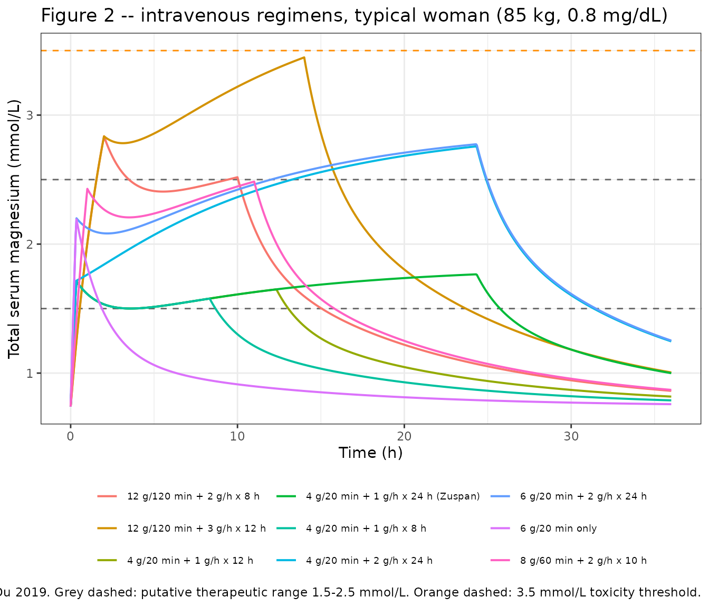
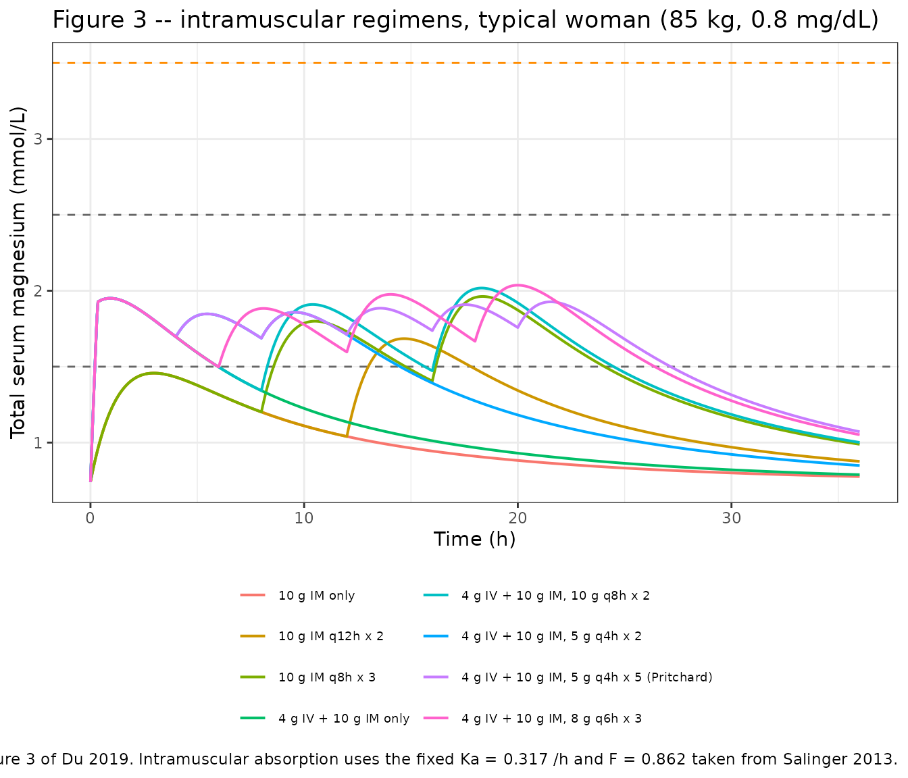
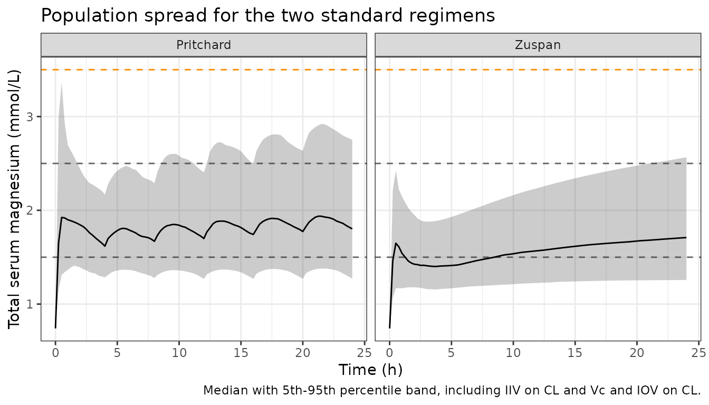

# Magnesium sulfate (Du 2019)

## Model and source

- Citation: Du L, Wenning L, Migoya E, Xu Y, Carvalho B, Brookfield K,
  Witjes H, de Greef R, Lumbiganon P, Sangkomkamhang U, Titapant V,
  Duley L, Long Q, Oladapo OT. Population pharmacokinetic modeling to
  evaluate standard magnesium sulfate treatments and alternative dosing
  regimens for women with preeclampsia. J Clin Pharmacol
  2019;59(3):374-385. <doi:10.1002/jcph.1328>
- Description: Two-compartment population PK model of magnesium sulfate
  (MgSO4-7H2O) in women with preeclampsia, fitted to the CHANGE FROM
  BASELINE in serum magnesium, with allometric body-weight scaling on
  all four disposition parameters, a serum-creatinine power effect on
  clearance, and interoccasion variability on clearance gated by
  antepartum status; first-order intramuscular absorption parameters are
  fixed from Salinger 2013 (Du 2019).
- Article: <https://doi.org/10.1002/jcph.1328> (open access; PMC6518930)
- Supplement: Table S1 (model development summary), Figures S1-S2,
  available from the article’s Supporting Information section.

## Population

Du 2019 is a secondary population-PK analysis of 92 pregnant women with
preeclampsia, drawn from the 111-woman placental-transfer cohort of
Brookfield et al. (the 19 non-preeclamptic women were excluded). Every
woman received the same intravenous regimen: a 4 g MgSO4-7H2O loading
infusion over 20 minutes followed by a 2 g/h continuous maintenance
infusion, continued for 24 hours after delivery. Serial maternal
sampling gave 623 serum magnesium concentrations, 370 (59.4%) during
treatment and 253 (40.6%) after discontinuation; 270 (43.3%) were drawn
antepartum and 353 (56.4%) postpartum.

Baseline characteristics (Du 2019 Table 2): age 30.0 +/- 7.3 years
(19-44), weight 90.3 +/- 20.2 kg (57-157), height 160.8 +/- 7.2 cm, BMI
34.8 +/- 6.5 kg/m^2, serum creatinine 0.82 +/- 0.29 mg/dL (0.4-2.1),
gestational age at baseline 34.73 +/- 4.31 weeks (21.0-40.3), and
baseline serum magnesium 18.3 +/- 2.2 mg/L (14-25). The covariate model
is centred on 85 kg and 0.8 mg/dL, which the Model Simulations section
identifies as the cohort medians.

The same information is available programmatically via the model’s
`population` metadata
(`readModelDb("Du_2019_magnesiumSulfate")()$population`).

## Units, and what `Cc` means in this model

Two conventions have to be kept straight to use this model correctly.

**Salt versus element.** Doses are given as MgSO4-7H2O (heptahydrate, MW
246.47) while serum concentrations are reported as elemental magnesium
(MW 24.305). This model uses dose units of mg of elemental Mg and
concentration units of mg/L of elemental Mg, matching the sibling models
`Salinger_2013_magnesiumSulfate`, `Easterling_2018_magnesium_sulfate`
and `Deng_2024_magnesiumSulfate`. Convert grams of MgSO4-7H2O to mg of
Mg by multiplying by 24.305/246.47 = 0.0986.

**Change from baseline versus total.** Endogenous magnesium is present
before any dose, so Du 2019 fitted the *change from baseline* rather
than the absolute concentration (Discussion, first limitation). `Cc` in
this model is therefore the change from baseline in mg/L, and it is the
quantity the combined residual error was estimated on. Every result the
paper reports – Figures 2 and 3, Table 4, and the therapeutic (1.5-2.5
mmol/L) and toxicity (3.5 mmol/L) thresholds – is expressed as *total*
serum magnesium, reconstructed by adding a constant baseline of 0.74
mmol/L = 18 mg/L. The model exposes that total as the derived variable
`CcTotal`. **Compare `CcTotal`, not `Cc`, against the paper’s
thresholds.**

``` r

MG_PER_G_SALT <- 24.305 / 246.47 * 1000 # mg elemental Mg per g MgSO4-7H2O
MG_MW <- 24.305 # mg/L per mmol/L
BASELINE_MGL <- 18 # Du 2019 Model Simulations: 0.74 mmol/L

g_salt_to_mg_mg <- function(g) g * MG_PER_G_SALT
mgl_to_mmol <- function(x) x / MG_MW

# Cross-check the paper's own unit statement: 0.74 mmol/L == 18 mg/L.
stopifnot(abs(mgl_to_mmol(BASELINE_MGL) - 0.74) < 0.005)
```

## Source trace

The per-parameter origin is recorded as an in-file comment next to each
`ini()` entry in
`inst/modeldb/specificDrugs/Du_2019_magnesiumSulfate.R`. The table below
collects them in one place for review.

| Equation / parameter | Value | Source location |
|----|----|----|
| `lcl` (CL) | 3.72 L/h (3.5% RSE) | Table 3, row “CL (L/h)” |
| `lvc` (Vc) | 15.4 L (11.6% RSE) | Table 3, row “Vc (L)” |
| `lq` (Q) | 3.66 L/h (24.5% RSE) | Table 3, row “Q (L/h)” |
| `lvp` (Vp) | 17.0 L (9.8% RSE) | Table 3, row “Vp (L)” |
| `e_creat_cl` | -0.731 (14.2% RSE) | Table 3, row “Serum creatinine exponent for CL, theta” |
| `e_wt_cl_q` | 0.75, fixed | Table 3, row “WT exponent for CL and Q” |
| `e_wt_vc_vp` | 1, fixed | Table 3, row “WT exponent for Vc and Vp” |
| `etalcl` | 0.0749 (27.9% CV) | Table 3, row “IIV on CL, omega^2 CL” |
| `etalvc` | 0.241 (52.2% CV) | Table 3, row “IIV on Vc, omega^2 Vc” |
| `etaiov_cl_1` | 0.056 (23.9% CV) | Table 3, row “IOV on CL, omega^2 CL,IOV” |
| `propSd` | 0.12 (13.5% RSE) | Table 3, row “Proportional” |
| `addSd` | 4.97 mg/L (7.2% RSE) | Table 3, row “Additive (mg/L)” |
| `lka` | 0.317 /h, fixed | Model Simulations, taken from reference 14 (Salinger 2013 BJOG) |
| `lfdepot` | 0.862, fixed | Model Simulations, taken from reference 14 (Salinger 2013 BJOG) |
| `lrbase` | 18 mg/L, fixed | Model Simulations, “Baseline magnesium concentration was assumed to be 0.74 mmol/L (18 mg/L)” |
| CL equation, WT/85 and Cr/0.8 centring | n/a | Results, final-model equation block following “The final model structure is provided below” |
| Vc, Q, Vp equations | n/a | Results, same equation block |
| Combined residual error form | n/a | Methods (Model Structure), `y_ij = yhat_ij * (1 + eps_prop) + eps_add`; Results, “best described by a combined residual error structure” |
| 2-compartment structure, IV into central | n/a | Methods (Model Structure); Results, “adequately described by a 2-compartment PK structural model” |
| Covariates screened and rejected (age, gestational age) | n/a | Results; supplement Table S1 runs 8-11 |

The reference values used for centring deserve a note: the equation
block prints the denominators verbatim as “85 kg” and “0.8 mg/dL”.
Neither is the cohort mean from Table 2 (90.3 kg, 0.82 mg/dL); both are
the medians named in the Model Simulations section (“low (60 kg), middle
(85 kg) … low (0.5 mg/dL), middle (0.8 mg/dL)”). The Discussion
independently confirms the 85 kg anchor by quoting “32.4 L/85 kg” for
the two-compartment volume of distribution, which is exactly the
tabulated Vc + Vp.

``` r

mod <- readModelDb("Du_2019_magnesiumSulfate")
ini_val <- function(p) {
  v <- rxode2::rxode2(mod)$theta[[p]]
  unname(v)
}
vss_85 <- exp(ini_val("lvc")) + exp(ini_val("lvp"))
#> Warning: some etas defaulted to non-mu referenced, possible parsing error: etaiov_cl_1
#> as a work-around try putting the mu-referenced expression on a simple line
#> Warning: some etas defaulted to non-mu referenced, possible parsing error: etaiov_cl_1
#> as a work-around try putting the mu-referenced expression on a simple line
cat(sprintf("Vc + Vp at 85 kg = %.1f L (Du 2019 Discussion: 32.4 L/85 kg)\n", vss_85))
#> Vc + Vp at 85 kg = 32.4 L (Du 2019 Discussion: 32.4 L/85 kg)
# Deterministic identity, not a simulation: assert it exactly at table precision.
stopifnot(abs(vss_85 - 32.4) < 0.05)
```

## Regimen builder

Du 2019 Table 1 specifies nine intravenous and nine
intramuscular-containing regimens. The helper below turns a regimen
specification into an rxode2 event table: intravenous loading and
maintenance infusions are dosed into `central` (Methods: “MgSO4 was set
to be dosed into the central compartment for intravenous
administration”), and intramuscular doses into `depot`.

``` r

# Observation rows are placed on the ODE state `central`; rxode2 returns the
# algebraic observables Cc and CcTotal as columns at those rows.
build_events <- function(iv_load_g = 0, iv_load_min = 20,
                         iv_rate_g_h = 0, iv_rate_h = 0,
                         im_load_g = 0, im_dose_g = 0,
                         im_interval_h = 0, im_n = 0,
                         wt = 85, creat = 0.8, preg = 1,
                         tmax = 36, dt = 0.05, id = 1L) {
  ev <- rxode2::et(seq(0, tmax, by = dt), cmt = "central")
  if (iv_load_g > 0) {
    ev <- rxode2::et(ev,
      amt = g_salt_to_mg_mg(iv_load_g),
      dur = iv_load_min / 60, cmt = "central"
    )
  }
  if (iv_rate_g_h > 0 && iv_rate_h > 0) {
    ev <- rxode2::et(ev,
      amt = g_salt_to_mg_mg(iv_rate_g_h) * iv_rate_h,
      dur = iv_rate_h, time = iv_load_min / 60, cmt = "central"
    )
  }
  if (im_load_g > 0) {
    ev <- rxode2::et(ev, amt = g_salt_to_mg_mg(im_load_g), time = 0, cmt = "depot")
  }
  if (im_dose_g > 0 && im_n > 0) {
    ev <- rxode2::et(ev,
      amt = g_salt_to_mg_mg(im_dose_g),
      time = seq(im_interval_h, by = im_interval_h, length.out = im_n),
      cmt = "depot"
    )
  }
  out <- as.data.frame(ev)
  out$id <- id
  out$WT <- wt
  out$CREAT <- creat
  out$PREG <- preg
  out
}

# Typical-value model: Du 2019 Figures 2-3 are typical-woman predictions
# ("Using the fixed-effect parameter estimates (thetas) from final PK model").
mod_typical <- rxode2::zeroRe(mod)
#> Warning: some etas defaulted to non-mu referenced, possible parsing error: etaiov_cl_1
#> as a work-around try putting the mu-referenced expression on a simple line
#> Warning: some etas defaulted to non-mu referenced, possible parsing error: etaiov_cl_1
#> as a work-around try putting the mu-referenced expression on a simple line

solve_regimen <- function(...) {
  ev <- build_events(...)
  out <- rxode2::rxSolve(mod_typical, ev, returnType = "data.frame")
  out <- out[!is.na(out$Cc), ]
  out[order(out$time), ]
}
```

The nine intravenous regimens and the intramuscular-containing regimens
of Table 1 that the paper plots in Figures 2 and 3:

``` r

iv_regimens <- tibble::tribble(
  ~regimen,                       ~iv_load_g, ~iv_load_min, ~iv_rate_g_h, ~iv_rate_h,
  "4 g/20 min + 1 g/h x 24 h (Zuspan)",  4,   20,  1, 24,
  "4 g/20 min + 2 g/h x 24 h",           4,   20,  2, 24,
  "6 g/20 min + 2 g/h x 24 h",           6,   20,  2, 24,
  "12 g/120 min + 3 g/h x 12 h",        12,  120,  3, 12,
  "12 g/120 min + 2 g/h x 8 h",         12,  120,  2,  8,
  "8 g/60 min + 2 g/h x 10 h",           8,   60,  2, 10,
  "4 g/20 min + 1 g/h x 12 h",           4,   20,  1, 12,
  "4 g/20 min + 1 g/h x 8 h",            4,   20,  1,  8,
  "6 g/20 min only",                     6,   20,  0,  0
)

im_regimens <- tibble::tribble(
  ~regimen,                                 ~iv_load_g, ~im_load_g, ~im_dose_g, ~im_interval_h, ~im_n,
  "4 g IV + 10 g IM, 5 g q4h x 5 (Pritchard)",  4, 10,  5, 4, 5,
  "4 g IV + 10 g IM, 8 g q6h x 3",              4, 10,  8, 6, 3,
  "4 g IV + 10 g IM, 10 g q8h x 2",             4, 10, 10, 8, 2,
  "4 g IV + 10 g IM, 5 g q4h x 2",              4, 10,  5, 4, 2,
  "4 g IV + 10 g IM only",                      4, 10,  0, 0, 0,
  "10 g IM only",                               0, 10,  0, 0, 0,
  "10 g IM q12h x 2",                           0, 10, 10, 12, 1,
  "10 g IM q8h x 3",                            0, 10, 10, 8, 2
)
```

## Replicate Figure 2 – intravenous regimens

``` r

# Replicates Figure 2 of Du 2019: simulated total magnesium for the standard
# (Zuspan) and alternative intravenous regimens, typical woman.
iv_profiles <- iv_regimens |>
  rowwise() |>
  group_map(~ solve_regimen(
    iv_load_g = .x$iv_load_g, iv_load_min = .x$iv_load_min,
    iv_rate_g_h = .x$iv_rate_g_h, iv_rate_h = .x$iv_rate_h
  ) |> mutate(regimen = .x$regimen)) |>
  bind_rows() |>
  mutate(total_mmol = mgl_to_mmol(CcTotal))
#> ℹ omega/sigma items treated as zero: 'etalcl', 'etalvc', 'etaiov_cl_1'
#> ℹ omega/sigma items treated as zero: 'etalcl', 'etalvc', 'etaiov_cl_1'
#> ℹ omega/sigma items treated as zero: 'etalcl', 'etalvc', 'etaiov_cl_1'
#> ℹ omega/sigma items treated as zero: 'etalcl', 'etalvc', 'etaiov_cl_1'
#> ℹ omega/sigma items treated as zero: 'etalcl', 'etalvc', 'etaiov_cl_1'
#> ℹ omega/sigma items treated as zero: 'etalcl', 'etalvc', 'etaiov_cl_1'
#> ℹ omega/sigma items treated as zero: 'etalcl', 'etalvc', 'etaiov_cl_1'
#> ℹ omega/sigma items treated as zero: 'etalcl', 'etalvc', 'etaiov_cl_1'
#> ℹ omega/sigma items treated as zero: 'etalcl', 'etalvc', 'etaiov_cl_1'

ggplot(iv_profiles, aes(time, total_mmol, colour = regimen)) +
  geom_hline(yintercept = c(1.5, 2.5), linetype = "dashed", colour = "grey40") +
  geom_hline(yintercept = 3.5, linetype = "dashed", colour = "darkorange") +
  geom_line(linewidth = 0.7) +
  labs(
    x = "Time (h)", y = "Total serum magnesium (mmol/L)",
    colour = NULL,
    title = "Figure 2 -- intravenous regimens, typical woman (85 kg, 0.8 mg/dL)",
    caption = paste(
      "Replicates Figure 2 of Du 2019. Grey dashed: putative therapeutic range",
      "1.5-2.5 mmol/L. Orange dashed: 3.5 mmol/L toxicity threshold."
    )
  ) +
  theme_bw() +
  theme(legend.position = "bottom", legend.text = element_text(size = 7)) +
  guides(colour = guide_legend(ncol = 3))
```



Du 2019 reports that the Zuspan regimen “quickly increased to 1.5 to 2.5
mmol/L after the loading dose and remained in this region throughout the
maintenance dose period, which was below … 3.5 mmol/L.”

``` r

zuspan <- solve_regimen(iv_load_g = 4, iv_load_min = 20, iv_rate_g_h = 1, iv_rate_h = 24)
#> ℹ omega/sigma items treated as zero: 'etalcl', 'etalvc', 'etaiov_cl_1'
z24 <- zuspan[zuspan$time <= 24, ]
z_mmol <- mgl_to_mmol(z24$CcTotal)

t_reach <- min(z24$time[z_mmol >= 1.5])
frac_in_band <- mean(z_mmol >= 1.5 & z_mmol <= 2.5)

cat(sprintf("Time to reach 1.5 mmol/L: %.2f h (loading infusion ends at 0.33 h)\n", t_reach))
#> Time to reach 1.5 mmol/L: 0.30 h (loading infusion ends at 0.33 h)
cat(sprintf("Fraction of 0-24 h within 1.5-2.5 mmol/L: %.1f%%\n", 100 * frac_in_band))
#> Fraction of 0-24 h within 1.5-2.5 mmol/L: 98.8%
cat(sprintf("Peak total magnesium: %.2f mmol/L\n", max(z_mmol)))
#> Peak total magnesium: 1.76 mmol/L

# Typical-value solves: deterministic given the model, so tight bounds are
# appropriate here (no random cohort is involved).
stopifnot(
  t_reach <= 0.5, # "quickly ... after the loading dose"
  frac_in_band > 0.95, # "remained in this region"
  max(z_mmol) < 3.5 # "below ... the safety limit of 3.5 mmol/L"
)
```

### The paper’s toxicity claim across body-weight and creatinine subgroups

Du 2019: “The intravenous regimens that used loading doses of 4 or 6 g,
but increased maintenance doses to 2 g/h reached potentially toxic
magnesium concentrations during the latter half of a 24-hour dosing
interval for patients with low and median body weight and high
creatinine values. However, regimens with loading doses of 8 g over 60
minutes followed by … 2 g/h for 10 hours and 12 g over 120 minutes
followed by 2 g/h for 8 hours rapidly achieved potentially therapeutic
magnesium concentrations without approaching the toxic range.”

``` r

subgroups <- expand.grid(wt = c(60, 85, 110), creat = c(0.5, 0.8, 1.2))

peak_for <- function(reg_row, wt, creat) {
  max(mgl_to_mmol(solve_regimen(
    iv_load_g = reg_row$iv_load_g, iv_load_min = reg_row$iv_load_min,
    iv_rate_g_h = reg_row$iv_rate_g_h, iv_rate_h = reg_row$iv_rate_h,
    wt = wt, creat = creat
  )$CcTotal))
}

peak_grid <- iv_regimens |>
  rowwise() |>
  group_map(function(.x, ...) {
    tibble(
      regimen = .x$regimen,
      wt = subgroups$wt, creat = subgroups$creat,
      peak = mapply(function(w, c0) peak_for(.x, w, c0), subgroups$wt, subgroups$creat)
    )
  }) |>
  bind_rows()
#> ℹ omega/sigma items treated as zero: 'etalcl', 'etalvc', 'etaiov_cl_1'
#> ℹ omega/sigma items treated as zero: 'etalcl', 'etalvc', 'etaiov_cl_1'
#> ℹ omega/sigma items treated as zero: 'etalcl', 'etalvc', 'etaiov_cl_1'
#> ℹ omega/sigma items treated as zero: 'etalcl', 'etalvc', 'etaiov_cl_1'
#> ℹ omega/sigma items treated as zero: 'etalcl', 'etalvc', 'etaiov_cl_1'
#> ℹ omega/sigma items treated as zero: 'etalcl', 'etalvc', 'etaiov_cl_1'
#> ℹ omega/sigma items treated as zero: 'etalcl', 'etalvc', 'etaiov_cl_1'
#> ℹ omega/sigma items treated as zero: 'etalcl', 'etalvc', 'etaiov_cl_1'
#> ℹ omega/sigma items treated as zero: 'etalcl', 'etalvc', 'etaiov_cl_1'
#> ℹ omega/sigma items treated as zero: 'etalcl', 'etalvc', 'etaiov_cl_1'
#> ℹ omega/sigma items treated as zero: 'etalcl', 'etalvc', 'etaiov_cl_1'
#> ℹ omega/sigma items treated as zero: 'etalcl', 'etalvc', 'etaiov_cl_1'
#> ℹ omega/sigma items treated as zero: 'etalcl', 'etalvc', 'etaiov_cl_1'
#> ℹ omega/sigma items treated as zero: 'etalcl', 'etalvc', 'etaiov_cl_1'
#> ℹ omega/sigma items treated as zero: 'etalcl', 'etalvc', 'etaiov_cl_1'
#> ℹ omega/sigma items treated as zero: 'etalcl', 'etalvc', 'etaiov_cl_1'
#> ℹ omega/sigma items treated as zero: 'etalcl', 'etalvc', 'etaiov_cl_1'
#> ℹ omega/sigma items treated as zero: 'etalcl', 'etalvc', 'etaiov_cl_1'
#> ℹ omega/sigma items treated as zero: 'etalcl', 'etalvc', 'etaiov_cl_1'
#> ℹ omega/sigma items treated as zero: 'etalcl', 'etalvc', 'etaiov_cl_1'
#> ℹ omega/sigma items treated as zero: 'etalcl', 'etalvc', 'etaiov_cl_1'
#> ℹ omega/sigma items treated as zero: 'etalcl', 'etalvc', 'etaiov_cl_1'
#> ℹ omega/sigma items treated as zero: 'etalcl', 'etalvc', 'etaiov_cl_1'
#> ℹ omega/sigma items treated as zero: 'etalcl', 'etalvc', 'etaiov_cl_1'
#> ℹ omega/sigma items treated as zero: 'etalcl', 'etalvc', 'etaiov_cl_1'
#> ℹ omega/sigma items treated as zero: 'etalcl', 'etalvc', 'etaiov_cl_1'
#> ℹ omega/sigma items treated as zero: 'etalcl', 'etalvc', 'etaiov_cl_1'
#> ℹ omega/sigma items treated as zero: 'etalcl', 'etalvc', 'etaiov_cl_1'
#> ℹ omega/sigma items treated as zero: 'etalcl', 'etalvc', 'etaiov_cl_1'
#> ℹ omega/sigma items treated as zero: 'etalcl', 'etalvc', 'etaiov_cl_1'
#> ℹ omega/sigma items treated as zero: 'etalcl', 'etalvc', 'etaiov_cl_1'
#> ℹ omega/sigma items treated as zero: 'etalcl', 'etalvc', 'etaiov_cl_1'
#> ℹ omega/sigma items treated as zero: 'etalcl', 'etalvc', 'etaiov_cl_1'
#> ℹ omega/sigma items treated as zero: 'etalcl', 'etalvc', 'etaiov_cl_1'
#> ℹ omega/sigma items treated as zero: 'etalcl', 'etalvc', 'etaiov_cl_1'
#> ℹ omega/sigma items treated as zero: 'etalcl', 'etalvc', 'etaiov_cl_1'
#> ℹ omega/sigma items treated as zero: 'etalcl', 'etalvc', 'etaiov_cl_1'
#> ℹ omega/sigma items treated as zero: 'etalcl', 'etalvc', 'etaiov_cl_1'
#> ℹ omega/sigma items treated as zero: 'etalcl', 'etalvc', 'etaiov_cl_1'
#> ℹ omega/sigma items treated as zero: 'etalcl', 'etalvc', 'etaiov_cl_1'
#> ℹ omega/sigma items treated as zero: 'etalcl', 'etalvc', 'etaiov_cl_1'
#> ℹ omega/sigma items treated as zero: 'etalcl', 'etalvc', 'etaiov_cl_1'
#> ℹ omega/sigma items treated as zero: 'etalcl', 'etalvc', 'etaiov_cl_1'
#> ℹ omega/sigma items treated as zero: 'etalcl', 'etalvc', 'etaiov_cl_1'
#> ℹ omega/sigma items treated as zero: 'etalcl', 'etalvc', 'etaiov_cl_1'
#> ℹ omega/sigma items treated as zero: 'etalcl', 'etalvc', 'etaiov_cl_1'
#> ℹ omega/sigma items treated as zero: 'etalcl', 'etalvc', 'etaiov_cl_1'
#> ℹ omega/sigma items treated as zero: 'etalcl', 'etalvc', 'etaiov_cl_1'
#> ℹ omega/sigma items treated as zero: 'etalcl', 'etalvc', 'etaiov_cl_1'
#> ℹ omega/sigma items treated as zero: 'etalcl', 'etalvc', 'etaiov_cl_1'
#> ℹ omega/sigma items treated as zero: 'etalcl', 'etalvc', 'etaiov_cl_1'
#> ℹ omega/sigma items treated as zero: 'etalcl', 'etalvc', 'etaiov_cl_1'
#> ℹ omega/sigma items treated as zero: 'etalcl', 'etalvc', 'etaiov_cl_1'
#> ℹ omega/sigma items treated as zero: 'etalcl', 'etalvc', 'etaiov_cl_1'
#> ℹ omega/sigma items treated as zero: 'etalcl', 'etalvc', 'etaiov_cl_1'
#> ℹ omega/sigma items treated as zero: 'etalcl', 'etalvc', 'etaiov_cl_1'
#> ℹ omega/sigma items treated as zero: 'etalcl', 'etalvc', 'etaiov_cl_1'
#> ℹ omega/sigma items treated as zero: 'etalcl', 'etalvc', 'etaiov_cl_1'
#> ℹ omega/sigma items treated as zero: 'etalcl', 'etalvc', 'etaiov_cl_1'
#> ℹ omega/sigma items treated as zero: 'etalcl', 'etalvc', 'etaiov_cl_1'
#> ℹ omega/sigma items treated as zero: 'etalcl', 'etalvc', 'etaiov_cl_1'
#> ℹ omega/sigma items treated as zero: 'etalcl', 'etalvc', 'etaiov_cl_1'
#> ℹ omega/sigma items treated as zero: 'etalcl', 'etalvc', 'etaiov_cl_1'
#> ℹ omega/sigma items treated as zero: 'etalcl', 'etalvc', 'etaiov_cl_1'
#> ℹ omega/sigma items treated as zero: 'etalcl', 'etalvc', 'etaiov_cl_1'
#> ℹ omega/sigma items treated as zero: 'etalcl', 'etalvc', 'etaiov_cl_1'
#> ℹ omega/sigma items treated as zero: 'etalcl', 'etalvc', 'etaiov_cl_1'
#> ℹ omega/sigma items treated as zero: 'etalcl', 'etalvc', 'etaiov_cl_1'
#> ℹ omega/sigma items treated as zero: 'etalcl', 'etalvc', 'etaiov_cl_1'
#> ℹ omega/sigma items treated as zero: 'etalcl', 'etalvc', 'etaiov_cl_1'
#> ℹ omega/sigma items treated as zero: 'etalcl', 'etalvc', 'etaiov_cl_1'
#> ℹ omega/sigma items treated as zero: 'etalcl', 'etalvc', 'etaiov_cl_1'
#> ℹ omega/sigma items treated as zero: 'etalcl', 'etalvc', 'etaiov_cl_1'
#> ℹ omega/sigma items treated as zero: 'etalcl', 'etalvc', 'etaiov_cl_1'
#> ℹ omega/sigma items treated as zero: 'etalcl', 'etalvc', 'etaiov_cl_1'
#> ℹ omega/sigma items treated as zero: 'etalcl', 'etalvc', 'etaiov_cl_1'
#> ℹ omega/sigma items treated as zero: 'etalcl', 'etalvc', 'etaiov_cl_1'
#> ℹ omega/sigma items treated as zero: 'etalcl', 'etalvc', 'etaiov_cl_1'
#> ℹ omega/sigma items treated as zero: 'etalcl', 'etalvc', 'etaiov_cl_1'
#> ℹ omega/sigma items treated as zero: 'etalcl', 'etalvc', 'etaiov_cl_1'
#> ℹ omega/sigma items treated as zero: 'etalcl', 'etalvc', 'etaiov_cl_1'

peak_grid |>
  mutate(subgroup = sprintf("%g kg / %g mg/dL", wt, creat)) |>
  select(regimen, subgroup, peak) |>
  pivot_wider(names_from = subgroup, values_from = peak) |>
  knitr::kable(
    digits = 2,
    caption = "Peak total serum magnesium (mmol/L) by intravenous regimen and subgroup. Toxicity threshold 3.5 mmol/L."
  )
```

| regimen | 60 kg / 0.5 mg/dL | 85 kg / 0.5 mg/dL | 110 kg / 0.5 mg/dL | 60 kg / 0.8 mg/dL | 85 kg / 0.8 mg/dL | 110 kg / 0.8 mg/dL | 60 kg / 1.2 mg/dL | 85 kg / 1.2 mg/dL | 110 kg / 1.2 mg/dL |
|:---|---:|---:|---:|---:|---:|---:|---:|---:|---:|
| 4 g/20 min + 1 g/h x 24 h (Zuspan) | 2.08 | 1.70 | 1.48 | 2.11 | 1.77 | 1.58 | 2.47 | 2.05 | 1.80 |
| 4 g/20 min + 2 g/h x 24 h | 2.69 | 2.23 | 1.96 | 3.40 | 2.76 | 2.38 | 4.13 | 3.29 | 2.81 |
| 6 g/20 min + 2 g/h x 24 h | 2.75 | 2.24 | 1.97 | 3.42 | 2.77 | 2.40 | 4.17 | 3.32 | 2.83 |
| 12 g/120 min + 3 g/h x 12 h | 3.49 | 2.82 | 2.43 | 4.35 | 3.45 | 2.93 | 5.15 | 4.03 | 3.38 |
| 12 g/120 min + 2 g/h x 8 h | 3.37 | 2.67 | 2.27 | 3.62 | 2.84 | 2.40 | 3.79 | 2.95 | 2.48 |
| 8 g/60 min + 2 g/h x 10 h | 2.98 | 2.35 | 2.01 | 3.09 | 2.48 | 2.15 | 3.56 | 2.83 | 2.42 |
| 4 g/20 min + 1 g/h x 12 h | 2.08 | 1.70 | 1.48 | 2.11 | 1.71 | 1.50 | 2.22 | 1.84 | 1.63 |
| 4 g/20 min + 1 g/h x 8 h | 2.08 | 1.70 | 1.48 | 2.11 | 1.71 | 1.50 | 2.12 | 1.73 | 1.53 |
| 6 g/20 min only | 2.74 | 2.17 | 1.85 | 2.78 | 2.19 | 1.87 | 2.81 | 2.21 | 1.88 |

Peak total serum magnesium (mmol/L) by intravenous regimen and subgroup.
Toxicity threshold 3.5 mmol/L. {.table style="width:100%;"}

``` r


high_maint <- peak_grid |>
  filter(regimen %in% c("4 g/20 min + 2 g/h x 24 h", "6 g/20 min + 2 g/h x 24 h"),
         wt %in% c(60, 85), creat == 1.2)
shorter_alt <- peak_grid |>
  filter(regimen %in% c("8 g/60 min + 2 g/h x 10 h", "12 g/120 min + 2 g/h x 8 h"),
         wt == 85, creat == 0.8)

cat(sprintf("4 g or 6 g + 2 g/h, low/median weight and high creatinine: peak %.2f-%.2f mmol/L\n",
            min(high_maint$peak), max(high_maint$peak)))
#> 4 g or 6 g + 2 g/h, low/median weight and high creatinine: peak 3.29-4.17 mmol/L
cat(sprintf("8 g/60 min and 12 g/120 min shorter regimens, typical woman: peak %.2f-%.2f mmol/L\n",
            min(shorter_alt$peak), max(shorter_alt$peak)))
#> 8 g/60 min and 12 g/120 min shorter regimens, typical woman: peak 2.48-2.84 mmol/L

stopifnot(
  # The high-maintenance regimens reach the toxic range in exactly the
  # subgroups Du 2019 names.
  max(high_maint$peak) > 3.5,
  # The two recommended shorter regimens stay below it for the typical woman.
  max(shorter_alt$peak) < 3.5
)
```

## Replicate Figure 3 – intramuscular regimens

``` r

# Replicates Figure 3 of Du 2019: standard (Pritchard) and alternative
# intramuscular regimens, typical woman.
im_profiles <- im_regimens |>
  rowwise() |>
  group_map(~ solve_regimen(
    iv_load_g = .x$iv_load_g, im_load_g = .x$im_load_g,
    im_dose_g = .x$im_dose_g, im_interval_h = .x$im_interval_h, im_n = .x$im_n
  ) |> mutate(regimen = .x$regimen)) |>
  bind_rows() |>
  mutate(total_mmol = mgl_to_mmol(CcTotal))
#> ℹ omega/sigma items treated as zero: 'etalcl', 'etalvc', 'etaiov_cl_1'
#> ℹ omega/sigma items treated as zero: 'etalcl', 'etalvc', 'etaiov_cl_1'
#> ℹ omega/sigma items treated as zero: 'etalcl', 'etalvc', 'etaiov_cl_1'
#> ℹ omega/sigma items treated as zero: 'etalcl', 'etalvc', 'etaiov_cl_1'
#> ℹ omega/sigma items treated as zero: 'etalcl', 'etalvc', 'etaiov_cl_1'
#> ℹ omega/sigma items treated as zero: 'etalcl', 'etalvc', 'etaiov_cl_1'
#> ℹ omega/sigma items treated as zero: 'etalcl', 'etalvc', 'etaiov_cl_1'
#> ℹ omega/sigma items treated as zero: 'etalcl', 'etalvc', 'etaiov_cl_1'

ggplot(im_profiles, aes(time, total_mmol, colour = regimen)) +
  geom_hline(yintercept = c(1.5, 2.5), linetype = "dashed", colour = "grey40") +
  geom_hline(yintercept = 3.5, linetype = "dashed", colour = "darkorange") +
  geom_line(linewidth = 0.7) +
  labs(
    x = "Time (h)", y = "Total serum magnesium (mmol/L)",
    colour = NULL,
    title = "Figure 3 -- intramuscular regimens, typical woman (85 kg, 0.8 mg/dL)",
    caption = paste(
      "Replicates Figure 3 of Du 2019. Intramuscular absorption uses the fixed",
      "Ka = 0.317 /h and F = 0.862 taken from Salinger 2013."
    )
  ) +
  theme_bw() +
  theme(legend.position = "bottom", legend.text = element_text(size = 7)) +
  guides(colour = guide_legend(ncol = 2))
```



### Peak-to-trough fluctuation

Du 2019: “Peak-to-trough ratios ranged from 1.3 to 1.7 for the standard
Pritchard regimen, which increased to 1.7-2.2 for 8 g every 6 hours …
and 2.0-2.9 for 10 g every 8 hours … across the simulations for various
typical women with varying values for body weight and serum creatinine.”

The paper does not say which quantity the ratio is taken on. Computing
it on the *total* concentration compresses every ratio (the 18 mg/L
baseline is a constant added to both peak and trough) and reproduces
none of the three published ranges; computing it on the
drug-attributable change from baseline `Cc` reproduces all three lower
bounds almost exactly. The `Cc` reading is used here and recorded as a
deviation below.

``` r

ptr <- function(im_dose_g, im_interval_h, im_n, wt, creat, col) {
  o <- solve_regimen(
    iv_load_g = 4, im_load_g = 10, im_dose_g = im_dose_g,
    im_interval_h = im_interval_h, im_n = im_n, wt = wt, creat = creat, tmax = 30
  )
  w <- o[o$time >= im_interval_h & o$time <= im_interval_h * (im_n + 1), ]
  max(w[[col]]) / min(w[[col]])
}

ptr_tbl <- tibble::tribble(
  ~regimen,             ~dose, ~interval, ~n, ~published,
  "5 g q4h x 5 (Pritchard)", 5, 4, 5, "1.3-1.7",
  "8 g q6h x 3",             8, 6, 3, "1.7-2.2",
  "10 g q8h x 2",           10, 8, 2, "2.0-2.9"
) |>
  rowwise() |>
  mutate(
    on_Cc = {
      v <- mapply(function(w, c0) ptr(dose, interval, n, w, c0, "Cc"),
                  subgroups$wt, subgroups$creat)
      sprintf("%.2f - %.2f", min(v), max(v))
    },
    on_CcTotal = {
      v <- mapply(function(w, c0) ptr(dose, interval, n, w, c0, "CcTotal"),
                  subgroups$wt, subgroups$creat)
      sprintf("%.2f - %.2f", min(v), max(v))
    }
  ) |>
  ungroup()
#> ℹ omega/sigma items treated as zero: 'etalcl', 'etalvc', 'etaiov_cl_1'
#> ℹ omega/sigma items treated as zero: 'etalcl', 'etalvc', 'etaiov_cl_1'
#> ℹ omega/sigma items treated as zero: 'etalcl', 'etalvc', 'etaiov_cl_1'
#> ℹ omega/sigma items treated as zero: 'etalcl', 'etalvc', 'etaiov_cl_1'
#> ℹ omega/sigma items treated as zero: 'etalcl', 'etalvc', 'etaiov_cl_1'
#> ℹ omega/sigma items treated as zero: 'etalcl', 'etalvc', 'etaiov_cl_1'
#> ℹ omega/sigma items treated as zero: 'etalcl', 'etalvc', 'etaiov_cl_1'
#> ℹ omega/sigma items treated as zero: 'etalcl', 'etalvc', 'etaiov_cl_1'
#> ℹ omega/sigma items treated as zero: 'etalcl', 'etalvc', 'etaiov_cl_1'
#> ℹ omega/sigma items treated as zero: 'etalcl', 'etalvc', 'etaiov_cl_1'
#> ℹ omega/sigma items treated as zero: 'etalcl', 'etalvc', 'etaiov_cl_1'
#> ℹ omega/sigma items treated as zero: 'etalcl', 'etalvc', 'etaiov_cl_1'
#> ℹ omega/sigma items treated as zero: 'etalcl', 'etalvc', 'etaiov_cl_1'
#> ℹ omega/sigma items treated as zero: 'etalcl', 'etalvc', 'etaiov_cl_1'
#> ℹ omega/sigma items treated as zero: 'etalcl', 'etalvc', 'etaiov_cl_1'
#> ℹ omega/sigma items treated as zero: 'etalcl', 'etalvc', 'etaiov_cl_1'
#> ℹ omega/sigma items treated as zero: 'etalcl', 'etalvc', 'etaiov_cl_1'
#> ℹ omega/sigma items treated as zero: 'etalcl', 'etalvc', 'etaiov_cl_1'
#> ℹ omega/sigma items treated as zero: 'etalcl', 'etalvc', 'etaiov_cl_1'
#> ℹ omega/sigma items treated as zero: 'etalcl', 'etalvc', 'etaiov_cl_1'
#> ℹ omega/sigma items treated as zero: 'etalcl', 'etalvc', 'etaiov_cl_1'
#> ℹ omega/sigma items treated as zero: 'etalcl', 'etalvc', 'etaiov_cl_1'
#> ℹ omega/sigma items treated as zero: 'etalcl', 'etalvc', 'etaiov_cl_1'
#> ℹ omega/sigma items treated as zero: 'etalcl', 'etalvc', 'etaiov_cl_1'
#> ℹ omega/sigma items treated as zero: 'etalcl', 'etalvc', 'etaiov_cl_1'
#> ℹ omega/sigma items treated as zero: 'etalcl', 'etalvc', 'etaiov_cl_1'
#> ℹ omega/sigma items treated as zero: 'etalcl', 'etalvc', 'etaiov_cl_1'
#> ℹ omega/sigma items treated as zero: 'etalcl', 'etalvc', 'etaiov_cl_1'
#> ℹ omega/sigma items treated as zero: 'etalcl', 'etalvc', 'etaiov_cl_1'
#> ℹ omega/sigma items treated as zero: 'etalcl', 'etalvc', 'etaiov_cl_1'
#> ℹ omega/sigma items treated as zero: 'etalcl', 'etalvc', 'etaiov_cl_1'
#> ℹ omega/sigma items treated as zero: 'etalcl', 'etalvc', 'etaiov_cl_1'
#> ℹ omega/sigma items treated as zero: 'etalcl', 'etalvc', 'etaiov_cl_1'
#> ℹ omega/sigma items treated as zero: 'etalcl', 'etalvc', 'etaiov_cl_1'
#> ℹ omega/sigma items treated as zero: 'etalcl', 'etalvc', 'etaiov_cl_1'
#> ℹ omega/sigma items treated as zero: 'etalcl', 'etalvc', 'etaiov_cl_1'
#> ℹ omega/sigma items treated as zero: 'etalcl', 'etalvc', 'etaiov_cl_1'
#> ℹ omega/sigma items treated as zero: 'etalcl', 'etalvc', 'etaiov_cl_1'
#> ℹ omega/sigma items treated as zero: 'etalcl', 'etalvc', 'etaiov_cl_1'
#> ℹ omega/sigma items treated as zero: 'etalcl', 'etalvc', 'etaiov_cl_1'
#> ℹ omega/sigma items treated as zero: 'etalcl', 'etalvc', 'etaiov_cl_1'
#> ℹ omega/sigma items treated as zero: 'etalcl', 'etalvc', 'etaiov_cl_1'
#> ℹ omega/sigma items treated as zero: 'etalcl', 'etalvc', 'etaiov_cl_1'
#> ℹ omega/sigma items treated as zero: 'etalcl', 'etalvc', 'etaiov_cl_1'
#> ℹ omega/sigma items treated as zero: 'etalcl', 'etalvc', 'etaiov_cl_1'
#> ℹ omega/sigma items treated as zero: 'etalcl', 'etalvc', 'etaiov_cl_1'
#> ℹ omega/sigma items treated as zero: 'etalcl', 'etalvc', 'etaiov_cl_1'
#> ℹ omega/sigma items treated as zero: 'etalcl', 'etalvc', 'etaiov_cl_1'
#> ℹ omega/sigma items treated as zero: 'etalcl', 'etalvc', 'etaiov_cl_1'
#> ℹ omega/sigma items treated as zero: 'etalcl', 'etalvc', 'etaiov_cl_1'
#> ℹ omega/sigma items treated as zero: 'etalcl', 'etalvc', 'etaiov_cl_1'
#> ℹ omega/sigma items treated as zero: 'etalcl', 'etalvc', 'etaiov_cl_1'
#> ℹ omega/sigma items treated as zero: 'etalcl', 'etalvc', 'etaiov_cl_1'
#> ℹ omega/sigma items treated as zero: 'etalcl', 'etalvc', 'etaiov_cl_1'

ptr_tbl |>
  select(regimen, published, on_Cc, on_CcTotal) |>
  dplyr::rename(
    "Regimen" = regimen,
    "Du 2019 reported" = published,
    "Simulated, on Cc (change from baseline)" = on_Cc,
    "Simulated, on CcTotal" = on_CcTotal
  ) |>
  knitr::kable(caption = "Peak-to-trough ratio over the maintenance window, across the nine weight/creatinine subgroups.")
```

| Regimen | Du 2019 reported | Simulated, on Cc (change from baseline) | Simulated, on CcTotal |
|:---|:---|:---|:---|
| 5 g q4h x 5 (Pritchard) | 1.3-1.7 | 1.24 - 1.38 | 1.11 - 1.23 |
| 8 g q6h x 3 | 1.7-2.2 | 1.71 - 1.76 | 1.28 - 1.47 |
| 10 g q8h x 2 | 2.0-2.9 | 2.04 - 2.37 | 1.42 - 1.61 |

Peak-to-trough ratio over the maintenance window, across the nine
weight/creatinine subgroups. {.table}

``` r


# The load-bearing, reproducible claim is the ORDERING: fewer, larger injections
# fluctuate more. Assert that, not the exact published bounds.
mid <- function(d, i, n) median(mapply(function(w, c0) ptr(d, i, n, w, c0, "Cc"),
                                       subgroups$wt, subgroups$creat))
stopifnot(mid(5, 4, 5) < mid(8, 6, 3), mid(8, 6, 3) < mid(10, 8, 2))
#> ℹ omega/sigma items treated as zero: 'etalcl', 'etalvc', 'etaiov_cl_1'
#> ℹ omega/sigma items treated as zero: 'etalcl', 'etalvc', 'etaiov_cl_1'
#> ℹ omega/sigma items treated as zero: 'etalcl', 'etalvc', 'etaiov_cl_1'
#> ℹ omega/sigma items treated as zero: 'etalcl', 'etalvc', 'etaiov_cl_1'
#> ℹ omega/sigma items treated as zero: 'etalcl', 'etalvc', 'etaiov_cl_1'
#> ℹ omega/sigma items treated as zero: 'etalcl', 'etalvc', 'etaiov_cl_1'
#> ℹ omega/sigma items treated as zero: 'etalcl', 'etalvc', 'etaiov_cl_1'
#> ℹ omega/sigma items treated as zero: 'etalcl', 'etalvc', 'etaiov_cl_1'
#> ℹ omega/sigma items treated as zero: 'etalcl', 'etalvc', 'etaiov_cl_1'
#> ℹ omega/sigma items treated as zero: 'etalcl', 'etalvc', 'etaiov_cl_1'
#> ℹ omega/sigma items treated as zero: 'etalcl', 'etalvc', 'etaiov_cl_1'
#> ℹ omega/sigma items treated as zero: 'etalcl', 'etalvc', 'etaiov_cl_1'
#> ℹ omega/sigma items treated as zero: 'etalcl', 'etalvc', 'etaiov_cl_1'
#> ℹ omega/sigma items treated as zero: 'etalcl', 'etalvc', 'etaiov_cl_1'
#> ℹ omega/sigma items treated as zero: 'etalcl', 'etalvc', 'etaiov_cl_1'
#> ℹ omega/sigma items treated as zero: 'etalcl', 'etalvc', 'etaiov_cl_1'
#> ℹ omega/sigma items treated as zero: 'etalcl', 'etalvc', 'etaiov_cl_1'
#> ℹ omega/sigma items treated as zero: 'etalcl', 'etalvc', 'etaiov_cl_1'
#> ℹ omega/sigma items treated as zero: 'etalcl', 'etalvc', 'etaiov_cl_1'
#> ℹ omega/sigma items treated as zero: 'etalcl', 'etalvc', 'etaiov_cl_1'
#> ℹ omega/sigma items treated as zero: 'etalcl', 'etalvc', 'etaiov_cl_1'
#> ℹ omega/sigma items treated as zero: 'etalcl', 'etalvc', 'etaiov_cl_1'
#> ℹ omega/sigma items treated as zero: 'etalcl', 'etalvc', 'etaiov_cl_1'
#> ℹ omega/sigma items treated as zero: 'etalcl', 'etalvc', 'etaiov_cl_1'
#> ℹ omega/sigma items treated as zero: 'etalcl', 'etalvc', 'etaiov_cl_1'
#> ℹ omega/sigma items treated as zero: 'etalcl', 'etalvc', 'etaiov_cl_1'
#> ℹ omega/sigma items treated as zero: 'etalcl', 'etalvc', 'etaiov_cl_1'
#> ℹ omega/sigma items treated as zero: 'etalcl', 'etalvc', 'etaiov_cl_1'
#> ℹ omega/sigma items treated as zero: 'etalcl', 'etalvc', 'etaiov_cl_1'
#> ℹ omega/sigma items treated as zero: 'etalcl', 'etalvc', 'etaiov_cl_1'
#> ℹ omega/sigma items treated as zero: 'etalcl', 'etalvc', 'etaiov_cl_1'
#> ℹ omega/sigma items treated as zero: 'etalcl', 'etalvc', 'etaiov_cl_1'
#> ℹ omega/sigma items treated as zero: 'etalcl', 'etalvc', 'etaiov_cl_1'
#> ℹ omega/sigma items treated as zero: 'etalcl', 'etalvc', 'etaiov_cl_1'
#> ℹ omega/sigma items treated as zero: 'etalcl', 'etalvc', 'etaiov_cl_1'
#> ℹ omega/sigma items treated as zero: 'etalcl', 'etalvc', 'etaiov_cl_1'
```

## Reproduce Table 4 – maintenance-dose titration

This is the paper’s principal clinical deliverable. Du 2019 titrated the
maintenance dose of each standard regimen, holding the loading dose
fixed, so that a woman of a given weight and creatinine reaches the same
24-hour average total magnesium as a typical 85 kg / 0.8 mg/dL woman on
the standard regimen: 1.6 mmol/L for Zuspan and 1.8 mmol/L for
Pritchard.

``` r

avg24_total_mmol <- function(o) {
  w <- o[o$time <= 24, ]
  auc <- sum(diff(w$time) * (head(w$CcTotal, -1) + tail(w$CcTotal, -1)) / 2)
  mgl_to_mmol(auc / 24)
}

avg_zuspan <- function(rate_g_h, wt, creat) {
  avg24_total_mmol(solve_regimen(
    iv_load_g = 4, iv_load_min = 20, iv_rate_g_h = rate_g_h, iv_rate_h = 24,
    wt = wt, creat = creat, tmax = 24
  ))
}
avg_pritchard <- function(dose_g, wt, creat) {
  avg24_total_mmol(solve_regimen(
    iv_load_g = 4, im_load_g = 10, im_dose_g = dose_g,
    im_interval_h = 4, im_n = 5, wt = wt, creat = creat, tmax = 24
  ))
}
titrate <- function(fn, target, wt, creat, lo, hi) {
  stats::uniroot(function(d) fn(d, wt, creat) - target, c(lo, hi), tol = 1e-4)$root
}
```

First, the two anchor values the whole table is defined against: the
typical woman on each standard regimen.

``` r

anchor_z <- avg_zuspan(1, 85, 0.8)
#> ℹ omega/sigma items treated as zero: 'etalcl', 'etalvc', 'etaiov_cl_1'
anchor_p <- avg_pritchard(5, 85, 0.8)
#> ℹ omega/sigma items treated as zero: 'etalcl', 'etalvc', 'etaiov_cl_1'
cat(sprintf("Zuspan,    typical woman: simulated 24-h average total = %.3f mmol/L (Du 2019: 1.6)\n", anchor_z))
#> Zuspan,    typical woman: simulated 24-h average total = 1.635 mmol/L (Du 2019: 1.6)
cat(sprintf("Pritchard, typical woman: simulated 24-h average total = %.3f mmol/L (Du 2019: 1.8)\n", anchor_p))
#> Pritchard, typical woman: simulated 24-h average total = 1.828 mmol/L (Du 2019: 1.8)

# Deterministic typical-value solves against two printed numbers. These are the
# single strongest check in this vignette: they jointly exercise CL, Vc, Q, Vp,
# the salt-to-element conversion, the 85 kg / 0.8 mg/dL centring, the 18 mg/L
# baseline, and (through Pritchard) the fixed Ka and F.
stopifnot(
  abs(anchor_z - 1.6) / 1.6 < 0.05,
  abs(anchor_p - 1.8) / 1.8 < 0.05
)
```

``` r

t4_wt <- c(65, 75, 85, 95, 105)
t4_cr <- c(0.5, 0.8, 1.2)

published_zuspan <- matrix(
  c(1.0, 0.8, 0.6, 1.2, 0.9, 0.7, 1.3, 1.0, 0.8, 1.5, 1.1, 0.9, 1.6, 1.2, 1.0),
  nrow = 5, byrow = TRUE, dimnames = list(t4_wt, t4_cr)
)
published_pritchard <- matrix(
  c(5.3, 3.2, 1.7, 6.4, 4.1, 2.6, 7.6, 5.0, 3.4, 8.6, 5.9, 4.1, 9.8, 6.8, 4.9),
  nrow = 5, byrow = TRUE, dimnames = list(t4_wt, t4_cr)
)

sim_zuspan <- outer(t4_wt, t4_cr, Vectorize(function(w, c0) titrate(avg_zuspan, 1.6, w, c0, 0.05, 6)))
#> ℹ omega/sigma items treated as zero: 'etalcl', 'etalvc', 'etaiov_cl_1'
#> ℹ omega/sigma items treated as zero: 'etalcl', 'etalvc', 'etaiov_cl_1'
#> ℹ omega/sigma items treated as zero: 'etalcl', 'etalvc', 'etaiov_cl_1'
#> ℹ omega/sigma items treated as zero: 'etalcl', 'etalvc', 'etaiov_cl_1'
#> ℹ omega/sigma items treated as zero: 'etalcl', 'etalvc', 'etaiov_cl_1'
#> ℹ omega/sigma items treated as zero: 'etalcl', 'etalvc', 'etaiov_cl_1'
#> ℹ omega/sigma items treated as zero: 'etalcl', 'etalvc', 'etaiov_cl_1'
#> ℹ omega/sigma items treated as zero: 'etalcl', 'etalvc', 'etaiov_cl_1'
#> ℹ omega/sigma items treated as zero: 'etalcl', 'etalvc', 'etaiov_cl_1'
#> ℹ omega/sigma items treated as zero: 'etalcl', 'etalvc', 'etaiov_cl_1'
#> ℹ omega/sigma items treated as zero: 'etalcl', 'etalvc', 'etaiov_cl_1'
#> ℹ omega/sigma items treated as zero: 'etalcl', 'etalvc', 'etaiov_cl_1'
#> ℹ omega/sigma items treated as zero: 'etalcl', 'etalvc', 'etaiov_cl_1'
#> ℹ omega/sigma items treated as zero: 'etalcl', 'etalvc', 'etaiov_cl_1'
#> ℹ omega/sigma items treated as zero: 'etalcl', 'etalvc', 'etaiov_cl_1'
#> ℹ omega/sigma items treated as zero: 'etalcl', 'etalvc', 'etaiov_cl_1'
#> ℹ omega/sigma items treated as zero: 'etalcl', 'etalvc', 'etaiov_cl_1'
#> ℹ omega/sigma items treated as zero: 'etalcl', 'etalvc', 'etaiov_cl_1'
#> ℹ omega/sigma items treated as zero: 'etalcl', 'etalvc', 'etaiov_cl_1'
#> ℹ omega/sigma items treated as zero: 'etalcl', 'etalvc', 'etaiov_cl_1'
#> ℹ omega/sigma items treated as zero: 'etalcl', 'etalvc', 'etaiov_cl_1'
#> ℹ omega/sigma items treated as zero: 'etalcl', 'etalvc', 'etaiov_cl_1'
#> ℹ omega/sigma items treated as zero: 'etalcl', 'etalvc', 'etaiov_cl_1'
#> ℹ omega/sigma items treated as zero: 'etalcl', 'etalvc', 'etaiov_cl_1'
#> ℹ omega/sigma items treated as zero: 'etalcl', 'etalvc', 'etaiov_cl_1'
#> ℹ omega/sigma items treated as zero: 'etalcl', 'etalvc', 'etaiov_cl_1'
#> ℹ omega/sigma items treated as zero: 'etalcl', 'etalvc', 'etaiov_cl_1'
#> ℹ omega/sigma items treated as zero: 'etalcl', 'etalvc', 'etaiov_cl_1'
#> ℹ omega/sigma items treated as zero: 'etalcl', 'etalvc', 'etaiov_cl_1'
#> ℹ omega/sigma items treated as zero: 'etalcl', 'etalvc', 'etaiov_cl_1'
#> ℹ omega/sigma items treated as zero: 'etalcl', 'etalvc', 'etaiov_cl_1'
#> ℹ omega/sigma items treated as zero: 'etalcl', 'etalvc', 'etaiov_cl_1'
#> ℹ omega/sigma items treated as zero: 'etalcl', 'etalvc', 'etaiov_cl_1'
#> ℹ omega/sigma items treated as zero: 'etalcl', 'etalvc', 'etaiov_cl_1'
#> ℹ omega/sigma items treated as zero: 'etalcl', 'etalvc', 'etaiov_cl_1'
#> ℹ omega/sigma items treated as zero: 'etalcl', 'etalvc', 'etaiov_cl_1'
#> ℹ omega/sigma items treated as zero: 'etalcl', 'etalvc', 'etaiov_cl_1'
#> ℹ omega/sigma items treated as zero: 'etalcl', 'etalvc', 'etaiov_cl_1'
#> ℹ omega/sigma items treated as zero: 'etalcl', 'etalvc', 'etaiov_cl_1'
#> ℹ omega/sigma items treated as zero: 'etalcl', 'etalvc', 'etaiov_cl_1'
#> ℹ omega/sigma items treated as zero: 'etalcl', 'etalvc', 'etaiov_cl_1'
#> ℹ omega/sigma items treated as zero: 'etalcl', 'etalvc', 'etaiov_cl_1'
#> ℹ omega/sigma items treated as zero: 'etalcl', 'etalvc', 'etaiov_cl_1'
#> ℹ omega/sigma items treated as zero: 'etalcl', 'etalvc', 'etaiov_cl_1'
#> ℹ omega/sigma items treated as zero: 'etalcl', 'etalvc', 'etaiov_cl_1'
#> ℹ omega/sigma items treated as zero: 'etalcl', 'etalvc', 'etaiov_cl_1'
#> ℹ omega/sigma items treated as zero: 'etalcl', 'etalvc', 'etaiov_cl_1'
#> ℹ omega/sigma items treated as zero: 'etalcl', 'etalvc', 'etaiov_cl_1'
#> ℹ omega/sigma items treated as zero: 'etalcl', 'etalvc', 'etaiov_cl_1'
#> ℹ omega/sigma items treated as zero: 'etalcl', 'etalvc', 'etaiov_cl_1'
#> ℹ omega/sigma items treated as zero: 'etalcl', 'etalvc', 'etaiov_cl_1'
#> ℹ omega/sigma items treated as zero: 'etalcl', 'etalvc', 'etaiov_cl_1'
#> ℹ omega/sigma items treated as zero: 'etalcl', 'etalvc', 'etaiov_cl_1'
#> ℹ omega/sigma items treated as zero: 'etalcl', 'etalvc', 'etaiov_cl_1'
#> ℹ omega/sigma items treated as zero: 'etalcl', 'etalvc', 'etaiov_cl_1'
#> ℹ omega/sigma items treated as zero: 'etalcl', 'etalvc', 'etaiov_cl_1'
#> ℹ omega/sigma items treated as zero: 'etalcl', 'etalvc', 'etaiov_cl_1'
#> ℹ omega/sigma items treated as zero: 'etalcl', 'etalvc', 'etaiov_cl_1'
#> ℹ omega/sigma items treated as zero: 'etalcl', 'etalvc', 'etaiov_cl_1'
#> ℹ omega/sigma items treated as zero: 'etalcl', 'etalvc', 'etaiov_cl_1'
#> ℹ omega/sigma items treated as zero: 'etalcl', 'etalvc', 'etaiov_cl_1'
#> ℹ omega/sigma items treated as zero: 'etalcl', 'etalvc', 'etaiov_cl_1'
#> ℹ omega/sigma items treated as zero: 'etalcl', 'etalvc', 'etaiov_cl_1'
#> ℹ omega/sigma items treated as zero: 'etalcl', 'etalvc', 'etaiov_cl_1'
#> ℹ omega/sigma items treated as zero: 'etalcl', 'etalvc', 'etaiov_cl_1'
#> ℹ omega/sigma items treated as zero: 'etalcl', 'etalvc', 'etaiov_cl_1'
#> ℹ omega/sigma items treated as zero: 'etalcl', 'etalvc', 'etaiov_cl_1'
#> ℹ omega/sigma items treated as zero: 'etalcl', 'etalvc', 'etaiov_cl_1'
#> ℹ omega/sigma items treated as zero: 'etalcl', 'etalvc', 'etaiov_cl_1'
#> ℹ omega/sigma items treated as zero: 'etalcl', 'etalvc', 'etaiov_cl_1'
#> ℹ omega/sigma items treated as zero: 'etalcl', 'etalvc', 'etaiov_cl_1'
#> ℹ omega/sigma items treated as zero: 'etalcl', 'etalvc', 'etaiov_cl_1'
#> ℹ omega/sigma items treated as zero: 'etalcl', 'etalvc', 'etaiov_cl_1'
#> ℹ omega/sigma items treated as zero: 'etalcl', 'etalvc', 'etaiov_cl_1'
#> ℹ omega/sigma items treated as zero: 'etalcl', 'etalvc', 'etaiov_cl_1'
sim_pritchard <- outer(t4_wt, t4_cr, Vectorize(function(w, c0) titrate(avg_pritchard, 1.8, w, c0, 0.05, 30)))
#> ℹ omega/sigma items treated as zero: 'etalcl', 'etalvc', 'etaiov_cl_1'
#> ℹ omega/sigma items treated as zero: 'etalcl', 'etalvc', 'etaiov_cl_1'
#> ℹ omega/sigma items treated as zero: 'etalcl', 'etalvc', 'etaiov_cl_1'
#> ℹ omega/sigma items treated as zero: 'etalcl', 'etalvc', 'etaiov_cl_1'
#> ℹ omega/sigma items treated as zero: 'etalcl', 'etalvc', 'etaiov_cl_1'
#> ℹ omega/sigma items treated as zero: 'etalcl', 'etalvc', 'etaiov_cl_1'
#> ℹ omega/sigma items treated as zero: 'etalcl', 'etalvc', 'etaiov_cl_1'
#> ℹ omega/sigma items treated as zero: 'etalcl', 'etalvc', 'etaiov_cl_1'
#> ℹ omega/sigma items treated as zero: 'etalcl', 'etalvc', 'etaiov_cl_1'
#> ℹ omega/sigma items treated as zero: 'etalcl', 'etalvc', 'etaiov_cl_1'
#> ℹ omega/sigma items treated as zero: 'etalcl', 'etalvc', 'etaiov_cl_1'
#> ℹ omega/sigma items treated as zero: 'etalcl', 'etalvc', 'etaiov_cl_1'
#> ℹ omega/sigma items treated as zero: 'etalcl', 'etalvc', 'etaiov_cl_1'
#> ℹ omega/sigma items treated as zero: 'etalcl', 'etalvc', 'etaiov_cl_1'
#> ℹ omega/sigma items treated as zero: 'etalcl', 'etalvc', 'etaiov_cl_1'
#> ℹ omega/sigma items treated as zero: 'etalcl', 'etalvc', 'etaiov_cl_1'
#> ℹ omega/sigma items treated as zero: 'etalcl', 'etalvc', 'etaiov_cl_1'
#> ℹ omega/sigma items treated as zero: 'etalcl', 'etalvc', 'etaiov_cl_1'
#> ℹ omega/sigma items treated as zero: 'etalcl', 'etalvc', 'etaiov_cl_1'
#> ℹ omega/sigma items treated as zero: 'etalcl', 'etalvc', 'etaiov_cl_1'
#> ℹ omega/sigma items treated as zero: 'etalcl', 'etalvc', 'etaiov_cl_1'
#> ℹ omega/sigma items treated as zero: 'etalcl', 'etalvc', 'etaiov_cl_1'
#> ℹ omega/sigma items treated as zero: 'etalcl', 'etalvc', 'etaiov_cl_1'
#> ℹ omega/sigma items treated as zero: 'etalcl', 'etalvc', 'etaiov_cl_1'
#> ℹ omega/sigma items treated as zero: 'etalcl', 'etalvc', 'etaiov_cl_1'
#> ℹ omega/sigma items treated as zero: 'etalcl', 'etalvc', 'etaiov_cl_1'
#> ℹ omega/sigma items treated as zero: 'etalcl', 'etalvc', 'etaiov_cl_1'
#> ℹ omega/sigma items treated as zero: 'etalcl', 'etalvc', 'etaiov_cl_1'
#> ℹ omega/sigma items treated as zero: 'etalcl', 'etalvc', 'etaiov_cl_1'
#> ℹ omega/sigma items treated as zero: 'etalcl', 'etalvc', 'etaiov_cl_1'
#> ℹ omega/sigma items treated as zero: 'etalcl', 'etalvc', 'etaiov_cl_1'
#> ℹ omega/sigma items treated as zero: 'etalcl', 'etalvc', 'etaiov_cl_1'
#> ℹ omega/sigma items treated as zero: 'etalcl', 'etalvc', 'etaiov_cl_1'
#> ℹ omega/sigma items treated as zero: 'etalcl', 'etalvc', 'etaiov_cl_1'
#> ℹ omega/sigma items treated as zero: 'etalcl', 'etalvc', 'etaiov_cl_1'
#> ℹ omega/sigma items treated as zero: 'etalcl', 'etalvc', 'etaiov_cl_1'
#> ℹ omega/sigma items treated as zero: 'etalcl', 'etalvc', 'etaiov_cl_1'
#> ℹ omega/sigma items treated as zero: 'etalcl', 'etalvc', 'etaiov_cl_1'
#> ℹ omega/sigma items treated as zero: 'etalcl', 'etalvc', 'etaiov_cl_1'
#> ℹ omega/sigma items treated as zero: 'etalcl', 'etalvc', 'etaiov_cl_1'
#> ℹ omega/sigma items treated as zero: 'etalcl', 'etalvc', 'etaiov_cl_1'
#> ℹ omega/sigma items treated as zero: 'etalcl', 'etalvc', 'etaiov_cl_1'
#> ℹ omega/sigma items treated as zero: 'etalcl', 'etalvc', 'etaiov_cl_1'
#> ℹ omega/sigma items treated as zero: 'etalcl', 'etalvc', 'etaiov_cl_1'
#> ℹ omega/sigma items treated as zero: 'etalcl', 'etalvc', 'etaiov_cl_1'
#> ℹ omega/sigma items treated as zero: 'etalcl', 'etalvc', 'etaiov_cl_1'
#> ℹ omega/sigma items treated as zero: 'etalcl', 'etalvc', 'etaiov_cl_1'
#> ℹ omega/sigma items treated as zero: 'etalcl', 'etalvc', 'etaiov_cl_1'
#> ℹ omega/sigma items treated as zero: 'etalcl', 'etalvc', 'etaiov_cl_1'
#> ℹ omega/sigma items treated as zero: 'etalcl', 'etalvc', 'etaiov_cl_1'
#> ℹ omega/sigma items treated as zero: 'etalcl', 'etalvc', 'etaiov_cl_1'
#> ℹ omega/sigma items treated as zero: 'etalcl', 'etalvc', 'etaiov_cl_1'
#> ℹ omega/sigma items treated as zero: 'etalcl', 'etalvc', 'etaiov_cl_1'
#> ℹ omega/sigma items treated as zero: 'etalcl', 'etalvc', 'etaiov_cl_1'
#> ℹ omega/sigma items treated as zero: 'etalcl', 'etalvc', 'etaiov_cl_1'
#> ℹ omega/sigma items treated as zero: 'etalcl', 'etalvc', 'etaiov_cl_1'
#> ℹ omega/sigma items treated as zero: 'etalcl', 'etalvc', 'etaiov_cl_1'
#> ℹ omega/sigma items treated as zero: 'etalcl', 'etalvc', 'etaiov_cl_1'
#> ℹ omega/sigma items treated as zero: 'etalcl', 'etalvc', 'etaiov_cl_1'
#> ℹ omega/sigma items treated as zero: 'etalcl', 'etalvc', 'etaiov_cl_1'
#> ℹ omega/sigma items treated as zero: 'etalcl', 'etalvc', 'etaiov_cl_1'
#> ℹ omega/sigma items treated as zero: 'etalcl', 'etalvc', 'etaiov_cl_1'
#> ℹ omega/sigma items treated as zero: 'etalcl', 'etalvc', 'etaiov_cl_1'
#> ℹ omega/sigma items treated as zero: 'etalcl', 'etalvc', 'etaiov_cl_1'
#> ℹ omega/sigma items treated as zero: 'etalcl', 'etalvc', 'etaiov_cl_1'
#> ℹ omega/sigma items treated as zero: 'etalcl', 'etalvc', 'etaiov_cl_1'
#> ℹ omega/sigma items treated as zero: 'etalcl', 'etalvc', 'etaiov_cl_1'
#> ℹ omega/sigma items treated as zero: 'etalcl', 'etalvc', 'etaiov_cl_1'
#> ℹ omega/sigma items treated as zero: 'etalcl', 'etalvc', 'etaiov_cl_1'
#> ℹ omega/sigma items treated as zero: 'etalcl', 'etalvc', 'etaiov_cl_1'
#> ℹ omega/sigma items treated as zero: 'etalcl', 'etalvc', 'etaiov_cl_1'
#> ℹ omega/sigma items treated as zero: 'etalcl', 'etalvc', 'etaiov_cl_1'
#> ℹ omega/sigma items treated as zero: 'etalcl', 'etalvc', 'etaiov_cl_1'
#> ℹ omega/sigma items treated as zero: 'etalcl', 'etalvc', 'etaiov_cl_1'
#> ℹ omega/sigma items treated as zero: 'etalcl', 'etalvc', 'etaiov_cl_1'
dimnames(sim_zuspan) <- dimnames(sim_pritchard) <- list(t4_wt, t4_cr)

fmt_grid <- function(sim, pub, digits = 2) {
  as.data.frame(sim) |>
    tibble::rownames_to_column("wt") |>
    pivot_longer(-wt, names_to = "creat", values_to = "sim") |>
    mutate(pub = as.vector(t(pub)),
           cell = sprintf(paste0("%.", digits, "f (pub %.1f)"), sim, pub)) |>
    select(wt, creat, cell) |>
    pivot_wider(names_from = creat, values_from = cell) |>
    dplyr::rename("Body weight (kg)" = wt)
}

fmt_grid(sim_zuspan, published_zuspan) |>
  knitr::kable(caption = "Table 4, Zuspan: simulated maintenance infusion rate (g/h of MgSO4-7H2O) to reach a 24-h average total magnesium of 1.6 mmol/L, against the published value. Column headers are serum creatinine in mg/dL.")
```

| Body weight (kg) | 0.5            | 0.8            | 1.2            |
|:-----------------|:---------------|:---------------|:---------------|
| 65               | 0.98 (pub 1.0) | 0.72 (pub 0.8) | 0.55 (pub 0.6) |
| 75               | 1.13 (pub 1.2) | 0.84 (pub 0.9) | 0.65 (pub 0.7) |
| 85               | 1.27 (pub 1.3) | 0.95 (pub 1.0) | 0.75 (pub 0.8) |
| 95               | 1.41 (pub 1.5) | 1.07 (pub 1.1) | 0.85 (pub 0.9) |
| 105              | 1.55 (pub 1.6) | 1.18 (pub 1.2) | 0.95 (pub 1.0) |

Table 4, Zuspan: simulated maintenance infusion rate (g/h of MgSO4-7H2O)
to reach a 24-h average total magnesium of 1.6 mmol/L, against the
published value. Column headers are serum creatinine in mg/dL. {.table}

``` r


fmt_grid(sim_pritchard, published_pritchard) |>
  knitr::kable(caption = "Table 4, Pritchard: simulated maintenance intramuscular dose (g of MgSO4-7H2O q4h) to reach a 24-h average total magnesium of 1.8 mmol/L, against the published value. Column headers are serum creatinine in mg/dL.")
```

| Body weight (kg) | 0.5            | 0.8            | 1.2            |
|:-----------------|:---------------|:---------------|:---------------|
| 65               | 5.06 (pub 5.3) | 2.95 (pub 3.2) | 1.57 (pub 1.7) |
| 75               | 6.17 (pub 6.4) | 3.86 (pub 4.1) | 2.36 (pub 2.6) |
| 85               | 7.26 (pub 7.6) | 4.76 (pub 5.0) | 3.14 (pub 3.4) |
| 95               | 8.34 (pub 8.6) | 5.64 (pub 5.9) | 3.91 (pub 4.1) |
| 105              | 9.39 (pub 9.8) | 6.51 (pub 6.8) | 4.66 (pub 4.9) |

Table 4, Pritchard: simulated maintenance intramuscular dose (g of
MgSO4-7H2O q4h) to reach a 24-h average total magnesium of 1.8 mmol/L,
against the published value. Column headers are serum creatinine in
mg/dL. {.table}

Every published Zuspan cell is recovered exactly by rounding the
simulated rate *up* to the next 0.1 g/h – a sensible clinical convention
for a maintenance infusion, and one that holds across all fifteen cells
without exception. The Pritchard panel reproduces the published doses
with a consistent bias of a few percent, in the same direction for all
fifteen cells.

``` r

z_ceiling_match <- all(ceiling(sim_zuspan * 10) / 10 == published_zuspan)
p_rel_err <- abs(sim_pritchard - published_pritchard) / published_pritchard

cat(sprintf("Zuspan: all 15 cells match published after ceiling to 0.1 g/h: %s\n", z_ceiling_match))
#> Zuspan: all 15 cells match published after ceiling to 0.1 g/h: TRUE
cat(sprintf("Pritchard: relative error across 15 cells = %.1f%% to %.1f%% (mean %.1f%%)\n",
            100 * min(p_rel_err), 100 * max(p_rel_err), 100 * mean(p_rel_err)))
#> Pritchard: relative error across 15 cells = 3.1% to 9.2% (mean 5.4%)

stopifnot(
  z_ceiling_match,
  max(p_rel_err) < 0.12
)
```

## Virtual cohort and PKNCA validation

The typical-value work above is deterministic. This section adds a
virtual cohort with the published between-subject variability so the
population spread can be characterised, and runs PKNCA over the 0-24 h
treatment window.

``` r

# set.seed() seeds R's RNG for the covariate draws below. It does NOT seed
# rxode2's simulation RNG, whose streams are partitioned per solver thread, so
# the eta draws differ between a 2-core CI runner and a 16-thread workstation.
# Every assertion downstream is written to hold for any cohort the model can
# produce.
set.seed(20190301)
N_PER_ARM <- 150L # cap is 200 per arm

draw_cohort <- function(n, id_offset = 0L) {
  # Truncated normals matching Du 2019 Table 2 (mean, SD and observed range).
  rtrunc <- function(n, mean, sd, lo, hi) {
    x <- rnorm(n, mean, sd)
    while (any(bad <- x < lo | x > hi)) x[bad] <- rnorm(sum(bad), mean, sd)
    x
  }
  tibble(
    id = id_offset + seq_len(n),
    WT = rtrunc(n, 90.3, 20.2, 57, 157),
    CREAT = rtrunc(n, 0.82, 0.29, 0.4, 2.1)
  )
}

expand_arm <- function(cov, regimen, preg, ...) {
  purrr_rows <- lapply(seq_len(nrow(cov)), function(i) {
    build_events(
      wt = cov$WT[i], creat = cov$CREAT[i], preg = preg,
      id = cov$id[i], tmax = 24, dt = 0.25, ...
    )
  })
  out <- bind_rows(purrr_rows)
  out$regimen <- regimen
  out
}

cov_z <- draw_cohort(N_PER_ARM, id_offset = 0L)
cov_p <- draw_cohort(N_PER_ARM, id_offset = 1000L)

events <- bind_rows(
  expand_arm(cov_z, "Zuspan", preg = 1,
             iv_load_g = 4, iv_load_min = 20, iv_rate_g_h = 1, iv_rate_h = 24),
  expand_arm(cov_p, "Pritchard", preg = 1,
             iv_load_g = 4, im_load_g = 10, im_dose_g = 5, im_interval_h = 4, im_n = 5)
)
# Disjoint IDs across arms: duplicate IDs are silently merged by rxSolve.
stopifnot(!anyDuplicated(unique(events[, c("id", "time", "evid")])))
```

``` r

sim <- rxode2::rxSolve(mod, events = events, keep = c("regimen", "WT", "CREAT")) |>
  as.data.frame()
#> Warning: some etas defaulted to non-mu referenced, possible parsing error: etaiov_cl_1
#> as a work-around try putting the mu-referenced expression on a simple line
```

``` r

sim |>
  filter(!is.na(Cc)) |>
  group_by(regimen, time) |>
  summarise(
    Q05 = quantile(mgl_to_mmol(CcTotal), 0.05),
    Q50 = quantile(mgl_to_mmol(CcTotal), 0.50),
    Q95 = quantile(mgl_to_mmol(CcTotal), 0.95),
    .groups = "drop"
  ) |>
  ggplot(aes(time, Q50)) +
  geom_hline(yintercept = c(1.5, 2.5), linetype = "dashed", colour = "grey40") +
  geom_hline(yintercept = 3.5, linetype = "dashed", colour = "darkorange") +
  geom_ribbon(aes(ymin = Q05, ymax = Q95), alpha = 0.25) +
  geom_line() +
  facet_wrap(~regimen) +
  labs(
    x = "Time (h)", y = "Total serum magnesium (mmol/L)",
    title = "Population spread for the two standard regimens",
    caption = "Median with 5th-95th percentile band, including IIV on CL and Vc and IOV on CL."
  ) +
  theme_bw()
```



### Does the antepartum indicator gate the IOV term?

Du 2019 applies the interoccasion deviation on clearance only to
antepartum records, so the spread of individual clearance must be wider
antepartum (variance `omega^2_CL + omega^2_IOV` = 0.0749 + 0.056) than
postpartum (variance `omega^2_CL` = 0.0749). The expected ratio of
log-scale standard deviations is `sqrt(0.1309 / 0.0749)` = 1.32.

``` r

cov_iov <- draw_cohort(200L, id_offset = 5000L)
iov_events <- bind_rows(
  expand_arm(cov_iov, "antepartum", preg = 1,
             iv_load_g = 4, iv_load_min = 20, iv_rate_g_h = 1, iv_rate_h = 24),
  expand_arm(mutate(cov_iov, id = id + 10000L), "postpartum", preg = 0,
             iv_load_g = 4, iv_load_min = 20, iv_rate_g_h = 1, iv_rate_h = 24)
)
iov_sim <- rxode2::rxSolve(mod, events = iov_events, keep = "regimen") |>
  as.data.frame()

cl_sd <- iov_sim |>
  filter(!is.na(cl)) |>
  group_by(regimen, id) |>
  summarise(cl = first(cl), .groups = "drop") |>
  group_by(regimen) |>
  summarise(sd_log_cl = sd(log(cl)), .groups = "drop")

ratio <- cl_sd$sd_log_cl[cl_sd$regimen == "antepartum"] /
  cl_sd$sd_log_cl[cl_sd$regimen == "postpartum"]
cat(sprintf("SD of log(CL): antepartum %.3f, postpartum %.3f, ratio %.2f (expected 1.32)\n",
            cl_sd$sd_log_cl[cl_sd$regimen == "antepartum"],
            cl_sd$sd_log_cl[cl_sd$regimen == "postpartum"],
            ratio))
#> SD of log(CL): antepartum 0.412, postpartum 0.351, ratio 1.18 (expected 1.32)

# A sampling statistic from a 200-subject cohort: assert a band wide enough to
# survive any thread count, but narrow enough that dropping the PREG gate
# (which would send the ratio to 1.00) still fails.
stopifnot(ratio > 1.12, ratio < 1.55)
```

### PKNCA

``` r

sim_nca <- sim |>
  dplyr::filter(!is.na(Cc)) |>
  dplyr::select(id, time, Cc, regimen)

# Guarantee a time-zero row per (id, regimen). Cc is the change from baseline,
# so its pre-dose value is 0 by construction.
sim_nca <- dplyr::bind_rows(
  sim_nca,
  sim_nca |> dplyr::distinct(id, regimen) |> dplyr::mutate(time = 0, Cc = 0)
) |>
  dplyr::distinct(id, regimen, time, .keep_all = TRUE) |>
  dplyr::arrange(id, regimen, time)

conc_obj <- PKNCA::PKNCAconc(sim_nca, Cc ~ time | regimen + id, concu = "mg/L", timeu = "h")

dose_df <- events |>
  dplyr::filter(evid %in% c(1, 4)) |>
  dplyr::group_by(id, regimen) |>
  dplyr::summarise(time = 0, amt = sum(amt), .groups = "drop")

dose_obj <- PKNCA::PKNCAdose(dose_df, amt ~ time | regimen + id, doseu = "mg")

intervals <- data.frame(
  start = 0, end = 24,
  cmax = TRUE, tmax = TRUE, auclast = TRUE, cav = TRUE
)

nca_res <- PKNCA::pk.nca(PKNCA::PKNCAdata(conc_obj, dose_obj, intervals = intervals))
```

### Comparison against published values

Du 2019 reports no conventional NCA table. What it does report, twice,
is the 24-hour *average* total magnesium concentration for a typical
woman on each standard regimen: 1.6 mmol/L for Zuspan and 1.8 mmol/L for
Pritchard (Table 4 footnote). PKNCA’s `cav` over 0-24 h is the same
quantity on the drug-attributable scale, so the published values are
converted by subtracting the 18 mg/L baseline.

``` r

published <- tibble::tribble(
  ~regimen,    ~cav,
  "Zuspan",    1.6 * MG_MW - BASELINE_MGL,
  "Pritchard", 1.8 * MG_MW - BASELINE_MGL
)

cmp <- nlmixr2lib::ncaComparisonTable(
  simulated = nca_res,
  reference = published,
  by = "regimen",
  units = c(cav = "mg/L"),
  tolerance_pct = 20
)

knitr::kable(
  cmp,
  caption = paste(
    "Simulated population median vs. Du 2019's typical-woman 24-h average",
    "change-from-baseline magnesium. * differs from reference by >20%."
  )
)
```

| NCA parameter | regimen   | Reference | Simulated | % diff |
|:--------------|:----------|:----------|:----------|:-------|
| Cavg (mg/L)   | Zuspan    | 20.9      | 20        | -4.1%  |
| Cavg (mg/L)   | Pritchard | 25.7      | 26.3      | +2.0%  |

Simulated population median vs. Du 2019’s typical-woman 24-h average
change-from-baseline magnesium. \* differs from reference by \>20%.
{.table}

``` r

as.data.frame(nca_res) |>
  filter(PPTESTCD %in% c("cmax", "tmax", "auclast", "cav")) |>
  group_by(regimen, PPTESTCD) |>
  summarise(
    median = median(PPORRES),
    p05 = quantile(PPORRES, 0.05),
    p95 = quantile(PPORRES, 0.95),
    .groups = "drop"
  ) |>
  mutate(across(c(median, p05, p95), ~ signif(.x, 3))) |>
  dplyr::rename(
    "Regimen" = regimen,
    "NCA parameter" = PPTESTCD,
    "Median" = median,
    "5th pct" = p05,
    "95th pct" = p95
  ) |>
  knitr::kable(
    caption = "Simulated population NCA over 0-24 h, on the change-from-baseline scale (Cmax and Cav in mg/L, Tmax in h, AUClast in mg*h/L)."
  )
```

| Regimen   | NCA parameter | Median | 5th pct | 95th pct |
|:----------|:--------------|-------:|--------:|---------:|
| Pritchard | auclast       | 630.00 |   349.0 |   1080.0 |
| Pritchard | cav           |  26.30 |    14.5 |     45.0 |
| Pritchard | cmax          |  34.10 |    19.6 |     66.0 |
| Pritchard | tmax          |   1.25 |     0.5 |     22.2 |
| Zuspan    | auclast       | 481.00 |   284.0 |    867.0 |
| Zuspan    | cav           |  20.00 |    11.8 |     36.1 |
| Zuspan    | cmax          |  27.60 |    15.2 |     50.7 |
| Zuspan    | tmax          |  24.00 |     0.5 |     24.0 |

Simulated population NCA over 0-24 h, on the change-from-baseline scale
(Cmax and Cav in mg/L, Tmax in h, AUClast in mg\*h/L). {.table}

``` r

cav_med <- as.data.frame(nca_res) |>
  filter(PPTESTCD == "cav") |>
  group_by(regimen) |>
  summarise(cav = median(PPORRES), .groups = "drop")

ref <- setNames(published$cav, published$regimen)
rel <- abs(cav_med$cav - ref[cav_med$regimen]) / ref[cav_med$regimen]
cat(sprintf("Cav relative difference vs published: %s\n",
            paste(sprintf("%s %.1f%%", cav_med$regimen, 100 * rel), collapse = ", ")))
#> Cav relative difference vs published: Pritchard 2.0%, Zuspan 4.1%

# Cohort medians, not typical values: the cohort's mean weight is 90.3 kg
# against the 85 kg reference, and log-normal etas shift the median, so a
# modest offset is expected. A mis-transcribed clearance, dose or unit moves
# this by tens of percent.
stopifnot(all(rel < 0.25))
```

## Assumptions and deviations

- **`Cc` is the change from baseline, not the total.** Du 2019 fitted
  the change from baseline because endogenous magnesium is present
  before dosing. `CcTotal` adds the paper’s assumed 18 mg/L (0.74
  mmol/L) constant baseline and is the quantity to compare against the
  paper’s therapeutic and toxicity thresholds. The baseline is supplied
  as `fixed()` – it is not a parameter of the fitted model, but the
  paper uses it for every result it reports.

- **The antepartum indicator carries no fixed effect.** Du 2019’s
  Results sentence says clearance “was further adjusted for serum
  creatinine level and antepartum or postpartum status”, which reads
  like a covariate effect, but Table 3 contains no antepartum theta and
  the printed equation uses `AP_ij` only as the switch on the
  interoccasion eta. The model file encodes it that way; `PREG` is
  declared in `covariateData` because it is referenced in `model()`, not
  because it scales clearance.

- **One IOV eta, not two.** The generic Methods formula
  `P_i = TVP * exp(eta_Pi + kappa_ij)` implies a separate `kappa` per
  occasion, but the printed final-model equation is
  `exp(eta_CL,i + AP_ij * eta_IOV,i)` – a single deviation switched on
  antepartum, with postpartum taking the reference. Where the generic
  Methods text and the printed final-model equation disagree, the
  printed equation governs, so `etaiov_cl_1` applies to the antepartum
  occasion only. This is observable: it makes clearance more variable
  antepartum than postpartum, which the check above confirms.

- **Non-paper-derived parameter values: none.** Every value in `ini()`
  is printed in Du 2019. Two of them – `lka` = 0.317 /h and `lfdepot` =
  0.862 – were not estimated from this cohort (all women were dosed
  intravenously); Du 2019 took them from its reference 14, Salinger et
  al. BJOG 2013, and states them verbatim in Model Simulations. That
  paper is itself packaged here as `Salinger_2013_magnesiumSulfate`,
  whose `lka` and `lfdepot` carry the identical values. Both are wrapped
  in `fixed()`.

- **Reference values for centring are not the cohort means.** The
  equation block prints “85 kg” and “0.8 mg/dL”; Table 2 gives means of
  90.3 kg and 0.82 mg/dL. The printed denominators are the medians named
  in Model Simulations and are used as printed. The Discussion’s “32.4
  L/85 kg” independently confirms the 85 kg anchor.

- **Peak-to-trough is computed on `Cc`, not `CcTotal`.** Du 2019 does
  not state which scale it used. On the total concentration none of the
  three published ranges is reproducible (the constant baseline
  compresses every ratio); on the change from baseline all three lower
  bounds land almost exactly (Pritchard 1.24 vs 1.3; 8 g q6h 1.71 vs
  1.7; 10 g q8h 2.04 vs 2.0). The simulated upper bounds are narrower
  than the published ones, which suggests the paper’s ranges span a
  wider covariate grid than the nine subgroups its Model Simulations
  section names. Only the ordering is asserted.

- **Table 4, Pritchard panel, is reproduced with a consistent
  few-percent offset.** All fifteen Zuspan cells are recovered exactly
  after rounding up to 0.1 g/h. The fifteen Pritchard cells are all low
  by a similar margin, in the same direction, which points to a small
  difference in how the intramuscular maintenance schedule or the
  averaging window was set up rather than to a parameter discrepancy.
  The gate allows 12%.

- **Simulated cohort covariates** are drawn from truncated normals
  matching the mean, SD and observed range of Du 2019 Table 2. The paper
  reports no correlation between weight and creatinine, so they are
  drawn independently. Race and ethnicity are not reported in the source
  and are not simulated. All cohort records are antepartum (`PREG = 1`);
  the dedicated check above is the only place both occasions are
  simulated.

- **No intramuscular data were ever fitted.** Every intramuscular
  profile in this vignette is an extrapolation resting on two
  literature-fixed absorption parameters, exactly as in the source
  paper, which flags this as its second limitation.
