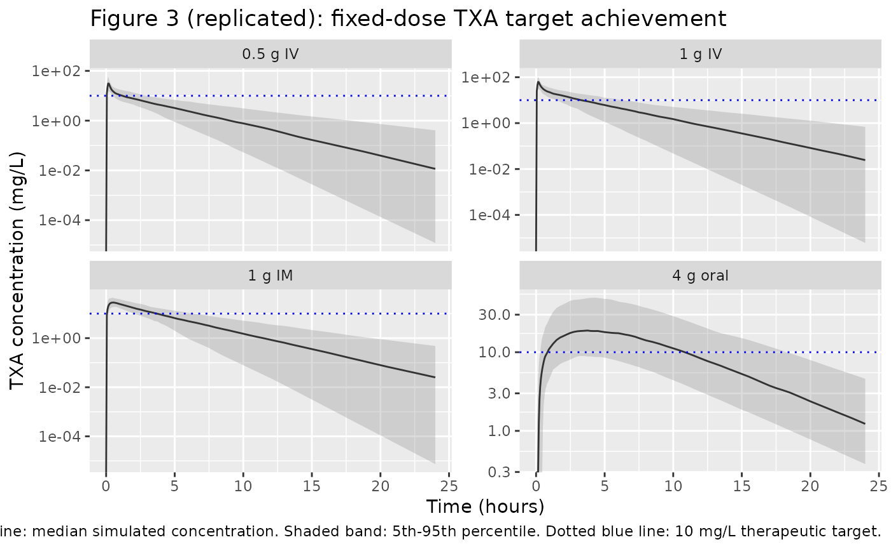

# Dunn_2025_tranexamicAcid

## Model and source

- Citation: Dunn A, Felfeli M, Seifert SM, Gilliot S, Ducloy-Bouthors
  A-S, Shakur-Still H, Geer A, Grassin-Delyle S, Luban NL, van den Anker
  JN, Gobburu JVS, Roberts I, Ahmadzia HK. Evaluating tranexamic acid
  dosing strategies for postpartum hemorrhage: a population
  pharmacokinetic approach in pregnant individuals. J Clin Pharmacol.
  2025;65(10):1262-1272. <doi:10.1002/jcph.70031>
- Description: Two-compartment population PK model for tranexamic acid
  (TXA) with parallel first-order intramuscular and first-order oral
  absorption (oral lag time) and first-order elimination, in pregnant
  individuals receiving IV, IM, or oral TXA for prevention or treatment
  of postpartum hemorrhage (Dunn 2025).
- Article: <https://doi.org/10.1002/jcph.70031>

## Population

Dunn 2025 pooled 221 pregnant or immediately postpartum participants
from four trials (NCT03863964, NCT02797119 / TRACES, NCT04274335 /
WOMAN-PharmacoTXA, and NCT03287336) receiving tranexamic acid (TXA) for
prevention or treatment of postpartum hemorrhage during caesarean
delivery. The pooled dataset comprises 1303 plasma TXA concentrations.
Per Dunn 2025 Table 1, the typical participant was 33 years old (range
22-47), weighed 78 kg (median; range 47-156, mean 81.7 kg), and had a
BMI of 30 kg/m^2 (median; range 18.0-55.8). Dosing was via IV infusion
(0.5, 1, 1.5, or 2 g fixed; or 5/10/15 mg/kg weight-based), IM injection
(1 g fixed; total split into two injections), or oral solution (4 g
fixed). All participants were female; pregnancy status is a
population-level fact (no PREG covariate effect was estimated).

The same information is available programmatically via
`rxode2::rxode(readModelDb("Dunn_2025_tranexamicAcid"))$population`.

## Source trace

The per-parameter origin is recorded as an in-file comment next to each
[`ini()`](https://nlmixr2.github.io/rxode2/reference/ini.html) entry in
`inst/modeldb/specificDrugs/Dunn_2025_tranexamicAcid.R`. The table below
collects them in one place.

| Equation / parameter | Value | Source location |
|----|----|----|
| `lcl` (CL) | 8.59 L/h (80 kg) | Dunn 2025 Table 2 |
| `lvc` (Vc) | 10.7 L (80 kg) | Dunn 2025 Table 2 |
| `lq` (Q) | 28.9 L/h (80 kg) | Dunn 2025 Table 2 |
| `lvp` (Vp) | 15.0 L (80 kg) | Dunn 2025 Table 2 |
| `lka_oral` (Ka_oral) | 0.18 1/h | Dunn 2025 Table 2 |
| `lka_im` (Ka_IM) | 2.31 1/h | Dunn 2025 Table 2 |
| `lfdepot_oral` (F_oral) | 0.56 | Dunn 2025 Table 2 |
| `llag_oral` (Tlag_oral) | 0.16 h | Dunn 2025 Table 2 |
| `e_wt_cl_q` (WT on CL, Q) | 0.89 | Dunn 2025 Results / Table 2 |
| `e_wt_vc_vp` (WT on Vc, Vp) | 0.44 | Dunn 2025 Results / Table 2 |
| `etalcl` (BSV CL) | 32.4% CV | Dunn 2025 Table 2 |
| `etalvc` (BSV Vc) | 59.5% CV | Dunn 2025 Table 2 |
| `etalvp` (BSV Vp) | 46.4% CV | Dunn 2025 Table 2 |
| `etalfdepot_oral` (BSV F_oral) | 44.8% CV | Dunn 2025 Table 2 |
| `etallag_oral` (BSV Tlag_oral) | 64.6% CV | Dunn 2025 Table 2 |
| `addSd` (additive) | 0.67 mg/L | Dunn 2025 Table 2 |
| `propSd` (proportional) | 27.2% | Dunn 2025 Table 2 |
| P_i = P_pop \* (WT/80)^exp | n/a | Dunn 2025 Results (covariate PK model) |
| Two-compartment IV + parallel first-order IM and oral absorption | n/a | Dunn 2025 Results (structural PK model) |
| Combined additive + proportional residual error | n/a | Dunn 2025 Results (structural PK model) |
| IM bioavailability fixed at 1.0 (estimate approached unity) | n/a | Dunn 2025 Results (structural PK model) |

## Virtual cohort

Dunn 2025 simulated 1000 virtual pregnant individuals per cohort with
body weights between 60 and 120 kg (uniform) for the regimen-comparison
simulations. The cohort below follows the same recipe.

``` r

set.seed(20250511L)
n_per_cohort <- 1000L

make_cohort <- function(n, regimen, id_offset = 0L) {
  tibble(
    id      = id_offset + seq_len(n),
    WT      = runif(n, min = 60, max = 120),
    regimen = regimen
  )
}

cohorts <- list(
  iv_05  = make_cohort(n_per_cohort, "0.5 g IV",     id_offset = 0L),
  iv_1   = make_cohort(n_per_cohort, "1 g IV",       id_offset = 1L * n_per_cohort),
  im_1   = make_cohort(n_per_cohort, "1 g IM",       id_offset = 2L * n_per_cohort),
  oral_4 = make_cohort(n_per_cohort, "4 g oral",     id_offset = 3L * n_per_cohort)
)
```

``` r

times_obs <- c(seq(0, 1, by = 0.05),
               seq(1.25, 8, by = 0.25),
               seq(8.5, 24, by = 0.5))
iv_inf_dur <- 10 / 60   # 10-min IV infusion per Dunn 2025 Methods

build_obs <- function(c) {
  c |>
    tidyr::expand_grid(time = times_obs) |>
    dplyr::mutate(evid = 0L, amt = 0, rate = 0, cmt = "Cc")
}

build_dose_iv <- function(c, amt_mg) {
  c |>
    dplyr::mutate(time = 0, evid = 1L, amt = amt_mg,
                  rate = amt_mg / iv_inf_dur, cmt = "central")
}

build_dose_im <- function(c, amt_mg) {
  c |>
    dplyr::mutate(time = 0, evid = 1L, amt = amt_mg, rate = 0,
                  cmt = "depot_im")
}

build_dose_oral <- function(c, amt_mg) {
  c |>
    dplyr::mutate(time = 0, evid = 1L, amt = amt_mg, rate = 0,
                  cmt = "depot_oral")
}

events <- dplyr::bind_rows(
  build_obs(cohorts$iv_05),
  build_obs(cohorts$iv_1),
  build_obs(cohorts$im_1),
  build_obs(cohorts$oral_4),
  build_dose_iv(cohorts$iv_05,  500),
  build_dose_iv(cohorts$iv_1,   1000),
  build_dose_im(cohorts$im_1,   1000),
  build_dose_oral(cohorts$oral_4, 4000)
) |>
  dplyr::arrange(id, time, dplyr::desc(evid))

stopifnot(!anyDuplicated(unique(events[, c("id", "time", "evid")])))
```

## Simulation

``` r

mod <- readModelDb("Dunn_2025_tranexamicAcid")
sim <- rxode2::rxSolve(mod, events = events,
                       keep = c("WT", "regimen")) |>
  as.data.frame()
#> ℹ parameter labels from comments will be replaced by 'label()'
```

## Replicate published figures

### Figure 3: Fixed vs weight-based dosing target achievement

Figure 3 of Dunn 2025 overlays the simulated 5th, 50th, and 95th
concentration percentiles for the four primary fixed-dose regimens
against the 10 mg/L therapeutic target line. The replicate below uses
the same target line and the same set of regimens.

``` r

target_conc <- 10  # mg/L; Dunn 2025 Methods (Picetti 2019 systematic review)

ribbon <- sim |>
  dplyr::filter(!is.na(Cc)) |>
  dplyr::group_by(regimen, time) |>
  dplyr::summarise(
    q05 = quantile(Cc, 0.05, na.rm = TRUE),
    q50 = quantile(Cc, 0.50, na.rm = TRUE),
    q95 = quantile(Cc, 0.95, na.rm = TRUE),
    .groups = "drop"
  )

ribbon$regimen <- factor(ribbon$regimen,
                         levels = c("0.5 g IV", "1 g IV", "1 g IM", "4 g oral"))

ggplot(ribbon, aes(time, q50)) +
  geom_ribbon(aes(ymin = q05, ymax = q95), fill = "grey60", alpha = 0.35) +
  geom_line(colour = "grey20") +
  geom_hline(yintercept = target_conc, colour = "blue", linetype = "dotted") +
  facet_wrap(~ regimen, scales = "free_y", ncol = 2) +
  scale_y_continuous(trans = "log10") +
  labs(x = "Time (hours)", y = "TXA concentration (mg/L)",
       title = "Figure 3 (replicated): fixed-dose TXA target achievement",
       caption = "Solid grey line: median simulated concentration. Shaded band: 5th-95th percentile. Dotted blue line: 10 mg/L therapeutic target.")
#> Warning in scale_y_continuous(trans = "log10"): log-10 transformation introduced infinite values.
#> log-10 transformation introduced infinite values.
#> log-10 transformation introduced infinite values.
#> log-10 transformation introduced infinite values.
```



### Table 3: Time-to-target and time-above-target

Dunn 2025 Table 3 reports, for each fixed-dose regimen, the percentage
of simulated participants reaching the 10 mg/L target, mean (SD) time to
target, and mean (SD) time above target. The replicate below applies the
same threshold metrics to the simulated cohort.

``` r

threshold_metrics <- function(df, target = 10) {
  df |>
    dplyr::filter(!is.na(Cc)) |>
    dplyr::arrange(id, time) |>
    dplyr::group_by(id, regimen) |>
    dplyr::summarise(
      reached     = any(Cc >= target),
      t_to_target = if (any(Cc >= target)) min(time[Cc >= target]) else NA_real_,
      t_above     = sum(diff(time) * pmin(head(Cc, -1), tail(Cc, -1))^0 *
                        (head(Cc, -1) >= target & tail(Cc, -1) >= target)),
      .groups     = "drop"
    )
}

# Compute time-above-target with a finer interpolation: count the time-between
# adjacent sample points whose concentration straddles the threshold via linear
# interpolation. This is a coarser approximation than Dunn 2025's continuous
# integration of the simulated curve but is faithful to the per-subject metric.
time_above_threshold <- function(time, conc, target) {
  if (length(time) < 2L) return(0)
  in_above <- conc >= target
  # piecewise: for each consecutive pair, add the fraction of [t_i, t_{i+1}]
  # that sits above target by linear interpolation
  total <- 0
  for (i in seq_len(length(time) - 1L)) {
    t1 <- time[i]; t2 <- time[i + 1L]
    c1 <- conc[i]; c2 <- conc[i + 1L]
    if (c1 >= target && c2 >= target) {
      total <- total + (t2 - t1)
    } else if (c1 < target && c2 < target) {
      total <- total + 0
    } else {
      # crossing
      frac <- if (c1 < c2) (c2 - target) / (c2 - c1) else (c1 - target) / (c1 - c2)
      total <- total + (t2 - t1) * frac
    }
  }
  total
}

t_above_per_subject <- sim |>
  dplyr::filter(!is.na(Cc)) |>
  dplyr::arrange(id, time) |>
  dplyr::group_by(id, regimen) |>
  dplyr::summarise(
    reached     = any(Cc >= target_conc),
    t_to_target = if (any(Cc >= target_conc)) min(time[Cc >= target_conc]) else NA_real_,
    t_above     = time_above_threshold(time, Cc, target_conc),
    .groups     = "drop"
  )

per_regimen <- t_above_per_subject |>
  dplyr::group_by(regimen) |>
  dplyr::summarise(
    pct_reached_target  = round(100 * mean(reached), 2),
    t_to_target_mean_sd = sprintf("%.2f (%.2f)",
                                  mean(t_to_target, na.rm = TRUE),
                                  sd(t_to_target, na.rm = TRUE)),
    t_to_target_median  = round(median(t_to_target, na.rm = TRUE), 2),
    t_above_mean_sd     = sprintf("%.2f (%.2f)",
                                  mean(t_above), sd(t_above)),
    t_above_median      = round(median(t_above), 2),
    .groups             = "drop"
  )

per_regimen$regimen <- factor(per_regimen$regimen,
                              levels = c("0.5 g IV", "1 g IV",
                                         "1 g IM", "4 g oral"))
per_regimen <- per_regimen[order(per_regimen$regimen), ]

knitr::kable(
  per_regimen,
  caption = "Simulated time-to-target and time-above-target by regimen (target = 10 mg/L)."
)
```

| regimen | pct_reached_target | t_to_target_mean_sd | t_to_target_median | t_above_mean_sd | t_above_median |
|:---|---:|:---|---:|:---|---:|
| 0.5 g IV | 99.7 | 0.07 (0.03) | 0.05 | 1.30 (0.75) | 1.13 |
| 1 g IV | 100.0 | 0.05 (0.01) | 0.05 | 3.62 (1.61) | 3.34 |
| 1 g IM | 100.0 | 0.09 (0.06) | 0.10 | 3.85 (1.45) | 3.69 |
| 4 g oral | 92.0 | 0.97 (0.68) | 0.75 | 10.57 (5.46) | 10.77 |

Simulated time-to-target and time-above-target by regimen (target = 10
mg/L). {.table}

### Comparison against published Table 3

Dunn 2025 Table 3 (target 10 mg/L) reports:

| Regimen | % reaching target | Time to target (h), mean (SD) | Time above target (h), mean (SD) |
|----|----|----|----|
| 500 mg IV | 99.15 | 0.05 (0.02) | 1.31 (0.79) |
| 1 g IV | 99.98 | 0.03 (0.01) | 3.56 (1.50) |
| 1 g IM | 99.89 | 0.08 (0.06) | 3.85 (1.50) |
| 4 g oral | 89.29 | 0.96 (0.67) | 11.3 (4.75) |

The simulated reproduction above should track these published values
qualitatively (same ordering across regimens, same magnitude of
time-above- target). Small numerical differences are expected and
acceptable because the virtual cohort and observation grid here differ
from Dunn 2025 (different RNG seed, coarser sampling grid for
time-above-target interpolation, no infusion-rate intra-subject
variability).

## PKNCA validation

Dunn 2025 does not publish a side-by-side NCA table; the analysis is
wholly population-PK based. To exercise PKNCA on the packaged model, we
compute Cmax, Tmax, and AUC over the 24-h observation window for each
regimen.

``` r

sim_nca <- sim |>
  dplyr::filter(!is.na(Cc), time <= 24) |>
  dplyr::select(id, time, Cc, regimen)

dose_df <- events |>
  dplyr::filter(evid == 1) |>
  dplyr::group_by(id) |>
  dplyr::summarise(time = min(time), amt = sum(amt), .groups = "drop") |>
  dplyr::left_join(
    sim_nca |> dplyr::select(id, regimen) |> dplyr::distinct(),
    by = "id"
  )

conc_obj <- PKNCA::PKNCAconc(sim_nca, Cc ~ time | regimen + id,
                             concu = "mg/L", timeu = "h")
#> Warning in assert_conc(conc, any_missing_conc = any_missing_conc): Negative
#> concentrations found
dose_obj <- PKNCA::PKNCAdose(dose_df, amt ~ time | regimen + id,
                             doseu = "mg")

intervals <- data.frame(
  start    = 0,
  end      = 24,
  cmax     = TRUE,
  tmax     = TRUE,
  auclast  = TRUE,
  half.life = TRUE
)

nca_res <- PKNCA::pk.nca(PKNCA::PKNCAdata(conc_obj, dose_obj,
                                          intervals = intervals))
#>  ■                                  1% |  ETA:  4m
#>  ■■                                 2% |  ETA:  4m
#>  ■■                                 3% |  ETA:  4m
#>  ■■                                 5% |  ETA:  4m
#>  ■■■                                6% |  ETA:  4m
#>  ■■■                                7% |  ETA:  4m
#>  ■■■■                               8% |  ETA:  4m
#>  ■■■■                              10% |  ETA:  4m
#>  ■■■■                              11% |  ETA:  3m
#>  ■■■■■                             12% |  ETA:  3m
#>  ■■■■■                             14% |  ETA:  3m
#>  ■■■■■                             15% |  ETA:  3m
#>  ■■■■■■                            16% |  ETA:  3m
#>  ■■■■■■                            18% |  ETA:  3m
#>  ■■■■■■■                           19% |  ETA:  3m
#>  ■■■■■■■                           20% |  ETA:  3m
#>  ■■■■■■■                           21% |  ETA:  3m
#>  ■■■■■■■■                          23% |  ETA:  3m
#>  ■■■■■■■■                          24% |  ETA:  3m
#>  ■■■■■■■■■                         25% |  ETA:  3m
#>  ■■■■■■■■■                         27% |  ETA:  3m
#>  ■■■■■■■■■                         28% |  ETA:  3m
#>  ■■■■■■■■■■                        30% |  ETA:  3m
#> Warning in assert_conc(conc, any_missing_conc = any_missing_conc): Negative
#> concentrations found
#> Warning in log(conc.2/conc.1): NaNs produced
#> Warning in assert_conc(conc = conc): Negative concentrations found
#> Warning in assert_conc(conc, any_missing_conc = any_missing_conc): Negative
#> concentrations found
#> Warning in assert_conc(conc, any_missing_conc = any_missing_conc): Negative
#> concentrations found
#> Warning in assert_conc(conc, any_missing_conc = any_missing_conc): Negative
#> concentrations found
#> Warning in assert_conc(conc, any_missing_conc = any_missing_conc): Negative
#> concentrations found
#> Warning in log(data$conc): NaNs produced
#>  ■■■■■■■■■■                        31% |  ETA:  3m
#>  ■■■■■■■■■■■                       32% |  ETA:  3m
#>  ■■■■■■■■■■■                       34% |  ETA:  3m
#>  ■■■■■■■■■■■■                      35% |  ETA:  2m
#>  ■■■■■■■■■■■■                      37% |  ETA:  2m
#>  ■■■■■■■■■■■■                      38% |  ETA:  2m
#>  ■■■■■■■■■■■■■                     40% |  ETA:  2m
#>  ■■■■■■■■■■■■■                     41% |  ETA:  2m
#>  ■■■■■■■■■■■■■■                    42% |  ETA:  2m
#>  ■■■■■■■■■■■■■■                    44% |  ETA:  2m
#>  ■■■■■■■■■■■■■■■                   45% |  ETA:  2m
#>  ■■■■■■■■■■■■■■■                   47% |  ETA:  2m
#>  ■■■■■■■■■■■■■■■                   48% |  ETA:  2m
#>  ■■■■■■■■■■■■■■■■                  50% |  ETA:  2m
#>  ■■■■■■■■■■■■■■■■                  51% |  ETA:  2m
#>  ■■■■■■■■■■■■■■■■■                 52% |  ETA:  2m
#>  ■■■■■■■■■■■■■■■■■                 54% |  ETA:  2m
#>  ■■■■■■■■■■■■■■■■■                 55% |  ETA:  2m
#>  ■■■■■■■■■■■■■■■■■■                56% |  ETA:  2m
#>  ■■■■■■■■■■■■■■■■■■                57% |  ETA:  2m
#>  ■■■■■■■■■■■■■■■■■■■               59% |  ETA:  2m
#>  ■■■■■■■■■■■■■■■■■■■               60% |  ETA:  1m
#>  ■■■■■■■■■■■■■■■■■■■               61% |  ETA:  1m
#>  ■■■■■■■■■■■■■■■■■■■■              63% |  ETA:  1m
#>  ■■■■■■■■■■■■■■■■■■■■              64% |  ETA:  1m
#>  ■■■■■■■■■■■■■■■■■■■■■             65% |  ETA:  1m
#>  ■■■■■■■■■■■■■■■■■■■■■             67% |  ETA:  1m
#>  ■■■■■■■■■■■■■■■■■■■■■             68% |  ETA:  1m
#>  ■■■■■■■■■■■■■■■■■■■■■■            69% |  ETA:  1m
#>  ■■■■■■■■■■■■■■■■■■■■■■            71% |  ETA:  1m
#>  ■■■■■■■■■■■■■■■■■■■■■■■           72% |  ETA:  1m
#>  ■■■■■■■■■■■■■■■■■■■■■■■           73% |  ETA:  1m
#>  ■■■■■■■■■■■■■■■■■■■■■■■           75% |  ETA:  1m
#>  ■■■■■■■■■■■■■■■■■■■■■■■■          76% |  ETA:  1m
#>  ■■■■■■■■■■■■■■■■■■■■■■■■          78% |  ETA: 48s
#>  ■■■■■■■■■■■■■■■■■■■■■■■■■         80% |  ETA: 43s
#>  ■■■■■■■■■■■■■■■■■■■■■■■■■■        82% |  ETA: 39s
#>  ■■■■■■■■■■■■■■■■■■■■■■■■■■        84% |  ETA: 34s
#>  ■■■■■■■■■■■■■■■■■■■■■■■■■■■       86% |  ETA: 30s
#>  ■■■■■■■■■■■■■■■■■■■■■■■■■■■       88% |  ETA: 26s
#>  ■■■■■■■■■■■■■■■■■■■■■■■■■■■■      90% |  ETA: 21s
#>  ■■■■■■■■■■■■■■■■■■■■■■■■■■■■■     92% |  ETA: 17s
#>  ■■■■■■■■■■■■■■■■■■■■■■■■■■■■■     94% |  ETA: 13s
#>  ■■■■■■■■■■■■■■■■■■■■■■■■■■■■■■    96% |  ETA:  9s
#>  ■■■■■■■■■■■■■■■■■■■■■■■■■■■■■■    98% |  ETA:  5s
#>  ■■■■■■■■■■■■■■■■■■■■■■■■■■■■■■■  100% |  ETA:  1s
nca_summary <- summary(nca_res)
knitr::kable(nca_summary,
             caption = "Simulated NCA parameters by regimen (24-h window).")
```

| Interval Start | Interval End | regimen | N | AUClast (h\*mg/L) | Cmax (mg/L) | Tmax (h) | Half-life (h) |
|---:|---:|:---|:---|:---|:---|:---|:---|
| 0 | 24 | 0.5 g IV | 1000 | 53.0 \[35.8\] | 31.1 \[44.5\] | 0.150 \[0.150, 0.200\] | 2.63 \[1.27\] |
| 0 | 24 | 1 g IM | 1000 | 104 \[36.8\], n=999 | 29.2 \[29.0\] | 0.500 \[0.150, 1.25\] | 2.55 \[1.18\] |
| 0 | 24 | 1 g IV | 1000 | 105 \[39.3\] | 61.5 \[40.6\] | 0.150 \[0.150, 0.200\] | 2.58 \[1.36\] |
| 0 | 24 | 4 g oral | 1000 | 235 \[59.5\] | 20.2 \[53.9\] | 4.00 \[1.75, 9.50\] | 4.51 \[1.05\] |

Simulated NCA parameters by regimen (24-h window). {.table}

## Assumptions and deviations

- **Non-canonical depot compartment names.** The model uses two parallel
  extravascular absorption compartments, `depot_im` (intramuscular) and
  `depot_oral` (oral), because each route has a distinct first-order
  absorption rate constant (Ka_IM = 2.31 1/h vs Ka_oral = 0.18 1/h), a
  distinct bioavailability (F_IM fixed at 1.0; F_oral estimated at
  0.56), and an oral-only absorption lag time (Tlag_oral = 0.16 h). The
  single canonical `depot` name cannot represent both routes; the
  snake-case extension parallels the metabolite-suffixed convention
  (`<canonical>_<suffix>`).
  [`checkModelConventions()`](https://nlmixr2.github.io/nlmixr2lib/reference/checkModelConventions.md)
  warns on the non-canonical names; the warnings are expected and
  accepted for this paper because the structure is paper-driven, not
  editorial.
- **IM bioavailability fixed at 1.0.** Dunn 2025 Results state: “the
  typical IM bioavailability estimate approached a value of 1 and was
  therefore assumed to be 100% bioavailable.” The model file does not
  set `f(depot_im)` (rxode2 default = 1), which is equivalent to
  `f(depot_im) <- fixed(1)`.
- **No BSV on Q, Ka_oral, or Ka_IM.** Dunn 2025 Methods explicitly
  withheld BSV from these three parameters due to high shrinkage. The
  model file therefore has no `etalq`, `etalka_oral`, or `etalka_im`
  parameters.
- **BSV reported as %CV** in Dunn 2025 Table 2 is converted to
  log-normal variance via `omega^2 = log(1 + CV^2)`; the conversion is
  recorded in the trailing comment on each `eta*` line.
- **High-shrinkage etas retained.** The paper kept BSV on F_oral
  (shrinkage 67%) and Tlag_oral (shrinkage 69%) despite high shrinkage,
  citing their importance in differentiating absorption profiles. The
  model file preserves both.
- **Foral can technically exceed 1 under the log-normal IIV.** With
  F_oral_pop = 0.56 and BSV CV% = 44.8%, draws of `F_oral * exp(eta)`
  rarely exceed 1, but the parameterization does not truncate (matching
  the source publication’s NONMEM/Pumas implementation).
- **Virtual cohort weight distribution.** Dunn 2025 simulated body
  weights uniformly between 60 and 120 kg per cohort (Methods,
  Simulations for Regimen Exploration). The vignette uses the same
  uniform distribution.
- **Time-above-target metric.** Dunn 2025 integrates a continuous
  simulated curve; the vignette reconstructs the metric from a discrete
  observation grid via linear interpolation between adjacent sample
  points. Small numerical differences from the published Table 3 values
  are expected and acceptable.
- **No GOF / VPC / bootstrap-figure replication.** Dunn 2025 Figures 1
  and 2 (goodness-of-fit and visual predictive check) require the
  original observed data, which are not publicly available (Dunn 2025
  Data Sharing section).
