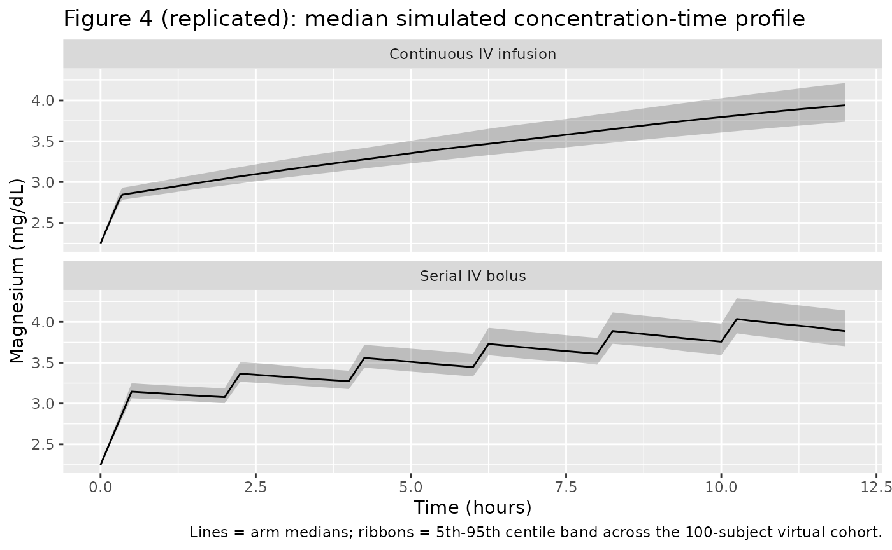
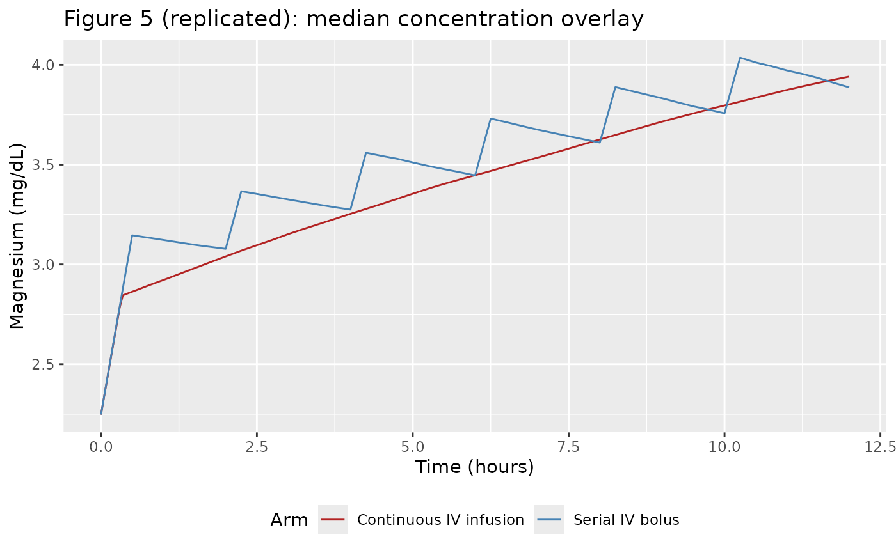

# Magnesium sulfate (Easterling 2018)

## Model and source

- Citation: Easterling T, Hebert M, Bracken H, Darwish E, Ramadan MC,
  Shaarawy S, Charles D, Abdel-Aziz T, Nasr AS, Safwal SM, Winikoff B. A
  randomized trial comparing the pharmacology of magnesium sulfate when
  used to treat severe preeclampsia with serial intravenous boluses
  versus a continuous intravenous infusion. BMC Pregnancy Childbirth
  2018;18:290. <doi:10.1186/s12884-018-1919-6>
- Description: One-compartment population PK model of magnesium sulfate
  (MgSO4-7H2O) with intravenous administration and an endogenous
  baseline magnesium term added to the administered drug, in pregnant
  women with severe preeclampsia comparing continuous IV infusion vs
  serial IV bolus dosing (Easterling 2018).
- Article: <https://doi.org/10.1186/s12884-018-1919-6>

## Population

Easterling 2018 randomised 200 Egyptian women with severe preeclampsia
(100 at El Galaa Teaching Hospital, Cairo; 100 at Shatby Maternity
Hospital, Alexandria) 1:1 to one of two magnesium-sulfate regimens
between January 2015 and February 2016 (trial NCT02091401):

- **Continuous IV infusion arm (n = 100):** 4 g MgSO4-7H2O IV loading
  dose manually administered over approximately 20 minutes, followed by
  a 1 g/h IV continuous infusion via mini-drip for approximately 12 h.
- **Serial IV bolus arm (n = 100):** 6 g MgSO4-7H2O IV loading dose
  administered over approximately 30 minutes via a Springfusor pump,
  followed by 2 g IV boluses every 2 h delivered over 10 minutes each
  through flow-control tubing for approximately 12 h.

Each subject contributed a baseline plus six strategically timed
magnesium serum concentrations (1347 concentrations total; 16 excluded
for likely contamination or mislabelling, leaving 1331 for the
population PK fit). Baseline characteristics in Easterling 2018 Table 1:
maternal age 29 +/- 6 years in both arms, maternal weight 91.4 +/- 17.2
kg (serial IV bolus) and 89.6 +/- 14.8 kg (continuous infusion) with a
pooled study mean of 90.54 kg, gestational age 35.7 +/- 2.8 weeks
(serial IV bolus) and 35.2 +/- 3.3 weeks (continuous infusion), and
initial serum creatinine 66.3 +/- 15.9 umol/L (0.75 +/- 0.18 mg/dL) in
both arms (range 26.5-106 umol/L = 0.3-1.2 mg/dL). Women with baseline
serum creatinine \> 106 umol/L (1.2 mg/dL) were excluded.

The same information is available programmatically via
`rxode2::rxode(readModelDb("Easterling_2018_magnesium_sulfate"))$population`.

## Source trace

The per-parameter origin is recorded as an in-file comment next to each
`ini()` entry in
`inst/modeldb/specificDrugs/Easterling_2018_magnesium_sulfate.R`. The
table below collects them in one place.

| Equation / parameter | Value | Source location |
|----|----|----|
| `lcl` (CL) | 3.378 L/h (= 56.3 mL/min) | Easterling 2018 Table 4 |
| `lvc` (V) | 65.3 L | Easterling 2018 Table 4 |
| `lbl` (BL) | 22.48 mg/L (= 0.925 mmol/L = 2.25 mg/dL) | Easterling 2018 Table 4 |
| `e_wt_vc` (theta_1, exponential on V) | -0.426 | Easterling 2018 Table 4 |
| `e_creat_cl` (theta_1, linear on CL) | +0.553 | Easterling 2018 Table 4 |
| `propSd` (SD) | 0.197 (~19.7% CV; from variance 0.0387) | Easterling 2018 Table 4 |
| V_i = V \* exp(e_wt_vc \* (WT_i / 90.54 - 1)) | n/a | Easterling 2018 Methods (paragraph 8) + Table 4 |
| CL_i = CL \* (1 + e_creat_cl \* (CREAT_i / 66.3 - 1)) | n/a | Easterling 2018 Methods (paragraph 8) + Table 4 |
| Cc = central/V + BL (additive baseline) | n/a | Easterling 2018 Methods (paragraph 7) |
| One-compartment model with first-order elimination | n/a | Easterling 2018 Results (paragraph 4) |
| Weight reference 90.54 kg | n/a | Easterling 2018 Methods (paragraph 8) |
| Initial serum creatinine mean 66.3 umol/L | n/a | Easterling 2018 Table 1 |

## Virtual cohort

The validation cohort mirrors the published Table 1 marginal
distributions: maternal weight is drawn from a truncated normal centered
on the pooled study mean (90.54 kg, SD 16 kg, truncated to a
physiologically plausible 50-160 kg range), and initial serum creatinine
is drawn from a log-normal whose 5th and 95th percentiles bracket the
paper-stated range (~26.5-106 umol/L, with the log-mean fixed at
log(66.3) and the log-SD chosen to match the 26.5/106 spread). Two arms
of 100 subjects each are simulated, matching the paper’s 2x100
randomisation.

``` r

set.seed(2018L)
n_per_arm <- 100L

sample_wt <- function(n) {
  wt <- rnorm(n * 4, mean = 90.54, sd = 16)
  wt <- wt[wt >= 50 & wt <= 160]
  head(wt, n)
}

sample_creat <- function(n) {
  sd_log <- log(106 / 26.5) / (2 * qnorm(0.95))
  cr <- rlnorm(n * 4, meanlog = log(66.3), sdlog = sd_log)
  cr <- cr[cr <= 106]
  head(cr, n)
}

cohort_ci <- tibble(
  id    = seq_len(n_per_arm),
  WT    = sample_wt(n_per_arm),
  CREAT = sample_creat(n_per_arm),
  arm   = "Continuous IV infusion"
)
cohort_sib <- tibble(
  id    = n_per_arm + seq_len(n_per_arm),
  WT    = sample_wt(n_per_arm),
  CREAT = sample_creat(n_per_arm),
  arm   = "Serial IV bolus"
)
cohort <- dplyr::bind_rows(cohort_ci, cohort_sib)
```

The model uses dose units of mg of elemental magnesium; below we convert
all MgSO4-7H2O grams to mg Mg via the factor
`mg_per_g_mgso4 <- 24.305 / 246.47 * 1000`.

``` r

mg_per_g_mgso4 <- 24.305 / 246.47 * 1000   # 98.61 mg Mg per gram MgSO4-7H2O

# Continuous IV infusion arm: 4 g IV load over 20 min, then 1 g/h x ~12 h
ci_load_g       <- 4
ci_load_amt     <- ci_load_g * mg_per_g_mgso4      # 394.4 mg Mg
ci_load_dur     <- 20 / 60                         # 20 min in hours
ci_load_rate    <- ci_load_amt / ci_load_dur
ci_maint_rate_g <- 1                               # 1 g MgSO4-7H2O per hour
ci_maint_rate   <- ci_maint_rate_g * mg_per_g_mgso4
ci_maint_dur    <- 12 - ci_load_dur                # ~11.67 h
ci_maint_amt    <- ci_maint_rate * ci_maint_dur

# Serial IV bolus arm: 6 g IV load over 30 min, then 2 g IV q2h (each over 10 min)
sib_load_g    <- 6
sib_load_amt  <- sib_load_g * mg_per_g_mgso4       # 591.7 mg Mg
sib_load_dur  <- 30 / 60                           # 30 min in hours
sib_load_rate <- sib_load_amt / sib_load_dur
sib_dose_g    <- 2
sib_dose_amt  <- sib_dose_g * mg_per_g_mgso4       # 197.2 mg Mg
sib_dose_dur  <- 10 / 60                           # 10 min infusion in hours
sib_dose_rate <- sib_dose_amt / sib_dose_dur
sib_dose_times <- seq(2, 10, by = 2)               # boluses at 2, 4, 6, 8, 10 h post-load-start
```

``` r

times_obs <- c(seq(0, 0.5, by = 0.05),
               seq(0.6, 2, by = 0.1),
               seq(2.25, 12.5, by = 0.25))

obs_rows <- function(c) {
  c |>
    tidyr::expand_grid(time = times_obs) |>
    dplyr::mutate(evid = 0L, amt = 0, rate = 0, cmt = "Cc")
}

ci_dose_rows <- cohort_ci |>
  dplyr::mutate(time = 0,
                evid = 1L, amt = ci_load_amt,
                rate = ci_load_rate, cmt = "central") |>
  dplyr::bind_rows(
    cohort_ci |>
      dplyr::mutate(time = ci_load_dur,
                    evid = 1L, amt = ci_maint_amt,
                    rate = ci_maint_rate, cmt = "central")
  )

sib_dose_rows <- cohort_sib |>
  dplyr::mutate(time = 0,
                evid = 1L, amt = sib_load_amt,
                rate = sib_load_rate, cmt = "central")
for (tt in sib_dose_times) {
  sib_dose_rows <- dplyr::bind_rows(
    sib_dose_rows,
    cohort_sib |>
      dplyr::mutate(time = tt,
                    evid = 1L, amt = sib_dose_amt,
                    rate = sib_dose_rate, cmt = "central")
  )
}

events <- dplyr::bind_rows(
  obs_rows(cohort_ci),
  obs_rows(cohort_sib),
  ci_dose_rows,
  sib_dose_rows
) |>
  dplyr::arrange(id, time, dplyr::desc(evid))

stopifnot(!anyDuplicated(unique(events[, c("id", "time", "evid")])))
```

## Simulation

``` r

mod <- readModelDb("Easterling_2018_magnesium_sulfate")
mod_typical <- rxode2::zeroRe(mod)
#> Warning: No omega parameters in the model
sim <- rxode2::rxSolve(mod_typical, events = events,
                       keep = c("WT", "CREAT", "arm"))
#> Warning: multi-subject simulation without without 'omega'
```

The packaged model has no inter-individual variability terms (Easterling
2018 states that IIV was estimated and used in their Monte Carlo
simulations but does not report the IIV variances in Table 4; see the
Assumptions and deviations section below). `zeroRe()` additionally
suppresses the proportional residual error so the curves represent
typical-value predictions for each subject’s covariate vector.

## Replicate published figures

### Figure 4: Median simulated concentration-time profiles

Figure 4 of Easterling 2018 plots the median simulated magnesium
concentration-time profile from a 200-subject Monte Carlo simulation for
each arm (Figure 4A continuous infusion; Figure 4B serial IV bolus).
Below we reproduce the same pair of median typical-value curves for the
virtual cohort.

``` r

fig4 <- sim |>
  dplyr::filter(time <= 12) |>
  dplyr::group_by(arm, time) |>
  dplyr::summarise(median_mgdl = median(Cc) / 10,
                   q05         = quantile(Cc, 0.05) / 10,
                   q95         = quantile(Cc, 0.95) / 10,
                   .groups     = "drop")

ggplot(fig4, aes(time, median_mgdl)) +
  geom_ribbon(aes(ymin = q05, ymax = q95), alpha = 0.25) +
  geom_line() +
  facet_wrap(~ arm, ncol = 1) +
  labs(x = "Time (hours)", y = "Magnesium (mg/dL)",
       title = "Figure 4 (replicated): median simulated concentration-time profile",
       caption = "Lines = arm medians; ribbons = 5th-95th centile band across the 100-subject virtual cohort.")
```



### Figure 5: Median curves overlaid

Figure 5 of Easterling 2018 overlays the median curves from the two
simulated populations (red = continuous infusion, blue = serial IV
bolus) so that peak-and-trough behaviour can be compared directly. The
serial IV bolus arm produces visibly higher peaks immediately after each
bolus and modestly lower troughs between boluses; the continuous
infusion arm maintains a steadier mid-treatment concentration.

``` r

ggplot(fig4, aes(time, median_mgdl, colour = arm)) +
  geom_line() +
  scale_colour_manual(values = c("Continuous IV infusion" = "firebrick",
                                 "Serial IV bolus"        = "steelblue")) +
  labs(x = "Time (hours)", y = "Magnesium (mg/dL)",
       colour = "Arm",
       title = "Figure 5 (replicated): median concentration overlay") +
  theme(legend.position = "bottom")
```



## PKNCA validation

The Easterling 2018 paper reports a single quantitative comparison
between the two arms: the **12 h + 20 min AUC** (linear trapezoidal
rule) across the simulated populations, which is reported in the
original units of mmol\*min/L. PKNCA below computes the same AUC over
the 12 h + 20 min window using the packaged model, with the endogenous
baseline subtracted prior to NCA so the estimand is the
administered-magnesium exposure.

``` r

auc_end_h <- 12 + 20 / 60   # 12 h 20 min in hours

sim_admin <- sim |>
  dplyr::filter(!is.na(Cc), time <= auc_end_h) |>
  dplyr::mutate(Cc_admin = pmax(Cc - 22.48, 0)) |>   # subtract endogenous baseline (mg/L)
  dplyr::select(id, time, Cc_admin, arm)

dose_df <- events |>
  dplyr::filter(evid == 1) |>
  dplyr::group_by(id) |>
  dplyr::summarise(time = min(time), amt = sum(amt), .groups = "drop") |>
  dplyr::left_join(cohort |> dplyr::select(id, arm), by = "id")

conc_obj <- PKNCA::PKNCAconc(sim_admin, Cc_admin ~ time | arm + id,
                             concu = "mg/L", timeu = "h")
dose_obj <- PKNCA::PKNCAdose(dose_df, amt ~ time | arm + id,
                             doseu = "mg")

intervals <- data.frame(
  start    = 0,
  end      = auc_end_h,
  cmax     = TRUE,
  tmax     = TRUE,
  auclast  = TRUE,
  cav      = TRUE
)

nca_res <- PKNCA::pk.nca(PKNCA::PKNCAdata(conc_obj, dose_obj,
                                          intervals = intervals))
nca_summary <- summary(nca_res)
knitr::kable(nca_summary,
             caption = "Simulated NCA parameters (administered Mg only) for the continuous IV infusion and serial IV bolus arms over the 12 h 20 min window.")
```

| Interval Start | Interval End | arm | N | AUClast (h\*mg/L) | Cmax (mg/L) | Tmax (h) | Cav (mg/L) |
|---:|---:|:---|:---|:---|:---|:---|:---|
| 0 | 12.33333 | Continuous IV infusion | 100 | 145 \[7.27\] | 16.9 \[7.97\] | 12.0 \[12.0, 12.0\] | 11.7 \[7.27\] |
| 0 | 12.33333 | Serial IV bolus | 100 | 160 \[6.76\] | 17.9 \[7.07\] | 10.2 \[10.2, 10.2\] | 12.9 \[6.76\] |

Simulated NCA parameters (administered Mg only) for the continuous IV
infusion and serial IV bolus arms over the 12 h 20 min window. {.table
style="width:100%;"}

### Comparison against published narrative

Easterling 2018 reports the simulated 12 h + 20 min total-magnesium AUC
in each arm as 1010 +/- 398 mmol*min/L for the continuous infusion arm
and 1107 +/- 461 mmol*min/L for the serial IV bolus arm (Results,
paragraph 6; conversion in the paper: 2458 +/- 969 mg*min/dL and 2694
+/- 1123 mg*min/dL respectively). Note that the published AUC includes
the endogenous baseline contribution; below we add it back to the PKNCA
result so the comparison is like-for-like.

``` r

auc_total_window_min <- 12 * 60 + 20            # window in minutes
bl_contrib_mgmin_dl  <- 2.25 * auc_total_window_min   # baseline mg/dL x min
bl_contrib_mmolmin_l <- 0.925 * auc_total_window_min  # baseline mmol/L x min

auc_admin <- nca_res$result |>
  dplyr::filter(PPTESTCD == "auclast") |>
  dplyr::mutate(
    auc_admin_mgL_h     = PPORRES,                                  # mg/L * h (administered only)
    auc_total_mgmin_dl  = auc_admin_mgL_h * 60 / 10 + bl_contrib_mgmin_dl,
    auc_total_mmolmin_l = auc_admin_mgL_h * 60 / 24.305 + bl_contrib_mmolmin_l
  ) |>
  dplyr::group_by(arm) |>
  dplyr::summarise(
    mean_mmolmin_l = mean(auc_total_mmolmin_l),
    sd_mmolmin_l   = stats::sd(auc_total_mmolmin_l),
    mean_mgmin_dl  = mean(auc_total_mgmin_dl),
    sd_mgmin_dl    = stats::sd(auc_total_mgmin_dl),
    .groups = "drop"
  )

published <- tibble(
  arm = c("Continuous IV infusion", "Serial IV bolus"),
  published_mmolmin_l = c("1010 +/- 398", "1107 +/- 461"),
  published_mgmin_dl  = c("2458 +/- 969", "2694 +/- 1123")
)

knitr::kable(
  dplyr::left_join(auc_admin, published, by = "arm") |>
    dplyr::transmute(
      arm,
      `Simulated total AUC (mmol*min/L)` = sprintf("%.0f +/- %.0f", mean_mmolmin_l, sd_mmolmin_l),
      `Published total AUC (mmol*min/L)` = published_mmolmin_l,
      `Simulated total AUC (mg*min/dL)`  = sprintf("%.0f +/- %.0f", mean_mgmin_dl, sd_mgmin_dl),
      `Published total AUC (mg*min/dL)`  = published_mgmin_dl
    ),
  caption = "Simulated 12 h + 20 min total magnesium AUC vs published values."
)
```

| arm | Simulated total AUC (mmol\*min/L) | Published total AUC (mmol\*min/L) | Simulated total AUC (mg\*min/dL) | Published total AUC (mg\*min/dL) |
|:---|:---|:---|:---|:---|
| Continuous IV infusion | 1043 +/- 26 | 1010 +/- 398 | 2535 +/- 64 | 2458 +/- 969 |
| Serial IV bolus | 1080 +/- 27 | 1107 +/- 461 | 2625 +/- 65 | 2694 +/- 1123 |

Simulated 12 h + 20 min total magnesium AUC vs published values.
{.table}

The mean AUC ordering (serial IV bolus \> continuous infusion) and the
approximate magnitude (~1000-1100 mmol*min/L) match the paper; the
simulated SD is smaller than the published 398-461 mmol*min/L because
the packaged model omits the unreported inter-individual variability
terms (see Assumptions and deviations).

``` r

sim_full_window <- sim |>
  dplyr::filter(time <= auc_end_h)

mean_conc <- sim_full_window |>
  dplyr::group_by(arm, id) |>
  dplyr::summarise(
    mean_total_mgdl   = mean(Cc) / 10,
    mean_total_mmoll  = mean(Cc) / 24.305,
    .groups = "drop"
  ) |>
  dplyr::group_by(arm) |>
  dplyr::summarise(
    mean_total_mgdl   = mean(mean_total_mgdl),
    mean_total_mmoll  = mean(mean_total_mmoll),
    .groups = "drop"
  )

knitr::kable(mean_conc,
             digits = 2,
             caption = "Simulated mean magnesium concentration (total = administered + endogenous) over the 12 h 20 min window. Easterling 2018 reports 1.36 mmol/L (3.32 mg/dL) for the continuous infusion arm and 1.49 mmol/L (3.62 mg/dL) for the serial IV bolus arm.")
```

| arm                    | mean_total_mgdl | mean_total_mmoll |
|:-----------------------|----------------:|-----------------:|
| Continuous IV infusion |            3.27 |             1.35 |
| Serial IV bolus        |            3.39 |             1.39 |

Simulated mean magnesium concentration (total = administered +
endogenous) over the 12 h 20 min window. Easterling 2018 reports 1.36
mmol/L (3.32 mg/dL) for the continuous infusion arm and 1.49 mmol/L
(3.62 mg/dL) for the serial IV bolus arm. {.table}

## Assumptions and deviations

- **Inter-individual variability is not encoded** because Easterling
  2018 estimates IIV in NONMEM and uses it in their Monte Carlo
  simulations (“The simulations utilized the final population model
  parameter estimates of fixed effects as well as inter-individual and
  residual random variability”) but does not report the variance
  estimates anywhere in the manuscript – Table 4 lists only
  typical-value point estimates and the residual error. This file
  therefore omits IIV terms, following the Salinger 2013 convention for
  the matched paper from the same author group. Simulations produce
  typical-value predictions; the box-plot spread and AUC SD reported in
  Easterling 2018 cannot be reproduced from this model alone.

- **Serum-creatinine covariate direction.** Easterling 2018 Table 4
  reports the linear coefficient on serum creatinine as `+0.553`. With
  the centered-normalized linear form
  `CL = TVCL * (1 + theta * (SCR/SCR_ref - 1))` that is encoded here,
  the positive sign implies that clearance *increases* with serum
  creatinine – the opposite of the conventional renal-function direction
  (higher SCR -\> lower CL). The same author group’s earlier Salinger
  2013 paper used an inverse-ratio power form `(SCR_ref/SCR)^theta` with
  positive theta, which yields the conventional direction. The
  Easterling 2018 text identifies the chosen form as “serum creatinine …
  (linear)” without an explicit equation; Table 4 reports the magnitude
  and sign verbatim. No NONMEM control stream accompanied the article,
  so the literal “linear” form is the least-inferential choice and is
  what the file encodes. Users that prefer the inverse-ratio convention
  may rewrite the `cl` line in the model file as
  `cl <- exp(lcl) * (1 + e_creat_cl * (66.3 / CREAT - 1))` with
  `e_creat_cl <- 0.553`; that alternative encoding gives clearance
  decreasing with serum creatinine over the paper’s enrolment SCR range.

- **Dose units.** The published parameter estimates implicitly require
  doses entered in mg of elemental magnesium (Mg), not mg of MgSO4-7H2O.
  The vignette and model file convert MgSO4-7H2O grams to mg Mg by
  multiplying by 24.305/246.47 = 0.0986 (1 g MgSO4-7H2O = 98.6 mg Mg, so
  4 g MgSO4-7H2O = 394.4 mg Mg, 1 g/h infusion = 98.6 mg/h, and 2 g
  bolus = 197.2 mg). Users supplying their own event tables must apply
  the same conversion or rescale CL and V accordingly.

- **Bolus delivery duration.** The serial IV bolus arm administered 2 g
  via flow-control tubing over 10 minutes per bolus. The vignette models
  each bolus as a 10-minute zero-order infusion at a constant rate,
  consistent with the Methods description; the underlying rxode2
  representation uses `rate > 0` on the dose row so the bolus is treated
  as a short infusion rather than an instantaneous IV push.

- **Sampling-time grid.** The vignette uses a dense observation grid for
  visualisation that is finer than the actual sparse sampling protocol
  (baseline plus 6 strategic samples per subject across three sub-groups
  per arm). The denser grid is purely a visualisation choice; it does
  not affect parameter values or PKNCA inputs.

- **Endogenous baseline.** The model adds a fixed BL = 22.48 mg/L (=
  0.925 mmol/L = 2.25 mg/dL) to the administered concentration.
  Easterling 2018 estimates BL as a population-typical value with a
  small standard error (0.037 mmol/L), and per-subject baseline
  variability is folded into the residual error.

- **PKNCA on administered Mg only.** Classical NCA estimands (Cmax, AUC,
  Tmax) are computed on `Cc - BL` so the endogenous baseline does not
  inflate AUC, matching the convention used for baseline-subtraction PK
  analyses of endogenous compounds. The published total-AUC comparison
  table above adds the BL contribution back so the like-for-like
  comparison against Easterling 2018’s reported AUC (which includes the
  baseline) is in the same units the paper uses.

- **Covariate-form interpretation.** Easterling 2018 Table 4 labels both
  covariate coefficients with the column header “exponential (theta_1)”,
  whereas the Methods text distinguishes weight as “(exponential)” on V
  and serum creatinine as “(linear)” on CL. The Methods text is taken as
  authoritative; the table column header is treated as a layout
  inconsistency that re-used the same wording for both rows. Both
  effects use the centered-normalised form with the study mean as the
  reference (90.54 kg for WT, 66.3 umol/L for CREAT) consistent with the
  Methods statement that “Weight adjustments were normalized for the
  mean body weight in the study (90.54 kg).”
