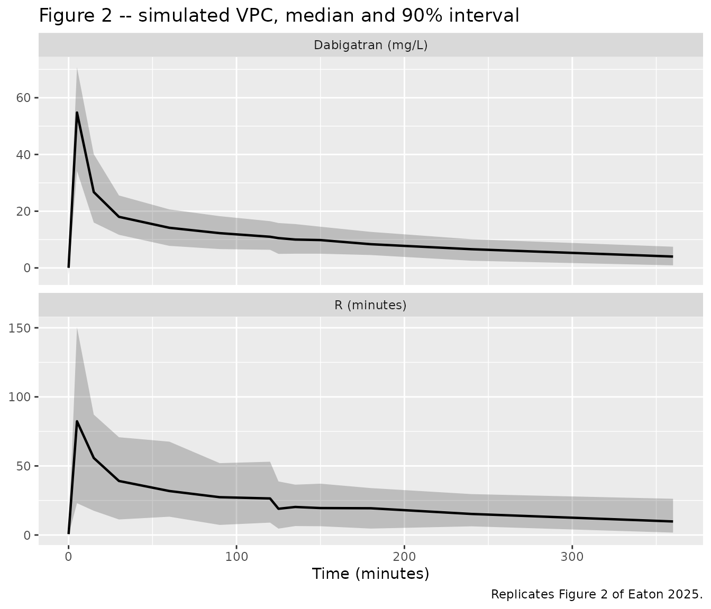
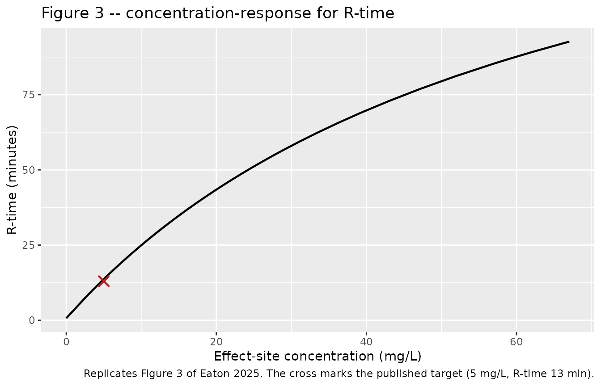
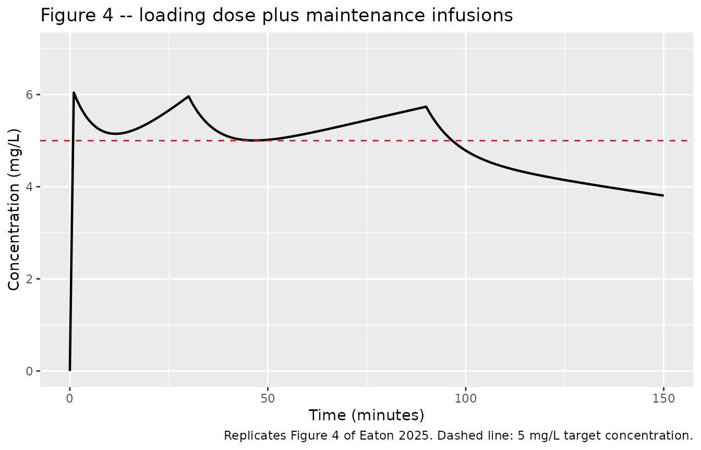
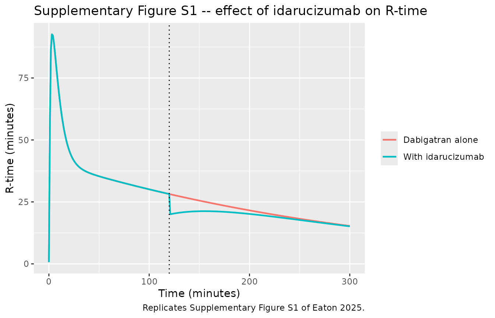

# Dabigatran sheep (Eaton 2025)

## Model and source

    #> ℹ parameter labels from comments will be replaced by 'label()'

- Citation: Eaton MP, Nadtochiy SM, Stefanos T, Anderson BJ. Dabigatran
  pharmacokinetic-pharmacodynamic in sheep: Informing dose for
  anticoagulation during cardiopulmonary bypass. Perfusion.
  2025;40(1):183-191. <doi:10.1177/02676591231226291>

- Description: Preclinical (sheep). Integrated two-compartment IV
  pharmacokinetic plus effect-compartment sigmoid Emax pharmacodynamic
  model for dabigatran and its reversal agent idarucizumab in
  anaesthetised sheep, describing thromboelastographic reaction time
  (R-time). Parameters are allometrically standardised to a 70 kg body
  weight for cross-species comparison (Eaton 2025 Tables 2-3 and the
  supplementary NM-TRAN control stream).

- Article: <https://doi.org/10.1177/02676591231226291>

- Supplementary NM-TRAN control stream and Supplementary Figures S1-S2
  are distributed with the article as supplementary material (open
  access, PMC11715065).

Eaton and colleagues gave five anaesthetised sheep dabigatran 4 mg/kg
intravenously, reversed it with idarucizumab 15 mg/kg at 120 min, and
fitted an integrated pharmacokinetic-pharmacodynamic model to plasma
dabigatran concentrations and thromboelastographic reaction time
(R-time). The purpose of the analysis was to apply the
target-concentration strategy: identify the dabigatran concentration
associated with an acceptable anticoagulant effect, and back out a
loading dose plus maintenance infusion that reaches it for sheep
undergoing cardiopulmonary bypass.

The packaged model reproduces the published structure exactly:
two-compartment dabigatran disposition, an effect compartment linked to
the central compartment by `ke0`, a sigmoid Emax function relating
effect-site concentration to R-time, and a K-PD compartment carrying a
unit idarucizumab dose whose amount reduces R-time linearly.

## Population

Five female sheep, all 6 months old, weighing 28.7, 33.9, 33.8, 33.9 and
41.8 kg (Eaton 2025 Table 1). All animals were studied under general
anaesthesia (ketamine plus midazolam induction, isoflurane maintenance).
Each received dabigatran 4 mg/kg intravenously over 1 min at time 0, and
idarucizumab 15 mg/kg over 30 s at 120 min. Plasma dabigatran and R-time
were sampled at baseline and 5, 15, 30, 60, 90 and 120 min after
dabigatran, then 5, 15, 30, 60, 120, 240 and 480 min and 24 h after
idarucizumab. Markers of hepatic and renal injury (ALT, AST, creatinine)
were unchanged at 24 h.

Parameters in Table 2 and Table 3 are reported standardised to a 70 kg
body weight using allometric scaling, so that the sheep estimates can be
compared against published adult-human values. That 70 kg standard is a
reporting convention: no sheep in the study weighed anything close to
it.

The same information is available programmatically via the model’s
`population` metadata
(`readModelDb("Eaton_2025_dabigatran_sheep")()$population`).

## Source trace

The per-parameter origin is recorded as an in-file comment next to each
`ini()` entry in
`inst/modeldb/specificDrugs/Eaton_2025_dabigatran_sheep.R`. The table
below collects them in one place for review.

| Equation / parameter | Value | Source location |
|----|----|----|
| `lcl` | CL 0.0453 L/min/70 kg | Eaton 2025 Table 2 |
| `lvc` | V1 2.94 L/70 kg | Eaton 2025 Table 2 |
| `lq` | Q 0.268 L/min/70 kg | Eaton 2025 Table 2 |
| `lvp` | V2 9.51 L/70 kg | Eaton 2025 Table 2 |
| `e_wt_cl_q` | 0.75 | Eaton 2025 Methods Eq. 1; supplement `FSZCL = (WT/70)**0.75` |
| `e_wt_vc_vp` | 1 | Eaton 2025 Methods Eq. 1; supplement `FSZV = WT/70` |
| `le0` | E0 0.681 min | Eaton 2025 Table 3 |
| `lemax` | Emax 180 min FIX | Eaton 2025 Table 3; supplement `$THETA (100,180.,300) FIX` |
| `lec50` | Ce50 64.2 mg/L | Eaton 2025 Table 3 |
| `lhill` | N 1 FIX | Eaton 2025 Table 3 |
| `lke0` | T1/2keo 1.04 min, ke0 = ln(2)/1.04 | Eaton 2025 Table 3; supplement `KEQ = LN2/TEQ` |
| `e_wt_ke0` | -0.25 | supplement `FSZT = (WT/70)**0.25` applied to T1/2keo |
| `lkel_ida` | KIDA 0.0218 1/min | Eaton 2025 Table 3 |
| `ldur_ida` | DURIDA 0.0751 min | Eaton 2025 Table 3; supplement `D4 = DURIDA` |
| `lslope_ida` | SLOPEIDA 8.24 min per unit dose | Eaton 2025 Table 3 |
| `etalcl`, `etalvc`, `etalq`, `etalvp` | %BSV 21.3, 7.4, 51.4, 39.6 | Eaton 2025 Table 2 |
| `etale0`, `etalec50`, `etalkel_ida` | %BSV 15.1, 19.9, 105.4 | Eaton 2025 Table 3 |
| `addSd`, `propSd` | 1.32 mg/L, 0.47% | Eaton 2025 Table 2 |
| `addSd_Rtime`, `propSd_Rtime` | 0.149 min, 37.0% | Eaton 2025 Table 3 |
| `d/dt(central)`, `d/dt(peripheral1)` | n/a | supplement `$DES` `DADT(1)`, `DADT(2)` |
| `d/dt(effect)` | n/a | supplement `$DES` `DADT(3) = KEQ*(DCP-DCE)`; Figure 1 |
| `d/dt(depot_kpd)`, `dur(depot_kpd)` | n/a | supplement `$DES` `DADT(4)`, `$PK` `D4 = DURIDA` |
| `Rtime` (sigmoid Emax minus idarucizumab effect) | n/a | Eaton 2025 Eq. 2; supplement `$ERROR` `FX = FX1 - FX2` |

## Virtual cohort

Original observed data are not publicly available. The figures below use
a virtual population of 100 sheep whose body weights span the range
reported in Table 1 (28.7-41.8 kg), dosed on the published schedule.

``` r

set.seed(20250812)

n_sheep <- 100L
tab1_wt <- c(28.7, 33.9, 33.8, 33.9, 41.8)   # Eaton 2025 Table 1
wt_typical <- median(tab1_wt)

# Sampling schedule, expressed as minutes after the dabigatran dose.
# Methods: 5, 15, 30, 60, 90, 120 min after dabigatran; idarucizumab at
# 120 min; then 5, 15, 30, 60, 120, 240, 480 min and 24 h after idarucizumab.
samp_times <- c(0, 5, 15, 30, 60, 90, 120,
                120 + c(5, 15, 30, 60, 120, 240, 480, 24 * 60))

cohort <- tibble(
  id = seq_len(n_sheep),
  WT = runif(n_sheep, min(tab1_wt), max(tab1_wt))
)

# Event-table builder. Dabigatran is a 1-min infusion into `central`;
# idarucizumab is a unit dose into `depot_kpd` with the model-supplied
# zero-order duration (rate = -2). Observations select the endpoint with
# `dvid` (1 = Cc, 2 = Rtime) rather than naming an observable as a
# compartment.
make_events <- function(subjects, times, idarucizumab = TRUE) {
  dabi <- subjects |>
    mutate(time = 0, amt = 4 * WT, evid = 1L, rate = 4 * WT / 1,
           cmt = "central", dvid = NA_integer_, endpoint = NA_character_)

  ida <- subjects |>
    mutate(time = 120, amt = 1, evid = 1L, rate = -2,
           cmt = "depot_kpd", dvid = NA_integer_, endpoint = NA_character_)

  obs <- subjects |>
    tidyr::crossing(time = times, dvid = c(1L, 2L)) |>
    mutate(amt = NA_real_, evid = 0L, rate = NA_real_,
           cmt = NA_character_,
           endpoint = if_else(dvid == 1L, "Cc", "Rtime"))

  out <- bind_rows(dabi, if (idarucizumab) ida else NULL, obs)
  out[order(out$id, out$time, -out$evid), ]
}

events <- make_events(cohort, samp_times)
stopifnot(!anyDuplicated(unique(events[, c("id", "time", "evid", "dvid")])))
```

## Simulation

``` r

mod <- nlmixr2lib::readModelDb("Eaton_2025_dabigatran_sheep")

# `useLinCmt = FALSE`: rxode2's automatic ODE -> linCmt() conversion corrupts
# the dvid -> endpoint mapping for multi-output models.
sim <- rxode2::rxSolve(
  mod, events = events,
  keep = c("WT", "endpoint"),
  useLinCmt = FALSE
) |>
  as.data.frame()
#> ℹ parameter labels from comments will be replaced by 'label()'

stopifnot(dplyr::n_distinct(sim$id) == n_sheep)
```

`Cc` and `Rtime` are the individual predictions; the `sim` column
carries the residual error appropriate to whichever endpoint each row
selected.

## Replicate published figures

### Figure 2 – visual predictive checks

``` r

# Replicates Figure 2 of Eaton 2025: VPC for plasma dabigatran (upper) and
# R-time (lower) over the first 480 min.
vpc <- sim |>
  filter(time <= 480) |>
  mutate(endpoint = factor(endpoint, levels = c("Cc", "Rtime"),
                           labels = c("Dabigatran (mg/L)", "R (minutes)"))) |>
  group_by(endpoint, time) |>
  summarise(
    Q05 = quantile(sim, 0.05),
    Q50 = quantile(sim, 0.50),
    Q95 = quantile(sim, 0.95),
    .groups = "drop"
  )

ggplot(vpc, aes(time, Q50)) +
  geom_ribbon(aes(ymin = Q05, ymax = Q95), alpha = 0.25) +
  geom_line(linewidth = 0.8) +
  facet_wrap(~endpoint, ncol = 1, scales = "free_y") +
  labs(x = "Time (minutes)", y = NULL,
       title = "Figure 2 -- simulated VPC, median and 90% interval",
       caption = "Replicates Figure 2 of Eaton 2025.")
```



Read off the published Figure 2, observed dabigatran concentrations peak
near 55 mg/L at 5 min and fall to a few mg/L by 480 min, while R-times
peak near 100 min at 5 min and fall to under 10 min by 480 min. The
landmarks below are the typical-value trajectory at the median study
weight.

``` r

typ <- rxode2::zeroRe(mod)
#> ℹ parameter labels from comments will be replaced by 'label()'

# 480 min is a landmark of the published figure but is not one of the study's
# sampling times, so it is added to the typical-value grid.
typ_events <- make_events(tibble(id = 1L, WT = wt_typical),
                          sort(unique(c(samp_times, 480))))
sim_typ <- rxode2::rxSolve(typ, typ_events, keep = c("WT", "endpoint"),
                           useLinCmt = FALSE) |>
  as.data.frame()
#> ℹ omega/sigma items treated as zero: 'etalcl', 'etalvc', 'etalq', 'etalvp', 'etale0', 'etalec50', 'etalkel_ida'

sim_typ |>
  filter(endpoint == "Cc", time %in% c(5, 60, 120, 240, 480)) |>
  transmute(time, Cc = round(Cc, 2), Rtime = round(Rtime, 1)) |>
  rename("Time (min)" = time,
         "Dabigatran (mg/L)" = Cc,
         "R-time (min)" = Rtime) |>
  knitr::kable(caption = paste(
    "Typical-value trajectory at the median study weight",
    paste0("(", wt_typical, " kg), including idarucizumab at 120 min.")
  ))
```

| Time (min) | Dabigatran (mg/L) | R-time (min) |
|-----------:|------------------:|-------------:|
|          5 |             55.97 |         89.2 |
|         60 |             14.62 |         34.2 |
|        120 |             11.52 |         28.2 |
|        240 |              7.16 |         18.2 |
|        480 |              2.77 |          8.2 |

Typical-value trajectory at the median study weight (33.9 kg), including
idarucizumab at 120 min. {.table}

``` r


# Hold the trajectory to the Figure 2 landmarks read off the published panels.
landmark <- function(t, what) {
  sim_typ[[what]][sim_typ$endpoint == "Cc" & sim_typ$time == t]
}
stopifnot(
  abs(landmark(5, "Cc") - 55) < 10,        # peak dabigatran near 55 mg/L
  landmark(480, "Cc") < 5,                 # a few mg/L by 480 min
  abs(landmark(5, "Rtime") - 100) < 20,    # peak R-time near 100 min
  landmark(480, "Rtime") < 10              # under 10 min by 480 min
)
```

### Figure 3 – concentration-response for R-time

Figure 3 of Eaton 2025 plots R-time against dabigatran effect-site
concentration and states that an R-time of 13 min (normal range 4-8 min)
is a suitable target effect, corresponding to a target concentration of
5 mg/L. The curve below is traced parametrically from the typical-value
simulation, so it is computed by the packaged model rather than
re-derived here.

``` r

# Replicates Figure 3 of Eaton 2025: R-time vs effect-site concentration.
# Simulated without idarucizumab so that Rtime is the pure Emax response.
ce_events <- make_events(tibble(id = 1L, WT = wt_typical),
                         seq(0, 480, by = 1), idarucizumab = FALSE)
sim_ce <- rxode2::rxSolve(typ, ce_events, keep = c("WT", "endpoint"),
                          useLinCmt = FALSE) |>
  as.data.frame() |>
  filter(endpoint == "Cc")
#> ℹ omega/sigma items treated as zero: 'etalcl', 'etalvc', 'etalq', 'etalvp', 'etale0', 'etalec50', 'etalkel_ida'

ggplot(sim_ce, aes(Ce, Rtime)) +
  geom_line(linewidth = 0.8) +
  geom_point(
    data = data.frame(Ce = 5, Rtime = 13),
    colour = "firebrick", size = 3, shape = 4, stroke = 1.2
  ) +
  labs(x = "Effect-site concentration (mg/L)", y = "R-time (minutes)",
       title = "Figure 3 -- concentration-response for R-time",
       caption = paste("Replicates Figure 3 of Eaton 2025.",
                       "The cross marks the published target",
                       "(5 mg/L, R-time 13 min)."))
```



``` r

# Post-peak branch is monotone in Ce, so interpolation is well defined.
decline <- sim_ce |> filter(time >= 10) |> arrange(Ce)
rtime_at_target <- approx(decline$Ce, decline$Rtime, xout = 5)$y

cat(sprintf(
  "R-time at an effect-site concentration of 5 mg/L: %.2f min (Eaton 2025 Figure 3: 13 min)\n",
  rtime_at_target
))
#> R-time at an effect-site concentration of 5 mg/L: 13.69 min (Eaton 2025 Figure 3: 13 min)

# The published target is quoted to whole minutes, so agreement to within
# 1 min is the tightest assertion the source supports.
stopifnot(abs(rtime_at_target - 13) < 1)
```

### Figure 4 – target-concentration dosing regimen

Figure 4 simulates a loading dose of dabigatran 0.25 mg/kg followed by a
maintenance infusion of 0.0175 mg/kg/min for 30 min and then 0.0075
mg/kg/min from 30 to 90 min, and reports that this achieves a
steady-state target concentration of 5 mg/L. The published simulation
additionally carries a cardiopulmonary-bypass circuit compartment that
is pre-loaded to the same 5 mg/L target; because it starts at the target
concentration there is no net drug flux into it, so the two-compartment
model reproduces the profile.

The loading dose is given here as a 1-min infusion, matching how
dabigatran was administered in the study itself; the article does not
state a loading-dose duration. The choice does not affect the peak,
since 0.25 mg/kg delivered into a central volume of 2.94 L/70 kg gives
5.95 mg/L whether it is infused over 1 min or given as a bolus.

``` r

# Replicates Figure 4 of Eaton 2025, simulated at the 70 kg standard weight.
wt_std <- 70
regimen <- bind_rows(
  data.frame(id = 1L, WT = wt_std, time =  0, amt = 0.25   * wt_std,
             evid = 1L, rate = 0.25 * wt_std / 1,  cmt = "central", dvid = NA_integer_),
  data.frame(id = 1L, WT = wt_std, time =  0, amt = 0.0175 * wt_std * 30,
             evid = 1L, rate = 0.0175 * wt_std,    cmt = "central", dvid = NA_integer_),
  data.frame(id = 1L, WT = wt_std, time = 30, amt = 0.0075 * wt_std * 60,
             evid = 1L, rate = 0.0075 * wt_std,    cmt = "central", dvid = NA_integer_),
  data.frame(id = 1L, WT = wt_std, time = seq(0, 150, by = 0.5),
             amt = NA_real_, evid = 0L, rate = NA_real_,
             cmt = NA_character_, dvid = 1L)
)
regimen <- regimen[order(regimen$time, -regimen$evid), ]

sim_reg <- rxode2::rxSolve(typ, regimen, keep = "WT", useLinCmt = FALSE) |>
  as.data.frame()
#> ℹ omega/sigma items treated as zero: 'etalcl', 'etalvc', 'etalq', 'etalvp', 'etale0', 'etalec50', 'etalkel_ida'

ggplot(sim_reg, aes(time, Cc)) +
  geom_line(linewidth = 0.8) +
  geom_hline(yintercept = 5, linetype = "dashed", colour = "firebrick") +
  coord_cartesian(ylim = c(0, 7)) +
  labs(x = "Time (minutes)", y = "Concentration (mg/L)",
       title = "Figure 4 -- loading dose plus maintenance infusions",
       caption = paste("Replicates Figure 4 of Eaton 2025.",
                       "Dashed line: 5 mg/L target concentration."))
```



``` r

# Assess the maintenance window, i.e. from the end of the 1-min loading
# infusion to the end of the 90-min bypass period.
bypass_window <- sim_reg |> filter(time >= 1, time <= 90)

cat(sprintf(
  "Concentration over the 1-90 min maintenance window: %.2f-%.2f mg/L (mean %.2f); target 5 mg/L\n",
  min(bypass_window$Cc), max(bypass_window$Cc), mean(bypass_window$Cc)
))
#> Concentration over the 1-90 min maintenance window: 5.00-6.04 mg/L (mean 5.36); target 5 mg/L

# The published regimen holds the concentration at or just above the 5 mg/L
# target for the whole bypass period. The peak occurs at the end of the loading
# dose and is inherent to the published numbers: 0.25 mg/kg into a central
# volume of 2.94 L/70 kg is 5.95 mg/L on its own, so a ~20% overshoot of the
# target is a property of the regimen rather than of this implementation.
stopifnot(
  min(bypass_window$Cc) > 4.9,                    # never falls below target
  max(bypass_window$Cc) < 6.1,                    # peak overshoot under 22%
  abs(mean(bypass_window$Cc) - 5) / 5 < 0.10      # window average within 10%
)

# The loading dose alone, as an instantaneous input into the central volume.
stopifnot(abs(0.25 * wt_std / 2.94 - 5.95) < 0.01)
```

### Supplementary Figure S1 – idarucizumab reversal

Eaton 2025 reports that idarucizumab 15 mg/kg given 120 min after
dabigatran reduced R-time “by approximately 5 min over the 5 min after
administration”, and in the Discussion that the reversal agent reduced
reaction time by 30%.

``` r

# Replicates Supplementary Figure S1 of Eaton 2025.
s1_events <- make_events(tibble(id = 1L, WT = wt_typical), seq(0, 300, by = 1))
s1_no     <- make_events(tibble(id = 1L, WT = wt_typical), seq(0, 300, by = 1),
                         idarucizumab = FALSE)

s1 <- bind_rows(
  rxode2::rxSolve(typ, s1_events, keep = c("WT", "endpoint"), useLinCmt = FALSE) |>
    as.data.frame() |> mutate(arm = "With idarucizumab"),
  rxode2::rxSolve(typ, s1_no, keep = c("WT", "endpoint"), useLinCmt = FALSE) |>
    as.data.frame() |> mutate(arm = "Dabigatran alone")
) |>
  filter(endpoint == "Cc")
#> ℹ omega/sigma items treated as zero: 'etalcl', 'etalvc', 'etalq', 'etalvp', 'etale0', 'etalec50', 'etalkel_ida'
#> ℹ omega/sigma items treated as zero: 'etalcl', 'etalvc', 'etalq', 'etalvp', 'etale0', 'etalec50', 'etalkel_ida'

ggplot(s1, aes(time, Rtime, colour = arm)) +
  geom_line(linewidth = 0.8) +
  geom_vline(xintercept = 120, linetype = "dotted") +
  labs(x = "Time (minutes)", y = "R-time (minutes)", colour = NULL,
       title = "Supplementary Figure S1 -- effect of idarucizumab on R-time",
       caption = "Replicates Supplementary Figure S1 of Eaton 2025.")
```



``` r

s1_wide <- s1 |>
  select(time, arm, Rtime) |>
  tidyr::pivot_wider(names_from = arm, values_from = Rtime) |>
  mutate(reduction = `Dabigatran alone` - `With idarucizumab`,
         pct = 100 * reduction / `Dabigatran alone`)

s1_wide |>
  filter(time %in% c(121, 125, 150, 180, 240)) |>
  transmute(time,
            `Dabigatran alone` = round(`Dabigatran alone`, 1),
            `With idarucizumab` = round(`With idarucizumab`, 1),
            reduction = round(reduction, 2),
            pct = round(pct, 1)) |>
  rename("Time (min)" = time,
         "R-time reduction (min)" = reduction,
         "Reduction (%)" = pct) |>
  knitr::kable(caption = "Model-predicted idarucizumab effect on R-time.")
```

| Time (min) | Dabigatran alone | With idarucizumab | R-time reduction (min) | Reduction (%) |
|---:|---:|---:|---:|---:|
| 121 | 28.1 | 20.0 | 8.07 | 28.7 |
| 125 | 27.7 | 20.3 | 7.40 | 26.7 |
| 150 | 25.5 | 21.2 | 4.29 | 16.8 |
| 180 | 23.1 | 20.9 | 2.23 | 9.7 |
| 240 | 18.8 | 18.2 | 0.60 | 3.2 |

Model-predicted idarucizumab effect on R-time. {.table}

``` r


peak <- s1_wide |> filter(time == 125)
cat(sprintf(
  "At 5 min after idarucizumab the model predicts a %.1f min (%.0f%%) reduction in R-time; Eaton 2025 reports about 5 min and, in the Discussion, 30%%.\n",
  peak$reduction, peak$pct
))
#> At 5 min after idarucizumab the model predicts a 7.4 min (27%) reduction in R-time; Eaton 2025 reports about 5 min and, in the Discussion, 30%.
```

## PKNCA validation

The source paper reports no non-compartmental analysis, so there is no
published NCA table to compare against. Instead, NCA of the simulated
dabigatran profile is checked against the identities implied by the
published parameters themselves: `AUC0-inf` must equal `Dose / CL` for
every subject, and the terminal half-life must equal `ln(2) / beta`,
where `beta` is the smaller eigenvalue of the two-compartment system
built from the published `CL`, `V1`, `Q` and `V2`. This is a
non-circular check of the ODE encoding against the standard
two-compartment analytic solution.

``` r

nca_times <- unique(c(seq(0, 10, by = 0.25), seq(10, 60, by = 1),
                      seq(60, 360, by = 5), seq(360, 1440, by = 20)))

nca_events <- make_events(cohort, nca_times, idarucizumab = FALSE) |>
  filter(evid == 1L | dvid == 1L)

sim_nca_raw <- rxode2::rxSolve(mod, nca_events, keep = c("WT", "endpoint"),
                               useLinCmt = FALSE) |>
  as.data.frame()

stopifnot(dplyr::n_distinct(sim_nca_raw$id) == n_sheep)
stopifnot(all(sim_nca_raw$Cc >= 0))

sim_nca <- sim_nca_raw |>
  filter(!is.na(Cc)) |>
  mutate(treatment = "Dabigatran 4 mg/kg IV") |>
  select(id, time, Cc, treatment)

# Guarantee a time-zero record per subject (IV infusion: pre-dose Cc = 0).
sim_nca <- bind_rows(
  sim_nca,
  sim_nca |> distinct(id, treatment) |> mutate(time = 0, Cc = 0)
) |>
  distinct(id, treatment, time, .keep_all = TRUE) |>
  arrange(id, treatment, time)

dose_df <- nca_events |>
  filter(evid == 1L) |>
  mutate(treatment = "Dabigatran 4 mg/kg IV") |>
  select(id, time, amt, treatment)

conc_obj <- PKNCA::PKNCAconc(sim_nca, Cc ~ time | treatment + id,
                             concu = "mg/L", timeu = "min")
dose_obj <- PKNCA::PKNCAdose(dose_df, amt ~ time | treatment + id,
                             doseu = "mg")

intervals <- data.frame(
  start      = 0,
  end        = Inf,
  cmax       = TRUE,
  tmax       = TRUE,
  aucinf.obs = TRUE,
  half.life  = TRUE
)

nca_res <- PKNCA::pk.nca(PKNCA::PKNCAdata(conc_obj, dose_obj, intervals = intervals))
```

### Per-subject analytic identities

``` r

# Per-subject individual parameters as the model actually computed them.
subj_par <- sim_nca_raw |>
  group_by(id) |>
  summarise(WT = first(WT), cl = first(cl), vc = first(vc),
            q = first(q), vp = first(vp), .groups = "drop") |>
  mutate(dose = 4 * WT)

# Closed-form two-compartment quantities from the individual micro-constants.
two_cmt_ref <- function(dose, dur, cl, vc, q, vp) {
  k10 <- cl / vc
  k12 <- q / vc
  k21 <- q / vp
  s <- k10 + k12 + k21
  disc <- sqrt(s^2 - 4 * k10 * k21)
  alpha <- (s + disc) / 2
  beta <- (s - disc) / 2
  a <- (alpha - k21) / (alpha - beta)
  b <- (k21 - beta) / (alpha - beta)
  r0 <- dose / dur
  tibble(
    cmax_ref = (r0 / vc) * (a / alpha * (1 - exp(-alpha * dur)) +
                              b / beta * (1 - exp(-beta * dur))),
    aucinf_ref = dose / cl,
    halflife_ref = log(2) / beta
  )
}

ref <- subj_par |>
  rowwise() |>
  mutate(two_cmt_ref(dose, 1, cl, vc, q, vp)) |>
  ungroup()

nca_wide <- as.data.frame(nca_res$result) |>
  select(id, PPTESTCD, PPORRES) |>
  tidyr::pivot_wider(names_from = PPTESTCD, values_from = PPORRES) |>
  mutate(id = as.integer(as.character(id)))

check <- ref |>
  left_join(nca_wide, by = "id") |>
  mutate(
    auc_err  = abs(aucinf.obs - aucinf_ref) / aucinf_ref,
    cmax_err = abs(cmax - cmax_ref) / cmax_ref,
    hl_err   = abs(half.life - halflife_ref) / halflife_ref
  )

stopifnot(nrow(check) == n_sheep, !anyNA(check$auc_err))

cat(sprintf("Worst per-subject relative error across %d sheep:\n", n_sheep))
#> Worst per-subject relative error across 100 sheep:
cat(sprintf("  AUC0-inf vs Dose/CL      : %.3f%%\n", 100 * max(check$auc_err)))
#>   AUC0-inf vs Dose/CL      : 0.024%
cat(sprintf("  Cmax vs analytic infusion: %.3f%%\n", 100 * max(check$cmax_err)))
#>   Cmax vs analytic infusion: 0.000%
cat(sprintf("  t1/2 vs ln(2)/beta       : %.3f%%\n", 100 * max(check$hl_err)))
#>   t1/2 vs ln(2)/beta       : 0.407%

# Tightened to the accuracy actually achieved; these are exact identities, so
# the only residual is numerical (ODE tolerance and the NCA time grid).
stopifnot(max(check$auc_err)  < 0.01)
stopifnot(max(check$cmax_err) < 0.01)
stopifnot(max(check$hl_err)   < 0.01)
```

### Comparison against the analytic reference

``` r

reference <- tibble::tibble(
  treatment   = "Dabigatran 4 mg/kg IV",
  cmax        = median(ref$cmax_ref),
  tmax        = 1,                       # end of the 1-min infusion
  aucinf.obs  = median(ref$aucinf_ref),
  half.life   = median(ref$halflife_ref)
)

cmp <- nlmixr2lib::ncaComparisonTable(
  simulated = nca_res,
  reference = reference,
  by        = "treatment",
  units     = c(cmax = "mg/L", tmax = "min",
                aucinf.obs = "mg*min/L", half.life = "min"),
  tolerance_pct = 20
)

knitr::kable(
  cmp,
  caption = paste(
    "Simulated NCA vs the analytic two-compartment reference implied by the",
    "published parameters (cohort medians). * differs by >20%."
  ),
  align = c("l", "l", "r", "r", "r")
)
```

| NCA parameter            | treatment             | Reference | Simulated | % diff |
|:-------------------------|:----------------------|----------:|----------:|-------:|
| Cmax (mg/L)              | Dabigatran 4 mg/kg IV |      89.5 |      89.5 |  +0.0% |
| Tmax (min)               | Dabigatran 4 mg/kg IV |         1 |         1 |  +0.0% |
| AUC0-∞ (obs) (mg\*min/L) | Dabigatran 4 mg/kg IV |      5280 |      5280 |  +0.0% |
| t½ (min)                 | Dabigatran 4 mg/kg IV |       189 |       189 |  -0.2% |

Simulated NCA vs the analytic two-compartment reference implied by the
published parameters (cohort medians). \* differs by \>20%. {.table}

No row exceeds the 20% tolerance: the packaged ODE system reproduces the
closed-form two-compartment solution for the published parameters to
well within numerical noise.

## Assumptions and deviations

- **Residual-error scale.** Tables 2 and 3 both print the proportional
  residual error under a “(%)” header. The pharmacodynamic row settles
  the convention: `RUV PROP 37.0` can only be the fraction 0.370 (the
  supplementary control stream’s `$THETA` initial for `RUV_CVPD` is
  0.412), so the pharmacokinetic row’s `0.47` is the fraction 0.0047,
  not 0.47. The supplement’s `$THETA` initial for `RUV_CVCP` is 0.0005,
  which is consistent with the smaller reading, and the width of the
  published Figure 2 prediction interval at 5 min is far too narrow for
  a 47% proportional error.
- **%BSV convention.** Table 2 and Table 3 report `%BSV`, and the
  supplementary `$OMEGA` initial estimates show these are the
  approximate CV `sqrt(omega^2) * 100` rather than the exact log-normal
  CV: Q 51.4% against an `$OMEGA` initial of 0.265 (`0.514^2 = 0.264`),
  V1 7.4% against 0.00591, Ce50 19.9% against 0.0395, E0 15.1% against
  0.0227. The model therefore uses `omega^2 = (%BSV / 100)^2`.
- **Omega block structure not reproduced.** The authors fitted
  `$OMEGA BLOCK(4)` across CL, V1, Q and V2 and `$OMEGA BLOCK(2)` across
  Ce50 and E0. Final off-diagonal estimates are not published – only the
  supplementary control stream’s *initial* covariances are available –
  so only the diagonal variances are encoded. Between-subject
  correlations are consequently absent from the simulated cohort.
- **`etalvp` fixed status.** The supplementary `$OMEGA BLOCK(4)` carries
  `PPVV2` with a `FIX` flag at 0.165 (40.6% BSV), while Table 2 reports
  39.6%. The model uses the published Table 2 magnitude (0.396^2 =
  0.156816) and retains the `fixed()` status the control stream
  documents. The two readings differ by one percentage point of BSV.
- **Hill coefficient.** Table 3 reports `N 1 FIX`; the supplementary
  control stream’s `$THETA (0.1,1.,8)` for `HILL` carries no `FIX` flag.
  The published table is treated as authoritative and `lhill` is fixed.
- **Allometry on the equilibration half-time.** The main text describes
  allometric scaling only for clearances (0.75) and volumes (1). The
  supplementary `$PK` block also scales `TEQ` (the plasma-effect
  equilibration half-time) by `FSZT = (WT/70)**0.25`, which the model
  encodes as an exponent of -0.25 on `ke0`. This exponent is sourced
  from the supplement, not from the article text.
- **Idarucizumab dosing convention.** The reversal agent is modelled
  exactly as published: a *unit* dose (`amt = 1`) into `depot_kpd`
  represents one 15 mg/kg idarucizumab administration, so `lslope_ida`
  carries units of minutes per unit dose. No idarucizumab concentrations
  were measured and no dose range was explored, so the model cannot be
  extrapolated to other idarucizumab doses.
- **Magnitude of the reversal effect.** The model predicts an R-time
  reduction of 7.4 min (27%) at 5 min after idarucizumab, and 8.1 min
  (29%) at 1 min after it, when the K-PD compartment is fullest. That
  matches the Discussion’s “reducing reaction time by 30%” but is larger
  than the “approximately 5 min” quoted in the Results, which describes
  the observed trace in Supplementary Figure S1 for a single animal
  rather than the population prediction.
- **R-time can go negative.** The published structure subtracts the
  idarucizumab effect from the sigmoid Emax effect with no lower bound,
  so large `depot_kpd` amounts combined with low effect-site
  concentrations can drive predicted R-time below zero. This is a
  property of the published model, reproduced faithfully rather than
  patched.
- **The published regimen overshoots its own target.** Reproducing the
  Figure 4 regimen with the Table 2 parameters holds the concentration
  between 5.0 and 6.0 mg/L across the 90-min bypass window, i.e. at or
  above the stated 5 mg/L target rather than centred on it. The excess
  is arithmetic: the loading dose of 0.25 mg/kg divided by the central
  volume of 2.94 L/70 kg is 5.95 mg/L before the maintenance infusion
  contributes anything. The published Figure 4 additionally carries the
  bypass-circuit compartment (below), whose extra volume would draw the
  peak down; that compartment cannot be reproduced because `V3` is not
  reported.
- **Cardiopulmonary-bypass circuit model not packaged.** The
  “Determination of dabigatran dose” section prints a third structure –
  a Berkeley Madonna simulation adding a bypass-circuit compartment
  exchanging with the central compartment at pump flow `Q3` and holding
  circuit volume `V3`. Neither `Q3` nor `V3` is reported anywhere in the
  article or its supplement (Supplementary Figure S2 is a diagram only).
  The printed circuit equation `d/dt(CPB) = C1*Q2 - C3*Q3` is also
  internally inconsistent: the flux from the central compartment into
  the circuit should be carried by the pump flow `Q3`, not by the
  intercompartmental clearance `Q2`. Because the circuit is pre-loaded
  to the target concentration there is no net flux into it, so Figure 4
  is reproducible from the two-compartment model alone, as shown above.
  No values were invented for `Q3` or `V3`.
- **Target R-time quoted inconsistently.** Figure 3’s caption gives an
  R-time target of 13 min for a 5 mg/L target concentration; the
  Discussion says 16 min. The published Emax parameters give
  `0.681 + 180 * 5 / (64.2 + 5) = 13.7 min`, so the Figure 3 value is
  the self-consistent one and is used here.
- **Virtual cohort.** Body weights are drawn uniformly across the
  28.7-41.8 kg range of Table 1 rather than resampled from the five
  observed animals, so the simulated weight distribution is broader than
  the study’s.
