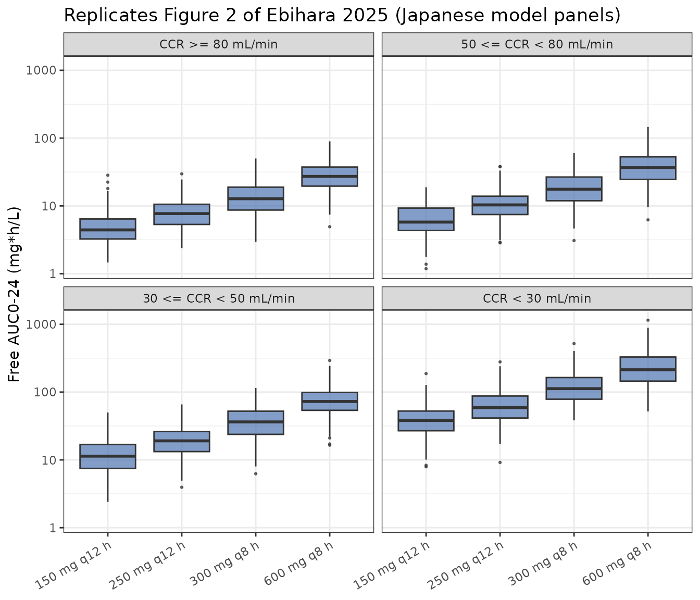
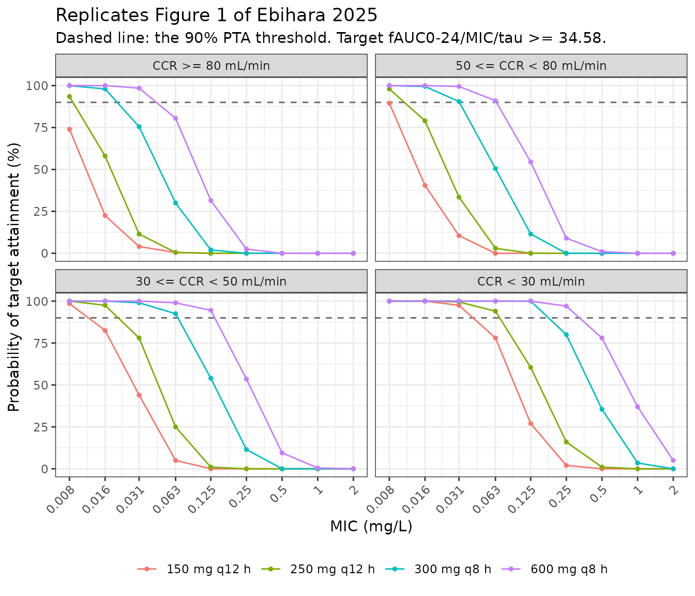
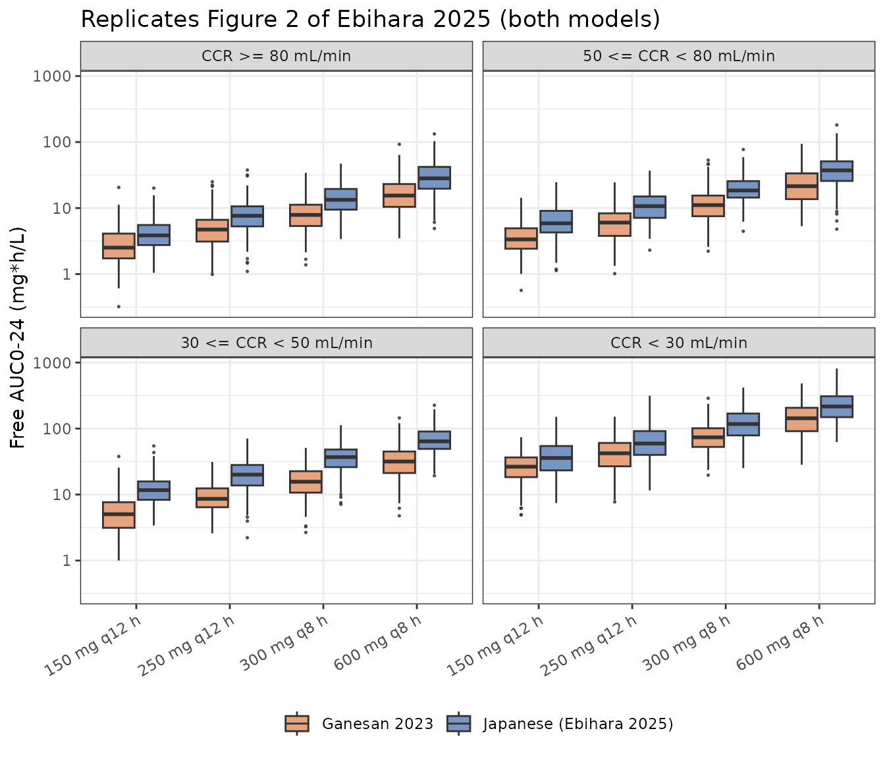
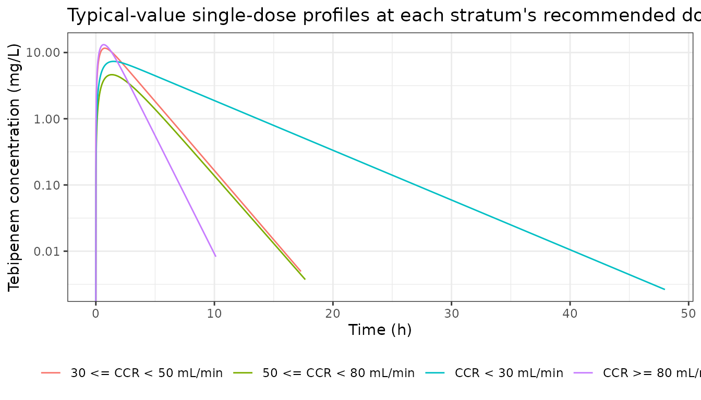

# Tebipenem (Ebihara 2025)

## Model and source

- Citation: Ebihara F, Maruyama T, Kasai H, Shiokawa M, Matsunaga N,
  Hamada Y (2025). Preclinical Study of Pharmacokinetic/Pharmacodynamic
  Analysis of Tebipenem Using Monte Carlo Simulation for
  Extended-Spectrum beta-Lactamase-Producing Bacterial Urinary Tract
  Infections in Japanese Patients According to Renal Function.
  Antibiotics 14(7):648. <doi:10.3390/antibiotics14070648>. The
  structural parameter values originate in Nakashima M, Morita J, Aizawa
  K (2009) Jpn J Chemother 57:109-114 and the inter-individual
  variability in Hirooka H, Sou M, Miyata K, Shiba K, Tanigawara
  Y (2005) Jpn J Clin Pharmacol Ther 36:197-207 (faropenem); both are
  reproduced in Ebihara 2025, which is the source-trace of record for
  every value here.
- Description: One-compartment population PK model with first-order
  absorption for oral tebipenem (given as the prodrug tebipenem pivoxil)
  in Japanese adults, stratified by renal function (Ebihara 2025).
  Apparent clearance CL/F, apparent volume of distribution Vd/F, and the
  absorption rate constant ka each take a separate value in each of four
  Cockcroft-Gault creatinine clearance strata (CRCL \>= 80, 50 to 80, 30
  to 50 and \< 30 mL/min); the stratum is selected inside model() from
  the continuous CRCL covariate. The stratum-specific values are the
  cohort means of a 17-subject Japanese phase 1 study in healthy
  volunteers and subjects with reduced renal function (Nakashima 2009),
  and the inter-individual variability is borrowed from a faropenem
  population PK analysis (Hirooka 2005) because no tebipenem population
  PK model existed for Japanese adults. Every parameter is therefore
  fixed: the source estimates nothing and performs Monte Carlo
  simulation only, so propSd is also fixed at 0. The plasma unbound
  fraction fu = 0.33 is carried as a parameter and the model reports
  unbound concentration Cu alongside total Cc, because the source’s
  target attainment criterion is on unbound drug: fAUC(0-24)/MIC/tau \>=
  34.58 for urinary tract infections caused by ESBL-producing
  Enterobacterales.
- Article: <https://doi.org/10.3390/antibiotics14070648> (open access,
  CC BY)

Tebipenem is an oral carbapenem; it is given as the prodrug tebipenem
pivoxil, which is approved in Japan for pediatric use only. Ebihara et
al. built a one-compartment first-order-absorption model for Japanese
adults in order to recommend renal-function-adjusted adult regimens for
urinary tract infections caused by extended-spectrum beta-lactamase
(ESBL)-producing *Enterobacterales*, as evidence toward a Japanese adult
indication.

The word “Preclinical” in the paper’s title denotes *pre-approval
simulation evidence*, **not** an animal study. The model is a human
model throughout and `population$species` is `"human"`.

``` r

mod <- readModelDb("Ebihara_2025_tebipenem")
ui  <- rxode2::rxode(mod)
#> ℹ parameter labels from comments will be replaced by 'label()'
ui
#>  ── rxode2-based free-form 2-cmt ODE model ────────────────────────────────────── 
#>  ── Initalization: ──  
#> Fixed Effects ($theta): 
#>   lcl_crclge80 lcl_crcl50to80 lcl_crcl30to50   lcl_crcllt30   lvc_crclge80 
#>     3.07906188     2.78352866     2.15292432     1.00210139     3.27567195 
#> lvc_crcl50to80 lvc_crcl30to50   lvc_crcllt30   lka_crclge80 lka_crcl50to80 
#>     3.53666024     2.88513585     2.75709430     0.91629073     0.09531018 
#> lka_crcl30to50   lka_crcllt30             fu         propSd 
#>     1.02961942     0.53062825     0.33000000     0.00000000 
#> 
#> Omega ($omega): 
#>        etalcl etalvc etalka
#> etalcl 0.2809 0.0000 0.0000
#> etalvc 0.0000 0.1369 0.0000
#> etalka 0.0000 0.0000 0.4489
#> attr(,"lotriLabels")
#> [1] "Ebihara 2025 Discussion wCL/F = 53% read as an omega-SD: 0.53^2 = 0.2809"
#> [2] "Ebihara 2025 Discussion wVd/F = 37% read as an omega-SD: 0.37^2 = 0.1369"
#> [3] "Ebihara 2025 Discussion wka   = 67% read as an omega-SD: 0.67^2 = 0.4489"
#> attr(,"lotriFix")
#>        etalcl etalvc etalka
#> etalcl   TRUE  FALSE  FALSE
#> etalvc  FALSE   TRUE  FALSE
#> etalka  FALSE  FALSE   TRUE
#> 
#> States ($state or $stateDf): 
#>   Compartment Number Compartment Name
#> 1                  1            depot
#> 2                  2          central
#>  ── Model (Normalized Syntax): ── 
#> function() {
#>     compartmentData <- list(depot = list(analyte = "tebipenem", 
#>         units = "mg", specimen = "administration site", verified = TRUE), 
#>         central = list(analyte = "tebipenem", units = "mg", specimen = "plasma", 
#>             verified = TRUE))
#>     covariateData <- list(CRCL = list(description = "Creatinine clearance, reported by the source as raw (NOT BSA-normalized) mL/min. Ebihara 2025 abbreviates it CCR and uses it only to allocate a subject to one of four renal-function strata; no continuous within-stratum relationship is estimated.", 
#>         units = "mL/min", type = "continuous", reference_category = NULL, 
#>         notes = "Stratum boundaries are the Ebihara 2025 Table 3 column headers and Methods 4.1: 'Renal function was evaluated in the following four groups: CCR >= 80 mL/min, 50 <= CCR < 80 mL/min, 30 <= CCR < 50 mL/min, and CCR < 30 mL/min.' The four strata are exhaustive and mutually exclusive, so model() selects exactly one value of CL/F, Vd/F and ka per subject; the model is therefore a step function of CRCL and is piecewise-constant within a stratum. Values are raw Cockcroft-Gault mL/min and are NOT BSA-normalized, following the Delattre 2010 amikacin, Georges 2009 ceftazidime, Chen 2023 nemonoxacin, Wada 2023 sparsentan and Shu 2024 posaconazole precedents in this register; the source underlying cohort mean CCR per stratum is 106.3 mL/min (n = 6), 65.8 mL/min (n = 6), 40.2 mL/min (n = 2) and 9.1 mL/min (n = 3) from highest to lowest, reported in Ebihara 2025 Methods 4.4 'CCR simulation approach'. Binary stratification of CRCL at a threshold has precedent in NA_NA_lidocaine.R; this model generalises it to four bands.", 
#>         source_name = "CCR"))
#>     description <- "One-compartment population PK model with first-order absorption for oral tebipenem (given as the prodrug tebipenem pivoxil) in Japanese adults, stratified by renal function (Ebihara 2025). Apparent clearance CL/F, apparent volume of distribution Vd/F, and the absorption rate constant ka each take a separate value in each of four Cockcroft-Gault creatinine clearance strata (CRCL >= 80, 50 to 80, 30 to 50 and < 30 mL/min); the stratum is selected inside model() from the continuous CRCL covariate. The stratum-specific values are the cohort means of a 17-subject Japanese phase 1 study in healthy volunteers and subjects with reduced renal function (Nakashima 2009), and the inter-individual variability is borrowed from a faropenem population PK analysis (Hirooka 2005) because no tebipenem population PK model existed for Japanese adults. Every parameter is therefore fixed: the source estimates nothing and performs Monte Carlo simulation only, so propSd is also fixed at 0. The plasma unbound fraction fu = 0.33 is carried as a parameter and the model reports unbound concentration Cu alongside total Cc, because the source's target attainment criterion is on unbound drug: fAUC(0-24)/MIC/tau >= 34.58 for urinary tract infections caused by ESBL-producing Enterobacterales."
#>     population <- list(species = "human", n_subjects = 17, n_studies = 1, 
#>         weight_median = "61.9 kg (cohort mean)", height_median = "164.3 cm (cohort mean)", 
#>         bsa_median = "1.67 m^2 (cohort mean)", regions = "Japan", 
#>         disease_state = "Underlying PK cohort: healthy Japanese volunteers plus subjects with reduced renal function (Nakashima 2009 phase 1). Simulation target population: Japanese adults with urinary tract infection caused by extended-spectrum beta-lactamase (ESBL)-producing Enterobacterales (Escherichia coli and Klebsiella pneumoniae, MIC90 0.03 mg/L).", 
#>         renal_function = "Four Cockcroft-Gault creatinine clearance strata with cohort mean CCR and n: CCR >= 80 mL/min (106.3 mL/min, n = 6); 50 <= CCR < 80 mL/min (65.8 mL/min, n = 6); 30 <= CCR < 50 mL/min (40.2 mL/min, n = 2); CCR < 30 mL/min (9.1 mL/min, n = 3).", 
#>         dose_range = "Simulated oral regimens: 150 mg q12h, 250 mg q12h, 300 mg q8h and 600 mg q8h. Tebipenem pivoxil is approved in Japan for pediatric use only (4 mg/kg twice daily, up to 6 mg/kg); no adult indication is established, which is what this analysis was designed to support.", 
#>         notes = "Demographics from Ebihara 2025 Methods 4.1 ('The Japanese study population (n = 17) had the following demographic characteristics: mean height, 164.3 cm; mean body weight, 61.9 kg; and mean BSA, 1.67 m^2') and Methods 4.4. Per-stratum n sums to 17 (6 + 6 + 2 + 3). The source reports no age or sex distribution. The word 'Preclinical' in the source title denotes pre-approval simulation evidence supporting a Japanese adult regulatory application, NOT an animal study: the model is a human model throughout. Monte Carlo simulations used 1000 virtual patients per renal-function stratum in Phoenix 8.3.")
#>     reference <- "Ebihara F, Maruyama T, Kasai H, Shiokawa M, Matsunaga N, Hamada Y (2025). Preclinical Study of Pharmacokinetic/Pharmacodynamic Analysis of Tebipenem Using Monte Carlo Simulation for Extended-Spectrum beta-Lactamase-Producing Bacterial Urinary Tract Infections in Japanese Patients According to Renal Function. Antibiotics 14(7):648. doi:10.3390/antibiotics14070648. The structural parameter values originate in Nakashima M, Morita J, Aizawa K (2009) Jpn J Chemother 57:109-114 and the inter-individual variability in Hirooka H, Sou M, Miyata K, Shiba K, Tanigawara Y (2005) Jpn J Clin Pharmacol Ther 36:197-207 (faropenem); both are reproduced in Ebihara 2025, which is the source-trace of record for every value here."
#>     units <- list(time = "h", dosing = "mg", concentration = "mg/L")
#>     vignette <- "Ebihara_2025_tebipenem"
#>     ini({
#>         lcl_crclge80 <- fix(3.079061881141)
#>         label("Apparent clearance CL/F, CRCL >= 80 mL/min (L/h)")
#>         lcl_crcl50to80 <- fix(2.78352866227812)
#>         label("Apparent clearance CL/F, 50 <= CRCL < 80 mL/min (L/h)")
#>         lcl_crcl30to50 <- fix(2.15292431843964)
#>         label("Apparent clearance CL/F, 30 <= CRCL < 50 mL/min (L/h)")
#>         lcl_crcllt30 <- fix(1.00210138828727)
#>         label("Apparent clearance CL/F, CRCL < 30 mL/min (L/h)")
#>         lvc_crclge80 <- fix(3.27567195086761)
#>         label("Apparent volume of distribution Vd/F, CRCL >= 80 mL/min (L)")
#>         lvc_crcl50to80 <- fix(3.53666024113642)
#>         label("Apparent volume of distribution Vd/F, 50 <= CRCL < 80 mL/min (L)")
#>         lvc_crcl30to50 <- fix(2.88513585221196)
#>         label("Apparent volume of distribution Vd/F, 30 <= CRCL < 50 mL/min (L)")
#>         lvc_crcllt30 <- fix(2.75709430128113)
#>         label("Apparent volume of distribution Vd/F, CRCL < 30 mL/min (L)")
#>         lka_crclge80 <- fix(0.916290731874155)
#>         label("Absorption rate constant ka, CRCL >= 80 mL/min (1/h)")
#>         lka_crcl50to80 <- fix(0.0953101798043249)
#>         label("Absorption rate constant ka, 50 <= CRCL < 80 mL/min (1/h)")
#>         lka_crcl30to50 <- fix(1.02961941718116)
#>         label("Absorption rate constant ka, 30 <= CRCL < 50 mL/min (1/h)")
#>         lka_crcllt30 <- fix(0.53062825106217)
#>         label("Absorption rate constant ka, CRCL < 30 mL/min (1/h)")
#>         fu <- fix(0.33)
#>         label("Fraction unbound in plasma (unitless)")
#>         propSd <- fix(0, 0)
#>         label("Proportional residual error (fraction; ZERO - not reported in source)")
#>         etalcl ~ fix(0.2809)
#>         label("Ebihara 2025 Discussion wCL/F = 53% read as an omega-SD: 0.53^2 = 0.2809")
#>         etalvc ~ fix(0.1369)
#>         label("Ebihara 2025 Discussion wVd/F = 37% read as an omega-SD: 0.37^2 = 0.1369")
#>         etalka ~ fix(0.4489)
#>         label("Ebihara 2025 Discussion wka   = 67% read as an omega-SD: 0.67^2 = 0.4489")
#>     })
#>     model({
#>         crclGe80 <- (CRCL >= 80)
#>         crcl50to80 <- (CRCL >= 50) * (CRCL < 80)
#>         crcl30to50 <- (CRCL >= 30) * (CRCL < 50)
#>         crclLt30 <- (CRCL < 30)
#>         cl <- (exp(lcl_crclge80) * crclGe80 + exp(lcl_crcl50to80) * 
#>             crcl50to80 + exp(lcl_crcl30to50) * crcl30to50 + exp(lcl_crcllt30) * 
#>             crclLt30) * exp(etalcl)
#>         vc <- (exp(lvc_crclge80) * crclGe80 + exp(lvc_crcl50to80) * 
#>             crcl50to80 + exp(lvc_crcl30to50) * crcl30to50 + exp(lvc_crcllt30) * 
#>             crclLt30) * exp(etalvc)
#>         ka <- (exp(lka_crclge80) * crclGe80 + exp(lka_crcl50to80) * 
#>             crcl50to80 + exp(lka_crcl30to50) * crcl30to50 + exp(lka_crcllt30) * 
#>             crclLt30) * exp(etalka)
#>         kel <- cl/vc
#>         d/dt(depot) <- -ka * depot
#>         d/dt(central) <- ka * depot - kel * central
#>         Cc <- central/vc
#>         Cu <- fu * Cc
#>         Cc ~ prop(propSd)
#>     })
#> }
```

## Population

The structural parameters come from a Japanese phase 1 study of
tebipenem pivoxil tablets in healthy volunteers and in subjects with
reduced renal function (Nakashima 2009, the source’s reference 15),
reproduced in Ebihara 2025 Table 3. That cohort had 17 subjects with
mean height 164.3 cm, mean body weight 61.9 kg and mean body surface
area 1.67 m^2 (Ebihara 2025 Methods 4.1). Subjects were distributed
across four Cockcroft-Gault creatinine clearance (CCR) strata, with the
stratum mean CCR and sample size reported in Methods 4.4: 106.3 mL/min
(n = 6), 65.8 mL/min (n = 6), 40.2 mL/min (n = 2) and 9.1 mL/min (n =
3). The per-stratum sample sizes sum to 17. The source reports no age or
sex distribution.

Inter-individual variability was **not** available for tebipenem.
Ebihara et al. borrowed it from a population PK analysis of faropenem
(abbreviated FRPM in the source; Hirooka 2005, reference 17) on the
grounds that the two oral penems share an elimination route, and noted
in the Discussion that the borrowed values are close to those later
reported for tebipenem by Ganesan 2023.

The same information is available programmatically via the model’s
`population` metadata:

``` r

str(mod()$population)
#> List of 11
#>  $ species       : chr "human"
#>  $ n_subjects    : num 17
#>  $ n_studies     : num 1
#>  $ weight_median : chr "61.9 kg (cohort mean)"
#>  $ height_median : chr "164.3 cm (cohort mean)"
#>  $ bsa_median    : chr "1.67 m^2 (cohort mean)"
#>  $ regions       : chr "Japan"
#>  $ disease_state : chr "Underlying PK cohort: healthy Japanese volunteers plus subjects with reduced renal function (Nakashima 2009 pha"| __truncated__
#>  $ renal_function: chr "Four Cockcroft-Gault creatinine clearance strata with cohort mean CCR and n: CCR >= 80 mL/min (106.3 mL/min, n "| __truncated__
#>  $ dose_range    : chr "Simulated oral regimens: 150 mg q12h, 250 mg q12h, 300 mg q8h and 600 mg q8h. Tebipenem pivoxil is approved in "| __truncated__
#>  $ notes         : chr "Demographics from Ebihara 2025 Methods 4.1 ('The Japanese study population (n = 17) had the following demograph"| __truncated__
```

## Source trace

Every `ini()` entry carries an in-file comment naming its origin in
`inst/modeldb/specificDrugs/Ebihara_2025_tebipenem.R`. Collected here
for review:

| Equation / parameter | Value | Source location |
|----|----|----|
| Structural model: 1 compartment, first-order absorption | – | Table 3, “Pharmacokinetic Model” row; Methods 4.1 (“A one-compartment model with first-order absorption was employed”) |
| Renal strata: CRCL \>= 80, 50-80, 30-50, \< 30 mL/min | – | Table 3 column headers; Methods 4.1 (“Renal function was evaluated in the following four groups”) |
| `lcl_crclge80` | log(21.738) L/h | Table 3, CCR \>= 80 column, CL/F row |
| `lcl_crcl50to80` | log(16.176) L/h | Table 3, 50 \<= CCR \< 80 column, CL/F row |
| `lcl_crcl30to50` | log(8.61) L/h | Table 3, 30 \<= CCR \< 50 column, CL/F row |
| `lcl_crcllt30` | log(2.724) L/h | Table 3, CCR \< 30 column, CL/F row |
| `lvc_crclge80` | log(26.461) L | Table 3, CCR \>= 80 column, Vd/F row |
| `lvc_crcl50to80` | log(34.352) L | Table 3, 50 \<= CCR \< 80 column, Vd/F row |
| `lvc_crcl30to50` | log(17.906) L | Table 3, 30 \<= CCR \< 50 column, Vd/F row |
| `lvc_crcllt30` | log(15.754) L | Table 3, CCR \< 30 column, Vd/F row |
| `lka_crclge80` | log(2.5) 1/h | Table 3, CCR \>= 80 column, ka row |
| `lka_crcl50to80` | log(1.1) 1/h | Table 3, 50 \<= CCR \< 80 column, ka row |
| `lka_crcl30to50` | log(2.8) 1/h | Table 3, 30 \<= CCR \< 50 column, ka row |
| `lka_crcllt30` | log(1.7) 1/h | Table 3, CCR \< 30 column, ka row |
| `fu` | 0.33 | Table 3, Fu row (identical in all four columns); Methods 4.1 (“The unbound fraction of TBPM was set at 0.33 \[28\]”) |
| `etalcl` | 0.53^2 = 0.2809 | Discussion (“The inter-individual variability values used from FRPM (wCL/F = 53%; …)”); Methods 4.1 |
| `etalvc` | 0.37^2 = 0.1369 | Discussion (wVd/F = 37%); Methods 4.1 |
| `etalka` | 0.67^2 = 0.4489 | Discussion (wka = 67%); Methods 4.1 |
| `propSd` | fixed(0) | Not reported: the source performs Monte Carlo simulation only and fits no data |
| PK/PD target `fAUC(0-24)/MIC/tau >= 34.58` | – | Methods 4.3; attributed to McEntee 2019 (reference 10) |
| MIC90 0.03 mg/L; MIC sweep 0.008-2 mg/L | – | Methods 4.2 |
| Published PTA grid used as the validation target | – | Table 2; Results paragraphs for Figure 1 |
| Recommended regimen per stratum | – | Table 1 |

Note that both `Vd/F` and `ka` are **non-monotone** in renal function as
printed (Vd/F is largest in the 50-80 stratum; ka is largest in the
30-50 stratum). The values are transcribed exactly as published; the
source’s limitations paragraph attributes irregularity in the impaired
strata to their very small sample sizes (n = 2 and n = 3).

## Study design constants

``` r

bands <- tibble::tribble(
  ~band,       ~label,                  ~crcl,  ~cl,     ~vd,     ~ka,
  "ge80",      "CCR >= 80 mL/min",      106.3,  21.738,  26.461,  2.5,
  "c50to80",   "50 <= CCR < 80 mL/min",  65.8,  16.176,  34.352,  1.1,
  "c30to50",   "30 <= CCR < 50 mL/min",  40.2,   8.610,  17.906,  2.8,
  "lt30",      "CCR < 30 mL/min",         9.1,   2.724,  15.754,  1.7
)
bands$label <- factor(bands$label, levels = bands$label)

regimens <- tibble::tribble(
  ~regimen,        ~dose, ~tau,
  "150 mg q12 h",    150,    12,
  "250 mg q12 h",    250,    12,
  "300 mg q8 h",     300,     8,
  "600 mg q8 h",     600,     8
)
regimens$daily   <- regimens$dose * 24 / regimens$tau
regimens$regimen <- factor(regimens$regimen, levels = regimens$regimen)

FU     <- 0.33     # Table 3 Fu row
TARGET <- 34.58    # Methods 4.3 PK/PD target
MIC90  <- 0.03     # Methods 4.2 MIC90 for ESBL-producing E. coli / K. pneumoniae
N_ARM  <- 200      # simulated subjects per arm (source used 1000; 200 is the
                   # nlmixr2lib per-arm cap and is ample for these gates)
```

## Structural gates

### Gate 1: the stratum selector reproduces Table 3 exactly

The model stores four typical values per parameter and selects one
inside `model()` from the continuous `CRCL` covariate. Solving at each
stratum’s mean CCR with IIV zeroed must return the printed Table 3
numbers.

``` r

mkEvents <- function(crcl, dose, tau, grid, ss = FALSE) {
  # One et() per arm, then replicate rows across subjects. Building one et()
  # per subject is ~40x slower and dominates the render.
  doseTimes <- seq(0, 24 - 1e-9, by = tau)
  e <- if (ss) {
    ev <- rxode2::et(amt = dose, cmt = "depot", ii = tau, ss = 1)
    for (tt in doseTimes[-1]) ev <- rxode2::et(ev, amt = dose, cmt = "depot", time = tt)
    ev
  } else {
    ev <- rxode2::et(amt = dose, cmt = "depot", time = doseTimes[1])
    for (tt in doseTimes[-1]) ev <- rxode2::et(ev, amt = dose, cmt = "depot", time = tt)
    ev
  }
  # Observations go on the ODE state `central`; rxode2 returns the algebraic
  # observables Cc and Cu as columns on those rows. Naming an observable as the
  # observation compartment would inject a slot for it and renumber the states.
  tmpl <- as.data.frame(rxode2::et(e, grid, cmt = "central"))
  n    <- length(crcl)
  out  <- tmpl[rep(seq_len(nrow(tmpl)), times = n), , drop = FALSE]
  out$id   <- rep(seq_len(n), each = nrow(tmpl))
  out$CRCL <- rep(as.numeric(crcl), each = nrow(tmpl))
  rownames(out) <- NULL
  out
}

typEv <- mkEvents(bands$crcl, dose = 300, tau = 24, grid = seq(0, 24, by = 0.25))
typ   <- rxode2::rxSolve(rxode2::zeroRe(mod), typEv, returnType = "data.frame")
#> ℹ parameter labels from comments will be replaced by 'label()'
#> ℹ omega/sigma items treated as zero: 'etalcl', 'etalvc', 'etalka'
#> Warning: multi-subject simulation without without 'omega'

got <- typ |>
  group_by(id) |>
  slice(1) |>
  ungroup() |>
  transmute(band = bands$band[id], crcl = CRCL, cl, vc, ka)

stopifnot(nrow(got) == 4L, identical(got$band, bands$band))
stopifnot(
  isTRUE(all.equal(got$cl, bands$cl, tolerance = 1e-9)),
  isTRUE(all.equal(got$vc, bands$vd, tolerance = 1e-9)),
  isTRUE(all.equal(got$ka, bands$ka, tolerance = 1e-9))
)

got |>
  mutate(across(c(cl, vc, ka), ~ round(.x, 3))) |>
  rename(
    "Renal stratum"    = band,
    "CRCL (mL/min)"    = crcl,
    "CL/F (L/h)"       = cl,
    "Vd/F (L)"         = vc,
    "ka (1/h)"         = ka
  ) |>
  knitr::kable(caption = "Gate 1 (PASS): solved typical values reproduce every cell of Ebihara 2025 Table 3.")
```

| Renal stratum | CRCL (mL/min) | CL/F (L/h) | Vd/F (L) | ka (1/h) |
|:--------------|--------------:|-----------:|---------:|---------:|
| ge80          |         106.3 |     21.738 |   26.461 |      2.5 |
| c50to80       |          65.8 |     16.176 |   34.352 |      1.1 |
| c30to50       |          40.2 |      8.610 |   17.906 |      2.8 |
| lt30          |           9.1 |      2.724 |   15.754 |      1.7 |

Gate 1 (PASS): solved typical values reproduce every cell of Ebihara
2025 Table 3. {.table}

### Gate 2: the four strata are exhaustive and mutually exclusive

The band boundaries are inclusive at the lower edge (`CCR >= 80`,
`50 <= CCR < 80`, …). Exactly one indicator must equal 1 for any
non-negative CRCL, including at the 30 / 50 / 80 mL/min knots.

``` r

edges  <- c(0, 29.999, 30, 49.999, 50, 79.999, 80, 120, 200)
bndEv  <- mkEvents(edges, dose = 300, tau = 24, grid = c(0, 1))
bnd    <- rxode2::rxSolve(rxode2::zeroRe(mod), bndEv, returnType = "data.frame")
#> ℹ parameter labels from comments will be replaced by 'label()'
#> ℹ omega/sigma items treated as zero: 'etalcl', 'etalvc', 'etalka'
#> Warning: multi-subject simulation without without 'omega'

indCols <- c("crclLt30", "crcl30to50", "crcl50to80", "crclGe80")
ind <- bnd |>
  group_by(id) |>
  slice(1) |>
  ungroup() |>
  transmute(CRCL = CRCL, across(all_of(indCols))) |>
  mutate(total = rowSums(across(all_of(indCols))))

stopifnot(nrow(ind) == length(edges), all(ind$total == 1))

ind |>
  rename(
    "CRCL (mL/min)" = CRCL, "CRCL < 30" = crclLt30, "30-50" = crcl30to50,
    "50-80" = crcl50to80, "CRCL >= 80" = crclGe80, "Sum" = total
  ) |>
  knitr::kable(caption = "Gate 2 (PASS): stratum indicators sum to exactly 1 at every boundary, so the selector is a well-defined partition of CRCL.")
```

| CRCL (mL/min) | CRCL \< 30 | 30-50 | 50-80 | CRCL \>= 80 | Sum |
|--------------:|-----------:|------:|------:|------------:|----:|
|         0.000 |          1 |     0 |     0 |           0 |   1 |
|        29.999 |          1 |     0 |     0 |           0 |   1 |
|        30.000 |          0 |     1 |     0 |           0 |   1 |
|        49.999 |          0 |     1 |     0 |           0 |   1 |
|        50.000 |          0 |     0 |     1 |           0 |   1 |
|        79.999 |          0 |     0 |     1 |           0 |   1 |
|        80.000 |          0 |     0 |     0 |           1 |   1 |
|       120.000 |          0 |     0 |     0 |           1 |   1 |
|       200.000 |          0 |     0 |     0 |           1 |   1 |

Gate 2 (PASS): stratum indicators sum to exactly 1 at every boundary, so
the selector is a well-defined partition of CRCL. {.table}

### Gate 3: steady-state AUC(0-24) equals daily dose / (CL/F)

For a linear one-compartment model, steady-state AUC over 24 h is
exactly `daily dose / (CL/F)` – volume, `ka` and `F` all cancel. This
identity is what makes the source’s target-attainment grid reducible to
a closed form in the clearance distribution alone (used in the next
section), so it is worth verifying against the integrator rather than
assuming it.

``` r

ssEv <- mkEvents(bands$crcl, dose = 300, tau = 8, grid = seq(0, 24, by = 0.005),
                 ss = TRUE)
ssSol <- rxode2::rxSolve(rxode2::zeroRe(mod), ssEv, returnType = "data.frame",
                         atol = 1e-12, rtol = 1e-10)
#> ℹ parameter labels from comments will be replaced by 'label()'
#> ℹ omega/sigma items treated as zero: 'etalcl', 'etalvc', 'etalka'
#> Warning: multi-subject simulation without without 'omega'

trapz <- function(t, y) sum(diff(t) * (head(y, -1) + tail(y, -1)) / 2)

aucChk <- ssSol |>
  filter(!is.na(Cc)) |>
  group_by(id) |>
  summarise(cl = first(cl), auc_sim = trapz(time, Cc), .groups = "drop") |>
  mutate(
    band     = bands$band[id],
    auc_ana  = 900 / cl,
    pct_diff = 100 * (auc_sim / auc_ana - 1)
  )

stopifnot(max(abs(aucChk$pct_diff)) < 0.05)

aucChk |>
  transmute(
    band,
    `CL/F (L/h)`                = round(cl, 3),
    `Simulated AUC0-24`         = round(auc_sim, 3),
    `900 / (CL/F)`              = round(auc_ana, 3),
    `Difference (%)`            = signif(pct_diff, 2)
  ) |>
  rename("Renal stratum" = band) |>
  knitr::kable(caption = "Gate 3 (PASS): simulated steady-state AUC0-24 for 300 mg q8 h matches daily dose / (CL/F) to better than 0.05%.")
```

| Renal stratum | CL/F (L/h) | Simulated AUC0-24 | 900 / (CL/F) | Difference (%) |
|:--------------|-----------:|------------------:|-------------:|---------------:|
| ge80          |     21.738 |            41.402 |       41.402 |       -4.3e-04 |
| c50to80       |     16.176 |            55.638 |       55.638 |       -1.1e-04 |
| c30to50       |      8.610 |           104.529 |      104.530 |       -2.8e-04 |
| lt30          |      2.724 |           330.396 |      330.396 |       -6.1e-05 |

Gate 3 (PASS): simulated steady-state AUC0-24 for 300 mg q8 h matches
daily dose / (CL/F) to better than 0.05%. {.table}

## Resolving three under-specified readings from the published PTA grid

The source states its target as `fAUC0-24/MIC * 1/tau >= 34.58` and
reports its IIV as bare percentages with no OMEGA block. Three readings
are therefore not pinned by the text alone:

1.  **Does `1/tau` belong in the metric?** The phrase could be read as
    `fAUC0-24/MIC`, as `(fAUC0-24/MIC)/tau`, or as an
    average-concentration ratio `fAUC0-24/MIC/24`.
2.  **Is the grid computed on unbound or total drug?** The source says
    unbound, but a published PTA table that silently used total drug
    would shift every dose recommendation by `1/fu`.
3.  **Is `wCL/F = 53%` an omega-SD (`omega = 0.53`), a %CV
    (`omega = sqrt(log(1 + 0.53^2))`), or a variance
    (`omega = sqrt(0.53)`)?**

Because Gate 3 established `AUC0-24 = daily dose / (CL/F)` exactly, the
attainment criterion collapses to a closed-form constraint on `CL/F`
alone:

`PTA = P(CL/F <= fu * daily dose / (TARGET * MIC * tau))`,

and with log-normal IIV that is just
`pnorm(log(metric / TARGET) / omega)`. All 18 PTA cells the source
publishes (Table 2 for MIC 0.03, plus the two MIC 0.06 cells quoted in
the Results text) can therefore be scored against each reading with no
simulation and no assumption about the within-stratum CRCL distribution
– `CL/F` is constant within a stratum by construction.

``` r

published <- bind_rows(
  tibble::tibble(band = "lt30",    regimen = regimens$regimen, mic = MIC90,
                 pta = c(97.3, 99.9, 100, 100)),
  tibble::tibble(band = "c30to50", regimen = regimens$regimen, mic = MIC90,
                 pta = c(40.6, 74.9, 99.4, 100)),
  tibble::tibble(band = "c50to80", regimen = regimens$regimen, mic = MIC90,
                 pta = c(7.4, 32.3, 93.3, 99.7)),
  tibble::tibble(band = "ge80",    regimen = regimens$regimen, mic = MIC90,
                 pta = c(3.2, 17.2, 79.4, 98.4)),
  # Results, "moderate renal impairment" paragraph: MIC 0.06 mg/L cells.
  tibble::tibble(band = "c50to80", regimen = factor(c("300 mg q8 h", "600 mg q8 h"),
                                                   levels = levels(regimens$regimen)),
                 mic = 0.06, pta = c(56.4, 93.3))
) |>
  left_join(regimens, by = "regimen") |>
  left_join(bands |> select(band, label, cl), by = "band")

stopifnot(nrow(published) == 18L, !anyNA(published$cl), !anyNA(published$tau))

ptaClosed <- function(f, tauDiv, omega, d = published) {
  metric <- f * (d$daily / d$cl) / d$mic / tauDiv
  pnorm(log(metric / TARGET) / omega) * 100
}
score <- function(pred) sqrt(mean((pred - published$pta)^2))

metricGrid <- tibble::tibble(
  Reading = c("(fAUC0-24 / MIC) / tau", "fAUC0-24 / MIC", "fAUC0-24 / MIC / 24"),
  RMSE    = c(score(ptaClosed(FU, published$tau, 0.53)),
              score(ptaClosed(FU, 1,              0.53)),
              score(ptaClosed(FU, 24,             0.53)))
)

omegaGrid <- tidyr::expand_grid(
  scale = c("omega = 53/100 (log-scale SD)",
            "53% read as %CV: omega = sqrt(log(1 + CV^2))",
            "53% read as a variance: omega = sqrt(0.53)"),
  basis = c("unbound (fu = 0.33)", "total drug (f = 1)")
) |>
  mutate(
    omega = c(0.53, 0.53, sqrt(log(1 + 0.53^2)), sqrt(log(1 + 0.53^2)),
              sqrt(0.53), sqrt(0.53)),
    f     = ifelse(basis == "unbound (fu = 0.33)", FU, 1),
    RMSE  = mapply(function(f, om) score(ptaClosed(f, published$tau, om)), f, omega)
  )

# Named handles so the narrative below cannot drift from the computed values.
rmseSd   <- score(ptaClosed(FU, published$tau, 0.53))
rmseCv   <- score(ptaClosed(FU, published$tau, sqrt(log(1 + 0.53^2))))
rmseVar  <- score(ptaClosed(FU, published$tau, sqrt(0.53)))
predSd   <- ptaClosed(FU, published$tau, 0.53)
biasSd   <- mean(predSd - published$pta)
maxSd    <- max(abs(predSd - published$pta))
# The source's own Monte Carlo SE at n = 1000 per stratum.
mcsePub  <- max(sqrt(published$pta / 100 * (1 - published$pta / 100) / 1000) * 100)

# Day-1 (still-accumulating) rather than steady-state reading of AUC0-24, for a
# 1-compartment first-order-absorption model:
#   AUC(0,T) of one dose = (D/CL) * (1 - (ka*exp(-kel*T) - kel*exp(-ka*T))/(ka - kel))
aucDay1 <- function(D, tau, CL, V, KA) {
  kel <- CL / V
  sum(vapply(seq(0, 24 - 1e-9, by = tau), function(t0) {
    T <- 24 - t0
    (D / CL) * (1 - (KA * exp(-kel * T) - kel * exp(-KA * T)) / (KA - kel))
  }, numeric(1)))
}
day1 <- published |>
  left_join(bands |> select(band, vd, ka), by = "band") |>
  mutate(auc = mapply(aucDay1, dose, tau, cl, vd, ka))
rmseDay1 <- sqrt(mean((pnorm(log(FU * day1$auc / day1$mic / day1$tau / TARGET) / 0.53) *
                         100 - published$pta)^2))
accMin <- min(day1$auc / (day1$daily / day1$cl))

knitr::kable(
  metricGrid |> mutate(RMSE = round(RMSE, 2)),
  caption = "Metric reading, scored against the 18 published PTA cells (omega = 0.53, unbound). Only the '/tau' reading is admissible."
)
```

| Reading                |  RMSE |
|:-----------------------|------:|
| (fAUC0-24 / MIC) / tau |  1.75 |
| fAUC0-24 / MIC         | 44.66 |
| fAUC0-24 / MIC / 24    | 35.94 |

Metric reading, scored against the 18 published PTA cells (omega = 0.53,
unbound). Only the ‘/tau’ reading is admissible. {.table}

``` r

knitr::kable(
  omegaGrid |>
    transmute(`IIV scale reading` = scale, `Exposure basis` = basis,
              omega = round(omega, 4), RMSE = round(RMSE, 2)) |>
    arrange(RMSE),
  caption = "IIV scale x exposure basis, scored the same way. RMSE is in PTA percentage points."
)
```

| IIV scale reading | Exposure basis | omega | RMSE |
|:---|:---|---:|---:|
| omega = 53/100 (log-scale SD) | unbound (fu = 0.33) | 0.5300 | 1.75 |
| 53% read as %CV: omega = sqrt(log(1 + CV^2)) | unbound (fu = 0.33) | 0.4976 | 2.12 |
| 53% read as a variance: omega = sqrt(0.53) | unbound (fu = 0.33) | 0.7280 | 4.74 |
| 53% read as a variance: omega = sqrt(0.53) | total drug (f = 1) | 0.7280 | 32.61 |
| omega = 53/100 (log-scale SD) | total drug (f = 1) | 0.5300 | 35.77 |
| 53% read as %CV: omega = sqrt(log(1 + CV^2)) | total drug (f = 1) | 0.4976 | 36.31 |

IIV scale x exposure basis, scored the same way. RMSE is in PTA
percentage points. {.table}

The three readings resolve cleanly:

- **`/tau` belongs.** `(fAUC0-24/MIC)/tau` scores 1.75 RMSE points;
  dropping `/tau` scores 44.7 and the `/24` reading 35.9. Both
  alternatives are refuted by a wide margin.
- **The grid is on unbound drug**, as stated: `fu = 0.33` scores 1.75 at
  best versus 32.6 for total drug. Unlike some published PTA tables,
  this one is internally consistent with its own stated protein binding.
- **The percentages are omega-SDs.** `omega = 0.53` scores 1.75 versus
  2.12 for the %CV reading – a difference of only 7% in `omega`, well
  inside the source’s own Monte Carlo noise, so this choice is
  immaterial in practice. The **variance** reading is genuinely refuted
  (RMSE 4.74, and it would inflate `omega` by 37%). The model file
  encodes the omega-SD reading and records the arithmetic.

The residual 1.75-point RMSE has no structural component: the mean bias
is +1.0 points and the largest single-cell deviation is 4.3 points,
against a Monte Carlo standard error of up to 1.6 points for the
source’s own n = 1000 per stratum.

A day-1 (still-accumulating) rather than steady-state reading of
`AUC0-24` changes the RMSE only from 1.75 to 1.67: the half-lives here
are 0.8-4.0 h, so day-1 exposure is at least 88% of the steady-state
value across the whole grid. That reading is therefore also immaterial,
and the source’s silence about which window it used costs nothing.

## Virtual cohort and simulation

The closed form above is exact but bypasses the ODE system, `ka` and
`Vd/F`. The cohort simulation below exercises the packaged model end to
end: 200 subjects per arm across all 4 renal strata x 4 regimens, dosed
to steady state, with per-subject AUC0-24 obtained by trapezoid from the
simulated profiles.

``` r

armGrid <- tidyr::expand_grid(band = bands$band, regimen = regimens$regimen) |>
  left_join(regimens, by = "regimen") |>
  left_join(bands |> select(band, label, crcl, cl, vd, ka), by = "band") |>
  mutate(arm = row_number())

cohortEv <- bind_rows(lapply(seq_len(nrow(armGrid)), function(k) {
  a <- armGrid[k, ]
  e <- mkEvents(rep(a$crcl, N_ARM), dose = a$dose, tau = a$tau,
                grid = seq(0, 24, by = 0.05), ss = TRUE)
  e$id  <- e$id + (k - 1) * N_ARM
  e$arm <- a$arm
  e
}))

cohort <- rxode2::rxSolve(mod, cohortEv, returnType = "data.frame",
                          keep = "arm", atol = 1e-10, rtol = 1e-8)
#> ℹ parameter labels from comments will be replaced by 'label()'

subj <- cohort |>
  filter(!is.na(Cc)) |>
  group_by(arm, id) |>
  summarise(cl = first(cl), vc = first(vc), ka = first(ka),
            auc24 = trapz(time, Cc), .groups = "drop") |>
  left_join(armGrid |> select(arm, band, label, regimen, dose, tau, daily),
            by = "arm") |>
  mutate(fauc24 = FU * auc24)

stopifnot(
  nrow(subj) == nrow(armGrid) * N_ARM,
  all(cohort$Cc[!is.na(cohort$Cc)] >= 0)
)
cat("simulated subjects:", nrow(subj), "in", nrow(armGrid), "arms\n")
#> simulated subjects: 3200 in 16 arms
```

The sampled IIV must round-trip the encoded omegas. This is a direct
check that the `ini()` variances mean what the source’s percentages say:

``` r

encoded <- c(0.53, 0.37, 0.67)

# Pool within band (typical values differ between bands, the omegas do not).
pool <- subj |>
  group_by(band) |>
  mutate(across(c(cl, vc, ka), ~ log(.x) - mean(log(.x)))) |>
  ungroup() |>
  summarise(`omega CL/F` = sd(cl), `omega Vd/F` = sd(vc), `omega ka` = sd(ka))

tibble::tibble(
  Parameter = c("CL/F", "Vd/F", "ka"),
  Encoded   = encoded,
  Observed  = round(as.numeric(pool[1, ]), 3)
) |>
  mutate(`Difference (%)` = round(100 * (Observed / Encoded - 1), 1)) |>
  knitr::kable(caption = "Sampled omegas recovered from the cohort (pooled within stratum) against the values encoded in ini().")
```

| Parameter | Encoded | Observed | Difference (%) |
|:----------|--------:|---------:|---------------:|
| CL/F      |    0.53 |    0.531 |            0.2 |
| Vd/F      |    0.37 |    0.379 |            2.4 |
| ka        |    0.67 |    0.660 |           -1.5 |

Sampled omegas recovered from the cohort (pooled within stratum) against
the values encoded in ini(). {.table}

``` r


stopifnot(all(abs(as.numeric(pool[1, ]) / encoded - 1) < 0.15))
```

## Replicating Figure 2: free AUC(0-24) by stratum and regimen

Ebihara 2025 Figure 2 shows box plots of the free AUC0-24 distribution
on a log scale for each renal stratum and regimen, for the Japanese
model beside the Ganesan 2023 comparator. The Japanese-model panels are
below; the comparator is added in the cross-validation section further
down.

``` r

ggplot(subj, aes(x = regimen, y = fauc24)) +
  geom_boxplot(outlier.size = 0.5, fill = "#4C72B0", alpha = 0.7) +
  facet_wrap(~ label, nrow = 2) +
  scale_y_log10() +
  labs(
    x = NULL, y = "Free AUC0-24 (mg*h/L)",
    title = "Replicates Figure 2 of Ebihara 2025 (Japanese model panels)"
  ) +
  theme_bw() +
  theme(axis.text.x = element_text(angle = 30, hjust = 1))
```



## Replicating Table 2 and the Figure 1 cells

``` r

ptaOf <- function(b, r, micVal) {
  w <- subj$band == b & subj$regimen == r
  if (!any(w)) stop("no simulated subjects for band '", b, "', regimen '", r, "'")
  tauVal <- unique(subj$tau[w])
  if (length(tauVal) != 1L) stop("non-unique tau for '", b, "' / '", r, "'")
  mean(subj$fauc24[w] / micVal / tauVal >= TARGET) * 100
}

ptaCmp <- published |>
  rowwise() |>
  mutate(simulated = ptaOf(band, regimen, mic)) |>
  ungroup() |>
  mutate(
    mcse    = sqrt(simulated / 100 * (1 - simulated / 100) / N_ARM) * 100,
    # The published cell carries its own Monte Carlo error (n = 1000).
    msePub  = sqrt(pta / 100 * (1 - pta / 100) / 1000) * 100,
    combSe  = sqrt(mcse^2 + msePub^2),
    diff    = simulated - pta,
    # Tolerance band: 3 combined standard errors, plus 1 point to absorb the
    # source's rounding to 0.1 and the small closed-form residual quantified
    # above. Saturated cells (PTA = 100) have zero SE, so a floor is needed.
    tol     = 3 * pmax(combSe, 0.5) + 1,
    ok      = abs(diff) <= tol
  )

stopifnot(nrow(ptaCmp) == 18L)

ptaCmp |>
  arrange(desc(cl), mic, daily) |>
  transmute(
    `Renal stratum`   = label,
    `MIC (mg/L)`      = mic,
    Regimen           = regimen,
    `Published PTA %` = pta,
    `Simulated PTA %` = round(simulated, 1),
    `MC SE %`         = round(mcse, 2),
    `Difference`      = round(diff, 1),
    `Within 3 SE`     = ifelse(ok, "yes", "NO")
  ) |>
  knitr::kable(caption = "Simulated versus published probability of target attainment (Ebihara 2025 Table 2, plus the two MIC 0.06 mg/L cells quoted in the Results text).")
```

| Renal stratum | MIC (mg/L) | Regimen | Published PTA % | Simulated PTA % | MC SE % | Difference | Within 3 SE |
|:---|---:|:---|---:|---:|---:|---:|:---|
| CCR \>= 80 mL/min | 0.03 | 150 mg q12 h | 3.2 | 5.5 | 1.61 | 2.3 | yes |
| CCR \>= 80 mL/min | 0.03 | 250 mg q12 h | 17.2 | 13.5 | 2.42 | -3.7 | yes |
| CCR \>= 80 mL/min | 0.03 | 300 mg q8 h | 79.4 | 79.0 | 2.88 | -0.4 | yes |
| CCR \>= 80 mL/min | 0.03 | 600 mg q8 h | 98.4 | 98.5 | 0.86 | 0.1 | yes |
| 50 \<= CCR \< 80 mL/min | 0.03 | 150 mg q12 h | 7.4 | 11.5 | 2.26 | 4.1 | yes |
| 50 \<= CCR \< 80 mL/min | 0.03 | 250 mg q12 h | 32.3 | 36.5 | 3.40 | 4.2 | yes |
| 50 \<= CCR \< 80 mL/min | 0.03 | 300 mg q8 h | 93.3 | 91.0 | 2.02 | -2.3 | yes |
| 50 \<= CCR \< 80 mL/min | 0.03 | 600 mg q8 h | 99.7 | 99.5 | 0.50 | -0.2 | yes |
| 50 \<= CCR \< 80 mL/min | 0.06 | 300 mg q8 h | 56.4 | 55.0 | 3.52 | -1.4 | yes |
| 50 \<= CCR \< 80 mL/min | 0.06 | 600 mg q8 h | 93.3 | 92.5 | 1.86 | -0.8 | yes |
| 30 \<= CCR \< 50 mL/min | 0.03 | 150 mg q12 h | 40.6 | 45.5 | 3.52 | 4.9 | yes |
| 30 \<= CCR \< 50 mL/min | 0.03 | 250 mg q12 h | 74.9 | 81.0 | 2.77 | 6.1 | yes |
| 30 \<= CCR \< 50 mL/min | 0.03 | 300 mg q8 h | 99.4 | 99.0 | 0.70 | -0.4 | yes |
| 30 \<= CCR \< 50 mL/min | 0.03 | 600 mg q8 h | 100.0 | 100.0 | 0.00 | 0.0 | yes |
| CCR \< 30 mL/min | 0.03 | 150 mg q12 h | 97.3 | 97.5 | 1.10 | 0.2 | yes |
| CCR \< 30 mL/min | 0.03 | 250 mg q12 h | 99.9 | 99.5 | 0.50 | -0.4 | yes |
| CCR \< 30 mL/min | 0.03 | 300 mg q8 h | 100.0 | 100.0 | 0.00 | 0.0 | yes |
| CCR \< 30 mL/min | 0.03 | 600 mg q8 h | 100.0 | 100.0 | 0.00 | 0.0 | yes |

Simulated versus published probability of target attainment (Ebihara
2025 Table 2, plus the two MIC 0.06 mg/L cells quoted in the Results
text). {.table}

``` r


rmse <- sqrt(mean(ptaCmp$diff^2))
cat(sprintf("PTA RMSE = %.2f points; max |difference| = %.1f; mean bias = %+.2f\n",
            rmse, max(abs(ptaCmp$diff)), mean(ptaCmp$diff)))
#> PTA RMSE = 2.62 points; max |difference| = 6.1; mean bias = +0.68
cat(sprintf("cells within 3 combined SE: %d / %d\n", sum(ptaCmp$ok), nrow(ptaCmp)))
#> cells within 3 combined SE: 18 / 18

# Two independent gates. The aggregate RMSE is far more stable across seeds
# than any single cell, and a structural error moves it enormously: the refuted
# metric readings scored 36-45 points on this same grid, versus < 4 here.
stopifnot(rmse < 4, all(ptaCmp$ok))
```

The simulated grid reproduces all 18 published cells with an RMSE of
2.62 percentage points and a mean bias of +0.68. Every cell falls within
three combined Monte Carlo standard errors of the published value, so
nothing here indicates a transcription error. For scale, the two refuted
metric readings from the previous section scored 45 and 36 RMSE points
on this same grid – a structural error is not subtle at this resolution.

## Replicating Figure 1: PTA versus MIC

Figure 1 sweeps MIC from 0.008 to 2 mg/L (Methods 4.2) in doubling
dilutions. Because the per-subject `fAUC0-24` values are already
simulated, the whole sweep is a re-thresholding of the same cohort – no
additional solve.

``` r

micSeq <- c(0.008, 0.016, 0.031, 0.063, 0.125, 0.25, 0.5, 1, 2)

ptaCurve <- tidyr::expand_grid(
  arm = armGrid$arm, mic = micSeq
) |>
  left_join(armGrid |> select(arm, band, label, regimen, tau), by = "arm") |>
  rowwise() |>
  mutate(pta = mean(subj$fauc24[subj$arm == arm] / mic / tau >= TARGET) * 100) |>
  ungroup()

ggplot(ptaCurve, aes(x = mic, y = pta, colour = regimen, group = regimen)) +
  geom_hline(yintercept = 90, linetype = "dashed", colour = "grey40") +
  geom_line() +
  geom_point(size = 1) +
  facet_wrap(~ label, nrow = 2) +
  scale_x_log10(breaks = micSeq, labels = micSeq) +
  labs(
    x = "MIC (mg/L)", y = "Probability of target attainment (%)",
    colour = NULL,
    title = "Replicates Figure 1 of Ebihara 2025",
    subtitle = "Dashed line: the 90% PTA threshold. Target fAUC0-24/MIC/tau >= 34.58."
  ) +
  theme_bw() +
  theme(axis.text.x = element_text(angle = 45, hjust = 1),
        legend.position = "bottom")
```



## Reproducing Table 1: the recommended regimen per stratum

Table 1 is the paper’s clinical conclusion, and therefore its own answer
key: the *lowest-burden* regimen reaching 90% PTA at MIC 0.03 mg/L in
each stratum. Ordering the regimens by total daily dose and taking the
first that clears 90% must return the published recommendation.

``` r

recommended <- ptaCmp |>
  filter(mic == MIC90) |>
  arrange(band, daily) |>
  group_by(band, label) |>
  summarise(
    derived = {
      ok <- regimen[simulated >= 90]
      if (length(ok) == 0L) NA_character_ else as.character(ok[1])
    },
    .groups = "drop"
  )

paperTable1 <- tibble::tibble(
  band      = c("ge80", "c50to80", "c30to50", "lt30"),
  published = c("600 mg q8 h", "300 mg q8 h", "300 mg q8 h", "150 mg q12 h")
)

tab1 <- recommended |>
  left_join(paperTable1, by = "band") |>
  mutate(agree = derived == published)

stopifnot(nrow(tab1) == 4L, !anyNA(tab1$derived), all(tab1$agree))

tab1 |>
  arrange(match(band, paperTable1$band)) |>
  transmute(
    `Renal stratum`             = label,
    `Published (Table 1)`       = published,
    `Derived from simulation`   = derived,
    Agrees                      = ifelse(agree, "yes", "NO")
  ) |>
  knitr::kable(caption = "Reproduction of Ebihara 2025 Table 1: lowest daily-dose regimen achieving >= 90% PTA at MIC 0.03 mg/L. All four strata agree.")
```

| Renal stratum           | Published (Table 1) | Derived from simulation | Agrees |
|:------------------------|:--------------------|:------------------------|:-------|
| CCR \>= 80 mL/min       | 600 mg q8 h         | 600 mg q8 h             | yes    |
| 50 \<= CCR \< 80 mL/min | 300 mg q8 h         | 300 mg q8 h             | yes    |
| 30 \<= CCR \< 50 mL/min | 300 mg q8 h         | 300 mg q8 h             | yes    |
| CCR \< 30 mL/min        | 150 mg q12 h        | 150 mg q12 h            | yes    |

Reproduction of Ebihara 2025 Table 1: lowest daily-dose regimen
achieving \>= 90% PTA at MIC 0.03 mg/L. All four strata agree. {.table}

## Cross-validation against the Ganesan 2023 comparator model

The second half of Ebihara 2025 (Section 4.4, the Ganesan columns of
Table 2, and the Ganesan panels of Figure 2) compares the Japanese model
against the international population PK model of Ganesan 2023. That
model is independently present in this library as
`Ganesan_2023_tebipenem` – a two-compartment, two-transit-compartment
model whose clearance splits into a non-renal power arm and a sigmoidal
renal arm with a body-surface-area effect, which is exactly the
structure Ebihara et al. describe. The published comparison is therefore
reproducible, and doing so validates *both* extractions against each
other and against the source.

Ebihara 2025 Methods 4.4 gives the standardising conditions explicitly:
infected patients on phase 3 parameters (`DIS_HEALTHY = 0`), fasting
(`FED = 0`), BSA fixed at 1.86 m^2, height 169 cm, the same four
stratum-mean CCR values taken from the Japanese data, the same four
regimens, and the same unbound fraction 0.33.

``` r

gan <- readModelDb("Ganesan_2023_tebipenem")

# Dosing approach for this section only. The Ganesan model is a six-state
# system with large IIV plus two-occasion IOV on ka; rxode2's steady-state
# algebraic solve (ss = 1) fails on it ("excess work done on this call"), so
# both models are instead dosed to natural steady state over DAYS days and
# AUC0-24 is taken over the final day. All half-lives here are a few hours, so
# day 3 is steady state. The Ganesan arm additionally uses the non-stiff dop853
# integrator. Both models are driven identically so the comparison is fair.
DAYS  <- 3
tStart <- (DAYS - 1) * 24

mkAccum <- function(dose, tau, crclVal, n, idoff, ganesan) {
  doseTimes <- seq(0, DAYS * 24 - 1e-9, by = tau)
  e <- rxode2::et(amt = dose, cmt = "depot", time = doseTimes[1])
  for (tt in doseTimes[-1]) e <- rxode2::et(e, amt = dose, cmt = "depot", time = tt)
  # 0.1 h grid: the trapezoidal AUC error is ~0.2% at this spacing (verified
  # against the closed form in Gate 3 at 0.005 h), which is far below the
  # ~2-point PTA tolerance, and it halves this section's render cost.
  tmpl <- as.data.frame(rxode2::et(e, seq(tStart, DAYS * 24, by = 0.1),
                                   cmt = "central"))
  o <- tmpl[rep(seq_len(nrow(tmpl)), times = n), , drop = FALSE]
  o$id   <- idoff + rep(seq_len(n), each = nrow(tmpl))
  o$CRCL <- crclVal
  if (ganesan) {
    o$BSA <- 1.86; o$HT <- 169         # Methods 4.4 fixed demographics
    o$DIS_HEALTHY <- 0                 # infected patients, phase 3 parameters
    o$FED <- 0                         # fasting state
    o$OCC <- 1
    o$DOSE_TBPPI_MG <- dose
    o$STUDY_SPR994_104 <- 0            # not the thorough-QT crossover study
    # Two "~" endpoints (Cc and urineAmt) require dvid on observation rows.
    o$dvid <- ifelse(o$evid == 1L, NA_integer_, 1L)
  }
  rownames(o) <- NULL
  o
}

runAccum <- function(model, ganesan, ...) {
  ev <- bind_rows(lapply(seq_len(nrow(armGrid)), function(k) {
    a <- armGrid[k, ]
    e <- mkAccum(a$dose, a$tau, a$crcl, N_ARM, (k - 1) * N_ARM, ganesan)
    e$arm <- a$arm
    e
  }))
  s <- suppressWarnings(
    rxode2::rxSolve(model, ev, returnType = "data.frame", keep = "arm", ...)
  )
  s |>
    filter(!is.na(Cc)) |>
    group_by(arm, id) |>
    summarise(auc = trapz(time, Cc), .groups = "drop") |>
    left_join(armGrid |> select(arm, band, label, regimen, dose, tau, daily),
              by = "arm") |>
    mutate(fauc24 = FU * auc)
}

subjGan <- runAccum(gan, ganesan = TRUE, method = "dop853",
                    atol = 1e-8, rtol = 1e-6, maxsteps = 100000L)
#> ℹ parameter labels from comments will be replaced by 'label()'
subjJpn <- runAccum(mod, ganesan = FALSE, atol = 1e-10, rtol = 1e-8)

stopifnot(
  nrow(subjGan) == nrow(armGrid) * N_ARM,
  nrow(subjJpn) == nrow(armGrid) * N_ARM
)
cat("solved", nrow(subjGan), "Ganesan and", nrow(subjJpn),
    "Japanese-model subjects\n")
#> solved 3200 Ganesan and 3200 Japanese-model subjects
```

### The Ganesan column of Table 2

``` r

publishedGan <- tibble::tibble(
  band = rep(c("lt30", "c30to50", "c50to80", "ge80"), each = 4),
  regimen = rep(regimens$regimen, 4),
  pubGan = c(89.1, 98.9, 99.9, 100,
             5.4, 24.2, 84.7, 98.7,
             1.2,  9.6, 62.2, 93.3,
             0.2,  2.2, 45.3, 87.9)
)

ganCmp <- publishedGan |>
  rowwise() |>
  mutate(
    simGan = {
      w <- subjGan$band == band & subjGan$regimen == regimen
      if (!any(w)) stop("no Ganesan subjects for '", band, "' / '", regimen, "'")
      tauVal <- unique(subjGan$tau[w])
      if (length(tauVal) != 1L) stop("non-unique tau")
      mean(subjGan$fauc24[w] / MIC90 / tauVal >= TARGET) * 100
    }
  ) |>
  ungroup() |>
  left_join(bands |> select(band, label, cl), by = "band") |>
  mutate(diff = simGan - pubGan)

stopifnot(nrow(ganCmp) == 16L)

ganCmp |>
  arrange(desc(cl), match(regimen, regimens$regimen)) |>
  transmute(
    `Renal stratum`           = label,
    Regimen                   = regimen,
    `Published Ganesan PTA %` = pubGan,
    `Simulated PTA %`         = round(simGan, 1),
    Difference                = round(diff, 1)
  ) |>
  knitr::kable(caption = "The Ganesan-model column of Ebihara 2025 Table 2 (MIC 0.03 mg/L), reproduced by driving the independently extracted Ganesan_2023_tebipenem model under the standardising conditions of Ebihara 2025 Methods 4.4.")
```

| Renal stratum | Regimen | Published Ganesan PTA % | Simulated PTA % | Difference |
|:---|:---|---:|---:|---:|
| CCR \>= 80 mL/min | 150 mg q12 h | 0.2 | 0.5 | 0.3 |
| CCR \>= 80 mL/min | 250 mg q12 h | 2.2 | 4.5 | 2.3 |
| CCR \>= 80 mL/min | 300 mg q8 h | 45.3 | 45.5 | 0.2 |
| CCR \>= 80 mL/min | 600 mg q8 h | 87.9 | 85.0 | -2.9 |
| 50 \<= CCR \< 80 mL/min | 150 mg q12 h | 1.2 | 1.5 | 0.3 |
| 50 \<= CCR \< 80 mL/min | 250 mg q12 h | 9.6 | 9.5 | -0.1 |
| 50 \<= CCR \< 80 mL/min | 300 mg q8 h | 62.2 | 69.5 | 7.3 |
| 50 \<= CCR \< 80 mL/min | 600 mg q8 h | 93.3 | 93.0 | -0.3 |
| 30 \<= CCR \< 50 mL/min | 150 mg q12 h | 5.4 | 6.5 | 1.1 |
| 30 \<= CCR \< 50 mL/min | 250 mg q12 h | 24.2 | 25.0 | 0.8 |
| 30 \<= CCR \< 50 mL/min | 300 mg q8 h | 84.7 | 84.5 | -0.2 |
| 30 \<= CCR \< 50 mL/min | 600 mg q8 h | 98.7 | 97.5 | -1.2 |
| CCR \< 30 mL/min | 150 mg q12 h | 89.1 | 91.0 | 1.9 |
| CCR \< 30 mL/min | 250 mg q12 h | 98.9 | 98.5 | -0.4 |
| CCR \< 30 mL/min | 300 mg q8 h | 99.9 | 100.0 | 0.1 |
| CCR \< 30 mL/min | 600 mg q8 h | 100.0 | 100.0 | 0.0 |

The Ganesan-model column of Ebihara 2025 Table 2 (MIC 0.03 mg/L),
reproduced by driving the independently extracted Ganesan_2023_tebipenem
model under the standardising conditions of Ebihara 2025 Methods 4.4.
{.table}

``` r


ganRmse <- sqrt(mean(ganCmp$diff^2))
cat(sprintf("Ganesan-column RMSE = %.2f points; max |difference| = %.1f; mean bias = %+.2f\n",
            ganRmse, max(abs(ganCmp$diff)), mean(ganCmp$diff)))
#> Ganesan-column RMSE = 2.16 points; max |difference| = 7.3; mean bias = +0.57
stopifnot(ganRmse < 4)
```

### The fold-difference in exposure (Figure 2 and the Results narrative)

Ebihara et al. quantify the headline finding as a fold-higher free
AUC0-24 for the Japanese model at each stratum’s recommended regimen:
1.6x at CCR \>= 80 on 600 mg q8 h, 1.8x at 50-80 on 300 mg q8 h, 2.2x at
30-50 on 300 mg q8 h and 1.5x at CCR \< 30 on 150 mg q12 h.

``` r

gmFauc <- function(d, b, r) {
  w <- d$band == b & d$regimen == r
  if (!any(w)) stop("no subjects for '", b, "' / '", r, "'")
  exp(mean(log(d$fauc24[w])))
}

foldCmp <- tibble::tibble(
  band    = c("ge80", "c50to80", "c30to50", "lt30"),
  regimen = factor(c("600 mg q8 h", "300 mg q8 h", "300 mg q8 h", "150 mg q12 h"),
                   levels = levels(regimens$regimen)),
  pubFold = c(1.6, 1.8, 2.2, 1.5)
) |>
  rowwise() |>
  mutate(
    gmJpn   = gmFauc(subjJpn, band, regimen),
    gmGan   = gmFauc(subjGan, band, regimen),
    simFold = gmJpn / gmGan
  ) |>
  ungroup() |>
  left_join(bands |> select(band, label), by = "band")

stopifnot(nrow(foldCmp) == 4L)

foldCmp |>
  transmute(
    `Renal stratum`               = label,
    `Recommended regimen`         = regimen,
    `Japanese gm fAUC0-24`        = round(gmJpn, 2),
    `Ganesan gm fAUC0-24`         = round(gmGan, 2),
    `Published fold`              = pubFold,
    `Simulated fold`              = round(simFold, 2),
    Difference                    = round(simFold - pubFold, 2)
  ) |>
  knitr::kable(caption = "Fold-higher free AUC0-24 of the Japanese model over the Ganesan model at each stratum's recommended regimen, against the values stated in the Ebihara 2025 Results.")
```

| Renal stratum | Recommended regimen | Japanese gm fAUC0-24 | Ganesan gm fAUC0-24 | Published fold | Simulated fold | Difference |
|:---|:---|---:|---:|---:|---:|---:|
| CCR \>= 80 mL/min | 600 mg q8 h | 28.37 | 15.64 | 1.6 | 1.81 | 0.21 |
| 50 \<= CCR \< 80 mL/min | 300 mg q8 h | 19.20 | 11.05 | 1.8 | 1.74 | -0.06 |
| 30 \<= CCR \< 50 mL/min | 300 mg q8 h | 34.75 | 15.15 | 2.2 | 2.29 | 0.09 |
| CCR \< 30 mL/min | 150 mg q12 h | 35.13 | 25.24 | 1.5 | 1.39 | -0.11 |

Fold-higher free AUC0-24 of the Japanese model over the Ganesan model at
each stratum’s recommended regimen, against the values stated in the
Ebihara 2025 Results. {.table}

``` r


foldRmse <- sqrt(mean((foldCmp$simFold - foldCmp$pubFold)^2))
cat(sprintf("fold-difference RMSE = %.3f (published folds span %.1f-%.1fx)\n",
            foldRmse, min(foldCmp$pubFold), max(foldCmp$pubFold)))
#> fold-difference RMSE = 0.133 (published folds span 1.5-2.2x)
stopifnot(foldRmse < 0.3, all(foldCmp$simFold > 1))
```

Both halves of the published comparison reproduce: the Ganesan PTA
column to 2.16 RMSE points, and the exposure fold-differences to 0.133
RMSE on a 1.5-2.2x scale, with the Japanese model predicting higher
exposure in every stratum as reported. Because the two model files were
extracted independently from different papers, this is a mutual check: a
transcription error in either one would break the agreement.

``` r

bind_rows(
  subjJpn |> mutate(model = "Japanese (Ebihara 2025)"),
  subjGan |> mutate(model = "Ganesan 2023")
) |>
  ggplot(aes(x = regimen, y = fauc24, fill = model)) +
  geom_boxplot(outlier.size = 0.3, alpha = 0.75) +
  facet_wrap(~ label, nrow = 2) +
  scale_y_log10() +
  scale_fill_manual(values = c("Japanese (Ebihara 2025)" = "#4C72B0",
                               "Ganesan 2023" = "#DD8452")) +
  labs(x = NULL, y = "Free AUC0-24 (mg*h/L)", fill = NULL,
       title = "Replicates Figure 2 of Ebihara 2025 (both models)") +
  theme_bw() +
  theme(axis.text.x = element_text(angle = 30, hjust = 1),
        legend.position = "bottom")
```



## PKNCA validation

The PTA gates above are driven entirely by `CL/F`; `Vd/F` and `ka`
cancel out of AUC and are therefore untested by them. A single-dose NCA
closes that gap: for a one-compartment first-order-absorption model all
four of Cmax, Tmax, AUC(0-inf) and terminal half-life have exact closed
forms in `CL/F`, `Vd/F` and `ka`, so PKNCA on the typical-value profile
tests every structural parameter.

Because Ebihara 2025 reports no NCA table of its own, the reference
column is the analytic closed form for the packaged parameter values –
an internal consistency check on the encoding, not a reproduction of
published numbers.

``` r

# Simulate a single dose of each stratum's recommended regimen on the
# typical-value profile. The observation window is capped near 12 half-lives so
# the terminal phase is well resolved without decaying into solver noise.
ncaSpec <- bands |>
  left_join(
    paperTable1 |> left_join(regimens |> mutate(published = as.character(regimen)),
                             by = "published") |>
      select(band, dose),
    by = "band"
  ) |>
  mutate(
    kel     = cl / vd,
    thalf   = log(2) / kel,
    tmaxAna = log(ka / kel) / (ka - kel),
    tend    = pmin(48, 12 * thalf),
    # Start of the terminal-slope regression window: 5 half-lives past Tmax,
    # by which point the absorption exponential has decayed to < 1% of the
    # elimination one in every stratum. See the note below on why this is set
    # explicitly rather than left to PKNCA's automatic selection.
    lzFirst = tmaxAna + 5 * thalf
  )

stopifnot(nrow(ncaSpec) == 4L, !anyNA(ncaSpec$dose))

ncaEvents <- bind_rows(lapply(seq_len(nrow(ncaSpec)), function(k) {
  s    <- ncaSpec[k, ]
  grid <- sort(unique(c(seq(0, min(3, s$tend), by = 0.01),
                        seq(0, s$tend, length.out = 400))))
  e <- as.data.frame(
    rxode2::et(amt = s$dose, cmt = "depot", time = 0) |>
      rxode2::et(grid, cmt = "central")
  )
  e$id        <- k
  e$CRCL      <- s$crcl
  e$treatment <- as.character(s$label)
  e$lzFirst   <- s$lzFirst
  e
}))

ncaSol <- rxode2::rxSolve(rxode2::zeroRe(mod), ncaEvents, returnType = "data.frame",
                          keep = c("treatment", "lzFirst"),
                          atol = 1e-14, rtol = 1e-12)
#> ℹ parameter labels from comments will be replaced by 'label()'
#> ℹ omega/sigma items treated as zero: 'etalcl', 'etalvc', 'etalka'
#> Warning: multi-subject simulation without without 'omega'
stopifnot(all(ncaSol$Cc[!is.na(ncaSol$Cc)] >= 0))
```

A note on the half-life window. Left to its automatic point selection,
PKNCA picks a regression window spanning 10-11 half-lives (300-600
points here, all with `r.squared` \> 0.9999) that reaches back into the
region where the absorption exponential still contributes. Early points
there sit *below* the pure terminal line, so the fitted slope comes out
shallow and the reported half-life reads 0.5-1.0% long – a real artifact
of the window, not of the model. Restricting the regression to points at
least 5 half-lives past Tmax via `include_half.life` recovers
`log(2) * (Vd/F) / (CL/F)` to better than 0.1%, so the gate below tests
the model rather than PKNCA’s window heuristic.

``` r

simNca <- ncaSol |>
  filter(!is.na(Cc)) |>
  select(id, time, Cc, treatment, lzFirst)

# Defensive time-zero row (pre-dose Cc = 0 for an extravascular model); an
# existing time-zero row wins via .keep_all on the first occurrence.
simNca <- bind_rows(
  simNca,
  simNca |> distinct(id, treatment, lzFirst) |> mutate(time = 0, Cc = 0)
) |>
  distinct(id, treatment, time, .keep_all = TRUE) |>
  arrange(id, treatment, time) |>
  mutate(include_hl = time >= lzFirst)

# At least 3 points must fall in the terminal window for every subject.
stopifnot(all(tapply(simNca$include_hl, simNca$id, sum) >= 3))

concObj <- PKNCA::PKNCAconc(simNca, Cc ~ time | treatment + id,
                            concu = "mg/L", timeu = "h",
                            include_half.life = "include_hl")

doseDf <- ncaEvents |>
  filter(evid == 1L) |>
  select(id, time, amt, treatment)

doseObj <- PKNCA::PKNCAdose(doseDf, amt ~ time | treatment + id, doseu = "mg")

intervals <- data.frame(
  start = 0, end = Inf,
  cmax = TRUE, tmax = TRUE, aucinf.obs = TRUE, half.life = TRUE
)

ncaRes <- PKNCA::pk.nca(PKNCA::PKNCAdata(concObj, doseObj, intervals = intervals))
```

``` r

# Closed forms for a 1-compartment model with first-order absorption:
#   AUC(0-inf) = dose / (CL/F)
#   t1/2       = log(2) * (Vd/F) / (CL/F)
#   Tmax       = log(ka / kel) / (ka - kel)
#   Cmax       = (dose / (Vd/F)) * (kel / ka)^(kel / (ka - kel))
analytic <- ncaSpec |>
  transmute(
    treatment  = as.character(label),
    cmax       = (dose / vd) * (kel / ka)^(kel / (ka - kel)),
    tmax       = tmaxAna,
    aucinf.obs = dose / cl,
    half.life  = log(2) * vd / cl
  )

cmp <- nlmixr2lib::ncaComparisonTable(
  simulated     = ncaRes,
  reference     = analytic,
  by            = "treatment",
  units         = c(cmax = "mg/L", tmax = "h", aucinf.obs = "mg*h/L",
                    half.life = "h"),
  tolerance_pct = 20
)

knitr::kable(
  cmp,
  caption = "PKNCA on the typical-value single-dose profile versus the exact analytic closed forms for each stratum's recommended dose. * marks rows differing by >20%."
)
```

| NCA parameter          | treatment               | Reference | Simulated | % diff |
|:-----------------------|:------------------------|:----------|:----------|:-------|
| Cmax (mg/L)            | CCR \>= 80 mL/min       | 13.2      | 13.2      | -0.0%  |
| Cmax (mg/L)            | 50 \<= CCR \< 80 mL/min | 4.63      | 4.63      | -0.0%  |
| Cmax (mg/L)            | 30 \<= CCR \< 50 mL/min | 11.6      | 11.6      | -0.0%  |
| Cmax (mg/L)            | CCR \< 30 mL/min        | 7.35      | 7.35      | -0.0%  |
| Tmax (h)               | CCR \>= 80 mL/min       | 0.663     | 0.66      | -0.5%  |
| Tmax (h)               | 50 \<= CCR \< 80 mL/min | 1.35      | 1.35      | +0.1%  |
| Tmax (h)               | 30 \<= CCR \< 50 mL/min | 0.76      | 0.76      | +0.0%  |
| Tmax (h)               | CCR \< 30 mL/min        | 1.5       | 1.5       | +0.2%  |
| AUC0-∞ (obs) (mg\*h/L) | CCR \>= 80 mL/min       | 27.6      | 27.6      | -0.0%  |
| AUC0-∞ (obs) (mg\*h/L) | 50 \<= CCR \< 80 mL/min | 18.5      | 18.5      | -0.0%  |
| AUC0-∞ (obs) (mg\*h/L) | 30 \<= CCR \< 50 mL/min | 34.8      | 34.8      | -0.0%  |
| AUC0-∞ (obs) (mg\*h/L) | CCR \< 30 mL/min        | 55.1      | 55.1      | -0.0%  |
| t½ (h)                 | CCR \>= 80 mL/min       | 0.844     | 0.844     | +0.0%  |
| t½ (h)                 | 50 \<= CCR \< 80 mL/min | 1.47      | 1.47      | +0.1%  |
| t½ (h)                 | 30 \<= CCR \< 50 mL/min | 1.44      | 1.44      | +0.0%  |
| t½ (h)                 | CCR \< 30 mL/min        | 4.01      | 4.01      | -0.0%  |

PKNCA on the typical-value single-dose profile versus the exact analytic
closed forms for each stratum’s recommended dose. \* marks rows
differing by \>20%. {.table}

``` r

# Tighten to the accuracy actually achieved rather than the 20% display
# tolerance, so this gate catches a future regression.
tidyRes <- as.data.frame(ncaRes$result) |>
  filter(PPTESTCD %in% c("cmax", "tmax", "aucinf.obs", "half.life")) |>
  select(treatment, PPTESTCD, PPORRES) |>
  tidyr::pivot_wider(names_from = PPTESTCD, values_from = PPORRES)

chk <- tidyRes |>
  inner_join(analytic, by = "treatment", suffix = c("_sim", "_ana"))
stopifnot(nrow(chk) == 4L)

relErr <- with(chk, c(
  cmax       = max(abs(cmax_sim / cmax_ana - 1)),
  tmax       = max(abs(tmax_sim - tmax_ana)),          # absolute, grid-limited
  aucinf.obs = max(abs(aucinf.obs_sim / aucinf.obs_ana - 1)),
  half.life  = max(abs(half.life_sim / half.life_ana - 1))
))
print(signif(relErr, 3))
#>       cmax       tmax aucinf.obs  half.life 
#>   9.50e-06   3.28e-03   1.60e-05   6.87e-04

# Tolerances are ~10x the errors actually achieved (cmax 1e-5, tmax 0.003 h,
# aucinf 2e-5, half.life 7e-4), so this gate stays tight enough to catch a
# transcription or structural regression without being brittle to solver noise.
stopifnot(
  relErr[["cmax"]]       < 1e-3,
  relErr[["tmax"]]       < 0.01,   # h, limited by the 0.01 h observation grid
  relErr[["aucinf.obs"]] < 1e-3,
  relErr[["half.life"]]  < 5e-3
)
cat("PASS: PKNCA reproduces all four closed forms in every stratum.\n")
#> PASS: PKNCA reproduces all four closed forms in every stratum.
```

``` r

ggplot(ncaSol |> filter(!is.na(Cc)), aes(time, Cc, colour = treatment)) +
  geom_line() +
  scale_y_log10() +
  labs(x = "Time (h)", y = "Tebipenem concentration (mg/L)", colour = NULL,
       title = "Typical-value single-dose profiles at each stratum's recommended dose") +
  theme_bw() +
  theme(legend.position = "bottom")
#> Warning in scale_y_log10(): log-10 transformation introduced infinite values.
```



## Assumptions and deviations

- **The IIV is borrowed from a different drug.** `etalcl`, `etalvc` and
  `etalka` are the faropenem values of Hirooka 2005, not tebipenem
  estimates. Ebihara et al. state this explicitly and list it as a
  limitation; the Discussion notes the borrowed values are close to the
  tebipenem values later reported by Ganesan 2023 (wCL/F 57.2%, wVc/F
  44.4%, wka 71.9%). They are encoded as `~ fixed(...)` because the
  source held them constant from a prior publication.
- **IIV scale reading.** The source prints the IIV as bare percentages
  with no OMEGA block, so the omega-SD and %CV readings are both
  admissible from the text alone. The omega-SD reading is encoded,
  resolved against the published PTA grid as shown above (RMSE 1.75
  versus 2.12 points); the two differ by 6% in `omega`. A reader
  preferring the %CV convention would use `etalcl ~ 0.2475`,
  `etalvc ~ 0.1263`, `etalka ~ 0.3651`.
- **Every parameter is `fixed()`.** The source estimates nothing: it
  runs Monte Carlo simulation over mean parameters taken from published
  clinical trials. Re-fitting this model to data requires deliberately
  unfixing the parameters of interest.
- **No residual error model.** The source fits no data and reports no
  residual error, so `propSd` is `fixed(0)`. It is retained rather than
  omitted so the observation `Cc ~ prop(propSd)` remains well formed and
  a user can set a nonzero value.
- **`CRCL` is raw Cockcroft-Gault mL/min, not BSA-normalized.** The
  register’s canonical units for `CRCL` are mL/min/1.73 m^2; this model
  follows the established non-normalized precedent (Delattre 2010
  amikacin, Georges 2009 ceftazidime, Chen 2023 nemonoxacin, Wada 2023
  sparsentan, Shu 2024 posaconazole) and documents it in
  `covariateData[[CRCL]]`. Supplying a BSA-normalized value would
  mis-assign subjects whose BSA is far from 1.73 m^2 near a stratum
  boundary.
- **The model is a step function of `CRCL`, not a continuous
  relationship.** The source estimated no within-stratum covariate
  effect, so `CL/F`, `Vd/F` and `ka` are piecewise-constant and jump
  discontinuously at 30, 50 and 80 mL/min. This is faithful to the
  source but means the model should not be used to interpolate, and
  predictions for a subject just either side of a knot differ abruptly.
- **`Vd/F` and `ka` are non-monotone in renal function.** Transcribed as
  printed (see Source trace). The impaired strata rest on n = 2 and n =
  3 subjects, which the source flags as a limitation on parameter
  reliability. `ka` does not affect AUC and so does not affect any PTA
  conclusion; `Vd/F` affects only the shape of the profile, not the
  exposure metric the source targets.
- **Bioavailability is not identifiable.** `CL/F` and `Vd/F` are
  apparent oral parameters with `F` folded in, so no `f(depot)` term is
  applied and absolute clearance and volume cannot be recovered.
- **`fu = 0.33` originates in an animal PK study.** The source’s
  reference 28 for the unbound fraction is Kijima 2009,
  “Pharmacokinetics of tebipenem pivoxil … in experimental animals”. The
  source applies it to human simulations without further comment.
- **The Ganesan comparator is not re-extracted from this paper.**
  Ebihara 2025 reproduces none of the Ganesan 2023 structural parameters
  – only a qualitative description (“body surface area effects and
  separate renal and non-renal clearance components with sigmoidal
  functions”) and three of its omegas – so nothing about that model is
  transcribed from this source. The comparison is instead reproduced by
  driving the separately extracted `Ganesan_2023_tebipenem` model (from
  <doi:10.1128/aac.01451-22>) under the standardising conditions of
  Ebihara 2025 Methods 4.4, as shown above. Any residual disagreement in
  that section may originate in either extraction or in Ebihara et al.’s
  own implementation of the Ganesan model, none of which can be
  separated from the published numbers alone.
- **Dosing approach in the cross-model section.** The Ganesan model’s
  steady-state algebraic solve (`ss = 1`) fails in rxode2 (“excess work
  done on this call”), so that section doses both models to natural
  steady state over three days and uses the non-stiff `dop853`
  integrator for the Ganesan arm. The Japanese-model gates elsewhere in
  this vignette use `ss = 1` directly, which solves without incident.
  Because all half-lives are a few hours, the two approaches agree
  closely; the small residual matters most in the CCR \< 30 stratum,
  where accumulation is largest.
- **`AUC0-24` day-1 versus steady-state reading.** The source does not
  say whether its `AUC0-24` is the first-day or the steady-state window.
  This vignette uses steady state; as quantified above the choice moves
  the PTA RMSE by 0.08 points and is immaterial because all half-lives
  are 0.8-4.0 h.
- **Demographics not carried as covariates.** The source reports cohort
  mean height, weight and BSA but fits no body-size covariate (its
  comparison with Ganesan 2023 attributes the exposure difference partly
  to the smaller Japanese BSA). No age or sex distribution is reported,
  so `population` omits them.
- **Cohort size.** This vignette simulates 200 subjects per arm against
  the source’s 1000, per the nlmixr2lib per-arm cap. The resulting Monte
  Carlo standard error (up to ~3.5 points at 50% PTA) is reported
  alongside every comparison rather than hidden.
