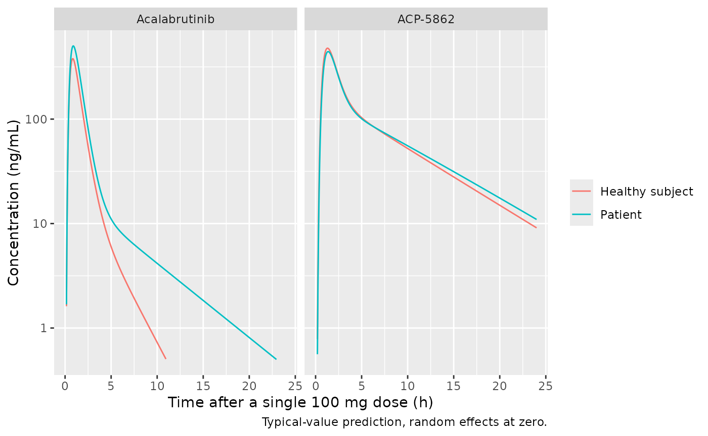
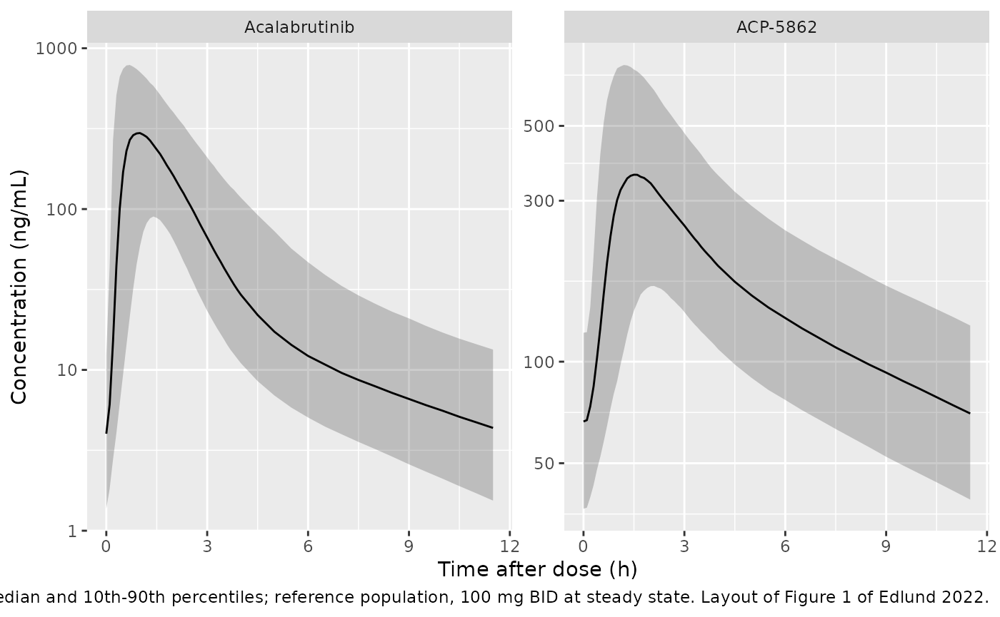

# Acalabrutinib and ACP-5862 (Edlund 2022)

## Model and source

- Citation: Edlund H, Bellanti F, Liu H, Vishwanathan K, Tomkinson H,
  Ware J, Sharma S, Buil-Bruna N. Improved characterization of the
  pharmacokinetics of acalabrutinib and its pharmacologically active
  metabolite, ACP-5862, in patients with B-cell malignancies and in
  healthy subjects using a population pharmacokinetic approach. Br J
  Clin Pharmacol. 2022;88(2):846-852. <doi:10.1111/bcp.14988>
- Description: Joint parent-metabolite population PK model for oral
  acalabrutinib and its active metabolite ACP-5862 in adults with B-cell
  malignancies and healthy subjects (Edlund 2022). Acalabrutinib:
  two-compartment disposition with first-order elimination; absorption
  through a dosing depot, a chain of five transit compartments and an
  absorption depot (mean transit time MTT = (Ntr + 1) / ktr) followed by
  first-order absorption, with between-occasion variability on MTT and
  on the relative bioavailability F1. ACP-5862: two-compartment
  disposition with first-order elimination, formed at 0.4 x CL/F
  (fraction metabolised held at 0.4 from the human ADME study).
  Healthy-subject status acts on CL/F and Vp/F, ECOG performance status
  \>= 2 on CL/F, and concomitant proton-pump-inhibitor use on F1.
  Separate log-scale residual errors for each analyte on rich-profile
  versus sparse sampling occasions.
- Article: <https://doi.org/10.1111/bcp.14988> (open access; the
  Supporting Information document BCP-88-846-s001 holds the study table,
  the demographics, the covariate equations and the final-model
  schematic, Figure S10)

Edlund 2022 updates an earlier acalabrutinib / ACP-5862 population PK
model (Edlund 2019, Clin Pharmacokinet 58:659-672) with substantially
more patient data. The model is a joint parent-metabolite model:
acalabrutinib is absorbed through a dosing depot, five transit
compartments and an absorption depot, distributes into two compartments,
and is cleared at CL/F, of which the fraction `fm = 0.4` forms ACP-5862,
which itself has two-compartment disposition.

## Population

The analysis pooled 12 studies (Supplement Table S1): four phase 1
studies in 138 healthy subjects (single 75 or 100 mg doses, including
two drug-drug interaction studies with omeprazole) and eight phase 1-3
studies in 575 patients with B-cell malignancies (100-400 mg QD or
100-200 mg BID). The dataset held 8935 acalabrutinib samples from 712
subjects and 2394 ACP-5862 samples from 304 subjects. Patients were
older than the healthy subjects (mean 66.9 vs 42.0 years) and similar in
body weight (overall mean 81.0 kg, range 39.9-148.6); 33.2% were female
and 89.6% White (Tables S2-S3). Chronic lymphocytic leukaemia was the
dominant indication (443 of 575 patients), followed by Waldenstrom
macroglobulinaemia, mantle cell lymphoma, diffuse large B-cell lymphoma,
multiple myeloma and follicular lymphoma. 27 patients had ECOG
performance status 2 or 3 and 66 used a proton-pump inhibitor (PPI).

The same information is available programmatically via
`readModelDb("Edlund_2022_acalabrutinib")()$population`.

## Source trace

Every `ini()` value carries an in-file comment pointing at its source.
The table collects them.

| Equation / parameter | Value | Source location |
|----|----|----|
| `lcl` (CL/F) | log(134) L/h | Table 1 |
| `lvc` (Vc/F) | log(31.0) L | Table 1 |
| `lq` (Q/F) | log(20.9) L/h | Table 1 |
| `lvp` (Vp/F) | log(110) L | Table 1 |
| `lka` (Ka) | log(1.48) 1/h | Table 1 |
| `lmtt` (MTT) | log(0.459) h | Table 1 |
| `ntr` | 5 (not estimated) | Results 3.2, Figure S10 |
| `lfdepot` (F1) | log(1) (reference) | Results 3.2 (relative F1 with BOV); no F1 row in Table 1 |
| `fm` | 0.4 (not estimated) | Methods 2.2 (human ADME study) |
| `lcl_acp` (CLM/F) | log(21.8) L/h | Table 1 |
| `lvc_acp` (VcM/F) | log(22.7) L | Table 1 |
| `lq_acp` (QM/F) | log(26.7) L/h | Table 1 |
| `lvp_acp` (VpM/F) | log(89.2) L | Table 1 |
| `e_dis_healthy_cl` | 0.467 | Table 1; sign from Supplement Discussion (196 L/h in healthy subjects) |
| `e_dis_healthy_vp` | -0.556 | Table 1; sign from Supplement Discussion (49 L in healthy subjects) |
| `e_ecog_ge2_cl` | -0.171 | Table 1; sign from Discussion (+21% AUC with ECOG \>= 2) |
| `e_conmed_ppi_fdepot` | -0.358 | Table 1; sign from Results 3.3 (-36% AUC with PPI) |
| `etalcl`, `etalvc`, `etalvp` | 0.0551, 2.12, 0.108 | Table 1 BSV 23.8, 270, 33.7 CV% |
| `etalcl_acp`, `etalvc_acp`, `etalq_acp`, `etalvp_acp` | 0.0138, 0.201, 0.153, 0.0362 | Table 1 BSV 11.8, 47.2, 40.7, 19.2 CV% |
| `etaiov_mtt_1..4` | 0.872 | Table 1 BOV MTT 118 CV%; 4 occasions (footnote b) |
| `etaiov_fdepot_1..4` | 0.274 | Table 1 BOV F1 56.1 CV% |
| `expSdIntensive`, `expSdSparse` | 0.586, 0.856 | Table 1 residual error (SD), rich and sparse |
| `expSdIntensive_acp`, `expSdSparse_acp` | 0.334, 0.234 | Table 1 metabolite residual error (SD), rich and sparse |
| Covariate form `theta * (1 + theta_cov)^cov` | n/a | Supplement Eq. 2; Table 1 footnote c |
| Transit chain, absorption depot, `ktr = (ntr + 1) / mtt` | n/a | Figure S10 and its legend |
| Formation `fm * CL/F * Cp` into ACP-5862 central | n/a | Methods 2.2, Results 3.2, Figure S10 |
| Molar conversion `mw_acp / mw_parent` = 481.52 / 465.52 | n/a | Molecular formulae; Supplement LLOQ pairs 1.0 ng/mL = 2.1 nM, 5 ng/mL = 10.4 nM |
| Log-scale (exponential) residual error | n/a | Methods 2.2, Results 3.2 |

## Simulation design

The paper’s exposure metrics (Results 3.3 and Supplement “Acalabrutinib
and ACP-5862 exposures”) were generated by simulating 14 days at steady
state in which **each dose drew its own F1 and MTT** from the
between-occasion distributions; AUC24h,ss was the cumulative 14-day AUC
divided by 14 and Cmax,ss the average of the per-dose Cmax values. The
reference population is a patient with ECOG performance status 0-1 and
no PPI at 100 mg BID.

The packaged model carries four occasion slots (the analysis’s three
rich occasions plus the lumped sparse occasion, selected by `OCC`). To
reproduce a fresh draw at every dose, the vignette keeps every record on
`OCC = 1` and supplies `etaiov_mtt_1` / `etaiov_fdepot_1` as columns of
the event table whose value changes at each dose. All random effects are
drawn in R and passed on the event rows with `omega = NA`, so the cohort
is identical on every machine, and the same draws are reused across the
covariate arms (common random numbers).

``` r

mod <- readModelDb("Edlund_2022_acalabrutinib")
ui <- rxode2::rxode2(mod)
#> ℹ parameter labels from comments will be replaced by 'label()'
#> Warning: some etas defaulted to non-mu referenced, possible parsing error: etaiov_mtt_1, etaiov_mtt_2, etaiov_mtt_3, etaiov_mtt_4, etaiov_fdepot_1, etaiov_fdepot_2, etaiov_fdepot_3, etaiov_fdepot_4
#> as a work-around try putting the mu-referenced expression on a simple line
om <- ui$omega

n_sub <- 200
tau <- 12
n_run_in <- 6 # three days of BID dosing to reach steady state
n_window <- 28 # the paper's 14-day steady-state window
t_win <- c(n_run_in * tau, (n_run_in + n_window) * tau)
dose_times <- (seq_len(n_run_in + n_window + 1) - 1) * tau

set.seed(20220211)
# Between-subject etas: Latin-hypercube quantiles so every marginal is
# reproduced exactly at n = 200 while the etas stay mutually independent.
lhs <- function(v) sqrt(v) * qnorm((sample.int(n_sub) - 0.5) / n_sub)
bsv_names <- c("etalcl", "etalvc", "etalvp", "etalcl_acp", "etalvc_acp",
               "etalq_acp", "etalvp_acp")
subj <- tibble(id = seq_len(n_sub))
for (nm in bsv_names) subj[[nm]] <- lhs(om[nm, nm])

# One BOV draw per dose and subject.
dose_iov <- expand.grid(dose_k = seq_along(dose_times), id = seq_len(n_sub)) |>
  as_tibble() |>
  mutate(
    time = dose_times[dose_k],
    etaiov_mtt_1 = rnorm(n(), 0, sqrt(om["etaiov_mtt_1", "etaiov_mtt_1"])),
    etaiov_fdepot_1 = rnorm(n(), 0, sqrt(om["etaiov_fdepot_1", "etaiov_fdepot_1"]))
  )

# Dense (0.1 h) over the first 4 h after each dose, where the peak lies,
# 0.5 h over the rest of the interval.
tad_grid <- c(seq(0, 4, by = 0.1), seq(4.5, tau - 0.5, by = 0.5))
obs_times <- c(as.vector(outer(tad_grid, seq(t_win[1], t_win[2] - tau, by = tau), "+")),
               t_win[2])

make_arm <- function(arm, healthy, ecog2, ppi, id_offset) {
  doses <- dose_iov |>
    mutate(evid = 1L, amt = 100, cmt = "depot", dvid = NA_integer_)
  obs <- expand.grid(time = obs_times, id = seq_len(n_sub)) |>
    as_tibble() |>
    mutate(evid = 0L, amt = 0, cmt = "central", dvid = 1L)
  bind_rows(doses, obs) |>
    arrange(id, time, desc(evid)) |>
    group_by(id) |>
    tidyr::fill(dose_k, etaiov_mtt_1, etaiov_fdepot_1) |>
    ungroup() |>
    left_join(subj, by = "id") |>
    mutate(
      id = id + id_offset, arm = arm, OCC = 1L, SAMPLE_INTENSIVE = 1L,
      # copy of the F1 draw under a non-parameter name, carried through `keep`
      f_eta = etaiov_fdepot_1,
      DIS_HEALTHY = healthy, ECOG_GE2 = ecog2, CONMED_PPI = ppi
    )
}

arms <- tribble(
  ~arm,             ~healthy, ~ecog2, ~ppi,
  "Reference",      0L,       0L,     0L,
  "Healthy",        1L,       0L,     0L,
  "ECOG >= 2",      0L,       1L,     0L,
  "PPI",            0L,       0L,     1L
)
events <- bind_rows(lapply(seq_len(nrow(arms)), function(i) {
  make_arm(arms$arm[i], arms$healthy[i], arms$ecog2[i], arms$ppi[i],
           id_offset = (i - 1L) * n_sub)
}))
stopifnot(!anyDuplicated(events[, c("id", "time", "evid")]))
```

``` r

sim <- suppressWarnings(rxode2::rxSolve(
  mod, events = events, omega = NA, returnType = "data.frame",
  keep = c("arm", "dose_k", "f_eta"), addDosing = FALSE
))
#> ℹ parameter labels from comments will be replaced by 'label()'
sim <- sim |> mutate(arm = factor(arm, levels = arms$arm))

# Harness check: the per-dose BOV and the per-subject BSV supplied on the
# event rows must actually reach the model. If eta columns were silently
# ignored, fdepot would be 1 and cl would be 134 L/h for everyone.
chk <- sim |> filter(arm == "Reference")
stopifnot(
  max(abs(chk$fdepot / exp(chk$f_eta) - 1)) < 1e-8,
  sd(log(chk$fdepot)) > 0.3
)
# rxSolve returns the supplied eta columns alongside the model variables.
cl_chk <- sim |>
  group_by(id) |>
  slice(1) |>
  ungroup()
stopifnot(all(abs(cl_chk$etalcl -
  subj$etalcl[(cl_chk$id - 1L) %% n_sub + 1L]) < 1e-12))
stopifnot(max(abs(cl_chk$cl / (134 * exp(cl_chk$etalcl) *
  1.467^(cl_chk$arm == "Healthy") * 0.829^(cl_chk$arm == "ECOG >= 2")) - 1)) < 1e-8)
```

## Typical-value profiles

A single 100 mg dose for a typical patient and a typical healthy
subject, all random effects at zero. ACP-5862 peaks later than
acalabrutinib and declines more slowly, so it dominates the plasma
exposure.

``` r

ev_typ <- bind_rows(
  tibble(id = 1L, time = 0, amt = 100, evid = 1L, cmt = "depot", dvid = NA_integer_),
  tibble(id = 1L, time = seq(0, 24, by = 0.05), amt = 0, evid = 0L,
         cmt = "central", dvid = 1L)
)
ev_typ <- bind_rows(
  ev_typ |> mutate(DIS_HEALTHY = 0L, group = "Patient"),
  ev_typ |> mutate(id = 2L, DIS_HEALTHY = 1L, group = "Healthy subject")
) |>
  mutate(ECOG_GE2 = 0L, CONMED_PPI = 0L, OCC = 1L, SAMPLE_INTENSIVE = 1L)
sim_typ <- suppressWarnings(rxode2::rxSolve(
  mod, events = ev_typ, omega = NA, returnType = "data.frame",
  keep = "group", addDosing = FALSE
))

sim_typ |>
  select(time, group, Acalabrutinib = Cc, `ACP-5862` = Cc_acp) |>
  pivot_longer(c(Acalabrutinib, `ACP-5862`), names_to = "analyte", values_to = "conc") |>
  ggplot(aes(time, conc, colour = group)) +
  geom_line() +
  facet_wrap(~analyte) +
  scale_y_log10(limits = c(0.5, NA)) +
  labs(x = "Time after a single 100 mg dose (h)", y = "Concentration (ng/mL)",
       colour = NULL, caption = "Typical-value prediction, random effects at zero.")
#> Warning in scale_y_log10(limits = c(0.5, NA)): log-10 transformation introduced
#> infinite values.
#> Warning: Removed 282 rows containing missing values or values outside the scale range
#> (`geom_line()`).
```



## Steady-state 12-hour profile

Percentiles of the simulated 100 mg BID steady-state profile over all 28
dosing intervals of the window, for the reference population. This
mirrors the 12-hour layout of the paper’s pcVPC (Figure 1), which shows
only prediction-corrected percentiles and no published numbers to
compare against.

``` r

sim |>
  filter(arm == "Reference") |>
  mutate(tad = time - t_win[1] - (dose_k - n_run_in - 1) * tau) |>
  filter(tad < tau) |>
  mutate(tad = round(tad, 1)) |>
  select(tad, Acalabrutinib = Cc, `ACP-5862` = Cc_acp) |>
  pivot_longer(-tad, names_to = "analyte", values_to = "conc") |>
  group_by(analyte, tad) |>
  summarise(
    p10 = quantile(conc, 0.1), p50 = median(conc), p90 = quantile(conc, 0.9),
    .groups = "drop"
  ) |>
  ggplot(aes(tad, p50)) +
  geom_ribbon(aes(ymin = p10, ymax = p90), alpha = 0.25) +
  geom_line() +
  facet_wrap(~analyte, scales = "free_y") +
  scale_y_log10() +
  labs(x = "Time after dose (h)", y = "Concentration (ng/mL)",
       caption = paste("Median and 10th-90th percentiles; reference population,",
                       "100 mg BID at steady state. Layout of Figure 1 of Edlund 2022."))
```



## PKNCA validation

AUC24h,ss is the paper’s cumulative 14-day steady-state AUC divided by
14. PKNCA computes the AUC over the whole 14-day window (one interval
per subject, analyte and arm) from the simulated profile, sampled every
0.25 h over the first 2 h after each dose and every 0.5 h otherwise.
Cmax,ss is the mean of the 28 per-dose maxima, taken from the simulation
grid (0.1 h over the first 4 h after each dose). Running PKNCA on each
of the 28 dosing intervals separately gives the same AUC but costs about
45,000 PKNCA intervals across the four arms, too slow for this article.

``` r

conc_long <- sim |>
  filter(!is.na(Cc)) |>
  select(id, time, dose_k, arm, Acalabrutinib = Cc, `ACP-5862` = Cc_acp) |>
  pivot_longer(c(Acalabrutinib, `ACP-5862`), names_to = "analyte", values_to = "Cc") |>
  mutate(treatment = paste(arm, analyte, sep = " | "))

# PKNCA input: every 0.25 h over the first 2 h after each dose, which holds
# the peak, and every 0.5 h over the rest of the interval.
conc_nca <- conc_long |>
  mutate(tad = (time - t_win[1]) %% tau) |>
  filter(abs(time * 2 - round(time * 2)) < 1e-6 |
    (tad < 2 + 1e-6 & abs(time * 4 - round(time * 4)) < 1e-6)) |>
  select(id, time, Cc, treatment)
stopifnot(all(conc_nca |> group_by(id, treatment) |>
  summarise(t0 = min(time), t1 = max(time), .groups = "drop") |>
  with(t0 == t_win[1] & t1 == t_win[2])))

dose_df <- events |>
  filter(evid == 1, time >= t_win[1], time < t_win[2]) |>
  select(id, time, amt, arm) |>
  tidyr::crossing(analyte = c("Acalabrutinib", "ACP-5862")) |>
  mutate(treatment = paste(arm, analyte, sep = " | ")) |>
  select(-arm, -analyte)

intervals <- data.frame(start = t_win[1], end = t_win[2], auclast = TRUE)
# One PKNCA call per arm and analyte: PKNCA's run time grows faster than
# linearly with the number of subjects in one call, and eight calls of 200
# subjects run several times faster than a single call of 1600.
nca_one <- function(trt) {
  conc_obj <- PKNCA::PKNCAconc(filter(conc_nca, treatment == trt), Cc ~ time | treatment + id)
  dose_obj <- PKNCA::PKNCAdose(filter(dose_df, treatment == trt), amt ~ time | treatment + id)
  res <- PKNCA::pk.nca(PKNCA::PKNCAdata(conc_obj, dose_obj, intervals = intervals))
  as.data.frame(res$result)
}
nca_res <- bind_rows(lapply(unique(conc_nca$treatment), nca_one))

auc_ss <- nca_res |>
  filter(PPTESTCD == "auclast") |>
  transmute(treatment, id, PPTESTCD = "auc24ss", value = PPORRES / 14)
cmax_ss <- conc_long |>
  filter(time < t_win[2]) |>
  group_by(treatment, id, dose_k) |>
  summarise(cmax = max(Cc), .groups = "drop_last") |>
  summarise(value = mean(cmax), n_int = n(), .groups = "drop") |>
  mutate(PPTESTCD = "cmaxss")
stopifnot(all(cmax_ss$n_int == n_window))
ss <- bind_rows(auc_ss, select(cmax_ss, -n_int)) |>
  separate(treatment, c("arm", "analyte"), sep = " \\| ")
stopifnot(nrow(ss) == n_sub * 4 * 2 * 2, !anyNA(ss$value))
```

### Comparison against the published reference-population exposures

Results 3.3 reports the model-predicted median (90% prediction interval)
for the reference population at 100 mg BID.

``` r

published <- tribble(
  ~analyte,        ~PPTESTCD,  ~p50,   ~p05,   ~p95,
  "Acalabrutinib", "auc24ss",  1668,   1094,   2536,
  "Acalabrutinib", "cmaxss",   461,    199.8,  783.3,
  "ACP-5862",      "auc24ss",  4175,   3256,   5430,
  "ACP-5862",      "cmaxss",   461.3,  263.7,  678.4
)
ref_sim <- ss |> filter(arm == "Reference")

# auc24ss / cmaxss are not PKNCA codes (they are the paper's 14-day
# averages), so the helper keeps the codes as labels; relabel them here.
cmp <- suppressWarnings(nlmixr2lib::ncaComparisonTable(
  simulated = ref_sim |> transmute(analyte, PPTESTCD, PPORRES = value),
  reference = published |> select(analyte, PPTESTCD, PPORRES = p50),
  by = "analyte",
  units = c(auc24ss = "ng*h/mL", cmaxss = "ng/mL"),
  tolerance_pct = 20
))
cmp[[1]] <- sub("^cmaxss", "Cmax,ss", sub("^auc24ss", "AUC24h,ss", cmp[[1]]))
stopifnot(nrow(cmp) == 4, !any(grepl("auc24ss|cmaxss", cmp[[1]])))
knitr::kable(cmp, caption = paste(
  "Median simulated vs published exposures, reference population, 100 mg BID.",
  "* differs from the reference by > 20%."
))
```

| NCA parameter        | analyte       | Reference | Simulated | % diff |
|:---------------------|:--------------|:----------|:----------|:-------|
| AUC24h,ss (ng\*h/mL) | Acalabrutinib | 1670      | 1710      | +2.3%  |
| AUC24h,ss (ng\*h/mL) | ACP-5862      | 4180      | 4320      | +3.5%  |
| Cmax,ss (ng/mL)      | Acalabrutinib | 461       | 491       | +6.5%  |
| Cmax,ss (ng/mL)      | ACP-5862      | 461       | 505       | +9.4%  |

Median simulated vs published exposures, reference population, 100 mg
BID. \* differs from the reference by \> 20%. {.table}

``` r


pi_tab <- ref_sim |>
  group_by(analyte, PPTESTCD) |>
  summarise(sim_p05 = quantile(value, 0.05), sim_p50 = median(value),
            sim_p95 = quantile(value, 0.95), .groups = "drop") |>
  left_join(published, by = c("analyte", "PPTESTCD")) |>
  mutate(across(c(sim_p05, sim_p95), \(x) round(x, 1)),
         pct_p05 = round(100 * (sim_p05 / p05 - 1), 1),
         pct_p50 = round(100 * (sim_p50 / p50 - 1), 1),
         pct_p95 = round(100 * (sim_p95 / p95 - 1), 1))
pi_tab |>
  select(analyte, PPTESTCD, p05, sim_p05, pct_p05, p95, sim_p95, pct_p95) |>
  rename(
    "Analyte" = analyte, "Metric" = PPTESTCD,
    "Published 5th" = p05, "Simulated 5th" = sim_p05, "% diff 5th" = pct_p05,
    "Published 95th" = p95, "Simulated 95th" = sim_p95, "% diff 95th" = pct_p95
  ) |>
  knitr::kable(caption = "Bounds of the 90% prediction interval, simulated vs published.")
```

| Analyte | Metric | Published 5th | Simulated 5th | % diff 5th | Published 95th | Simulated 95th | % diff 95th |
|:---|:---|---:|---:|---:|---:|---:|---:|
| ACP-5862 | auc24ss | 3256.0 | 3388.3 | 4.1 | 5430.0 | 5411.0 | -0.3 |
| ACP-5862 | cmaxss | 263.7 | 281.1 | 6.6 | 678.4 | 716.3 | 5.6 |
| Acalabrutinib | auc24ss | 1094.0 | 1122.3 | 2.6 | 2536.0 | 2530.7 | -0.2 |
| Acalabrutinib | cmaxss | 199.8 | 205.9 | 3.1 | 783.3 | 800.4 | 2.2 |

Bounds of the 90% prediction interval, simulated vs published. {.table
style="width:100%;"}

``` r


# The cohort is drawn in R and passed with omega = NA, so it is identical on
# every machine. Realised median offsets: AUC +2.3% / +3.5%, Cmax +6.5% /
# +9.4% (acalabrutinib / ACP-5862). Structural: a mis-transcribed clearance,
# volume, fm, molar factor or BOV variance moves these medians by tens of
# percent. Envelope: the 90% PI
# bounds carry the BSV / BOV magnitudes (reading the Table 1 CV% as the
# variance itself would put the parent Cmax,ss 5th percentile near 85 ng/mL,
# more than 50% below the published 199.8).
stopifnot(
  all(abs(pi_tab$pct_p50) < 12),
  all(abs(pi_tab$pct_p05) < 20),
  all(abs(pi_tab$pct_p95) < 20)
)
```

The simulated medians sit above the published ones: by 2-4% for
AUC24h,ss and by 7-9% for Cmax,ss, for both analytes. The AUC offset is
common to acalabrutinib and ACP-5862, as expected when the two share the
per-dose F1 draws, and the ratio of the ACP-5862 to the acalabrutinib
median AUC (published 4175 / 1668 = 2.50) is reproduced to within about
1%, which supports the molar conversion of the formation flux. The
slightly larger Cmax offset is consistent with the 0.1 h output grid
used here resolving the narrow absorption peak better than a coarser
simulation grid would; the paper does not state its grid. The
prediction-interval bounds agree to within 7%. No published parameter
was changed to close these gaps.

### Closed-form check on the simulated AUC

For a linear model, the steady-state AUC over the window equals the dose
delivered in the window divided by clearance. Per subject, AUC24h,ss for
acalabrutinib is therefore `2 * 100 mg * mean(F1) / CL * 1000`, and for
ACP-5862
`fm * (MW_ACP / MW_acalabrutinib) * 2 * 100 mg * mean(F1) / CLM * 1000`,
with `mean(F1)` taken over the doses of the window. Both sides use the
same drawn parameters, so the difference is trapezoidal and window-edge
error only.

``` r

f_win <- events |>
  filter(evid == 1, time >= t_win[1], time < t_win[2]) |>
  group_by(id) |>
  summarise(mean_f = mean(exp(etaiov_fdepot_1) * 0.642^CONMED_PPI), .groups = "drop")
par_i <- sim |>
  group_by(id) |>
  slice(1) |>
  ungroup() |>
  select(id, arm, cl, cl_acp) |>
  left_join(f_win, by = "id") |>
  mutate(arm = as.character(arm))
cf <- ss |>
  filter(PPTESTCD == "auc24ss") |>
  left_join(par_i, by = c("id", "arm")) |>
  mutate(
    expected = ifelse(analyte == "Acalabrutinib",
                      2 * 100 * mean_f / cl * 1000,
                      0.4 * (481.52 / 465.52) * 2 * 100 * mean_f / cl_acp * 1000),
    pct_diff = 100 * (value / expected - 1)
  )
cf |>
  group_by(analyte) |>
  summarise(median_pct = median(pct_diff), q90_abs_pct = quantile(abs(pct_diff), 0.9)) |>
  knitr::kable(digits = 2, caption = "Simulated vs closed-form AUC24h,ss, all arms.")
```

| analyte       | median_pct | q90_abs_pct |
|:--------------|-----------:|------------:|
| ACP-5862      |      -0.02 |        1.19 |
| Acalabrutinib |      -0.99 |        3.31 |

Simulated vs closed-form AUC24h,ss, all arms. {.table}

``` r

stopifnot(
  abs(median(cf$pct_diff)) < 2,
  quantile(abs(cf$pct_diff), 0.9) < 5
)
```

### Covariate effects (Discussion and Figure S9)

Relative to the reference population, the paper reports lower
acalabrutinib exposure in healthy subjects (AUC24h,ss -32%, Cmax,ss
-24%), higher exposure with ECOG performance status \>= 2 (+21% and
+14%), and 36% lower acalabrutinib and ACP-5862 exposure with a PPI. The
AUC changes follow in closed form from Table 1 (1 / 1.467, 1 / 0.829 and
0.642); the Cmax changes depend on the whole disposition and are
compared from the common-random-number cohorts.

``` r

rel <- ss |>
  group_by(arm, analyte, PPTESTCD) |>
  summarise(med = median(value), .groups = "drop") |>
  group_by(analyte, PPTESTCD) |>
  mutate(pct_vs_ref = 100 * (med / med[arm == "Reference"] - 1)) |>
  ungroup() |>
  filter(arm != "Reference")

paper_rel <- tribble(
  ~arm,        ~analyte,        ~PPTESTCD,  ~paper_pct,
  "Healthy",   "Acalabrutinib", "auc24ss",  -32,
  "Healthy",   "Acalabrutinib", "cmaxss",   -24,
  "ECOG >= 2", "Acalabrutinib", "auc24ss",  21,
  "ECOG >= 2", "Acalabrutinib", "cmaxss",   14,
  "PPI",       "Acalabrutinib", "auc24ss",  -36,
  "PPI",       "ACP-5862",      "auc24ss",  -36
)
rel_cmp <- rel |>
  left_join(paper_rel, by = c("arm", "analyte", "PPTESTCD")) |>
  mutate(pct_vs_ref = round(pct_vs_ref, 1))
rel_cmp |>
  arrange(arm, analyte, PPTESTCD) |>
  rename("Scenario" = arm, "Analyte" = analyte, "Metric" = PPTESTCD,
         "Simulated median change (%)" = pct_vs_ref,
         "Published change (%)" = paper_pct) |>
  select(-med) |>
  knitr::kable(caption = "Median exposure relative to the reference population.")
```

| Scenario | Analyte | Metric | Simulated median change (%) | Published change (%) |
|:---|:---|:---|---:|---:|
| ECOG \>= 2 | ACP-5862 | auc24ss | 0.0 | NA |
| ECOG \>= 2 | ACP-5862 | cmaxss | -3.1 | NA |
| ECOG \>= 2 | Acalabrutinib | auc24ss | 20.7 | 21 |
| ECOG \>= 2 | Acalabrutinib | cmaxss | 14.4 | 14 |
| Healthy | ACP-5862 | auc24ss | 0.0 | NA |
| Healthy | ACP-5862 | cmaxss | 5.9 | NA |
| Healthy | Acalabrutinib | auc24ss | -31.9 | -32 |
| Healthy | Acalabrutinib | cmaxss | -23.6 | -24 |
| PPI | ACP-5862 | auc24ss | -35.8 | -36 |
| PPI | ACP-5862 | cmaxss | -35.8 | NA |
| PPI | Acalabrutinib | auc24ss | -35.8 | -36 |
| PPI | Acalabrutinib | cmaxss | -35.8 | NA |

Median exposure relative to the reference population. {.table}

``` r


reported <- rel_cmp |> filter(!is.na(paper_pct))
stopifnot(
  nrow(reported) == nrow(paper_rel),
  all(abs(reported$pct_vs_ref - reported$paper_pct) < 6)
)
# Exact typical-value AUC ratios implied by Table 1.
stopifnot(
  abs(1 / 1.467 - 0.68) < 0.005,
  abs(1 / (1 - 0.171) - 1.21) < 0.005,
  abs((1 - 0.358) - 0.64) < 0.005
)
```

Healthy-subject status and ECOG performance status act on acalabrutinib
clearance, which is also the formation clearance of ACP-5862, so in this
model they leave ACP-5862 AUC unchanged; the paper reports
covariate-driven changes for ACP-5862 only for the PPI effect.

## Assumptions and deviations

- **Variance scale.** Table 1 prints between-subject and
  between-occasion variability as CV%. The maintainers converted each to
  a log-normal variance with `omega^2 = log(1 + CV^2)`. The alternative
  reading (the CV% being `100 * omega`) was simulated and rejected: it
  puts the acalabrutinib Cmax,ss 5th percentile near 85 ng/mL against
  the published 199.8 ng/mL, while the adopted reading gives about 206
  ng/mL (table above).
- **Minus signs.** The article PDF loses the minus signs in the
  covariate rows of Table 1. The signs were restored from the Supplement
  Discussion (healthy-subject CL/F 196 L/h and Vp/F 49 L, i.e. 134 x
  1.467 and 110 x 0.444) and from the reported exposure changes (ECOG
  \>= 2 +21%, PPI -36%).
- **Molar formation.** The model was fitted to concentrations in nM
  (Supplement Figures S2-S8), so ACP-5862 is formed mole for mole. The
  packaged model doses in mg and reports ng/mL; the formation flux is
  scaled by the ratio of molecular weights (ACP-5862 481.52 /
  acalabrutinib 465.52 g/mol, from the molecular formulae; the
  Supplement’s LLOQ pairs 1.0 ng/mL = 2.1 nM and 5 ng/mL = 10.4 nM
  agree). Omitting the factor would lower ACP-5862 concentrations by
  3.3%.
- **Absorption depot.** Figure S10 places an “absorption depot” between
  the five transit compartments and the central compartment; it is the
  `transit6` state, which empties into `central` at Ka. The dosing depot
  plus five transit compartments give six ktr transfers, so
  `ktr = (Ntr + 1) / MTT` as stated in the Figure S10 legend.
- **F1.** Table 1 has no typical F1; F1 is a relative bioavailability
  fixed at 1 for the reference, carrying the PPI effect and BOV.
- **Occasions.** The analysis used three rich-sampling occasions and
  lumped all sparse samples into one further occasion (Results 3.1,
  Figure S2; BOV shrinkage is the mean of four occasions). The model
  encodes these as `OCC` 1-4 with one shared variance per parameter.
  Because rxode2 has no `| OCC` random-effect level, the occasion etas
  are expanded with indicators; rxode2 therefore warns that these etas
  are not mu-referenced, which only affects the speed of a future
  estimation run, not simulation.
- **Per-dose BOV in the exposure simulation.** To match the paper’s
  procedure, each dose here receives a fresh F1 and MTT draw by changing
  `etaiov_*_1` at every dose on `OCC = 1`. Users simulating the four
  analysis occasions should instead supply `OCC` 1-4.
- **Residual error.** The rich and sparse residual SDs are selected by
  `SAMPLE_INTENSIVE` (1 = observation from a rich-profile occasion). The
  metabolite sparse SD (0.234) is smaller than the rich one (0.334) as
  printed; its bootstrap interval (0 to 0.325) shows it is poorly
  determined. Below-LLOQ handling (M3) is an estimation feature and is
  not part of the model.
- **Not retained covariates.** Body weight, eGFR, race, H2-receptor
  antagonist use and hepatic impairment were evaluated (Figure S3) but
  are not in the final model; they are recorded in
  `covariatesDataExcluded`.
- **Simulated medians.** The medians run 2-9% above the published values
  for both analytes (see the comparison table). No published parameter
  was changed to close the gap.
- No erratum or correction notice for the article was found in PubMed or
  Europe PMC as of 2026-10-02.
