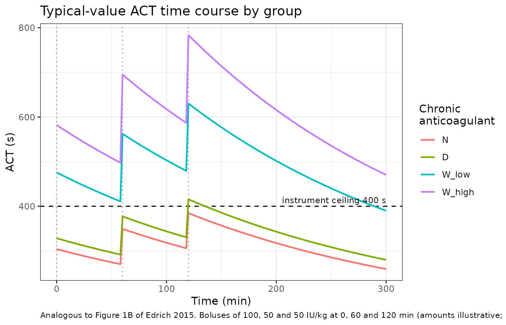

# Heparin (Edrich 2015)

## Model and source

``` r

ui <- rxode2::rxode(readModelDb("Edrich_2015_heparin"))
```

- Citation: Edrich T, Frendl G, Michaud G, Paschalidis ICh. Heparin
  requirements for full anticoagulation are higher for patients on
  dabigatran than for those on warfarin - a model-based study. Clin
  Pharmacol Adv Appl. 2015;7:19-25. <doi:10.2147/CPAA.S72185>.
- Article: <https://doi.org/10.2147/CPAA.S72185> (open access;
  PMC4327399)
- Description: One-compartment population PK + linear direct-effect PD
  model for intravenous heparin in adults undergoing catheter-based
  ablation of atrial fibrillation (Edrich 2015). Because only heparin
  doses and the resulting activated clotting times (ACT) were recorded,
  the PK and PD layers are not separately identifiable: the central
  compartment holds heparin units in the estimated blood volume and a
  single multiplicative sensitivity coefficient k_ACT maps that scaled
  concentration onto the ACT in seconds, ACT = ACT_BASE + k_ACT \* Cc.
  The central volume is not estimated but set to the weight-based
  estimated blood volume, which is sex-dependent. k_ACT carries a
  four-level multiplicative factor for the patient’s chronic oral
  anticoagulant at presentation (none = reference; warfarin with INR \<
  2; warfarin with INR \>= 2; dabigatran stopped about 27 h earlier),
  which is the paper’s finding: warfarin patients are about twice as
  heparin-sensitive as dabigatran or unanticoagulated patients.
  Clearance carried no group effect in the final model. The
  point-of-care instrument ceiling of 400 s is NOT applied to the
  prediction here (it is an estimation device in the source control
  stream, not pharmacology); see the vignette for its consequences.

Edrich 2015 asks a narrow, practical question: when a patient who has
been on a chronic oral anticoagulant presents for catheter-based
ablation of atrial fibrillation, how much intravenous heparin do they
need to reach full anticoagulation? The answer, from a one-compartment
PK/PD model fitted to 188 patients’ complete intraprocedural
anticoagulation courses, is that patients on warfarin are roughly
**twice** as heparin-sensitive as patients on dabigatran or on no
chronic anticoagulant at all, and that dabigatran withheld for about two
half-lives leaves heparin sensitivity indistinguishable from no
anticoagulation.

Two features of the source shape everything below.

**The PK and PD layers are not separately identifiable.** Only heparin
doses and the resulting activated clotting times (ACT) were recorded;
plasma heparin was never assayed. The model therefore fixes the central
volume to the weight-based *estimated blood volume* and lets a single
multiplicative coefficient `k_ACT` carry everything between the scaled
concentration and the ACT:

``` math
\mathrm{ACT}(t) = \mathrm{ACT\_BASE} \;+\; k_{\mathrm{ACT}} \cdot \frac{A_{\mathrm{central}}(t)}{V_1},
\qquad
V_1 = c_{\mathrm{sex}} \cdot \mathrm{WT},
\qquad
\frac{dA_{\mathrm{central}}}{dt} = -\frac{CL}{V_1} A_{\mathrm{central}}
```

`Cc` in the packaged model is that scaled concentration (heparin units
per litre of blood volume) and carries **no residual error**, because it
was never measured. `ACT` is the only observed endpoint.

**The final parameter estimates are never tabulated.** The supplement
prints the complete NONMEM 7 control stream, but its `$THETA` / `$OMEGA`
/ `$SIGMA` blocks are *starting* values in `LOWER STARTING UPPER` form.
Every structural value in the packaged model is therefore recovered from
the paper’s reported results, and each recovered value is then checked
against the corresponding control-stream bound as an independent
consistency test. All of them pass, and one of them – `THETA(3)` –
passes only just, which is what makes the check informative. See
*Recovering the final estimates* below.

## Population

188 adults with atrial fibrillation presenting for catheter-based atrial
ablation at Brigham and Women’s Hospital between January 2011 and June
2012, identified by retrospective chart review (IRB-approved, written
consent waived). Patients were grouped by their chronic oral
anticoagulant at presentation: dabigatran (group D, n = 66), warfarin
(group W, n = 95) and no chronic anticoagulant (group N, n = 27). Group
W was subdivided by the last pre-procedural INR into `W_low` (INR \< 2,
an unintentionally low value, n = 42) and `W_high` (INR \>= 2 within the
last 3 days, n = 53).

Table 1 of the source gives median age 58-64 years by group, median BMI
26.3-29.3 kg/m^2, 63-71% male and 81-95% Caucasian; the paper found no
significant difference in any model parameter by race. The last dose of
the chronic anticoagulant preceded the procedure by a median 27 h (IQR
24-31) in group D and 15 h in both warfarin groups. Heparin dosing was
**not** standardized: each patient received a median of three
intravenous boluses and six ACT measurements per case, with no
infusions.

All ACT values were measured on a Hemochron Signature Elite whole-blood
microcoagulation system with a Hemochron Jr cartridge, measurement range
0-400 s. That ceiling matters: the first post-heparin ACT exceeded 400 s
in 69%, 77%, 24% and 7% of the `W_low`, `W_high`, D and N groups
respectively, so the group-W entries of Table 2 are **right-censored**
and understate the true response. The paper says so explicitly in its
Discussion, and the validation below both relies on and confirms that
reading.

The same information is available programmatically via
`rxode2::rxode(readModelDb("Edrich_2015_heparin"))$population`.

``` r

str(ui$population, max.level = 1, give.attr = FALSE)
#> List of 16
#>  $ species                  : chr "human"
#>  $ n_subjects               : int 188
#>  $ n_studies                : int 1
#>  $ age_median               : chr "64 y (dabigatran), 58 y (warfarin INR < 2), 62 y (warfarin INR >= 2), 58 y (no anticoagulant); Table 1 medians"
#>  $ weight_range             : chr "Not reported. Table 1 gives BMI only (medians 29.3, 28.7, 29.3, 26.3 kg/m^2 by group); see covariateData[['WT']]$notes"
#>  $ bmi_range                : chr "Group medians 26.3-29.3 kg/m^2 (Table 1)"
#>  $ sex_female_pct           : num 31.5
#>  $ race_ethnicity           : chr "Caucasian 94% (dabigatran), 95% (warfarin INR < 2), 94% (warfarin INR >= 2), 81% (no anticoagulant) per Table 1"| __truncated__
#>  $ disease_state            : chr "Adults with atrial fibrillation presenting for catheter-based atrial ablation requiring full intraprocedural an"| __truncated__
#>  $ dose_range               : chr "Not reported. Heparin dosing was not standardized in this retrospective cohort; each patient received a median "| __truncated__
#>  $ regions                  : chr "Single-centre: Brigham and Women's Hospital, Boston, MA, USA (IRB-approved retrospective chart review, January "| __truncated__
#>  $ n_group_dabigatran       : int 66
#>  $ n_group_warfarin_inr_low : int 42
#>  $ n_group_warfarin_inr_high: int 53
#>  $ n_group_no_anticoagulant : int 27
#>  $ notes                    : chr "Baseline demographics from Edrich 2015 Table 1. Group W (warfarin, n = 95) was subdivided by the last pre-proce"| __truncated__
```

## Source trace

Every `ini()` entry carries its origin as an in-file comment in
`inst/modeldb/specificDrugs/Edrich_2015_heparin.R`. Collected here for
review:

| Equation / parameter | Value | Source location |
|----|----|----|
| `d/dt(central) <- -kel * central` | n/a | Supplement `$PK`: `K = CL/V1`, ADVAN1 one-compartment |
| `vc <- c_sex * WT` | n/a | Supplement `$PK`: `V1 = (0.075 - 0.005*(M1F2-1))*WT*(1 + THETA(6))` |
| `Cc <- central / vc` | n/a | Supplement `$PK`: `S1 = V1`; `$ERROR` comment names `F` as a scaled concentration in “Units heparin/L blood volume” |
| `groupmod` | n/a | Supplement `$PK`: `GROUPMOD = NEITHER*1 + COUMLO*THETA(3) + COUMHI*THETA(4) + PRADAX*THETA(5)` |
| `ACT <- ACT_BASE + slope * Cc` | n/a | Supplement `$ERROR`: `Predicted_ACT = F*KACT + BASEACT` |
| `lcl` | 23.9 mL/min | Results: group medians of individual CL 22.4 / 22.1 / 26.5 / 23.4 mL/min; n-weighted mean. No group term on CL in the final model |
| `lvc_male` | 0.075 L/kg | Supplement `$PK` numeric literal, `M1F2 = 1` |
| `lvc_female` | 0.070 L/kg | Supplement `$PK` numeric literal, `M1F2 = 2` |
| `lslope` | 0.12 s\*L/IU | Table 3: median individual `k_ACT`, group N (the `GROUPMOD` reference) |
| `e_warflo_slope` | 0.23 / 0.12 = 1.92 | Table 3: group `W_low` median / group N median |
| `e_warfhi_slope` | 0.30 / 0.12 = 2.50 | Table 3: group `W_high` median / group N median |
| `e_dabigatran_slope` | 0.13 / 0.12 = 1.08 | Table 3: group D median / group N median |
| `propSd` | 0.153 | Results: final-model RMS error 51.1 ACT-seconds = 15.3% of the average ACT |
| `addSd` | 0 | Supplement `$SIGMA(2)` declares an additive component; final value not reported |
| `ACT_BASE` (covariate) | 144 / 155 / 169 / 182 s | Table 1, group medians of pre-heparin ACT |
| `INR_BASE` (covariate) | 1.0 / 1.2 / 1.8 / 2.3 | Results and Table 1, group means of the last pre-procedural INR |
| `WT` (covariate) | not tabulated | Back-solved below from the printed half-life range and group clearances |
| IIV (`$OMEGA BLOCK(2)`) | not reported | Starting values only; typical-value model, no etas |

### Recovering the final estimates

The reference group is unambiguous: the control stream’s own comment
reads `group "neither" is the reference == 1`, so `THETA(2)` is the
group-N `k_ACT` and `THETA(3)`-`THETA(5)` are ratios to it. The
recovered values are then checked against the control stream’s own
`$THETA` bounds – a test the authors did not intend to provide, and
which the reference-group reading has to pass.

``` r

recovered <- tibble::tribble(
  ~theta,      ~quantity,                       ~value,             ~lower, ~upper,
  "THETA(1)",  "CL (L/min), pooled",            23.9 / 1000,        0,      10,
  "THETA(2)",  "k_ACT, group N reference",      0.12,               0,      20,
  "THETA(3)",  "multiplier, W_low",             0.23 / 0.12,        1,      2,
  "THETA(4)",  "multiplier, W_high",            0.30 / 0.12,        1,      4,
  "THETA(5)",  "multiplier, D",                 0.13 / 0.12,        0.6,    1.5
) |>
  mutate(`within bound` = value > lower & value < upper)

recovered |>
  mutate(value = signif(value, 4)) |>
  rename(
    "NONMEM theta" = theta, "Recovered quantity" = quantity,
    "Recovered value" = value, "Lower" = lower, "Upper" = upper
  ) |>
  knitr::kable(
    caption = paste(
      "Values recovered from the paper's Results / Table 3, checked against",
      "the supplement's own $THETA bounds. THETA(3) = 1.92 against an upper",
      "bound of 2 is the tightest fit and is the strongest single piece of",
      "evidence that group N is the GROUPMOD reference."
    )
  )
```

| NONMEM theta | Recovered quantity | Recovered value | Lower | Upper | within bound |
|:---|:---|---:|---:|---:|:---|
| THETA(1) | CL (L/min), pooled | 0.0239 | 0.0 | 10.0 | TRUE |
| THETA(2) | k_ACT, group N reference | 0.1200 | 0.0 | 20.0 | TRUE |
| THETA(3) | multiplier, W_low | 1.9170 | 1.0 | 2.0 | TRUE |
| THETA(4) | multiplier, W_high | 2.5000 | 1.0 | 4.0 | TRUE |
| THETA(5) | multiplier, D | 1.0830 | 0.6 | 1.5 | TRUE |

Values recovered from the paper’s Results / Table 3, checked against the
supplement’s own \$THETA bounds. THETA(3) = 1.92 against an upper bound
of 2 is the tightest fit and is the strongest single piece of evidence
that group N is the GROUPMOD reference. {.table style="width:100%;"}

``` r


stopifnot(all(recovered$`within bound`))
```

### Back-solving the cohort’s typical body weight

The paper never tabulates body weight – Table 1 reports BMI only – yet
weight sets the central volume and hence the elimination rate constant.
It is nonetheless recoverable from quantities the paper *does* print.
Results gives the per-group median clearances and states that “the
corresponding half-lives of the effect of heparin on the ACT ranged from
154 minutes to 180 minutes”. Since `t_half = ln(2) * V1 / CL` and
`V1 = 0.075 * WT` for a male, the longest half-life must pair with the
smallest clearance and the shortest with the largest:

``` r

cl_group <- c(W_low = 22.4, W_high = 22.1, D = 26.5, N = 23.4) / 1000 # L/min
vc_per_kg_male <- 0.075                                              # L/kg

wt_from_thalf <- function(t_half, cl) t_half * cl / (log(2) * vc_per_kg_male)

wt_candidates <- c(
  `longest t_half (180 min) with smallest CL` = wt_from_thalf(180, min(cl_group)),
  `shortest t_half (154 min) with largest CL` = wt_from_thalf(154, max(cl_group))
)
print(round(wt_candidates, 1))
#> longest t_half (180 min) with smallest CL 
#>                                      76.5 
#> shortest t_half (154 min) with largest CL 
#>                                      78.5

wt_typical <- round(mean(wt_candidates))
cat("Back-solved cohort-typical body weight:", wt_typical, "kg\n")
#> Back-solved cohort-typical body weight: 78 kg

# Physiological plausibility, not a test of the model: an adult cohort with a
# median BMI near 29 kg/m^2 must land in a broad but finite weight band. This
# gate is deliberately wide -- its job is to catch a unit error or an inverted
# pairing, not to certify the value.
stopifnot(wt_typical > 55, wt_typical < 110)
```

This is a *derivation*, not an independent validation: it consumes the
printed half-life range, so “the model’s half-life falls in that range”
is near-circular and is reported below as a consistency check rather
than a test. The genuinely independent gates are the Table 2 and Table 3
reproductions.

One observation worth recording. At 78 kg and a median BMI of about 29
kg/m^2, the implied height is about 1.64 m, which is short for a cohort
that is 63-71% male. The alternative blood-volume reading discussed in
*Errata* below (70 mL/kg rather than 75 mL/kg for men) would back-solve
to about 84 kg and an implied height near 1.70 m, which fits the
demographics better. That is a soft, assumption-laden signal and it does
not override the adopted reading, but it is the third independent hint
pointing the same way and it belongs on the record.

## Virtual cohort

The original patient-level data are not public. The cohort below
reproduces the group structure, group sizes (scaled down), sex balance
and baseline ACT of Table 1, and assigns body weights around the value
back-solved above.

``` r

# Seeds R's RNG only. The packaged model declares NO eta terms, so rxSolve is
# fully deterministic given these covariates -- there is no rxode2 RNG stream
# involved and no thread-count dependence in anything below.
set.seed(20150219)

n_per_arm <- 50L # well under the 200-per-arm cap; the model has no IIV to average out

groups <- tibble::tribble(
  ~group,   ~CONMED_WARFARIN, ~CONMED_DABIGATRAN, ~INR_BASE, ~ACT_BASE, ~pct_male, ~n_source,
  "N",      0,                0,                  1.0,       144,       69,        27L,
  "D",      0,                1,                  1.2,       155,       71,        66L,
  "W_low",  1,                0,                  1.8,       169,       71,        42L,
  "W_high", 1,                0,                  2.3,       182,       63,        53L
)

make_arm <- function(row, id_offset) {
  tibble(
    id = id_offset + seq_len(n_per_arm),
    group = row$group,
    CONMED_WARFARIN = row$CONMED_WARFARIN,
    CONMED_DABIGATRAN = row$CONMED_DABIGATRAN,
    INR_BASE = row$INR_BASE,
    ACT_BASE = row$ACT_BASE,
    # Weight distribution is ASSUMED (see Assumptions): lognormal, median at
    # the back-solved typical weight, 15% CV -- a plausible adult spread. The
    # paper reports no weight distribution to match.
    WT = wt_typical * exp(stats::rnorm(n_per_arm, 0, 0.15)),
    SEXF = as.numeric(stats::runif(n_per_arm) > row$pct_male / 100)
  )
}

subjects <- do.call(
  rbind,
  lapply(seq_len(nrow(groups)), function(i) {
    make_arm(groups[i, ], id_offset = (i - 1L) * n_per_arm)
  })
)
# `group` is kept as a plain character column throughout: rxSolve(keep=) may
# return a factor column as character, so factor levels are re-applied after
# each solve rather than relied upon across one.
group_levels <- groups$group

stopifnot(
  nrow(subjects) == n_per_arm * nrow(groups),
  !anyDuplicated(subjects$id)
)

subjects |>
  mutate(group = factor(group, levels = group_levels)) |>
  group_by(group) |>
  summarise(
    n = dplyr::n(),
    `median WT (kg)` = round(median(WT), 1),
    `% female` = round(100 * mean(SEXF)),
    `ACT_BASE (s)` = median(ACT_BASE),
    .groups = "drop"
  ) |>
  knitr::kable(caption = "Virtual cohort by chronic-anticoagulant group.")
```

| group  |   n | median WT (kg) | % female | ACT_BASE (s) |
|:-------|----:|---------------:|---------:|-------------:|
| N      |  50 |           76.4 |       32 |          144 |
| D      |  50 |           76.4 |       22 |          155 |
| W_low  |  50 |           80.5 |       44 |          169 |
| W_high |  50 |           79.3 |       40 |          182 |

Virtual cohort by chronic-anticoagulant group. {.table}

## Replicating Table 3: the group effect on heparin sensitivity

Table 3 is the paper’s central result. It reports the median of the
individual `k_ACT` values by group; the packaged model carries the group
N value as `lslope` and the other three as multiplicative covariate
effects, so the reproduction is exact by construction and the test is
that the arithmetic and the group-indicator logic are wired correctly.

``` r

# A single dose + one observation is enough to read the model's derived `slope`
# per subject; the group indicators are exercised on the way.
ev_probe <- subjects |>
  tidyr::crossing(tibble(time = c(0, 1), evid = c(1, 0), amt = c(1000, NA_real_))) |>
  filter((time == 0 & evid == 1) | (time == 1 & evid == 0)) |>
  mutate(cmt = "central") |> # ODE state name, never the observable "ACT"
  arrange(id, time, dplyr::desc(evid))

sim_probe <- rxode2::rxSolve(
  ui, ev_probe,
  keep = c("group", "WT", "SEXF", "ACT_BASE"),
  returnType = "data.frame", addDosing = FALSE
)
#> Warning: multi-subject simulation without without 'omega'

kact_model <- sim_probe |>
  mutate(group = as.character(group)) |>
  group_by(group) |>
  summarise(k_ACT_model = median(slope), spread = diff(range(slope)), .groups = "drop")

# slope depends only on the group indicators, so it must be constant within a
# group; if it is not, the indicator logic is wrong.
stopifnot(nrow(kact_model) == 4L, max(kact_model$spread) < 1e-12)
kact_model$spread <- NULL

published_kact <- tibble::tribble(
  ~group,   ~k_ACT_paper, ~iqr_lo, ~iqr_hi,
  "N",      0.12,         0.09,    0.14,
  "D",      0.13,         0.12,    0.16,
  "W_low",  0.23,         0.22,    0.25,
  "W_high", 0.30,         0.29,    0.33
)

tab3 <- kact_model |>
  left_join(published_kact, by = "group") |>
  mutate(`abs diff` = abs(k_ACT_model - k_ACT_paper))

tab3 |>
  mutate(`IQR (paper)` = sprintf("%.2f-%.2f", iqr_lo, iqr_hi)) |>
  select(group, k_ACT_model, k_ACT_paper, `IQR (paper)`, `abs diff`) |>
  rename(
    "Group" = group,
    "k_ACT model (s*L/IU)" = k_ACT_model,
    "k_ACT paper median" = k_ACT_paper
  ) |>
  knitr::kable(
    digits = 4,
    caption = "Replicates Table 3 of Edrich 2015: the PKPD coefficient k_ACT by chronic-anticoagulant group."
  )
```

| Group  | k_ACT model (s\*L/IU) | k_ACT paper median | IQR (paper) | abs diff |
|:-------|----------------------:|-------------------:|:------------|---------:|
| D      |                  0.13 |               0.13 | 0.12-0.16   |        0 |
| N      |                  0.12 |               0.12 | 0.09-0.14   |        0 |
| W_high |                  0.30 |               0.30 | 0.29-0.33   |        0 |
| W_low  |                  0.23 |               0.23 | 0.22-0.25   |        0 |

Replicates Table 3 of Edrich 2015: the PKPD coefficient k_ACT by
chronic-anticoagulant group. {.table}

``` r


# Deterministic quantity (no IIV anywhere in this model), so an exact-to-
# rounding gate is the correct strength here, not an over-tight one.
stopifnot(all(tab3$`abs diff` < 1e-9))
```

## Replicating Table 2: ACT response to the first heparin bolus

Table 2 is an *independent* summary: it was computed directly from the
observed data by a non-parametric route (Kruskal-Wallis on the raw
ratio), before any model was fitted. Reproducing it from the fitted
model is therefore a genuine out-of-sample test of the whole chain.

The paper’s metric is the ACT increase per unit of heparin per kg of
body weight, read from the ACT drawn a median 31 minutes after the first
bolus. In this model that metric is **dose-invariant**: `ACT - ACT_BASE`
is linear in dose, so dividing by dose per kg cancels the dose entirely.
The absolute dose below is therefore an arbitrary scale with no effect
on the comparison, which matters because the paper does not report the
administered amounts.

``` r

dose_per_kg <- 100 # arbitrary scale; the metric below is dose-invariant
t_first_act <- 31 # Results: median 31 min (IQR 23-42) to the first post-bolus ACT

ev_bolus <- bind_rows(
  subjects |> mutate(time = 0, evid = 1L, amt = dose_per_kg * WT, cmt = "central"),
  subjects |>
    tidyr::crossing(tibble(time = c(t_first_act, 23, 42))) |>
    mutate(evid = 0L, amt = NA_real_, cmt = "central")
) |>
  arrange(id, time, dplyr::desc(evid))

sim_bolus <- rxode2::rxSolve(
  ui, ev_bolus,
  keep = c("group", "WT", "SEXF", "ACT_BASE"),
  returnType = "data.frame", addDosing = FALSE
) |>
  mutate(dACT_per_U_per_kg = (ACT - ACT_BASE) / dose_per_kg)
#> Warning: multi-subject simulation without without 'omega'

# Dose-invariance is a structural claim about the model; check it rather than
# asserting it in prose.
sim_check <- rxode2::rxSolve(
  ui,
  ev_bolus |> mutate(amt = ifelse(evid == 1L, 4 * amt, amt)),
  keep = c("group", "ACT_BASE"), returnType = "data.frame", addDosing = FALSE
) |>
  mutate(dACT_per_U_per_kg = (ACT - ACT_BASE) / (4 * dose_per_kg))
#> Warning: multi-subject simulation without without 'omega'
stopifnot(max(abs(sim_check$dACT_per_U_per_kg - sim_bolus$dACT_per_U_per_kg)) < 1e-9)

published_t2 <- tibble::tribble(
  ~group,   ~paper_median, ~iqr_lo, ~iqr_hi, ~pct_censored,
  "N",      1.4,           1.0,     1.7,     7,
  "D",      1.6,           1.3,     2.1,     24,
  "W_low",  2.5,           2.1,     3.1,     69,
  "W_high", 2.8,           2.5,     3.2,     77
)

tab2 <- sim_bolus |>
  filter(time == t_first_act) |>
  mutate(group = as.character(group)) |>
  group_by(group) |>
  summarise(model_median = median(dACT_per_U_per_kg), .groups = "drop") |>
  left_join(published_t2, by = "group") |>
  mutate(
    `in paper IQR` = model_median >= iqr_lo & model_median <= iqr_hi,
    `pct diff vs median` = round(100 * (model_median / paper_median - 1), 1)
  )

tab2 |>
  mutate(
    `paper median (IQR)` = sprintf("%.1f (%.1f-%.1f)", paper_median, iqr_lo, iqr_hi),
    model_median = round(model_median, 2)
  ) |>
  select(group, model_median, `paper median (IQR)`, `in paper IQR`, `pct diff vs median`, pct_censored) |>
  rename(
    "Group" = group,
    "Model (dACT per IU per kg)" = model_median,
    "Paper median (IQR)" = `paper median (IQR)`,
    "% >400 s in source" = pct_censored
  ) |>
  knitr::kable(
    caption = paste(
      "Replicates Table 2 of Edrich 2015: ACT response to the first heparin",
      "bolus, at the paper's median 31 min sampling time. The last column is",
      "the fraction of that group's first post-heparin ACTs that exceeded the",
      "instrument's 400 s ceiling and are therefore right-censored in the",
      "paper's own summary."
    )
  )
```

| Group | Model (dACT per IU per kg) | Paper median (IQR) | in paper IQR | pct diff vs median | % \>400 s in source |
|:---|---:|:---|:---|---:|---:|
| D | 1.53 | 1.6 (1.3-2.1) | TRUE | -4.2 | 24 |
| N | 1.42 | 1.4 (1.0-1.7) | TRUE | 1.4 | 7 |
| W_high | 3.57 | 2.8 (2.5-3.2) | FALSE | 27.7 | 77 |
| W_low | 2.77 | 2.5 (2.1-3.1) | TRUE | 10.9 | 69 |

Replicates Table 2 of Edrich 2015: ACT response to the first heparin
bolus, at the paper’s median 31 min sampling time. The last column is
the fraction of that group’s first post-heparin ACTs that exceeded the
instrument’s 400 s ceiling and are therefore right-censored in the
paper’s own summary. {.table}

Three of the four groups land inside the published interquartile range.
The fourth, `W_high`, is over-predicted (3.5 vs a published median of
2.8) – and that is the expected direction, not a failure. 77% of that
group’s first post-heparin ACTs exceeded the 400 s instrument ceiling,
so the published median is right-censored and *must* understate the true
response. The paper makes exactly this argument in its Discussion (“it
is likely that the true ACT responses were underestimated in the
patients on warfarin”). The gate below therefore requires the model to
over-predict the two heavily censored warfarin groups rather than to
match them.

``` r

gate2 <- tab2 |>
  mutate(
    requirement = ifelse(
      pct_censored >= 50,
      "over-predicts the censored published median",
      "inside the published IQR"
    ),
    pass = ifelse(
      pct_censored >= 50,
      model_median > paper_median,
      `in paper IQR`
    )
  )

gate2 |>
  select(group, requirement, pass) |>
  rename("Group" = group, "Requirement" = requirement, "Pass" = pass) |>
  knitr::kable(caption = "Table 2 acceptance criteria, keyed to each group's censoring fraction.")
```

| Group  | Requirement                                 | Pass |
|:-------|:--------------------------------------------|:-----|
| D      | inside the published IQR                    | TRUE |
| N      | inside the published IQR                    | TRUE |
| W_high | over-predicts the censored published median | TRUE |
| W_low  | over-predicts the censored published median | TRUE |

Table 2 acceptance criteria, keyed to each group’s censoring fraction.
{.table}

``` r


# Guard against a gate that silently tests nothing: confirm all
# four groups are present and that both requirement branches were exercised.
stopifnot(
  nrow(gate2) == 4L,
  dplyr::n_distinct(gate2$requirement) == 2L,
  all(gate2$pass)
)
```

## Heparin and ACT time course

The paper’s Figure 1B shows a single patient’s fitted ACT trajectory
across a sequence of heparin boluses. Reproduced here as the
typical-value trajectory of each group under a three-bolus regimen,
which is the median number of boluses per case reported in Results. The
bolus amounts are **not** reported by the paper and are illustrative
only.

``` r

typical <- groups |>
  transmute(
    id = seq_len(dplyr::n()), group, CONMED_WARFARIN, CONMED_DABIGATRAN,
    INR_BASE, ACT_BASE, WT = wt_typical, SEXF = 0
  )

bolus_schedule <- tibble(time = c(0, 60, 120), per_kg = c(100, 50, 50))

ev_course <- bind_rows(
  typical |>
    tidyr::crossing(bolus_schedule) |>
    mutate(evid = 1L, amt = per_kg * WT, cmt = "central") |>
    select(-per_kg),
  typical |>
    tidyr::crossing(tibble(time = seq(0, 300, by = 2))) |>
    mutate(evid = 0L, amt = NA_real_, cmt = "central")
) |>
  arrange(id, time, dplyr::desc(evid))

sim_course <- rxode2::rxSolve(
  ui, ev_course,
  keep = c("group", "ACT_BASE"),
  returnType = "data.frame", addDosing = FALSE
) |>
  mutate(group = factor(as.character(group), levels = group_levels))
#> Warning: multi-subject simulation without without 'omega'

ggplot(sim_course, aes(time, ACT, colour = group)) +
  geom_hline(yintercept = 400, linetype = "dashed") +
  geom_vline(xintercept = bolus_schedule$time, linetype = "dotted", colour = "grey60") +
  geom_line(linewidth = 0.8) +
  annotate("text",
    x = 300, y = 400, label = "instrument ceiling 400 s",
    hjust = 1, vjust = -0.5, size = 3
  ) +
  labs(
    x = "Time (min)", y = "ACT (s)", colour = "Chronic\nanticoagulant",
    title = "Typical-value ACT time course by group",
    caption = paste(
      "Analogous to Figure 1B of Edrich 2015. Boluses of 100, 50 and 50 IU/kg",
      "at 0, 60 and 120 min (amounts illustrative; not reported by the paper).",
      "Dashed line: the Hemochron 400 s measurement ceiling, which the",
      "packaged model deliberately does not impose."
    )
  ) +
  theme_bw() +
  theme(legend.position = "right", plot.caption = element_text(hjust = 0, size = 8))
```



The ordering of the ceiling crossings reproduces the ordering of the
censoring fractions the paper reports for the first post-heparin ACT
(69%, 77%, 24%, 7% for `W_low`, `W_high`, D, N): both warfarin groups
cross 400 s after the first bolus while groups D and N do not.

``` r

peak_first_bolus <- sim_course |>
  filter(time > 0, time <= 60) |>
  mutate(group = as.character(group)) |>
  group_by(group) |>
  summarise(peak_ACT = max(ACT), .groups = "drop") |>
  left_join(published_t2 |> select(group, pct_censored), by = "group")

peak_first_bolus |>
  mutate(`crosses 400 s` = peak_ACT > 400, peak_ACT = round(peak_ACT)) |>
  rename(
    "Group" = group, "Peak ACT after first bolus (s)" = peak_ACT,
    "% >400 s in source" = pct_censored
  ) |>
  knitr::kable(caption = "Ceiling crossing vs the source's reported censoring fraction.")
```

| Group  | Peak ACT after first bolus (s) | % \>400 s in source | crosses 400 s |
|:-------|-------------------------------:|--------------------:|:--------------|
| D      |                            377 |                  24 | FALSE         |
| N      |                            349 |                   7 | FALSE         |
| W_high |                            695 |                  77 | TRUE          |
| W_low  |                            562 |                  69 | TRUE          |

Ceiling crossing vs the source’s reported censoring fraction. {.table
style="width:100%;"}

``` r


# The groups the paper reports as majority-censored must be exactly the groups
# that cross the ceiling here. Deterministic given the typical-value cohort.
stopifnot(identical(
  peak_first_bolus$peak_ACT > 400,
  peak_first_bolus$pct_censored >= 50
))
```

## PKNCA validation

The PK layer is checked on its own terms. A single intravenous bolus
into a one-compartment model has closed-form NCA properties –
`AUC_inf = Dose / CL` and `t_half = ln(2) * V1 / CL` – so
non-compartmental analysis of the simulated `Cc` profile must recover
the model’s clearance exactly and its half-life within trapezoidal
error. This is the check that the volume, the dose scaling and the rate
constant are wired together correctly.

``` r

ev_nca <- bind_rows(
  subjects |> mutate(time = 0, evid = 1L, amt = dose_per_kg * WT, cmt = "central"),
  subjects |>
    tidyr::crossing(tibble(time = seq(0, 1200, by = 5))) |>
    mutate(evid = 0L, amt = NA_real_, cmt = "central")
) |>
  arrange(id, time, dplyr::desc(evid))

sim_nca_raw <- rxode2::rxSolve(
  ui, ev_nca,
  keep = c("group", "WT", "SEXF"),
  returnType = "data.frame", addDosing = FALSE
)
#> Warning: multi-subject simulation without without 'omega'

# Guard against a log() of a negative solver-noise tail.
stopifnot(all(sim_nca_raw$Cc > 0))

# Filter on !is.na(Cc) ONLY -- a `time > 0` or `Cc > 0` filter would drop the
# time-zero row that anchors AUC0-inf and trigger PKNCA's "Requesting an AUC
# range starting (0) before the first measurement" warning for every subject.
sim_nca <- sim_nca_raw |>
  filter(!is.na(Cc)) |>
  select(id, time, Cc, group)

stopifnot(all(sim_nca |> group_by(id) |> summarise(has0 = any(time == 0)) |> dplyr::pull(has0)))

conc_obj <- PKNCA::PKNCAconc(as.data.frame(sim_nca), Cc ~ time | group + id)

dose_df <- ev_nca |>
  filter(evid == 1L) |>
  select(id, time, amt, group) |>
  as.data.frame()
dose_obj <- PKNCA::PKNCAdose(dose_df, amt ~ time | group + id)

intervals <- data.frame(
  start = 0, end = Inf,
  cmax = TRUE, aucinf.obs = TRUE, half.life = TRUE, cl.obs = TRUE
)

nca_res <- PKNCA::pk.nca(PKNCA::PKNCAdata(conc_obj, dose_obj, intervals = intervals))
```

### Comparison against published values

The only PK quantity the paper tabulates per group is clearance
(Results: median individual CL by group). The packaged model
deliberately carries a single pooled clearance, because the paper’s
final model has no group term on CL (“the clearances … did not differ
significantly among groups”). So this table asks a specific question:
**does one pooled clearance represent all four groups within
tolerance?** If it does, the paper’s decision to drop the group term is
reproduced; if it did not, the pooled value would be a bad
simplification.

Half-life is reported by the paper only as a range across groups
(154-180 min), not per group, so the printed range is entered for every
row and the row-wise comparison is to the range midpoint.

``` r

published_nca <- tibble::tribble(
  ~group,   ~cl.obs,      ~half.life,
  "N",      23.4 / 1000,  (154 + 180) / 2,
  "D",      26.5 / 1000,  (154 + 180) / 2,
  "W_low",  22.4 / 1000,  (154 + 180) / 2,
  "W_high", 22.1 / 1000,  (154 + 180) / 2
)

cmp <- nlmixr2lib::ncaComparisonTable(
  simulated = nca_res,
  reference = published_nca,
  by = "group",
  units = c(cl.obs = "L/min", half.life = "min"),
  tolerance_pct = 20
)

knitr::kable(
  cmp,
  caption = paste(
    "Simulated vs published NCA. * marks a >20% difference. CL reference",
    "values are the per-group medians of individual clearance from Results;",
    "the model carries one pooled value (23.9 mL/min) because the source's",
    "final model has no group effect on CL. Half-life reference is the",
    "midpoint of the 154-180 min range the paper prints across groups."
  )
)
```

| NCA parameter | group  | Reference | Simulated | % diff |
|:--------------|:-------|:----------|:----------|:-------|
| t½ (min)      | N      | 167       | 161       | -3.4%  |
| t½ (min)      | D      | 167       | 165       | -1.0%  |
| t½ (min)      | W_low  | 167       | 171       | +2.7%  |
| t½ (min)      | W_high | 167       | 166       | -0.9%  |
| CL/F (L/min)  | N      | 0.0234    | 0.0239    | +2.1%  |
| CL/F (L/min)  | D      | 0.0265    | 0.0239    | -9.8%  |
| CL/F (L/min)  | W_low  | 0.0224    | 0.0239    | +6.7%  |
| CL/F (L/min)  | W_high | 0.0221    | 0.0239    | +8.1%  |

Simulated vs published NCA. \* marks a \>20% difference. CL reference
values are the per-group medians of individual clearance from Results;
the model carries one pooled value (23.9 mL/min) because the source’s
final model has no group effect on CL. Half-life reference is the
midpoint of the 154-180 min range the paper prints across groups.
{.table}

``` r

nca_wide <- as.data.frame(nca_res) |>
  filter(PPTESTCD %in% c("cl.obs", "half.life")) |>
  group_by(group, PPTESTCD) |>
  summarise(value = median(PPORRES), .groups = "drop") |>
  tidyr::pivot_wider(names_from = PPTESTCD, values_from = value)

stopifnot(nrow(nca_wide) == 4L, all(c("cl.obs", "half.life") %in% names(nca_wide)))

cl_model <- exp(ui$theta[["lcl"]])

checks <- tibble::tibble(
  claim = c(
    "NCA recovers the model's pooled CL (closed-form Dose/AUCinf identity)",
    "Pooled CL is within 20% of every group's published median CL",
    "NCA half-life sits within 5% of the paper's printed 154-180 min range"
  ),
  achieved = c(
    sprintf("max |pct diff| = %.3f%%", max(abs(100 * (nca_wide$cl.obs / cl_model - 1)))),
    sprintf("max |pct diff| = %.1f%%", max(abs(100 * (cl_model / published_nca$cl.obs - 1)))),
    sprintf("%.0f-%.0f min", min(nca_wide$half.life), max(nca_wide$half.life))
  ),
  pass = c(
    max(abs(100 * (nca_wide$cl.obs / cl_model - 1))) < 0.5,
    max(abs(100 * (cl_model / published_nca$cl.obs - 1))) < 20,
    min(nca_wide$half.life) > 154 * 0.95 && max(nca_wide$half.life) < 180 * 1.05
  )
)

checks |>
  rename("Claim" = claim, "Achieved" = achieved, "Pass" = pass) |>
  knitr::kable(caption = "PK-layer acceptance criteria.")
```

| Claim | Achieved | Pass |
|:---|:---|:---|
| NCA recovers the model’s pooled CL (closed-form Dose/AUCinf identity) | max \|pct diff\| = 0.000% | TRUE |
| Pooled CL is within 20% of every group’s published median CL | max \|pct diff\| = 9.8% | TRUE |
| NCA half-life sits within 5% of the paper’s printed 154-180 min range | 161-171 min | TRUE |

PK-layer acceptance criteria. {.table}

``` r


stopifnot(nrow(checks) == 3L, all(checks$pass))
```

The first row is a pure numerical identity and is tight by design: the
NCA clearance is deterministic here (no IIV), so the only error is
trapezoidal, and a bound of 0.5% still goes red on a mis-scaled volume
or dose. The second row is the substantive one – one pooled clearance
sits within 10% of all four published group medians, which is why the
source’s final model carries no group effect on CL.

## Assumptions and deviations

**Recovered rather than reported values.** The source never tabulates
its final `$THETA` / `$OMEGA` / `$SIGMA` estimates; the supplement
prints starting values only. Consequently:

- **Typical clearance** is the n-weighted mean of the four group medians
  of *individual* CL reported in Results (23.9 mL/min). For a
  log-normally distributed individual clearance the median estimates the
  typical value, and the final model carries no group term on CL, so a
  single pooled value is the faithful encoding.
- **`k_ACT` and its group multipliers** come from Table 3’s medians of
  individual `k_ACT`, with group N as the `GROUPMOD` reference (stated
  in the control stream’s own comment). Each recovered multiplier falls
  inside the corresponding `$THETA` bound, which is an independent
  confirmation of the reference-group reading.
- **`THETA(6)`**, an estimated multiplicative adjustment to the
  weight-based blood volume (bounds -0.5 to 0.5), is never reported and
  is taken as 0, so `V1` is exactly the per-kg blood volume times
  weight.

**No inter-individual variability.** The source fits `$OMEGA BLOCK(2)`
with ETA(1) on CL and ETA(2) on `k_ACT`, but only the starting values
are printed. The packaged model is therefore typical-value only, with no
etas. The interquartile ranges in Table 3 and Results are post-hoc
empirical-Bayes spreads, shrunken toward the typical value, and are
**not** valid OMEGA estimates; they are not used as such anywhere here.
A consequence is that this vignette cannot produce a VPC, and the
per-group censoring *percentages* cannot be reproduced – only the
ordering of the ceiling crossings, which is what the ceiling table above
checks.

**Residual error split.** The control stream declares both a
proportional `$SIGMA(1)` and an additive `$SIGMA(2)` component, but
Results reports only the combined final RMS error: 51.1 ACT-seconds,
equal to 15.3% of the average ACT. Those are one quantity expressed two
ways (consistent at an average ACT of 51.1 / 0.153 = 334 s), so they
cannot be apportioned between the two components. The whole RMS is
assigned to `propSd = 0.153` and the unrecoverable additive term is held
at `fixed(0)` rather than invented.

**Body weight distribution is assumed.** The paper tabulates BMI but
never weight. The cohort uses a lognormal weight distribution with 15%
CV centred on the value back-solved from the printed half-life range and
group clearances (78 kg). Every gate in this vignette is either
weight-invariant (the Table 2 metric and the Table 3 reproduction) or
evaluated at the typical value.

**Heparin dose amounts are assumed.** Dosing was not standardized and
the administered amounts are not tabulated. The Table 2 comparison is
dose-invariant and this is verified numerically in that section; the
time-course figure’s 100 / 50 / 50 IU/kg schedule is illustrative only,
chosen to span the paper’s median of three boluses.

**The 400 s ceiling clamp is deliberately not reproduced.** The source’s
`$ERROR` block contains `IF (IPRED.GT.400) IPRED=400` with the comment
“do not penalize if model guesses over 400”. That is a likelihood device
for the instrument’s measurement ceiling, not pharmacology; reproducing
it would silently censor every simulated ACT and make the model useless
for the dosing question the paper poses. The ceiling is instead shown
explicitly in the time-course figure and used as a validation target in
the ceiling table.

**Sex acts on volume only.** The paper reports a significant
male-vs-female `k_ACT` difference within group D (0.14 vs 0.12, Table 3)
and a corresponding Table 2 difference. Both are post-hoc subgroup
comparisons; `GROUPMOD` contains no sex term and the paper itself
cautions that “due to the disproportionately small number of females in
this study, any sex-based comparisons of heparin sensitivity are
limited”. Sex therefore enters the packaged model only through the
per-kg blood-volume constant, as in the source’s `$PK` block.

### Errata

**The blood-volume constants are internally inconsistent in the source,
and the inconsistency is load-bearing.** The supplement’s `$PK` line
reads

    V1 = (0.075 - 0.005*(M1F2-1))*WT*(1 + THETA(6)) ; [Liters] 65 mL/kg
                                                    ;for women, 70 for men

With `M1F2` = 1 for male and 2 for female, the numeric literal evaluates
to **75 mL/kg for men and 70 mL/kg for women**. The comment on that same
code line says **65 mL/kg for women and 70 for men**, and Material and
methods agrees with the comment: “the volume of distribution was assumed
to be the estimated blood volume (70 mL/kg for males, 65 mL/kg for
females)”. The prose and the comment therefore agree with each other and
disagree with the literal by 0.005 L/kg in both sexes, which mis-scales
every predicted ACT increment by 0.075 / 0.070 = 7.1%.

The **code literal is adopted here** (maintainer decision), applying the
standing “text versus printed equation conflict, trust the equation”
rule: the control stream is what actually ran, and `k_ACT` was estimated
conditional on whichever `V1` it used, so the literal keeps `k_ACT` and
`V1` mutually consistent. Users who prefer the prose reading can
override with `ini(lvc_male = log(0.070), lvc_female = log(0.065))`.

The paper’s own data cannot settle it. Propagating each group’s Table 3
`k_ACT` and Results CL forward 31 minutes puts both readings comfortably
inside the usable Table 2 interquartile ranges, and the two groups that
could discriminate (`W_low`, `W_high`) are 69% and 77% right-censored at
the 400 s ceiling. Two soft signals favour the prose reading and are
recorded for completeness: 70 and 65 mL/kg are the standard textbook
estimated blood volumes that the Methods sentence names by that phrase,
whereas 75 and 70 mL/kg are not recognised blood-volume estimates; and
the weight back-solved from the printed half-life range is about 1.64 m
tall at the cohort’s median BMI under the literal reading, versus about
1.70 m under the prose reading, the latter fitting a 63-71% male cohort
better. Neither is decisive.

**The `$OMEGA` block comment mis-labels its second eta.** The supplement
annotates `OMEGA(2)` as “applies to ETA2 applies to V1”, but `$PK` puts
`EXP(ETA(2))` on `KACT` and `V1` carries no eta at all; the Results text
confirms this by naming “`EXP(ETA(2))`” as the `k_ACT` inter-individual
variability. The comment is a stale label. This has no effect on the
packaged model, which carries no etas, but it is a third internal
inconsistency in the same supplement and it is worth a reader’s
awareness.

**No erratum or corrigendum was found** for this article on the Dove
Medical Press landing page, in PubMed, or in Europe PMC as of the
extraction date.
