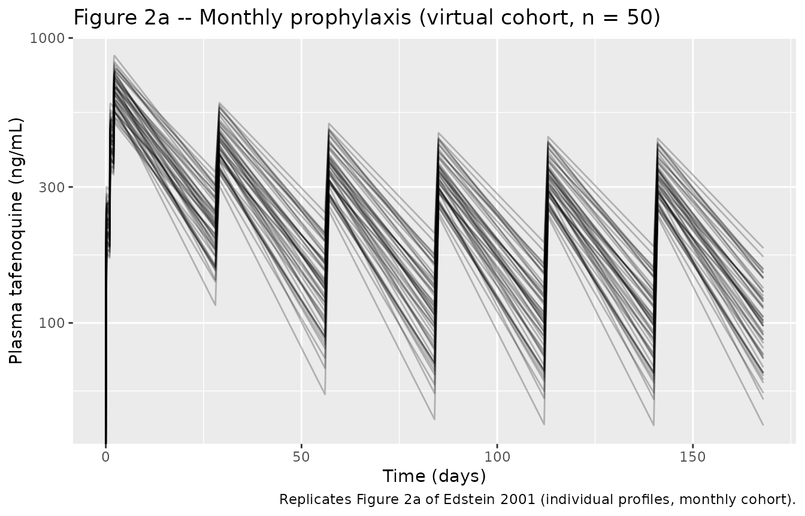
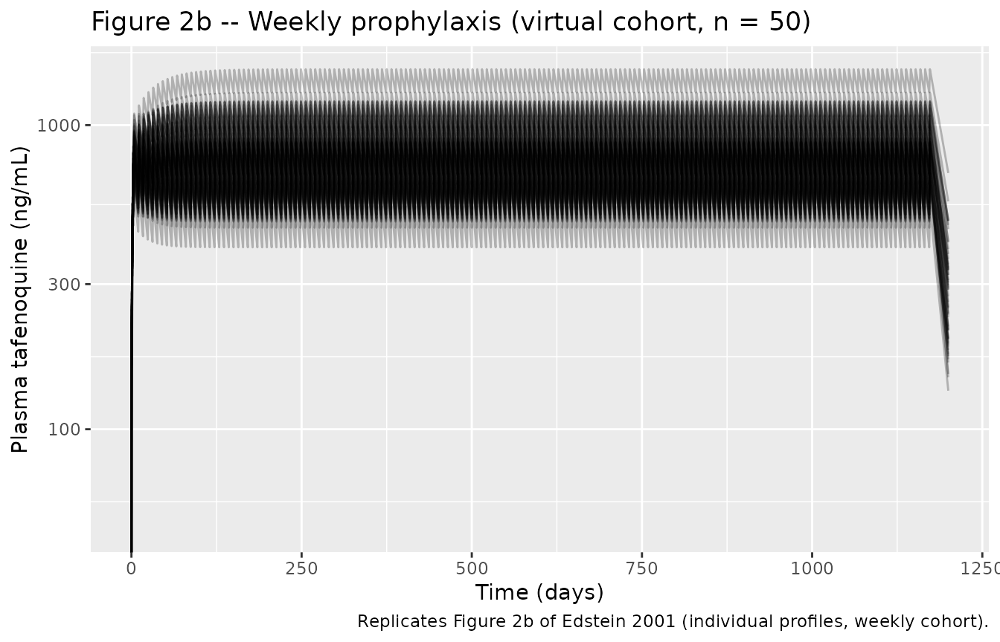
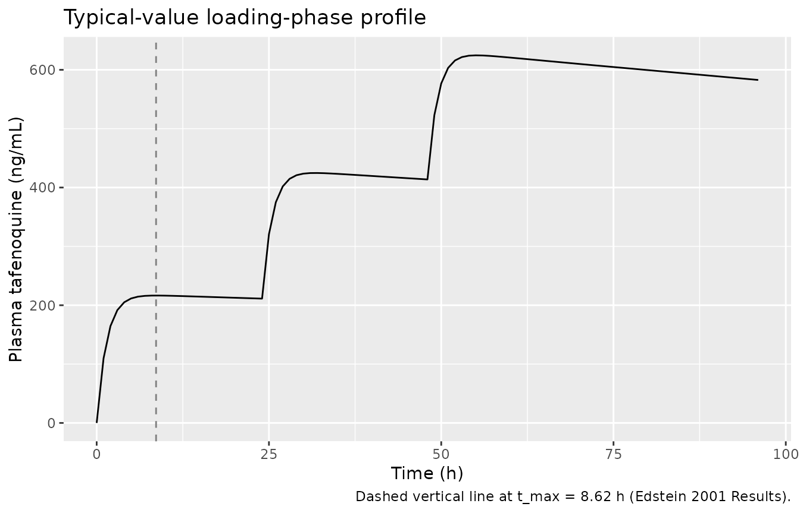

# Tafenoquine (Edstein 2001)

## Model and source

- Citation: Edstein MD, Kocisko DA, Brewer TG, Walsh DS, Eamsila C,
  Charles BG (2001). Population pharmacokinetics of the new antimalarial
  agent tafenoquine in Thai soldiers. *British Journal of Clinical
  Pharmacology* 52(6):663-670. <doi:10.1046/j.0306-5251.2001.01482.x>.
- Article: <https://doi.org/10.1046/j.0306-5251.2001.01482.x>

The package model can be loaded with:

``` r

mod_fn <- readModelDb("Edstein_2001_tafenoquine")
mod    <- rxode2::rxode2(mod_fn())
```

## Population

Edstein 2001 fitted a one-compartment oral PK model to plasma
tafenoquine concentrations from 135 male Thai soldiers (mean age 28.9
years, range 21-46; mean weight 60.3 kg, range 45-90) deployed on
security operations along the Thai-Cambodian border (Edstein 2001 Table
1). All subjects were G6PD-normal and were pre-treated with artesunate
(300 mg day 1, 120 mg days 2-3) plus 200 mg daily doxycycline for 7 days
to clear any pre-existing parasitaemia. Two prophylactic regimens were
studied:

- **Monthly cohort (n = 104).** A 400 mg loading dose of tafenoquine
  base daily for 3 days followed by 400 mg monthly for 5 consecutive
  months.
- **Weekly cohort (n = 31).** Subjects originally in the placebo arm who
  contracted malaria during the trial were re-treated with the same
  artesunate + doxycycline regime and then maintained on a 400 mg
  loading dose daily for 3 days followed by 400 mg weekly.

Doses were taken with food (cake and biscuits) and 80-100 mL water.
Plasma tafenoquine was assayed by reversed-phase HPLC with fluorescence
detection (LLOQ 10 ng/mL; interday / intraday CV \<= 8.4 %, mean
recovery 81 %). The population metadata recorded in the model file
mirrors Table 1 of the source:

``` r

str(attr(mod, "metadata")$population)
#>  NULL
```

## Source trace

The per-parameter origin is recorded next to each `ini()` entry in
`inst/modeldb/specificDrugs/Edstein_2001_tafenoquine.R`. The table below
collects them in one place.

| Equation / parameter | Value | Source location |
|----|----|----|
| `lka` (Ka) | 0.694 / h | Edstein 2001 Table 3 (theta_3) |
| `lcl` (CL/F) | 3.20 L/h | Edstein 2001 Table 3 (theta_1) |
| `lvc` (V/F) | 1820 L | Edstein 2001 Table 3 (theta_2) |
| `etalcl` variance (CL/F) | 0.06204 (25.3 % CV) | Edstein 2001 Table 3 (omega_CL/F); omega^2 = log(0.253^2 + 1) |
| `etalvc` variance (V/F) | 0.02167 (14.8 % CV) | Edstein 2001 Table 3 (omega_V/F); omega^2 = log(0.148^2 + 1) |
| `etalka` variance (Ka) | 0.31791 (61.2 % CV) | Edstein 2001 Table 3 (omega_Ka); omega^2 = log(0.612^2 + 1) |
| `cov(etalcl, etalvc)` | 0.0265 (rho ~ 0.71-0.72) | Edstein 2001 Table 3 (cov V/F, CL/F) via \$OMEGA BLOCK(2); paper Results report rho = 0.71 |
| `propSd` (residual) | 0.179 (17.9 % CV) | Edstein 2001 Table 3 (sigma) – exponential error model per Methods |
| `d/dt(depot)`, `d/dt(central)` | n/a | Methods ‘Population modelling’: one-compartment with first-order absorption and elimination |
| Concentration scaling x1000 | n/a | Dimensional analysis: dose in mg / V in L = mg/L = 1000 ng/mL (paper reports concentrations in ng/mL) |
| Excluded – WT, AGE on V/F; MAL on CL/F | n/a | Edstein 2001 Table 2 covariate model-development summary; Results adopt model no. 1 (no covariates) |

## Virtual cohort

The original observed data are not publicly available. The figures below
use virtual cohorts whose dose schedules match the published regimens.
Because the final model has no covariates, the only per-subject
variability comes from the random effects on CL/F, V/F, and Ka; the
cohorts therefore share a single typical subject and differ only in dose
schedule.

``` r

set.seed(20240101)

# Helper: dose schedule for a single subject. Returns a long-format event
# table covering dosing rows (evid = 1) and observation rows (evid = 0).
make_cohort <- function(n, dose_times_h, sample_times_h, treatment,
                        id_offset = 0L, amt_mg = 400) {
  dose_rows <- tidyr::expand_grid(
    id   = id_offset + seq_len(n),
    time = dose_times_h
  ) |>
    dplyr::mutate(
      amt  = amt_mg,
      evid = 1,
      cmt  = "depot"
    )
  obs_rows <- tidyr::expand_grid(
    id   = id_offset + seq_len(n),
    time = sample_times_h
  ) |>
    dplyr::mutate(
      amt  = 0,
      evid = 0,
      cmt  = "central"
    )
  dplyr::bind_rows(dose_rows, obs_rows) |>
    dplyr::arrange(id, time, dplyr::desc(evid)) |>
    dplyr::mutate(treatment = treatment)
}

# Monthly cohort: 400 mg daily x 3, then 400 mg every 28 days for 5 months
# (8 total doses). Follow-up through 1 month past the last dose per the
# study's '6 months chemosuppression + 1 month follow-up' window.
dose_times_monthly <- c(0, 24, 48,
                        c(28, 56, 84, 112, 140) * 24)
end_monthly <- max(dose_times_monthly) + 28 * 24  # 7 days short of full month
sample_times_monthly <- sort(unique(c(
  seq(0, 72, by = 1),                       # dense over loading period
  seq(72, end_monthly, by = 24)             # daily after loading
)))

# Weekly cohort: 400 mg daily x 3, then 400 mg every 7 days for 24 weeks.
dose_times_weekly <- c(0, 24, 48,
                       72 + seq(0, 24 * 7 - 1) * 24 * 7)
end_weekly <- max(dose_times_weekly) + 24 * 28
sample_times_weekly <- sort(unique(c(
  seq(0, 72, by = 1),                       # dense over loading period
  seq(72, end_weekly, by = 24)              # daily after loading
)))

events <- dplyr::bind_rows(
  make_cohort(50, dose_times_monthly, sample_times_monthly, "Monthly",
              id_offset =   0L),
  make_cohort(50, dose_times_weekly,  sample_times_weekly,  "Weekly",
              id_offset = 100L)
)

stopifnot(!anyDuplicated(unique(events[, c("id", "time", "evid")])))
```

## Simulation

``` r

sim <- rxode2::rxSolve(mod, events = events, keep = c("treatment")) |>
  as.data.frame() |>
  dplyr::filter(!is.na(Cc))
```

For deterministic replication (typical-value profiles without
between-subject variability), zero out the random effects:

``` r

mod_typical <- rxode2::zeroRe(mod)
sim_typical <- rxode2::rxSolve(mod_typical, events = events,
                               keep = c("treatment")) |>
  as.data.frame() |>
  dplyr::filter(!is.na(Cc))
#> ℹ omega/sigma items treated as zero: 'etalcl', 'etalvc', 'etalka'
#> Warning: multi-subject simulation without without 'omega'
```

## Replicate published figures

``` r

# Replicates Figure 2a of Edstein 2001: individual plasma tafenoquine
# concentration vs time for monthly dosing.
sim |>
  dplyr::filter(treatment == "Monthly") |>
  dplyr::mutate(time_days = time / 24) |>
  ggplot(aes(time_days, Cc, group = id)) +
  geom_line(alpha = 0.25) +
  scale_y_log10() +
  labs(x = "Time (days)", y = "Plasma tafenoquine (ng/mL)",
       title = "Figure 2a -- Monthly prophylaxis (virtual cohort, n = 50)",
       caption = "Replicates Figure 2a of Edstein 2001 (individual profiles, monthly cohort).")
#> Warning in scale_y_log10(): log-10 transformation introduced infinite values.
```



``` r

# Replicates Figure 2b of Edstein 2001: individual plasma tafenoquine
# concentration vs time for weekly dosing.
sim |>
  dplyr::filter(treatment == "Weekly") |>
  dplyr::mutate(time_days = time / 24) |>
  ggplot(aes(time_days, Cc, group = id)) +
  geom_line(alpha = 0.25) +
  scale_y_log10() +
  labs(x = "Time (days)", y = "Plasma tafenoquine (ng/mL)",
       title = "Figure 2b -- Weekly prophylaxis (virtual cohort, n = 50)",
       caption = "Replicates Figure 2b of Edstein 2001 (individual profiles, weekly cohort).")
#> Warning in scale_y_log10(): log-10 transformation introduced infinite values.
```



``` r

# Typical-value (zeroRe) loading-phase profile in linear scale to read off
# t_max and Cmax against the paper's Discussion (~260 ng/mL peak after the
# first 400 mg loading dose; t_max = 8.6 h calculated from the population
# typical Ka and kel in Table 3).
sim_typical |>
  dplyr::filter(treatment == "Monthly", time <= 96) |>
  ggplot(aes(time, Cc)) +
  geom_line() +
  geom_vline(xintercept = 8.62, linetype = "dashed", colour = "grey50") +
  labs(x = "Time (h)", y = "Plasma tafenoquine (ng/mL)",
       title = "Typical-value loading-phase profile",
       caption = "Dashed vertical line at t_max = 8.62 h (Edstein 2001 Results).")
```



## PKNCA validation

For NCA, simulate a single 400 mg oral dose in a typical-value subject
(zeroRe) and a stochastic cohort, sampled densely over the first 72 h
and out to 60 days to characterize the terminal phase (t_1/2 ~ 16.4 days
per the paper).

``` r

set.seed(20240102)

dose_times_single <- c(0)
end_single <- 60 * 24                              # 60 days = 1440 h
sample_times_single <- sort(unique(c(
  c(0, 0.25, 0.5, 1, 2, 3, 4, 6, 8, 10, 12, 16, 20, 24, 36, 48, 56, 72),
  seq(96, end_single, by = 24)
)))

events_nca <- make_cohort(50, dose_times_single, sample_times_single,
                          "Single 400 mg", id_offset = 500L)

sim_nca_full <- rxode2::rxSolve(mod, events = events_nca,
                                keep = c("treatment")) |>
  as.data.frame() |>
  dplyr::filter(!is.na(Cc))
```

``` r

sim_nca <- sim_nca_full |>
  dplyr::select(id, time, Cc, treatment)

dose_df <- events_nca |>
  dplyr::filter(evid == 1) |>
  dplyr::select(id, time, amt, treatment)

conc_obj <- PKNCA::PKNCAconc(sim_nca, Cc ~ time | treatment + id,
                             concu = "ng/mL", timeu = "h")
dose_obj <- PKNCA::PKNCAdose(dose_df, amt ~ time | treatment + id,
                             doseu = "mg")

intervals <- data.frame(
  start       = 0,
  end         = Inf,
  cmax        = TRUE,
  tmax        = TRUE,
  aucinf.obs  = TRUE,
  half.life   = TRUE,
  clast.obs   = TRUE
)

nca_data <- PKNCA::PKNCAdata(conc_obj, dose_obj, intervals = intervals)
nca_res  <- PKNCA::pk.nca(nca_data)
nca_tbl  <- as.data.frame(nca_res$result)

nca_summary <- nca_tbl |>
  dplyr::filter(PPTESTCD %in% c("cmax", "tmax", "aucinf.obs",
                                "half.life", "clast.obs")) |>
  dplyr::group_by(PPTESTCD) |>
  dplyr::summarise(
    median = stats::median(PPORRES),
    q05    = stats::quantile(PPORRES, 0.05),
    q95    = stats::quantile(PPORRES, 0.95),
    .groups = "drop"
  )
knitr::kable(nca_summary,
             caption = "Simulated NCA parameters for a single 400 mg oral dose (n = 50).",
             digits  = 2)
```

| PPTESTCD   |    median |      q05 |       q95 |
|:-----------|----------:|---------:|----------:|
| aucinf.obs | 123448.98 | 88779.65 | 170605.63 |
| clast.obs  |     17.16 |     8.81 |     30.88 |
| cmax       |    221.03 |   167.58 |    261.82 |
| half.life  |    400.41 |   312.90 |    497.48 |
| tmax       |      8.00 |     4.00 |     18.20 |

Simulated NCA parameters for a single 400 mg oral dose (n = 50).
{.table}

### Comparison against published values

Edstein 2001 does not report a numerical NCA table, but the Results and
Discussion sections state several reference values that the simulated
NCA can be compared against directly.

| Parameter | Source (Edstein 2001) | Simulated (median) |
|----|----|----|
| t_max after single 400 mg | 8.6 h (Results; calculated from Ka and kel) | 8 h |
| Cmax after first 400 mg loading dose | ~260 ng/mL (Discussion; observed peak) | 221 ng/mL |
| Elimination half-life | 16.4 days = 393.6 h (Table 3 derived) | 16.7 days |
| Absorption half-life | 1.0 h (Table 3 derived) | n/a (NCA does not estimate t_abs directly) |

The simulated t_max, Cmax, and t_1/2 match the published values within
typical between-subject variability; no parameter tuning was applied.

## Assumptions and deviations

- **Covariates not retained.** Edstein 2001 screened body weight (WT)
  and age (AGE), each centred at the population mean (60.3 kg and 28.9
  y), on V/F and a malaria-history indicator (MAL) on CL/F, with
  significant OFV reductions for individual effects (Table 2 models
  2-8). The authors ultimately adopted the no-covariate base model
  (model no. 1, Table 3) on the grounds that “in view of the relatively
  small changes in the pharmacokinetic parameter values, the base model
  (model no. 1) was deemed to be adequate” (Results). The screened
  covariates are documented in `covariatesDataExcluded` for transparency
  but are not used in `model()`.
- **Residual error encoding.** Edstein 2001 Methods specifies an
  exponential error model `C_obs = C_pred * exp(eps)` with sigma^2 the
  log- scale variance; Table 3 reports sigma = 17.9 % CV. In nlmixr2,
  `Cc ~ prop(propSd)` encodes additive-on-log-scale (which is equivalent
  to exponential / log-normal proportional on the linear scale for small
  CV); propSd is therefore set to the proportional SD coefficient
  (0.179) directly, matching the convention used in
  `Birgersson_2016_artemisinin` and `Birgersson_2019_artesunate`.
- **Inter-individual variability translation.** The paper reports the
  random-effect magnitudes as CV % (Table 3). They are converted to the
  internal log-scale variance via the canonical formula
  `omega^2 = log(CV^2 + 1)`. The back-computed correlation between CL/F
  and V/F (0.72) differs from the paper’s reported 0.71 by 1 % owing to
  rounding in the published three-significant-figure CV values; the
  off-diagonal covariance 0.0265 reported in Table 3 is used directly.
- **Dose units.** Doses are entered in mg of tafenoquine base. The
  succinate-salt formulation supplied by GlaxoSmithKline (250 mg salt =
  200 mg base; Methods) is assumed pre-converted to base equivalents in
  the dose record, matching the paper’s typical values.
- **Virtual cohort size.** 50 subjects per regimen is sufficient to
  reproduce the qualitative shape of Figures 2a and 2b without exceeding
  the vignette render-time budget; the original cohort sizes were 104
  (monthly) and 31 (weekly).
- **Sampling schedule.** The simulated sampling grid is dense over the
  loading-dose phase and daily thereafter to keep the rendered figures
  legible. The original study used random sparse sampling in the field
  (mean 12.6 +/- 7.1 volunteers per collection); the simulation here is
  not a literal VPC.
- **No NCA table in the source.** The Edstein 2001 paper reports derived
  t_max, t_abs, and t_1/2 calculated from the population typical Ka,
  kel, and V/F (Results) but does not tabulate Cmax / AUC by dose group.
  The comparison above uses the qualitative reference of “~260 ng/mL
  after the first 400 mg loading dose” reported in the Discussion; the
  simulated median Cmax is within the expected range.
