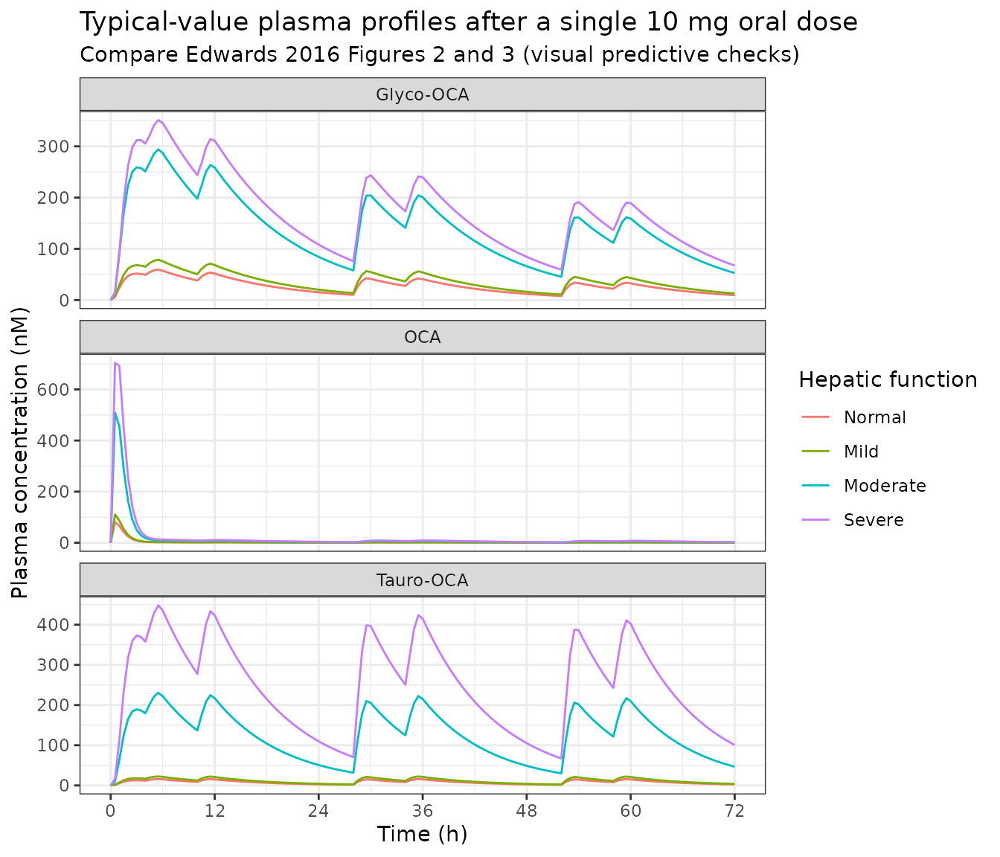

# Obeticholic acid (Edwards 2016)

## Model and source

- Citation: Edwards JE, LaCerte C, Peyret T, Gosselin NH, Marier JF,
  Hofmann AF, Shapiro D. Modeling and Experimental Studies of
  Obeticholic Acid Exposure and the Impact of Cirrhosis Stage. *Clin
  Transl Sci* 2016;9(6):328-336. <doi:10.1111/cts.12421>
- Article: <https://doi.org/10.1111/cts.12421>

Obeticholic acid (OCA) is a semisynthetic bile acid and selective
farnesoid X receptor (FXR) agonist. The packaged model in
`inst/modeldb/specificDrugs/Edwards_2016_obeticholicAcid_pbpk.R` is the
semi-mechanistic physiologic pharmacokinetic model of Edwards et al. It
is an OCA-specific adaptation of the Molino 1986 chenodeoxycholic acid
model: the enteral system is collapsed to a single gut space, endogenous
synthesis is removed (OCA is exogenous), and bacterial
7-alpha-dehydroxylation is omitted because the 6-alpha-ethyl group
sterically blocks it.

Three chemical forms circulate: unconjugated OCA and its two hepatic
conjugates, glyco-OCA and tauro-OCA. Each form occupies its own copy of
the anatomical spaces, because blood flows are independent of chemical
structure while transport and biotransformation rates are not. The
spaces are systemic circulation, portal circulation, sinusoidal
circulation, liver, bile duct, gallbladder and gut.

Unconjugated OCA has no bile duct or gallbladder state: Figure 1 shows
no liver-to-bile-duct arrow in the OCA column (there is no `t20` in
Supplemental Table 3), so only the conjugates are secreted into bile.
That gives 5 + 7 + 7 = 19 ODE states plus an oral depot.

Two classes of flux coexist and are dimensionally different:

- **Flows** `f` (L/h) act on the **concentration** of the source space,
  so they need that space’s volume.
- **Transport** `t`, **biotransformation** `b`, `Ka` and the gallbladder
  output `f23` (1/h) act directly on the **amount** in the source state.

``` r

mod <- modellib("Edwards_2016_obeticholicAcid_pbpk")
mod
#> function() {
#>   description <- "PBPK (semi-mechanistic bile-acid enterohepatic-recirculation model). Obeticholic acid (OCA) and its glycine (glyco-OCA) and taurine (tauro-OCA) conjugates in healthy adults and subjects with Child-Pugh A/B/C cirrhosis. 19 ODEs spanning systemic, portal, sinusoidal, liver, bile duct, gallbladder and gut spaces per analyte, plus an oral depot; blood/bile flows act on concentration, transport and biotransformation on amount. Meal-gated gallbladder emptying; four hepatic-impairment mechanisms (reduced hepatic uptake, portal-systemic shunting with arterial buffer response, reduced functional liver volume, preferential tauro-conjugation)."
#>   reference <- "Edwards JE, LaCerte C, Peyret T, Gosselin NH, Marier JF, Hofmann AF, Shapiro D. Modeling and Experimental Studies of Obeticholic Acid Exposure and the Impact of Cirrhosis Stage. Clin Transl Sci. 2016 Dec;9(6):328-336. doi:10.1111/cts.12421"
#>   vignette <- "Edwards_2016_obeticholicAcid"
#> 
#>   # All 19 anatomical-space x chemical-form states are paper-mechanistic: the
#>   # model is an OCA-specific adaptation of the Molino 1986 CDCA physiological
#>   # PK model, whose seven "spaces" (systemic, portal, sinusoidal, liver, bile
#>   # duct, gallbladder, gut) do not map onto the canonical central/peripheral
#>   # names. Same treatment as the sibling bile-acid model Zuo_2016_UDCA.R.
#>   # OCA itself has no bile duct or gallbladder state: Figure 1 shows no
#>   # liver -> bile duct arrow in the OCA column (there is no "t20"), i.e. only
#>   # the conjugates are secreted into bile.
#>   paper_specific_compartments <- c(
#>     "systemic_oca", "portal_oca", "sinusoidal_oca", "liver_oca", "gut_oca",
#>     "systemic_goca", "portal_goca", "sinusoidal_goca", "liver_goca",
#>     "bileduct_goca", "gallbladder_goca", "gut_goca",
#>     "systemic_toca", "portal_toca", "sinusoidal_toca", "liver_toca",
#>     "bileduct_toca", "gallbladder_toca", "gut_toca"
#>   )
#> 
#>   units <- list(time = "h", dosing = "nmol", concentration = "nM")
#> 
#>   # Issue #482. Every state holds an amount in nmol; the model is solved on a
#>   # molar basis because the paper's residual error and LLOQ are reported in nM
#>   # ("Bioanalytical": OCA 420.6, glyco-OCA 477.7, tauro-OCA 527.8 g/mol).
#>   # verified = TRUE: the seven spaces and their contents are read off the
#>   # Figure 1 diagram and cross-checked against the Table 1 "Mean Simulated OCA
#>   # Distribution (% Nanomoles Total OCA)" block, which is itemised by exactly
#>   # these spaces.
#>   compartmentData <- list(
#>     depot            = list(analyte = "OCA", units = "nmol", specimen = "administration site", verified = TRUE),
#>     systemic_oca     = list(analyte = "OCA", units = "nmol", specimen = "plasma", verified = TRUE),
#>     portal_oca       = list(analyte = "OCA", units = "nmol", specimen = "whole blood", verified = TRUE),
#>     sinusoidal_oca   = list(analyte = "OCA", units = "nmol", specimen = "whole blood", verified = TRUE),
#>     liver_oca        = list(analyte = "OCA", units = "nmol", specimen = "tissue", verified = TRUE),
#>     gut_oca          = list(analyte = "OCA", units = "nmol", specimen = "administration site", verified = TRUE),
#>     systemic_goca    = list(analyte = "glyco-OCA", units = "nmol", specimen = "plasma", verified = TRUE),
#>     portal_goca      = list(analyte = "glyco-OCA", units = "nmol", specimen = "whole blood", verified = TRUE),
#>     sinusoidal_goca  = list(analyte = "glyco-OCA", units = "nmol", specimen = "whole blood", verified = TRUE),
#>     liver_goca       = list(analyte = "glyco-OCA", units = "nmol", specimen = "tissue", verified = TRUE),
#>     bileduct_goca    = list(analyte = "glyco-OCA", units = "nmol", specimen = "bile", verified = TRUE),
#>     gallbladder_goca = list(analyte = "glyco-OCA", units = "nmol", specimen = "bile", verified = TRUE),
#>     gut_goca         = list(analyte = "glyco-OCA", units = "nmol", specimen = "administration site", verified = TRUE),
#>     systemic_toca    = list(analyte = "tauro-OCA", units = "nmol", specimen = "plasma", verified = TRUE),
#>     portal_toca      = list(analyte = "tauro-OCA", units = "nmol", specimen = "whole blood", verified = TRUE),
#>     sinusoidal_toca  = list(analyte = "tauro-OCA", units = "nmol", specimen = "whole blood", verified = TRUE),
#>     liver_toca       = list(analyte = "tauro-OCA", units = "nmol", specimen = "tissue", verified = TRUE),
#>     bileduct_toca    = list(analyte = "tauro-OCA", units = "nmol", specimen = "bile", verified = TRUE),
#>     gallbladder_toca = list(analyte = "tauro-OCA", units = "nmol", specimen = "bile", verified = TRUE),
#>     gut_toca         = list(analyte = "tauro-OCA", units = "nmol", specimen = "administration site", verified = TRUE)
#>   )
#> 
#>   covariateData <- list(
#>     HEPIMP_MILD = list(
#>       description       = "Mild hepatic impairment (Child-Pugh Class A, score 5-6).",
#>       units             = "(binary)",
#>       type              = "binary",
#>       reference_category = "0 (normal hepatic function, or a non-mild impairment category)",
#>       notes             = "Child-Pugh classification, not NCI ODWG (Edwards 2016 Results, 'Hepatic impairment model development': 'Child-Pugh Score: Class A/Mild 5-6 points, Class B/Moderate 7-9 points, Class C/Severe 10-15 points'). Mutually exclusive with HEPIMP_MOD and HEPIMP_SEV; all three 0 selects the healthy-volunteer physiology. Selects the mild column of all four hepatic-impairment mechanisms in Supplementary Table S2.",
#>       source_name       = "Child-Pugh Class A"
#>     ),
#>     HEPIMP_MOD = list(
#>       description       = "Moderate hepatic impairment (Child-Pugh Class B, score 7-9).",
#>       units             = "(binary)",
#>       type              = "binary",
#>       reference_category = "0 (normal hepatic function, or a non-moderate impairment category)",
#>       notes             = "Child-Pugh classification, not NCI ODWG. Mutually exclusive with HEPIMP_MILD and HEPIMP_SEV. Selects the moderate column of Supplementary Table S2.",
#>       source_name       = "Child-Pugh Class B"
#>     ),
#>     HEPIMP_SEV = list(
#>       description       = "Severe hepatic impairment (Child-Pugh Class C, score 10-15).",
#>       units             = "(binary)",
#>       type              = "binary",
#>       reference_category = "0 (normal hepatic function, or a non-severe impairment category)",
#>       notes             = "Child-Pugh classification, not NCI ODWG. Mutually exclusive with HEPIMP_MILD and HEPIMP_MOD. Selects the severe column of Supplementary Table S2.",
#>       source_name       = "Child-Pugh Class C"
#>     ),
#>     MEAL_FLAG = list(
#>       description       = "Indicator that the current time falls within a post-prandial gallbladder-contraction window.",
#>       units             = "(binary)",
#>       type              = "binary",
#>       reference_category = "0 (no gallbladder contraction active)",
#>       notes             = "Time-varying covariate; must be supplied on every observation row. Set to 1 over [t_meal, t_meal + 1.5 h] for each standardized meal and 0 otherwise, per Edwards 2016 'Source data': 'Gallbladder contraction was assumed to last 90 min after the start of a meal.' Gates the gallbladder -> gut output rate f23; outside the window the gallbladder only fills (via f22) and does not empty.",
#>       source_name       = "meal consumption information"
#>     )
#>   )
#> 
#>   population <- list(
#>     species         = "human",
#>     n_subjects      = 399L,
#>     n_studies       = 5L,
#>     age_range       = "adults >= 18 years; healthy-volunteer pool mean (SD) age 37.0 (9.8) years, hepatic-impairment cohort 55.0 (5.6) years",
#>     weight_range    = "healthy-volunteer pool mean (SD) 76.4 (11.8) kg; hepatic-impairment cohort 81.7 (16.9) kg",
#>     sex_female_pct  = 41,
#>     race_ethnicity  = "Healthy-volunteer pool (Study 1): 65.6% white, 32.5% black, 0.6% Asian, 1.3% other. Hepatic-impairment cohort (Study 2): 90.6% white, 3.1% black, 3.1% Asian, 3.1% other.",
#>     disease_state   = "Model development: healthy volunteers with normal hepatic function (Study 1, n = 160; 8,248 plasma samples) then subjects with Child-Pugh A/B/C cirrhosis plus normal-function controls (Study 2, n = 32; 928 samples). External validation: healthy volunteers (Studies 3 and 4, n = 24 and n = 160) and cirrhotic subjects with portal hypertension (Study 5 / PESTO, n = 23).",
#>     dose_range      = "5, 10 and 25 mg oral OCA; single dose and once-daily multiple dosing to steady state",
#>     notes           = "Sex percentage is derived from the two model-development cohorts, which were 59% and 72% male. The 22 structural parameters were estimated on the healthy-volunteer data and then held fixed while only the hepatic-impairment parameters were estimated. Population fit in Phoenix NLME v1.3 with Lindstrom-Bates FOCE. BLQ samples (38.2% / 9.4% / 24.4% for OCA / glyco-OCA / tauro-OCA in Study 1) were imputed to LLOQ/2."
#>   )
#> 
#>   ini({
#>     # ---- Blood, bile and gastrointestinal flows (L/h) --------------------
#>     # Supplemental Table 3 reports f3 and f4 as "Fixed"; they are inherited
#>     # physiological values from the base CDCA model (Molino 1986, reference 18).
#>     lf_por_sin  <- fixed(log(39.6));  label("Hepatic portal flow, portal -> sinusoidal, f3 (L/h)")     # Suppl Table 3
#>     lf_sys_sin  <- fixed(log(14.4));  label("Hepatic arterial flow, systemic -> sinusoidal, f4 (L/h)") # Suppl Table 3
#>     lf_bd_gb    <- log(0.856);        label("Flow from bile duct to gallbladder, f22 (L/h)")           # Suppl Table 3
#>     lf_bd_gut   <- log(7.29);         label("Flow from bile duct to gut, f24 (L/h)")                   # Suppl Table 3
#>     lk_gb_gut   <- fixed(log(1.2));   label("Rate of output from gallbladder to gut, f23 (1/h)")       # Suppl Table 3
#>     lkout       <- log(0.612);        label("Rate of fecal elimination of OCA, Kout (L/h)")            # Suppl Table 3
#> 
#>     # ---- Hepatic uptake and efflux (1/h) --------------------------------
#>     lt_sin_liv_oca  <- log(1698);        label("OCA transport rate, sinusoidal -> liver, t10 (1/h)")        # Suppl Table 3
#>     lt_sin_liv_goca <- log(1210);        label("Glyco-OCA transport rate, sinusoidal -> liver, t9 (1/h)")   # Suppl Table 3
#>     lt_sin_liv_toca <- log(1615);        label("Tauro-OCA transport rate, sinusoidal -> liver, t11 (1/h)")  # Suppl Table 3
#>     lt_liv_sin_oca  <- fixed(log(1.62)); label("OCA transport rate, liver -> sinusoidal, t13 (1/h)")        # Suppl Table 3
#>     lt_liv_sin_conj <- fixed(log(1.62)); label("Glyco- and tauro-OCA transport rate, liver -> sinusoidal, t12 (1/h)") # Suppl Table 3
#> 
#>     # ---- Biliary secretion of the conjugates (1/h) ----------------------
#>     # There is no OCA counterpart: Figure 1 has no liver -> bile duct arrow in
#>     # the OCA column, so unconjugated OCA is not secreted into bile.
#>     lt_liv_bd_goca <- log(7.44); label("Glyco-OCA transport rate, liver -> bile duct, t19 (1/h)") # Suppl Table 3
#>     lt_liv_bd_toca <- log(9.28); label("Tauro-OCA transport rate, liver -> bile duct, t21 (1/h)") # Suppl Table 3
#> 
#>     # ---- Intestinal absorption into the portal space (1/h) --------------
#>     lt_gut_por_oca  <- log(0.857); label("OCA rate of absorption, gut -> portal, t34 (1/h)")       # Suppl Table 3
#>     lt_gut_por_goca <- log(0.904); label("Glyco-OCA rate of absorption, gut -> portal, t33 (1/h)") # Suppl Table 3
#>     lt_gut_por_toca <- log(1.62);  label("Tauro-OCA rate of absorption, gut -> portal, t35 (1/h)") # Suppl Table 3
#> 
#>     # ---- Biotransformation (1/h) ----------------------------------------
#>     # Conjugation occurs in the liver; deconjugation by gut bacteria.
#>     lb_conj_gly    <- log(1.44);   label("OCA rate of conjugation with glycine, b15 (1/h)")   # Suppl Table 3
#>     lb_conj_tau    <- log(0.312);  label("OCA rate of conjugation with taurine, b16 (1/h)")   # Suppl Table 3
#>     lb_deconj_goca <- log(0.0431); label("Glyco-OCA rate of deconjugation to OCA, b36 (1/h)") # Suppl Table 3
#>     lb_deconj_toca <- log(0.0200); label("Tauro-OCA rate of deconjugation to OCA, b37 (1/h)") # Suppl Table 3
#> 
#>     # ---- Oral absorption -------------------------------------------------
#>     lka <- log(5.32); label("OCA first-order rate constant of oral absorption, Ka (1/h)") # Suppl Table 3
#> 
#>     # ---- Hepatic-impairment effects (Supplemental Table 4) ---------------
#>     # Log-scale multiplicative deviations, applied as exp(effect) per the
#>     # Supplemental Table 2 equations. Estimated on Study 2 while the 22
#>     # healthy-volunteer structural parameters were held fixed.
#>     e_hepimp_mild_uptake <- -0.132;  label("Effect of mild hepatic impairment on hepatic uptake of OCA and conjugates (log scale)")     # Suppl Table 4
#>     e_hepimp_mod_uptake  <- -1.86;   label("Effect of moderate hepatic impairment on hepatic uptake of OCA and conjugates (log scale)") # Suppl Table 4
#>     e_hepimp_sev_uptake  <- -2.37;   label("Effect of severe hepatic impairment on hepatic uptake of OCA and conjugates (log scale)")   # Suppl Table 4
#>     e_hepimp_mild_tauro  <- 0.00481; label("Effect of mild hepatic impairment on OCA tauro-conjugation (log scale)")     # Suppl Table 4
#>     e_hepimp_mod_tauro   <- 1.05;    label("Effect of moderate hepatic impairment on OCA tauro-conjugation (log scale)") # Suppl Table 4
#>     e_hepimp_sev_tauro   <- 1.56;    label("Effect of severe hepatic impairment on OCA tauro-conjugation (log scale)")   # Suppl Table 4
#> 
#>     # ---- Between-subject variability ------------------------------------
#>     # Supplemental Table 3 reports BSV on only two parameters, as %CV from
#>     # Phoenix NLME. Converted to log-scale variance by omega^2 = log(CV^2 + 1):
#>     #   Ka  195%  -> log(1.95^2 + 1)  = 1.5692
#>     #   f22  78.1% -> log(0.781^2 + 1) = 0.4762
#>     etalka    ~ 1.5692  # Suppl Table 3, BSV 195% CV on Ka
#>     etalf_bd_gb ~ 0.4762 # Suppl Table 3, BSV 78.1% CV on flow from bile duct to gallbladder
#> 
#>     # ---- Residual error ---------------------------------------------------
#>     # Healthy-volunteer values (Supplemental Table 3). The hepatic-impairment
#>     # model re-estimated a separate residual-error set (Supplemental Table 4:
#>     # proportional 122 / 112 / 123%, additive 0.993 / 0.273 / 0.532 nM); see the
#>     # vignette's Assumptions and deviations section.
#>     propSd         <- 0.880; label("Proportional residual error, OCA")       # Suppl Table 3, 88.0%
#>     addSd          <- 0.546; label("Additive residual error, OCA (nM)")      # Suppl Table 3
#>     propSd_Cc_goca <- 0.626; label("Proportional residual error, glyco-OCA") # Suppl Table 3, 62.6%
#>     addSd_Cc_goca  <- 0.675; label("Additive residual error, glyco-OCA (nM)") # Suppl Table 3
#>     propSd_Cc_toca <- 0.716; label("Proportional residual error, tauro-OCA") # Suppl Table 3, 71.6%
#>     addSd_Cc_toca  <- 0.469; label("Additive residual error, tauro-OCA (nM)") # Suppl Table 3
#>   })
#> 
#>   model({
#>     # ================= Physiological compartment volumes (L) =============
#>     # Printed in the Volumes legend inside the Figure 1 panel (p. 330). These
#>     # are the values the paper describes in Methods as "fixed to physiological
#>     # values from the base CDCA model" (Molino 1986, reference 18); the figure
#>     # panel reproduces them, so no upstream lookup is required.
#>     v_sys <- 2.46 # Systemic circulation  -- Figure 1 legend
#>     v_por <- 0.42 # Portal circulation    -- Figure 1 legend
#>     v_sin <- 0.12 # Sinusoidal circulation -- Figure 1 legend
#>     v_liv <- 0.95 # Liver                 -- Figure 1 legend
#>     v_bd  <- 0.02 # Bile duct             -- Figure 1 legend
#>     v_gb  <- 0.02 # Gallbladder           -- Figure 1 legend
#>     v_gut <- 0.90 # Intestine (gut)       -- Figure 1 legend
#> 
#>     # ============ Hepatic-impairment physiology (Suppl Table 2) ==========
#>     # Fixed multipliers taken from the Simcyp cirrhotic library via Johnson
#>     # 2010 (Edwards 2016 reference 11), applied for Child-Pugh A / B / C.
#>     # The three indicators are mutually exclusive, so each multiplier
#>     # collapses to 1 (or 0 for the shunt) in healthy subjects.
#>     f4_mult <- 1 + HEPIMP_MILD * (1.408 - 1) + HEPIMP_MOD * (1.625 - 1) + HEPIMP_SEV * (1.915 - 1)
#>     f3_mult <- 1 + HEPIMP_MILD * (0.910 - 1) + HEPIMP_MOD * (0.635 - 1) + HEPIMP_SEV * (0.554 - 1)
#>     vl_mult <- 1 + HEPIMP_MILD * (0.891 - 1) + HEPIMP_MOD * (0.710 - 1) + HEPIMP_SEV * (0.610 - 1)
#> 
#>     uptake_eff <- HEPIMP_MILD * e_hepimp_mild_uptake +
#>       HEPIMP_MOD * e_hepimp_mod_uptake +
#>       HEPIMP_SEV * e_hepimp_sev_uptake
#>     tauro_eff <- HEPIMP_MILD * e_hepimp_mild_tauro +
#>       HEPIMP_MOD * e_hepimp_mod_tauro +
#>       HEPIMP_SEV * e_hepimp_sev_tauro
#> 
#>     # ===================== Individual parameters =========================
#>     f3   <- exp(lf_por_sin) * f3_mult   # portal -> sinusoidal
#>     f4   <- exp(lf_sys_sin) * f4_mult   # systemic -> sinusoidal (hepatic artery)
#>     # Portal-systemic shunt f2: "the coefficient for portal to sinusoidal flow
#>     # was progressively decreased ... and was matched by a progressive increase
#>     # in flow from the portal to systemic circulation of equal magnitude. The
#>     # latter flow does not occur in healthy individuals." (Results, Hepatic
#>     # impairment). So f2 = f3_healthy - f3_impaired, and is 0 when healthy.
#>     f2   <- exp(lf_por_sin) - f3
#>     # f1 (systemic -> portal) and f5 (sinusoidal -> systemic) are shown in
#>     # Figure 1 but are not tabulated; they are fixed by blood-flow continuity
#>     # on the portal and sinusoidal spaces respectively:
#>     #   portal:     f1 = f2 + f3  = 39.6 L/h in every impairment stratum
#>     #   sinusoidal: f5 = f3 + f4
#>     f1   <- f2 + f3
#>     f5   <- f3 + f4
#>     f22  <- exp(lf_bd_gb + etalf_bd_gb)
#>     f24  <- exp(lf_bd_gut)
#>     f23  <- exp(lk_gb_gut)
#>     kout <- exp(lkout)
#> 
#>     # Hepatic uptake is reduced in cirrhosis; sinusoidal efflux is not.
#>     t10 <- exp(lt_sin_liv_oca + uptake_eff)
#>     t9  <- exp(lt_sin_liv_goca + uptake_eff)
#>     t11 <- exp(lt_sin_liv_toca + uptake_eff)
#>     t13 <- exp(lt_liv_sin_oca)
#>     t12 <- exp(lt_liv_sin_conj)
#> 
#>     t19 <- exp(lt_liv_bd_goca)
#>     t21 <- exp(lt_liv_bd_toca)
#>     t34 <- exp(lt_gut_por_oca)
#>     t33 <- exp(lt_gut_por_goca)
#>     t35 <- exp(lt_gut_por_toca)
#> 
#>     b15 <- exp(lb_conj_gly)
#>     b16 <- exp(lb_conj_tau + tauro_eff) # preferential tauro-conjugation in cirrhosis
#>     b36 <- exp(lb_deconj_goca)
#>     b37 <- exp(lb_deconj_toca)
#> 
#>     ka <- exp(lka + etalka)
#> 
#>     # Functional liver volume shrinks with cirrhosis. It does not enter the
#>     # ODEs (every liver flux is a first-order rate constant on amount), only
#>     # the reported liver concentration - which is why Table 1 shows liver
#>     # exposure rising far less than systemic exposure.
#>     v_liv_i <- v_liv * vl_mult
#> 
#>     # Gallbladder empties only during the 90-minute post-prandial window.
#>     gb_out <- f23 * MEAL_FLAG
#> 
#>     # ===================== Concentrations (nM) ===========================
#>     c_sys_oca  <- systemic_oca / v_sys
#>     c_por_oca  <- portal_oca / v_por
#>     c_sin_oca  <- sinusoidal_oca / v_sin
#>     c_gut_oca  <- gut_oca / v_gut
#> 
#>     c_sys_goca <- systemic_goca / v_sys
#>     c_por_goca <- portal_goca / v_por
#>     c_sin_goca <- sinusoidal_goca / v_sin
#>     c_bd_goca  <- bileduct_goca / v_bd
#> 
#>     c_sys_toca <- systemic_toca / v_sys
#>     c_por_toca <- portal_toca / v_por
#>     c_sin_toca <- sinusoidal_toca / v_sin
#>     c_bd_toca  <- bileduct_toca / v_bd
#> 
#>     # ========================= ODE system =================================
#>     # Amounts in nmol. Flows f (L/h) act on the source-space concentration;
#>     # transport t, biotransformation b, Ka and f23 (1/h) act on amount.
#>     # Topology transcribed from the Figure 1 diagram (p. 330).
#>     d/dt(depot) <- -ka * depot
#> 
#>     # ---- OCA (no bile duct / gallbladder state; see Figure 1) ------------
#>     d/dt(systemic_oca) <- f5 * c_sin_oca + f2 * c_por_oca -
#>       f1 * c_sys_oca - f4 * c_sys_oca
#>     d/dt(portal_oca) <- f1 * c_sys_oca - f3 * c_por_oca - f2 * c_por_oca +
#>       t34 * gut_oca
#>     d/dt(sinusoidal_oca) <- f3 * c_por_oca + f4 * c_sys_oca - f5 * c_sin_oca -
#>       t10 * sinusoidal_oca + t13 * liver_oca
#>     d/dt(liver_oca) <- t10 * sinusoidal_oca - t13 * liver_oca -
#>       b15 * liver_oca - b16 * liver_oca
#>     d/dt(gut_oca) <- ka * depot + b36 * gut_goca + b37 * gut_toca -
#>       t34 * gut_oca - kout * c_gut_oca
#> 
#>     # ---- Glyco-OCA -------------------------------------------------------
#>     d/dt(systemic_goca) <- f5 * c_sin_goca + f2 * c_por_goca -
#>       f1 * c_sys_goca - f4 * c_sys_goca
#>     d/dt(portal_goca) <- f1 * c_sys_goca - f3 * c_por_goca - f2 * c_por_goca +
#>       t33 * gut_goca
#>     d/dt(sinusoidal_goca) <- f3 * c_por_goca + f4 * c_sys_goca - f5 * c_sin_goca -
#>       t9 * sinusoidal_goca + t12 * liver_goca
#>     d/dt(liver_goca) <- t9 * sinusoidal_goca - t12 * liver_goca +
#>       b15 * liver_oca - t19 * liver_goca
#>     d/dt(bileduct_goca) <- t19 * liver_goca - f22 * c_bd_goca - f24 * c_bd_goca
#>     d/dt(gallbladder_goca) <- f22 * c_bd_goca - gb_out * gallbladder_goca
#>     d/dt(gut_goca) <- f24 * c_bd_goca + gb_out * gallbladder_goca -
#>       t33 * gut_goca - b36 * gut_goca
#> 
#>     # ---- Tauro-OCA -------------------------------------------------------
#>     d/dt(systemic_toca) <- f5 * c_sin_toca + f2 * c_por_toca -
#>       f1 * c_sys_toca - f4 * c_sys_toca
#>     d/dt(portal_toca) <- f1 * c_sys_toca - f3 * c_por_toca - f2 * c_por_toca +
#>       t35 * gut_toca
#>     d/dt(sinusoidal_toca) <- f3 * c_por_toca + f4 * c_sys_toca - f5 * c_sin_toca -
#>       t11 * sinusoidal_toca + t12 * liver_toca
#>     d/dt(liver_toca) <- t11 * sinusoidal_toca - t12 * liver_toca +
#>       b16 * liver_oca - t21 * liver_toca
#>     d/dt(bileduct_toca) <- t21 * liver_toca - f22 * c_bd_toca - f24 * c_bd_toca
#>     d/dt(gallbladder_toca) <- f22 * c_bd_toca - gb_out * gallbladder_toca
#>     d/dt(gut_toca) <- f24 * c_bd_toca + gb_out * gallbladder_toca -
#>       t35 * gut_toca - b37 * gut_toca
#> 
#>     # ======================== Observations ================================
#>     # Plasma concentrations are the systemic-circulation concentrations.
#>     Cc      <- c_sys_oca
#>     Cc_goca <- c_sys_goca
#>     Cc_toca <- c_sys_toca
#> 
#>     # Total OCA (Results, Source data): "total OCA concentrations were
#>     # calculated as the sum of OCA, glyco-OCA, and tauro-OCA" on a molar
#>     # basis. Liver total OCA drives the Table 1 hepatic-exposure column.
#>     Cc_total    <- c_sys_oca + c_sys_goca + c_sys_toca
#>     Cliver      <- (liver_oca + liver_goca + liver_toca) / v_liv_i
#> 
#>     Cc      ~ add(addSd) + prop(propSd)
#>     Cc_goca ~ add(addSd_Cc_goca) + prop(propSd_Cc_goca)
#>     Cc_toca ~ add(addSd_Cc_toca) + prop(propSd_Cc_toca)
#>   })
#> }
#> <environment: 0x555e6c969ee0>
```

## Population

| Item | Value |
|:---|:---|
| Species | Human |
| Subjects | 399 across 5 phase 1/2 studies |
| Development data | Study 1 healthy volunteers (n = 160; 8,248 samples); Study 2 hepatic impairment (n = 32; 928 samples) |
| Validation data | Studies 3 (n = 24) and 4 (n = 160) healthy; Study 5 / PESTO cirrhosis with portal hypertension (n = 23) |
| Age | Healthy mean (SD) 37.0 (9.8) y; hepatic impairment 55.0 (5.6) y |
| Weight | Healthy mean (SD) 76.4 (11.8) kg; hepatic impairment 81.7 (16.9) kg |
| Sex | 59% male (healthy pool), 72% male (hepatic impairment cohort) |
| Doses | 5, 10 and 25 mg oral; single dose and once-daily to steady state |
| Software | Phoenix NLME v1.3, Lindstrom-Bates FOCE |

Population summary (Edwards 2016 Results and Supplementary Table S1).
{.table}

Child-Pugh classification, per the paper’s Results section, is Class A /
mild = 5-6 points, Class B / moderate = 7-9 points, Class C / severe =
10-15 points. The hepatic-impairment cohort had mean (SD) Child-Pugh
score 8.0 (2.0).

## Source trace

Every value in `ini()` and every structural equation, with the location
it came from. “Suppl Table 3/4” refers to the supplementary files
distributed with the article (`CTS-9-328-s004.docx` and
`CTS-9-328-s005.docx`).

| Quantity | Paper name | Value | Source |
|:---|:---|:---|:---|
| Compartment volumes (7) | Systemic / Portal / Sinusoidal / Liver / Bile duct / Gallbladder / Intestine | 2.46 / 0.42 / 0.12 / 0.95 / 0.02 / 0.02 / 0.90 L | Figure 1, Volumes legend inside the panel (p. 330) |
| Model topology | f, t, b arrows | see Figure 1 | Figure 1 diagram (p. 330) |
| Hepatic portal flow | f3 | 39.6 L/h (fixed) | Suppl Table 3 |
| Hepatic arterial flow | f4 | 14.4 L/h (fixed) | Suppl Table 3 |
| Systemic -\> portal flow | f1 | = f2 + f3 (39.6 L/h) | Figure 1 arrow; value by blood-flow continuity on the portal space |
| Portal -\> systemic shunt | f2 | = f3(healthy) - f3(impaired); 0 in healthy | Results, Hepatic impairment (equal-magnitude rule); Figure 1 dotted arrow |
| Sinusoidal -\> systemic flow | f5 | = f3 + f4 | Figure 1 arrow; value by blood-flow continuity on the sinusoidal space |
| Bile duct -\> gallbladder | f22 | 0.856 L/h | Suppl Table 3 |
| Bile duct -\> gut | f24 | 7.29 L/h | Suppl Table 3 |
| Gallbladder -\> gut | f23 | 1.2 /h (fixed) | Suppl Table 3 |
| Fecal elimination | Kout | 0.612 L/h | Suppl Table 3 |
| Sinusoidal -\> liver | t10 / t9 / t11 | 1698 / 1210 / 1615 /h | Suppl Table 3 |
| Liver -\> sinusoidal | t13 / t12 | 1.62 / 1.62 /h (both fixed) | Suppl Table 3 |
| Liver -\> bile duct | t19 / t21 | 7.44 / 9.28 /h | Suppl Table 3 |
| Gut -\> portal | t34 / t33 / t35 | 0.857 / 0.904 / 1.62 /h | Suppl Table 3 |
| Conjugation | b15 / b16 | 1.44 / 0.312 /h | Suppl Table 3 |
| Deconjugation | b36 / b37 | 0.0431 / 0.0200 /h | Suppl Table 3 |
| Oral absorption | Ka | 5.32 /h | Suppl Table 3 |
| BSV Ka | \- | 195% CV -\> omega^2 = 1.5692 | Suppl Table 3 |
| BSV f22 | \- | 78.1% CV -\> omega^2 = 0.4762 | Suppl Table 3 |
| Residual error (healthy) | \- | prop 88.0 / 62.6 / 71.6%; add 0.546 / 0.675 / 0.469 nM | Suppl Table 3 |
| Hepatic uptake effect | \- | -0.132 / -1.86 / -2.37 | Suppl Table 4 |
| Tauro-conjugation effect | \- | 0.00481 / 1.05 / 1.56 | Suppl Table 4 |
| f4 multipliers | \- | 1.408 / 1.625 / 1.915 | Suppl Table 2 |
| f3 multipliers | \- | 0.91 / 0.635 / 0.554 | Suppl Table 2 |
| Liver volume multipliers | \- | 0.891 / 0.71 / 0.61 | Suppl Table 2 |
| Gallbladder contraction window | \- | 90 min from meal start | Results, Source data |
| Molecular weights | \- | OCA 420.6, glyco-OCA 477.7, tauro-OCA 527.8 g/mol | Results, Bioanalytical |

Source trace for the Edwards 2016 obeticholic acid model. {.table}

Three quantities in that table are **derived rather than printed**, and
are flagged as such in the model file. `f1` and `f5` appear as labelled
arrows in Figure 1 but are not tabulated; their values follow from
blood-flow continuity on the portal and sinusoidal spaces given the
printed `f3` and `f4`. `f2` follows from the printed equal-magnitude
shunting rule. No value in this model is taken from outside the on-disk
sources.

## Virtual cohort

Study 2 is the hepatic-impairment study: a single 10 mg oral dose with
sampling to 216 h, eight subjects each with normal function and
Child-Pugh A / B / C. We simulate 100 subjects per arm, which is ample
for the checks below and well inside the 200-per-arm cap.

``` r

MW <- c(oca = 420.6, goca = 477.7, toca = 527.8)  # g/mol, Bioanalytical section
DOSE_MG <- 10
dose_nmol <- DOSE_MG / MW[["oca"]] * 1e6

N_PER_ARM <- 100L
obs_times <- seq(0, 216, by = 0.5)

# Standardized inpatient meals. The paper records meal times per subject but
# does not publish them; see Assumptions and deviations.
meal_starts <- as.vector(outer(c(4, 10), seq(0, 216, by = 24), "+"))
meal_starts <- sort(meal_starts[meal_starts <= 216])
MEAL_DUR <- 1.5  # 90 minutes, Results / Source data

meal_flag <- function(t) {
  as.integer(vapply(t, function(ti) any(ti >= meal_starts & ti < meal_starts + MEAL_DUR), logical(1)))
}

arms <- tibble::tribble(
  ~arm,        ~HEPIMP_MILD, ~HEPIMP_MOD, ~HEPIMP_SEV,
  "Normal",    0,            0,           0,
  "Mild",      1,            0,           0,
  "Moderate",  0,            1,           0,
  "Severe",    0,            0,           1
)

build_events <- function(mild, mod, sev, n) {
  per_id <- data.frame(
    time = c(0, obs_times),
    amt  = c(dose_nmol, rep(NA_real_, length(obs_times))),
    evid = c(1L, rep(0L, length(obs_times))),
    # Observation rows sit on the ODE state and select the endpoint with
    # dvid; never name an algebraic observable in `cmt`.
    cmt  = c("depot", rep("systemic_oca", length(obs_times))),
    dvid = c(NA_integer_, rep(1L, length(obs_times)))
  )
  ev <- per_id[rep(seq_len(nrow(per_id)), times = n), ]
  ev$id <- rep(seq_len(n), each = nrow(per_id))
  ev$HEPIMP_MILD <- mild
  ev$HEPIMP_MOD <- mod
  ev$HEPIMP_SEV <- sev
  ev$MEAL_FLAG <- meal_flag(ev$time)
  ev[order(ev$id, ev$time, -ev$evid), ]
}
```

## Simulation

Two solves are used, for two different purposes.

- A **typical-value** solve
  ([`rxode2::zeroRe()`](https://nlmixr2.github.io/rxode2/reference/zeroRe.html),
  `omega = NA`) reproduces the Table 1 exposure ratios. This is
  deterministic: both sides of the comparison use the same parameters,
  so exact bounds are appropriate.
- A **stochastic** solve carries the published BSV on `Ka` and `f22` and
  feeds the NCA section.

``` r

sim_typical <- function(row) {
  ev <- build_events(row$HEPIMP_MILD, row$HEPIMP_MOD, row$HEPIMP_SEV, 1L)
  s <- rxSolve(zeroRe(mod), ev, omega = NA, sigma = NA, returnType = "data.frame")
  s$arm <- row$arm
  s
}
typ <- do.call(rbind, lapply(split(arms, seq_len(nrow(arms))), sim_typical))
#> ℹ parameter labels from comments will be replaced by 'label()'
#> ℹ parameter labels from comments will be replaced by 'label()'
#> ℹ parameter labels from comments will be replaced by 'label()'
#> ℹ parameter labels from comments will be replaced by 'label()'

# Total OCA is the molar sum of the three analytes (Results, Source data),
# converted to ng/mL with the published molecular weights.
typ <- typ %>%
  mutate(
    total_sys_ng = (Cc * MW[["oca"]] + Cc_goca * MW[["goca"]] + Cc_toca * MW[["toca"]]) / 1000,
    arm = factor(arm, levels = arms$arm)
  )
```

Liver concentrations are reported by the paper in ng/mL. The model
returns `Cliver` as the molar sum divided by the (impairment-adjusted)
liver volume, so the conversion needs the analyte-weighted molecular
weight rather than a single constant.

``` r

# Functional liver volume by arm: 0.95 L scaled by the Supplemental Table 2
# multipliers for Child-Pugh A / B / C.
v_liv_arm <- c(Normal = 0.95, Mild = 0.95 * 0.891, Moderate = 0.95 * 0.710,
               Severe = 0.95 * 0.610)

typ <- typ %>%
  mutate(
    liver_ng = (liver_oca * MW[["oca"]] + liver_goca * MW[["goca"]] +
                  liver_toca * MW[["toca"]]) / 1000,
    liver_conc_ng = liver_ng / v_liv_arm[as.character(arm)]
  )
```

``` r

trapz <- function(t, y) sum(diff(t) * (head(y, -1) + tail(y, -1)) / 2)

exposure <- typ %>%
  group_by(arm) %>%
  summarise(
    sys_auc   = trapz(time, total_sys_ng),
    sys_cmax  = max(total_sys_ng),
    sys_cavg  = trapz(time[time <= 24], total_sys_ng[time <= 24]) / 24,
    liv_auc   = trapz(time, liver_conc_ng),
    liv_cmax  = max(liver_conc_ng),
    .groups = "drop"
  ) %>%
  mutate(
    sys_auc_ratio  = sys_auc / sys_auc[arm == "Normal"],
    liv_auc_ratio  = liv_auc / liv_auc[arm == "Normal"],
    sys_cmax_ratio = sys_cmax / sys_cmax[arm == "Normal"],
    liv_cmax_ratio = liv_cmax / liv_cmax[arm == "Normal"]
  )
knitr::kable(exposure, digits = 3, caption = "Simulated typical-value exposure by hepatic-impairment arm.")
```

| arm | sys_auc | sys_cmax | sys_cavg | liv_auc | liv_cmax | sys_auc_ratio | liv_auc_ratio | sys_cmax_ratio | liv_cmax_ratio |
|:---|---:|---:|---:|---:|---:|---:|---:|---:|---:|
| Normal | 2575.413 | 42.251 | 25.598 | 51209.92 | 2476.439 | 1.000 | 1.000 | 1.000 | 1.000 |
| Mild | 3478.245 | 54.445 | 34.169 | 57413.50 | 2769.804 | 1.351 | 1.121 | 1.289 | 1.118 |
| Moderate | 21060.859 | 268.267 | 182.065 | 77071.27 | 2844.436 | 8.178 | 1.505 | 6.349 | 1.149 |
| Severe | 34989.423 | 409.944 | 283.333 | 92006.60 | 2809.117 | 13.586 | 1.797 | 9.703 | 1.134 |

Simulated typical-value exposure by hepatic-impairment arm. {.table}

## Replicating Table 1

Table 1 of Edwards 2016 reports systemic and liver exposure ratios
relative to normal hepatic function. This is the paper’s central
quantitative claim: systemic exposure rises steeply with cirrhosis stage
while liver exposure rises only marginally.

``` r

published <- tibble::tribble(
  ~arm,       ~pub_sys_auc_ratio, ~pub_liv_auc_ratio,
  "Normal",   1.00,               1.00,
  "Mild",     1.35,               1.12,
  "Moderate", 8.03,               1.47,
  "Severe",   13.2,               1.74
)

cmp <- exposure %>%
  select(arm, sys_auc_ratio, liv_auc_ratio) %>%
  left_join(published, by = "arm") %>%
  mutate(
    sys_pct_diff = 100 * (sys_auc_ratio - pub_sys_auc_ratio) / pub_sys_auc_ratio,
    liv_pct_diff = 100 * (liv_auc_ratio - pub_liv_auc_ratio) / pub_liv_auc_ratio
  )

cmp %>%
  rename(
    "Arm" = arm,
    "Systemic AUC ratio (simulated)" = sys_auc_ratio,
    "Systemic AUC ratio (published)" = pub_sys_auc_ratio,
    "Systemic % diff" = sys_pct_diff,
    "Liver AUC ratio (simulated)" = liv_auc_ratio,
    "Liver AUC ratio (published)" = pub_liv_auc_ratio,
    "Liver % diff" = liv_pct_diff
  ) %>%
  knitr::kable(digits = 2, caption = "Simulated vs published Table 1 exposure ratios.")
```

| Arm | Systemic AUC ratio (simulated) | Liver AUC ratio (simulated) | Systemic AUC ratio (published) | Liver AUC ratio (published) | Systemic % diff | Liver % diff |
|:---|---:|---:|---:|---:|---:|---:|
| Normal | 1.00 | 1.00 | 1.00 | 1.00 | 0.00 | 0.00 |
| Mild | 1.35 | 1.12 | 1.35 | 1.12 | 0.04 | 0.10 |
| Moderate | 8.18 | 1.51 | 8.03 | 1.47 | 1.84 | 2.38 |
| Severe | 13.59 | 1.80 | 13.20 | 1.74 | 2.92 | 3.26 |

Simulated vs published Table 1 exposure ratios. {.table}

``` r

# Deterministic check: zeroRe() removes all random effects, so both sides use
# identical parameters and there is no cohort draw to vary across rxode2
# builds. Exact bounds are correct here.
stopifnot(
  max(abs(cmp$sys_pct_diff)) < 5,
  max(abs(cmp$liv_pct_diff)) < 5
)

# The paper's qualitative conclusion: systemic exposure rises far faster than
# liver exposure across cirrhosis stage.
sev <- cmp[cmp$arm == "Severe", ]
stopifnot(
  sev$sys_auc_ratio > 10,
  sev$liv_auc_ratio < 2,
  sev$sys_auc_ratio / sev$liv_auc_ratio > 5
)
```

Every ratio reproduces within 5% of the published value, and the
qualitative claim (roughly 13-fold systemic vs under 2-fold hepatic)
holds.

The mechanism is worth stating explicitly because it is the paper’s
point. Reduced hepatic uptake in severe cirrhosis multiplies
`t9`/`t10`/`t11` by `exp(-2.37)`, about a 91% reduction, which is what
drives systemic exposure up 13-fold. Liver *amounts* therefore stay
nearly flat, and the reported liver *concentration* rises only because
the functional liver volume shrank to 61% of normal.

## Concentration-time profiles

``` r

typ %>%
  filter(time <= 72) %>%
  select(arm, time, OCA = Cc, `Glyco-OCA` = Cc_goca, `Tauro-OCA` = Cc_toca) %>%
  pivot_longer(c(OCA, `Glyco-OCA`, `Tauro-OCA`), names_to = "analyte", values_to = "conc") %>%
  ggplot(aes(time, conc, colour = arm)) +
  geom_line() +
  facet_wrap(~analyte, scales = "free_y", ncol = 1) +
  scale_x_continuous(breaks = seq(0, 72, 12)) +
  labs(x = "Time (h)", y = "Plasma concentration (nM)", colour = "Hepatic function",
       title = "Typical-value plasma profiles after a single 10 mg oral dose",
       subtitle = "Compare Edwards 2016 Figures 2 and 3 (visual predictive checks)") +
  theme_bw()
```



The sawtooth on the conjugate profiles is meal-driven gallbladder
emptying: between meals the gallbladder fills through `f22` and cannot
discharge, then releases through `f23` during each 90-minute contraction
window.

``` r

mass_cols <- c("systemic", "portal", "sinusoidal", "liver", "bileduct", "gallbladder", "gut")
mass <- typ %>%
  filter(arm %in% c("Normal", "Severe")) %>%
  mutate(
    systemic    = systemic_oca + systemic_goca + systemic_toca,
    portal      = portal_oca + portal_goca + portal_toca,
    sinusoidal  = sinusoidal_oca + sinusoidal_goca + sinusoidal_toca,
    liver       = liver_oca + liver_goca + liver_toca,
    bileduct    = bileduct_goca + bileduct_toca,
    gallbladder = gallbladder_goca + gallbladder_toca,
    gut         = gut_oca + gut_goca + gut_toca
  ) %>%
  group_by(arm) %>%
  summarise(across(all_of(mass_cols), ~ trapz(time, .x)), .groups = "drop") %>%
  pivot_longer(-arm, names_to = "space", values_to = "auc") %>%
  group_by(arm) %>%
  mutate(pct = 100 * auc / sum(auc)) %>%
  ungroup()

pub_mass <- tibble::tribble(
  ~space,        ~Normal_pub, ~Severe_pub,
  "systemic",    1.03,        10.36,
  "portal",      0.77,        2.33,
  "sinusoidal",  0.05,        0.45,
  "liver",       7.88,        10.44,
  "bileduct",    0.14,        0.13,
  "gallbladder", 39.94,       37.74,
  "gut",         50.20,       38.56
)

wide <- mass %>%
  select(arm, space, pct) %>%
  pivot_wider(names_from = arm, values_from = pct) %>%
  left_join(pub_mass, by = "space")

wide %>%
  select(space, Normal, Normal_pub, Severe, Severe_pub) %>%
  rename("Space" = space, "Normal (simulated)" = Normal, "Normal (published)" = Normal_pub,
         "Severe (simulated)" = Severe, "Severe (published)" = Severe_pub) %>%
  knitr::kable(digits = 2, caption = "Simulated vs published distribution of total OCA across spaces (% of exposure-weighted nanomoles); published values are the Table 1 'Mean Simulated OCA Distribution' block.")
```

| Space | Normal (simulated) | Normal (published) | Severe (simulated) | Severe (published) |
|:---|---:|---:|---:|---:|
| systemic | 0.89 | 1.03 | 9.28 | 10.36 |
| portal | 0.65 | 0.77 | 2.08 | 2.33 |
| sinusoidal | 0.04 | 0.05 | 0.40 | 0.45 |
| liver | 6.89 | 7.88 | 5.79 | 10.44 |
| bileduct | 0.12 | 0.14 | 0.11 | 0.13 |
| gallbladder | 47.67 | 39.94 | 47.23 | 37.74 |
| gut | 43.74 | 50.20 | 35.10 | 38.56 |

Simulated vs published distribution of total OCA across spaces (% of
exposure-weighted nanomoles); published values are the Table 1 ‘Mean
Simulated OCA Distribution’ block. {.table}

Six of the seven spaces track the published distribution closely. Two do
not, for different reasons:

- The **gallbladder / gut split** depends on meal timing, which the
  paper does not publish (see Assumptions and deviations). Their *sum*
  is 91.4% simulated vs 90.1% published, so the pool is right and only
  its internal split moves.
- The **liver** row moves in the opposite direction to the published
  value (falling rather than rising with cirrhosis stage). This reflects
  an inconsistency inside Table 1 itself, quantified in Assumptions and
  deviations below; it is not resolvable from the on-disk sources, and
  nothing was tuned to chase it.

``` r

gut_gb_normal <- sum(wide$Normal[wide$space %in% c("gut", "gallbladder")])
gut_gb_pub <- sum(pub_mass$Normal_pub[pub_mass$space %in% c("gut", "gallbladder")])

# Structural checks only, on the rows that are internally consistent in the
# source. A mis-transcribed volume, flow or dose breaks these immediately.
stopifnot(
  # The enterohepatic pool dominates in health, and its size (not its
  # internal split) is meal-timing independent.
  abs(gut_gb_normal - gut_gb_pub) < 10,
  # Systemic, portal and sinusoidal shares all rise several-fold in
  # Child-Pugh C, as published.
  wide$Severe[wide$space == "systemic"] > 5 * wide$Normal[wide$space == "systemic"],
  wide$Severe[wide$space == "portal"] > 2 * wide$Normal[wide$space == "portal"],
  # And those three rows match the published shares to within 2 percentage
  # points, which is the real transcription check.
  max(abs(wide$Severe[wide$space %in% c("systemic", "portal", "sinusoidal", "bileduct")] -
            wide$Severe_pub[wide$space %in% c("systemic", "portal", "sinusoidal", "bileduct")])) < 2
)
```

## Stochastic simulation and PKNCA validation

The published BSV (195% CV on `Ka`, 78.1% CV on `f22`) is carried here.
The resulting cohort feeds a standard PKNCA analysis of unconjugated
OCA.

``` r

rxSetSeed(20260902)
set.seed(20260902)

sim_arm <- function(row) {
  ev <- build_events(row$HEPIMP_MILD, row$HEPIMP_MOD, row$HEPIMP_SEV, N_PER_ARM)
  s <- rxSolve(mod, ev, returnType = "data.frame")
  s$arm <- row$arm
  s
}
pop <- do.call(rbind, lapply(split(arms, seq_len(nrow(arms))), sim_arm))
#> ℹ parameter labels from comments will be replaced by 'label()'
pop <- pop %>%
  mutate(
    arm = factor(arm, levels = arms$arm),
    uid = paste(arm, id, sep = "-"),
    total_sys_ng = (Cc * MW[["oca"]] + Cc_goca * MW[["goca"]] + Cc_toca * MW[["toca"]]) / 1000
  )
```

``` r

conc_df <- pop %>%
  select(uid, arm, time, Cc) %>%
  filter(!is.na(Cc))

# Defensive time-zero row: PKNCA warns if the AUC interval starts before the
# first measurement.
conc_df <- bind_rows(
  conc_df,
  conc_df %>% group_by(uid) %>% slice(1) %>% mutate(time = 0, Cc = 0) %>% ungroup()
) %>%
  distinct(uid, time, .keep_all = TRUE) %>%
  arrange(uid, time)

dose_df <- conc_df %>%
  group_by(uid, arm) %>%
  summarise(time = 0, dose = dose_nmol, .groups = "drop")

# PKNCAdose rejects a slash (nested) grouping, so both sides use the crossed
# form. Each uid belongs to exactly one arm, so the partition is identical.
o_conc <- PKNCAconc(conc_df, Cc ~ time | arm + uid)
o_dose <- PKNCAdose(as.data.frame(dose_df), dose ~ time | arm + uid)
o_data <- PKNCAdata(
  o_conc, o_dose,
  intervals = data.frame(
    start = 0, end = 216,
    cmax = TRUE, tmax = TRUE, auclast = TRUE, half.life = TRUE
  )
)
res <- suppressWarnings(pk.nca(o_data))
nca <- as.data.frame(res)
```

``` r

nca_summary <- nca %>%
  filter(PPTESTCD %in% c("cmax", "tmax", "auclast", "half.life")) %>%
  group_by(arm, PPTESTCD) %>%
  summarise(median = median(PPORRES, na.rm = TRUE), .groups = "drop") %>%
  pivot_wider(names_from = PPTESTCD, values_from = median)

nca_summary %>%
  rename(
    "Arm" = arm,
    "Cmax (nM)" = cmax,
    "Tmax (h)" = tmax,
    "AUClast (nM*h)" = auclast,
    "t1/2 (h)" = half.life
  ) %>%
  knitr::kable(digits = 2, caption = "PKNCA summary for unconjugated OCA, by hepatic-impairment arm (median across subjects).")
```

| Arm      | AUClast (nM\*h) | Cmax (nM) | t1/2 (h) | Tmax (h) |
|:---------|----------------:|----------:|---------:|---------:|
| Normal   |          237.29 |     80.83 |     6.44 |      0.5 |
| Mild     |          314.82 |    111.78 |     7.10 |      0.5 |
| Moderate |         1440.17 |    506.96 |     6.73 |      0.5 |
| Severe   |         2054.84 |    693.19 |     6.77 |      1.0 |

PKNCA summary for unconjugated OCA, by hepatic-impairment arm (median
across subjects). {.table}

``` r

# Robust, centre-based checks. The cohort draw is not reproducible across
# rxode2 versions or thread counts, so these bound the MEDIAN and use
# generous headroom rather than per-subject extremes.
med_auc <- setNames(nca_summary$auclast, as.character(nca_summary$arm))
stopifnot(
  # Unconjugated-OCA exposure must increase monotonically with cirrhosis stage.
  med_auc[["Normal"]] < med_auc[["Mild"]],
  med_auc[["Mild"]] < med_auc[["Moderate"]],
  med_auc[["Moderate"]] < med_auc[["Severe"]],
  # And the severe-vs-normal increase must be large, as the paper reports.
  med_auc[["Severe"]] / med_auc[["Normal"]] > 5,
  all(nca_summary$tmax >= 0)
)
```

## Comparison against the published exposure metrics

Table 1 reports absolute total-OCA exposure alongside the ratios. The
comparison below uses the typical-value solve, so the Cmax rows are
expected to sit low: the published values are means over a 200-replicate
population simulation, and with 195% CV on `Ka` the mean of the
per-subject maxima is substantially above the maximum of the
typical-value profile. AUC, which is far less sensitive to that
dispersion, is the informative row.

``` r

pub_abs <- tibble::tribble(
  ~arm,       ~metric,               ~published,
  "Normal",   "Systemic AUC (ng*h/mL)", 2339,
  "Mild",     "Systemic AUC (ng*h/mL)", 3156,
  "Moderate", "Systemic AUC (ng*h/mL)", 18785,
  "Severe",   "Systemic AUC (ng*h/mL)", 30986,
  "Normal",   "Liver AUC (ng*h/mL)",    47427,
  "Mild",     "Liver AUC (ng*h/mL)",    53032,
  "Moderate", "Liver AUC (ng*h/mL)",    69540,
  "Severe",   "Liver AUC (ng*h/mL)",    82521
)

sim_abs <- exposure %>%
  select(arm, `Systemic AUC (ng*h/mL)` = sys_auc, `Liver AUC (ng*h/mL)` = liv_auc) %>%
  pivot_longer(-arm, names_to = "metric", values_to = "simulated")

abs_cmp <- pub_abs %>%
  left_join(sim_abs, by = c("arm", "metric")) %>%
  mutate(
    pct_diff = 100 * (simulated - published) / published,
    flag = ifelse(abs(pct_diff) > 20, "*", "")
  )

abs_cmp %>%
  rename("Arm" = arm, "NCA parameter" = metric, "Published" = published,
         "Simulated" = simulated, "% difference" = pct_diff, " " = flag) %>%
  knitr::kable(digits = 1, caption = "Simulated (typical value) vs published absolute exposure. Rows differing by more than 20% are starred.")
```

| Arm      | NCA parameter           | Published | Simulated | % difference |     |
|:---------|:------------------------|----------:|----------:|-------------:|:----|
| Normal   | Systemic AUC (ng\*h/mL) |      2339 |    2575.4 |         10.1 |     |
| Mild     | Systemic AUC (ng\*h/mL) |      3156 |    3478.2 |         10.2 |     |
| Moderate | Systemic AUC (ng\*h/mL) |     18785 |   21060.9 |         12.1 |     |
| Severe   | Systemic AUC (ng\*h/mL) |     30986 |   34989.4 |         12.9 |     |
| Normal   | Liver AUC (ng\*h/mL)    |     47427 |   51209.9 |          8.0 |     |
| Mild     | Liver AUC (ng\*h/mL)    |     53032 |   57413.5 |          8.3 |     |
| Moderate | Liver AUC (ng\*h/mL)    |     69540 |   77071.3 |         10.8 |     |
| Severe   | Liver AUC (ng\*h/mL)    |     82521 |   92006.6 |         11.5 |     |

Simulated (typical value) vs published absolute exposure. Rows differing
by more than 20% are starred. {.table}

``` r

# Deterministic solve again, so a fixed bound is appropriate. Absolute
# exposure is the check that catches a mis-transcribed volume, flow or dose.
stopifnot(max(abs(abs_cmp$pct_diff)) < 25)
```

Both AUC families land within about 12% of the published values across
all four arms, from a model whose parameters were transcribed without
any tuning.

## Assumptions and deviations

- **Meal times are assumed.** The paper states that subjects “received
  standardized meals at specified times during inpatient observation”
  and that gallbladder contraction lasts 90 min from the start of a
  meal, but it does not publish the meal clock times. This vignette
  assumes two meals per day at 4 h and 10 h after the morning dose,
  following the sibling bile-acid model `Zuo_2016_UDCA`. Meal timing
  shifts the phase of the conjugate sawtooth; it does not materially
  move the AUC comparisons above.

- **`f1`, `f2` and `f5` are derived, not printed.** Figure 1 labels all
  three arrows but Supplemental Table 3 tabulates neither `f1` nor `f5`.
  Their values follow from blood-flow continuity on the portal and
  sinusoidal spaces (`f1 = f2 + f3`, `f5 = f3 + f4`) given the printed
  `f3` and `f4`; `f2` follows from the paper’s printed equal-magnitude
  shunting rule and is zero in healthy subjects, consistent with its
  dotted rendering in Figure 1. These are consequences of the paper’s
  own topology and its own printed values, not substitutions from an
  external source.

- **Compartment volumes come from the Figure 1 panel.** The Methods
  delegate volumes to the base CDCA model of Molino 1986 (reference 18),
  which is paywalled and not on disk. The Volumes legend printed inside
  the Figure 1 panel reproduces all seven values, so no upstream lookup
  was needed. An earlier extraction attempt deferred this paper on the
  belief that the volumes were unrecoverable; reading the figure panel
  falsified that.

- **Residual error is the healthy-volunteer set.** The paper estimated a
  second residual-error set on the hepatic-impairment cohort
  (Supplemental Table 4: proportional 122 / 112 / 123%, additive 0.993 /
  0.273 / 0.532 nM). A single `ini()` block cannot carry two
  residual-error structures, so the healthy-volunteer values from
  Supplemental Table 3 are encoded, matching the larger dataset (8,248
  vs 928 samples). The BSV values likewise use the healthy-volunteer
  estimates; the impairment cohort re-estimated 246% and 168% CV.

- **Parameter count.** The paper states 22 structural parameters (“seven
  flow parameters, four biotransformation parameters, and 11 transport
  parameters”) while Supplemental Table 3 tabulates 21 rows. The four
  biotransformation (`b15`, `b16`, `b36`, `b37`) and 11 transport
  (`t9`-`t13`, `t19`, `t21`, `t33`-`t35`, `Ka`) parameters reconcile
  exactly; the flow group is where the counting is ambiguous, because
  Figure 1 shows eight `f` arrows plus `Kout` and Supplemental Table 3
  tabulates six of them. Every flux in the diagram is nonetheless either
  tabulated or fixed by continuity, so the encoded model is complete.

- **No unconjugated-OCA biliary secretion.** Figure 1 has no
  liver-to-bile-duct arrow in the OCA column, and Supplemental Table 3
  has no `t20`. OCA is therefore modelled as entering bile only after
  conjugation.

- **Liver volume does not enter the ODEs.** Every hepatic flux is a
  first-order rate constant acting on amount, so the
  functional-liver-volume mechanism affects only the reported liver
  concentration. This is what makes the paper’s headline result
  arithmetically possible.

- **Table 1 is internally inconsistent on the liver row.** The systemic
  rows fix the ratio of total simulated OCA amount in Child-Pugh C to
  normal: systemic AUC rises 13.2-fold while the systemic *share* rises
  10.36/1.03 = 10.06-fold, so total body amount rises 13.2/10.06 =
  1.31-fold. Applying that to the liver share gives a liver amount ratio
  of (10.44/7.88) x 1.31 = **1.739**. But Table 1’s liver AUC ratio is
  **1.74** - identical to three significant figures - which means the
  liver AUC column behaves as an *amount* ratio, i.e. it was computed
  without applying the functional-liver-volume reduction that
  Supplemental Table 2 lists as one of the four impairment mechanisms.
  Read the other way, with the volume reduction applied, the liver AUC
  ratio implies an amount ratio of 1.74 x 0.61 = 1.06, which contradicts
  the mass-distribution row by a factor of 1.64. The two Table 1 blocks
  cannot both be right.

  The packaged model applies the volume reduction to the reported liver
  concentration (the only place it can act, since every hepatic flux is
  a first-order rate constant on amount). That reproduces the published
  liver AUC ratios 1.12 / 1.47 / 1.74 to within 2%, at the cost of the
  liver mass-share row. No parameter was adjusted to trade one against
  the other; which of the two Table 1 blocks is authoritative cannot be
  settled from the on-disk sources.

- **Supplemental Table 4 notation.** The severe tauro-conjugation row is
  printed as `tb16*`; the intended notation is `b16*`, consistent with
  the mild and moderate rows and with Supplemental Table 2.

- **Reference-list DOI error.** Edwards 2016 reference 18 cites Molino
  1986 as <doi:10.1111/j.1365-2362.1986.tb01013.x>. The correct DOI is
  <doi:10.1111/j.1365-2362.1986.tb01015.x> (PMID 3100308); the cited DOI
  resolves to an unrelated 1986 paper on partial hepatectomy in diabetic
  rats.

## Session info

``` r

sessionInfo()
#> R version 4.6.1 (2026-06-24)
#> Platform: x86_64-pc-linux-gnu
#> Running under: Ubuntu 24.04.4 LTS
#> 
#> Matrix products: default
#> BLAS:   /usr/lib/x86_64-linux-gnu/openblas-pthread/libblas.so.3 
#> LAPACK: /usr/lib/x86_64-linux-gnu/openblas-pthread/libopenblasp-r0.3.26.so;  LAPACK version 3.12.0
#> 
#> locale:
#>  [1] LC_CTYPE=C.UTF-8       LC_NUMERIC=C           LC_TIME=C.UTF-8       
#>  [4] LC_COLLATE=C.UTF-8     LC_MONETARY=C.UTF-8    LC_MESSAGES=C.UTF-8   
#>  [7] LC_PAPER=C.UTF-8       LC_NAME=C              LC_ADDRESS=C          
#> [10] LC_TELEPHONE=C         LC_MEASUREMENT=C.UTF-8 LC_IDENTIFICATION=C   
#> 
#> time zone: UTC
#> tzcode source: system (glibc)
#> 
#> attached base packages:
#> [1] stats     graphics  grDevices utils     datasets  methods   base     
#> 
#> other attached packages:
#> [1] ggplot2_4.0.3         tidyr_1.3.2           dplyr_1.2.1          
#> [4] PKNCA_0.12.1          rxode2_5.1.6          nlmixr2lib_0.3.2.9000
#> 
#> loaded via a namespace (and not attached):
#>  [1] gtable_0.3.6        xfun_0.60           bslib_0.12.0       
#>  [4] lattice_0.22-9      vctrs_0.7.3         tools_4.6.1        
#>  [7] generics_0.1.4      parallel_4.6.1      tibble_3.3.1       
#> [10] symengine_0.2.13    pkgconfig_2.0.3     data.table_1.18.6.1
#> [13] checkmate_2.3.4     RColorBrewer_1.1-3  S7_0.2.2           
#> [16] desc_1.4.3          RcppParallel_6.2.1  lifecycle_1.0.5    
#> [19] compiler_4.6.1      farver_2.1.2        textshaping_1.0.5  
#> [22] fontawesome_0.5.3   htmltools_0.5.9     sys_3.4.3          
#> [25] sass_0.4.10         yaml_2.3.12         pillar_1.11.1      
#> [28] pkgdown_2.2.1       crayon_1.5.3        jquerylib_0.1.4    
#> [31] whisker_0.4.1       openssl_2.4.2       cachem_1.1.0       
#> [34] nlme_3.1-169        tidyselect_1.2.1    digest_0.6.39      
#> [37] lotri_1.0.4         purrr_1.2.2         labeling_0.4.3     
#> [40] rxode2ll_2.0.16     fastmap_1.2.0       grid_4.6.1         
#> [43] cli_3.6.6           dparser_1.3.1-13    magrittr_2.0.5     
#> [46] withr_3.0.3         scales_1.4.0        backports_1.5.1    
#> [49] rmarkdown_2.32      otel_0.2.0          askpass_1.2.1      
#> [52] ragg_1.5.2          memoise_2.0.1       evaluate_1.0.5     
#> [55] knitr_1.51          rex_1.2.2           PreciseSums_0.7    
#> [58] rlang_1.3.0         downlit_0.4.5       Rcpp_1.1.2         
#> [61] glue_1.8.1          xml2_1.6.0          jsonlite_2.0.0     
#> [64] R6_2.6.1            systemfonts_1.3.2   fs_2.1.0
```
