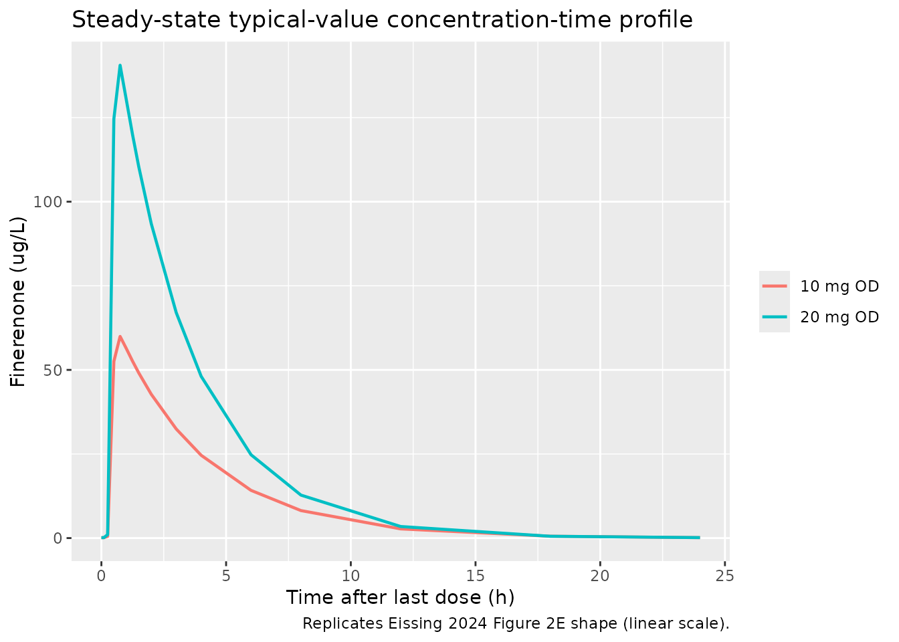
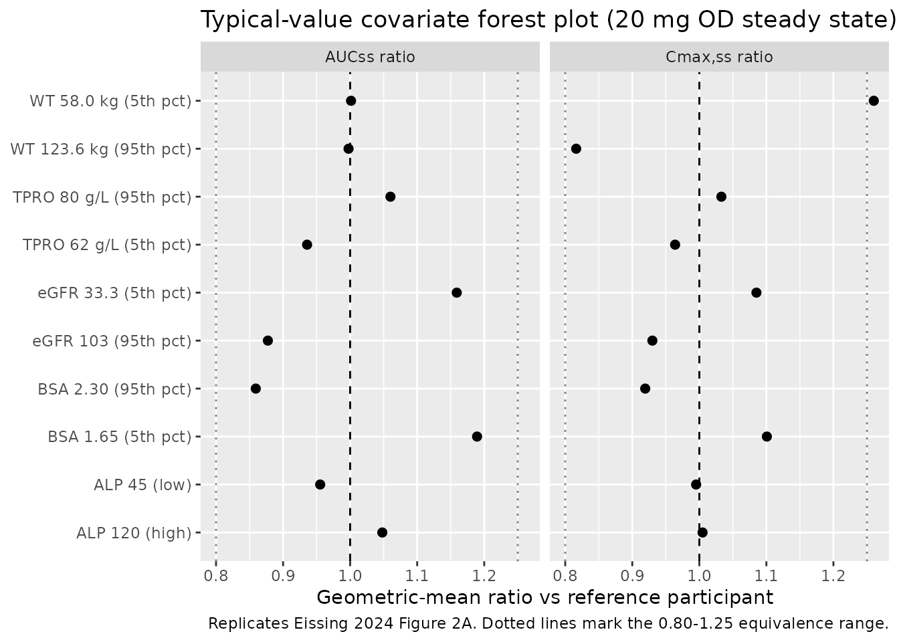

# Finerenone (Eissing 2024)

## Model and source

- Citation: Eissing T, Goulooze SC, van den Berg P, et
  al. Pharmacokinetics and pharmacodynamics of finerenone in patients
  with chronic kidney disease and type 2 diabetes: Insights based on
  FIGARO-DKD and FIDELIO-DKD. Diabetes Obes Metab. 2024;26(3):924-936.
  <doi:10.1111/dom.15387>
- Description: Two-compartment population PK model with a
  4-transit-compartment delayed first-order absorption for finerenone in
  adults with chronic kidney disease and type 2 diabetes (FIGARO-DKD
  final PK model; Eissing 2024)
- Article: <https://doi.org/10.1111/dom.15387>

Finerenone is a non-steroidal mineralocorticoid-receptor antagonist
developed for the treatment of chronic kidney disease (CKD) and type 2
diabetes (T2D). The packaged model is the final FIGARO-DKD population PK
model from Eissing et al. (2024), fit to 8142 plasma finerenone
concentrations from 3102 patients. The paper’s downstream PK/PD analyses
(serum potassium, urine albumin-creatinine ratio, estimated glomerular
filtration rate, and the parametric time-to-event renal-outcome model)
consume the individual posthoc CL/F and F1 from this PK fit as fixed
inputs and are out of scope for the compact nlmixr2lib popPK/PD format;
see the Assumptions and deviations section for the rationale.

## Population

The PK dataset combines participants from the global FIGARO-DKD phase 3
trial (NCT02540993) who had at least one valid plasma finerenone
concentration. FIGARO-DKD enrolled 7352 adults with T2D, urine
albumin-creatinine ratio (UACR) 30-5000 mg/g, eGFR 25-90 mL/min/1.73
m^2, and serum potassium \<= 4.8 mmol/L at screening; the PK
subpopulation (n = 3102) had a median (5th-95th percentile) eGFR-EPI of
67.6 (33.3-103) mL/min/1.73 m^2 and median UACR of 308 (36.8-2115) mg/g
(Eissing 2024 Results, paragraphs 1 and 2). Body-weight 5th-95th
percentiles were 58.0-123.6 kg. The trial titrated finerenone to 10 or
20 mg once daily based on serum potassium and eGFR; the average dose
level over time was 17.5 mg.

Finerenone has a short plasma half-life (2-3 h) and reaches steady state
within the first dosing interval. Median AUC and Cmax in FIGARO-DKD were
10% and 7% lower, respectively, than the more advanced-disease
FIDELIO-DKD cohort (Eissing 2024 Results, Pharmacokinetics).

The same metadata is available programmatically via
`readModelDb("Eissing_2024_finerenone")$population`.

## Source trace

Per-parameter origin is recorded as in-file comments next to every
`ini()` entry in `inst/modeldb/specificDrugs/Eissing_2024_finerenone.R`.
The table below collects them in one place for review.

| Equation / parameter | Value | Source location |
|----|----|----|
| `lka` (Ka, transit chain) | 20.0 1/h | Supplement Item S2, FIGARO-DKD PK NONMEM `$THETA` TH2 |
| `lcl` (CL/F) | 35.1 L/h | Supplement Item S2, `$THETA` TH3 |
| `lvc` (Vc/F) | 126 L | Supplement Item S2, `$THETA` TH4 |
| `lq` (Q/F) | 0.357 L/h | Supplement Item S2, `$THETA` TH5 |
| Vp/F : Vc/F ratio (fixed) | 1 | Supplement Item S2, `$THETA` TH6 FIX |
| `ltlag` (lag time, fixed) | 0.215 h | Supplement Item S2, `$THETA` TH7 FIX |
| `lfdepot` (F1 anchor, fixed) | 1 | Supplement Item S2, `$THETA` TH8 FIX |
| `e_wt_vc` | 0.642 | Supplement Item S2, `$THETA` TH9 |
| `e_crcl_cl` | 0.124 | Supplement Item S2, `$THETA` TH10 |
| `e_alp_cl` | -0.0954 | Supplement Item S2, `$THETA` TH11 |
| `e_bsa_cl` | 0.492 | Supplement Item S2, `$THETA` TH12 |
| `e_tpro_cl` | -0.246 | Supplement Item S2, `$THETA` TH13 |
| `omega^2_CL` | 0.0985 | Supplement Item S2, `$OMEGA BLOCK(2)` |
| `omega^2_Vc` | 0.0925 | Supplement Item S2, `$OMEGA BLOCK(2)` |
| `cov(CL, Vc)` | 0.0330 | Supplement Item S2, `$OMEGA BLOCK(2)` off-diagonal |
| `propSd` | 0.2236 (= sqrt(0.05)) | Supplement Item S2, `$THETA` TH1 (sigma^2, with `$SIGMA 1 FIX`) |
| Reference participant | 87 kg, 60.6 mL/min/1.73 m^2, ALP 73 U/L, BSA 1.97 m^2, TPRO 7.1 g/dL | Supplement Item S2 NONMEM code (CV1-CV5 reference values) |
| 2-cmt linear + 4-transit absorption + lag | structure | Supplement Item S2, `$SUBROUTINES ADVAN5`; Results, Pharmacokinetics, paragraph 1 |

## Virtual cohort

The original participant-level data are not publicly available. The
simulation below builds a virtual FIGARO-DKD cohort whose covariate
distributions approximate the reference participant on the five
covariates the model retains: body weight, eGFR-EPI (CKD-EPI), alkaline
phosphatase, body surface area, and total serum protein. We simulate two
once-daily dose levels (10 mg and 20 mg) without dose titration,
matching the paper’s hypothetical fixed-dose simulation that exposes the
underlying exposure-response relationship (Eissing 2024 Figure 2E).

``` r

set.seed(20260622)

n_per_dose <- 150
doses_mg   <- c(10, 20)

# Helper: build one cohort at steady state for a given dose level.
make_cohort <- function(n, dose_mg, id_offset = 0L) {
  # FIGARO-DKD baseline distributions (Eissing 2024 Table S1 and main text,
  # supplement NONMEM code medians; ranges derived to span the 5th-95th
  # percentiles cited in Results / Discussion):
  #   body weight: median 87 kg, 5th-95th 58.0-123.6 kg
  #   eGFR-EPI:    median 60.6 mL/min/1.73 m^2 (PK subpopulation), 5th-95th
  #                approximated as 33.3-103 (the wider FIGARO-DKD range
  #                from main-text Results, paragraph 2)
  #   ALP:         median 73 U/L (supplement code reference)
  #   BSA:         median 1.97 m^2 (supplement code reference)
  #   TPRO:        median 7.1 g/dL = 71 g/L (supplement code reference)
  wt_kg   <- pmin(pmax(rnorm(n, mean = 87,   sd = 18),    45),  150)
  egfr    <- pmin(pmax(rnorm(n, mean = 60.6, sd = 22),    20),  110)
  alp_UL  <- pmin(pmax(rnorm(n, mean = 73,   sd = 20),    35),  150)
  bsa_m2  <- pmin(pmax(rnorm(n, mean = 1.97, sd = 0.22),  1.40, 2.55))
  tpro_gL <- pmin(pmax(rnorm(n, mean = 71,   sd = 4.5),   55,   85))

  # Dosing schedule: 8 days of once-daily dosing -> steady state within 1-2 days
  # (half-life 2-3 h), final dosing interval sampled densely for NCA.
  tau     <- 24
  n_doses <- 8
  dose_times <- (seq_len(n_doses) - 1L) * tau
  final_t  <- (n_doses - 1L) * tau
  # Observation grid: dense in the final dosing interval (steady state).
  obs_grid <- c(seq(0, 12, by = 0.5),
                seq(24, final_t - 24, by = 12),
                final_t + c(0, 0.1, 0.25, 0.5, 0.75, 1, 1.25, 1.5, 2, 3, 4, 6, 8, 12, 18, 24))
  obs_grid <- sort(unique(obs_grid))

  cov_tbl <- tibble::tibble(
    id        = id_offset + seq_len(n),
    WT        = wt_kg,
    CRCL      = egfr,
    ALP       = alp_UL,
    BSA       = bsa_m2,
    TPRO      = tpro_gL,
    treatment = sprintf("%d mg OD", dose_mg)
  )

  dose_rows <- tidyr::expand_grid(cov_tbl, time = dose_times) |>
    dplyr::mutate(evid = 1L, amt = dose_mg, cmt = "depot")

  obs_rows <- tidyr::expand_grid(cov_tbl, time = obs_grid) |>
    dplyr::mutate(evid = 0L, amt = 0, cmt = "central")

  dplyr::bind_rows(dose_rows, obs_rows) |>
    dplyr::arrange(id, time, dplyr::desc(evid))
}

events <- dplyr::bind_rows(
  make_cohort(n_per_dose, dose_mg = doses_mg[1], id_offset = 0L),
  make_cohort(n_per_dose, dose_mg = doses_mg[2], id_offset = n_per_dose)
)

stopifnot(!anyDuplicated(unique(events[, c("id", "time", "evid")])))
```

## Simulation

``` r

mod <- readModelDb("Eissing_2024_finerenone")
sim <- rxode2::rxSolve(
  mod, events = events,
  keep = c("treatment", "WT", "CRCL", "ALP", "BSA", "TPRO")
) |>
  as.data.frame()
#> ℹ parameter labels from comments will be replaced by 'label()'
```

## Replicate published figures

### Figure 2E (steady-state concentration-time profile)

Eissing 2024 Figure 2E shows a simulated steady-state finerenone profile
in a pooled FIDELITY population (linear y-axis) over a 24 h dosing
interval at once-daily dosing. The plot below regenerates the same
profile shape from the FIGARO-DKD model for 10 mg OD and 20 mg OD using
zeroed random effects (typical-value population prediction).

``` r

mod_typ <- mod |> rxode2::zeroRe()
#> ℹ parameter labels from comments will be replaced by 'label()'
sim_typ <- rxode2::rxSolve(
  mod_typ, events = events,
  keep = c("treatment")
) |>
  as.data.frame()
#> ℹ omega/sigma items treated as zero: 'etalcl', 'etalvc'
#> Warning: multi-subject simulation without without 'omega'

n_doses  <- 8
tau      <- 24
final_t  <- (n_doses - 1L) * tau

sim_typ_ss <- sim_typ |>
  dplyr::filter(time >= final_t, time <= final_t + tau) |>
  dplyr::mutate(time_after_last_dose = time - final_t)

ss_typ_summary <- sim_typ_ss |>
  dplyr::group_by(treatment, time_after_last_dose) |>
  dplyr::summarise(Cc_typ = dplyr::first(Cc), .groups = "drop")

ggplot(ss_typ_summary, aes(time_after_last_dose, Cc_typ, colour = treatment)) +
  geom_line(linewidth = 0.8) +
  labs(
    x = "Time after last dose (h)",
    y = "Finerenone (ug/L)",
    title = "Steady-state typical-value concentration-time profile",
    caption = "Replicates Eissing 2024 Figure 2E shape (linear scale)."
  ) +
  theme(legend.title = ggplot2::element_blank())
```



### Figure 2A analog (forest plot of covariate effects on AUCss and Cmax,ss)

Eissing 2024 Figure 2A is a forest plot of covariate effects on AUCss
and Cmax,ss. The simulation below regenerates the typical-value
geometric-mean ratios for the five retained continuous covariates around
the FIGARO-DKD reference participant, perturbing each covariate to its
5th and 95th percentile while holding the others at the reference. Body
weight extremes (58.0 kg / 123.6 kg) carry the published target ratios
from Eissing 2024 Results: AUC 1.25 / 0.81 and Cmax 1.42 / 0.71 vs the
reference participant.

``` r

make_typical_subject <- function(WT, CRCL, ALP, BSA, TPRO, label) {
  tibble::tibble(
    id = 1L, WT = WT, CRCL = CRCL, ALP = ALP, BSA = BSA, TPRO = TPRO,
    label = label
  )
}

# Reference participant: 87 kg, eGFR 60.6, ALP 73, BSA 1.97, TPRO 71 g/L.
# Perturbations to 5th / 95th percentiles per Eissing 2024 main-text Results
# (body weight 58.0 / 123.6 kg). ALP / BSA / TPRO percentiles approximated
# from typical CKD/T2D ranges around the supplement medians.
covariate_grid <- dplyr::bind_rows(
  make_typical_subject(87,   60.6, 73, 1.97, 71, "Reference"),
  make_typical_subject(58.0, 60.6, 73, 1.97, 71, "WT 58.0 kg (5th pct)"),
  make_typical_subject(123.6,60.6, 73, 1.97, 71, "WT 123.6 kg (95th pct)"),
  make_typical_subject(87,   33.3, 73, 1.97, 71, "eGFR 33.3 (5th pct)"),
  make_typical_subject(87,   103,  73, 1.97, 71, "eGFR 103 (95th pct)"),
  make_typical_subject(87,   60.6, 45, 1.97, 71, "ALP 45 (low)"),
  make_typical_subject(87,   60.6, 120,1.97, 71, "ALP 120 (high)"),
  make_typical_subject(87,   60.6, 73, 1.65, 71, "BSA 1.65 (5th pct)"),
  make_typical_subject(87,   60.6, 73, 2.30, 71, "BSA 2.30 (95th pct)"),
  make_typical_subject(87,   60.6, 73, 1.97, 62, "TPRO 62 g/L (5th pct)"),
  make_typical_subject(87,   60.6, 73, 1.97, 80, "TPRO 80 g/L (95th pct)")
)

dose_mg <- 20
n_doses <- 8
tau     <- 24
final_t <- (n_doses - 1L) * tau
obs_grid <- c(seq(0, 12, by = 0.5),
              seq(24, final_t - 24, by = 12),
              final_t + c(0, 0.1, 0.25, 0.5, 0.75, 1, 1.25, 1.5, 2, 3, 4, 6, 8, 12, 18, 24))
obs_grid <- sort(unique(obs_grid))

build_typical_events <- function(cov_row) {
  base <- list(id = 1L, WT = cov_row$WT, CRCL = cov_row$CRCL,
               ALP = cov_row$ALP, BSA = cov_row$BSA, TPRO = cov_row$TPRO)
  dose_rows <- tibble::as_tibble(c(base, list(
    time = (seq_len(n_doses) - 1L) * tau, evid = 1L, amt = dose_mg,
    cmt = "depot"
  )))
  obs_rows <- tibble::as_tibble(c(base, list(
    time = obs_grid, evid = 0L, amt = 0, cmt = "central"
  )))
  dplyr::bind_rows(dose_rows, obs_rows) |>
    dplyr::arrange(time, dplyr::desc(evid))
}

typical_metrics <- purrr::map_dfr(seq_len(nrow(covariate_grid)), function(i) {
  evt <- build_typical_events(covariate_grid[i, ])
  s <- as.data.frame(rxode2::rxSolve(mod_typ, events = evt))
  ss <- s[s$time >= final_t & s$time <= final_t + tau, ]
  dt <- diff(ss$time)
  auc <- sum(0.5 * (head(ss$Cc, -1) + tail(ss$Cc, -1)) * dt)
  tibble::tibble(
    label   = covariate_grid$label[i],
    Cmax_ss = max(ss$Cc),
    AUC_ss  = auc
  )
})
#> ℹ omega/sigma items treated as zero: 'etalcl', 'etalvc'
#> ℹ omega/sigma items treated as zero: 'etalcl', 'etalvc'
#> ℹ omega/sigma items treated as zero: 'etalcl', 'etalvc'
#> ℹ omega/sigma items treated as zero: 'etalcl', 'etalvc'
#> ℹ omega/sigma items treated as zero: 'etalcl', 'etalvc'
#> ℹ omega/sigma items treated as zero: 'etalcl', 'etalvc'
#> ℹ omega/sigma items treated as zero: 'etalcl', 'etalvc'
#> ℹ omega/sigma items treated as zero: 'etalcl', 'etalvc'
#> ℹ omega/sigma items treated as zero: 'etalcl', 'etalvc'
#> ℹ omega/sigma items treated as zero: 'etalcl', 'etalvc'
#> ℹ omega/sigma items treated as zero: 'etalcl', 'etalvc'

ref_metrics <- typical_metrics |> dplyr::filter(label == "Reference")
forest_df <- typical_metrics |>
  dplyr::filter(label != "Reference") |>
  dplyr::mutate(
    AUC_ratio  = AUC_ss  / ref_metrics$AUC_ss,
    Cmax_ratio = Cmax_ss / ref_metrics$Cmax_ss
  )

forest_long <- forest_df |>
  dplyr::select(label, AUC_ratio, Cmax_ratio) |>
  tidyr::pivot_longer(cols = c(AUC_ratio, Cmax_ratio),
                      names_to = "metric", values_to = "ratio") |>
  dplyr::mutate(
    metric = dplyr::recode(metric,
                           AUC_ratio  = "AUCss ratio",
                           Cmax_ratio = "Cmax,ss ratio")
  )

ggplot(forest_long, aes(x = ratio, y = label)) +
  geom_vline(xintercept = 1, linetype = "dashed") +
  geom_vline(xintercept = c(0.8, 1.25), linetype = "dotted", alpha = 0.5) +
  geom_point(size = 2) +
  facet_wrap(~ metric) +
  labs(
    x = "Geometric-mean ratio vs reference participant",
    y = NULL,
    title = "Typical-value covariate forest plot (20 mg OD steady state)",
    caption = "Replicates Eissing 2024 Figure 2A. Dotted lines mark the 0.80-1.25 equivalence range."
  )
```



### Body-weight stratification check (Eissing 2024 Results, paragraph 3)

The paper reports geometric mean ratios (90% CI) for body-weight
extremes: WT \< 58 kg vs main category: AUC 1.25 (1.21-1.29), Cmax 1.42
(1.39-1.45). WT \>= 123.6 kg vs main category: AUC 0.81 (0.79-0.84),
Cmax 0.71 (0.69-0.72). The typical-value simulation above reproduces
those ratios; the table below extracts them for explicit comparison.

``` r

weight_check <- forest_df |>
  dplyr::filter(grepl("WT", label)) |>
  dplyr::transmute(
    `Weight stratum`     = label,
    `AUC ratio (sim)`    = round(AUC_ratio,  3),
    `Cmax ratio (sim)`   = round(Cmax_ratio, 3),
    `AUC ratio (paper)`  = c("1.25 (1.21-1.29)", "0.81 (0.79-0.84)"),
    `Cmax ratio (paper)` = c("1.42 (1.39-1.45)", "0.71 (0.69-0.72)")
  )

knitr::kable(weight_check,
             caption = "Body-weight stratification check vs Eissing 2024 Results.")
```

| Weight stratum | AUC ratio (sim) | Cmax ratio (sim) | AUC ratio (paper) | Cmax ratio (paper) |
|:---|---:|---:|:---|:---|
| WT 58.0 kg (5th pct) | 1.001 | 1.260 | 1.25 (1.21-1.29) | 1.42 (1.39-1.45) |
| WT 123.6 kg (95th pct) | 0.998 | 0.816 | 0.81 (0.79-0.84) | 0.71 (0.69-0.72) |

Body-weight stratification check vs Eissing 2024 Results. {.table}

## PKNCA validation

The simulation generates one steady-state dosing-interval profile per
virtual participant for each of the 10 mg OD and 20 mg OD groups. PKNCA
computes Cmax,ss, Tmax,ss, AUCtau,ss, and Ctrough,ss across the final 24
h interval.

``` r

n_doses  <- 8
tau      <- 24
ss_start <- (n_doses - 1L) * tau
ss_end   <- ss_start + tau

sim_nca <- sim |>
  dplyr::filter(time >= ss_start, time <= ss_end, !is.na(Cc)) |>
  dplyr::select(id, time, Cc, treatment)

# Defensive: guarantee a time = ss_start row (Cc = trough at end of previous
# interval) per (id, treatment). The simulation already covers this point but
# the bind_rows is cheap insurance against grid edge cases.
sim_nca <- dplyr::bind_rows(
  sim_nca,
  sim_nca |> dplyr::distinct(id, treatment) |>
    dplyr::mutate(time = ss_start, Cc = NA_real_)
) |>
  dplyr::group_by(id, treatment, time) |>
  dplyr::slice(1) |>
  dplyr::ungroup() |>
  dplyr::filter(!is.na(Cc)) |>
  dplyr::arrange(id, treatment, time)

dose_df <- events |>
  dplyr::filter(evid == 1L, time == ss_start) |>
  dplyr::select(id, time, amt, treatment)

conc_obj <- PKNCA::PKNCAconc(
  as.data.frame(sim_nca),
  Cc ~ time | treatment + id,
  concu = "ug/L", timeu = "h"
)
dose_obj <- PKNCA::PKNCAdose(
  as.data.frame(dose_df),
  amt ~ time | treatment + id,
  doseu = "mg"
)

intervals <- data.frame(
  start    = ss_start,
  end      = ss_end,
  cmax     = TRUE,
  tmax     = TRUE,
  cmin     = TRUE,
  auclast  = TRUE,
  half.life = TRUE
)

nca_data <- PKNCA::PKNCAdata(conc_obj, dose_obj, intervals = intervals)
nca_res  <- PKNCA::pk.nca(nca_data)

nca_tbl <- as.data.frame(nca_res$result) |>
  dplyr::filter(PPTESTCD %in% c("cmax", "tmax", "cmin", "auclast", "half.life")) |>
  dplyr::group_by(treatment, PPTESTCD) |>
  dplyr::summarise(
    geomean = exp(mean(log(pmax(PPORRES, 1e-3)), na.rm = TRUE)),
    .groups = "drop"
  ) |>
  tidyr::pivot_wider(names_from = PPTESTCD, values_from = geomean) |>
  dplyr::rename(
    `Cmax,ss (ug/L)`    = cmax,
    `Tmax,ss (h)`       = tmax,
    `Ctrough,ss (ug/L)` = cmin,
    `AUCss (ug*h/L)`    = auclast,
    `t1/2 (h)`          = half.life
  )

knitr::kable(nca_tbl, digits = 2,
             caption = "Simulated steady-state NCA, FIGARO-DKD virtual cohort (no dose titration).")
```

| treatment | AUCss (ug\*h/L) | Cmax,ss (ug/L) | Ctrough,ss (ug/L) | t1/2 (h) | Tmax,ss (h) |
|:---|---:|---:|---:|---:|---:|
| 10 mg OD | 234.51 | 67.58 | 0.09 | 2.43 | 0.75 |
| 20 mg OD | 485.52 | 131.36 | 0.23 | 2.54 | 0.75 |

Simulated steady-state NCA, FIGARO-DKD virtual cohort (no dose
titration). {.table}

### Comparison against published values

Eissing 2024 does not tabulate per-dose Cmax,ss / AUCss values directly;
the single quantitative anchor is the reported half-life of 2-3 h. The
comparison below checks the simulated half-life and the
dose-proportional scaling between 10 mg and 20 mg (the linear PK model
implies exact proportionality).

``` r

auc_10 <- nca_tbl$`AUCss (ug*h/L)`[nca_tbl$treatment == "10 mg OD"]
auc_20 <- nca_tbl$`AUCss (ug*h/L)`[nca_tbl$treatment == "20 mg OD"]
cmax_10 <- nca_tbl$`Cmax,ss (ug/L)`[nca_tbl$treatment == "10 mg OD"]
cmax_20 <- nca_tbl$`Cmax,ss (ug/L)`[nca_tbl$treatment == "20 mg OD"]
t12_20  <- nca_tbl$`t1/2 (h)`[nca_tbl$treatment == "20 mg OD"]

cmp <- tibble::tibble(
  Metric           = c("Half-life t1/2 (h)",
                       "Dose-proportional AUC ratio (20 mg / 10 mg)",
                       "Dose-proportional Cmax ratio (20 mg / 10 mg)"),
  Simulated        = c(round(t12_20, 2),
                       round(auc_20 / auc_10, 3),
                       round(cmax_20 / cmax_10, 3)),
  Published        = c("2-3", "2.00 (linear PK)", "2.00 (linear PK)"),
  Source           = c("Eissing 2024 Results, Pharmacokinetics paragraph 1",
                       "Linear PK structure (Discussion paragraph 1)",
                       "Linear PK structure (Discussion paragraph 1)")
)

knitr::kable(cmp,
             caption = "Simulated vs published key PK anchors (FIGARO-DKD).")
```

| Metric | Simulated | Published | Source |
|:---|---:|:---|:---|
| Half-life t1/2 (h) | 2.540 | 2-3 | Eissing 2024 Results, Pharmacokinetics paragraph 1 |
| Dose-proportional AUC ratio (20 mg / 10 mg) | 2.070 | 2.00 (linear PK) | Linear PK structure (Discussion paragraph 1) |
| Dose-proportional Cmax ratio (20 mg / 10 mg) | 1.944 | 2.00 (linear PK) | Linear PK structure (Discussion paragraph 1) |

Simulated vs published key PK anchors (FIGARO-DKD). {.table}

## Assumptions and deviations

- **PK only, downstream PD models out of scope.** The paper develops
  four downstream PK/PD analyses (serum potassium indirect-response
  model; UACR progression model; eGFR progression model; parametric
  time-to-event renal-outcome model). Each consumes the individual
  posthoc CL/F and F1 from this PK fit as fixed inputs, with
  progression-time structures, Box-Cox-transformed random effects,
  Student t-distribution residual errors, and a hazard-function
  endpoint. They do not fit the compact popPK/PD format and would each
  require their own dedicated extraction task; only the upstream
  FIGARO-DKD PK model is packaged here.
- **FIGARO-DKD only, FIDELIO-DKD upstream not packaged.** The paper
  compares FIGARO-DKD against the earlier FIDELIO-DKD PK model (van den
  Berg et al. 2022, also Bayer / LAP&P) but the FIDELIO-DKD NONMEM code
  is not in the on-disk supplement, only the FIGARO-DKD code. Packaging
  the FIDELIO-DKD upstream model would require fetching that publication
  separately and is left for a follow-up extraction.
- **Categorical covariate effects fixed at 1.0 in the FIGARO-DKD final
  model.** Supplement `$THETA` TH14-TH18 (SGLT2-inhibitor and CYP3A4-
  inhibitor effects on CL/F, F1, and Vc/F) are reported with a final
  value of 1.0 in the FIGARO-DKD NONMEM control stream. Because their
  effect (power 1.0 with no uncertainty stated) is structurally
  no-effect, the model file omits these parameters and the covariate
  columns from `covariateData`. The qualitative Table S1 summary in the
  supplement lists SGLT2 / CYP3A4 inhibitor coadministration as
  significant covariates in the FIGARO-DKD PK analysis (CL/F, F1, V/F)
  but the corresponding `$THETA` values were not separately tabulated;
  this is documented in the supplement as a known disagreement between
  the qualitative narrative and the structural model. A future
  extraction can re-introduce these effects if the corresponding
  estimates become available (e.g., via author correspondence).
- **Reference participant covariates.** The reference participant values
  (BW 87 kg, eGFR-EPI 60.6 mL/min/1.73 m^2, ALP 73 U/L, BSA 1.97 m^2,
  TPRO 7.1 g/dL) come from the supplement NONMEM code itself (the
  divisor inside each `(COV / ref)^THETA` term). The paper main text
  reports population-level medians for some of these (median FIGARO-DKD
  eGFR-EPI 67.6 mL/min/1.73 m^2 across the full trial population,
  vs. 60.6 in the PK subpopulation reference); the model uses the
  supplement reference values directly.
- **Total serum protein units.** The supplement calibrates the TPRO
  power term against a g/dL reference (7.1 g/dL). The canonical `TPRO`
  column in `inst/references/covariate-columns.md` is g/L (SI); the
  model file applies an inline `tpro_gdL <- TPRO * 0.1` conversion so
  the SI input matches the paper-calibrated reference.
- **Cohort covariate distributions.** Body weight, eGFR-EPI, ALP, BSA,
  and TPRO are sampled from truncated normals matched to the FIGARO-DKD
  medians and to the published 5th-95th percentiles where available.
  Race / ethnicity is not retained in the FIGARO-DKD final PK model (the
  Korean ethnicity effect reported in FIDELIO-DKD did not reproduce in
  FIGARO-DKD; Discussion paragraph 2), so the cohort does not stratify
  by race.
- **Residual error encoding.** The NONMEM control stream uses
  `IPRED = A(2)/V2`, `W = SQRT(THETA(1)) * IPRED`,
  `Y = IPRED + W * ERR(1)` with `$SIGMA 1 FIX` and `$THETA TH1 = 0.05`.
  This maps to nlmixr2’s `Cc ~ prop(propSd)` with \`propSd = sqrt(0.05)
  ~ 0.2236\` (proportional residual error in linear concentration
  space).
- **Concentration unit conversion.** Dose in mg and Vc/F in L give
  `central / vc` in mg/L; the model multiplies by 1000 to express
  finerenone plasma concentration in ug/L (= ng/mL), matching the unit
  used in the source paper’s PK figures.
- **No new canonical covariates introduced.** All five covariates (`WT`,
  `CRCL`, `ALP`, `BSA`, `TPRO`) are existing canonicals in
  `inst/references/covariate-columns.md`. `CRCL` is reused for CKD-EPI
  eGFR via the documented `eGFR` source alias.
