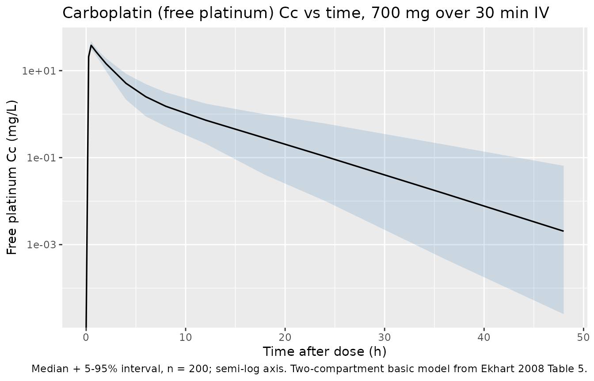
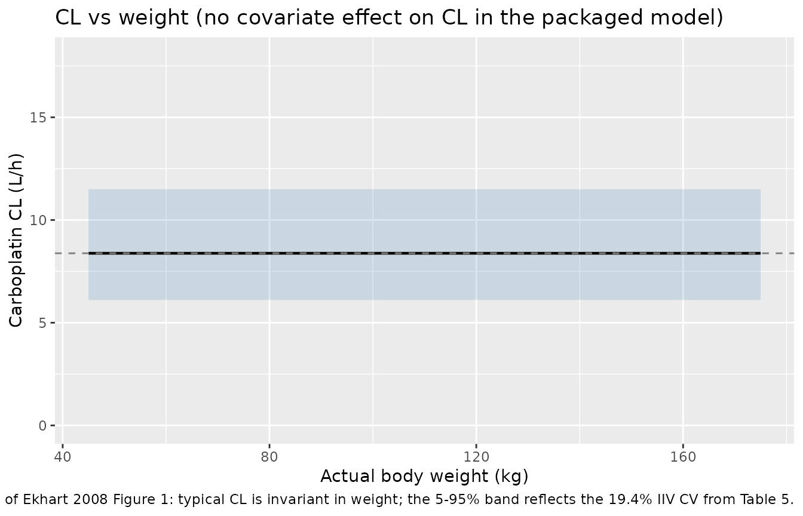

# Carboplatin (Ekhart 2008)

## Model and source

- Citation: Ekhart C, Rodenhuis S, Schellens JHM, Beijnen JH, Huitema
  ADR. Carboplatin dosing in overweight and obese patients with normal
  renal function, does weight matter? Cancer Chemother Pharmacol.
  2009;64(1):115-122. <doi:10.1007/s00280-008-0856-x>
- Description: Two-compartment population PK model for free
  (ultrafilterable) carboplatin in adult cancer patients (Ekhart 2008)
- Article: <https://doi.org/10.1007/s00280-008-0856-x>

## Population

Ekhart 2008 pooled free-platinum (ultrafilterable carboplatin) data from
240 adult cancer patients (380 courses, 4,478 plasma samples) drawn from
seven previously published carboplatin-containing chemotherapy protocols
at the Netherlands Cancer Institute / Antoni van Leeuwenhoek Hospital
and Slotervaart Hospital, Amsterdam. The cohort spans underweight to
obese body habitus, with the BMI distribution underweight (3%) / normal
(61%) / overweight (30%) / obese (6%); see Table 1 (overall) and Table 2
(per BMI subpopulation) of the source. Median (range) baseline
characteristics from Table 1: age 47 (16-75) years, weight 70 (46-170)
kg, height 171 (153-210) cm, BMI 24 (16-46) kg/m^2, BSA 1.81 (1.49-2.94)
m^2, female 161/240 (67%), serum creatinine 57 (18-124) uM,
Cockcroft-Gault creatinine clearance 126 (55-451) mL/min, albumin 42
(18-52) g/L. Renal function was required to be normal across the
contributing studies.

Carboplatin was administered as 30 min to 1 h IV infusions in
combination chemotherapy regimens (paclitaxel-carboplatin for non-small
cell lung cancer and ovarian cancer; high-dose cyclophosphamide-
thiotepa-carboplatin (CTC / tCTC / miniCTC) for high-risk and metastatic
breast cancer, refractory germ cell cancer, metastatic ovarian cancer;
Table 1). Doses spanned 267-600 mg/m^2/day in mg/m^2 schedules and
target AUC 6-20 mg.min/mL in Calvert-formula-dosed schedules.

The same information is available programmatically:
`readModelDb("Ekhart_2008_carboplatin")$population` after the model is
loaded.

## Source trace

Per-parameter origin (also recorded as in-file comments next to each
[`ini()`](https://nlmixr2.github.io/rxode2/reference/ini.html) entry of
`inst/modeldb/specificDrugs/Ekhart_2008_carboplatin.R`):

| Equation / parameter | Value | Source location |
|----|----|----|
| `lcl` | log(8.38) | Ekhart 2008 Table 5, CL row (8.38 L/h, RSE 1.41%) |
| `lvc` | log(15.4) | Ekhart 2008 Table 5, V row (15.4 L, RSE 1.79%) |
| `lk12` | log(0.135) | Ekhart 2008 Table 5, k12 row (0.135 1/h, RSE 7.85%) |
| `lk21` | log(0.215) | Ekhart 2008 Table 5, k21 row (0.215 1/h, RSE 5.91%) |
| `etalcl ~ 0.0369` | log(1 + 0.194^2) | Ekhart 2008 Table 5, IIV CL = 19.4% CV (RSE 8.34%) |
| `etalvc ~ 0.0208` | log(1 + 0.145^2) | Ekhart 2008 Table 5, IIV V = 14.5% CV (RSE 11.7%) |
| `etalk12 ~ 0.2089` | log(1 + 0.482^2) | Ekhart 2008 Table 5, IIV k12 = 48.2% CV (RSE 18.9%) |
| `etalk21 ~ 0.1740` | log(1 + 0.436^2) | Ekhart 2008 Table 5, IIV k21 = 43.6% CV (RSE 30.8%) |
| `propSd` | 0.197 | Ekhart 2008 Table 5, proportional residual error 19.7% (RSE 5.69%) |
| `d/dt(central)`, `d/dt(peripheral1)` | n/a | Ekhart 2008 Methods 2.3 (“two-compartment model with first-order elimination from the central compartment”) |
| `Cc <- central / vc` | n/a | Standard linear-CL parameterisation; dose mg, volume L -\> mg/L |
| `Cc ~ prop(propSd)` | n/a | Ekhart 2008 Methods 2.3 (“residual variability were modelled using a proportional error model” after logarithmic data transformation) |

## Virtual cohort

Original observed data are not publicly available. The cohort below
reproduces the paper’s recommended flat carboplatin dose for a target
AUC of 5 mg.min/mL (700 mg, equivalent to AUC = target \* population CL
= 5 \* 140 = 700 mg per the paper’s Conclusion) administered as a 30
minute IV infusion at the cohort-median weight of 70 kg.

``` r

set.seed(20260510L)

n_subj      <- 200L
dose_mg     <- 700        # Ekhart 2008 Conclusion: target AUC 5 mg.min/mL * 140 mL/min = 700 mg
infus_h     <- 0.5        # 30 min infusion (typical paclitaxel-carboplatin schedule)
sample_h    <- c(0, 0.25, 0.5, 0.75, 1, 1.5, 2, 4, 6, 8, 12, 18, 24, 36, 48)

ids <- seq_len(n_subj)

dose_rows <- tibble::tibble(
  id     = ids,
  time   = 0,
  amt    = dose_mg,
  evid   = 1L,
  cmt    = "central",
  rate   = dose_mg / infus_h
)

obs_rows <- tibble::tibble(
  id   = rep(ids, each = length(sample_h)),
  time = rep(sample_h, times = length(ids)),
  amt  = 0,
  evid = 0L,
  cmt  = NA_character_,
  rate = 0
)

events <- dplyr::bind_rows(dose_rows, obs_rows) |>
  dplyr::mutate(treatment = "700 mg over 30 min IV") |>
  dplyr::arrange(id, time, dplyr::desc(evid))

stopifnot(!anyDuplicated(unique(events[, c("id", "time", "evid")])))
```

## Simulation

``` r

mod <- rxode2::rxode2(readModelDb("Ekhart_2008_carboplatin"))
#> ℹ parameter labels from comments will be replaced by 'label()'

sim <- rxode2::rxSolve(
  mod,
  events = events,
  keep   = c("treatment")
) |>
  as.data.frame()
```

For the deterministic typical-value curve (no IIV, no residual error):

``` r

mod_typical <- mod |> rxode2::zeroRe()
sim_typical <- rxode2::rxSolve(
  mod_typical,
  events = events,
  keep   = c("treatment")
) |>
  as.data.frame()
#> ℹ omega/sigma items treated as zero: 'etalcl', 'etalvc', 'etalk12', 'etalk21'
#> Warning: multi-subject simulation without without 'omega'
```

## Concentration-time profile

The paper does not show a free-platinum concentration-time figure, but a
2-compartment profile with first-order elimination is the canonical
shape Ekhart 2008 Methods 2.3 describes. The figure below shows the
typical-value curve plus the 5-95% interval over the simulated cohort.

``` r

sim_quantiles <- sim |>
  dplyr::filter(time >= 0, !is.na(Cc)) |>
  dplyr::group_by(time) |>
  dplyr::summarise(
    Q05 = stats::quantile(Cc, 0.05, na.rm = TRUE),
    Q50 = stats::quantile(Cc, 0.50, na.rm = TRUE),
    Q95 = stats::quantile(Cc, 0.95, na.rm = TRUE),
    .groups = "drop"
  )

ggplot(sim_quantiles, aes(time, Q50)) +
  geom_ribbon(aes(ymin = Q05, ymax = Q95), alpha = 0.2, fill = "steelblue") +
  geom_line(linewidth = 0.6) +
  scale_y_log10() +
  labs(
    x = "Time after dose (h)",
    y = "Free platinum Cc (mg/L)",
    title = "Carboplatin (free platinum) Cc vs time, 700 mg over 30 min IV",
    caption = "Median + 5-95% interval, n = 200; semi-log axis. Two-compartment basic model from Ekhart 2008 Table 5."
  )
#> Warning in scale_y_log10(): log-10 transformation introduced infinite values.
#> log-10 transformation introduced infinite values.
#> log-10 transformation introduced infinite values.
#> log-10 transformation introduced infinite values.
```



## Replicate Figure 1: clearance vs weight

Ekhart 2008 Figure 1 plots individual carboplatin clearance vs actual
body weight (and lean body mass) across the 240-patient cohort. The key
finding is that no strong relation between weight and CL is visible.
Because the packaged model carries no weight effect on CL, the
typical-value CL is constant at 8.38 L/h regardless of weight; the plot
below shows that flat typical CL together with the cohort’s IIV range as
5-95% percentiles. This visualises the same conclusion as the paper’s
Figure 1 / Figure 2 (no weight dependence beyond the IIV spread).

``` r

weight_grid <- seq(45, 175, by = 5)
typical_cl  <- exp(log(8.38))
iiv_cv      <- 0.194
cl_quant <- tibble::tibble(
  WT  = weight_grid,
  Q05 = typical_cl * exp(stats::qnorm(0.05) * sqrt(log(1 + iiv_cv^2))),
  Q50 = typical_cl,
  Q95 = typical_cl * exp(stats::qnorm(0.95) * sqrt(log(1 + iiv_cv^2)))
)

ggplot(cl_quant, aes(WT, Q50)) +
  geom_ribbon(aes(ymin = Q05, ymax = Q95), alpha = 0.2, fill = "steelblue") +
  geom_line(linewidth = 0.8) +
  geom_hline(yintercept = typical_cl, linetype = "dashed", colour = "grey50") +
  scale_y_continuous(limits = c(0, 18)) +
  labs(
    x = "Actual body weight (kg)",
    y = "Carboplatin CL (L/h)",
    title = "CL vs weight (no covariate effect on CL in the packaged model)",
    caption = "Replicates the conclusion of Ekhart 2008 Figure 1: typical CL is invariant in weight; the 5-95% band reflects the 19.4% IIV CV from Table 5."
  )
```



## PKNCA validation

NCA on the simulated stochastic cohort (single 700 mg dose):

``` r

pkn_in <- sim |>
  dplyr::filter(time >= 0, !is.na(Cc))

dose_pkn <- events |>
  dplyr::filter(evid == 1L) |>
  dplyr::mutate(treatment = "700 mg over 30 min IV")

conc_obj <- PKNCA::PKNCAconc(
  pkn_in,
  Cc ~ time | treatment + id,
  concu = "mg/L",
  timeu = "hour"
)

dose_obj <- PKNCA::PKNCAdose(
  dose_pkn,
  amt ~ time | treatment + id,
  doseu = "mg",
  route = "intravascular"
)

intervals <- data.frame(
  start       = 0,
  end         = Inf,
  cmax        = TRUE,
  tmax        = TRUE,
  auclast     = TRUE,
  aucinf.obs  = TRUE,
  half.life   = TRUE
)

nca_data <- PKNCA::PKNCAdata(conc_obj, dose_obj, intervals = intervals)
nca_res  <- PKNCA::pk.nca(nca_data)
#>  ■■■■■■■■■■■■■■                    42% |  ETA:  2s

nca_summary <- nca_res$result |>
  dplyr::filter(PPTESTCD %in% c("cmax", "tmax", "auclast", "aucinf.obs", "half.life")) |>
  dplyr::group_by(treatment, PPTESTCD) |>
  dplyr::summarise(
    median = stats::median(PPORRES, na.rm = TRUE),
    p05    = stats::quantile(PPORRES, 0.05, na.rm = TRUE),
    p95    = stats::quantile(PPORRES, 0.95, na.rm = TRUE),
    .groups = "drop"
  )

knitr::kable(
  nca_summary,
  caption = "Simulated free-platinum NCA after a 700 mg / 30 min IV carboplatin dose (n = 200)."
)
```

| treatment             | PPTESTCD   |    median |       p05 |        p95 |
|:----------------------|:-----------|----------:|----------:|-----------:|
| 700 mg over 30 min IV | aucinf.obs | 84.475071 | 65.158306 | 119.583529 |
| 700 mg over 30 min IV | auclast    | 84.450177 | 65.147790 | 119.311742 |
| 700 mg over 30 min IV | cmax       | 38.917020 | 31.602259 |  47.021093 |
| 700 mg over 30 min IV | half.life  |  4.538143 |  2.467776 |   8.480237 |
| 700 mg over 30 min IV | tmax       |  0.500000 |  0.500000 |   0.500000 |

Simulated free-platinum NCA after a 700 mg / 30 min IV carboplatin dose
(n = 200). {.table}

### Comparison against published values

Ekhart 2008 does not report a formal NCA table. The Conclusion states
that a flat 700 mg dose corresponds to a target AUC of 5 mg.min/mL
(equivalently 5 mg.min/mL \* 1000 mL/L / 60 min/h = 83.33 mg.h/L, or 700
mg / 8.38 L/h = 83.53 mg.h/L from typical CL).

The simulated cohort median AUC0-inf below should bracket that value to
within ~1-2% rounding plus the IIV-induced spread.

``` r

typical_auc     <- 700 / 8.38                           # mg.h/L
target_auc_mghL <- 5 * 1000 / 60                        # 5 mg.min/mL -> mg.h/L
sim_auc_median  <- nca_summary |>
  dplyr::filter(PPTESTCD == "aucinf.obs") |>
  dplyr::pull(median)

knitr::kable(
  tibble::tibble(
    quantity = c(
      "Target AUC (paper, 5 mg.min/mL)",
      "Typical AUC = Dose / CL = 700 / 8.38",
      "Simulated cohort median AUC0-inf"
    ),
    value_mg_h_per_L = c(
      target_auc_mghL,
      typical_auc,
      sim_auc_median
    )
  ),
  caption = "AUC reconciliation: paper-target vs typical-value vs simulated cohort median."
)
```

| quantity                             | value_mg_h_per_L |
|:-------------------------------------|-----------------:|
| Target AUC (paper, 5 mg.min/mL)      |         83.33333 |
| Typical AUC = Dose / CL = 700 / 8.38 |         83.53222 |
| Simulated cohort median AUC0-inf     |         84.47507 |

AUC reconciliation: paper-target vs typical-value vs simulated cohort
median. {.table}

The three rows should agree to within ~1-2% (the spread between typical
and simulated reflects the 19.4% IIV on CL plus the 19.7% proportional
residual error). Differences \> 20% would indicate a
parameter-translation error and should not be tuned away.

## Assumptions and deviations

- **Drug name corrected from task metadata.** The task block named the
  drug as “Cancer Chemotherapy and Pharma”, which is the journal
  (“Cancer Chemother Pharmacol”) rather than the drug. The on-disk PDF
  is unambiguously the carboplatin paper (Ekhart et al. 2008, doi
  10.1007/s00280-008-0856-x); per Phase 1 step 2 of the extraction
  skill, the drug field has been corrected to `carboplatin` and the file
  paths renamed to match.
- **No covariate effects in the final model.** Ekhart 2008 fitted six
  candidate covariate models that scaled CL allometrically by ABW, IBW,
  AIBW, the Benezet weight, FFM, or LBM (Table 6). All six produced
  delta-OFV \< 6.63 (the chi^2 0.01 cutoff for 1 df) versus the basic
  model, none significantly reduced the IIV of CL (basic model IIV 19.4%
  vs 18.5-18.8% for the covariate models), and the paper’s conclusion is
  that “the relation between carboplatin clearance and weight is much
  weaker than the theoretical allometric coefficient of 0.75”. The
  packaged model therefore carries no covariate effects and
  `covariateData` is an empty list. Consumers who want to evaluate one
  of the candidate weight scalings can multiply CL by
  `(WT_descriptor / WT_descriptor_median)^x` with `x` from Table 6
  (0.136-0.220 depending on the descriptor).
- **Micro-constant parameterization preserved (lcl, lvc, lk12, lk21).**
  Ekhart 2008 reports the structural model as CL, V, k12, and k21 with
  IIVs estimated on each of those four micro-constants (Table 5). The
  canonical nlmixr2lib parameterization is `lcl, lvc, lq, lvp`
  (`q = k12 * vc`, `vp = q / k21`), but converting changes the IIV
  structure - the IIVs on `q` and `vp` derived from the IIVs on `k12`,
  `k21`, and `vc` would require the (unreported) cross-correlations to
  be exact. To preserve the source’s reported IIV magnitudes on their
  native scale, the model file uses `lk12` and `lk21` directly, which
  has precedent in `Zhang_2021_dupilumab.R`.
  [`checkModelConventions()`](https://nlmixr2.github.io/nlmixr2lib/reference/checkModelConventions.md)
  flags this as a deviation; that flag is expected and intentional.
- **Inter-occasion variability not encoded.** Table 5 reports IOV on CL
  (9.14% CV) and V (10.8% CV) across the multi-cycle / multi-day CTC
  regimens. Encoding IOV would require an `OCC` covariate column and
  per-occasion eta multiplexing (see `Jonsson_2011_ethambutol.R` for the
  pattern). For the typical-value / single-dose validation use-case this
  packaged model targets, IOV is omitted; consumers who need to
  reproduce the source’s full variance decomposition should add
  IOV-multiplexed etas downstream.
- **Residual error coded as proportional in linear space.** The source
  fitted with FOCE-INTERACTION after logarithmic data transformation,
  using a “proportional error model” reported as 19.7% (Table 5). In
  nlmixr2 the `Cc ~ prop(propSd)` form represents y = f \* (1 + propSd
  \* eps); with eps ~ N(0, 1) this is the linear-space proportional
  model that NONMEM `Y = LOG(F) + EPS(1)` (additive on log scale)
  collapses to in the linear domain. `propSd = 0.197` matches the
  published 19.7% directly.
- **Dose unit is mg.** All Ekhart 2008 dose statements are in mg or
  mg/m^2 (after multiplying by BSA). The model file declares
  `units = list(time = "hour", dosing = "mg", concentration = "mg/L")`
  and the simulated 700 mg flat dose / 30 min infusion follows the
  paper’s recommendation (Conclusion: “in case an AUC of 5 mg.min/mL is
  desired, the appropriate dose for carboplatin would be 5 \* 140 = 700
  mg”).
- **No formal NCA table to compare against.** The paper does not publish
  an NCA-style Cmax / Tmax / AUC table. The vignette validates only the
  AUC = Dose / CL identity (which is structural for a linear-CL model)
  and shows that the cohort median AUC matches the paper’s stated 5
  mg.min/mL target dose calculation.
