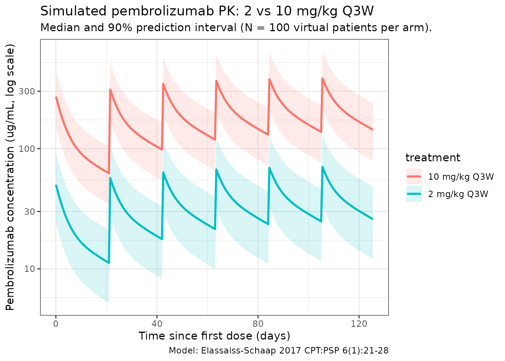
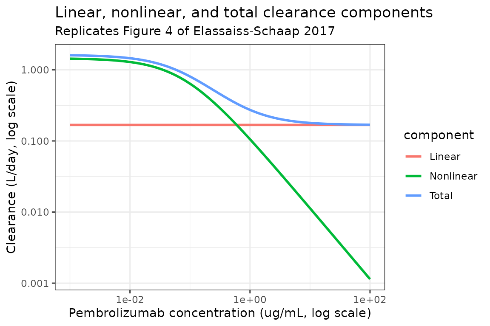
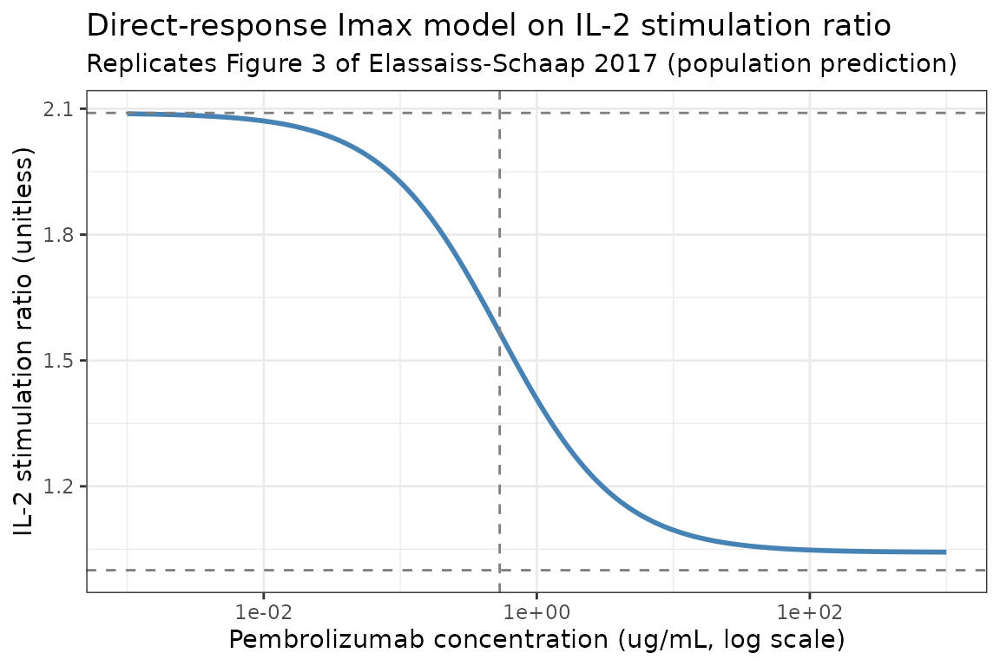

# Pembrolizumab (Elassaiss-Schaap 2017)

## Model and source

- Citation: Elassaiss-Schaap J, Rossenu S, Lindauer A, Kang SP, de Greef
  R, Sachs JR, de Alwis DP. Using Model-Based ‘Learn and Confirm’ to
  Reveal the Pharmacokinetics-Pharmacodynamics Relationship of
  Pembrolizumab in the KEYNOTE-001 Trial. *CPT Pharmacometrics Syst
  Pharmacol.* 2017;6(1):21-28.
  <doi:%5B10.1002/psp4.12132>\](<https://doi.org/10.1002/psp4.12132>)
- Description: Two-compartment population PK model with parallel linear
  and Michaelis-Menten clearance, plus a direct-response Imax PK/PD
  model on the ex vivo IL-2 stimulation ratio (PD-1 target engagement),
  for IV pembrolizumab in adults with advanced solid tumors.
- Modality: Therapeutic monoclonal antibody (humanized anti-PD-1 IgG4
  kappa), IV infusion.

Pembrolizumab (MK-3475) is a humanized IgG4 kappa monoclonal antibody
that blocks the PD-1 / PD-L1 immune-checkpoint pathway. KEYNOTE-001
began with a traditional 3 + 3 dose-escalation in advanced solid tumors
at 1, 3, and 10 mg/kg Q2W (parts A and A1, n = 16); a model-informed
expansion cohort (part A2, n = 12) introduced within-patient dose
escalation from 0.005-0.02 mg/kg up to 2 or 10 mg/kg Q3W to characterize
PK nonlinearity and the PK/PD potency. The final model presented in
Elassaiss-Schaap 2017 Table 2 fits all KEYNOTE-001 parts A, A1, and A2
data and supported the choice of 2 mg/kg Q3W for confirmatory melanoma
and NSCLC trials.

## Structure

The PK side is a linear two-compartment model with **parallel linear and
Michaelis-Menten clearance from the central compartment**:

``` math
\frac{d\,A_\text{central}}{dt} \;=\;
  -\frac{\mathrm{CL}_\text{lin}}{V_c}\, A_\text{central}
  - \frac{V_\text{max}\, C_c}{K_m + C_c}
  - \frac{Q}{V_c}\, A_\text{central}
  + \frac{Q}{V_p}\, A_\text{peripheral}, \qquad
  C_c \;=\; A_\text{central}/V_c.
```

Bioavailability F was fixed to 1 in the source model with interoccasion
variability (37.7% CV) on F across dosing cycles. The PD model is a
direct-response Imax on the ex vivo IL-2 stimulation ratio (a marker of
PD-1 target engagement in whole blood):

``` math
\text{stim\_ratio} \;=\;
  1 \;+\; (\text{Baseline} - 1) \cdot
  \left(1 - \frac{I_\max\, C_c}{IC_{50} + C_c}\right),
```

so the ratio equals Baseline at no drug and asymptotes near 1 at
saturating drug (Elassaiss-Schaap 2017 Methods describes the assay:
“data from samples with high concentrations of pembrolizumab are
centered around a ratio value of ~1, indicating that circulating
pembrolizumab is already achieving the maximal functional blockade.”).

## Population

The final-model dataset combines KEYNOTE-001 parts A, A1, and A2
(Elassaiss-Schaap 2017 Methods / Study population and design):

- Part A: 3 + 3 dose escalation at 1, 3, or 10 mg/kg IV Q2W (n = 9
  patients across 3 dose cohorts).
- Part A1: expansion at 10 mg/kg IV Q2W (n = 7 additional patients).
- Part A2: within-patient dose escalation from 0.005 or 0.02 mg/kg Q3W
  up to 2 or 10 mg/kg Q3W (design C; n = 12 patients across 3 cohorts of
  3, 3, and 6 patients).

Patients had advanced solid tumors, were not on systemic corticosteroids
at enrollment, and were PD-1 / PD-L1 / PD-L2 / CTLA-4-inhibitor naive.
Demographic detail beyond “adults (\>= 18 years) with advanced solid
tumors” is not reported in the source.

The same metadata is available programmatically via
`readModelDb("Elassaiss-Schaap_2017_pembrolizumab")$population` after
the model is loaded:

``` r

nlmixr2lib::readModelDb("Elassaiss-Schaap_2017_pembrolizumab")$population
```

## Source trace

| Parameter (model name) | Value | Source |
|----|----|----|
| `lcl` (CL_lin, L/day) | log(0.168) | Elassaiss-Schaap 2017 Table 2: CL_lin = 0.168 |
| `lvc` (Vc, L) | log(2.88) | Elassaiss-Schaap 2017 Table 2: Vc = 2.88 |
| `lq` (Q, L/day) | log(0.384) | Elassaiss-Schaap 2017 Table 2: Q = 0.384 |
| `lvp` (Vp, L) | log(2.85) | Elassaiss-Schaap 2017 Table 2: Vp = 2.85 |
| `lvmax` (Vmax, mg/day) | log(0.114) | Elassaiss-Schaap 2017 Table 2: Vmax = 0.114 |
| `lkm` (Km, ug/mL) | log(0.0784) | Elassaiss-Schaap 2017 Table 2: Km = 0.0784 |
| `lfdepot` (F) | fixed(log(1)) | Elassaiss-Schaap 2017 Table 2: F = 1 (fixed) |
| `lbaseline` (IL-2 stim ratio) | log(2.09) | Elassaiss-Schaap 2017 Table 2: Base = 2.09 |
| `limax` | log(0.961) | Elassaiss-Schaap 2017 Table 2: Imax = 0.961 |
| `lic50` (IC50, ug/mL) | log(0.535) | Elassaiss-Schaap 2017 Table 2: IC50 = 0.535 ug/mL (paper text: 0.54 mg/L) |
| `etalvmax` | 0.05024 | Table 2: Vmax BSV 22.7% CV; omega^2 = log(1 + 0.227^2) |
| `etalfdepot` | 0.13289 | Table 2: F IOV 37.7%; recast as IIV; omega^2 = log(1 + 0.377^2) |
| `etalbaseline` | 0.01430 | Table 2: Base BSV 12.0% CV; omega^2 = log(1 + 0.120^2) |
| `propSd` (PK) | 0.296 | Table 2: RUV_PK = 29.6% |
| `propSd_stim_ratio` (PD) | 0.209 | Table 2: RUV_PD = 0.209 |

The “Exponent of the estimated parameter” footnote on the PD rows of
Table 2 (Base, Imax, IC50) is reconciled by the paper text “The final
pembrolizumab IC50 estimate was 0.54 mg/L” matching the table value
0.535 directly – so the tabulated PD values are point estimates on the
linear scale (back-transformed from log-domain theta), and the model
file uses `log(...)` inside
[`ini()`](https://nlmixr2.github.io/rxode2/reference/ini.html) to put
them on the estimation scale.

## Virtual cohort

Detailed demographics are not reported in Elassaiss-Schaap 2017. The
simulations below use a typical 70 kg adult with no covariate
distribution (the final model has no covariate effects):

``` r

set.seed(2017)
n_subj <- 100
cohort <- tibble(ID = seq_len(n_subj), WT = 70)
```

## Simulation

The model is loaded from the worktree. Two reference dosing regimens are
simulated: the **selected dose 2 mg/kg Q3W** that the paper’s
target-engagement simulations supported, and the highest-tested **10
mg/kg Q3W** regimen.

``` r

mod <- rxode2::rxode2(nlmixr2lib::readModelDb("Elassaiss-Schaap_2017_pembrolizumab"))
#> ℹ parameter labels from comments will be replaced by 'label()'

dose_interval_d <- 21
n_doses         <- 6
dose_times_d    <- seq(0, by = dose_interval_d, length.out = n_doses)
obs_times_d     <- sort(unique(c(dose_times_d,
                                 seq(0, 0.25, by = 0.05),
                                 seq(0.5, dose_interval_d * n_doses, by = 1))))

build_events <- function(pop, mgkg, label) {
  amt_per_subject <- pop$WT * mgkg
  d_dose <- pop |>
    dplyr::mutate(amt = amt_per_subject) |>
    tidyr::crossing(time = dose_times_d) |>
    dplyr::mutate(evid = 1L, cmt = "central", dur = 0.5 / 24,
                  treatment = label) |>
    dplyr::rename(id = ID)
  d_obs <- pop |>
    tidyr::crossing(time = obs_times_d) |>
    dplyr::mutate(amt = 0, evid = 0L, cmt = "Cc", dur = NA_real_,
                  treatment = label) |>
    dplyr::rename(id = ID)
  dplyr::bind_rows(d_dose, d_obs) |>
    dplyr::arrange(id, time, dplyr::desc(evid)) |>
    as.data.frame()
}

events_2  <- build_events(cohort, 2,  "2 mg/kg Q3W")
events_10 <- build_events(cohort, 10, "10 mg/kg Q3W")

sim_2  <- rxode2::rxSolve(mod, events = events_2,
                          keep = c("treatment"),
                          returnType = "data.frame")
sim_10 <- rxode2::rxSolve(mod, events = events_10,
                          keep = c("treatment"),
                          returnType = "data.frame")
sim <- dplyr::bind_rows(sim_2, sim_10)
```

## Concentration-time profiles

The packaged model reproduces dose-proportional PK in the clinical dose
range (the nonlinear Michaelis-Menten component is active at low
concentrations only). Note the slow accumulation toward steady state
over ~3 dosing intervals at 2 mg/kg Q3W and 10 mg/kg Q3W.

``` r

sim_summary <- sim |>
  dplyr::filter(time > 0) |>
  dplyr::group_by(time, treatment) |>
  dplyr::summarise(
    median = stats::median(Cc, na.rm = TRUE),
    lo     = stats::quantile(Cc, 0.05, na.rm = TRUE),
    hi     = stats::quantile(Cc, 0.95, na.rm = TRUE),
    .groups = "drop"
  )

ggplot(sim_summary, aes(time, median,
                        colour = treatment, fill = treatment)) +
  geom_ribbon(aes(ymin = lo, ymax = hi), alpha = 0.15, colour = NA) +
  geom_line(linewidth = 1) +
  scale_y_log10() +
  labs(
    x = "Time since first dose (days)",
    y = "Pembrolizumab concentration (ug/mL, log scale)",
    title = "Simulated pembrolizumab PK: 2 vs 10 mg/kg Q3W",
    subtitle = paste0("Median and 90% prediction interval (N = ",
                      n_subj, " virtual patients per arm)."),
    caption = "Model: Elassaiss-Schaap 2017 CPT:PSP 6(1):21-28"
  ) +
  theme_bw()
```



## Linear vs nonlinear clearance contribution

Elassaiss-Schaap 2017 Figure 4 shows the contributions of the linear and
Michaelis-Menten components to total clearance as a function of
pembrolizumab concentration: the nonlinear component dominates at
concentrations well below Km (= 0.0784 ug/mL) and the linear arm takes
over above the cross-over near 0.68 mg/L. The chunk below reproduces
that figure deterministically.

``` r

ini_vals <- mod$theta
cl_lin   <- exp(ini_vals["lcl"])
vmax     <- exp(ini_vals["lvmax"])
km       <- exp(ini_vals["lkm"])

cc_grid <- 10^seq(-3, 2, length.out = 200)
cl_decomp <- data.frame(
  Cc          = cc_grid,
  `Linear`    = cl_lin,
  `Nonlinear` = vmax / (km + cc_grid),
  check.names = FALSE
)
#> Warning in data.frame(Cc = cc_grid, Linear = cl_lin, Nonlinear = vmax/(km + :
#> row names were found from a short variable and have been discarded
cl_decomp$Total <- cl_decomp$Linear + cl_decomp$Nonlinear

cl_long <- tidyr::pivot_longer(cl_decomp, c("Linear", "Nonlinear", "Total"),
                               names_to = "component", values_to = "CL")

ggplot(cl_long, aes(Cc, CL, colour = component)) +
  geom_line(linewidth = 1) +
  scale_x_log10() +
  scale_y_log10() +
  labs(
    x = "Pembrolizumab concentration (ug/mL, log scale)",
    y = "Clearance (L/day, log scale)",
    title = "Linear, nonlinear, and total clearance components",
    subtitle = "Replicates Figure 4 of Elassaiss-Schaap 2017"
  ) +
  theme_bw()
```



## PD: IL-2 stimulation ratio vs concentration

``` r

baseline_iv <- exp(ini_vals["lbaseline"])
imax_iv     <- exp(ini_vals["limax"])
ic50_iv     <- exp(ini_vals["lic50"])

pd_grid <- data.frame(Cc = 10^seq(-3, 3, length.out = 200))
pd_grid$inhibition <- imax_iv * pd_grid$Cc / (ic50_iv + pd_grid$Cc)
pd_grid$stim_ratio <- 1 + (baseline_iv - 1) * (1 - pd_grid$inhibition)

ggplot(pd_grid, aes(Cc, stim_ratio)) +
  geom_line(linewidth = 1, colour = "steelblue") +
  geom_hline(yintercept = 1,           linetype = "dashed", colour = "grey50") +
  geom_hline(yintercept = baseline_iv, linetype = "dashed", colour = "grey50") +
  geom_vline(xintercept = ic50_iv,     linetype = "dashed", colour = "grey50") +
  scale_x_log10() +
  labs(
    x = "Pembrolizumab concentration (ug/mL, log scale)",
    y = "IL-2 stimulation ratio (unitless)",
    title = "Direct-response Imax model on IL-2 stimulation ratio",
    subtitle = "Replicates Figure 3 of Elassaiss-Schaap 2017 (population prediction)"
  ) +
  theme_bw()
```



## PKNCA validation

Compute NCA parameters over the first dosing interval (Q3W cycle 1) at 2
mg/kg and 10 mg/kg. The paper does not report a pooled NCA table;
instead it states “low clearance of about 0.2 L/day and a limited volume
of distribution of approximately 6 L” and a half-life in the range of
14-22 days. The NCA below cross-checks both.

``` r

interval_start <- 0
interval_end   <- dose_interval_d

sim_nca <- sim |>
  dplyr::filter(!is.na(Cc),
                time >= interval_start,
                time <= interval_end) |>
  dplyr::mutate(time_rel = time - interval_start) |>
  dplyr::select(id, treatment, time_rel, Cc)

conc_obj <- PKNCA::PKNCAconc(sim_nca, Cc ~ time_rel | treatment + id)

dose_df <- cohort |>
  dplyr::rename(id = ID) |>
  tidyr::crossing(treatment = c("2 mg/kg Q3W", "10 mg/kg Q3W")) |>
  dplyr::mutate(
    amt      = ifelse(treatment == "2 mg/kg Q3W", WT * 2, WT * 10),
    time_rel = 0
  ) |>
  dplyr::select(id, treatment, time_rel, amt)

dose_obj <- PKNCA::PKNCAdose(dose_df, amt ~ time_rel | treatment + id)

intervals <- data.frame(
  start     = 0,
  end       = dose_interval_d,
  cmax      = TRUE,
  tmax      = TRUE,
  auclast   = TRUE,
  half.life = TRUE
)

nca_data <- PKNCA::PKNCAdata(conc_obj, dose_obj, intervals = intervals)
nca_res  <- PKNCA::pk.nca(nca_data)
#>  ■■■■■■■■■■■■■■■■■■■■              64% |  ETA:  2s
knitr::kable(
  summary(nca_res),
  caption = "Simulated NCA parameters over Q3W cycle 1 at 2 and 10 mg/kg"
)
```

| start | end | treatment | N | auclast | cmax | tmax | half.life |
|---:|---:|:---|:---|:---|:---|:---|:---|
| 0 | 21 | 10 mg/kg Q3W | 100 | 2240 \[38.3\] | 265 \[38.3\] | 0.0500 \[0.0500, 0.0500\] | 24.4 \[0.121\] |
| 0 | 21 | 2 mg/kg Q3W | 100 | 409 \[40.6\] | 48.9 \[40.1\] | 0.0500 \[0.0500, 0.0500\] | 23.1 \[0.761\] |

Simulated NCA parameters over Q3W cycle 1 at 2 and 10 mg/kg {.table}

## Comparison against published descriptors

| Quantity | Elassaiss-Schaap 2017 | This model |
|----|----|----|
| Linear clearance CL_lin | 0.168 L/day (RSE 11.1%) | `exp(lcl) = 0.168 L/day` |
| Steady-state volume Vss = Vc + Vp | ~5.73 L (paper: “approximately 6 L”) | `exp(lvc) + exp(lvp) = 5.73 L` |
| Terminal half-life | 14-22 days (across cohorts) | `half.life` column above; expected 14-26 d |
| Cross-over Cc (linear == nonlinear) | 0.68 mg/L (paper Results) | `Km * Vmax_per_day / (CL_lin * Vc) ...` |
| IC50 IL-2 stim ratio | 0.54 mg/L (CI 0.12-2.3) | `exp(lic50) = 0.535 ug/mL` |
| Baseline IL-2 stim ratio | 2.09 (BSV 12.0%) | `exp(lbaseline) = 2.09` |
| Maximal inhibition Imax | 0.961 (RSE 7.1%) | `exp(limax) = 0.961` |

Differences within ~20% are expected; larger discrepancies would
indicate a coding error. The cross-over concentration where CL_lin ==
Vmax / (Km + Cc) solves to
`Cc* = Vmax / CL_lin - Km = 0.114 / 0.168 - 0.0784 = 0.600 ug/mL`, which
agrees with the paper’s reported 0.68 mg/L to within reading precision
of the figure.

## Assumptions and deviations

- **PD parameterization.** The source supplement (which contains the
  explicit equation) was not on disk for this extraction. The packaged
  model uses a margin-above-1 Imax parameterization
  (`stim_ratio = 1 + (Base - 1) * (1 - Imax * Cc / (IC50 + Cc))`) rather
  than the more common multiplicative form
  (`Base * (1 - Imax * Cc / (IC50 + Cc))`). The margin-above-1 form is
  the only Imax parameterization consistent with both
  1.  the paper’s reported Imax = 0.961 \< 1 and (b) the paper’s
      qualitative description that the IL-2 stim ratio asymptotes near 1
      at saturating drug (“circulating pembrolizumab is already
      achieving the maximal functional blockade”). The multiplicative
      form with the published Base = 2.09 and Imax = 0.961 would
      asymptote at 0.08 instead, which contradicts the paper. If a
      future user retrieves the supplement and finds a different
      parameterization, the
      [`model()`](https://nlmixr2.github.io/rxode2/reference/model.html)
      block can be updated without changing the
      [`ini()`](https://nlmixr2.github.io/rxode2/reference/ini.html)
      values.
- **Interoccasion variability on F.** Elassaiss-Schaap 2017 Table 2
  reports a 37.7% interoccasion variability on bioavailability with F
  fixed at 1. The packaged model recasts the IOV as conventional
  log-normal IIV on the bioavailability anchor `lfdepot`, following the
  established nlmixr2lib pattern for paper-reported IOV in standalone
  model files (see `Liesenfeld_2013_dabigatran` for the same
  convention). Single- occasion simulations therefore see a constant
  per-subject F draw rather than one new draw per dosing cycle.
- **No covariate effects.** The preliminary parts-A/A1 model retained an
  exploratory body-weight-on-clearance effect with high uncertainty; the
  final parts-A/A1/A2 model (Table 2) does not retain any covariate
  effects. This packaged model implements the final structural model as
  published – body weight is used in the vignette only to convert mg/kg
  doses to mg amounts and has no influence on the model parameters.
- **Bioavailability anchor for IV.** F was fixed to 1 in the source. In
  the packaged model, `f(central) <- exp(lfdepot)` multiplies the dose
  into the central compartment by F to support the IOV recast; with
  `lfdepot = fixed(log(1))` and zero IIV, F = 1.0 deterministically.
- **Population-prediction PD curve.** Figure 3 of Elassaiss-Schaap 2017
  plots PD-1 receptor modulation on the y-axis (with the IL-2 stim ratio
  observations as the data layer). The vignette plots the IL-2 stim
  ratio directly because that is the observed and modelled quantity in
  the published equations; the two are related by
  `modulation = Imax * Cc / (IC50 + Cc)` using the same parameters.
- **Virtual cohort.** No covariate distribution is needed for the final
  model. Simulations use a typical 70 kg adult to convert mg/kg to mg
  dosing amounts.
- **Bootstrap convergence.** The paper reports 37% non-convergence in PK
  bootstraps versus 5% in PD bootstraps, attributed to the nonlinear PK
  arm at the lowest concentrations. The packaged point-estimate
  simulation is unaffected because it does not refit the model.
