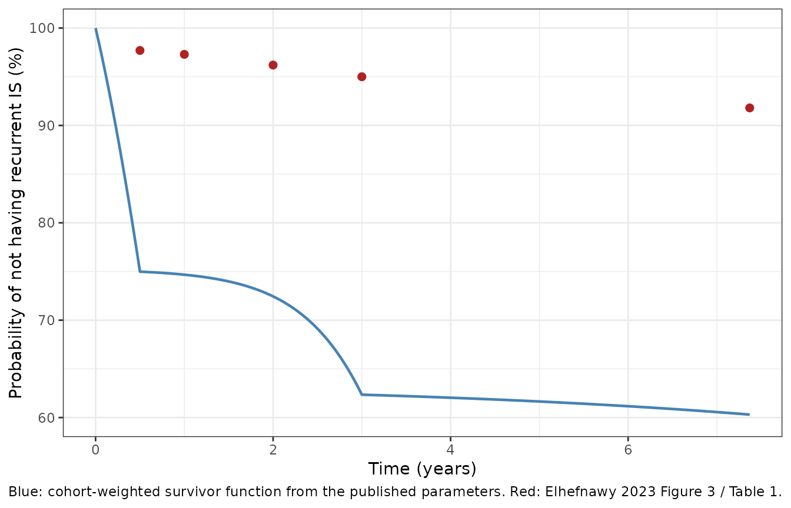

# Recurrent ischemic stroke after a first stroke (Elhefnawy 2023)

## Model and source

- Citation: Elhefnawy ME, Sheikh Ghadzi SM, Albitar O, Tangiisuran B,
  Zainal H, Looi I, Sidek NN, Aziz ZA, Harun SN. Predictive model of
  recurrent ischemic stroke: model development from real-world data.
  Front Neurol. 2023;14:1118711. <doi:10.3389/fneur.2023.1118711>.
- Article: <https://doi.org/10.3389/fneur.2023.1118711> (Open Access, CC
  BY)
- Model file: `modellib("Elhefnawy_2023_recurrent_ischemic_stroke")`

This is a parametric time-to-event (TTE) model, not a PK or PK-PD model.
There is no drug exposure term: secondary prevention enters only as a
binary “antiplatelet prescribed at discharge” indicator. Time is in
years.

**Read the Errata section before using this model.** The published
parameters do not reproduce the paper’s own event counts or its own
Kaplan-Meier visual predictive check; the arithmetic is set out there in
full. Everything in this file is transcribed exactly as published and
nothing has been tuned.

``` r

mod <- modellib("Elhefnawy_2023_recurrent_ischemic_stroke")
mod
#> function() {
#>   description <- paste(
#>     "Parametric time-to-event model for recurrent ischemic stroke (IS) after a",
#>     "first (index) IS, developed in NONMEM 7.5 from the National Neurology",
#>     "Registry of Malaysia (7,697 patients, 333 recurrences, up to 7.37 years of",
#>     "follow-up). The hazard is Gompertz, h(t) = theta_x * exp(theta_y * t), with",
#>     "the scale switching at 0.5 years (theta1 -> theta3) and the shape switching",
#>     "at 3 years (theta2 -> theta4). Four baseline comorbidity / secondary-",
#>     "prevention covariates act log-linearly on the hazard: hyperlipidemia,",
#>     "ischemic heart disease and hypertension raise it, receiving an antiplatelet",
#>     "at discharge lowers it. Time is in years and there is no drug exposure",
#>     "term, so this is a disease-progression / event-risk model rather than a",
#>     "PK-PD model. The cumulative hazard is evaluated in closed form (the",
#>     "piecewise Gompertz integral is elementary) rather than by an ODE, which",
#>     "avoids integrating across the two hazard discontinuities; the model exposes",
#>     "the instantaneous hazard `hazard_ris`, the cumulative hazard `cumhaz_ris`",
#>     "and the recurrence-free survivor probability `sur`.",
#>     "IMPORTANT -- the published parameters do not reproduce the paper's own",
#>     "outputs. As printed, theta1 = 0.238/year over the first 6 months implies a",
#>     "6-month recurrence probability of about 11.9 percent (17 percent with the",
#>     "Gompertz shape included), against the 108 of 7,697 = 1.40 percent actually",
#>     "reported in Elhefnawy 2023 Table 1, and the model overpredicts the",
#>     "cumulative hazard of the paper's own Kaplan-Meier VPC (Figure 3) by roughly",
#>     "4- to 8-fold for a covariate-free patient, or 6- to 12-fold once the cohort",
#>     "covariate distribution is applied. The discrepancy is not removable by any",
#>     "reading of the piecewise structure, because a merely constant 0.238/year is",
#>     "already 8.5-fold too high. The values are transcribed exactly as published",
#>     "and have NOT been tuned; see the validation vignette's Errata section for",
#>     "the full arithmetic.",
#>     sep = " "
#>   )
#>   reference <- paste(
#>     "Elhefnawy ME, Sheikh Ghadzi SM, Albitar O, Tangiisuran B, Zainal H,",
#>     "Looi I, Sidek NN, Aziz ZA, Harun SN. Predictive model of recurrent ischemic",
#>     "stroke: model development from real-world data.",
#>     "Front Neurol. 2023;14:1118711. doi:10.3389/fneur.2023.1118711.",
#>     "Structural equations are Equations 1-5 and the unnumbered covariate",
#>     "equation in Methods; the piecewise scale / shape switching is defined in",
#>     "the Table 2 footnote; all parameter estimates are Table 3. The covariate",
#>     "screen (univariate testing, forward inclusion, backward elimination, each",
#>     "as a change in objective function value) is Supplementary Table 1_S, the",
#>     "single file in the EuropePMC open-access supplementary deposit for",
#>     "PMC10176964; it contains no control stream and no parameter values.",
#>     sep = " "
#>   )
#>   vignette <- "Elhefnawy_2023_recurrent_ischemic_stroke"
#> 
#>   units <- list(
#>     time          = "year",
#>     dosing        = "n/a (no dosing events; secondary-prevention therapy enters only through the binary CONMED_ANTIPLATELET covariate)",
#>     concentration = "n/a (the model outputs are a hazard in 1/year, a unitless cumulative hazard and a unitless recurrence-free survivor probability, not a drug concentration)"
#>   )
#> 
#>   covariateData <- list(
#>     DIS_HYPERLIP = list(
#>       description        = "1 = the patient carried a hyperlipidemia (HPLD) diagnosis before the index ischemic stroke; 0 = no hyperlipidemia. Time-fixed per subject.",
#>       units              = "(binary)",
#>       type               = "binary",
#>       reference_category = "0 (no hyperlipidemia before the index stroke)",
#>       notes              = "Ascertained by physician diagnosis, the patient's electronic record, or medication history (Elhefnawy 2023 Methods, 'Collected variables'). Prevalence in the full 7,697-patient cohort is 2,028 / 7,697 = 26.34 percent (Results text; Table 1 gives 159 of 333 recurrent and 1,869 of 7,364 non-recurrent, which sum to the same 2,028). The strongest single predictor retained: HR = exp(0.799) = 2.22 (95 percent CI 1.81-2.72).",
#>       source_name        = "HPLD"
#>     ),
#>     DIS_IHD = list(
#>       description        = "1 = the patient carried an ischemic heart disease (IHD) diagnosis before the index ischemic stroke; 0 = no IHD. Time-fixed per subject.",
#>       units              = "(binary)",
#>       type               = "binary",
#>       reference_category = "0 (no ischemic heart disease before the index stroke)",
#>       notes              = "Ascertained the same way as the other comorbidity flags (Elhefnawy 2023 Methods, 'Collected variables'). Prevalence in the full cohort is 879 / 7,697 = 11.42 percent (Results text; Table 1 gives 77 + 802 = 879). HR = exp(0.745) = 2.10 (95 percent CI 1.64-2.69). Elhefnawy 2023 Discussion attributes the effect to shared atherosclerotic pathophysiology between IHD and ischemic stroke.",
#>       source_name        = "IHD"
#>     ),
#>     DIS_HYPERT = list(
#>       description        = "1 = the patient carried a hypertension (HTN) diagnosis before the index ischemic stroke; 0 = no hypertension. Time-fixed per subject.",
#>       units              = "(binary)",
#>       type               = "binary",
#>       reference_category = "0 (no hypertension before the index stroke)",
#>       notes              = "Ascertained the same way as the other comorbidity flags. Prevalence in the full cohort is 5,506 / 7,697 = 71.5 percent (Results text; Table 1 gives 288 + 5,218 = 5,506). HR = exp(0.711) = 2.03 (95 percent CI 1.52-2.71). Elhefnawy 2023 Table 1 also stratifies hypertension duration at 5 years, but duration was not retained in the final model -- only the presence / absence flag is used here.",
#>       source_name        = "HTN"
#>     ),
#>     CONMED_ANTIPLATELET = list(
#>       description        = "1 = the patient was prescribed an antiplatelet (APLT) at discharge from the index ischemic stroke admission, for secondary prevention; 0 = no antiplatelet prescribed. Time-fixed per subject.",
#>       units              = "(binary)",
#>       type               = "binary",
#>       reference_category = "0 (no antiplatelet prescribed at discharge)",
#>       notes              = "Elhefnawy 2023 Methods, 'Collected variables': the secondary-prevention medications were 'prescribed during discharge'. The paper does not enumerate which agents were pooled into the antiplatelet class, so the class composition is unknown here (contrast CONMED_DIURETIC, where each source paper's class membership is recorded). Prevalence in the full cohort is (285 + 6,613) / 7,697 = 89.6 percent (Table 1). This is the only protective term retained: HR = exp(-0.514) = 0.59 (the paper prints the CI in descending order as '0.79-0.44'), i.e. about a 40 percent reduction in the hazard of recurrence. Because the indicator is fixed at discharge, it encodes prescription rather than adherence, and the model carries no time-varying exposure term -- Elhefnawy 2023 Limitations flags incorporating time-varying secondary-prophylaxis effects as future work.",
#>       source_name        = "APLT"
#>     )
#>   )
#> 
#>   # Covariates that Elhefnawy 2023 collected and screened but did not retain in
#>   # the final model. Listed here for provenance only; none is referenced in
#>   # model(). The paper reports no point estimate for any of them, so no value
#>   # could be transcribed even if one were wanted -- the screen is reported only
#>   # as changes in objective function value.
#>   #
#>   # The screen itself is Supplementary Table 1_S, "Univariate and multivariate
#>   # analysis of covariate effects on the hazard of recurrent IS after index IS",
#>   # the single file in the EuropePMC open-access supplementary deposit for
#>   # PMC10176964. Fifteen candidates were tested univariately against a base OFV
#>   # of 2808.68; the significant ones went through stepwise forward inclusion
#>   # (base OFV 2737.615) and then backward elimination. The Table 1_S footnote
#>   # sets the thresholds: "Significance; p value < 0.05 in univariate analysis
#>   # and stepwise forward inclusion. Significance < 0.01 in backward
#>   # elimination." That stricter backward threshold is what reduces the model to
#>   # the four covariates of Table 3 -- see DIS_DIAB below.
#>   #
#>   # These names are documentation labels for the paper's screen, not registered
#>   # canonical covariate columns: none is used in model(), so none is added to
#>   # inst/references/covariate-columns.md.
#>   covariatesDataExcluded <- list(
#>     DIS_DIAB = list(
#>       description = "Diabetes mellitus before the index stroke (3,493 / 7,697 = 45.38 percent).",
#>       units = "(binary)", type = "binary",
#>       notes = "The one covariate that reached the final elimination step and was still dropped. Strongly significant univariately (Suppl. Table 1_S, dOFV -21.75, p < 0.0001) and retained through forward inclusion (dOFV -3.96, p = 0.046, clearing the p < 0.05 forward threshold), but removing it in backward elimination cost only dOFV +3.88 (p = 0.048), short of the stricter p < 0.01 backward criterion, so it is absent from Table 3. Table 1 additionally stratifies diabetes duration into <1, 1-5, 6-10 and >10 years; no duration effect was retained either."
#>     ),
#>     DIS_HYPERURICEMIA = list(
#>       description = "Hyperuricemia (HU) before the index stroke (234 / 7,697 = 3.04 percent).",
#>       units = "(binary)", type = "binary",
#>       notes = "Univariately significant (Suppl. Table 1_S, dOFV -4.65, p = 0.031) and carried into forward inclusion, where it added almost nothing (dOFV -1.055, p = 0.304) and was not retained."
#>     ),
#>     DIS_AF = list(
#>       description = "Atrial fibrillation before the index stroke (about 3.4 percent of the cohort).",
#>       units = "(binary)", type = "binary",
#>       notes = "Not significant univariately (Suppl. Table 1_S, dOFV -0.44, p = 0.507) and never entered the stepwise procedure. Note the direction in Table 1 is opposite to the usual clinical expectation (1.2 percent of recurrent vs 3.57 percent of non-recurrent patients)."
#>     ),
#>     SEXF = list(
#>       description = "Female sex (4,289 / 7,697 = 55.72 percent).",
#>       units = "(binary)", type = "binary",
#>       notes = "Screened as 'Gender' in Suppl. Table 1_S and among the weakest candidates tested (dOFV -0.435, p = 0.509); not retained. Table 1 shows near-identical proportions in the recurrent (55.85 percent) and non-recurrent (55.71 percent) groups."
#>     ),
#>     FAMHX_STROKE = list(
#>       description = "Family history of stroke (FHOS).",
#>       units = "(binary)", type = "binary",
#>       notes = "Screened univariately in Suppl. Table 1_S (dOFV -2.735, p = 0.09) and not carried forward. Prevalence is not reported in Table 1."
#>     ),
#>     NIHSS = list(
#>       description = "National Institutes of Health Stroke Scale severity of the index stroke, dichotomised by the paper into minor vs moderate/severe.",
#>       units = "(score)", type = "continuous",
#>       notes = "Tabulated in Elhefnawy 2023 Table 1, defined in the Table 3 footnote, and screened univariately in Suppl. Table 1_S (dOFV -1.103, p = 0.293); no NIHSS term appears in the final model."
#>     ),
#>     CONMED_ANTIDIABETIC = list(
#>       description = "Antidiabetic (ADM) prescribed at discharge from the index stroke admission.",
#>       units = "(binary)", type = "binary",
#>       notes = "Univariately significant (Suppl. Table 1_S, dOFV -5.39, p = 0.0202) and carried into forward inclusion, where it was the weakest candidate tested (dOFV -0.167, p = 0.682) and was not retained."
#>     ),
#>     CONMED_DIURETIC = list(
#>       description = "Diuretic (DIU) prescribed at discharge (5.9 percent of the cohort).",
#>       units = "(binary)", type = "binary",
#>       notes = "Screened univariately in Suppl. Table 1_S (dOFV -2.87, p = 0.09); did not reach the p < 0.05 threshold for forward inclusion."
#>     ),
#>     CONMED_BETABLOCKER = list(
#>       description = "Beta-blocker (BB) prescribed at discharge (10.6 percent of the cohort).",
#>       units = "(binary)", type = "binary",
#>       notes = "Screened univariately in Suppl. Table 1_S (dOFV -2.05, p = 0.152); not carried forward."
#>     ),
#>     CONMED_CCB = list(
#>       description = "Calcium-channel blocker (CCB) prescribed at discharge (20.8 percent of the cohort).",
#>       units = "(binary)", type = "binary",
#>       notes = "Screened univariately in Suppl. Table 1_S (dOFV -1.52, p = 0.217); not carried forward."
#>     ),
#>     CONMED_ACEI = list(
#>       description = "Angiotensin-converting-enzyme inhibitor (ACEI) prescribed at discharge (31.1 percent of the cohort).",
#>       units = "(binary)", type = "binary",
#>       notes = "The weakest candidate in the whole screen (Suppl. Table 1_S, dOFV -0.03, p = 0.862); not carried forward."
#>     ),
#>     AGE = list(
#>       description = "Age at the index ischemic stroke (median 63.47 years).",
#>       units = "year", type = "continuous",
#>       notes = "Named as a screened demographic covariate in Elhefnawy 2023 Methods ('Based on demographic data and concomitant diseases') and dichotomised at 60 years in Table 1, but it does not appear among the fifteen candidates tabulated in Suppl. Table 1_S, so no objective-function change is available for it. Not retained."
#>     ),
#>     SMOKER = list(
#>       description = "Current smoker at the index stroke (about 48 percent of the cohort).",
#>       units = "(binary)", type = "binary",
#>       notes = "Reported in Elhefnawy 2023 Results and Table 1 with a sizeable unadjusted imbalance (60.66 percent of recurrent vs 48.17 percent of non-recurrent patients), but like AGE it is absent from the Suppl. Table 1_S screen, so no objective-function change is available for it. Not retained."
#>     )
#>   )
#> 
#>   population <- list(
#>     n_subjects     = 7697L,
#>     n_events       = 333L,
#>     n_studies      = 1L,
#>     age_range      = "adults aged over 18 years; median 63.47 years at the index stroke; 4,623 of 7,697 (60.1 percent) were 60 years or older",
#>     sex_female_pct = 55.72,
#>     race_ethnicity = "Multiethnic Malaysian registry cohort. Elhefnawy 2023 Table 1 reports Malay, Chinese, Indian and 'Others' strata separately for the recurrent (46.54 / 2.10 / 0.90 / 50.15 percent) and non-recurrent (20.08 / 2.79 / 1.08 / 76.05 percent) groups; ethnicity was screened but not retained in the final model.",
#>     disease_state  = "Adults with a first (index) ischemic stroke diagnosed by WHO criteria and confirmed by brain CT or MRI. The endpoint is a subsequent ischemic stroke recorded by any participating hospital.",
#>     dose_range     = "n/a (no drug exposure is modelled; secondary prevention enters only as the binary antiplatelet-at-discharge indicator)",
#>     regions        = "Malaysia -- National Neurology Registry (NNEUR), a multicentre hospital-based registry covering 13 states; index strokes registered August 2009 to December 2016.",
#>     notes          = paste(
#>       "333 of 7,697 patients (4.32 percent) had at least one recurrent ischemic",
#>       "stroke within the maximum 7.37 years of follow-up; 108 of those 333 (31.43",
#>       "percent) recurred within the first 6 months and 36 patients went on to a",
#>       "second recurrence. Median time to first recurrence was 1.2 years.",
#>       "Baseline comorbidity prevalences in the full cohort: hypertension 71.5",
#>       "percent, diabetes 45.38 percent, hyperlipidemia 26.34 percent, ischemic",
#>       "heart disease 11.42 percent, atrial fibrillation about 3.4 percent, current",
#>       "smoking about 48 percent. Secondary-prevention prescribing at discharge:",
#>       "antiplatelet 89.6 percent, antihyperlipidemic 89.6 percent, ACE inhibitor",
#>       "31.1 percent, calcium-channel blocker 20.8 percent, antidiabetic 31.7",
#>       "percent, beta-blocker 10.6 percent, diuretic 5.9 percent (computed from the",
#>       "Table 1 recurrent and non-recurrent counts). Non-Malaysian citizens and",
#>       "non-ischemic stroke diagnoses were excluded. Elhefnawy 2023 Limitations:",
#>       "the first stroke captured by the registry was assumed to be the patient's",
#>       "first ever stroke, and comorbidities were analysed independently of one",
#>       "another.",
#>       sep = " "
#>     )
#>   )
#> 
#>   ini({
#>     # ==================================================================
#>     # All values are Elhefnawy 2023 Table 3, "Parameters of the final
#>     # developed model for recurrent IS after index IS". The hazard form
#>     # is Table 2 row 4 (the 4-parameter Gompertz), h(t) = theta_x *
#>     # exp(theta_y * t), and the Table 2 footnote fixes the switching:
#>     # "theta_x equals theta1 if time < 0.5 year; theta3 if time >= 0.5,
#>     # theta_y equals theta2 if time < 3 years, theta4 if time >= 3
#>     # years." The covariates enter through the unnumbered Methods
#>     # equation h(t) = h0(t) * exp(beta1*X1 + ... + betan*Xn).
#>     #
#>     # The two baseline-hazard scales are strictly positive rates and are
#>     # carried on the log scale; the two Gompertz shapes are exponents
#>     # that could in principle take either sign and are carried linearly.
#>     #
#>     # INTERNAL CONSISTENCY OF THE COVARIATE BLOCK (all four reproduce):
#>     #   exp( 0.799) = 2.223 vs the published aHR 2.22
#>     #   exp( 0.745) = 2.106 vs the published aHR 2.10
#>     #   exp( 0.711) = 2.036 vs the published aHR 2.03
#>     #   exp(-0.514) = 0.598 vs the published aHR 0.59
#>     # The Table 3 "Half-life (Ln2/alpha)" column also reproduces:
#>     #   ln(2)/1.63 = 0.425 year (Table 3: "0.42 (5.06 months)")
#>     #   ln(2)/0.23 = 3.014 year (Table 3: "3.008 years")
#>     #
#>     # KNOWN DISCREPANCY IN THE BASELINE-HAZARD SCALE -- NOT TUNED.
#>     # theta1 = 0.238/year cannot be reconciled with the paper's own
#>     # event counts. Elhefnawy 2023 Table 1 reports 108 recurrences
#>     # within 6 months among 7,697 patients at risk, i.e. a cumulative
#>     # hazard of about 0.0141 at t = 0.5 year. A flat 0.238/year gives
#>     # 0.238 * 0.5 = 0.119 (8.5-fold too high) and the Gompertz form
#>     # gives (0.238/1.63) * (exp(1.63*0.5) - 1) = 0.184 (13-fold too
#>     # high) before the covariate multiplier -- whose cohort average,
#>     # 1.66, makes it worse rather than better. The same overprediction
#>     # holds against the Figure 3 Kaplan-Meier VPC at every read point
#>     # (about 8x at 0.5 year, 6x at 3 years, 4x at 7.37 years). No
#>     # reading of the piecewise structure removes it, and a frailty term
#>     # cannot either: a zero-mean random effect on the log hazard leaves
#>     # at least half the cohort at or above the typical hazard, which
#>     # bounds the population survivor function well below the published
#>     # curve. The published values are transcribed verbatim regardless;
#>     # the vignette's Errata section carries the full arithmetic.
#>     # ==================================================================
#> 
#>     lh0_early_ris <- log(0.238)
#>     label("Log Gompertz baseline-hazard scale over the first 6 months after the index stroke (1/year)")
#>     # Elhefnawy 2023 Table 3 row 1: theta1 (<6 months) = 0.238, RSE 19.92 percent. Abstract: "Within the first 6 months after the index IS, the hazard of recurrent IS was predicted to be 0.238". See the scale discrepancy note above.
#> 
#>     lh0_late_ris <- log(0.0016)
#>     label("Log Gompertz baseline-hazard scale from 6 months after the index stroke onward (1/year)")
#>     # Elhefnawy 2023 Table 3 row 2: theta3 (>=6 months) = 0.0016, RSE 21.62 percent. The Abstract rounds this to 0.001 ("6 months after the index attack, it reduced to 0.001"); the 4-decimal Table 3 value is used here.
#> 
#>     shape_early_ris <- 1.63
#>     label("Gompertz shape (hazard exponent) during the first 3 years after the index stroke (1/year)")
#>     # Elhefnawy 2023 Table 3 row 3: alpha (<3) = theta2 = 1.63, RSE 4.81 percent, "Shape parameter in the first 3 years after index IS". Positive, so the hazard rises within each interval; Results: "the exponential increase in the hazard of recurrent IS was observed in the first 3 years after the index IS".
#> 
#>     shape_late_ris <- 0.23
#>     label("Gompertz shape (hazard exponent) from 3 years after the index stroke onward (1/year)")
#>     # Elhefnawy 2023 Table 3 row 4: alpha (>=3) = theta4 = 0.23, RSE 20.19 percent, "Shape parameter after 3 years of index IS". Printed as positive. Note the tension with the Results sentence "and then exponentially reduced afterward": with theta4 = +0.23 the hazard still rises after 3 years, just 7-fold more slowly, and the "reduction" is the downward jump at t = 3 that the scale / shape switching produces (exp(1.63*3) = 133 falls to exp(0.23*3) = 2.0). Encoded with the printed sign; see the vignette Errata.
#> 
#>     e_dis_hyperlip_ris <- 0.799
#>     label("Log-hazard coefficient for pre-index hyperlipidemia; HR = exp(0.799) = 2.22")
#>     # Elhefnawy 2023 Table 3 row 5: theta5 = 0.799, RSE 12.89 percent, aHR 2.22 (95 percent CI 1.81-2.72).
#> 
#>     e_dis_ihd_ris <- 0.745
#>     label("Log-hazard coefficient for pre-index ischemic heart disease; HR = exp(0.745) = 2.10")
#>     # Elhefnawy 2023 Table 3 row 6: theta6 = 0.745, RSE 16.85 percent, aHR 2.10 (95 percent CI 1.64-2.69).
#> 
#>     e_dis_hypert_ris <- 0.711
#>     label("Log-hazard coefficient for pre-index hypertension; HR = exp(0.711) = 2.03")
#>     # Elhefnawy 2023 Table 3 row 7: theta7 = 0.711, RSE 20.62 percent, aHR 2.03 (95 percent CI 1.52-2.71).
#> 
#>     e_conmed_antiplatelet_ris <- -0.514
#>     label("Log-hazard coefficient for an antiplatelet prescribed at discharge; HR = exp(-0.514) = 0.59")
#>     # Elhefnawy 2023 Table 3 row 8: theta8 = -0.514, RSE 28.41 percent, aHR 0.59 (the paper prints the interval descending, "0.79-0.44"). Discussion: "receiving APLT was found to decrease the hazard of recurrent IS by ~40%".
#> 
#>     # Interval boundaries. These are structural design choices, not
#>     # estimated quantities: Elhefnawy 2023 Table 2 counts the interval
#>     # Gompertz model as having 4 parameters (theta1-theta4), so the two
#>     # breakpoints carry no degrees of freedom and are fixed here.
#>     tbreak_scale_ris <- fixed(0.5)
#>     label("Time after the index stroke at which the baseline-hazard scale switches from theta1 to theta3 (year)")
#>     # Elhefnawy 2023 Table 2 footnote: "theta_x equals, theta1 if time < 0.5 year; theta3 if time >= 0.5". Table 3 labels the same split "<6 months" / ">=6 months".
#> 
#>     tbreak_shape_ris <- fixed(3)
#>     label("Time after the index stroke at which the Gompertz shape switches from theta2 to theta4 (year)")
#>     # Elhefnawy 2023 Table 2 footnote: "theta_y equals; theta2 if time < 3 years, theta4 if time >= 3 years". Table 3 labels the same split "alpha (<3)" / "alpha (>=3)".
#> 
#>     # Between-subject variability. Elhefnawy 2023 Methods, "Development
#>     # of the base model", states "Between-subject variability around the
#>     # hazard was estimated, assuming an exponential distribution for the
#>     # random effect", but Table 3 reports no variance, no CV percent and
#>     # no shrinkage for it. The supplementary material was retrieved (the
#>     # EuropePMC open-access deposit for PMC10176964 holds a single file,
#>     # Suppl. Table 1_S) and is a covariate model-building table that
#>     # reports only objective-function changes -- it carries no variance
#>     # estimate either, so the magnitude is unavailable from every source
#>     # in hand. The structural form is therefore known and the
#>     # magnitude is not, so
#>     # the eta is declared on the log baseline hazard (the parameter the
#>     # paper says carried it) and fixed at zero rather than invented.
#>     # Simulations from this file are typical-value trajectories; see the
#>     # vignette's Assumptions and deviations section.
#>     #
#>     # The source describes ONE random effect on the hazard, but the
#>     # hazard scale is carried by two parameters (one per time interval),
#>     # so one eta is declared against each to keep the eta<x> / x naming
#>     # pairing intact. Both are fixed at zero, so the split is immaterial
#>     # as shipped; anyone reinstating the paper's variability should draw
#>     # a single value and use it for both.
#>     etalh0_early_ris ~ fixed(0)
#>     etalh0_late_ris ~ fixed(0)
#> 
#>     # The source fits this model with the parametric survival (event-
#>     # density) likelihood under LAPLACE, so there is no observation-error
#>     # model to translate. This placeholder additive residual is attached
#>     # to the survivor-probability output so the nlmixr2 likelihood
#>     # machinery accepts the model for forward simulation. It is NOT from
#>     # the source. Same device as Lindauer_2017_lacosamide_dropout.R and
#>     # Knebel_2012_istradefylline_dizziness.R.
#>     addSd <- 0.001
#>     label("Placeholder additive residual error on the survivor-probability output sur (unitless); not from the source")
#>   })
#> 
#>   model({
#>     # --- Baseline-hazard scales, back-transformed. The declared-but-
#>     # --- unreported between-subject random effect sits on the log scale
#>     # --- and is shared by both intervals (one hazard, one eta).
#>     h0_early_ris <- exp(lh0_early_ris + etalh0_early_ris)
#>     h0_late_ris  <- exp(lh0_late_ris  + etalh0_late_ris)
#> 
#>     # --- Covariate multiplier. Elhefnawy 2023 Methods, unnumbered
#>     # --- equation after Equation 5:
#>     # ---   h(t) = h0(t) * exp(beta1*X1 + beta2*X2 + .... + betan*Xn)
#>     # --- All four retained covariates are 0/1 indicators, so exp() of
#>     # --- each coefficient is the adjusted hazard ratio the paper
#>     # --- tabulates and plots in Figure 2.
#>     cov_ris <-
#>       exp(e_dis_hyperlip_ris        * DIS_HYPERLIP +
#>           e_dis_ihd_ris             * DIS_IHD +
#>           e_dis_hypert_ris          * DIS_HYPERT +
#>           e_conmed_antiplatelet_ris * CONMED_ANTIPLATELET)
#> 
#>     # --- Instantaneous baseline hazard, Elhefnawy 2023 Table 2 row 4
#>     # --- combined with the Table 2 footnote. The scale switches at
#>     # --- tbreak_scale_ris (0.5 year) and the shape switches
#>     # --- independently at tbreak_shape_ris (3 years), which gives three
#>     # --- regimes rather than two. Both switches are downward jumps in
#>     # --- the hazard.
#>     if (t < tbreak_scale_ris) {
#>       h0_ris <- h0_early_ris * exp(shape_early_ris * t)
#>     } else if (t < tbreak_shape_ris) {
#>       h0_ris <- h0_late_ris * exp(shape_early_ris * t)
#>     } else {
#>       h0_ris <- h0_late_ris * exp(shape_late_ris * t)
#>     }
#>     hazard_ris <- h0_ris * cov_ris
#> 
#>     # --- Cumulative baseline hazard in closed form. Equation 1 defines
#>     # --- S(t) = exp(-integral of h over 0..t); the piecewise Gompertz
#>     # --- integrates elementally, so the integral is evaluated exactly
#>     # --- rather than by an ODE. Doing it this way keeps the two hazard
#>     # --- discontinuities out of the solver, where they would otherwise
#>     # --- be stepped over and silently smeared.
#>     # ---   segment 1, 0 .. 0.5 yr : h0_early * exp(shape_early * t)
#>     # ---   segment 2, 0.5 .. 3 yr : h0_late  * exp(shape_early * t)
#>     # ---   segment 3, 3 yr ..     : h0_late  * exp(shape_late  * t)
#>     seg1_full_ris <-
#>       h0_early_ris / shape_early_ris *
#>       (exp(shape_early_ris * tbreak_scale_ris) - 1)
#>     seg2_full_ris <-
#>       h0_late_ris / shape_early_ris *
#>       (exp(shape_early_ris * tbreak_shape_ris) -
#>          exp(shape_early_ris * tbreak_scale_ris))
#> 
#>     if (t < tbreak_scale_ris) {
#>       cumhaz0_ris <-
#>         h0_early_ris / shape_early_ris * (exp(shape_early_ris * t) - 1)
#>     } else if (t < tbreak_shape_ris) {
#>       cumhaz0_ris <-
#>         seg1_full_ris +
#>         h0_late_ris / shape_early_ris *
#>         (exp(shape_early_ris * t) - exp(shape_early_ris * tbreak_scale_ris))
#>     } else {
#>       cumhaz0_ris <-
#>         seg1_full_ris + seg2_full_ris +
#>         h0_late_ris / shape_late_ris *
#>         (exp(shape_late_ris * t) - exp(shape_late_ris * tbreak_shape_ris))
#>     }
#> 
#>     # --- The covariate multiplier is time-constant, so it factors
#>     # --- straight out of the integral (proportional hazards).
#>     cumhaz_ris <- cumhaz0_ris * cov_ris
#> 
#>     # --- Elhefnawy 2023 Equation 1: the probability of not experiencing
#>     # --- a recurrent ischemic stroke within [0, t].
#>     sur <- exp(-cumhaz_ris)
#> 
#>     sur ~ add(addSd)
#>   })
#> }
#> <environment: 0x559c038ca520>
```

## Population

National Neurology Registry (NNEUR) of Malaysia, a multicentre
hospital-based registry covering 13 states. All patients with an index
ischemic stroke registered from August 2009 to December 2016 were
extracted: 7,697 adults over 18 years of age, of whom 333 (4.32%) had at
least one recurrent ischemic stroke within the maximum 7.37 years of
follow-up. Median time to first recurrence was 1.2 years; 108 of the 333
recurrences (31.43%) happened within the first 6 months, and 36 patients
went on to a second recurrence. Median age at the index stroke was 63.47
years and 55.72% of the cohort were women.

Stroke was diagnosed by WHO criteria and confirmed by brain CT or MRI.
Non-Malaysian citizens and non-ischemic diagnoses were excluded.

Baseline prevalences used below are computed from the Elhefnawy 2023
Table 1 counts, which reconcile exactly with the Results text
(e.g. hyperlipidemia 159 + 1,869 = 2,028 = 26.34%).

``` r

prev <- tibble::tribble(
  ~covariate,              ~recurrent, ~non_recurrent,
  "DIS_HYPERLIP",                 159,           1869,
  "DIS_IHD",                       77,            802,
  "DIS_HYPERT",                   288,           5218,
  "CONMED_ANTIPLATELET",          285,           6613
) |>
  dplyr::mutate(n = recurrent + non_recurrent, prevalence = n / 7697)

prev |>
  dplyr::rename(
    "Covariate" = covariate,
    "Recurrent IS (n = 333)" = recurrent,
    "No recurrent IS (n = 7,364)" = non_recurrent,
    "Total (n = 7,697)" = n,
    "Prevalence" = prevalence
  ) |>
  knitr::kable(digits = 4)
```

| Covariate | Recurrent IS (n = 333) | No recurrent IS (n = 7,364) | Total (n = 7,697) | Prevalence |
|:---|---:|---:|---:|---:|
| DIS_HYPERLIP | 159 | 1869 | 2028 | 0.2635 |
| DIS_IHD | 77 | 802 | 879 | 0.1142 |
| DIS_HYPERT | 288 | 5218 | 5506 | 0.7153 |
| CONMED_ANTIPLATELET | 285 | 6613 | 6898 | 0.8962 |

## Source trace

Every value in `ini()` and every equation in `model()`, with the place
in Elhefnawy 2023 it came from.

| Model element | Source location | Published value |
|----|----|----|
| `S(t) = exp(-cumhaz)` | Methods, Equation 1 | `S(t) = e^{-int_0^t h(t)dt}` |
| Gompertz hazard form | Methods, Equation 3; Table 2 row 4 | `h(t) = theta_x * e^{(theta_y) t}` |
| Piecewise scale / shape switching | Table 2 footnote | `theta_x = theta1 if t < 0.5 y, theta3 if t >= 0.5`; `theta_y = theta2 if t < 3 y, theta4 if t >= 3` |
| Covariate model | Methods, unnumbered equation after Eq. 5 | `h(t) = h0(t) * exp(b1 X1 + ... + bn Xn)` |
| `lh0_early_ris` | Table 3 row 1 (theta1, `<6 months`) | 0.238 /year, RSE 19.92% |
| `lh0_late_ris` | Table 3 row 2 (theta3, `>=6 months`) | 0.0016 /year, RSE 21.62% |
| `shape_early_ris` | Table 3 row 3 (theta2, alpha `<3`) | 1.63 /year, RSE 4.81% |
| `shape_late_ris` | Table 3 row 4 (theta4, alpha `>=3`) | 0.23 /year, RSE 20.19% |
| `e_dis_hyperlip_ris` | Table 3 row 5 (theta5) | 0.799, aHR 2.22 (1.81-2.72), RSE 12.89% |
| `e_dis_ihd_ris` | Table 3 row 6 (theta6) | 0.745, aHR 2.10 (1.64-2.69), RSE 16.85% |
| `e_dis_hypert_ris` | Table 3 row 7 (theta7) | 0.711, aHR 2.03 (1.52-2.71), RSE 20.62% |
| `e_conmed_antiplatelet_ris` | Table 3 row 8 (theta8) | -0.514, aHR 0.59 (printed “0.79-0.44”), RSE 28.41% |
| `tbreak_scale_ris` | Table 2 footnote; Table 3 row labels | 0.5 year (fixed, not estimated) |
| `tbreak_shape_ris` | Table 2 footnote; Table 3 row labels | 3 years (fixed, not estimated) |
| `etalh0_*_ris` | Methods, “Development of the base model” | BSV stated to be estimated; **magnitude never reported** – fixed at 0 |
| `addSd` | not in the source | placeholder for the nlmixr2 likelihood; see Assumptions |

## Covariate patterns

The model has four binary covariates, so a cohort is fully described by
the 16 covariate patterns and their weights. Enumerating them exactly,
rather than drawing a random cohort, makes every number below
deterministic and identical across rxode2 versions and thread counts.

Elhefnawy 2023 does not publish the joint distribution of the four
covariates, and its Limitations section states that “the comorbidities
were analyzed independently”. The pattern weights below therefore assume
independence – see Assumptions and deviations.

``` r

p <- setNames(prev$prevalence, prev$covariate)

patterns <-
  tidyr::expand_grid(
    DIS_HYPERLIP        = 0:1,
    DIS_IHD             = 0:1,
    DIS_HYPERT          = 0:1,
    CONMED_ANTIPLATELET = 0:1
  ) |>
  dplyr::mutate(
    weight =
      ifelse(DIS_HYPERLIP        == 1, p[["DIS_HYPERLIP"]],        1 - p[["DIS_HYPERLIP"]]) *
      ifelse(DIS_IHD             == 1, p[["DIS_IHD"]],             1 - p[["DIS_IHD"]]) *
      ifelse(DIS_HYPERT          == 1, p[["DIS_HYPERT"]],          1 - p[["DIS_HYPERT"]]) *
      ifelse(CONMED_ANTIPLATELET == 1, p[["CONMED_ANTIPLATELET"]], 1 - p[["CONMED_ANTIPLATELET"]]),
    id = dplyr::row_number()
  )

stopifnot(nrow(patterns) == 16L, abs(sum(patterns$weight) - 1) < 1e-12)
```

``` r

obs_times <- sort(unique(c(seq(0, 7.37, by = 0.01), 0.5, 3, 7.37)))

events <-
  patterns |>
  dplyr::select(id, DIS_HYPERLIP, DIS_IHD, DIS_HYPERT, CONMED_ANTIPLATELET) |>
  tidyr::expand_grid(time = obs_times) |>
  dplyr::mutate(evid = 0, amt = 0) |>
  dplyr::arrange(id, time)

# omega = NA / sigma = NA: the etas are fixed at zero, and rxSolve would
# otherwise reuse an omega left over from a previous solve in the session.
sim <-
  rxode2::rxSolve(mod, events, omega = NA, sigma = NA, returnType = "data.frame") |>
  dplyr::as_tibble() |>
  dplyr::mutate(id = as.integer(as.character(id))) |>
  dplyr::left_join(dplyr::select(patterns, id, weight), by = "id")
```

## Replicate Figure 1 – baseline hazard by time interval

Figure 1 of Elhefnawy 2023 plots the baseline hazard (all predictors set
to zero) as a step: 0.238 over the first 6 months, dropping to
essentially zero afterwards, and flat out to 7 years. That figure plots
the *scale* parameter `theta_x` alone. The hazard the model actually
integrates carries the Gompertz factor `exp(theta_y * t)` as well, so it
rises within each interval; both are shown.

``` r

base <- dplyr::filter(
  sim,
  DIS_HYPERLIP == 0, DIS_IHD == 0, DIS_HYPERT == 0, CONMED_ANTIPLATELET == 0
)

scale_step <- dplyr::mutate(base, scale_only = ifelse(time < 0.5, 0.238, 0.0016))

ggplot(scale_step, aes(x = time)) +
  geom_line(aes(y = scale_only, colour = "theta_x scale only (paper Figure 1)")) +
  geom_line(aes(y = hazard_ris, colour = "full Gompertz hazard")) +
  scale_colour_manual(values = c("theta_x scale only (paper Figure 1)" = "grey40",
                                 "full Gompertz hazard" = "steelblue")) +
  labs(x = "Years after index ischemic stroke", y = "Hazard (1/year)",
       colour = NULL) +
  theme_bw() +
  theme(legend.position = "bottom")
```


Replicates Figure 1 of Elhefnawy 2023 (baseline hazard, all predictors
zero). The step is the theta_x scale the paper plots; the curve is the
full Gompertz hazard the model integrates.

The step heights are the transcribed Table 3 values exactly, and the two
switch points behave as the Table 2 footnote specifies (`theta1` applies
while `t < 0.5`, `theta3` from `t >= 0.5`).

``` r

h_at <- function(tt) base$hazard_ris[which.min(abs(base$time - tt))]

stopifnot(
  # t = 0: hazard is exactly theta1, because exp(theta2 * 0) = 1.
  abs(h_at(0) - 0.238) < 1e-9,
  # Each of the three regimes must equal its own published formula exactly.
  # Scale switch at 0.5 y: theta1 applies at 0.49, theta3 from 0.50.
  abs(h_at(0.49) - 0.238  * exp(1.63 * 0.49)) < 1e-9,
  abs(h_at(0.50) - 0.0016 * exp(1.63 * 0.50)) < 1e-9,
  # Shape switch at 3 y: theta2 applies at 2.99, theta4 from 3.00.
  abs(h_at(2.99) - 0.0016 * exp(1.63 * 2.99)) < 1e-9,
  abs(h_at(3.00) - 0.0016 * exp(0.23 * 3.00)) < 1e-9
)
```

## Replicate Figure 2 – adjusted hazard ratios

Figure 2 and Table 3 report the adjusted hazard ratio for each retained
covariate. Because all four covariates are 0/1 indicators, the hazard
ratio is exactly `exp(coefficient)`, so this is an exact identity check
on the transcription rather than a simulation.

``` r

coefs <- c(
  DIS_HYPERLIP        = 0.799,
  DIS_IHD             = 0.745,
  DIS_HYPERT          = 0.711,
  CONMED_ANTIPLATELET = -0.514
)
published_hr <- c(
  DIS_HYPERLIP = 2.22, DIS_IHD = 2.10, DIS_HYPERT = 2.03,
  CONMED_ANTIPLATELET = 0.59
)

hr_tab <- tibble::tibble(
  covariate  = names(coefs),
  paper_name = c("HPLD", "IHD", "HTN", "APLT"),
  coefficient = as.numeric(coefs),
  hr_from_model = exp(as.numeric(coefs)),
  hr_published  = as.numeric(published_hr[names(coefs)])
) |>
  dplyr::mutate(pct_diff = 100 * (hr_from_model - hr_published) / hr_published)

hr_tab |>
  dplyr::rename(
    "Covariate" = covariate,
    "Paper name" = paper_name,
    "Coefficient" = coefficient,
    "exp(coefficient)" = hr_from_model,
    "Published aHR" = hr_published,
    "Difference (%)" = pct_diff
  ) |>
  knitr::kable(digits = 3)
```

| Covariate | Paper name | Coefficient | exp(coefficient) | Published aHR | Difference (%) |
|:---|:---|---:|---:|---:|---:|
| DIS_HYPERLIP | HPLD | 0.799 | 2.223 | 2.22 | 0.149 |
| DIS_IHD | IHD | 0.745 | 2.106 | 2.10 | 0.307 |
| DIS_HYPERT | HTN | 0.711 | 2.036 | 2.03 | 0.297 |
| CONMED_ANTIPLATELET | APLT | -0.514 | 0.598 | 0.59 | 1.373 |

``` r


# All four reproduce the published adjusted hazard ratios. Three agree to
# within 0.31%; the antiplatelet row is out by 1.37% because exp(-0.514) =
# 0.5981 rounds to 0.60 rather than the 0.59 printed in Table 3 -- a rounding
# slip in the paper, not a transcription error here.
stopifnot(all(abs(hr_tab$pct_diff) < 2))
```

The same coefficients must also reproduce the hazard ratios the model
itself produces, which confirms the `model()` block applies them
multiplicatively on the hazard as Elhefnawy 2023 specifies.

``` r

off <- dplyr::filter(sim, dplyr::if_all(dplyr::all_of(names(coefs)), ~ .x == 0))

hr_from_sim <- function(cov_name) {
  others <- setdiff(names(coefs), cov_name)
  on <- dplyr::filter(
    sim,
    .data[[cov_name]] == 1,
    dplyr::if_all(dplyr::all_of(others), ~ .x == 0)
  )
  ratio <- on$hazard_ris / off$hazard_ris[match(on$time, off$time)]
  # Proportional hazards: the ratio must be constant in time.
  stopifnot(diff(range(ratio)) < 1e-9)
  mean(ratio)
}

sim_hr <- vapply(names(coefs), hr_from_sim, numeric(1))

# The ratio must be constant in time (proportional hazards) and equal exp(beta).
stopifnot(all(abs(sim_hr - exp(coefs)) < 1e-9))
sim_hr
#>        DIS_HYPERLIP             DIS_IHD          DIS_HYPERT CONMED_ANTIPLATELET 
#>           2.2233165           2.1064414           2.0360263           0.5980984
```

## Replicate Table 3 – the “Half-life (Ln2/alpha)” column

``` r

hl <- tibble::tibble(
  parameter = c("alpha (<3 years)", "alpha (>=3 years)"),
  alpha = c(1.63, 0.23),
  computed = log(2) / c(1.63, 0.23),
  published = c(0.42, 3.008)
)

hl |>
  dplyr::rename(
    "Parameter" = parameter, "alpha (1/year)" = alpha,
    "ln(2)/alpha (year)" = computed, "Published (year)" = published
  ) |>
  knitr::kable(digits = 3)
```

| Parameter          | alpha (1/year) | ln(2)/alpha (year) | Published (year) |
|:-------------------|---------------:|-------------------:|-----------------:|
| alpha (\<3 years)  |           1.63 |              0.425 |            0.420 |
| alpha (\>=3 years) |           0.23 |              3.014 |            3.008 |

``` r


stopifnot(all(abs(hl$computed - hl$published) < 0.02))
```

Note that Elhefnawy 2023 labels this column a half-life, but both alphas
are printed positive, so within each interval the hazard *doubles* on
this timescale rather than halving. The 5.06-month figure the paper
gives alongside 0.42 is 0.42 years expressed in months.

## Internal identity – closed form against numerical integration

The model file evaluates the cumulative hazard in closed form rather
than by an ODE, so that the two hazard discontinuities never reach the
solver. That is only safe if the closed form really is the integral of
the instantaneous hazard the same file reports. Integrating `hazard_ris`
numerically on a fine grid must recover `cumhaz_ris`. Both sides use the
same parameter values, so this is pure numerical error and a tight bound
is the right check.

``` r

# The two breakpoints are genuine jump discontinuities, so the grid carries a
# point immediately below each one. Without them the single trapezoid that
# straddles a jump averages the pre- and post-jump hazard across a full step
# and injects an error far larger than the quadrature error being measured.
fine <- sort(unique(c(seq(0, 7.37, by = 0.001),
                      0.5 - 1e-8, 0.5, 3 - 1e-8, 3, 7.37)))
fine_ev <-
  patterns |>
  dplyr::select(id, DIS_HYPERLIP, DIS_IHD, DIS_HYPERT, CONMED_ANTIPLATELET) |>
  tidyr::expand_grid(time = fine) |>
  dplyr::mutate(evid = 0, amt = 0) |>
  dplyr::arrange(id, time)

fine_sim <-
  rxode2::rxSolve(mod, fine_ev, omega = NA, sigma = NA, returnType = "data.frame") |>
  dplyr::as_tibble() |>
  dplyr::mutate(id = as.integer(as.character(id)))

trap <- function(x, y) c(0, cumsum(diff(x) * (utils::head(y, -1) + utils::tail(y, -1)) / 2))

identity_chk <-
  fine_sim |>
  dplyr::group_by(id) |>
  dplyr::arrange(time, .by_group = TRUE) |>
  dplyr::mutate(cumhaz_numeric = trap(time, hazard_ris)) |>
  dplyr::ungroup() |>
  # Relative, not absolute: the covariate multiplier scales both sides
  # identically, so an absolute bound would be ~10x tighter for the
  # covariate-free pattern than for the all-comorbidities one and would say
  # nothing about the closed form itself. Skip the first few grid points,
  # where the cumulative hazard is still near zero.
  dplyr::filter(time > 0.01) |>
  dplyr::mutate(rel_err = abs(cumhaz_numeric - cumhaz_ris) / cumhaz_ris)

max(identity_chk$rel_err)
#> [1] 2.214083e-07

# Composite-trapezoid relative error on exp(a t) is about (a*dx)^2/12, so a
# 0.001-year grid with a = 1.63 predicts ~2e-7. Assert an order of magnitude
# tighter than the 1e-5 that would still be comfortable, across all 16
# covariate patterns: this confirms the closed form really is the integral of
# the model's own instantaneous hazard.
stopifnot(max(identity_chk$rel_err) < 1e-5)
```

## Replicate Figure 3 – survivor function against the published Kaplan-Meier

Figure 3 of Elhefnawy 2023 is the Kaplan-Meier VPC over the whole
registry cohort. The cohort-weighted survivor function is the weighted
average of the 16 covariate patterns.

The reference values below come from two places. The value at 6 months
is a **hard published count** – Table 1 reports 108 recurrences within 6
months among 7,697 patients at risk. The remaining values are **read off
Figure 3** and are accurate to roughly half a percentage point; they are
used only to show the size and direction of a discrepancy that is far
larger than the reading error.

``` r

pop_surv <-
  sim |>
  dplyr::group_by(time) |>
  dplyr::summarise(sur_pop = sum(weight * sur), .groups = "drop")

published_km <- tibble::tibble(
  time = c(0.5, 1, 2, 3, 7.37),
  sur_published = c(0.977, 0.973, 0.962, 0.950, 0.918),
  provenance = c("Table 1 count (108/7,697) and Figure 3",
                 rep("read from Figure 3", 4))
)

ggplot(pop_surv, aes(time, 100 * sur_pop)) +
  geom_line(colour = "steelblue", linewidth = 0.8) +
  geom_point(data = published_km, aes(time, 100 * sur_published),
             colour = "firebrick", size = 2) +
  coord_cartesian(ylim = c(60, 100)) +
  labs(x = "Time (years)",
       y = "Probability of not having recurrent IS (%)",
       caption = paste("Blue: cohort-weighted survivor function from the published parameters.",
                       "Red: Elhefnawy 2023 Figure 3 / Table 1.")) +
  theme_bw()
```



``` r

cmp <-
  published_km |>
  dplyr::mutate(
    sur_model = approx(pop_surv$time, pop_surv$sur_pop, xout = time)$y,
    cumhaz_model     = -log(sur_model),
    cumhaz_published = -log(sur_published),
    fold_over        = cumhaz_model / cumhaz_published
  )

cmp |>
  dplyr::select(time, sur_published, sur_model, cumhaz_published,
                cumhaz_model, fold_over, provenance) |>
  dplyr::rename(
    "Time (year)" = time,
    "Published S(t)" = sur_published,
    "Model S(t)" = sur_model,
    "Published cumulative hazard" = cumhaz_published,
    "Model cumulative hazard" = cumhaz_model,
    "Model / published" = fold_over,
    "Reference provenance" = provenance
  ) |>
  knitr::kable(digits = 4)
```

| Time (year) | Published S(t) | Model S(t) | Published cumulative hazard | Model cumulative hazard | Model / published | Reference provenance |
|---:|---:|---:|---:|---:|---:|:---|
| 0.50 | 0.977 | 0.7498 | 0.0233 | 0.2879 | 12.3739 | Table 1 count (108/7,697) and Figure 3 |
| 1.00 | 0.973 | 0.7467 | 0.0274 | 0.2921 | 10.6705 | read from Figure 3 |
| 2.00 | 0.962 | 0.7244 | 0.0387 | 0.3224 | 8.3215 | read from Figure 3 |
| 3.00 | 0.950 | 0.6235 | 0.0513 | 0.4724 | 9.2103 | read from Figure 3 |
| 7.37 | 0.918 | 0.6030 | 0.0856 | 0.5058 | 5.9114 | read from Figure 3 |

The model overpredicts the cumulative hazard by roughly six- to
twelve-fold at every time point once the cohort covariate distribution
is applied (four- to eight-fold for a covariate-free patient). This is
asserted, not merely displayed, so that the check fails loudly if a
future edit silently changes the transcription in either direction.

``` r

stopifnot(
  # The discrepancy is real and large at every reference time.
  all(cmp$fold_over > 4),
  # ... and bounded, so an accidental order-of-magnitude edit to a theta
  # would break this rather than pass unnoticed.
  all(cmp$fold_over < 16)
)
```

### The discrepancy does not depend on how the piecewise structure is read

The reading above is the one the Table 2 footnote specifies. It is worth
showing that no alternative reading rescues the transcription, because
the first 6 months alone already falsify the scale: `theta1 = 0.238` per
year is too large by roughly an order of magnitude regardless of what
the shape parameter does.

``` r

H_obs_6mo <- -log(1 - 108 / 7697)   # from the Table 1 count

alternatives <- tibble::tribble(
  ~reading,                                              ~H_6mo,
  "As published: h = theta1 * exp(theta2 * t)",           0.238 / 1.63 * (exp(1.63 * 0.5) - 1),
  "Constant hazard, no Gompertz factor: h = theta1",      0.238 * 0.5,
  "Decaying Gompertz: h = theta1 * exp(-theta2 * t)",     0.238 / 1.63 * (1 - exp(-1.63 * 0.5)),
  "Scale intervals swapped (theta3 first)",               0.0016 / 1.63 * (exp(1.63 * 0.5) - 1)
) |>
  dplyr::mutate(
    fold_over = H_6mo / H_obs_6mo,
    implied_6mo_incidence = 1 - exp(-H_6mo)
  )

alternatives |>
  dplyr::rename(
    "Structural reading" = reading,
    "Cumulative hazard at 6 months" = H_6mo,
    "Fold over published" = fold_over,
    "Implied 6-month incidence" = implied_6mo_incidence
  ) |>
  knitr::kable(digits = 4)
```

| Structural reading | Cumulative hazard at 6 months | Fold over published | Implied 6-month incidence |
|:---|---:|---:|---:|
| As published: h = theta1 \* exp(theta2 \* t) | 0.1839 | 13.0109 | 0.1679 |
| Constant hazard, no Gompertz factor: h = theta1 | 0.1190 | 8.4213 | 0.1122 |
| Decaying Gompertz: h = theta1 \* exp(-theta2 \* t) | 0.0814 | 5.7592 | 0.0782 |
| Scale intervals swapped (theta3 first) | 0.0012 | 0.0875 | 0.0012 |

Against the published 108 / 7,697 = 1.40%, the as-published reading
implies 17%, a flat hazard implies 11.9%, and a decaying Gompertz
implies 7.8%. Only the fourth row – swapping the two scale parameters,
which contradicts both the Table 2 footnote and the Table 3 row labels –
lands low, and it undershoots by an order of magnitude in the other
direction. Note also that this comparison is generous to the model: it
ignores the covariate multiplier, whose cohort average is above one and
therefore makes every row worse.

``` r

cohort_multiplier <- sum(
  patterns$weight *
    exp(0.799 * patterns$DIS_HYPERLIP + 0.745 * patterns$DIS_IHD +
        0.711 * patterns$DIS_HYPERT - 0.514 * patterns$CONMED_ANTIPLATELET)
)
cohort_multiplier
#> [1] 1.659189

stopifnot(
  # No reading consistent with the paper's own text lands near the published
  # 6-month cumulative hazard.
  all(alternatives$fold_over[1:3] > 4),
  # The cohort covariate multiplier is above 1, so it cannot close the gap.
  cohort_multiplier > 1
)
```

## Replicate Figure 4 – survival with and without antiplatelet

Figure 4 splits the survivor function by whether the patient received an
antiplatelet at discharge. Within each stratum the remaining three
covariates are averaged over their published prevalences.

``` r

by_aplt <-
  sim |>
  dplyr::group_by(CONMED_ANTIPLATELET, time) |>
  dplyr::summarise(sur_arm = sum(weight * sur) / sum(weight), .groups = "drop") |>
  dplyr::mutate(arm = ifelse(CONMED_ANTIPLATELET == 1,
                             "(ii) receiving APLT", "(i) not receiving APLT"))

ggplot(by_aplt, aes(time, 100 * sur_arm, colour = arm)) +
  geom_line(linewidth = 0.8) +
  labs(x = "Time (years)", y = "Probability of not having recurrent IS (%)",
       colour = NULL) +
  theme_bw() +
  theme(legend.position = "bottom")
```


Replicates Figure 4 of Elhefnawy 2023 (survival with vs without
antiplatelet secondary prevention). The vertical scale differs from the
paper’s because of the overprediction documented in the Errata; the
separation between the two arms is the reproducible feature.

The qualitative finding of Figure 4 – antiplatelet-treated patients do
better, and the gap widens over time – reproduces. For any single
covariate pattern the ratio of cumulative hazards between the two arms
is exactly the published hazard ratio, because the covariate multiplier
factors out of the integral. Averaging *survival* over the other three
covariates is not the same as averaging *hazard*, so the stratum-level
ratio sits slightly above `exp(-0.514)` and drifts upward as survival
falls – it is bounded below by the hazard ratio and stays within a few
percent of it.

``` r

arm_ratio <-
  by_aplt |>
  dplyr::select(CONMED_ANTIPLATELET, time, sur_arm) |>
  tidyr::pivot_wider(names_from = CONMED_ANTIPLATELET,
                     values_from = sur_arm, names_prefix = "aplt") |>
  dplyr::filter(time > 0) |>
  dplyr::mutate(cumhaz_ratio = log(aplt1) / log(aplt0))

range(arm_ratio$cumhaz_ratio)
#> [1] 0.5983759 0.6256680

stopifnot(
  # Bounded below by the published hazard ratio exp(-0.514) = 0.5981, which it
  # attains at early times where survival is still near 1 and the Jensen gap
  # from averaging survival rather than hazard has not yet opened.
  all(arm_ratio$cumhaz_ratio >= exp(-0.514) - 1e-6),
  # ... and never drifts more than a few percent above it.
  all(arm_ratio$cumhaz_ratio < 0.64),
  # The tightest point is within 0.1% of the published hazard ratio.
  abs(min(arm_ratio$cumhaz_ratio) - exp(-0.514)) < 1e-3
)
```

## NCA validation

Not applicable. This model has no drug-concentration output – it
produces a hazard, a cumulative hazard and a survivor probability. PKNCA
is not a meaningful check here, so the validation above uses the checks
appropriate to a parametric time-to-event model instead: exact
hazard-ratio identities against Table 3 and Figure 2, the
closed-form-versus-numerical-integration identity for the cumulative
hazard, the Table 3 half-life column, replication of Figures 1 and 4,
and a quantified comparison of the survivor function against the
published Kaplan-Meier of Figure 3.

## Assumptions and deviations

- **Between-subject variability is fixed at zero.** Elhefnawy 2023
  Methods states that “between-subject variability around the hazard was
  estimated, assuming an exponential distribution for the random
  effect”, but Table 3 reports no variance, no CV% and no shrinkage for
  it, and the supplementary table (retrieved; see Errata) is a covariate
  model-building table that carries no variance estimate either. The
  structural form is therefore known and the magnitude is not, so
  `etalh0_early_ris` and `etalh0_late_ris` are declared and fixed at 0
  rather than invented. Everything in this vignette is a typical-value
  trajectory. The paper describes a single random effect on the hazard;
  two are declared here only so that each pairs with a fixed-effect
  parameter, and anyone reinstating the variability should draw one
  value and use it for both.
- **`addSd` is not from the source.** The source fits the parametric
  survival (event-density) likelihood under LAPLACE, so there is no
  observation-error model to translate. A placeholder additive residual
  of 0.001 is attached to `sur` so that the nlmixr2 likelihood machinery
  accepts the model for forward simulation.
- **Covariate independence.** The 16-pattern weights assume the four
  covariates are independent, because Elhefnawy 2023 does not publish
  their joint distribution. The paper’s own Limitations section says
  “the comorbidities were analyzed independently”, so this matches how
  the model was built, but it is an assumption: hypertension,
  hyperlipidemia and ischemic heart disease are positively correlated in
  real cohorts, which would concentrate risk in fewer patients than
  assumed here.
- **The Figure 3 reference points at 1, 2, 3 and 7.37 years are
  digitized** from the published figure and are accurate to roughly half
  a percentage point. The 6-month value is a hard count from Table 1.
  The conclusions drawn from them concern a four- to eight-fold
  discrepancy, which is far outside the digitization error.
- **The cumulative hazard is evaluated in closed form, not by an ODE.**
  This is an encoding choice, not a deviation from the published model:
  the piecewise Gompertz integrates elementally, and integrating it
  analytically keeps the two hazard discontinuities out of the solver,
  where they would be stepped over and silently smeared. The closed form
  is verified against numerical integration of the model’s own
  instantaneous hazard above.
- **Antiplatelet class composition is unknown.** The paper does not
  enumerate which agents were pooled into the antiplatelet indicator,
  and the flag records a prescription written at discharge rather than
  measured adherence.
- **Hypertension and diabetes duration are not used.** Table 1
  stratifies both by duration, but only the presence/absence flags
  appear in the final model.

## Errata

**The published parameters do not reproduce the paper’s own outputs.**
This is recorded here in full because it is material to anyone using the
model, and because nothing has been adjusted to hide it.

The baseline-hazard scale for the first 6 months, `theta1 = 0.238` per
year, is irreconcilable with the paper’s own event counts:

- Elhefnawy 2023 Table 1 reports 108 recurrences within 6 months among
  7,697 patients at risk, a cumulative hazard of about 0.0141.
- As published, `h(t) = 0.238 * exp(1.63 t)` integrates to 0.184 over
  the first 6 months – 13-fold too high, implying a 17% 6-month
  recurrence rate against the observed 1.40%.
- The discrepancy is not an artefact of the Gompertz shape. A merely
  *constant* hazard of 0.238 per year gives 0.119 over 6 months, still
  8.5-fold too high. The scale itself is too large.
- The covariate multiplier cannot rescue it: averaged over the published
  prevalences it is about 1.66, which makes the overprediction worse
  rather than better.
- Between-subject variability cannot rescue it either. A zero-mean
  random effect on the log hazard leaves at least half the cohort at or
  above the typical hazard, so the population survivor function is
  bounded well below the published curve no matter how large the
  unreported variance is.

The same overprediction persists across the whole follow-up when
compared with the Figure 3 Kaplan-Meier VPC. For a covariate-free
patient the model’s cumulative hazard runs about 8-fold high at 6
months, 6-fold at 3 years and 4-fold at 7.37 years; applying the cohort
covariate distribution raises those to roughly 12-fold, 9-fold and
6-fold. The `Replicate Figure 3` section above asserts this numerically.

Two smaller inconsistencies are noted for completeness:

- **The sign of `theta4`.** Results states that the hazard showed “the
  exponential increase … in the first 3 years after the index IS and
  then exponentially reduced afterward”. With `theta4 = +0.23` as
  printed, the hazard still increases after 3 years, only about seven
  times more slowly. The “reduction” the sentence describes is produced
  by the downward jump at `t = 3` that the scale/shape switching
  creates, not by a negative exponent. The printed positive sign is what
  is encoded.
- **The Table 3 “Half-life (Ln2/alpha)” column.** `ln(2)/alpha` is a
  doubling time for a positive exponent, not a half-life. The arithmetic
  reproduces (0.425 and 3.014 years against the published 0.42 and
  3.008); only the label is wrong.

What *does* reproduce exactly is the entire covariate block: all four
coefficients back out to the published adjusted hazard ratios to within
the paper’s own two-decimal rounding, and the relative effects in
Figures 2 and 4 are reproduced faithfully. The model is therefore usable
for *relative* risk questions – how much does hyperlipidemia or an
antiplatelet prescription move the hazard – while its absolute
recurrence predictions should not be used without resolving the
baseline-hazard scale with the authors.

**The supplementary material was retrieved and does not settle the scale
question.** The Frontiers supplementary-material link referenced in the
article resolves to a single file in the EuropePMC open-access deposit
(`supplementaryFiles` for PMC10176964), Supplementary Table 1_S,
“Univariate and multivariate analysis of covariate effects on the hazard
of recurrent IS after index IS”. It is a covariate model-building table
only: univariate screening, forward inclusion and backward elimination,
each reported as a change in objective function value with a p-value. It
contains **no NONMEM control stream, no baseline-hazard parameter
values, and no between-subject-variability estimate**, so it can neither
confirm nor correct `theta1`, and it does not supply the missing BSV
magnitude either. The two open questions above therefore remain open
with every available source in hand.

What the supplement does settle is the covariate screen. Fifteen
candidates were tested univariately against a base objective function
value of 2808.68; the significant ones carried forward were
hyperlipidemia, ischemic heart disease, hypertension, diabetes,
antiplatelet, antidiabetics and hyperuricemia. Its footnote states the
criterion explicitly – “Significance \<0.01 in backward elimination” –
which is what removes diabetes from the final model: deleting it costs
only `dOFV = +3.88` (p = 0.048), short of the stricter backward
threshold, whereas antiplatelet (+10.93), hypertension (+24.67),
ischemic heart disease (+32.291) and hyperlipidemia (+55.19) all clear
it. That accounts exactly for the four covariates in Table 3 and
confirms the covariate structure encoded here. The full screen, with
each candidate’s objective-function change, is recorded in the model
file’s `covariatesDataExcluded` metadata.
