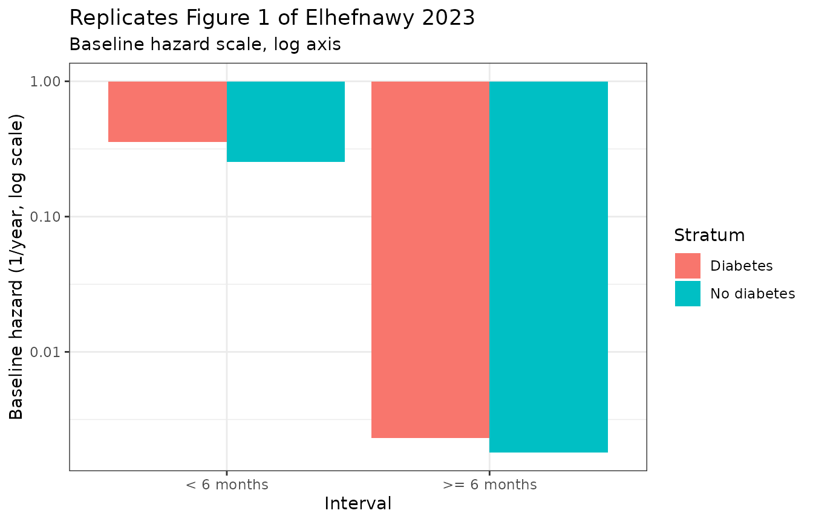
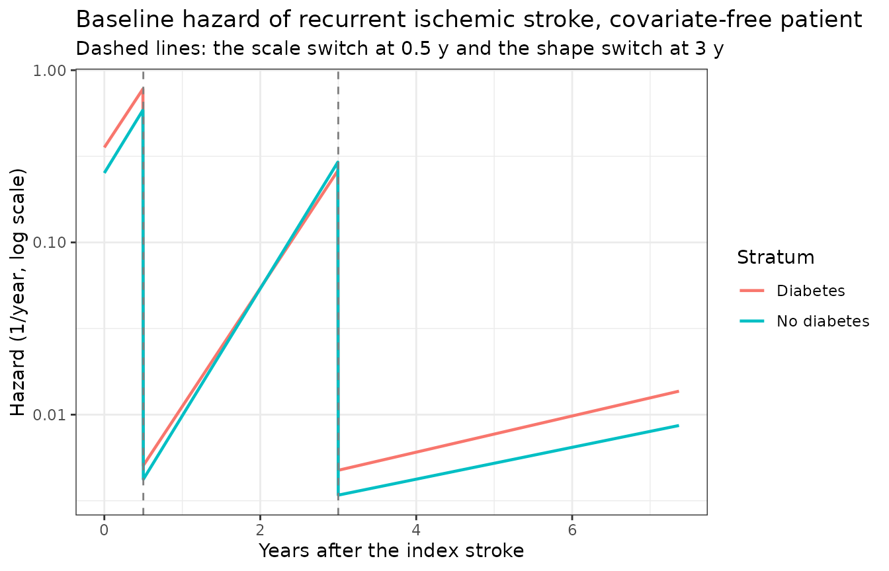
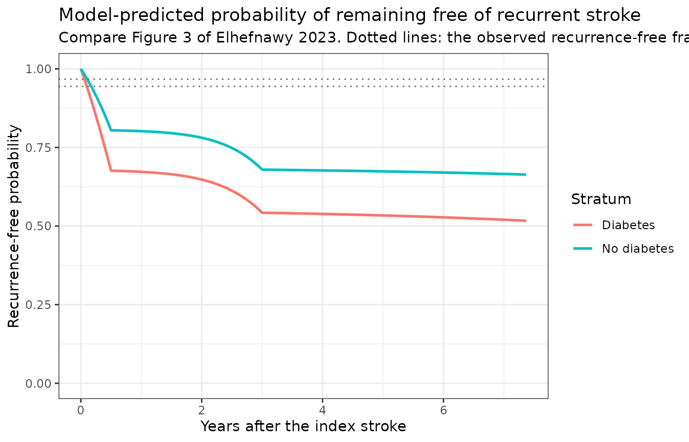

# Recurrent ischemic stroke with and without diabetes (Elhefnawy 2023)

## Model and source

- Citation: Elhefnawy M, Noor Harun S, Leykhim T, Tangiisuran B, Zainal
  H, Looi I, Sidek N, Abdul Aziz Z, Sheikh Ghadzi SM. A parametric
  time-to-event modelling of recurrent ischemic stroke after index
  stroke among patients with and without diabetes mellitus:
  implementation of temporal validation of the model. Cureus.
  2023;15(12):e50794. <doi:10.7759/cureus.50794>.
- Article: <https://doi.org/10.7759/cureus.50794> (Open Access, CC BY
  4.0)
- Model files: `modellib("Elhefnawy_2023_recurrent_ischemic_stroke_dm")`
  and `modellib("Elhefnawy_2023_recurrent_ischemic_stroke_nondm")`

The paper develops **two** parametric time-to-event (TTE) models of
recurrent ischemic stroke after a first (index) ischemic stroke, one in
each stratum of the National Neurology Registry of Malaysia split by
diabetes status. The two models share a structure but have separate
estimates and separate retained covariates, so they are packaged as two
model files and documented here in one vignette.

Neither is a PK or PK-PD model: there is no drug exposure term.
Secondary prevention enters the non-diabetic model only as a binary
“antihyperlipidemic prescribed” indicator. Time is in years throughout.

**Read the Errata section before using either model.** The published
baseline-hazard scale does not reproduce the paper’s own event counts,
and the paper’s own clinical calculator does not reproduce its own
parameters. The arithmetic is set out in full below. Everything in these
files is transcribed exactly as published; nothing has been tuned.

``` r

mod_dm <- modellib("Elhefnawy_2023_recurrent_ischemic_stroke_dm")
mod_nd <- modellib("Elhefnawy_2023_recurrent_ischemic_stroke_nondm")
mod_dm
#> function() {
#>   description <- paste(
#>     "Parametric time-to-event model for recurrent ischemic stroke (IS) after a",
#>     "first (index) IS, in the DIABETIC stratum of the National Neurology",
#>     "Registry of Malaysia (3,493 patients with diabetes mellitus, 195",
#>     "recurrences, up to 7.37 years of follow-up), developed in NONMEM 7.5.",
#>     "The hazard is Gompertz, h(t) = theta_x * exp(theta_y * t), with the scale",
#>     "switching at 0.5 year (theta1 -> theta3) and the shape switching",
#>     "independently at 3 years (theta2 -> theta4). Two baseline comorbidity",
#>     "covariates act log-linearly on the hazard, both raising it: ischemic heart",
#>     "disease and hyperlipidemia recorded before the index stroke. Time is in",
#>     "years and there is no drug exposure term, so this is a disease-progression",
#>     "/ event-risk model rather than a PK-PD model. The cumulative hazard is",
#>     "evaluated in closed form (the piecewise Gompertz integral is elementary)",
#>     "rather than by an ODE, which avoids integrating across the two hazard",
#>     "discontinuities; the model exposes the instantaneous hazard `hazard_ris`,",
#>     "the cumulative hazard `cumhaz_ris` and the recurrence-free survivor",
#>     "probability `sur`. Sister model file for the non-diabetic stratum of the",
#>     "same paper: modellib('Elhefnawy_2023_recurrent_ischemic_stroke_nondm').",
#>     "IMPORTANT -- the published baseline-hazard scale does not reproduce the",
#>     "paper's own event count. As printed, the model predicts a 37.6 percent",
#>     "chance of recurrence within 7.37 years for a covariate-free diabetic",
#>     "patient, against the 195 of 3,493 = 5.58 percent actually reported in",
#>     "Elhefnawy 2023 Table 1: an 8.2-fold overprediction on the cumulative-hazard",
#>     "scale, rising to 12.5-fold once the cohort covariate distribution is",
#>     "applied. No reading of the piecewise structure removes it -- theta1 = 0.356",
#>     "per year held flat over just the first 6 months already contributes 0.178,",
#>     "3.1 times the entire 7.37-year observed cumulative hazard of 0.0574. The",
#>     "covariate block, by contrast, reproduces the paper's own adjusted hazard",
#>     "ratios and half-life column exactly. The values are transcribed as",
#>     "published and have NOT been tuned; see the validation vignette's Errata",
#>     "section for the full arithmetic. The same defect, at the same magnitude,",
#>     "is present in this group's companion pooled-cohort publication",
#>     "(Elhefnawy 2023, Front Neurol 14:1118711, PMC10176964).",
#>     sep = " "
#>   )
#>   reference <- paste(
#>     "Elhefnawy M, Noor Harun S, Leykhim T, Tangiisuran B, Zainal H, Looi I,",
#>     "Sidek N, Abdul Aziz Z, Sheikh Ghadzi SM.",
#>     "A parametric time-to-event modelling of recurrent ischemic stroke after",
#>     "index stroke among patients with and without diabetes mellitus:",
#>     "implementation of temporal validation of the model.",
#>     "Cureus. 2023;15(12):e50794. doi:10.7759/cureus.50794.",
#>     "Open Access under CC BY 4.0.",
#>     "The survival / hazard relationship is Equation 1 and the Gompertz hazard",
#>     "is Table 2 row 4; the piecewise scale / shape switching is defined in the",
#>     "Table 2 footnote and restated in Methods, 'Base Model Development'; the",
#>     "covariate form is the Methods equation h = h0 * exp(beta_t*t +",
#>     "beta_cov*(cov)) (Equation 5, printed inline on page 2); all parameter",
#>     "estimates are Table 3, DM columns. The EuropePMC open-access deposit for",
#>     "PMC10796130 contains no supplementary files.",
#>     "Sister model file from the same paper:",
#>     "modellib('Elhefnawy_2023_recurrent_ischemic_stroke_nondm').",
#>     sep = " "
#>   )
#>   vignette <- "Elhefnawy_2023_recurrent_ischemic_stroke_diabetes"
#> 
#>   units <- list(
#>     time          = "year",
#>     dosing        = "n/a (no dosing events; no drug exposure term enters this stratum's final model)",
#>     concentration = "n/a (the model outputs are a hazard in 1/year, a unitless cumulative hazard and a unitless recurrence-free survivor probability, not a drug concentration)"
#>   )
#> 
#>   covariateData <- list(
#>     DIS_IHD = list(
#>       description        = "1 = the patient carried an ischemic heart disease (IHD) diagnosis before the index ischemic stroke; 0 = no IHD. Time-fixed per subject.",
#>       units              = "(binary)",
#>       type               = "binary",
#>       reference_category = "0 (no ischemic heart disease before the index stroke)",
#>       notes              = "Ascertained from the National Neurology Registry concurrent-disease fields (Elhefnawy 2023 Methods, 'Data collection': 'Patients' demographic data and concurrent disease data, including HPLD, hypertension (HTN), IHD, hyperuricemia, atrial fibrillation (AF)... were investigated'). Prevalence in the 3,493-patient diabetic stratum is (52 + 420) / 3,493 = 13.51 percent (Table 1). Retained in the diabetic stratum only: aHR = exp(0.876) = 2.40 (95 percent CI 1.79-3.20), the strongest single predictor in this model. Elhefnawy 2023 Discussion attributes the effect to the atherosclerotic pathophysiology shared by IHD and ischemic stroke, made more prominent by diabetes-associated angiopathy.",
#>       source_name        = "IHD"
#>     ),
#>     DIS_HYPERLIP = list(
#>       description        = "1 = the patient carried a hyperlipidemia (HPLD) diagnosis before the index ischemic stroke; 0 = no hyperlipidemia. Time-fixed per subject.",
#>       units              = "(binary)",
#>       type               = "binary",
#>       reference_category = "0 (no hyperlipidemia before the index stroke)",
#>       notes              = "Ascertained the same way as the other concurrent-disease flags. Prevalence in the diabetic stratum is (96 + 1,004) / 3,493 = 31.49 percent (Table 1). aHR = exp(0.633) = 1.88 (95 percent CI 1.44-2.45). The same covariate is retained, more strongly, in the non-diabetic stratum (aHR 2.80) -- see modellib('Elhefnawy_2023_recurrent_ischemic_stroke_nondm').",
#>       source_name        = "HPLD"
#>     )
#>   )
#> 
#>   # Covariates that Elhefnawy 2023 collected and screened for the diabetic
#>   # stratum but did not retain in the final model. Listed here for provenance
#>   # only; none is referenced in model(). The paper reports no point estimate
#>   # for any of them -- the covariate screen itself is reported only by
#>   # reference to a previously published preprint (Methods, 'Covariate Model
#>   # Development and Model Evaluation': "The covariate model development and
#>   # model evaluation were described comprehensively in a previously published
#>   # preprint [23]"), and the EuropePMC deposit for PMC10796130 carries no
#>   # supplementary file, so no dOFV is available here either.
#>   #
#>   # Two of these names are worth calling out. HTN is absent from the diabetic
#>   # stratum although it is retained in the non-diabetic one; Elhefnawy 2023
#>   # Discussion reads this as collinearity ("The co-existence of HTN could
#>   # explain the non-significance of HTN among DM patients"), and hypertension
#>   # prevalence in this stratum is 87.1 percent, leaving little contrast.
#>   # Antihyperlipidemic therapy is likewise absent here but retained (and
#>   # protective) in the non-diabetic stratum -- the paper's headline negative
#>   # finding, stated in the Abstract Conclusion and the Conclusions section.
#>   #
#>   # These names are documentation labels for the paper's screen, not registered
#>   # canonical covariate columns: none is used in model(), so none is added to
#>   # inst/references/covariate-columns.md.
#>   covariatesDataExcluded <- list(
#>     DIS_HYPERT = list(
#>       description = "Hypertension (HTN) before the index stroke; (180 + 2,863) / 3,493 = 87.12 percent of the diabetic stratum.",
#>       units = "(binary)", type = "binary",
#>       notes = "Screened but not retained in the diabetic stratum, while it IS retained in the non-diabetic stratum (aHR 2.20). Elhefnawy 2023 Discussion: 'The co-existence of HTN could explain the non-significance of HTN among DM patients in this study.' Table 1 additionally stratifies hypertension duration at 5 years; no duration effect was retained either. Registered canonical DIS_HYPERT is used for it in the sister non-DM model file."
#>     ),
#>     CONMED_LIPIDLOWER = list(
#>       description = "Antihyperlipidemic medication prescribed at discharge for secondary prevention; (167 + 2,926) / 3,493 = 88.55 percent of the diabetic stratum.",
#>       units = "(binary)", type = "binary",
#>       notes = "The paper's headline negative result. Retained and protective in the non-diabetic stratum (aHR 0.433) but NOT significant among patients with diabetes: Abstract Conclusion, 'receiving medications for secondary prevention failed to demonstrate a significant association with reducing IS recurrence among IS patients with DM'. Elhefnawy 2023 Discussion notes agreement with Zhang et al. and raises statin-driven worsening of insulin resistance as a candidate mechanism. Registered canonical CONMED_LIPIDLOWER is used for it in the sister non-DM model file."
#>     ),
#>     DIS_HYPERURICEMIA = list(
#>       description = "Hyperuricemia before the index stroke; (10 + 121) / 3,493 = 3.75 percent.",
#>       units = "(binary)", type = "binary",
#>       notes = "Named among the investigated concurrent diseases in Methods, 'Data collection' and tabulated in Table 1; no effect retained in Table 3."
#>     ),
#>     DIS_AF = list(
#>       description = "Atrial fibrillation before the index stroke; (4 + 87) / 3,493 = 2.61 percent.",
#>       units = "(binary)", type = "binary",
#>       notes = "Named among the investigated concurrent diseases and tabulated in Table 1; no effect retained. Table 1 shows the direction opposite to the usual clinical expectation in this stratum (2.05 percent of recurrent vs 2.63 percent of non-recurrent patients)."
#>     ),
#>     AGE = list(
#>       description = "Age at the index ischemic stroke; median 62.9 years across the whole study, dichotomised at 60 years in Table 1.",
#>       units = "year", type = "continuous",
#>       notes = "Screened as a demographic covariate (Methods, 'Data collection'); not retained. Table 1: 52.82 percent of recurrent and 60.06 percent of non-recurrent diabetic patients were older than 60 years."
#>     ),
#>     SEXF = list(
#>       description = "Female sex; (101 + 1,647) / 3,493 = 50.04 percent of the diabetic stratum.",
#>       units = "(binary)", type = "binary",
#>       notes = "Screened as a demographic covariate; not retained. Table 1 shows near-identical proportions in the recurrent (51.79 percent) and non-recurrent (49.93 percent) diabetic groups."
#>     ),
#>     SMOKER = list(
#>       description = "Current smoker at the index stroke; (113 + 1,630) / 3,493 = 49.90 percent.",
#>       units = "(binary)", type = "binary",
#>       notes = "Tabulated in Table 1 with a sizeable unadjusted imbalance (57.94 percent of recurrent vs 49.42 percent of non-recurrent diabetic patients); no effect retained in Table 3."
#>     ),
#>     FAMHX_STROKE = list(
#>       description = "Family history of stroke; (16 + 152) / 3,493 = 4.81 percent.",
#>       units = "(binary)", type = "binary",
#>       notes = "Tabulated in Table 1; no effect retained."
#>     ),
#>     NIHSS = list(
#>       description = "National Institutes of Health Stroke Scale severity of the index stroke, dichotomised by the paper into minor vs moderate/severe.",
#>       units = "(score)", type = "continuous",
#>       notes = "Tabulated in Table 1 (41.53 percent minor among recurrent diabetic patients vs 46.54 percent among non-recurrent); no NIHSS term appears in Table 3."
#>     ),
#>     DUR_DIAB = list(
#>       description = "Duration of diabetes before the index stroke, banded by the paper into <1, 1-5, 6-10 and >10 years.",
#>       units = "year", type = "categorical",
#>       notes = "Tabulated in Table 1 for the diabetic stratum only; no duration effect appears in Table 3. This is the one screened covariate with no counterpart in the non-diabetic stratum."
#>     ),
#>     RACE = list(
#>       description = "Ethnicity, recorded by the registry as Malay / Chinese / Indian / Others.",
#>       units = "(categorical)", type = "categorical",
#>       notes = "Tabulated in Table 1 with a large unadjusted imbalance (41.02 percent Malay among recurrent diabetic patients vs 21.13 percent among non-recurrent); no ethnicity effect appears in Table 3. Elhefnawy 2023 Results attributes the large 'Others' stratum to the East Malaysian hospitals contributing most of the registry data."
#>     ),
#>     CONMED_ANTIPLATELET = list(
#>       description = "Antiplatelet (APLT) prescribed at discharge; (167 + 2,978) / 3,493 = 90.04 percent.",
#>       units = "(binary)", type = "binary",
#>       notes = "Tabulated in Table 1 among the secondary-prevention medications; no effect retained in Table 3 for either stratum. Contrast the companion pooled-cohort publication (Elhefnawy 2023, Front Neurol 14:1118711), where antiplatelet at discharge IS the single protective covariate retained (aHR 0.59)."
#>     ),
#>     CONMED_ANTIDIABETIC = list(
#>       description = "Antidiabetic (ADM) prescribed at discharge; (117 + 2,005) / 3,493 = 60.75 percent.",
#>       units = "(binary)", type = "binary",
#>       notes = "Tabulated in Table 1; no effect retained in Table 3."
#>     ),
#>     CONMED_ACEI = list(
#>       description = "Angiotensin-converting-enzyme inhibitor prescribed at discharge; (61 + 1,144) / 3,493 = 34.50 percent.",
#>       units = "(binary)", type = "binary",
#>       notes = "Tabulated in Table 1; no effect retained."
#>     ),
#>     CONMED_BETABLOCKER = list(
#>       description = "Beta-blocker prescribed at discharge; (24 + 407) / 3,493 = 12.34 percent.",
#>       units = "(binary)", type = "binary",
#>       notes = "Tabulated in Table 1; no effect retained."
#>     ),
#>     CONMED_CCB = list(
#>       description = "Calcium-channel blocker prescribed at discharge; (59 + 784) / 3,493 = 24.13 percent.",
#>       units = "(binary)", type = "binary",
#>       notes = "Tabulated in Table 1; no effect retained."
#>     ),
#>     CONMED_DIURETIC = list(
#>       description = "Diuretic prescribed at discharge; (22 + 255) / 3,493 = 7.93 percent.",
#>       units = "(binary)", type = "binary",
#>       notes = "Tabulated in Table 1; no effect retained."
#>     )
#>   )
#> 
#>   population <- list(
#>     species        = "human",
#>     n_subjects     = 3493L,
#>     n_events       = 195L,
#>     n_studies      = 1L,
#>     age_range      = "adults; median 62.9 years at the index stroke across the whole study population. In the diabetic stratum 52.82 percent of the patients who recurred and 60.06 percent of those who did not were older than 60 years (Table 1).",
#>     sex_female_pct = 50.04,
#>     race_ethnicity = "Multiethnic Malaysian registry cohort. Elhefnawy 2023 Table 1 reports Malay / Chinese / Indian / Others separately for the recurrent (41.02 / 3.07 / 1.53 / 54.35 percent) and non-recurrent (21.13 / 2.63 / 1.51 / 74.71 percent) diabetic groups; ethnicity was screened but not retained.",
#>     disease_state  = "Adults with diabetes mellitus and a first (index) ischemic stroke diagnosed by WHO criteria and confirmed by brain CT or MRI. Diabetes was identified from physician diagnosis, antidiabetic medication history, the patient's electronic record, or antidiabetic medications prescribed at discharge. The endpoint is a subsequent ischemic stroke recorded in the registry after the index event.",
#>     dose_range     = "n/a (no drug exposure is modelled; secondary-prevention prescribing was screened as binary indicators and none was retained in this stratum)",
#>     regions        = "Malaysia -- National Neurology Registry (NNEUR), a hospital-based registry covering 13 states; index strokes registered August 2009 to December 2016.",
#>     notes          = paste(
#>       "195 of 3,493 diabetic patients (5.58 percent) had a recurrent ischemic",
#>       "stroke within the maximum 7.37 years of follow-up. Note that the paper's",
#>       "Abstract reports this proportion as 5.82 percent and its Results section",
#>       "as 5.55 percent; 195 / 3,493 is 5.58 percent, so both printed",
#>       "percentages are slightly off and the counts are used here.",
#>       "Baseline concurrent-disease prevalences in the diabetic stratum,",
#>       "computed from the Table 1 recurrent and non-recurrent counts:",
#>       "hypertension 87.12 percent, hyperlipidemia 31.49 percent, ischemic",
#>       "heart disease 13.51 percent, hyperuricemia 3.75 percent, atrial",
#>       "fibrillation 2.61 percent, current smoking 49.90 percent, family",
#>       "history of stroke 4.81 percent. Secondary-prevention prescribing at",
#>       "discharge: antiplatelet 90.04 percent, antihyperlipidemic 88.55",
#>       "percent, antidiabetic 60.75 percent, ACE inhibitor 34.50 percent,",
#>       "calcium-channel blocker 24.13 percent, beta-blocker 12.34 percent,",
#>       "diuretic 7.93 percent.",
#>       "The diabetic stratum is the one this paper additionally validated",
#>       "temporally, on a separate NNEUR cohort of 1,262 diabetic patients with",
#>       "index strokes registered January 2017 to December 2020",
#>       "(Methods, 'Temporal validation'; Figure 4). No parameter estimates are",
#>       "reported for that validation cohort, so it is described here but not",
#>       "encoded.",
#>       sep = " "
#>     )
#>   )
#> 
#>   ini({
#>     # ==================================================================
#>     # All values are Elhefnawy 2023 Table 3, "Estimated parameters of
#>     # the final model for recurrent IS after index IS among patients
#>     # with and without DM", DM columns. The hazard form is Table 2 row 4
#>     # (the 4-parameter interval Gompertz), h(t) = h0 * exp(theta_y * t),
#>     # and the Table 2 footnote fixes the switching: "h0 equals theta1 if
#>     # time < 0.5 years, theta3 if time >= 0.5; theta_y equals theta2 if
#>     # time < 3 years, theta4 if time >= 3 years." Covariates enter
#>     # through the Methods equation printed inline on page 2,
#>     # h = h0 * exp(beta_t * t + beta_cov * (cov)).
#>     #
#>     # The two baseline-hazard scales are strictly positive rates and are
#>     # carried on the log scale; the two Gompertz shapes are exponents
#>     # that could in principle take either sign and are carried linearly.
#>     #
#>     # INTERNAL CONSISTENCY OF THE COVARIATE AND SHAPE BLOCKS -- all
#>     # reproduce the paper's own derived columns:
#>     #   exp(0.876) = 2.4013  vs the published aHR 2.40
#>     #   exp(0.633) = 1.8833  vs the published aHR 1.88
#>     #   ln(2)/1.58  = 0.4387 year = 5.26 months
#>     #                        vs Table 3 "0.43 (5.25 months)"
#>     #   ln(2)/0.242 = 2.8642 year
#>     #                        vs Table 3 "2.85 years"
#>     # So the transcription below is right; the discrepancy documented
#>     # next is the publication's, not this file's.
#>     #
#>     # KNOWN DISCREPANCY IN THE BASELINE-HAZARD SCALE -- NOT TUNED.
#>     # The scale is too large to be reconciled with the paper's own event
#>     # count. Elhefnawy 2023 Table 1 reports 195 recurrences among 3,493
#>     # diabetic patients over at most 7.37 years, a cumulative hazard of
#>     # -log(1 - 195/3493) = 0.0574. The model as printed gives 0.4714 for
#>     # a covariate-free patient at 7.37 years -- 8.2-fold too high -- and
#>     # 0.7166 (12.5-fold) after applying the cohort-average covariate
#>     # multiplier of 1.520. Every alternative reading also fails:
#>     #   as published                       H(7.37) = 0.4714  ( 8.2x)
#>     #   constant scale, no Gompertz shape            0.1938  ( 3.4x)
#>     #   decaying Gompertz (shapes negated)           0.1267  ( 2.2x)
#>     #   the two scales swapped                      31.0030  (540x)
#>     #   Table 1 count                                0.0574  ( 1.0x)
#>     # The constant-scale row is the load-bearing one: theta1 = 0.356/year
#>     # held flat over just the first 6 months contributes 0.178 by itself,
#>     # already 3.1 times the entire 7.37-year observed cumulative hazard,
#>     # so the defect is in the scale and not in a misreading of the
#>     # piecewise structure. A frailty term cannot rescue it either: a
#>     # zero-mean random effect on the log hazard leaves at least half the
#>     # cohort at or above the typical hazard, which bounds the population
#>     # survivor function well below the published Kaplan-Meier curve.
#>     # The paper's own clinical-calculator scenarios do not reproduce
#>     # either, and are internally inconsistent (its scenario-1 recurrence
#>     # probability FALLS from 8.396 percent at 1 year to 4.917 percent at
#>     # 4 years, which is impossible for a cumulative probability).
#>     # The published values are transcribed verbatim regardless; the
#>     # vignette's Errata section carries the full arithmetic, asserted
#>     # numerically.
#>     # ==================================================================
#> 
#>     lh0_early_ris <- log(0.356)
#>     label("Log Gompertz baseline-hazard scale over the first 6 months after the index stroke, diabetic stratum (1/year)")
#>     # Elhefnawy 2023 Table 3 row 1, DM column: theta1 (<6 months) = 0.356, RSE 13.69 percent (sampling importance resampling). Also Abstract and Results: "the index IS attack was predicted to contribute to the hazard of recurrent IS by 0.356 ... within the first six months after the index IS among patients with ... DM". See the scale discrepancy note above.
#> 
#>     lh0_late_ris <- log(0.0023)
#>     label("Log Gompertz baseline-hazard scale from 6 months after the index stroke onward, diabetic stratum (1/year)")
#>     # Elhefnawy 2023 Table 3 row 2, DM column: theta3 (>=6 months) = 0.0023, RSE 17.01 percent. Also Results: "Even after six months of index IS, the baseline hazard of recurrent IS was not equal to zero among both groups (0.0023, 0.0018)."
#> 
#>     shape_early_ris <- 1.58
#>     label("Gompertz shape (hazard exponent) during the first 3 years after the index stroke, diabetic stratum (1/year)")
#>     # Elhefnawy 2023 Table 3 row 3, DM column: alpha (<3) = theta2 = 1.58, RSE 5.98 percent, "Shape parameter in the first three years after index IS". Positive, so the hazard rises within each of the first two intervals; Results: "the recurrent hazard increased exponentially during the first three years after the index IS".
#> 
#>     shape_late_ris <- 0.242
#>     label("Gompertz shape (hazard exponent) from 3 years after the index stroke onward, diabetic stratum (1/year)")
#>     # Elhefnawy 2023 Table 3 row 4, DM column: alpha (>=3) = theta4 = 0.242, RSE 22.36 percent, "Shape parameter after three years of index IS". Printed as POSITIVE. Note the tension with the Results sentence "and then exponentially reduced afterwards": with theta4 = +0.242 the hazard still rises after 3 years, 6.5-fold more slowly, and the "reduction" is the downward jump at t = 3 that the shape switch produces (the hazard falls from 0.2632 to 0.00475 per year, a 55-fold drop). Encoded with the printed sign; see the vignette Errata.
#> 
#>     e_dis_ihd_ris <- 0.876
#>     label("Log-hazard coefficient for pre-index ischemic heart disease; aHR = exp(0.876) = 2.40")
#>     # Elhefnawy 2023 Table 3 row 5, DM column: theta5 = 0.876, RSE 16.88 percent, aHR 2.40 (95 percent CI 1.79-3.20). Results: "the recurrent IS rate among DM patients with IHD was 2.40 times higher than that in patients with no-IHD prior to index IS".
#> 
#>     e_dis_hyperlip_ris <- 0.633
#>     label("Log-hazard coefficient for pre-index hyperlipidemia; aHR = exp(0.633) = 1.88")
#>     # Elhefnawy 2023 Table 3 row 6, DM column: theta6 = 0.633, RSE 21.38 percent, aHR 1.88 (95 percent CI 1.44-2.45). Results: "the presence of HPLD prior to index IS increased the recurrent IS rate among DM by 88%".
#> 
#>     # Interval boundaries. These are structural design choices, not
#>     # estimated quantities: Elhefnawy 2023 Table 2 counts the interval
#>     # Gompertz model as having 4 parameters (theta1-theta4), so the two
#>     # breakpoints carry no degrees of freedom and are fixed here.
#>     tbreak_scale_ris <- fixed(0.5)
#>     label("Time after the index stroke at which the baseline-hazard scale switches from theta1 to theta3 (year)")
#>     # Elhefnawy 2023 Table 2 footnote: "h0 equals theta1 if time < 0.5 years, theta3 if time >= 0.5". Table 3 labels the same split "(<6months)" / "(>=6months)".
#> 
#>     tbreak_shape_ris <- fixed(3)
#>     label("Time after the index stroke at which the Gompertz shape switches from theta2 to theta4 (year)")
#>     # Elhefnawy 2023 Table 2 footnote: "theta_y equals theta2 if time < 3 years, theta4 if time >= 3 years". Table 3 labels the same split "alpha (<3)" / "alpha (>=3)".
#> 
#>     # Between-subject variability. Elhefnawy 2023 reports NO random
#>     # effect for either stratum: Methods describes only the structural
#>     # hazard and the covariate search, and Table 3 has no variance, no
#>     # CV percent, no shrinkage and no omega row. This is encoded
#>     # faithfully as a typical-value model with no eta parameters -- no
#>     # variance is invented. (The companion pooled-cohort publication,
#>     # Front Neurol 14:1118711, does state that between-subject
#>     # variability was estimated but likewise never reports its
#>     # magnitude; that model file carries fixed(0) etas for it. Here
#>     # there is nothing to carry.)
#>     #
#>     # The source fits this model with the parametric survival (event-
#>     # density) likelihood under LAPLACE (Methods: "the LAPACE (ADVAN=6
#>     # TOL=9 NSIG=3) estimation method"), so there is no observation-
#>     # error model to translate. This placeholder additive residual is
#>     # attached to the survivor-probability output so the nlmixr2
#>     # likelihood machinery accepts the model for forward simulation. It
#>     # is NOT from the source. Same device as
#>     # Lindauer_2017_lacosamide_dropout.R.
#>     addSd <- 0.001
#>     label("Placeholder additive residual error on the survivor-probability output sur (unitless); not from the source")
#>   })
#> 
#>   model({
#>     # --- Baseline-hazard scales, back-transformed.
#>     h0_early_ris <- exp(lh0_early_ris)
#>     h0_late_ris  <- exp(lh0_late_ris)
#> 
#>     # --- Covariate multiplier. Elhefnawy 2023 Methods, the equation
#>     # --- printed inline on page 2 and referenced as Equation 5:
#>     # ---   h = h0 * exp(beta_t * t + beta_cov * (cov))
#>     # --- Both retained covariates are 0/1 indicators, so exp() of each
#>     # --- coefficient is the adjusted hazard ratio the paper tabulates
#>     # --- in Table 3 and plots in Figure 2 (left panel).
#>     cov_ris <-
#>       exp(e_dis_ihd_ris      * DIS_IHD +
#>           e_dis_hyperlip_ris * DIS_HYPERLIP)
#> 
#>     # --- Instantaneous baseline hazard, Elhefnawy 2023 Table 2 row 4
#>     # --- combined with the Table 2 footnote. The scale switches at
#>     # --- tbreak_scale_ris (0.5 year) and the shape switches
#>     # --- independently at tbreak_shape_ris (3 years), which gives three
#>     # --- regimes rather than two. Both switches are downward jumps in
#>     # --- the hazard (154.8-fold at 0.5 year, 55.4-fold at 3 years).
#>     if (t < tbreak_scale_ris) {
#>       h0_ris <- h0_early_ris * exp(shape_early_ris * t)
#>     } else if (t < tbreak_shape_ris) {
#>       h0_ris <- h0_late_ris * exp(shape_early_ris * t)
#>     } else {
#>       h0_ris <- h0_late_ris * exp(shape_late_ris * t)
#>     }
#>     hazard_ris <- h0_ris * cov_ris
#> 
#>     # --- Cumulative baseline hazard in closed form. Equation 1 defines
#>     # --- S(t) = exp(-integral of h over 0..t); the piecewise Gompertz
#>     # --- integrates elementally, so the integral is evaluated exactly
#>     # --- rather than by an ODE. Doing it this way keeps the two hazard
#>     # --- discontinuities out of the solver, where they would otherwise
#>     # --- be stepped over and silently smeared.
#>     # ---   segment 1, 0 .. 0.5 yr : h0_early * exp(shape_early * t)
#>     # ---   segment 2, 0.5 .. 3 yr : h0_late  * exp(shape_early * t)
#>     # ---   segment 3, 3 yr ..     : h0_late  * exp(shape_late  * t)
#>     seg1_full_ris <-
#>       h0_early_ris / shape_early_ris *
#>       (exp(shape_early_ris * tbreak_scale_ris) - 1)
#>     seg2_full_ris <-
#>       h0_late_ris / shape_early_ris *
#>       (exp(shape_early_ris * tbreak_shape_ris) -
#>          exp(shape_early_ris * tbreak_scale_ris))
#> 
#>     if (t < tbreak_scale_ris) {
#>       cumhaz0_ris <-
#>         h0_early_ris / shape_early_ris * (exp(shape_early_ris * t) - 1)
#>     } else if (t < tbreak_shape_ris) {
#>       cumhaz0_ris <-
#>         seg1_full_ris +
#>         h0_late_ris / shape_early_ris *
#>         (exp(shape_early_ris * t) - exp(shape_early_ris * tbreak_scale_ris))
#>     } else {
#>       cumhaz0_ris <-
#>         seg1_full_ris + seg2_full_ris +
#>         h0_late_ris / shape_late_ris *
#>         (exp(shape_late_ris * t) - exp(shape_late_ris * tbreak_shape_ris))
#>     }
#> 
#>     # --- The covariate multiplier is time-constant, so it factors
#>     # --- straight out of the integral (proportional hazards).
#>     cumhaz_ris <- cumhaz0_ris * cov_ris
#> 
#>     # --- Elhefnawy 2023 Equation 1: the probability of not experiencing
#>     # --- a recurrent ischemic stroke within [0, t].
#>     sur <- exp(-cumhaz_ris)
#> 
#>     sur ~ add(addSd)
#>   })
#> }
#> <environment: 0x564b9d2878c8>
```

## Population

National Neurology Registry (NNEUR) of Malaysia, a hospital-based
registry covering 13 states. Patients with a first ischemic stroke
registered between August 2009 and December 2016 were extracted and
stratified by diabetes status. The endpoint is any subsequent ischemic
stroke recorded in the registry; follow-up was censored at the last
recorded observation, to a maximum of 7.37 years. Diabetes was
identified from physician diagnosis, antidiabetic medication history,
the electronic record, or antidiabetic medications prescribed at
discharge (Methods, “Data collection”).

The diabetic stratum was additionally validated **temporally** on a
separate NNEUR cohort of 1,262 diabetic patients with index strokes
registered January 2017 to December 2020 (Methods, “Temporal
validation”; Figure 4). No parameter estimates are reported for that
cohort, so it is described but not encoded.

``` r

pop <- data.frame(
  Quantity = c(
    "Patients", "Recurrent ischemic strokes", "Recurrence (%)",
    "Maximum follow-up (years)",
    "Hypertension (%)", "Hyperlipidemia (%)", "Ischemic heart disease (%)",
    "Atrial fibrillation (%)", "Hyperuricemia (%)",
    "Current smoker (%)", "Female (%)",
    "Antihyperlipidemic prescribed (%)", "Antiplatelet prescribed (%)"
  ),
  `Diabetic stratum` = c(
    3493, 195, round(100 * 195 / 3493, 2), 7.37,
    round(100 * (180 + 2863) / 3493, 2), round(100 * (96 + 1004) / 3493, 2),
    round(100 * (52 + 420) / 3493, 2), round(100 * (4 + 87) / 3493, 2),
    round(100 * (10 + 121) / 3493, 2), round(100 * (113 + 1630) / 3493, 2),
    round(100 * (101 + 1647) / 3493, 2), round(100 * (167 + 2926) / 3493, 2),
    round(100 * (167 + 2978) / 3493, 2)
  ),
  `Non-diabetic stratum` = c(
    4204, 138, round(100 * 138 / 4204, 2), 7.37,
    round(100 * (108 + 2355) / 4204, 2), round(100 * (63 + 865) / 4204, 2),
    round(100 * (25 + 382) / 4204, 2), round(100 * (5 + 172) / 4204, 2),
    round(100 * (6 + 97) / 4204, 2), round(100 * (89 + 1917) / 4204, 2),
    round(100 * (53 + 1607) / 4204, 2), round(100 * (120 + 3682) / 4204, 2),
    round(100 * (118 + 3635) / 4204, 2)
  ),
  check.names = FALSE
)
knitr::kable(pop, caption = "Cohort composition, computed from the recurrent and non-recurrent counts of Elhefnawy 2023 Table 1.")
```

| Quantity                          | Diabetic stratum | Non-diabetic stratum |
|:----------------------------------|-----------------:|---------------------:|
| Patients                          |          3493.00 |              4204.00 |
| Recurrent ischemic strokes        |           195.00 |               138.00 |
| Recurrence (%)                    |             5.58 |                 3.28 |
| Maximum follow-up (years)         |             7.37 |                 7.37 |
| Hypertension (%)                  |            87.12 |                58.59 |
| Hyperlipidemia (%)                |            31.49 |                22.07 |
| Ischemic heart disease (%)        |            13.51 |                 9.68 |
| Atrial fibrillation (%)           |             2.61 |                 4.21 |
| Hyperuricemia (%)                 |             3.75 |                 2.45 |
| Current smoker (%)                |            49.90 |                47.72 |
| Female (%)                        |            50.04 |                39.49 |
| Antihyperlipidemic prescribed (%) |            88.55 |                90.44 |
| Antiplatelet prescribed (%)       |            90.04 |                89.27 |

Cohort composition, computed from the recurrent and non-recurrent counts
of Elhefnawy 2023 Table 1. {.table}

The paper’s own recurrence percentages disagree with its counts in the
diabetic stratum: the Abstract prints 5.82%, the Results section prints
5.55%, and 195 / 3,493 is 5.58%. The counts are used throughout this
vignette.

``` r

stopifnot(
  abs(100 * 195 / 3493 - 5.58) < 0.01,
  abs(100 * 138 / 4204 - 3.28) < 0.01
)
```

## Source trace

``` r

trace <- tibble::tribble(
  ~Item, ~`Source location`, ~Value,
  "S(t) = exp(-integral h)", "Equation 1 (Methods, 'Base Model Development')", "structure",
  "h(t) = h0 * exp(theta_y * t)", "Table 2 row 4 ('After inserting different time intervals', Gompertz)", "structure",
  "h0 = theta1 if t < 0.5 y, theta3 if t >= 0.5 y", "Table 2 footnote; restated in Methods", "structure",
  "theta_y = theta2 if t < 3 y, theta4 if t >= 3 y", "Table 2 footnote; restated in Methods", "structure",
  "h = h0 * exp(beta_t*t + beta_cov*(cov))", "Equation 5, printed inline on page 2 of the PDF", "structure",
  "theta1 (DM)", "Table 3 row 1, DM column", "0.356 /y (RSE 13.69%)",
  "theta3 (DM)", "Table 3 row 2, DM column", "0.0023 /y (RSE 17.01%)",
  "theta2 (DM)", "Table 3 row 3, DM column", "1.58 /y (RSE 5.98%)",
  "theta4 (DM)", "Table 3 row 4, DM column", "0.242 /y (RSE 22.36%)",
  "IHD effect (DM)", "Table 3 row 5, DM column", "0.876 (aHR 2.40, 1.79-3.20)",
  "HPLD effect (DM)", "Table 3 row 6, DM column", "0.633 (aHR 1.88, 1.44-2.45)",
  "theta1 (non-DM)", "Table 3 row 1, non-DM column", "0.253 /y (RSE 24.38%)",
  "theta3 (non-DM)", "Table 3 row 2, non-DM column", "0.0018 /y (RSE 23.09%)",
  "theta2 (non-DM)", "Table 3 row 3, non-DM column", "1.7 /y (RSE 6.37%)",
  "theta4 (non-DM)", "Table 3 row 4, non-DM column", "0.213 /y (RSE 33.07%)",
  "HPLD effect (non-DM)", "Table 3 row 6, non-DM column", "1.03 (aHR 2.801, 2.00-3.90)",
  "HTN effect (non-DM)", "Table 3 row 7, non-DM column", "0.789 (aHR 2.201, 1.53-3.14)",
  "Antihyperlipidemic effect (non-DM)", "Table 3 row 8, non-DM column", "-0.835 (aHR 0.433, 0.65-0.28)",
  "Breakpoints 0.5 y and 3 y", "Table 2 footnote; not estimated (Table 2 counts 4 parameters)", "fixed",
  "Between-subject variability", "not reported anywhere in the paper", "absent",
  "Residual error", "n/a -- survival likelihood, LAPLACE (Methods, 'Model development')", "placeholder"
)
knitr::kable(trace, caption = "Provenance of every structural equation and every ini() value.")
```

| Item | Source location | Value |
|:---|:---|:---|
| S(t) = exp(-integral h) | Equation 1 (Methods, ‘Base Model Development’) | structure |
| h(t) = h0 \* exp(theta_y \* t) | Table 2 row 4 (‘After inserting different time intervals’, Gompertz) | structure |
| h0 = theta1 if t \< 0.5 y, theta3 if t \>= 0.5 y | Table 2 footnote; restated in Methods | structure |
| theta_y = theta2 if t \< 3 y, theta4 if t \>= 3 y | Table 2 footnote; restated in Methods | structure |
| h = h0 \* exp(beta_t*t + beta_cov*(cov)) | Equation 5, printed inline on page 2 of the PDF | structure |
| theta1 (DM) | Table 3 row 1, DM column | 0.356 /y (RSE 13.69%) |
| theta3 (DM) | Table 3 row 2, DM column | 0.0023 /y (RSE 17.01%) |
| theta2 (DM) | Table 3 row 3, DM column | 1.58 /y (RSE 5.98%) |
| theta4 (DM) | Table 3 row 4, DM column | 0.242 /y (RSE 22.36%) |
| IHD effect (DM) | Table 3 row 5, DM column | 0.876 (aHR 2.40, 1.79-3.20) |
| HPLD effect (DM) | Table 3 row 6, DM column | 0.633 (aHR 1.88, 1.44-2.45) |
| theta1 (non-DM) | Table 3 row 1, non-DM column | 0.253 /y (RSE 24.38%) |
| theta3 (non-DM) | Table 3 row 2, non-DM column | 0.0018 /y (RSE 23.09%) |
| theta2 (non-DM) | Table 3 row 3, non-DM column | 1.7 /y (RSE 6.37%) |
| theta4 (non-DM) | Table 3 row 4, non-DM column | 0.213 /y (RSE 33.07%) |
| HPLD effect (non-DM) | Table 3 row 6, non-DM column | 1.03 (aHR 2.801, 2.00-3.90) |
| HTN effect (non-DM) | Table 3 row 7, non-DM column | 0.789 (aHR 2.201, 1.53-3.14) |
| Antihyperlipidemic effect (non-DM) | Table 3 row 8, non-DM column | -0.835 (aHR 0.433, 0.65-0.28) |
| Breakpoints 0.5 y and 3 y | Table 2 footnote; not estimated (Table 2 counts 4 parameters) | fixed |
| Between-subject variability | not reported anywhere in the paper | absent |
| Residual error | n/a – survival likelihood, LAPLACE (Methods, ‘Model development’) | placeholder |

Provenance of every structural equation and every ini() value. {.table}

## Structural behaviour

### Baseline hazard: replicating Figure 1

Figure 1 of Elhefnawy 2023 contrasts the baseline hazard during and
after the first six months in each stratum. The Abstract and Results
give the numbers directly: 0.356 and 0.253 within the first six months,
0.0023 and 0.0018 afterwards.

``` r

baseline <- tibble::tribble(
  ~Stratum,        ~Interval,          ~`Baseline hazard (1/year)`,
  "Diabetes",      "< 6 months",       0.356,
  "Diabetes",      ">= 6 months",      0.0023,
  "No diabetes",   "< 6 months",       0.253,
  "No diabetes",   ">= 6 months",      0.0018
)
ggplot(baseline, aes(Interval, `Baseline hazard (1/year)`, fill = Stratum)) +
  geom_col(position = position_dodge()) +
  scale_y_log10() +
  labs(
    title = "Replicates Figure 1 of Elhefnawy 2023",
    subtitle = "Baseline hazard scale, log axis",
    y = "Baseline hazard (1/year, log scale)"
  ) +
  theme_bw()
```



### The hazard trajectory and its two discontinuities

The scale switches at 0.5 year and the shape switches independently at 3
years, so the hazard has **three** regimes and **two** downward jumps.
The `hazard_ris` output of each model makes them visible.

``` r

grid <- seq(0, 7.37, length.out = 1475)

solve_pattern <- function(mod, covs, times = grid) {
  d <- as.data.frame(rxode2::et(times))
  for (nm in names(covs)) d[[nm]] <- covs[[nm]]
  rxode2::rxSolve(mod, d, returnType = "data.frame")
}

haz <- bind_rows(
  solve_pattern(mod_dm, list(DIS_IHD = 0, DIS_HYPERLIP = 0)) |>
    transmute(time, hazard = hazard_ris, cumhaz = cumhaz_ris, sur, Stratum = "Diabetes"),
  solve_pattern(mod_nd, list(DIS_HYPERLIP = 0, DIS_HYPERT = 0, CONMED_LIPIDLOWER = 0)) |>
    transmute(time, hazard = hazard_ris, cumhaz = cumhaz_ris, sur, Stratum = "No diabetes")
)

ggplot(haz, aes(time, hazard, colour = Stratum)) +
  geom_line(linewidth = 0.8) +
  scale_y_log10() +
  geom_vline(xintercept = c(0.5, 3), linetype = "dashed", colour = "grey50") +
  labs(
    title = "Baseline hazard of recurrent ischemic stroke, covariate-free patient",
    subtitle = "Dashed lines: the scale switch at 0.5 y and the shape switch at 3 y",
    x = "Years after the index stroke", y = "Hazard (1/year, log scale)"
  ) +
  theme_bw()
```



The jump sizes follow directly from the parameters and are asserted here
so a later edit cannot silently change the structure.

``` r

jump <- tibble::tibble(
  Stratum = c("Diabetes", "No diabetes"),
  `Drop at 0.5 y (fold)` = c(0.356 / 0.0023, 0.253 / 0.0018),
  `Drop at 3 y (fold)` = c(exp(1.58 * 3) / exp(0.242 * 3), exp(1.7 * 3) / exp(0.213 * 3))
)
knitr::kable(jump, digits = 1)
```

| Stratum     | Drop at 0.5 y (fold) | Drop at 3 y (fold) |
|:------------|---------------------:|-------------------:|
| Diabetes    |                154.8 |               55.4 |
| No diabetes |                140.6 |               86.6 |

``` r


stopifnot(
  abs(0.356 / 0.0023 - 154.8) < 0.1,
  abs(0.253 / 0.0018 - 140.6) < 0.1,
  abs(exp(1.58 * 3) / exp(0.242 * 3) - 55.4) < 0.1,
  abs(exp(1.7 * 3) / exp(0.213 * 3) - 86.6) < 0.1
)
```

Note the direction. Elhefnawy 2023 Results says the hazard “increased
exponentially during the first three years after the index IS and then
exponentially reduced afterwards”, but both late shape parameters are
printed **positive** (0.242 and 0.213), so within the third regime the
hazard still rises – roughly seven-fold more slowly. The apparent
reduction is the jump at t = 3 produced by the shape switch, not a
negative exponent. The printed sign is encoded; see Errata.

### Internal identity: the closed-form cumulative hazard

The model evaluates the cumulative hazard analytically rather than by an
ODE, which keeps the two discontinuities out of the solver. That closed
form is checked here against trapezoidal integration of the model’s own
`hazard_ris` output, over every covariate pattern in both models. Both
sides use the same drawn parameters, so this is pure numerical error and
a tight bound is appropriate.

``` r

fine <- seq(0, 7.37, length.out = 20001)

max_rel_err <- function(mod, covs) {
  s <- solve_pattern(mod, covs, fine)
  trap <- cumsum(c(0, diff(s$time) *
                     (head(s$hazard_ris, -1) + tail(s$hazard_ris, -1)) / 2))
  max(abs(trap - s$cumhaz_ris) / pmax(s$cumhaz_ris, 1e-12))
}

dm_patterns <- expand.grid(DIS_IHD = 0:1, DIS_HYPERLIP = 0:1)
nd_patterns <- expand.grid(DIS_HYPERLIP = 0:1, DIS_HYPERT = 0:1, CONMED_LIPIDLOWER = 0:1)

dm_err <- vapply(seq_len(nrow(dm_patterns)),
                 function(i) max_rel_err(mod_dm, as.list(dm_patterns[i, ])), numeric(1))
nd_err <- vapply(seq_len(nrow(nd_patterns)),
                 function(i) max_rel_err(mod_nd, as.list(nd_patterns[i, ])), numeric(1))

cat(sprintf("Diabetic model:     %d covariate patterns, max relative error %.2e\n",
            nrow(dm_patterns), max(dm_err)))
#> Diabetic model:     4 covariate patterns, max relative error 3.73e-04
cat(sprintf("Non-diabetic model: %d covariate patterns, max relative error %.2e\n",
            nrow(nd_patterns), max(nd_err)))
#> Non-diabetic model: 8 covariate patterns, max relative error 3.82e-04

stopifnot(max(dm_err) < 1e-3, max(nd_err) < 1e-3)
```

## Reproducing the paper’s published quantities

### Adjusted hazard ratios (Table 3, Figure 2)

Every retained covariate is a 0/1 indicator, so the adjusted hazard
ratio is [`exp()`](https://rdrr.io/r/base/Log.html) of the coefficient.
All five reproduce the printed values.

``` r

ahr <- tibble::tribble(
  ~Model, ~Covariate, ~Coefficient, ~`Published aHR`,
  "Diabetes",    "Ischemic heart disease",  0.876,  2.40,
  "Diabetes",    "Hyperlipidemia",          0.633,  1.88,
  "No diabetes", "Hyperlipidemia",          1.030,  2.801,
  "No diabetes", "Hypertension",            0.789,  2.201,
  "No diabetes", "Antihyperlipidemic",     -0.835,  0.433
) |>
  mutate(
    `Recomputed aHR` = exp(Coefficient),
    `Difference (%)` = 100 * (`Recomputed aHR` - `Published aHR`) / `Published aHR`
  )
knitr::kable(ahr, digits = 4,
             caption = "exp(coefficient) against the adjusted hazard ratios of Elhefnawy 2023 Table 3.")
```

| Model | Covariate | Coefficient | Published aHR | Recomputed aHR | Difference (%) |
|:---|:---|---:|---:|---:|---:|
| Diabetes | Ischemic heart disease | 0.876 | 2.400 | 2.4013 | 0.0531 |
| Diabetes | Hyperlipidemia | 0.633 | 1.880 | 1.8833 | 0.1730 |
| No diabetes | Hyperlipidemia | 1.030 | 2.801 | 2.8011 | 0.0024 |
| No diabetes | Hypertension | 0.789 | 2.201 | 2.2012 | 0.0088 |
| No diabetes | Antihyperlipidemic | -0.835 | 0.433 | 0.4339 | 0.2020 |

exp(coefficient) against the adjusted hazard ratios of Elhefnawy 2023
Table 3. {.table style="width:100%;"}

``` r


stopifnot(max(abs(ahr$`Difference (%)`)) < 0.25)
```

The model files must produce the same ratios when solved, which is the
check that the coefficients were wired into the right covariate columns.

``` r

haz_at <- function(mod, covs, tt = 1) {
  solve_pattern(mod, covs, c(0, tt))$hazard_ris[2]
}
solved_ahr <- c(
  IHD_dm  = haz_at(mod_dm, list(DIS_IHD = 1, DIS_HYPERLIP = 0)) /
            haz_at(mod_dm, list(DIS_IHD = 0, DIS_HYPERLIP = 0)),
  HPLD_dm = haz_at(mod_dm, list(DIS_IHD = 0, DIS_HYPERLIP = 1)) /
            haz_at(mod_dm, list(DIS_IHD = 0, DIS_HYPERLIP = 0)),
  HPLD_nd = haz_at(mod_nd, list(DIS_HYPERLIP = 1, DIS_HYPERT = 0, CONMED_LIPIDLOWER = 0)) /
            haz_at(mod_nd, list(DIS_HYPERLIP = 0, DIS_HYPERT = 0, CONMED_LIPIDLOWER = 0)),
  HTN_nd  = haz_at(mod_nd, list(DIS_HYPERLIP = 0, DIS_HYPERT = 1, CONMED_LIPIDLOWER = 0)) /
            haz_at(mod_nd, list(DIS_HYPERLIP = 0, DIS_HYPERT = 0, CONMED_LIPIDLOWER = 0)),
  LL_nd   = haz_at(mod_nd, list(DIS_HYPERLIP = 0, DIS_HYPERT = 0, CONMED_LIPIDLOWER = 1)) /
            haz_at(mod_nd, list(DIS_HYPERLIP = 0, DIS_HYPERT = 0, CONMED_LIPIDLOWER = 0))
)
print(round(solved_ahr, 4))
#>  IHD_dm HPLD_dm HPLD_nd  HTN_nd   LL_nd 
#>  2.4013  1.8833  2.8011  2.2012  0.4339

stopifnot(max(abs(solved_ahr - c(2.40, 1.88, 2.801, 2.201, 0.433)) /
                c(2.40, 1.88, 2.801, 2.201, 0.433)) < 0.0025)
```

### The Table 3 half-life column

Table 3 carries a column labelled “Half-life (Ln2/alpha)” for each shape
parameter. The arithmetic reproduces exactly for all four.

``` r

hl <- tibble::tribble(
  ~Model, ~Shape, ~alpha, ~`Published (paper text)`,
  "Diabetes",    "alpha (<3)",  1.58,  "0.43 (5.25 months)",
  "Diabetes",    "alpha (>=3)", 0.242, "2.85 years",
  "No diabetes", "alpha (<3)",  1.70,  "0.40 (4.88 months)",
  "No diabetes", "alpha (>=3)", 0.213, "3.24 years"
) |>
  mutate(
    `Recomputed (years)` = log(2) / alpha,
    `Recomputed (months)` = 12 * log(2) / alpha
  )
knitr::kable(hl, digits = 3)
```

| Model | Shape | alpha | Published (paper text) | Recomputed (years) | Recomputed (months) |
|:---|:---|---:|:---|---:|---:|
| Diabetes | alpha (\<3) | 1.580 | 0.43 (5.25 months) | 0.439 | 5.264 |
| Diabetes | alpha (\>=3) | 0.242 | 2.85 years | 2.864 | 34.371 |
| No diabetes | alpha (\<3) | 1.700 | 0.40 (4.88 months) | 0.408 | 4.893 |
| No diabetes | alpha (\>=3) | 0.213 | 3.24 years | 3.254 | 39.051 |

``` r


stopifnot(
  abs(log(2) / 1.58  - 0.4387) < 1e-3,
  abs(log(2) / 0.242 - 2.8642) < 1e-3,
  abs(log(2) / 1.70  - 0.4077) < 1e-3,
  abs(log(2) / 0.213 - 3.2542) < 1e-3,
  abs(12 * log(2) / 1.58 - 5.25) < 0.02,
  abs(12 * log(2) / 1.70 - 4.88) < 0.02
)
```

A naming caveat worth recording: for a **positive** exponent,
`ln(2)/alpha` is a **doubling** time, not a half-life. The arithmetic is
right; the column label is not.

## Deterministic cohort simulation

The paper reports no between-subject variability, so there is nothing to
draw from and no reason to run a Monte Carlo cohort. Instead every
covariate pattern is enumerated and weighted by its Table 1 prevalence
(assuming independence between the indicators, which is all the marginal
table supports). This gives the population-average recurrence-free
survivor curve exactly and reproducibly – there is no random number
generation anywhere in this vignette.

``` r

p_ihd_dm  <- (52 + 420)  / 3493
p_hpld_dm <- (96 + 1004) / 3493
p_hpld_nd <- (63 + 865)  / 4204
p_htn_nd  <- (108 + 2355) / 4204
p_ll_nd   <- (120 + 3682) / 4204

wt <- function(x, p) ifelse(x == 1, p, 1 - p)

dm_cohort <- dm_patterns |>
  mutate(weight = wt(DIS_IHD, p_ihd_dm) * wt(DIS_HYPERLIP, p_hpld_dm))
nd_cohort <- nd_patterns |>
  mutate(weight = wt(DIS_HYPERLIP, p_hpld_nd) * wt(DIS_HYPERT, p_htn_nd) *
           wt(CONMED_LIPIDLOWER, p_ll_nd))

stopifnot(abs(sum(dm_cohort$weight) - 1) < 1e-12,
          abs(sum(nd_cohort$weight) - 1) < 1e-12)

avg_survivor <- function(mod, cohort, covnames) {
  parts <- lapply(seq_len(nrow(cohort)), function(i) {
    s <- solve_pattern(mod, as.list(cohort[i, covnames]))
    s$sur * cohort$weight[i]
  })
  tibble::tibble(time = grid, sur = Reduce(`+`, parts))
}

surv <- bind_rows(
  avg_survivor(mod_dm, dm_cohort, c("DIS_IHD", "DIS_HYPERLIP")) |>
    mutate(Stratum = "Diabetes"),
  avg_survivor(mod_nd, nd_cohort, c("DIS_HYPERLIP", "DIS_HYPERT", "CONMED_LIPIDLOWER")) |>
    mutate(Stratum = "No diabetes")
)

ggplot(surv, aes(time, sur, colour = Stratum)) +
  geom_line(linewidth = 0.9) +
  geom_hline(yintercept = c(1 - 195 / 3493, 1 - 138 / 4204) |> rev(),
             linetype = "dotted", colour = "grey40") +
  coord_cartesian(ylim = c(0, 1)) +
  labs(
    title = "Model-predicted probability of remaining free of recurrent stroke",
    subtitle = "Compare Figure 3 of Elhefnawy 2023. Dotted lines: the observed recurrence-free fraction at 7.37 y",
    x = "Years after the index stroke", y = "Recurrence-free probability"
  ) +
  theme_bw()
```



The paper’s qualitative claim – that recurrence-free survival is lower
among patients with diabetes – is reproduced by the packaged models.
That claim holds throughout follow-up and is asserted here.

``` r

wide <- surv |> pivot_wider(names_from = Stratum, values_from = sur)
stopifnot(all(wide$Diabetes <= wide$`No diabetes` + 1e-12))
cat(sprintf("Predicted recurrence-free probability at 7.37 y: DM %.3f, non-DM %.3f\n",
            tail(wide$Diabetes, 1), tail(wide$`No diabetes`, 1)))
#> Predicted recurrence-free probability at 7.37 y: DM 0.517, non-DM 0.664
```

## Errata

Read this section before using either model. It is asserted numerically
so that a later edit cannot quietly remove it.

### 1. The baseline-hazard scale overpredicts the paper’s own event count by roughly an order of magnitude

This is the load-bearing defect. Elhefnawy 2023 Table 1 reports 195
recurrences among 3,493 diabetic patients and 138 among 4,204
non-diabetic patients over at most 7.37 years. Those counts pin the
observed cumulative hazard. The published parameters give something far
larger.

``` r

obs_H <- c(Diabetes = -log(1 - 195 / 3493), `No diabetes` = -log(1 - 138 / 4204))

pred_H_baseline <- c(
  Diabetes      = tail(solve_pattern(mod_dm, list(DIS_IHD = 0, DIS_HYPERLIP = 0))$cumhaz_ris, 1),
  `No diabetes` = tail(solve_pattern(mod_nd, list(DIS_HYPERLIP = 0, DIS_HYPERT = 0,
                                                  CONMED_LIPIDLOWER = 0))$cumhaz_ris, 1)
)

# Cohort-average covariate multiplier under the Table 1 marginal prevalences.
mult_dm <- sum(dm_cohort$weight * exp(0.876 * dm_cohort$DIS_IHD +
                                        0.633 * dm_cohort$DIS_HYPERLIP))
mult_nd <- sum(nd_cohort$weight * exp(1.030 * nd_cohort$DIS_HYPERLIP +
                                        0.789 * nd_cohort$DIS_HYPERT +
                                        (-0.835) * nd_cohort$CONMED_LIPIDLOWER))

fals <- tibble::tibble(
  Stratum = names(obs_H),
  `Observed H(7.37)` = as.numeric(obs_H),
  `Predicted H(7.37), covariate-free` = as.numeric(pred_H_baseline),
  `Fold (covariate-free)` = as.numeric(pred_H_baseline / obs_H),
  `Cohort covariate multiplier` = c(mult_dm, mult_nd),
  `Fold (cohort-weighted)` = as.numeric(pred_H_baseline * c(mult_dm, mult_nd) / obs_H)
)
knitr::kable(fals, digits = 4)
```

| Stratum | Observed H(7.37) | Predicted H(7.37), covariate-free | Fold (covariate-free) | Cohort covariate multiplier | Fold (cohort-weighted) |
|:---|---:|---:|---:|---:|---:|
| Diabetes | 0.0574 | 0.4714 | 8.2067 | 1.5202 | 12.4756 |
| No diabetes | 0.0334 | 0.3952 | 11.8395 | 1.1620 | 13.7576 |

``` r


stopifnot(
  fals$`Fold (covariate-free)`[1] > 7, fals$`Fold (covariate-free)`[1] < 10,
  fals$`Fold (covariate-free)`[2] > 10, fals$`Fold (covariate-free)`[2] < 14,
  fals$`Fold (cohort-weighted)`[1] > 11,
  fals$`Fold (cohort-weighted)`[2] > 12
)
```

Applying the covariate distribution makes it worse, not better, because
both cohort multipliers exceed one.

### 2. No alternative reading of the structure rescues it

Four candidate re-readings were evaluated against the same observed
cumulative hazard. All of them fail, and the constant-scale row is
decisive: it removes the Gompertz shape entirely and is still
several-fold too high, which localises the defect to the **scale**
rather than to any misreading of the piecewise structure.

``` r

cum_closed <- function(t, h1, h3, a2, a4, tb1 = 0.5, tb2 = 3) {
  seg <- function(h, a, lo, hi) h / a * (exp(a * hi) - exp(a * lo))
  s <- seg(h1, a2, 0, min(t, tb1))
  if (t > tb1) s <- s + seg(h3, a2, tb1, min(t, tb2))
  if (t > tb2) s <- s + seg(h3, a4, tb2, t)
  s
}
tmax <- 7.37
alt <- tibble::tibble(
  Reading = c("As published", "Constant scale, no Gompertz shape",
              "Decaying Gompertz (shapes negated)", "The two scales swapped",
              "Observed (Table 1 counts)"),
  Diabetes = c(
    cum_closed(tmax, 0.356, 0.0023, 1.58, 0.242),
    0.356 * 0.5 + 0.0023 * (tmax - 0.5),
    cum_closed(tmax, 0.356, 0.0023, -1.58, -0.242),
    cum_closed(tmax, 0.0023, 0.356, 1.58, 0.242),
    as.numeric(obs_H[1])
  ),
  `No diabetes` = c(
    cum_closed(tmax, 0.253, 0.0018, 1.70, 0.213),
    0.253 * 0.5 + 0.0018 * (tmax - 0.5),
    cum_closed(tmax, 0.253, 0.0018, -1.70, -0.213),
    cum_closed(tmax, 0.0018, 0.253, 1.70, 0.213),
    as.numeric(obs_H[2])
  )
) |>
  mutate(
    `Fold, DM` = Diabetes / as.numeric(obs_H[1]),
    `Fold, non-DM` = `No diabetes` / as.numeric(obs_H[2])
  )
knitr::kable(alt, digits = 4,
             caption = "Cumulative hazard at 7.37 years under four readings of the published structure.")
```

| Reading | Diabetes | No diabetes | Fold, DM | Fold, non-DM |
|:---|---:|---:|---:|---:|
| As published | 0.4714 | 0.3952 | 8.2067 | 11.8395 |
| Constant scale, no Gompertz shape | 0.1938 | 0.1389 | 3.3737 | 4.1606 |
| Decaying Gompertz (shapes negated) | 0.1267 | 0.0884 | 2.2057 | 2.6474 |
| The two scales swapped | 31.0030 | 27.5214 | 539.7010 | 824.5679 |
| Observed (Table 1 counts) | 0.0574 | 0.0334 | 1.0000 | 1.0000 |

Cumulative hazard at 7.37 years under four readings of the published
structure. {.table}

``` r


# Every alternative reading remains at least twice the observed cumulative
# hazard; none is a rescue.
stopifnot(all(alt$`Fold, DM`[1:4] > 2), all(alt$`Fold, non-DM`[1:4] > 2))

# The first six months alone, with the shape removed, already exceed the whole
# observed follow-up hazard several-fold.
stopifnot(
  0.356 * 0.5 / as.numeric(obs_H[1]) > 3,
  0.253 * 0.5 / as.numeric(obs_H[2]) > 3
)
```

A frailty term cannot rescue it either, and no unreported
between-subject variability is available to invoke: a zero-mean random
effect on a log hazard leaves at least half the cohort at or above the
typical hazard, which bounds the population survivor function well below
the published Kaplan-Meier curve however large the variance.

### 3. The paper’s own clinical calculator does not reproduce its own parameters, and is internally inconsistent

Results, “Clinical Application”, gives two scenarios from the authors’
`MyReCuRIS_DM` calculator. Neither matches the Table 3 parameters, and
scenario 1 is impossible on its face: a cumulative recurrence
probability cannot fall over time.

``` r

prob <- function(mod, covs, t) 1 - solve_pattern(mod, covs, c(0, t))$sur[2]
calc <- tibble::tibble(
  Scenario = c("1: DM, no HPLD, no IHD", "1: DM, no HPLD, no IHD",
               "2: DM with IHD", "2: DM with IHD"),
  `Years after index stroke` = c(1, 4, 1, 4),
  `Published (%)` = c(8.396, 4.917, 11.403, 18.989),
  `Model (%)` = 100 * c(
    prob(mod_dm, list(DIS_IHD = 0, DIS_HYPERLIP = 0), 1),
    prob(mod_dm, list(DIS_IHD = 0, DIS_HYPERLIP = 0), 4),
    prob(mod_dm, list(DIS_IHD = 1, DIS_HYPERLIP = 0), 1),
    prob(mod_dm, list(DIS_IHD = 1, DIS_HYPERLIP = 0), 4)
  )
)
knitr::kable(calc, digits = 3)
```

| Scenario               | Years after index stroke | Published (%) | Model (%) |
|:-----------------------|-------------------------:|--------------:|----------:|
| 1: DM, no HPLD, no IHD |                        1 |         8.396 |    24.043 |
| 1: DM, no HPLD, no IHD |                        4 |         4.917 |    35.590 |
| 2: DM with IHD         |                        1 |        11.403 |    48.334 |
| 2: DM with IHD         |                        4 |        18.989 |    65.226 |

``` r


# Scenario 1 falls from 1 y to 4 y, which no cumulative probability can do.
stopifnot(calc$`Published (%)`[2] < calc$`Published (%)`[1])
# The model's own predictions are monotone increasing, as they must be.
stopifnot(calc$`Model (%)`[2] > calc$`Model (%)`[1],
          calc$`Model (%)`[4] > calc$`Model (%)`[3])
# The published scenario ratio does not equal the published IHD hazard ratio at
# either time point.
ratio_pub <- calc$`Published (%)`[c(3, 4)] / calc$`Published (%)`[c(1, 2)]
stopifnot(all(abs(ratio_pub - 2.40) > 0.5))
```

### 4. The sign of the late shape parameter contradicts the Results prose

Results says the hazard “exponentially reduced” after three years, but
theta4 is printed positive in both strata (0.242 and 0.213), so the
hazard continues to rise within the third regime. The reduction is the
discontinuous drop at t = 3 produced by the shape switch. The printed
sign is encoded; only the prose is loose.

### 5. Minor: the diabetic-stratum recurrence percentage is printed two different ways

The Abstract says 5.82%, the Results section says 5.55%, and 195 / 3,493
is 5.58%. The counts are used.

### 6. The same defect is present in this group’s companion publication

The pooled-cohort model published by the same group (Elhefnawy 2023,
Front Neurol 14:1118711, PMC10176964, packaged as
`Elhefnawy_2023_recurrent_ischemic_stroke`) exhibits the same
overprediction at the same order of magnitude (8.4- to 13-fold). That
the defect recurs across two independent fits to the same registry,
while the covariate block reproduces exactly in both, points to a
systematic issue with how the baseline-hazard scale is reported rather
than to a transcription error in either extraction.

## Assumptions and deviations

- **Values are transcribed verbatim and untuned.** No parameter was
  adjusted to improve agreement with any published output. The
  discrepancies above are the publication’s, not this extraction’s.
- **These models are usable for relative risk, not absolute risk.** The
  hazard ratios reproduce exactly and are the trustworthy part; the
  absolute recurrence probabilities are roughly an order of magnitude
  too high.
- **No between-subject variability.** The paper reports no random effect
  for either stratum – no variance, no CV%, no shrinkage, no omega row.
  The models are encoded faithfully as typical-value models with no eta
  parameters. No variance was invented.
- **Residual error is a placeholder.** The source fits a parametric
  survival likelihood under LAPLACE, so there is no observation-error
  model to translate. A tiny additive residual (`addSd = 0.001`) is
  attached to the survivor output so the nlmixr2 machinery accepts the
  model for forward simulation. It is not from the source.
- **Breakpoints are fixed, not estimated.** Table 2 counts the interval
  Gompertz model as having four parameters (theta1-theta4), so the
  0.5-year and 3-year breakpoints carry no degrees of freedom.
- **Covariate independence in the cohort weighting.** Table 1 gives only
  marginal prevalences, so the enumerated cohort above assumes the
  indicators are independent. The real registry almost certainly has
  positive correlation between hypertension, hyperlipidemia and ischemic
  heart disease, which would change the cohort-average multiplier
  somewhat. It would not change the conclusion of the Errata section,
  whose covariate-free rows are unaffected.
- **Equations 1-4 are images in the source PDF and did not extract as
  text.** The Gompertz hazard form was read from Table 2 (which prints
  `h(t) = h0 * e^(theta_y)t` in the model column), the piecewise
  switching from the Table 2 footnote and the Methods restatement, and
  the covariate form from the Equation 5 fragment that appears inline in
  the page-2 text layer, `h = h0 * exp(beta_t + beta_cov(cov))`, read
  together with the Methods sentence “where h0 is the baseline hazard,
  and beta_t is the shape parameter of the Gompertz hazard function”.
  These readings are mutually consistent and are the only ones that
  reproduce the Table 3 half-life and aHR columns.
- **The covariate screen is not in this paper.** Methods defers it to “a
  previously published preprint”, and the EuropePMC open-access deposit
  for PMC10796130 contains no supplementary file.
  Screened-but-not-retained covariates are therefore documented in each
  model file’s `covariatesDataExcluded` with prevalences from Table 1
  but with no objective-function changes.
- **The temporal-validation cohort is not encoded.** The 1,262-patient
  2017-2020 diabetic cohort has no separate parameter estimates in the
  paper.
- **`CONMED_LIPIDLOWER` class composition is unknown.** The paper
  tabulates “Antihyperlipidemic” without enumerating the agents. The
  Discussion argues the effect in terms of statins, but the covariate as
  fitted is the broader class indicator, so the broader canonical is
  used.
