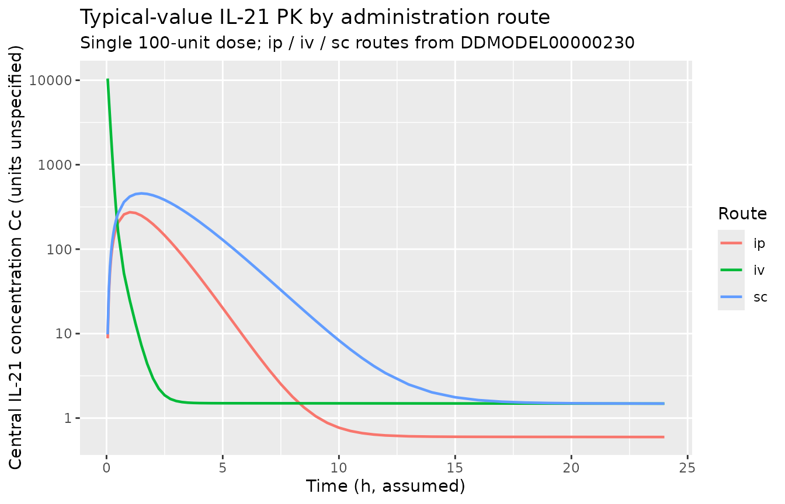
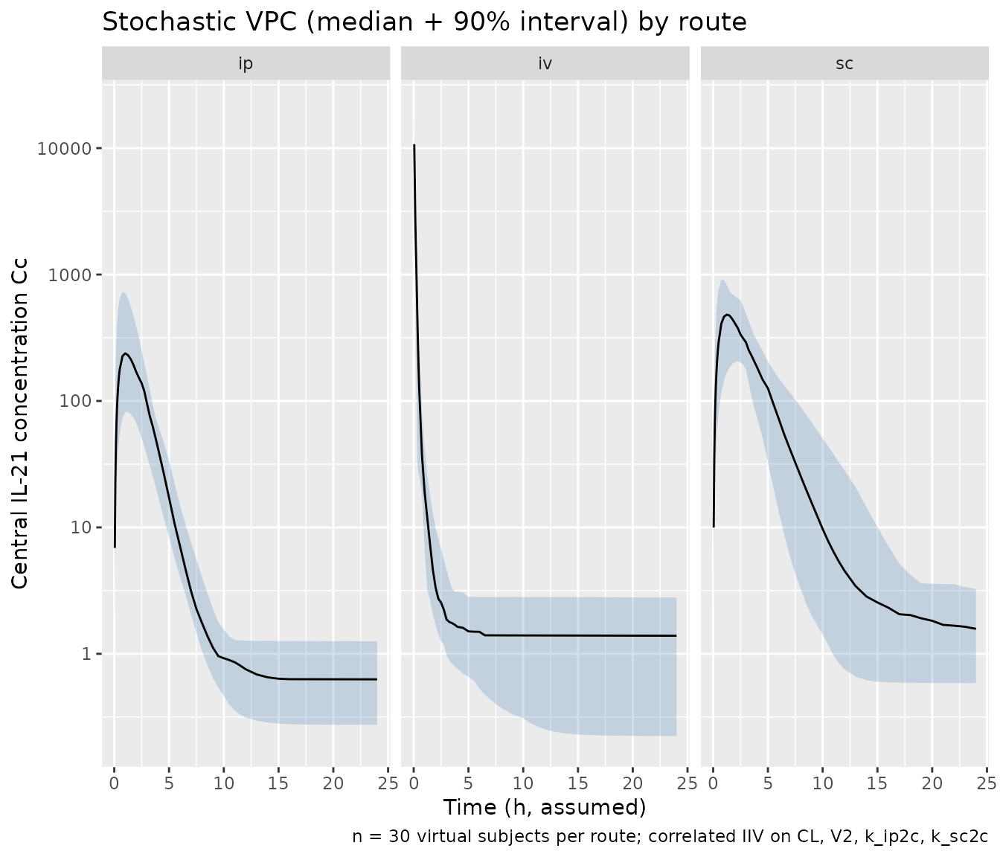
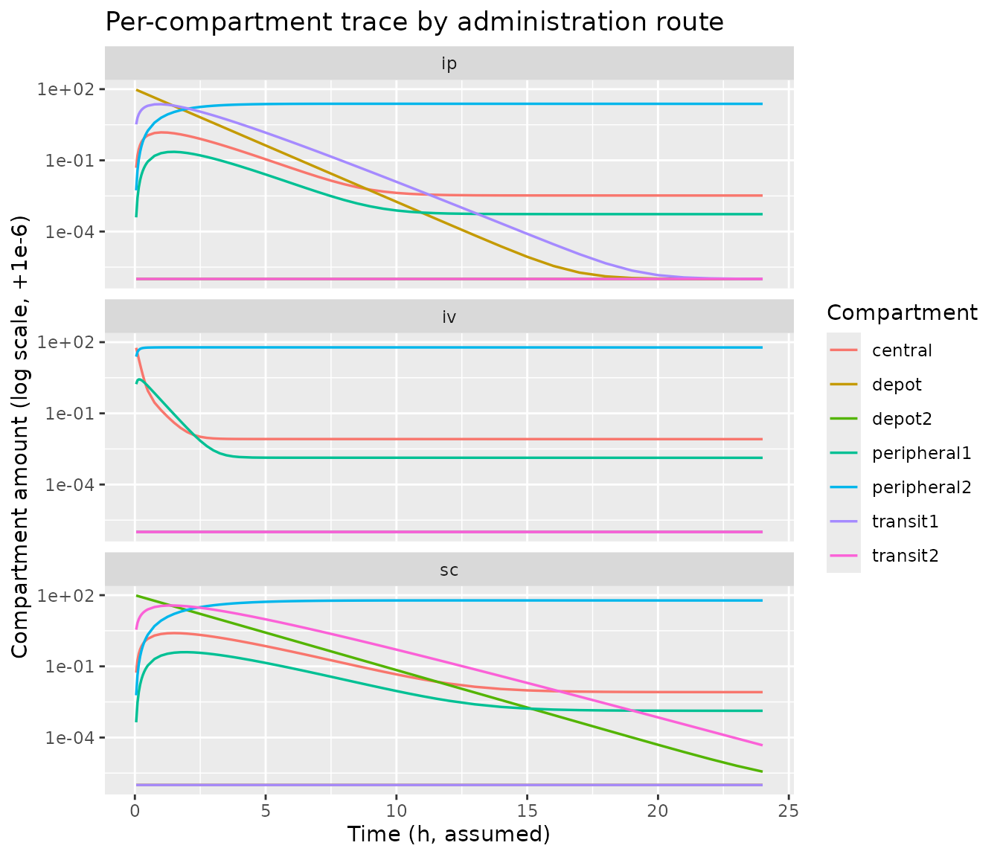

# Recombinant murine IL-21 (Elishmereni 2011)

## Model and source

- Citation: Elishmereni M, Kheifetz Y, Sondergaard H, Overgaard RV, Agur
  Z (2011). An integrated disease/pharmacokinetic/pharmacodynamic model
  suggests improved interleukin-21 regimens validated prospectively for
  mouse solid cancers. PLoS Computational Biology 7(9):e1002206.
  <doi:10.1371/journal.pcbi.1002206>. DDMORE Foundation Model
  Repository: DDMODEL00000230 (simplified Monolix 3.2 re-fit; one
  compartment removed and parameters re-estimated by mixed-effects, per
  Model_Accommodations.txt).
- Description: Preclinical (mouse). Seven-compartment population PK
  model for recombinant murine interleukin-21 (rIL-21) administered by
  intraperitoneal (ip), intravenous (iv), or subcutaneous (sc) routes,
  extracted from the DDMORE Foundation Model Repository
  (DDMODEL00000230). Linear elimination from the central compartment
  plus a direct first-pass loss from the ip depot, parallel ip and sc
  absorption routes each with a single intermediate transit compartment,
  and two peripheral distribution compartments. Saturable transfer terms
  present in the published model (sa0, sa1, sa2) and the sc-depot direct
  elimination rate (k30) are held at zero in the DDMORE deposit, leaving
  an effectively linear system. Per-subject random effects on CL,
  central volume, and the ip and sc absorption rates are correlated as a
  4 x 4 block. Dose route is encoded by the cmt column: ip = depot, iv =
  central, sc = depot2. Units are not declared in the DDMORE bundle (no
  IL_21_PK.csv shipped); see the validation vignette Errata.
- Article: <https://doi.org/10.1371/journal.pcbi.1002206>
- DDMORE Foundation Model Repository entry:
  [DDMODEL00000230](https://repository.ddmore.foundation/model/DDMODEL00000230)

The DDMORE deposit (DDMODEL00000230) is a simplified Monolix 3.2 re-fit
of the PK model published in Elishmereni et al. 2011 (PLoS Computational
Biology). Per the deposit’s `Model_Accommodations.txt` and RDF metadata
(`model-implementation-conforms-to-literature-controlled = "No"`), the
Monolix re-fit removed one compartment from the published model and
re-estimated all parameters by a mixed-effects approach (the original
publication used step-wise least-squares fitting). The original
publication PDF was not on disk during this extraction; parameter values
and equations were taken verbatim from the bundle’s
`IL_21_PK_model.mdl`.

## Population

Recombinant murine interleukin-21 (rIL-21) was administered to mice
across three routes: intraperitoneal (ip, `cmt = "depot"`, source CMT =
1), intravenous (iv, `cmt = "central"`, source CMT = 2), and
subcutaneous (sc, `cmt = "depot2"`, source CMT = 3). The DDMORE
deposit’s RDF description states that the model encompasses melanoma and
renal cell carcinoma settings; the published Elishmereni 2011 paper used
C57BL/6 mice for the in vivo IL-21 PK experiments. Specific cohort
sizes, body weights, and dose levels are not reproduced in the bundle
(the source CSV `IL_21_PK.csv` is not shipped). The same metadata is
available programmatically:

``` r

mod_meta <- readModelDb("Elishmereni_2011_il21")()
str(mod_meta$population, max.level = 1)
#> List of 10
#>  $ species       : chr "mouse (strain not declared in DDMORE bundle; Elishmereni 2011 used C57BL/6 for the in vivo IL-21 PK experiments)"
#>  $ n_subjects    : int NA
#>  $ n_studies     : int NA
#>  $ age_range     : chr NA
#>  $ weight_range  : chr NA
#>  $ sex_female_pct: num NA
#>  $ disease_state : chr "Tumour-bearing and tumour-free mice receiving recombinant murine interleukin-21 (rIL-21) by ip, iv, or sc route"| __truncated__
#>  $ dose_range    : chr "Multiple administration routes (ip, iv, sc); specific dose levels are not reproduced in the DDMORE bundle (the "| __truncated__
#>  $ regions       : chr NA
#>  $ notes         : chr "The DDMORE deposit (DDMODEL00000230) is a simplified Monolix 3.2 re-fit of the original Elishmereni 2011 PK mod"| __truncated__
```

## Source trace

The per-parameter origin is recorded as an in-file comment on each
[`ini()`](https://nlmixr2.github.io/rxode2/reference/ini.html) entry in
`inst/modeldb/ddmore/Elishmereni_2011_il21.R`. The table below collects
them in one place.

| Equation / parameter | Value | Source location |
|----|----|----|
| `lcl` | `log(0.0229)` | `IL_21_PK_model.mdl` parObj STRUCTURAL `POP_cl = 0.0229` |
| `lvc` | `log(0.00551)` | parObj STRUCTURAL `POP_v2 = 0.00551` |
| `lvp` | `log(0.0009)` | parObj STRUCTURAL `POP_v4 = 0.0009` |
| `lvp2` | `log(24.4)` | parObj STRUCTURAL `POP_v5 = 24.4` |
| `lk_ip2c` | `log(0.693)` | parObj STRUCTURAL `POP_q12 = 0.693` |
| `lk_sc2c` | `log(0.727)` | parObj STRUCTURAL `POP_q23 = 0.727` |
| `lk_c2p1` | `log(0.48)` | parObj STRUCTURAL `POP_q24 = 0.48` |
| `lk_c2p2` | `log(6.38)` | parObj STRUCTURAL `POP_q25 = 6.38` |
| `lk_ipelim` | `log(0.4)` | parObj STRUCTURAL `POP_k10 = 0.4` |
| `propSd` | `0.00975` | parObj STRUCTURAL `b = 0.00975` |
| IIV correlated block | sd = (0.407, 0.74, 0.235, 0.304); corr off-diagonals (-0.27, 0.10, -0.29, 0.12, -0.28, 0.10) | parObj VARIABILITY `omega_cl/omega_v2/omega_q12/omega_q23` and OMEGA `type is corr` |
| 7-compartment ODE | n/a | mdlObj MODEL_PREDICTION DEQ block (lines 160-168) of `IL_21_PK_model.mdl` |
| Observation `Cc` | `central / vc` | mdlObj MODEL_PREDICTION `output1 = A2 / v2` |
| Residual error form | proportional | mdlObj OBSERVATION `Y = proportionalError(proportional = b, eps = EPS_Y, prediction = output1)` |

The structural-parameter and IIV values use the .mdl `value = ...`
entries directly; per DDMORE deposit convention these are the final
fitted Monolix 3.2 estimates rather than initial values. No
`Output_real_*.lst` is shipped with this bundle (the deposit is a
Monolix run, not NONMEM), so the .mdl / PharmML pair is the only
authoritative source for the point estimates.

## Virtual cohort

The original IL-21 PK observations are not redistributed with the DDMORE
bundle. The figures below use a virtual cohort that exercises each of
the three administration routes at a common nominal dose. Body weight is
not encoded in the model (no covariates are declared in the .mdl), so
the virtual cohort is dose-only.

``` r

set.seed(20260515)

n_per_route <- 30
nominal_dose <- 100  # arbitrary mass units per the DDMORE deposit's unspecified dose unit

obs_grid <- c(
  seq(0, 0.5, by = 0.05),
  seq(0.75, 4, by = 0.25),
  seq(4.5, 12, by = 0.5),
  seq(13, 24, by = 1)
)

make_route <- function(route_label, route_cmt, n, id_offset) {
  rxode2::et(amt = nominal_dose, cmt = route_cmt, time = 0) |>
    rxode2::et(obs_grid) |>
    rxode2::et(id = seq_len(n) + id_offset) |>
    as.data.frame() |>
    dplyr::mutate(route = route_label)
}

events <- dplyr::bind_rows(
  make_route("ip", "depot", n_per_route, id_offset =          0L),
  make_route("iv", "central",  n_per_route, id_offset =   n_per_route),
  make_route("sc", "depot2", n_per_route, id_offset = 2*n_per_route)
)

stopifnot(!anyDuplicated(unique(events[, c("id", "time", "evid")])))
table(events$route, events$evid)
#>     
#>         0    1
#>   ip 1590   30
#>   iv 1590   30
#>   sc 1590   30
```

## Simulation

``` r

mod <- rxode2::rxode2(readModelDb("Elishmereni_2011_il21"))
sim <- rxode2::rxSolve(mod, events = events, keep = "route") |>
  as.data.frame() |>
  dplyr::filter(time > 0)
```

For deterministic replication (the .mdl’s correlated 4 x 4 IIV block can
generate broad spread on the small-volume central concentration), zero
out the random effects:

``` r

mod_typical <- rxode2::zeroRe(mod)
sim_typical <- rxode2::rxSolve(mod_typical, events = events, keep = "route") |>
  as.data.frame() |>
  dplyr::filter(time > 0)
#> ℹ omega/sigma items treated as zero: 'etalcl', 'etalvc', 'etalk_ip2c', 'etalk_sc2c'
#> Warning: multi-subject simulation without without 'omega'
```

## Concentration-time profiles by administration route

The figure below shows typical-value (no IIV) IL-21 central
concentration versus time for the three administration routes following
a single 100-unit dose. The iv profile peaks immediately at dose / V2
then drops sharply because of the small central volume (V2 ~= 5.5 mL in
the deposit’s units), while ip and sc profiles show delayed absorption
peaks at ~1 h.

``` r

sim_typical |>
  dplyr::filter(id == 1 |
                  id == n_per_route + 1 |
                  id == 2 * n_per_route + 1) |>
  ggplot(aes(time, Cc, colour = route)) +
  geom_line(linewidth = 0.8) +
  scale_y_log10() +
  labs(x = "Time (h, assumed)",
       y = "Central IL-21 concentration Cc (units unspecified)",
       title = "Typical-value IL-21 PK by administration route",
       subtitle = paste0("Single ", nominal_dose,
                         "-unit dose; ip / iv / sc routes from DDMODEL00000230"),
       colour = "Route")
```



The stochastic VPC (panel A: full 90% prediction interval; panel B:
typical trajectories from the first three subjects per route) shows the
spread the correlated 4 x 4 IIV block produces:

``` r

vpc <- sim |>
  dplyr::group_by(route, time) |>
  dplyr::summarise(
    Q05 = stats::quantile(Cc, 0.05, na.rm = TRUE),
    Q50 = stats::quantile(Cc, 0.50, na.rm = TRUE),
    Q95 = stats::quantile(Cc, 0.95, na.rm = TRUE),
    .groups = "drop"
  )

ggplot(vpc, aes(time, Q50)) +
  geom_ribbon(aes(ymin = Q05, ymax = Q95), alpha = 0.25, fill = "steelblue") +
  geom_line() +
  facet_wrap(~ route) +
  scale_y_log10() +
  labs(x = "Time (h, assumed)",
       y = "Central IL-21 concentration Cc",
       title = "Stochastic VPC (median + 90% interval) by route",
       caption = paste0("n = ", n_per_route, " virtual subjects per route; correlated IIV on CL, V2, k_ip2c, k_sc2c"))
```



## Compartment-trace audit

To confirm that the 7-compartment topology behaves as the source
describes (parallel ip and sc absorption routes feeding central via
single-stage transit compartments, plus two peripheral distribution
compartments and a direct first-pass loss from the ip depot), the chunk
below traces the amounts in every compartment for one subject per route
under the typical parameter set. All compartments must remain
non-negative; total mass (intact drug + cumulative elimination, here
approximated by the sum across states) declines monotonically because
the only loss sinks are central clearance (`kel`) and the ip-depot
first-pass elimination (`k_ipelim`).

``` r

trace <- sim_typical |>
  dplyr::filter(id == 1 |
                  id == n_per_route + 1 |
                  id == 2 * n_per_route + 1) |>
  dplyr::select(route, time,
                depot, central, depot2, peripheral1, peripheral2,
                transit1, transit2) |>
  tidyr::pivot_longer(-c(route, time), names_to = "compartment", values_to = "amount")

ggplot(trace, aes(time, amount + 1e-6, colour = compartment)) +
  geom_line(linewidth = 0.6) +
  facet_wrap(~ route, ncol = 1) +
  scale_y_log10() +
  labs(x = "Time (h, assumed)",
       y = "Compartment amount (log scale, +1e-6)",
       title = "Per-compartment trace by administration route",
       colour = "Compartment")
```



``` r


stopifnot(all(trace$amount >= -1e-9))
```

## F.2 self-consistency check (PKNCA)

The Elishmereni 2011 publication is not on disk in this worktree, so a
side-by-side comparison against published Cmax / AUC / half-life is not
performed. Instead, this section runs PKNCA on the simulated cohort and
records the typical-value NCA summaries by route as a self-consistency
record. Re-running the vignette in the future under any code change in
nlmixr2lib / rxode2 / nlmixr2 should reproduce these numbers within
numerical tolerance.

``` r

nca_dose <- events |>
  dplyr::filter(evid == 1) |>
  dplyr::select(id, time, amt, treatment = route)

nca_conc <- sim |>
  dplyr::filter(!is.na(Cc), Cc > 0) |>
  dplyr::select(id, time, Cc, treatment = route)

conc_obj <- PKNCA::PKNCAconc(nca_conc, Cc ~ time | treatment + id)
dose_obj <- PKNCA::PKNCAdose(nca_dose, amt ~ time | treatment + id)

intervals <- data.frame(
  start      = 0,
  end        = 24,
  cmax       = TRUE,
  tmax       = TRUE,
  auclast    = TRUE,
  aucinf.obs = TRUE,
  half.life  = TRUE
)

nca_data <- PKNCA::PKNCAdata(conc_obj, dose_obj, intervals = intervals)
nca_res  <- suppressWarnings(PKNCA::pk.nca(nca_data))
#>  ■■■■■■■■■■■■■■■■■■■■■■■■■■■■■     93% |  ETA:  0s

nca_summary <- summary(nca_res)
knitr::kable(nca_summary,
             caption = "Simulated NCA parameters by administration route (DDMODEL00000230 self-consistency).")
```

| start | end | treatment | N | auclast | cmax | tmax | half.life | aucinf.obs |
|---:|---:|:---|:---|:---|:---|:---|:---|:---|
| 0 | 24 | ip | 30 | NC | 239 \[76.8\] | 1.00 \[0.750, 1.50\] | 1320 \[406\] | NC |
| 0 | 24 | iv | 30 | NC | 9540 \[55.3\] | 0.0500 \[0.0500, 0.0500\] | 1340 \[459\] | NC |
| 0 | 24 | sc | 30 | NC | 440 \[54.1\] | 1.50 \[0.750, 3.00\] | 695 \[615\] | NC |

Simulated NCA parameters by administration route (DDMODEL00000230
self-consistency). {.table style="width:100%;"}

## Assumptions and deviations

- **DDMORE deposit vs. publication.** The DDMORE entry (DDMODEL00000230)
  is a simplified Monolix 3.2 re-fit of the model published in
  Elishmereni et al. 2011 PLoS Computational Biology 7(9):e1002206. Per
  the deposit’s `Model_Accommodations.txt`, the original Elishmereni
  2011 work estimated parameters by step-wise least-squares fitting; the
  DDMORE deposit removed one compartment and re-estimated all parameters
  simultaneously by mixed-effects under several candidate models,
  selecting the present one for “best performance and robustness (low
  Akaike information criterion, low condition number, minimal residual
  errors)”. Numerical parameter values therefore differ from any table
  the original paper reports. The deposit’s RDF metadata sets
  `model-implementation-conforms-to-literature-controlled = "No"` and
  `model-origin-of-code-in-literature-controlled = "No"`, so that
  divergence is the deposit’s intent rather than a transcription error.
- **Publication PDF not on disk.** The Elishmereni 2011 PDF was not
  available in `/home/bill/gitlab/nlmixr2lib_ingestion/` during the
  extraction. No external cross-check against the published parameter
  tables (Table 1 / supplementary material) was performed; an external
  comparison would only test conformance to the Monolix re-fit values
  reported in the DDMORE bundle, since those are what the bundle
  actually carries. Any future re-extraction with the publication on
  disk should record the original-publication values in the model file’s
  `notes` and document any irreconcilable differences here.
- **No `Output_real_*.lst` shipped.** The DDMORE bundle for
  DDMODEL00000230 contains only the .mdl, the rendered PharmML .xml, the
  RDF metadata, and `Model_Accommodations.txt`; no NONMEM listing, no
  Monolix output directory, and no source CSV (`IL_21_PK.csv` is
  referenced in the .mdl `dataObj`’s `srcfile` but not shipped). The
  parameter values are therefore the .mdl `value = ...` entries, which
  in DDMORE deposit convention are the final fitted Monolix point
  estimates rather than initial guesses.
- **Vestigial parameters omitted.** Six parameters present in the .mdl
  are inert in the DDMORE deposit and are not carried into
  [`ini()`](https://nlmixr2.github.io/rxode2/reference/ini.html):
  `POP_v1` (= 0.001) and `POP_v3` (= 0.001) are placeholder volumes that
  never appear in the MODEL_PREDICTION rate equations; `POP_k30` (= 0)
  is the sc-depot direct elimination rate; `POP_sa1`, `POP_sa2`,
  `POP_sa0` (all 0) are saturable-transfer scalars whose
  `1 / (1 + A * sa)` factors collapse to 1 when sa = 0. Carrying them as
  `fixed(0)` would either be unused or invalid (zero-variance etas are
  not allowed in nlmixr2), so they are omitted with the structural
  consequence documented in the model file’s `description` and in this
  vignette. The 7-compartment topology and the 4-eta IIV block are
  preserved exactly.
- **Units.** The .mdl declares no units on any parameter, and the
  `IL_21_PK.csv` source dataset is not shipped, so the time / dose /
  concentration units are taken as “unspecified” in the model file’s
  `units` slot. The figures and PKNCA tables in this vignette label time
  as “h, assumed” because the parameter magnitudes (`POP_q12 ~= ln(2)`,
  `POP_k10 = 0.4`) are consistent with rate constants in 1/h for a
  typical mouse PK study, but this assumption is not verified against
  the publication.
- **Covariates.** None. The .mdl explicitly states “Covariate model: no
  covariate model” in its header comment.
- **Validation strategy.** Per `references/verification-checklist.md`
  section F.2, the F-section PKNCA / publication-figure replication is
  replaced here by (a) a typical-value concentration-time figure, (b) a
  stochastic VPC by route, (c) a per-compartment trace audit, and (d) a
  PKNCA self-consistency table. There is no published Cmax / AUC /
  half-life table to compare against without the publication on disk.
